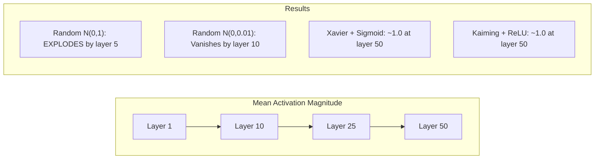
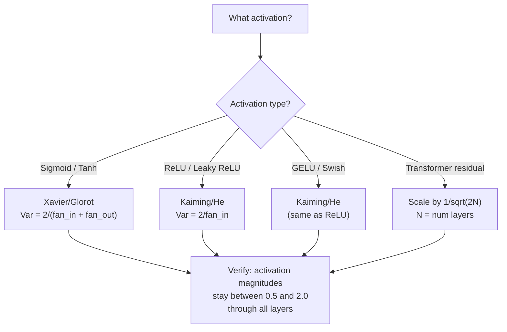

# Đánh nặng khởi động và tập luyện ổn định .

> Bắt đầu sai và đào tạo không bao giờ bắt đầu. Bắt đầu đúng và 50 lớp đào tạo như một cách trơn tru như 3.

> **【中文解读】**Sự khởi đầu sai, tập luyện không bao giờ bắt đầu  50 tầng mạng tín hiệu  归零要爆炸  初始化对抗, 50 tầng tập luyện và 3 tầng như bình滑 Xavier sự khởi đầu                                                                                                                                                                                                                                     

**Type:** Build
**Languages:** Python
**Prerequisites:** Lesson 03.04 (Activation Functions), Lesson 03.07 (Regularization)
**Time:** ~90 minutes

## Mục tiêu học tập

- Thực hiện chiến lược khởi tạo không, ngẫu nhiên, Xavier/Glorot và Kaiming/He và đo tác động của chúng lên quy mô kích hoạt thông qua 50 lớp
- Thuộc dẫn tại sao Xavier init sử dụng Var(w) = 2/(fan_in + fan_out) và Kaiming sử dụng Var(w) = 2/fan_in
- Hiển thị vấn đề đối xứng với zero khởi đầu và giải thích tại sao chỉ có thang số ngẫu nhiên là không đủ
- Hợp tác chiến lược khởi động chính xác với chức năng kích hoạt: Xavier cho sigmoid/tanh, Kaiming cho ReLU/GELU

> **【中文解读】**Chương 3: Làm thế nào để chọn quyền lực đầu tiên, để tín hiệu trong 50 tầng mạng không biến mất hoặc nổ.

## Vấn đề  vấn đề giới thiệu

Khi bắt đầu tất cả trọng lượng lên đến 0, không có gì học được. Mỗi tế bào thần kinh tính toán cùng một chức năng, nhận được cùng một gradient, và cập nhật giống nhau. Sau 10.000 thời đại, lớp ẩn của 512 tế bào thần kinh của bạn vẫn là 512 bản sao của cùng một tế bào thần kinh. Bạn đã trả tiền cho 512 tham số và nhận được 1.

> Để có được quyền tái khởi tạo thành zero. Mỗi thần kinh tính toán cùng một hàm, nhận cùng một bậc, theo cùng một cách cập nhật. Sau 10.000 kỷ nguyên, 512 thần kinh của bạn vẫn là 512 bản sao của cùng một thần kinh. Bạn đã trả giá cho 512 các số liệu, nhưng chỉ nhận được 1 .

Khi các kích hoạt phát nổ qua mạng, bằng lớp 10, giá trị đạt 1e15.

> Sự khởi đầu quá lớn. Giá trị hoạt động trong mạng nổ. Đến tầng 10, giá trị đạt 1e15. đến tầng 20, chúng tràn ra vô tận.

Đổi đầu chúng theo cách ngẫu nhiên từ một phân bố bình thường tiêu chuẩn. Nó hoạt động cho 3 lớp. Ở 50 lớp, tín hiệu sụp đổ xuống mức không hoặc nổ ra vô tận tùy thuộc vào việc thang đo ngẫu nhiên có quá nhỏ hoặc quá lớn. Biên giới giữa "làm việc" và "sụp đổ" mỏng như gạo.

> Từ chuẩn định dạng phân bố theo thời gian bắt đầu. 3 tầng có thể làm việc. 50 tầng, tín hiệu 缩 thành 0 hoặc bùng nổ thành vô hạn lớn, phụ thuộc vào quy mô theo thời gian là nhỏ hoặc nhỏ. Biên giới giữa "bảo" và "sự hư hỏng" là rất yếu.

Việc khởi tạo trọng lượng là quyết định bị đánh giá thấp nhất trong học tập sâu. Kiến trúc nhận được các bài báo. Những người tối ưu hóa nhận được các bài đăng trên blog. Việc khởi tạo nhận được một ghi chú chân. Nhưng sai lầm và không có gì khác quan trọng - mạng lưới của bạn đã chết trước khi bắt đầu đào tạo.

> 权重初始化 là quyết định bị đánh giá thấp nhất trong học tập sâu. 架构能发文――优化器能写博客――初始化 chỉ có thể nhận được một điểm chú ý.

> **【中文解读】**Sự khởi tạo là một trong những quyết định bị đánh giá thấp nhất trong học tập sâu. Sự khởi tạo không dẫn đến sự đối xứng (tất cả các thứ giống như trong học thần kinh), sự khác biệt về cách khởi tạo theo thời gian sẽ dẫn đến sự biến mất hoặc nổ 50 tầng tín hiệu mạng. Xavier và Kaiming đã giải quyết vấn đề này thông qua thuyết toán.

> **【拓展：GPT-2 的残差缩放技巧】**GPT-2  giới thiệu 1/sqrt(2N) của残差缩放(N là số tầng)。 mỗi残差连接 x = x + tiểu tầng(x) thành phố tăng khoảng cách,126 tầng của Llama 3 会让方差增长 126 倍──缩缩因子让方差保持稳定── kỹ thuật này hiện đang được sở hữu Transformer 采用──

## Khái niệm cốt lõi

### Vấn đề đối xứng với nhau

Mỗi neuron trong một lớp có cấu trúc tương tự: nhân đầu vào bằng trọng lượng, thêm thiên vị, áp dụng kích hoạt. Nếu tất cả trọng lượng bắt đầu ở cùng một giá trị (không là trường hợp cực đoan), mỗi neuron tính toán cùng một đầu ra. Trong quá trình phát triển ngược, mỗi neuron nhận được cùng một gradient. Trong giai đoạn cập nhật, mỗi neuron thay đổi bằng cùng một số lượng.

> Mỗi dây thần kinh trong một tầng có cấu trúc giống nhau: nhập nhân trọng lượng, tăng trọng lượng, ứng dụng chức năng kích hoạt. Nếu trọng lượng của tất cả bắt đầu từ cùng một giá trị, mỗi dây thần kinh tính toán cùng một đầu ra. Trong quá trình truyền ngược, mỗi dây thần kinh nhận được cùng một thang độ. Trong giai đoạn cập nhật, mỗi dây thần kinh có cùng một lượng thay đổi.

Bạn bị kẹt. Mạng lưới có hàng trăm tham số, nhưng tất cả chúng di chuyển theo bước khóa. Điều này được gọi là đối xứng, và sự khởi tạo ngẫu nhiên là cách phá vỡ nó. Mỗi tế bào thần kinh bắt đầu ở một điểm khác nhau trong không gian trọng lượng, vì vậy mỗi tế bào học được một tính năng khác nhau.

> Bạn bị mắc kẹt. Mạng có hàng trăm tham số, nhưng chúng đều cùng nhau di chuyển. Điều này được gọi là đối称性, có thể bắt đầu là cách phá vỡ nó. Mỗi thần kinh bắt đầu từ các điểm khác nhau trong không gian trọng lượng, do đó mỗi thần kinh học được các đặc điểm khác nhau.

Nhưng "thình tự" không đủ. * quy mô * của sự ngẫu nhiên xác định xem mạng lưới tàu.

> Nhưng "điều tự nhiên" cũng không đủ.

### Sự lan truyền biến thể qua các lớp 

Hãy xem xét một lớp duy nhất với đầu vào fan_in:

> Xem xét một người hâm mộ trong một lớp:

```
z = w1*x1 + w2*x2 + ... + w_n*x_n
```

Nếu mỗi trọng lượng wi được rút ra từ phân bố với sự biến động Var(w) và mỗi input xi có sự biến động Var(x), sự biến động đầu ra là:

> Nếu mỗi trọng lượng từ từ khác nhau là phân bố của Var(w), mỗi nhập xi của khác nhau là Var(x), xuất khẩu khác nhau là:

```
Var(z) = fan_in * Var(w) * Var(x)
```

Nếu Var(w) = 1 và fan_in = 512, sự biến động đầu ra là 512x sự biến động đầu vào. Sau 10 lớp: 512 ^ 10 = 1.2e27. tín hiệu của bạn đã nổ ra.

> Nếu Var(w) = 1 và fan_in = 512,输出差差是输入差的 512 倍──10 层后:512^10 = 1.2e27── tín hiệu của bạn đã nổ──

Nếu Var ((w) = 0,001, sự biến động đầu ra sẽ giảm 0,001 * 512 = 0,512 cho mỗi lớp. Sau 10 lớp: 0.512 ^ 10 = 0,00013. tín hiệu của bạn đã biến mất.

> Nếu Var(w) = 0,001,输出方差 mỗi层缩小 0.001 * 512 = 0.512──10 层后:0.512^10 = 0.00013── tín hiệu của bạn đã biến mất──

Mục tiêu: chọn Var(w) để Var(z) = Var(x). Độ lớn tín hiệu vẫn không đổi trên các lớp.

> 目标: chọn Var(w) 使 Var(z) = Var(x) ――信号幅度逐层保持恒定──

> **【中文解读】**方差传播的数学:Var(z) = fan_in * Var(w) * Var(x)。 Nếu fan_in=512 且 Var(w) =1,输出方差是输入的 512 倍──10 层后:512^10 = 1.2e27,信号爆炸──Xavier 和 Kaiming 的目标都是让 Var(z) = Var(x),使信号幅度逐层保持恒定──

### Xavier/Glorot khởi tạo

Glorot and Bengio (2010) đã lấy giải pháp cho các hoạt động sigmoid và tanh. Để giữ sự khác biệt liên tục trong cả đường đi về phía trước và ngược:

> Glorot 和 Bengio (2010) 推导 sigmoid 和 tanh 激活函数的解──为了在前向和反向传播中保持方差恒定:

```
Var(w) = 2 / (fan_in + fan_out)
```

Trong thực tế, trọng lượng được lấy từ:

> 实践中,权重从以下分布抽取:

```
w ~ Uniform(-limit, limit)  where limit = sqrt(6 / (fan_in + fan_out))
```

hoặc:

```
w ~ Normal(0, sqrt(2 / (fan_in + fan_out)))
```

Điều này hoạt động bởi vì sigmoid và tanh gần như tuyến tính gần bằng không, nơi hoạt động được khởi động đúng cách sống.

> Điều này là có hiệu quả, bởi vì sigmoid 和 tanh ở gần zero gần gần là tuyến tính, và giá trị kích hoạt của sự khởi động chính xác thực sự sống gần zero.

### Kaiming / Anh ấy bắt đầu

ReLU tiêu diệt một nửa các đầu ra (tất cả mọi thứ tiêu cực trở thành không). Fan_in hiệu quả được giảm một nửa bởi vì trung bình một nửa các đầu vào được đánh giá bằng không. Xavier init không tính toán cho điều này - nó đánh giá thấp sự khác biệt cần thiết.

> ReLU sẽ giảm một nửa đầu ra và đặt tất cả các giá trị tiêu cực thành 0 ().

He et al. (2015) đã điều chỉnh công thức:

> He 等人 (2015) 调整了公式:

```
Var(w) = 2 / fan_in
```

Các trọng lượng được lấy từ:

> 权重从以下分布抽取:

```
w ~ Normal(0, sqrt(2 / fan_in))
```

Tỷ lệ 2 bù đắp cho ReLU làm nạc một nửa các hoạt động. Nếu không có nó, tín hiệu thu hẹp khoảng 0,5x cho mỗi lớp. Với 50 lớp: 0,5^50 = 8,8e-16. Kaiming init ngăn chặn điều này.

> Vì 2  bù đắp ReLU sẽ đặt một nửa giá trị kích hoạt 零── không có nó, tín hiệu mỗi tầng giảm khoảng 0,5 倍──50 层后:0.5^50 = 8.8e-16── Kaiming khởi động ngăn chặn tình huống này──

> **【拓展：PyTorch 的默认初始化】**PyTorch của nn.Linear 默认使用 Kaiming Uniform 初始化(`nn.init.kaiming_uniform_`,mode='fan_in'), cộng tác với âm_squope=sqrt của LeakyReLU (từ 5 đến 5), có nghĩa là khi bạn viết`nn.Linear(784, 256)`时,PyTorch đã giúp bạn chọn tốt khởi nghiệp. Nhưng tự định cấu trúc Transformer 混合专家模型) cần phải được điều chỉnh.

### Transformer khởi động

GPT-2 đã đưa ra một mô hình khác. Các kết nối dư thừa thêm đầu ra của mỗi tầng phụ vào đầu vào của nó:

> GPT-2 giới thiệu một mô hình khác nhau.

```
x = x + sublayer(x)
```

Mỗi sự bổ sung làm tăng sự biến động. Với N lớp dư thừa, sự biến động tăng tương ứng với N. GPT-2 quy mô trọng lượng của các lớp dư bằng 1/sqrt(2N), nơi N là số lượng các lớp. Điều này giữ cho cường độ tín hiệu tích lũy ổn định.

> Mỗi lần tăng đều tăng khoảng cách. Có N 个差层, khoảng cách theo N 成比例 tăng. GPT-2 sẽ giảm trọng lượng của lớp dư lượng 1/sqrt(2N), trong đó N là số lượng lớp. Điều này giữ vững độ ổn định của độ dài tín hiệu tích lũy.

Llama 3 (405B tham số, 126 lớp) sử dụng một kế hoạch tương tự. Nếu không có quy mô này, dòng dư sẽ phát triển không giới hạn thông qua 126 lớp chú ý và các khối chuyển tiếp.

> Llama 3(4050 亿参数,126层) sử dụng các giải pháp tương tự. Không có sự thu hẹp như vậy, sự phân biệt sẽ được thông qua 126 tầng chú ý và khối lượng không giới hạn tăng trưởng.

> **【拓展：混合专家模型（MoE）的初始化挑战】**Mixtral 8x7B 和 GPT-4 等模型 sử dụng MoE 架构, mỗi token chỉ kích hoạt phần chuyên gia。 khởi động cần đảm bảo: trọng lượng ban đầu của bộ đường không thể khiến tất cả các token đều chọn cùng một chuyên gia。

```mermaid
flowchart TD
    subgraph "Zero Init"
        Z1["Layer 1<br/>All weights = 0"] --> Z2["Layer 2<br/>All neurons identical"]
        Z2 --> Z3["Layer 3<br/>Still identical"]
        Z3 --> ZR["Result: 1 effective neuron<br/>regardless of width"]
    end

    subgraph "Xavier Init"
        X1["Layer 1<br/>Var = 2/(fan_in+fan_out)"] --> X2["Layer 2<br/>Signal stable"]
        X2 --> X3["Layer 50<br/>Signal stable"]
        X3 --> XR["Result: Trains with<br/>sigmoid/tanh"]
    end

    subgraph "Kaiming Init"
        K1["Layer 1<br/>Var = 2/fan_in"] --> K2["Layer 2<br/>Signal stable"]
        K2 --> K3["Layer 50<br/>Signal stable"]
        K3 --> KR["Result: Trains with<br/>ReLU/GELU"]
    end
```



### Tăng cường kích hoạt Qua 50 lớp . 50 lớp kích hoạt độ thử nghiệm



### Chọn đúng sự khởi đầu



## Hãy xây dựng nó.
```figure
weight-init-variance
```

## Hãy xây dựng nó

> **【中文解读】**实验设计:让信号通过50层网络,测量每层的激活幅度──零初始化 → 所有神经元相同;随机 N(0,1) → 爆炸;随机 N(0,0.01) → 消失;Xavier+tanh / Kaiming+ReLU → 稳定──

### Bước 1: Chiến lược khởi động.

Bốn cách để khởi tạo một số liệu vật nặng. Mỗi trả lại một danh sách danh sách (một số liệu vật 2D) với các cột fan_in và hàng fan_out.

> 4 cách khởi tạo trọng lực矩阵.

```python
import math
import random


def zero_init(fan_in, fan_out):
    return [[0.0 for _ in range(fan_in)] for _ in range(fan_out)]


def random_init(fan_in, fan_out, scale=1.0):
    return [[random.gauss(0, scale) for _ in range(fan_in)] for _ in range(fan_out)]


def xavier_init(fan_in, fan_out):
    std = math.sqrt(2.0 / (fan_in + fan_out))
    return [[random.gauss(0, std) for _ in range(fan_in)] for _ in range(fan_out)]


def kaiming_init(fan_in, fan_out):
    std = math.sqrt(2.0 / fan_in)
    return [[random.gauss(0, std) for _ in range(fan_in)] for _ in range(fan_out)]
```

### Bước 2: Cấp hoạt chức năng Bước 2: Cấp hoạt chức năng

Chúng ta cần sigmoid, tanh, và ReLU để kiểm tra mỗi chiến lược init với kích hoạt dự định của nó.

> Chúng tôi cần sigmoid, tanh và ReLU để kiểm tra các chiến lược khởi tạo và các kết hợp của các hàm kích hoạt ứng phó.

```python
def sigmoid(x):
    x = max(-500, min(500, x))
    return 1.0 / (1.0 + math.exp(-x))


def tanh_act(x):
    return math.tanh(x)


def relu(x):
    return max(0.0, x)
```

### Bước 3: Tiếp tục đi qua 50 lớp.

Chuyển dữ liệu ngẫu nhiên qua một mạng sâu và đo mức kích hoạt trung bình ở mỗi lớp.

> sẽ có dữ liệu thông qua mạng lưới sâu, đo lường mức kích hoạt trung bình của mỗi tầng.

```python
def forward_deep(init_fn, activation_fn, n_layers=50, width=64, n_samples=100):
    random.seed(42)
    layer_magnitudes = []

    inputs = [[random.gauss(0, 1) for _ in range(width)] for _ in range(n_samples)]

    for layer_idx in range(n_layers):
        weights = init_fn(width, width)
        biases = [0.0] * width

        new_inputs = []
        for sample in inputs:
            output = []
            for neuron_idx in range(width):
                z = sum(weights[neuron_idx][j] * sample[j] for j in range(width)) + biases[neuron_idx]
                output.append(activation_fn(z))
            new_inputs.append(output)
        inputs = new_inputs

        magnitudes = []
        for sample in inputs:
            magnitudes.append(sum(abs(v) for v in sample) / width)
        mean_mag = sum(magnitudes) / len(magnitudes)
        layer_magnitudes.append(mean_mag)

    return layer_magnitudes
```

### Bước 4: Lễ nghiệm. Bước 4: Lễ nghiệm.

Thực hiện tất cả các kết hợp: zero init, random N(0,1), random N(0,0.01), Xavier với sigmoid, Xavier với tanh, Kaiming với ReLU. Bác kích ở các lớp khóa.

> 运行所有组合:零初始化、随机 N(0,1)、随机 N(0,0.01)、Xavier + sigmoid、Xavier + tanh、Kaiming + ReLU。打印关键层的幅度──

```python
def run_experiment():
    configs = [
        ("Zero init + Sigmoid", lambda fi, fo: zero_init(fi, fo), sigmoid),
        ("Random N(0,1) + ReLU", lambda fi, fo: random_init(fi, fo, 1.0), relu),
        ("Random N(0,0.01) + ReLU", lambda fi, fo: random_init(fi, fo, 0.01), relu),
        ("Xavier + Sigmoid", xavier_init, sigmoid),
        ("Xavier + Tanh", xavier_init, tanh_act),
        ("Kaiming + ReLU", kaiming_init, relu),
    ]

    print(f"{'Strategy':<30} {'L1':>10} {'L5':>10} {'L10':>10} {'L25':>10} {'L50':>10}")
    print("-" * 80)

    for name, init_fn, act_fn in configs:
        mags = forward_deep(init_fn, act_fn)
        row = f"{name:<30}"
        for idx in [0, 4, 9, 24, 49]:
            val = mags[idx]
            if val > 1e6:
                row += f" {'EXPLODED':>10}"
            elif val < 1e-6:
                row += f" {'VANISHED':>10}"
            else:
                row += f" {val:>10.4f}"
        print(row)
```

### Bước 5: Phản ứng đối xứng.

Hãy chứng minh rằng 0 init tạo ra các tế bào thần kinh giống nhau.

> 展示零初始化产生完全相同的神经.

```python
def symmetry_demo():
    random.seed(42)
    weights = zero_init(2, 4)
    biases = [0.0] * 4

    inputs = [0.5, -0.3]
    outputs = []
    for neuron_idx in range(4):
        z = sum(weights[neuron_idx][j] * inputs[j] for j in range(2)) + biases[neuron_idx]
        outputs.append(sigmoid(z))

    print("\nSymmetry Demo (4 neurons, zero init):")
    for i, out in enumerate(outputs):
        print(f"  Neuron {i}: output = {out:.6f}")
    all_same = all(abs(outputs[i] - outputs[0]) < 1e-10 for i in range(len(outputs)))
    print(f"  All identical: {all_same}")
    print(f"  Effective parameters: 1 (not {len(weights) * len(weights[0])})")
```

### Bước 6: Báo cáo độ lớn từng lớp.

Bác in một biểu đồ thanh hình ảnh của kích hoạt quy mô thông qua 50 lớp.

> 印 50层 kích hoạt幅度的可视化条形图.

```python
def magnitude_report(name, magnitudes):
    print(f"\n{name}:")
    for i, mag in enumerate(magnitudes):
        if i % 5 == 0 or i == len(magnitudes) - 1:
            if mag > 1e6:
                bar = "X" * 50 + " EXPLODED"
            elif mag < 1e-6:
                bar = "." + " VANISHED"
            else:
                bar_len = min(50, max(1, int(mag * 10)))
                bar = "#" * bar_len
            print(f"  Layer {i+1:3d}: {bar} ({mag:.6f})")
```

## Hãy sử dụng nó để thực hiện

> **【中文解读】**PyTorch 内置 `nn.init.xavier_uniform_``nn.init.kaiming_normal_`等函数──nn.Linear 默认使用 Kaiming Uniform,所以简单网络"开箱即用"──但自定义架构需要手动调用这些函数──

PyTorch cung cấp các chức năng tích hợp như sau:

> PyTorch sẽ cung cấp các chức năng này như:

```python
import torch
import torch.nn as nn

layer = nn.Linear(512, 256)

nn.init.xavier_uniform_(layer.weight)
nn.init.xavier_normal_(layer.weight)

nn.init.kaiming_uniform_(layer.weight, nonlinearity='relu')
nn.init.kaiming_normal_(layer.weight, nonlinearity='relu')

nn.init.zeros_(layer.bias)
```

Khi anh gọi`nn.Linear(512, 256)`PyTorch mặc định là Kaiming Uniform Initialisation. Đó là lý do tại sao hầu hết các mạng đơn giản "chỉ làm việc" - PyTorch đã đưa ra sự lựa chọn đúng đắn. Nhưng khi bạn xây dựng kiến trúc tùy chỉnh hoặc đi sâu hơn 20 lớp, bạn cần phải hiểu những gì đang xảy ra và có khả năng thay thế mặc định.

> Khi bạn调用`nn.Linear(512, 256)`Khi,PyTorch 默认使用Kaiming 均初始化──这就是为什么大多数简单网络"开箱即用"PyTorch 已经帮助你做出正确选择──但是当你构建自定义架构或超过20层时,你需要理解正在发生什么并可能覆盖默认值──

Đối với các bộ biến đổi, các mô hình HuggingFace thường xử lý khởi tạo trong các mô hình của họ.`_init_weights`phương pháp. GPT-2 thực hiện quy mô dự đoán dư bằng 1/sqrt ((N). Nếu bạn đang xây dựng một biến thể từ đầu, bạn cần phải thêm nó vào chính mình.

> Đối với Transformer, HuggingFace, mô hình thường được xem như là`_init_weights`方法中处理初始化── GPT-2实现将残差投影缩缩为1/sqrt(N)── nếu bạn từ zero构建变压器, bạn cần tự thêm vào này──

## Chuyển nó đi.

Bài học này mang lại:
- `outputs/prompt-init-strategy.md`-- một lời nhắc đưa ra chẩn đoán các vấn đề khởi tạo trọng lượng và đề xuất chiến lược đúng

> 本课产 出:`outputs/prompt-init-strategy.md`- Một vấn đề về việc chẩn đoán quyền khởi đầu và đưa ra lời khuyên về chiến lược chính xác

## Tập luyện bài tập

1. Thêm khởi tạo LeCun (Var = 1/fan_in, được thiết kế để kích hoạt SELU).

   1. 添加 LeCun 初始化(Var = 1/fan_in,为SELU 激活设计) ・・・用 LeCun 初始化 + tanh 跑 50层实验,和Xavier + tanh đối比──

2. Thực hiện quy mô dư thừa GPT-2: nhân đầu ra của mỗi lớp bằng 1/sqrt(2 *N) trước khi thêm vào dòng dư thừa.

   2. 实现 GPT-2残差缩放:把每层输出乘以1/sqrt(2*N) 再加到残差流──跑 50层有缩放和无缩放,测量残差幅度增速──

3. Tạo một chức năng " kiểm tra sức khỏe init" lấy kích thước lớp và loại kích hoạt của mạng, sau đó khuyến cáo khởi tạo đúng và cảnh báo nếu init hiện tại sẽ gây ra vấn đề.

   3. Tạo hàm "Bắt đầu kiểm tra sức khỏe": nhận mạng cấp độ và kích hoạt loại, đề xuất chính xác khởi động, cảnh báo liệu khởi động hiện tại sẽ dẫn đến vấn đề không.

4. Tiến hành thí nghiệm với fan_in = 16 vs fan_in = 1024. Xavier và Kaiming thích nghi với fan_in, nhưng không.

   4. 用 fan_in = 16 和 fan_in = 1024 跑实验──Xavier 和 Kaiming tự thích ứng với fan_in, nhưng随机初始化不会──展示"能用"和"崩"之间的差异如何随层增大而扩大──

5. Thực hiện khởi tạo trực giác (tạo ra một dải ngẫu nhiên, tính toán SVD của nó, sử dụng dải ngẫu nhiên U). So sánh với Kaiming cho các mạng ReLU ở 50 lớp.

   5. 实现正交初始化(生成随机矩阵,计算 SVD,用正交矩阵 U) ⋅ 在 50 层 ReLU 网络上和 Kaiming 对比──

## Từ khóa  Từ khóa nhanh chóng

| Term | What people say | What it actually means |
|------|----------------|----------------------|
| Weight initialization | "Set starting weights randomly" | The strategy for choosing initial weight values that determines whether a network can train at all |
| Symmetry breaking | "Make neurons different" | Using random initialization to ensure neurons learn distinct features instead of computing identical functions |
| Fan-in | "Number of inputs to a neuron" | The number of incoming connections, which determines how input variance accumulates in the weighted sum |
| Fan-out | "Number of outputs from a neuron" | The number of outgoing connections, relevant for maintaining gradient variance during backpropagation |
| Xavier/Glorot init | "The sigmoid initialization" | Var(w) = 2/(fan_in + fan_out), designed to preserve variance through sigmoid and tanh activations |
| Kaiming/He init | "The ReLU initialization" | Var(w) = 2/fan_in, accounts for ReLU zeroing half the activations |
| Variance propagation | "How signals grow or shrink through layers" | The mathematical analysis of how activation variance changes layer by layer based on weight scale |
| Residual scaling | "GPT-2's init trick" | Scaling residual connection weights by 1/sqrt(2N) to prevent variance growth through N transformer layers |
| Dead network | "Nothing trains" | A network where poor initialization causes all gradients to be zero or all activations to saturate |
| Exploding activations | "Values go to infinity" | When weight variance is too high, causing activation magnitudes to grow exponentially through layers |

| 术语 | 俗称 | 实际含义 |
|------|------|---------|
| Weight initialization / 权重初始化 | "随机设置初始权重" | 选择初始权重值的策略，决定网络能否训练 |
| Symmetry breaking / 对称性破除 | "让神经元不同" | 用随机初始化确保神经元学到不同特征，而不是计算相同函数 |
| Fan-in / 输入连接数 | "神经元的输入数" | 入连接数，决定加权和里输入方差如何累积 |
| Fan-out / 输出连接数 | "神经元的输出数" | 出连接数，与反向传播时保持梯度方差相关 |
| Xavier/Glorot init / Xavier 初始化 | "sigmoid 初始化" | Var(w) = 2/(fan_in + fan_out)，旨在通过 sigmoid/tanh 保持方差 |
| Kaiming/He init / Kaiming 初始化 | "ReLU 初始化" | Var(w) = 2/fan_in，补偿 ReLU 把一半激活置零 |
| Variance propagation / 方差传播 | "信号在层间如何放大或缩小" | 关于激活方差如何基于权重尺度逐层变化的数学分析 |
| Residual scaling / 残差缩放 | "GPT-2 的初始化技巧" | 把残差连接权重缩放 1/sqrt(2N)，防止 N 个 Transformer 层后方差增长 |
| Dead network / 死亡网络 | "什么都不训练" | 初始化不当导致所有梯度为零或所有激活饱和的网络 |
| Exploding activations / 激活爆炸 | "值到无穷" | 权重方差太高，激活幅度在层间指数增长 |

## Xem thêm 延伸阅读

- Glorot & Bengio, "Hiểu được sự khó khăn của việc đào tạo các mạng lưới thần kinh cấp dữ liệu sâu" (2010) - bài báo khởi tạo Xavier ban đầu với phân tích biến thể
  Glorot & Bengio, hiểu đào tạo sâu  Neural Network 困难(2010) 原始 Xavier 初始化论文,包含方差分析
- He et al., "Thắm sâu vào các bộ sửa chữa" (2015) -- giới thiệu khởi tạo Kaiming cho các mạng ReLU
  He 等人,深入研究修正器(2015)为 ReLU 网络引入 Kaiming 初始化
- Radford et al., "Các mô hình ngôn ngữ là người học đa nhiệm không được giám sát" (2019) -- GPT-2 giấy với quy mô dư thừa khởi tạo
  Radford 等人,语言模型是无监督多任务学习器(2019)GPT-2 论文,包含残差缩放初始化
- Mishkin & Matas, "All You Need is a Good Init" (2016) - khởi tạo đơn vị theo trình độ lớp, một lựa chọn thay thế thực nghiệm cho các công thức phân tích
  Mishkin & Matas,You only need a good initiation(2016)层序单位差初始化,解析公式的经验替代方案
