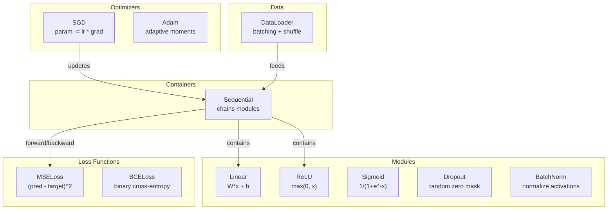
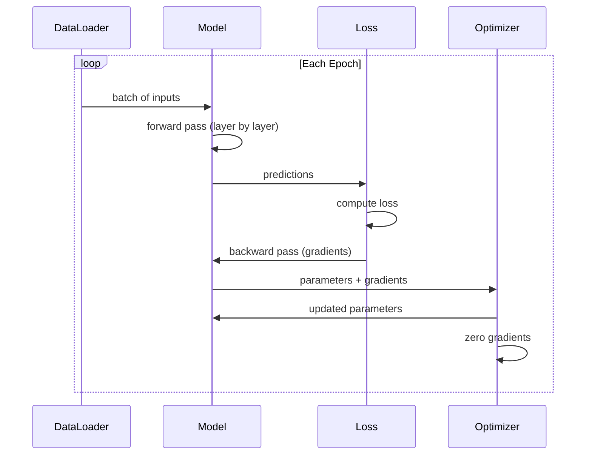
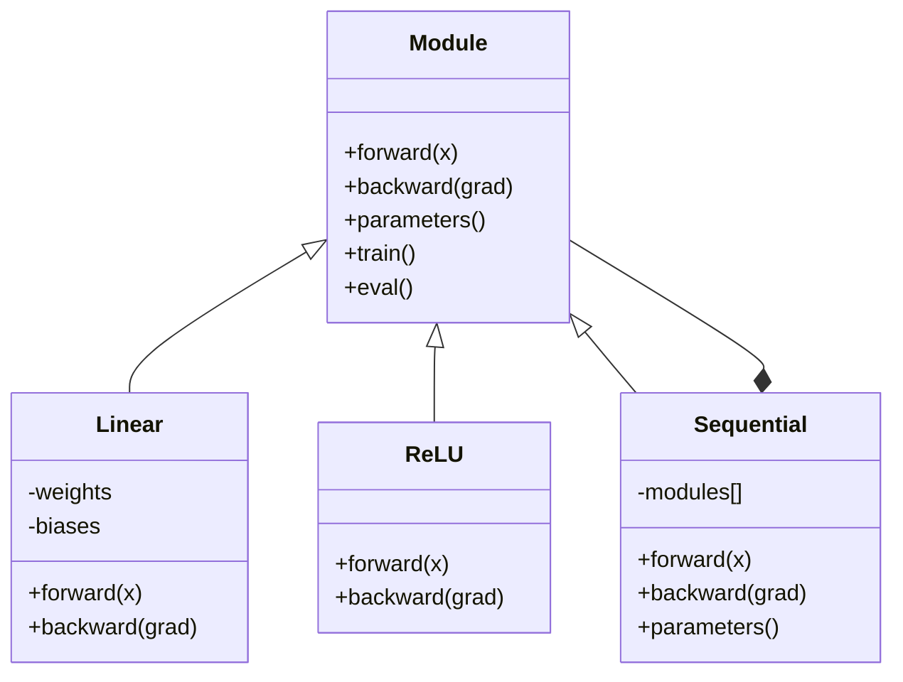

# Hãy xây dựng một khung hình nhỏ của riêng bạn

> Bạn đã xây dựng các tế bào thần kinh, các lớp, mạng lưới, backprop, kích hoạt, hàm mất mát, tối ưu hóa, quy định, khởi tạo, và lịch LR. tất cả như các mảnh riêng biệt. Bây giờ dây chúng cùng nhau vào một khung. không PyTorch. không TensorFlow. của bạn.

> **【中文解读】**Để kết hợp toàn bộ khái niệm của tất cả các khóa học trước đó, chúng ta đã hiểu được các nguyên tắc cơ bản của torch.nn và torch.autograd.

**Type:** Build
**Languages:** Python
**Prerequisites:** All of Phase 03 (Lessons 01-09)
**Time:** ~120 minutes

## Mục tiêu học tập

- Xây dựng một khung học sâu đầy đủ (~ 500 dòng) với Module, Linear, ReLU, Sigmoid, Dropout, BatchNorm, Sequential, hàm mất mát, tối ưu hóa và DataLoader
- Giải thích trừu tượng Module (trên, sau, các tham số) và lý do tại sao việc chuyển đổi chế độ tàu/từ là cần thiết
- Cụm tất cả các thành phần vào một vòng đào tạo làm việc đào tạo một mạng lưới 4 tầng về phân loại vòng tròn
- Bản đồ từng thành phần của framework của bạn với tương đương PyTorch của nó (nn.Module, nn.Sequential, optim.Adam, DataLoader)

> **【中文解读】**本章是Phase 03 的集成章节把前面9 课的所有概念串成一个完整的~500 行框架──核心抽象是模块(前进/后退/参数),对应 PyTorch 的 nn.Module──完成后你会真正理解 PyTorch 每一行代码背后发生的事情──

## Vấn đề  vấn đề giới thiệu

Bạn có mười bài học về các khối xây dựng phân tán trên các tệp riêng biệt.`Value`lớp ở đây, vòng lặp đào tạo ở đó, khởi tạo trọng lượng trong một tập tin khác, lịch học tập ở một tập tin khác. để đào tạo một mạng, bạn sao chép-làm lại từ năm bài học khác nhau và dây chúng cùng nhau bằng tay.

> Bạn có 10 bài học về các mô hình xây dựng nằm trong các tập tin khác nhau.`Value`类, có một vòng tập luyện, một trong các tập tin khác là khởi động trọng lượng, còn một khác là điều chỉnh tỷ lệ học. Để tập luyện một mạng, bạn cần phải sao chép từ 5-6 khóa học khác nhau.

Đó là những gì Framework giải quyết. PyTorch cho bạn`nn.Module`- `nn.Sequential`- `optim.Adam`- `DataLoader`TensorFlow cho bạn một mô hình vòng tập luyện liên kết chúng với nhau.`keras.Layer`- `keras.Sequential`- `keras.optimizers.Adam`Đây không phải là phép thuật, mà là những mô hình tổ chức cho phép xác định, đào tạo và đánh giá mạng lưới mà không phải luôn luôn tái tạo hệ thống ống nước.

> Đó là một vấn đề được giải quyết.`nn.Module``nn.Sequential``optim.Adam``DataLoader`Và sẽ gắn chúng lại với nhau trong mô hình vòng tập luyện.`keras.Layer``keras.Sequential``keras.optimizers.Adam`These are not magic Chúng là mô hình tổ chức, để bạn có thể xác định, đào tạo và đánh giá mạng lưới, không cần phải phát triển lại các đường ống mỗi lần

Bạn sẽ xây dựng cùng một thứ trong khoảng 500 dòng Python. Không numpy. Không phụ thuộc bên ngoài. Một framework có thể xác định bất kỳ mạng feedforward nào, đào tạo nó với SGD hoặc Adam, tập hợp dữ liệu, áp dụng drop-out và batch normalization, sử dụng bất kỳ kích hoạt nào, và lên lịch tốc độ học tập.

> Bạn sẽ sử dụng khoảng 500 行 Python  xây dựng cùng một thứ không cần numpy  không cần phụ thuộc bên ngoài  Một có thể xác định bất kỳ mạng nào trước đây  sử dụng SGD hoặc Adam  đào tạo  xử lý dữ liệu khối lượng  ứng dụng dropout 和批归化  sử dụng bất kỳ hàm kích hoạt nào và điều chỉnh tỷ lệ học

Khi bạn hoàn thành, bạn sẽ hiểu chính xác những gì xảy ra khi bạn viết.`model = nn.Sequential(...)`Tại sao anh lại không biết được.`model.train()`và `model.eval()`Bạn sẽ hiểu tại sao.`optimizer.zero_grad()`Bạn sẽ hiểu tất cả, bởi vì bạn đã xây dựng tất cả.

> Sau khi hoàn thành, bạn sẽ hoàn toàn hiểu được trong PyTorch viết trong`model = nn.Sequential(...)`Khi đã xảy ra chuyện gì... anh sẽ hiểu tại sao.`model.train()`和 `model.eval()`存在――你会理解为什么 `optimizer.zero_grad()`Đó là một cách riêng biệt. Bạn sẽ hiểu được tất cả, bởi vì bạn tự xây dựng tất cả.

> **【中文解读】**Giá trị cốt lõi của framework:把散落的组件统一到一个接口下――Module là nền tảng của mọi thứLinear、ReLU、Dropout、BatchNorm 都是Module──Sequential 是组合模式一堆Module 串起还是一个Module──这与 PyTorch的设计完全一致──

> **【拓展：PyTorch 框架的设计哲学】**Thiết kế cốt lõi của PyTorch chỉ có 5 khái niệm: Tensor (Data) 、nn.Module (Model) 、autograd (Automatic) 、Optimizer (Optimizer) 、优化器 (DataLoader) 、数据加载 (DataLoader) ‒ nhưng đó là 5 khái niệm hỗ trợ GPT-4、Stable Diffusion、AlphaFold等 tất cả các mô hình trước đây của mô hình.

## Khái niệm cốt lõi

### Module Abstraction Module 抽象

Mỗi lớp trong PyTorch đều thừa hưởng từ`nn.Module`Một mô-đun có ba trách nhiệm:

> PyTorch 中 每一层都继承自`nn.Module`Một mô-đun có ba trách nhiệm:

1. **forward()**-- tính toán đầu ra đầu vào được cung cấp
   **forward()**-- 给定输入计算输出
2. **parameters()**- trả lại tất cả các trọng lượng có thể huấn luyện
   **parameters()**-- 返回所有可训练权重
3. **backward()**-- gradient tính toán (được xử lý bởi autograd trong PyTorch, rõ ràng trong của chúng tôi)
   **backward()**-- 计算梯度(PyTorch 中由自动级 处理, trong khuôn khổ của chúng tôi cần phải thực hiện rõ ràng)

Một lớp tuyến tính là một mô-đun. Một kích hoạt ReLU là một mô-đun. Một lớp bỏ rơi là một mô-đun. Một lớp bình thường hóa lô là một mô-đun. Tất cả chúng đều có giao diện tương tự.

> Linear layer là một Module。ReLU 激活 là một Module。Dropout layer là một Module。BatchNorm layer là một Module。 chúng có cùng một giao tiếp。

### Cụ thể chứa hàng loạt

`nn.Sequential`Các chuỗi Module. chuyển tiếp: dữ liệu cấp dữ liệu thông qua Module 1, sau đó Module 2, sau đó Module 3. chuyển tiếp ngược: đảo ngược chuỗi. Bảng chứa chính nó là một Module -- nó có forward(), tham số(), và ngược lại(). Đây là mô hình tổng hợp: một chuỗi Module chính nó là một Module.

> `nn.Sequential`将模块 串联起来──前向传播:数据流过模块 1、然后模块 2、然后模块 3──反向传播:反向遍历链──容器本身也是一个模块它有前 (),参数() 和后 (() ;;这是组合模式:模块序列本身也是一个模块──

> **【拓展：真实框架的额外功能】**Bạn có thể tìm thấy các hệ thống tự động tự động (không cần phải viết tay ngược); 2) GPU hỗ trợ (CUDA 内存管理和内核调度); 3) phân bố (分布式训练) (DDP、FSDP、DeepSpeed); 4) 混合精度训练 (混合精度训练) (AMP); 5) mô hình (模型序列化) (state_dict + save/load) (PyTorch có kho mã hơn 100 triệu dòng, nhưng các mô hình trung tâm vẫn đang thực hiện được 5 cái này).

### Trình hình đào tạo và đánh giá

Giảm học ngẫu nhiên phân số các tế bào thần kinh trong quá trình đào tạo nhưng vượt qua tất cả mọi thứ trong quá trình đánh giá.`train()`và `eval()`Các phương pháp chuyển đổi hành vi này.`training`cờ.

> Thất bại trong tập luyện tùy biến để đặt thần kinh vào không, nhưng trong đánh giá tất cả thông qua.`train()`和 `eval()`方法切换 this behavior. Mỗi mô-đun đều có một mô-đun.`training`标志──

### Tối ưu hóa

Máy tối ưu hóa cập nhật các tham số bằng cách sử dụng gradient của chúng. SGD: `param -= lr * grad`Adam: duy trì ước tính động lực và biến động, sau đó cập nhật. Optimizer không biết về kiến trúc mạng - nó chỉ thấy một danh sách phẳng các tham số và gradient của chúng.

> 优化器用梯度更新参数──SGD:`param -= lr * grad`Adam: 维护动量和方差估算后再更新. 优化器不知道网络架构. Nó chỉ nhìn thấy một danh sách các tham số bình thường và các trình độ của chúng.

### DataLoader DATALOADER

Lưu tập hàng hóa quan trọng vì hai lý do: Thứ nhất, bạn không thể đặt toàn bộ bộ dữ liệu trong bộ nhớ cho các vấn đề lớn. Thứ hai, giảm độ phân tích nhỏ cung cấp tiếng ồn giúp thoát khỏi các mức tối thiểu địa phương.

> Các phân tích quan trọng có hai lý do. Thứ nhất, toàn bộ tập hợp dữ liệu của vấn đề lớn không được lưu trữ. Thứ hai, giảm độ âm thanh của bộ mini-batch giúp nhảy ra khỏi giá trị tối thiểu của bộ.

> **【拓展：DataLoader 在大模型训练中的演进】**PyTorch's DataLoader là đơn机的. 大模型训练需要分布式 DataLoader:(1) WebDataset sử dụng để dòng tải TB 级数据;(2) Meta's SPDL (Streaming Parallel Data Loader) 支持从S3/GCS 直接流式 tải;(3) HuggingFace datasets 库使用内存映射文件处理超大数据集──Llama 3's training数据数据约15T token,不可能全部加载到内存──

### Quản lý khung



### Trình tập tập tập



### Đường độ phân mô .



## Hãy xây dựng nó.

> **【中文解读】**下面按顺序构建框架的每个组件:Module 基类 → Linear 层 → 激活函数 → Dropout → BatchNorm → 序列容器 → 损失函数 → 优化器 → DataLoader → 完整训练循环──每一步对应 PyTorch 的一个核心类──
```figure
gradient-clipping
```

## Hãy xây dựng nó

### Bước 1: Module Base Class Bước 1: Module Key Class

Các giao diện trừu tượng mà mỗi lớp thực hiện.

> Mỗi tầng thực hiện của các giao diện trừu tượng.

```python
class Module:
    def __init__(self):
        self.training = True

    def forward(self, x):
        raise NotImplementedError

    def backward(self, grad):
        raise NotImplementedError

    def parameters(self):
        return []

    def train(self):
        self.training = True

    def eval(self):
        self.training = False
```

### Bước 2: Lớp tuyến tính Bước 2: Lớp tuyến tính

Các khối xây dựng cơ bản. lưu trữ trọng lượng và thiên vị, tính toán Wx + b về phía trước, và trọng lượng / sao lưu gradient ngược.

> 基本构建块──存储权重和偏置,前向计算 Wx + b,反向计算权重/输入梯度──

> Lớp tuyến tính là PyTorch`nn.Linear`                                                                                                                                                                                                                                                              `sum(W[i][j] * x[j]) + b[i]`◊ ngược chiều truyền truyền sử dụng chuỗi quy tắc: quyền trọng của thang độ là `grad[i] * input[j]`, Tỷ lệ nhập khẩu là `grad[i] * W[i][j]`△ chú ý fan_in 维度初始化用 Kaiming(`std = sqrt(2/fan_in)`),适配 ReLU。

```python
import math
import random


class Linear(Module):
    def __init__(self, fan_in, fan_out):
        super().__init__()
        std = math.sqrt(2.0 / fan_in)
        self.weights = [[random.gauss(0, std) for _ in range(fan_in)] for _ in range(fan_out)]
        self.biases = [0.0] * fan_out
        self.weight_grads = [[0.0] * fan_in for _ in range(fan_out)]
        self.bias_grads = [0.0] * fan_out
        self.fan_in = fan_in
        self.fan_out = fan_out
        self.input = None

    def forward(self, x):
        self.input = x
        output = []
        for i in range(self.fan_out):
            val = self.biases[i]
            for j in range(self.fan_in):
                val += self.weights[i][j] * x[j]
            output.append(val)
        return output

    def backward(self, grad):
        input_grad = [0.0] * self.fan_in
        for i in range(self.fan_out):
            self.bias_grads[i] += grad[i]
            for j in range(self.fan_in):
                self.weight_grads[i][j] += grad[i] * self.input[j]
                input_grad[j] += grad[i] * self.weights[i][j]
        return input_grad

    def parameters(self):
        params = []
        for i in range(self.fan_out):
            for j in range(self.fan_in):
                params.append((self.weights, i, j, self.weight_grads))
            params.append((self.biases, i, None, self.bias_grads))
        return params
```

### Bước 3: Các mô-đun kích hoạt.

ReLU, Sigmoid và Tanh là các mô-đun, mỗi mô-đun lưu trữ những gì nó cần cho việc đi ngược.

> ReLU、Sigmoid 和 Tanh 作为模块──每个缓存反向传播所需信息──

```python
class ReLU(Module):
    def __init__(self):
        super().__init__()
        self.mask = None

    def forward(self, x):
        self.mask = [1.0 if v > 0 else 0.0 for v in x]
        return [max(0.0, v) for v in x]

    def backward(self, grad):
        return [g * m for g, m in zip(grad, self.mask)]


class Sigmoid(Module):
    def __init__(self):
        super().__init__()
        self.output = None

    def forward(self, x):
        self.output = []
        for v in x:
            v = max(-500, min(500, v))
            self.output.append(1.0 / (1.0 + math.exp(-v)))
        return self.output

    def backward(self, grad):
        return [g * o * (1 - o) for g, o in zip(grad, self.output)]


class Tanh(Module):
    def __init__(self):
        super().__init__()
        self.output = None

    def forward(self, x):
        self.output = [math.tanh(v) for v in x]
        return self.output

    def backward(self, grad):
        return [g * (1 - o * o) for g, o in zip(grad, self.output)]
```

### Bước 4: Module Dropout.

Tự nhiên nạc các yếu tố trong quá trình đào tạo. Scale các yếu tố còn lại bằng 1/(1-p) vì vậy các giá trị mong đợi vẫn giống nhau. Không làm gì trong quá trình eval.

> 训练时随机将元素置零――按 1/(1-p) 缩小剩余元素,使期望值不变――评估时不做任何操作――

```python
class Dropout(Module):
    def __init__(self, p=0.5):
        super().__init__()
        self.p = p
        self.mask = None

    def forward(self, x):
        if not self.training:
            return x
        self.mask = [0.0 if random.random() < self.p else 1.0 / (1 - self.p) for _ in x]
        return [v * m for v, m in zip(x, self.mask)]

    def backward(self, grad):
        if self.mask is None:
            return grad
        return [g * m for g, m in zip(grad, self.mask)]
```

### Bước 5: Module BatchNorm

Tiêu chuẩn hóa kích hoạt đến trung bình không và sự biến đổi đơn vị cho mỗi tính năng trên toàn bộ lô. Giữ lại thống kê chạy cho chế độ đánh giá.

> Thử lý hoạt động sẽ được phân loại thành giá trị trung bình và tỷ lệ đơn vị của khối lượng qua.

```python
class BatchNorm(Module):
    def __init__(self, size, momentum=0.1, eps=1e-5):
        super().__init__()
        self.size = size
        self.gamma = [1.0] * size
        self.beta = [0.0] * size
        self.gamma_grads = [0.0] * size
        self.beta_grads = [0.0] * size
        self.running_mean = [0.0] * size
        self.running_var = [1.0] * size
        self.momentum = momentum
        self.eps = eps
        self.x_norm = None
        self.std_inv = None
        self.batch_input = None

    def forward_batch(self, batch):
        batch_size = len(batch)
        output_batch = []

        if self.training:
            mean = [0.0] * self.size
            for sample in batch:
                for j in range(self.size):
                    mean[j] += sample[j]
            mean = [m / batch_size for m in mean]

            var = [0.0] * self.size
            for sample in batch:
                for j in range(self.size):
                    var[j] += (sample[j] - mean[j]) ** 2
            var = [v / batch_size for v in var]

            self.std_inv = [1.0 / math.sqrt(v + self.eps) for v in var]

            self.x_norm = []
            self.batch_input = batch
            for sample in batch:
                normed = [(sample[j] - mean[j]) * self.std_inv[j] for j in range(self.size)]
                self.x_norm.append(normed)
                output = [self.gamma[j] * normed[j] + self.beta[j] for j in range(self.size)]
                output_batch.append(output)

            for j in range(self.size):
                self.running_mean[j] = (1 - self.momentum) * self.running_mean[j] + self.momentum * mean[j]
                self.running_var[j] = (1 - self.momentum) * self.running_var[j] + self.momentum * var[j]
        else:
            std_inv = [1.0 / math.sqrt(v + self.eps) for v in self.running_var]
            for sample in batch:
                normed = [(sample[j] - self.running_mean[j]) * std_inv[j] for j in range(self.size)]
                output = [self.gamma[j] * normed[j] + self.beta[j] for j in range(self.size)]
                output_batch.append(output)

        return output_batch

    def forward(self, x):
        result = self.forward_batch([x])
        return result[0]

    def backward(self, grad):
        if self.x_norm is None:
            return grad
        for j in range(self.size):
            self.gamma_grads[j] += self.x_norm[0][j] * grad[j]
            self.beta_grads[j] += grad[j]
        return [grad[j] * self.gamma[j] * self.std_inv[j] for j in range(self.size)]

    def parameters(self):
        params = []
        for j in range(self.size):
            params.append((self.gamma, j, None, self.gamma_grads))
            params.append((self.beta, j, None, self.beta_grads))
        return params
```

### Bước 6: Cụ thể chứa thứ tự

Các mô-đun chuỗi. Lên về phía trước từ trái sang phải, ngược lại từ phải sang trái.

> 串联模块──前向从左到右,反向从右到左──

> Bộ chứa theo trình tự thực hiện mô hình tập hợp nó tự nó là một mô-đun, nhưng bên trong duy trì một mô-đun 列表.`train()`和 `eval()`递归调用每个子模块──`parameters()`聚合所有子模块的参数. Đó là PyTorch.`nn.Sequential`Ưu điểm của thực hiện:

```python
class Sequential(Module):
    def __init__(self, *modules):
        super().__init__()
        self.modules = list(modules)

    def forward(self, x):
        for module in self.modules:
            x = module.forward(x)
        return x

    def backward(self, grad):
        for module in reversed(self.modules):
            grad = module.backward(grad)
        return grad

    def parameters(self):
        params = []
        for module in self.modules:
            params.extend(module.parameters())
        return params

    def train(self):
        self.training = True
        for module in self.modules:
            module.train()

    def eval(self):
        self.training = False
        for module in self.modules:
            module.eval()
```

### Bước 7: mất chức năng Bước 7: mất chức năng

MSE và Binary Cross-Entropy. Mỗi trả lại giá trị mất và cung cấp một ngược (() trả lại gradient.

> MSE 和二元交叉── mỗi trả lại giá trị mất,并 cung cấp trả lại thang độ trở lại() 方法──

> 损失函数 là điểm khởi đầu của vòng tập luyện  ngược chiều truyền từ thang của hàm mất từ bắt đầu.`2 * (pred - target) / n`, BCE của thang là `(-target/p + (1-target)/(1-p)) / n`注意 BCE 中要使用eps 剪剪防止 log(0)。

```python
class MSELoss:
    def __call__(self, predicted, target):
        self.predicted = predicted
        self.target = target
        n = len(predicted)
        self.loss = sum((p - t) ** 2 for p, t in zip(predicted, target)) / n
        return self.loss

    def backward(self):
        n = len(self.predicted)
        return [2 * (p - t) / n for p, t in zip(self.predicted, self.target)]


class BCELoss:
    def __call__(self, predicted, target):
        self.predicted = predicted
        self.target = target
        eps = 1e-7
        n = len(predicted)
        self.loss = 0
        for p, t in zip(predicted, target):
            p = max(eps, min(1 - eps, p))
            self.loss += -(t * math.log(p) + (1 - t) * math.log(1 - p))
        self.loss /= n
        return self.loss

    def backward(self):
        eps = 1e-7
        n = len(self.predicted)
        grads = []
        for p, t in zip(self.predicted, self.target):
            p = max(eps, min(1 - eps, p))
            grads.append((-t / p + (1 - t) / (1 - p)) / n)
        return grads
```

### Bước 8: SGD và Adam Optimizers

Cả hai đều lấy danh sách các tham số và cập nhật trọng lượng bằng cách sử dụng gradient.

> 两者都接收参数列表,使用梯度更新权重──

> SGD 简单:参数 -= học tập率 × 梯度。Adam 维护一阶矩 m 和二阶矩 v,加上偏差修正(前几步梯度估计有偏差), hiệu quả trên hầu hết các nhiệm vụ tốt hơn SGD。AdamW 在Adam 基础上加解权重衰减。每个元素在参数列表是 (容器, i, j, 梯度容器) 四组,j=None元表示偏置(一维)。

```python
class SGD:
    def __init__(self, parameters, lr=0.01):
        self.params = parameters
        self.lr = lr

    def step(self):
        for container, i, j, grad_container in self.params:
            if j is not None:
                container[i][j] -= self.lr * grad_container[i][j]
            else:
                container[i] -= self.lr * grad_container[i]

    def zero_grad(self):
        for container, i, j, grad_container in self.params:
            if j is not None:
                grad_container[i][j] = 0.0
            else:
                grad_container[i] = 0.0


class Adam:
    def __init__(self, parameters, lr=0.001, beta1=0.9, beta2=0.999, eps=1e-8):
        self.params = parameters
        self.lr = lr
        self.beta1 = beta1
        self.beta2 = beta2
        self.eps = eps
        self.t = 0
        self.m = [0.0] * len(parameters)
        self.v = [0.0] * len(parameters)

    def step(self):
        self.t += 1
        for idx, (container, i, j, grad_container) in enumerate(self.params):
            if j is not None:
                g = grad_container[i][j]
            else:
                g = grad_container[i]

            self.m[idx] = self.beta1 * self.m[idx] + (1 - self.beta1) * g
            self.v[idx] = self.beta2 * self.v[idx] + (1 - self.beta2) * g * g

            m_hat = self.m[idx] / (1 - self.beta1 ** self.t)
            v_hat = self.v[idx] / (1 - self.beta2 ** self.t)

            update = self.lr * m_hat / (math.sqrt(v_hat) + self.eps)

            if j is not None:
                container[i][j] -= update
            else:
                container[i] -= update

    def zero_grad(self):
        for container, i, j, grad_container in self.params:
            if j is not None:
                grad_container[i][j] = 0.0
            else:
                grad_container[i] = 0.0
```

### Bước 9: DataLoader.

Chia dữ liệu thành hàng, tùy chọn trộn mỗi thời đại.

> Để phân chia dữ liệu thành nhiều thứ, có thể chọn cho mỗi thời đại.

```python
class DataLoader:
    def __init__(self, data, batch_size=32, shuffle=True):
        self.data = data
        self.batch_size = batch_size
        self.shuffle = shuffle

    def __iter__(self):
        indices = list(range(len(self.data)))
        if self.shuffle:
            random.shuffle(indices)
        for start in range(0, len(indices), self.batch_size):
            batch_indices = indices[start:start + self.batch_size]
            batch = [self.data[i] for i in batch_indices]
            inputs = [item[0] for item in batch]
            targets = [item[1] for item in batch]
            yield inputs, targets

    def __len__(self):
        return (len(self.data) + self.batch_size - 1) // self.batch_size
```

### Bước 10: Tập huấn một mạng lưới 4 tầng về phân loại vòng tròn.

Định nghĩa mô hình, chọn lỗ, chọn tối ưu hóa, chạy vòng huấn luyện.

> Để sắp xếp tất cả mọi thứ cùng nhau.

> 训练循环的标准模式: mỗi thời đại 遍历所有批次,每个批次 中:(1) zero_grad 清零梯度;(2) 前向计算预测;(3) 计算损失;(4) 倒向反向传播梯度;(5) tối ưu hóa.步骤() 更新参数。圆形分类任务:点是 (x, y),标签是 x2+y2<1.5 → 1,否则 0。

```python
def make_circle_data(n=500, seed=42):
    random.seed(seed)
    data = []
    for _ in range(n):
        x = random.uniform(-2, 2)
        y = random.uniform(-2, 2)
        label = 1.0 if x * x + y * y < 1.5 else 0.0
        data.append(([x, y], [label]))
    return data


def train():
    random.seed(42)

    model = Sequential(
        Linear(2, 16),
        ReLU(),
        Linear(16, 16),
        ReLU(),
        Linear(16, 8),
        ReLU(),
        Linear(8, 1),
        Sigmoid(),
    )

    criterion = BCELoss()
    optimizer = Adam(model.parameters(), lr=0.01)

    data = make_circle_data(500)
    split = int(len(data) * 0.8)
    train_data = data[:split]
    test_data = data[split:]

    loader = DataLoader(train_data, batch_size=16, shuffle=True)

    model.train()

    for epoch in range(100):
        total_loss = 0
        total_correct = 0
        total_samples = 0

        for batch_inputs, batch_targets in loader:
            batch_loss = 0
            for x, t in zip(batch_inputs, batch_targets):
                pred = model.forward(x)
                loss = criterion(pred, t)
                batch_loss += loss

                optimizer.zero_grad()
                grad = criterion.backward()
                model.backward(grad)
                optimizer.step()

                predicted_class = 1.0 if pred[0] >= 0.5 else 0.0
                if predicted_class == t[0]:
                    total_correct += 1
                total_samples += 1

            total_loss += batch_loss

        avg_loss = total_loss / total_samples
        accuracy = total_correct / total_samples * 100

        if epoch % 10 == 0 or epoch == 99:
            print(f"Epoch {epoch:3d} | Loss: {avg_loss:.6f} | Train Accuracy: {accuracy:.1f}%")

    model.eval()
    correct = 0
    for x, t in test_data:
        pred = model.forward(x)
        predicted_class = 1.0 if pred[0] >= 0.5 else 0.0
        if predicted_class == t[0]:
            correct += 1
    test_accuracy = correct / len(test_data) * 100
    print(f"\nTest Accuracy: {test_accuracy:.1f}% ({correct}/{len(test_data)})")

    return model, test_accuracy
```

## Hãy sử dụng nó để thực hiện

> **【中文解读】**Các mã PyTorch dưới đây và cấu trúc của bạn phù hợp hoàn toàn: Sequential、Linear、ReLU、Sigmoid、BCELoss、Adam、zero_grad、backward、step、train、eval。 Sự khác biệt duy nhất là PyTorch sử dụng tự động tính toán thang tự động, trong khi bạn cần viết tay ngược lại()。

Đây là tương đương PyTorch của những gì bạn vừa xây dựng:

> Dưới đây là bản đồ của PyTorch như sau:

> PyTorch của `nn.Sequential``nn.Linear``nn.ReLU``nn.Sigmoid``nn.BCELoss``torch.optim.Adam`Sự khác biệt lớn nhất với framework迷你 là PyTorch sử dụng tự động tính toán tự động (autograd) (không cần phải viết tay ngược), và hỗ trợ GPU và độ chính xác hỗn hợp (混合精度).

```python
import torch
import torch.nn as nn
from torch.utils.data import DataLoader, TensorDataset

model = nn.Sequential(
    nn.Linear(2, 16),
    nn.ReLU(),
    nn.Linear(16, 16),
    nn.ReLU(),
    nn.Linear(16, 8),
    nn.ReLU(),
    nn.Linear(8, 1),
    nn.Sigmoid(),
)

criterion = nn.BCELoss()
optimizer = torch.optim.Adam(model.parameters(), lr=0.01)

for epoch in range(100):
    model.train()
    for inputs, targets in dataloader:
        optimizer.zero_grad()
        predictions = model(inputs)
        loss = criterion(predictions, targets)
        loss.backward()
        optimizer.step()

    model.eval()
    with torch.no_grad():
        test_predictions = model(test_inputs)
```

Cấu trúc giống nhau.`Sequential`- `Linear`- `ReLU`- `Sigmoid`- `BCELoss`- `Adam`- `zero_grad`- `backward`- `step`- `train`- `eval`Phân biệt là PyTorch xử lý tự động (không cần phải thực hiện ngược lại) trong mỗi mô-đun, chạy trên GPU, và đã được tối ưu hóa trong nhiều năm.

> 结构 hoàn toàn giống nhau.`Sequential``Linear``ReLU``Sigmoid``BCELoss``Adam``zero_grad``backward``step``train``eval`△ mỗi khái niệm một đối với một应应──区别 nằm ở PyTorch tự động xử lý tự động(không cần phải thực hiện ngược trong mỗi module()), trên GPU, đã trải qua nhiều năm cải tiến── nhưng cấu trúc giống nhau──

Khi bạn nhìn thấy mã PyTorch, bạn biết chính xác những gì đang xảy ra ở mỗi dòng.

> Bây giờ khi bạn nhìn vào mã PyTorch, bạn chắc chắn biết điều gì đã xảy ra trong mỗi dòng.

## Chuyển nó đi.

Bài học này mang lại:
- `outputs/prompt-framework-architect.md`-- một lời nhắc để thiết kế kiến trúc mạng thần kinh sử dụng trừu tượng khung

> 本课产 出:`outputs/prompt-framework-architect.md`- một sử dụng khung trừu tượng thiết kế hệ thống mạng cấu trúc lời khuyên từ

> Câu này sẽ hướng dẫn LLM theo đặc điểm nhiệm vụ (输入维度,输出类型,数据量) đề xuất cấu trúc mạng phù hợp với từng tầng, từng tầng, bao nhiêu bộ não, sử dụng gì để kích hoạt, sử dụng gì để tăng Dropout/BatchNorm, sử dụng gì để giảm và tối ưu hóa.

## Tập luyện bài tập

1. Thêm một `SoftmaxCrossEntropyLoss`lớp để phân loại đa lớp. Softmax dự đoán, tính toán mất tích entropy chéo, và xử lý kết hợp ngược đi. kiểm tra nó trên một tập dữ liệu xoắn ốc 3 lớp.

   1. 添加 `SoftmaxCrossEntropyLoss`类用于多类――对预测做软max,计算交叉损失,处理组合反向传播――在 3类螺旋数据集上测试――

2. Thực hiện lập trình tốc độ học tập trong trình tối ưu hóa: thêm một `set_lr()`phương pháp và dây trong lịch trình cosine từ Bài học 09. Tập phân loại vòng tròn bằng warmup + cosine và so sánh với LR liên tục.

   2. Trong các máy tối ưu hóa để thực hiện tỷ lệ học tập: thêm `set_lr()`方法,接入第9 课的余弦调度──用热升+ 余弦训练圆形分类器,与恒定 LR对比──

3. Thêm một `save()`và `load()`phương pháp để theo dõi mà tập trung tất cả các trọng lượng vào một tệp JSON và tải chúng lại.

   3. 给 序列加 `save()`和 `load()`Phương pháp, chuyển tất cả quyền truy cập lại vào JSON 文件并 tải lại.

4. Thực hiện giảm cân (L2 quy định) trong tối ưu hóa Adam.`weight_decay`- Đánh giá: - Đánh giá: - Đánh giá: - Đánh giá:

   4. Trong người đàn ông 优化器实现权重衰减 (L2) 正则化 (L2) 添加`weight_decay`参数, mỗi bước chuyển trọng lượng sang 零缩小── đối với sự phân hủy=0 和 sự phân hủy=0.01

5. Thay thế vòng đào tạo mỗi mẫu bằng tích lũy gradient mini-batch thích hợp: tích lũy gradient trên tất cả các mẫu trong một lô, sau đó chia theo kích thước lô và thực hiện một bước tối ưu hóa.

   5. Sử dụng đúng mini-batch 梯度累积替换 từng mẫu tập vòng: trong một lô tập hợp tất cả các mẫu trình độ, sau đó chia thành lô lớn, thực hiện một bước tối ưu hóa tiến bộ.

## Từ khóa  Từ khóa nhanh chóng

| Term | What people say | What it actually means |
|------|----------------|----------------------|
| Module | "A layer" | The base abstraction in a framework -- anything with forward(), backward(), and parameters() |
| Sequential | "Stack layers in order" | A container that chains modules, applying them in sequence for forward and reverse for backward |
| Forward pass | "Run the network" | Computing the output by passing input through each module in order |
| Backward pass | "Compute gradients" | Propagating the loss gradient through each module in reverse to compute parameter gradients |
| Parameters | "The trainable weights" | All values in the network that the optimizer can update -- weights and biases |
| Optimizer | "The thing that updates weights" | An algorithm that uses gradients to update parameters, implementing SGD, Adam, or other rules |
| DataLoader | "The thing that feeds data" | An iterator that splits a dataset into batches, optionally shuffling between epochs |
| Training mode | "model.train()" | A flag that enables stochastic behavior like dropout and batch normalization with batch stats |
| Evaluation mode | "model.eval()" | A flag that disables dropout and uses running statistics for batch normalization |
| Zero grad | "Clear the gradients" | Resetting all parameter gradients to zero before computing the next batch's gradients |

| 术语 | 俗称 | 实际含义 |
|------|------|---------|
| Module / 模块 | "一层" | 框架中的基础抽象——任何有 forward()、backward()、parameters() 的对象 |
| Sequential / 顺序容器 | "按顺序叠层" | 一个把模块串联起来的容器，前向按顺序、反向按逆序 |
| Forward pass / 前向传播 | "跑网络" | 把输入依次通过每个模块计算输出 |
| Backward pass / 反向传播 | "算梯度" | 把损失梯度反向通过每个模块计算参数梯度 |
| Parameters / 参数 | "可训练权重" | 网络中优化器能更新的所有值——权重和偏置 |
| Optimizer / 优化器 | "更新权重的东西" | 用梯度更新参数的算法，实现 SGD、Adam 或其他规则 |
| DataLoader / 数据加载器 | "喂数据的东西" | 把数据集切成批次的迭代器，可选地在 epoch 间打乱 |
| Training mode / 训练模式 | "model.train()" | 启用 Dropout、BN 用 batch 统计等随机行为的标志 |
| Evaluation mode / 评估模式 | "model.eval()" | 关闭 Dropout、BN 用运行统计量的标志 |
| Zero grad / 清零梯度 | "清掉梯度" | 在计算下一批梯度前把所有参数梯度重置为零 |

## Xem thêm 延伸阅读

- Paszke et al., "PyTorch: Một phong cách bắt buộc, High-Performance Deep Learning Library" (2019) -- bài báo mô tả các quyết định thiết kế của PyTorch
  Paszke 等人,PyTorch: một kiểu kiểu lệnh có hiệu suất cao (2019) mô tả PyTorch  thiết kế quyết định của luận văn
- Chollet, "Depth Learning with Python, Second Edition" (2021) - Chương 3 bao gồm nội bộ Keras với mô-đun / lớp trừu tượng tương tự
  Chollet,Python Đọc sâu  2nd Edition (2021)  3 章 sử dụng cùng một模块/层抽象讲解 Keras 内部机制
- Johnson, "Tiny-DNN" (https://github.com/tiny-dnn/tiny-dnn) -- một khung học sâu C++ chỉ có tiêu đề để hiểu nội bộ khung
  Johnson,Tiny-DNN một tài liệu nguyên chất C++ Framework Deep Learning, được sử dụng để hiểu cơ chế trong Framework
