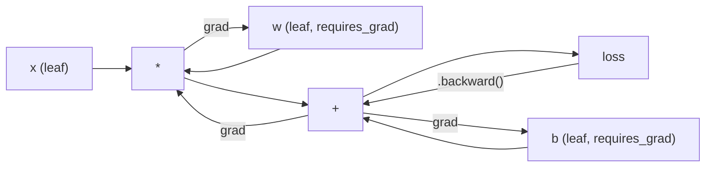
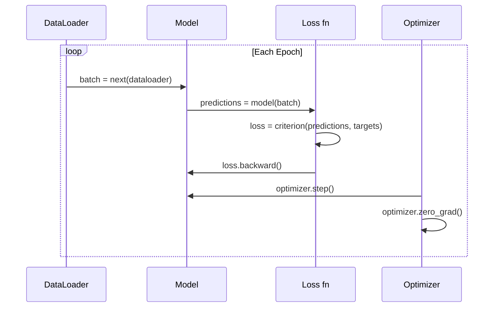

# Lần giới thiệu về PyTorch

> Anh đã chế tạo động cơ từ đống nhựa và crankshafts.

> **【中文解读】**Bạn từ零构建了神经网络的所有组件──现在学真正在使用框架:PyTorch──本章对应关系:你的价值类 → đuốc.Tensor,你的后退() → mất mát.

**Type:** Build
**Languages:** Python
**Prerequisites:** Lesson 03.10 (Build Your Own Mini Framework)
**Time:** ~75 minutes

## Mục tiêu học tập

- Xây dựng và đào tạo mạng thần kinh bằng cách sử dụng PyTorch nn.Module, nn.Sequential và autograd
- Sử dụng các tensor PyTorch, tăng tốc GPU và vòng tròn huấn luyện tiêu chuẩn (zero_grad, tiến, mất, trở lại, bước)
- Chuyển đổi các thành phần khung mini của bạn từ đầu thành các tương đương PyTorch của chúng
- Tự hình và so sánh tốc độ đào tạo giữa khung Python thuần túy của bạn và PyTorch trên cùng một nhiệm vụ

> **【中文解读】**本章 Từ迷你框架过渡到 PyTorch──核心对应关系:Module → nn.Module、手写倒退() → autograd、Python 循环 → GPU 并行──你已经在第10 课已经理解底层原理,现在学习工业级实现──

## Vấn đề  vấn đề giới thiệu

Bạn có một framework mini hoạt động. Lớp tuyến tính, ReLU, dropout, batch standard, Adam, DataLoader, một vòng tròn đào tạo. Nó đào tạo một mạng lưới 4 lớp về vấn đề phân loại vòng tròn trong Python tinh khiết.

> Bạn có một khung hình nhỏ có thể sử dụng. Lớp đường, ReLU, drop-out, batch, Adam, DataLoader, training cycle. Nó sử dụng Python trong các vấn đề phân loại hình tròn để đào tạo một mạng 4 tầng.

Nó cũng chậm hơn 500 lần so với PyTorch trên cùng một vấn đề.

> Nhưng nó chậm hơn PyTorch 500 lần trên cùng một vấn đề.

Phụ thể của bạn xử lý một mẫu một lần với các vòng Python đinh. PyTorch gửi các hoạt động tương tự đến các hạt nhân C ++ / CUDA tối ưu hóa chạy trên GPU. Trên một NVIDIA A100, PyTorch đào tạo ResNet-50 (25,6M tham số) trên ImageNet (1.28M hình ảnh) trong khoảng 6 giờ. Phụ thể của bạn sẽ mất khoảng 3.000 giờ cho cùng một nhiệm vụ - nếu nó không hết bộ nhớ trước.

> Các khung hình nhỏ của bạn sử dụng các mô hình xử lý Python vòng lặp cá nhân của các bản嵌套. PyTorch sẽ phân phối cùng một hoạt động để tối ưu hóa hoạt động trên GPU C++/CUDA 内核. trên một NVIDIA A100, PyTorch trên ImageNet(1280.000张图像) trên đào tạo ResNet-50(25600.000参数) mất khoảng 6 giờ.

Tốc độ không phải là khoảng cách duy nhất. Khung của bạn không có hỗ trợ GPU. Không có phân biệt tự động - bạn đã viết ngược lại với mỗi mô-đun. Không có phân phối. Không có đào tạo phân tán. Không có độ chính xác hỗn hợp. Không có cách để gỡ lỗi dòng chảy gradient mà không có tuyên bố in.

> 速度不是唯一差距──你的框架没有 GPU 支持──没有自动微分你为每块模块手写回后()──没有序列化──没有分布式训练──没有混合精度──没有不用打印语句就能调试梯度流的方法──

PyTorch lấp đầy từng khoảng trống này. và nó làm như vậy trong khi giữ nguyên mô hình tâm lý chính xác mà bạn đã xây dựng: Module, forward(), parameters(), backward(), optimizer.step(). Các khái niệm chuyển giao một đến một.

> PyTorch đã lấp đầy tất cả những khoảng cách này. Nó vẫn giữ nguyên mô hình tâm trí hoàn toàn giống như bạn đã xây dựng: mô-đun, phía trước, tham số, phía sau, hướng về phía sau, hướng về phía sau, hướng về phía sau, hướng về phía sau, hướng về phía sau, hướng về phía sau, hướng về phía sau, hướng về phía sau, hướng về phía sau, hướng về phía sau, hướng về phía sau, hướng về phía sau, hướng về phía sau, hướng về phía sau, hướng về phía sau, hướng về phía sau, hướng về phía sau, hướng về phía sau, hướng về phía sau, hướng về phía sau, hướng về phía sau, hướng về phía sau, hướng về phía sau, hướng về phía sau, hướng về phía sau, hướng về phía sau, hướng về phía sau, hướng về phía sau, hướng về phía sau, hướng về phía sau, hướng về phía sau, hướng về phía sau, hướng về phía sau, hướng về phía sau, hướng về phía sau, hướng về phía sau, hướng về phía sau, hướng về phía sau, hướng về phía sau, hướng về phía sau, hướng về phía sau, hướng về phía sau, hướng về phía sau, phía sau, phía sau, phía sau, phía sau, phía sau, phía sau, phía sau, phía sau, phía sau, phía sau, phía sau, phía sau, phía sau, phía sau, phía sau, phía sau, phía sau, phía sau, phía sau, phía khác, phía khác, phía khác, phía khác, phía khác, phía khác.

> **【中文解读】**Các khung hình nhỏ của bạn chậm hơn PyTorch 500 lần vì Python 循环 cá nhân xử lý mẫu, trong khi PyTorch sử dụng C++/CUDA 内核并行处理。A100 上训练 ResNet-50 chỉ cần 6 giờ, khung hình của bạn cần 3000 giờ── nhưng mô hình tâm trí của cả hai hoàn toàn phù hợp:

> **【拓展：PyTorch 为什么赢了 TensorFlow】**Năm 2017 khi PyTorch  phát hành, TensorFlow chiếm 80% thị phần. Nhưng việc thực hiện phấn khích của PyTorch(quan lập tức thực hiện) để làm cho điều chỉnh và phát triển nguyên mẫu xa hơn TF 1.x.

## Khái niệm cốt lõi

## Khái niệm cốt lõi

### Tại sao PyTorch thắng PyTorch thắng vì sao

Năm 2015, TensorFlow yêu cầu bạn xác định một biểu đồ tính toán tĩnh trước khi chạy bất cứ thứ gì. Bạn xây dựng biểu đồ, biên soạn nó, sau đó cung cấp dữ liệu thông qua nó. Debugging có nghĩa là nhìn vào hình ảnh biểu đồ. Thay đổi kiến trúc có nghĩa là xây dựng lại biểu đồ từ đầu.

> Năm 2015, TensorFlow  yêu cầu bạn định nghĩa biểu đồ điện toán tĩnh trước khi bạn chạy bất cứ thứ gì. Bạn xây dựng biểu đồ, biên dịch nó, sau đó thông qua nó nhập dữ liệu.

PyTorch được ra mắt vào năm 2017 với một triết lý khác: thực hiện đầy nhiệt tình. Bạn viết Python. Nó chạy ngay lập tức. `y = model(x)`thực sự tính toán y ngay bây giờ, không phải "chúng thêm một nút vào một biểu đồ sẽ tính toán y sau này". Điều này có nghĩa là công cụ gỡ lỗi Python tiêu chuẩn đã hoạt động. print() đã hoạt động. pdb đã hoạt động. nếu / khác trong quá trình chuyển tiếp của bạn đã hoạt động.

> PyTorch vào năm 2017 được ra mắt, đã áp dụng một triết lý khác nhau:即时执行──你写 Python──它立即运行──`y = model(x)`现在就计算 y, thay vì "添加一个稍后计算 y 的节点到图中"──这意味着标准的Python调试工具可用──打印() 可用──pdb可用──前进通过 中的如果/else可用──

Đến năm 2020, thị trường đã nói lên. Phổ phần của PyTorch trong các bài báo nghiên cứu ML đã tăng từ 7% (2017) lên hơn 75% (2022). Meta, Google DeepMind, OpenAI, Anthropic và Hugging Face đều sử dụng PyTorch như là khung chính của họ. TensorFlow 2.x đã chấp nhận thực hiện nhiệt tình để đáp ứng - sự thừa nhận ngầm rằng thiết kế của PyTorch là đúng.

> Đến năm 2020, thị trường đã đưa ra câu trả lời. Phân tích của PyTorch trong các bài báo nghiên cứu ML tăng từ 7% (được công bố vào năm 2017) lên hơn 75% (được công bố vào năm 2022): Meta, Google DeepMind, OpenAI, Anthropic và Hugging Face sẽ sử dụng PyTorch như một khuôn khổ chính.

Bài học: các nhà phát triển trải nghiệm hợp chất. Một framework chậm hơn 10% nhưng nhanh hơn 50% để debug thắng mỗi lần.

> Học tập: người phát triển sẽ đạt được 10% nhưng trong khuôn khổ của 50% mỗi lần đều sẽ đạt được 10%.

### Tăng áp 张量

Một tensor là một mảng đa chiều với ba tính chất quan trọng: hình dạng, dtype và thiết bị.

> 张量 là một tập hợp đa chiều có ba thuộc tính quan trọng: hình dạng, loại dữ liệu và thiết bị.

```python
import torch

x = torch.zeros(3, 4)           # shape: (3, 4), dtype: float32, device: cpu
x = torch.randn(2, 3, 224, 224) # batch of 2 RGB images, 224x224
x = torch.tensor([1, 2, 3])     # from a Python list
```

**Shape**là chiều kích. Một hình dáng là hình (), một vector là (n,), một matrix là (m, n), một loạt hình ảnh là (những bộ, kênh, chiều cao, chiều rộng).

> **Shape**∈ M {\displaystyle \M\M\M\M\M\M\M\M\M\M\M\M\M\M\M\M\M\M\M\M\M\M\M\M\M\M\M\M\M\M\M\M\M\M\M\M\M\M\M\M\M\M\M\M\M\M\M\M\M\M\M\M\M\M\M\M\M\M\M\M\M\M\M\M\M\M\M\M\M\M\M\M\M\M\M\M\M\M\M\M\M\M\M\M\M\M\M\M\M\M\M\M\M\M\M\M\M\M\M\M\M\M\M\M\M\M\M\M\M\M\M\M\M\M\M\M\M\M\M\M\M\M\M\M\M\M\M\M\M\M\M\M\M\M\M\M \M \M \M \M \M \M \M \M \M \M \M \M \M \M \M \M \M \M \M \M \M \M \M \M \M \M \M \M \M \M \M \M \M \M \M \M \M \M \M \M \M \M \M \M \M \M \M \M \M \M \M \M \M \M \M \M \M \M \M \M \M \M \M \M \M \M \M \ \ \ \M \ \ \ \ \M \M \M \ \ \ \ \ \ \M \M \ \M \ \ \ \ \ \ \ \ \ \M \ \ \ \ \ \ \ \ \ \M \ \ \M \ \ \ \ \ \ \ \ \ \ \M \M \ \ \ \M \M \ \ \ \ \ \ \ \ \ \ \ \ \ \ \ \ \ \ \ \ \ \ \ \

**Dtype**điều khiển độ chính xác và bộ nhớ.

> **Dtype**控制精度和内存──

| dtype | Bits | Range | Use case |
|-------|------|-------|----------|
| float32 | 32 | ~7 decimal digits | Default training |
| float16 | 16 | ~3.3 decimal digits | Mixed precision |
| bfloat16 | 16 | Same range as float32, less precision | LLM training |
| int8 | 8 | -128 to 127 | Quantized inference |

**Device**xác định nơi tính toán xảy ra.

> **Device**quyết định tính toán là chuyện gì xảy ra.

```python
device = torch.device("cuda" if torch.cuda.is_available() else "cpu")
x = torch.randn(3, 4, device=device)
x = x.to("cuda")
x = x.cpu()
```

Mỗi hoạt động đòi hỏi tất cả các tensor trên cùng một thiết bị. Đây là lỗi # 1 PyTorch bắt đầu hit: `RuntimeError: Expected all tensors to be on the same device`Hãy sửa nó bằng cách chuyển mọi thứ sang cùng một thiết bị trước khi tính toán.

> Mỗi hoạt động đều yêu cầu tất cả các lượng trên cùng một thiết bị. Đây là lỗi PyTorch lớn đầu tiên của học sinh mới bắt đầu gặp:`RuntimeError: Expected all tensors to be on the same device` Trong tính toán trước sẽ chuyển tất cả nội dung sang cùng một thiết bị即可修复

**Reshaping**là thời gian liên tục -- nó thay đổi metadata, không phải dữ liệu.

> **重塑**là số lượng thời gian hoạt động  nó thay đổi dữ liệu, không thay đổi dữ liệu.

```python
x = torch.randn(2, 3, 4)
x.view(2, 12)      # reshape to (2, 12) -- must be contiguous
x.reshape(6, 4)    # reshape to (6, 4) -- works always
x.permute(2, 0, 1) # reorder dimensions
x.unsqueeze(0)     # add dimension: (1, 2, 3, 4)
x.squeeze()        # remove size-1 dimensions
```

### Autograd tự động phân tích

Phụ thể mini của bạn yêu cầu bạn thực hiện ngược lại cho mỗi mô-đun. PyTorch không. Nó ghi lại mọi hoạt động trên các tensor vào một biểu đồ đường trục trục hướng ( biểu đồ tính toán) và sau đó đi qua biểu đồ đó ngược lại để tính toán gradient tự động.

> Các khung hình迷你 yêu cầu bạn thực hiện ngược cho mỗi mô-đun.



Sự khác biệt chính từ khung của bạn: PyTorch sử dụng tự động hóa dựa trên băng. Mỗi hoạt động được thêm vào một "băng" trong quá trình đi trước.`.backward()`quay lại băng ngược lại.

> Phân biệt quan trọng với khung của bạn: PyTorch sử dụng các mô hình tự động dựa trên magnet.`.backward()`Trở lại từ quay lại

```python
x = torch.randn(3, requires_grad=True)
y = x ** 2 + 3 * x
z = y.sum()
z.backward()
print(x.grad)  # dz/dx = 2x + 3
```

Ba quy tắc của tự cấp:

> Autograd 的三条规则:

1. Chỉ có các tensor lá với `requires_grad=True`gradient tích lũy
   Trung ngữ翻译:只有设置了`requires_grad=True`Ước tính của Ước tính
2. Các gradient tích lũy theo mặc định -- gọi `optimizer.zero_grad()`trước mỗi lần đi ngược
   Trung文翻译:梯度默认累积每次反向传播前调用 `optimizer.zero_grad()`
3. `torch.no_grad()`Thiết lập các phương pháp theo dõi gradient (được sử dụng trong quá trình đánh giá)
   Trung ngữ翻译:`torch.no_grad()`禁用梯度追踪 (đánh giá thời sử dụng)

> **【拓展：混合精度训练如何加速】**A100/H100 của float16 吞吐量是 float32 của 2-4 倍──PyTorch của `torch.amp.autocast`tự động sẽ矩阵乘法和卷积转为 float16,同时保持软max和损失在 float32──配合 GradScaler 防止 float16 梯度下溢──Llama 3 训练全程使用bfloat16 混合精度,节省约50%的显存和计算──

### Nm.module ∙

`nn.Module`là lớp cơ sở cho mỗi thành phần mạng thần kinh trong PyTorch. Bạn đã xây dựng trừu tượng này trong Bài học 10. Phiên bản của PyTorch thêm đăng ký tham số tự động, khám phá mô-đun tái tạo, quản lý thiết bị và định nghĩa trạng thái.

> `nn.Module`Đây là một phần tử của mỗi bộ phận mạng thần kinh trong PyTorch. Bạn đã xây dựng được mô hình này trong lớp 10. Phiên bản của PyTorch đã tăng thêm đăng ký các tham số tự động, tìm thấy module chuyển tiếp, quản lý thiết bị và quy trình quy định của trạng thái.

```python
import torch.nn as nn

class MLP(nn.Module):
    def __init__(self, input_dim, hidden_dim, output_dim):
        super().__init__()
        self.layer1 = nn.Linear(input_dim, hidden_dim)
        self.relu = nn.ReLU()
        self.layer2 = nn.Linear(hidden_dim, output_dim)

    def forward(self, x):
        x = self.layer1(x)
        x = self.relu(x)
        x = self.layer2(x)
        return x
```

Khi bạn chỉ định một`nn.Module`hoặc `nn.Parameter`như một thuộc tính trong `__init__`PyTorch sẽ tự động ghi lại nó.`model.parameters()`Đây là lý do tại sao bạn không bao giờ phải tự thu thập trọng lượng như bạn đã làm trong khung mini.

> Khi em ở đây`__init__`Trung `nn.Module`Hoặc`nn.Parameter`Đưa giá trị cho thuộc tính, PyTorch tự động đăng ký nó.`model.parameters()`n lại thu thập các tham số của mỗi đăng ký. Đó là lý do tại sao bạn không bao giờ cần quyền thu thập trọng lượng bằng tay như trong khung nhỏ.

Các khối xây dựng chính:

> 关键构建块:

| Module | What it does | Parameters |
|--------|-------------|------------|
| nn.Linear(in, out) | Wx + b | in*out + out |
| nn.Conv2d(in_ch, out_ch, k) | 2D convolution | in_ch*out_ch*k*k + out_ch |
| nn.BatchNorm1d(features) | Normalize activations | 2 * features |
| nn.Dropout(p) | Random zeroing | 0 |
| nn.ReLU() | max(0, x) | 0 |
| nn.GELU() | Gaussian error linear | 0 |
| nn.Embedding(vocab, dim) | Lookup table | vocab * dim |
| nn.LayerNorm(dim) | Per-sample normalization | 2 * dim |

### Loss Functions và Optimizers  Loss Function và Optimizer

PyTorch sẽ đưa ra các phiên bản sẵn sàng sản xuất của mọi thứ mà bạn đã xây dựng.

> PyTorch cung cấp phiên bản sản xuất tất cả các chức năng bạn xây dựng.

**Loss functions**(từ `torch.nn`):

> **损失函数**(từ `torch.nn`):

| Loss | Task | Input |
|------|------|-------|
| nn.MSELoss() | Regression | Any shape |
| nn.CrossEntropyLoss() | Multi-class classification | Logits (not softmax) |
| nn.BCEWithLogitsLoss() | Binary classification | Logits (not sigmoid) |
| nn.L1Loss() | Regression (robust) | Any shape |
| nn.CTCLoss() | Sequence alignment | Log probabilities |

Lưu ý: `CrossEntropyLoss`kết hợp`LogSoftmax`+ `NLLLoss`thông qua logits nguyên liệu, không phải đầu ra softmax. Đây là một sai lầm phổ biến mà sản xuất gradient sai âm thầm.

> chú ý:`CrossEntropyLoss`内部组合了 `LogSoftmax`+ `NLLLoss`                                                                                                                                                                                                                                                              

**Optimizers**(từ `torch.optim`):

> **优化器**(từ `torch.optim`):

| Optimizer | When to use | Typical LR |
|-----------|-------------|-----------|
| SGD(params, lr, momentum) | CNNs, well-tuned pipelines | 0.01--0.1 |
| Adam(params, lr) | Default starting point | 1e-3 |
| AdamW(params, lr, weight_decay) | Transformers, fine-tuning | 1e-4--1e-3 |
| LBFGS(params) | Small-scale, second-order | 1.0 |

### Chuyển tập tập luyện

Mỗi vòng huấn luyện PyTorch đều theo cùng một mô hình 5 bước.

> Mỗi vòng tập PyTorch đều theo cùng một mô hình 5 bước. Bạn đã học được bài học thứ 10.



Mô hình kinh điển:

> 标准模式:

```python
for epoch in range(num_epochs):
    model.train()
    for inputs, targets in train_loader:
        inputs, targets = inputs.to(device), targets.to(device)
        optimizer.zero_grad()
        outputs = model(inputs)
        loss = criterion(outputs, targets)
        loss.backward()
        optimizer.step()
```

5 dòng trong vòng tròn hàng loạt, 5 dòng huấn luyện GPT-4, Stable Diffusion và LLaMA, kiến trúc thay đổi, dữ liệu thay đổi, 5 dòng này không thay đổi.

> 批量循环内五行代码――训练了 GPT-4、稳定扩散和 LLaMA的五行代码――架构会变化――数据会变化――这五行不变――

### Bộ dữ liệu và DataLoader

PyTorch's `Dataset`là một lớp trừu tượng với hai phương pháp: `__len__`và `__getitem__`- `DataLoader`gói nó với batching, shuffling, và tải dữ liệu đa quy trình.

> PyTorch của `Dataset`Đó là một loại trừu tượng, có hai cách:`__len__`和 `__getitem__``DataLoader`Sử dụng quy trình xử lý, xử lý, xử lý và quá trình tải dữ liệu, đóng gói nó.

```python
from torch.utils.data import Dataset, DataLoader

class MNISTDataset(Dataset):
    def __init__(self, images, labels):
        self.images = images
        self.labels = labels

    def __len__(self):
        return len(self.labels)

    def __getitem__(self, idx):
        return self.images[idx], self.labels[idx]

loader = DataLoader(dataset, batch_size=64, shuffle=True, num_workers=4)
```

`num_workers=4`tạo ra 4 quá trình để tải dữ liệu song song trong khi GPU đào tạo trên loạt hiện tại.

> `num_workers=4` tạo ra 4 quá trình cùng tải dữ liệu, đồng thời GPU trong các tập thể hiện tại trên tập thể.

### Ứng dụng GPU Ứng dụng GPU

Chuyển mô hình sang GPU:

> 将模型 chuyển đến GPU:

```python
device = torch.device("cuda" if torch.cuda.is_available() else "cpu")
model = model.to(device)
```

Điều này chuyển từng tham số và bộ đệm sang GPU.

> Các chuyển tiếp sẽ di chuyển từng tham số và khu vực缓冲 đến GPU. Sau đó di chuyển mỗi lô trong thời gian tập luyện:

```python
inputs, targets = inputs.to(device), targets.to(device)
```

**Mixed precision**Giảm sử dụng bộ nhớ một nửa và tăng gấp đôi thông suất trên các GPU hiện đại (A100, H100, RTX 4090) bằng cách chạy về phía trước/lại trong float16 trong khi giữ trọng lượng chủ trong float32:

> **混合精度**通过在 float16 中运行前向/反向传播,同时 giữ chủ quyền重在 float32 中,在现代 GPU(A100、H100、RTX 4090) 上将内存使用减半,吞吐量翻倍:

```python
from torch.amp import autocast, GradScaler

scaler = GradScaler()
for inputs, targets in loader:
    with autocast(device_type="cuda"):
        outputs = model(inputs)
        loss = criterion(outputs, targets)
    scaler.scale(loss).backward()
    scaler.step(optimizer)
    scaler.update()
    optimizer.zero_grad()
```

### So sánh: Mini Framework vs PyTorch vs JAX

| Feature | Mini Framework (L10) | PyTorch | JAX |
|---------|---------------------|---------|-----|
| Autodiff | Manual backward() | Tape-based autograd | Functional transforms |
| Execution | Eager (Python loops) | Eager (C++ kernels) | Traced + JIT compiled |
| GPU support | No | Yes (CUDA, ROCm, MPS) | Yes (CUDA, TPU) |
| Speed (MNIST MLP) | ~300s/epoch | ~0.5s/epoch | ~0.3s/epoch |
| Module system | Custom Module class | nn.Module | Stateless functions (Flax/Equinox) |
| Debugging | print() | print(), pdb, breakpoint() | Harder (JIT tracing breaks print) |
| Ecosystem | None | Hugging Face, Lightning, timm | Flax, Optax, Orbax |
| Learning curve | You built it | Moderate | Steep (functional paradigm) |
| Production use | Toy problems | Meta, OpenAI, Anthropic, HF | Google DeepMind, Midjourney |

## Hãy xây dựng nó.

> **【中文解读】**下面使用纯 PyTorch 训练一个3层 MLP做MNIST 手写数字分类(784→256→128→10) ――参数只有235K,但训练模式和大模型完全一致:DataLoader → model.train() → zero_grad → forward → loss → backward → step → model.eval()。10 个时代 达到 ~97.8% 测试准确率。
```figure
dropout-mask
```

## Hãy xây dựng nó

Một MLP 3 tầng được đào tạo trên MNIST chỉ sử dụng nguyên thủy PyTorch. Không bao bì cấp cao.`torchvision.datasets`Chúng tôi tự tải xuống và phân tích dữ liệu thô.

> Sử dụng Pure PyTorch Original Language Training 3 Layer MLP làm MNIST 分类──没有高级封装──没有 `torchvision.datasets` 我们自己下载和分析原始数据

### Bước 1: tải MNIST từ các tệp nguyên liệu .

MNIST được gửi dưới dạng 4 tệp gzip: hình ảnh đào tạo (60.000 x 28 x 28), nhãn đào tạo, hình ảnh thử nghiệm (10.000 x 28 x 28), nhãn thử nghiệm. Chúng tôi tải xuống chúng và phân tích định dạng nhị phân.

> MNIST 以 4 个 gzip 文件提供:训练图像(60,000 x 28 x 28) ✓训练标签、测试图像(10,000 x 28 x 28) ✓测试标签──我们下载它们并解析二进制格式──

```python
import torch
import torch.nn as nn
import struct
import gzip
import urllib.request
import os

def download_mnist(path="./mnist_data"):
    base_url = "https://storage.googleapis.com/cvdf-datasets/mnist/"
    files = [
        "train-images-idx3-ubyte.gz",
        "train-labels-idx1-ubyte.gz",
        "t10k-images-idx3-ubyte.gz",
        "t10k-labels-idx1-ubyte.gz",
    ]
    os.makedirs(path, exist_ok=True)
    for f in files:
        filepath = os.path.join(path, f)
        if not os.path.exists(filepath):
            urllib.request.urlretrieve(base_url + f, filepath)

def load_images(filepath):
    with gzip.open(filepath, "rb") as f:
        magic, num, rows, cols = struct.unpack(">IIII", f.read(16))
        data = f.read()
        images = torch.frombuffer(bytearray(data), dtype=torch.uint8)
        images = images.reshape(num, rows * cols).float() / 255.0
    return images

def load_labels(filepath):
    with gzip.open(filepath, "rb") as f:
        magic, num = struct.unpack(">II", f.read(8))
        data = f.read()
        labels = torch.frombuffer(bytearray(data), dtype=torch.uint8).long()
    return labels
```

### Bước 2: Định nghĩa mô hình Bước 2: Định nghĩa mô hình

Một MLP 3 tầng: 784 -> 256 -> 128 -> 10. ReLU hoạt động. Thả để điều chỉnh. Không có quy tắc hàng để giữ cho nó đơn giản.

> Một 3 tầng MLP:784 -> 256 -> 128 -> 10。ReLU 激活。Dropout 正则化。为简单起见不用BatchNorm。

```python
class MNISTModel(nn.Module):
    def __init__(self):
        super().__init__()
        self.net = nn.Sequential(
            nn.Linear(784, 256),
            nn.ReLU(),
            nn.Dropout(0.2),
            nn.Linear(256, 128),
            nn.ReLU(),
            nn.Dropout(0.2),
            nn.Linear(128, 10),
        )

    def forward(self, x):
        return self.net(x)
```

Lớp đầu ra tạo ra 10 logit nguyên liệu (một trong mỗi chữ số). Không có softmax -- `CrossEntropyLoss`xử lý nội bộ.

> 输出层产生 10 个原始 logits(每个数字一个) ――不需要软max`CrossEntropyLoss`内部处理──

Số lượng tham số: 784*256 + 256 + 256*128 + 128 + 128*10 + 10 = 235.146.

> 参数:784*256 + 256 + 256*128 + 128 + 128*10 + 10 = 235.146。 theo tiêu chuẩn hiện đại rất nhỏ。 GPT-2 nhỏ có 124M。

### Bước 3: vòng tập luyện.

Mô hình tiến-thất-đến lại-đến lại.

> 标准的前进损失后退步模式

```python
def train_one_epoch(model, loader, criterion, optimizer, device):
    model.train()
    total_loss = 0
    correct = 0
    total = 0
    for images, labels in loader:
        images, labels = images.to(device), labels.to(device)
        optimizer.zero_grad()
        outputs = model(images)
        loss = criterion(outputs, labels)
        loss.backward()
        optimizer.step()
        total_loss += loss.item() * images.size(0)
        _, predicted = outputs.max(1)
        correct += predicted.eq(labels).sum().item()
        total += labels.size(0)
    return total_loss / total, correct / total


def evaluate(model, loader, criterion, device):
    model.eval()
    total_loss = 0
    correct = 0
    total = 0
    with torch.no_grad():
        for images, labels in loader:
            images, labels = images.to(device), labels.to(device)
            outputs = model(images)
            loss = criterion(outputs, labels)
            total_loss += loss.item() * images.size(0)
            _, predicted = outputs.max(1)
            correct += predicted.eq(labels).sum().item()
            total += labels.size(0)
    return total_loss / total, correct / total
```

Lưu ý `torch.no_grad()`Khi sử dụng máy tính để phân tích, PyTorch sẽ tạo ra một biểu đồ tính toán mà bạn không bao giờ sử dụng.

> chú ý đánh giá `torch.no_grad()` Nó tắt tự cấp, giảm sử dụng bộ nhớ và tăng tốc tính toán. Không có nó, PyTorch sẽ xây dựng các bức tranh tính toán bạn sẽ không bao giờ sử dụng.

### Bước 4: Kết nối mọi thứ cùng nhau Bước 4: Sắp ráp mọi thứ

```python
def main():
    device = torch.device("cuda" if torch.cuda.is_available() else "cpu")

    download_mnist()
    train_images = load_images("./mnist_data/train-images-idx3-ubyte.gz")
    train_labels = load_labels("./mnist_data/train-labels-idx1-ubyte.gz")
    test_images = load_images("./mnist_data/t10k-images-idx3-ubyte.gz")
    test_labels = load_labels("./mnist_data/t10k-labels-idx1-ubyte.gz")

    train_dataset = torch.utils.data.TensorDataset(train_images, train_labels)
    test_dataset = torch.utils.data.TensorDataset(test_images, test_labels)
    train_loader = torch.utils.data.DataLoader(
        train_dataset, batch_size=64, shuffle=True
    )
    test_loader = torch.utils.data.DataLoader(
        test_dataset, batch_size=256, shuffle=False
    )

    model = MNISTModel().to(device)
    criterion = nn.CrossEntropyLoss()
    optimizer = torch.optim.Adam(model.parameters(), lr=1e-3)

    num_params = sum(p.numel() for p in model.parameters())
    print(f"Device: {device}")
    print(f"Parameters: {num_params:,}")
    print(f"Train samples: {len(train_dataset):,}")
    print(f"Test samples: {len(test_dataset):,}")
    print()

    for epoch in range(10):
        train_loss, train_acc = train_one_epoch(
            model, train_loader, criterion, optimizer, device
        )
        test_loss, test_acc = evaluate(
            model, test_loader, criterion, device
        )
        print(
            f"Epoch {epoch+1:2d} | "
            f"Train Loss: {train_loss:.4f} | Train Acc: {train_acc:.4f} | "
            f"Test Loss: {test_loss:.4f} | Test Acc: {test_acc:.4f}"
        )

    torch.save(model.state_dict(), "mnist_mlp.pt")
    print(f"\nModel saved to mnist_mlp.pt")
    print(f"Final test accuracy: {test_acc:.4f}")
```

Tạo ra dự kiến sau 10 thời kỳ: ~ 97,8% độ chính xác thử nghiệm. Thời gian đào tạo trên CPU: ~ 30 giây. Trên GPU: ~ 5 giây. Trên khung mini của bạn với kiến trúc tương tự: ~ 45 phút.

> 10 个时代 后预期输出:~97.8% 测试准确率──CPU 训练时间:~30 秒──GPU:~5 秒──用迷你框架相同架构:~45 分钟──

> **【拓展：从 MNIST 到大模型】**MNIST MLP chỉ có 235K 参数。 quy mô mô mô hình hiện đại:GPT-2 nhỏ 124M、BERT-base 110M、Llama 3 8B。参数 tăng ~1000x, nhưng mô hình 5 bước của vòng tròn tập luyện hoàn toàn không thay đổi。 khác biệt là: dữ liệu并行(多 GPU)、模型并行(单 GPU 放不下)、梯度检查点(节省显存)、混合精度(加速计算)。

## Hãy sử dụng nó để thực hiện

> **【中文解读】**迷你框架和 PyTorch的接口几乎一致──关键区别:PyTorch dùng tự động tự động微分(不需要手写倒后((、支持 GPU(model.to("cuda")) 、支持混合精度训练──保存模型用 state_dict() (可移植的参数典),不要直接化模型对象──

### So sánh nhanh: Mini Framework vs PyTorch 快速对比:迷你框架 vs PyTorch

| Mini Framework (Lesson 10) | PyTorch |
|---------------------------|---------|
| `model = Sequential(Linear(784, 256), ReLU(), ...)` | `model = nn.Sequential(nn.Linear(784, 256), nn.ReLU(), ...)` |
| `pred = model.forward(x)` | `pred = model(x)` |
| `optimizer.zero_grad()` | `optimizer.zero_grad()` |
| `grad = criterion.backward()` then `model.backward(grad)` | `loss.backward()` |
| `optimizer.step()` | `optimizer.step()` |
| No GPU | `model.to("cuda")` |
| Manual backward for every module | Autograd handles everything |

Giao diện gần giống nhau, sự khác biệt là mọi thứ dưới nắp.

> 接口 gần như giống nhau. Sự khác biệt nằm ở tầng dưới.

### Bảo tồn và tải mô hình

```python
torch.save(model.state_dict(), "model.pt")

model = MNISTModel()
model.load_state_dict(torch.load("model.pt", weights_only=True))
model.eval()
```

Luôn tiết kiệm`state_dict()`(the parameter dictionary), không phải đối tượng mô hình. lưu đối tượng mô hình sử dụng mỳ, mà phá vỡ khi bạn refactor code.

> 始终保存 `state_dict()`(参数字典), thay vì mô hình đối tượng.

### Học tập tỷ lệ lập trình 

```python
scheduler = torch.optim.lr_scheduler.CosineAnnealingLR(
    optimizer, T_max=10
)
for epoch in range(10):
    train_one_epoch(model, train_loader, criterion, optimizer, device)
    scheduler.step()
```

PyTorch cung cấp 15 chương trình lên lịch: StepLR, ExponentialLR, CosineAnnealingLR, OneCycleLR, ReduceLROnPlateau. Tất cả được kết nối vào cùng một giao diện tối ưu hóa.

> PyTorch  cung cấp 15+ loại điều chỉnh:StepLR,ExponentialLR,CosineAnnealingLR,OneCycleLR,ReduceLROnPlateau, tất cả đều được cài đặt vào cùng một kết nối tối ưu hóa.

## Chuyển nó đi.

Bài học này tạo ra hai đồ tạo vật:

> 本课产 xuất bản hai tài liệu:

- `outputs/prompt-pytorch-debugger.md`-- một lời nhắc để chẩn đoán các thất bại tập luyện PyTorch phổ biến
  Trung ngữ翻译:`outputs/prompt-pytorch-debugger.md`- 诊断常见 PyTorch 训练故障的提示词
- `outputs/skill-pytorch-patterns.md`-- một tài liệu tham khảo kỹ năng cho các mô hình đào tạo PyTorch
  Trung ngữ翻译:`outputs/skill-pytorch-patterns.md`- PyTorch 训练模式的技能参考

## Tập luyện bài tập

1. **Add batch normalization.**Nhập `nn.BatchNorm1d`Sau mỗi lớp tuyến tính (trước khi kích hoạt). So sánh độ chính xác thử nghiệm và tốc độ đào tạo so với phiên bản chỉ ngừng hoạt động.

2. **Implement a learning rate finder.**Trình luyện cho một thời đại với tốc độ học tập tăng theo cấp số (từ 1e-7 đến 1.0).

3. **Port to GPU with mixed precision.**Thêm `torch.amp.autocast`và `GradScaler`để vòng đào tạo. đo thông qua (chọn mẫu/ giây) với và không có độ chính xác hỗn hợp trên GPU.

4. **Build a custom Dataset.**Tải xuống Fashion-MNIST (tương tự như MNIST nhưng với các mặt hàng quần áo).`FashionMNISTDataset(Dataset)`lớp với `__getitem__`và `__len__`- Tập luyện cùng một MLP và so sánh độ chính xác.

5. **Replace Adam with SGD + momentum.**Đào tàu với `SGD(params, lr=0.01, momentum=0.9)`So sánh đường cong hội tụ.`CosineAnnealingLR`và xem SGD có bắt kịp Adam vào thời kỳ 10.

## Từ khóa  Từ khóa nhanh chóng

| Term | What people say | What it actually means |
|------|----------------|----------------------|
| Tensor | "A multi-dimensional array" | A typed, device-aware array with automatic differentiation support baked into every operation |
| Autograd | "Automatic backprop" | A tape-based system that records operations during forward pass, then replays them in reverse to compute exact gradients |
| nn.Module | "A layer" | The base class for any differentiable computation block -- registers parameters, supports nesting, handles train/eval modes |
| state_dict | "The model weights" | An OrderedDict mapping parameter names to tensors -- the portable, serializable representation of a trained model |
| .backward() | "Compute gradients" | Traverse the computational graph in reverse, computing and accumulating gradients for every leaf tensor with requires_grad=True |
| .to(device) | "Move to GPU" | Recursively transfer all parameters and buffers to the specified device (CPU, CUDA, MPS) |
| DataLoader | "The data pipeline" | An iterator that batches, shuffles, and optionally parallelizes data loading from a Dataset |
| Mixed precision | "Use float16" | Train with float16 forward/backward for speed while keeping float32 master weights for numerical stability |
| Eager execution | "Run it now" | Operations execute immediately when called, not deferred to a later compilation step -- the core design choice that differentiates PyTorch from TF 1.x |
| zero_grad | "Reset gradients" | Set all parameter gradients to zero before the next backward pass, since PyTorch accumulates gradients by default |

## Xem thêm 延伸阅读

- Paszke et al., "PyTorch: Một phong cách bắt buộc, High-Performance Deep Learning Library" (2019) -- bài báo ban đầu giải thích các thương lượng thiết kế của PyTorch
  Paszke 等人,PyTorch: một kiểu lệnh kiểu kiểu cao hiệu suất sâu học库(2019)解释 PyTorch 设计权衡的原始论文
- Các hướng dẫn PyTorch: "Giáo dục PyTorch với ví dụ" (https://pytorch.org/tutorials/beginner/pytorch_with_examples.html) -- đường chính thức từ tensor đến nn.Module
  PyTorch 教程:用例学习 PyTorch从张量到 nn.Module 的官方路径
- PyTorch Performance Tuning Guide (https://pytorch.org/tutorials/recipes/recipes/tuning_guide.html) -- độ chính xác hỗn hợp, nhân viên DataLoader, bộ nhớ gắn kết và các tối ưu hóa sản xuất khác
  PyTorch  hiệu suất điều chỉnh  hỗn hợp độ chính xác  DataLoader  quá trình làm việc  cố định内存 và các sản xuất khác
- Horace He, "Make Deep Learning Go Brrrr" (Tạo học sâu trở thành một sự phát triển mạnh mẽ)https://horace.io/brrr_intro.html) -- tại sao đào tạo GPU là nhanh chóng, với các chiến lược tối ưu hóa cụ thể của PyTorch
  Horace He,让深度学习飞速运行为什么 GPU 训练快,以及 PyTorch 特定优化策略
