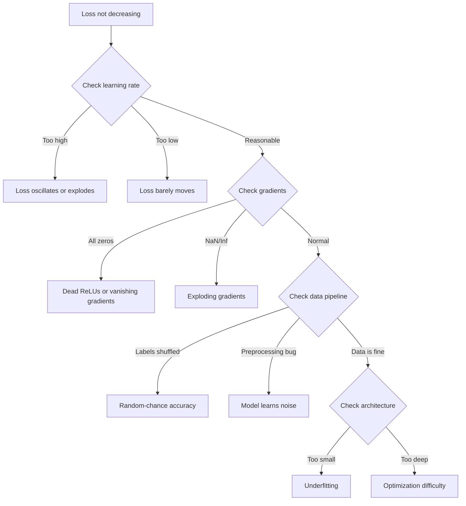
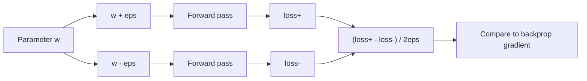
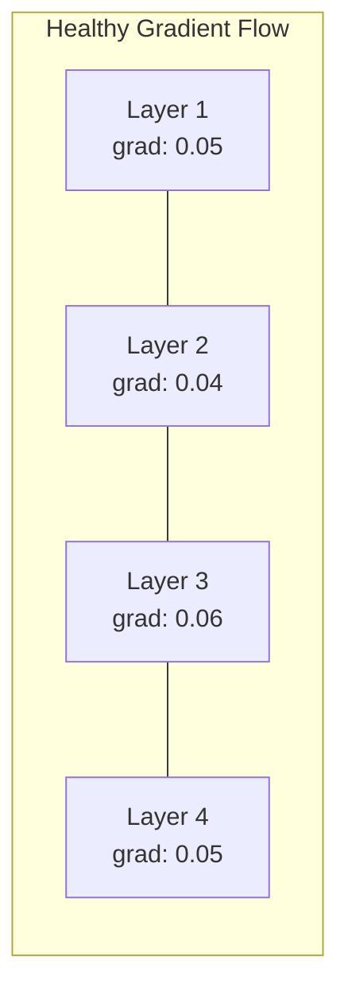
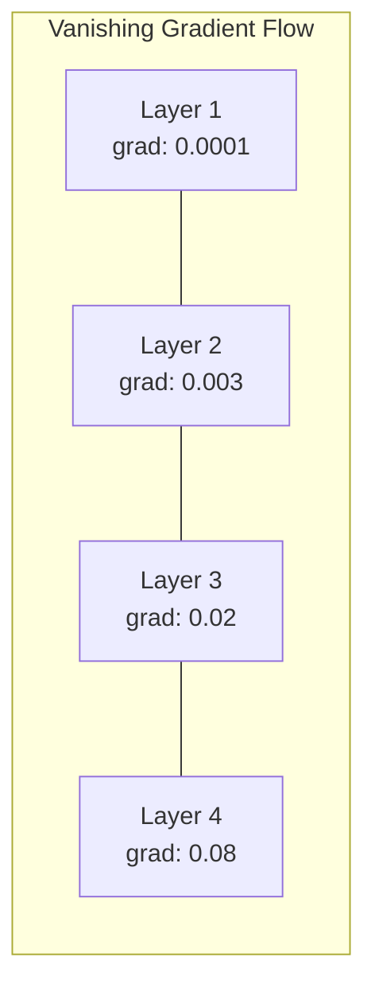
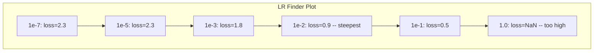

# Thử gỡ lỗi mạng thần kinh

> mạng của bạn được biên soạn. nó chạy. nó tạo ra một số. số không đúng và không có gì bị hỏng. chào mừng đến với loại lỗi khắc nghiệt nhất - loại mà không có thông báo lỗi.

> **【中文解读】**网络编译了、运行了、输出数字但数字是错误的,没有报错信息――这是最难的调试:没有错误信息――本章系统介绍深度学习的调试方法论:过拟合单批 → 检查梯度 → 追踪数值稳定性 → 诊断学习率问题――

**Type:** Practice
**Type:** Build
**Languages:** Python, PyTorch
**Prerequisites:** Phase 03 Lessons 01-10 (especially backpropagation, loss functions, optimizers)
**Time:** ~90 minutes

## Mục tiêu học tập

- Chẩn đoán các lỗi mạng thần kinh phổ biến (sự mất NaN, đường cong mất phẳng, quá phù hợp, dao động) bằng cách sử dụng các chiến lược gỡ lỗi có hệ thống
- Sử dụng kỹ thuật "overfit one batch" để xác minh rằng kiến trúc mô hình và vòng đào tạo của bạn là đúng
- Kiểm tra quy mô gradient, phân phối kích hoạt và chuẩn trọng lượng để xác định các vấn đề gradient biến mất/bùng nổ
- Xây dựng danh sách kiểm tra gỡ lỗi bao gồm các vấn đề về đường ống dữ liệu, kiến trúc mô hình, chức năng mất mát, tối ưu hóa và tốc độ học tập

> **【中文解读】**本章 Hệ thống hóa地教你调试神经网络──核心方法论:过拟合单批(验证代码正确性)→ 梯度检查(验证反向传播)→ 激活统计(发现死 ReLU)→ 学习率搜索(找到合适的 lr)──60-70% của ML 调试时间花在"静默错误"上程序不报错但不对──

## Vấn đề  vấn đề giới thiệu

Phần mềm truyền thống bị hỏng khi bị hỏng. Một chỉ số không có tính năng tạo ra ngoại lệ. Một sự không phù hợp kiểu không thành công trong thời gian biên soạn. Một lỗi không theo một tạo ra một đầu ra rõ ràng sai.

> 传统软件在出问题时会崩──空指针抛出异常──类不匹配在编译时失败──差一错产生明显错误的输出──

Các mạng thần kinh không mang lại cho bạn sự sang trọng đó.

> Mạng thần kinh sẽ không cho bạn sự thịnh vượng như thế.

Một mạng thần kinh bị hỏng chạy đến khi hoàn thành, in một giá trị mất mát, và đưa ra dự đoán. Sự mất mát có thể giảm đi. Những dự đoán có vẻ hợp lý. Nhưng mô hình này là sai lầm lặng lẽ - học các đường tắt, ghi nhớ tiếng ồn, hoặc hội tụ với một mức tối thiểu địa phương vô dụng. Các nhà nghiên cứu của Google ước tính rằng 60-70% thời gian gỡ lỗi ML được dành cho các lỗi "hư lặng" không tạo ra lỗi nhưng làm suy giảm chất lượng mô hình.

> Một mạng thần kinh có vấn đề có thể chạy đến khi hoàn thành, in mất giá trị, ra ngoài dự đoán. Khá lỗ có thể giảm. Dự đoán có thể trông hợp lý. Nhưng mô hình đã mắc sai lầm trong học tập đường lối, tiếng ồn nhớ hoặc nhận được giá trị tối thiểu tại địa phương không sử dụng. Các nhà nghiên cứu Google ước tính 60-70% thời gian thử nghiệm của ML dành cho lỗi " tĩnh lặng " không gây ra sai lầm nhưng làm giảm chất lượng mô hình.

Sự khác biệt giữa mô hình làm việc và mô hình bị hỏng thường là một dòng bị hỏng: một dòng bị thiếu `zero_grad()`, một chiều hướng được chuyển thể, tốc độ học tập giảm 10x. Công thức "Dịch thức đào tạo mạng thần kinh" (2019) bắt đầu với điều này: "Những lỗi mạng thần kinh phổ biến nhất là lỗi không bị sập".

> Sự khác biệt giữa mô hình có thể sử dụng và mô hình bị hư hỏng thường chỉ là một dòng mã đặt sai vị trí: thiếu sót `zero_grad()`、度转置错误、学习率差 10 倍──经典的"训练神经网络的方法" () 开头写道:"Phạm vi mạng thần kinh phổ biến nhất là lỗi không bị sụp đổ──"

Bài học này dạy bạn tìm những con bọ đó.

> Bài này dạy con cách tìm được những con bọ này.

> **【中文解读】**传统软件 có tín hiệu sai lầm rõ ràng (异常,编译错误)  Các nơi khó khăn nhất trong mạng thần kinh là "Stille默错误"  Các chương trình hoạt động bình thường, mất cũng đang giảm, nhưng mô hình 地学错了──

> **【拓展：大模型训练中的调试】**训练 Llama 3 405B 这样模型(16384块 H100,30.8M GPU 小时), một lần đào tạo thất bại có chi phí lên đến hàng triệu đô la.

## Khái niệm cốt lõi

### Tâm lý giải lỗi 调试心态

Hãy quên đi việc khắc phục lỗi in và pray. Việc khắc phục lỗi mạng thần kinh đòi hỏi phải có một cách tiếp cận có hệ thống vì vòng lặp phản hồi chậm (từ vài phút đến vài giờ mỗi lần tập luyện) và các triệu chứng không rõ ràng (sự mất mát xấu có thể có nghĩa là 20 điều khác nhau).

> 忘记打印和祈祷调试――神经网络调试需要系统化的方法,因为反循环很慢,每次训练运行几分钟到几小时,并且症状模糊,差的损失可能意味着20 loại vấn đề khác nhau.

Quy tắc vàng:**start simple, add complexity one piece at a time, and verify each piece independently.**

> 黄金法则:**从简单开始，一次只加一个复杂度，独立验证每个组件。**

> **【中文解读】**调试神经网络的黄金法则: Từ những tình huống đơn giản nhất, mỗi lần chỉ thêm một thành phần, kiểm tra độc lập từng thành phần.



### Ưu điểm 1: Loss không giảm Ưu điểm 1: Loss không giảm

Đây là lời phàn nàn phổ biến nhất: vòng đào tạo chạy, thời đại trôi qua, và sự mất mát vẫn còn bằng hoặc dao động hoang dã.

> Đó là những lời phàn nàn phổ biến nhất. Chuyện tập luyện đang diễn ra, thời đại này qua một thời đại khác, nhưng mất mát luôn bất động hoặc rung động mạnh mẽ.

**Wrong learning rate.**Đối với Adam, bắt đầu từ 1e-3. Đối với SGD, bắt đầu từ 1e-1 hoặc 1e-2. Luôn thử 3 tỷ lệ học tập trải dài 10 lần mỗi lần (ví dụ, 1e-2, 1e-3, 1e-4) trước khi kết luận rằng điều gì đó khác là sai.

> **学习率错误。**太高: mất 振荡或跳到NaN──太低: mất 下降得太慢,看起来像不动──Adam từ 1e-3 开始──SGD từ 1e-1 或 1e-2 开始──在下结论说有其他问题之前,先尝试3个学习率(相差10倍,如 1e-2、1e-3、1e-4)──

**Dead ReLUs.**Nếu một tế bào thần kinh ReLU nhận được một đầu vào tiêu cực lớn, nó sẽ phát ra 0 và gradient của nó là 0. Nó không bao giờ hoạt động lại. Nếu đủ tế bào thần kinh chết, mạng không thể học. Kiểm tra: in phần nhỏ của các hoạt động chính xác là 0 sau mỗi lớp ReLU. Nếu > 50% đã chết, hãy chuyển sang LeakyReLU hoặc giảm tốc độ học tập.

> **死亡 ReLU。**Nếu ReLU Neuron nhận được đầu vào tiêu cực lớn, nó sẽ phát ra 0, gradient cũng là 0, sẽ không bao giờ hoạt động lại. Nếu chết đủ nhiều Neuron, mạng sẽ học không đến gì.

**Vanishing gradients.**Trong các mạng sâu với kích hoạt sigmoid hoặc tanh, gradient thu hẹp theo cấp số khi chúng lan rộng ngược. Khi chúng đạt đến lớp đầu tiên, chúng là ~0.

> **梯度消失。**Trong mạng lưới sâu hoạt động bằng sigmoid hoặc tanh, gradient ngược chiều truyền thông chỉ số cấp giảm đi.

**Exploding gradients.**Vấn đề ngược lại - gradient tăng theo tốc độ tăng trưởng. phổ biến trong RNN và mạng rất sâu. Loss nhảy lên NaN.`torch.nn.utils.clip_grad_norm_`), giảm tốc độ học tập, hoặc thêm bình thường hóa.

> **梯度爆炸。**相反问题梯度指数级增长――常见于RNN 和非常深的网络――Loss 跳到NaN――修复:梯度剪(`torch.nn.utils.clip_grad_norm_`(i) Giảm tỷ lệ học hoặc gia tăng thành một tầng học.

### Ưu điểm 2: Loss giảm nhưng mô hình xấu Ưu điểm 2: Loss giảm nhưng mô hình không tốt

Sự chính xác của bài tập đạt 99%, nhưng độ chính xác của thử nghiệm là 55%. hoặc mô hình tạo ra kết quả vô nghĩa trên dữ liệu thực.

> Loss trong giảm. Tỷ lệ độ chính xác tập luyện đạt 99%. Nhưng tỷ lệ chính xác thử nghiệm chỉ 55%.

**Overfitting.**Mô hình ghi nhớ dữ liệu đào tạo thay vì các mô hình học tập. Khoảng cách giữa đào tạo và mất xác nhận tăng theo thời gian.

> **过拟合。**模型在背诵训练数据而不是学习规律── training loss和验证 loss 之间的差距随时间扩大──修复:更多数据、Dropout、权重减、早停、数据增强──

**Data leakage.**Dữ liệu thử nghiệm bị rò rỉ vào đào tạo. Độ chính xác là đáng ngờ cao. Nguyên nhân phổ biến: trộn trước khi chia, xử lý trước với thống kê từ bộ dữ liệu đầy đủ, sao chép mẫu trên các chia.

> **数据泄漏。**测试数据混入了训练――准确率高可疑――常见原因:划分前先打乱、使用整个数据集的统计量做预处理、跨划分的重复样本──修复:先划分再预处理、检查重复──

**Label errors.**5-10% nhãn trong hầu hết các tập dữ liệu thực là sai (Northcutt et al., 2021 -- "Lỗi nhãn phổ biến trong các tập thử nghiệm"). mô hình học tiếng ồn. sửa chữa: sử dụng học tập tự tin để tìm và sửa chữa các ví dụ có nhãn sai, hoặc sử dụng cắt giảm lỗ để bỏ qua các mẫu mất mát cao.

> **标签错误。**大多数真实数据集中 5-10% 的标签是错的(Northcutt 等人 2021年论文Tầm lẫn nhãn phổ biến trong Test Sets) ・・・模型学到了噪声──修复: Sử dụng tự tin học 找出并修正错标样本, hoặc sử dụng cắt giảm lỗ 忽略高损失 样本──

### triệu chứng 3: Nâng hoặc Inf trong mất  triệu chứng 3: Loss xuất hiện NaN hoặc Inf

Giá trị mất mát trở thành `nan`hoặc `inf`- Trình luyện đã chết.

> Giá trị mất biến thành`nan`Hoặc`inf`                                                                                                                                                                                                                                                              

**Learning rate too high.**Các bản cập nhật cấp độ vượt quá mức trọng lượng nổ.

> **学习率太高。**梯度更新过冲到权重爆炸──修复: giảm 10 lần──

**log(0) or log(negative).**Các tính toán mất tích entropy chéo `log(p)`Nếu mô hình của bạn xuất ra chính xác 0 hoặc một xác suất âm, nhật ký nổ.`[eps, 1-eps]`nơi `eps=1e-7`- Tôi không biết.

> **log(0) 或 log(负数)。**交叉损失计算 `log(p)`Nếu mô hình xuất phát đúng 0 hoặc tỷ lệ âm tính, log sẽ nổ.`[eps, 1-eps]`, trong số đó `eps=1e-7`

**Division by zero.**Phân hợp hợp chuẩn hóa chia bằng lệch chuẩn. Một nhóm với giá trị liên tục có std=0. Fix: thêm epsilon vào tên gọi (PyTorch làm điều này theo mặc định, nhưng các thực hiện tùy chỉnh có thể không).

> **除以零。**批归一化要除以标准差──一个常数值的批的 std=0──修复:分母加 epsilon(PyTorch 默认这样做,但自定义实现可能没有)──

**Numerical overflow.**Các hoạt động lớn được đưa vào `exp()`sản xuất Inf. Softmax đặc biệt dễ bị mắc. Fix: trừ tối đa trước khi tăng trưởng (truc log-sum-exp).

> **数值溢出。**                                                                                                                                                                                                                                                                                                                                                                                                                                                                                                                             `exp()`会产生 Inf――Softmax 特别容易──修复:指数化前减去最大值(log-sum-exp 技巧)

### Kỹ thuật 1: Kiểm tra cấp độ.

So sánh gradient phân tích của bạn (từ backprop) với gradient số (từ các khác biệt hữu hạn). Nếu họ không đồng ý, thông qua ngược của bạn có một lỗi.

> Hãy so sánh các phân tích của bạn từ độ phân tích ngược (trong phương hướng truyền) và số lượng của bạn từ độ phân tích giới hạn (trong phương hướng truyền). Nếu hai thứ không phù hợp, các phương hướng phân tích của bạn có lỗi.

Tốc độ số cho tham số `w`- Có thể là:

> 参数 `w`∆ ∆ ∆ ∆ ∆ ∆ ∆ ∆ ∆ ∆ ∆ ∆ ∆ ∆ ∆ ∆ ∆ ∆ ∆ ∆ ∆ ∆ ∆ ∆ ∆ ∆ ∆ ∆ ∆ ∆ ∆ ∆ ∆ ∆ ∆ ∆ ∆ ∆ ∆ ∆ ∆ ∆ ∆ ∆ ∆ ∆ ∆ ∆ ∆ ∆ ∆ ∆ ∆ ∆ ∆ ∆ ∆ ∆ ∆ ∆ ∆ ∆ ∆ ∆ ∆ ∆ ∆ ∆ ∆ ∆ ∆ ∆ ∆ ∆ ∆ ∆ ∆ ∆ ∆ ∆ ∆ ∆ ∆ ∆ ∆ ∆ ∆ ∆ ∆ ∆ ∆ ∆ ∆ ∆ ∆ ∆ ∆ ∆ ∆ ∆ ∆ ∆ ∆ ∆ ∆ ∆ ∆ ∆ ∆ ∆ ∆ ∆ ∆ ∆ ∆ ∆ ∆ ∆ ∆ ∆ ∆ ∆ ∆ ∆ ∆ ∆ ∆ ∆ ∆ ∆ ∆ ∆ ∆ ∆ ∆ ∆ ∆ ∆ ∆ ∆ ∆ ∆ ∆ ∆ ∆ ∆ ∆ ∆ ∆ ∆ ∆ ∆ ∆ ∆ ∆ ∆ ∆ ∆ ∆ ∆ ∆ ∆ ∆ ∆ ∆ ∆ ∆ ∆ ∆ ∆ ∆ ∆ ∆ ∆ ∆ ∆ ∆ ∆ ∆ ∆ ∆ ∆ ∆ ∆ ∆ ∆ ∆ ∆ ∆ ∆ ∆ ∆ ∆ ∆ ∆ ∆ ∆ ∆ ∆ ∆ ∆ ∆ ∆ ∆ ∆ ∆ ∆ ∆ ∆ ∆ ∆ ∆ ∆ ∆ ∆ ∆ ∆ ∆ ∆ ∆ ∆ ∆ ∆ ∆ ∆ ∆ ∆ ∆ ∆ ∆ ∆ ∆ ∆ ∆ ∆ ∆ ∆ ∆ ∆ ∆ ∆ ∆ ∆ ∆ ∆ ∆ ∆ ∆ ∆ ∆ ∆ ∆ ∆ ∆ ∆

```
grad_numerical = (loss(w + eps) - loss(w - eps)) / (2 * eps)
```

Tỷ lệ hợp đồng (các khác biệt tương đối):

> Một致性度量 (相对差异):

```
rel_diff = |grad_analytical - grad_numerical| / max(|grad_analytical|, |grad_numerical|, 1e-8)
```

Nếu`rel_diff < 1e-5`: đúng. Nếu `rel_diff > 1e-3`Có lẽ là một con bọ.

> Nếu `rel_diff < 1e-5`Đúng vậy.`rel_diff > 1e-3`Có một con bọ.



### Kỹ thuật 2: Tống kê kích hoạt Kỹ thuật 2: Tống kê kích hoạt

Theo dõi trung bình và lệch chuẩn của các hoạt động sau mỗi lớp trong quá trình đào tạo.

>  training time monitoring average value and standard difference of each layer after activation                                                                                                                                                                                                                                                       

| Health indicator | Mean | Std | Diagnosis |
|-----------------|------|-----|-----------|
| Healthy | ~0 | ~1 | Network is learning normally |
| Saturated | >>0 or <<0 | ~0 | Activations stuck at extreme values |
| Dead | 0 | 0 | Neurons are dead (all zeros) |
| Exploding | >>10 | >>10 | Activations growing without bound |

| 健康指标 | 均值 | 标准差 | 诊断 |
|---------|------|--------|------|
| 健康 | ~0 | ~1 | 网络正常学习中 |
| 饱和 | >>0 或 <<0 | ~0 | 激活卡在极端值 |
| 死亡 | 0 | 0 | 神经元死了（全零） |
| 爆炸 | >>10 | >>10 | 激活无界增长 |

### Kỹ thuật 3: Hình ảnh dòng chảy cấp độ  kỹ thuật 3: Hình ảnh dòng chảy cấp độ

Bước vẽ là độ lớn gradient trung bình cho mỗi lớp. Trong một mạng lưới khỏe mạnh, độ lớn gradient nên tương tự trên các lớp. Nếu các lớp đầu có độ gradient nhỏ hơn 1000 lần so với các lớp sau, bạn có độ gradient biến mất.

> Ưu điểm độ cao trung bình của mỗi tầng. Trong mạng lưới lành mạnh, độ cao của từng tầng nên gần giống nhau. Nếu độ cao của tầng trước nhỏ hơn 1000 lần so với tầng sau, bạn sẽ có vấn đề biến mất độ cao.





### Kỹ thuật 4: Kiểm tra Overfit-One-Batch 技术 4: quá phù hợp với một loạt 测试

Kỹ thuật sửa lỗi quan trọng nhất trong học tập sâu.

> Đơn giản nhất trong việc học sâu.

Hãy lấy một lô nhỏ (8-32 mẫu). Tập luyện trên nó cho 100 lần lặp lại. Lỗ phí sẽ đi đến gần bằng không và độ chính xác tập luyện sẽ đạt 100%. Nếu không, mô hình hoặc vòng tập luyện của bạn có một lỗi cơ bản - không tiến hành đào tạo đầy đủ.

> 取一个小批量 ((8-32个样本) ⋅ 在上训练100+ 次代──损失应该降到接近零,训练准确率应该达到100%── Nếu không, mô hình hoặc vòng tập của bạn có lỗi cơ bản  đừng vào vào tập luyện hoàn chỉnh──

Kiểm tra này bắt được:
- Các hàm mất tích bị phá vỡ
- Các đường đi ngược bị phá vỡ
- Kiến trúc quá nhỏ để đại diện cho dữ liệu
- Máy tối ưu hóa không kết nối với các tham số mô hình
- Dữ liệu và nhãn không phù hợp

> Đây là một thử nghiệm có thể bắt được: hàm mất tích bị hư hỏng, cấu trúc quá nhỏ không thể hiển thị dữ liệu, thiết bị tối ưu hóa không kết nối với các tham số mô hình, dữ liệu và nhãn không phù hợp.

Điều này mất 30 giây để chạy và tiết kiệm nhiều giờ để gỡ lỗi các chạy đào tạo đầy đủ.

> Chỉ mất 30 giây để chạy, có thể tiết kiệm được vài giờ tập luyện.

> **【拓展：Andrej Karpathy 的调试建议】**Karpathy đưa ra những lời khuyên trong "Recipe for Training Neural Networks": 1) Đừng kiểm soát hiệu suất, đảm bảo mất mát 计算正确; 2) hãy kiểm tra độ nồng độ của một tập dữ liệu nhỏ; 3) hãy kiểm tra độ nồng độ của một tập dữ liệu nhỏ; 4) hãy kiểm tra trọng lượng và độ nồng độ của một tập dữ liệu nhỏ; 5) hãy kiểm tra độ nồng độ của một tập dữ liệu nhỏ, hãy mở rộng lại.

### Kỹ thuật 5: Tìm kiếm tỷ lệ học tập 技术 5: Tìm kiếm tỷ lệ học tập

Leslie Smith (2017) đề xuất xóa tỷ lệ học tập từ rất nhỏ (1e-7) sang rất lớn (10) trong một thời đại trong khi ghi lại sự mất mát.

> Leslie Smith(2017) đề xuất trong một thời đại 内把学习率从极小(1e-7)扫到极大(10), đồng thời ghi lại mất đi―― vẽ vẽ mất đi vs học率曲线――最优学习率大约是损失 开始下降最快处的学习率的1/10──



LR tốt nhất trong ví dụ này: ~1e-3 (một thứ tự kích thước trước điểm thẳm nhất).

> Trong trường hợp này, tỷ lệ học tốt nhất là: ~ 1e-3(

### Những con bọ PyTorch thông thường

Đây là những con bọ lãng phí nhiều giờ tập thể nhất trong cộng đồng PyTorch:

> Đây là lỗi của PyTorch:

> **【拓展：大模型训练中的 loss spike】**Trong khi tập luyện mô hình siêu quy mô như GPT-4、Llama 3), sẽ xảy ra đột ngột mất mát tăng  mất từ giá trị bình thường đột ngột nhảy đến rất cao tái hồi phục── nguyên nhân có thể:(1) số liệu có những mẫu khác thường(重复文本、编码错误);(2) 梯度爆炸在某批发 触发;(3) Học率调度不当──Meta's practice:检测到峰 时跳过该批并从最近的检查点 恢复──OpenAI 则使用梯度裁剪和更保守的学习率来预防──

| Bug | Symptom | Fix |
|-----|---------|-----|
| Forgetting `optimizer.zero_grad()` | Gradients accumulate across batches, loss oscillates | Add `optimizer.zero_grad()` before `loss.backward()` |
| Forgetting `model.eval()` at test time | Dropout and batch norm behave differently, test accuracy varies between runs | Add `model.eval()` and `torch.no_grad()` |
| Wrong tensor shapes | Silent broadcasting produces wrong results, no error | Print shapes after every operation during debugging |
| CPU/GPU mismatch | `RuntimeError: expected CUDA tensor` | Use `.to(device)` on model AND data |
| Not detaching tensors | Computation graph grows forever, OOM | Use `.detach()` or `with torch.no_grad()` |
| In-place operations breaking autograd | `RuntimeError: modified by in-place operation` | Replace `x += 1` with `x = x + 1` |
| Data not normalized | Loss stuck at random-chance level | Normalize inputs to mean=0, std=1 |
| Labels as wrong dtype | Cross-entropy expects `Long`, got `Float` | Cast labels: `labels.long()` |

| Bug | 症状 | 修复 |
|-----|------|------|
| 忘记 `optimizer.zero_grad()` | 梯度跨 batch 累积，loss 振荡 | 在 `loss.backward()` 前加 `optimizer.zero_grad()` |
| 测试时忘记 `model.eval()` | Dropout 和 BN 行为不同，测试准确率波动 | 加 `model.eval()` 和 `torch.no_grad()` |
| 张量形状错误 | 静默广播产生错误结果，无报错 | 调试时每个操作后打印形状 |
| CPU/GPU 不匹配 | `RuntimeError: expected CUDA tensor` | 模型和数据都用 `.to(device)` |
| 没有分离张量 | 计算图永远增长，OOM | 用 `.detach()` 或 `with torch.no_grad()` |
| 原地操作破坏 autograd | `RuntimeError: modified by in-place operation` | 把 `x += 1` 改成 `x = x + 1` |
| 数据未归一化 | Loss 卡在随机猜测水平 | 把输入归一化到 mean=0, std=1 |
| 标签 dtype 错误 | 交叉熵要 `Long`，得到了 `Float` | 转换标签：`labels.long()` |

### Bảng giải lỗi của chủ nhân 调试总表

| Symptom | Likely cause | First thing to try |
|---------|-------------|-------------------|
| Loss stuck at -log(1/num_classes) | Model predicting uniform distribution | Check data pipeline, verify labels match inputs |
| Loss NaN after a few steps | Learning rate too high | Reduce LR by 10x |
| Loss NaN immediately | log(0) or division by zero | Add epsilon to log/division operations |
| Loss oscillating wildly | LR too high or batch size too small | Reduce LR, increase batch size |
| Loss decreasing then plateaus | LR too high for fine-tuning phase | Add LR schedule (cosine or step decay) |
| Training acc high, test acc low | Overfitting | Add dropout, weight decay, more data |
| Training acc = test acc = chance | Model not learning anything | Run overfit-one-batch test |
| Training acc = test acc but both low | Underfitting | Bigger model, more layers, more features |
| Gradients all zero | Dead ReLUs or detached computation graph | Switch to LeakyReLU, check `.requires_grad` |
| Out of memory during training | Batch too large or graph not freed | Reduce batch size, use `torch.no_grad()` for eval |

| 症状 | 可能原因 | 首选尝试 |
|------|---------|---------|
| Loss 卡在 -log(1/num_classes) | 模型预测均匀分布 | 检查数据管线，验证标签与输入匹配 |
| 几步后 Loss 变 NaN | 学习率太高 | 学习率降低 10 倍 |
| Loss 立即变 NaN | log(0) 或除以零 | 给 log/除法操作加 epsilon |
| Loss 剧烈振荡 | LR 太高或 batch 太小 | 降低 LR，增大 batch |
| Loss 下降后停滞 | 微调阶段 LR 太高 | 加 LR 调度（cosine 或阶梯衰减） |
| 训练 acc 高，测试 acc 低 | 过拟合 | 加 Dropout、权重衰减、更多数据 |
| 训练 acc = 测试 acc = 随机水平 | 模型没学到东西 | 跑过拟合单 batch 测试 |
| 训练 acc = 测试 acc 都低 | 欠拟合 | 更大模型、更多层、更多特征 |
| 梯度全零 | Dead ReLU 或计算图被 detach | 换 LeakyReLU，检查 `.requires_grad` |
| 训练时 OOM | Batch 太大或计算图未释放 | 减小 batch，eval 时用 `torch.no_grad()` |

## Hãy xây dựng nó.

> **【中文解读】**Construction of a NetworkDebugger  Diagnosis tool: Using PyTorch's forward hook and backward hook tự động ghi lại từng tầng hoạt động thống kê và độ phân tích.
```figure
learning-curves
```

## Hãy xây dựng nó

Một bộ công cụ chẩn đoán theo dõi các đường cong kích hoạt, gradient và mất mát. Bạn sẽ cố ý phá vỡ một mạng và sử dụng bộ công cụ để chẩn đoán từng vấn đề.

> Một công cụ chẩn đoán của đường cong. Bạn cố tình phá vỡ một mạng, sau đó sử dụng công cụ chẩn đoán mỗi vấn đề.

### Bước 1: Kiểu giải lỗi mạng.

Hook vào mô hình PyTorch để ghi lại hoạt động và số liệu thống kê gradient cho mỗi lớp.

> 给 PyTorch 模型挂上子, ghi lại kích hoạt và độ thống kê của mỗi tầng.

> NetworkDebugger sử dụng cục nén phía trước của PyTorch và cục nén phía sau tự động giám sát từng tầng.`print_report()`输出综合诊断报告――

```python
import torch
import torch.nn as nn
import math


class NetworkDebugger:
    def __init__(self, model):
        self.model = model
        self.activation_stats = {}
        self.gradient_stats = {}
        self.loss_history = []
        self.lr_losses = []
        self.hooks = []
        self._register_hooks()

    def _register_hooks(self):
        for name, module in self.model.named_modules():
            if isinstance(module, (nn.Linear, nn.Conv2d, nn.ReLU, nn.LeakyReLU)):
                hook = module.register_forward_hook(self._make_activation_hook(name))
                self.hooks.append(hook)
                hook = module.register_full_backward_hook(self._make_gradient_hook(name))
                self.hooks.append(hook)

    def _make_activation_hook(self, name):
        def hook(module, input, output):
            with torch.no_grad():
                out = output.detach().float()
                self.activation_stats[name] = {
                    "mean": out.mean().item(),
                    "std": out.std().item(),
                    "fraction_zero": (out == 0).float().mean().item(),
                    "min": out.min().item(),
                    "max": out.max().item(),
                }
        return hook

    def _make_gradient_hook(self, name):
        def hook(module, grad_input, grad_output):
            if grad_output[0] is not None:
                with torch.no_grad():
                    grad = grad_output[0].detach().float()
                    self.gradient_stats[name] = {
                        "mean": grad.mean().item(),
                        "std": grad.std().item(),
                        "abs_mean": grad.abs().mean().item(),
                        "max": grad.abs().max().item(),
                    }
        return hook

    def record_loss(self, loss_value):
        self.loss_history.append(loss_value)

    def check_loss_health(self):
        if len(self.loss_history) < 2:
            return "NOT_ENOUGH_DATA"
        recent = self.loss_history[-10:]
        if any(math.isnan(v) or math.isinf(v) for v in recent):
            return "NAN_OR_INF"
        if len(self.loss_history) >= 20:
            first_half = sum(self.loss_history[:10]) / 10
            second_half = sum(self.loss_history[-10:]) / 10
            if second_half >= first_half * 0.99:
                return "NOT_DECREASING"
        if len(recent) >= 5:
            diffs = [recent[i+1] - recent[i] for i in range(len(recent)-1)]
            if max(diffs) - min(diffs) > 2 * abs(sum(diffs) / len(diffs)):
                return "OSCILLATING"
        return "HEALTHY"

    def check_activations(self):
        issues = []
        for name, stats in self.activation_stats.items():
            if stats["fraction_zero"] > 0.5:
                issues.append(f"DEAD_NEURONS: {name} has {stats['fraction_zero']:.0%} zero activations")
            if abs(stats["mean"]) > 10:
                issues.append(f"EXPLODING_ACTIVATIONS: {name} mean={stats['mean']:.2f}")
            if stats["std"] < 1e-6:
                issues.append(f"COLLAPSED_ACTIVATIONS: {name} std={stats['std']:.2e}")
        return issues if issues else ["HEALTHY"]

    def check_gradients(self):
        issues = []
        grad_magnitudes = []
        for name, stats in self.gradient_stats.items():
            grad_magnitudes.append((name, stats["abs_mean"]))
            if stats["abs_mean"] < 1e-7:
                issues.append(f"VANISHING_GRADIENT: {name} abs_mean={stats['abs_mean']:.2e}")
            if stats["abs_mean"] > 100:
                issues.append(f"EXPLODING_GRADIENT: {name} abs_mean={stats['abs_mean']:.2e}")
        if len(grad_magnitudes) >= 2:
            first_mag = grad_magnitudes[0][1]
            last_mag = grad_magnitudes[-1][1]
            if last_mag > 0 and first_mag / last_mag > 100:
                issues.append(f"GRADIENT_RATIO: first/last = {first_mag/last_mag:.0f}x (vanishing)")
        return issues if issues else ["HEALTHY"]

    def print_report(self):
        print("\n=== NETWORK DEBUGGER REPORT ===")
        print(f"\nLoss health: {self.check_loss_health()}")
        if self.loss_history:
            print(f"  Last 5 losses: {[f'{v:.4f}' for v in self.loss_history[-5:]]}")
        print("\nActivation diagnostics:")
        for item in self.check_activations():
            print(f"  {item}")
        print("\nGradient diagnostics:")
        for item in self.check_gradients():
            print(f"  {item}")
        print("\nPer-layer activation stats:")
        for name, stats in self.activation_stats.items():
            print(f"  {name}: mean={stats['mean']:.4f} std={stats['std']:.4f} zero={stats['fraction_zero']:.1%}")
        print("\nPer-layer gradient stats:")
        for name, stats in self.gradient_stats.items():
            print(f"  {name}: abs_mean={stats['abs_mean']:.2e} max={stats['max']:.2e}")

    def remove_hooks(self):
        for hook in self.hooks:
            hook.remove()
        self.hooks.clear()
```

### Bước 2: Thử nghiệm Overfit-One-Batch.

> Phụng chức năng này trong một loạt trên mô hình đào tạo 200 bước, lỗ xác nhận có thể giảm xuống gần không, tỷ lệ chính xác có thể đạt đến 100%. Nếu không, mô hình hoặc vòng đào tạo có vấn đề cơ bản.

```python
def overfit_one_batch(model, x_batch, y_batch, criterion, lr=0.01, steps=200):
    optimizer = torch.optim.Adam(model.parameters(), lr=lr)
    model.train()
    print("\n=== OVERFIT ONE BATCH TEST ===")
    print(f"Batch size: {x_batch.shape[0]}, Steps: {steps}")

    for step in range(steps):
        optimizer.zero_grad()
        output = model(x_batch)
        loss = criterion(output, y_batch)
        loss.backward()
        optimizer.step()

        if step % 50 == 0 or step == steps - 1:
            with torch.no_grad():
                preds = (output > 0).float() if output.shape[-1] == 1 else output.argmax(dim=1)
                targets = y_batch if y_batch.dim() == 1 else y_batch.squeeze()
                acc = (preds.squeeze() == targets).float().mean().item()
            print(f"  Step {step:3d} | Loss: {loss.item():.6f} | Accuracy: {acc:.1%}")

    final_loss = loss.item()
    if final_loss > 0.1:
        print(f"\n  FAIL: Loss did not converge ({final_loss:.4f}). Model or training loop is broken.")
        return False
    print(f"\n  PASS: Loss converged to {final_loss:.6f}")
    return True
```

### Bước 3: Tìm kiếm tỷ lệ học tập

> Đây là hàm từ tỷ lệ học nhỏ nhất của các mô hình học tập.

```python
def find_learning_rate(model, x_data, y_data, criterion, start_lr=1e-7, end_lr=10, steps=100):
    import copy
    original_state = copy.deepcopy(model.state_dict())
    optimizer = torch.optim.SGD(model.parameters(), lr=start_lr)
    lr_mult = (end_lr / start_lr) ** (1 / steps)

    model.train()
    results = []
    best_loss = float("inf")
    current_lr = start_lr

    print("\n=== LEARNING RATE FINDER ===")

    for step in range(steps):
        optimizer.zero_grad()
        output = model(x_data)
        loss = criterion(output, y_data)

        if math.isnan(loss.item()) or loss.item() > best_loss * 10:
            break

        best_loss = min(best_loss, loss.item())
        results.append((current_lr, loss.item()))

        loss.backward()
        optimizer.step()

        current_lr *= lr_mult
        for param_group in optimizer.param_groups:
            param_group["lr"] = current_lr

    model.load_state_dict(original_state)

    if len(results) < 10:
        print("  Could not complete LR sweep -- loss diverged too quickly")
        return results

    min_loss_idx = min(range(len(results)), key=lambda i: results[i][1])
    suggested_lr = results[max(0, min_loss_idx - 10)][0]

    print(f"  Swept {len(results)} steps from {start_lr:.0e} to {results[-1][0]:.0e}")
    print(f"  Minimum loss {results[min_loss_idx][1]:.4f} at lr={results[min_loss_idx][0]:.2e}")
    print(f"  Suggested learning rate: {suggested_lr:.2e}")

    return results
```

### Bước 4: Kiểm tra độ

> 梯度检查器: đối với mỗi tham số, so sánh ngược chiều truyền tính toán phân tích gradient và số lượng gradient khác biệt được giới hạn.`rel_diff < 1e-5`Nói đúng,`> 1e-3`几乎肯定有 bug──注意需要双精度 (tín hiệu đôi) để giảm thiểu sự sai lầm giá trị nhỏ──

```python
def _flat_to_multi_index(flat_idx, shape):
    multi_idx = []
    remaining = flat_idx
    for dim in reversed(shape):
        multi_idx.insert(0, remaining % dim)
        remaining //= dim
    return tuple(multi_idx)


def gradient_check(model, x, y, criterion, eps=1e-4):
    model.train()
    x_double = x.double()
    y_double = y.double()
    model_double = model.double()

    print("\n=== GRADIENT CHECK ===")
    overall_max_diff = 0
    checked = 0

    for name, param in model_double.named_parameters():
        if not param.requires_grad:
            continue

        layer_max_diff = 0

        model_double.zero_grad()
        output = model_double(x_double)
        loss = criterion(output, y_double)
        loss.backward()
        analytical_grad = param.grad.clone()

        num_checks = min(5, param.numel())
        for i in range(num_checks):
            idx = _flat_to_multi_index(i, param.shape)
            original = param.data[idx].item()

            param.data[idx] = original + eps
            with torch.no_grad():
                loss_plus = criterion(model_double(x_double), y_double).item()

            param.data[idx] = original - eps
            with torch.no_grad():
                loss_minus = criterion(model_double(x_double), y_double).item()

            param.data[idx] = original

            numerical = (loss_plus - loss_minus) / (2 * eps)
            analytical = analytical_grad[idx].item()

            denom = max(abs(numerical), abs(analytical), 1e-8)
            rel_diff = abs(numerical - analytical) / denom

            layer_max_diff = max(layer_max_diff, rel_diff)
            checked += 1

        overall_max_diff = max(overall_max_diff, layer_max_diff)
        status = "OK" if layer_max_diff < 1e-5 else "MISMATCH"
        print(f"  {name}: max_rel_diff={layer_max_diff:.2e} [{status}]")

    model.float()

    print(f"\n  Checked {checked} parameters")
    if overall_max_diff < 1e-5:
        print("  PASS: Gradients match (rel_diff < 1e-5)")
    elif overall_max_diff < 1e-3:
        print("  WARN: Small differences (1e-5 < rel_diff < 1e-3)")
    else:
        print("  FAIL: Gradient mismatch detected (rel_diff > 1e-3)")
    return overall_max_diff
```

### Bước 5: Mạng lưới bị phá vỡ cố ý.

Bây giờ áp dụng bộ công cụ cho các mạng bị hỏng và chẩn đoán từng mạng.

> Hiện nay, các công cụ được áp dụng trên mạng bị phá hủy, từng chẩn đoán, cố ý tạo ra ba lỗi: 1) tỷ lệ học quá cao (x2)), quan sát sự mất mát (x2)  lỗi khởi đầu dẫn đến sự chết của ReLU (x3) 权重全-1,偏置全-5, quan sát tỷ lệ thần kinh chết; 3) 忘记零_grad (x3) 导致梯度累积――最后使用健康网络做对照――

```python
def demo_broken_networks():
    torch.manual_seed(42)
    x = torch.randn(64, 10)
    y = (x[:, 0] > 0).long()

    print("\n" + "=" * 60)
    print("BUG 1: Learning rate too high (lr=10)")
    print("=" * 60)
    model1 = nn.Sequential(nn.Linear(10, 32), nn.ReLU(), nn.Linear(32, 2))
    debugger1 = NetworkDebugger(model1)
    optimizer1 = torch.optim.SGD(model1.parameters(), lr=10.0)
    criterion = nn.CrossEntropyLoss()
    for step in range(20):
        optimizer1.zero_grad()
        out = model1(x)
        loss = criterion(out, y)
        debugger1.record_loss(loss.item())
        loss.backward()
        optimizer1.step()
    debugger1.print_report()
    debugger1.remove_hooks()

    print("\n" + "=" * 60)
    print("BUG 2: Dead ReLUs from bad initialization")
    print("=" * 60)
    model2 = nn.Sequential(nn.Linear(10, 32), nn.ReLU(), nn.Linear(32, 32), nn.ReLU(), nn.Linear(32, 2))
    with torch.no_grad():
        for m in model2.modules():
            if isinstance(m, nn.Linear):
                m.weight.fill_(-1.0)
                m.bias.fill_(-5.0)
    debugger2 = NetworkDebugger(model2)
    optimizer2 = torch.optim.Adam(model2.parameters(), lr=1e-3)
    for step in range(50):
        optimizer2.zero_grad()
        out = model2(x)
        loss = criterion(out, y)
        debugger2.record_loss(loss.item())
        loss.backward()
        optimizer2.step()
    debugger2.print_report()
    debugger2.remove_hooks()

    print("\n" + "=" * 60)
    print("BUG 3: Missing zero_grad (gradients accumulate)")
    print("=" * 60)
    model3 = nn.Sequential(nn.Linear(10, 32), nn.ReLU(), nn.Linear(32, 2))
    debugger3 = NetworkDebugger(model3)
    optimizer3 = torch.optim.SGD(model3.parameters(), lr=0.01)
    for step in range(50):
        out = model3(x)
        loss = criterion(out, y)
        debugger3.record_loss(loss.item())
        loss.backward()
        optimizer3.step()
    debugger3.print_report()
    debugger3.remove_hooks()

    print("\n" + "=" * 60)
    print("HEALTHY NETWORK: Correct setup for comparison")
    print("=" * 60)
    model_good = nn.Sequential(nn.Linear(10, 32), nn.ReLU(), nn.Linear(32, 2))
    debugger_good = NetworkDebugger(model_good)
    optimizer_good = torch.optim.Adam(model_good.parameters(), lr=1e-3)
    for step in range(50):
        optimizer_good.zero_grad()
        out = model_good(x)
        loss = criterion(out, y)
        debugger_good.record_loss(loss.item())
        loss.backward()
        optimizer_good.step()
    debugger_good.print_report()
    debugger_good.remove_hooks()

    print("\n" + "=" * 60)
    print("OVERFIT-ONE-BATCH TEST (healthy model)")
    print("=" * 60)
    model_test = nn.Sequential(nn.Linear(10, 32), nn.ReLU(), nn.Linear(32, 2))
    overfit_one_batch(model_test, x[:8], y[:8], criterion)

    print("\n" + "=" * 60)
    print("LEARNING RATE FINDER")
    print("=" * 60)
    model_lr = nn.Sequential(nn.Linear(10, 32), nn.ReLU(), nn.Linear(32, 2))
    find_learning_rate(model_lr, x, y, criterion)

    print("\n" + "=" * 60)
    print("GRADIENT CHECK")
    print("=" * 60)
    model_grad = nn.Sequential(nn.Linear(10, 8), nn.ReLU(), nn.Linear(8, 2))
    gradient_check(model_grad, x[:4], y[:4], criterion)
```

## Hãy sử dụng nó để thực hiện

> **【中文解读】**PyTorch 内置调试工具:`torch.autograd.detect_anomaly()`捕获 NaN/Inf`model.named_parameters()`遍历参数和梯度──生产环境用权重和偏差 (wandb) 或 TensorBoard 实时监控损失、梯度直方图、权重分布──关键 là khi vấn đề xảy ra, bạn có thể nhanh chóng xác định được tầng nào xuất hiện vấn đề──

### PyTorch Built-in Tools  PyTorch trong thiết bị

> PyTorch 内置工具:`detect_anomaly()`Trong kiểm tra phản向传播中检测 NaN/Inf 并印出错位置;`named_parameters()`Tuyên suốt tất cả các tham số và thang độ, có thể in thang độ trung bình định vị chết cấp độ

```python
import torch
import torch.nn as nn

model = nn.Sequential(
    nn.Linear(768, 256),
    nn.ReLU(),
    nn.Linear(256, 10),
)

with torch.autograd.detect_anomaly():
    output = model(input_tensor)
    loss = criterion(output, target)
    loss.backward()

for name, param in model.named_parameters():
    if param.grad is not None:
        print(f"{name}: grad_mean={param.grad.abs().mean():.2e}")
```

### Đánh nặng & Bias Integration Đánh nặng & Bias 集成

> W&B 集成: mỗi thời đại  ghi lại mất mát, tỷ lệ học, tỷ lệ độ, và cho mỗi tham số ghi lại độ thẳng.

```python
import wandb

wandb.init(project="debug-training")

for epoch in range(100):
    loss = train_one_epoch()
    wandb.log({
        "loss": loss,
        "lr": optimizer.param_groups[0]["lr"],
        "grad_norm": torch.nn.utils.clip_grad_norm_(model.parameters(), float("inf")),
    })

    for name, param in model.named_parameters():
        if param.grad is not None:
            wandb.log({f"grad/{name}": wandb.Histogram(param.grad.cpu().numpy())})
```

### TensorBoard  TensorBoard hình ảnh hóa

> TensorBoard 可视化:`add_scalar`记录标量(loss、精度、学习率),`add_histogram` ghi lại sự phân bố trọng lượng và thang độ `tensorboard --logdir=runs/`启动 local instrument盘, thực thời gian xem training curve và biến đổi phân bố các tham số

```python
from torch.utils.tensorboard import SummaryWriter

writer = SummaryWriter("runs/debug_experiment")

for epoch in range(100):
    loss = train_one_epoch()
    writer.add_scalar("Loss/train", loss, epoch)

    for name, param in model.named_parameters():
        writer.add_histogram(f"weights/{name}", param, epoch)
        if param.grad is not None:
            writer.add_histogram(f"gradients/{name}", param.grad, epoch)
```

### Danh sách kiểm tra gỡ lỗi (trước khi tập luyện đầy đủ)

1. Làm thử nghiệm quá phù hợp với một loạt, nếu nó thất bại, dừng lại.
2. Bác bản tổng kết mô hình -- xác minh số lượng tham số là hợp lý.
3. Thực hiện một lần đi trước với dữ liệu ngẫu nhiên -- kiểm tra hình dạng đầu ra.
4. Đào tàu 5 thời đại -- xác minh mất mát giảm.
5. Kiểm tra số liệu hoạt động không có lớp chết, không có vụ nổ.
6. Kiểm tra dòng chảy gradient - không biến mất, không nổ.
7. Kiểm tra đường ống dữ liệu -- in 5 mẫu ngẫu nhiên với nhãn.

> 调试清单(完整训练前):
> 1. 跑过拟合单批 测试――失败就停止――
> 2. 印模型摘要 验证参数数合理──
> 3. Sử dụng dữ liệu chạy một lần trước và truyền tải
> 4. 训练 5 个时代 验证损失 在下降──
> 5. Không có vụ nổ.
> 6. Không có sự biến mất, không có vụ nổ.
> 7. 验证数据管线印 5 个标签随机样本

## Chuyển nó đi.

Bài học này mang lại:
- `outputs/prompt-nn-debugger.md`-- một lời nhắc để chẩn đoán các thất bại đào tạo mạng thần kinh
- `outputs/skill-debug-checklist.md`-- một danh sách kiểm tra cây quyết định cho các vấn đề đào tạo debugging

Các mô hình triển khai chính để gỡ lỗi:
- Thêm các cái nén giám sát vào các kịch bản đào tạo sản xuất
- Lập nhật ký hoạt động và thống kê gradient đến W&B hoặc TensorBoard mỗi bước N
- Thực hiện các cảnh báo tự động cho mất NaN, các tế bào thần kinh chết (> 80% không) hoặc vụ nổ gradient
- Luôn chạy thử nghiệm overfit-one-batch khi thay đổi kiến trúc hoặc đường ống dữ liệu

> 本课产 出:
> - `outputs/prompt-nn-debugger.md`                                                                                                                                                                                                                                                              
> - `outputs/skill-debug-checklist.md`调试训练 vấn đề quyết định 树清单
>
> 调试的关键部署模式:
> - 给生产训练脚本加监控子
> - Mỗi bước chuyển hoạt động và tính toán số liệu ghi lại đến W & B hoặc TensorBoard
> - 实现自动告警:NaN mất 死亡神经元(>80% 零) 梯度爆炸
> - 改架构或数据管线时永远先跑过拟合单批 测试

## Tập luyện bài tập

1. **Add an exploding gradient detector.**Thay đổi `NetworkDebugger`để phát hiện khi gradient vượt quá ngưỡng và tự động gợi ý giá trị cắt gradient.

   **添加梯度爆炸检测器。**修改 `NetworkDebugger`, kiểm tra độ cao hơn giá trị tự động đề xuất độ cắt giá trị.

2. **Build a dead neuron resurrector.**Viết một hàm xác định các tế bào thần kinh ReLU chết (luôn ra 0) và khởi động lại trọng lượng tiếp cận của chúng bằng cách khởi động Kaiming.

   **构建死亡神经元复活器。**写一个函数识别死亡 ReLU 神经元(始终输出 0), sử dụng Kaiming 初始化重新启动它们的输入权重――展示它能让一个 >70% 神经元死亡的网络恢复――

3. **Implement the learning rate finder with plotting.**Tăng `find_learning_rate`để lưu kết quả như một CSV và viết một kịch bản riêng biệt đọc CSV và hiển thị đường cong LR vs mất bằng cách sử dụng matplotlib.

   **实现带绘图的学习率搜索器。**扩展 `find_learning_rate`, Save kết quả cho CSV, và viết một kịch bản độc lập đọc CSV sử dụng matplotlib  vẽ LR vs mất 曲线── tìm ra LR tốt nhất trong ResNet-18 trên CIFAR-10──

4. **Create a data pipeline validator.**Viết một hàm kiểm tra: sao chép mẫu trên các phân chia tàu/ thử nghiệm, mất cân bằng phân phối nhãn (> tỷ lệ 10:1), bình thường hóa đầu vào (tương đương gần 0, std gần 1), và giá trị NaN/Inf trong dữ liệu.

   **创建数据管线验证器。**写一个函数检查:训练/测试划分间的重复样本、标签分布不平衡(>10:1 比例) 输入归结(平均值接近0,std 接近1) 、数据中的 NaN/Inf 值──在故意损坏的数据集上运行──

5. **Debug a real failure.**Hãy lấy khuôn khổ nhỏ từ Bài học 10, giới thiệu một lỗi tinh tế (ví dụ, chuyển giao các khối lượng tử liệu ngược), và sử dụng kiểm tra gradient để xác định chính xác tham số nào có gradient sai.

   **调试一个真实失败。**取第十课的迷你框架,引入一个隐藏的 bug (如反向传播中转置权重矩阵), sử dụng thang kiểm tra xác định xác định vị trí nào các tham số thang không đối với.

## Từ khóa  Từ khóa nhanh chóng

| Term | What people say | What it actually means |
|------|----------------|----------------------|
| Silent bug | "It runs but gives bad results" | A bug that produces no error but degrades model quality -- the dominant failure mode in ML |
| Dead ReLU | "The neurons died" | A ReLU neuron whose input is always negative, so it outputs 0 and receives 0 gradient permanently |
| Vanishing gradients | "Early layers stop learning" | Gradients shrink exponentially through layers, making weights in early layers effectively frozen |
| Exploding gradients | "Loss went to NaN" | Gradients grow exponentially through layers, causing weight updates so large they overflow |
| Gradient checking | "Verify backprop is correct" | Comparing analytical gradients from backprop to numerical gradients from finite differences |
| Overfit-one-batch | "The most important debug test" | Training on a single small batch to verify the model CAN learn -- if it cannot, something is fundamentally broken |
| LR finder | "Sweep to find the right learning rate" | Exponentially increasing the learning rate over one epoch and picking the rate just before loss diverges |
| Data leakage | "Test data leaked into training" | When information from the test set contaminates training, producing artificially high accuracy |
| Activation statistics | "Monitor layer health" | Tracking mean, std, and zero-fraction of each layer's output to detect dead, saturated, or exploding neurons |
| Gradient clipping | "Cap the gradient magnitude" | Scaling gradients down when their norm exceeds a threshold, preventing exploding gradient updates |

| 术语 | 俗称 | 实际含义 |
|------|------|---------|
| Silent bug / 静默 bug | "能跑但结果差" | 不产生错误但降低模型质量的 bug——ML 中主要的失败模式 |
| Dead ReLU / 死亡 ReLU | "神经元死了" | 输入始终为负的 ReLU 神经元，永远输出 0、梯度为 0 |
| Vanishing gradients / 梯度消失 | "前面层停止学习" | 梯度穿过层时指数缩小，使前面层的权重实际上被冻结 |
| Exploding gradients / 梯度爆炸 | "Loss 变 NaN" | 梯度穿过层时指数增长，权重更新过大而溢出 |
| Gradient checking / 梯度检查 | "验证反向传播正确" | 把反向传播的解析梯度和有限差分的数值梯度做比较 |
| Overfit-one-batch / 过拟合单 batch | "最重要的调试测试" | 在单个小 batch 上训练，验证模型能学习——如果不能，就是根本性错误 |
| LR finder / 学习率搜索器 | "扫一遍找合适学习率" | 一个 epoch 内指数级增加学习率，挑发散前一刻的学习率 |
| Data leakage / 数据泄漏 | "测试数据泄漏到训练" | 测试集信息污染了训练，产生虚假的高准确率 |
| Activation statistics / 激活统计 | "监控层健康" | 追踪每层输出的均值、标准差、零比例，检测死亡、饱和或爆炸神经元 |
| Gradient clipping / 梯度裁剪 | "限制梯度幅度" | 当梯度范数超过阈值时按比例缩小，防止梯度爆炸更新 |

## Xem thêm 延伸阅读

- Smith, "Tỷ lệ học tập chu kỳ cho đào tạo mạng thần kinh" (2017) - bài báo giới thiệu bài kiểm tra phạm vi học tập (LR finder)
- Northcutt et al., "Những lỗi nhãn phổ biến trong các bộ thử nghiệm làm mất ổn định các tiêu chuẩn học máy" (2021) -- chứng minh rằng 3-6% các tiêu chuẩn trong ImageNet, CIFAR-10, và các tiêu chuẩn chính khác là sai
- Zhang et al., "Giả sử học sâu đòi hỏi phải suy nghĩ lại về tổng quát" (2017) - bài báo cho thấy các mạng thần kinh có thể ghi nhớ các nhãn ngẫu nhiên, đó là lý do tại sao quá phù hợp một loạt thử nghiệm hoạt động
- Tài liệu PyTorch về `torch.autograd.detect_anomaly`và `torch.autograd.set_detect_anomaly`cho việc phát hiện NaN/Inf tích hợp

> 延伸阅读:
> - Smith,Tỷ lệ học tập chu kỳ cho đào tạo mạng thần kinh(2017)提出学习率范围测试(LR finder) 的论文
> - Northcutt 等人,Lỗi nhãn phổ biến trong các bộ thử nghiệm Bị phân tâm các tiêu chuẩn học máy (2021)  chứng minh ImageNet、CIFAR-10 等主要基准的标签 3-6% 是错的
> - Zhang 等人,Thiết Nghĩa Học Thậm đòi hỏi phải suy nghĩ lại tổng quát(2017) chứng minh hệ thống thần kinh mạng có thể ghi nhớ theo dõi, đó là lý do quá phù hợp với một loạt 测试有效的
> - PyTorch 文档关于 `torch.autograd.detect_anomaly`和 `torch.autograd.set_detect_anomaly`用于内置 NaN/Inf 检测
