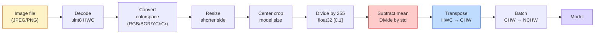
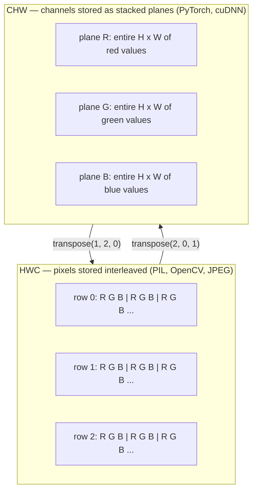

# Hình nền tảng  Pixel, kênh, không gian màu   hình nền  hình ảnh, đường dẫn và không gian màu

> Một hình ảnh là một tensor của các mẫu ánh sáng.

> **【中文解读】**图像本质上是一组光线采样值的张量多维数组. 图像本质上是一组光线采样值的张量多维数组. 无论是手机拍照,自动驾驶还是GPT-4V, tất cả các mô hình hình ảnh đều xuất phát từ thực tế cơ bản này.

**Type:** Build | **类型:** 动手
**Languages:** Python | **语言:** Python
**Prerequisites:** Phase 1 Lesson 12 (Tensor Operations), Phase 3 Lesson 11 (Intro to PyTorch) | **前置知识:** Phase 1 Lesson 12（张量运算）、Phase 3 Lesson 11（PyTorch 入门）
**Time:** ~45 minutes | **时间:** ~45 分钟

## Mục tiêu học tập

- Giải thích làm thế nào một cảnh liên tục được phân loại thành pixel và tại sao các quyết định lấy mẫu/quantization đặt trần trên mỗi mô hình dòng chảy xuống
  Trung ngữ翻译: giải thích các cảnh tiếp tục được phân tán thành hình ảnh, và tại sao các quyết định lấy/ định lượng quyết định giới hạn trên của tất cả các mô hình dưới
- Đọc, cắt và kiểm tra hình ảnh như các mảng NumPy và chuyển đổi một cách ruột giữa các bố cục HWC và CHW
  Trung ngữ翻译:读取、切片、检查图像的NumPy 数组表示, và tự động chuyển đổi giữa HWC và CHW 布局
- Chuyển đổi giữa RGB, thang xám, HSV và YCbCr và biện minh tại sao mỗi không gian màu tồn tại
  Trung ngữ翻译: chuyển đổi giữa RGB、灰度、HSV và YCbCr, và giải thích lý do tồn tại của mỗi loại không gian màu sắc
- Sử dụng xử lý trước cấp độ pixel (tự chuẩn hóa, chuẩn hóa, thay đổi kích thước, kênh đầu tiên) chính xác như các mô hình thị giác PyTorch được đào tạo trước mong đợi
  Trung文翻译:精确按照预训练 PyTorch 视觉模型的期望做像素级预处理(归一化、标准化、缩放、通道前置)

## Vấn đề  vấn đề giới thiệu

Mỗi bài báo bạn sẽ đọc, mỗi cân nặng trước khi được đào tạo bạn sẽ tải xuống, mỗi API tầm nhìn bạn sẽ gọi giả định một mã hóa cụ thể của đầu vào.`uint8`hình ảnh nơi mô hình muốn `float32`và nó vẫn sẽ chạy  và lặng lẽ sản xuất rác. Đưa BGR vào một mạng được đào tạo trên RGB và độ chính xác sụp đổ mười điểm. Đưa một mô hình kênh - đầu vào cuối khi nó mong đợi kênh - đầu tiên và lớp conv đầu tiên coi chiều cao như một kênh tính năng. Không có điều này ném một lỗi. Nó chỉ làm hỏng métrics của bạn và bạn dành một tuần săn tìm một lỗi sống trong cách bạn tải tập tin.

> Mỗi bài viết bạn sẽ đọc, tải xuống, tập luyện, tập luyện, và mỗi API video bạn sẽ sử dụng, đều giả định một loại mã nhập cụ thể.`uint8`图像传给需要 `float32`Trong mô hình, nó vẫn sẽ hoạt động nhưng lặng lẽ tạo ra kết quả rác thải. Đưa BGR lên mạng được đào tạo trên RGB, tỷ lệ chính xác giảm mười điểm trăm. Đưa đường vào đầu cuối để truyền đến đường dự kiến. Trong mô hình trước nhất, lớp đầu tiên sẽ coi độ cao như là đường dẫn đặc trưng.

> **【中文解读】**Đây là "thầm lẫn" phổ biến nhất trong kỹ thuật hình ảnh máy tính. Nguồn: dữ liệu không phù hợp. mô hình sẽ không báo cáo sai, nhưng kết quả hoàn toàn sai. Ví dụ: đưa BGR (OpenCV) như RGB (PyTorch) 默认 (được chọn) cho mô hình, tỷ lệ xác thực có thể giảm 10 điểm trăm. Trong thực tế AI (AI) kỹ thuật, các vấn đề này có thể dẫn đến hệ thống tự lái bị sai lầm màu đỏ xanh lá cây.

Một cú xoay không phức tạp khi bạn biết nó đang trượt qua. Phần khó khăn là "một hình ảnh" có nghĩa là những điều khác nhau với một máy ảnh, một máy giải mã JPEG, PIL, OpenCV, torchvision và một hạt nhân CUDA. Mỗi ngăn xếp có trục tựa riêng của nó, phạm vi byte và quy tắc kênh. Một kỹ sư tầm nhìn không thể giữ cho các tàu thẳng này bị vỡ đường ống dẫn.

> Một khi bạn biết quấn ở trên trượt, nó không phức tạp. Phần khó khăn nằm ở "hình ảnh" đối với máy ảnh, JPEG, máy giải mã, PIL, OpenCV, torchvision và CUDA. Về cơ bản, có nghĩa là những thứ khác nhau. Mỗi công nghệ có thứ tự trục, phạm vi chữ và đường dẫn riêng của nó. Một kỹ sư thị giác không thể giải quyết được những điều này chỉ giao dịch dòng chảy bị thiếu sót.

Bài học này cố định nền tảng để phần còn lại của giai đoạn có thể xây dựng trên nó. Đến cuối bạn sẽ biết một pixel là gì, tại sao có ba số cho mỗi pixel thay vì một, "tự chuẩn hóa với thống kê ImageNet" thực sự làm gì, và làm thế nào để di chuyển giữa hai hoặc ba bố cục mà mọi bài học khác trong giai đoạn này sẽ giả định.

> Bài học này là cơ sở thực tế, để phần còn lại của bài học này có thể được xây dựng trên đó. Sau khi học xong, bạn sẽ biết hình ảnh là gì, tại sao mỗi hình ảnh có ba con số thay vì một, "được thực hiện bằng cách sử dụng ImageNet 统计归结" và cách chuyển đổi giữa hai hoặc ba quy trình được giả định trong phần còn lại của bài học.

> **【拓展：数据标注与质量】**视觉任务的效果高度依赖标签数据质量――Label Studio、CVAT là công cụ标签 chính thống――在工业场景中,主动学习(Active Learning) có thể giảm chi phí đánh dấu: mô hình đối với yêu cầu mẫu không xác định

## Khái niệm cốt lõi

### Đường ống xử lý trước hoàn toàn trong một cái nhìn

Mỗi hệ thống thị giác sản xuất đều là một chuỗi biến đổi đảo ngược. Một bước sai và mô hình sẽ thấy một đầu vào khác so với nó được đào tạo.

> Mỗi hệ thống hình ảnh cấp sản xuất đều là một chuỗi thay đổi có thể đảo ngược giống nhau.



Hai hộp màu đỏ và xanh là nơi 80% các lỗi âm thanh sống: thiếu tiêu chuẩn hóa và bố cục sai.

> 2 khung màu đỏ và màu xanh là 80% của sự thất bại của sự tĩnh lặng: thiếu tiêu chuẩn hóa và sai lầm trong bố cục.

> **【中文解读】**80% của sự cố tình tập trung trong hai phần: 1) không làm tiêu chuẩn hóa (không làm tiêu chuẩn hóa) 2) quy hoạch dữ liệu đã làm sai lầm (HWC vs CHW)

### Một pixel là một mẫu, không phải là một hình vuông.

Một cảm biến máy ảnh đếm photon rơi vào một lưới các máy dò nhỏ. Mỗi máy dò tích hợp ánh sáng trong một phần nhỏ của giây và phát ra điện áp tương xứng với số lượng photon chạm vào nó.

> 相机传感器统计 rơi vào số lượng quang trên lưới của máy dò nhỏ. Mỗi máy dò trong một khoảng thời gian, tích lũy ánh sáng, phát ra số lượng quang của nó với áp suất tương đương với áp suất.

```
Continuous scene                 Sensor grid                     Digital image
(infinite detail)                (H x W detectors)               (H x W integers)

    ~~~~~                        +--+--+--+--+--+                 210 198 180 155 120
   ♪ ♪ Tôi đã làm gì ♪ ♪ ♪ Tôi đã làm gì ♪
  - - - - - - - - - - - - - - - - - - - - - - - - - - - - - - - - - - - - - - - - - - - - - - - - - - - - - - - - - - - - - - - - - - - - - - - - - - - - - - - - - - - - - - - - - - - - - - - - - - - - - - - - - - - - - - - - - - - - - - - - - - - - - - - - - - - - - - - - - - - - - - - - - - - - - - - - - - - - - - - - - - - - - - - - - - - - - - - - - - - - - - - - - - - - - - - - - - - - - - - - - - - - - - - - - - - - - - - - - - - - - - - - - - - - - - - - - - - - - - - - - - - - - - - - - - - - - - - - - - - - - - - - - - - - - - - - - - - - - - - - - - - - - - - - - - - - - - - - - - - - - - - - - - - - - - - - - - - - - - - - - - - - - - - - - - - - - - - - - - - - - - - - - - - - - - - - - - - - - - - - - - - - - - - - - - - - - - - - - - - - - - - - - - - - - - - - - - - - - - - - - - - - - - - - - - - - - - - - - - - - - - - - - - - - - - - - - - - - - - - - - - - - - - - - - - - - - - - - - - - - - - - - - - - - - - - - - - - - - - - - - - - - - - - - - - - - - - - - - - - - - - - - - - - - - -
   ~~~~~                         |  |  |  |  |  |                 195 185 170 148 112
                                 +--+--+--+--+--+                 188 180 165 145 108
```

Có hai lựa chọn xảy ra ở bước này và họ cố định trần nhà trên mọi thứ dòng chảy xuống:

- **Spatial sampling**cho biết có bao nhiêu máy dò cho mỗi độ của cảnh. quá ít, và các cạnh trở nên đốm (aliasing). quá nhiều, và lưu trữ và tính toán nổ.
  Trung ngữ翻译:空间采样决定场景每度有多少探测器──太少则边缘出现(混叠)──太多则储量和计算量暴增──
- **Intensity quantization**8 bit cho 256 mức và là tiêu chuẩn cho hiển thị. 10, 12, 16 bit cho gradient mịn hơn và vật chất cho hình ảnh y tế, HDR, và ống dẫn cảm biến nguyên liệu.
  Trung ngữ翻译:强度量化决定电压被分得多细――8位给出 256 级别,是显示标准――10、12、16位提供更平滑的梯度,对医学成像、HDR和原始传感器流水线很重要――

Một pixel không phải là một hình vuông màu với diện tích. Nó là một phép đo duy nhất. Khi bạn thay đổi kích thước hoặc xoay, bạn đang lấy lại mẫu lưới đo đó.

> 像素 không phải là một khối màu có diện tích. Nó là một phép đo. Khi bạn mở rộng hoặc quay, bạn đang lấy lại một hình dạng của một mạng lưới đo.

> **【中文解读】**像素 không phải là một khối hình nhỏ, mà là một điểm lấy mẫu 传感器 đo một số lượng ở một vị trí không gian nào đó.

### Tại sao có ba kênh? Tại sao có ba kênh?

Một máy dò đếm photon trên toàn bộ quang phổ có thể nhìn thấy  đó là thang xám. Để có được màu sắc, cảm biến bao phủ lưới với một hình ảnh của các bộ lọc đỏ, xanh lá cây và xanh lá cây. Sau khi làm phân tích, mỗi vị trí không gian có ba số nguyên: phản ứng của máy dò lọc màu đỏ, lọc màu xanh lá cây và lọc màu xanh lá cây gần đó. Ba số nguyên là bộ ba RGB của một pixel.

> Một bộ viền dò thống kê toàn bộ quang tử trên quang phổ có thể nhìn thấy đó là độ xám. Để có được màu sắc, các bộ cảm biến sử dụng red、绿、蓝光片 của các bộ viền trên máy viền. Sau khi đi vào máy viền, mỗi vị trí không gian có ba nguyên tố: red光探测器、绿光探测器和蓝光探测器的响应值──

```
One pixel in memory:

    (R, G, B) = (210, 140, 30)   <- reddish-orange

An H x W RGB image:

    shape (H, W, 3)     stored as   H rows of W pixels of 3 values
                                    each in [0, 255] for uint8
```

Ba không phải là phép thuật. Các máy ảnh độ sâu thêm một kênh Z. Các vệ tinh thêm băng hồng ngoại và cực tím. Quét nghiệm y tế thường có một kênh (X-quang, CT) hoặc nhiều kênh (lớn quang phổ). Số lượng kênh là trục cuối cùng; các lớp conv học để pha trộn qua nó.

> 三不是魔法──深度摄像头增加 Z通道──卫星增加红外和紫外波段──医学扫描通常有一个通道(X光、CT) 或许多通道(高光谱)──通道数是最后一个轴;卷积层学习跨通道混合──

> **【拓展：多通道图像】**Hình ảnh cảm giác xa vệ tinh thường có quang cực đỏ, quang cực và các hình ảnh ngoại quang khác nhau (tương tự như Kinect, iPhone LiDAR) sẽ tăng độ sâu của đường dẫn D. Những hình ảnh đa đường dẫn này được áp dụng rộng rãi trong giám sát nông nghiệp, chẩn đoán y tế và lái xe tự động.

### Hai quy trình quy định: HWC và CHW.

Tăng-tơ giống nhau, hai thứ tự.

> Cùng một 张量, hai thứ tự.

```
HWC (height, width, channels)           CHW (channels, height, width)

   W ->                                    H ->
  +-----+-----+-----+                     +-----+-----+
H |R G B|R G B|R G B|                   C |R R R R R R|
| +-----+-----+-----+                   | +-----+-----+
v |R G B|R G B|R G B|                   v |G G G G G G|
  +-----+-----+-----+                     +-----+-----+
                                          |B B B B B B|
                                          +-----+-----+

   PIL, OpenCV, matplotlib,              PyTorch, most deep learning
   almost every image file on disk       frameworks, cuDNN kernels
```

CHW tồn tại vì các hạt nhân convolution trượt qua H và W. Giữ trục kênh trước tiên có nghĩa là mỗi hạt nhân thấy một trình độ 2D liền kề mỗi kênh, mà vectorizes sạch sẽ.

> CHW 之所以存在,是因为卷积核在H 和 W 上滑动──保持通道轴在最前面意味着每个核看到的是每个通道的一个连续2D平面,可以干净地向量化──磁盘格式保持HWC是因为那匹配传感器扫描线的输出方式──

> **【中文解读】**HWC(高×宽×通道) là định dạng của PIL、OpenCV 等库, cũng là hình ảnh file trên đĩa lưu trữ cách thức. CHW(通道×高×宽) là định dạng sử dụng PyTorch 和 GPU 计算(cuDNN), vì khối lượng hạt nhân ở H 和 W 上滑时,通道前置使 mỗi hạt nhân nhìn thấy là liên tục 2D 平面, tính năng hiệu quả hơn.

Việc chuyển đổi một dòng bạn sẽ gõ một ngàn lần:

> Anh sẽ đánh một ngàn lần chuyển đổi đơn:

```
img_chw = img_hwc.transpose(2, 0, 1)      # NumPy
img_chw = img_hwc.permute(2, 0, 1)        # PyTorch tensor
```

Layout bộ nhớ, hình ảnh hóa:

> Nội dung:



### Phạm vi byte và dtype 字节 phạm vi và kiểu dữ liệu

Ba hội nghị chủ yếu:

> 三种约定占主导地位:

| Convention | dtype | Range | Where you see it |
|------------|-------|-------|------------------|
| Raw | `uint8` | [0, 255] | Files on disk, PIL, OpenCV output |
| Normalized | `float32` | [0.0, 1.0] | After `img.astype('float32') / 255` |
| Standardized | `float32` | roughly [-2, +2] | After subtracting mean and dividing by std |

Các mạng convolutional được đào tạo trên các đầu vào tiêu chuẩn hóa.`mean=[0.485, 0.456, 0.406]`- `std=[0.229, 0.224, 0.225]`là trung bình toán học và lệch tiêu chuẩn của ba kênh trên bộ đào tạo ImageNet đầy đủ, được tính trên [0, 1] pixel bình thường.`uint8`trong một mô hình dự kiến lơ lửng tiêu chuẩn là sự thất bại im lặng phổ biến nhất trong tầm nhìn ứng dụng.

> 卷积网络 là chuẩn hóa nhập trên đào tạo.`mean=[0.485, 0.456, 0.406]``std=[0.229, 0.224, 0.225]`là toàn bộ ImageNet tập hợp các toán học trung bình và tiêu chuẩn khác nhau, trong [0, 1] tính toán trên các hình ảnh phân tích.`uint8`Mô hình của các điểm tăng chuẩn được đưa ra là thất bại tĩnh lặng phổ biến nhất trong ứng dụng.

> **【中文解读】**三种数据范围:(1) uint8 [0,255] 文件/PIL/OpenCV 的原始输出;(2) float32 [0,1] 归化后;(3) float32 ≈[-2,+2]  ImageNet 标准化后──把 uint8 直接给期望标准化输入的模型,是最常见的"静默失败"──ImageNet 的平均值和标准差是整个训练集预测出来的,几乎所有训练模型都使用这个组数量──

### Không gian màu và lý do tại sao chúng tồn tại

RGB là định dạng chụp nhưng nó không phải lúc nào cũng là đại diện hữu ích nhất cho một mô hình.

> RGB là một định dạng chụp, nhưng không phải là biểu hiện hữu ích nhất cho mô hình.

```
 RGB               HSV                       YCbCr / YUV

 R red             H hue (angle 0-360)       Y luminance (brightness)
 G green           S saturation (0-1)        Cb chroma blue-yellow
 B blue            V value/brightness (0-1)  Cr chroma red-green

 Linear to         Separates color from      Separates brightness from
 sensor output     brightness. Useful for    color. JPEG and most video
                   color thresholding, UI    codecs compress the chroma
                   sliders, simple filters   channels harder because the
                                             human eye is less sensitive
                                             to chroma detail than to Y.
```

Đối với hầu hết các đài CNN hiện đại, bạn cung cấp RGB. Bạn gặp các không gian khác khi:

> Đối với hầu hết các CNN hiện đại, bạn nhập RGB. Bạn sẽ gặp các không gian màu khác trong các trường hợp sau:

- **HSV** mã CV cổ điển, phân đoạn dựa trên màu sắc, cân bằng trắng.
  Trung文翻译:经典简历 代码、基于颜色的分化、白平衡──
- **YCbCr** đọc nội dung JPEG, đường ống video, mô hình siêu độ phân giải chỉ hoạt động trên Y.
  Trung ngữ翻译:读取 JPEG 内部结构、视频流水线、仅在Y通道上操作的超分辨率模型──
- **Grayscale** OCR, mô hình tài liệu, bất kỳ trường hợp nào màu sắc là biến phiền nhiễu thay vì tín hiệu.
  Trung ngữ翻译:OCR、文档模型、颜色是干扰变量而不是信号的任何场景──

Tỷ lệ xám từ RGB là một tổng số cân nặng, không phải là trung bình, bởi vì mắt con người nhạy cảm hơn với màu xanh lá cây hơn là màu đỏ hoặc xanh dương:

> Từ RGB 转灰度 là tăng cường, không phải là trung bình, vì mắt người nhạy cảm hơn với màu xanh lá cây so với màu đỏ hoặc xanh dương:

```
Y = 0.299 R + 0.587 G + 0.114 B       (ITU-R BT.601, the classic weights)
```

### Tỷ lệ khía cạnh, quy mô lại, và sự phân cực 宽高比 缩放与插值

Mỗi mô hình đều có kích thước đầu vào cố định (224x224 cho hầu hết các phân loại ImageNet, 384x384 hoặc 512x512 cho các máy dò hiện đại).

> Mỗi mô hình có kích thước nhập cố định. Hầu hết các phân loại hình ảnh là 224x224, các máy kiểm tra hiện đại là 384x384 hoặc 512x512.

- **Resize shorter side, then center crop** công thức tiêu chuẩn của ImageNet. Giữ tỷ lệ hình ảnh, ném đi một dải của các pixel cạnh.
  Trung ngữ翻译:缩放短边然后中心裁剪标准 ImageNet 做法──保持宽高比,丢弃一条边缘像素──
- **Resize and pad** bảo tồn tỷ lệ hình ảnh và mỗi pixel, thêm thanh đen.
  Trung ngữ翻译:缩放并填充保持宽高比和每个像素,添加黑边──检测和OCR的标准做法──
- **Resize directly to target** kéo dài hình ảnh. rẻ, làm biến dạng hình học, tốt cho nhiều nhiệm vụ phân loại.
  Trung ngữ翻译:直接缩缩到目标尺寸拉伸图像──成本低, hình dạng hình dạng cong, nhưng đối với nhiều phân loại nhiệm vụ đủ──

Phương pháp phân cực quyết định cách tính các pixel trung gian khi lưới mới không phù hợp với lưới cũ:

> 插值方法 quyết định khi các mạng mới không phù hợp với các mạng cũ làm thế nào để tính toán giữa các hình ảnh:

```
Nearest neighbour     fastest, blocky, only choice for masks/labels
Bilinear              fast, smooth, default for most image resizing
Bicubic               slower, sharper on upscaling
Lanczos               slowest, best quality, used for final display
```

Quy tắc ngón tay: hàng tỷ đường cho đào tạo, hai khối hoặc lanczos cho tài sản bạn sẽ xem, gần nhất cho bất cứ thứ gì có chứa các thẻ nhận dạng lớp nguyên số.

> 经验法则: tập luyện bằng hai đường, trình bày bằng hai ba lần hoặc Lanczos, chứa toàn bộ số lượng các loại ID của hàng xóm gần đây.

> **【中文解读】**缩放时的插值方法选择:近邻 (近邻) 速度最快但会产生, chỉ dùng để ẩn码/标签图;双线性 (双线性) 又快又平滑,是训练时的默认选择;双三次 (双立方) 慢慢但放大时更清晰;Lanczos 最慢但质量最好;;

> **【拓展：工业部署中的视觉系统】**Trong thực tế, mô hình hình ảnh cần phải xem xét các vấn đề về sự chậm trễ, mô hình lớn, thiết bị cạnh phù hợp, vv.
```figure
conv-output-size
```

## Hãy xây dựng nó.

### Bước 1: Xây dựng một tensor hình ảnh và kiểm tra hình dạng của nó.

Bắt đầu với một hình ảnh tổng hợp xác định để phòng thí nghiệm đầu tiên chạy offline chỉ với NumPy. Việc giải mã tập tin là một ranh giới riêng biệt: một khi một máy giải mã JPEG hoặc PNG trả về các byte RGB, mỗi hoạt động tensor dưới đây đều giống nhau.

> Từ một hình ảnh tổng hợp xác định bắt đầu, để thử nghiệm thứ nhất chỉ cần NumPy để có thể hoạt động trên mạng.

```python
import numpy as np

def synthetic_rgb(h=128, w=192, seed=0):
    rng = np.random.default_rng(seed)
    yy, xx = np.meshgrid(np.linspace(0, 1, h), np.linspace(0, 1, w), indexing="ij")
    r = (np.sin(xx * 6) * 0.5 + 0.5) * 255
    g = yy * 255
    b = (1 - yy) * xx * 255
    rgb = np.stack([r, g, b], axis=-1) + rng.normal(0, 6, (h, w, 3))
    return np.clip(rgb, 0, 255).astype(np.uint8)

arr = synthetic_rgb()

print(f"type:   {type(arr).__name__}")
print(f"dtype:  {arr.dtype}")
print(f"shape:  {arr.shape}     # (H, W, C)")
print(f"min:    {arr.min()}")
print(f"max:    {arr.max()}")
print(f"pixel at (0, 0): {arr[0, 0]}")
```

Tạo sản lượng dự kiến: `shape: (H, W, 3)`- `dtype: uint8`, phạm vi`[0, 255]`Đó là biểu diễn được giải mã theo quy luật cho dù các byte đến từ một máy ảnh, một máy giải mã hình ảnh, hoặc một máy phát điện tổng hợp này.

> 预期输出:`shape: (H, W, 3)``dtype: uint8`、 phạm vi `[0, 255]` Đó là quy tắc sau khi giải mã cho thấy, dù chữ từ máy ảnh, hình ảnh giải mã hoặc bộ tạo tổng hợp 

### Bước 2: Chia kênh và sắp xếp lại.

Lấy R, G, B riêng biệt, sau đó chuyển đổi từ HWC sang CHW cho PyTorch.

> 分别提取 R、G、B, sau đó chuyển HWC thành CHW để sử dụng PyTorch.

```python
R = arr[:, :, 0]
G = arr[:, :, 1]
B = arr[:, :, 2]
print(f"R shape: {R.shape}, mean: {R.mean():.1f}")
print(f"G shape: {G.shape}, mean: {G.mean():.1f}")
print(f"B shape: {B.shape}, mean: {B.mean():.1f}")

arr_chw = arr.transpose(2, 0, 1)
print(f"\nHWC shape: {arr.shape}")
print(f"CHW shape: {arr_chw.shape}")
```

Ba phẳng thang xám, một trên mỗi kênh. CHW chỉ sắp xếp lại các trục; không cần có bản sao dữ liệu nghiêm ngặt khi bố cục bộ nhớ cho phép.

> Ba phẳng độ ốm, mỗi đường một. CHW chỉ đơn giản là tái sắp xếp trục; khi trong bộ sưu tập cho phép, không đòi hỏi nghiêm ngặt sao chép dữ liệu.

### Bước 3: chuyển đổi thang xám và HSV .

Đánh giá số lượng xám, sau đó là một bản RGB đến HSV.

> + quyền truy vấn và độ cao, sau đó bắt tay thực hiện RGB 转 HSV

```python
def rgb_to_grayscale(rgb):
    weights = np.array([0.299, 0.587, 0.114], dtype=np.float32)
    return (rgb.astype(np.float32) @ weights).astype(np.uint8)

def rgb_to_hsv(rgb):
    rgb_f = rgb.astype(np.float32) / 255.0
    r, g, b = rgb_f[..., 0], rgb_f[..., 1], rgb_f[..., 2]
    cmax = np.max(rgb_f, axis=-1)
    cmin = np.min(rgb_f, axis=-1)
    delta = cmax - cmin

    h = np.zeros_like(cmax)
    mask = delta > 0
    argmax = np.argmax(rgb_f, axis=-1)
    rmax = mask & (argmax == 0)
    gmax = mask & (argmax == 1)
    bmax = mask & (argmax == 2)
    h[rmax] = ((g[rmax] - b[rmax]) / delta[rmax]) % 6
    h[gmax] = ((b[gmax] - r[gmax]) / delta[gmax]) + 2
    h[bmax] = ((r[bmax] - g[bmax]) / delta[bmax]) + 4
    h = h * 60.0

    s = np.divide(delta, cmax, out=np.zeros_like(delta), where=cmax > 0)
    v = cmax
    return np.stack([h, s, v], axis=-1)

gray = rgb_to_grayscale(arr)
hsv = rgb_to_hsv(arr)
print(f"gray shape: {gray.shape}, range: [{gray.min()}, {gray.max()}]")
print(f"hsv   shape: {hsv.shape}")
print(f"hue range: [{hsv[..., 0].min():.1f}, {hsv[..., 0].max():.1f}] degrees")
print(f"sat range: [{hsv[..., 1].min():.2f}, {hsv[..., 1].max():.2f}]")
print(f"val range: [{hsv[..., 2].min():.2f}, {hsv[..., 2].max():.2f}]")
```

Hue xuất hiện trong độ, bão hòa và giá trị trong [0, 1].`hsv_full`Hội nghị.

> 色相以度数输出,和度和明度在 [0, 1] 范围内──这与OpenCV 的`hsv_full`约定一致.

### Bước 4: Tiêu chuẩn hóa, chuẩn hóa và đảo ngược nó. Bước 4: Tiêu chuẩn hóa và ngược lại thay đổi.

Đi từ các byte nguyên liệu đến các tensor chính xác một mô hình ImageNet được đào tạo trước mong đợi, sau đó quay lại.

> Từ phần gốc đến phần chuẩn ImageNet 模型期望的精确张量,再返回──

```python
mean = np.array([0.485, 0.456, 0.406], dtype=np.float32)
std = np.array([0.229, 0.224, 0.225], dtype=np.float32)

def preprocess_imagenet(rgb_uint8):
    x = rgb_uint8.astype(np.float32) / 255.0
    x = (x - mean) / std
    x = x.transpose(2, 0, 1)
    return x

def deprocess_imagenet(chw_float32):
    x = chw_float32.transpose(1, 2, 0)
    x = x * std + mean
    x = np.clip(x * 255.0, 0, 255).astype(np.uint8)
    return x

x = preprocess_imagenet(arr)
print(f"preprocessed shape: {x.shape}     # (C, H, W)")
print(f"preprocessed dtype: {x.dtype}")
print(f"preprocessed mean per channel:  {x.mean(axis=(1, 2)).round(3)}")
print(f"preprocessed std  per channel:  {x.std(axis=(1, 2)).round(3)}")

roundtrip = deprocess_imagenet(x)
max_diff = np.abs(roundtrip.astype(int) - arr.astype(int)).max()
print(f"roundtrip max pixel diff: {max_diff}    # should be 0 or 1")
```

Tỷ lệ trung bình mỗi kênh nên gần bằng không, std gần một.`transforms.Normalize`gọi là làm dưới nắp.

> Giá trị trung bình của mỗi đường dẫn nên gần 0, tiêu chuẩn khác nhau gần 1.`transforms.Normalize`调用 ở tầng dưới của những gì bạn làm.

### Bước 5: Tái kích thước từ đầu. Bước 5: Từ không thực hiện mở rộng

Các vòng hàng xóm gần nhất mỗi liên kết đầu ra đến một pixel nguồn. Sự phân cực hai tuyến tìm thấy bốn pixel xung quanh và pha trộn chúng theo khoảng cách. Cả hai thực hiện dưới đây sử dụng các liên kết liên kết với điểm cuối để pixel nguồn đầu tiên và cuối cùng vẫn được cố định.

> Gần đây, mỗi bên cạnh đưa mỗi điểm xuất vào một hình ảnh nguồn. Giá trị đính kèm hai đường tìm thấy bốn hình ảnh xung quanh và theo khoảng cách hỗn hợp.

```python
def resize_coordinates(source_length, target_length):
    if target_length == 1:
        return np.zeros(1, dtype=np.float32)
    return np.linspace(0, source_length - 1, target_length, dtype=np.float32)

def nearest_resize(image, target_height, target_width):
    y = np.rint(resize_coordinates(image.shape[0], target_height)).astype(int)
    x = np.rint(resize_coordinates(image.shape[1], target_width)).astype(int)
    return image[y[:, None], x[None, :]]

def bilinear_resize(image, target_height, target_width):
    y = resize_coordinates(image.shape[0], target_height)
    x = resize_coordinates(image.shape[1], target_width)
    y0 = np.floor(y).astype(int)
    x0 = np.floor(x).astype(int)
    y1 = np.minimum(y0 + 1, image.shape[0] - 1)
    x1 = np.minimum(x0 + 1, image.shape[1] - 1)
    wy = (y - y0)[:, None, None]
    wx = (x - x0)[None, :, None]

    source = image.astype(np.float32)
    top = source[y0[:, None], x0[None, :]] * (1 - wx)
    top += source[y0[:, None], x1[None, :]] * wx
    bottom = source[y1[:, None], x0[None, :]] * (1 - wx)
    bottom += source[y1[:, None], x1[None, :]] * wx
    result = top * (1 - wy) + bottom * wy
    return np.clip(np.rint(result), 0, 255).astype(image.dtype)

target_height = arr.shape[0] * 3
target_width = arr.shape[1] * 3
nearest = nearest_resize(arr, target_height, target_width)
bilinear = bilinear_resize(arr, target_height, target_width)

def local_roughness(x):
    gy = np.diff(x.astype(float), axis=0)
    gx = np.diff(x.astype(float), axis=1)
    return float(np.abs(gy).mean() + np.abs(gx).mean())

for name, out in [("nearest", nearest), ("bilinear", bilinear)]:
    print(f"{name:>8}  shape={out.shape}  roughness={local_roughness(out):6.2f}")
```

Điểm gần nhất cao nhất trên độ thô lỗ vì nó giữ cạnh cứng. Bilinear mịn hơn vì mỗi pixel mới kết hợp hai vị trí trên mỗi trục. Người đồng hành chạy mở rộng ý tưởng phân tách tương tự đến bốn hàng xóm trên mỗi trục với hạt nhân khối Catmull-Rom, sau đó in tất cả ba kết quả mà không cần thư viện hình ảnh.

> Điểm cao nhất là gần đây của gần đây, vì nó giữ lại cạnh cứng. Bi-linearity dễ dàng hơn, vì mỗi hình ảnh mới được trộn lẫn hai vị trí trên mỗi trục. Có thể vận hành mã hỗ trợ mở rộng các lối chia tách tương tự đến bốn người hàng xóm trên mỗi trục.

> **【中文解读】**                                                                                                                                                                                                                                                              `np.linspace`端点对齐 + 索引集集),再去看库的封装──配套的`code/main.py`Ngoài ra đã thực hiện Catmull-Rom 双三次核, sử dụng cùng một bộ có thể phân chia trọng lượng in gần nhất / hàng tỷ / hai khối 三种结果对比.

## Sử dụng nó thực tế

PyTorch thực hiện các hoạt động tương tự trên các tensor có tính năng thiết bị. Mã dưới đây sẽ đổi kích thước bên ngắn hơn, lấy một crop trung tâm, chuẩn hóa mỗi kênh và tạo ra tensor NCHW mà mô hình được đào tạo trước mong đợi.

> PyTorch thực hiện cùng một hoạt động trên khối lượng của thiết bị cảm nhận được quy mô quy mô quy mô quy mô quy mô quy mô quy mô quy mô quy mô quy mô quy mô quy mô quy mô quy mô quy mô quy mô quy mô quy mô quy mô quy mô quy mô quy mô quy mô quy mô quy mô quy mô quy mô quy mô quy mô quy mô quy mô quy mô quy mô quy mô quy mô quy mô quy mô quy mô quy mô quy mô quy mô quy mô quy mô quy mô quy mô quy mô quy mô quy mô quy mô quy mô quy mô quy mô quy mô quy mô quy mô quy mô quy mô quy mô quy mô quy mô quy mô quy mô quy mô quy mô quy mô quy mô quy mô quy mô quy mô quy mô quy mô quy mô quy mô quy mô quy mô quy mô quy mô quy mô quy mô quy mô quy mô quy mô quy mô quy mô quy mô quy mô quy mô quy mô quy mô quy mô quy mô quy mô quy mô quy mô quy mô quy mô quy mô quy mô quy mô quy mô quy mô quy mô quy mô quy mô quy mô quy mô quy mô quy mô quy mô quy mô quy mô quy mô quy mô quy mô quy mô quy mô quy mô quy mô quy mô quy mô quy mô quy mô quy mô quy mô quy mô quy mô quy mô quy mô quy mô quy quy quy quy quy quy quy quy quy quy quy quy quy quy quy quy quy quy quy quy quy quy quy quy quy quy quy quy quy quy quy quy quy quy quy quy quy quy quy quy quy quy quy quy quy quy quy quy quy quy quy quy quy quy quy quy quy quy quy quy quy quy quy quy quy quy quy quy quy quy quy quy quy quy quy quy quy quy quy quy quy quy quy quy quy quy quy quy quy quy quy quy quy quy quy quy quy quy quy quy quy quy quy quy quy quy quy quy quy quy quy quy quy quy quy quy quy quy quy quy quy quy quy quy quy quy quy quy quy quy quy quy quy quy quy quy quy quy quy quy quy quy quy quy quy quy quy quy quy quy quy quy quy quy quy quy quy quy quy quy quy quy quy quy quy quy quy quy quy quy quy quy quy quy quy quy quy quy quy quy quy quy quy quy quy quy quy quy quy quy quy quy quy quy quy quy quy quy quy quy quy quy quy quy quy quy quy quy quy quy quy quy quy quy quy quy quy quy quy quy quy quy quy quy quy quy quy quy quy quy quy quy quy

```python
import torch
import torch.nn.functional as F

image_hwc = torch.from_numpy(synthetic_rgb(256, 320))
batch = image_hwc.permute(2, 0, 1).unsqueeze(0).float() / 255.0

height, width = batch.shape[-2:]
scale = 256 / min(height, width)
resized_height = round(height * scale)
resized_width = round(width * scale)
batch = F.interpolate(
    batch,
    size=(resized_height, resized_width),
    mode="bilinear",
    align_corners=False,
    antialias=True,
)

top = (resized_height - 224) // 2
left = (resized_width - 224) // 2
batch = batch[:, :, top:top + 224, left:left + 224]

mean = torch.tensor([0.485, 0.456, 0.406]).view(1, 3, 1, 1)
std = torch.tensor([0.229, 0.224, 0.225]).view(1, 3, 1, 1)
batch = (batch - mean) / std

print(f"tensor dtype: {batch.dtype}")
print(f"batched shape: {tuple(batch.shape)}")
print(f"per-channel mean: {batch.mean(dim=(0, 2, 3)).tolist()}")
print(f"per-channel std:  {batch.std(dim=(0, 2, 3)).tolist()}")
```

Bốn bước, theo thứ tự chính xác này: chuyển đổi các byte sang nổi và đổi HWC thành NCHW, thay đổi kích thước bên ngắn hơn thành 256, lấy một vùng trung tâm 224x224, sau đó trừ trung bình ImageNet và chia bằng sự lệch chuẩn của nó.

> Bốn bước, theo thứ tự chính xác này: chuyển phần tử thành浮点并将 HWC chuyển thành NCHW, rút ngắn thành 256, lấy 224x224 cắt trung tâm, sau đó giảm ImageNet 平均值并除其标准差──颠倒这个序列会静默改变模型接收的内容──

> **【中文解读】**Bản mới"Uses Framework Implement" từ `torchvision.transforms`换成裸 `torch`+ `torch.nn.functional`:permute→unpress 换布局、`F.interpolate`缩放短边(注意 `antialias=True`Với`align_corners=False`Những hai cấp độ sản xuất mặc định) 张量切片做中心剪切,广播减平均值除标准差――这让你看`transforms.Compose`底下每一步的真实形状变化批量 维(N)始终在第0轴──

## Đưa nó ra.

Bài học này mang lại:

> 本课产 出:

- `outputs/prompt-vision-preprocessing-audit.md` một lời nhắc biến bất kỳ thẻ mô hình hoặc thẻ tập hợp dữ liệu nào thành danh sách kiểm tra các biến số tiền xử lý chính xác mà một nhóm phải tôn trọng.
  Trung ngữ翻译:`outputs/prompt-vision-preprocessing-audit.md` Một mô hình tùy chọn hoặc tập dữ liệu được chuyển đổi thành nhóm phải tuân thủ các lời khuyên của dự đoán xử lý không thay đổi
- `outputs/skill-image-tensor-inspector.md` một kỹ năng, nếu xem xét bất kỳ tensor hình ảnh hoặc mảng nào, báo cáo dtype, bố cục, phạm vi, và liệu nó có trông nguyên liệu, bình thường hoặc chuẩn hóa hay không.
  Trung ngữ翻译:`outputs/skill-image-tensor-inspector.md`Một kỹ năng: cho phép xác định lượng hoặc số lượng hình ảnh tùy chọn, báo cáo dtype, layout, phạm vi giá trị của nó, cũng như nó trông giống như nguyên thủy, tập hợp hoặc tiêu chuẩn hóa.

## Tập luyện bài tập

> **【中文解读】**练题按照 Easy/Medium/Hard 三个难度递进;;建议至少完成 级别的题目, 级别适合深入研究或面试准备;;

1. **(Easy)**Tạo một 2x2 RGB `uint8`chuyển đổi HWC thành CHW và trở lại, in cả hai hình dạng, và chứng minh chuyến đi trở lại bảo tồn mọi giá trị.
   Trung文翻译: tạo ra một chứa bốn màu khác nhau 2x2 RGB `uint8`Số组── trong HWC và CHW chuyển đổi, in hai hình dạng, và chứng minh chuyển đổi trở lại giữ cho mỗi giá trị──
2. **(Medium)**Hãy viết`standardize(img, mean, std)`và ngược của nó mà cùng nhau đi qua một `roundtrip_max_diff <= 1`Các chức năng của bạn phải hoạt động trên một hình ảnh duy nhất trong HWC và trên một lô trong NCHW với cùng một cuộc gọi.
   中文翻译:编写 `standardize(img, mean, std)` và hàm ngược, yêu cầu trong bất kỳ uint8 图像上通过 `roundtrip_max_diff <= 1`测试,且同调用既支持单张图(HWC) cũng ủng hộ批量(NCHW)。
3. **(Hard)**Hãy lấy một tensor tiêu chuẩn ImageNet 3 kênh và chạy nó qua một con số 1x1 mà học được một hỗn hợp trọng lượng của RGB vào một kênh thang xám.`[0.299, 0.587, 0.114]`, đóng băng chúng, và xác minh đầu ra phù hợp với hướng dẫn của bạn `rgb_to_grayscale`Những biến đổi không gian màu cổ điển nào khác có thể được viết là 1x1 xoắn?
   Trung文翻译:取一个三通道 ImageNet 标准化张量,送入一个把 RGB 加权混合成单通道灰度的1x1卷积──把权重初始化为`[0.299, 0.587, 0.114]`Kết luận, xác minh xuất và chuyển động`rgb_to_grayscale`Sự khác biệt trong điểm khác biệt trong. Hãy suy nghĩ: Có những thay đổi không gian màu điển hình nào có thể được viết thành 1x1 卷?

## Từ khóa  Keyword

| Term | What people say | What it actually means |
|------|----------------|----------------------|
| Pixel | "A coloured square" | One sample of light intensity at one grid location — three numbers for colour, one for grayscale |
| Channel | "The colour" | One of the parallel spatial grids stacked into an image tensor; last axis in HWC, first in CHW |
| HWC / CHW | "The shape" | Axis orderings for an image tensor; disk and PIL use HWC, PyTorch and cuDNN use CHW |
| Normalize | "Scale the image" | Divide by 255 so pixels live in [0, 1] — necessary but not sufficient |
| Standardize | "Zero-center" | Subtract mean and divide by std per channel so the input distribution matches what the model was trained on |
| Grayscale conversion | "Average the channels" | A weighted sum with coefficients 0.299/0.587/0.114 that matches human luminance perception |
| Interpolation | "How resize picks pixels" | The rule that decides output values when the new grid does not align with the old one — nearest for labels, bilinear for training, bicubic for display |
| Aspect ratio | "Width over height" | The ratio that distinguishes "resize and pad" from "resize and stretch" |

> 术语对照:Pixel=像素、Channel=通道、Normalize=归一化、Standardize=标准化、Grayscale conversion=灰度转换、Interpolation=插值、Aspect ratio=宽高比──完整中文释义见 zh.md 的术语表──

## Xem thêm 延伸阅读

- [Charles Poynton — A Guided Tour of Color Space](https://poynton.ca/PDFs/Guided_tour.pdf) cách xử lý kỹ thuật rõ ràng nhất về lý do tại sao có quá nhiều không gian màu sắc và khi mỗi một trong số đó quan trọng
  Trung ngữ翻译:Charles Poynton色彩空间导览解释为什么有如此多的色彩空间、各自何时重要最清晰技术论述──
- [PyTorch Vision Transforms Docs](https://pytorch.org/vision/stable/transforms.html) toàn bộ đường ống biến đổi bạn thực sự tạo ra trong sản xuất
  Trung文翻译:PyTorch Vision Transforms 文档生产环境中你真正要组合的完整变换流水线──
- [How JPEG Works (Colt McAnlis)](https://www.youtube.com/watch?v=F1kYBnY6mwg) một tour du lịch trực quan sắc nét của mẫu phụ chroma, DCT, và tại sao JPEG mã hóa YCbCr thay vì RGB
  Trung ngữ翻译:JPEG 是如何工作的(视频)色度子采样、DCT 以及JPEG 为何编码 YCbCr而不是RGB直观讲解──
- [ImageNet Preprocessing Conventions (torchvision models)](https://pytorch.org/vision/stable/models.html) nguồn gốc của sự thật cho `mean=[0.485, 0.456, 0.406]`và tại sao mọi người mẫu trong vườn thú đều mong đợi nó
  中文翻译:torchvision 模型的 ImageNet 预处理约定`mean=[0.485, 0.456, 0.406]`Nguồn quyền lực, và tại sao toàn bộ mô hình sử dụng nó.
