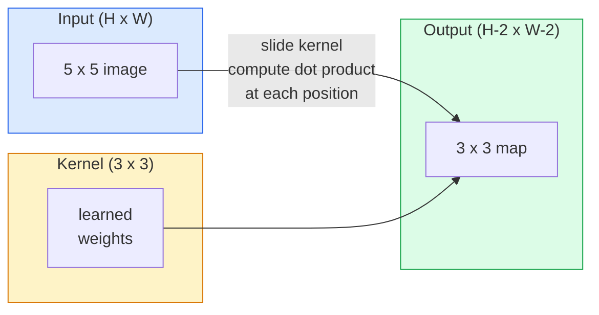
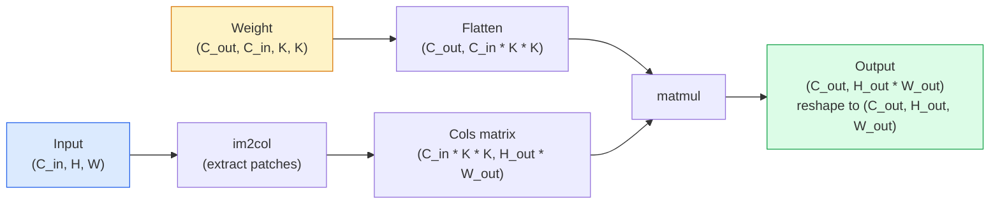

# Chuyển từ không từ không thực hiện

> Một convolution là một lớp dày đặc nhỏ mà bạn trượt qua một hình ảnh, chia sẻ cùng một trọng lượng ở mọi vị trí.

> **【中文解读】**卷积 bản chất là một "sơn nhỏ toàn kết nối lớp" sử dụng cùng một nhóm trọng lượng trong mỗi vị trí của hình ảnh tính toán điểm积. Điều này cho chúng ta hai đặc điểm quan trọng:平移等变性(输入移动,输出跟动) và tham số chia sẻ((((((((((((((((((((((((((((((((((((((((((((((((((((((((((((((((((((((((((((((((((((((((((((((((((((((((((((((((((((((((((((((((((((((((((((((((((((((((((((((((((((((((((((((((((((((((((((((((((((((((((((((((((((((((((((((((((((((((((((((((((((((((((((((((((((((((((((((((((((((((((((((((((((((((((((((((((((((((((((((((((((((((((((((((((((((((((((((((((((((((((((((((((((((((((((((((((((((((((((((((((((((((((((((((((((((((((((((((((((((((((

**Type:** Build | **类型:** 动手
**Languages:** Python | **语言:** Python
**Prerequisites:** Phase 3 (Deep Learning Core), Phase 4 Lesson 01 (Image Fundamentals) | **前置知识:** Phase 3（深度学习核心），Phase 4 Lesson 01（图像基础）
**Time:** ~75 minutes | **时间:** ~75 分钟

## Mục tiêu học tập

- Thực hiện convolution 2D từ đầu chỉ sử dụng NumPy, bao gồm phiên bản vòng tròn tổ và một vectorized `im2col`phiên bản
  Chỉ sử dụng NumPy từ không thực hiện 2D 卷积, bao gồm嵌套循环版 và向量化 im2col 版
- Xét kích thước không gian đầu ra cho bất kỳ kết hợp nào của kích thước đầu vào, kích thước hạt nhân, lấp đầy và bước, và biện minh cho `(H - K + 2P) / S + 1`công thức
  计算任意输入大小、核大小、填充和步幅组合下输出尺寸, hiểu公式 `(H - K + 2P) / S + 1`
- Các hạt nhân thiết kế bằng tay (đàn, mờ, sắc nét, Sobel) và giải thích tại sao mỗi hạt tạo ra mô hình kích hoạt nó thực hiện
  手动设计核(边缘检测、模糊、化、Sobel), giải thích mỗi loại hạt nhân tại sao tạo ra mô hình kích hoạt đối phó
- Các cúi vây đệm vào một bộ khai thác tính năng và kết nối độ sâu của đệm với kích thước của trường thụ thể
  Để hiểu được sự liên hệ giữa độ sâu và cảm giác của một khối lượng lớn

> **【中文解读】**Mục tiêu học tập được liệt kê trong danh sách các khả năng cốt lõi cần được nắm bắt sau khi hoàn thành bài học.


## Vấn đề  vấn đề giới thiệu

Một lớp kết nối hoàn toàn trên hình ảnh RGB 224x224 sẽ cần 224 * 224 * 3 = 150.528 trọng lượng đầu vào mỗi tế bào thần kinh. Một lớp ẩn duy nhất với 1.000 đơn vị đã có 150 triệu tham số trước khi bạn đã học được bất cứ điều gì hữu ích. Tệ hơn, lớp đó không có ý tưởng rằng một con chó ở phía trên bên trái và một con chó ở phía dưới bên phải là mô hình tương tự. Nó xử lý mọi vị trí pixel như độc lập, điều này hoàn toàn sai đối với hình ảnh: dịch một con mèo bằng ba pixel không nên buộc mạng lưới học lại khái niệm.

> Trong 224x224 hình ảnh RGB, mỗi tầng kết nối trên mỗi tế bào thần kinh cần 224 * 224 * 3 = 150,528 trọng lượng nhập. Một trong số chỉ có 1.000 đơn vị ẩn đã có 1.5 tỷ tham số trước khi bạn học được bất cứ điều gì hữu ích.

> **【中文解读】**Total Connection Layer Processing Image có hai vấn đề gây chết người: 1) Parameters Explosion224x224  Mỗi bộ thần kinh của hình ảnh cần 150.000 trọng lượng; 2) 没有平移不变性左上角猫和右下角猫被视为完全不同的模式──卷积通过参数共享──同一核滑过全图和局部连接──只看邻域──完美解决了这两个问题──

Hai tính chất mà mô hình hình ảnh cần là **translation equivariance**(tức năng xuất phát thay đổi khi input thay đổi) và **parameter sharing**(chính xác tính năng cùng chạy khắp mọi nơi) các lớp dày đặc cho bạn không cho.

> 2 đặc điểm của mô hình hình ảnh là**平移等变性**(输入移动时输出也移动) và**参数共享**(Tình kiểm tra cùng tính năng hoạt động tại tất cả các vị trí) ⋅ toàn bộ kết nối hai tầng đều không cung cấp ⋅卷积免费给你两层──

Convolution không được phát minh ra cho việc học sâu. Nó là cùng một hoạt động cung cấp năng lượng cho nén JPEG, mờ Gaussian trong Photoshop, phát hiện cạnh trong tầm nhìn công nghiệp và mọi bộ lọc âm thanh đã từng được xuất khẩu. Lý do CNN thống trị ImageNet từ năm 2012 đến năm 2020 là convolution là tiền lệ chính xác cho dữ liệu nơi các giá trị gần đó có liên quan và mô hình tương tự có thể xuất hiện ở bất cứ đâu.

> 卷积 không được phát triển để học sâu. Nó là động cơ JPEG 压缩, Photoshop 高斯模糊, kiểm tra biên giới thị trường công nghiệp và cùng một hoạt động của tất cả các máy ảnh 波器. CNN từ năm 2012 đến năm 2020 thống trị ImageNet là do卷积 liên quan đến giá trị hàng xóm và mô hình tương tự có thể xuất hiện ở bất kỳ vị trí nào.

> **【拓展：CNN 的工业应用】**卷积并非深度学习发明的──JPEG 压缩、Photoshop 模糊、工业视觉边缘检测、音频波器都使用卷积── Trong lĩnh vực AI, CNN đã thúc đẩy mục tiêu kiểm tra trong tự lái lái (YOLO) 医学影像分析、人脸识别(FaceNet) 等核心应用──

## Khái niệm cốt lõi

### Một hạt nhân, trượt, một hạt nhân, trượt toàn bộ

Một sự xoay quanh 2D lấy một khối lượng nhỏ được gọi là hạt nhân (hoặc bộ lọc), trượt nó qua đầu vào, và tại mỗi vị trí tính toán tổng số các sản phẩm thông minh về các yếu tố.

> 2D 卷积取一个称为核波器的小权重矩阵,在输入上滑动它,在每个位置计算每个元素乘积之和.



Ví dụ cụ thể 3x3 trên đầu vào 5x5 (không đệm, bước 1):

> Trong 5x5 输入 trên cụ thể 3x3 biểu mẫu(无填充,步幅 1):

```
Input X (5 x 5):                Kernel W (3 x 3):

  1  2  0  1  2                   1  0 -1
  0  1  3  1  0                   2  0 -2
  2  1  0  2  1                   1  0 -1
  1  0  2  1  3
  2  1  1  0  1

The kernel slides across every valid 3 x 3 window. Output Y is 3 x 3:

 Y[0,0] = sum( W * X[0:3, 0:3] )
 Y[0,1] = sum( W * X[0:3, 1:4] )
 Y[0,2] = sum( W * X[0:3, 2:5] )
 Y[1,0] = sum( W * X[1:4, 0:3] )
 ... and so on
```

Một công thức đó  **shared weights, locality, sliding window** là toàn bộ ý tưởng.

> 那一个公式**共享权重、局部性、滑动窗口**就是全部思想──其他都是簿记──

> **【中文解读】**Tất cả ý tưởng của卷积缩为三点: chia sẻ quyền trọng lượng(同一组参数在所有位置复用) ̇局部性(每次只看一个小窗口) ̇滑动窗口(次次遍历所有位置) ⋅输出 Y 的每个元素就是核与输入窗口的点积──

### Công thức kích thước sản xuất

Với kích thước không gian đầu vào `H`, kích thước hạt nhân `K`, bọc `P`, bước đi`S`- Có thể là:

```
H_out = floor( (H - K + 2P) / S ) + 1
```

Hãy nhớ điều này. Bạn sẽ tính toán nó hàng chục lần cho mỗi kiến trúc.

> Hãy nhớ công thức này. Bạn sẽ tính toán nó trong mỗi cấu trúc.

> **【中文解读】**输出尺寸公式 `H_out = floor((H - K + 2P) / S) + 1`là thiết kế bất kỳ cấu trúc CNN nào  toán thường xuyên nhất. "Đồng độ đệm" chỉ để H_out = H( khi S=1 时), tại thời điểm P = (K-1) /2/. Đó là lý do tại sao 3x3 核最流行它 là số lượng hạt nhân nhỏ nhất, có điểm trung tâm rõ ràng.

| Scenario | H | K | P | S | H_out | 中文说明 |
|----------|---|---|---|---|-------|--------|
| Valid conv, no padding | 32 | 3 | 0 | 1 | 30 | 无填充，尺寸缩小 |
| Same conv (preserves size) | 32 | 3 | 1 | 1 | 32 | 同填充，保持尺寸 |
| Downsample by 2 | 32 | 3 | 1 | 2 | 16 | 步幅2，下采样 |
| Pool 2x2 | 32 | 2 | 0 | 2 | 16 | 池化层 |
| Large receptive field | 32 | 7 | 3 | 2 | 16 | 大感受野 |

"Tương tự đệm" có nghĩa là chọn P để H_out == H khi S == 1. Đối với K lẻ, đó là P = (K - 1) / 2. Đó là lý do tại sao các hạt nhân 3x3 thống trị  chúng là hạt nhân lẻ nhỏ nhất vẫn có trung tâm.

### Đánh đệm.

Nếu không đệm, mỗi vòng quay sẽ thu hẹp bản đồ tính năng. Lưu trữ 20 trong số đó và hình ảnh 224x224 của bạn sẽ trở thành 184x184, làm lãng phí tính toán trên biên giới và làm phức tạp các kết nối còn lại cần hình dạng phù hợp.

> Không lấp đầy, mỗi lần tròn sẽ thu nhỏ các đặc điểm. Sau khi lấp đầy 20 tầng, hình ảnh của bạn 224x224 trở thành 184x184, lãng phí các tính toán trên biên giới, và làm cho nhu cầu kết nối các hình dạng phù hợp trở nên phức tạp.

```
Zero padding (P = 1) on a 5 x 5 input:

  0  0  0  0  0  0  0
  0  1  2  0  1  2  0
  0  0  1  3  1  0  0
  0  2  1  0  2  1  0       Now the kernel can centre on pixel
  0  1  0  2  1  3  0       (0, 0) and still have three rows and
  0  2  1  1  0  1  0       three columns of values to multiply.
  0  0  0  0  0  0  0
```

Các mô hình bạn gặp trong thực tế: `zero`(được phổ biến nhất), `reflect`(nghĩa lường cạnh, tránh ranh giới cứng trong các mô hình tạo ra), `replicate`(tác lại cạnh), `circular`(đóng quanh, được sử dụng trong các vấn đề toroidal).

> 实践中遇到的模式:`zero`(đối thường thấy)`reflect`(镜像边缘, tránh tạo ra các mô hình cứng边界)`replicate`(复制边缘)`circular`(环绕, dùng cho các vấn đề xung quanh)

### Lên bước đi.

bước là kích thước bước của trượt. `stride=1`là mặc định. `stride=2`làm giảm một nửa kích thước không gian và là cách cổ điển để lấy mẫu bên trong một CNN mà không có một lớp hợp nhất riêng  mọi kiến trúc hiện đại (ResNet, ConvNeXt, MobileNet) sử dụng conv có bước thay vì max-pool ở đâu đó.

> 步幅是滑动的步长.`stride=1`Đó là giá trị được xác định.`stride=2`Để giảm kích thước không gian một nửa, trong CNN không sử dụng tầng phân lập đơn lẻ để thực hiện theo cách cổ điển.

```
Stride 1 on a 5 x 5 input, 3 x 3 kernel:

  starts: (0,0) (0,1) (0,2)        -> output row 0
          (1,0) (1,1) (1,2)        -> output row 1
          (2,0) (2,1) (2,2)        -> output row 2

  Output: 3 x 3

Stride 2 on the same input:

  starts: (0,0) (0,2)              -> output row 0
          (2,0) (2,2)              -> output row 1

  Output: 2 x 2
```

### Nhiều kênh nhập khẩu.

Hình ảnh thực có ba kênh. Một convolution 3x3 trên một đầu vào RGB thực sự là một khối lượng 3x3x3: một mảnh 3x3 cho mỗi kênh đầu vào. Tại mỗi vị trí không gian, bạn nhân và cộng trên cả ba mảnh và thêm một thiên vị.

> Thực tế hình ảnh có ba lối đi. RGB  nhập vào 3x3 卷积 thực tế là một khối lượng 3x3x3: mỗi bước vào một 3x3 切片.

```
Input:   (C_in,  H,  W)        3 x 5 x 5
Kernel:  (C_in,  K,  K)        3 x 3 x 3 (one kernel)
Output:  (1,     H', W')       2D map

For a layer that produces C_out output channels, you stack C_out kernels:

Weight:  (C_out, C_in, K, K)   e.g. 64 x 3 x 3 x 3
Output:  (C_out, H', W')       64 x 3 x 3

Parameter count: C_out * C_in * K * K + C_out   (the + C_out is biases)
```

Dòng cuối cùng là dòng bạn sẽ tính toán khi lập kế hoạch cho một mô hình.`64 * 3 * 3 * 3 + 64 = 1,792`- Thêm vào số liệu.

> Cuối cùng là bạn cần tính toán trong kế hoạch mô hình.`64 * 3 * 3 * 3 + 64 = 1,792`个参数―― rất dễ dàng――

> **【中文解读】**Nhiều đường cong tích của các tham số tính toán: tham số = C_out × C_in × K × K + C_out (偏置) ⋅ một 3 输入通道、64 输出通道的 3x3 卷积只需要 1,792 个参数,远少于全连接层。

### Trik của Im2col 技巧 của Im2col

Các vòng tròn đệm dễ đọc nhưng chậm. GPU muốn số nhân tử liệu lớn. Tránh: phẳng mọi cửa sổ trường thụ nhận của đầu vào vào một cột của một tử liệu lớn, phẳng hạt nhân thành một hàng, và toàn bộ sự xoắn trở thành một matmul.

> 嵌套循环易读但慢──GPU 需要大矩阵乘法──: sẽ nhập mỗi cảm giác của cánh cửa sổ展平为大矩阵的一列,将核展平为一行,整个卷积就变成一次矩阵乘法──



Mỗi triển khai conv sản xuất là một số biến thể của thủ thuật cache-tiling này (conv trực tiếp, Winograd, FFT conv cho các lõi lớn).

> Mỗi sản xuất cấp độ được thực hiện là một số biến thể của nó, cộng với dự trữ phân khối kỹ thuật ((( trực tiếp卷积、Winograd、大核的FFT卷积) ;; hiểu im2col 就理解核心──

> **【拓展：GPU 加速卷积】**Tất cả các GPU trên có khối lượng thực hiện (cuDNN) là các biến thể của im2col, cộng với缓存分块优化 (缓存分块优化)

### Khu vực tiếp nhận.

Một con 3x3 đơn lẻ nhìn vào 9 pixel đầu vào. xếp hàng hai con 3x3 và một neuron trong lớp thứ hai nhìn vào 5x5 pixel đầu vào. ba con 3x3 đưa ra 7x7.

> 单个3x3卷积看9 输入像素――堆叠两个3x3卷积,第二层神经看5x5 输入像素――三个3x3卷积给出7x7――一般而言:

```
RF after L stacked K x K convs (stride 1) = 1 + L * (K - 1)

With strides:   RF grows multiplicatively with stride along each layer.
```

Toàn bộ lý do "3x3 tất cả các cách xuống" hoạt động (VGG, ResNet, ConvNeXt) là hai conv 3x3 thấy cùng một diện tích đầu vào như một conv 5x5 nhưng với ít tham số và một không tuyến tính thêm giữa.

> "Tất cả sử dụng 3x3" (VGG、ResNet、ConvNeXt) là vì có hai vùng nhập 3x3 卷积 nhìn thấy giống với một 5x5 卷积, nhưng số lượng nhỏ hơn, giữa còn nhiều một lớp không dây.

> **【中文解读】**堆叠 L 层 K×K 卷积(步幅为1) của cảm biến野 = 1 + L × (K-1) ・・・ Đó là nguyên nhân của VGG、ResNet 等网络 "full use 3x3": hai 3x3 卷积 của cảm biến野 bằng với một 5x5, nhưng参数 ít hơn, giữa còn nhiều một lớp hoạt động không dây.
```figure
convolution-kernel
```

## Hãy xây dựng nó

## Hãy xây dựng nó.

### Bước 1: Đặt một mảng.

Bắt đầu với nguyên thủy nhỏ nhất: một hàm bao phủ bằng số không xung quanh một mảng H x W.

> Từ最小的原语开始: một trong H x W 数组 xung quanh lấp đầy hàm của零。

```python
import numpy as np

def pad2d(x, p):
    if p == 0:
        return x
    h, w = x.shape[-2:]
    out = np.zeros(x.shape[:-2] + (h + 2 * p, w + 2 * p), dtype=x.dtype)
    out[..., p:p + h, p:p + w] = x
    return out

x = np.arange(9).reshape(3, 3)
print(x)
print()
print(pad2d(x, 1))
```

Trùi trục trục`x.shape[:-2]`nghĩa là cùng một chức năng hoạt động trên `(H, W)`- `(C, H, W)`, hoặc`(N, C, H, W)`Không có sửa đổi.

> 尾轴技巧 `x.shape[:-2]`Ý nghĩa là cùng một hàm không cần phải sửa đổi được sử dụng`(H, W)``(C, H, W)`Hoặc`(N, C, H, W)`

### Bước 2: 2D convulsion với vòng tròn đinh 嵌套循环 thực hiện 2D convulsion

Việc thực hiện tham chiếu  chậm, nhưng không rõ ràng.`torch.nn.functional.conv2d`- Về nguyên tắc thì có.

> 参考实现慢, nhưng không có khác biệt.`torch.nn.functional.conv2d`Những việc cần làm.

```python
def conv2d_naive(x, w, b=None, stride=1, padding=0):
    c_in, h, w_in = x.shape       # 输入：通道数、高、宽
    c_out, c_in_w, kh, kw = w.shape  # 权重：输出通道、输入通道、核高、核宽
    assert c_in == c_in_w          # 输入通道数必须匹配

    x_pad = pad2d(x, padding)     # 填充输入
    h_out = (h + 2 * padding - kh) // stride + 1  # 输出高度
    w_out = (w_in + 2 * padding - kw) // stride + 1  # 输出宽度

    out = np.zeros((c_out, h_out, w_out), dtype=np.float32)
    for oc in range(c_out):               # 遍历每个输出通道
        for i in range(h_out):            # 遍历输出高度
            for j in range(w_out):        # 遍历输出宽度
                hs = i * stride           # 输入中的起始行
                ws = j * stride           # 输入中的起始列
                patch = x_pad[:, hs:hs + kh, ws:ws + kw]  # 提取感受野窗口
                out[oc, i, j] = np.sum(patch * w[oc])      # 点积求和
        if b is not None:
            out[oc] += b[oc]              # 加偏置
    return out
```

Bốn vòng tròn (cửa dẫn, hàng, cột, cộng với tổng âm trên C_in, kh, kw). Đây là sự thật cơ bản bạn sẽ kiểm tra mỗi thực hiện nhanh hơn.

> Chuyện liên kết 4 tầng: ∞ ∞ ∞ ∞ ∞ ∞ ∞ ∞ ∞ ∞ ∞ ∞ ∞ ∞ ∞ ∞ ∞ ∞ ∞ ∞ ∞ ∞ ∞ ∞ ∞ ∞ ∞ ∞ ∞ ∞ ∞ ∞ ∞ ∞ ∞ ∞ ∞ ∞ ∞ ∞ ∞ ∞ ∞ ∞ ∞ ∞ ∞ ∞ ∞ ∞ ∞ ∞ ∞ ∞ ∞ ∞ ∞ ∞ ∞ ∞ ∞ ∞ ∞ ∞ ∞ ∞ ∞ ∞ ∞ ∞ ∞ ∞ ∞ ∞ ∞ ∞ ∞ ∞ ∞ ∞ ∞ ∞ ∞ ∞ ∞ ∞ ∞ ∞ ∞ ∞ ∞ ∞ ∞ ∞ ∞ ∞ ∞ ∞ ∞ ∞ ∞ ∞ ∞ ∞ ∞ ∞ ∞ ∞ ∞ ∞ ∞ ∞ ∞ ∞ ∞ ∞ ∞ ∞ ∞ ∞ ∞ ∞ ∞ ∞ ∞ ∞ ∞ ∞ ∞ ∞ ∞ ∞ ∞ ∞ ∞ ∞ ∞ ∞ ∞ ∞ ∞ ∞ ∞ ∞ ∞ ∞ ∞ ∞ ∞ ∞ ∞ ∞ ∞ ∞ ∞ ∞ ∞ ∞ ∞ ∞ ∞ ∞ ∞ ∞ ∞ ∞ ∞ ∞ ∞ ∞ ∞ ∞ ∞ ∞ ∞ ∞ ∞ ∞ ∞ ∞ ∞ ∞ ∞ ∞ ∞ ∞ ∞ ∞ ∞ ∞ ∞ ∞ ∞ ∞ ∞ ∞ ∞ ∞ ∞ ∞ ∞ ∞ ∞ ∞ ∞ ∞ ∞ ∞ ∞ ∞ ∞ ∞ ∞ ∞ ∞ ∞ ∞ ∞ ∞ ∞ ∞ ∞ ∞ ∞ ∞ ∞ ∞ ∞ ∞ ∞ ∞ ∞ ∞ ∞ ∞ ∞ ∞ ∞ ∞ ∞ ∞ ∞

### Bước 3: Kiểm tra bằng một hạt nhân được thiết kế bằng tay bằng chứng minh hạt nhân được thiết kế bằng tay

Xây dựng một hạt nhân Sobel thẳng đứng, áp dụng nó vào một hình ảnh bước tổng hợp, và xem cạnh thẳng đứng chiếu sáng.

> Xây dựng một lõi Sobel thẳng đứng, sẽ được sử dụng để tạo hình ảnh thang, quan sát cạnh thẳng đứng sáng lên.

```python
def synthetic_step_image():
    img = np.zeros((1, 16, 16), dtype=np.float32)
    img[:, :, 8:] = 1.0
    return img

sobel_x = np.array([
    [[-1, 0, 1],
     [-2, 0, 2],
     [-1, 0, 1]]
], dtype=np.float32)[None]

x = synthetic_step_image()
y = conv2d_naive(x, sobel_x, padding=1)
print(y[0].round(1))
```

Hãy mong đợi các giá trị tích cực lớn trên cột 7 (tăng độ sáng từ trái sang phải) và số 0 ở mọi nơi khác.

> 预期第7 列有大正值 ((从左到右亮度增加),其他地方为零――那一次打印就是数学是否正确的完整性检查──

### Bước 4: Im2col  Im2col 矩阵 mở ra

Chuyển đổi mọi cửa sổ kích thước hạt nhân trong đầu vào thành một cột của một matrix.`C_in=3, K=3`, mỗi cột là 27 số.

> sẽ chuyển đổi mỗi cửa sổ kích thước hạt nhân trong đầu vào thành một hàng của một矩阵.`C_in=3, K=3`, mỗi hàng là 27 个数.

```python
def im2col(x, kh, kw, stride=1, padding=0):
    c_in, h, w = x.shape
    x_pad = pad2d(x, padding)
    h_out = (h + 2 * padding - kh) // stride + 1
    w_out = (w + 2 * padding - kw) // stride + 1

    cols = np.zeros((c_in * kh * kw, h_out * w_out), dtype=x.dtype)
    col = 0
    for i in range(h_out):
        for j in range(w_out):
            hs = i * stride
            ws = j * stride
            patch = x_pad[:, hs:hs + kh, ws:ws + kw]
            cols[:, col] = patch.reshape(-1)
            col += 1
    return cols, h_out, w_out
```

Nó vẫn là một vòng Python, nhưng bây giờ việc nâng nặng sẽ là một matmul đơn vectorized.

> Nó vẫn là một vòng lặp Python, nhưng bây giờ công việc nặng sẽ là một phương pháp nhân khối lượng hóa.

### Bước 5: nhanh chóng kết hợp thông qua im2col + matmul . Sử dụng im2col + 矩阵乘法加速卷积

Thay thế vòng lặp bốn lần bằng một nhân tử liệu.

> Sử dụng một lần矩阵乘法 thay thế bốn vòng.

```python
def conv2d_im2col(x, w, b=None, stride=1, padding=0):
    c_out, c_in, kh, kw = w.shape
    cols, h_out, w_out = im2col(x, kh, kw, stride, padding)
    w_flat = w.reshape(c_out, -1)
    out = w_flat @ cols
    if b is not None:
        out += b[:, None]
    return out.reshape(c_out, h_out, w_out)
```

Kiểm tra chính xác: chạy cả hai thực hiện và so sánh.

> Chuyên nghiệm chính xác: 2 thực hiện và so sánh:

```python
rng = np.random.default_rng(0)
x = rng.normal(0, 1, (3, 16, 16)).astype(np.float32)
w = rng.normal(0, 1, (8, 3, 3, 3)).astype(np.float32)
b = rng.normal(0, 1, (8,)).astype(np.float32)

y_naive = conv2d_naive(x, w, b, padding=1)
y_im2col = conv2d_im2col(x, w, b, padding=1)

print(f"max abs diff: {np.max(np.abs(y_naive - y_im2col)):.2e}")
```

`max abs diff`nên ở đó `1e-5` sự khác biệt là thứ tự tích lũy điểm nổi, không phải là lỗi.

> `max abs diff` nên ở `1e-5`Sự khác biệt là sự thay đổi, không phải là lỗi.

### Bước 6: Một ngân hàng hạt nhân được thiết kế bằng tay

Năm bộ lọc cho thấy một lớp conve có thể thể thể hiện trước khi tập luyện.

> 5 bộ máy hiển thị một lớp tập thể hiện được những gì trước khi tập luyện.

```python
KERNELS = {
    "identity": np.array([[0, 0, 0], [0, 1, 0], [0, 0, 0]], dtype=np.float32),
    "blur_3x3": np.ones((3, 3), dtype=np.float32) / 9.0,
    "sharpen": np.array([[0, -1, 0], [-1, 5, -1], [0, -1, 0]], dtype=np.float32),
    "sobel_x": np.array([[-1, 0, 1], [-2, 0, 2], [-1, 0, 1]], dtype=np.float32),
    "sobel_y": np.array([[-1, -2, -1], [0, 0, 0], [1, 2, 1]], dtype=np.float32),
}

def apply_kernel(img2d, kernel):
    x = img2d[None].astype(np.float32)
    w = kernel[None, None]
    return conv2d_im2col(x, w, padding=1)[0]
```

Được áp dụng cho bất kỳ hình ảnh thang xám nào, mờ dần, sắc nét lên cạnh, Sobel-x chiếu sáng các cạnh thẳng đứng, Sobel-y chiếu sáng các cạnh ngang. Đây chính xác là các mô hình mà lớp conv được đào tạo đầu tiên trong AlexNet và VGG đã học được vì mô hình hình ảnh tốt cần các máy dò cạnh và điểm bất kể nhiệm vụ nào sau đó.

> 适用于 bất kỳ hình ảnh độ xám nào,模糊柔化、化使边缘清晰、Sobel-x 点亮垂直边缘、Sobel-y 点亮水平边缘──这些正是 AlexNet 和 VGG 中*第一个*训练的卷积层最终学到的模式因为一个好的图像模型无论后续任务是什么,都需要边缘和斑点检测仪──

> **【拓展：经典卷积核与 CNN 学习】**Các đặc điểm được tìm hiểu của các mạng đầu tiên của AlexNet, VGG, vv. gần như luôn là các máy kiểm tra biên giới và các máy kiểm tra điểm màu sắc tương tự như độ cao hạt nhân của các thiết kế thủ công này.

## Sử dụng nó thực tế

PyTorch's `nn.Conv2d`kết thúc cùng một hoạt động với autograd, hạt nhân CUDA, và tối ưu hóa cuDNN.

> PyTorch của `nn.Conv2d`Sử dụng tự động phân phân phân, CUDA 内核和 cuDNN 优化封装了相同操作──形状语义完全相同──

```python
import torch
import torch.nn as nn

conv = nn.Conv2d(in_channels=3, out_channels=64, kernel_size=3, stride=1, padding=1)
print(conv)
print(f"weight shape: {tuple(conv.weight.shape)}   # (C_out, C_in, K, K)")
print(f"bias shape:   {tuple(conv.bias.shape)}")
print(f"param count:  {sum(p.numel() for p in conv.parameters())}")

x = torch.randn(8, 3, 224, 224)
y = conv(x)
print(f"\ninput  shape: {tuple(x.shape)}")
print(f"output shape: {tuple(y.shape)}")
```

Thay đổi `padding=1`cho `padding=0`và đầu ra giảm xuống 222x222. Swap `stride=1`cho `stride=2`và nó giảm xuống 112x112. cùng một công thức mà bạn đã ghi nhớ ở trên.

> - Đưa đi.`padding=1`换成 `padding=0`, Xuất xuống đến 222x222 `stride=1`换成 `stride=2`, nó giảm xuống 112x112... giống như công thức mà bạn ghi nhớ ở trên.


> **【拓展：工业部署中的视觉系统】**Trong thực tế, mô hình hình ảnh cần phải xem xét các vấn đề về sự chậm trễ, mô hình lớn, thiết bị cạnh phù hợp, vv.

## Đưa nó ra.

Bài học này mang lại:

> 本课产 出:

- `outputs/prompt-cnn-architect.md` một lời nhắc, với kích thước đầu vào, ngân sách tham số và lĩnh vực tiếp nhận mục tiêu, thiết kế một loạt các `Conv2d`các lớp với K/S/P phải ở mỗi bước.
  Trung ngữ翻译:给定输入尺寸、参数预算和目标感受野,设计每步具有正确的 K/S/P 的 `Conv2d`层堆的提示词──
- `outputs/skill-conv-shape-calculator.md` một kỹ năng đi bộ một lớp tính năng mạng theo lớp và trả lại hình dạng đầu ra, trường thụ nhận và số parameter cho mỗi khối.
  Trung ngữ翻译: từng tầng xuyên qua các quy tắc mạng và trở lại các kỹ năng của mỗi khối hình dạng xuất, cảm nhận và số lượng các số liệu.

## Tập luyện bài tập

> **【中文解读】**练题按照 Easy/Medium/Hard 三个难度递进;;建议至少完成 级别的题目, 级别适合深入研究或面试准备;;


1. **(Easy | 简单)**Với một số lượng 128x128 lượng dữ liệu trên thang xám và một đống `[Conv3x3(s=1,p=1), Conv3x3(s=2,p=1), Conv3x3(s=1,p=1), Conv3x3(s=2,p=1)]`, tính toán kích thước không gian đầu ra và trường nhận ở mỗi lớp bằng tay.`nn.Sequential`của con tàu giả.
   Cài đặt:

2. **(Medium | 中等)**Tăng `conv2d_naive`và `conv2d_im2col`để chấp nhận một `groups`Hãy cho thấy.`groups=C_in=C_out`tái tạo một sự xoay quanh chiều sâu và số parameter của nó là `C * K * K`thay vì `C * C * K * K`- Tôi không biết.
   扩展卷积函数支持组 参数,验证深度卷积的参数从C×C×K×K 降至C×K×K。

3. **(Hard | 困难)**Thực hiện chuyển ngược của `conv2d_im2col`bằng tay: với độ nghiêng của sản lượng, tính toán độ nghiêng của `x`và `w`- Kiểm tra chống lại`torch.autograd.grad`Trù: gradient của im2col là`col2im`, và nó phải tích lũy các cửa sổ chồng chéo.
   手动实现 im2col 卷积的反向传播,使用火.autograd.grad 验证──关键:im2col 的梯度是 col2im,需要累加重叠窗口──

## Từ khóa  Keyword

| Term | What people say | What it actually means | 中文释义 |
|------|----------------|----------------------|---------|
| Convolution | "Sliding a filter" | A learnable dot product applied at every spatial location with shared weights; mathematically a cross-correlation, but everyone calls it convolution | 卷积：在所有空间位置用共享权重做可学习的点积 |
| Kernel / filter | "The feature detector" | A small weight tensor of shape (C_in, K, K) whose dot product with a window of input produces one output pixel | 核/滤波器：小型权重张量，与输入窗口做点积产生一个输出像素 |
| Stride | "How far you jump" | The step size between consecutive kernel placements; stride 2 halves each spatial dimension | 步幅：核每次滑动的步长，步幅2将空间维度减半 |
| Padding | "Zeros on the edges" | Extra values added around the input so the kernel can centre on border pixels; `same` padding keeps output size equal to input size | 填充：在输入边缘补零，使核能对齐边界像素 |
| Receptive field | "How much the neuron sees" | The patch of original input that a given output activation depends on, growing with depth and stride | 感受野：一个输出激活值所依赖的原始输入区域 |
| im2col | "The GEMM trick" | Rearranging every receptive window into columns so convolution becomes one big matrix multiply — the core of every fast conv kernel | im2col：将感受野窗口重排为列，使卷积变成矩阵乘法 |
| Depthwise conv | "One kernel per channel" | A conv with `groups == C_in`, computing each output channel from only its matching input channel; the backbone of MobileNet and ConvNeXt | 深度卷积：每通道独立卷积，MobileNet/ConvNeXt 的核心组件 |
| Translation equivariance | "Shift in, shift out" | Property that shifting the input by k pixels shifts the output by k pixels; comes for free with shared weights | 平移等变性：输入平移k像素，输出也平移k像素 |


> **【拓展：数据标注与质量】**视觉任务的效果高度依赖标签数据质量――Label Studio、CVAT là công cụ标签 chính thống――在工业场景中,主动学习(Active Learning) có thể giảm chi phí đánh dấu: mô hình đối với yêu cầu mẫu không xác định

## Xem thêm 延伸阅读

> **【中文解读】**延伸阅读 cung cấp các nguồn chất lượng cao cho việc học sâu. Những bài báo và giảng dạy này là tài liệu tham khảo cổ điển trong lĩnh vực này, phù hợp với những người đọc cần hiểu sâu hơn.


- [A guide to convolution arithmetic for deep learning (Dumoulin & Visin, 2016)](https://arxiv.org/abs/1603.07285) các sơ đồ cuối cùng của đệm / bước / mở rộng mà mỗi khóa học lặng lẽ sao chép
- [CS231n: Convolutional Neural Networks for Visual Recognition](https://cs231n.github.io/convolutional-networks/) các ghi chú bài giảng kinh điển, bao gồm cả lời giải thích ban đầu của im2col
- [The Annotated ConvNet (fast.ai)](https://nbviewer.org/github/fastai/fastbook/blob/master/13_convolutions.ipynb) một sổ ghi chép đi từ vòng xoắn thủ công đến bộ phân loại chữ số được đào tạo
- [Receptive Field Arithmetic for CNNs (Dang Ha The Hien)](https://distill.pub/2019/computing-receptive-fields/) trình giải thích tương tác chất lượng giấy của các tính toán trường thụ hưởng
