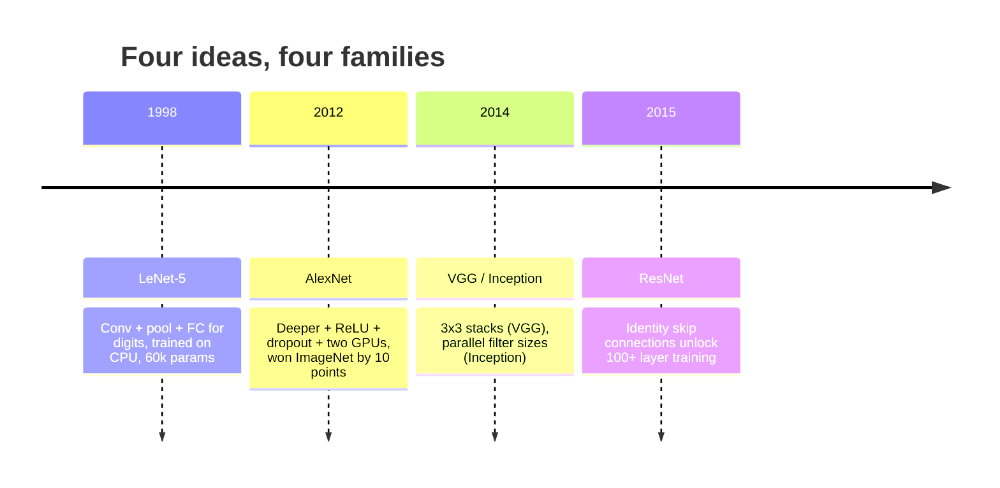
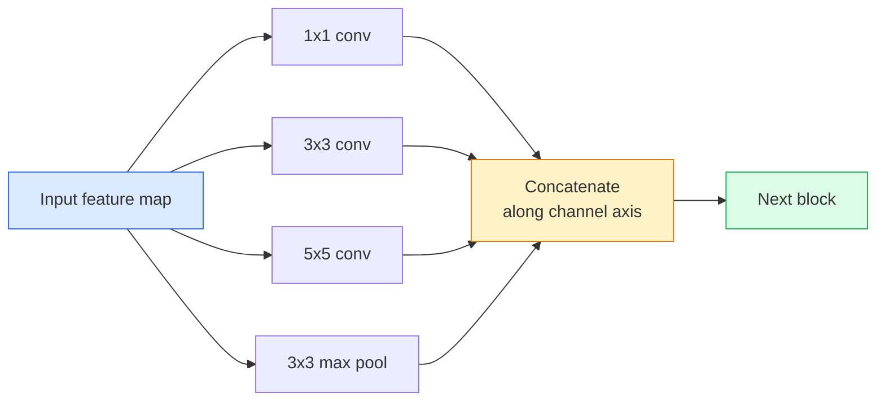
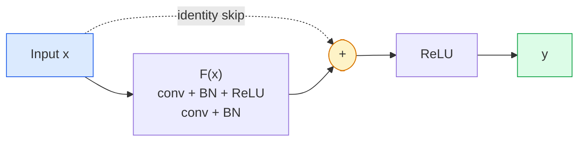

# CNNs  LeNet đến ResNet  CNN 架构演进  Từ LeNet đến ResNet

> Mỗi CNN lớn trong 30 năm qua đều là một công thức không tuyến tính với một ý tưởng mới.

> **【中文解读】**Trong 3 thập kỷ qua, tất cả các chương trình CNN quan trọng đều là cùng một mô hình (số lượt) (加上一个新想法) (按时间顺序学习这些想法:LeNet) (按时间顺序学习这些想法:LeNet) (按时间顺序学习这些想法:LeNet) (按时间顺序学习这些想法:LeNet) (按时间顺序学习这些想法:LeNet) (按时间顺序学习这些想法:LeNet) (按时间顺序学习这些想法:LeNet) (按时间顺序学习这些想法:LeNet) (按时间顺序学习这些想法:LeNet) (按时间顺序学习这些想法:LeNet) (按时间顺序学习这些想法:LeNet) (按时间顺序学习这些想法:LeNet) (按时间顺序学习这些想法:LeNet) (按时间顺序学习这些想法:LeNet) (按时间顺序学习这些想法:LeNet) (按时间顺序学习这些想法:LeNet) (按时间顺序学习模板定义) (按时间顺序学习) (按时间顺序学习) (按时间顺序学习) (按时间顺序学习) (按时间顺序学习) (按时间顺序学习) (按时间顺序学习) (按时间顺序学习) (按时间顺序学习) (按时间顺序学习) (按时间顺序学习) (按时间顺序学习) (按时间顺序) (按时间顺序) (按时间顺序) (按时间顺序) (按时间顺序) (按时间顺序) (按时间顺序) (按时间顺序) 按时间顺序) (按时间顺序) (按时间顺序) (按时间) 按时间顺序) (按时间) (按时间) (按时间) (按时间) (按时间) (按时间) (按时间) 按时间) (按时间) (按时间) (按时间) (按时间) (按时间) (按时间) 按时间) (按时间) (按时间) (按时间) 按时间) (按时间) (按时间) 按时间) 按时间) (按时间) 按时间) (按时间) (按时间) 按时间) (按时间)

**Type:** Learn + Build | **类型:** 学习 + 动手
**Languages:** Python | **语言:** Python
**Prerequisites:** Phase 3 Lesson 11 (PyTorch), Phase 4 Lesson 01 (Image Fundamentals), Phase 4 Lesson 02 (Convolutions from Scratch) | **前置知识:** Phase 3 Lesson 11（PyTorch），Phase 4 Lesson 01（图像基础），Phase 4 Lesson 02（从零实现卷积）
**Time:** ~75 minutes | **时间:** ~75 分钟

## Mục tiêu học tập

- Theo dõi dòng dõi kiến trúc LeNet-5 -> AlexNet -> VGG -> Inception -> ResNet và nêu ra ý tưởng mới duy nhất mỗi gia đình đã đóng góp
- Thực hiện LeNet-5, một khối kiểu VGG, và ResNet BasicBlock trong PyTorch, mỗi dòng dưới 40 dòng
- Giải thích tại sao các kết nối còn lại biến một mạng lưới 1.000 tầng từ không thể đào tạo thành hiện đại nhất
- Đọc một xương sống hiện đại (ResNet-18, ResNet-50) và dự đoán hình dạng đầu ra, trường thụ nhận và số parameter trước khi xem nguồn

> **【中文解读】**Mục tiêu học tập được liệt kê trong danh sách các khả năng cốt lõi cần được nắm bắt sau khi hoàn thành bài học.


## Vấn đề  vấn đề giới thiệu

Năm 2011, trình phân loại ImageNet tốt nhất đạt độ chính xác top-5 khoảng 74%. Năm 2012, AlexNet đạt 85%. Năm 2015, ResNet đạt điểm số 96%. Không có dữ liệu mới. Không có thế hệ GPU mới. Những lợi ích đến từ ý tưởng kiến trúc. Một kỹ sư tầm nhìn làm việc phải biết ý tưởng nào đến từ giấy nào bởi vì mỗi xương sống sản xuất bạn gửi vào năm 2026 là một sự kết hợp lại của những mảnh cùng đó và bởi vì các ý tưởng tiếp tục chuyển tiếp: các conv tập hợp đã đi từ CNNs đến biến đổi, kết nối dư thừa đã đi từ ResNet đến mỗi LLM hiện có, bình thường hóa lô sống trong mô hình phân phối.

> Năm 2011, tốt nhất ImageNet phân loại top-5  tỷ lệ chính xác là khoảng 74%― năm 2012 AlexNet đạt 85%― năm 2015 ResNet đạt 96%― không có dữ liệu mới― không có GPU mới 代际― những lợi ích này đến từ ý tưởng cấu trúc― một kỹ sư thị giác đủ điều kiện phải biết ý tưởng nào đến từ bài luận nào, bởi vì mỗi mạng hạch sản xuất được triển khai vào năm 2026 đều là những đoạn tái cấu trúc này và những ý tưởng này vẫn đang di chuyển liên tục: phân tích khối lượng từ CNN  chuyển sang Transformer, phân tích kết nối ResNet  mở rộng đến mỗi LLM hiện có, khối lượng phân tích tồn tại trong mô hình phổ biến.

> **【中文解读】**Trong giai đoạn 2011-2015 tỷ lệ xác thực của ImageNet đã tăng từ 74% lên 96%, dựa trên không phải dữ liệu mới hoặc GPU mới, mà là sáng kiến kiến trúc. Những sáng kiến này vẫn đang được sử dụng nhiều lần: phân组卷积 từ CNN chuyển sang Transformer,残差连接 từ ResNet mở rộng sang tất cả các LLM, khối lượng được tập hợp để sử dụng mô hình phổ biến.

Nghiên cứu các mạng này để cũng miễn dịch bạn chống lại một sai lầm phổ biến: tìm kiếm mô hình lớn nhất có sẵn khi một mạng có kích thước LeNet sẽ giải quyết vấn đề. MNIST không cần ResNet. Biết đường cong quy mô của mỗi gia đình cho bạn biết nơi ngồi trên nó.

> 按顺序学习这些网络还能让你避免一个常见错误: khi LeNet có một mạng lớn có thể giải quyết vấn đề, nhưng sử dụng mô hình có thể sử dụng lớn nhất. MNIST không cần ResNet.

## Khái niệm cốt lõi

### Bốn ý tưởng đã thay đổi tầm nhìn.



Không có gì khác trong tầm nhìn cổ điển quan trọng như bốn bước nhảy này.

> Trong phim cổ điển không có gì quan trọng hơn 4 lần này.

### LeNet-5 (1998)

Yann LeCun's digit recognition. 60,000 parameter. 2 conve-pool block, 2 layer được kết nối hoàn toàn, tanh activations.

> Yann LeCun's Digital Identifier──60.000 Parameters── hai khối khối, hai tầng kết nối, tanh 激活── nó xác định từng mô hình của CNN:

```
input (1, 32, 32)
  conv 5x5 -> (6, 28, 28)
  avg pool 2x2 -> (6, 14, 14)
  conv 5x5 -> (16, 10, 10)
  avg pool 2x2 -> (16, 5, 5)
  flatten -> 400
  dense -> 120
  dense -> 84
  dense -> 10
```

Mọi thứ mà thế giới hiện đại gọi là một CNN  biến đổi thay thế và giảm mẫu cung cấp cho một đầu phân loại nhỏ  là LeNet với nhiều lớp hơn, các kênh lớn hơn và kích hoạt tốt hơn.

> Thế giới hiện đại gọi đó là CNN, có nhiều tầng hơn, nhiều kênh lớn hơn và hoạt động tốt hơn trên LeNet.

> **【中文解读】**LeNet-5 đã xác định tất cả các mô hình cơ bản của CNN:卷积 → 池化 → 卷积 → 池化 → 全连接── chỉ có 60.000 tham số, nhưng đã thiết lập cấu trúc cơ bản của hệ thống trực quan học sâu──

### AlexNet (2012) điểm khởi đầu của việc học sâu

Ba thay đổi đã phá vỡ ImageNet:

> Ba thay đổi đã phá vỡ ImageNet:

1. **ReLU**thay vì tanh. các gradient ngừng biến mất. đào tạo tăng tốc gấp 6 lần.
2. **Dropout**Điều chỉnh trở thành một lớp, không phải là một thủ thuật.
3. **Depth and width**5 lớp conve, 3 lớp dày đặc, 60M tham số, được đào tạo trên hai GPU với mô hình chia trên chúng.

Hình 2 của bài báo vẫn cho thấy GPU chia thành hai dòng song song. Sự song song đó là một giải pháp phần cứng, không phải là một cái nhìn sâu sắc về kiến trúc  nhưng ba ý tưởng trên vẫn còn trong mọi mô hình bạn sử dụng.

> Hình 2 của bài viết vẫn cho thấy GPU được chia thành hai dòng chảy. Sự đồng bộ đó là tính năng của phần cứng, không phải là kiến trúc, nhưng ba ý tưởng trên vẫn còn trong mỗi mô hình bạn sử dụng.

> **【拓展：AlexNet 的遗产】**AlexNet trong ba sáng kiến được giới thiệu đến nay vẫn còn tồn tại: 1) ReLU  kích hoạt hàm giải quyết vấn đề biến mất độ; 2) Quá trình giảm bớt chính thức ngăn chặn quá phù hợp; 3) suy nghĩ quy mô độ sâu + độ rộng.

### VGG (2014)  3x3 卷积的极致堆积

VGG hỏi: nếu bạn chỉ sử dụng 3x3 xoắn và bạn đi sâu thì sẽ xảy ra gì?

> VGG 问道: Nếu chỉ sử dụng 3x3 卷积 và làm sâu hơn, sẽ xảy ra gì?

```
stack:   conv 3x3 -> conv 3x3 -> pool 2x2
repeat:  16 or 19 conv layers
```

Hai conv 3x3 thấy cùng một diện tích đầu vào 5x5 như một conv 5x5 nhưng với ít tham số hơn (2 * 9 * C^2 = 18C^2 vs 25 * C^2) và một ReLU bổ sung giữa. VGG biến quan sát này thành một kiến trúc toàn bộ. Sự đơn giản  một loại khối, lặp lại  làm cho nó trở thành điểm tham chiếu cho tất cả những gì đã đến sau đó.

> 2 3x3 卷积看的 5x5 输入区域与一个 5x5 卷积相同,但参数较少(2*9*C^2 = 18C^2 vs 25*C^2), giữa còn có thêm ReLU──VGG sẽ biến quan sát này thành một cấu trúc hoàn chỉnh──简洁性一种块类,重复使用使它成为后者的参考点──

Chi phí: 138M tham số, chậm để đào tạo, đắt tiền để suy luận.

> 代价:1.38 tỷ参数, huấn luyện chậm, khuyến cáo đắt tiền.

### Sự khởi đầu (2014, cùng năm)

Câu trả lời của Google cho "Tôi nên sử dụng kích thước hạt nhân nào?" là: tất cả chúng, song song.

> Google trả lời "Should use what nuclear size?" là: toàn bộ,并行使用.



Mỗi nhánh chuyên về 1x1 cho việc trộn kênh, 3x3 cho kết cấu địa phương, 5x5 cho các mẫu lớn hơn, tập hợp cho các tính năng thay đổi thay đổi và concat cho phép lớp tiếp theo chọn bất kỳ nhánh nào hữu ích.

> Mỗi phân khúc chuyên về các khía cạnh khác nhau1x1 được sử dụng cho đường bộ hỗn hợp,3x3 được sử dụng cho cấu trúc địa phương,5x5 được sử dụng cho mô hình lớn hơn, tích hóa được sử dụng cho tính chất không thay đổi 拼接 để cho tầng dưới có thể chọn các phân khúc hữu ích.

### Vấn đề phân hủy                                                                                                                                                                                                                                                                                                                                                                                                                                                                                                                         

Vào năm 2015, VGG-19 đã hoạt động và VGG-32 không. Độ sâu được cho là giúp đỡ, nhưng sau ~ 20 lớp cả huấn luyện và mất kiểm tra trở nên tồi tệ hơn.

> Đến năm 2015, VGG-19 có thể hoạt động nhưng VGG-32 không hoạt động. Độ sâu nên có ích, nhưng hơn khoảng 20 lớp đào tạo và thử nghiệm sau đó bị mất đều trở nên tồi tệ hơn.

```
Plain deep network:
  y = f_L( f_{L-1}( ... f_1(x) ... ) )

Gradient wrt early layer:
  dL/dW_1 = dL/dy * df_L/df_{L-1} * ... * df_2/df_1 * df_1/dW_1

Each multiplicative term has magnitude roughly (weight magnitude) * (activation gain).
Stack 100 of them with gains < 1 and the gradient is effectively zero.
```

VGG hoạt động ở 19 lớp vì chuẩn hàng loạt (được xuất bản cùng lúc) giữ hoạt động được quy mô tốt.

> VGG trong 19 tầng có thể làm việc vì khối lượng thu nhập được duy trì tích cực tốt và giảm dần.

### ResNet (2015)  REST 差连接 深度学习突破

Anh ấy, Zhang, Ren, Sun đề xuất một thay đổi sửa chữa mọi thứ:

> Anh ấy, Zhang, Ren, Sun đã đề xuất một cách sửa chữa mọi thứ:

```
standard block:   y = F(x)
residual block:   y = F(x) + x
```

- `+ x`nghĩa là lớp luôn có thể chọn không làm gì khi lái xe `F(x)`Một ResNet 1000 lớp bây giờ là tối đa như một mạng 1 lớp, bởi vì mỗi khối bổ sung có một cửa ngõ thoát tầm thường. Với sự đảm bảo đó, người tối ưu sẵn sàng để làm cho mỗi khối * một chút * hữu ích  và một chút hữu ích, xếp chồng lên 100 lần, là hiện đại nhất.

> `+ x`Ý nghĩa là lớp này luôn có thể được thông qua.`F(x)`趋向零来选择什么都不做―― một ResNet 1000 tầng hiện nay là nhiều nhất và là một mạng 1 tầng khác nhau, vì mỗi khối bổ sung có một lối thoát đơn giản―― có đảm bảo, các trình tối ưu sẵn sàng để mỗi khối * một chút * hữu ích hơn, nắp lên 100 lần, là những thứ tiên tiến nhất――



Hai biến thể của khối xuất hiện khắp nơi:

> 两种块变体无处不在:

- **BasicBlock**(ResNet-18, ResNet-34): hai con 3x3 con, bỏ qua cả hai.
  Trung文翻译:基本块两个3x3卷积,跨两者的跳
- **Bottleneck**(ResNet-50, -101, -152): 1x1 xuống, 3x3 trung, 1x1 lên, bỏ qua ba.
  Trung文翻译:瓶块1x1 降维、3x3 中间、1x1 升维,跨三者跳──通道数高时更便宜──

Khi skip phải vượt qua một mẫu xuống (trước =2), con đường nhận dạng được thay thế bằng một con đường 1x1 bước = 2 để phù hợp với hình dạng.

> Khi nhảy cần phải跨越下采样 (stride=2) thì, đường dẫn恒等 được thay thế thành 1x1 bước=2 của khối lượng để phù hợp hình dạng.

### Tại sao các chất còn lại quan trọng hơn tầm nhìn.

Ý tưởng không thực sự là về phân loại hình ảnh. Nó là về việc biến các mạng lưới sâu từ "các ngón tay của bạn và hy vọng gradient sống sót" thành một công cụ kỹ thuật đáng tin cậy, có thể mở rộng. Mỗi biến thể bạn sẽ đọc về giai đoạn tiếp theo có kết nối skip chính xác giống nhau trong mỗi khối.

> Ý tưởng này thực sự không phải là về phân loại hình ảnh. Nó là về việc chuyển mạng sâu từ "sự sống sót của thang cầu nguyện" thành công cụ kỹ thuật đáng tin cậy có thể mở rộng.

> **【拓展：残差连接与 Transformer】**Rast差连接 không chỉ thay đổi hình ảnh, nó cho phép mạng hầm từ " cầu nguyện梯度能活活" trở thành công cụ kỹ thuật đáng tin cậy. Mỗi khối Transformer (bao gồm cả GPT,BERT,Claude) đều sử dụng kết nối nhảy hoàn toàn giống nhau. Không có ResNet, không có GPT.`y = F(x) + x`Có thể nói là một trong những phương pháp học sâu quan trọng nhất.

> **【拓展：工业部署中的视觉系统】**Trong thực tế, mô hình hình ảnh cần phải xem xét các vấn đề về sự chậm trễ, mô hình lớn, thiết bị cạnh phù hợp, vv.

```figure
pooling
```

## Hãy xây dựng nó

## Hãy xây dựng nó.

### Bước 1: Lần 5 thực hiện Lần 5

Một mạng LeNet trung thành, hoạt động Tanh, hợp tác trung bình.`nn.CrossEntropyLoss`xuống dòng nước thay vì các kết nối Gaussian ban đầu.

> Một Lăng Đẹp Đơn Đơn Đơn Đơn Đơn Đơn Đơn Đơn Đơn Đơn Đơn Đơn Đơn Đơn Đơn Đơn Đơn Đơn Đơn Đơn Đơn Đơn Đơn Đơn Đơn Đơn Đơn Đơn Đơn Đơn Đơn Đơn Đơn Đơn Đơn Đơn Đơn Đơn Đơn Đơn Đơn Đơn Đơn Đơn Đơn Đơn Đơn Đơn Đơn Đơn Đơn Đơn Đơn Đơn Đơn Đơn Đơn Đơn Đơn Đơn Đơn Đơn Đơn Đơn Đơn Đơn Đơn Đơn Đơn Đơn Đơn Đơn Đơn Đơn Đơn Đơn Đơn Đơn Đơn Đơn Đơn Đơn Đơn Đơn Đơn Đơn Đơn Đơn Đơn Đơn Đơn Đơn Đơn Đơn Đơn Đơn Đơn Đơn Đơn Đơn Đơn Đơn Đơn Đơn Đơn Đơn Đơn Đơn Đơn Đơn Đơn Đơn Đơn Đơn Đơn Đơn Đơn Đơn Đơn Đơn Đơn Đơn Đơn Đơn Đơn Đơn Đơn Đơn Đơn Đơn Đơn Đơn Đơn Đơn Đơn Đơn Đơn Đơn Đơn Đơn Đơn Đơn Đơn Đơn Đơn Đơn Đơn Đơn Đơn Đơn Đơn Đơn Đơn Đơn Đơn Đơn Đơn Đơn Đơn Đơn Đơn Đơn Đơn Đơn Đơn Đơn Đơn Đơn Đơn Đơn Đơn Đơn Đơn Đơn Đơn Đơn Đơn Đơn Đơn Đơn Đơn Đơn Đơn Đơn Đơn Đơn Đơn Đơn Đơn Đơn Đơn Đơn Đơn Đơn Đơn Đơn Đơn Đơn Đ Đơn Đơn Đơn Đơn Đơn Đơn Đơn Đ Đơn Đ Đ Đ Đ Đơn Đơn Đơn Đ Đ Đ Đ Đ Đ Đ Đ Đ Đ Đ Đ Đ Đ Đ Đ Đ Đ Đ Đ Đ Đ Đ Đ Đ Đ Đ Đơn`nn.CrossEntropyLoss`Không phải là kết nối cao nguyên.

```python
import torch
import torch.nn as nn
import torch.nn.functional as F

class LeNet5(nn.Module):
    def __init__(self, num_classes=10):
        super().__init__()
        self.conv1 = nn.Conv2d(1, 6, kernel_size=5)
        self.conv2 = nn.Conv2d(6, 16, kernel_size=5)
        self.pool = nn.AvgPool2d(2)
        self.fc1 = nn.Linear(16 * 5 * 5, 120)
        self.fc2 = nn.Linear(120, 84)
        self.fc3 = nn.Linear(84, num_classes)

    def forward(self, x):
        x = self.pool(torch.tanh(self.conv1(x)))
        x = self.pool(torch.tanh(self.conv2(x)))
        x = torch.flatten(x, 1)
        x = torch.tanh(self.fc1(x))
        x = torch.tanh(self.fc2(x))
        return self.fc3(x)

net = LeNet5()
x = torch.randn(1, 1, 32, 32)
print(f"output: {net(x).shape}")
print(f"params: {sum(p.numel() for p in net.parameters()):,}")
```

Tạo sản lượng dự kiến: `output: torch.Size([1, 10])`- `params: 61,706`Đó là toàn bộ bộ phân loại chữ số bắt đầu tầm nhìn hiện đại.

> 预期输出:`output: torch.Size([1, 10])``params: 61,706`Đó là khởi đầu của bộ phân loại số hoàn chỉnh của hiện đại.

### Bước 2: Một khối VGG thực hiện khối VGG

Một khối tái sử dụng: hai con 3x3, ReLU, batch chuẩn, tối đa hồ bơi.

> Một khối có thể sử dụng: hai khối 3x3 卷积、ReLU、批量归归归归归归归归最大池化──

```python
class VGGBlock(nn.Module):
    def __init__(self, in_c, out_c):
        super().__init__()
        self.conv1 = nn.Conv2d(in_c, out_c, kernel_size=3, padding=1)
        self.bn1 = nn.BatchNorm2d(out_c)
        self.conv2 = nn.Conv2d(out_c, out_c, kernel_size=3, padding=1)
        self.bn2 = nn.BatchNorm2d(out_c)
        self.pool = nn.MaxPool2d(2)

    def forward(self, x):
        x = F.relu(self.bn1(self.conv1(x)))
        x = F.relu(self.bn2(self.conv2(x)))
        return self.pool(x)

class MiniVGG(nn.Module):
    def __init__(self, num_classes=10):
        super().__init__()
        self.stack = nn.Sequential(
            VGGBlock(3, 32),
            VGGBlock(32, 64),
            VGGBlock(64, 128),
        )
        self.head = nn.Sequential(
            nn.AdaptiveAvgPool2d(1),
            nn.Flatten(),
            nn.Linear(128, num_classes),
        )

    def forward(self, x):
        return self.head(self.stack(x))

net = MiniVGG()
x = torch.randn(1, 3, 32, 32)
print(f"output: {net(x).shape}")
print(f"params: {sum(p.numel() for p in net.parameters()):,}")
```

Ba khối VGG trên CIFAR, một hồ bơi thích ứng, một lớp tuyến tính. ~ 290k tham số.

> CIFAR kích thước nhập vào ba VGG khối, tự thích ứng 池化, một lớp đường.

### Bước 3: Một ResNet BasicBlock thực hiện ResNet BasicBlock

Các khối xây dựng cốt lõi của ResNet-18 và ResNet-34.

> Các khối cấu trúc cốt lõi của ResNet-18 và ResNet-34

```python
class BasicBlock(nn.Module):
    def __init__(self, in_c, out_c, stride=1):
        super().__init__()
        self.conv1 = nn.Conv2d(in_c, out_c, kernel_size=3, stride=stride, padding=1, bias=False)
        self.bn1 = nn.BatchNorm2d(out_c)
        self.conv2 = nn.Conv2d(out_c, out_c, kernel_size=3, stride=1, padding=1, bias=False)
        self.bn2 = nn.BatchNorm2d(out_c)
        if stride != 1 or in_c != out_c:
            self.shortcut = nn.Sequential(
                nn.Conv2d(in_c, out_c, kernel_size=1, stride=stride, bias=False),
                nn.BatchNorm2d(out_c),
            )
        else:
            self.shortcut = nn.Identity()

    def forward(self, x):
        out = F.relu(self.bn1(self.conv1(x)))
        out = self.bn2(self.conv2(out))
        out = out + self.shortcut(x)
        return F.relu(out)
```

`bias=False`trên các lớp conv là một quy ước chuẩn hàng loạt  Bias của BN đã xử lý sự thiên vị, vì vậy mang theo sự thiên vị conv cũng là một sự lãng phí.`shortcut`Chỉ cần một con conv thực khi bước hoặc số lượng kênh thay đổi; nếu không nó là một danh tính không hoạt động.

> 卷积层上 `bias=False`Các thành phần beta của khối lượng được phân tích đã được xử lý, vì vậy đồng thời giữ lại khối lượng phân tích là lãng phí.`shortcut`Chỉ cần có một khối lượng thực sự khi thay đổi bước hoặc số đường dẫn; nếu không nó là không hoạt động của恒等.

### Bước 4: Một ResNet nhỏ.

Lắp bốn nhóm BasicBlocks để có được ResNet hoạt động cho các đầu vào kích thước CIFAR.

> 堆叠四组 BasicBlock 以获得适用于 CIFAR 尺寸输入工作ResNet。

```python
class TinyResNet(nn.Module):
    def __init__(self, num_classes=10):
        super().__init__()
        self.stem = nn.Sequential(
            nn.Conv2d(3, 32, kernel_size=3, stride=1, padding=1, bias=False),
            nn.BatchNorm2d(32),
            nn.ReLU(inplace=True),
        )
        self.layer1 = self._make_group(32, 32, num_blocks=2, stride=1)
        self.layer2 = self._make_group(32, 64, num_blocks=2, stride=2)
        self.layer3 = self._make_group(64, 128, num_blocks=2, stride=2)
        self.layer4 = self._make_group(128, 256, num_blocks=2, stride=2)
        self.head = nn.Sequential(
            nn.AdaptiveAvgPool2d(1),
            nn.Flatten(),
            nn.Linear(256, num_classes),
        )

    def _make_group(self, in_c, out_c, num_blocks, stride):
        blocks = [BasicBlock(in_c, out_c, stride=stride)]
        for _ in range(num_blocks - 1):
            blocks.append(BasicBlock(out_c, out_c, stride=1))
        return nn.Sequential(*blocks)

    def forward(self, x):
        x = self.stem(x)
        x = self.layer1(x)
        x = self.layer2(x)
        x = self.layer3(x)
        x = self.layer4(x)
        return self.head(x)

net = TinyResNet()
x = torch.randn(1, 3, 32, 32)
print(f"output: {net(x).shape}")
print(f"params: {sum(p.numel() for p in net.parameters()):,}")
```

4 nhóm gồm 2 khối mỗi nhóm. bước 2 ở đầu nhóm 2, 3, 4. số lượng kênh tăng gấp đôi ở mỗi mẫu xuống. khoảng 2,8M tham số. Đó là công thức tiêu chuẩn để cân bằng sạch lên ResNet-152.

> Bốn nhóm mỗi nhóm hai khối. Bước thứ hai, ba, bốn nhóm bắt đầu với bước tiến 2...

### Bước 5: So sánh hiệu quả từ tham số đến tính năng

Lấy cùng một đầu vào qua cả ba mạng và so sánh số lượng tham số.

> sẽ nhập nhập tương tự qua tất cả ba mạng và so sánh số lượng các tham số.

```python
def summary(name, net, x):
    y = net(x)
    params = sum(p.numel() for p in net.parameters())
    print(f"{name:12s}  input {tuple(x.shape)} -> output {tuple(y.shape)}  params {params:>10,}")

x = torch.randn(1, 3, 32, 32)
summary("LeNet5",     LeNet5(),       torch.randn(1, 1, 32, 32))
summary("MiniVGG",    MiniVGG(),      x)
summary("TinyResNet", TinyResNet(),   x)
```

Ba mô hình, ba thời đại, ba thứ tự lớn trong số lượng tham số. để chính xác CIFAR-10, bạn cần khoảng: LeNet 60%, MiniVGG 89%, TinyResNet 93% sau một vài thời gian đào tạo.

> Có 3 mô hình, 3 thời đại, số lượng các đối tượng 3 cấp số. Đối với CIFAR-10 准确率, đào tạo một vài thời đại 后大致需要:LeNet 60%、MiniVGG 89%、TinyResNet 93%。


## Sử dụng nó thực tế

`torchvision.models`cho bạn các phiên bản được đào tạo trước tất cả các điều trên. chữ ký cuộc gọi là giống nhau trên tất cả các gia đình, đó chính là điểm của trừu tượng xương sống.

> `torchvision.models`给你上述所有模型的预训练版本――调用签名在各家族间完全相同, đây chính là ý nghĩa của 骨干网络抽象――

```python
from torchvision.models import resnet18, ResNet18_Weights, vgg16, VGG16_Weights

r18 = resnet18(weights=ResNet18_Weights.IMAGENET1K_V1)
r18.eval()

print(f"ResNet-18 params: {sum(p.numel() for p in r18.parameters()):,}")
print(r18.layer1[0])
print()

v16 = vgg16(weights=VGG16_Weights.IMAGENET1K_V1)
v16.eval()
print(f"VGG-16   params: {sum(p.numel() for p in v16.parameters()):,}")
```

ResNet-18 có 11,7M tham số. VGG-16 có 138M. Độ chính xác tương tự như ImageNet top-1 (69,8% so với 71,6%). Kết nối dư thừa mua bạn một chiến thắng hiệu quả tham số 12x. Đó là lý do tại sao các biến thể ResNet thống trị từ năm 2016 cho đến khi ViT đến năm 2021 và vẫn thống trị triển khai trong thế giới thực nơi tính toán là hạn chế.

> **【中文解读】**ResNet-18(11700000参数) vs VGG-16(1.38 tỷ参数),ImageNet 准确率相近, nhưng hiệu quả参数 khác nhau 12 lần.

Đối với việc học chuyển, công thức luôn giống nhau: tải trước khi được huấn luyện, đóng băng xương sống, thay thế đầu phân loại.

> Đối với chuyển học, các chương trình luôn giống nhau: tải trọng, kết nối mạng lưới xương, thay thế phân loại đầu.

```python
for p in r18.parameters():
    p.requires_grad = False
r18.fc = nn.Linear(r18.fc.in_features, 10)
```

Bây giờ bạn có một phân loại CIFAR lớp 10 thừa hưởng các đại diện ImageNet trả tiền.

> Bạn hiện có một phân loại CIFAR 10 lớp, nó thừa kế ImageNet 付费得到的表示──


> **【拓展：数据标注与质量】**视觉任务的效果高度依赖标签数据质量――Label Studio、CVAT là công cụ标签 chính thống――在工业场景中,主动学习(Active Learning) có thể giảm chi phí đánh dấu: mô hình đối với yêu cầu mẫu không xác định

## Đưa nó ra.

Bài học này mang lại:

> 本课产 出:

- `outputs/prompt-backbone-selector.md` một lời nhắc chọn đúng gia đình CNN (LeNet/VGG/ResNet/MobileNet/ConvNeXt) cho một nhiệm vụ, kích thước bộ dữ liệu và ngân sách tính toán.
  Trung ngữ翻译:给定任务、数据集大小和计算预算, chọn chính xác CNN 家族的提示词──
- `outputs/skill-residual-block-reviewer.md` một kỹ năng đọc một mô-đun PyTorch và đánh dấu sai lầm skip-connection (không có đường tắt khi thay đổi bước, lệnh kích hoạt đường tắt, vị trí BN tương đối với việc bổ sung).
  Trung文翻译:读取 PyTorch 模块并标记跳连错的技能──

## Tập luyện bài tập

> **【中文解读】**练题按照 Easy/Medium/Hard 三个难度递进;;建议至少完成 级别的题目, 级别适合深入研究或面试准备;;


1. **(Easy | 简单)**Đếm tham số bằng tay cho `TinyResNet`Lớp theo lớp. So sánh với `sum(p.numel() for p in net.parameters())`Phần lớn ngân sách các tham số đi đâu  convs, BN, hoặc đầu phân loại?
   Các yếu tố của TinyResNet, tìm ra các yếu tố chính phát triển ở đâu.

2. **(Medium | 中等)**Thực hiện khối nút thắt chai (1x1 -> 3x3 -> 1x1 với skip) và sử dụng nó để xây dựng một mạng ResNet-50 kiểu cho CIFAR. So sánh các tham số so với `TinyResNet`- Tôi không biết.
   实现 Bottleneck 块, xây dựng ResNet-50 风格网络, đối với số lượng参数.

3. **(Hard | 困难)**Tắt kết nối skip khỏi `BasicBlock`, đào tạo một mạng "đơn" 34 khối và một ResNet 34 khối trên CIFAR-10 trong 10 thời kỳ mỗi. Lãng mất tập vs thời kỳ cho cả hai. Tái tạo kết quả He et al. Hình 1 nơi mạng sâu đơn giản hội tụ với tổn thất cao hơn so với đôi hèn hơn của nó.
   Để bỏ nhảy kết nối, tập luyện 34 tầng "sơn" 网络和 34 tầng ResNet,复现 He 等人论文图 1 的结果──

## Từ khóa  Keyword

| Term | What people say | What it actually means | 中文释义 |
|------|----------------|----------------------|---------|
| Backbone | "The model" | The stack of convolutional blocks that produces the feature map fed to the task head | 骨干网络：产生特征图的卷积块堆叠 |
| Residual connection | "Skip connection" | `y = F(x) + x`; lets the optimiser learn identity by setting F to zero, which makes arbitrary depth trainable | 残差连接/跳跃连接：让任意深度可训练 |
| BasicBlock | "Two 3x3 convs with a skip" | The ResNet-18/34 building block: conv-BN-ReLU-conv-BN-add-ReLU | 基本块：ResNet-18/34 的构建单元 |
| Bottleneck | "1x1 down, 3x3, 1x1 up" | The ResNet-50/101/152 block; cheap at high channel counts because the 3x3 runs on a reduced width | 瓶颈块：1x1降维-3x3卷积-1x1升维 |
| Degradation problem | "Deeper is worse" | Past ~20 plain conv layers, both training and test error increase; solved by residual connections, not by more data | 退化问题：层数加深后训练和测试误差都增大 |
| Stem | "The first layer" | The initial conv that converts 3-channel input into the base feature width; usually 7x7 stride 2 for ImageNet, 3x3 stride 1 for CIFAR | 茎部：网络的初始卷积层 |
| Head | "The classifier" | The layers after the final backbone block: adaptive pool, flatten, linear(s) | 头部：骨干网络之后的分类器层 |
| Transfer learning | "Pretrained weights" | Loading a backbone trained on ImageNet and fine-tuning only the head on your task | 迁移学习：加载预训练权重，只微调头部 |

## Xem thêm 延伸阅读

> **【中文解读】**延伸阅读 cung cấp các nguồn chất lượng cao cho việc học sâu. Những bài báo và giảng dạy này là tài liệu tham khảo cổ điển trong lĩnh vực này, phù hợp với những người đọc cần hiểu sâu hơn.


- [Deep Residual Learning for Image Recognition (He et al., 2015)](https://arxiv.org/abs/1512.03385) bài báo ResNet; mỗi con số là đáng để nghiên cứu
- [Very Deep Convolutional Networks (Simonyan & Zisserman, 2014)](https://arxiv.org/abs/1409.1556) giấy VGG; vẫn là tài liệu tham khảo tốt nhất cho "tại sao 3x3"
- [ImageNet Classification with Deep CNNs (Krizhevsky et al., 2012)](https://papers.nips.cc/paper_files/paper/2012/hash/c399862d3b9d6b76c8436e924a68c45b-Abstract.html) AlexNet; tờ báo kết thúc thời đại sản xuất tính năng bằng tay
- [Going Deeper with Convolutions (Szegedy et al., 2014)](https://arxiv.org/abs/1409.4842) Sự khởi đầu v1; ý tưởng lọc song song vẫn xuất hiện trong các bộ biến đổi tầm nhìn
