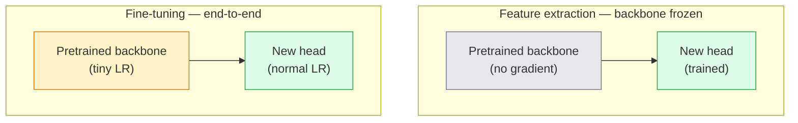

# Transfer Learning & Fine-Tuning  chuyển học tập với điều chỉnh

> Một người khác đã dành hàng triệu giờ GPU để dạy cho một mạng về các cạnh, kết cấu và các phần vật thể.

> **【中文解读】**别人花了一百万GPU 小时教会网络识别边缘、纹理和物体部件── bạn nên dùng những đặc điểm này trước khi đào tạo mô hình của mình──迁移学习 là một kỹ thuật được sử dụng nhiều nhất trong AI 工程.

> **【拓展：迁移学习在工业界的应用】**Hầu hết các hệ thống video cấp sản xuất đều sử dụng chuyển học: hình ảnh y tế(ImageNet 预训 + 医学数据微调) 工业质检、自动驾驶──训练 ResNet-50 需要 ~2000 GPU 小时,但微调只需几分钟──

**Type:** Build | **类型:** 动手
**Languages:** Python | **语言:** Python
**Prerequisites:** Phase 4 Lesson 03 (CNNs), Phase 4 Lesson 04 (Image Classification) | **前置知识:** Phase 4 Lesson 03（CNN），Phase 4 Lesson 04（图像分类）
**Time:** ~75 minutes | **时间:** ~75 分钟

## Mục tiêu học tập

- Cải cách chiết xuất tính năng từ điều chỉnh tinh tế và chọn đúng dựa trên kích thước tập dữ liệu, khoảng cách miền và ngân sách tính toán
- Lắp một xương sống đã được huấn luyện trước, thay thế đầu phân loại của nó, và chỉ huấn luyện đầu đến một đường cơ sở làm việc trong dưới 20 dòng
- Tốc độ giải phóng các lớp với tỷ lệ học tập phân biệt đối xử để các tính năng chung sớm nhận được cập nhật nhỏ hơn so với những task-specific muộn
- Chẩn đoán ba thất bại phổ biến: biến động tính năng từ quá cao LR trên khối không đóng băng, thống kê BN sụp đổ trên các tập dữ liệu nhỏ, và lãng quên thảm khốc

> **【中文解读】**Mục tiêu học tập được liệt kê trong danh sách các khả năng cốt lõi cần được nắm bắt sau khi hoàn thành bài học.


## Vấn đề  vấn đề giới thiệu

Việc đào tạo ResNet-50 trên ImageNet tốn khoảng 2.000 giờ GPU. Rất ít nhóm có ngân sách đó cho mỗi nhiệm vụ mà họ gửi. Hầu như mọi nhóm thực sự gửi là một xương sống đã được đào tạo trước với một cái đầu mới được đào tạo trên vài trăm hoặc vài ngàn hình ảnh cụ thể nhiệm vụ.

> Trong ImageNet trên đào tạo ResNet-50 khoảng cần 2000 GPU 小时── rất ít nhóm có ngân sách dành cho mỗi giao dịch nhiệm vụ đầu tư nhiều như vậy── hầu như tất cả các nhóm thực sự giao dịch là một mạng hạch xương dự kiến đào tạo cộng với một bộ bài mới được đào tạo trên vài trăm hoặc hàng ngàn nhiệm vụ hình ảnh cụ thể──

> **【中文解读】**Từ Zero Training ResNet-50  cần ~2000 GPU 小时, nhưng chuyển học chỉ mất vài phút.

Đây không phải là lối tắt. Chiếc khối đầu tiên của bất kỳ CNN được đào tạo bởi ImageNet học được các cạnh và bộ lọc giống Gabor. Những khối tiếp theo học được các kết cấu và các động cơ đơn giản. Các khối trung tâm học các phần đối tượng. Các khối cuối cùng học các kết hợp bắt đầu trông giống như 1.000 danh mục ImageNet. 90% đầu tiên của hệ thống này chuyển gần như không thay đổi sang hình ảnh y tế, kiểm tra công nghiệp, dữ liệu vệ tinh và mọi nhiệm vụ tầm nhìn khác vì thiên nhiên có một từ vựng hạn chế của các cạnh và kết cấu. 10% cuối cùng là những gì bạn thực sự đào tạo.

> Đây không phải là một cách ngắn gọn. Không có một bộ phận nào được đào tạo trên ImageNet trên CNN, tập hợp đầu tiên của các bộ phận học tập và các loại Gabor 波器. Sau đó là một vài bộ phận học tập về cấu trúc và mô hình đơn giản. Phần trung học về các bộ phận vật thể. Phần cuối của các bộ phận học tập trông giống như 1000 bộ phận của ImageNet. 90% cấu trúc tầng lớp này gần như không thay đổi chuyển sang hình ảnh y tế, kiểm tra công nghiệp, dữ liệu vệ tinh và tất cả các nhiệm vụ trực quan khác.

Việc chuyển giao đúng có ba lỗi đang chờ đợi bạn: phá hủy các tính năng được đào tạo trước với tốc độ học tập quá cao, làm đói mô hình thông tin bằng cách đóng băng quá nhiều, và để các thống kê đang chạy của BatchNorm trôi hướng đến một tập dữ liệu nhỏ mà phần còn lại của mạng không bao giờ học được. Bài học này đi theo từng người trong số họ cố ý.

> Thực tế là việc học tập di chuyển có ba lỗi đang chờ đợi bạn: sử dụng tỷ lệ học quá cao phá hủy các đặc điểm đào tạo trước, kết thúc quá nhiều dẫn đến thiếu thông tin mô hình, để số liệu thống kê hoạt động của BatchNorm di chuyển sang một mạng phần còn lại của tập dữ liệu nhỏ chưa bao giờ được học.

> **【中文解读】**迁移学习最常见的三个坑: 1) tỷ lệ học quá cao phá hủy đặc điểm đào tạo trước; 2) kết thúc quá nhiều tầng dẫn đến mô hình không phù hợp; 3) số liệu thống kê của BatchNorm di chuyển trên tập dữ liệu nhỏ.

## Khái niệm cốt lõi

> **【中文解读】**Bài viết này giới thiệu các khái niệm và lý thuyết cốt lõi.


### Tạo ra tính năng so với điều chỉnh tinh tế

Hai chế độ, được chọn bởi mức độ bạn tin vào các tính năng được đào tạo trước và mức độ dữ liệu bạn có.

> 两种方案, phụ thuộc vào tính năng đào tạo dự kiến của bạn và số dữ liệu bạn có.



Quy tắc của ngón tay:

> 经验法则:

| Dataset size / 数据量 | Domain distance / 领域距离 | Recipe / 方案 |
|--------------|-----------------|--------|
| < 1k images | close to ImageNet / 接近 ImageNet | Freeze backbone, train head only / 冻结骨干，只训头部 |
| 1k-10k | close / 接近 | Freeze first 2-3 stages, fine-tune the rest / 冻结前2-3阶段，微调其余 |
| 10k-100k | any / 任意 | Fine-tune end-to-end with discriminative LR / 用判别性学习率端到端微调 |
| 100k+ | far / 远 | Fine-tune everything; consider training from scratch if domain is far enough / 全量微调；领域足够远则考虑从头训练 |

"Close to ImageNet" có nghĩa là ảnh RGB tự nhiên với nội dung giống như đối tượng. CT y tế, hình ảnh vệ tinh trên cao và kính hiển vi là những lĩnh vực xa.

> "Quần gần ImageNet" đại khái có nghĩa là có nội dung vật chất tự nhiên RGB ảnh.

> **【拓展：迁移学习策略选择】**Trong thực tế công nghiệp, bộ dữ liệu và khoảng cách lĩnh vực đã quyết định chiến lược di chuyển:<1k张且与ImageNet 接近结结骨干训练头部;10k+张就全量微调;;医疗影像、卫星图等远领域需要解更多层;;U-Net và CLIP của Stable Diffusion là những ví dụ điển hình của việc điều chỉnh hình ảnh sau khi được đào tạo trước quy mô lớn.

### Tại sao việc đóng băng lại hiệu quả?

ImageNet có một CNN biết không chuyên về 1.000 danh mục. Họ chuyên về thống kê hình ảnh tự nhiên: cạnh ở định hướng cụ thể, kết cấu, mô hình tương phản, hình dạng nguyên thủy. Những số liệu thống kê đó ổn định trên hầu hết mọi lĩnh vực hình ảnh mà con người có thể đặt tên. Đó là lý do tại sao một mô hình được đào tạo trên ImageNet và đánh giá chụp không trên CIFAR-10 chỉ với một đầu tuyến tính mới (không có điều chỉnh tinh tế của xương sống) đạt độ chính xác 80% +. Đầu đang học được những tính năng đã học được để cân nhắc cho nhiệm vụ này.

> Các tính năng ImageNet được học được trên CNN không chuyên về 1000 loại hình. Chúng chuyên về các tính năng thống kê của hình ảnh tự nhiên: đường biên, cấu trúc, tỷ lệ độ mô hình, hình dạng cơ bản. Những tính năng thống kê này đều ổn định trong hầu hết các lĩnh vực thị giác mà con người có thể đặt tên cho. Đó là lý do tại sao một mô hình được đào tạo trên ImageNet chỉ sử dụng một đầu tuyến tính mới (không điều chỉnh xương rễ) trong CIFAR-10 trên phân loại mẫu có thể đạt 80% + độ chính xác.

### Tỷ lệ học tập phân biệt đối xử

Khi bạn làm tha băng, các lớp đầu nên tập chậm hơn các lớp cuối. Các lớp đầu mã hóa các tính năng chung mà bạn muốn bảo tồn; các lớp cuối mã hóa cấu trúc cụ thể của nhiệm vụ mà bạn cần phải di chuyển nhiều.

> Khi bạn giải quyết, lớp đầu tiên nên tập luyện chậm hơn lớp cuối.

```
Typical recipe:

  stage 0 (stem + first group): lr = base_lr / 100    (mostly fixed)
  stage 1:                       lr = base_lr / 10
  stage 2:                       lr = base_lr / 3
  stage 3 (last backbone group): lr = base_lr
  head:                          lr = base_lr  (or slightly higher)
```

Trong PyTorch đây chỉ là một danh sách các nhóm tham số được chuyển đến tối ưu hóa. Một mô hình, năm tỷ lệ học tập, không mã bổ sung.

> Trong PyTorch, đây chỉ là một danh sách các tham số của trình tối ưu hóa. Một mô hình, 5 tỷ lệ học tập, 0 mã bổ sung.

### Vấn đề BatchNorm

Các lớp BN giữ `running_mean`và `running_var`Buffer được tính toán trên ImageNet. Nếu nhiệm vụ của bạn có phân bố pixel khác nhau  ánh sáng khác nhau, cảm biến khác nhau, không gian màu khác nhau  các buffer đó sai. Ba tùy chọn theo thứ tự ưu tiên:

> BN 层 nắm giữ trên ImageNet 上计算的`running_mean`和 `running_var`缓冲区. Nếu nhiệm vụ của bạn có phân bố hình ảnh khác nhau  ánh sáng khác nhau  cảm biến khác nhau  không gian màu khác nhau  những khu缓冲区 là lỗi  theo thứ tự ưu tiên có ba lựa chọn:

1. **Fine-tune with BN in train mode.**Hãy để BN cập nhật số liệu thống kê đang chạy cùng với mọi thứ khác.
2. **Freeze BN in eval mode.**Giữ số liệu thống kê của ImageNet và chỉ tập trung trọng lượng.
3. **Replace BN with GroupNorm.**Xóa hoàn toàn vấn đề trung bình di chuyển được sử dụng trong các xương sống phát hiện và phân đoạn nơi kích thước lô mỗi GPU là nhỏ.

Làm sai lầm này lặng lẽ tăng độ chính xác 5-15%.

> Làm sai việc này sẽ giảm tỉ lệ chính xác 5-15%

### Thiết kế đầu

Đầu phân loại là 1-3 lớp tuyến tính cộng với một loại bỏ tùy chọn.

> Các đầu phân loại là 1-3 个线性层加一个可选的 dropout. Mỗi torchvision 骨干网络都附带一个你替换的默认头部:

```
backbone.fc = nn.Linear(backbone.fc.in_features, num_classes)          # ResNet
backbone.classifier[1] = nn.Linear(..., num_classes)                    # EfficientNet, MobileNet
backbone.heads.head = nn.Linear(..., num_classes)                       # torchvision ViT
```

Đối với các tập dữ liệu nhỏ, một lớp tuyến tính đơn giản thường là đủ. Thêm một lớp ẩn (Linear -> ReLU -> Droput -> Linear) giúp khi phân phối nhiệm vụ xa hơn phân phối đào tạo của cột sống.

> Đối với tập dữ liệu nhỏ, một tầng tuyến tính thường đủ. Khi sự phân bố nhiệm vụ và sự phân bố đào tạo của mạng xương lớn hơn, thêm một tầng ẩn (Linear -> ReLU -> Dropout -> Linear) sẽ giúp.

### Lớp-thông LR phân rã

Một phiên bản trơn tru hơn của LR phân biệt được sử dụng trong các giai điệu tinh tế hiện đại (BEiT, DINOv2, ViT-B). Thay vì nhóm các lớp thành các giai đoạn, hãy cho mỗi lớp một LR nhỏ hơn một chút so với lớp trên nó:

> 现代微调 (BeiT, DINOv2, ViT-B) trong các phiên bản khác của phân biệt học tập.

```
lr_layer_k = base_lr * decay^(L - k)
```

Với sự phân hủy = 0,75 và L = 12 khối biến thể, các khối đầu tiên được đào tạo tại `0.75^11 ≈ 0.04x`Nó quan trọng hơn cho các âm thanh biến đổi hơn là cho các chương trình CNN, nơi mà các chương trình LR nhóm giai đoạn thường là đủ.

> Khi sự suy giảm = 0,75 và L = 12 khối Transformer, khối thứ nhất có tỷ lệ học tập trên đầu`0.75^11 ≈ 0.04x` tập.                                                                                                                                                                                                                                                             

### Điều gì để đánh giá

Các chạy chuyển học cần hai số mà bạn không thể theo dõi trong một chạy bắt đầu:

- **Pretrained-only accuracy** độ chính xác của đầu với xương sống đóng băng.
- **Fine-tuned accuracy** mô hình tương tự sau khi đào tạo từ đầu đến cuối.

Nếu điều chỉnh tốt hơn là chỉ được đào tạo trước, bạn có một tỷ lệ học tập hoặc lỗi BN.

> **【中文解读】**本节通过代码实现核心算法从零――这种" từ đầu"的方式能帮助理解框架背后的原理,遇到问题时不会被黑盒困住――

> **【拓展：工业部署中的视觉系统】**Trong thực tế, mô hình hình ảnh cần phải xem xét các vấn đề về sự chậm trễ, mô hình lớn, thiết bị cạnh phù hợp, vv.


## Hãy xây dựng nó.
```figure
transfer-learning
```

## Hãy xây dựng nó

### Bước 1: Lắp một xương sống đã được huấn luyện trước và kiểm tra nó

```python
import torch
import torch.nn as nn
from torchvision.models import resnet18, ResNet18_Weights

backbone = resnet18(weights=ResNet18_Weights.IMAGENET1K_V1)
print(backbone)
print()
print("classifier head:", backbone.fc)
print("feature dim:", backbone.fc.in_features)
```

`ResNet18`có bốn giai đoạn (`layer1..layer4`) cộng với một cái gốc và một `fc`Mỗi xương sống phân loại hình ảnh ngọn đuốc có cấu trúc tương tự.

### Bước 2: Chất xuất tính năng  đóng băng tất cả, thay thế đầu

```python
def make_feature_extractor(num_classes=10):
    model = resnet18(weights=ResNet18_Weights.IMAGENET1K_V1)
    for p in model.parameters():
        p.requires_grad = False
    model.fc = nn.Linear(model.fc.in_features, num_classes)
    return model

model = make_feature_extractor(num_classes=10)
trainable = sum(p.numel() for p in model.parameters() if p.requires_grad)
frozen = sum(p.numel() for p in model.parameters() if not p.requires_grad)
print(f"trainable: {trainable:>10,}")
print(f"frozen:    {frozen:>10,}")
```

Chỉ là `model.fc`Cột sống là một máy thu thập các tính năng đóng băng.

### Bước 3: Định hướng tinh tế phân biệt đối xử

Một tiện ích xây dựng các nhóm tham số với tốc độ học tập cụ thể cho giai đoạn.

```python
def discriminative_param_groups(model, base_lr=1e-3, decay=0.3):
    stages = [
        ["conv1", "bn1"],
        ["layer1"],
        ["layer2"],
        ["layer3"],
        ["layer4"],
        ["fc"],
    ]
    groups = []
    for i, names in enumerate(stages):
        lr = base_lr * (decay ** (len(stages) - 1 - i))
        params = [p for n, p in model.named_parameters()
                  if any(n.startswith(k) for k in names)]
        if params:
            groups.append({"params": params, "lr": lr, "name": "_".join(names)})
    return groups

model = resnet18(weights=ResNet18_Weights.IMAGENET1K_V1)
model.fc = nn.Linear(model.fc.in_features, 10)
for p in model.parameters():
    p.requires_grad = True

groups = discriminative_param_groups(model)
for g in groups:
    print(f"{g['name']:>10s}  lr={g['lr']:.2e}  params={sum(p.numel() for p in g['params']):>8,}")
```

`decay=0.3`nghĩa là mỗi chuyến tàu giai đoạn ở tốc độ 30% của tốc độ tiếp theo. `fc`- Được rồi.`base_lr`- `layer4`- Được rồi.`0.3 * base_lr`- `conv1`- Được rồi.`0.3^5 * base_lr ≈ 0.00243 * base_lr`- Âm thanh cực kỳ; về mặt kinh nghiệm nó hoạt động.

### Bước 4: xử lý BatchNorm

Giúp đóng băng BN chạy thống kê mà không đóng băng trọng lượng của nó.

```python
def freeze_bn_stats(model):
    for m in model.modules():
        if isinstance(m, (nn.BatchNorm1d, nn.BatchNorm2d, nn.BatchNorm3d)):
            m.eval()
            for p in m.parameters():
                p.requires_grad = False
    return model
```

Hãy gọi nó sau khi bạn đặt .`model.train()`Vào đầu mọi thời đại.`model.train()`Chuyển mọi thứ vào chế độ huấn luyện; điều này đảo ngược nó chỉ cho các lớp BN.

### Bước 5: Một vòng tròn điều chỉnh tinh tế tối thiểu từ đầu đến cuối

```python
from torch.optim import SGD
from torch.utils.data import DataLoader
from torch.optim.lr_scheduler import CosineAnnealingLR
import torch.nn.functional as F

def fine_tune(model, train_loader, val_loader, device, epochs=5, base_lr=1e-3, freeze_bn=False):
    model = model.to(device)
    groups = discriminative_param_groups(model, base_lr=base_lr)
    optimizer = SGD(groups, momentum=0.9, weight_decay=1e-4, nesterov=True)
    scheduler = CosineAnnealingLR(optimizer, T_max=epochs)

    for epoch in range(epochs):
        model.train()
        if freeze_bn:
            freeze_bn_stats(model)
        tr_loss, tr_correct, tr_total = 0.0, 0, 0
        for x, y in train_loader:
            x, y = x.to(device), y.to(device)
            logits = model(x)
            loss = F.cross_entropy(logits, y, label_smoothing=0.1)
            optimizer.zero_grad()
            loss.backward()
            optimizer.step()
            tr_loss += loss.item() * x.size(0)
            tr_total += x.size(0)
            tr_correct += (logits.argmax(-1) == y).sum().item()
        scheduler.step()

        model.eval()
        va_total, va_correct = 0, 0
        with torch.no_grad():
            for x, y in val_loader:
                x, y = x.to(device), y.to(device)
                pred = model(x).argmax(-1)
                va_total += x.size(0)
                va_correct += (pred == y).sum().item()
        print(f"epoch {epoch}  train {tr_loss/tr_total:.3f}/{tr_correct/tr_total:.3f}  "
              f"val {va_correct/va_total:.3f}")
    return model
```

Năm thời đại với công thức trên trên trên trên CIFAR-10 mất `ResNet18-IMAGENET1K_V1`từ độ chính xác của thăm dò tuyến tính với độ bắn không 70% đến độ chính xác điều chỉnh tinh tế 93%.

### Bước 6: Khử đông dần

Một lịch trình làm giảm giá một giai đoạn mỗi thời đại từ cuối đến đầu.

```python
def progressive_unfreeze_schedule(model):
    stages = ["layer4", "layer3", "layer2", "layer1"]
    yielded = set()

    def start():
        for p in model.parameters():
            p.requires_grad = False
        for p in model.fc.parameters():
            p.requires_grad = True

    def unfreeze(epoch):
        if epoch < len(stages):
            name = stages[epoch]
            yielded.add(name)
            for n, p in model.named_parameters():
                if n.startswith(name):
                    p.requires_grad = True
            return name
        return None

    return start, unfreeze
```

Gọi`start()`Một lần trước thời đại đầu tiên.`unfreeze(epoch)`Khi các parameter được đào tạo thay đổi, nếu không các param đóng băng vẫn giữ kho lưu giữ kho lưu trữ thời điểm gây nhầm lẫn.


## Hãy sử dụng nó để thực hiện

> **【中文解读】**Bài này sẽ trình bày cách sử dụng một khung đã phát triển như PyTorch, HuggingFace, và các khác.


Đối với hầu hết các nhiệm vụ thực sự,`torchvision.models`+ ba dòng là đủ. Máy cứng hơn trên quan trọng khi bạn gặp các vấn đề mà thư viện mặc định không thể khắc phục.

```python
from torchvision.models import resnet50, ResNet50_Weights

model = resnet50(weights=ResNet50_Weights.IMAGENET1K_V2)
model.fc = nn.Linear(model.fc.in_features, num_classes)
optimizer = torch.optim.AdamW(model.parameters(), lr=1e-4, weight_decay=1e-4)
```

Hai trường hợp khác không thành công về cấp sản xuất:

- `timm`tàu ~ 800 xương sống thị giác được huấn luyện trước với một API nhất quán (`timm.create_model("resnet50", pretrained=True, num_classes=10)`Đối với bất kỳ âm thanh tinh tế nào ngoài vườn thú, đó là tiêu chuẩn.
- Đối với các bộ biến đổi, `transformers.AutoModelForImageClassification.from_pretrained(name, num_labels=N)`cho bạn ViT / BEiT / DeiT với các định nghĩa tải tương tự như các mô hình văn bản.

> **【中文解读】**Phần này tập trung vào cách phân phối mô hình như một sản phẩm có thể sử dụng.


> **【拓展：数据标注与质量】**视觉任务的效果高度依赖标签数据质量――Label Studio、CVAT là công cụ标签 chính thống――在工业场景中,主动学习(Active Learning) có thể giảm chi phí đánh dấu: mô hình đối với yêu cầu mẫu không xác định

## Chuyển nó đi.

Bài học này mang lại:

- `outputs/prompt-fine-tune-planner.md` một lời nhắc chọn tính năng khai thác vs tiến bộ vs kết thúc đến kết thúc tinh chỉnh dựa trên kích thước tập dữ liệu, khoảng cách miền, và ngân sách tính toán.
- `outputs/skill-freeze-inspector.md` một kỹ năng, khi xem xét mô hình PyTorch, báo cáo các tham số nào có thể được đào tạo, các lớp BatchNorm nào đang trong chế độ đánh giá, và liệu tối ưu hóa thực sự đang được cung cấp các tham số có thể được đào tạo.

> **【中文解读】**练题按照 Easy/Medium/Hard 三个难度递进;;建议至少完成 级别的题目, 级别适合深入研究或面试准备;;


## Tập luyện bài tập

1. **(Easy | 简单)**Đào một `ResNet18`như một thăm dò tuyến tính (cột sống đóng băng) và như một sự tinh chỉnh hoàn chỉnh trên cùng một tập dữ liệu tổng hợp CIFAR. báo cáo cả hai độ chính xác bên cạnh. Giải thích khoảng cách nào cho bạn biết các tính năng chuyển giao tốt và không cho bạn biết họ không.
   分别使用线性探针 (结骨干) và toàn量微调训练 ResNet18, đối với tỷ lệ chính xác.

2. **(Medium | 中等)**Đưa ra một lỗi cố ý: set `base_lr = 1e-1`cho thấy sự mất tập nổ, sau đó phục hồi bằng cách áp dụng `discriminative_param_groups`ghi lại LR khi mỗi giai đoạn bắt đầu đi ngược.
   Vì vậy, thiết lập`base_lr = 1e-1` tạo lỗi, quan sát training loss 爆, sau đó sử dụng判别式学习率恢复──记录每阶段开始发散的学习率──

3. **(Hard | 困难)**Hãy lấy một bộ dữ liệu hình ảnh y tế (ví dụ CheXpert-small, PatchCamelyon hoặc HAM10000) và so sánh ba chế độ: (a) xương sống đông lạnh + đầu tuyến tính được đào tạo trước ImageNet; (b) đào tạo tinh tế từ đầu đến cuối được đào tạo trước ImageNet; (c) đào tạo cào. Báo cáo chính xác và chi phí tính toán cho mỗi tập dữ liệu.
   Sử dụng bộ dữ liệu hình ảnh y tế đối với ba giải pháp: a) 结骨干+线性头; b) 量微调; c) Từ 0 training。 báo cáo tỷ lệ chính xác và chi phí tính toán, tìm ra quy mô dữ liệu nhỏ nhất có thể cạnh tranh từ 0 training。

## Từ khóa  Keyword

| Term | What people say | What it actually means | 中文释义 |
|------|----------------|----------------------|---------|
| Feature extraction | "Freeze and train head" | Backbone parameters frozen, only the new classifier head receives gradient | 特征提取：冻结骨干参数，只训练新的分类头 |
| Fine-tuning | "Retrain end-to-end" | All parameters trainable, usually with much smaller LR than scratch training | 微调：所有参数可训练，学习率远小于从零训练 |
| Discriminative LR | "Smaller LR for early layers" | Optimizer parameter groups where early-stage LR is a fraction of late-stage LR | 判别式学习率：早期层用更小的学习率 |
| Layer-wise LR decay | "Smooth LR gradient" | Per-layer LR multiplied by decay^(L - k); common in transformer fine-tunes | 逐层学习率衰减：每层 LR 乘以衰减系数 |
| Catastrophic forgetting | "The model lost ImageNet" | A too-high LR overwrites pretrained features before the new task signal is learnt | 灾难性遗忘：学习率过高导致预训练特征被覆盖 |
| BN statistics drift | "Running mean is wrong" | BatchNorm running_mean/var computed on a different distribution than the current task, silently hurting accuracy | BN 统计漂移：BatchNorm 的统计量与当前任务分布不匹配 |
| Linear probe | "Frozen backbone + linear head" | Evaluation of pretrained features — accuracy of the best linear classifier on top of the frozen representation | 线性探针：冻结骨干上训练线性分类器，评估预训练特征质量 |
| Catastrophic collapse | "Everything predicts one class" | Happens when fine-tuning with an LR high enough to destroy features before gradients from the head can stabilise | 灾难性崩塌：模型只预测一个类别 |

> **【中文解读】**延伸阅读 cung cấp các nguồn chất lượng cao cho việc học sâu. Những bài báo và giảng dạy này là tài liệu tham khảo cổ điển trong lĩnh vực này, phù hợp với những người đọc cần hiểu sâu hơn.


## Xem thêm 延伸阅读

- [How transferable are features in deep neural networks? (Yosinski et al., 2014)](https://arxiv.org/abs/1411.1792) giấy xác định số tính năng chuyển giao qua các lớp
- [Universal Language Model Fine-tuning (ULMFiT, Howard & Ruder, 2018)](https://arxiv.org/abs/1801.06146) công thức phân biệt đối xử LR / giải khấu tiến bộ ban đầu; các ý tưởng chuyển trực tiếp đến tầm nhìn
- [timm documentation](https://huggingface.co/docs/timm) tham chiếu cho xương sống thị giác hiện đại và các mặc định chính xác của các điều chỉnh tinh tế họ đã được đào tạo với
- [A Simple Framework for Linear-Probe Evaluation (Kornblith et al., 2019)](https://arxiv.org/abs/1805.08974) tại sao độ chính xác của thăm dò tuyến tính quan trọng và cách báo cáo chính xác
