# Khám phá đối tượng  YOLO từ đầu   Mục tiêu kiểm tra  Từ không thực hiện YOLO

> Khám phá là phân loại cộng với hồi quy, chạy ở mọi vị trí trong bản đồ tính năng, sau đó được dọn dẹp bằng cách đàn áp không tối đa.

> **【中文解读】**目标检测 = 分类 + 回归, chạy tại mỗi vị trí của biểu đồ đặc điểm, sau đó sử dụng không cực lớn giá trị抑制(NMS) xóa 重复检测框。YOLO(You Only Look Once) ý tưởng cốt lõi của 目标检测 = 分类 + 回归, chạy tại mỗi vị trí của biểu đồ đặc điểm, sau đó sử dụng không cực lớn giá抑制(NMS) xóa 重复检测框。YOLO(You Only Look Once) ý tưởng cốt lõi là: sẽ biến các vấn đề kiểm tra thành các vấn đề dự đoán mật, một lần trước và lây lan đồng thời dự đoán tất cả các mục tiêu của các loại và vị trí。

> **【拓展：YOLO 在自动驾驶中的应用】**YOLO là thuật toán kiểm tra mục tiêu thực tế được sử dụng thường xuyên nhất trong lái xe tự động, có thể kiểm tra người lái, xe, dấu hiệu giao thông, vv. Từ YOLOv1 đến YOLOv8, tốc độ và độ chính xác liên tục tăng lên, là một trong những khung kiểm tra phổ biến nhất trong ngành công nghiệp.

**Type:** Build | **类型:** 动手
**Languages:** Python | **语言:** Python
**Prerequisites:** Phase 4 Lesson 03 (CNNs), Phase 4 Lesson 04 (Image Classification), Phase 4 Lesson 05 (Transfer Learning) | **前置知识:** Phase 4 Lesson 03（CNN），Phase 4 Lesson 04（图像分类），Phase 4 Lesson 05（迁移学习）
**Time:** ~75 minutes | **时间:** ~75 分钟

## Mục tiêu học tập

- Giải thích thiết kế lưới và neo mà biến phát hiện thành một vấn đề dự đoán dày đặc và nói ra mỗi số trong tensor đầu ra có nghĩa là gì
- Lượng giao thông giữa các hộp và thực hiện việc xóa không tối đa từ đầu
- Xây dựng một cái đầu kiểu YOLO tối thiểu trên đỉnh xương sống đã được huấn luyện trước, bao gồm các loại, tính đối tượng và mất mát thấu trường
- Đọc một hàng số phát hiện (precision@0.5, recall, mAP@0.5, mAP@0.5:0.95) và chọn nút nào để xoay tiếp theo

> **【中文解读】**Mục tiêu học tập được liệt kê trong danh sách các khả năng cốt lõi cần được nắm bắt sau khi hoàn thành bài học.


## Vấn đề  vấn đề giới thiệu

Việc phân loại nói "hình ảnh này là một con chó". Việc phát hiện nói "có một con chó ở các pixel (112, 40, 280, 210), có một con mèo ở (400, 180, 560, 310), và không có gì khác trong khung. " Một thay đổi cấu trúc đó  dự đoán một số lượng thay đổi của hộp có nhãn thay vì một nhãn mỗi hình ảnh  là những gì mà mọi hệ thống tự trị, mọi sản phẩm giám sát, mọi trình phân tích bố bố trình, và mọi đường tầm nhìn nhà máy phụ thuộc vào.

> 分类说"这张图是一只狗"──检测说"在像素 (112, 40, 280, 210) 处有一只狗,在 (400, 180, 560, 310) 处有一只猫,画面中没有其他东西──"这是一个结构变化预测可变数量的带标签框而不是每图片一个标签是每个自动驾驶系统,每个监控产品,每个文档版面解析器和每个工厂视觉产线都依赖的──

> **【中文解读】**分类说"这张图是一个狗",检测说"狗在 (112,40,280,210),猫在 (400,180,560,310) "...... Đây là một thay đổi cấu trúc từ dự đoán một nhãn chuyển sang dự đoán không xác định số lượng带标签框 là khả năng tự lái, an ninh giám sát, tài liệu bản phân tích mặt và kiểm tra chất lượng nhà máy.

Khám phá cũng là nơi mà mọi sự đổi mới kỹ thuật trong tầm nhìn xuất hiện cùng một lúc. Bạn muốn các hộp chính xác (đầu quay trở), bạn muốn lớp đúng cho mỗi hộp (đầu phân loại), bạn muốn mô hình biết khi không có gì để phát hiện (điểm đối tượng), và bạn muốn chính xác một dự đoán cho mỗi đối tượng thực (không áp lực tối đa). Trượt bất kỳ một trong những điều này và đường ống hoặc bỏ lỡ các đối tượng, báo cáo các hộp ảo giác, hoặc dự đoán cùng một đối tượng mười lăm lần trong các vị trí hơi khác nhau.

> 检测也是视觉中所有的工程权衡同时出现的地方──你要框准确(回归头),你要每个框的类别正确(分类头),你要模型知道哪里没有什么要检测(目标性分数),你要每个真实物体恰好一个预测(非极大值抑制)──缺缺任何一个,流水线要么漏检测物体,要么报告幻觉框,要么把同一物体在微微不同的位置预测十五次──

YOLO (You Only Look Once, Redmon et al. 2016) là thiết kế đã thực hiện tất cả các hoạt động này trong thời gian thực bằng cách thực hiện nó bằng cách vượt qua một con đường con đường, và các quyết định cấu trúc tương tự vẫn là xương sống của các máy dò hiện đại (YOLOv8, YOLOv9, YOLO-NAS, RT-DETR).

> YOLO(You Only Look Once, Redmon 等 2016) là một thiết kế được phát triển thông qua các mô hình đơn giản, các cấu trúc vẫn là một bộ phận của các máy kiểm tra hiện đại (YOLOv8、YOLOv9、YOLO-NAS、RT-DETR).

> **【中文解读】**检测是视觉中所有工程权衡的交汇点:框要准确 (回归头) 类别要正确 (回归头) 类别要正确 (分类头) 要知道哪里没有物体 (无物体)  检测是视觉中所有工程权衡的交汇点:框要准确 (回归头) 类别要正确 (回归头) 类别要正确 (分类头) 要知道哪里没有物体 (无物体)  检测)  每物体只检测一次 (只检测一次)  NMS (只检测一次)                                                                                                                                                                                  

## Khái niệm cốt lõi

> **【中文解读】**Bài viết này giới thiệu các khái niệm và lý thuyết cốt lõi.


### Khám phá như dự đoán mật độ

Một bộ phân loại sẽ đưa ra các số C cho mỗi hình ảnh.`(S x S x (5 + C))`số cho mỗi hình ảnh, nơi S là kích thước lưới không gian.

> phân loại máy mỗi张图像输出 C 个数字――YOLO 风格的检测器 mỗi张图像输出 `(S x S x (5 + C))`个数字, trong đó S là không gian.

```mermaid
flowchart LR
    IMG["Input 416x416 RGB"] --> BB["Backbone<br/>(ResNet, DarkNet, ...)"]
    BB --> FM["Feature map<br/>(C_feat, 13, 13)"]
    FM --> HEAD["Detection head<br/>(1x1 convs)"]
    HEAD --> OUT["Output tensor<br/>(13, 13, B * (5 + C))"]
    OUT --> DEC["Decode<br/>(grid + sigmoid + exp)"]
    DEC --> NMS["Non-max suppression"]
    NMS --> RESULT["Final boxes"]

    style IMG fill:#dbeafe,stroke:#2563eb
    style HEAD fill:#fef3c7,stroke:#d97706
    style NMS fill:#fecaca,stroke:#dc2626
    style RESULT fill:#dcfce7,stroke:#16a34a
```



Mỗi một trong số đó`S * S`các tế bào lưới dự đoán `B`Các hộp.

> Mỗi người`S * S`网格单元预测 `B`个框── đối với mỗi框:

- 4 số mô tả hình học: `tx, ty, tw, th`- Tôi không biết.
  Trung文翻译:4 个数字描述几何形状:`tx, ty, tw, th`(trong tâm chuyển động và rộng cao缩放)
- Số 1 là điểm đối tượng: "có một đối tượng tập trung trong tế bào này không?"
  Trung ngữ翻译:1 个数字是目标性分数:" Trung tâm đơn vị này có vật không?"
- Số C là xác suất lớp.
  Trung ngữ翻译:C 个数字是类别概率──

Tổng số mỗi tế bào: `B * (5 + C)`. Đối với VOC với `S=13, B=2, C=20`, đó là 50 con số cho mỗi tế bào.

> Mỗi đơn vị tổng hợp:`B * (5 + C)`❖ Đối với các dữ liệu VOC,`S=13, B=2, C=20`, tức là mỗi đơn vị 50 số.

### Tại sao lưới và neo

Sự lùi lại đơn giản sẽ dự đoán `(x, y, w, h)`cho mỗi đối tượng như một phối hợp tuyệt đối. Điều đó khó khăn cho một mạng conv vì dịch hình ảnh không nên dịch tất cả các dự đoán bằng cùng một số lượng  mỗi đối tượng được neo không gian. lưới trả lời điều này bằng cách gán mỗi hộp thực tại căn bản cho tế bào lưới trung tâm của nó rơi vào; chỉ có tế bào đó chịu trách nhiệm cho đối tượng đó.

> ng sẽ quay lại để lấy mọi thứ `(x, y, w, h)` Như một định vị tuyệt đối để dự đoán. Đây là một vấn đề rất khó khăn đối với mạng lưới khối lượng, bởi vì hình ảnh phẳng không nên đưa tất cả các dự đoán đều di chuyển bằng số lượng phẳng. Mỗi vật thể trong không gian là độc lập.

Các neo giải quyết một vấn đề thứ hai. một con 3x3 không thể dễ dàng quay lại một hộp rộng 500 pixel ra khỏi một tế bào tính năng trường 16 pixel. thay vào đó, chúng tôi xác định trước `B`hình dạng hộp trước (những neo) cho mỗi tế bào và dự đoán các đợt nhỏ từ mỗi neo. mô hình học cách chọn neo đúng và đẩy nó thay vì lùi lại từ không có gì.

> 框 giải quyết vấn đề thứ hai. 卷积 rất khó từ 16 像素感受野的特征单元归归 500 像素宽的框.`B`个先验框形状(框),并预测 đối với mỗi 框的小偏移量──模型学习选择正确的框并微调,而不是从零回归──

```
Anchor box priors (example for 416x416 input):

  small:   (30,  60)
  medium:  (75,  170)
  large:   (200, 380)

At each grid cell, every anchor emits (tx, ty, tw, th, obj, c_1, ..., c_C).
```

Các máy dò hiện đại thường sử dụng FPN với các bộ neo khác nhau cho mỗi độ phân giải  neo nhỏ trên bản đồ độ phân giải cao nông, neo lớn trên bản đồ độ phân giải thấp sâu.

> Các máy kiểm tra hiện đại thường sử dụng FPN (FPN), sử dụng các khung khác nhau trên độ phân giải khác nhau.

### Dự đoán giải mã

Các nguyên liệu`tx, ty, tw, th`không phải là các định vị hộp; chúng là các mục tiêu hồi quy phải được chuyển đổi trước khi vẽ:

>  原始的`tx, ty, tw, th`Không phải là khung hình; chúng là cần thiết trong bản vẽ trước thay đổi của mục tiêu trở lại:

```
centre x  = (sigmoid(tx) + cell_x) * stride
centre y  = (sigmoid(ty) + cell_y) * stride
width     = anchor_w * exp(tw)
height    = anchor_h * exp(th)
```

`sigmoid`giữ trung tâm của sự thay đổi bên trong tế bào. `exp`cho phép chiều rộng mở ra khỏi neo mà không cần một dấu hiệu đảo. `stride`Dành cách giải mã này là giống nhau trong mọi phiên bản YOLO kể từ v2.

> `sigmoid`Sẽ chuyển hướng trung tâm giới hạn trong đơn vị.`exp`让宽度可以从框自由缩放而不需要符号翻转.`stride`将网格坐标缩放回像素──这个解码步骤从YOLOv2开始在所有YOLO 版本中都相同──

### Tỷ lệ

Métric tương đồng phổ biến của phát hiện giữa hai hộp:

> 检测中两个框之间的通用相似度度度:

```
IoU(A, B) = area(A intersect B) / area(A union B)
```

IoU = 1 có nghĩa là giống hệt; IoU = 0 có nghĩa là không có sự chồng chéo. IoU giữa dự đoán và hộp thực tại cơ bản là điều quyết định liệu dự đoán có được tính là tích cực thực (thường là IoU > = 0,5). IoU giữa hai dự đoán là điều mà NMS sử dụng để giảm gấp đôi.

> IoU = 1 biểu hiện hoàn toàn giống nhau;IoU = 0 biểu hiện hoàn toàn không chồng lên.

### Phong trào không tối đa

Một mạng conv được đào tạo trên các neo lân cận thường dự đoán các hộp chồng chéo cho cùng một đối tượng. NMS giữ được dự đoán độ tin cậy cao nhất và xóa bất kỳ dự đoán nào khác với IoU trên ngưỡng.

> Các mạng lưới tập trung trên khung lân cận thường dự đoán nhiều khung chồng lên cùng một vật thể. NMS giữ được dự đoán độ tin cậy cao nhất, và xóa đi dự đoán này IoU vượt quá bất kỳ dự đoán nào khác.

```
NMS(boxes, scores, iou_threshold):
    sort boxes by score descending
    keep = []
    while boxes not empty:
        pick the top-scoring box, add to keep
        remove every box with IoU > iou_threshold to the picked box
    return keep
```

Đường ngưỡng điển hình: 0,45 cho phát hiện đối tượng.`soft-NMS`- `DIoU-NMS`, hoặc học cách đàn áp trực tiếp (RT-DETR) nhưng mục đích cấu trúc là giống nhau.

> 典型值: mục tiêu检测用 0.45──最近检测器用 `soft-NMS``DIoU-NMS`替代标准 NMS, hoặc trực tiếp học tập抑制策略(RT-DETR), nhưng cấu trúc mục đích giống nhau.

### Sự mất mát

Lối mất YOLO là ba lỗ cộng với trọng lượng:

> YOLO  mất mát là ba hàm mất mát cộng quyền yêu cầu và:

```
L = lambda_coord * L_box(pred, target, where obj=1)
  + lambda_obj   * L_obj(pred, 1,     where obj=1)
  + lambda_noobj * L_obj(pred, 0,     where obj=0)
  + lambda_cls   * L_cls(pred, target, where obj=1)
```

Chỉ có các tế bào chứa một đối tượng góp phần vào sự mất mát thu hồi và phân loại hộp. Các tế bào không có đối tượng chỉ góp phần vào sự mất mát đối tượng (đọc cho mô hình giữ im lặng). `lambda_noobj`thường nhỏ (~ 0,5) vì phần lớn các tế bào trống rỗng và nếu không sẽ thống trị tổng tổn thất.

> Chỉ có đơn vị chứa vật thể có đóng góp đối với khung trở lại và phân loại mất mát.`lambda_noobj`Thông thường rất nhỏ (khoảng 0,5), vì hầu hết các đơn vị đều trống rỗng, nếu không sẽ chiếm tổng lỗ.

Các biến thể hiện đại thay đổi mất hộp MSE cho CIoU / DIoU (được tối ưu hóa IoU trực tiếp), sử dụng mất tập trung cho sự mất cân bằng lớp học, và cân bằng đối tượng với mất tập trung chất lượng.

> 现代变体用 CIoU/DIoU(直接优化 IoU) thay thế MSE 框损失, dùng tiêu cự 处理类别不平衡, dùng tiêu cự 质量平衡目标性──三组件结构不变──

### Các số liệu phát hiện

Độ chính xác không chuyển sang phát hiện.

> 准确率 không phù hợp với kiểm tra.

- **Precision@IoU=0.5** trong số các dự đoán được tính là tích cực, bao nhiêu là thực sự đúng.
  Trung ngữ翻译:**Precision@IoU=0.5**Trong dự đoán được coi là đúng, có rất nhiều điều thực sự đúng.
- **Recall@IoU=0.5** của các vật thể thực, chúng tôi tìm thấy bao nhiêu.
  Trung ngữ翻译:**Recall@IoU=0.5**Trong tất cả những vật thực, chúng ta đã tìm thấy rất nhiều.
- **AP@0.5** diện tích đường cong thu hồi chính xác ở ngưỡng IoU 0,5; một số cho mỗi lớp.
  Trung ngữ翻译:**AP@0.5** IoU 值 0.5 下的精确率-召回率曲线面积; mỗi类别一个数――
- **mAP@0.5:0.95** trung bình AP trên ngưỡng IoU 0,5, 0,55, ..., 0,95.
  Trung ngữ翻译:**mAP@0.5:0.95** AP trong IoU  giá trị 0,5、0.55、...、0.95 trên 平均值──COCO 指标;最严格──信息量最大──

Báo cáo tất cả bốn. Một máy dò có độ mạnh trên mAP@0.5 nhưng yếu trên mAP@0.5:0.95 đang định vị khá nhưng không chặt chẽ; sửa chữa với sự mất mát giảm thấu trường tốt hơn. Một máy dò có độ chính xác cao và hồi tưởng thấp quá bảo thủ; giảm ngưỡng độ tin cậy hoặc tăng trọng lượng đối tượng.

> 报告全部四个指标――一个在mAP@0.5上强但在mAP@0.5:0.95上弱的检测器定位粗略但不精确;使用更好的框回归损失来修复――一个高精度低召回的检测器太保守;降低置信度值或增加目标权重――

> **【拓展：工业部署中的视觉系统】**Trong thực tế, mô hình hình ảnh cần phải xem xét các vấn đề về sự chậm trễ, mô hình lớn, thiết bị cạnh phù hợp, vv.

> **【拓展：数据标注与质量】**视觉任务的效果高度依赖标签数据质量――Label Studio、CVAT là công cụ标签 chính thống――在工业场景中,主动学习(Active Learning) có thể giảm chi phí đánh dấu: mô hình đối với yêu cầu mẫu không xác định


## Hãy xây dựng nó.

> **【中文解读】**本节通过代码实现核心算法从零――这种" từ đầu"的方式能帮助理解框架背后的原理,遇到问题时不会被黑盒困住――

```figure
object-detection-nms
```

## Hãy xây dựng nó

### Bước 1:

Nó là con ngựa của toàn bộ bài học.`(x1, y1, x2, y2)`định dạng.

> Bộ phận nghiên cứu của Báo chí`(x1, y1, x2, y2)`格式的框──

```python
import numpy as np

def box_iou(boxes_a, boxes_b):
    ax1, ay1, ax2, ay2 = boxes_a[:, 0], boxes_a[:, 1], boxes_a[:, 2], boxes_a[:, 3]
    bx1, by1, bx2, by2 = boxes_b[:, 0], boxes_b[:, 1], boxes_b[:, 2], boxes_b[:, 3]

    inter_x1 = np.maximum(ax1[:, None], bx1[None, :])
    inter_y1 = np.maximum(ay1[:, None], by1[None, :])
    inter_x2 = np.minimum(ax2[:, None], bx2[None, :])
    inter_y2 = np.minimum(ay2[:, None], by2[None, :])

    inter_w = np.clip(inter_x2 - inter_x1, 0, None)
    inter_h = np.clip(inter_y2 - inter_y1, 0, None)
    inter = inter_w * inter_h

    area_a = (ax2 - ax1) * (ay2 - ay1)
    area_b = (bx2 - bx1) * (by2 - by1)
    union = area_a[:, None] + area_b[None, :] - inter
    return inter / np.clip(union, 1e-8, None)
```

Trả lại một `(N_a, N_b)`Matrix của các IoU theo đôi. Sử dụng nó chống lại một hộp thực tại mặt đất duy nhất bằng cách làm cho một trong các mảng hình dạng `(1, 4)`- Tôi không biết.

>  quay lại `(N_a, N_b)`của thành đối với IoU 矩阵.`(1, 4)`形状即可对单个真实框使用.

### Bước 2: Thiết bị không tối đa

```python
def nms(boxes, scores, iou_threshold=0.45):
    order = np.argsort(-scores)
    keep = []
    while len(order) > 0:
        i = order[0]
        keep.append(i)
        if len(order) == 1:
            break
        rest = order[1:]
        ious = box_iou(boxes[[i]], boxes[rest])[0]
        order = rest[ious <= iou_threshold]
    return np.array(keep, dtype=np.int64)
```

Định nghĩa,`O(N log N)`từ loại, và phù hợp với hành vi của `torchvision.ops.nms`trên các đầu vào giống nhau.

> 确定性的,排序复杂度 `O(N log N)`, trong cùng đầu vào trên cùng`torchvision.ops.nms`Động thái phù hợp.

### Bước 3: Mã hóa và giải mã hộp

Chuyển đổi giữa các tọa độ pixel và `(tx, ty, tw, th)`các mục tiêu mà mạng thực sự lùi lại.

```python
def encode(box_xyxy, cell_x, cell_y, stride, anchor_wh):
    x1, y1, x2, y2 = box_xyxy
    cx = 0.5 * (x1 + x2)
    cy = 0.5 * (y1 + y2)
    w = x2 - x1
    h = y2 - y1
    tx = cx / stride - cell_x
    ty = cy / stride - cell_y
    tw = np.log(w / anchor_wh[0] + 1e-8)
    th = np.log(h / anchor_wh[1] + 1e-8)
    return np.array([tx, ty, tw, th])


def decode(tx_ty_tw_th, cell_x, cell_y, stride, anchor_wh):
    tx, ty, tw, th = tx_ty_tw_th
    cx = (sigmoid(tx) + cell_x) * stride
    cy = (sigmoid(ty) + cell_y) * stride
    w = anchor_wh[0] * np.exp(tw)
    h = anchor_wh[1] * np.exp(th)
    return np.array([cx - w / 2, cy - h / 2, cx + w / 2, cy + h / 2])


def sigmoid(x):
    return 1.0 / (1.0 + np.exp(-x))
```

Thử nghiệm: mã hóa một hộp sau đó mã hóa  bạn nên lấy lại một cái gì đó rất gần với nguyên bản (trong khi ngược sigmoid không hoàn toàn đảo ngược khi `tx`không nằm trong phạm vi sau sigmoid).

### Bước 4: Một đầu YOLO tối thiểu

Một 1x1 conv trên một bản đồ tính năng, định dạng lại để `(B, S, S, num_anchors, 5 + C)`- Tôi không biết.

```python
import torch
import torch.nn as nn

class YOLOHead(nn.Module):
    def __init__(self, in_c, num_anchors, num_classes):
        super().__init__()
        self.num_anchors = num_anchors
        self.num_classes = num_classes
        self.conv = nn.Conv2d(in_c, num_anchors * (5 + num_classes), kernel_size=1)

    def forward(self, x):
        n, _, h, w = x.shape
        y = self.conv(x)
        y = y.view(n, self.num_anchors, 5 + self.num_classes, h, w)
        y = y.permute(0, 3, 4, 1, 2).contiguous()
        return y
```

Hình dạng đầu ra: `(N, H, W, num_anchors, 5 + C)`- Mức độ cuối cùng vẫn còn.`[tx, ty, tw, th, obj, cls_0, ..., cls_{C-1}]`- Tôi không biết.

### Bước 5: Giới thiệu sự thật

Đối với mỗi hộp chân lý, hãy quyết định cái nào.`(cell, anchor)`là người chịu trách nhiệm.

```python
def assign_targets(boxes_xyxy, classes, anchors, stride, grid_size, num_classes):
    num_anchors = len(anchors)
    target = np.zeros((grid_size, grid_size, num_anchors, 5 + num_classes), dtype=np.float32)
    has_obj = np.zeros((grid_size, grid_size, num_anchors), dtype=bool)

    for box, cls in zip(boxes_xyxy, classes):
        x1, y1, x2, y2 = box
        cx, cy = 0.5 * (x1 + x2), 0.5 * (y1 + y2)
        gx, gy = int(cx / stride), int(cy / stride)
        bw, bh = x2 - x1, y2 - y1

        ious = np.array([
            (min(bw, aw) * min(bh, ah)) / (bw * bh + aw * ah - min(bw, aw) * min(bh, ah))
            for aw, ah in anchors
        ])
        best = int(np.argmax(ious))
        aw, ah = anchors[best]

        target[gy, gx, best, 0] = cx / stride - gx
        target[gy, gx, best, 1] = cy / stride - gy
        target[gy, gx, best, 2] = np.log(bw / aw + 1e-8)
        target[gy, gx, best, 3] = np.log(bh / ah + 1e-8)
        target[gy, gx, best, 4] = 1.0
        target[gy, gx, best, 5 + cls] = 1.0
        has_obj[gy, gx, best] = True
    return target, has_obj
```

Sự lựa chọn neo là "IoU hình dạng tốt nhất với sự thật mặt đất"  một proxy rẻ tiền phù hợp với nhiệm vụ YOLOv2/v3. v5 và sau sử dụng các chiến lược tinh vi hơn (sự phù hợp với nhiệm vụ, động lực k) để tinh chỉnh cùng một ý tưởng.

### Bước 6: Ba lỗ

```python
def yolo_loss(pred, target, has_obj, lambda_coord=5.0, lambda_obj=1.0, lambda_noobj=0.5, lambda_cls=1.0):
    has_obj_t = torch.from_numpy(has_obj).bool()
    target_t = torch.from_numpy(target).float()

    # box-regression loss: only on cells with objects
    box_pred = pred[..., :4][has_obj_t]
    box_true = target_t[..., :4][has_obj_t]
    loss_box = torch.nn.functional.mse_loss(box_pred, box_true, reduction="sum")

    # objectness loss
    obj_pred = pred[..., 4]
    obj_true = target_t[..., 4]
    loss_obj_pos = torch.nn.functional.binary_cross_entropy_with_logits(
        obj_pred[has_obj_t], obj_true[has_obj_t], reduction="sum")
    loss_obj_neg = torch.nn.functional.binary_cross_entropy_with_logits(
        obj_pred[~has_obj_t], obj_true[~has_obj_t], reduction="sum")

    # classification loss on cells with objects
    cls_pred = pred[..., 5:][has_obj_t]
    cls_true = target_t[..., 5:][has_obj_t]
    loss_cls = torch.nn.functional.binary_cross_entropy_with_logits(
        cls_pred, cls_true, reduction="sum")

    total = (lambda_coord * loss_box
             + lambda_obj * loss_obj_pos
             + lambda_noobj * loss_obj_neg
             + lambda_cls * loss_cls)
    return total, {"box": loss_box.item(), "obj_pos": loss_obj_pos.item(),
                   "obj_neg": loss_obj_neg.item(), "cls": loss_cls.item()}
```

Năm siêu tham số mà mỗi hướng dẫn YOLO mã hóa hoặc xóa.`lambda_coord=5, lambda_noobj=0.5`Nhìn lại giấy YOLOv1 gốc và vẫn hoạt động như một mặc định hợp lý.

### Bước 7: Đường ống dẫn dẫn

Giải mã đầu đầu ra nguyên chất, áp dụng sigmoid/exp, ngưỡng đối tượng và NMS.

```python
def postprocess(pred_tensor, anchors, stride, img_size, conf_threshold=0.25, iou_threshold=0.45):
    pred = pred_tensor.detach().cpu().numpy()
    grid_h, grid_w = pred.shape[1], pred.shape[2]
    num_anchors = len(anchors)

    boxes, scores, classes = [], [], []
    for gy in range(grid_h):
        for gx in range(grid_w):
            for a in range(num_anchors):
                tx, ty, tw, th, obj, *cls = pred[0, gy, gx, a]
                score = sigmoid(obj) * sigmoid(np.array(cls)).max()
                if score < conf_threshold:
                    continue
                cls_idx = int(np.argmax(cls))
                cx = (sigmoid(tx) + gx) * stride
                cy = (sigmoid(ty) + gy) * stride
                w = anchors[a][0] * np.exp(tw)
                h = anchors[a][1] * np.exp(th)
                boxes.append([cx - w / 2, cy - h / 2, cx + w / 2, cy + h / 2])
                scores.append(float(score))
                classes.append(cls_idx)

    if not boxes:
        return np.zeros((0, 4)), np.zeros((0,)), np.zeros((0,), dtype=int)
    boxes = np.array(boxes)
    scores = np.array(scores)
    classes = np.array(classes)
    keep = nms(boxes, scores, iou_threshold)
    return boxes[keep], scores[keep], classes[keep]
```

> **【中文解读】**Bài này sẽ trình bày cách sử dụng một khung đã phát triển như PyTorch, HuggingFace, và các khác.


Đó là con đường eval hoàn chỉnh: đầu -> giải mã -> ngưỡng -> NMS.


> **【拓展：视觉模型的持续学习】**Trong môi trường sản xuất, mô hình hình ảnh cần phải liên tục thích ứng với dữ liệu mới.

## Hãy sử dụng nó để thực hiện

`torchvision.models.detection`Các máy dò sản xuất có cấu trúc khái niệm tương tự.

```python
import torch
from torchvision.models.detection import fasterrcnn_resnet50_fpn_v2

model = fasterrcnn_resnet50_fpn_v2(weights="DEFAULT")
model.eval()
with torch.no_grad():
    predictions = model([torch.randn(3, 400, 600)])
print(predictions[0].keys())
print(f"boxes:  {predictions[0]['boxes'].shape}")
print(f"scores: {predictions[0]['scores'].shape}")
print(f"labels: {predictions[0]['labels'].shape}")
```

Đối với đường ống dẫn suy luận thời gian thực,`ultralytics`(YOLOv8/v9) là tiêu chuẩn: `from ultralytics import YOLO; model = YOLO('yolov8n.pt'); model(img)`. Mô hình xử lý mã hóa và NMS nội bộ và trả lại cùng một `boxes / scores / labels`3 lần mà anh xây dựng ở trên.

> **【中文解读】**Phần này tập trung vào cách phân phối mô hình như một sản phẩm có thể sử dụng.


## Chuyển nó đi.

Bài học này mang lại:

- `outputs/prompt-detection-metric-reader.md` một lời nhắc nhở biến một `precision, recall, AP, mAP@0.5:0.95`xếp vào một chẩn đoán một dòng và thử nghiệm tiếp theo hữu ích nhất.
- `outputs/skill-anchor-designer.md` một kỹ năng mà, với một tập hợp dữ liệu của các hộp thực tại cơ bản, chạy k- trung bình trên `(w, h)`và trả lại các bộ neo theo cấp FPN cộng với số liệu thống kê bảo hiểm bạn cần để chọn số lượng neo đúng.

> **【中文解读】**练题按照 Easy/Medium/Hard 三个难度递进;;建议至少完成 级别的题目, 级别适合深入研究或面试准备;;


## Tập luyện bài tập

1. **(Easy | 简单)**Thực hiện`box_iou`và chạy nó chống lại `torchvision.ops.box_iou`trên 1.000 cặp hộp ngẫu nhiên.`1e-6`- Tôi không biết.
   实现 `box_iou`Và thực hiện của torchvision trong 1000 đối với khung tự nhiên so với, xác định sai lầm lớn nhất < 1e-6:.

2. **(Medium | 中等)**Cảng`yolo_loss`cho một phiên bản sử dụng `CIoU`Box loss thay vì MSE. Cho thấy trên một tập dữ liệu tổng hợp 100 hình ảnh rằng CIoU hội tụ với một mAP tốt hơn cuối cùng @ 0.5: 0.95 so với MSE trong cùng một số thời đại.
   sẽ`yolo_loss`改为使用CIoU 框损失(替代 MSE), trong bộ dữ liệu tổng hợp chứng minh CIoU 收到更高的mAP──

3. **(Hard | 困难)**Thực hiện suy luận đa quy mô: cung cấp cùng một hình ảnh ở ba độ phân giải thông qua mô hình, hợp nhất các dự đoán hộp, và chạy một NMS duy nhất ở cuối. đo mAP nâng so với suy luận quy mô duy nhất trên một tập hợp được giữ.
   Thực hiện các biện pháp định đo đa quy mô: sử dụng ba phân giải phân biệt kiểm tra, hợp并预测框后统一做 NMS, đo so với một quy mô của mAP 提升──

## Từ khóa  Keyword

| Term | What people say | What it actually means | 中文释义 |
|------|----------------|----------------------|---------|
| Anchor | "Box prior" | A pre-defined box shape at each grid cell from which the network predicts deltas instead of absolute coordinates | 锚框：预定义的框形状，网络只预测相对于锚框的偏移量 |
| IoU | "Overlap" | Intersection-over-union of two boxes; the universal similarity measure in detection | IoU：交并比，检测中通用的相似度度量 |
| NMS | "Deduplicate" | Greedy algorithm that keeps highest-score predictions and removes overlapping ones above a threshold | NMS：非极大值抑制，去除重复检测框 |
| Objectness | "Is there something here" | Per-anchor, per-cell scalar predicting whether an object is centred in that cell | 置信度/目标性：预测该位置是否有物体 |
| Grid stride | "Downsample factor" | Pixels per grid cell; a 416-px input with a 13-grid head has stride 32 | 网格步长：每个网格单元对应的像素数 |
| mAP | "Mean average precision" | Average of the area under the precision-recall curve, averaged over classes and (for COCO) IoU thresholds | mAP：平均精度均值，检测的核心评估指标 |
| AP@0.5 | "PASCAL VOC AP" | Average precision with IoU threshold 0.5; the lenient version of the metric | AP@0.5：IoU 阈值 0.5 的平均精度（宽松版） |
| mAP@0.5:0.95 | "COCO AP" | Average over IoU thresholds 0.5..0.95 step 0.05; the strict version and current community standard | mAP@0.5:0.95：多个 IoU 阈值的平均（严格版，COCO 标准） |

> **【中文解读】**延伸阅读 cung cấp các nguồn chất lượng cao cho việc học sâu. Những bài báo và giảng dạy này là tài liệu tham khảo cổ điển trong lĩnh vực này, phù hợp với những người đọc cần hiểu sâu hơn.


## Xem thêm 延伸阅读

- [YOLOv1: You Only Look Once (Redmon et al., 2016)](https://arxiv.org/abs/1506.02640) giấy thành lập; mỗi YOLO kể từ đó là một sự tinh chỉnh của cấu trúc này
- [YOLOv3 (Redmon & Farhadi, 2018)](https://arxiv.org/abs/1804.02767) giấy giới thiệu các đầu kiểu FPN đa quy mô; vẫn là sơ đồ rõ ràng nhất
- [Ultralytics YOLOv8 docs](https://docs.ultralytics.com) tham chiếu sản xuất hiện tại; bao gồm các định dạng tập dữ liệu, bổ sung, công thức đào tạo
- [The Illustrated Guide to Object Detection (Jonathan Hui)](https://jonathan-hui.medium.com/object-detection-series-24d03a12f904) Tour tiếng Anh đơn giản tốt nhất của vườn thú toàn bộ máy dò; vô giá để hiểu cách DETR, RetinaNet, FCOS và YOLO liên quan
