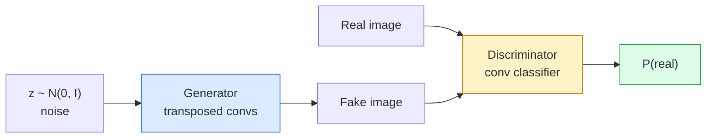
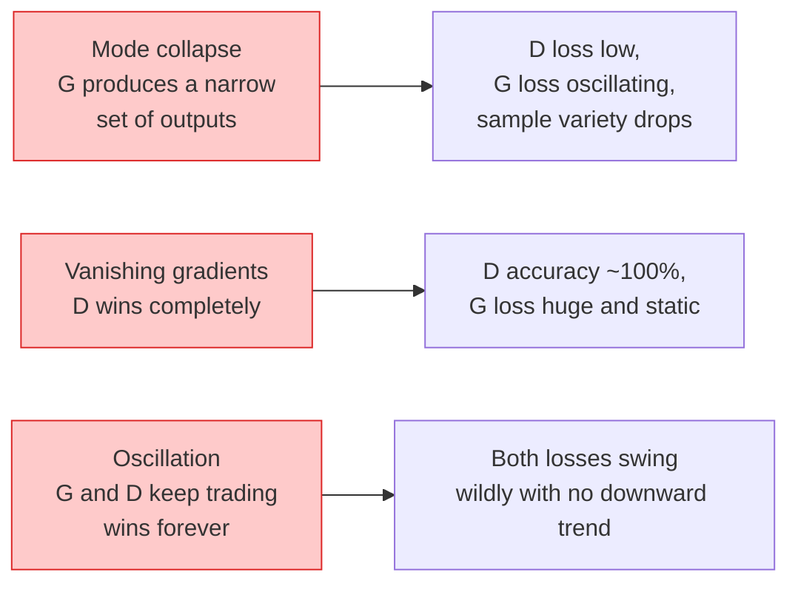

# Tạo hình ảnh  GANs  Tạo hình ảnh  Tạo lên mạng chống lại mạng

> Một GAN là hai mạng thần kinh trong một trò chơi cố định, một rút thăm, một chỉ trích.

> **【中文解读】**GAN (Generator Against Network) là một trong hai mạng lưới thần kinh: Generator Picture,判别器挑毛病, hai người cùng tiến bộ cho đến khi Generator có thể lừa dối qua phân định器.

> **【拓展：GAN 的遗产】**GAN trong StyleGAN ([[Bản xuất khuôn mặt]]), CycleGAN ([[Bản xuất khuôn mặt]]), GAN với độ phân giải siêu cao ([[Bản xuất hình ảnh siêu phân giải]]) có trong những ứng dụng có cột mốc. Mặc dù mô hình phổ biến trở thành dòng chủ yếu trong việc tạo hình ảnh sau năm 2022, nhưng ý tưởng chống đào tạo của GAN vẫn được sử dụng để nâng cao chất lượng các mô hình khác được tạo ra.

**Type:** Build | **类型:** 动手
**Languages:** Python | **语言:** Python
**Prerequisites:** Phase 4 Lesson 03 (CNNs), Phase 3 Lesson 06 (Optimizers), Phase 3 Lesson 07 (Regularization) | **前置知识:** Phase 4 Lesson 03（CNN），Phase 3 Lesson 06（优化器），Phase 3 Lesson 07（正则化）
**Time:** ~75 minutes | **时间:** ~75 分钟

## Mục tiêu học tập

- Giải thích trò chơi minimax giữa máy phát và phân biệt và tại sao sự cân bằng tương ứng với p_model = p_data
- Thực hiện một DCGAN trong PyTorch và làm cho nó tạo ra các hình ảnh tổng hợp liên kết 32x32 trong dưới 60 dòng
- Cải thiện sự đào tạo GAN bằng ba thủ thuật tiêu chuẩn: mất không bão hòa, chuẩn quang phổ, TTUR (quy tắc cập nhật hai lần)
- Đọc đường cong đào tạo phân biệt sự hội tụ lành mạnh từ sự sụp đổ của chế độ, dao động và phân biệt đối xử-sự thắng lợi hoàn toàn

> **【中文解读】**Mục tiêu học tập được liệt kê trong danh sách các khả năng cốt lõi cần được nắm bắt sau khi hoàn thành bài học.


## Vấn đề  vấn đề giới thiệu

Việc phân loại dạy một mạng lưới để lập bản đồ hình ảnh cho nhãn. Tạo lại vấn đề: lấy mẫu hình ảnh mới trông giống như chúng xuất phát từ cùng một phân phối. Không có đầu ra "đúng" bạn có thể khác biệt; chỉ có một phân phối bạn muốn bắt chước.

> Cổ phần học mạng sẽ hiển thị hình ảnh vào nhãn. Tạo ra một sự biến đổi về vấn đề này: mẫu trông giống như từ hình ảnh mới phân phối giống nhau. Không có đầu ra "sự chính xác" có thể so sánh; chỉ có một phân phối bạn muốn mô phỏng.

Các chức năng mất mát tiêu chuẩn (MSE, cross-entropy) không thể đo "có mẫu này đến từ phân phối thực".

> 标准损失函数 ((MSE、交叉) không thể đo "năm mẫu này có đến từ phân bố thực" không.

GAN (Goodfellow et al., 2014) đã xác định khung hình đó. Đến năm 2018, StyleGAN đã sản xuất 1024x1024 khuôn mặt không thể phân biệt với ảnh. Các mô hình phân tán từ đó đã chiếm ngôi về chất lượng và khả năng kiểm soát, nhưng mọi thủ thuật giúp phân tán thực tế  các lựa chọn chuẩn hóa, không gian ẩn, mất tính năng  lần đầu tiên được hiểu trên GAN.

> GAN(Goodfellow 等,2014) đã xác định khung hình đó. Đến năm 2018, StyleGAN đã có thể tạo ra một khuôn mặt không thể phân biệt được với ảnh 1024x1024 面部.

## Khái niệm cốt lõi

> **【中文解读】**Bài viết này giới thiệu các khái niệm và lý thuyết cốt lõi.


### Hai mạng lưới



- **generator**G lấy một vector tiếng `z`và đưa ra một hình ảnh.**discriminator**D lấy một hình ảnh và đưa ra một số lượng đơn lẻ: xác suất hình ảnh là thực.

> **生成器**G 接收噪声向量 `z`Và xuất một张图像──**判别器**D 接收一张图像并输出一个标量:该图像为真实图像的概率──

### Trò chơi

G muốn D sai, D muốn đúng.

> G 希望 D 判断错, D 希望判断正确――形式化地:

```
min_G max_D  E_x[log D(x)] + E_z[log(1 - D(G(z)))]
```

Đọc từ bên phải sang trái: D là tối đa hóa độ chính xác trên thực (`log D(real)`(với giả)`log (1 - D(fake))`G đang giảm thiểu độ chính xác của D trên giả mạo  nó muốn `D(G(z))`để bị đâm.

> Từ phải sang trái đọc:D Trong tối đa hóa đối với hình ảnh thực`log D(real)`(văn hình giả)`log(1 - D(fake))`(G trong tối thiểu hóa D đối với hình ảnh giả phân loại độ chính xác  nó mong muốn `D(G(z))`尽可能高.

Goodfellow chứng minh rằng tối thiểu này có một sự cân bằng toàn cầu nơi `p_G = p_data`, D là 0.5 ở khắp mọi nơi, và sự khác biệt Jensen-Shannon giữa phân phối được tạo ra và thực là 0.

> Người thân thiện đã chứng minh rằng có một điểm cân bằng toàn cầu.`p_G = p_data`,D ở tất cả các vị trí xuất 0.5, tạo phân phối và phân phối thực sự giữa phân bố Jensen-Shannon  độ phân bố là 0.

### Thiệt hại không bão hòa

Phương thức trên không ổn định về mặt số lượng.`D(G(z))`gần bằng không cho mỗi giả, vậy `log(1 - D(G(z)))`có gradient biến mất đối với G. Giải pháp: biến đổi G mất.

> Các hình thức trên trên không ổn định trên số giá trị.`D(G(z))`Đối với mỗi mẫu giả đều gần như không, vì vậy `log(1 - D(G(z)))`Đối với G của gradient xu hướng biến mất.

```
L_D = -E_x[log D(x)] - E_z[log(1 - D(G(z)))]
L_G = -E_z[log D(G(z))]                          # non-saturating
```

Giờ thì khi nào `D(G(z))`G là một loại tàu có biến thể này.

> 现在,当 `D(G(z))`Gần 0 giờ, G mất mát rất lớn, độ thông tin đầy đủ.

### Quy tắc kiến trúc DCGAN

Radford, Metz, Chintala (2015) đã phân tích năm năm thí nghiệm thất bại thành năm quy tắc làm cho việc đào tạo GAN ổn định:

> Radford、Metz、Chintala(2015) sẽ nhiều năm thất bại trong các thử nghiệm kinh nghiệm提炼为五条使 GAN 训练稳定的规则:

1. Thay thế hợp nhất bằng conv (cả hai lưới).
   Trung ngữ翻译:用步幅卷积替代池化层 (两个网络都适用)
2. Sử dụng chuẩn hàng loạt trong cả máy phát và phân biệt, ngoại trừ đầu ra của G và đầu vào của D.
   Trung ngữ翻译: trong các máy tạo và phân định đều sử dụng phân loại, nhưng G của lớp xuất và D của lớp nhập trừ.
3. Tắt các lớp kết nối hoàn toàn trên các kiến trúc sâu hơn.
   Trung ngữ翻译: trong cấu trúc sâu hơn di chuyển toàn bộ tầng kết nối.
4. G sử dụng ReLU trên tất cả các lớp ngoại trừ đầu ra (tanh cho đầu ra trong [-1, 1]).
   Trung文翻译:G 在所有层使用 ReLU,输出层除外(输出层用 tanh 将值域限制在 [-1, 1])。
5. D sử dụng LeakyReLU ( âm_thành = 0,2) trên tất cả các lớp.
   Trung文翻译:D 在所有层使用LeakyReLU(负斜率=0.2)。

Mỗi GAN dựa trên con (StyleGAN, BigGAN, GigaGAN) hiện đại vẫn bắt đầu từ các quy tắc này và thay thế các mảnh một lần.

> Mỗi hiện đại dựa trên khối lượng GAN (StyleGAN, BigGAN, GigaGAN) vẫn xuất phát từ các quy tắc này, từng thay thế các thành phần trong đó.

### Các chế độ thất bại và chữ ký của chúng



- **Mode collapse**G tìm thấy một hình ảnh làm dại D và chỉ tạo ra điều đó.
  Trung文翻译:模式塌G 找到一张能骗过D的图像,然后只生成那张──修复:添加小批量判别、谱归归归归归归归归归归归归归归归归归归归归归归归归归归归归归归归归归归归归归归归归归归归归归归归归归归归归归归归归归归归归归归归归归归归归归归归归归归归归归归归归归归归归归归归归归归归归归归归归归归归归归归归归归归归归归归归归归归归归归归归归归归归归归归归归归归归归归归归归归归归归归归归归归归归归归归归归归归归归归归归归归归归归归归归归归归归归归归归归归归归归归归归归归归归归归归归归归归归归归归归归归归归归归归归归归归归归归归归归归归归归归归归归归归归归归归归归归归归归归归归归归归归归归归归归归归归归归归归归归归归归归归归归归归归归归归归归归归归归归归归归归归归归归归归归归归归归归归归归归归归归归归归归归归归归归归归归归归归归归归归归归归归归归归归归归归归归归归归归归归归归归归归归归归归归归归归归归归归归归归归归归归归归归归归归归归归归归归归归归归归归归归归归归归归归归归归归归归归归归归归归归归归归归归归归归归归归归归归归归归归归归归归归归归归归归归归归归归归归归归归归归归归归归归归归归归归归归归归归归归归归归归归归归归归归归归
- **Discriminator wins**D trở nên quá mạnh quá nhanh, gradient của G biến mất.
  Trung ngữ翻译:判别器完胜D 变得太强太快,G 的梯度消失──修复:缩小 D、降低 D 学习率或对真标进行平滑──
- **Oscillation**: hai lưới giao dịch thắng mà không bao giờ tiếp cận cân bằng.
  Trung ngữ翻译:振荡两个网络交换占优,永远无法接近平衡──修复:TTUR(D 比 G 快 2-4倍) 或切换到Wasserstein 损失──

### Đánh giá

GAN không có sự thật, vậy làm sao bạn biết họ đang hoạt động?

> GAN không có câu trả lời tiêu chuẩn, vậy làm thế nào để đánh giá chúng có hoạt động bình thường không?

- **Sample inspection** chỉ cần nhìn vào 64 mẫu ở cuối mỗi thời đại.
  Trung文翻译:样本检查每个时代 结束时看64个样本──这是不可省的步骤──
- **FID (Fréchet Inception Distance)** khoảng cách giữa các tính năng phân phối của các tập hợp thực và tạo ra.
  Trung文翻译:FID(Fréchet Inception Distance) 真实集和生成集在 Inception-v3 特征分布之间的距离──越低越好──社区标准──
- **Inception Score** già hơn, dễ vỡ hơn; thích FID.
  Trung文翻译:Inception Score较老、较脆弱;优先使用FID。
- **Precision/Recall for generative models** đo lường chất lượng (sự chính xác) và bảo hiểm (tái nhớ) riêng biệt.
  Trung ngữ翻译:生成模型的精确率/召回率分别衡量质量(精确率) 和覆盖度(召回率) ――比单独的FID 更有信息量──

Đối với một cuộc chạy dữ liệu tổng hợp nhỏ, kiểm tra mẫu là đủ.

> Đối với các thí nghiệm dữ liệu tổng hợp quy mô nhỏ, kiểm tra mẫu đã đủ.

> **【中文解读】**本节通过代码实现核心算法从零――这种" từ đầu"的方式能帮助理解框架背后的原理,遇到问题时不会被黑盒困住――

> **【拓展：工业部署中的视觉系统】**Trong thực tế, mô hình hình ảnh cần phải xem xét các vấn đề về sự chậm trễ, mô hình lớn, thiết bị cạnh phù hợp, vv.

> **【拓展：数据标注与质量】**视觉任务的效果高度依赖标签数据质量――Label Studio、CVAT là công cụ标签 chính thống――在工业场景中,主动学习(Active Learning) có thể giảm chi phí đánh dấu: mô hình đối với yêu cầu mẫu không xác định


## Hãy xây dựng nó.
```figure
cv-gan-image
```

## Hãy xây dựng nó

### Bước 1: Máy phát điện

Một máy phát điện DCGAN nhỏ lấy tiếng ồn 64-dim và tạo ra hình ảnh 32x32.

> Một máy phát điện DCGAN nhỏ, nhận 64 维 tiếng ồn và tạo ra 32x32 图像──

```python
import torch
import torch.nn as nn

class Generator(nn.Module):
    def __init__(self, z_dim=64, img_channels=3, feat=64):
        super().__init__()
        self.net = nn.Sequential(
            nn.ConvTranspose2d(z_dim, feat * 4, kernel_size=4, stride=1, padding=0, bias=False),
            nn.BatchNorm2d(feat * 4),
            nn.ReLU(inplace=True),
            nn.ConvTranspose2d(feat * 4, feat * 2, kernel_size=4, stride=2, padding=1, bias=False),
            nn.BatchNorm2d(feat * 2),
            nn.ReLU(inplace=True),
            nn.ConvTranspose2d(feat * 2, feat, kernel_size=4, stride=2, padding=1, bias=False),
            nn.BatchNorm2d(feat),
            nn.ReLU(inplace=True),
            nn.ConvTranspose2d(feat, img_channels, kernel_size=4, stride=2, padding=1, bias=False),
            nn.Tanh(),
        )

    def forward(self, z):
        return self.net(z.view(z.size(0), -1, 1, 1))
```

Bốn con tàu được chuyển giao, mỗi con tàu có`kernel_size=4, stride=2, padding=1`Vì vậy, chúng tăng gấp đôi kích thước không gian.

> 4 vòng quay, mỗi sử dụng`kernel_size=4, stride=2, padding=1`Để làm sạch sẽ kích thước không gian gấp đôi.

### Bước 2: Phân biệt đối xử

Trình của máy phát điện.

> √ √ √ √ √ √ √ √ √ √ √ √ √ √ √ √ √ √ √ √ √ √ √ √ √ √ √ √ √ √ √ √ √ √ √ √ √ √ √ √ √ √ √ √ √ √ √ √ √ √ √ √ √ √ √ √ √ √ √ √ √ √ √ √ √ √ √ √ √ √ √ √ √ √ √ √ √ √ √ √ √ √ √ √ √ √ √ √ √ √ √ √ √ √ √ √ √ √ √ √ √ √ √ √ √ √ √ √ √ √ √ √ √ √ √ √ √ √ √ √ √ √ √ √ √ √ √ √ √ √ √ √ √ √ √ √ √ √ √ √ √ √ √ √ √ √ √ √ √ √ √ √ √ √ √ √ √ √ √ √ √ √ √ √ √ √ √ √ √ √ √ √ √ √ √ √ √ √ √ √ √ √ √ √ √ √ √ √ √ √ √ √ √ √ √ √ √ √ √ √ √ √ √ √ √ √ √ √ √ √ √ √ √ √ √ √ √ √ √ √ √ √ √ √ √ √ √ √ √ √ √ √ √ √ √ √ √ √ √ √ √ √ √ √ √ √ √ √ √ √ √ √ √ √ √

```python
class Discriminator(nn.Module):
    def __init__(self, img_channels=3, feat=64):
        super().__init__()
        self.net = nn.Sequential(
            nn.Conv2d(img_channels, feat, kernel_size=4, stride=2, padding=1),
            nn.LeakyReLU(0.2, inplace=True),
            nn.Conv2d(feat, feat * 2, kernel_size=4, stride=2, padding=1, bias=False),
            nn.BatchNorm2d(feat * 2),
            nn.LeakyReLU(0.2, inplace=True),
            nn.Conv2d(feat * 2, feat * 4, kernel_size=4, stride=2, padding=1, bias=False),
            nn.BatchNorm2d(feat * 4),
            nn.LeakyReLU(0.2, inplace=True),
            nn.Conv2d(feat * 4, 1, kernel_size=4, stride=1, padding=0),
        )

    def forward(self, x):
        return self.net(x).view(-1)
```

Con cuối cùng giảm `4x4`bản đồ tính năng đến `1x1`. Tạo ra là một scalar mỗi hình ảnh; chỉ áp dụng sigmoid trong quá trình tính toán mất mát.

> Lần cuối cùng`4x4`Đặc điểm giảm`1x1`❖ Mỗi张图像输出一个标量; chỉ trong mất mát tính toán khi áp dụng sigmoid。

### Bước 3: Bước đào tạo

Thay thế: cập nhật D một lần, sau đó là G một lần, mỗi lô.

> 交替进行: mỗi lô trước mới D 一次,再更新 G 一次。

```python
import torch.nn.functional as F

def train_step(G, D, real, z, opt_g, opt_d, device):
    real = real.to(device)
    bs = real.size(0)

    # D step
    opt_d.zero_grad()
    d_real = D(real)
    d_fake = D(G(z).detach())
    loss_d = (F.binary_cross_entropy_with_logits(d_real, torch.ones_like(d_real))
              + F.binary_cross_entropy_with_logits(d_fake, torch.zeros_like(d_fake)))
    loss_d.backward()
    opt_d.step()

    # G step
    opt_g.zero_grad()
    d_fake = D(G(z))
    loss_g = F.binary_cross_entropy_with_logits(d_fake, torch.ones_like(d_fake))
    loss_g.backward()
    opt_g.step()

    return loss_d.item(), loss_g.item()
```

`G(z).detach()`trong bước D là quan trọng: chúng ta không muốn gradient chảy vào G trong quá trình cập nhật của nó.

> D 步骤中的`G(z).detach()`至关重要: Chúng tôi không muốn trong quá trình nâng cấp của D 梯度流回 G.

### Bước 4: vòng đào tạo đầy đủ trên hình dạng tổng hợp

```python
from torch.utils.data import DataLoader, TensorDataset
import numpy as np

def synthetic_images(num=2000, size=32, seed=0):
    rng = np.random.default_rng(seed)
    imgs = np.zeros((num, 3, size, size), dtype=np.float32) - 1.0
    for i in range(num):
        r = rng.uniform(6, 12)
        cx, cy = rng.uniform(r, size - r, size=2)
        yy, xx = np.meshgrid(np.arange(size), np.arange(size), indexing="ij")
        mask = (xx - cx) ** 2 + (yy - cy) ** 2 < r ** 2
        color = rng.uniform(-0.5, 1.0, size=3)
        for c in range(3):
            imgs[i, c][mask] = color[c]
    return torch.from_numpy(imgs)

device = "cuda" if torch.cuda.is_available() else "cpu"
data = synthetic_images()
loader = DataLoader(TensorDataset(data), batch_size=64, shuffle=True)

G = Generator(z_dim=64, img_channels=3, feat=32).to(device)
D = Discriminator(img_channels=3, feat=32).to(device)
opt_g = torch.optim.Adam(G.parameters(), lr=2e-4, betas=(0.5, 0.999))
opt_d = torch.optim.Adam(D.parameters(), lr=2e-4, betas=(0.5, 0.999))

for epoch in range(10):
    for (batch,) in loader:
        z = torch.randn(batch.size(0), 64, device=device)
        ld, lg = train_step(G, D, batch, z, opt_g, opt_d, device)
    print(f"epoch {epoch}  D {ld:.3f}  G {lg:.3f}")
```

`Adam(lr=2e-4, betas=(0.5, 0.999))`là mặc định DCGAN  beta1 thấp giữ cho thời gian tăng động khỏi ổn định trò chơi đối thủ quá nhiều.

> `Adam(lr=2e-4, betas=(0.5, 0.999))`Dòng định dạng của DCGAN là beta1 thấp hơn để ngăn chặn động lượng quá ổn định đối với các chất chống ︎

### Bước 5: Tiêu chuẩn

```python
@torch.no_grad()
def sample(G, n=16, z_dim=64, device="cpu"):
    G.eval()
    z = torch.randn(n, z_dim, device=device)
    imgs = G(z)
    imgs = (imgs + 1) / 2
    return imgs.clamp(0, 1)
```

Luôn chuyển sang chế độ đánh giá trước khi lấy mẫu. Đối với DCGAN điều này quan trọng bởi vì số liệu điều chỉnh điều hành hàng được sử dụng thay vì số liệu thống kê hàng.

> 采样前务必切换到 eval 模式―― đối với DCGAN, điều này rất quan trọng, bởi vì phân khúc sẽ sử dụng số liệu thống kê khi vận hành chứ không phải số liệu thống kê của lô hiện tại――

### Bước 6: Tiêu chuẩn hóa phổ

Một thay thế cho BN trong phân biệt đối xử đảm bảo mạng là 1-Lipschitz.

> 谱归结是判别器中批归结的即插即用替代方案,保证网络是1-Lipschitz的──能修复大多数"D 赢得太彻底"的问题──

```python
from torch.nn.utils import spectral_norm

def build_sn_discriminator(img_channels=3, feat=64):
    return nn.Sequential(
        spectral_norm(nn.Conv2d(img_channels, feat, 4, 2, 1)),
        nn.LeakyReLU(0.2, inplace=True),
        spectral_norm(nn.Conv2d(feat, feat * 2, 4, 2, 1)),
        nn.LeakyReLU(0.2, inplace=True),
        spectral_norm(nn.Conv2d(feat * 2, feat * 4, 4, 2, 1)),
        nn.LeakyReLU(0.2, inplace=True),
        spectral_norm(nn.Conv2d(feat * 4, 1, 4, 1, 0)),
    )
```

> **【中文解读】**Bài này sẽ trình bày cách sử dụng một khung đã phát triển như PyTorch, HuggingFace, và các khác.


Thay đổi `Discriminator`cho `build_sn_discriminator()`Và bạn thường không cần thủ thuật TTUR. chuẩn quang phổ là nâng cấp độ bền đơn giản nhất bạn có thể áp dụng.

> sẽ`Discriminator`替换为 `build_sn_discriminator()`Sau đó thường không cần kỹ thuật TTUR.


> **【拓展：视觉模型的持续学习】**Trong môi trường sản xuất, mô hình hình ảnh cần phải liên tục thích ứng với dữ liệu mới.

## Hãy sử dụng nó để thực hiện

Đối với thế hệ nghiêm trọng, sử dụng trọng lượng được huấn luyện trước hoặc chuyển sang phân phối.

- `torch_fidelity`tính toán FID / IS trên máy phát điện của bạn mà không viết mã đánh giá tùy chỉnh.
- `pytorch-gan-zoo`(trong thừa kế) và `StudioGAN`tàu thử nghiệm các triển khai của DCGAN, WGAN-GP, SN-GAN, StyleGAN và BigGAN.

Năm 2026, GAN vẫn là lựa chọn tốt nhất cho: tạo hình ảnh thời gian thực (trễ <10 ms), chuyển giao phong cách, dịch từ hình ảnh sang hình ảnh với điều khiển chính xác (Pix2Pix, CycleGAN).

> **【中文解读】**Phần này tập trung vào cách phân phối mô hình như một sản phẩm có thể sử dụng.


## Chuyển nó đi.

Bài học này mang lại:

- `outputs/prompt-gan-training-triage.md` một lời nhắc đọc mô tả đường cong tập luyện và chọn chế độ thất bại (cái sụp chế, D-win, dao động) cộng với sửa chữa đơn được khuyến cáo.
- `outputs/skill-dcgan-scaffold.md` một kỹ năng viết một chiếc ghế DCGAN từ `z_dim`, mục tiêu`image_size`, và`num_channels`, bao gồm vòng huấn luyện và tiết kiệm mẫu.

> **【中文解读】**练题按照 Easy/Medium/Hard 三个难度递进;;建议至少完成 级别的题目, 级别适合深入研究或面试准备;;


## Tập luyện bài tập

1. **(Easy)**Đào tạo DCGAN trên trên bộ dữ liệu vòng tròn tổng hợp và lưu một lưới gồm 16 mẫu vào cuối mỗi kỷ nguyên.
2. **(Medium)**Thay thế chuẩn hàng phân biệt đối xử bằng chuẩn quang phổ. Tập hai phiên bản bên cạnh. Một trong hai phiên bản này hội tụ nhanh hơn?
3. **(Hard)**Thực hiện một DCGAN có điều kiện: đưa nhãn lớp vào cả G và D (đặt một cái nóng vào tiếng ồn ở G, rút một kênh nhúng lớp vào D). Tập tập trên bộ dữ liệu tổng hợp "cây vít vít hình" từ bài học 7 và chứng minh rằng điều kiện lớp hoạt động bằng cách lấy mẫu với nhãn cụ thể.

> **【中文解读】**Trong 术语表中的"Những gì mọi người nói" vs "Những gì nó thực sự có nghĩa" 区分日常口语和精确技术含义── 在团队协作中,统一术语定义可以避免大量沟通误解──


## Từ khóa  Từ khóa nhanh chóng

| Term | What people say | What it actually means |
|------|----------------|----------------------|
| Generator (G) | "The draws-stuff net" | Maps noise to images; trained to fool the discriminator |
| Discriminator (D) | "The critic" | Binary classifier; trained to distinguish real from generated images |
| Minimax | "The game" | min over G, max over D of an adversarial loss; equilibrium is p_G = p_data |
| Non-saturating loss | "The numerically sane version" | G's loss is -log(D(G(z))) instead of log(1 - D(G(z))) to avoid vanishing gradients early in training |
| Mode collapse | "Generator makes one thing" | G produces only a small subset of the data distribution; fix with SN, minibatch discrimination, or larger batch |
| TTUR | "Two learning rates" | D learns faster than G, typically by a factor of 2-4; stabilises training |
| Spectral norm | "1-Lipschitz layer" | A weight-normalisation that bounds each layer's Lipschitz constant; stops D from becoming arbitrarily steep |
| FID | "Fréchet Inception Distance" | Distance between Inception-v3 feature distributions of real and generated sets; the standard evaluation metric |

> **【中文解读】**延伸阅读 cung cấp các nguồn chất lượng cao cho việc học sâu. Những bài báo và giảng dạy này là tài liệu tham khảo cổ điển trong lĩnh vực này, phù hợp với những người đọc cần hiểu sâu hơn.


## Xem thêm 延伸阅读

- [Generative Adversarial Networks (Goodfellow et al., 2014)](https://arxiv.org/abs/1406.2661) tờ báo bắt đầu tất cả
- [DCGAN (Radford, Metz, Chintala, 2015)](https://arxiv.org/abs/1511.06434) các quy tắc kiến trúc làm cho các GAN có thể đào tạo
- [Spectral Normalization for GANs (Miyato et al., 2018)](https://arxiv.org/abs/1802.05957) thủ thuật ổn định đơn giản nhất hữu ích
- [StyleGAN3 (Karras et al., 2021)](https://arxiv.org/abs/2106.12423) SOTA GAN; đọc như một album hit lớn nhất của mọi trò chơi từ thập kỷ qua
