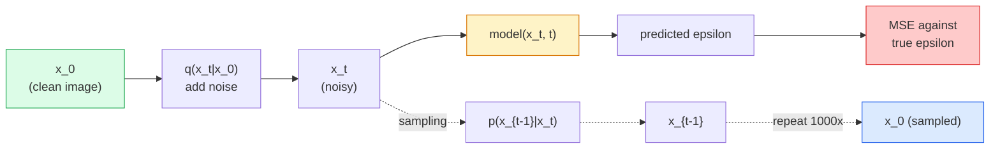

# Tạo hình ảnh  Mô hình phân tán  Tạo hình ảnh  Mô hình phân tán

> Một mô hình phân tán học cách phủ định, huấn luyện nó để loại bỏ một chút tiếng ồn nhỏ từ một hình ảnh ồn ào, lặp lại một ngàn lần ngược lại, và bạn có một máy tạo hình ảnh.

> **【中文解读】**扩散模型学习去噪音: tập mạng từ một chút tiếng ồn trong hình ảnh loại bỏ tiếng ồn, ngược lại lặp lại một ngàn lần có thể tạo ra hình ảnh từ thanh thanh thanh thanh thanh thanh thanh thanh thanh thanh thanh thanh thanh thanh thanh thanh thanh thanh thanh thanh thanh thanh thanh thanh thanh thanh thanh thanh thanh thanh thanh thanh thanh thanh thanh thanh thanh thanh thanh thanh thanh thanh thanh thanh thanh thanh thanh thanh thanh thanh thanh thanh thanh thanh thanh thanh thanh thanh thanh thanh thanh thanh thanh thanh thanh thanh thanh thanh thanh thanh thanh thanh thanh thanh thanh thanh thanh thanh thanh thanh thanh thanh thanh thanh thanh thanh thanh thanh thanh thanh thanh thanh thanh thanh thanh thanh thanh thanh thanh thanh thanh thanh thanh thanh thanh thanh thanh thanh thanh thanh thanh thanh thanh thanh thanh thanh thanh thanh thanh thanh thanh thanh thanh thanh thanh thanh thanh thanh thanh thanh thanh thanh thanh thanh thanh thanh thanh thanh thanh thanh thanh thanh thanh thanh thanh thanh thanh thanh thanh thanh thanh thanh thanh thanh thanh thanh thanh thanh thanh thanh thanh thanh thanh thanh thanh thanh thanh thanh thanh thanh thanh thanh thanh thanh thanh thanh thanh thanh thanh thanh thanh thanh thanh thanh thanh thanh thanh thanh thanh thanh thanh thanh thanh thanh thanh thanh thanh thanh thanh thanh thanh thanh thanh thanh thanh thanh thanh thanh thanh thanh thanh thanh thanh thanh thanh thanh thanh thanh thanh thanh thanh thanh thanh thanh thanh thanh thanh thanh thanh thanh thanh thanh thanh thanh thanh thanh thanh thanh thanh thanh thanh thanh thanh thanh thanh thanh thanh thanh thanh thanh thanh thanh thanh thanh thanh thanh thanh thanh thanh thanh thanh thanh thanh thanh thanh thanh thanh thanh thanh thanh thanh thanh thanh thanh thanh thanh thanh thanh thanh thanh thanh thanh thanh thanh thanh thanh thanh thanh thanh thanh thanh thanh thanh thanh thanh thanh thanh thanh thanh thanh thanh thanh thanh thanh thanh thanh thanh thanh thanh thanh thanh thanh thanh thanh thanh thanh thanh thanh thanh thanh thanh thanh thanh thanh thanh thanh thanh thanh thanh thanh thanh thanh thanh thanh thanh thanh thanh thanh thanh thanh thanh thanh thanh thanh thanh thanh thanh thanh thanh thanh thanh thanh thanh thanh thanh thanh thanh thanh thanh thanh thanh thanh thanh thanh thanh thanh thanh thanh thanh thanh thanh thanh thanh thanh thanh thanh thanh thanh thanh thanh thanh thanh thanh thanh thanh thanh thanh thanh thanh thanh thanh thanh thanh thanh thanh thanh thanh thanh thanh thanh thanh thanh thanh thanh thanh thanh thanh thanh thanh thanh thanh thanh thanh thanh thanh thanh thanh thanh thanh thanh thanh thanh thanh thanh thanh thanh thanh thanh thanh thanh thanh thanh thanh thanh thanh thanh thanh thanh thanh thanh thanh thanh thanh thanh thanh thanh thanh thanh thanh thanh thanh thanh thanh thanh thanh thanh thanh thanh thanh thanh thanh thanh thanh thanh thanh thanh thanh thanh thanh thanh

> **【拓展：扩散模型的革命】**扩散模型在 2022年后取代GAN 成为图像生成的主流――Stable Diffusion 使用潜在空间扩散――Latent Diffusion) giảm đáng kể chi phí tính toán, DDIM 采样器 sẽ đưa ra số bước từ 1000 bước xuống 20 bước――扩散模型也被应用于视频生成(Sora)、3D 生成、音频生成等领域――

**Type:** Build | **类型:** 动手
**Languages:** Python | **语言:** Python
**Prerequisites:** Phase 4 Lesson 07 (U-Net), Phase 1 Lesson 06 (Probability), Phase 3 Lesson 06 (Optimizers) | **前置知识:** Phase 4 Lesson 07（U-Net），Phase 1 Lesson 06（概率），Phase 3 Lesson 06（优化器）
**Time:** ~75 minutes | **时间:** ~75 分钟

## Mục tiêu học tập

- Thuộc dẫn quá trình âm thanh về phía trước `x_0 -> x_1 -> ... -> x_T`và giải thích tại sao hình thức đóng`q(x_t | x_0)`giữ cho bất kỳ t
- Thực hiện một mục tiêu đào tạo theo kiểu DDPM để giảm tiếng ồn được thêm vào mỗi bước, và một mẫu người đi lại từ tiếng ồn thuần túy sang hình ảnh
- Xây dựng một U-Net có điều kiện thời gian (số nhỏ đủ để đào tạo trên CPU) dự đoán tiếng ồn cho bất kỳ bước thời gian nào
- Giải thích sự khác biệt giữa lấy mẫu DDPM và DDIM, và khi nào mỗi mẫu phù hợp (Sự học 23 bao gồm sự phù hợp dòng chảy và dòng chảy chỉnh sâu)

> **【中文解读】**Mục tiêu học tập được liệt kê trong danh sách các khả năng cốt lõi cần được nắm bắt sau khi hoàn thành bài học.


## Vấn đề  vấn đề giới thiệu

GAN tạo ra một cú bắn: tiếng ồn vào, hình ảnh ra, một lần đi trước. Chúng nhanh và khó huấn luyện. Các mô hình phân tán tạo ra lặp đi lặp lại: bắt đầu từ tiếng ồn thuần khiết, chỉ định bằng các bước nhỏ, hình ảnh xuất hiện. Chúng chậm và dễ huấn luyện. Trong năm năm qua, đặc tính sau đây đã thống trị: bất kỳ đội nhỏ nào có thể đào tạo mô hình phân tán và nhận được các mẫu hợp lý; đào tạo GAN là một nghề bạn học được qua nhiều năm chạy thất bại.

> GAN một lần tạo ra: âm thanh nhập vào, hình ảnh ra ra ngoài, một lần phát triển. Chúng nhanh chóng nhưng khó đào tạo. Mô hình phát triển: từ âm thanh thuần túy bắt đầu, từng bước nhỏ đến tiếng ồn, hình ảnh dần xuất hiện.

Ngoài sự ổn định đào tạo, cấu trúc lặp lại của sự phân tán là điều mở khóa tất cả những gì mà thế hệ hình ảnh hiện đại làm: điều kiện văn bản, vẽ, chỉnh sửa hình ảnh, độ phân giải siêu, phong cách có thể kiểm soát. Mỗi bước trong vòng lấy mẫu là một nơi để tiêm một hạn chế mới. Đó là lý do tại sao Stable Diffusion, Imagen, DALL-E 3, Midjourney, và mọi mô hình hình ảnh có thể điều khiển mà bạn sẽ sử dụng đều dựa trên sự pha trộn.

> Ngoài việc tập luyện ổn định, cấu trúc của sự phổ biến của các thế hệ đã giải quyết tất cả mọi thứ mà tạo hình ảnh hiện đại làm: văn bản điều kiện hóa, sửa đổi hình ảnh, chỉnh sửa hình ảnh, độ phân giải siêu cao, phong cách có thể kiểm soát được. Mỗi bước trong vòng mẫu đều được truyền vào một khối mới.

Bài học này xây dựng DDPM tối thiểu: tiếng ồn về phía trước, tiếng ồn về phía sau, vòng đào tạo. Bài học tiếp theo (Stable Diffusion) dây nó vào một hệ thống sản xuất với một VAE, một mã hóa văn bản và hướng dẫn không có phân loại.

> 本课构建最小DDPM:前向加噪、后向去噪、训练循环。 下一课(Stable Diffusion) sẽ kết nối nó vào hệ thống sản xuất, chứa VAE、文本编码器和无分类器引导。

## Khái niệm cốt lõi

> **【中文解读】**Bài viết này giới thiệu các khái niệm và lý thuyết cốt lõi.


### Quá trình tiến bộ

Hãy chụp ảnh`x_0`Thêm một lượng nhỏ tiếng ồn Gaussian để có được`x_1`Thêm thêm một lượng nhỏ để lấy được`x_2`Cứ tiếp tục bước đi cho đến khi`x_T`gần như không thể phân biệt được với tiếng ồn Gaussian thuần túy.

> 取一张图像 `x_0`, thêm một chút tiếng ồn cao được .`x_1`, thêm một chút nữa .`x_2`, tiếp tục T 步直到 `x_T`Với âm thanh thanh thanh cao, gần như không thể phân biệt được.

```
q(x_t | x_{t-1}) = N(x_t; sqrt(1 - beta_t) * x_{t-1},  beta_t * I)
```

`beta_t`là một lịch trình biến động nhỏ, thường tuyến tính từ 0.0001 đến 0.02 trên T = 1000 bước.

> `beta_t`là một điều chỉnh khoảng cách nhỏ, thường trong T=1000 bước từ 0.0001 线性增长到0.02── mỗi bước nhỏ giảm tín hiệu và truyền vào tiếng ồn mới──

### Chuyến nhảy hình thức đóng

Thêm tiếng ồn một bước một lần là một chuỗi Markov, nhưng toán học gấp: bạn có thể lấy mẫu`x_t`trực tiếp từ `x_0`chỉ một bước thôi.

> Một bước tăng tiếng ồn là một chuỗi rất dễ dàng, nhưng toán học có thể gấp: bạn có thể bước trực tiếp từ `x_0`采样 `x_t`

```
Define alpha_t = 1 - beta_t
Define alpha_bar_t = prod_{s=1..t} alpha_s

Then:
  q(x_t | x_0) = N(x_t; sqrt(alpha_bar_t) * x_0,  (1 - alpha_bar_t) * I)

Equivalently:
  x_t = sqrt(alpha_bar_t) * x_0 + sqrt(1 - alpha_bar_t) * epsilon
  where epsilon ~ N(0, I)
```

Sự phân tán này là lý do thực tế.`t`, mẫu `x_t`trực tiếp từ `x_0`, và đào tạo trong một bước không cần mô phỏng toàn bộ chuỗi Markov.

> Đây là một phương pháp là tất cả các lý do thực tế của mô hình mở rộng.`t`, trực tiếp từ`x_0`采样 `x_t`, bước hoàn thành đào tạo không cần phải mô phỏng toàn bộ chuỗi Markov.

### Quá trình ngược

Quá trình tiến lên là cố định.`p(x_{t-1} | x_t)`là những gì mạng thần kinh học được.`x_{t-1}`trực tiếp; họ dự đoán tiếng ồn`epsilon`thêm vào bước t, và toán học dẫn đến `x_{t-1}`từ nó.

> Chuyển tiến trước là xác định.`p(x_{t-1} | x_t)`                                                                                                                                                                                                                                                              `x_{t-1}`; chúng dự đoán thứ hai bước gia tăng tiếng ồn`epsilon`, rồi qua toán học được hướng dẫn.`x_{t-1}`



### Sự mất tập

Đối với mỗi bước đào tạo:

> Mỗi bước tập luyện:

1. lấy mẫu hình ảnh thực sự`x_0`- Tôi không biết.
   Trung ngữ翻译:采样一张真实图像 `x_0`
2. Mô tả bước thời gian `t`một cách đồng nhất từ [1, T].
   中文翻译: từ [1, T] 中均采样一个时间步 `t`
3. Phản ứng tiếng ồn`epsilon ~ N(0, I)`- Tôi không biết.
   Trung ngữ翻译:采样噪音`epsilon ~ N(0, I)`
4. Lưu ý`x_t = sqrt(alpha_bar_t) * x_0 + sqrt(1 - alpha_bar_t) * epsilon`- Tôi không biết.
   Trung ngữ翻译:计算 `x_t = sqrt(alpha_bar_t) * x_0 + sqrt(1 - alpha_bar_t) * epsilon`
5. Dự đoán`epsilon_theta(x_t, t)`với mạng lưới.
   Trung ngữ翻译:用网络预测 `epsilon_theta(x_t, t)`
6. Giảm thiểu `|| epsilon - epsilon_theta(x_t, t) ||^2`- Tôi không biết.
   Trung文翻译: tối thiểu hóa `|| epsilon - epsilon_theta(x_t, t) ||^2`

Đó là nó. mạng thần kinh học được dự đoán tiếng ồn ở bất kỳ bước nào. mất mát là MSE. Không có trò chơi đối kháng, không có sụp đổ, không có dao động.

> Đó là cách. Không có mô hình sụp đổ, không có xung.

### Bộ lấy mẫu (DDPM)

Để tạo ra: bắt đầu từ `x_T ~ N(0, I)`và đi lại một bước một lần.

```
for t = T, T-1, ..., 1:
    eps = model(x_t, t)
    x_{t-1} = (1 / sqrt(alpha_t)) * (x_t - (beta_t / sqrt(1 - alpha_bar_t)) * eps) + sqrt(beta_t) * z
    where z ~ N(0, I) if t > 1, else 0
return x_0
```

Điều quan trọng là mặc dù điều kiện ngược không được biết trong hình thức đóng chung, cho quá trình tiến của Gaussian cụ thể này nó là.

> Điều quan trọng là, mặc dù trong trường hợp chung tỷ lệ ngược điều kiện không có giải pháp hình thức đóng kín, nhưng đối với quá trình cao hơn trước nhất định này có một số. Những số lượng trông xấu xí chính xác là kết quả được đưa ra bởi luật Bayes.

### Tại sao 1000 bước

Lịch trình âm thanh phía trước được chọn để mỗi bước thêm đủ tiếng ồn để bước ngược gần như là Gaussian.

> Thiết kế điều chỉnh tiếng ồn hướng trước cho phép mỗi bước chỉ tăng đủ ít tiếng ồn, do đó ngược bước gần như cao. Số bước quá ít khi ngược bước xa xa xa, mạng không thể xây dựng tốt; số bước quá nhiều khi đó đã trở nên đắt tiền và có lợi giảm.

### DDIM: lấy mẫu nhanh hơn 20 lần

Việc đào tạo cũng giống nhau. Phân tích thay đổi. DDIM (Song et al., 2020) xác định một quy trình ngược xác định mà bỏ qua các bước thời gian mà không cần đào tạo lại. Phân tích bằng 50 bước với DDIM mang lại chất lượng DDPM gần 1000 bước. Mỗi hệ thống sản xuất sử dụng DDIM hoặc một biến thể nhanh hơn (DPM-Solver, tổ tiên của Euler).

> 训练方式不变,采样方式改变;;DDIM(Song等,2020) xác định một quá trình ngược chiều xác định, có thể nhảy qua thời gian bước mà không cần phải tái tập luyện。 sử dụng DDIM 50 bước采样能 đạt đến gần 1000 bước chất lượng của DDPM。 mỗi hệ thống sản xuất đều sử dụng DDIM hoặc biến thể nhanh hơn(DPM-Solver、Euler tổ tiên)。

### Điều kiện thời gian

Mạng lưới `epsilon_theta(x_t, t)`cần biết bước thời gian mà nó đang chỉ định.`t`thông qua các bản ghi thời gian hình âm (những ý tưởng tương tự như mã hóa vị trí trong các biến thể) được thêm vào các bản đồ tính năng ở mọi cấp độ U-Net.

> 网络 `epsilon_theta(x_t, t)`需要知道它在去噪哪个时间步步. 现代扩散模型通过正弦时间嵌入 (嵌) 嵌`t`, trên mỗi cấp độ U-Net tính năng hình ảnh

```
t_embedding = sinusoidal(t)
feature_map += MLP(t_embedding)
```

Không điều chỉnh thời gian mạng phải đoán mức độ tiếng ồn từ hình ảnh đó, hoạt động nhưng ít hiệu quả hơn nhiều.

> Không có điều kiện thời gian, mạng phải đoán mức độ tiếng ồn từ hình ảnh, vì vậy mặc dù có thể làm việc nhưng hiệu quả mẫu thấp hơn nhiều.

> **【拓展：工业部署中的视觉系统】**Trong thực tế, mô hình hình ảnh cần phải xem xét các vấn đề về sự chậm trễ, mô hình lớn, thiết bị cạnh phù hợp, vv.

> **【拓展：数据标注与质量】**视觉任务的效果高度依赖标签数据质量――Label Studio、CVAT là công cụ标签 chính thống――在工业场景中,主动学习(Active Learning) có thể giảm chi phí đánh dấu: mô hình đối với yêu cầu mẫu không xác định


## Hãy xây dựng nó.

> **【中文解读】**本节通过代码实现核心算法从零――这种" từ đầu"的方式能帮助理解框架背后的原理,遇到问题时不会被黑盒困住――

```figure
cv-diffusion-image
```

## Hãy xây dựng nó

### Bước 1: Chương trình tiếng ồn

```python
import torch

def linear_beta_schedule(T=1000, beta_start=1e-4, beta_end=2e-2):
    return torch.linspace(beta_start, beta_end, T)


def precompute_schedule(betas):
    alphas = 1.0 - betas
    alphas_cumprod = torch.cumprod(alphas, dim=0)
    return {
        "betas": betas,
        "alphas": alphas,
        "alphas_cumprod": alphas_cumprod,
        "sqrt_alphas_cumprod": torch.sqrt(alphas_cumprod),
        "sqrt_one_minus_alphas_cumprod": torch.sqrt(1.0 - alphas_cumprod),
        "sqrt_recip_alphas": torch.sqrt(1.0 / alphas),
    }

schedule = precompute_schedule(linear_beta_schedule(T=1000))
```

Lập trước một lần, thu thập theo chỉ số trong quá trình đào tạo và lấy mẫu.

> 预计算一次,训练和采样时通过索引取用──

### Bước 2: Phân phối về phía trước (q_sample)

```python
def q_sample(x0, t, noise, schedule):
    sqrt_a = schedule["sqrt_alphas_cumprod"][t].view(-1, 1, 1, 1)
    sqrt_one_minus_a = schedule["sqrt_one_minus_alphas_cumprod"][t].view(-1, 1, 1, 1)
    return sqrt_a * x0 + sqrt_one_minus_a * noise
```

Mô hình đóng cửa một dòng. `t`là một loạt các bước thời gian, một trong mỗi hình ảnh trong loạt.

> Một hành trình kết thúc`t`Đó là một loạt các bước, mỗi张图像一个.

### Bước 3: Một mạng U-Net nhỏ với điều kiện thời gian

```python
import torch.nn as nn
import torch.nn.functional as F
import math

def timestep_embedding(t, dim=64):
    half = dim // 2
    freqs = torch.exp(-math.log(10000) * torch.arange(half, device=t.device) / half)
    args = t[:, None].float() * freqs[None]
    emb = torch.cat([args.sin(), args.cos()], dim=-1)
    return emb


class TinyUNet(nn.Module):
    def __init__(self, img_channels=3, base=32, t_dim=64):
        super().__init__()
        self.t_mlp = nn.Sequential(
            nn.Linear(t_dim, base * 4),
            nn.SiLU(),
            nn.Linear(base * 4, base * 4),
        )
        self.t_dim = t_dim
        self.enc1 = nn.Conv2d(img_channels, base, 3, padding=1)
        self.enc2 = nn.Conv2d(base, base * 2, 4, stride=2, padding=1)
        self.mid = nn.Conv2d(base * 2, base * 2, 3, padding=1)
        self.dec1 = nn.ConvTranspose2d(base * 2, base, 4, stride=2, padding=1)
        self.dec2 = nn.Conv2d(base * 2, img_channels, 3, padding=1)
        self.time_proj = nn.Linear(base * 4, base * 2)

    def forward(self, x, t):
        t_emb = timestep_embedding(t, self.t_dim)
        t_emb = self.t_mlp(t_emb)
        t_proj = self.time_proj(t_emb)[:, :, None, None]

        h1 = F.silu(self.enc1(x))
        h2 = F.silu(self.enc2(h1)) + t_proj
        h3 = F.silu(self.mid(h2))
        d1 = F.silu(self.dec1(h3))
        d2 = torch.cat([d1, h1], dim=1)
        return self.dec2(d2)
```

U-Net hai cấp với điều kiện thời gian được tiêm vào nút thắt chai.

> 双层 U-Net, trong các lớp 注入时间条件化── đối với hình ảnh thực tế, có thể tăng độ sâu và chiều rộng──

### Bước 4: vòng đào tạo

```python
def train_step(model, x0, schedule, optimizer, device, T=1000):
    model.train()
    x0 = x0.to(device)
    bs = x0.size(0)
    t = torch.randint(0, T, (bs,), device=device)
    noise = torch.randn_like(x0)
    x_t = q_sample(x0, t, noise, schedule)
    pred = model(x_t, t)
    loss = F.mse_loss(pred, noise)
    optimizer.zero_grad()
    loss.backward()
    optimizer.step()
    return loss.item()
```

Đó là toàn bộ vòng đào tạo, không có trò chơi GAN, không có thua lỗ chuyên môn, một cuộc gọi MSE.

> Đó là toàn bộ vòng tròn tập luyện. Không có GAN chống lại các lỗ hổng đặc biệt, chỉ cần một MSE.

### Bước 5: Nhận mẫu (DDPM)

```python
@torch.no_grad()
def sample(model, schedule, shape, T=1000, device="cpu"):
    model.eval()
    x = torch.randn(shape, device=device)
    betas = schedule["betas"].to(device)
    sqrt_one_minus_a = schedule["sqrt_one_minus_alphas_cumprod"].to(device)
    sqrt_recip_alphas = schedule["sqrt_recip_alphas"].to(device)

    for t in reversed(range(T)):
        t_batch = torch.full((shape[0],), t, dtype=torch.long, device=device)
        eps = model(x, t_batch)
        coef = betas[t] / sqrt_one_minus_a[t]
        mean = sqrt_recip_alphas[t] * (x - coef * eps)
        if t > 0:
            x = mean + torch.sqrt(betas[t]) * torch.randn_like(x)
        else:
            x = mean
    return x
```

1000 đường đi trước để tạo ra một loạt các mẫu. trong mã thực bạn sẽ đổi lấy một mẫu 50 bước DDIM.

> 1000 lần trước để truyền tải để tạo ra một loạt các mẫu. Trong mã thực tế, bạn sẽ được chuyển thành một máy lấy mẫu 50 bước.

### Bước 6: Dùng lấy mẫu DDIM (định nghĩa, ~ 20 lần nhanh hơn)

```python
@torch.no_grad()
def sample_ddim(model, schedule, shape, steps=50, T=1000, device="cpu", eta=0.0):
    model.eval()
    x = torch.randn(shape, device=device)
    alphas_cumprod = schedule["alphas_cumprod"].to(device)

    ts = torch.linspace(T - 1, 0, steps + 1).long()
    for i in range(steps):
        t = ts[i]
        t_prev = ts[i + 1]
        t_batch = torch.full((shape[0],), t, dtype=torch.long, device=device)
        eps = model(x, t_batch)
        a_t = alphas_cumprod[t]
        a_prev = alphas_cumprod[t_prev] if t_prev >= 0 else torch.tensor(1.0, device=device)
        x0_pred = (x - torch.sqrt(1 - a_t) * eps) / torch.sqrt(a_t)
        sigma = eta * torch.sqrt((1 - a_prev) / (1 - a_t) * (1 - a_t / a_prev))
        dir_xt = torch.sqrt(1 - a_prev - sigma ** 2) * eps
        noise = sigma * torch.randn_like(x) if eta > 0 else 0
        x = torch.sqrt(a_prev) * x0_pred + dir_xt + noise
    return x
```

> **【中文解读】**Bài này sẽ trình bày cách sử dụng một khung đã phát triển như PyTorch, HuggingFace, và các khác.


`eta=0`là hoàn toàn xác định (những đầu vào âm thanh tương tự luôn tạo ra cùng một đầu ra). `eta=1`phục hồi DDPM.

> `eta=0`                                                                                                                                                                                                                                                              `eta=1`则退化为 DDPM。


> **【拓展：视觉模型的持续学习】**Trong môi trường sản xuất, mô hình hình ảnh cần phải liên tục thích ứng với dữ liệu mới.

## Hãy sử dụng nó để thực hiện

Đối với công việc sản xuất, sử dụng `diffusers`- Có thể là:

```python
from diffusers import DDPMScheduler, UNet2DModel

unet = UNet2DModel(sample_size=32, in_channels=3, out_channels=3, layers_per_block=2)
scheduler = DDPMScheduler(num_train_timesteps=1000)
```

Thư viện cung cấp các lập trình viên sẵn sàng (DDPM, DDIM, DPM-Solver, Euler, Heun), U-Nets có thể cấu hình, đường ống dẫn cho văn bản-to-image và hình ảnh-to-image, và trợ lý điều chỉnh tinh tế LoRA.

Để nghiên cứu,`k-diffusion`(Katherine Crowson) có các ứng dụng tham chiếu trung thành nhất và các biến thể lấy mẫu tốt nhất.

> **【中文解读】**Phần này tập trung vào cách phân phối mô hình như một sản phẩm có thể sử dụng.


## Chuyển nó đi.

Bài học này mang lại:

- `outputs/prompt-diffusion-sampler-picker.md` một lời nhắc chọn DDPM / DDIM / DPM-Solver / Euler dựa trên mục tiêu chất lượng, ngân sách độ trễ và loại điều kiện.
- `outputs/skill-noise-schedule-designer.md` một kỹ năng tạo ra một lịch trình beta tuyến tính, cosine, hoặc sigmoid với mức độ tham nhũng mục tiêu và cộng với các bản đồ chẩn đoán tỷ lệ tín hiệu-xâo động theo thời gian.

> **【中文解读】**练题按照 Easy/Medium/Hard 三个难度递进;;建议至少完成 级别的题目, 级别适合深入研究或面试准备;;


## Tập luyện bài tập

1. **(Easy)**Hình ảnh quá trình tiến lên: chụp một hình ảnh và vẽ `x_t``t in [0, 100, 250, 500, 750, 1000]`- Hãy kiểm tra.`x_1000`trông giống như tiếng ồn Gaussian.
2. **(Medium)**Đào tạo TinyUNet trên bộ dữ liệu vòng tròn tổng hợp trong 20 thời đại và lấy mẫu 16 vòng tròn. So sánh lấy mẫu DDPM (1000 bước) và DDIM (50 bước)  liệu chúng có tạo ra hình ảnh tương tự từ giống giống tiếng ồn?
3. **(Hard)**Thực hiện lịch trình tiếng ồn cosine (Nichol & Dhariwal, 2021): `alpha_bar_t = cos^2((t/T + s) / (1 + s) * pi / 2)`- Tập cùng một mô hình với các lịch trình tuyến tính và cosine và cho thấy cosine cung cấp các mẫu tốt hơn với số bước thấp.

> **【中文解读】**Trong 术语表中的"Những gì mọi người nói" vs "Những gì nó thực sự có nghĩa" 区分日常口语和精确技术含义── 在团队协作中,统一术语定义可以避免大量沟通误解──


## Từ khóa  Từ khóa nhanh chóng

| Term | What people say | What it actually means |
|------|----------------|----------------------|
| Forward process | "Add noise over time" | Fixed Markov chain that corrupts an image into Gaussian noise over T steps |
| Reverse process | "Denoise step by step" | Learned distribution that walks back from noise to image |
| Epsilon prediction | "Predict the noise" | The training target: `epsilon_theta(x_t, t)` predicts the noise added at step t |
| Beta schedule | "Noise amounts" | Sequence of T small variances that define how much noise enters per step |
| alpha_bar_t | "Cumulative retain factor" | Product of (1 - beta_s) up to time t; bigger t means less signal left |
| DDPM sampler | "Ancestral, stochastic" | Samples each x_{t-1} from its conditional Gaussian; 1000 steps |
| DDIM sampler | "Deterministic, fast" | Rewrites sampling as a deterministic ODE; 20-100 steps with similar quality |
| Time conditioning | "Tell the model which t" | Sinusoidal embedding of t injected into the U-Net so it knows the noise level |

> **【中文解读】**延伸阅读 cung cấp các nguồn chất lượng cao cho việc học sâu. Những bài báo và giảng dạy này là tài liệu tham khảo cổ điển trong lĩnh vực này, phù hợp với những người đọc cần hiểu sâu hơn.


## Xem thêm 延伸阅读

- [Denoising Diffusion Probabilistic Models (Ho et al., 2020)](https://arxiv.org/abs/2006.11239) báo cáo làm cho việc truyền tải thực tế và đánh bại GAN trên FID
- [Improved DDPM (Nichol & Dhariwal, 2021)](https://arxiv.org/abs/2102.09672) lịch trình cosine và v-chỉ số hóa
- [DDIM (Song, Meng, Ermon, 2020)](https://arxiv.org/abs/2010.02502) mẫu xác định làm cho suy luận thời gian thực có thể
- [Elucidating the Design Space of Diffusion (Karras et al., 2022)](https://arxiv.org/abs/2206.00364) một cái nhìn thống nhất của mỗi lựa chọn thiết kế phân tán; tài liệu tham khảo tốt nhất hiện tại
