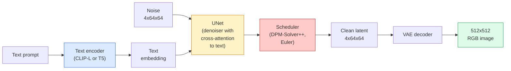

# Thiết kế & Thiết lập tốt hơn

> Stable Diffusion là một DDPM chạy trong không gian ẩn của một VAE được đào tạo trước, điều chỉnh trên văn bản thông qua sự chú ý chéo, lấy mẫu bằng một giải pháp ODE xác định nhanh, và được điều khiển bằng hướng dẫn không có phân loại.

> **【中文解读】**Stable Diffusion là mô hình phổ biến hoạt động trong tiềm năng không gian của VAE, thông qua giao lưu chú ý (transactional attention) chấp nhận các điều kiện văn bản, sử dụng ODE 求解器采样,并通过无分类器引导 (không có trình phân loại hướng dẫn) kiểm soát chất lượng sản xuất.

> **【拓展：Stable Diffusion 生态】**Stable Diffusion  dẫn đến LoRA (Light Quantity Micro Mode) ControlNet (ControlNet) Control Gest态/边缘) IP-Adapter (Image Tip) 

**Type:** Learn + Use | **类型:** 学习 + 应用
**Languages:** Python | **语言:** Python
**Prerequisites:** Phase 4 Lesson 10 (Diffusion), Phase 7 Lesson 02 (Self-Attention) | **前置知识:** Phase 4 Lesson 10（扩散模型），Phase 7 Lesson 02（自注意力）
**Time:** ~75 minutes | **时间:** ~75 分钟

## Mục tiêu học tập

- Theo dõi năm phần của một đường ống dẫn truyền ổn định: VAE, mã hóa văn bản, U-Net, lập trình, kiểm tra an toàn  và mỗi phần thực sự làm gì
- Giải thích sự phân tán ẩn và lý do tại sao việc đào tạo trong không gian ẩn 4x64x64 (nhưng là hình ảnh 3x512x512) làm giảm tính toán 48x mà không mất chất lượng
- Sử dụng `diffusers`để tạo ra hình ảnh, chạy hình ảnh-to-photos, inpainting, và ControlNet dẫn đầu
- Phân phối tinh tế Stable Diffusion với LoRA trên một bộ dữ liệu tùy chỉnh nhỏ và tải bộ chuyển đổi LoRA khi suy luận

> **【中文解读】**Mục tiêu học tập được liệt kê trong danh sách các khả năng cốt lõi cần được nắm bắt sau khi hoàn thành bài học.


## Vấn đề  vấn đề giới thiệu

Việc đào tạo DDPM trực tiếp trên hình ảnh RGB 512x512 là tốn kém. Mỗi bước đào tạo trở lại qua một U-Net thấy giá trị đầu vào 3x512x512 = 786,432, và lấy mẫu 50+ đi về phía trước qua cùng một U-Net. Ở mức chất lượng của Stable Diffusion 1.5 (được phát hành năm 2022), sự pha trộn không gian pixel sẽ cần khoảng 256 tháng đào tạo GPU và 10-30 giây mỗi hình ảnh trên GPU tiêu dùng.

> 直接在 512x512 RGB 图像上训练 DDPM 很昂贵. Mỗi bước đào tạo phải trải qua một U-Net có giá trị đầu vào 3x512x512 = 786,432 逆向传播,采样需要通过同一个 U-Net 进行50+ 次前向传播.

Trận thuật khiến cho việc mở văn bản sang hình ảnh trở nên thực tế là**latent diffusion**(Rombach et al., CVPR 2022). Đào tạo một VAE mà lập bản đồ một hình ảnh 3x512x512 đến một tensor ẩn 4x64x64 và trở lại, sau đó thực hiện sự pha trộn trong không gian ẩn đó.`(3*512*512)/(4*64*64) = 48x`- Phân tích giảm từ 10 giây xuống dưới 2 giây trên cùng một GPU.

> Để mở quyền tải văn bản thành hình ảnh trở thành kỹ thuật thực tế là**潜空间扩散**(Rombach 等,CVPR 2022)  đào tạo một VAE sẽ 3x512x512 图像映射到4x64x64 潜张量并恢复, sau đó làm di lan trong đó tiềm空间 计算量降低 `(3*512*512)/(4*64*64) = 48x` Trong cùng một GPU, mẫu lên từ vài giây xuống còn hai giây.

Hầu như mọi mô hình tạo hình ảnh hiện đại  SDXL, SD3, FLUX, HunyuanDiT, Wan-Video  là mô hình phân tán ẩn với sự thay đổi trên mã hóa tự động, trình báo (U-Net hoặc DiT), và điều kiện văn bản. Tìm hiểu Stable Diffusion và bạn đã học được mẫu.

> Hầu như mọi mô hình hiện đại tạo mô hình SDXL、SD3、FLUX、HunyuanDiT、Wan-Video đều là mô hình mở rộng không gian tiềm ẩn, có sự khác biệt giữa các máy lập trình tự lập trình, máy bỏ tiếng ồn, U-Net hoặc DiT và các điều kiện văn bản.

## Khái niệm cốt lõi

> **【中文解读】**Bài viết này giới thiệu các khái niệm và lý thuyết cốt lõi.


### Đường ống



- **VAE** tự động mã hóa đóng băng. Mã hóa biến hình ảnh thành laten (được sử dụng cho img2img và đào tạo).
  Trung ngữ翻译:VAE结的自编码器──编码器将图像转换为潜变量(用于img2img 和训练),解码器将潜变量还原为图像──
- **Text encoder** CLIP text encoder (SD 1.x/2.x), CLIP-L + CLIP-G (SDXL), hoặc T5-XXL (SD3/FLUX).
  中文翻译:文本编码器CLIP 文本编码器(SD 1.x/2.x)、CLIP-L + CLIP-G(SDXL) hoặc T5-XXL(SD3/FLUX)。产生一系列代币 嵌入──
- **U-Net** trình báo. Có các lớp chú ý chéo tham gia từ laten đến văn bản nhúng ở mọi mức độ độ độ phân giải.
  Trung ngữ翻译:U-Net去噪器──包含交叉注意力层, trên mỗi phân giải cấp độ từ tiềm năng biến đổi关订本嵌入──
- **Scheduler** thuật toán lấy mẫu (DDIM, Euler, DPM-Solver++).
  Trung文翻译:调度器采样算法(DDIM、Euler、DPM-Solver++) ・・・选择 sigma 值,将预测的噪音混合回潜变量──
- **Safety checker** bộ lọc NSFW / nội dung bất hợp pháp tùy chọn trên hình ảnh đầu ra.
  Trung ngữ翻译:安全检查器可选的 NSFW / 违规内容过器,作用于输出图像──

### Hướng dẫn không có phân loại (CFG)

Điều kiện văn bản đơn học `epsilon_theta(x_t, t, c)`cho mỗi lần gọi `c`CFG đào tạo cùng một mạng với `c`giảm 10% thời gian (được thay thế bằng một nhúng trống), đưa ra một mô hình duy nhất dự đoán cả tiếng ồn có điều kiện và không điều kiện.

> 纯文本条件化学习 `epsilon_theta(x_t, t, c)`Đối với mỗi lời khuyên`c`◊ CFG  tập luyện cùng một mạng thì 10% thời gian bị lãng phí `c`(đổi thay cho không gian nhúng), nhận được một mô hình đồng thời dự đoán âm thanh và không có điều kiện âm thanh:

```
eps = eps_uncond + w * (eps_cond - eps_uncond)
```

`w`là thang đo hướng dẫn. `w=0`là không có điều kiện,`w=1`là hoàn toàn có điều kiện,`w>1`đẩy đầu ra hướng tới "còn điều kiện hơn trên prompt" với chi phí của sự đa dạng.`w=7.5`- Tôi không biết.

> `w`Đó là một cái gì đó.`w=0`là không có điều kiện được tạo ra,`w=1`là điều kiện bình thường được tạo ra,`w>1`Để hy sinh sự đa dạng để giá thúc đẩy xuất khẩu hơn" phù hợp với lời khuyên"`w=7.5`

CFG là lý do text-to-image hoạt động ở chất lượng sản xuất. Nếu không có CFG, các yêu cầu định hướng sản xuất yếu; với nó, các yêu cầu thống trị.

> CFG là nguyên nhân của văn bản đến hình ảnh có thể làm việc dưới chất lượng sản xuất cấp. Không có nó, lời nói cho tác động đến sản xuất rất yếu; có nó, lời nói cho chiếm ưu thế.

### Xơ cấu không gian trần gian

VAE's 4-channel latente không chỉ là một hình ảnh nén. Đây là một đa dạng nơi toán học tương ứng với các chỉnh sửa ngữ nghĩa (kỹ thuật nhanh + phân tích cả hai sống ở đây), và nơi U-Net phân tán đã được đào tạo để chi tiêu toàn bộ ngân sách mô hình hóa của nó. Việc giải mã một laten tình cờ 4x64x64 không tạo ra một hình ảnh trông tình cờ  nó tạo ra rác, bởi vì chỉ có một số lượng nhỏ cụ thể của các laten giải mã cho hình ảnh hợp lệ.

> VAE 4 đường dẫn biến động không chỉ là hình ảnh nén. Nó là một hình ảnh, trên đó là một hình thức toán học, hoạt động vận hành lớn đối với các ý nghĩa của các ý nghĩa chỉnh sửa.

Hai hậu quả:

> 2 kết quả:

1. **Img2img**= mã hóa hình ảnh thành ẩn, thêm tiếng ồn một phần, chạy biểu thị, giải mã.
   Trung ngữ翻译:**Img2img**= Để mã hình ảnh được biến đổi, thêm phần tiếng ồn, vận hành để ồn máy, giải mã.
2. **Inpainting**= giống như img2img nhưng các tên chỉ cập nhật các vùng che giấu; các vùng không che giấu được giữ ở mật mã ẩn.
   Trung ngữ翻译:**Inpainting**= tương tự như img2img, nhưng các thiết bị làm tiếng ồn chỉ cập nhật khu vực ẩn; khu vực không ẩn giữ cho số lượng tiềm ẩn sau khi được mã hóa.

### Kiến trúc U-Net

SD U-Net là một phiên bản lớn của TinyUNet từ Bài học 10 với ba bổ sung:

> SD's U-Net là phiên bản lớn của TinyUNet, thêm ba thành phần:

- **Transformer blocks**ở mỗi độ phân giải không gian, chứa sự chú ý tự tính + sự chú ý qua văn bản nhúng.
  Trung ngữ翻译: mỗi khối biến thể trên phân giải không gian, chứa tự chú ý + chú ý giao thông đối với văn bản được nhúng.
- **Time embedding**qua MLP trên mã hóa sinus.
  Trung文翻译:通过 MLP 处理正弦编码的时间嵌入──
- **Skip connections**giữa mã hóa và mã hóa khi độ phân giải phù hợp.
  Trung ngữ翻译:编码器和码器在匹配分辨率之间跳跃连接──

Tổng tham số trong SD 1.5: ~860M. SDXL: ~2.6B. FLUX: ~12B. Sự nhảy trong các param chủ yếu là trong các lớp chú ý.

> SD 1.5  tổng số参数 khoảng 8.6 tỷ.

### LoRA tinh chỉnh

Việc điều chỉnh hoàn chỉnh của Stable Diffusion cần 20 GB VRAM và cập nhật các tham số 860M. LoRA (Lower-Rank Adaptation) giữ cho mô hình cơ bản được đóng băng và tiêm các matrices phân hủy cấp độ nhỏ vào các lớp chú ý. Một bộ điều chỉnh LoRA cho SD thường là 10-50 MB, chạy trong 10-60 phút trên một GPU tiêu dùng duy nhất, và tải vào thời gian suy luận như một sửa đổi giảm.

> Lượng nhỏ điều chỉnh của Stable Diffusion cần 20+ GB 显存并更新 8.6 tỷ参数。LoRA(低秩适应) giữ nguyên mô hình cơ bản结, được chèn vào các mô hình phân giải nhỏ trong tầng chú ý。SD của LoRA 适配器 thường chỉ có 10 - 50 MB, được tập luyện trên GPU đơn张消费级 10-60 分钟, được đưa ra như là chuyển động ngay lập tức tải。

```
Original: W_q : (d_in, d_out)   frozen
LoRA:     W_q + alpha * (A @ B)   where A : (d_in, r), B : (r, d_out)

r is typically 4-32.
```

LoRA là cách phân phối hầu hết các bản nhạc của cộng đồng. CivitAI và Hugging Face lưu trữ hàng triệu bản nhạc.

> LoRA là một cách phát triển phân chia của hầu hết các cộng đồng.

### Các lịch trình bạn sẽ thấy

- **DDIM** xác định, ~ 50 bước, đơn giản.
  Trung ngữ翻译:DDIM确定性, khoảng 50 步,简单――
- **Euler ancestral** Stochastic, 30-50 bước, một chút sáng tạo hơn các mẫu.
  Trung文翻译:Euler tổ tiên随机性,30-50 步,样本更具创意──
- **DPM-Solver++ 2M Karras** định nghĩa, 20-30 bước, sản xuất mặc định.
  中文翻译:DPM-Solver++ 2M Karras确定性,20-30 步,生产环境默认选择──
- **LCM / TCD / Turbo** mô hình phù hợp và các biến thể chưng cất; 1-4 bước với chi phí của một số chất lượng.
  Trung文翻译:LCM / TCD / Turbo一致性模型和蒸变体;1-4 步,代价是一些质量损失──

Thay đổi lịch trình là một thay đổi đơn tuyến trong `diffusers`và đôi khi sửa chữa các vấn đề mẫu mà không cần đào tạo lại.

> Trong `diffusers`Trung chuyển đổi điều chỉnh chỉ cần một dòng mã, đôi khi không cần phải đào tạo lại để có thể sửa chữa các vấn đề mẫu.

> **【中文解读】**本节通过代码实现核心算法从零――这种" từ đầu"的方式能帮助理解框架背后的原理,遇到问题时不会被黑盒困住――

> **【拓展：工业部署中的视觉系统】**Trong thực tế, mô hình hình ảnh cần phải xem xét các vấn đề về sự chậm trễ, mô hình lớn, thiết bị cạnh phù hợp, vv.

> **【拓展：数据标注与质量】**视觉任务的效果高度依赖标签数据质量――Label Studio、CVAT là công cụ标签 chính thống――在工业场景中,主动学习(Active Learning) có thể giảm chi phí đánh dấu: mô hình đối với yêu cầu mẫu không xác định


## Hãy xây dựng nó.
```figure
cv3-latent-compression
```

## Hãy xây dựng nó

Bài học này sử dụng`diffusers`End-to-end thay vì xây dựng lại Stable Diffusion từ đầu. Các mảnh bạn cần xây dựng lại (VAE, mã hóa văn bản, U-Net, lập trình) là chủ đề của bài học của riêng họ; ở đây mục tiêu là thông thạo với API sản xuất.

> 本课端到端使用 `diffusers`Thay vì xây dựng lại từ zero, Stable Diffusion. Bạn cần xây dựng lại các bộ phận (VAE, văn bản lập trình, U-Net,调度器) mỗi khóa học có đặc biệt.

### Bước 1: Giao dịch văn bản sang hình ảnh

```python
import torch
from diffusers import StableDiffusionPipeline

pipe = StableDiffusionPipeline.from_pretrained(
    "runwayml/stable-diffusion-v1-5",
    torch_dtype=torch.float16,
).to("cuda")

image = pipe(
    prompt="a dog riding a skateboard in tokyo, studio ghibli style",
    guidance_scale=7.5,
    num_inference_steps=25,
    generator=torch.Generator("cuda").manual_seed(42),
).images[0]
image.save("dog.png")
```

`float16`giảm VRAM một nửa mà không có sự mất chất lượng rõ ràng. `num_inference_steps=25`với các kết hợp DPM-Solver++ mặc định `num_inference_steps=50`với DDIM.

> `float16` giảm một nửa lượng lưu trữ và không có tổn thất chất lượng rõ ràng.`num_inference_steps=25`等效于使用DDIM `num_inference_steps=50`

### Bước 2: Thay đổi lập trình

```python
from diffusers import DPMSolverMultistepScheduler, EulerAncestralDiscreteScheduler

pipe.scheduler = DPMSolverMultistepScheduler.from_config(pipe.scheduler.config)
pipe.scheduler = EulerAncestralDiscreteScheduler.from_config(pipe.scheduler.config)
```

Các nhà lập trình được tách khỏi trọng lượng U-Net. Bạn có thể tập luyện về DDPM và lấy mẫu với bất kỳ lập trình viên nào.

> 调度器状态与 U-Net 权重解──你可以在DDPM上训练,使用任何调度器采样──

### Bước 3: Hình ảnh sang hình ảnh

```python
from diffusers import StableDiffusionImg2ImgPipeline
from PIL import Image

img2img = StableDiffusionImg2ImgPipeline.from_pretrained(
    "runwayml/stable-diffusion-v1-5",
    torch_dtype=torch.float16,
).to("cuda")

init_image = Image.open("dog.png").convert("RGB").resize((512, 512))
out = img2img(
    prompt="a dog riding a skateboard, oil painting",
    image=init_image,
    strength=0.6,
    guidance_scale=7.5,
).images[0]
```

`strength`là bao nhiêu tiếng ồn phải thêm trước khi bỏ đi (0.0 = không thay đổi, 1.0 = tái tạo đầy đủ).

> `strength`控制去噪音前添加多少噪音(0.0 = 不变,1.0 = 完全重新生成) ・0.5-0.7 là phạm vi tiêu chuẩn của phong cách di chuyển。

### Bước 4: Đơn sơn

```python
from diffusers import StableDiffusionInpaintPipeline

inpaint = StableDiffusionInpaintPipeline.from_pretrained(
    "runwayml/stable-diffusion-inpainting",
    torch_dtype=torch.float16,
).to("cuda")

image = Image.open("dog.png").convert("RGB").resize((512, 512))
mask = Image.open("dog_mask.png").convert("L").resize((512, 512))

out = inpaint(
    prompt="a cat",
    image=image,
    mask_image=mask,
    guidance_scale=7.5,
).images[0]
```

Các pixel trắng trong mặt nạ là khu vực để tái tạo.

> 掩码中白色图像是需要重生的区域,黑色图像被保留──

### Bước 5: LoRA

```python
pipe.load_lora_weights("sayakpaul/sd-lora-ghibli")
pipe.fuse_lora(lora_scale=0.8)

image = pipe(prompt="a village square in ghibli style").images[0]
```

`lora_scale`kiểm soát sức mạnh; 0,0 = không có hiệu ứng, 1,0 = hiệu ứng đầy đủ. `fuse_lora`làm cho bộ điều chỉnh nạp vào trọng lượng để tăng tốc, nhưng ngăn chặn sự thay đổi.`pipe.unfuse_lora()`trước khi tải một bộ chuyển đổi khác.

> `lora_scale`控制强度;0.0 = 无效,1.0 = 完全效果──`fuse_lora`Chuyển chuyển bộ điều chỉnh sang trọng lượng để tăng tốc độ, nhưng sẽ ngăn chặn chuyển đổi.`pipe.unfuse_lora()`

### Bước 6: đào tạo LoRA (phác thảo)

LoRA thực sự được đào tạo trong `peft`hoặc `diffusers.training`- Khía sơ:

> Thực sự là LoRA  tập luyện `peft`Hoặc`diffusers.training`Trong diễn văn:

```python
# Pseudocode
for step, batch in enumerate(dataloader):
    images, prompts = batch
    latents = vae.encode(images).latent_dist.sample() * 0.18215

    t = torch.randint(0, num_train_timesteps, (batch_size,))
    noise = torch.randn_like(latents)
    noisy_latents = scheduler.add_noise(latents, noise, t)

    text_emb = text_encoder(tokenizer(prompts))

    pred_noise = unet(noisy_latents, t, text_emb)  # LoRA weights injected here

    loss = F.mse_loss(pred_noise, noise)
    loss.backward()
    optimizer.step()
```

> **【中文解读】**Bài này sẽ trình bày cách sử dụng một khung đã phát triển như PyTorch, HuggingFace, và các khác.


Chỉ có các matrices LoRA nhận gradient; U-Net cơ sở, VAE và mã hóa văn bản được đóng băng. Với kích thước lô 1 và điểm kiểm tra gradient, điều này phù hợp với 8 GB VRAM.

> Chỉ có LoRA 矩阵接收梯度; cơ sở U-Net、VAE 和文本编码器 đều kết thúc.


> **【拓展：视觉模型的持续学习】**Trong môi trường sản xuất, mô hình hình ảnh cần phải liên tục thích ứng với dữ liệu mới.

## Hãy sử dụng nó để thực hiện

Trong sản xuất, những quyết định mà bạn thực sự đưa ra:

- **Model family**: SD 1.5 cho các bản nhạc cộng đồng nguồn mở, SDXL cho độ trung thực cao hơn, SD3 / FLUX cho trạng thái hiện đại và các yêu cầu cấp phép nghiêm ngặt.
- **Scheduler**: DPM-Solver++ 2M Karras cho 20-30 bước, LCM-LoRA khi độ trễ dưới 1s.
- **Precision**`float16`trên 4080/4090, `bfloat16`trên A100 và mới hơn, `int8`(via `bitsandbytes`hoặc `compel`) khi VRAM bị chặt chẽ.
- **Conditioning**: văn bản đơn giản hoạt động; để kiểm soát mạnh hơn, thêm ControlNet (có thể, độ sâu, tư thế) trên đầu của đường ống cơ sở.

> **【中文解读】**Phần này tập trung vào cách phân phối mô hình như một sản phẩm có thể sử dụng.


Đối với thế hệ hàng loạt, `AUTO1111`- `ComfyUI`là các công cụ của cộng đồng; cho các API sản xuất,`diffusers`+ `accelerate`hoặc `optimum-nvidia`với TensorRT compilation.


## Chuyển nó đi.

Bài học này mang lại:

- `outputs/prompt-sd-pipeline-planner.md` một lời nhắc chọn SD 1.5 / SDXL / SD3 / FLUX cộng với lập trình và độ chính xác do ngân sách thời gian trễ, mục tiêu trung thành và hạn chế cấp phép.
- `outputs/skill-lora-training-setup.md` một kỹ năng viết một cấu hình đào tạo LoRA đầy đủ cho một bộ dữ liệu tùy chỉnh bao gồm tiêu đề, cấp bậc, kích thước lô và tốc độ học tập.

> **【中文解读】**练题按照 Easy/Medium/Hard 三个难度递进;;建议至少完成 级别的题目, 级别适合深入研究或面试准备;;


## Tập luyện bài tập

1. **(Easy)**Tạo cùng một prompt với `guidance_scale`trong `[1, 3, 5, 7.5, 10, 15]`- Mô tả hình ảnh thay đổi như thế nào.
2. **(Medium)**Hãy chụp ảnh thật, xem qua.`StableDiffusionImg2ImgPipeline``strength`trong `[0.2, 0.4, 0.6, 0.8, 1.0]`Nguyên nhân nào giữ lại thành phần trong khi thay đổi phong cách? Tại sao 1.0 bỏ qua đầu vào hoàn toàn?
3. **(Hard)**Cải tạo LoRA trên 10-20 hình ảnh của một đối tượng (một con vật nuôi, logo, một nhân vật) và tạo ra những cảnh mới với đối tượng đó trong chúng.

> **【中文解读】**Trong 术语表中的"Những gì mọi người nói" vs "Những gì nó thực sự có nghĩa" 区分日常口语和精确技术含义── 在团队协作中,统一术语定义可以避免大量沟通误解──


## Từ khóa  Từ khóa nhanh chóng

| Term | What people say | What it actually means |
|------|----------------|----------------------|
| Latent diffusion | "Diffuse in latents" | Run the entire DDPM in the VAE latent space (4x64x64) instead of pixel space (3x512x512); 48x compute saving |
| VAE scale factor | "0.18215" | Constant that rescales the VAE's raw latent to roughly unit variance; hardcoded in every SD pipeline |
| Classifier-free guidance | "CFG" | Mix conditional and unconditional noise predictions; the single most impactful inference knob |
| Scheduler | "Sampler" | The algorithm that turns noise + model predictions into a denoised latent trajectory |
| LoRA | "Low-rank adapter" | Small rank-decomposition matrices that fine-tune attention layers without touching base weights |
| Cross-attention | "Text-image attention" | Attention from latent tokens to text tokens; injects prompt information at every U-Net level |
| ControlNet | "Structure conditioning" | A separately-trained adapter that steers SD with an extra input (canny, depth, pose, segmentation) |
| DPM-Solver++ | "The default scheduler" | Second-order deterministic ODE solver; best quality at low step counts (20-30) in 2026 |

> **【中文解读】**延伸阅读 cung cấp các nguồn chất lượng cao cho việc học sâu. Những bài báo và giảng dạy này là tài liệu tham khảo cổ điển trong lĩnh vực này, phù hợp với những người đọc cần hiểu sâu hơn.


## Xem thêm 延伸阅读

- [High-Resolution Image Synthesis with Latent Diffusion (Rombach et al., 2022)](https://arxiv.org/abs/2112.10752) giấy Stable Diffusion; bao gồm mọi loại bỏ hợp lý cho thiết kế
- [Classifier-Free Diffusion Guidance (Ho & Salimans, 2022)](https://arxiv.org/abs/2207.12598) giấy CFG
- [LoRA: Low-Rank Adaptation of Large Language Models (Hu et al., 2021)](https://arxiv.org/abs/2106.09685) LoRA là NLP đầu tiên; nó chuyển sang SD hầu như không có thay đổi
- [diffusers documentation](https://huggingface.co/docs/diffusers) tham chiếu cho mỗi đường ống SD / SDXL / SD3 / FLUX
