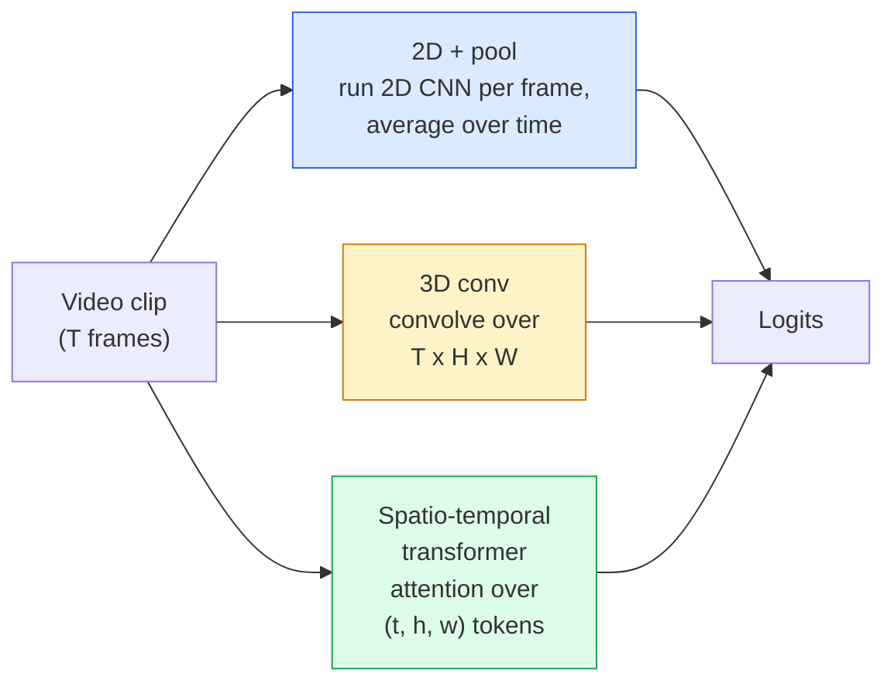

# Video hiểu  Temporal Modeling 视频 hiểu  时序建模

> Một video là một chuỗi hình ảnh cộng với vật lý kết nối chúng. Mỗi mô hình video hoặc xử lý thời gian như một trục bổ sung (3D conv), một chuỗi để tham dự (giới chuyển đổi), hoặc một tính năng để trích xuất một lần và bể (2D + bể).

> **【中文解读】**Video là một tập hợp các chuỗi hình ảnh cộng với các quy tắc vật lý liên kết chúng.

> **【拓展：视频 AI 应用】**视频理解驱动 YouTube/TikTok nội dung推、安防监控的异常检测、体育赛事的自动分析──Sora等视频生成模型将视频理解推向新高度理解视频才能生成视频──

**Type:** Learn + Build | **类型:** 学习 + 动手
**Languages:** Python | **语言:** Python
**Prerequisites:** Phase 4 Lesson 03 (CNNs), Phase 4 Lesson 04 (Image Classification) | **前置知识:** Phase 4 Lesson 03（CNN），Phase 4 Lesson 04（图像分类）
**Time:** ~45 minutes | **时间:** ~45 分钟

## Mục tiêu học tập

- Hóa ra sự khác biệt giữa ba phương pháp mô hình hóa video chính (2D+pool, 3D conv, space-temporal transformer) và dự đoán các sự thỏa hiệp về chi phí và độ chính xác của chúng
- Thực hiện lấy mẫu khung, hợp nhất thời gian và phân loại cơ sở 2D + pool trong PyTorch
- Giải thích tại sao các hạt nhân 3D "bùng phát" của I3D chuyển tốt từ trọng lượng ImageNet và một conv (2+1) D nhân tố làm gì khác nhau
- Đọc các bộ dữ liệu và số liệu nhận dạng hành động tiêu chuẩn: Kinetics-400/600, UCF101, Something-Something V2; độ chính xác hàng đầu ở cấp độ clip và video

> **【中文解读】**Mục tiêu học tập được liệt kê trong danh sách các khả năng cốt lõi cần được nắm bắt sau khi hoàn thành bài học.


## Vấn đề  vấn đề giới thiệu

Một video 30 giây ở tốc độ 30 fps là 900 hình ảnh. Thần túy, phân loại video là phân loại hình ảnh chạy 900 lần sau đó là một số loại tổng hợp. Điều đó hoạt động khi hành động được nhìn thấy trong hầu hết mọi khung hình (cách thể thao, nấu ăn, video tập thể dục) và thất bại nặng khi hành động được xác định bởi chuyển động chính nó: "đẩy một cái gì đó từ trái sang phải" trông giống như hai đối tượng tĩnh trong mỗi khung hình.

> 30 giây 30fps video là 900张图像―― đơn giản xem, video phân loại là để phân loại hình ảnh chạy 900 lần rồi tập hợp―― khi động tác trong hầu hết mọi thứ có thể thấy khi vận động, nhưng khi động tác được định nghĩa bởi phong trào thì rất thất bại: "để đưa một thứ từ trái xuống phải" trong mỗi lần nhìn là hai vật thể tĩnh lặng――

Câu hỏi cốt lõi cho mọi kiến trúc video là: khi nào cấu trúc thời gian được mô hình hóa, và làm thế nào? Câu trả lời thúc đẩy mọi thứ khác  tính toán chi phí, chiến lược trước khi tập luyện, liệu bạn có thể tái sử dụng trọng lượng ImageNet, tập hợp dữ liệu nào mô hình được đào tạo.

> Câu hỏi cốt lõi của mỗi video là: thời gian cấu trúc khi được xây dựng, và làm thế nào để xây dựng?

Bài học này cố ý ngắn hơn các bài học hình ảnh tĩnh. Máy cơ bản hình ảnh đã được thiết lập, và hiểu biết video chủ yếu là về câu chuyện thời gian: lấy mẫu, mô hình hóa và tổng hợp.

> Bài học này có ý nghĩa hơn các bài học hình ảnh tĩnh ngắn hơn. Cơ chế hình ảnh cốt lõi đã có mặt, video hiểu chủ yếu là về các câu chuyện về thời gian:

## Khái niệm cốt lõi

> **【中文解读】**Bài viết này giới thiệu các khái niệm và lý thuyết cốt lõi.


### Ba gia đình kiến trúc



### 2D + hồ bơi

Hãy lấy một 2D CNN (ResNet, EfficientNet, ViT). Đưa nó độc lập trên mỗi khung hình được lấy mẫu. Tỷ lệ trung bình (hoặc tập trung tối đa, hoặc tập trung sự chú ý) các nhúng per khung. Đưa các vector tập hợp đến một phân loại.

> 取一个2D CNN(ResNet、EfficientNet、ViT), trên mỗi n hoạt động độc lập, đối với mỗi n嵌做平均((或最大池化、注意力池化), sẽ 池化后的量送入分类器──

Lợi thế:
- ImageNet chuyển giao trực tiếp trước khi đào tạo.
  Trung文翻译:ImageNet 预训权重可直接迁移。
- Tốt nhất để thực hiện.
  Trung ngữ翻译:实现最简单――
- Giá rẻ: T khung * chi phí suy luận hình ảnh đơn.
  Trung文翻译:成本低:T  × 单推理开销。

Khối tác:
- Không thể mô hình chuyển động.
  Trung文翻译:无法建模运动──动作 = Sự tụ tập ngoại quan──
- Sự hợp nhất thời gian không thay đổi theo thứ tự; "cửa mở" và "cửa đóng" trông giống nhau.
  Trung ngữ翻译:时序池化是序无关的;"开门"和"关门"看起来一样.

Khi nào sử dụng: các nhiệm vụ có vẻ nặng, chuyển giao học tập trên các tập dữ liệu video nhỏ, đường cơ sở ban đầu.

> 何時使用:外观主导的任务、小视频数据集上的迁移学习、初始基线──

### Chuyển chuyển 3D

Thay thế hạt nhân 2D (H, W) bằng hạt nhân 3D (T, H, W).

> Để thay thế 2D (H, W) 核 thành 3D (T, H, W) 核──网络在空间和时间进行卷积──早期代表:C3D、I3D、SlowFast──

Trùi I3D: lấy một mô hình 2D ImageNet được đào tạo trước, "tăng" mỗi hạt nhân 2D bằng cách sao chép nó dọc theo một trục thời gian mới. Một conv 3x3 2D trở thành một conv 3x3 3D. Điều này cho mô hình 3D trọng lượng trước được đào tạo mạnh mẽ thay vì đào tạo từ đầu.

> I3D 技巧: lấy một dự thiền 2D ImageNet 模型, "tăng bớt" mỗi 2D 核沿新时间轴复制──3x3 卷积 2D 卷积变成 3x3x3 卷积──这让 3D 模型获得强预训权重,而无需从头训──

Lợi thế:
- Cần mô hình chuyển động trực tiếp.
  Trung ngữ翻译:直接建模运动。
- Tăng lạm phát I3D mang lại việc học tập chuyển đổi miễn phí.
  Trung ngữ翻译:I3D 膨胀提供免费的迁移学习。

Khối tác:
- T/8 nhiều FLOP hơn đối tác 2D (cho hạt nhân thời gian 3 xếp chồng lên 3 lần).
  Trung文翻译:比 2D 方案多 T/8 的 FLOPs (比 2D 方案多 T/8 的 FLOPs)
- Các hạt nhân thời gian nhỏ; chuyển động tầm xa cần một cách tiếp cận kim tự tháp hoặc dòng chảy kép.
  Trung ngữ翻译:时间核很小;长距离运动需要金字塔或双流方法──

Khi sử dụng: nhận dạng hành động khi chuyển động là tín hiệu (Something-Something V2, Kinetics với các lớp chuyển động nặng).

> 何时使用:运动是关键信号的动作识别(Điều-Điều V2、以运动为主动的动力学 类别) ▽

### Máy biến đổi không gian-thời gian

Đánh dấu video vào một lưới các bản vá không-thời gian và tham gia tất cả chúng.

> 将视频分词为时空补丁网格, và thực hiện chú ý tính toán giữa tất cả các补丁.

Các mô hình chú ý quan trọng:
- **Joint** một sự chú ý lớn trên (t, h, w).`T*H*W`- Đắt lắm.
  Trung ngữ翻译:**联合** đối với (t, h, w) làm một lần rất nhiều chú ý.`T*H*W`n n n n n n n n n n n n n n n n n n n n n n n n n
- **Divided** hai sự chú ý mỗi khối: một trong thời gian, một trong không gian.
  Trung ngữ翻译:**分离** mỗi khối hai lần chú ý: một lần thời gian, một lần không gian, gần như mở rộng đường.
- **Factorised** Sự chú ý thời gian thay thế với sự chú ý không gian trên các khối.
  Trung ngữ翻译:**分解** thời gian và không gian chuyển đổi giữa các khối.

Lợi thế:
- Độ chính xác SOTA trên mọi chỉ số chuẩn chính.
  Trung ngữ翻译: đạt được SOTA 精度 trên tất cả các bài kiểm tra cơ bản chính.
- Chuyển từ các bộ biến hình ảnh (ViT) thông qua lạm phát các vá.
  Trung文翻译:通过补丁膨胀从图像 Transformer(ViT)迁移──
- Hỗ trợ video ngữ cảnh dài thông qua sự chú ý ít.
  Trung ngữ: qua sự chú ý hiếm hoi

Khối tác:
- Đói máy tính.
  Trung ngữ翻译:计算量巨大。
- Cần sự lựa chọn cẩn thận về mô hình hoặc bóng chạy.
  Trung ngữ翻译: cần仔细选择注意力模式,否则运行时间膨胀──

Khi nào sử dụng: tập hợp dữ liệu lớn, hiểu video độ trung thực cao, các nhiệm vụ video + văn bản đa phương thức.

> 何時使用: 大数据集、高保真视频理解、多模态视频+文本任务。

### Phân mẫu khung

Một clip 10 giây ở tốc độ 30 fps là 300 khung hình; cung cấp tất cả 300 cho bất kỳ mô hình nào là lãng phí.

> 30fps có 10 giây đoạn phim có 300; sẽ tất cả 300  cho bất kỳ mô hình nào là lãng phí.

- **Uniform sampling** chọn khung T ngang trên clip.
  Trung ngữ翻译:**均匀采样**在片段中等间距选 T ──2D+pool 的默认方式──
- **Dense sampling** cửa sổ khung T liền kề ngẫu nhiên. phổ biến cho các conv 3D vì chuyển động đòi hỏi khung lân cận.
  Trung ngữ翻译:**密集采样**随机连续 T 窗口──3D 卷积常用,因为运动需要相邻──
- **Multi-clip** lấy mẫu nhiều cửa sổ khung T từ cùng một video, phân loại từng cửa sổ, dự đoán trung bình tại thời điểm thử nghiệm.
  Trung ngữ翻译:**多片段** Từ cùng một video                                                                                                                                                                                                                                                            

T thường là 8, 16, 32, hoặc 64. T cao hơn = tín hiệu thời gian nhiều hơn với tính toán nhiều hơn.

> T thường là 8、16、32 hoặc 64。T 越大 = 更多时序信号, nhưng tính toán量更大──

### Đánh giá

Hai cấp độ:
- **Clip-level accuracy** mô hình thấy một clip khung T, báo cáo top-k.
  Trung ngữ翻译:**片段级精度**模型看一个T 片段, báo cáo top-k――
- **Video-level accuracy** dự đoán cấp độ clip trung bình trên nhiều clip mỗi video; cao hơn và ổn định hơn.
  Trung ngữ翻译:**视频级精度** đối với nhiều đoạn video trên cùng một video, dự đoán lấy trung bình; cao hơn và ổn định hơn.

Luôn báo cáo cả hai. Một mô hình ghi điểm 78% clip / 82% video phụ thuộc rất nhiều vào thời gian thử nghiệm trung bình; một mô hình ghi điểm 80% / 81% mạnh hơn cho mỗi clip.

> 务必同时报告两者──78% 片段 / 82% 视频的模型严重依赖测试时平均;80% / 81% 模型在单片段上更鲁棒──

### Các bộ dữ liệu bạn sẽ gặp

- **Kinetics-400 / 600 / 700** bộ dữ liệu hành động mục đích chung. 400k clip; URL YouTube (nhiều người đã chết).
  Trung ngữ翻译:Kinetics-400/600/700通用动作数据集──40万片段;YouTube 链接(许多已失效)──
- **Something-Something V2** Các hành động được định nghĩa bởi chuyển động ("quyển X từ trái sang phải"). Không thể được giải quyết bằng 2D + pool.
  中文翻译:Something-Something V2运动定义的动作("将 X từ左移至右")。2D+pool 无法解决。
- **UCF-101**- **HMDB-51** lớn tuổi, nhỏ hơn, vẫn được báo cáo.
  Trung文翻译:UCF-101、HMDB-51较老、较小,仍在报告──
- **AVA** hành động *định vị* trong không gian và thời gian; khó hơn so với phân loại.
  Trung文翻译:AVA时空动作定位;比分类更难──

> **【中文解读】**本节通过代码实现核心算法从零――这种" từ đầu"的方式能帮助理解框架背后的原理,遇到问题时不会被黑盒困住――

> **【拓展：工业部署中的视觉系统】**Trong thực tế, mô hình hình ảnh cần phải xem xét các vấn đề về sự chậm trễ, mô hình lớn, thiết bị cạnh phù hợp, vv.

> **【拓展：数据标注与质量】**视觉任务的效果高度依赖标签数据质量――Label Studio、CVAT là công cụ标签 chính thống――在工业场景中,主动学习(Active Learning) có thể giảm chi phí đánh dấu: mô hình đối với yêu cầu mẫu không xác định


## Hãy xây dựng nó.
```figure
v4-video-temporal
```

## Hãy xây dựng nó

### Bước 1: Chụp mẫu khung

Các mẫu đơn vị và dày đặc hoạt động trên một danh sách khung (hoặc một tensor video).

> 均采样和密集采样器, dùng cho 列表 (或视频张量)

```python
import numpy as np

def sample_uniform(num_frames_total, T):
    if num_frames_total <= T:
        return list(range(num_frames_total)) + [num_frames_total - 1] * (T - num_frames_total)
    step = num_frames_total / T
    return [int(i * step) for i in range(T)]


def sample_dense(num_frames_total, T, rng=None):
    rng = rng or np.random.default_rng()
    if num_frames_total <= T:
        return list(range(num_frames_total)) + [num_frames_total - 1] * (T - num_frames_total)
    start = int(rng.integers(0, num_frames_total - T + 1))
    return list(range(start, start + T))
```

Cả hai đều quay lại`T`chỉ số mà bạn sử dụng để cắt các tensor video.

> 两者都回归 `T`个索引用于切片视频张量──

### Bước 2: Một đường cơ sở 2D + pool

Lấy ResNet-18 2D trên mỗi khung hình, tính năng trung bình, phân loại.

> Trong mỗi lần chạy 2D ResNet-18, trung bình tính năng, rồi phân loại.

```python
import torch
import torch.nn as nn
from torchvision.models import resnet18, ResNet18_Weights

class FramePool(nn.Module):
    def __init__(self, num_classes=400, pretrained=True):
        super().__init__()
        weights = ResNet18_Weights.IMAGENET1K_V1 if pretrained else None
        backbone = resnet18(weights=weights)
        self.features = nn.Sequential(*(list(backbone.children())[:-1]))  # global avg pool kept
        self.head = nn.Linear(512, num_classes)

    def forward(self, x):
        # x: (N, T, 3, H, W)
        N, T = x.shape[:2]
        x = x.view(N * T, *x.shape[2:])
        feats = self.features(x).view(N, T, -1)
        pooled = feats.mean(dim=1)
        return self.head(pooled)

model = FramePool(num_classes=10)
x = torch.randn(2, 8, 3, 224, 224)
print(f"output: {model(x).shape}")
print(f"params: {sum(p.numel() for p in model.parameters()):,}")
```

Một mươi triệu tham số, ImageNet đã được đào tạo trước, chạy theo mỗi khung, trung bình, phân loại. Hình cơ sở này thường nằm trong vòng 5-10 điểm của các mô hình 3D thích hợp cho các nhiệm vụ có vẻ nặng  đôi khi tốt hơn, bởi vì nó sử dụng lại xương sống ImageNet mạnh hơn.

> Một ngàn một triệu tham số,ImageNet 预训,逐运行、平均、分类──This基线 trong các nhiệm vụ chủ đạo ngoại hình thường chỉ khác nhau 5-10% so với mô hình 3D thông thường đôi khi thậm chí tốt hơn, vì nó sử dụng lại mạng hình ảnhNet xương rễ mạnh hơn

### Bước 3: Một con thùng 3D phong cách I3D

Chuyển một con 2D duy nhất thành con 3D bằng cách lặp lại trọng lượng dọc theo một trục thời gian mới.

> 通过沿新时间轴重权重,将单个2D卷积转为3D卷积――

```python
def inflate_2d_to_3d(conv2d, time_kernel=3):
    out_c, in_c, kh, kw = conv2d.weight.shape
    weight_3d = conv2d.weight.data.unsqueeze(2)  # (out, in, 1, kh, kw)
    weight_3d = weight_3d.repeat(1, 1, time_kernel, 1, 1) / time_kernel
    conv3d = nn.Conv3d(in_c, out_c, kernel_size=(time_kernel, kh, kw),
                        padding=(time_kernel // 2, conv2d.padding[0], conv2d.padding[1]),
                        stride=(1, conv2d.stride[0], conv2d.stride[1]),
                        bias=False)
    conv3d.weight.data = weight_3d
    return conv3d

conv2d = nn.Conv2d(3, 64, kernel_size=3, padding=1, bias=False)
conv3d = inflate_2d_to_3d(conv2d, time_kernel=3)
print(f"2D weight shape:  {tuple(conv2d.weight.shape)}")
print(f"3D weight shape:  {tuple(conv3d.weight.shape)}")
x = torch.randn(1, 3, 8, 56, 56)
print(f"3D output shape:  {tuple(conv3d(x).shape)}")
```

Sự phân chia của `time_kernel`giữ cường độ kích hoạt gần như không đổi  quan trọng để không phá vỡ thống kê chuẩn hàng loạt trên lần qua đầu tiên.

> Ngoài ra`time_kernel`保持活值幅度大致不变 This is important for non-destruction of first time pre-to-spread

### Bước 4: Tỷ lệ nhân tố (2+1) D con

Chia một con 3D thành 2D (không gian) và 1D (khiệt thời gian). cùng một lĩnh vực nhận thức, ít tham số hơn, độ chính xác tốt hơn trên một số điểm chuẩn.

> Để phân chia 3D 卷积分成 2D 空间) và 1D 时间)卷积―― cùng cảm giác, ít参数, độ chính xác trên một số基准 cao hơn――

```python
class Conv2Plus1D(nn.Module):
    def __init__(self, in_c, out_c, kernel_size=3):
        super().__init__()
        mid_c = (in_c * out_c * kernel_size * kernel_size * kernel_size) \
                // (in_c * kernel_size * kernel_size + out_c * kernel_size)
        self.spatial = nn.Conv3d(in_c, mid_c, kernel_size=(1, kernel_size, kernel_size),
                                 padding=(0, kernel_size // 2, kernel_size // 2), bias=False)
        self.bn = nn.BatchNorm3d(mid_c)
        self.act = nn.ReLU(inplace=True)
        self.temporal = nn.Conv3d(mid_c, out_c, kernel_size=(kernel_size, 1, 1),
                                  padding=(kernel_size // 2, 0, 0), bias=False)

    def forward(self, x):
        return self.temporal(self.act(self.bn(self.spatial(x))))

c = Conv2Plus1D(3, 64)
x = torch.randn(1, 3, 8, 56, 56)
print(f"(2+1)D output: {tuple(c(x).shape)}")
```

> **【中文解读】**Bài này sẽ trình bày cách sử dụng một khung đã phát triển như PyTorch, HuggingFace, và các khác.


Một mạng R(2+1)D đầy đủ giống như ResNet-18 với mỗi 3x3 conv được thay thế bởi `Conv2Plus1D`- Tôi không biết.

> 完整的 R(2+1) D 网络就是将 ResNet-18 中的每个3x3卷积换为 `Conv2Plus1D`


> **【拓展：视觉模型的持续学习】**Trong môi trường sản xuất, mô hình hình ảnh cần phải liên tục thích ứng với dữ liệu mới.

## Hãy sử dụng nó để thực hiện

Hai thư viện bao gồm các video sản xuất:

- `torchvision.models.video` R(2+1)D, MViT, Swin3D với trọng lượng Kinetics được đào tạo trước.
- `pytorchvideo`(Meta)  mẫu vườn thú, bộ tải dữ liệu cho Kinetics / SSv2 / AVA, biến đổi tiêu chuẩn.

> **【中文解读】**Phần này tập trung vào cách phân phối mô hình như một sản phẩm có thể sử dụng.


Đối với mô hình video ngôn ngữ thị giác (video captioning, video QA), sử dụng `transformers`(`VideoMAE`- `VideoLLaMA`- `InternVideo`().


## Chuyển nó đi.

Bài học này mang lại:

- `outputs/prompt-video-architecture-picker.md` một lời nhắc chọn 2D + pool / I3D / (2+1) D / biến đổi dựa trên ngoại hình đối với chuyển động, kích thước bộ dữ liệu và ngân sách tính toán.
- `outputs/skill-frame-sampler-auditor.md` một kỹ năng kiểm tra mẫu của một đường ống video và đánh dấu các lỗi phổ biến: chỉ số không bằng một, lấy mẫu không đồng đều khi `num_frames < T`, thiếu cây trồng bảo tồn hình dạng, vv

> **【中文解读】**练题按照 Easy/Medium/Hard 三个难度递进;;建议至少完成 级别的题目, 级别适合深入研究或面试准备;;


## Tập luyện bài tập

1. **(Easy)**Xét FLOPs (khoảng) cho FramePool với T=8 so với ResNet 3D kiểu I3D với T=8.
2. **(Medium)**Tạo một bộ dữ liệu video tổng hợp: các quả bóng ngẫu nhiên di chuyển theo hướng ngẫu nhiên, được dán nhãn theo hướng chuyển động ("người trái sang phải", "người phải sang trái", "người châm ngang lên"). Đào FramePool trên nó.
3. **(Hard)**Xây dựng một R(2+1) D-18 bằng cách thay thế mọi Conv2d trong ResNet-18 với `Conv2Plus1D`- Thổi trọng lượng của con đầu tiên từ ResNet-18 được đào tạo trước ImageNet.

> **【中文解读】**Trong 术语表中的"Những gì mọi người nói" vs "Những gì nó thực sự có nghĩa" 区分日常口语和精确技术含义── 在团队协作中,统一术语定义可以避免大量沟通误解──


## Từ khóa  Từ khóa nhanh chóng

| Term | What people say | What it actually means |
|------|----------------|----------------------|
| 2D + pool | "Per-frame classifier" | Run a 2D CNN on every sampled frame, average-pool features across time, classify |
| 3D convolution | "Spatio-temporal kernel" | Kernel that convolves over (T, H, W); can model motion natively |
| Inflation | "Lift 2D weights to 3D" | Initialise 3D conv weights by repeating a 2D conv's weights along the new time axis, then divide by kernel_T to preserve activation scale |
| (2+1)D | "Factorised conv" | Split 3D into 2D spatial + 1D temporal; fewer parameters, extra non-linearity between |
| Divided attention | "Time then space" | Transformer block with two attentions per layer: one over tokens at the same frame, one over tokens at the same position |
| Clip | "T-frame window" | A sampled subsequence of T frames; the unit a video model consumes |
| Clip vs video accuracy | "Two eval settings" | Clip = one sample per video, video = average across multiple sampled clips |
| Kinetics | "The ImageNet of video" | 400-700 action classes, 300k+ YouTube clips, the standard video pretraining corpus |

> **【中文解读】**延伸阅读 cung cấp các nguồn chất lượng cao cho việc học sâu. Những bài báo và giảng dạy này là tài liệu tham khảo cổ điển trong lĩnh vực này, phù hợp với những người đọc cần hiểu sâu hơn.


## Xem thêm 延伸阅读

- [I3D: Quo Vadis, Action Recognition (Carreira & Zisserman, 2017)](https://arxiv.org/abs/1705.07750) giới thiệu lạm phát và bộ dữ liệu Kinetics
- [R(2+1)D: A Closer Look at Spatiotemporal Convolutions (Tran et al., 2018)](https://arxiv.org/abs/1711.11248) con số được phân tích theo yếu tố, vẫn là một đường cơ sở mạnh mẽ
- [TimeSformer: Is Space-Time Attention All You Need? (Bertasius et al., 2021)](https://arxiv.org/abs/2102.05095) máy biến hình video mạnh đầu tiên
- [VideoMAE (Tong et al., 2022)](https://arxiv.org/abs/2203.12602) tự động mã hóa che giấu dự thi cho video; công thức dự thi hiện nay thống trị
