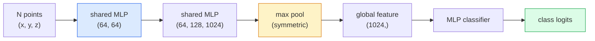

# 3D Vision  Point Clouds & NeRFs  3D Vision  点云与NeRF

> 3D Vision có hai hương vị. đám mây điểm là sản lượng thô của cảm biến. NeRF là lĩnh vực khối lượng được học. Cả hai đều trả lời "nhiều gì là nơi trong không gian".

> **【中文解读】**3D hình ảnh có hai kiểu: điểm云 là cảm biến (LiDAR, Depth Camera) đầu ra; NeRF (Neural Radiation Field) là một trường học được học tập về khối lượng. Cả hai đều trả lời "nhiều gì ở vị trí nào trong không gian". NeRF (Neural Network Learning Scenes) thể hiện 3D từ bất kỳ góc độ nào.

> **【拓展：3D 视觉的应用】**NeRF được sử dụng cho thực tế ảo / tăng cường thực tế (VR/AR)  xây dựng可视化、自动驾驶场景重建──3D Gaussian Splatting(下一课) là một chương trình thay thế nhanh chóng của NeRF, thực tế thời gian 染质量更高──点云处理是自动驾驶 LiDAR 感知的核心──

**Type:** Learn + Build | **类型:** 学习 + 动手
**Languages:** Python | **语言:** Python
**Prerequisites:** Phase 4 Lesson 03 (CNNs), Phase 1 Lesson 12 (Tensor Operations) | **前置知识:** Phase 4 Lesson 03（CNN），Phase 1 Lesson 12（张量运算）
**Time:** ~45 minutes | **时间:** ~45 分钟

## Mục tiêu học tập

- Sự phân biệt giữa các biểu hiện 3D rõ ràng (màu điểm, lưới, voxel) và ngầm (trang khoảng cách ký kết, NeRF) và khi mỗi biểu hiện được sử dụng
- Hiểu thủ thuật chức năng đối xứng của PointNet làm cho một mạng lưới thần kinh biến đổi không thay đổi trên một tập hợp các điểm không sắp xếp
- Theo dõi một bước đi về phía trước của NeRF: đúc tia, hình ảnh quy mô, mã hóa vị trí, mật độ MLP + đầu màu
- Sử dụng `nerfstudio`hoặc `instant-ngp`cho việc tái tạo 3D được đào tạo trước từ một bộ hình ảnh nhỏ được đặt

> **【中文解读】**Mục tiêu học tập được liệt kê trong danh sách các khả năng cốt lõi cần được nắm bắt sau khi hoàn thành bài học.


## Vấn đề  vấn đề giới thiệu

Một máy ảnh tạo ra một hình ảnh 2D. Một LIDAR tạo ra một bộ các điểm 3D mà không có thứ tự. Một đường ống dẫn cấu trúc từ chuyển động tạo ra một đám mây ít điểm khóa 3D. Một NeRF tái tạo một cảnh 3D toàn bộ từ một số hình ảnh được đặt. Tất cả những điều này là "bản cảnh" nhưng không có một trong số đó trông giống như tensor dày đặc mà một CNN muốn.

> 相机产生 2D图像──LiDAR 产生一组无序的3D点──运动恢复结构流水线产生稀疏的3D 关键点云──NeRF từ vài vị trí姿像重建整个3D场景──这些都是"视觉",但没有一个看起来像CNN 想要的密集张量──

Tầm nhìn 3D quan trọng bởi vì hầu hết các nhiệm vụ robot có giá trị cao đều chạy trong 3D: nắm bắt, tránh trở ngại, điều hướng, ẩn trí AR, chụp nội dung 3D. Một kỹ sư tầm nhìn chỉ hiểu hình ảnh 2D bị khóa ra khỏi phần phát triển nhanh nhất của lĩnh vực (tầm nhìn AR / VR, robot, xe tự lái, tái thiết 3D dựa trên NeRF cho bất động sản hoặc xây dựng).

> 3D hình ảnh là rất quan trọng, bởi vì hầu hết các nhiệm vụ của máy tính có giá trị cao đều hoạt động trong 3D: nắm bắt, tránh trở ngại, dẫn đường, AR 遮、 3D 内容捕获. Chỉ cần hiểu 2D hình ảnh kỹ sư hình ảnh bị khóa trong phần phát triển nhanh nhất trong lĩnh vực này ngoài ra.

Hai đại diện thống trị vì lý do khác nhau. đám mây điểm là những gì các cảm biến cung cấp cho bạn miễn phí. NeRF và những người kế nhiệm của họ (3D Gaussian splatting, SDF thần kinh) là những gì bạn nhận được khi bạn yêu cầu một mạng thần kinh để tìm hiểu một cảnh.

> 两种表示因不同原因占据主导──点云是传感器免费给你──NeRF 及其后继者(3D 高斯、神经SDF) là khi bạn để cho các trường hợp học của mạng lưới thần kinh.

## Khái niệm cốt lõi

> **【中文解读】**Bài viết này giới thiệu các khái niệm và lý thuyết cốt lõi.


### Những đám mây điểm

Một đám mây điểm là một tập hợp không sắp xếp của N điểm trong R^3, tùy chọn mỗi điểm có các tính năng (màu, cường độ, bình thường).

> 点云是 R^3 trong N 个点的无序集合, mỗi điểm có thể mang tính chất ((色、强度、法线) ⋅

```
cloud = [
  (x1, y1, z1, r1, g1, b1),
  (x2, y2, z2, r2, g2, b2),
  ...
  (xN, yN, zN, rN, gN, bN),
]
```

Không lưới điện, không kết nối, hai tính chất làm cho việc này khó khăn cho các mạng thần kinh:

> Không có mạng lưới, không có kết nối. Hai đặc điểm làm cho nó rất khó khăn đối với mạng lưới thần kinh:

- **Permutation invariance** đầu ra không được phụ thuộc vào thứ tự điểm.
  Trung ngữ翻译:**置换不变性** Xuất khẩu không thể phụ thuộc vào thứ tự của các điểm.
- **Variable N** một mô hình duy nhất phải xử lý đám mây có kích thước khác nhau.
  Trung ngữ翻译:**可变 N**Một mô hình đơn phải xử lý các điểm khác nhau.

PointNet (Qi et al., 2017) giải quyết cả hai với một ý tưởng: áp dụng một MLP chia sẻ cho mọi điểm, sau đó tổng hợp với một hàm đối xứng (tầm tối đa). Kết quả là một vector kích thước cố định không phụ thuộc vào thứ tự.

> PointNet ((Qi 等,2017) đã giải quyết hai vấn đề bằng một ý tưởng: đối với mỗi ứng dụng chia sẻ MLP, sau đó sử dụng đối với hàm (((最大池化) tập hợp. Kết quả là một khối lượng cố định không liên quan đến thứ tự.

```
f(P) = max_{p in P} MLP(p)
```

Đây là toàn bộ lõi của PointNet. Các biến thể sâu hơn (PointNet++, Point Transformer) thêm mẫu phân cấp và tổng hợp địa phương nhưng thủ thuật chức năng đối xứng không thay đổi.

> Đây là toàn bộ lõi của PointNet. Các biến thể sâu hơn của PointNet đã tăng cường việc lấy mẫu cấp và tích hợp địa phương, nhưng các kỹ thuật hàm đối với không thay đổi.

### Kiến trúc PointNet



"MLP chia sẻ" có nghĩa là MLP tương tự chạy trên mọi điểm độc lập.

> "MLP chia sẻ" có nghĩa là cùng một MLP hoạt động độc lập trên mỗi điểm, để tăng hiệu quả, đạt được 1x1 khối lượng trên kích thước điểm.

### Các trường phát xạ thần kinh (Neural Radiance Fields - NeRF)

NeRFs (Mildenhall et al., 2020) đã đưa ra câu hỏi "chúng ta có thể tái tạo một cảnh 3D từ N ảnh không?" và trả lời bằng một mạng thần kinh là cảnh.`(x, y, z, viewing_direction)`đến`(density, colour)`Đưa ra một cái nhìn mới là một vòng phóng xạ trên mạng này.

> NeRF(Mildenhall 等,2020) trả lời" liệu có thể từ N 张照片 tái tạo 3D 场景?" câu hỏi này sử dụng một mạng thần kinh để thể hiện cảnh tượng chính nó──网络将`(x, y, z, 观察方向)`映射到 `(密度, 颜色)`染新视角 là làm chu kỳ chiếu sáng trên mạng này.

```
NeRF MLP:  (x, y, z, theta, phi) -> (sigma, r, g, b)

To render a pixel (u, v) of a new view:
  1. Cast a ray from the camera through pixel (u, v)
  2. Sample points along the ray at distances t_1, t_2, ..., t_N
  3. Query the MLP at each point
  4. Composite the colours weighted by (1 - exp(-sigma * dt))
  5. The sum is the rendered pixel colour
```

Một mất mát so sánh pixel được hiển thị với pixel thực tại mặt đất trong hình ảnh đào tạo. Backprop thông qua bước hiển thị cập nhật MLP. Không thực tại mặt đất 3D, không có hình học rõ ràng  cảnh được lưu trữ trong trọng lượng MLP.

> 损失函数 so sánh hình ảnh sơn với hình ảnh thực trong hình ảnh đào tạo. 通过 染步骤的反向传播更新 MLP.

### Mã hóa vị trí trong NeRF

Một cái vanilla MLP trên `(x, y, z)`Không thể đại diện cho các chi tiết tần số cao vì MLP có thiên vị về mặt quang phổ đối với tần số thấp. NeRF sửa chữa điều này bằng cách mã hóa từng phối hợp thành một vector tính năng Fourier trước MLP:

> MLP bình thường`(x, y, z)`上不能表示高频细节, vì MLP 频谱偏向低频. NeRF 通过在每个坐标送入 MLP 编码为里叶特征向量来修复这个问题:

```
gamma(p) = (sin(2^0 pi p), cos(2^0 pi p), sin(2^1 pi p), cos(2^1 pi p), ...)
```

Cho đến mức tần số L = 10. Đây là cùng một trò chơi chuyển đổi sử dụng cho các vị trí, và nó xuất hiện lại trong điều kiện thời gian phân tán (Dạy 10) Không có nó, NeRF trông mờ.

> Lối cao nhất là L=10 个频率级别── đây là cùng một kỹ thuật sử dụng vị trí của Transformer, cũng xuất hiện một lần nữa trong điều kiện thời gian của mô hình phổ biến (第 10 课)── không có nó, NeRF trông mơ hồ──

### Phân tích khối lượng

```
C(r) = sum_i T_i * (1 - exp(-sigma_i * delta_i)) * c_i

T_i  = exp(- sum_{j<i} sigma_j * delta_j)
delta_i = t_{i+1} - t_i
```

`T_i`là truyền  lượng ánh sáng tồn tại đến điểm i. `(1 - exp(-sigma_i * delta_i))`là độ không thấm ở điểm i. `c_i`là màu sắc. Pixel cuối cùng là một số lượng cân nặng dọc theo tia.

> `T_i`là tỷ lệ chiếu sáng  đến khi đạt 1 điểm  thời gian ánh sáng còn lại `(1 - exp(-sigma_i * delta_i))`Đó là một điểm không minh bạch.`c_i`Đơn màu. Cuối cùng, hình ảnh là sự gia tăng của ánh sáng.

### Điều gì thay thế NeRF

NeRF tinh khiết chậm đào tạo (giờ) và chậm phát hiện (thứ giây mỗi hình ảnh).

> 纯 NeRF 训练慢(小时级) 且染慢(每张图像秒级) ⋅后续发展:

- **Instant-NGP**(2022)  mã hóa lưới hash thay thế đầu vào vị trí của MLP; tàu trong giây.
  Trung ngữ翻译:**Instant-NGP**(2022) 哈希网格编码替代 MLP 的位置输入;秒级训练──
- **Mip-NeRF 360** xử lý các cảnh không giới hạn và chống liềm.
  Trung ngữ翻译:**Mip-NeRF 360** xử lý không giới hạn cảnh và chống 。
- **3D Gaussian Splatting**(2023)  thay thế lĩnh vực khối lượng bằng hàng triệu Gaussians 3D; tàu trong vài phút, render trong thời gian thực.
  Trung ngữ翻译:**3D 高斯泼溅**(2023)  sử dụng hàng triệu 3D 高斯替代体积场;分钟级训练,实时染──

Hầu như mọi sản phẩm NeRF thực sự vào năm 2026 thực sự là 3D Gaussian splatting. mô hình tâm lý vẫn là NeRF.

> Năm 2026 hầu hết các sản phẩm NeRF thực sự là 3D cao ︎.

### Các bộ dữ liệu và các chỉ số tham chiếu

- **ShapeNet** phân loại và phân đoạn các mô hình CAD 3D như đám mây điểm.
  Trung ngữ翻译:ShapeNet3D CAD 模型的点云分类和分割──
- **ScanNet** Quét trong nhà thực sự để phân đoạn.
  Trung文翻译:ScanNet真实室内扫描, được dùng để phân chia。
- **KITTI** LIDAR point cloud ngoài trời cho lái xe tự động.
  Trung文翻译:KITTI户外 LiDAR 点云, dùng để tự lái
- **NeRF Synthetic**- **Blended MVS** Set dữ liệu hình ảnh được đặt để tổng hợp xem.
  Trung文翻译:NeRF Synthetic / Blended MVS带位姿的图像数据集,用于视角合成。
- **Mip-NeRF 360**bộ dữ liệu  không giới hạn cảnh thực.
  Trung ngữ翻译:Mip-NeRF 360 数据集无界真实场景──

> **【中文解读】**本节通过代码实现核心算法从零――这种" từ đầu"的方式能帮助理解框架背后的原理,遇到问题时不会被黑盒困住――

> **【拓展：工业部署中的视觉系统】**Trong thực tế, mô hình hình ảnh cần phải xem xét các vấn đề về sự chậm trễ, mô hình lớn, thiết bị cạnh phù hợp, vv.

> **【拓展：数据标注与质量】**视觉任务的效果高度依赖标签数据质量――Label Studio、CVAT là công cụ标签 chính thống――在工业场景中,主动学习(Active Learning) có thể giảm chi phí đánh dấu: mô hình đối với yêu cầu mẫu không xác định


## Hãy xây dựng nó.
```figure
nerf-rays
```

## Hãy xây dựng nó

### Bước 1: Cân loại PointNet

```python
import torch
import torch.nn as nn

class PointNet(nn.Module):
    def __init__(self, num_classes=10):
        super().__init__()
        self.mlp1 = nn.Sequential(
            nn.Conv1d(3, 64, 1),    nn.BatchNorm1d(64),   nn.ReLU(inplace=True),
            nn.Conv1d(64, 64, 1),   nn.BatchNorm1d(64),   nn.ReLU(inplace=True),
        )
        self.mlp2 = nn.Sequential(
            nn.Conv1d(64, 128, 1),  nn.BatchNorm1d(128),  nn.ReLU(inplace=True),
            nn.Conv1d(128, 1024, 1), nn.BatchNorm1d(1024), nn.ReLU(inplace=True),
        )
        self.head = nn.Sequential(
            nn.Linear(1024, 512),   nn.BatchNorm1d(512),  nn.ReLU(inplace=True),
            nn.Dropout(0.3),
            nn.Linear(512, 256),    nn.BatchNorm1d(256),  nn.ReLU(inplace=True),
            nn.Dropout(0.3),
            nn.Linear(256, num_classes),
        )

    def forward(self, x):
        # x: (N, 3, num_points) — transposed for Conv1d
        x = self.mlp1(x)
        x = self.mlp2(x)
        x = torch.max(x, dim=-1)[0]       # (N, 1024)
        return self.head(x)

pts = torch.randn(4, 3, 1024)
net = PointNet(num_classes=10)
print(f"output: {net(pts).shape}")
print(f"params: {sum(p.numel() for p in net.parameters()):,}")
```

Khoảng 1,6 triệu tham số, chạy với 1.024 điểm mỗi đám mây.

> Khoảng 1600.000 tham số. Mỗi điểm xử lý 1.024 điểm.

### Bước 2: Mã hóa vị trí

```python
def positional_encoding(x, L=10):
    """
    x: (..., D) -> (..., D * 2 * L)
    """
    freqs = 2.0 ** torch.arange(L, dtype=x.dtype, device=x.device)
    args = x.unsqueeze(-1) * freqs * 3.141592653589793
    sinc = torch.cat([args.sin(), args.cos()], dim=-1)
    return sinc.reshape(*x.shape[:-1], -1)

x = torch.randn(5, 3)
y = positional_encoding(x, L=10)
print(f"input:  {x.shape}")
print(f"encoded: {y.shape}     # (5, 60)")
```

Tăng bằng `2^l * pi`cho tần số cao hơn dần.

> - Đúng rồi.`2^l * pi`产生逐步升高的频率──

### Bước 3: NLP NeRF nhỏ

```python
class TinyNeRF(nn.Module):
    def __init__(self, L_pos=10, L_dir=4, hidden=128):
        super().__init__()
        self.L_pos = L_pos
        self.L_dir = L_dir
        pos_dim = 3 * 2 * L_pos
        dir_dim = 3 * 2 * L_dir
        self.trunk = nn.Sequential(
            nn.Linear(pos_dim, hidden), nn.ReLU(inplace=True),
            nn.Linear(hidden, hidden),  nn.ReLU(inplace=True),
            nn.Linear(hidden, hidden),  nn.ReLU(inplace=True),
            nn.Linear(hidden, hidden),  nn.ReLU(inplace=True),
        )
        self.sigma = nn.Linear(hidden, 1)
        self.color = nn.Sequential(
            nn.Linear(hidden + dir_dim, hidden // 2), nn.ReLU(inplace=True),
            nn.Linear(hidden // 2, 3), nn.Sigmoid(),
        )

    def forward(self, x, d):
        x_enc = positional_encoding(x, self.L_pos)
        d_enc = positional_encoding(d, self.L_dir)
        h = self.trunk(x_enc)
        sigma = torch.relu(self.sigma(h)).squeeze(-1)
        rgb = self.color(torch.cat([h, d_enc], dim=-1))
        return sigma, rgb

nerf = TinyNeRF()
x = torch.randn(128, 3)
d = torch.randn(128, 3)
s, c = nerf(x, d)
print(f"sigma: {s.shape}   rgb: {c.shape}")
```

Giảm nhỏ so với NeRF ban đầu (có 2 thân MLP độ sâu 8).

> Tương tự với NeRF ban đầu, có 2 độ sâu 8 MLP chủ thể) tương đương rất nhỏ.

### Bước 4: Tạo hình khối lượng dọc theo một tia

```python
def volumetric_render(sigma, rgb, t_vals):
    """
    sigma: (..., N_samples)
    rgb:   (..., N_samples, 3)
    t_vals: (N_samples,) distances along the ray
    """
    delta = torch.cat([t_vals[1:] - t_vals[:-1], torch.full_like(t_vals[:1], 1e10)])
    alpha = 1.0 - torch.exp(-sigma * delta)
    trans = torch.cumprod(torch.cat([torch.ones_like(alpha[..., :1]), 1.0 - alpha + 1e-10], dim=-1), dim=-1)[..., :-1]
    weights = alpha * trans
    rendered = (weights.unsqueeze(-1) * rgb).sum(dim=-2)
    depth = (weights * t_vals).sum(dim=-1)
    return rendered, depth, weights


N = 64
t_vals = torch.linspace(2.0, 6.0, N)
sigma = torch.rand(N) * 0.5
rgb = torch.rand(N, 3)
rendered, depth, weights = volumetric_render(sigma, rgb, t_vals)
print(f"rendered colour: {rendered.tolist()}")
print(f"depth:           {depth.item():.2f}")
```

> **【中文解读】**Bài này sẽ trình bày cách sử dụng một khung đã phát triển như PyTorch, HuggingFace, và các khác.


Một tia, 64 mẫu, tổng hợp với một pixel RGB và độ sâu.

> Một 条光线,64 个采样点,合成为一个RGB 像素和深度值.


> **【拓展：视觉模型的持续学习】**Trong môi trường sản xuất, mô hình hình ảnh cần phải liên tục thích ứng với dữ liệu mới.

## Hãy sử dụng nó để thực hiện

Để làm việc thực sự:

- `nerfstudio`(Tancik et al.)  thư viện tham chiếu hiện tại cho NeRF / Instant-NGP / Gaussian Splatting.
- `pytorch3d`(Meta)  phân biệt rendering, tiện ích point-cloud, mesh ops.
- `open3d` xử lý đám mây điểm, đăng ký, hình ảnh hóa.

> **【中文解读】**Phần này tập trung vào cách phân phối mô hình như một sản phẩm có thể sử dụng.


Đối với việc triển khai, 3D Gaussian splating đã thay thế phần lớn các NeRF tinh khiết vì nó làm cho nhanh hơn 100 lần.


## Chuyển nó đi.

Bài học này mang lại:

> **【中文解读】**练题按照 Easy/Medium/Hard 三个难度递进;;建议至少完成 级别的题目, 级别适合深入研究或面试准备;;


- `outputs/prompt-3d-task-router.md` một lời nhắc hướng đến đại diện 3D đúng (hám mây điểm, lưới, voxel, NeRF, Gaussian splat) dựa trên các dữ liệu nhập và nhiệm vụ.
- `outputs/skill-point-cloud-loader.md` một kỹ năng viết PyTorch `Dataset`cho các tệp .ply / .pcd / .xyz với chuẩn hóa, tập trung và lấy mẫu điểm đúng.

## Tập luyện bài tập

1. **(Easy)**Cho thấy PointNet là không thay đổi thay đổi: chạy cùng một đám mây hai lần, một lần với các điểm trộn.
2. **(Medium)**Thực hiện một chức năng tạo ra tia tối thiểu, với tính chất và hình ảnh của máy ảnh, tạo ra nguồn gốc và hướng tia cho mỗi pixel của hình ảnh H x W.
3. **(Hard)**Đào tạo một TinyNeRF trên một bộ dữ liệu tổng hợp của các hình ảnh rendered của một khối màu (được tạo ra thông qua rendering phân biệt hoặc một tracer tia đơn giản). báo cáo mất rendering tại thời kỳ 1, 10, và 100.

> **【中文解读】**Trong 术语表中的"Những gì mọi người nói" vs "Những gì nó thực sự có nghĩa" 区分日常口语和精确技术含义── 在团队协作中,统一术语定义可以避免大量沟通误解──


## Từ khóa  Từ khóa nhanh chóng

| Term | What people say | What it actually means |
|------|----------------|----------------------|
| Point cloud | "3D points from LIDAR" | Unordered set of (x, y, z) + optional features per point |
| PointNet | "First neural net on point clouds" | Shared MLP per point + symmetric (max) pool; permutation-invariant by construction |
| NeRF | "MLP that is the scene" | Network mapping (x, y, z, dir) to (density, colour); rendered by ray casting |
| Positional encoding | "Fourier features" | Encode each coordinate into sin/cos at multiple frequencies to overcome MLP low-frequency bias |
| Volumetric rendering | "Ray integration" | Composite samples along a ray into a single pixel using transmittance and alpha |
| Instant-NGP | "Hash-grid NeRF" | Replaces NeRF's coordinate MLP with a multi-resolution hash grid; 100-1000x faster |
| 3D Gaussian splatting | "Millions of Gaussians" | Scene = collection of 3D Gaussians; renders in real time, trains in minutes |
| SDF | "Signed distance field" | Function returning signed distance to the nearest surface; another implicit representation |

> **【中文解读】**延伸阅读 cung cấp các nguồn chất lượng cao cho việc học sâu. Những bài báo và giảng dạy này là tài liệu tham khảo cổ điển trong lĩnh vực này, phù hợp với những người đọc cần hiểu sâu hơn.


## Xem thêm 延伸阅读

- [PointNet (Qi et al., 2017)](https://arxiv.org/abs/1612.00593) trình phân loại biến đổi thay đổi
- [NeRF (Mildenhall et al., 2020)](https://arxiv.org/abs/2003.08934) tờ báo đã làm cho việc tái tạo 3D từ hình ảnh trở thành vấn đề mạng thần kinh
- [Instant-NGP (Müller et al., 2022)](https://arxiv.org/abs/2201.05989) lưới hash, tăng tốc 1000 lần
- [3D Gaussian Splatting (Kerbl et al., 2023)](https://arxiv.org/abs/2308.04079) kiến trúc thay thế NeRF trong sản xuất
