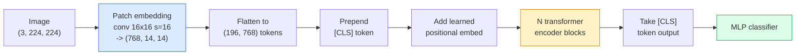

# Trình biến hình (ViT) 视觉 Transformer

> Cắt hình ảnh thành các bản vá, coi mỗi bản vá như một từ, chạy một bộ biến đổi tiêu chuẩn.

> **【中文解读】**将图像切成小块(patch),把每个 patch 当作一个"词", sau đó sử dụng tiêu chuẩn Transformer 处理──就是如此简单──ViT 证明了Transformer 架构不仅有效在NLP,在视觉领域也可以超越CNN──

> **【拓展：ViT 与 GPT-4V】**ViT là khả năng nhìn của GPT-4V、Claude、LLaVA 等多模态大模型的视觉编码器── từ năm 2021 đến nay, ViT đã trở thành cơ sở hạ tầng của hình ảnh máy tính, được sử dụng cho CLIP、SAM、DINO 等核心模型──ViT của bản vá 嵌入思想也启动了视频变压器和多模态模型的设计──

**Type:** Build | **类型:** 动手
**Languages:** Python | **语言:** Python
**Prerequisites:** Phase 7 Lesson 02 (Self-Attention), Phase 4 Lesson 04 (Image Classification) | **前置知识:** Phase 7 Lesson 02（自注意力），Phase 4 Lesson 04（图像分类）
**Time:** ~45 minutes | **时间:** ~45 分钟

## Mục tiêu học tập

- Thực hiện nhúng vá, nhúng vị trí học, mã thông báo lớp và khối mã hóa biến đổi từ đầu để xây dựng ViT tối thiểu
- Giải thích tại sao ViT được cho là cần dữ liệu trước khi đào tạo lớn cho đến khi DeiT và MAE chứng minh ngược lại
- So sánh ViT, Swin và ConvNeXt về tiền sử kiến trúc của họ (không có, chú ý cửa sổ địa phương, xương sống con)
- Định chỉnh kỹ ViT được đào tạo trước trên một bộ dữ liệu nhỏ bằng cách sử dụng `timm`và công thức chuẩn của ống nghiệm tuyến tính / chỉnh sửa tinh tế

> **【中文解读】**Mục tiêu học tập được liệt kê trong danh sách các khả năng cốt lõi cần được nắm bắt sau khi hoàn thành bài học.


## Vấn đề  vấn đề giới thiệu

Trong một thập kỷ, sự xoắn tắt là đồng nghĩa với tầm nhìn máy tính. CNN có sự thiên vị gợi cảm mạnh mẽ  địa phương, tương đương dịch  mà không ai nghĩ bạn có thể thay thế. Sau đó Dosovitskiy et al. (2020) cho thấy rằng một biến thể đơn giản được áp dụng cho các bản vá hình ảnh phẳng, không có máy móc xoắn tắt, có thể phù hợp hoặc đánh bại các CNN tốt nhất ở quy mô.

> Trong thập kỷ qua, quấn là một từ của hình ảnh máy tính. CNN có một sự phân bổ rất mạnh về định vị địa phương, chuyển động, biến động, không ai nghĩ rằng bạn có thể thay thế.

Vận động của ViT trên ImageNet-1k bị ResNet đánh bại. ViT được huấn luyện trước trên ImageNet-21k hoặc JFT-300M sau đó được điều chỉnh tốt trên ImageNet-1k đánh bại nó. Kết luận là các bộ biến đổi thiếu tiền sử hữu ích nhưng có thể học được chúng từ đủ dữ liệu. Các nghiên cứu sau đó (DeiT, MAE, DINO) cho thấy rằng với các công thức đào tạo phù hợp  tăng cường mạnh mẽ, tự giám sát trước khi đào tạo, chưng cất  ViT đào tạo tốt trên dữ liệu nhỏ cũng như.

> 陷是"大规模上"──ViT trên ImageNet-1k đã chuyển giao ResNet── trên ImageNet-21k hoặc JFT-300M 上预训然后在 ImageNet-1k 上微调的 ViT đã giành chiến thắng── kết luận là Transformer 缺乏有用的先验但可以从足够的数据中学到──后续工作 ((DeiT、MAE、DINO) cho thấy, với đúng kế hoạch đào tạo强强、自监督预训、蒸ViT trên dữ liệu nhỏ cũng có thể đào tạo rất tốt──

Đến năm 2026, các máy CNN tinh khiết vẫn cạnh tranh trên các thiết bị cạnh tranh (ConvNeXt là mạnh nhất), nhưng các bộ biến áp thống trị mọi thứ khác: phân đoạn (Mask2Former, SegFormer), phát hiện (DETR, RT-DETR), đa phương thức (CLIP, SigLIP), video (VideoMAE, VJEPA).

> Đến năm 2026, CNN trên các thiết bị cạnh tranh vẫn còn cạnh tranh, nhưng Transformer đã thống trị mọi thứ khác: chia cắt, kiểm tra, kiểm tra, kiểm tra, kiểm tra, kiểm tra, kiểm tra, kiểm tra, kiểm tra, kiểm tra, kiểm tra, kiểm tra, kiểm tra, kiểm tra, kiểm tra, kiểm tra, kiểm tra, kiểm tra, kiểm tra, kiểm tra, kiểm tra, kiểm tra, kiểm tra, kiểm tra, kiểm tra, kiểm tra, kiểm tra, kiểm tra, kiểm tra, kiểm tra, kiểm tra, kiểm tra, kiểm tra, kiểm tra, kiểm tra, kiểm tra, kiểm tra, kiểm tra, kiểm tra, kiểm tra, kiểm tra, kiểm tra, kiểm tra, kiểm tra, kiểm tra, kiểm tra, kiểm tra, kiểm tra, kiểm tra, kiểm tra, kiểm tra, kiểm tra, kiểm tra, kiểm tra, kiểm tra, kiểm tra, kiểm tra, kiểm tra, kiểm tra, kiểm tra, kiểm tra, kiểm tra, kiểm tra, kiểm tra, kiểm tra, kiểm tra, kiểm tra, kiểm tra, kiểm tra, kiểm tra, kiểm tra, kiểm tra, kiểm tra, kiểm tra, kiểm tra, kiểm tra, kiểm tra, kiểm tra, kiểm tra, kiểm tra, kiểm tra, kiểm tra, kiểm tra, kiểm tra.

## Khái niệm cốt lõi

> **【中文解读】**Bài viết này giới thiệu các khái niệm và lý thuyết cốt lõi.


### Đường ống



Bảy bước. Patches -> token -> attention -> classifier. Mỗi biến thể (DeiT, Swin, ConvNeXt, MAE pre-training) thay đổi một hoặc hai trong bảy và để lại phần còn lại một mình.

> 七步──补丁 -> token -> 注意力 -> 分类器──每个变体(DeiT、Swin、ConvNeXt、MAE 预训) chỉ thay đổi một trong bảy bước, phần còn lại giữ không thay đổi──

### Đẹp đệm

Conv đầu tiên là bí mật. kích thước lõi 16, bước 16, vì vậy một hình ảnh 224x224 trở thành một lưới 14x14 của 16x16 các bản vá, mỗi dự tính vào một nhúng 768-dim. Conv đơn đó cả patchifies và dự án tuyến tính.

> Cuộn thứ nhất là bí mật ở đó. Cuộn này được hoàn thành trong một thời gian dài.

```
Input:  (3, 224, 224)
Conv (3 -> 768, k=16, s=16, no padding):
Output: (768, 14, 14)
Flatten spatial: (196, 768)
```

196 bản vá = 196 token. kích thước tính năng của mỗi token là 768 (ViT-B), 1024 (ViT-L), hoặc 1280 (ViT-H).

> 196 个补丁 = 196 个 token。 mỗi token có tính năng: 768 

### Mã chỉ số lớp

Một vector học được duy nhất đã được prepend đến chuỗi:

> Một khối lượng có thể học được được thêm vào trình tự trước:

```
tokens = [CLS; patch_1; patch_2; ...; patch_196]   shape (197, 768)
```

Sau khi N khối biến thể, `[CLS]`đầu phân loại chỉ đọc một vector này.

> 经过 N 个 Transformer 块后,`[CLS]`                                                                                                                                                                                                                                                              

### Đài đặt

Các biến thể không có khái niệm tích hợp về vị trí không gian.

> Transformer không có khái niệm vị trí không gian được đặt trong nó.

```
tokens = tokens + learned_pos_embedding   (also shape (197, 768))
```

Việc nhúng là một tham số của mô hình; đào tạo dựa trên gradient thích nghi nó với cấu trúc hình ảnh 2D. Các thay thế 2D có mặt nhưng hiếm khi được sử dụng trong thực tế.

> 嵌入 là các tham số của mô hình; dựa trên độ hình, đào tạo nó thích ứng với cấu trúc hình ảnh 2D. Có một giải pháp thay thế 2D, nhưng thực tế rất ít sử dụng.

### Block encoder biến thể

Tiêu chuẩn, tự chú ý nhiều đầu, MLP, kết nối dư thừa, pre-LayerNorm.

> 标准结构──多头自注意力、MLP、残差连接、前置 LayerNorm──

```
x = x + MSA(LN(x))
x = x + MLP(LN(x))

MLP is two-layer with GELU: Linear(d -> 4d) -> GELU -> Linear(4d -> d)
```

ViT-B/16 xếp chồng 12 khối này, mỗi khối có 12 đầu chú ý, tổng cộng 86M tham số.

> ViT-B/16  Lắp xếp 12 khối như thế này, mỗi khối có 12 đầu tập trung, tổng cộng 86 triệu tham số.

### Tại sao trước LN

Các biến đổi đầu tiên được sử dụng sau LN (`x = LN(x + sublayer(x))`(Từ năm 1995 đến năm 1999) và đã phải vật lộn để đào tạo qua 6-8 lớp mà không được nóng lên.`x = x + sublayer(LN(x))`Các hệ thống truyền thông và truyền thông của các trường đại học hiện đại đều sử dụng hệ thống truyền thông trước LN.

> 早期 Transformer 使用后置 LN(`x = LN(x + sublayer(x))`), rất khó trong trường hợp không có nhiệt độ luyện tập vượt quá 6-8 层──前置 LN(`x = x + sublayer(LN(x))`(Bản phẩm: Báo cáo về các trường học học sinh và các trường học sinh)

### Khoản đổi kích thước đệm

- 16x16 patches -> 196 token, tiêu chuẩn.
  Trung文翻译:16x16 补丁 -> 196 个代币,标准配置。
- 32x32 patches -> 49 token, nhanh hơn nhưng độ phân giải thấp hơn.
  Trung ngữ翻译:32x32 补丁 -> 49 个代币, nhanh hơn nhưng độ phân giải thấp hơn.
- 8x8 patches -> 784 token, tinh tế hơn nhưng O(n^2) chi phí chú ý cân nặng.
  Trung文翻译:8x8 补丁 -> 784 个 token, hơn精细但 O(n^2) chú ý tiêu tốn tăng lên nghiêm trọng。

Các bản vá lớn hơn = ít token hơn = nhanh hơn nhưng ít chi tiết không gian hơn. SwinV2 sử dụng các bản vá 4x4 trong các cửa sổ bậc phân cấp.

> Bổ sung lớn hơn = token nhỏ hơn = hơn nhanh nhưng chi tiết không gian nhỏ hơn. SwinV2 sử dụng 4x4 trong cửa sổ cấp độ.

### Công thức của DeiT cho việc đào tạo ViT trên ImageNet-1k

ViT ban đầu cần JFT-300M để đánh bại CNN. DeiT (Touvron et al., 2020) đã đào tạo ViT-B lên 81,8% top-1 trên ImageNet-1k một mình với bốn thay đổi:

>  原始 ViT 需要 JFT-300M 才能击败 CNN──DeiT(Touvron等,2020) chỉ sử dụng bốn cải tiến就在ImageNet-1k 上将 ViT-B 训练到81.8% top-1:

1. Tăng cường nặng: RandAugment, Mixup, CutMix, Random Erasing.
   中文翻译:强数据增强:RandAugment、Mixup、CutMix、Random Erasing。
2. Độ sâu stochastic (để thả toàn bộ khối ngẫu nhiên trong quá trình tập luyện).
   Trung文翻译:随机深度(训练时随机丢弃整个块)
3. Tăng lặp lại (hình ảnh tương tự được lấy mẫu 3 lần mỗi lô).
   Trung文翻译:重复增强(同一图像在每个批中采样 3 次) 』
4. Distillation từ một giáo viên CNN (không tùy chọn, nâng độ chính xác hơn nữa).
   Trung ngữ翻译: Từ CNN Teach师模型蒸(可选,进一步提升精度)

Mỗi công thức đào tạo ViT hiện đại đều xuất phát từ DeiT.

> Mỗi chương trình đào tạo ViT hiện đại đều bắt nguồn từ DeiT.

### Swin vs ConvNeXt

- **Swin**(Liu et al., 2021)  Diễn cảnh dựa trên cửa sổ. Mỗi khối tham gia trong một cửa sổ địa phương; các khối thay đổi chuyển cửa sổ để trộn thông tin qua các cửa sổ. Mang lại một địa điểm giống CNN trước trong khi giữ cho người vận hành chú ý.
  Trung ngữ翻译:**Swin**(Liu 等,2021)  Khảo sát dựa trên cửa sổ. Mỗi khối trong cửa sổ địa phương tập trung vào các hoạt động di động của các cửa sổ.
- **ConvNeXt**(Liu et al., 2022)  thiết kế lại CNN phù hợp với lựa chọn kiến trúc của Swin (convs sâu, LayerNorm, GELU, nút chai đảo ngược).
  Trung ngữ翻译:**ConvNeXt**(Liu 等,2022)  tái thiết kế CNN, phù hợp với Swin's kiến trúc lựa chọn(深度可分离卷积、LayerNorm、GELU、倒置瓶)                                                                                                                                                                                                                                       

Năm 2026, ConvNeXt-V2 và Swin-V2 đều là cấp sản xuất; sự lựa chọn đúng đắn phụ thuộc vào đống suy luận của bạn (ConvNeXt biên soạn tốt hơn cho cạnh) và cơ thể trước tập luyện.

> Năm 2026, ConvNeXt-V2 和 Swin-V2 đều là chương trình cấp sản xuất; chính xác lựa chọn phụ thuộc vào suy nghĩ

### Đào tạo trước

Máy tự động mã hóa che đậy (He et al., 2022): che đậy 75% các bản vá ngẫu nhiên, đào tạo trình mã hóa để xử lý chỉ 25% hiển thị, đào tạo một trình mã hóa nhỏ để tái cấu trúc các bản vá che đậy từ đầu ra của trình mã hóa. Sau khi được đào tạo trước, hãy loại bỏ trình mã hóa và điều chỉnh kỹ thuật mã hóa.

> 掩码自编码器 ((He等,2022):随机掩盖 75% các sửa chữa, huấn luyện编码器 chỉ xử lý 25% những gì có thể thấy, huấn luyện một máy giải mã nhỏ từ bộ编码器输出重建被掩盖的补丁──预训后丢弃解码器,微调编码器──

MAE làm cho ViT có thể được đào tạo chỉ trên ImageNet-1k, nhấn SOTA, và là công thức tự giám sát mặc định hiện tại.

> MAE sử dụng ViT chỉ trong ImageNet-1k 上可训练, đạt đến SOTA, là hiện tại được chấp nhận tự giám sát chương trình đào tạo.

> **【中文解读】**本节通过代码实现核心算法从零――这种" từ đầu"的方式能帮助理解框架背后的原理,遇到问题时不会被黑盒困住――

> **【拓展：工业部署中的视觉系统】**Trong thực tế, mô hình hình ảnh cần phải xem xét các vấn đề về sự chậm trễ, mô hình lớn, thiết bị cạnh phù hợp, vv.

> **【拓展：数据标注与质量】**视觉任务的效果高度依赖标签数据质量――Label Studio、CVAT là công cụ标签 chính thống――在工业场景中,主动学习(Active Learning) có thể giảm chi phí đánh dấu: mô hình đối với yêu cầu mẫu không xác định


## Hãy xây dựng nó.
```figure
batchnorm-inference
```

## Hãy xây dựng nó

### Bước 1: Lắp đặt vá

```python
import torch
import torch.nn as nn

class PatchEmbedding(nn.Module):
    def __init__(self, in_channels=3, patch_size=16, dim=192, image_size=64):
        super().__init__()
        assert image_size % patch_size == 0
        self.proj = nn.Conv2d(in_channels, dim, kernel_size=patch_size, stride=patch_size)
        num_patches = (image_size // patch_size) ** 2
        self.num_patches = num_patches

    def forward(self, x):
        x = self.proj(x)
        return x.flatten(2).transpose(1, 2)
```

Một con, một phẳng, một chuyển giao. Đó là toàn bộ bước từ hình ảnh đến mã.

> Một vòng, một biểu tượng, một chuyển vị trí. Đây là tất cả các bước của biểu tượng.

### Bước 2: Phòng chuyển đổi

Pre-LN, tự chú ý nhiều đầu, MLP với GELU, kết nối dư thừa.

> Ưu tiên: LN, Ưu tiên của GELU, Ưu tiên của GELU

```python
class Block(nn.Module):
    def __init__(self, dim, num_heads, mlp_ratio=4, dropout=0.0):
        super().__init__()
        self.ln1 = nn.LayerNorm(dim)
        self.attn = nn.MultiheadAttention(dim, num_heads, dropout=dropout, batch_first=True)
        self.ln2 = nn.LayerNorm(dim)
        self.mlp = nn.Sequential(
            nn.Linear(dim, dim * mlp_ratio),
            nn.GELU(),
            nn.Dropout(dropout),
            nn.Linear(dim * mlp_ratio, dim),
            nn.Dropout(dropout),
        )

    def forward(self, x):
        a, _ = self.attn(self.ln1(x), self.ln1(x), self.ln1(x), need_weights=False)
        x = x + a
        x = x + self.mlp(self.ln2(x))
        return x
```

`nn.MultiheadAttention`xử lý việc chia thành đầu, sản phẩm chấm quy mô, và dự đoán đầu ra. `batch_first=True`Vì vậy hình dạng là `(N, seq, dim)`- Tôi không biết.

> `nn.MultiheadAttention`处理多头拆分,缩积点和输出投影.`batch_first=True`Để hình dạng`(N, seq, dim)`

### Bước 3: ViT

```python
class ViT(nn.Module):
    def __init__(self, image_size=64, patch_size=16, in_channels=3,
                 num_classes=10, dim=192, depth=6, num_heads=3, mlp_ratio=4):
        super().__init__()
        self.patch = PatchEmbedding(in_channels, patch_size, dim, image_size)
        num_patches = self.patch.num_patches
        self.cls_token = nn.Parameter(torch.zeros(1, 1, dim))
        self.pos_embed = nn.Parameter(torch.zeros(1, num_patches + 1, dim))
        self.blocks = nn.ModuleList([
            Block(dim, num_heads, mlp_ratio) for _ in range(depth)
        ])
        self.ln = nn.LayerNorm(dim)
        self.head = nn.Linear(dim, num_classes)
        nn.init.trunc_normal_(self.pos_embed, std=0.02)
        nn.init.trunc_normal_(self.cls_token, std=0.02)

    def forward(self, x):
        x = self.patch(x)
        cls = self.cls_token.expand(x.size(0), -1, -1)
        x = torch.cat([cls, x], dim=1)
        x = x + self.pos_embed
        for blk in self.blocks:
            x = blk(x)
        x = self.ln(x[:, 0])
        return self.head(x)

vit = ViT(image_size=64, patch_size=16, num_classes=10, dim=192, depth=6, num_heads=3)
x = torch.randn(2, 3, 64, 64)
print(f"output: {vit(x).shape}")
print(f"params: {sum(p.numel() for p in vit.parameters()):,}")
```

Khoảng 2,8M tham số  một ViT nhỏ có thể xử lý trên CPU. ViT-B thực sự là 86M; định nghĩa cùng lớp với `dim=768, depth=12, num_heads=12`- Tôi không biết.

> Khoảng 280 triệu tham số là một ViT nhỏ có thể được đào tạo trên CPU.`dim=768, depth=12, num_heads=12`

### Bước 4: Kiểm tra tinh thần  suy luận hình ảnh đơn

```python
logits = vit(torch.randn(1, 3, 64, 64))
print(f"logits: {logits}")
print(f"probs:  {logits.softmax(-1)}")
```

> **【中文解读】**Bài này sẽ trình bày cách sử dụng một khung đã phát triển như PyTorch, HuggingFace, và các khác.


Có thể là 1.

> 应无错运行──概率之和为1──


> **【拓展：视觉模型的持续学习】**Trong môi trường sản xuất, mô hình hình ảnh cần phải liên tục thích ứng với dữ liệu mới.

## Hãy sử dụng nó để thực hiện

`timm`Đưa ra tất cả các biến thể ViT với trọng lượng được tập luyện trước ImageNet.

```python
import timm

model = timm.create_model("vit_base_patch16_224", pretrained=True, num_classes=10)
```

`timm`là mặc định sản xuất cho các bộ biến đổi tầm nhìn vào năm 2026. hỗ trợ ViT, DeiT, Swin, Swin-V2, ConvNeXt, ConvNeXt-V2, MaxViT, MViT, EfficientFormer và hàng chục người khác dưới cùng một API.

Đối với công việc đa phương thức (hình ảnh + văn bản), `transformers`CLIP, SigLIP, BLIP-2, LLaVA.

> **【中文解读】**Phần này tập trung vào cách phân phối mô hình như một sản phẩm có thể sử dụng.


## Chuyển nó đi.

Bài học này mang lại:

- `outputs/prompt-vit-vs-cnn-picker.md` một lời nhắc chọn giữa ViT, ConvNeXt, hoặc Swin dựa trên kích thước tập dữ liệu, tính toán và xếp hàng suy luận.
- `outputs/skill-vit-patch-and-pos-embed-inspector.md` một kỹ năng xác minh việc nhúng vá của ViT và hình dạng nhúng vị trí phù hợp với chiều dài chuỗi dự kiến của mô hình, bắt được các lỗi di chuyển phổ biến nhất.

> **【中文解读】**练题按照 Easy/Medium/Hard 三个难度递进;;建议至少完成 级别的题目, 级别适合深入研究或面试准备;;


## Tập luyện bài tập

1. **(Easy)**Bác in hình dạng của mỗi tensor trung gian để đi về phía trước qua ViT nhỏ trên.`(N, 3, 64, 64)`-> các vá `(N, 16, 192)`-> với CLS `(N, 17, 192)`-> nhập vào phân loại `(N, 192)`-> đầu ra `(N, num_classes)`- Tôi không biết.
2. **(Medium)**Định chỉnh một người được huấn luyện trước `timm`ViT-S/16 trên bộ dữ liệu tổng hợp-CIFAR từ Bài học 4. So sánh với ResNet-18 tinh chỉnh trên cùng một dữ liệu.
3. **(Hard)**Thực hiện MAE pre-training cho ViT nhỏ: che 75% các đệm, đào tạo bộ mã hóa + một decoder nhỏ để tái cấu trúc các đệm che phủ. Đánh giá độ chính xác của thăm dò tuyến tính trên dữ liệu tổng hợp trước và sau khi pre-training.

> **【中文解读】**Trong 术语表中的"Những gì mọi người nói" vs "Những gì nó thực sự có nghĩa" 区分日常口语和精确技术含义── 在团队协作中,统一术语定义可以避免大量沟通误解──


## Từ khóa  Từ khóa nhanh chóng

| Term | What people say | What it actually means |
|------|----------------|----------------------|
| Patch embedding | "The first conv" | A conv with kernel size = stride = patch size; turns the image into a grid of token embeddings |
| Class token | "[CLS]" | A learned vector prepended to the token sequence; its final output is the global image representation |
| Positional embedding | "Learned pos" | A learned vector added to every token so the transformer knows where each patch came from |
| Pre-LN | "LayerNorm before sublayer" | The stable transformer variant: `x + sublayer(LN(x))` instead of `LN(x + sublayer(x))` |
| Multi-head attention | "Parallel attention" | Standard transformer attention split into num_heads independent subspaces, concatenated afterwards |
| ViT-B/16 | "Base, patch 16" | The canonical size: dim=768, depth=12, heads=12, patch_size=16, image=224; ~86M params |
| DeiT | "Data-efficient ViT" | ViT trained on ImageNet-1k alone with strong augmentation; proved large pretraining datasets are not strictly required |
| MAE | "Masked autoencoder" | Self-supervised pretraining: mask 75% of patches, reconstruct; the dominant ViT pretraining recipe |

> **【中文解读】**延伸阅读 cung cấp các nguồn chất lượng cao cho việc học sâu. Những bài báo và giảng dạy này là tài liệu tham khảo cổ điển trong lĩnh vực này, phù hợp với những người đọc cần hiểu sâu hơn.


## Xem thêm 延伸阅读

- [An Image is Worth 16x16 Words (Dosovitskiy et al., 2020)](https://arxiv.org/abs/2010.11929) giấy ViT
- [DeiT: Data-efficient Image Transformers (Touvron et al., 2020)](https://arxiv.org/abs/2012.12877) làm thế nào để đào tạo ViT trên ImageNet-1k một mình
- [Masked Autoencoders are Scalable Vision Learners (He et al., 2022)](https://arxiv.org/abs/2111.06377) MAE Pre-training
- [timm documentation](https://huggingface.co/docs/timm) tham chiếu cho mỗi biến đổi thị giác bạn sẽ sử dụng trong sản xuất
