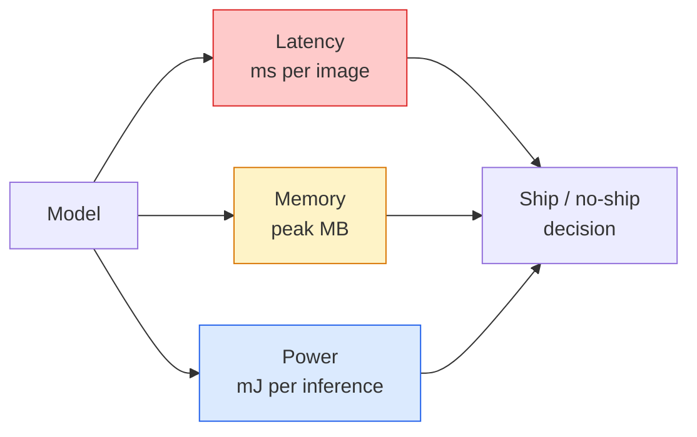

# Khám phá thời gian thực  Lưu trữ cạnh  Khám phá thời gian thực  边缘 triển khai

> Kết luận cạnh là kỷ luật để có được một mô hình 90 độ chính xác chạy với tốc độ 30 fps trên một thiết bị có 2 GB RAM.

> **【中文解读】**边缘推理 là một nghệ thuật cân bằng: để 90% 准确率 mô hình trên thiết bị chỉ có 2GB trong bộ nhớ chạy với 30fps ⋅ mỗi điểm 100 ⋅ điểm ⋅ ⋅ ⋅ ⋅ ⋅ ⋅ ⋅ ⋅ ⋅ ⋅ ⋅ ⋅ ⋅ ⋅ ⋅ ⋅ ⋅ ⋅ ⋅ ⋅ ⋅ ⋅ ⋅ ⋅ ⋅ ⋅ ⋅ ⋅ ⋅ ⋅ ⋅ ⋅ ⋅ ⋅ ⋅ ⋅ ⋅ ⋅ ⋅ ⋅ ⋅ ⋅ ⋅ ⋅ ⋅ ⋅ ⋅ ⋅ ⋅ ⋅ ⋅ ⋅ ⋅ ⋅ ⋅ ⋅ ⋅ ⋅ ⋅ ⋅ ⋅ ⋅ ⋅ ⋅ ⋅ ⋅ ⋅ ⋅ ⋅ ⋅ ⋅ ⋅ ⋅ ⋅ ⋅ ⋅ ⋅ ⋅ ⋅ ⋅ ⋅ ⋅ ⋅ ⋅ ⋅ ⋅ ⋅ ⋅ ⋅ ⋅ ⋅ ⋅ ⋅ ⋅ ⋅ ⋅ ⋅ ⋅ ⋅ ⋅ ⋅ ⋅ ⋅ ⋅ ⋅ ⋅ ⋅ ⋅ ⋅ ⋅ ⋅ ⋅ ⋅ ⋅ ⋅ ⋅ ⋅ ⋅ ⋅ ⋅ ⋅ ⋅ ⋅ ⋅ ⋅ ⋅ ⋅ ⋅ ⋅ ⋅ ⋅ ⋅ ⋅ ⋅ ⋅ ⋅ ⋅ ⋅ ⋅ ⋅ ⋅ ⋅ ⋅ ⋅ ⋅ ⋅ ⋅ ⋅ ⋅ ⋅ ⋅ ⋅ ⋅ ⋅ ⋅ ⋅ ⋅ ⋅ ⋅ ⋅ ⋅ ⋅   ⋅ ⋅                                                                                                                                         

> **【拓展：边缘 AI 的应用】**边缘部署在智能手机 (?? 人脸解锁,拍照美化) 无人机 (?? 人机) 实时目标检测) 工业物联网 (IoT) 缺陷检测) 和自动驾驶 (车载推理) 中至关重要──MobileNet、YOLO-nano、EfficientNet là một mô hình hạng nhẹ phổ biến──

**Type:** Learn + Build | **类型:** 学习 + 动手
**Languages:** Python | **语言:** Python
**Prerequisites:** Phase 4 Lesson 04 (Image Classification), Phase 10 Lesson 11 (Quantization) | **前置知识:** Phase 4 Lesson 04（图像分类），Phase 10 Lesson 11（量化）
**Time:** ~75 minutes | **时间:** ~75 分钟

## Mục tiêu học tập

- Đo độ trễ suy luận, bộ nhớ đỉnh và dung lượng cho bất kỳ mô hình PyTorch nào, và đọc FLOPs / params / trade-off độ trễ
- Phân tích mô hình thị giác đến INT8 bằng cách sử dụng định lượng sau khi đào tạo của PyTorch và xác minh sự mất độ chính xác < 1%
- Xuất khẩu sang ONNX và biên soạn bằng ONNX Runtime hoặc TensorRT; nêu tên ba lỗi xuất khẩu phổ biến nhất và sửa chữa chúng
- Giải thích khi nào nên chọn MobileNetV3, EfficientNet-Lite, ConvNeXt-Tiny, hoặc MobileViT cho hạn chế cạnh

> **【中文解读】**Mục tiêu học tập được liệt kê trong danh sách các khả năng cốt lõi cần được nắm bắt sau khi hoàn thành bài học.


## Vấn đề  vấn đề giới thiệu

Một mô hình tầm nhìn thời gian đào tạo là một con quái vật điểm nổi. 100M tham số, 10 GFLOP mỗi lần đi trước, 2 GB VRAM. Không có điều gì trong đó phù hợp với điện thoại, đơn vị thông tin giải trí của xe hơi, máy ảnh công nghiệp hoặc máy bay không người lái. Việc vận chuyển một hệ thống tầm nhìn có nghĩa là phù hợp với các dự đoán tương tự vào ngân sách nhỏ hơn 100 lần.

> Mô hình hình học tập là một hệ thống hình ảnh có một số lượng quái vật.1.000.000 tham số, mỗi lần phát sóng 10 GFLOPs, 2 GB lưu trữ.

Ba nút làm hầu hết công việc: lựa chọn mô hình (một kiến trúc nhỏ hơn với cùng một công thức), định lượng (INT8 thay vì FP32) và thời gian chạy suy luận (ONNX Runtime, TensorRT, Core ML, TFLite).

> 三旋 đã thực hiện hầu hết công việc: mô hình chọn lựa (the same scheme's small architecture) 量化 (Int8 替代 FP32) và推理运行时 (Tổng thông tin vận hành ONNX Runtime, TensorRT, Core ML, TFLite)  thực sự sử dụng chúng trong các buổi biểu diễn trên workstation và phân biệt giữa các sản phẩm được giao trên các mô hình ảnh 30 USD.

Bài học này đặt kỷ luật đo trước (bạn không thể tối ưu hóa những gì bạn không thể đo), sau đó đi bộ ba nút. Mục tiêu không phải là học mọi thời gian chạy cạnh mà là biết những đòn bẩy nào tồn tại và làm thế nào để xác minh mỗi đòn bẩy làm theo ý tưởng của bạn.

> Bài học này đầu tiên xây dựng quy luật đo lường (you cannot optimize what you cannot measure), sau đó trải qua ba vòng. Mục tiêu không phải là học mỗi bên hoạt động, mà là biết có những cái gì và làm thế nào để chứng minh mỗi cái gì bạn nghĩ nó làm.

## Khái niệm cốt lõi

> **【中文解读】**Bài viết này giới thiệu các khái niệm và lý thuyết cốt lõi.


### Ba ngân sách



- **Latency**: p50, p95, p99. Chỉ trung bình p50 che giấu hành vi đuôi quan trọng cho hệ thống thời gian thực.
  Trung ngữ翻译:**延迟**:p50、p95、p99── chỉ xem p50 平均值会隐藏对实时系统至关重要的尾部行为──
- **Peak memory**: mức tối đa mà thiết bị nhìn thấy, không phải là mức trung bình ổn định.
  Trung ngữ翻译:**峰值内存**Các thiết bị có giá trị tối đa, không phải là giá trị trung bình ổn định.
- **Power / energy**: hàng triệu giọt mỗi suy luận trên một thiết bị chạy pin.
  Trung ngữ翻译:**功耗/能量**Số lượng điện trên thiết bị cung cấp điện điện:

Một bảng của (chương tự, độ trễ, bộ nhớ, độ chính xác) là những gì mà một quyết định cạnh được thực hiện.

> Một张 (模型, 延迟, 内存, 精度) là một biểu đồ dựa trên quyết định của việc triển khai bên cạnh.

### Thiết kế đo lường

Ba quy tắc mà mọi hồ sơ cạnh phải tuân thủ:

> Mỗi phân tích hiệu suất cạnh phải tuân thủ ba quy tắc:

1. **Warm up**mô hình với 5-10 con đốm đi trước trước khi đo lường. kho lưu trữ lạnh và biên soạn JIT tạo ra số đầu tiên không đại diện.
   Trung ngữ翻译:**预热** đo trước sử dụng 5-10 lần ảo trước hướng truyền tải trước nhiệt mô hình。 lạnh缓存 và JIT 编译会产生不代表性的初始数据。
2. **Synchronise**Lượng tải GPU với `torch.cuda.synchronize()`Nếu không có nó bạn đo lường phát phát hạt nhân, không phải thực hiện hạt nhân.
   Trung ngữ翻译:**同步** trong kế hoạch sử dụng`torch.cuda.synchronize()`Đồng bộ GPU 工作负载──否则你测量是内核调度,不是内核执行──
3. **Fix input sizes**độ trễ ở 224x224 không phải là độ trễ ở 512x512.
   Trung ngữ翻译:**固定输入尺寸** sử dụng độ phân giải sản xuất──224x224 上的延迟不等于 512x512 上的延迟──

### FLOPs như một đại diện

FLOPs (phản ứng điểm nổi theo suy luận) là một proxy rẻ tiền, độc lập với thiết bị cho độ trễ. hữu ích cho so sánh kiến trúc, gây hiểu lầm như đồng hồ tường tuyệt đối. Một mô hình với 10% FLOPs nhiều hơn có thể nhanh hơn 2 lần trong thực tế vì nó sử dụng các ops thân thiện với phần cứng (các conv sâu biên soạn tốt, conv lớn 7x7 không).

> FLOPs (FLOPs) là một chỉ số vận hành trung tâm giá rẻ, không liên quan đến thiết bị. Nó có thể được sử dụng để so sánh cấu trúc, nhưng có độ sai lầm khi sử dụng thời gian. Một mô hình FLOPs có nhiều hơn 10% thực tế có thể nhanh gấp 2 lần, vì nó sử dụng các hoạt động thân thiện với phần cứng.

Quy tắc: sử dụng FLOP để tìm kiếm kiến trúc, sử dụng độ trễ trên thiết bị để đưa ra quyết định triển khai.

> Luật: Sử dụng FLOP để tìm kiếm cấu trúc, sử dụng chậm trễ trên thiết bị để đưa ra quyết định.

### Số lượng trong một đoạn

Thay thế trọng lượng và kích hoạt FP32 bằng INT8. kích thước mô hình giảm 4x, băng thông bộ nhớ giảm 4x, tính toán giảm 2-4x trên phần cứng có lõi INT8 (mỗi SoC di động hiện đại, mọi GPU NVIDIA với Tensor Cores).

> Để thay thế FP32  trọng lượng và kích hoạt thành INT8── mô hình kích thước giảm 4 lần, bộ nhớ băng thông giảm 4 lần, số lượng tính toán trên phần cứng trong trong INT8 giảm 2-4 lần( mỗi SoC di động hiện đại, mỗi GPU NVIDIA với Tensor Cores)── mất độ chính xác trên nhiệm vụ trực quan thường là 0.1-1% điểm (( sử dụng tập luyện sau tĩnh định lượng hóa)──

Các loại:

> 类型:

- **Dynamic** trọng lượng lượng tử đến INT8, kích hoạt tính toán bằng FP.
  Trung ngữ翻译:**动态** quyền trọng lượng là INT8, giá trị kích hoạt là FP 计算――简单,加速有限――
- **Static (post-training)** trọng lượng lượng + kích hoạt hiệu chuẩn trong một bộ hiệu chuẩn nhỏ.
  Trung ngữ翻译:**静态（训练后）** định lượng trọng lượng + 在小校准集上校准激活范围──比动态快得多──
- **Quantisation-aware training (QAT)** mô phỏng số lượng trong quá trình đào tạo để mô hình học tập xung quanh nó.
  Trung ngữ翻译:**量化感知训练（QAT）** tập luyện khi mô hình được định lượng, để mô hình được thích ứng.

Đối với thị lực, định lượng tĩnh sau khi đào tạo mang lại 95% lợi ích với 5% nỗ lực.

> Đối với nhiệm vụ hình ảnh, việc tập luyện theo định lượng tĩnh với 5% nỗ lực đạt được 95% lợi ích. Chỉ khi mất độ chính xác của PTQ là không thể chấp nhận được khi sử dụng QAT.

### Phân cắt và chưng cất

- **Pruning** loại bỏ các trọng lượng không quan trọng (dựa trên độ lớn) hoặc kênh (dự cấu trúc).
  Trung ngữ翻译:**剪枝** Di chuyển không quan trọng trọng trọng lượng dựa trên chiều rộng) hoặc đường dẫn (structuring)  đối với quá trình phân tích mô hình hiệu quả tốt; đối với quá chặt chẽ cấu trúc sử dụng không lớn 
- **Distillation** đào tạo một học sinh nhỏ để bắt chước các logit của một giáo viên lớn.
  Trung ngữ翻译:**蒸馏**训练小模型(学生)模仿大模型(教师) của logic──通常能恢复缩小模型损失的大部分精度──生产级边缘模型的标准做法──

### Thời gian chạy suy luận

- **PyTorch eager** chậm, không dùng để triển khai.
  Trung ngữ翻译:**PyTorch eager**慢, không được sử dụng để triển khai.
- **TorchScript** di sản.`torch.compile`và xuất khẩu ONNX.
  Trung ngữ翻译:**TorchScript**遗留方案──已被 `torch.compile`和 ONNX 导出取代。
- **ONNX Runtime**CPU, CUDA, CoreML, TensorRT, OpenVINO đều có các nhà cung cấp ONNX.
  Trung ngữ翻译:**ONNX Runtime**中性运行时──CPU、CUDA、CoreML、TensorRT、OpenVINO đều có ONNX 提供者──从这里开始──
- **TensorRT** NVIDIA's compiler. độ trễ tốt nhất trên các GPU NVIDIA (workstation và Jetson).
  Trung ngữ翻译:**TensorRT**NVIDIA 的编译器──在NVIDIA GPU(工作站和Jetson) 上延迟最低──
- **Core ML** Thời gian chạy của Apple cho iOS/macOS.`.mlmodel`hoặc `.mlpackage`- Tôi không biết.
  Trung ngữ翻译:**Core ML**Apple's iOS/macOS 运行时──需要 `.mlmodel`Hoặc`.mlpackage`
- **TFLite** Thời gian chạy của Google cho Android/ARM.`.tflite`- Tôi không biết.
  Trung ngữ翻译:**TFLite**Google Android/ARM 运行时──需要 `.tflite`
- **OpenVINO** Thời gian chạy của Intel cho CPU/VPU.`.xml`+ `.bin`- Tôi không biết.
  Trung ngữ翻译:**OpenVINO**Intel's CPU/VPU 运行时――需要 `.xml`+ `.bin`

Trong thực tế: xuất PyTorch -> ONNX -> chọn thời gian chạy cho mục tiêu. ONNX là ngôn ngữ ngoại ngữ.

> 实践中:导出 PyTorch -> ONNX -> 选择目标运行时。ONNX 是通用语言。

### Bộ chọn kiến trúc cạnh

| Budget | Model | Why |
|--------|-------|-----|
| < 3M params | MobileNetV3-Small | Compiles everywhere, good baseline |
| 3-10M | EfficientNet-Lite-B0 | Best accuracy per param on TFLite |
| 10-20M | ConvNeXt-Tiny | Best accuracy-per-param, CPU-friendly |
| 20-30M | MobileViT-S or EfficientViT | Transformer with ImageNet accuracy |
| 30-80M | Swin-V2-Tiny | If stack supports window attention |

Quantize tất cả các điều này đến INT8 trừ khi bạn có một lý do cụ thể để không.

> **【中文解读】**本节通过代码实现核心算法从零――这种" từ đầu"的方式能帮助理解框架背后的原理,遇到问题时不会被黑盒困住――

> **【拓展：工业部署中的视觉系统】**Trong thực tế, mô hình hình ảnh cần phải xem xét các vấn đề về sự chậm trễ, mô hình lớn, thiết bị cạnh phù hợp, vv.

> **【拓展：数据标注与质量】**视觉任务的效果高度依赖标签数据质量――Label Studio、CVAT là công cụ标签 chính thống――在工业场景中,主动学习(Active Learning) có thể giảm chi phí đánh dấu: mô hình đối với yêu cầu mẫu không xác định


## Hãy xây dựng nó.
```figure
cnn-param-count
```

## Hãy xây dựng nó

### Bước 1: Đánh giá độ trễ đúng

```python
import time
import torch

def measure_latency(model, input_shape, device="cpu", warmup=10, iters=50):
    model = model.to(device).eval()
    x = torch.randn(input_shape, device=device)
    with torch.no_grad():
        for _ in range(warmup):
            model(x)
        if device == "cuda":
            torch.cuda.synchronize()
        times = []
        for _ in range(iters):
            if device == "cuda":
                torch.cuda.synchronize()
            t0 = time.perf_counter()
            model(x)
            if device == "cuda":
                torch.cuda.synchronize()
            times.append((time.perf_counter() - t0) * 1000)
    times.sort()
    return {
        "p50_ms": times[len(times) // 2],
        "p95_ms": times[int(len(times) * 0.95)],
        "p99_ms": times[int(len(times) * 0.99)],
        "mean_ms": sum(times) / len(times),
    }
```

Sưởi ấm, đồng bộ hóa, sử dụng `time.perf_counter()`- Báo cáo phần trăm, không chỉ là xấu.

> 预热、同步、使用 `time.perf_counter()`                                                                                                                                                                                                                                                              

### Bước 2: Parameter và FLOP đếm

```python
def parameter_count(model):
    return sum(p.numel() for p in model.parameters())

def flops_estimate(model, input_shape):
    """
    Rough FLOP count for a conv/linear-only model. For production use `fvcore` or `ptflops`.
    """
    total = 0
    def conv_hook(m, inp, out):
        nonlocal total
        c_out, c_in, kh, kw = m.weight.shape
        h, w = out.shape[-2:]
        total += 2 * c_in * c_out * kh * kw * h * w
    def linear_hook(m, inp, out):
        nonlocal total
        total += 2 * m.in_features * m.out_features
    hooks = []
    for m in model.modules():
        if isinstance(m, torch.nn.Conv2d):
            hooks.append(m.register_forward_hook(conv_hook))
        elif isinstance(m, torch.nn.Linear):
            hooks.append(m.register_forward_hook(linear_hook))
    model.eval()
    with torch.no_grad():
        model(torch.randn(input_shape))
    for h in hooks:
        h.remove()
    return total
```

Đối với các dự án thực sự sử dụng `fvcore.nn.FlopCountAnalysis`hoặc `ptflops`; họ xử lý mỗi loại mô-đun đúng cách.

> thực tế`fvcore.nn.FlopCountAnalysis`Hoặc`ptflops`; chúng có thể xử lý đúng mỗi loại mô-đun.

### Bước 3: Quantization tĩnh sau khi đào tạo

```python
def quantise_ptq(model, calibration_loader, backend="x86"):
    import torch.ao.quantization as tq
    model = model.eval().cpu()
    model.qconfig = tq.get_default_qconfig(backend)
    tq.prepare(model, inplace=True)
    with torch.no_grad():
        for x, _ in calibration_loader:
            model(x)
    tq.convert(model, inplace=True)
    return model
```

Ba bước: cấu hình, chuẩn bị (đã thêm các nhà quan sát), chuẩn bị với dữ liệu thực, chuyển đổi (fuse + quantize).`Conv -> BN -> ReLU`-> `ConvBnReLU`), trong đó `torch.ao.quantization.fuse_modules`tay cầm.

> 三步:配置、准备(插入观察器) 、用真实数据校准、转换(融合 + 量化) 需要模型已融合(`Conv -> BN -> ReLU`-> `ConvBnReLU`),`torch.ao.quantization.fuse_modules`Làm việc này.

### Bước 4: Xuất khẩu sang ONNX

```python
def export_onnx(model, sample_input, path="model.onnx"):
    model = model.eval()
    torch.onnx.export(
        model,
        sample_input,
        path,
        input_names=["input"],
        output_names=["output"],
        dynamic_axes={"input": {0: "batch"}, "output": {0: "batch"}},
        opset_version=17,
    )
    return path
```

`opset_version=17`là sự cố định an toàn vào năm 2026.`dynamic_axes`cho phép bạn chạy mô hình ONNX với kích thước lô tùy ý.

> `opset_version=17`Đó là giá trị an ninh năm 2026:`dynamic_axes`允许 ONNX 模型以任意批量大小运行──

### Bước 5: Đánh giá và so sánh chế độ

```python
import torch.nn as nn
from torchvision.models import mobilenet_v3_small

def compare_regimes():
    model = mobilenet_v3_small(weights=None, num_classes=10)
    params = parameter_count(model)
    flops = flops_estimate(model, (1, 3, 224, 224))
    lat_fp32 = measure_latency(model, (1, 3, 224, 224), device="cpu")
    print(f"FP32 MobileNetV3-Small: {params:,} params  {flops/1e9:.2f} GFLOPs  "
          f"p50={lat_fp32['p50_ms']:.2f}ms  p95={lat_fp32['p95_ms']:.2f}ms")
```

Chạy cùng một chức năng cho `resnet50`- `efficientnet_v2_s`, và`convnext_tiny`và bạn có bảng so sánh bạn cần cho một quyết định triển khai.

> Đối với`resnet50``efficientnet_v2_s`和 `convnext_tiny`运行 cùng một hàm, bạn đã có được tỷ lệ cần thiết cho việc triển khai quyết định.

> **【中文解读】**Bài này sẽ trình bày cách sử dụng một khung đã phát triển như PyTorch, HuggingFace, và các khác.


> **【拓展：视觉模型的持续学习】**Trong môi trường sản xuất, mô hình hình ảnh cần phải liên tục thích ứng với dữ liệu mới.

## Hãy sử dụng nó để thực hiện

Các khối sản xuất hội tụ theo một trong ba con đường:

- **Web / serverless**: PyTorch -> ONNX -> ONNX Runtime (cơ sở cung cấp CPU hoặc CUDA).
- **NVIDIA edge (Jetson, GPU server)**PyTorch -> ONNX -> TensorRT.
- **Mobile**: PyTorch -> ONNX -> Core ML (iOS) hoặc TFLite (Android).

> **【中文解读】**Phần này tập trung vào cách phân phối mô hình như một sản phẩm có thể sử dụng.


Để đo lường, `torch-tb-profiler`- `nvprof`- `nsys`, và các công cụ trên macOS cho ra các phân tích lớp theo lớp. `benchmark_app`(OpenVINO) và `trtexec`(TensorRT) cho số CLI độc lập.


## Chuyển nó đi.

> **【中文解读】**练题按照 Easy/Medium/Hard 三个难度递进;;建议至少完成 级别的题目, 级别适合深入研究或面试准备;;


Bài học này mang lại:

- `outputs/prompt-edge-deployment-planner.md` một lời nhắc chọn xương sống, chiến lược định lượng, và thời gian chạy cho thiết bị mục tiêu và độ trễ SLA.
- `outputs/skill-latency-profiler.md` một kỹ năng viết một kịch bản đánh giá độ trễ hoàn chỉnh với sự nóng lên, đồng bộ hóa, phân phần trăm và theo dõi bộ nhớ.

## Tập luyện bài tập

1. **(Easy)**đo độ trễ p50 cho `resnet18`- `mobilenet_v3_small`- `efficientnet_v2_s`, và`convnext_tiny`báo cáo bảng và xác định kiến trúc nào có độ chính xác tốt nhất trên mỗi ms.
2. **(Medium)**Sử dụng định lượng tĩnh sau khi đào tạo cho `mobilenet_v3_small`. báo cáo mất độ trễ và độ chính xác FP32 so với INT8 trên một bộ phận CIFAR-10 hoặc tương tự.
3. **(Hard)**Xuất khẩu`convnext_tiny`đến ONNX, chạy qua nó `onnxruntime`với `CPUExecutionProvider`, và so sánh độ trễ với đường cơ sở PyTorch thèm. xác định lớp đầu tiên nơi ONNX Runtime nhanh hơn và giải thích tại sao.

> **【中文解读】**Trong 术语表中的"Những gì mọi người nói" vs "Những gì nó thực sự có nghĩa" 区分日常口语和精确技术含义── 在团队协作中,统一术语定义可以避免大量沟通误解──


## Từ khóa  Từ khóa nhanh chóng

| Term | What people say | What it actually means |
|------|----------------|----------------------|
| Latency | "How fast" | Time from input to output; p50/p95/p99 percentiles, not mean |
| FLOPs | "Model size" | Floating-point ops per forward pass; rough proxy for compute cost |
| INT8 quantisation | "8-bit" | Replace FP32 weights/activations with 8-bit integers; ~4x smaller, 2-4x faster |
| PTQ | "Post-training quantisation" | Quantise a trained model without retraining; easy, usually enough |
| QAT | "Quantisation-aware training" | Simulate quantisation during training; best accuracy, requires labelled data |
| ONNX | "The neutral format" | Model exchange format supported by every mainstream inference runtime |
| TensorRT | "NVIDIA compiler" | Compiles ONNX into an optimised engine for NVIDIA GPUs |
| Distillation | "Teacher -> student" | Train a small model to mimic a big model's logits; recovers most lost accuracy |

> **【中文解读】**延伸阅读 cung cấp các nguồn chất lượng cao cho việc học sâu. Những bài báo và giảng dạy này là tài liệu tham khảo cổ điển trong lĩnh vực này, phù hợp với những người đọc cần hiểu sâu hơn.


## Xem thêm 延伸阅读

- [EfficientNet (Tan & Le, 2019)](https://arxiv.org/abs/1905.11946) quy mô hợp chất cho các kiến trúc hiệu quả
- [MobileNetV3 (Howard et al., 2019)](https://arxiv.org/abs/1905.02244) kiến trúc di động đầu tiên với h-swish và squeeze-excite
- [A Practical Guide to TensorRT Optimization (NVIDIA)](https://developer.nvidia.com/blog/accelerating-model-inference-with-tensorrt-tips-and-best-practices-for-pytorch-users/) làm thế nào để thực sự có được các số thông qua trong giấy
- [ONNX Runtime docs](https://onnxruntime.ai/docs/) định lượng, tối ưu hóa biểu đồ, lựa chọn nhà cung cấp
