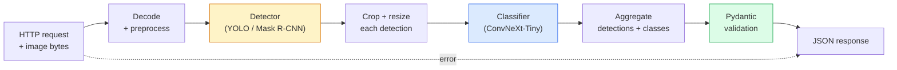

# Xây dựng một đường ống dẫn tầm nhìn hoàn chỉnh  Capstone  Xây dựng một hệ thống video hoàn chỉnh  毕业项目

> Một hệ thống thị giác sản xuất là một chuỗi các mô hình và quy tắc được đan xen với các hợp đồng dữ liệu.

> **【中文解读】**Hệ thống hình ảnh cấp sản xuất là một chuỗi của nhiều mô hình và quy tắc kết nối thông qua các hiệp ước dữ liệu.

**Type:** Build | **类型:** 动手
**Languages:** Python | **语言:** Python
**Prerequisites:** Phase 4 Lessons 01-15 | **前置知识:** Phase 4 Lessons 01-15
**Time:** ~120 minutes | **时间:** ~120 分钟

## Mục tiêu học tập

- Thiết kế một đường ống thị giác sản xuất phát hiện các đối tượng, phân loại chúng và phát ra JSON  cấu trúc với mỗi đường mòn thất bại được xử lý
- Kết nối một bộ phát hiện (Mask R-CNN hoặc YOLO), một bộ phân loại (ConvNeXt-Tiny), và một hợp đồng dữ liệu (Pydantic) vào một dịch vụ
- Đánh dấu chuẩn đường ống kết thúc đến kết thúc và xác định nút thắt đầu (thường là xử lý trước, sau đó là máy dò)
- Gửi dịch vụ FastAPI tối thiểu chấp nhận tải lên hình ảnh, chạy đường ống dẫn và trả lại phát hiện với phân loại

> **【中文解读】**Mục tiêu học tập được liệt kê trong danh sách các khả năng cốt lõi cần được nắm bắt sau khi hoàn thành bài học.


## Vấn đề  vấn đề giới thiệu

Các mô hình thị giác cá nhân hữu ích; các sản phẩm thị giác là chuỗi của chúng. Một kiểm toán kệ bán lẻ là một bộ dò cộng với một phân loại sản phẩm cộng với một đường ống OCR giá. Đường lái tự động là một bộ dò 2D cộng với một bộ dò 3D cộng với một bộ phân đoạn cộng với một bộ theo dõi cộng với một lập kế hoạch. Một màn hình trước y tế là một bộ phân đoạn cộng với một bộ phân loại khu vực cộng với một UI lâm sàng.

> 单个视觉模型有用;视觉产品是它们的链条;;零售货架审计是检测器加产品分类器加价 OCR 流水线;;自动驾驶是2D检测器加3D检测器加分器加跟踪器加规划器;;医疗预是分器加区域分类器加临床UI;;

Cáp dây là phần tách biệt một nguyên mẫu ML từ một sản phẩm. Mỗi giao diện giữa các mô hình là một nơi mới cho lỗi. Mỗi chuyển đổi phối hợp, mỗi chuẩn hóa, mỗi kích thước mặt nạ là ứng cử viên thất bại im lặng. Một đường ống là mạnh như giao diện yếu nhất của nó.

> 连接这些链条是将 ML原型与产品区分开来的部分――每个接口之间都是bug的新处――每次坐标变化、每次归化、每次掩码缩缩都是默默失败的候选人――流水线的强度取决于最弱的接口――

Bạch đá này thiết lập đường ống dẫn khả thi tối thiểu: phát hiện + phân loại + đầu ra cấu trúc + một lớp phục vụ. Mọi thứ khác trong các khe trong giai đoạn 4 vào bộ xương này: thay đổi Mask R-CNN cho YOLOv8, thêm đầu OCR, thêm một nhánh phân đoạn, thêm một bộ theo dõi. Kiến trúc ổn định; các mảnh có thể cắm.

> Dự án này xây dựng dòng nước tối thiểu có thể chạy: kiểm tra + phân loại +  cấu trúc xuất +  dịch vụ tầng.

## Khái niệm cốt lõi

> **【中文解读】**Bài viết này giới thiệu các khái niệm và lý thuyết cốt lõi.


### Đường ống



Hai giai đoạn mô hình đắt tiền, còn 5 giai đoạn khác là nơi sinh sống của côn trùng.

> 7 giai đoạn: 2 giai đoạn mô hình đắt tiền; 5 giai đoạn còn lại là những thứ bị mắc kẹt.

### Hợp đồng dữ liệu với Pydantic

Mỗi đường biên giới mô hình trở thành một đối tượng được đánh dấu. Điều này biến những thất bại im lặng thành những thất bại lớn.

> Mỗi mô hình biên giới đều trở thành đối tượng kiểu hóa.

```
Detection(
    box: tuple[float, float, float, float],   # (x1, y1, x2, y2), absolute pixels
    score: float,                              # [0, 1]
    class_id: int,                             # from detector's label map
    mask: Optional[list[list[int]]],           # RLE-encoded if present
)

PipelineResult(
    image_id: str,
    detections: list[Detection],
    classifications: list[Classification],
    inference_ms: float,
)
```

Khi một máy dò trả lại các hộp trong `(cx, cy, w, h)`thay vì `(x1, y1, x2, y2)`, xác nhận của Pydantic thất bại ở biên giới và bạn tìm ra ngay lập tức thay vì debugging một cây trồng dòng chảy xuống đó lặng lẽ trả lại các vùng trống.

> 当检测器返回 `(cx, cy, w, h)`Không`(x1, y1, x2, y2)`Khi hình dạng khung, Phân tích của Pydantic thất bại ở biên giới, bạn ngay lập tức có thể phát hiện ra vấn đề, thay vì điều tra xuống cắt cắt khi thấy nó lặng lẽ trở lại vùng trống.

### Khi độ trễ đi

Ba sự thật có trong hầu hết các đường ống thị giác:

> Hầu như mỗi video đều có 3 sự thật:

1. **Preprocessing is often the biggest single block.**Việc giải mã JPEG, chuyển đổi không gian màu, đổi kích thước  chúng được gắn với CPU và dễ quên.
   Trung ngữ翻译:**预处理通常是最大的单一开销。**解码 JPEG 转换色空间 缩放 缩放 缩放 缩放 缩放 缩写 缩写 缩写 缩写 缩写 缩写 缩写 缩写 缩写 缩写 缩写 缩写 缩写 缩写 缩写 缩写 缩写 缩写 缩写 缩写 缩写 缩写 缩写 缩写 缩写 缩写 缩写 缩写 缩写 缩写 缩写 缩写 缩写 缩写 缩写 缩写 缩写 缩写 缩写 缩写 缩写 缩写 缩写 缩写 缩写 缩写 缩写 缩写 缩写 缩写 缩写 缩写 缩写 缩写 缩写 缩写 缩写 缩写 缩写 缩写 缩写 缩写 缩写 缩写 缩写 缩写 缩写 缩写 缩写 缩写 缩写 缩写 缩写 缩写 缩写 缩写 缩写 缩写 缩写 缩写 缩写 缩写 缩写 缩写 缩写 缩写 缩写 缩写 缩写 缩写 缩写 缩写 缩写
2. **The detector dominates GPU time.**70-90% thời gian GPU là trong phát hiện trước đi.
   Trung ngữ翻译:**检测器占据 GPU 时间的主导。**70-90% thời gian của GPU được dành cho việc kiểm tra trước khi truyền tải.
3. **Postprocessing (NMS, RLE encode/decode) is cheap on GPU, expensive on CPU.**Luôn luôn ghi hình với mục tiêu thực tế.
   Trung ngữ翻译:**后处理（NMS、RLE 编解码）在 GPU 上便宜，在 CPU 上昂贵。**始终在实际目标上分析──

Biết phân phối là điều biến tối ưu hóa thành một danh sách ưu tiên.

> 了解分布情况才能将优化变成优先级列表――

### Các chế độ thất bại

- **Empty detections** trả lại danh sách trống, không bị hỏng.
  Trung ngữ翻译:**空检测结果** quay lại空列表, đừng sụp đổ.
- **Out-of-bounds boxes** Nhấn vào kích thước hình ảnh trước khi cắt.
  Trung ngữ翻译:**越界框** cắt cắt trước giới hạn đến kích thước hình ảnh trong.
- **Tiny crops** bỏ phân loại cho các hộp nhỏ hơn số lượng nhập tối thiểu của phân loại.
  Trung ngữ翻译:**微小裁剪** nhảy qua nhỏ hơn phân loại nhỏ nhất nhập của khung.
- **Corrupt upload** 400 phản ứng với mã lỗi cụ thể, không phải 500.
  Trung ngữ翻译:**损坏的上传** trả lại với một số lỗi cụ thể 400 响应, không phải 500 
- **Model load failure** thất bại khi khởi động dịch vụ, không phải khi yêu cầu đầu tiên.
  Trung ngữ翻译:**模型加载失败** Trong dịch vụ khởi động thất bại, chứ không phải trong yêu cầu đầu tiên.

Một đường ống sản xuất xử lý từng loại này mà không cần viết chung `try/except`Mỗi thất bại đều có một mã tên và một phản ứng.

> Lớp sản xuất dòng chảy nước xử lý từng tình huống không cần phải che giấu thất bại của các loại`try/except`Mỗi thất bại đều có mã và câu trả lời.

### Nhóm

Một dịch vụ sản xuất phục vụ nhiều khách hàng. Khám phát hiện và phân loại trên các yêu cầu nhân lượng. Sự đổi mới: thời gian trễ thêm từ chờ đợi một lô để lấp đầy. Thiết lập điển hình: thu thập yêu cầu cho đến 20ms, lô cùng nhau, xử lý, phân phối phản ứng. `torchserve`và `triton`làm điều này tự nhiên; các dịch vụ nhỏ với tải trọng dự đoán được lăn bộ máy vi-batcher của riêng họ.

> 生产服务同时服务多户端.                                                                                                                                                                                                                                                           `torchserve`和 `triton`Động cơ xử lý nhỏ có thể tự thực hiện.

> **【拓展：工业部署中的视觉系统】**Trong thực tế, mô hình hình ảnh cần phải xem xét các vấn đề về sự chậm trễ, mô hình lớn, thiết bị cạnh phù hợp, vv.

> **【拓展：数据标注与质量】**视觉任务的效果高度依赖标签数据质量――Label Studio、CVAT là công cụ标签 chính thống――在工业场景中,主动学习(Active Learning) có thể giảm chi phí đánh dấu: mô hình đối với yêu cầu mẫu không xác định

> **【拓展：合成数据与数据增强】**Khi dữ liệu thực tế thiếu, dữ liệu tổng hợp (như sử dụng Blender, Unity 染) và dữ liệu tăng cường (như bộ nhớ album) là hai chiến lược hiệu quả.


## Hãy xây dựng nó.

> **【中文解读】**本节通过代码实现核心算法从零――这种" từ đầu"的方式能帮助理解框架背后的原理,遇到问题时不会被黑盒困住――

```figure
v4-vision-pipeline
```

## Hãy xây dựng nó

### Bước 1: Hợp đồng dữ liệu

```python
from pydantic import BaseModel, Field
from typing import List, Optional, Tuple

class Detection(BaseModel):
    box: Tuple[float, float, float, float]
    score: float = Field(ge=0, le=1)
    class_id: int = Field(ge=0)
    mask_rle: Optional[str] = None


class Classification(BaseModel):
    detection_index: int
    class_id: int
    class_name: str
    score: float = Field(ge=0, le=1)


class PipelineResult(BaseModel):
    image_id: str
    detections: List[Detection]
    classifications: List[Classification]
    inference_ms: float
```

Năm giây mã tiết kiệm một giờ để cố định bất kỳ đường ống nào nghiêm trọng.

> 五秒的代码能节省任何严流水线上一小时的调试──

### Bước 2: Một lớp đường ống tối thiểu

```python
import time
import numpy as np
import torch
from PIL import Image

class VisionPipeline:
    def __init__(self, detector, classifier, class_names,
                 device="cpu", min_crop=32):
        self.detector = detector.to(device).eval()
        self.classifier = classifier.to(device).eval()
        self.class_names = class_names
        self.device = device
        self.min_crop = min_crop

    def preprocess(self, image):
        """
        image: PIL.Image or np.ndarray (H, W, 3) uint8
        returns: CHW float tensor on device
        """
        if isinstance(image, Image.Image):
            image = np.asarray(image.convert("RGB"))
        tensor = torch.from_numpy(image).permute(2, 0, 1).float() / 255.0
        return tensor.to(self.device)

    @torch.no_grad()
    def detect(self, image_tensor):
        return self.detector([image_tensor])[0]

    @torch.no_grad()
    def classify(self, crops):
        if len(crops) == 0:
            return []
        batch = torch.stack(crops).to(self.device)
        logits = self.classifier(batch)
        probs = logits.softmax(-1)
        scores, cls = probs.max(-1)
        return list(zip(cls.tolist(), scores.tolist()))

    def run(self, image, image_id="anonymous"):
        t0 = time.perf_counter()
        tensor = self.preprocess(image)
        det = self.detect(tensor)

        crops = []
        detections = []
        valid_indices = []
        for i, (box, score, cls) in enumerate(zip(det["boxes"], det["scores"], det["labels"])):
            x1, y1, x2, y2 = [max(0, int(b)) for b in box.tolist()]
            x2 = min(x2, tensor.shape[-1])
            y2 = min(y2, tensor.shape[-2])
            detections.append(Detection(
                box=(x1, y1, x2, y2),
                score=float(score),
                class_id=int(cls),
            ))
            if (x2 - x1) < self.min_crop or (y2 - y1) < self.min_crop:
                continue
            crop = tensor[:, y1:y2, x1:x2]
            crop = torch.nn.functional.interpolate(
                crop.unsqueeze(0),
                size=(224, 224),
                mode="bilinear",
                align_corners=False,
            )[0]
            crops.append(crop)
            valid_indices.append(i)

        class_preds = self.classify(crops)

        classifications = []
        for valid_idx, (cls_id, cls_score) in zip(valid_indices, class_preds):
            classifications.append(Classification(
                detection_index=valid_idx,
                class_id=int(cls_id),
                class_name=self.class_names[cls_id],
                score=float(cls_score),
            ))

        return PipelineResult(
            image_id=image_id,
            detections=detections,
            classifications=classifications,
            inference_ms=(time.perf_counter() - t0) * 1000,
        )
```

Mỗi giao diện được gõ, mỗi đường hỏng đều có một quyết định xử lý cụ thể.

> Mỗi giao tiếp đều được phân loại. Mỗi đường thất bại đều có một quyết định xử lý rõ ràng.

### Bước 3: Đưa một máy dò và một bộ phân loại

```python
from torchvision.models.detection import maskrcnn_resnet50_fpn_v2
from torchvision.models import convnext_tiny

# Use ImageNet-pretrained weights for a realistic pipeline without training
detector = maskrcnn_resnet50_fpn_v2(weights="DEFAULT")
classifier = convnext_tiny(weights="DEFAULT")
class_names = [f"imagenet_class_{i}" for i in range(1000)]

pipe = VisionPipeline(detector, classifier, class_names)

# Smoke test with a synthetic image
test_image = (np.random.rand(400, 600, 3) * 255).astype(np.uint8)
result = pipe.run(test_image, image_id="demo")
print(result.model_dump_json(indent=2)[:500])
```

### Bước 4: Dịch vụ FastAPI

```python
from fastapi import FastAPI, UploadFile, HTTPException
from io import BytesIO

app = FastAPI()
pipe = None  # initialised on startup

@app.on_event("startup")
def load():
    global pipe
    detector = maskrcnn_resnet50_fpn_v2(weights="DEFAULT").eval()
    classifier = convnext_tiny(weights="DEFAULT").eval()
    pipe = VisionPipeline(detector, classifier, class_names=[f"c{i}" for i in range(1000)])

@app.post("/detect")
async def detect_endpoint(file: UploadFile):
    if file.content_type not in {"image/jpeg", "image/png", "image/webp"}:
        raise HTTPException(status_code=400, detail="unsupported image type")
    data = await file.read()
    try:
        img = Image.open(BytesIO(data)).convert("RGB")
    except Exception:
        raise HTTPException(status_code=400, detail="cannot decode image")
    result = pipe.run(img, image_id=file.filename or "upload")
    return result.model_dump()
```

Đi cùng `uvicorn main:app --host 0.0.0.0 --port 8000`- Thử nghiệm với `curl -F 'file=@dog.jpg' http://localhost:8000/detect`- Tôi không biết.

> 用 `uvicorn main:app --host 0.0.0.0 --port 8000`运行――用 `curl -F 'file=@dog.jpg' http://localhost:8000/detect`测试──

### Bước 5: Đánh dấu đường ống dẫn

```python
import time

def benchmark(pipe, num_runs=20, image_size=(400, 600)):
    img = (np.random.rand(*image_size, 3) * 255).astype(np.uint8)
    pipe.run(img)  # warm up

    stages = {"preprocess": [], "detect": [], "classify": [], "total": []}
    for _ in range(num_runs):
        t0 = time.perf_counter()
        tensor = pipe.preprocess(img)
        t1 = time.perf_counter()
        det = pipe.detect(tensor)
        t2 = time.perf_counter()
        crops = []
        for box in det["boxes"]:
            x1, y1, x2, y2 = [max(0, int(b)) for b in box.tolist()]
            x2 = min(x2, tensor.shape[-1])
            y2 = min(y2, tensor.shape[-2])
            if (x2 - x1) >= pipe.min_crop and (y2 - y1) >= pipe.min_crop:
                crop = tensor[:, y1:y2, x1:x2]
                crop = torch.nn.functional.interpolate(
                    crop.unsqueeze(0), size=(224, 224), mode="bilinear", align_corners=False
                )[0]
                crops.append(crop)
        pipe.classify(crops)
        t3 = time.perf_counter()
        stages["preprocess"].append((t1 - t0) * 1000)
        stages["detect"].append((t2 - t1) * 1000)
        stages["classify"].append((t3 - t2) * 1000)
        stages["total"].append((t3 - t0) * 1000)

    for stage, times in stages.items():
        times.sort()
        print(f"{stage:12s}  p50={times[len(times)//2]:7.1f} ms  p95={times[int(len(times)*0.95)]:7.1f} ms")
```

Khả năng đầu ra điển hình trên CPU: quá trình xử lý trước ~ 3 ms, phát hiện 300-500 ms, phân loại 20-40 ms, tổng cộng 350-550 ms. Trên GPU, phát hiện là 20-40 ms và quá trình xử lý trước + phân loại bắt đầu quan trọng hơn về mặt tương đối.

> Khả năng đầu ra điển hình trên CPU: dự xử khoảng 3ms, kiểm tra khoảng 300-500ms, phân loại 20-40ms, tổng cộng 350-550ms.

> **【中文解读】**Bài này sẽ trình bày cách sử dụng một khung đã phát triển như PyTorch, HuggingFace, và các khác.


> **【拓展：视觉模型的持续学习】**Trong môi trường sản xuất, mô hình hình ảnh cần phải liên tục thích ứng với dữ liệu mới.

## Hãy sử dụng nó để thực hiện

Các mẫu sản xuất hội tụ với cùng cấu trúc, cộng với:

- **Model versioning** luôn ghi tên mô hình và trọng lượng hash trong phản ứng.
- **Per-request trace IDs** ghi lại thời gian từng giai đoạn cho mỗi yêu cầu để bạn có thể liên quan các phản ứng chậm với các giai đoạn.
- **Fallback path** nếu phân loại viên không hoạt động, trả lại các phát hiện mà không có phân loại thay vì thất bại trong toàn bộ yêu cầu.
- **Safety filters** Các bộ lọc NSFW / PII chạy sau khi phân loại, trước khi phản ứng rời khỏi dịch vụ.
- **Batch endpoint** a `/detect_batch`chấp nhận một danh sách các URL hình ảnh để xử lý hàng loạt.

Đối với sản xuất phục vụ, `torchserve`- `Triton Inference Server`, và`BentoML`xử lý việc phân phối, phiên bản, số liệu và kiểm tra sức khỏe.`FastAPI`trực tiếp là tốt cho các nguyên mẫu và các sản phẩm quy mô nhỏ.

> **【中文解读】**Phần này tập trung vào cách phân phối mô hình như một sản phẩm có thể sử dụng.


## Chuyển nó đi.

Bài học này mang lại:

- `outputs/prompt-vision-service-shape-reviewer.md` một lời nhắc xem lại mã của dịch vụ thị giác cho vi phạm hình thức hợp đồng / phản ứng và đặt tên lỗi phá vỡ đầu tiên.
- `outputs/skill-pipeline-budget-planner.md` một kỹ năng, với tính đến độ trễ và thông qua mục tiêu, chỉ định ngân sách thời gian cho mỗi giai đoạn đường ống và đánh dấu giai đoạn nào sẽ bỏ lỡ ngân sách đầu tiên.

> **【中文解读】**练题按照 Easy/Medium/Hard 三个难度递进;;建议至少完成 级别的题目, 级别适合深入研究或面试准备;;


## Tập luyện bài tập

1. **(Easy)**Tiêu chuẩn đường ống trên 10 hình ảnh từ bất kỳ bộ dữ liệu mở nào.
2. **(Medium)**Thêm một trường đầu ra mặt nạ vào `Detection`và mã hóa nó như là RLE. Kiểm tra JSON ở dưới 1MB ngay cả cho một hình ảnh 10 đối tượng.
3. **(Hard)**Thêm một bộ vi xử lý trước bộ phân loại: thu thập các loại cây trồng trong thời gian lên đến 10 ms, phân loại tất cả chúng trong một cuộc gọi GPU, trả lại kết quả mỗi yêu cầu. đo tăng thông qua ở 5 yêu cầu đồng thời mỗi giây và độ trễ được thêm vào.

> **【中文解读】**Trong 术语表中的"Những gì mọi người nói" vs "Những gì nó thực sự có nghĩa" 区分日常口语和精确技术含义── 在团队协作中,统一术语定义可以避免大量沟通误解──


## Từ khóa  Từ khóa nhanh chóng

| Term | What people say | What it actually means |
|------|----------------|----------------------|
| Pipeline | "The system" | An ordered chain of preprocessing, inference, and postprocessing steps with a typed interface between each pair |
| Data contract | "The schema" | Pydantic / dataclass definitions that every stage input and output conforms to; catches integration bugs at the boundary |
| Preprocessing | "Before the model" | Decoding, colour conversion, resizing, normalising; usually the biggest CPU time sink |
| Postprocessing | "After the model" | NMS, mask resize, threshold, RLE encode; cheap on GPU, expensive on CPU |
| Microbatcher | "Collect then forward" | Aggregator that waits a fixed window for multiple requests, runs a single batched forward pass |
| Trace ID | "Request id" | Per-request identifier logged at every stage so slow requests can be traced end-to-end |
| Failure code | "Named error" | Specific error code per failure class instead of generic 500; enables client retry logic |
| Health check | "Readiness probe" | Cheap endpoint that reports whether the service can answer; loadbalancers rely on this |

> **【中文解读】**延伸阅读 cung cấp các nguồn chất lượng cao cho việc học sâu. Những bài báo và giảng dạy này là tài liệu tham khảo cổ điển trong lĩnh vực này, phù hợp với những người đọc cần hiểu sâu hơn.


## Xem thêm 延伸阅读

- [Full Stack Deep Learning — Deploying Models](https://fullstackdeeplearning.com/course/2022/lecture-5-deployment/) tổng quan kinh điển về việc triển khai ML sản xuất
- [BentoML docs](https://docs.bentoml.com) phục vụ khung với batching, phiên bản và métrics
- [torchserve docs](https://pytorch.org/serve/) Thư viện phục vụ chính thức của PyTorch
- [NVIDIA Triton Inference Server](https://developer.nvidia.com/triton-inference-server) phục vụ hiệu suất cao với hỗ trợ hàng và nhiều mô hình
