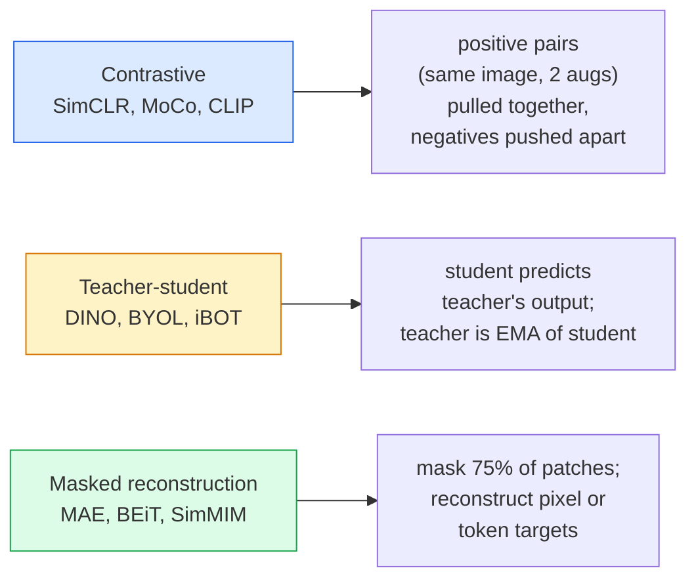

# Tự giám sát tầm nhìn  SimCLR, DINO, MAE  自监督视觉  SimCLR, DINO, MAE

> Các nhãn là nút thắt của tầm nhìn được giám sát. Việc tự giám sát trước khi tập luyện sẽ loại bỏ chúng: học các tính năng hình ảnh từ 100 triệu hình ảnh không có nhãn, điều chỉnh tinh tế trên những hình ảnh được dán nhãn 10k.

> **【中文解读】**标签是监督学习的瓶──自监督预训消除了这个限制: từ 1 tỷ张无标签图像中学习视觉特征,然后在1万张标签图像上微调──三种主流方法:SimCLR(对比学习)、DINO(自蒸)、MAE(掩码自编码器)──

> **【拓展：自监督学习是 GPT 的秘密】**GPT 就是一种 tự giám sát mô hình通过预测下一个词来学习──在视觉领域,MAE 通过预测被遮盖的补丁来学习,DINO 通过自蒸学习语义特征──DINOv2 已成为许多视觉任务的基础模型──

**Type:** Learn + Build | **类型:** 学习 + 动手
**Languages:** Python | **语言:** Python
**Prerequisites:** Phase 4 Lesson 04 (Image Classification), Phase 4 Lesson 14 (ViT) | **前置知识:** Phase 4 Lesson 04（图像分类），Phase 4 Lesson 14（ViT）
**Time:** ~75 minutes | **时间:** ~75 分钟

## Mục tiêu học tập

- Theo dõi ba gia đình tự giám sát chính  tương phản (SimCLR), giáo viên- học sinh (DINO), tái thiết bằng mặt nạ (MAE)  và nêu ra những gì mỗi gia đình tối ưu hóa
- Thực hiện một lỗ InfoNCE từ đầu và giải thích tại sao một lô 512 hoạt động nhưng một lô 32 thất bại
- Giải thích tại sao tỷ lệ che giấu 75% của MAE không tùy ý và làm thế nào nó khác với 15% của BERT đối với văn bản
- Sử dụng các điểm kiểm soát DINOv2 hoặc MAE ImageNet để thăm dò tuyến tính và lấy lại không chụp

> **【中文解读】**Mục tiêu học tập được liệt kê trong danh sách các khả năng cốt lõi cần được nắm bắt sau khi hoàn thành bài học.


## Vấn đề  vấn đề giới thiệu

ImageNet được giám sát có 1,3 triệu hình ảnh được dán nhãn, chi phí ghi chú ước tính là 10 triệu đô la. Các bộ dữ liệu y tế và công nghiệp nhỏ hơn và thậm chí còn tốn kém hơn để dán nhãn. Mỗi nhóm tầm nhìn hỏi: chúng ta có thể đào tạo trước trên dữ liệu không dán nhãn rẻ  khung hình YouTube, quét web, đoạn phim webcam, quét vệ tinh  và sau đó chỉnh lại trên một bộ nhỏ được dán nhãn?

> 监督式 ImageNet có 1.3 triệu hình ảnh nhãn hiệu, ước tính giá trị nhãn hiệu là 1.000 triệu USD.  Bộ dữ liệu y tế và công nghiệp nhỏ hơn, chi phí nhãn hiệu cao hơn.

Học tự giám sát là câu trả lời. Một ViT tự giám sát hiện đại được đào tạo trên LAION hoặc JFT đạt hoặc vượt qua độ chính xác của ImageNet được giám sát khi được điều chỉnh tốt. Nó cũng chuyển giao tốt hơn cho các nhiệm vụ tiếp theo (khám phá, phân đoạn, độ sâu) so với việc giám sát trước khi đào tạo. DINOv2 (Meta, 2023) và MAE (Meta, 2022) là các mặc định sản xuất hiện tại cho các tính năng tầm nhìn được chuyển.

> 自监督学习就是答案── 在 LAION 或 JFT 上训练的现代自监督 ViT 微调后达到或超过监督式 ImageNet 准确率──它也向下游任务(检测、分割、深度) 的迁移优于监督预训──DINOv2(Meta,2023) 和 MAE(Meta,2022) là lựa chọn mặc định hiện tại của các tính năng thị giác có thể di chuyển.

Sự thay đổi khái niệm là nhiệm vụ giả mạo  điều mô hình được đào tạo để làm  không phải là nhiệm vụ dòng chảy. Điều quan trọng là nó buộc người mẫu học được những tính năng hữu ích. Dự đoán màu sắc của hình ảnh thang xám, xoay hình ảnh và yêu cầu mô hình phân loại xoay, che đậy các đệm và tái cấu trúc chúng  tất cả đã hoạt động. Ba phương pháp tiếp cận quy mô là học tập tương phản, khử trùng giữa giáo viên và học sinh và tái thiết bằng mặt nạ.

> Sự chuyển đổi khái niệm là nhiệm vụ đặt trước mô hình được đào tạo để làm điều gì đó không nhất thiết là nhiệm vụ xuống. Điều quan trọng là nó buộc mô hình học các đặc điểm hữu ích.

## Khái niệm cốt lõi

> **【中文解读】**Bài viết này giới thiệu các khái niệm và lý thuyết cốt lõi.


### Ba gia đình



### Học học tương phản (SimCLR)

Hãy lấy một hình ảnh, áp dụng hai sự gia tăng ngẫu nhiên, có được hai lượt xem. Đưa cả hai qua cùng một bộ mã hóa cộng với đầu chiếu. Giảm thiểu một lỗ cho rằng "hai nhúng này nên gần nhau" và "những nhúng này nên xa các nhúng khác của mỗi hình ảnh trong lô".

> 取一张图像,施加两种随机增强,得到两种视图――将两者通过同一编码器加投影头――最小化一个损失函数:"Những hai嵌入应该接近"和"这个嵌入应该远离所有其他图像嵌入的集群"――

```
Loss for positive pair (z_i, z_j) among 2N views per batch:

   L_ij = -log( exp(sim(z_i, z_j) / tau) / sum_k in batch \ {i} exp(sim(z_i, z_k) / tau) )

sim = cosine similarity
tau = temperature (0.1 standard)
```

Đây là lỗ InfoNCE. Nó đòi hỏi nhiều âm tính cho mỗi tích cực, vì vậy kích thước lô quan trọng. SimCLR cần 512-8192. MoCo đã đưa ra một hàng động lực của lô trước để tách số lượng âm tính khỏi kích thước lô.

> Đó là InfoNCE 损失. Nó cần mỗi mẫu thực để đối phó với rất nhiều mẫu tiêu cực, vì vậy khối lượng là rất quan trọng.

### Giáo viên- học sinh (DINO)

Hai mạng với cùng một kiến trúc: học sinh và giáo viên. giáo viên là một trung bình di động thoáng kể (EMA) của trọng lượng của học sinh. Cả hai đều thấy các quan điểm tăng cường của hình ảnh.

> Hai mạng lưới cấu trúc giống nhau: sinh viên và giáo viên. Chỉ số trọng lượng giáo viên chuyển động trung bình.

```
loss = CE( student_output(view_1),  teacher_output(view_2) )
     + CE( student_output(view_2),  teacher_output(view_1) )

teacher_weights = m * teacher_weights + (1 - m) * student_weights   (m ≈ 0.996)
```

Tại sao nó không sụp đổ để "đáng đoán một liên tục": sản lượng của giáo viên được tập trung (giảm trung bình mỗi chiều) và sắc nét (được chia bằng nhiệt độ nhỏ).

> Tại sao không bị sập trong "đường thường tiên đoán": 化 ngăn chặn một số chiều cao chủ yếu; 化 ngăn chặn xuất phát sập trong phân bố bình thường.

DINO là những gì DINOv2 mở rộng, trên 142M hình ảnh được sắp xếp.

> DINO là nền tảng của DINOv2, mở rộng trên 1.42 tỷ张 hình ảnh chọn lọc.

### Tái thiết bị mặt nạ (MAE)

Tạ 75% các bản vá của một đầu vào ViT. Chỉ thông qua 25% hiển thị thông qua bộ mã hóa. Một bộ mã hóa nhỏ nhận được đầu ra của bộ mã hóa cộng với các token mặt nạ ở các vị trí che đậy, và được đào tạo để tái cấu trúc các pixel của các bản vá che đậy.

> 掩蔽 ViT 输入的75% 补丁──只会见到25% 通过编码器──一个小解码器接收编码器输出加上掩码位置的掩码代币,训练重建被掩盖补丁的像素──

```
Encoder:  visible 25% of patches -> features
Decoder:  features + mask tokens at masked positions -> reconstructed pixels
Loss:     MSE between reconstructed and original pixels on masked patches only
```

Các lựa chọn thiết kế chính làm cho MAE hoạt động:

> Để MAE sinh hiệu của các thiết kế quan trọng:

- **75% mask ratio** cao. buộc bộ mã hóa học các tính năng ngữ nghĩa; tái cấu trúc 25% sẽ gần như tầm thường (những pixel lân cận có liên quan đến nhau đến mức một CNN có thể đóng đinh nó).
  Trung ngữ翻译:**75% 掩码率** rất cao. 迫使编码器学习语义特征; tái tạo 25% 几乎是平凡的, một CNN 就能做到)
- **Asymmetric encoder/decoder** bộ mã hóa ViT lớn chỉ nhìn thấy các đốm có thể nhìn thấy; một bộ mã hóa nhỏ (8 lớp, 512 độ sâu) xử lý tái tạo.
  Trung ngữ翻译:**非对称编码器/解码器** ViT 编码器只看可见补丁;小型解码器(8层,512维) xử lý tái xây dựng。比朴素 BEiT 预训快3倍。
- **Pixel-space reconstruction target** đơn giản hơn mục tiêu được token hóa của BEiT và hoạt động tốt hơn trên ViT.
  Trung ngữ翻译:**像素空间重建目标**Thiết kế mục tiêu đơn giản hơn của BET, hiệu quả tốt hơn trong ViT.

Sau khi luyện tập trước, hãy loại bỏ bộ giải mã.

> 预训后丢弃解码器──编码器就是特征提取器──

### Tại sao 75% chứ không phải 15%

BERT che giấu 15% mã thông báo, MAE che giấu 75%.

> BERT 掩盖 15% token──MAE 掩盖 75%──差异在信息密度──

- Ngôn ngữ tự nhiên có độ nhập cực cao cho mỗi token. Dự đoán 15% các token vẫn khó bởi vì mỗi vị trí che giấu có nhiều hoàn thành hợp lý.
  Trung ngữ翻译:自然语言每个代币的很高――预测 15%代币的仍然困难,因为每个被掩盖的位置有很多合理补充――
- Các bản vá hình ảnh có độ entropy thấp  một khu vực không che giấu thường xác định các pixel của bản vá che giấu gần như chính xác. Để dự đoán đòi hỏi sự hiểu biết ngữ nghĩa, bạn phải che giấu một cách hung hăng.
  Trung ngữ翻译: Phương pháp sửa chữa hình ảnh 低未掩蔽的邻域通常几乎完全决定了被掩蔽的补丁的像素──

75% là đủ cao để việc trừu tượng không gian đơn giản không thể giải quyết nhiệm vụ; bộ mã hóa phải đại diện cho nội dung hình ảnh.

> 75% cao đến đơn giản không gian ngoài không thể giải quyết nhiệm vụ; bộ lập trình phải hiển thị nội dung hình ảnh.

### Đánh giá bằng thăm dò tuyến tính

Sau khi tự giám sát trước khi đào tạo, đánh giá tiêu chuẩn là một**linear probe**: đóng băng bộ mã hóa, tập trung một phân loại tuyến tính duy nhất trên trên nhãn ImageNet.

> 自监督预训练后,标准评估 là**线性探测**结编码器, 标签 标签 标签 标签 标签 标签 标签 标签 标签 标签 标签 标签 标签 标签 标签 标签 标签 标签 标签 标签 标签 标签 标签 标签 标签 标签 标签 标签 标签 标签 标签 标签 标签 标签 标签 标签 标签 标签 标签 标签 标签 标签 标签 标签 标签 标签 标签 标签 标签 标签 标签 标签 标签 标签 标签 标签 标签 标签 标签 标签 标签 标签 标签 标签 标签 标签 标签 标签 标签 标签 标签 标签 标签 标签 标签 标签 标签 标签 标签 标签 标签 标签 标签 标 标 标 标 标 标 标 标 标 标 标 标 标 标 标 标 标 标 标 标 标 标 标 标 标 标 标 标 标 标 标 标 标 标 标 标 标 标 标 标 标 标 标 标 标 标 标 标 标 标 标 标 标 标 标 标 标 标 标 标 标 标 标 标 标 标 标 标 标 标 标 标 标 标 标 标 标 标 标 标 标 标 标 标 标 标 标 标 标 标 标 标 标 标 标 标 标 标 标 标 标 标 标 标 标 标 标 标 标 标 标 标 标 标 标 标 标 标 标 标 标 标 标 标 标 标 标

- SimCLR ResNet-50: ~71% (2020)
- DINO ViT-S/16: ~77% (2021)
- MAE ViT-L/16: ~76% (2022)
- DINOv2 ViT-g/14: ~86% (2023)

Hình tra tuyến tính là một thước đo tinh khiết của chất lượng tính năng; điều chỉnh tinh tế thường thêm 2-5 điểm nhưng cũng trộn lẫn trong hiệu ứng tái tập luyện đầu.

> Khám phá đường bộ là một thước đo tinh khiết của chất lượng đặc điểm; các điều chỉnh thường tăng 2-5 điểm trăm, nhưng cũng hỗn hợp hiệu quả của tập luyện lại đầu.

> **【拓展：工业部署中的视觉系统】**Trong thực tế, mô hình hình ảnh cần phải xem xét các vấn đề về sự chậm trễ, mô hình lớn, thiết bị cạnh phù hợp, vv.

> **【拓展：数据标注与质量】**视觉任务的效果高度依赖标签数据质量――Label Studio、CVAT là công cụ标签 chính thống――在工业场景中,主动学习(Active Learning) có thể giảm chi phí đánh dấu: mô hình đối với yêu cầu mẫu không xác định


## Hãy xây dựng nó.

> **【中文解读】**本节通过代码实现核心算法从零――这种" từ đầu"的方式能帮助理解框架背后的原理,遇到问题时不会被黑盒困住――

```figure
data-augmentation
```

## Hãy xây dựng nó

### Bước 1: Đường ống tăng cường hai quan điểm

```python
import torch
import torchvision.transforms as T

two_view_train = lambda: T.Compose([
    T.RandomResizedCrop(96, scale=(0.2, 1.0)),
    T.RandomHorizontalFlip(),
    T.ColorJitter(0.4, 0.4, 0.4, 0.1),
    T.RandomGrayscale(p=0.2),
    T.ToTensor(),
])


class TwoViewDataset(torch.utils.data.Dataset):
    def __init__(self, base):
        self.base = base
        self.aug = two_view_train()

    def __len__(self):
        return len(self.base)

    def __getitem__(self, i):
        img, _ = self.base[i]
        v1 = self.aug(img)
        v2 = self.aug(img)
        return v1, v2
```

Mỗi người__getitem__trả lại hai hình ảnh tăng cường của cùng một hình ảnh; không cần nhãn.

> Mỗi lần`__getitem__`Trở lại hai hình ảnh tăng cường của cùng một hình ảnh; không cần thẻ.

### Bước 2: Lối mất InfoNCE

```python
import torch.nn.functional as F

def info_nce(z1, z2, tau=0.1):
    """
    z1, z2: (N, D) L2-normalised embeddings of paired views
    """
    N, D = z1.shape
    z = torch.cat([z1, z2], dim=0)  # (2N, D)
    sim = z @ z.T / tau              # (2N, 2N)

    mask = torch.eye(2 * N, dtype=torch.bool, device=z.device)
    sim = sim.masked_fill(mask, float("-inf"))

    targets = torch.cat([torch.arange(N, 2 * N), torch.arange(0, N)]).to(z.device)
    return F.cross_entropy(sim, targets)
```

L2 bình thường hóa các nhúng trước khi gọi. `tau=0.1`là SimCLR mặc định; thấp hơn làm cho tổn thất sắc nét hơn và đòi hỏi nhiều tiêu cực hơn.

> 调用前对嵌做 L2 归一化──`tau=0.1`SimCLR 默认值; càng thấp tổn thất càng cao, cần nhiều mẫu tiêu cực hơn.

### Bước 3: Kiểm tra tinh thần InfoNCE

```python
z1 = F.normalize(torch.randn(16, 32), dim=-1)
z2 = z1.clone()
loss_same = info_nce(z1, z2, tau=0.1).item()
z2_random = F.normalize(torch.randn(16, 32), dim=-1)
loss_random = info_nce(z1, z2_random, tau=0.1).item()
print(f"InfoNCE with identical pairs:  {loss_same:.3f}")
print(f"InfoNCE with random pairs:     {loss_random:.3f}")
```

Các cặp giống nhau nên tạo ra một tổn thất thấp (gần 0 cho một lô lớn và nhiệt độ lạnh).

> 相同对应给出低损失(大批量和冷温下接近0) ・・・随机对应应给出 log(2N-1) = ~log(31) = ~3.4(16 đối với khối lượng) ・・・

### Bước 4: Mái hóa theo phong cách MAE

```python
def random_mask_indices(num_patches, mask_ratio=0.75, seed=0):
    g = torch.Generator().manual_seed(seed)
    n_keep = int(num_patches * (1 - mask_ratio))
    perm = torch.randperm(num_patches, generator=g)
    visible = perm[:n_keep]
    masked = perm[n_keep:]
    return visible.sort().values, masked.sort().values


num_patches = 196
visible, masked = random_mask_indices(num_patches, mask_ratio=0.75)
print(f"visible: {len(visible)} / {num_patches}")
print(f"masked:  {len(masked)} / {num_patches}")
```

> **【中文解读】**Bài này sẽ trình bày cách sử dụng một khung đã phát triển như PyTorch, HuggingFace, và các khác.


Mẫu hạt giống đơn giản, nhanh chóng và xác định cho một hạt giống.

> 简单、快速、 đối với xác định của một loại giống.


> **【拓展：视觉模型的持续学习】**Trong môi trường sản xuất, mô hình hình ảnh cần phải liên tục thích ứng với dữ liệu mới.

## Hãy sử dụng nó để thực hiện

DINOv2 là tiêu chuẩn sản xuất vào năm 2026:

```python
import torch
from transformers import AutoImageProcessor, AutoModel

processor = AutoImageProcessor.from_pretrained("facebook/dinov2-base")
model = AutoModel.from_pretrained("facebook/dinov2-base")
model.eval()

# Per-image embeddings for zero-shot retrieval
with torch.no_grad():
    inputs = processor(images=[pil_image], return_tensors="pt")
    outputs = model(**inputs)
    embedding = outputs.last_hidden_state[:, 0]  # CLS token
```

Kết quả là việc nhúng 768 chiều là xương sống của việc lấy lại hình ảnh hiện đại, tương ứng dày đặc và đường ống chuyển đổi không chụp.

Đối với các bản nhúng hình ảnh văn bản, SigLIP hoặc OpenCLIP là tương đương; cho các kiểu chỉnh sửa tinh tế theo kiểu MAE, các `timm`Đưa hàng đến mọi điểm kiểm soát MAE.

> **【中文解读】**Phần này tập trung vào cách phân phối mô hình như một sản phẩm có thể sử dụng.


## Chuyển nó đi.

> **【中文解读】**练题按照 Easy/Medium/Hard 三个难度递进;;建议至少完成 级别的题目, 级别适合深入研究或面试准备;;


Bài học này mang lại:

- `outputs/prompt-ssl-pretraining-picker.md` một lời nhắc chọn SimCLR / MAE / DINOv2 với quy mô tập dữ liệu, tính toán và nhiệm vụ tiếp theo.
- `outputs/skill-linear-probe-runner.md` một kỹ năng viết đánh giá thăm dò tuyến tính cho bất kỳ bộ mã hóa đóng băng + bộ dữ liệu có nhãn.

## Tập luyện bài tập

1. **(Easy)**Kiểm tra rằng mất InfoNCE giảm khi bạn giảm nhiệt độ cho các nhúng được sắp xếp tốt và tăng khi bạn giảm nhiệt độ cho nhúng ngẫu nhiên.`tau in [0.05, 0.1, 0.2, 0.5]`Vâng thua lỗ.
2. **(Medium)**Thực hiện một bộ đệm trung tâm kiểu DINO. cho thấy rằng nếu không có trung tâm, học sinh sẽ sụp đổ thành một vector liên tục trong vài thời đại.
3. **(Hard)**Đào tạo MAE trên CIFAR-100 bằng cách sử dụng TinyUNet từ Bài học 10 như xương sống. báo cáo độ chính xác của thăm dò tuyến tính ở 10, 50 và 200 thời đại.

> **【中文解读】**Trong 术语表中的"Những gì mọi người nói" vs "Những gì nó thực sự có nghĩa" 区分日常口语和精确技术含义── 在团队协作中,统一术语定义可以避免大量沟通误解──


## Từ khóa  Từ khóa nhanh chóng

| Term | What people say | What it actually means |
|------|----------------|----------------------|
| Self-supervised | "Label-free" | A pretext task that produces useful representations from unlabelled data |
| Pretext task | "The fake task" | The objective used during SSL (reconstruct patches, match views); discarded after pretraining |
| Linear probe | "Frozen encoder + linear head" | Standard SSL evaluation: train only a linear classifier on top of frozen features |
| InfoNCE | "Contrastive loss" | softmax over cosine similarities; positive pair is the target class, all others are negatives |
| EMA teacher | "Moving-average teacher" | Teacher whose weights are an exponential moving average of the student's; used by BYOL, MoCo, DINO |
| Mask ratio | "% of patches hidden" | Fraction of patches masked during MAE; 75% for vision, 15% for text |
| Representation collapse | "Constant output" | SSL failure where the encoder outputs a constant vector for all inputs; prevented by centring, sharpening, or negatives |
| DINOv2 | "Production SSL backbone" | Meta's 2023 self-supervised ViT; strongest general-purpose image features in 2026 |

> **【中文解读】**延伸阅读 cung cấp các nguồn chất lượng cao cho việc học sâu. Những bài báo và giảng dạy này là tài liệu tham khảo cổ điển trong lĩnh vực này, phù hợp với những người đọc cần hiểu sâu hơn.


## Xem thêm 延伸阅读

- [SimCLR (Chen et al., 2020)](https://arxiv.org/abs/2002.05709) Khán giả học tập tương phản
- [DINO (Caron et al., 2021)](https://arxiv.org/abs/2104.14294) giáo viên- học sinh với động lực, tập trung, sắc nét
- [MAE (He et al., 2022)](https://arxiv.org/abs/2111.06377) Mã tự động che giấu chuẩn bị cho ViT
- [DINOv2 (Oquab et al., 2023)](https://arxiv.org/abs/2304.07193) quy mô ViT tự giám sát đến các tính năng sản xuất
