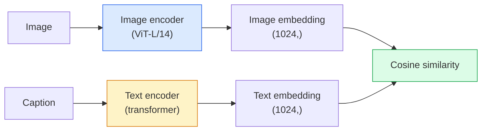

# Open-Vocabulary Vision  CLIP  开放词汇视觉  CLIP

> Hãy tập hợp mã hóa hình ảnh và mã hóa văn bản để các cặp phù hợp (phần hình ảnh, tiêu đề) đến cùng một điểm trong không gian chia sẻ. Đó là toàn bộ thủ thuật.

> **【中文解读】**CLIP cùng lúc đào tạo bộ lập trình hình ảnh và bộ lập trình văn bản, tạo ra các kết hợp (đặc biệt là hình ảnh, mô tả) đối với cùng một điểm trong không gian chia sẻ.

> **【拓展：CLIP 是多模态 AI 的基石】**CLIP là DALL-E、Stable Diffusion (định dạng văn bản)、LVA、GPT-4V và các mô hình khác.

**Type:** Build + Use | **类型:** 动手 + 应用
**Languages:** Python | **语言:** Python
**Prerequisites:** Phase 4 Lesson 14 (ViT), Phase 4 Lesson 17 (Self-Supervised) | **前置知识:** Phase 4 Lesson 14（ViT），Phase 4 Lesson 17（自监督）
**Time:** ~45 minutes | **时间:** ~45 分钟

## Mục tiêu học tập

- Giải thích kiến trúc hai tháp của CLIP và mục tiêu đào tạo tương phản
- Sử dụng CLIP (hoặc SigLIP) được đào tạo trước để phân loại không bắn mà không cần đào tạo cụ thể về nhiệm vụ
- Thực hiện phân loại chụp không từ đầu: mã hóa các class prompt, tính toán cosine tương tự, lấy argmax
- Sự phân biệt giữa CLIP, SigLIP, OpenCLIP và mô hình tầm nhìn LLaVA/LLaMA  mỗi mô hình này là gì vào năm 2026

> **【中文解读】**Mục tiêu học tập được liệt kê trong danh sách các khả năng cốt lõi cần được nắm bắt sau khi hoàn thành bài học.


## Vấn đề  vấn đề giới thiệu

Các phân loại truyền thống là từ vựng đóng kín: mô hình ImageNet lớp 1000 chỉ có thể dự đoán 1000 nhãn. Mỗi loại mới đòi hỏi dữ liệu được dán nhãn và một đầu được đào tạo lại.

> 传统分类器是封闭词汇的:1000 类的 ImageNet 模型只能预测1000 标签──每个新类都需要标签数据和重新训练的头──

CLIP (Radford et al., OpenAI 2021) cho thấy rằng đào tạo trên 400M (hình ảnh, tiêu đề) cặp được cạn ra từ web tạo ra một mô hình có thể phân loại thành bất kỳ bộ các loại nào theo suy luận, được mô tả hoàn toàn bằng ngôn ngữ tự nhiên. Bạn đưa ra một lớp học mới bằng cách viết một câu.

> CLIP(Radford 等,OpenAI 2021) cho thấy, trong 4 tỷ hình ảnh, tiêu đề được thu thập từ mạng) mô hình phát sinh từ việc đào tạo trên có thể được phân loại trong các nhóm trong các nhóm, sử dụng ngôn ngữ tự nhiên hoàn toàn để mô tả.

Khả năng chuyển đổi không ảnh là lý do tại sao mọi hệ thống thị giác hiện đại bắt đầu với một điểm kiểm soát CLIP-family. Khám phá (Grounding DINO, OWL-ViT), phân đoạn (CLIPSeg, SAM), tìm kiếm, điều chỉnh nội dung, VLM và tạo văn bản-được hình ảnh đều dựa trên nhúng chung kiểu CLIP.

> Đó là lý do tại sao mỗi hệ thống hình ảnh hiện đại đều bắt đầu từ điểm kiểm tra của CLIP.

## Khái niệm cốt lõi

> **【中文解读】**Bài viết này giới thiệu các khái niệm và lý thuyết cốt lõi.


### Hai tháp



Cả hai bộ mã hóa kết thúc bằng một dự án tuyến tính đến cùng một chiều sâu nhúng (512 cho CLIP-B/32, 1024 cho CLIP-L/14).

> Hai bộ lập trình đều được chiếu theo đường dây đến cùng một chiều kích kết thúc. CLIP-B/32 là 512 维, CLIP-L/14 là 1024 维) ⋅L2 归结后计算余弦相似度.

### Mục tiêu

Với một loạt các cặp N (hình ảnh, tiêu đề), xây dựng một matrix tương đồng NxN. Đào tạo cả hai bộ mã hóa để đường vạch (cặp phù hợp) có sự tương đồng cao và đường vạch ngoài (không phù hợp) có sự tương đồng thấp.

> 给定一批 N 个 (图像,标题) đối với, xây dựng NxN tương tự矩阵――训练两个编码器使对角线 (图像,标题) đối với (图像,标题) đối với (图像,标题) đối với (图像,标题) 构建 NxN tương tự矩阵――训练两个编码器使对角线 (图像) 匹配对) 相似度高,非对角线 (图像,标题) 不匹配对) 相似度低――

```
sim_matrix = image_embeddings @ text_embeddings.T / tau

loss_i2t = cross_entropy(sim_matrix,       targets=arange(N))
loss_t2i = cross_entropy(sim_matrix.T,     targets=arange(N))
loss = (loss_i2t + loss_t2i) / 2
```

Tương đối bởi vì cả việc lấy lại từ hình ảnh sang văn bản và văn bản sang hình ảnh đều phải hoạt động. `tau`(giảm nhiệt độ) thường được học như là một tham số scalar, khởi đầu đến 0,07.

> Đối với cái tên là vì việc kiểm tra hình ảnh đến văn bản và văn bản đến hình ảnh đều nên hiệu quả.`tau`(温度) thường là một tập toán học, khởi đầu là 0.07。

### Siglip: một tổn thất tốt hơn

SigLIP (Zhai et al., 2023) đã thay thế softmax bằng sigmoid mỗi cặp:

> SigLIP ((Zhai 等,2023) dùng từng sigmoid thay thế softmax:

```
loss = mean over pairs of log(1 + exp(-y_ij * sim_ij))
y_ij = +1 if matching, -1 otherwise
```

Thiệt hại mỗi cặp loại bỏ sự bình thường hóa cấp lô mà CLIP yêu cầu. SigLIP đào tạo tốt hơn ở kích thước lô nhỏ và phù hợp hoặc vượt quá CLIP ở dữ liệu bằng nhau.

>  giảm thiệt hại loại bỏ CLIP cần thiết phân loại phân loại phân loại.

### Định dạng không bắn

Với CLIP được đào tạo:

> 给定训练好的 CLIP:

1. Đối với mỗi lớp, soạn một lời nhắc: "một bức ảnh của một { lớp}".
   中文翻译:为每个类别构造提示词:"một bức ảnh của một {类别}"。
2. Mã hóa tất cả các lệnh lớp bằng mã hóa văn bản -> `T`hình dạng (C, d).
   中文翻译:用文本编码器编码所有类提示词 -> `T`形状 (C, d)
3. Mã hóa hình ảnh thử nghiệm -> `I`hình dạng (1, d).
   中文翻译:编码测试图像 -> `I`形状 (1, d) ⋅
4. Tương tự = `I @ T.T`hình dạng (1, C).
   Trung ngữ翻译:相似度 = `I @ T.T`形状 (1, C) ⋅
5. Argmax -> lớp dự đoán.
   Trung文翻译:Argmax -> 预测类别。

Các vấn đề kỹ thuật nhanh. OpenAI đã xuất bản 80 mẫu nhanh cho ImageNet ("một bức ảnh của {}", "một bức ảnh mờ của {}", "một bản phác thảo của {}", ...).

> 提示词工程 rất quan trọng. OpenAI cho ImageNet đã phát hành 80 mô hình gợi ý.

### Khi các mô hình CLIP được sử dụng vào năm 2026

- **Zero-shot classification** sử dụng trực tiếp.
  Trung ngữ翻译:**零样本分类**直接使用。
- **Image retrieval** mã hóa tất cả hình ảnh một lần, nhúng truy vấn tại suy luận.
  Trung ngữ翻译:**图像检索** mã hóa tất cả hình ảnh, đưa ra các yêu cầu.
- **Text-conditioned detection** Địa điểm DINO, OWL-ViT lắp một tháp văn bản CLIP xung quanh một máy dò.
  Trung ngữ翻译:**文本条件检测**Grounding DINO、OWL-ViT 在检测器外包装 CLIP 文本塔──
- **Text-conditioned segmentation** CLIPSeg; SAM sử dụng các đầu vào văn bản thông qua CLIP.
  Trung ngữ翻译:**文本条件分割**CLIPSeg;SAM 通过 CLIP 使用文本提示输入。
- **VLMs** LLaVA, Qwen-VL, InternVL dây một CLIP-chủ hình ảnh gia đình mã hóa thành một LLM.
  Trung ngữ翻译:**VLM**LLaVA、Qwen-VL、InternVL sẽ kết nối CLIP gia đình của bộ viết lập trình vào LLM。
- **Text-to-image gen** Sự pha trộn ổn định, điều kiện DALL-E 3 trên các bản ghi văn bản CLIP.
  Trung ngữ翻译:**文本到图像生成**Stable Diffusion、DALL-E 3 基于 CLIP 文本嵌入进行条件化。

Khi bạn có một không gian nhúng chung, mỗi nhiệm vụ thị giác + ngôn ngữ trở thành một tính toán khoảng cách.

> Một khi có không gian nhúng chung, mỗi nhiệm vụ hình ảnh + ngôn ngữ đều trở thành cách tính toán.

> **【中文解读】**本节通过代码实现核心算法从零――这种" từ đầu"的方式能帮助理解框架背后的原理,遇到问题时不会被黑盒困住――

> **【拓展：工业部署中的视觉系统】**Trong thực tế, mô hình hình ảnh cần phải xem xét các vấn đề về sự chậm trễ, mô hình lớn, thiết bị cạnh phù hợp, vv.

> **【拓展：数据标注与质量】**视觉任务的效果高度依赖标签数据质量――Label Studio、CVAT là công cụ标签 chính thống――在工业场景中,主动学习(Active Learning) có thể giảm chi phí đánh dấu: mô hình đối với yêu cầu mẫu không xác định


## Hãy xây dựng nó.
```figure
clip-contrastive
```

## Hãy xây dựng nó

### Bước 1: Một mô hình nhỏ hai tháp

CLIP thực sự là ViT + biến đổi. Đối với bài học này các tháp là MLP nhỏ trên các tính năng được khai thác trước để tín hiệu đào tạo được nhìn thấy trên CPU.

> CLIP thực sự là ViT + Transformer. Cây của bài học này là một MLP nhỏ trên các đặc điểm dự kiến, để có thể thấy các tín hiệu đào tạo trên CPU.

```python
import torch
import torch.nn as nn
import torch.nn.functional as F


class TwoTower(nn.Module):
    def __init__(self, img_in=128, txt_in=64, emb=64):
        super().__init__()
        self.image_proj = nn.Sequential(nn.Linear(img_in, 128), nn.ReLU(), nn.Linear(128, emb))
        self.text_proj = nn.Sequential(nn.Linear(txt_in, 128), nn.ReLU(), nn.Linear(128, emb))
        self.logit_scale = nn.Parameter(torch.ones([]) * 2.6592)  # ln(1/0.07)

    def forward(self, img_feats, txt_feats):
        i = F.normalize(self.image_proj(img_feats), dim=-1)
        t = F.normalize(self.text_proj(txt_feats), dim=-1)
        return i, t, self.logit_scale.exp()
```

Hai dự đoán, phát ra chia sẻ độ mờ, nhiệt độ học được.

> 两个投影、共享维度输出、可学习温度──与真正的Clip API 形状相同──

### Bước 2: Khối thấu

```python
def clip_loss(image_emb, text_emb, logit_scale):
    N = image_emb.size(0)
    sim = logit_scale * image_emb @ text_emb.T
    targets = torch.arange(N, device=sim.device)
    l_i = F.cross_entropy(sim, targets)
    l_t = F.cross_entropy(sim.T, targets)
    return (l_i + l_t) / 2
```

Tương đối. Skala logit_scale cao hơn = Softmax sắc nét hơn = tự tin hơn nhưng có nguy cơ bất ổn.

> Đối với称称的──更高的logit_scale = 更尖的软max = 更自信但有不稳风险──

### Bước 3: Định dạng 0-shot

```python
@torch.no_grad()
def zero_shot_classify(model, image_feats, class_text_feats, class_names):
    """
    image_feats:      (N, img_in)
    class_text_feats: (C, txt_in)   one averaged embedding per class
    """
    i = F.normalize(model.image_proj(image_feats), dim=-1)
    t = F.normalize(model.text_proj(class_text_feats), dim=-1)
    sim = i @ t.T
    pred = sim.argmax(dim=-1)
    return [class_names[p] for p in pred.tolist()]
```

Đây là thủ tục chụp không chính xác được sử dụng với một điểm kiểm soát CLIP sản xuất.

> Mỗi bước một đường. Đây là quy trình chính xác của các điểm kiểm tra CLIP cấp sản xuất.

### Bước 4: Kiểm tra sức khoẻ

```python
torch.manual_seed(0)
model = TwoTower()

img = torch.randn(8, 128)
txt = torch.randn(8, 64)
i, t, scale = model(img, txt)
loss = clip_loss(i, t, scale)
print(f"batch size: {i.size(0)}   loss: {loss.item():.3f}")
```

Lối mất sẽ gần như là `log(N) = log(8) = 2.08`cho một mô hình được khởi tạo ngẫu nhiên  mục tiêu giao hợp giao hợp khi chưa được học được cấu trúc.

> Khi mô hình khởi nghiệp bị mất thì nên gần`log(N) = log(8) = 2.08` chưa học đến cấu trúc时的对称交叉目标──

> **【中文解读】**Bài này sẽ trình bày cách sử dụng một khung đã phát triển như PyTorch, HuggingFace, và các khác.


> **【拓展：视觉模型的持续学习】**Trong môi trường sản xuất, mô hình hình ảnh cần phải liên tục thích ứng với dữ liệu mới.

## Hãy sử dụng nó để thực hiện

OpenCLIP là mặc định của cộng đồng vào năm 2026:

```python
import open_clip
import torch
from PIL import Image

model, _, preprocess = open_clip.create_model_and_transforms("ViT-B-32", pretrained="laion2b_s34b_b79k")
tokenizer = open_clip.get_tokenizer("ViT-B-32")

image = preprocess(Image.open("dog.jpg")).unsqueeze(0)
text = tokenizer(["a photo of a dog", "a photo of a cat", "a photo of a car"])

with torch.no_grad():
    image_features = model.encode_image(image)
    text_features = model.encode_text(text)
    image_features = image_features / image_features.norm(dim=-1, keepdim=True)
    text_features = text_features / text_features.norm(dim=-1, keepdim=True)
    probs = (100.0 * image_features @ text_features.T).softmax(dim=-1)

> **【中文解读】** 本节关注如何将模型部署为可用的产品。从原型到生产级系统需要考虑性能优化、错误处理、监控等多个维度。


print(probs)
```

SigLIP mới hơn, đào tạo tốt hơn ở quy mô nhỏ, và được ưa thích cho công việc mới:`google/siglip-base-patch16-224`- Nhìn cả hai mặt.


## Chuyển nó đi.

> **【中文解读】**练题按照 Easy/Medium/Hard 三个难度递进;;建议至少完成 级别的题目, 级别适合深入研究或面试准备;;


Bài học này mang lại:

- `outputs/prompt-zero-shot-class-picker.md` một lời nhắc thiết kế các mẫu lớp cho CLIP không chụp được một danh sách các lớp và một miền.
- `outputs/skill-image-text-retriever.md` một kỹ năng xây dựng một chỉ số nhúng hình ảnh với bất kỳ điểm kiểm tra CLIP nào, hỗ trợ truy vấn theo văn bản và truy vấn theo hình ảnh.

## Tập luyện bài tập

1. **(Easy)**Sử dụng một OpenCLIP ViT-B/32 được đào tạo trước và thực hiện phân loại chụp không trên CIFAR-10 với bộ yêu cầu mẫu 80.
2. **(Medium)**So sánh một mẫu đơn ("một bức ảnh của {}") so với 80 mẫu trung bình nhúng trên cùng một nhiệm vụ CIFAR-10.
3. **(Hard)**Xây dựng chỉ số lấy lại hình ảnh không chụp: nhúng 1.000 hình ảnh bằng CLIP, xây dựng chỉ số FAISS, truy vấn bằng mô tả ngôn ngữ tự nhiên. Báo cáo lấy lại recall@5 cho 20 truy vấn được giữ trong bạn viết bằng tay.

> **【中文解读】**Trong 术语表中的"Những gì mọi người nói" vs "Những gì nó thực sự có nghĩa" 区分日常口语和精确技术含义── 在团队协作中,统一术语定义可以避免大量沟通误解──


## Từ khóa  Từ khóa nhanh chóng

| Term | What people say | What it actually means |
|------|----------------|----------------------|
| Two-tower | "Dual encoder" | Separate image and text encoders ending in a shared-dim projection head |
| Zero-shot | "No task-specific training" | Classify into classes described only by text at inference; no labels touched |
| Temperature / logit_scale | "tau" | Learned scalar that scales the similarity matrix before softmax |
| Prompt template | "A photo of a {}" | Natural-language wrapper around class names; averaging many templates boosts zero-shot accuracy |
| CLIP | "Image+text model" | The 2021 OpenAI model; vocabulary of the field in 2026 |
| SigLIP | "Sigmoid CLIP" | Swaps softmax for per-pair sigmoid; trains better at small batches |
| OpenCLIP | "Open reproduction" | Community-trained CLIP variants on LAION; production default for open-source pipelines |
| VLM | "Vision-language model" | A CLIP-family encoder plus an LLM, trained to answer questions about images |

> **【中文解读】**延伸阅读 cung cấp các nguồn chất lượng cao cho việc học sâu. Những bài báo và giảng dạy này là tài liệu tham khảo cổ điển trong lĩnh vực này, phù hợp với những người đọc cần hiểu sâu hơn.


## Xem thêm 延伸阅读

- [CLIP: Learning Transferable Visual Models from Natural Language Supervision (Radford et al., 2021)](https://arxiv.org/abs/2103.00020)
- [SigLIP: Sigmoid Loss for Language-Image Pre-Training (Zhai et al., 2023)](https://arxiv.org/abs/2303.15343)
- [OpenCLIP](https://github.com/mlfoundations/open_clip) cơ sở mã cộng đồng
- [DINOv2 vs CLIP vs MAE: a features comparison](https://huggingface.co/blog/dinov2) HF hướng dẫn với các trường hợp sử dụng bên cạnh
