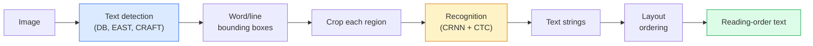

# OCR & Document Understanding OCR & Document Understanding

> OCR là một đường ống ba giai đoạn  phát hiện các hộp văn bản, nhận ra các ký tự, sau đó đặt chúng ra.

> **【中文解读】**OCR(phân tích hình ảnh (OCR) là một phần của các mô hình hình ảnh của một hệ thống OCR.

> **【拓展：文档理解的金融应用】**OCR và hiểu biết tài liệu có ứng dụng rộng rãi trong lĩnh vực tài chính: ngân hàng lưu thông, xử lý tự động hóa đơn, kiểm tra hợp đồng thông minh, phân tích báo cáo tài chính.

**Type:** Learn + Use | **类型:** 学习 + 应用
**Languages:** Python | **语言:** Python
**Prerequisites:** Phase 4 Lesson 06 (Detection), Phase 7 Lesson 02 (Self-Attention) | **前置知识:** Phase 4 Lesson 06（目标检测），Phase 7 Lesson 02（自注意力）
**Time:** ~45 minutes | **时间:** ~45 分钟

## Mục tiêu học tập

- Theo dõi đường ống OCR cổ điển (khám phá -> nhận ra -> bố cục) và các lựa chọn thay thế đầu đến cuối hiện đại (Donut, Qwen-VL-OCR)
- Thực hiện CTC (Classification Temporal Connectionist) mất mát cho đào tạo OCR theo trình tự
- Sử dụng PaddleOCR hoặc EasyOCR để phân tích tài liệu sản xuất mà không cần đào tạo
- Sự phân biệt giữa OCR, phân tích bố cục và hiểu biết tài liệu  và chọn công cụ phù hợp cho mỗi nhiệm vụ

> **【中文解读】**Mục tiêu học tập được liệt kê trong danh sách các khả năng cốt lõi cần được nắm bắt sau khi hoàn thành bài học.


## Vấn đề  vấn đề giới thiệu

Hình ảnh đầy văn bản ở khắp mọi nơi: biên lai, hóa đơn, thẻ nhận dạng, sách quét, biểu mẫu, bảng trắng, biển báo, ảnh chụp màn hình.

> ʔʔʔʔʔʔʔʔʔʔʔʔʔʔʔʔʔʔʔʔʔʔʔʔʔʔʔʔʔʔʔʔʔʔʔʔʔʔʔʔʔʔʔʔʔʔʔʔʔʔʔʔʔʔʔʔʔʔʔʔʔʔʔʔʔʔʔʔʔʔʔʔʔʔʔʔʔʔʔʔʔʔʔʔʔʔʔʔʔʔʔʔʔʔʔʔʔʔʔʔʔʔʔʔʔʔʔʔʔʔʔʔʔʔʔʔʔʔʔʔʔʔʔʔʔʔʔʔʔʔʔʔʔʔʔʔʔʔʔʔʔʔʔʔʔʔʔʔʔʔʔʔʔʔʔʔʔʔʔʔʔʔʔʔʔʔʔʔʔʔʔʔʔʔʔʔʔʔʔʔʔʔʔʔʔʔʔʔʔʔʔʔʔʔʔʔʔʔʔʔʔʔʔʔʔʔʔʔʔʔʔʔʔʔʔʔʔʔʔʔʔʔʔʔʔʔʔʔʔʔʔʔʔʔʔʔʔʔʔʔʔʔʔʔʔʔʔʔʔʔʔʔʔʔʔʔʔʔʔʔʔʔʔʔʔʔʔʔʔʔʔʔʔʔʔʔʔʔʔʔʔʔʔʔʔʔʔʔʔʔʔʔʔʔʔʔʔʔʔʔʔʔʔʔʔʔʔʔʔʔʔʔʔʔʔʔʔʔʔʔʔʔʔʔʔʔʔʔʔʔʔʔʔʔʔʔʔʔʔʔʔʔʔʔʔʔʔʔʔʔʔʔʔʔʔʔʔʔʔʔʔʔʔʔʔʔʔʔʔʔʔʔʔʔʔʔʔʔʔʔʔʔʔʔʔʔʔʔʔʔʔʔʔʔʔʔʔʔʔʔʔʔʔʔʔʔʔʔʔʔʔʔʔʔʔʔʔʔʔʔʔʔʔʔʔʔʔʔʔʔʔʔʔʔʔʔʔʔʔʔʔʔʔʔʔʔʔʔʔʔʔʔʔʔʔʔʔʔʔʔʔʔʔʔʔʔʔʔʔʔʔʔʔʔʔʔʔʔʔʔʔʔʔʔʔʔʔʔʔʔʔʔʔʔʔʔʔʔʔʔʔʔʔʔʔʔʔʔʔ

Khu vực được chia thành ba lớp kỹ năng:

> Khu vực này được chia thành ba cấp kỹ năng:

1. **OCR proper**: biến các pixel thành văn bản.
2. **Layout parsing**: nhóm OCR đầu ra theo các vùng (tít, phần, bảng, tiêu đề).
3. **Document understanding**: trích xuất các trường có cấu trúc ("invoice_total = $42.50") từ bố cục.

Mỗi lớp có những cách tiếp cận cổ điển và hiện đại, và khoảng cách giữa "Tôi muốn văn bản từ một hình ảnh" và "Tôi cần tổng số tiền từ biên lai này" lớn hơn hầu hết các nhóm nhận ra.

> Mỗi tầng đều có phương pháp cổ điển và hiện đại, sự khác biệt giữa "Tôi muốn lấy từ hình ảnh từ văn bản" và "Tôi cần tổng số tiền thu nhập này" lớn hơn so với hầu hết các nhóm nhận ra.

## Khái niệm cốt lõi

> **【中文解读】**Bài viết này giới thiệu các khái niệm và lý thuyết cốt lõi.


### Đường ống cổ điển



- **Text detection**tạo ra các hình tư tuyến mỗi dòng hoặc mỗi từ.
  Trung ngữ翻译:**文本检测**生成每行或每词的四边形框.
- **Recognition**Crops mỗi vùng ở độ cao cố định, chạy một CNN + BiLSTM + CTC để tạo ra một chuỗi nhân vật.
  Trung ngữ翻译:**识别**Cắt mỗi khu vực cho độ cao cố định, vận hành CNN + BiLSTM + CTC 生成字符序列.
- **Layout**xây dựng lại thứ tự đọc (từ trên xuống dưới, từ trái sang phải cho tiếng Latinh; khác với tiếng Ả Rập, tiếng Nhật).
  Trung ngữ翻译:**布局**重建阅读顺序(Latin文从上到下、从左到右; Arabic文和日文不同)

### CTC trong một đoạn

Việc nhận dạng OCR tạo ra một chuỗi dài biến từ một bản đồ tính năng dài cố định. CTC (Graves et al., 2006) cho phép bạn đào tạo điều này mà không cần phải sắp xếp cấp độ ký tự. Mô hình này tạo ra phân phối trên (nhữ + trống) tại mỗi bước thời gian; mất CTC làm hỏng trên tất cả các sắp xếp giảm xuống văn bản mục tiêu sau khi kết hợp lặp lại và loại bỏ trống.

> OCR nhận dạng từ các mô hình đặc điểm của độ dài cố định tạo ra chuỗi độ dài có thể thay đổi. CTC(Graves 等,2006) để bạn không cần các ký tự cấp độ để chuẩn bị sẵn sàng để tập luyện. mô hình được phân bố trên mỗi bước thời gian.

```
raw output: "h h h _ _ e e l l _ l l o _ _"
after merge repeats and remove blanks: "hello"
```

CTC là lý do CRNN đã làm việc vào năm 2015 và vẫn đào tạo hầu hết các mô hình OCR sản xuất vào năm 2026.

> CTC là CRNN đã có hiệu lực vào năm 2015 và vẫn đang đào tạo vào năm 2026 vì lý do hầu hết các mô hình OCR được sản xuất.

### Các mô hình hiện đại từ đầu đến cuối

- **Donut**(Kim et al., 2022)  một trình mã hóa ViT + một trình mã hóa văn bản; đọc một hình ảnh và phát ra JSON trực tiếp. Không có máy phát hiện văn bản, không có mô-đun bố trí.
  Trung ngữ翻译:**Donut**(Kim 等,2022) ViT 编码器 + 文本解码器;读取图像直接输出 JSON──无需文本检测器或布局模块──
- **TrOCR** ViT + máy giải mã biến thể cho OCR cấp đường.
  Trung ngữ翻译:**TrOCR**ViT + Transformer 解码器, được sử dụng cho OCR cấp 3.
- **Qwen-VL-OCR / InternVL** mô hình ngôn ngữ thị giác hoàn chỉnh được điều chỉnh cho các nhiệm vụ OCR; độ chính xác tốt nhất vào năm 2026 đối với các tài liệu phức tạp.
  Trung ngữ翻译:**Qwen-VL-OCR / InternVL**  任务微调的完整视觉语言模型;2026年在复杂文档上精度最高──
- **PaddleOCR** đường ống DB + CRNN cổ điển trong một gói sản xuất trưởng thành; vẫn là con ngựa làm việc nguồn mở.
  Trung ngữ翻译:**PaddleOCR**                                                                                                                                                                                                                                                              

Các mô hình đầu đến cuối cần nhiều dữ liệu và tính toán hơn nhưng bỏ qua sự tích lũy lỗi của đường ống nhiều giai đoạn.

> Mô hình cuối đến cuối cần nhiều dữ liệu và tính toán hơn, nhưng đã vượt qua nhiều giai đoạn của dòng chảy.

### Phân tích bố cục

Đối với các tài liệu có cấu trúc, chạy một bộ phát hiện bố trí (LayoutLMv3, DocLayNet) gắn nhãn từng khu vực: tiêu đề, đoạn, hình ảnh, bảng, ghi chú chân.

> Đối với cấu trúc tài liệu,运行布局检测器 (LayoutLMv3、DocLayNet) đánh dấu từng khu vực: tiêu đề, đoạn,图,表,脚注.

Đối với các mẫu, sử dụng **Key-Value extraction**mô hình (Donut cho tài liệu giàu thị giác, LayoutLMv3 cho quét đơn giản).

> 对于表单,使用**键值提取**模型(视觉丰富文档用 Donut,普通扫描用 LayoutLMv3)。 chúng nhận hình ảnh + 检测到的文本 + 位置,预测结构化的键值对──

### Các số liệu đánh giá

- **Character Error Rate (CER)** Khoảng cách Levenshtein / chiều dài tham chiếu. thấp hơn là tốt hơn. Mục tiêu sản xuất: < 2% trên quét sạch.
  Trung ngữ翻译:**字符错误率（CER）** 编辑距离 / 参考文本长度──越低越好──生产目标:清晰扫描上 < 2%──
- **Word Error Rate (WER)** tương tự ở mức độ từ.
  Trung ngữ翻译:**词错误率（WER）**词级别的同样标标.
- **F1 on structured fields** cho các nhiệm vụ có giá trị chính;`{invoice_total: 42.50}`xuất hiện đúng.
  Trung ngữ翻译:**结构化字段 F1**Key value task's indicator; đo lường `{invoice_total: 42.50}`Có phải đúng là xuất hiện không?
- **Edit distance on JSON** cho phân tích tài liệu từ đầu đến cuối; giấy Donut đã giới thiệu khoảng cách chỉnh sửa cây bình thường.
  Trung ngữ翻译:**JSON 编辑距离**端到端文档解析的指标;Donut 论文引入归一化树编辑距离──

> **【中文解读】**本节通过代码实现核心算法从零――这种" từ đầu"的方式能帮助理解框架背后的原理,遇到问题时不会被黑盒困住――

> **【拓展：工业部署中的视觉系统】**Trong thực tế, mô hình hình ảnh cần phải xem xét các vấn đề về sự chậm trễ, mô hình lớn, thiết bị cạnh phù hợp, vv.

> **【拓展：数据标注与质量】**视觉任务的效果高度依赖标签数据质量――Label Studio、CVAT là công cụ标签 chính thống――在工业场景中,主动学习(Active Learning) có thể giảm chi phí đánh dấu: mô hình đối với yêu cầu mẫu không xác định


## Hãy xây dựng nó.
```figure
cv3-ctc-collapse
```

## Hãy xây dựng nó

### Bước 1: mất CTC + decoder tham lam

```python
import torch
import torch.nn as nn
import torch.nn.functional as F


def ctc_loss(log_probs, targets, input_lengths, target_lengths, blank=0):
    """
    log_probs:      (T, N, C) log-softmax over vocab including blank at index 0
    targets:        (N, S) int targets (no blanks)
    input_lengths:  (N,) per-sample time steps used
    target_lengths: (N,) per-sample target length
    """
    return F.ctc_loss(log_probs, targets, input_lengths, target_lengths,
                      blank=blank, reduction="mean", zero_infinity=True)


def greedy_ctc_decode(log_probs, blank=0):
    """
    log_probs: (T, N, C) log-softmax
    returns: list of index sequences (blanks removed, repeats merged)
    """
    preds = log_probs.argmax(dim=-1).transpose(0, 1).cpu().tolist()
    out = []
    for seq in preds:
        decoded = []
        prev = None
        for idx in seq:
            if idx != prev and idx != blank:
                decoded.append(idx)
            prev = idx
        out.append(decoded)
    return out
```

`F.ctc_loss`sử dụng thực hiện CuDNN hiệu quả khi có sẵn.

> `F.ctc_loss`Trong thời gian có sẵn sử dụng hiệu quả cao CuDNN thực hiện.

### Bước 2: Máy nhận CRNN nhỏ

Mức tối thiểu CNN + BiLSTM cho OCR đường.

> Sử dụng để chạy OCR tối thiểu CNN + BiLSTM.

```python
class TinyCRNN(nn.Module):
    def __init__(self, vocab_size=40, hidden=128, feat=32):
        super().__init__()
        self.cnn = nn.Sequential(
            nn.Conv2d(1, feat, 3, 1, 1), nn.BatchNorm2d(feat), nn.ReLU(inplace=True),
            nn.MaxPool2d(2),
            nn.Conv2d(feat, feat * 2, 3, 1, 1), nn.BatchNorm2d(feat * 2), nn.ReLU(inplace=True),
            nn.MaxPool2d(2),
            nn.Conv2d(feat * 2, feat * 4, 3, 1, 1), nn.BatchNorm2d(feat * 4), nn.ReLU(inplace=True),
            nn.MaxPool2d((2, 1)),
            nn.Conv2d(feat * 4, feat * 4, 3, 1, 1), nn.BatchNorm2d(feat * 4), nn.ReLU(inplace=True),
            nn.MaxPool2d((2, 1)),
        )
        self.rnn = nn.LSTM(feat * 4, hidden, bidirectional=True, batch_first=True)
        self.head = nn.Linear(hidden * 2, vocab_size)

    def forward(self, x):
        # x: (N, 1, H, W)
        f = self.cnn(x)                # (N, C, H', W')
        f = f.mean(dim=2).transpose(1, 2)  # (N, W', C)
        h, _ = self.rnn(f)
        return F.log_softmax(self.head(h).transpose(0, 1), dim=-1)  # (W', N, vocab)
```

Lượng đầu vào cao cố định (CNN tối đa là cao đến 1).

> 固定高度输入(CNN sẽ có chiều cao tối đa được phân tích lên 1);;宽度是CTC的时间维度;;

### Bước 3: OCR tổng hợp

Tạo chuỗi chữ số đen-tín cho một thử nghiệm khói cuối đến cuối.

> 生成白底黑字符串数字字符串, dùng cho thử thuốc lá từ đầu đến cuối.

```python
import numpy as np

def synthetic_line(text, height=32, char_width=16):
    W = char_width * len(text)
    img = np.ones((height, W), dtype=np.float32)
    for i, c in enumerate(text):
        x = i * char_width
        shade = 0.0 if c.isalnum() else 0.5
        img[6:height - 6, x + 2:x + char_width - 2] = shade
    return img


def build_batch(strings, vocab):
    H = 32
    W = 16 * max(len(s) for s in strings)
    imgs = np.ones((len(strings), 1, H, W), dtype=np.float32)
    target_lengths = []
    targets = []
    for i, s in enumerate(strings):
        imgs[i, 0, :, :16 * len(s)] = synthetic_line(s)
        ids = [vocab.index(c) for c in s]
        targets.extend(ids)
        target_lengths.append(len(ids))
    return torch.from_numpy(imgs), torch.tensor(targets), torch.tensor(target_lengths)


vocab = ["_"] + list("0123456789abcdefghijklmnopqrstuvwxyz")
imgs, targets, lengths = build_batch(["hello", "world"], vocab)
print(f"images: {imgs.shape}   targets: {targets.shape}   lengths: {lengths.tolist()}")
```

Một tập dữ liệu OCR thực sự thêm phông chữ, tiếng ồn, xoay, mờ và màu sắc.

> Thực tế OCR dữ liệu tập hợp gia tăng chữ cái, tiếng ồn, xoay xoay, mùi và màu sắc.

### Bước 4: Bước vẽ đào tạo

```python
model = TinyCRNN(vocab_size=len(vocab))
opt = torch.optim.Adam(model.parameters(), lr=1e-3)

for step in range(200):
    strings = ["abc" + str(step % 10)] * 4 + ["xyz" + str((step + 1) % 10)] * 4
    imgs, targets, target_lens = build_batch(strings, vocab)
    log_probs = model(imgs)  # (W', 8, vocab)
    input_lens = torch.full((8,), log_probs.size(0), dtype=torch.long)
    loss = ctc_loss(log_probs, targets, input_lens, target_lens, blank=0)
    opt.zero_grad(); loss.backward(); opt.step()
```

> **【中文解读】**Bài này sẽ trình bày cách sử dụng một khung đã phát triển như PyTorch, HuggingFace, và các khác.


Lối mất sẽ giảm từ ~ 3 đến ~ 0,2 trên 200 bước trên dữ liệu tổng hợp tầm thường này.

> Trong dữ liệu tổng hợp đơn giản này, mất mát trong 200 bước sẽ giảm từ khoảng 3 xuống còn khoảng 0,2...


> **【拓展：视觉模型的持续学习】**Trong môi trường sản xuất, mô hình hình ảnh cần phải liên tục thích ứng với dữ liệu mới.

## Hãy sử dụng nó để thực hiện

Ba con đường sản xuất:

- **PaddleOCR** trưởng thành, nhanh chóng, đa ngôn ngữ.`paddleocr.PaddleOCR(lang="en").ocr(image_path)`- Tôi không biết.
- **EasyOCR** Python bản địa, đa ngôn ngữ, xương sống PyTorch.
- **Tesseract** cổ điển; vẫn hữu ích cho các tài liệu quét cũ khi các mô hình gặp khó khăn.

Để phân tích tài liệu từ đầu đến cuối, sử dụng Donut hoặc VLM:

```python
from transformers import DonutProcessor, VisionEncoderDecoderModel

processor = DonutProcessor.from_pretrained("naver-clova-ix/donut-base-finetuned-cord-v2")
model = VisionEncoderDecoderModel.from_pretrained("naver-clova-ix/donut-base-finetuned-cord-v2")
```

> **【中文解读】**Phần này tập trung vào cách phân phối mô hình như một sản phẩm có thể sử dụng.


Đối với biên lai, hóa đơn và biểu mẫu có cấu trúc lặp lại, chỉnh sửa Donut. Đối với tài liệu tùy tiện hoặc OCR với lý luận, một VLM như Qwen-VL-OCR là mặc định hiện tại.


## Chuyển nó đi.

> **【中文解读】**练题按照 Easy/Medium/Hard 三个难度递进;;建议至少完成 级别的题目, 级别适合深入研究或面试准备;;


Bài học này mang lại:

- `outputs/prompt-ocr-stack-picker.md` một lời nhắc chọn Tesseract / PaddleOCR / Donut / VLM-OCR cho loại tài liệu, ngôn ngữ và cấu trúc.
- `outputs/skill-ctc-decoder.md` một kỹ năng viết tham lam và tìm kiếm chùm CTC từ đầu, bao gồm cả chuẩn hóa chiều dài.

## Tập luyện bài tập

> **【中文解读】**Trong 术语表中的"Những gì mọi người nói" vs "Những gì nó thực sự có nghĩa" 区分日常口语和精确技术含义── 在团队协作中,统一术语定义可以避免大量沟通误解──


1. **(Easy)**Tập luyện TinyCRNN trên chuỗi số ngẫu nhiên 5 chữ số trong 500 bước.
2. **(Medium)**Thay thế mã hóa tham lam bằng tìm kiếm chùm (beam_width=5). báo cáo CER delta.
3. **(Hard)**Sử dụng PaddleOCR trên một tập hợp 20 biên lai, trích xuất các mục dòng, và tính F1 so với thực tại mặt đất được dán bằng tay cho cặp {item_name, price}.

## Từ khóa  Từ khóa nhanh chóng

| Term | What people say | What it actually means |
|------|----------------|----------------------|
| OCR | "Text from pixels" | Turning image regions into character sequences |
| CTC | "Alignment-free loss" | Loss that trains a sequence model without per-timestep labels; marginalises over alignments |
| CRNN | "Classic OCR model" | Conv feature extractor + BiLSTM + CTC; the 2015 baseline still used in production |
| Donut | "End-to-end OCR" | ViT encoder + text decoder; emits JSON directly from image |
| Layout parsing | "Find regions" | Detect and label Title/Table/Figure/Paragraph regions in a document |
| Reading order | "Text sequence" | Ordering of recognised regions into a sentence; trivial for Latin, non-trivial for mixed layouts |
| CER / WER | "Error rates" | Levenshtein distance / reference length at character or word granularity |
| VLM-OCR | "LLM that reads" | A vision-language model trained or prompted for OCR tasks; current SOTA on complex documents |

> **【中文解读】**延伸阅读 cung cấp các nguồn chất lượng cao cho việc học sâu. Những bài báo và giảng dạy này là tài liệu tham khảo cổ điển trong lĩnh vực này, phù hợp với những người đọc cần hiểu sâu hơn.


## Xem thêm 延伸阅读

- [CRNN (Shi et al., 2015)](https://arxiv.org/abs/1507.05717) kiến trúc CNN+RNN+CTC ban đầu
- [CTC (Graves et al., 2006)](https://www.cs.toronto.edu/~graves/icml_2006.pdf) giấy CTC gốc; dày đặc với các ý tưởng thuật toán
- [Donut (Kim et al., 2022)](https://arxiv.org/abs/2111.15664) Transformer hiểu văn bản không OCR
- [PaddleOCR](https://github.com/PaddlePaddle/PaddleOCR) bộ đống OCR sản xuất nguồn mở
