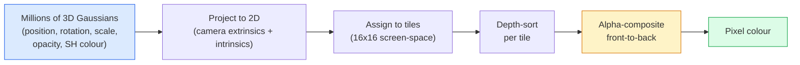

# 3D Gaussian Splating từ đầu ư

> Một cảnh là một đám mây hàng triệu Gaussians 3D. Mỗi một trong số đó có vị trí, định hướng, quy mô, độ không sáng và màu sắc phụ thuộc vào hướng xem.

> **【中文解读】**3D 高(3DGS) sử dụng hàng triệu 3D 高球 để thể hiện cảnh cảnh. Mỗi高 có vị trí, hướng, thu nhỏ, không minh bạch và màu sắc liên quan đến góc nhìn.

> **【拓展：3DGS vs NeRF】**3D Gaussian Splating là một thay thế thực tế cho NeRF. NeRF 染 chậm nhưng chất lượng cao, 3DGS  thông qua biểu hiện 3D cao đã đạt được thực tế 染, đồng thời duy trì chất lượng cao.

**Type:** Build | **类型:** 动手
**Languages:** Python | **语言:** Python
**Prerequisites:** Phase 4 Lesson 13 (3D Vision & NeRF), Phase 1 Lesson 12 (Tensor Operations), Phase 4 Lesson 10 (Diffusion basics optional) | **前置知识:** Phase 4 Lesson 13（3D 视觉与 NeRF），Phase 1 Lesson 12（张量运算），Phase 4 Lesson 10（扩散基础，可选）
**Time:** ~90 minutes | **时间:** ~90 分钟

## Mục tiêu học tập

- Giải thích tại sao 3D Gaussian Splatting thay thế NeRF như là mặc định sản xuất cho tái thiết 3D quang học vào năm 2026
- Cụ thể sáu tham số của Gaussian (nơi, vòng quay quaternion, quy mô, độ không sáng, màu sắc harmonics hình cầu, tính năng tùy chọn) và bao nhiêu floats mỗi đóng góp
- Thực hiện một 2D Gaussian splating rasterizer từ đầu sử dụng `alpha`tạo ra, sau đó hiển thị cách các dự án trường hợp 3D đến cùng một vòng lặp
- Sử dụng `nerfstudio`- `gsplat`, hoặc`SuperSplat`để tái tạo một cảnh từ 20-50 hình ảnh và xuất khẩu đến `KHR_gaussian_splatting`GLTF mở rộng hoặc OpenUSD 26.03 `UsdVolParticleField3DGaussianSplat`schema

> **【中文解读】**Mục tiêu học tập được liệt kê trong danh sách các khả năng cốt lõi cần được nắm bắt sau khi hoàn thành bài học.


## Vấn đề  vấn đề giới thiệu

Một NeRF lưu trữ một cảnh như trọng lượng của một MLP. Mỗi pixel được hiển thị là hàng trăm truy vấn MLP dọc theo một tia. Căn luyện mất nhiều giờ, hiển thị mất vài giây, và trọng lượng không thể chỉnh sửa.

> NeRF sẽ lưu trữ cảnh tượng cho trọng lượng của MLP. Mỗi hình ảnh ảnh ảnh là hàng trăm lần MLP 查询 trên đường ánh sáng.

3D Gaussian Splatting (Kerbl, Kopanas, Leimkühler, Drettakis, SIGGRAPH 2023) đã thay thế tất cả điều đó. Một cảnh là một bộ 3D Gaussians rõ ràng. Đưa ra là GPU rasterization với 100+ fps. Trình luyện chỉ mất vài phút. Việc chỉnh sửa là trực tiếp: dịch một bộ phụ Gaussians và bạn đã di chuyển ghế. Đến năm 2026, Tập đoàn Khronos đã phê chuẩn mở rộng glTF cho các khu vực Gaussian, OpenUSD 26.03 đưa ra một quy trình khu vực Gaussian, Zillow và Apartments.com đưa bất động sản với họ, và hầu hết các bài nghiên cứu mới về tái thiết 3D là biến thể về ý tưởng cốt lõi 3DGS.

> 3D 高斯(Kerbl、Kopanas、Leimkühler、Drettakis,SIGGRAPH 2023) đã thay thế tất cả những điều này.

Mô hình tâm lý đơn giản, toán học có đủ các bộ phận di chuyển mà hầu hết các giới thiệu bắt đầu với rasterisation và bỏ qua các dự đoán và hợp nhất hình cầu. Bài học này xây dựng toàn bộ thứ  một phiên bản 2D trước, sau đó là mở rộng 3D.

> Mô hình tâm trí rất đơn giản, toán học có đủ nhiều phần, hầu hết các giới thiệu từ sáng tạo bắt đầu và nhảy qua dự đoán và hàm bóng.

## Khái niệm cốt lõi

> **【中文解读】**Bài viết này giới thiệu các khái niệm và lý thuyết cốt lõi.


### Những gì một Gaussian mang

Một Gaussian 3D là một điểm thông số trong không gian với các thuộc tính sau:

```
position         mu         (3,)    centre in world coordinates
rotation         q          (4,)    unit quaternion encoding orientation
scale            s          (3,)    log-scales per axis (exponentiated at render time)
opacity          alpha      (1,)    post-sigmoid opacity [0, 1]
SH coefficients  c_lm       (3 * (L+1)^2,)   view-dependent colour
```

Chuyển đổi + quy mô tạo ra một sự khác biệt 3x3: `Sigma = R S S^T R^T`. Đó là hình dạng của Gaussian trong 3D. Harmonics hình cầu cho phép màu thay đổi với hướng xem  điểm nổi bật đậm, bóng mờ, ánh sáng phụ thuộc vào tầm nhìn  mà không lưu trữ các kết cấu mỗi góc nhìn. Với SH cấp 3 bạn nhận được 16 hệ số cho mỗi kênh màu, 48 floats cho mỗi Gaussian cho màu sắc một mình.

> Chuyển + 缩构 3x3 协方差矩阵:`Sigma = R S S^T R^T` Đó là hình dạng của Cao Cao trong 3D.  Hàm biến màu theo hướng quan sát  Hồng sáng, ánh sáng tinh tế, ánh sáng liên quan đến góc nhìn.  Không cần lưu trữ mỗi hình dạng góc nhìn.

Một cảnh thường có 1-5 triệu Gaussian. Mỗi lưu trữ khoảng 60 float (3 + 4 + 3 + 1 + 48 + mc). đó là 240 MB cho một cảnh 5 triệu Gaussian  nhỏ hơn nhiều so với đám mây điểm tương đương với kết cấu mỗi điểm, và một thứ tự quy mô nhỏ hơn trọng lượng MLP của NeRF được tái phát ở độ phân giải cao.

> Một trường hợp điển hình có 100-500 triệu điểm cao hơn. Mỗi trường hợp có khoảng 60 điểm cao hơn.

### Tăng sợi, không phóng xạ



5 bước, tất cả thân thiện với GPU, không truy vấn MLP cho mỗi pixel, một RTX 3080 Ti chỉ cung cấp 6 triệu điểm ở tốc độ 147 fps.

> 五步,全部 GPU 友好──无需每像素 MLP 查询──单张 RTX 3080 Ti 以 147 fps 染 600 万──

### Bước chiếu

Gaussian 3D ở vị trí thế giới`mu`với sự tương tác 3D `Sigma`dự án để một Gaussian 2D tại vị trí màn hình `mu'`với sự đồng hóa 2D `Sigma'`- Có thể là:

```
mu' = project(mu)
Sigma' = J W Sigma W^T J^T          (2 x 2)

W = viewing transform (rotation + translation of camera)
J = Jacobian of the perspective projection at mu'
```

Hình ảnh của Gaussian 2D là một hình elip có trục là các vector riêng của `Sigma'`Mỗi pixel bên trong elipse này nhận được sự đóng góp của Gaussian, trọng lượng là`exp(-0.5 * (p - mu')^T Sigma'^-1 (p - mu'))`- Tôi không biết.

### Quy tắc alpha-composing

Đối với một pixel, các Gaussians che phủ nó được sắp xếp ngược lại (hoặc tương đương với mặt trước ngược lại với công thức đảo ngược). Màu được tạo thành với phương trình tương tự như mọi rasteriser bán minh bạch kể từ những năm 1980:

```
C_pixel = sum_i alpha_i * T_i * c_i

T_i = prod_{j < i} (1 - alpha_j)       transmittance up to i
alpha_i = opacity_i * exp(-0.5 * d^T Sigma'^-1 d)   local contribution
c_i = eval_SH(SH_i, view_direction)    view-dependent colour
```

Đây là**the same equation as NeRF's volumetric render**, chỉ trên một tập hợp hiếm rõ ràng của Gaussians thay vì các mẫu dày đặc dọc theo một tia.

> Đó là**与 NeRF 的体积渲染方程相同**, chỉ dựa trên tập hợp hiếm cao rõ ràng chứ không phải lấy tích tích tích cực của ánh sáng.

### Tại sao điều này có thể phân biệt được

Mỗi bước  chiếu, phân bổ mảng, tổng hợp alpha, đánh giá SH  có thể phân biệt so với các tham số Gaussian. Với hình ảnh thực tại mặt đất, tính toán mất pixel được hiển thị, backprop thông qua rasteriser, cập nhật tất cả `(mu, q, s, alpha, c_lm)`Hơn 30.000 lần lặp lại, Gaussians tìm thấy vị trí, tỉ lệ và màu sắc đúng đắn của họ.

> Mỗi bước  chiếu, phân phối, alpha 合成, SH  đánh giá  đối với các tham số cao là rất nhỏ.`(mu, q, s, alpha, c_lm)`                                                                                                                                                                                                                                                              

### Thiết kế và cắt

Một tập hợp cố định của Gaussians không thể bao gồm một cảnh phức tạp.

> Số lượng cố định của cao không thể bao gồm các tình huống phức tạp.

- **Clone**một Gaussian ở vị trí hiện tại của nó khi độ lớn gradient của nó là cao nhưng quy mô của nó là nhỏ  tái thiết cần nhiều chi tiết hơn ở đây.
  Trung ngữ翻译:**克隆**Khi độ cao nhưng thu hẹp, việc xây dựng lại một tòa nhà cao cấp trong vị trí hiện tại cần nhiều chi tiết hơn.
- **Split**một Gaussian quy mô lớn thành hai loại nhỏ hơn khi độ nghiêng của nó cao  một Gaussian lớn quá mịn để phù hợp với khu vực.
  Trung ngữ翻译:**分裂**Khi có độ cao cao, phân chia thành hai vùng nhỏ hơn.
- **Prune**Gaussians mà độ không thấm của nó giảm xuống dưới ngưỡng  họ không đóng góp.
  Trung ngữ翻译:**修剪** không minh bạch thấp hơn  giá trị 高不贡献,修剪掉.

Thiết bị mật độ chạy mỗi lần lặp lại N. Một cảnh thường phát triển từ ~ 100k Gaussians ban đầu (được gieo từ các điểm SfM) đến 1-5M vào cuối đào tạo.

> 密集化每N 次代运行一次──场景通常从约10万初始高斯 (từ SfM 点播种) tăng lên đến 100-500万训练结束时──

### Các hợp nhất hình cầu trong một đoạn

Màu phụ thuộc vào hình ảnh là một hàm `c(direction)`trên một quả cầu đơn vị. Harmonics hình cầu là cơ sở Fourier của quả cầu. Truncate ở độ`L`Và anh sẽ được`(L+1)^2`Các hàm cơ bản cho mỗi kênh. Đánh giá màu cho một quan điểm mới là một sản phẩm chấm giữa các hệ số SH được học và cơ sở được đánh giá ở hướng xem. Cấp 0 = một hệ số = màu không đổi. Cấp 3 = 16 hệ số = đủ để chụp bóng của Lambertian, phản xạ bóng và nhẹ. Các giấy SD Gaussian Splatting sử dụng mức 3 theo mặc định.

### Lớp sản xuất 2026

```
1. Capture         smartphone / DJI drone / handheld scanner
2. SfM / MVS       COLMAP or GLOMAP derives camera poses + sparse points
3. Train 3DGS      nerfstudio / gsplat / inria official / PostShot (~10-30 min on RTX 4090)
4. Edit            SuperSplat / SplatForge (clean floaters, segment)
5. Export          .ply -> glTF KHR_gaussian_splatting or .usd (OpenUSD 26.03)
6. View            Cesium / Unreal / Babylon.js / Three.js / Vision Pro
```

### 4D và các biến thể tạo ra

- **4D Gaussian Splatting** Gaussians là các chức năng của thời gian; được sử dụng cho video khối lượng (Superman 2026, "Helicopter" của A$AP Rocky).
- **Generative splats** mô hình văn bản-to-splat (Marble by World Labs) mà ảo giác toàn bộ cảnh.
- **3D Gaussian Unscented Transform** NVIDIA NuRec biến thể cho mô phỏng lái xe tự động.

> **【中文解读】**本节通过代码实现核心算法从零――这种" từ đầu"的方式能帮助理解框架背后的原理,遇到问题时不会被黑盒困住――

> **【拓展：工业部署中的视觉系统】**Trong thực tế, mô hình hình ảnh cần phải xem xét các vấn đề về sự chậm trễ, mô hình lớn, thiết bị cạnh phù hợp, vv.

> **【拓展：数据标注与质量】**视觉任务的效果高度依赖标签数据质量――Label Studio、CVAT là công cụ标签 chính thống――在工业场景中,主动学习(Active Learning) có thể giảm chi phí đánh dấu: mô hình đối với yêu cầu mẫu không xác định


## Hãy xây dựng nó.
```figure
cv3-gaussian-splat
```

## Hãy xây dựng nó

### Bước 1: Một Gaussian 2D

Chúng ta xây dựng một máy phân trắc 2D trước, và trường hợp 3D giảm xuống sau khi chiếu.

```python
import torch
import torch.nn as nn
import torch.nn.functional as F


def eval_2d_gaussian(means, covs, points):
    """
    means:  (G, 2)      centres
    covs:   (G, 2, 2)   covariance matrices
    points: (H, W, 2)   pixel coordinates
    returns: (G, H, W)  density at every pixel for every Gaussian
    """
    G = means.size(0)
    H, W, _ = points.shape
    flat = points.view(-1, 2)
    inv = torch.linalg.inv(covs)
    diff = flat[None, :, :] - means[:, None, :]
    d = torch.einsum("gpi,gij,gpj->gp", diff, inv, diff)
    density = torch.exp(-0.5 * d)
    return density.view(G, H, W)
```

`einsum`làm hình hình vuông `diff^T Sigma^-1 diff`cho mỗi cặp (Gaussian, pixel).

### Bước 2: 2D splating rasteriser

Sự sâu sắc trong 2D là vô nghĩa, vì vậy chúng ta sử dụng một đường đo được học cho sự sắp xếp.

```python
def rasterise_2d(means, covs, colours, opacities, depths, image_size):
    """
    means:     (G, 2)
    covs:      (G, 2, 2)
    colours:   (G, 3)
    opacities: (G,)     in [0, 1]
    depths:    (G,)     per-Gaussian scalar used for ordering
    image_size: (H, W)
    returns:   (H, W, 3) rendered image
    """
    H, W = image_size
    yy, xx = torch.meshgrid(
        torch.arange(H, dtype=torch.float32, device=means.device),
        torch.arange(W, dtype=torch.float32, device=means.device),
        indexing="ij",
    )
    points = torch.stack([xx, yy], dim=-1)

    densities = eval_2d_gaussian(means, covs, points)
    alphas = opacities[:, None, None] * densities
    alphas = alphas.clamp(0.0, 0.99)

    order = torch.argsort(depths)
    alphas = alphas[order]
    colours_sorted = colours[order]

    T = torch.ones(H, W, device=means.device)
    out = torch.zeros(H, W, 3, device=means.device)
    for i in range(means.size(0)):
        a = alphas[i]
        out += (T * a)[..., None] * colours_sorted[i][None, None, :]
        T = T * (1.0 - a)
    return out
```

Không nhanh  một thực hiện thực sự sử dụng hạt nhân CUDA dựa trên tấm  nhưng chính xác toán học đúng và hoàn toàn khác biệt.

### Bước 3: Một cảnh phát 2D có thể được đào tạo

```python
class Splats2D(nn.Module):
    def __init__(self, num_splats=128, image_size=64, seed=0):
        super().__init__()
        g = torch.Generator().manual_seed(seed)
        H, W = image_size, image_size
        self.means = nn.Parameter(torch.rand(num_splats, 2, generator=g) * torch.tensor([W, H]))
        self.log_scale = nn.Parameter(torch.ones(num_splats, 2) * math.log(2.0))
        self.rot = nn.Parameter(torch.zeros(num_splats))  # single angle in 2D
        self.colour_logits = nn.Parameter(torch.randn(num_splats, 3, generator=g) * 0.5)
        self.opacity_logit = nn.Parameter(torch.zeros(num_splats))
        self.depth = nn.Parameter(torch.rand(num_splats, generator=g))

    def covs(self):
        s = torch.exp(self.log_scale)
        c, si = torch.cos(self.rot), torch.sin(self.rot)
        R = torch.stack([
            torch.stack([c, -si], dim=-1),
            torch.stack([si, c], dim=-1),
        ], dim=-2)
        S = torch.diag_embed(s ** 2)
        return R @ S @ R.transpose(-1, -2)

    def forward(self, image_size):
        covs = self.covs()
        colours = torch.sigmoid(self.colour_logits)
        opacities = torch.sigmoid(self.opacity_logit)
        return rasterise_2d(self.means, covs, colours, opacities, self.depth, image_size)
```

`log_scale`- `opacity_logit`, và`colour_logits`là tất cả các tham số không bị hạn chế được lập bản đồ thông qua kích hoạt đúng tại thời điểm hiển thị. Đây là mô hình tiêu chuẩn cho mỗi thực hiện 3DGS.

### Bước 4: Đưa Gaussians 2D vào hình ảnh mục tiêu

```python
import math
import numpy as np

def make_target(size=64):
    yy, xx = np.meshgrid(np.arange(size), np.arange(size), indexing="ij")
    img = np.zeros((size, size, 3), dtype=np.float32)
    # Red circle
    mask = (xx - 20) ** 2 + (yy - 20) ** 2 < 10 ** 2
    img[mask] = [1.0, 0.2, 0.2]
    # Blue square
    mask = (np.abs(xx - 45) < 8) & (np.abs(yy - 40) < 8)
    img[mask] = [0.2, 0.3, 1.0]
    return torch.from_numpy(img)


target = make_target(64)
model = Splats2D(num_splats=64, image_size=64)
opt = torch.optim.Adam(model.parameters(), lr=0.05)

for step in range(200):
    pred = model((64, 64))
    loss = F.mse_loss(pred, target)
    opt.zero_grad(); loss.backward(); opt.step()
    if step % 40 == 0:
        print(f"step {step:3d}  mse {loss.item():.4f}")
```

Hơn 200 bước, 64 Gaussians định cư vào hai hình dạng. Đó là toàn bộ ý tưởng  gradient-thấp xuống trên nguyên thủy hình học rõ ràng.

### Bước 5: Từ 2D đến 3D

Sự mở rộng 3D vẫn giữ vòng lặp tương tự.

1. Chuyển đổi Per-Gaussian là một quaternion thay vì một góc duy nhất.
2. Sự đồng tính là `R S S^T R^T`với `R`được xây dựng từ quaternion và `S = diag(exp(log_scale))`- Tôi không biết.
3. Dự án `(mu, Sigma) -> (mu', Sigma')`sử dụng các ngoại ngữ của máy ảnh và Jacobian của chiếu góc nhìn tại `mu`- Tôi không biết.
4. Màu sắc trở thành sự mở rộng của âm thanh hình cầu; đánh giá nó ở hướng nhìn.
5. Độ sâu được phân loại từ thực tế camera-không gian z thay vì một scalar học.

Mỗi việc thực hiện sản xuất (`gsplat`- `inria/gaussian-splatting`- `nerfstudio`) thực hiện chính xác điều này trên GPU với các hạt nhân CUDA dựa trên tấm.

### Bước 6: Đánh giá các hợp nhất hình cầu

Cơ sở SH lên đến mức 3 có 16 thuật ngữ cho mỗi kênh.

```python
def eval_sh_degree_3(sh_coeffs, dirs):
    """
    sh_coeffs: (..., 16, 3)   last dim is RGB channels
    dirs:      (..., 3)       unit vectors
    returns:   (..., 3)
    """
    C0 = 0.282094791773878
    C1 = 0.488602511902920
    C2 = [1.092548430592079, 1.092548430592079,
          0.315391565252520, 1.092548430592079,
          0.546274215296039]
    x, y, z = dirs[..., 0], dirs[..., 1], dirs[..., 2]
    x2, y2, z2 = x * x, y * y, z * z
    xy, yz, xz = x * y, y * z, x * z

    result = C0 * sh_coeffs[..., 0, :]
    result = result - C1 * y[..., None] * sh_coeffs[..., 1, :]
    result = result + C1 * z[..., None] * sh_coeffs[..., 2, :]
    result = result - C1 * x[..., None] * sh_coeffs[..., 3, :]

    result = result + C2[0] * xy[..., None] * sh_coeffs[..., 4, :]
    result = result + C2[1] * yz[..., None] * sh_coeffs[..., 5, :]
    result = result + C2[2] * (2.0 * z2 - x2 - y2)[..., None] * sh_coeffs[..., 6, :]
    result = result + C2[3] * xz[..., None] * sh_coeffs[..., 7, :]
    result = result + C2[4] * (x2 - y2)[..., None] * sh_coeffs[..., 8, :]

    # degree 3 terms omitted here for brevity; full 16-coefficient version in the code file
    return result
```

> **【中文解读】**Bài này sẽ trình bày cách sử dụng một khung đã phát triển như PyTorch, HuggingFace, và các khác.


Học được`sh_coeffs`lưu trữ "màu ở mọi hướng" cho Gaussian đó.


> **【拓展：视觉模型的持续学习】**Trong môi trường sản xuất, mô hình hình ảnh cần phải liên tục thích ứng với dữ liệu mới.

## Hãy sử dụng nó để thực hiện

Đối với công việc 3DGS thực sự, sử dụng `gsplat`(Meta) hoặc `nerfstudio`- Có thể là:

```bash
pip install nerfstudio gsplat
ns-download-data example
ns-train splatfacto --data path/to/data
```

`splatfacto`là huấn luyện viên 3DGS của Nerfstudio.

Các lựa chọn xuất khẩu quan trọng vào năm 2026:

- `.ply` đám mây Gaussian raw (thường được di động, file lớn nhất).
- `.splat` PlayCanvas / SuperSplat định dạng lượng tử.
- glTF `KHR_gaussian_splatting` Tiêu chuẩn Khronos, di động trên các người xem (Feb 2026 RC).
- OpenUSD `UsdVolParticleField3DGaussianSplat` USD-native, cho đường ống dẫn NVIDIA Omniverse và Vision Pro.

> **【中文解读】**Phần này tập trung vào cách phân phối mô hình như một sản phẩm có thể sử dụng.


Đối với cảnh 4D / động, `4DGS`và `Deformable-3DGS`mở rộng cùng một máy móc với các phương tiện và độ không sáng khác nhau theo thời gian.


## Chuyển nó đi.

> **【中文解读】**练题按照 Easy/Medium/Hard 三个难度递进;;建议至少完成 级别的题目, 级别适合深入研究或面试准备;;


Bài học này mang lại:

- `outputs/prompt-3dgs-capture-planner.md` một lời nhắc lên kế hoạch chụp một phiên (nước ảnh, đường dẫn máy ảnh, ánh sáng) cho một loại cảnh nhất định.
- `outputs/skill-3dgs-export-router.md` một kỹ năng chọn định dạng xuất khẩu đúng (`.ply`- `.splat`/ glTF / USD) cho người xem hoặc động cơ theo dòng chảy.

## Tập luyện bài tập

1. **(Easy)**Đưa ra bộ huấn luyện viên 2D ở trên trên một hình ảnh tổng hợp khác.`num_splats`trong `[16, 64, 256]`và biểu đồ MSE vs bước cho mỗi bước.
2. **(Medium)**Lớn ra các hình dạng 2D để hỗ trợ các màu RGB theo Gaussian phụ thuộc vào một "vòng nhìn" thang bằng một độ 2 đồng nhất.
3. **(Hard)**Tác giả`nerfstudio`và tàu`splatfacto`trên 20 bức ảnh chụp bất kỳ cảnh nào bạn có (bàn làm việc, nhà máy, khuôn mặt, phòng).`KHR_gaussian_splatting`và mở nó trong một trình xem (Three.js `GaussianSplats3D`, SuperSplat, Babylon.js V9). báo cáo thời gian tập luyện, số lượng Gaussians, và rendered fps.

> **【中文解读】**Trong 术语表中的"Những gì mọi người nói" vs "Những gì nó thực sự có nghĩa" 区分日常口语和精确技术含义── 在团队协作中,统一术语定义可以避免大量沟通误解──


## Từ khóa  Từ khóa nhanh chóng

| Term | What people say | What it actually means |
|------|----------------|----------------------|
| 3DGS | "Gaussian splats" | Explicit scene representation as millions of 3D Gaussians with per-Gaussian position, rotation, scale, opacity, SH colour |
| Covariance | "Shape of the Gaussian" | `Sigma = R S S^T R^T`; orientation and anisotropic scale of one Gaussian |
| Alpha compositing | "Back-to-front blend" | Same equation as NeRF's volumetric render, now over an explicit sparse set |
| Densification | "Clone and split" | Adaptive addition of new Gaussians where reconstruction is under-fit |
| Pruning | "Delete low-opacity" | Remove Gaussians that have collapsed to near-zero opacity during training |
| Spherical harmonics | "View-dependent colour" | Fourier basis on the sphere; stores colour as a function of viewing direction |
| Splatfacto | "nerfstudio's 3DGS" | The easiest path to training 3DGS in 2026 |
| `KHR_gaussian_splatting` | "glTF standard" | Khronos 2026 extension that makes 3DGS portable across viewers and engines |

> **【中文解读】**延伸阅读 cung cấp các nguồn chất lượng cao cho việc học sâu. Những bài báo và giảng dạy này là tài liệu tham khảo cổ điển trong lĩnh vực này, phù hợp với những người đọc cần hiểu sâu hơn.


## Xem thêm 延伸阅读

- [3D Gaussian Splatting for Real-Time Radiance Field Rendering (Kerbl et al., SIGGRAPH 2023)](https://repo-sam.inria.fr/fungraph/3d-gaussian-splatting/) giấy gốc
- [gsplat (Meta/nerfstudio)](https://github.com/nerfstudio-project/gsplat) Cân khớp CUDA chất lượng sản xuất
- [nerfstudio Splatfacto](https://docs.nerf.studio/nerfology/methods/splat.html) Công thức đào tạo tham khảo
- [Khronos KHR_gaussian_splatting extension](https://github.com/KhronosGroup/glTF/blob/main/extensions/2.0/Khronos/KHR_gaussian_splatting/README.md) định dạng di động 2026
- [OpenUSD 26.03 release notes](https://openusd.org/release/) `UsdVolParticleField3DGaussianSplat`schema
- [THE FUTURE 3D State of Gaussian Splatting 2026](https://www.thefuture3d.com/blog-0/2026/4/4/state-of-gaussian-splatting-2026) tổng quan ngành
