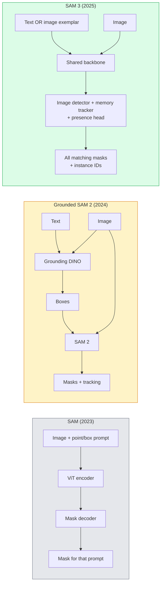

# SAM 3 & Open-Vocalory Segmentation.

> Hãy cho mô hình một lời nhắn văn bản và một hình ảnh và lấy mặt nạ cho mọi đối tượng phù hợp. SAM 3 đã làm cho nó đi một lần.

> **【中文解读】**给模型一个文本提示和一个图像,就能得到所有匹配对象的分割掩码──SAM 3(Segment Anything Model 3) sẽ biến quá trình này thành một lần tiên tiến và truyền bá──开放词汇分割突破了传统分割模型只能识别训练类的限制──

> **【拓展：SAM 的革命性影响】**SAM 系列模型(Meta 发布) là "chương trình cơ bản" trong lĩnh vực phân chia, có thể phân chia bất kỳ vật thể nào.

**Type:** Use + Build | **类型:** 应用 + 动手
**Languages:** Python | **语言:** Python
**Prerequisites:** Phase 4 Lesson 07 (U-Net), Phase 4 Lesson 08 (Mask R-CNN), Phase 4 Lesson 18 (CLIP) | **前置知识:** Phase 4 Lesson 07（U-Net），Phase 4 Lesson 08（Mask R-CNN），Phase 4 Lesson 18（CLIP）
**Time:** ~60 minutes | **时间:** ~60 分钟

## Mục tiêu học tập

- Hóa ra sự khác biệt giữa SAM (chỉ các lệnh thị giác), SAM / SAM 2 (chính giả + SAM) và SAM 3 (chính văn bản bản bản địa thông qua phân đoạn khái niệm được tính toán)
- Giải thích kiến trúc SAM 3: shared backbone + image detector + memory-based video tracker + presence head + decoupled detector-tracker design
- Sử dụng khuôn mặt ôm `transformers`SAM 3 tích hợp để phát hiện, phân đoạn và theo dõi video theo văn bản
- Chọn giữa SAM 3, SAM 2, YOLO-World và SAM-MI dựa trên độ trễ, độ phức tạp của khái niệm và mục tiêu triển khai

> **【中文解读】**Mục tiêu học tập được liệt kê trong danh sách các khả năng cốt lõi cần được nắm bắt sau khi hoàn thành bài học.


## Vấn đề  vấn đề giới thiệu

SAM 2023 là một mô hình chỉ có tính năng trực quan: bạn nhấp vào một điểm hoặc vẽ một hộp và nó trả lại một mặt nạ. Đối với "cứ cho tôi tất cả các cam màu trong bức ảnh này" bạn cần một máy dò (Grounding DINO) để tạo ra các hộp, sau đó SAM để phân đoạn mỗi hộp. SAM được đặt dưới mặt đất biến điều này thành một đường ống dẫn, nhưng nó là một loạt hai mô hình đóng băng với sự tích lũy lỗi không thể tránh khỏi.

> SAM năm 2023 là một mô hình chỉ cho thấy hình ảnh: bạn nhấp vào một điểm hoặc vẽ một khung, nó trả lại một ẩn chứa. Đối với "mở cho tôi bức ảnh này trong tất cả các con", bạn cần một máy kiểm tra để tạo ra khung, sau đó sử dụng SAM để chia từng khung.

SAM 3 (Meta, Nov 2025, ICLR 2026) đã phá vỡ hàng loạt. Nó chấp nhận một cụm từ từ ngắn hoặc một ví dụ hình ảnh như một lời nhắc và trả lại tất cả các khẩu trang phù hợp và ID ví dụ trong một lần đi trước.**Promptable Concept Segmentation (PCS)**Kết hợp với cập nhật Object Multiplex tháng 3 năm 2026 (SAM 3.1), nó theo dõi nhiều trường hợp của cùng một khái niệm thông qua video hiệu quả.

> SAM 3(Meta,2025 年 11 月,ICLR 2026) đã gấp lớp联── nó chấp nhận một shortname từ短语或图像示例作为提示, trong đơn次前向传播中返回所有匹配的掩码和实例 ID──这是**可提示概念分割（PCS）**◊结合 2026 年 3 月的 Object Multiplex 更新(SAM 3.1), nó có thể hiệu quả trong video theo dõi nhiều ví dụ về cùng một khái niệm──

Bài học này là về sự thay đổi cấu trúc mà nó đại diện cho. Seg 2D, phát hiện và hình ảnh văn bản đã hợp nhất thành một mô hình. Câu hỏi sản xuất không còn là "đường ống nào tôi chuỗi lại với nhau" mà là " mô hình dễ dàng nào xử lý trường hợp sử dụng của tôi từ đầu đến cuối".

> Bài học này nói về sự chuyển đổi cấu trúc đại diện cho nó. 2D phân chia, kiểm tra và văn bản-hình ảnh cơ sở đã được hợp nhất thành một mô hình.

## Khái niệm cốt lõi

> **【中文解读】**Bài viết này giới thiệu các khái niệm và lý thuyết cốt lõi.


### Ba thế hệ



### Phân tích khái niệm nhanh chóng

"Concept prompt" là một cụm từ từ ngắn (`"yellow school bus"`- `"striped red umbrella"`- `"hand holding a mug"`Mô hình trả lại các mặt nạ phân đoạn cho mỗi phiên bản trong hình ảnh phù hợp với khái niệm, cộng với một ID phiên bản độc đáo cho mỗi trận đấu.

> "提示概念词" là một từ ngắn gọn短语 hoặc một ví dụ hình ảnh. mô hình trở lại trong hình ảnh phù hợp với khái niệm, cộng với ID ví dụ duy nhất phù hợp với mỗi ví dụ.

Điều này khác với SAM trực quan truyền hình cổ điển theo ba cách:

> Đây là một trong những điểm khác biệt của SAM với các mô hình truyền hình cổ điển:

1. Không yêu cầu yêu cầu mỗi lần  một yêu cầu văn bản trả lại tất cả các trận đấu.
   Trung văn翻译:无需逐例提示一个文本提示返回所有匹配──
2. Từ khóa mở  khái niệm có thể là bất cứ điều gì có thể mô tả bằng ngôn ngữ tự nhiên.
   Trung ngữ翻译:开放词汇概念可以是自然语言可描述的任何东西──
3. Trả lại nhiều trường hợp cùng một lúc thay vì một mặt nạ mỗi lần nhắc.
   Trung ngữ翻译: một lần quay lại nhiều ví dụ, thay vì mỗi gợi ý một ẩn码.

### Các công trình kiến trúc quan trọng

- **Shared backbone** một ViT duy nhất xử lý hình ảnh. Cả đầu cảm biến và bộ theo dõi dựa trên bộ nhớ đọc từ nó.
  Trung ngữ翻译:**共享骨干** Một ViT  xử lý hình ảnh  kiểm tra đầu và bộ nhớ dựa trên theo dõi đều được đọc từ trong 
- **Presence head** dự đoán liệu khái niệm có hiện diện trong hình ảnh không. Giải trừ "điều này ở đây không?" từ "đi đâu?". Giảm tính dương tính sai trên các khái niệm vắng mặt.
  Trung ngữ翻译:**存在性头** dự đoán khái niệm có tồn tại trong hình ảnh. sẽ "Đây ở đây không?" và "Đây ở đâu?" giải thích.
- **Decoupled detector-tracker** Khám phá cấp hình ảnh và theo dõi cấp video có đầu riêng biệt để chúng không can thiệp.
  Trung ngữ翻译:**解耦的检测器-跟踪器** Chứng chỉ hình ảnh và theo dõi video có các tiêu đề độc lập, không gây nhiễu lẫn nhau.
- **Memory bank** lưu trữ các tính năng mỗi lần trên các khung để theo dõi video (chương tự cơ chế SAM 2 được sử dụng).
  Trung ngữ翻译:**记忆库**  lưu trữ đặc điểm của mỗi trường hợp, được sử dụng để theo dõi video(

### Việc đào tạo quy mô

SAM 3 được huấn luyện trên **4 million unique concepts**được tạo ra bởi một công cụ dữ liệu lặp đi lặp lại ghi chú và sửa chữa bằng cách sử dụng AI + đánh giá con người.**SA-CO benchmark**chứa 270K khái niệm độc đáo, lớn hơn 50 lần so với các tiêu chuẩn trước đó. SAM 3 đạt 75-80% hiệu suất của con người trên SA-CO và tăng gấp đôi các hệ thống hiện có trên hình ảnh + video PCS.

### SAM 3.1 Object Multiplex

Tháng 3 năm 2026 cập nhật: **Object Multiplex**giới thiệu một cơ chế bộ nhớ chung để theo dõi chung nhiều trường hợp cùng một khái niệm cùng một lúc. Trước đây, theo dõi N trường hợp có nghĩa là N ngân hàng bộ nhớ riêng biệt. Multiplex sụp đổ đó thành một bộ nhớ chung với các truy vấn mỗi trường hợp. Kết quả: theo dõi đa đối tượng nhanh hơn đáng kể mà không làm mất độ chính xác.

### Khi SAM đất vẫn quan trọng vào năm 2026

- Khi bạn cần một bộ dò từ khóa mở cụ thể thay vào (DINO-X, Florence-2).
- Khi giấy phép SAM 3 (được kiểm tra trên HF) là một chất chặn.
- Khi bạn cần kiểm soát nhiều hơn ngưỡng phát hiện của SAM 3.
- Đối với nghiên cứu / công việc bỏ bỏ trên thành phần máy dò.

Các đường ống mô-đun vẫn có chỗ. Đối với hầu hết các công việc sản xuất, SAM 3 là câu trả lời đơn giản hơn.

### YOLO-World vs SAM 3

- **YOLO-World** chỉ có máy dò từ vựng mở (không đeo mặt nạ). Thời gian thực.
  Trung ngữ翻译:**YOLO-World**仅开放词汇检测器 (仅开放词汇检测器) 无掩码) 实时――需要高fps 框时的最佳选择──
- **SAM 3** phân đoạn đầy đủ + theo dõi.
  Trung ngữ翻译:**SAM 3** toàn bộ chia sẻ + 跟踪──慢 hơn nhưng输出更丰富──

Phân chia sản xuất: YOLO-World cho các đường ống chỉ phát hiện nhanh (các bộ điều hướng robot, bảng điều khiển nhanh), SAM 3 cho bất cứ thứ gì cần đeo mặt nạ hoặc theo dõi.

> 生产分工:YOLO-World dùng để kiểm tra dòng nước nhanh chóng, máy bay di chuyển nhanh chóng, máy bay di chuyển nhanh chóng, máy bay di chuyển nhanh chóng, máy bay di chuyển nhanh chóng, máy bay di chuyển nhanh chóng, máy bay di chuyển nhanh chóng, máy bay di chuyển nhanh chóng, máy bay di chuyển nhanh chóng, máy bay di chuyển nhanh chóng, máy bay di chuyển nhanh chóng, máy bay di chuyển nhanh chóng, máy bay di chuyển nhanh chóng, máy bay di chuyển nhanh chóng, máy bay di chuyển nhanh chóng, máy bay di chuyển nhanh chóng, máy bay di chuyển nhanh chóng, máy bay di chuyển nhanh chóng, máy bay di chuyển nhanh chóng, máy bay di chuyển nhanh chóng, máy bay di chuyển nhanh chóng, máy bay di chuyển nhanh và máy bay di chuyển nhanh và máy bay di chuyển nhanh, máy bay di chuyển nhanh và máy bay di chuyển nhanh, máy bay di chuyển nhanh và máy bay di chuyển nhanh, máy bay di chuyển nhanh và máy bay di chuyển nhanh, máy bay di chuyển nhanh và máy bay di chuyển nhanh, máy bay di chuyển nhanh và máy bay di chuyển nhanh, máy bay di chuyển nhanh, máy bay di chuyển nhanh và máy bay di chuyển nhanh, máy bay di chuyển nhanh, máy bay di chuyển nhanh, máy bay di chuyển nhanh, máy bay di chuyển nhanh, máy bay di chuyển.

### Hiệu quả SAM-MI

SAM-MI (2025-2026) giải quyết rào cản của máy giải mã SAM.

- **Sparse point prompting** sử dụng một vài điểm được chọn tốt thay vì các lời nhắc dày đặc; giảm các cuộc gọi máy giải mã bằng 96%.
- **Shallow mask aggregation** hợp nhất dự đoán mặt nạ thô thành một mặt nạ sắc nét hơn.
- **Decoupled mask injection** Decoder nhận được tính năng mặt nạ tính toán trước thay vì chạy lại.

Kết quả: ~ 1.6x tăng tốc so với Grounded-SAM trên các tiêu chuẩn từ vựng mở.

### Khả năng phát hành cho ba mô hình

Tất cả đều trả lại cấu trúc chung tương tự (thùng + nhãn + điểm số + mặt nạ + ID), điều này hữu ích  đường ống của bạn theo dòng không phải nhánh ra mô hình chạy.

> **【拓展：工业部署中的视觉系统】**Trong thực tế, mô hình hình ảnh cần phải xem xét các vấn đề về sự chậm trễ, mô hình lớn, thiết bị cạnh phù hợp, vv.

> **【拓展：数据标注与质量】**视觉任务的效果高度依赖标签数据质量――Label Studio、CVAT là công cụ标签 chính thống――在工业场景中,主动学习(Active Learning) có thể giảm chi phí đánh dấu: mô hình đối với yêu cầu mẫu không xác định


## Hãy xây dựng nó.

> **【中文解读】**本节通过代码实现核心算法从零――这种" từ đầu"的方式能帮助理解框架背后的原理,遇到问题时不会被黑盒困住――

```figure
cv3-open-vocab
```

## Hãy xây dựng nó

### Bước 1: Xây dựng nhanh chóng

Xây dựng một trợ lý biến một câu của người dùng thành một danh sách các lời nhắc khái niệm SAM 3. Đây là ranh giới nơi "điều người dùng gõ" đáp ứng "điều mô hình tiêu thụ".

```python
def split_concepts(sentence):
    """
    Heuristic splitter for multi-concept prompts.
    Returns list of short noun phrases.
    """
    for sep in [",", ";", "and", "or", "&"]:
        if sep in sentence:
            parts = [p.strip() for p in sentence.replace("and ", ",").split(",")]
            return [p for p in parts if p]
    return [sentence.strip()]

print(split_concepts("cats, dogs and balloons"))
```

SAM 3 chấp nhận một khái niệm mỗi lần đi trước; cho các truy vấn đa khái niệm, vòng hoặc đợt chúng.

### Bước 2: Những người giúp đỡ sau khi xử lý

Hãy biến các kết quả của SAM 3 thành một danh sách sạch các phát hiện phù hợp với hợp đồng đường ống của giai đoạn 4 bài học 16.

```python
from dataclasses import dataclass
from typing import List

@dataclass
class ConceptDetection:
    concept: str
    instance_id: int
    box: tuple          # (x1, y1, x2, y2)
    score: float
    mask_rle: str       # run-length encoded


def rle_encode(binary_mask):
    flat = binary_mask.flatten().astype("uint8")
    runs = []
    prev, count = flat[0], 0
    for v in flat:
        if v == prev:
            count += 1
        else:
            runs.append((int(prev), count))
            prev, count = v, 1
    runs.append((int(prev), count))
    return ";".join(f"{v}x{c}" for v, c in runs)
```

RLE giữ tải trọng đáp ứng nhỏ ngay cả đối với nhiều mặt nạ độ phân giải cao.

### Bước 3: Một giao diện phân đoạn mở mở đơn vị

Bị bao tất cả các backend bạn có (SAM 3, Grounded SAM 2, YOLO-World + SAM 2) sau một phương pháp duy nhất. Mã dòng tiếp theo của bạn không thay đổi khi backend làm.

```python
from abc import ABC, abstractmethod
import numpy as np

class OpenVocabSeg(ABC):
    @abstractmethod
    def detect(self, image: np.ndarray, concept: str) -> List[ConceptDetection]:
        ...


class StubOpenVocabSeg(OpenVocabSeg):
    """
    Deterministic stub used for pipeline testing when real models are not loaded.
    """
    def detect(self, image, concept):
        h, w = image.shape[:2]
        return [
            ConceptDetection(
                concept=concept,
                instance_id=0,
                box=(w * 0.2, h * 0.3, w * 0.5, h * 0.8),
                score=0.89,
                mask_rle="0x100;1x50;0x200",
            ),
            ConceptDetection(
                concept=concept,
                instance_id=1,
                box=(w * 0.55, h * 0.25, w * 0.85, h * 0.75),
                score=0.74,
                mask_rle="0x80;1x40;0x220",
            ),
        ]
```

Đúng là `SAM3OpenVocabSeg`Subclass sẽ bao bì `transformers.Sam3Model`và `Sam3Processor`- Tôi không biết.

### Bước 4: Sử dụng SAM 3 (chỉ dẫn)

Đối với mô hình thực tế, `transformers`hội nhập:

```python
from transformers import Sam3Processor, Sam3Model
import torch

processor = Sam3Processor.from_pretrained("facebook/sam3")
model = Sam3Model.from_pretrained("facebook/sam3").eval()

inputs = processor(images=pil_image, return_tensors="pt")
inputs = processor.set_text_prompt(inputs, "yellow school bus")

with torch.no_grad():
    outputs = model(**inputs)

masks = processor.post_process_masks(
    outputs.masks, inputs.original_sizes, inputs.reshaped_input_sizes
)
boxes = outputs.boxes
scores = outputs.scores
```

Một lời nhắc nhở, tất cả các trận đấu đều trở lại trong một cuộc gọi.

### Bước 5: đo những gì mà Grounded SAM 2 đã cung cấp cho bạn miễn phí

Một điểm chuẩn trung thực: điều gì sẽ xảy ra khi bạn thay thế SAM 2 bằng SAM 3 trong một đường ống dẫn thực?

- Trễ: SAM 3 lưu một lần đi về phía trước (không có máy dò riêng biệt), nhưng mô hình tự nó nặng hơn; thường trung lập lưới hoặc tăng tốc nhẹ.
- Độ chính xác: SAM 3 tốt hơn đáng kể đối với các khái niệm hiếm hoặc cấu trúc ("trần sợi ô đỏ").
- Độ linh hoạt: SAM 2 được đặt nền cho phép bạn trao đổi các máy dò (DINO-X, Florence-2, DINO 1.5); SAM 3 là đơn phương.

Kết luận: SAM 3 là mặc định cho 2026 open-vocacab segment. SAM 2 được căn cứ vẫn là câu trả lời đúng khi bạn cần linh hoạt máy dò hoặc các điều khoản giấy phép khác nhau.

> **【中文解读】**Bài này sẽ trình bày cách sử dụng một khung đã phát triển như PyTorch, HuggingFace, và các khác.


> **【拓展：视觉模型的持续学习】**Trong môi trường sản xuất, mô hình hình ảnh cần phải liên tục thích ứng với dữ liệu mới.

## Hãy sử dụng nó để thực hiện

Các mô hình triển khai sản xuất:

- **Real-time annotation** SAM 3 + tính năng label-as-text-prompt của CVAT. Các nhà ghi chú chọn tên label; SAM 3 đặt nhãn trước mỗi phiên bản phù hợp. Xem lại và sửa chữa.
- **Video analytics** SAM 3.1 Object Multiplex cho việc theo dõi nhiều đối tượng; khung cung cấp cho bộ theo dõi dựa trên bộ nhớ.
- **Robotics**SAM 3 cho thao tác từ ngữ mở ("tăng lên cái cốc đỏ"); chạy như một kế hoạch sơ bộ.
- **Medical imaging** SAM 3 được điều chỉnh tốt về các khái niệm y tế; yêu cầu truy cập trên HF.

> **【中文解读】**Phần này tập trung vào cách phân phối mô hình như một sản phẩm có thể sử dụng.


Ultralytics bao gồm SAM 3 trong gói Python của nó:

```python
from ultralytics import SAM

model = SAM("sam3.pt")
results = model(image_path, prompts="yellow school bus")
```

Giống như YOLO và SAM 2.


## Chuyển nó đi.

> **【中文解读】**练题按照 Easy/Medium/Hard 三个难度递进;;建议至少完成 级别的题目, 级别适合深入研究或面试准备;;


Bài học này mang lại:

- `outputs/prompt-open-vocab-stack-picker.md` một lời nhắc chọn SAM 3 / SAM 2 / YOLO-World / SAM-MI dựa trên độ trễ, độ phức tạp của khái niệm và cấp phép.
- `outputs/skill-concept-prompt-designer.md` một kỹ năng biến các phát biểu của người dùng thành các lời nhắc khái niệm SAM 3 được hình thành tốt (các phần, không rõ ràng, thất bại).

## Tập luyện bài tập

1. **(Easy)**Lên SAM 3 trên 10 hình ảnh với các lời nhắc ý tưởng bạn chọn. So sánh với SAM 2 + Grounding DINO 1.5 trên cùng một hình ảnh. báo cáo các khái niệm mà mỗi mô hình bỏ lỡ.
2. **(Medium)**Xây dựng một UI "click-to-include / click-to-exclude" trên đầu SAM 3: một lời nhắc văn bản trả lại các trường hợp ứng cử viên; các nhấp chuột của người dùng giữ cho những người nào được tính là tích cực.
3. **(Hard)**Hoạt động tinh chỉnh SAM 3 trên một bộ khái niệm tùy chỉnh (ví dụ: 5 loại thành phần điện tử) với 20 hình ảnh được dán nhãn mỗi. So sánh với SAM 3 chụp không trên cùng bộ thử nghiệm; đo sự cải thiện của IoU mặt nạ.

> **【中文解读】**Trong 术语表中的"Những gì mọi người nói" vs "Những gì nó thực sự có nghĩa" 区分日常口语和精确技术含义── 在团队协作中,统一术语定义可以避免大量沟通误解──


## Từ khóa  Từ khóa nhanh chóng

| Term | What people say | What it actually means |
|------|----------------|----------------------|
| Open-vocabulary segmentation | "Segment by text" | Produce masks for objects described in natural language, not a fixed label set |
| PCS | "Promptable Concept Segmentation" | SAM 3's core task — given a noun-phrase or image exemplar, segment all matching instances |
| Concept prompt | "The text input" | Short noun phrase or image exemplar; not a full sentence |
| Presence head | "Is it here?" | SAM 3 module that decides whether the concept exists in the image before localisation |
| SA-CO | "SAM 3 benchmark" | 270K-concept open-vocabulary segmentation benchmark; 50x larger than prior open-vocab benchmarks |
| Object Multiplex | "SAM 3.1 update" | Shared-memory multi-object tracking; fast joint tracking of many instances |
| Grounded SAM 2 | "Modular pipeline" | Detector + SAM 2 cascade; still relevant when detector swap matters |
| SAM-MI | "Efficient SAM variant" | Mask Injection for 1.6x speedup over Grounded-SAM |

> **【中文解读】**延伸阅读 cung cấp các nguồn chất lượng cao cho việc học sâu. Những bài báo và giảng dạy này là tài liệu tham khảo cổ điển trong lĩnh vực này, phù hợp với những người đọc cần hiểu sâu hơn.


## Xem thêm 延伸阅读

- [SAM 3: Segment Anything with Concepts (arXiv 2511.16719)](https://arxiv.org/abs/2511.16719)
- [SAM 3.1 Object Multiplex (Meta AI, March 2026)](https://ai.meta.com/blog/segment-anything-model-3/)
- [SAM 3 model page on Hugging Face](https://huggingface.co/facebook/sam3)
- [Grounded SAM 2 tutorial (PyImageSearch)](https://pyimagesearch.com/2026/01/19/grounded-sam-2-from-open-set-detection-to-segmentation-and-tracking/)
- [Ultralytics SAM 3 docs](https://docs.ultralytics.com/models/sam-3/)
- [SAM3-I: Instruction-aware SAM (arXiv 2512.04585)](https://arxiv.org/abs/2512.04585)
