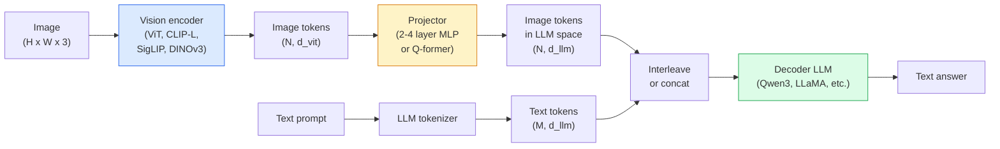

# Mô hình ngôn ngữ thị giác  Mô hình ViT-MLP-LLM 模式

> Một bộ mã hóa thị giác chuyển đổi một hình ảnh thành token. Một máy chiếu MLP lập bản đồ các token đó vào không gian nhúng của LLM. Một mô hình ngôn ngữ làm phần còn lại.

> **【中文解读】**视觉编码器 sẽ chuyển hình ảnh thành token, MLP 投影层 sẽ chuyển các token này 映射到LLM's嵌入空间,语言模型完成剩余工作──ViT-MLP-LLM là mô hình tiêu chuẩn của tất cả các mô hình ngôn ngữ thị giác sản xuất cấp VLM năm 2026  bao gồm GPT-4V、Claude 3 Vision、LLaVA 等──

> **【拓展：VLM 的应用】**VLM là một hệ thống AI đa dạng: GPT-4V(图像问答) Claude Vision(文档分析) ✓ LLaVA(开源视觉对话) ✓ Google Gemini(多模态推理)  Trong lĩnh vực tài chính, VLM có thể được sử dụng để hiểu hình ảnh tài chính、 hợp đồng, kiểm tra thông minh、 kiểm tra tài liệu tự động──

**Type:** Learn + Use | **类型:** 学习 + 应用
**Languages:** Python | **语言:** Python
**Prerequisites:** Phase 4 Lesson 14 (ViT), Phase 4 Lesson 18 (CLIP), Phase 7 Lesson 02 (Self-Attention) | **前置知识:** Phase 4 Lesson 14（ViT），Phase 4 Lesson 18（CLIP），Phase 7 Lesson 02（自注意力）
**Time:** ~75 minutes | **时间:** ~75 分钟

## Mục tiêu học tập

- Định nghĩa kiến trúc ViT-MLP-LLM và giải thích những gì mỗi trong ba thành phần đóng góp
- So sánh Qwen3-VL, InternVL3.5, LLaVA-Next và GLM-4.6V về số lượng tham số, chiều dài ngữ cảnh và hiệu suất chuẩn
- Giải thích DeepStack: tại sao các tính năng ViT đa cấp lại chặt chẽ hơn sự sắp xếp ngôn ngữ thị giác hơn một tính năng cuối cùng duy nhất
- đo ảo giác VLM trong sản xuất bằng tỷ lệ lỗi chéo-modal (CMER) và hành động theo tín hiệu

> **【中文解读】**Mục tiêu học tập được liệt kê trong danh sách các khả năng cốt lõi cần được nắm bắt sau khi hoàn thành bài học.


## Vấn đề  vấn đề giới thiệu

CLIP (Phase 4 Bài học 18) cung cấp cho bạn một không gian nhúng chung cho hình ảnh và văn bản, đủ để phân loại và lấy lại không ảnh. Nó không thể trả lời "Có bao nhiêu xe đỏ trong hình ảnh này?" vì CLIP không tạo văn bản  nó chỉ ghi điểm tương đồng.

> CLIP(đợt thứ 4 课) cho bạn không gian chia sẻ hình ảnh và văn bản, đủ để làm không có mẫu phân loại và kiểm tra. Nó không thể trả lời "Có vài xe đỏ trong lịch trình này?" vì CLIP không tạo ra văn bản. Nó chỉ đánh giá sự tương đồng.

Các mô hình ngôn ngữ tầm nhìn (VLM)  Qwen3-VL, InternVL3.5, LLaVA-Next, GLM-4.6V  kéo một mã hóa hình ảnh CLIP-family thành mô hình ngôn ngữ đầy đủ. Mô hình nhìn thấy một hình ảnh cộng với một câu hỏi và tạo ra một câu trả lời. Năm 2026, các VLM nguồn mở cạnh tranh hoặc đánh bại GPT-5 và Gemini-2.5-Pro trên các tiêu chuẩn đa phương thức (MMMU, MMBench, DocVQA, ChartQA, MathVista, OSWorld).

> 视觉语言模型(VLM) Qwen3-VL、InternVL3.5、LLaVA-Next、GLM-4.6V sẽ kết nối các mô hình lập trình của CLIP gia đình với mô hình ngôn ngữ hoàn chỉnh──模型看图像加问题并生成答案── 在 2026 年,开源 VLM 在多模态基准上匹敌或击败 GPT-5 和 Gemini-2.5-Pro──

Ba bộ phận (ViT, máy chiếu, LLM) là tiêu chuẩn. Sự khác biệt giữa các mô hình là ViT, máy chiếu nào, LLM nào, dữ liệu đào tạo và công thức sắp xếp. Một khi bạn hiểu mô hình, trao đổi bất kỳ thành phần nào là cơ học.

> Ba bộ phận: ViT, máy chiếu, LLM) là quy định tiêu chuẩn. Sự khác biệt giữa các mô hình nằm ở việc sử dụng ViT, máy chiếu, LLM, dữ liệu đào tạo và các chương trình chuẩn bị. Một khi bạn hiểu được mô hình này, thay thế bất kỳ bộ phận nào là hoạt động cơ khí.

## Khái niệm cốt lõi

> **【中文解读】**Bài viết này giới thiệu các khái niệm và lý thuyết cốt lõi.


### Kiến trúc ViT-MLP-LLM



1. **Vision encoder** một ViT được đào tạo trước (CLIP-L/14, SigLIP, DINOv3 hoặc một biến thể được điều chỉnh tốt).
   Trung ngữ翻译:**视觉编码器**预训练的 ViT(CLIP-L/14、SigLIP、DINOv3 或微调变体)
2. **Projector** một mô-đun nhỏ (2-4 lớp MLP, hoặc một Q-former) mà lập bản đồ các token thị giác vào chiều sâu nhúng của LLM. Đây là nơi mà hầu hết các điều chỉnh tinh tế xảy ra.
   Trung ngữ翻译:**投影器**小型模块 ((2-4层 MLP hoặc Q-former), sẽ được hiển thị vào các mô hình được đặt trong LLM.
3. **LLM** mô hình ngôn ngữ chỉ có trình giải mã (Qwen3, Llama, Mistral, GLM, InternLM). đọc các mã thông báo thị giác + văn bản theo trình tự, tạo văn bản.
   Trung ngữ翻译:**LLM**仅解码器语言模型(Qwen3、Llama、Mistral、GLM、InternLM) ・・・顺序读取视觉 + 文本代币,生成文本。

Cả ba bộ đều có thể đào tạo về nguyên tắc. Trong thực tế, bộ mã hóa thị giác và LLM hầu hết vẫn bị đóng băng trong khi máy chiếu đào tạo một vài tỷ tham số tín hiệu cho giá rẻ.

> Trong thực tế, bộ viết và chương trình LLM chỉ có thể đào tạo các máy chiếu để có được hàng tỷ tham số tín hiệu với chi phí thấp.

### DeepStack

Thiết kế Vanilla chỉ sử dụng lớp ViT cuối cùng. Probe Probe của DeepStack (Qwen3-VL) có tính năng từ nhiều độ sâu ViT và xếp chồng lên. Các lớp sâu hơn mang theo ngữ nghĩa cấp cao; các lớp nông hơn mang theo thông tin không gian và kết cấu hạt mỏng. Việc đưa cả hai vào LLM sẽ đóng lại khoảng cách giữa "đại hình chứa gì" (t ngữ nghĩa) và "được xác định" (tầm không gian).

> 朴素投影只使用ViT 最后一层――DeepStack(Qwen3-VL) từ nhiều ViT 深度采样特征并堆叠――更深层携带高级语义;更浅层携带细粒度空间和纹理信息――将两者都送进 LLM 弥合了"图像包含什么" (图像包含什么) 和"具体在哪里" (空间定位) 之间的差距――

### Ba giai đoạn đào tạo

Các VLM hiện đại được đào tạo theo các giai đoạn:

1. **Alignment** đóng băng ViT và LLM. Trình chỉ tập cho máy chiếu trên cặp hình ảnh-chủ đề.
   Trung ngữ翻译:**对齐**结 ViT 和 LLM── chỉ trong hình ảnh-tựa đối với trên đào tạo thâm chiếu器── dạy thâm chiếu器将视觉空间映射到语言空间──
2. **Pre-training** giải phóng mọi thứ. đào tạo trên quy mô lớn dữ liệu hình ảnh-môn ngữ (500M + cặp).
   Trung ngữ翻译:**预训练** giải mọi thứ.                                                                                                                                                                                                                                                            
3. **Instruction tuning** tinh chỉnh trên các bộ ba được sắp xếp (hình ảnh, câu hỏi, câu trả lời).
   Trung ngữ翻译:**指令微调**在精选的(图像,问题,答案) 三元组上微调──教会对话行为和任务格式──这将"视觉感知 LM"转变为可用助手──

Hầu hết các LoRA fine-tune nhắm đến giai đoạn 3 với một tập dữ liệu nhỏ được dán nhãn.

### So sánh gia đình mô hình (trước năm 2026)

| Model | Params | Vision encoder | LLM | Context | Strengths |
|-------|--------|----------------|-----|---------|-----------|
| Qwen3-VL-235B-A22B (MoE) | 235B (22B active) | custom ViT + DeepStack | Qwen3 | 256K | General SOTA, GUI agent |
| Qwen3-VL-30B-A3B (MoE) | 30B (3B active) | custom ViT + DeepStack | Qwen3 | 256K | Smaller MoE alternative |
| Qwen3-VL-8B (dense) | 8B | custom ViT | Qwen3 | 128K | Production dense default |
| InternVL3.5-38B | 38B | InternViT-6B | Qwen3 + GPT-OSS | 128K | Strong MMBench / MMVet |
| InternVL3.5-241B-A28B | 241B (28B active) | InternViT-6B | Qwen3 | 128K | Competitive with GPT-4o |
| LLaVA-Next 72B | 72B | SigLIP | Llama-3 | 32K | Open, easy to fine-tune |
| GLM-4.6V | ~70B | custom | GLM | 64K | Open-source, strong OCR |
| MiniCPM-V-2.6 | 8B | SigLIP | MiniCPM | 32K | Edge-friendly |

### Các tác nhân hình ảnh

Qwen3-VL-235B đạt được hiệu suất hàng đầu trên toàn cầu trên OSWorld  một điểm chuẩn cho **visual agents**Các mô hình này sẽ nhìn thấy một ảnh chụp màn hình, hiểu UI, và phát hành các hành động (thấp chuột, gõ, cuộn).

### Khả năng tác nhân + các biến thể RoPE

VLM cần biết**when**Qwen3-VL đã phát triển từ T-RoPE (đồng độ xoay thời gian) thành **text-based time alignment** mã thông báo văn bản dấu thời gian rõ ràng được giao với khung video. Mô hình sẽ thấy "`<timestamp 00:32>`"Thông tin của chúng ta là một sự kết hợp giữa chúng ta và các mối quan hệ thời gian.

### Vấn đề sắp xếp

12% cặp hình ảnh-tinh văn trong một bộ dữ liệu thu thập dữ liệu chứa các mô tả không hoàn toàn dựa trên hình ảnh. Một VLM được đào tạo về điều này lặng lẽ học cách ảo giác, tạo ra các đối tượng, đọc sai số, phát minh ra các mối quan hệ.

Skywork.ai giới thiệu **Cross-Modal Error Rate (CMER)**để theo dõi nó:

```
CMER = fraction of outputs where the text confidence is high but the image-text similarity (via a CLIP-family checker) is low
```

CMER cao có nghĩa là mô hình tự tin nói những điều không dựa trên hình ảnh. Giám sát CMER và xử lý nó như một KPI sản xuất cắt giảm tỷ lệ ảo giác khoảng 35% trong việc triển khai của họ. Trù không phải là "làm chính mô hình" mà "đưa các kết quả CMER cao đến đánh giá của con người".

### Hoạt động tinh chỉnh với LoRA / QLoRA

LoRA (trung 16-64) trên các lớp chú ý + máy chiếu, hoặc QLoRA với trọng lượng cơ sở 4 bit, phù hợp với một A100 / H100. Chi phí: 5.000-50.000 ví dụ,$100-$5000 trong tính toán, 2-10 giờ huấn luyện.

### Lý luận không gian vẫn còn yếu

VLM hiện tại đạt điểm 50-60% trên các điểm chuẩn lý luận không gian (tối cao-dưới, trái-người, đếm, khoảng cách). Nếu trường hợp sử dụng của bạn phụ thuộc vào "cái vật nào nằm trên đó, " xác nhận mạnh mẽ  hiệu suất VLM chung thấp hơn con người.

> **【拓展：工业部署中的视觉系统】**Trong thực tế, mô hình hình ảnh cần phải xem xét các vấn đề về sự chậm trễ, mô hình lớn, thiết bị cạnh phù hợp, vv.

> **【拓展：数据标注与质量】**视觉任务的效果高度依赖标签数据质量――Label Studio、CVAT là công cụ标签 chính thống――在工业场景中,主动学习(Active Learning) có thể giảm chi phí đánh dấu: mô hình đối với yêu cầu mẫu không xác định


## Hãy xây dựng nó.

> **【中文解读】**本节通过代码实现核心算法从零――这种" từ đầu"的方式能帮助理解框架背后的原理,遇到问题时不会被黑盒困住――

```figure
v4-vlm-projector
```

## Hãy xây dựng nó

### Bước 1: Máy chiếu

Phần mà bạn sẽ tập thường xuyên nhất. 2-4 lớp MLP với GELU.

```python
import torch
import torch.nn as nn


class Projector(nn.Module):
    def __init__(self, vit_dim=768, llm_dim=4096, hidden=4096):
        super().__init__()
        self.net = nn.Sequential(
            nn.Linear(vit_dim, hidden),
            nn.GELU(),
            nn.Linear(hidden, llm_dim),
        )

    def forward(self, x):
        return self.net(x)
```

Nhập là một `(N_patches, d_vit)`Tensor biểu tượng.`(N_patches, d_llm)`LLM xử lý mỗi dòng đầu ra như chỉ là một token khác.

### Bước 2: Lắp ráp ViT-MLP-LLM từ đầu đến cuối

Hàm xương của đường đi trước cho một VLM tối thiểu. mã thực sử dụng `transformers`; đây là thiết kế khái niệm.

```python
class MinimalVLM(nn.Module):
    def __init__(self, vit, projector, llm, image_token_id):
        super().__init__()
        self.vit = vit
        self.projector = projector
        self.llm = llm
        self.image_token_id = image_token_id  # placeholder token in text prompt

    def forward(self, image, input_ids, attention_mask):
        # 1. vision features
        vision_tokens = self.vit(image)                     # (B, N_patches, d_vit)
        vision_embeds = self.projector(vision_tokens)       # (B, N_patches, d_llm)

        # 2. text embeddings
        text_embeds = self.llm.get_input_embeddings()(input_ids)  # (B, M, d_llm)

        # 3. replace image placeholder tokens with vision embeds
        merged = self._merge(text_embeds, vision_embeds, input_ids)

        # 4. run LLM
        return self.llm(inputs_embeds=merged, attention_mask=attention_mask)

    def _merge(self, text_embeds, vision_embeds, input_ids):
        out = text_embeds.clone()
        expected = vision_embeds.size(1)
        for b in range(input_ids.size(0)):
            positions = (input_ids[b] == self.image_token_id).nonzero(as_tuple=True)[0]
            if len(positions) != expected:
                raise ValueError(
                    f"batch item {b} has {len(positions)} image tokens but vision_embeds has {expected} patches."
                    " Every sample in the batch must be pre-padded to the same number of image placeholder tokens.")
            out[b, positions] = vision_embeds[b]
        return out
```

- `<image>`Địa chỉ giữ vị trí trong văn bản được thay thế bằng các hình ảnh thực  cùng một mô hình LLaVA, Qwen-VL và InternVL sử dụng.

### Bước 3: tính toán CMER

Một kiểm tra thời gian chạy nhẹ.

```python
import torch.nn.functional as F


def cross_modal_error_rate(image_emb, text_emb, text_confidence, sim_threshold=0.25, conf_threshold=0.8):
    """
    image_emb, text_emb: embeddings of image and generated text (normalised internally)
    text_confidence:     mean per-token probability in [0, 1]
    Returns:             fraction of high-confidence outputs with low image-text alignment
    """
    image_emb = F.normalize(image_emb, dim=-1)
    text_emb = F.normalize(text_emb, dim=-1)
    sim = (image_emb * text_emb).sum(dim=-1)        # cosine similarity
    high_conf_low_sim = (text_confidence > conf_threshold) & (sim < sim_threshold)
    return high_conf_low_sim.float().mean().item()
```

Hãy coi CMER như một KPI sản xuất. Kiểm tra nó theo từng điểm cuối, mỗi loại prompt, mỗi khách hàng.

### Bước 4: Định dạng VLM đồ chơi (có thể chạy)

Hãy chứng minh các thiết bị chiếu sáng. "ViT" giả xuất hiện; một token kiểu LLM nhỏ tiên đoán một lớp học.

```python
class ToyVLM(nn.Module):
    def __init__(self, vit_dim=32, llm_dim=64, num_classes=5):
        super().__init__()
        self.projector = Projector(vit_dim, llm_dim, hidden=64)
        self.head = nn.Linear(llm_dim, num_classes)

    def forward(self, vision_tokens):
        projected = self.projector(vision_tokens)
        pooled = projected.mean(dim=1)
        return self.head(pooled)
```

> **【中文解读】**Bài này sẽ trình bày cách sử dụng một khung đã phát triển như PyTorch, HuggingFace, và các khác.


Một người có thể lắp đặt điều này trên cặp tổng hợp (chương tính, lớp) trong dưới 200 bước  đủ để cho thấy mô hình máy chiếu hoạt động.


> **【拓展：视觉模型的持续学习】**Trong môi trường sản xuất, mô hình hình ảnh cần phải liên tục thích ứng với dữ liệu mới.

## Hãy sử dụng nó để thực hiện

Ba cách mà các nhóm sản xuất sử dụng VLM vào năm 2026:

- **Hosted API**OpenAI Vision, Anthropic Claude Vision, Google Gemini Vision.
- **Open-source self-host** Qwen3-VL hoặc InternVL3.5 qua `transformers`và `vllm`- Kiểm soát đầy đủ, nỗ lực cao hơn.
- **Fine-tune on domain** tải Qwen2.5-VL-7B hoặc LLaVA-1.6-7B, LoRA trên 5k-50k ví dụ tùy chỉnh, phục vụ với `vllm`hoặc `TGI`- Tôi không biết.

```python
from transformers import AutoProcessor, AutoModelForVision2Seq
import torch
from PIL import Image

model_id = "Qwen/Qwen3-VL-8B-Instruct"
processor = AutoProcessor.from_pretrained(model_id)
model = AutoModelForVision2Seq.from_pretrained(model_id, torch_dtype=torch.bfloat16, device_map="auto")

messages = [{
    "role": "user",
    "content": [
        {"type": "image", "image": Image.open("plot.png")},
        {"type": "text", "text": "What does this chart show?"},
    ],
}]
inputs = processor.apply_chat_template(messages, add_generation_prompt=True, tokenize=True, return_dict=True, return_tensors="pt").to("cuda")
generated = model.generate(**inputs, max_new_tokens=256)
answer = processor.decode(generated[0][inputs["input_ids"].shape[1]:], skip_special_tokens=True)
```

> **【中文解读】**Phần này tập trung vào cách phân phối mô hình như một sản phẩm có thể sử dụng.


`apply_chat_template` `<image>`Tokenisation placeholder; mô hình xử lý sự sáp nhập bên trong.


## Chuyển nó đi.

> **【中文解读】**练题按照 Easy/Medium/Hard 三个难度递进;;建议至少完成 级别的题目, 级别适合深入研究或面试准备;;


Bài học này mang lại:

- `outputs/prompt-vlm-selector.md` chọn Qwen3-VL / InternVL3.5 / LLaVA-Next / API vì độ chính xác, độ trễ, chiều dài ngữ cảnh và ngân sách.
- `outputs/skill-cmer-monitor.md` phát hành mã để thiết bị một điểm cuối VLM sản xuất với tỷ lệ lỗi qua phương thức, bảng điều khiển cho mỗi điểm cuối và ngưỡng cảnh báo.

## Tập luyện bài tập

1. **(Easy)**Thực hiện ba lời nhắc ("đây là gì?", "đếm các đối tượng", "xác định cảnh") thông qua bất kỳ VLM mở nào trên năm hình ảnh. Đánh điểm mỗi câu trả lời là đúng / một phần chính xác / ảo giác bằng tay. Xét một tỷ lệ giống như CMER vượt qua đầu tiên.
2. **(Medium)**Định chỉnh Qwen2.5-VL-3B hoặc LLaVA-1.6-7B với LoRA (đứng thứ 16) trên 500 hình ảnh của một miền mục tiêu với tiêu đề. So sánh độ chính xác kiểu MMBench với 0 ảnh và độ chính xác tinh chỉnh.
3. **(Hard)**Thay thế mã hóa hình ảnh của VLM bằng DINOv3 thay vì SigLIP / CLIP mặc định. Chỉ tập luyện lại máy chiếu (LLM đóng băng + DINOv3 đóng băng).

> **【中文解读】**Trong 术语表中的"Những gì mọi người nói" vs "Những gì nó thực sự có nghĩa" 区分日常口语和精确技术含义── 在团队协作中,统一术语定义可以避免大量沟通误解──


## Từ khóa  Từ khóa nhanh chóng

| Term | What people say | What it actually means |
|------|----------------|----------------------|
| ViT-MLP-LLM | "The VLM pattern" | Vision encoder + projector + language model; every 2026 VLM |
| Projector | "The bridge" | 2-4 layer MLP (or Q-former) that maps vision tokens into LLM embedding space |
| DeepStack | "Qwen3-VL feature trick" | Multi-level ViT features stacked rather than last-layer only |
| Image token | "<image> placeholder" | Special token in the text stream replaced by projected vision embeddings |
| CMER | "Hallucination KPI" | Cross-Modal Error Rate; high when text confidence is high but image-text similarity is low |
| Visual agent | "VLM that clicks" | VLM operating GUIs (OSWorld, mobile, web) with tool calls |
| Q-former | "Fixed-count token bridge" | BLIP-2 style projector producing a fixed number of visual query tokens |
| Alignment / pre-training / instruction tuning | "Three stages" | Standard VLM training pipeline |

> **【中文解读】**延伸阅读 cung cấp các nguồn chất lượng cao cho việc học sâu. Những bài báo và giảng dạy này là tài liệu tham khảo cổ điển trong lĩnh vực này, phù hợp với những người đọc cần hiểu sâu hơn.


## Xem thêm 延伸阅读

- [Qwen3-VL Technical Report (arXiv 2511.21631)](https://arxiv.org/abs/2511.21631)
- [InternVL3.5 Advancing Open-Source Multimodal Models (arXiv 2508.18265)](https://arxiv.org/html/2508.18265v1)
- [LLaVA-Next series](https://llava-vl.github.io/blog/2024-05-10-llava-next-stronger-llms/)
- [BentoML: Best Open-Source VLMs 2026](https://www.bentoml.com/blog/multimodal-ai-a-guide-to-open-source-vision-language-models)
- [MMMU: Multi-discipline Multimodal Understanding benchmark](https://mmmu-benchmark.github.io/)
- [VLMs in manufacturing (Robotics Tomorrow, March 2026)](https://www.roboticstomorrow.com/story/2026/03/when-machines-learn-to-see-like-experts-the-rise-of-vision-language-models-in-manufacturing/26335/)
