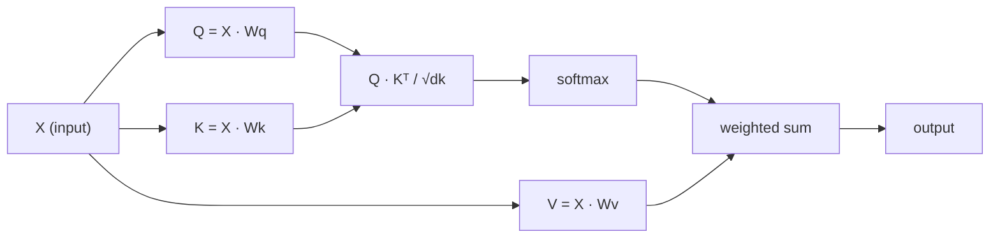

# Chú ý bản thân từ đầu
# Từ zero để thực hiện

> Sự chú ý là một bảng tìm kiếm nơi mỗi từ hỏi "Ai quan trọng với tôi?" và học được câu trả lời.

> chú ý là một bảng tìm kiếm, trong đó mỗi từ đều là câu hỏi "Ai quan trọng với tôi?"

> **【中文解读】**Sự chú ý tự chủ là cốt lõi của Transformer:Q*K^T  tính toán mỗi token đối với sự quan tâm của các token khác.

**Type:** Build | **类型:** 动手
**Language:**Python**语言:**Python
**Prerequisites:** Phase 3 (Deep Learning Core), Phase 5 Lesson 10 (Sequence-to-Sequence) | **前置知识:** 阶段 3（深度学习基础），阶段 5 第 10 课（序列到序列）
**Time:** ~90 minutes | **时间:** ~90 分钟

## Mục tiêu học tập

- Thực hiện việc tự chú ý sản phẩm điểm quy mô từ đầu chỉ sử dụng NumPy, bao gồm dự đoán truy vấn/t chìa khóa/ giá trị và tổng cân đối với softmax
  Chỉ sử dụng NumPy từ zero thực hiện tập trung điểm tích lũy tự tập trung, bao gồm truy vấn/key/value projection và softmax 加权求和
- Xây dựng một lớp chú ý nhiều đầu chia các đầu, tính toán chú ý song song và kết quả kết nối
  Xây dựng nhiều lớp chú ý, thực hiện phân chia đầu, và kết quả kết quả kết hợp
- Theo dõi cách mà các mô hình chú ý nắm bắt các mối quan hệ token và giải thích tại sao việc quy mô bằng sqrt(d_k) ngăn chặn sự bão hòa softmax
  追踪注意力矩阵 如何捕获代币 关系,并解释为什么除以平方(d_k) 能防止软max 和
- Sử dụng sự che giấu nguyên nhân để chuyển đổi sự chú ý hai chiều thành sự chú ý tự động (tương tự giải mã)
  应用因果掩码将双向注意力转换为自归归 (trái về) 解码器风格)

## Vấn đề  vấn đề giới thiệu

RNN xử lý chuỗi một token một lần. Đến khi bạn đạt token 50, thông tin từ token 1 đã được nén thông qua 50 bước nén.

> RNN  từng token  xử lý chuỗi ⋅ Khi bạn đến 50 token ⋅ khi bạn đến, thông tin từ token 1 đã được nén 50 lần ⋅ Long distance dependence được nén thành một trạng thái ẩn cố định quy mô ⋅ đây là một chai không thể giải quyết hoàn toàn của LSTM ⋅

Bài báo Bahdanau năm 2014 cho thấy sự khắc phục: để máy giải mã nhìn lại từng vị trí mã hóa và quyết định những vị trí nào quan trọng cho bước hiện tại. Nhưng nó vẫn được gắn vào một RNN. Bài báo "Trông tâm là tất cả những gì bạn cần" năm 2017 đặt ra một câu hỏi sắc bén hơn: nếu sự chú ý là cơ chế * duy nhất *? Không tái phát. Không có sự xoắn. Chỉ cần chú ý.

> Bài luận chú ý Bahdanau năm 2014 đã trình bày một phương pháp sửa chữa: để giải mã xem xét từng vị trí của máy lập trình, và quyết định những gì quan trọng đối với các bước hiện tại. Nhưng nó vẫn được thêm vào bài luận "Cơ quan là tất cả những gì bạn cần" năm 2017 đưa ra một câu hỏi cấp bách hơn: Nếu chú ý là cơ chế duy nhất của nó? Không có vòng lặp. Không có khối lượng. Chỉ có chú ý.

Sự chú ý tự tính cho phép mỗi vị trí trong một chuỗi chú ý đến mọi vị trí khác trong một bước song song.

> Từ tập trung để mỗi vị trí trong chuỗi tập trung vào tất cả các vị trí khác trong từng bước liên tục. Đó là lý do khiến Transformer nhanh chóng mở rộng và chiếm ưu thế.

> **【中文解读】**Thông tin truyền tải của RNN như truyền tải trò chơi truyền tải thông tin sau nhiều bước đã bị mất tích nghiêm trọng. Bahdanau chú ý để giải mã "lại nhìn" mỗi vị trí của bộ lập trình, nhưng vẫn phụ thuộc vào RNN.

## Khái niệm cốt lõi

### Các phân tích tìm kiếm cơ sở dữ liệu

Hãy nghĩ về sự chú ý như một tìm kiếm cơ sở dữ liệu mềm:

> Để tập trung vào hình dung một thư viện dữ liệu tìm kiếm:

```
Traditional database:
  Query: "capital of France"  -->  exact match  -->  "Paris"

Attention:
  Query: "capital of France"  -->  similarity to ALL keys  -->  weighted blend of ALL values
```

Mỗi token tạo ra ba vector:
- **Query (Q)**"Tôi đang tìm gì?"
  **查询 (Query, Q)**"Em đang tìm gì?"
- **Key (K)**"Tôi có gì trong đó?"
  **键 (Key, K)**"Em có chứa gì?"
- **Value (V)**: "Tôi cung cấp thông tin gì nếu được chọn?"
  **值 (Value, V)**"Nếu được chọn, tôi sẽ cung cấp thông tin gì?"

Kết quả điểm giữa truy vấn và tất cả các phím tạo ra điểm chú ý. Điểm cao có nghĩa là "phím này phù hợp với truy vấn của tôi".

> 查询与所有键点积产生注意分数. 高分 có nghĩa là "nhiều khóa này phù hợp với câu hỏi của tôi".

> **【中文解读】**Các phân loại cơ sở dữ liệu của chú ý là cách tốt nhất để hiểu Q/K/V. Q là "Tôi đang tìm kiếm gì", K là "Tôi có gì", V là "mối nội dung thực tế của tôi".

> **【拓展：注意力机制在真实系统中的应用】**GPT 系列 sử dụng因果自注意力(每个代币只能看到前代币);BERT sử dụng双向自注意力(每个代币能看到所有代币);交叉注意力(Cross-Attention)则在T5、Stable Diffusion等模型中连接编码器和编码器──理解Q/K/V是理解所有这些变体的基础──

### Q, K, V tính toán

Mỗi token được chiếu qua ba khối lượng được học:

> Mỗi token được đặt trong ba mô hình để chiếu:

```
Input embeddings (sequence of n tokens, each d-dimensional):

  X = [x1, x2, x3, ..., xn]       shape: (n, d)

Three weight matrices:

  Wq  shape: (d, dk)
  Wk  shape: (d, dk)
  Wv  shape: (d, dv)

Projections:

  Q = X @ Wq    shape: (n, dk)      each token's query
  K = X @ Wk    shape: (n, dk)      each token's key
  V = X @ Wv    shape: (n, dv)      each token's value
```

Nhìn chung, một dấu hiệu:

> 直观地看, đối với một biểu tượng:

```
             Wq
  x_i ------[*]------> q_i    "What am I looking for?"
       |
       |     Wk
       +----[*]------> k_i    "What do I contain?"
       |
       |     Wv
       +----[*]------> v_i    "What do I offer?"
```

### Bộ viền chú ý

Khi bạn có Q, K, V cho tất cả các token, điểm chú ý tạo thành một matrix:

> Một khi bạn có tất cả các token của Q K V, tập trung số hình thành một矩阵:

```
Scores = Q @ K^T    shape: (n, n)

              k1    k2    k3    k4    k5
        +-----+-----+-----+-----+-----+
   q1   | 2.1 | 0.3 | 0.1 | 0.8 | 0.2 |   <- how much q1 attends to each key
        +-----+-----+-----+-----+-----+
   q2   | 0.4 | 1.9 | 0.7 | 0.1 | 0.3 |
        +-----+-----+-----+-----+-----+
   q3   | 0.2 | 0.6 | 2.3 | 0.5 | 0.1 |
        +-----+-----+-----+-----+-----+
   q4   | 0.9 | 0.1 | 0.4 | 1.7 | 0.6 |
        +-----+-----+-----+-----+-----+
   q5   | 0.1 | 0.3 | 0.2 | 0.5 | 2.0 |
        +-----+-----+-----+-----+-----+

Each row: one token's attention over the entire sequence
```

### Tại sao Scale? Tại sao lại nhỏ hơn?
Xem một truy vấn tại một thời điểm lau các phím: mỗi hàng ghi điểm mỗi token, softmax biến điểm số thành trọng lượng, và vector ngữ cảnh là sự pha trộn trọng lượng của các giá trị.

```figure
attention-matrix
```

### Tại sao có quy mô?

Các sản phẩm chấm tăng trưởng với kích thước dk. Nếu dk = 64, các sản phẩm chấm có thể nằm trong phạm vi mười, đẩy softmax vào các vùng mà gradient biến mất.

> Điểm积随维度 dk 增长── Nếu dk = 64, điểm积可能在几十的范围内,将软max 推进梯度消失的区域──修复方法:除以平方(dk)──

```
Scaled scores = (Q @ K^T) / sqrt(dk)
```

Điều này giữ các giá trị trong phạm vi mà softmax tạo ra gradient hữu ích.

> Điều này giúp giá trị duy trì ở mức độ mềm tối đa có thể tạo ra một mức độ hữu ích.

> **【中文解读】**缩放因子 1/sqrt(dk) là một chi tiết quan trọng nhưng dễ bị bỏ qua.

### Softmax chuyển điểm thành trọng lượng

Softmax chuyển đổi điểm số thô thành phân bố xác suất trên mỗi hàng:

> Softmax sẽ chuyển đổi số điểm gốc thành phân bố tỷ lệ có thể xảy ra mỗi đường:

```
Raw scores for q1:   [2.1, 0.3, 0.1, 0.8, 0.2]
                            |
                         softmax
                            |
Attention weights:   [0.52, 0.09, 0.07, 0.14, 0.08]   (sums to ~1.0)
```

Bây giờ mỗi token có một bộ trọng lượng cho biết bao nhiêu để xem xét cho mỗi token khác.

> Bây giờ mỗi token đều có một nhóm quyền trọng, cho thấy mức độ quan tâm của mỗi token khác.

> **【拓展：注意力矩阵的可解释性】**注意力矩阵 (N×N) là một công cụ quan trọng trong nghiên cứu về biến thể có thể giải thích được. Thông qua trọng lượng tập trung được nhìn thấy, có thể tìm thấy mô hình học được về mô hình ngôn ngữ: những biểu tượng nào có liên quan mạnh mẽ giữa các biểu tượng. Ví dụ, từ "nó" thường tập trung rất nhiều vào các từ chỉ định của nó.

### Tóm số giá trị được cân nhắc

Kết quả cuối cùng cho mỗi token là tổng cộng trọng lượng của tất cả các vector giá trị:

> Kết quả cuối cùng của mỗi token là tăng thêm quyền truy cập của tất cả các giá trị:

```
output_i = sum( attention_weight[i][j] * v_j  for all j )

For token 1:
  output_1 = 0.52 * v1 + 0.09 * v2 + 0.07 * v3 + 0.14 * v4 + 0.08 * v5
```

### Đường ống đầy đủ.



Công thức trong một dòng:

> Một行公式:

```
Attention(Q, K, V) = softmax( Q @ K^T / sqrt(dk) ) @ V
```

## Hãy xây dựng nó.
```figure
softmax-attention-scaling
```

## Hãy xây dựng nó

### Bước 1: Softmax từ đầu  bước 1: Từ không thực hiện Softmax

Softmax chuyển đổi logits nguyên liệu thành xác suất.

> Softmax sẽ chuyển các log nguyên thủy thành tỷ lệ tỷ lệ.

```python
import numpy as np

def softmax(x):
    shifted = x - np.max(x, axis=-1, keepdims=True)
    exp_x = np.exp(shifted)
    return exp_x / np.sum(exp_x, axis=-1, keepdims=True)

logits = np.array([2.0, 1.0, 0.1])
print(f"logits:  {logits}")
print(f"softmax: {softmax(logits)}")
print(f"sum:     {softmax(logits).sum():.4f}")
```

### Bước 2: Kiểm tra điểm sản phẩm

Chức năng cốt lõi lấy các matrix Q, K, V và trả lại sự phát ra sự chú ý cộng với các matrix trọng lượng.

> 核心函数──接收 Q、K、V 矩阵, quay lại chú ý输出和权重矩阵──

```python
def scaled_dot_product_attention(Q, K, V):
    dk = Q.shape[-1]
    scores = Q @ K.T / np.sqrt(dk)
    weights = softmax(scores)
    output = weights @ V
    return output, weights
```

### Bước 3: Tập tập tập tập tập tập tập tập tập tập tập tập tập tập tập tập tập tập tập tập tập tập tập tập tập tập tập tập tập tập tập tập tập tập tập tập tập tập tập tập tập tập tập tập tập tập tập tập tập tập tập tập tập tập tập tập tập tập tập tập tập tập tập tập tập tập tập tập tập tập tập tập tập tập tập tập tập tập tập tập tập tập tập tập tập tập tập tập tập tập tập tập tập tập tập tập tập tập tập tập tập tập tập tập tập tập tập tập tập tập tập tập tập tập tập tập tập tập tập tập tập tập tập tập tập tập tập tập tập tập tập tập tập tập tập tập tập tập tập tập tập tập tập tập tập tập tập tập tập tập tập tập tập tập tập tập tập tập tập tập tập tập tập tập tập tập tập tập tập tập tập tập tập tập tập tập tập tập tập tập tập tập tập tập tập tập tập tập tập tập tập tập tập tập tập tập tập tập tập tập tập tập tập tập tập tập tập tập tập tập tập tập tập tập tập tập tập tập tập tập tập tập tập tập tập tập tập tập tập tập tập tập tập tập tập tập tập tập tập tập tập tập tập tập tập tập tập tập tập tập tập tập tập tập tập tập tập tập tập tập tập tập tập tập tập tập tập tập tập tập tập tập tập tập tập tập tập tập tập tập tập tập tập tập tập tập tập tập tập tập tập tập tập tập tập tập tập tập tập tập tập tập tập tập tập tập tập tập tập tập tập tập tập tập tập tập tập tập tập tập tập tập tập tập tập tập tập tập tập tập tập tập tập tập tập tập tập tập tập tập tập tập tập tập tập tập tập tập tập tập tập tập tập tập tập tập tập tập tập tập tập tập tập tập tập tập tập tập tập tập tập tập tập tập tập tập tập tập tập tập tập tập tập tập tập tập tập tập tập tập tập tập tập tập tập tập tập tập tập tập tập tập tập tập tập tập tập tập tập tập tập tập tập tập tập tập tập tập tập tập tập tập tập tập tập tập tập tập tập tập tập tập tập tập tập tập tập tập tập tập tập tập tập tập tập tập tập tập tập tập tập tập tập tập tập tập tập tập tập tập tập tập tập tập tập tập tập tập tập tập tập tập tập tập tập tập tập tập tập tập tập tập tập tập tập tập tập tập tập tập tập tập tập tập tập tập tập tập tập tập tập tập tập tập tập tập tập

Một mô-đun tự chú ý đầy đủ với các matrix trọng lượng Wq, Wk, Wv được khởi tạo bằng quy mô giống Xavier.

> Một mô-đun tự tập trung toàn diện, bao gồm Wq、Wk、Wv 权重矩阵, sử dụng Xavier 式缩放初始化──

```python
class SelfAttention:
    def __init__(self, d_model, dk, dv, seed=42):
        rng = np.random.default_rng(seed)
        scale = np.sqrt(2.0 / (d_model + dk))
        self.Wq = rng.normal(0, scale, (d_model, dk))
        self.Wk = rng.normal(0, scale, (d_model, dk))
        scale_v = np.sqrt(2.0 / (d_model + dv))
        self.Wv = rng.normal(0, scale_v, (d_model, dv))
        self.dk = dk

    def forward(self, X):
        Q = X @ self.Wq
        K = X @ self.Wk
        V = X @ self.Wv
        output, weights = scaled_dot_product_attention(Q, K, V)
        return output, weights
```

### Bước 4: Đọc theo một câu. Bước 4: Đọc trên câu.

Tạo những bản nhúng giả cho một câu và xem trọng lượng sự chú ý.

> Để tạo ra một câu giả mạo, quan sát trọng quyền trọng.

```python
sentence = ["The", "cat", "sat", "on", "the", "mat"]
n_tokens = len(sentence)
d_model = 8
dk = 4
dv = 4

rng = np.random.default_rng(42)
X = rng.normal(0, 1, (n_tokens, d_model))

attn = SelfAttention(d_model, dk, dv, seed=42)
output, weights = attn.forward(X)

print("Attention weights (each row: where that token looks):\n")
print(f"{'':>6}", end="")
for token in sentence:
    print(f"{token:>6}", end="")
print()

for i, token in enumerate(sentence):
    print(f"{token:>6}", end="")
    for j in range(n_tokens):
        w = weights[i][j]
        print(f"{w:6.3f}", end="")
    print()
```

### Bước 5: Hình ảnh sự chú ý bằng bản đồ nhiệt ASCII Bước 5: Sử dụng ASCII 热力图可视化注意力

Chụp ảnh trọng lượng chú ý của nhân vật để có thể nhìn thấy nhanh chóng.

> Để tập trung vào các chữ cái để nhanh chóng có thể nhìn thấy.

```python
def ascii_heatmap(weights, tokens, chars=" ░▒▓█"):
    n = len(tokens)
    print(f"\n{'':>6}", end="")
    for t in tokens:
        print(f"{t:>6}", end="")
    print()

    for i in range(n):
        print(f"{tokens[i]:>6}", end="")
        for j in range(n):
            level = int(weights[i][j] * (len(chars) - 1) / weights.max())
            level = min(level, len(chars) - 1)
            print(f"{'  ' + chars[level] + '   '}", end="")
        print()

ascii_heatmap(weights, sentence)
```

## Hãy sử dụng nó để thực hiện

PyTorch's `nn.MultiheadAttention`làm chính xác những gì chúng tôi xây dựng, cộng với phân chia đa đầu và dự đoán đầu ra:

> PyTorch của `nn.MultiheadAttention`Ứng dụng hoàn toàn của chúng tôi, cộng với nhiều phân chia và phát triển dự án:

```python
import torch
import torch.nn as nn

d_model = 8
n_heads = 2
seq_len = 6

mha = nn.MultiheadAttention(embed_dim=d_model, num_heads=n_heads, batch_first=True)

X_torch = torch.randn(1, seq_len, d_model)

output, attn_weights = mha(X_torch, X_torch, X_torch)

print(f"Input shape:            {X_torch.shape}")
print(f"Output shape:           {output.shape}")
print(f"Attention weight shape: {attn_weights.shape}")
print(f"\nAttn weights (averaged over heads):")
print(attn_weights[0].detach().numpy().round(3))
```

Sự khác biệt chính: sự chú ý đa đầu chạy nhiều chức năng chú ý song song, mỗi chức năng có dự đoán Q, K, V của riêng mình với kích thước dk = d_model / n_head, sau đó kết quả kết nối. Điều này cho phép mô hình chú ý đến các loại mối quan hệ khác nhau cùng một lúc.

> 关键区别:多头注意力并行运行多头注意力函数, mỗi người có hình ảnh Q、K、V của riêng mình,大小为 dk = d_model / n_head, sau đó kết quả拼接──这让模型能同时关注不同类型的关系──

> **【中文解读】**PyTorch của `nn.MultiheadAttention`封装 tất cả các logic chúng ta thực hiện từ không, cộng với nhiều đầu phân chia và đầu ra chiếu. Ưu điểm của nhiều đầu là để mô hình tập trung vào các loại mối quan hệ khác nhau.

> **【拓展：多头注意力的生物学类比】**Nhiều đầu tư có thể được phân loại như một bộ kiểm tra nhiều đặc điểm của lớp quan sát. Như các bộ phận khác nhau của vùng V1 kiểm tra các cạnh, hướng, màu sắc, các đầu tư khác nhau học cách nắm bắt các loại biểu tượng khác nhau. Nghiên cứu cho thấy, các đầu khác nhau của Transformer đã thực sự học được các mô hình ngôn ngữ khác nhau: một số chú ý đến từ lân cận, một số chú ý đến câu hỏi phụ thuộc, một số chú ý đến các quan hệ chỉ dẫn.

## Chuyển nó đi.

Bài học này mang lại:
- `outputs/prompt-attention-explainer.md` một lời nhắc để giải thích sự chú ý thông qua phân tích tìm kiếm cơ sở dữ liệu

> 本课产生:
> - `outputs/prompt-attention-explainer.md` 通过数据库查找类比解释 chú ý lời khuyên

## Tập luyện bài tập

1. Thay đổi `scaled_dot_product_attention`để chấp nhận một matrix mặt nạ tùy chọn đặt một số vị trí đến vô hạn âm trước softmax (đó là cách hoạt động của việc che giấu nguyên nhân/các mã hóa)
   修改 `scaled_dot_product_attention`Để chấp nhận được các mã hóa có thể được chọn, trong softmax trước sẽ một số vị trí được đặt cho âm tính vô hạn (đó là cách thức làm việc của mã hóa ẩn)

2. Thực hiện sự chú ý đa đầu từ đầu: chia Q, K, V thành `n_heads`các mảnh, chạy sự chú ý vào mỗi, kết nối, và chiếu qua một khối lượng cuối cùng
   Từ zero để thực hiện nhiều tâm trí: sẽ phân chia Q、K、V  phân chia thành `n_heads`块,分别运行注意力,拼接,并通过最终权重矩阵 Wo 投影

3. Hãy lấy hai câu khác nhau cùng chiều dài, đưa chúng qua cùng một ví dụ về sự chú ý đến bản thân, và so sánh các mô hình chú ý của chúng.
    lấy hai câu khác nhau cùng độ dài, thông qua cùng một SelfAttention  ví dụ, so sánh mô hình chú ý của chúng.

## Từ khóa  Từ khóa nhanh chóng

| Term | What people say / 人们怎么说 | What it actually means / 实际含义 |
|------|------------------------------|----------------------------------|
| Query (Q) | "The question vector" / "问题向量" | A learned projection of the input that represents what information this token is looking for. 输入的学习投影，表示这个 token 在寻找什么信息。 |
| Key (K) | "The label vector" / "标签向量" | A learned projection that represents what information this token contains, matched against queries. 学习投影，表示这个 token 包含什么信息，与查询匹配。 |
| Value (V) | "The content vector" / "内容向量" | A learned projection carrying the actual information that gets aggregated based on attention scores. 学习投影，携带根据注意力分数聚合的实际信息。 |
| Scaled dot-product attention | "The attention formula" / "注意力公式" | softmax(QK^T / sqrt(dk)) @ V — scaling prevents softmax saturation in high dimensions. softmax(QK^T / sqrt(dk)) @ V — 缩放防止高维时 softmax 饱和。 |
| Self-attention | "The token looks at itself and others" / "token 看自己和其他 token" | Attention where Q, K, V all come from the same sequence, letting every position attend to every other position. Q、K、V 都来自同一序列的注意力，让每个位置关注所有其他位置。 |
| Attention weights | "How much focus" / "多少关注" | A probability distribution over positions, produced by softmax over scaled dot products. 位置上的概率分布，由缩放点积上的 softmax 产生。 |
| Multi-head attention | "Parallel attention" / "并行注意力" | Running multiple attention functions with different projections, then concatenating results for richer representations. 使用不同投影运行多个注意力函数，然后拼接结果以获得更丰富的表示。 |

## Xem thêm 延伸阅读

- [Attention Is All You Need (Vaswani et al., 2017)](https://arxiv.org/abs/1706.03762) giấy biến đổi gốc
  Vaswani 等人(2017)  原始 Transformer 论文

- [The Illustrated Transformer (Jay Alammar)](https://jalammar.github.io/illustrated-transformer/) Điểm nhìn tốt nhất của toàn bộ kiến trúc
  Jay Alammar's可视化 Transformer  最佳完整架构可视化讲解

- [The Annotated Transformer (Harvard NLP)](https://nlp.seas.harvard.edu/annotated-transformer/) Thực hiện PyTorch theo dòng với lời giải thích
  Harvard NLP 注释版 Transformer  逐行 PyTorch 实现与解释

> **【拓展：Flash Attention 与注意力优化】**标准自注意的 O(N^2) 内存开销是长序列处理的瓶──Flash Attention(2022) thông qua phân khối tính toán và tính toán nặng chiến lược, trong trường hợp không thay đổi kết quả toán học sẽ giảm độ phức tạp trong内存 xuống O(N)── điều này rất quan trọng trong các ứng dụng thực tế như cửa sổ 128K trên GPT-4 trên.
