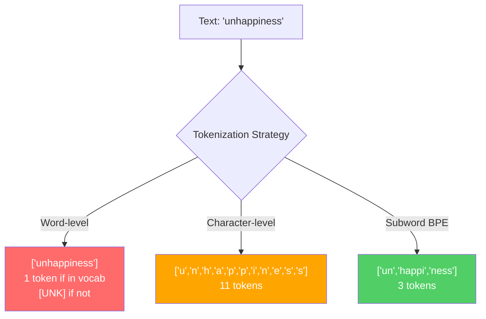
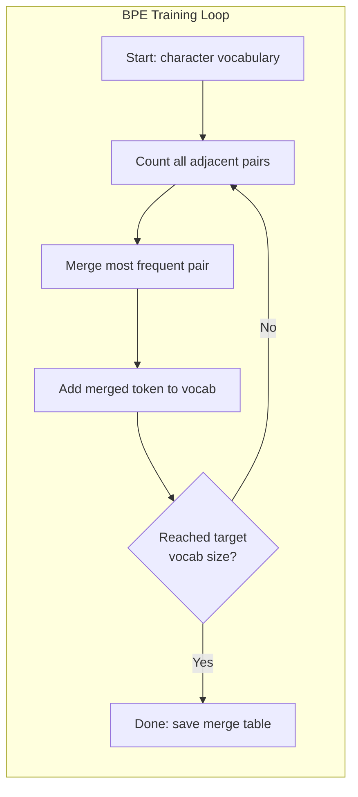
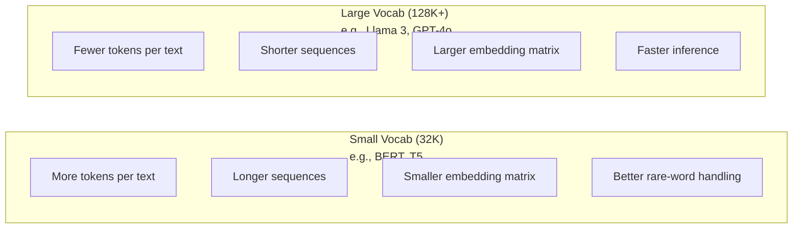

# Các mã thông báo: BPE, WordPiece, SentencePiece

> LLM của bạn không đọc tiếng Anh. Nó đọc số nguyên. Tokenizer quyết định liệu số nguyên có ý nghĩa hay lãng phí nó.

> **【中文解读】**LLM 不读英文,它读整数――分词器决定这些整数是有意义还是浪费――子词分词(子词分词代码化) 在词级和字符级之间找到平衡点:常见词保持完整,罕见词分为有意义的片段──GPT-4 用 BPE,Llama 用 SentencePiece──

> **【拓展：BPE→GPT系列】**Tất cả các mô hình của OpenAI(GPT-2、GPT-3、GPT-4) đều sử dụng BPE 分词器──tiktoken là phân词器库 GPT 系列──分词质量 trực tiếp ảnh hưởng đến tỷ lệ sử dụng cửa sổ dưới đây"do cùng" 拆分4 token vs 1 token, tương đương với giảm 75% trong cửa sổ dưới đây

**Type:** Build
**Languages:** Python
**Prerequisites:** Phase 05 (NLP Foundations)
**Time:** ~90 minutes

## Mục tiêu học tập

- Thực hiện các thuật toán token hóa BPE, WordPiece và Unigram từ đầu và so sánh các chiến lược hợp nhất của họ
  Từ zero thực hiện BPE、WordPiece 和 Unigram 分词算法, so sánh các chiến lược hợp nhất của chúng
- Giải thích kích thước từ vựng ảnh hưởng đến hiệu quả mô hình như thế nào: quá nhỏ tạo ra chuỗi dài, quá lớn chất thải nhúng các tham số
  解释词表大小如何影响模型效率: quá nhỏ tạo ra序列 dài, quá lớn lãng phí
- Phân tích các đồ tạo token trên các ngôn ngữ và mã, xác định nơi các token cụ thể bị phá vỡ
  Phân tích các tình huống biên giới phân từ của các ngôn ngữ và mã, tìm ra các điểm thất bại của các cụm từ cụ thể
- Sử dụng thư viện tiktoken và phrasepiece để token hóa văn bản và kiểm tra ID token kết quả
  Sử dụng tiktoken và phrasepiece 库分词文本并检查生成的代码 ID

> **【中文解读】**Mục tiêu học tập của chương này xoay quanh bốn chiều của phân từ: thực hiện: viết tay BPE / WordPiece / Unigram 算法)  hiểu: 词表大小的工程权衡)  phân tích: 跨语言分词的边界情况) 应用: 符号/句子 工具库) 分词 là bước đầu tiên của LLM 管线, trực tiếp ảnh hưởng đến hiệu quả và chi phí mô hình.

## Vấn đề  vấn đề giới thiệu

Thạc sĩ của bạn không đọc tiếng Anh, không đọc bất kỳ ngôn ngữ nào, nó đọc số.

> Bạn của LLM không đọc tiếng Anh. Nó không đọc bất kỳ ngôn ngữ nào. Nó đọc số.

Khoảng cách giữa "Hello, world!" và [15496, 11, 995, 0] là tokenizer. Mỗi từ, mỗi không gian, mỗi dấu chấm phải được chuyển đổi thành một số nguyên trước khi mô hình có thể xử lý nó.

> "Hello, world!" và [15496, 11, 995, 0] 之间的桥梁就是分词器──每个词、每个空格、每个标点符号都必须转换为整数,模型才能处理──这种转换不是中性它将假设固化到模型中,并且后日无法撤销──

Nếu bạn hiểu sai, mô hình của bạn sẽ lãng phí khả năng mã hóa các từ thông thường với nhiều mã thông báo. "do cùng không may" trở thành bốn token thay vì một. Màn hình của bạn 128K chỉ thu hẹp 75% vì văn bản nặng trong nhiều từ. Làm đúng và cùng một cửa sổ ngữ cảnh có ý nghĩa gấp đôi. Sự khác biệt giữa "mô hình này xử lý mã tốt" và "mô hình này nghiêng vào Python" thường được giảm xuống vào cách thức tokenizer được đào tạo.

> Làm sai, mô hình của bạn sẽ lãng phí dung lượng với nhiều token 编码常见词语──"khán giả"  biến thành bốn token chứ không phải một── bạn 128K trên cửa sổ văn bản dưới đây đối với văn bản đa âm tiết mật độ trực tiếp giảm 75%── làm đối với, tương tự như trên cửa sổ văn bản dưới đây có thể tải xuống thông tin gấp đôi──" mô hình này xử lý mã rất tốt "và" mô hình này trong Python 上卡 "những khác biệt, thường phụ thuộc vào cách phân từ thiết bị được đào tạo──

Mỗi cuộc gọi API bạn thực hiện với GPT-4 hoặc Claude được định giá theo mã thông báo. Mỗi mã thông báo mô hình của bạn tạo ra chi phí tính toán. càng ít mã thông báo cần thiết để đại diện cho một đầu ra, kết luận kết thúc đến kết thúc càng nhanh. Tokenization không phải là xử lý trước. Đó là kiến trúc.

> Bạn mỗi lần sử dụng GPT-4 hoặc API của Claude đều theo token 计费的── mỗi token mô hình của bạn tạo đều tiêu tốn tính năng── cho thấy một output cần thiết token 越少,端到端推理就越快──分词不是预处理──它是架构──

> **【中文解读】**分词 không phải là một bước xử lý trước đơn giản, mà là một phần của cấu trúc mô hình. Mỗi lần sử dụng GPT-4 API đều theo chi phí mã hóa, mỗi mã hóa được tạo ra đều tiêu thụ tính năng.

> **【拓展：API 定价与分词效率】**GPT-4o 的定价为 $5/M input tokens、$15/M đầu ra token. Trong một đoạn văn, GPT-2 分词器 có thể tiêu tốn 500 token, GPT-4o o200k_base 分词器 chỉ cần khoảng 200 token, chi phí khác nhau 2,5 lần. Đây cũng là lý do tại sao Llama 3 sẽ mở rộng từ 32K  mở rộng đến 128K  giảm chi phí suy luận của người dùng không nói tiếng Anh.

>  **【前置】**学本节前请先掌握:(1) giai đoạn 05(NLP Foundations) 理解文本的向量化表示、词嵌入基础;(2) Python 字典/Counter 与贪心算法实现模式;(3) UTF-8 编码、Unicode 码点(codepoint) 与字节的关系;(4) 概率论基础频率统计与互信息──不熟悉这些会难以理解 BPE 的合并据判──

## Khái niệm cốt lõi

### Ba phương pháp thất bại (và một cách đã thắng)

Có ba cách hiển nhiên để chuyển đổi văn bản thành số. Hai trong số đó không hoạt động trên quy mô.

> Có ba cách rõ ràng để chuyển đổi văn bản thành số. Hai trong số đó không thể hoạt động trong tình huống lớn.

**Word-level tokenization**"The cat sat" trở thành ["The", "cat", "sat"]". đơn giản. Nhưng còn "tokenization" hay "GPT-4o" hay một từ hợp chất của Đức như "Geschwindigkeitsbegrenzung"?`[UNK]`token -- cách mô hình nói "Tôi không biết điều này là gì". Chỉ riêng tiếng Anh có hơn một triệu hình thức từ. Thêm mã, URL, dấu hiệu khoa học và 100 ngôn ngữ khác và bạn cần một từ vựng vô hạn.

> **词级分词**按空格和标点拆分──"Căn ngồi" 变成 ["The", "cat", "sat"]──很简单──但"tokenization" 呢?"GPT-4o" 呢?或德语复合词 "Geschwindigkeitsbegrenzung" 呢?词级分词需要一个巨大的词表来覆盖每种语言的每个词──遗漏一个词就会出现可怕的`[UNK]`token模型在说"我完全不知道这是什么"── chỉ trong tiếng Anh có hơn một triệu từ hình──加代码,URL,科学记记法和100种其他语言, bạn cần một từ hình không giới hạn──

**Character-level tokenization**"Hello" trở thành ["h", "e", "l", "l", "o"". Từ vựng nhỏ bé (một vài trăm ký tự). Không có mã thông báo không biết bao giờ. Nhưng các chuỗi trở nên cực kỳ dài. Một câu có thể là 10 mã thông báo từ sẽ trở thành 50 mã thông báo cấp ký tự. mô hình phải học rằng "t", "h", "e" cùng nhau có nghĩa là "the" - đốt cháy khả năng chú ý đến một cái gì đó con người học vào tuổi ba.

> **字符级分词**走向另一个极端──"hello" 变成 ["h", "e", "l", "l", "o"]──词表很小(几百字符)──永远不会出现未知符号──但序列变得极长──一个10个词级符号的句子变成50个字符级符号──模型必须学会 "t",、"h",、"e"组合起来是"把注意力容量浪费在人类三岁就学会的事物上──

**Subword tokenization**tìm thấy điểm ngọt ngào. Các từ phổ biến vẫn toàn bộ: "the" là một biểu tượng. Các từ hiếm bị phân hủy thành các mảnh có ý nghĩa: "không hạnh phúc" trở thành ["un", "happy", "ness"").

> **子词分词**找到了最佳平衡点──常见词保持完整:"the" 是一个代币──罕见词分解为有意义的片段:"不快乐" 变成 ["un", "happy", "ness"]──词表保持在可控范围(30K到128K 个代币)──序列保持简短──未知代币 基本消失,因为任何词都可以由子词片段构建──

> **【中文解读】**词级分词 (词级分词) 问题是词表爆炸英语有百万级词形,加上代码、URL、科学记数法和其他语言,词表会无限增长──字符级分词 (字符级分词) 字符级分词) 字符级分词 (字符级分词) 虽然词表小,但序列太长,模型要学会 "t"+"h"+"e" 组合为"the",浪费注意力容量──子词分词在两者之间取得平衡:常见词保持完整,罕见词分为有意义的片段──

>  **【类比】**分词器像"乐高积木分类工厂":常见词("the") làm thành một toàn bộ khối积木大积木直接用,罕见词("unhappy") chia thành "un"+"happy"+"ness" 三块标准小积木拼起来;;词级是只卖整块定制积木(漏货就崩),字符级是只卖单个原点(拼一句话要100个);;BPE là "高频组合自动包包成块",自适应找到成本与表达力的平衡点;;

Mỗi LLM hiện đại sử dụng mã hóa từ phụ. GPT-2, GPT-4, BERT, Llama 3, Claude - tất cả chúng. Câu hỏi là thuật toán nào.

> Mỗi ngành công nghiệp đại học hiện đại đều sử dụng子词分词──GPT-2、GPT-4、BERT、Llama 3、Claude全都如此── vấn đề nằm ở việc sử dụng các thuật toán nào──



### BPE: Mã hóa cặp byte

BPE là một thuật toán nén tham lam được tái sử dụng để token hóa. Ý tưởng là đủ đơn giản để phù hợp với một thẻ chỉ mục.

> BPE là một thuật toán nén lại được sử dụng để phân từ.

Bắt đầu với các ký tự riêng lẻ. Đếm từng cặp lân cận trong tập thể dục. Thủy cặp thường xuyên nhất thành một mã thông báo mới. Lặp lại cho đến khi bạn đạt đến kích thước từ vựng mục tiêu của bạn.

> Từ đơn ký tự bắt đầu. Từ các ký tự khác nhau, các ký tự khác nhau sẽ được kết hợp với các ký tự khác nhau.
```figure
tokenizer-bpe
```

Đây là BPE chạy trên một bộ phận nhỏ với các từ "hệ nhất", "hệ nhất", và "hữu mới nhất":

```
Corpus (with word frequencies):
  "lower"  x5
  "lowest" x2
  "newest" x6

Step 0 -- Start with characters:
  l o w e r       (x5)
  l o w e s t     (x2)
  n e w e s t     (x6)

Step 1 -- Count adjacent pairs:
  (e,s): 8    (s,t): 8    (l,o): 7    (o,w): 7
  (w,e): 13   (e,r): 5    (n,e): 6    ...

Step 2 -- Merge most frequent pair (w,e) -> "we":
  l o we r        (x5)
  l o we s t      (x2)
  n e we s t      (x6)

Step 3 -- Recount and merge (e,s) -> "es":
  l o we r        (x5)
  l o we s t      (x2)    <- 'es' only forms from 'e'+'s', not 'we'+'s'
  n e we s t      (x6)    <- wait, the 'e' before 'we' and 's' after 'we'

Actually tracking this precisely:
  After "we" merge, remaining pairs:
  (l,o): 7   (o,we): 7   (we,r): 5   (we,s): 8
  (s,t): 8   (n,e): 6    (e,we): 6

Step 3 -- Merge (we,s) -> "wes" or (s,t) -> "st" (tied at 8, pick first):
  Merge (we,s) -> "wes":
  l o we r        (x5)
  l o wes t       (x2)
  n e wes t       (x6)

Step 4 -- Merge (wes,t) -> "west":
  l o we r        (x5)
  l o west        (x2)
  n e west        (x6)

...continue until target vocab size reached.
```

Bảng kết hợp là tokenizer. Để mã hóa văn bản mới, áp dụng các kết hợp theo thứ tự mà họ đã học. Thuật liệu đào tạo xác định các kết hợp tồn tại, và sự lựa chọn đó định hình vĩnh viễn những gì mô hình thấy.

> 合并表就是分词器──编码新文本时,按学习顺序应用合并──训练语料决定哪些合并存在,这个选择永久塑造模型看到的内容──

> **【中文解读】**Chuyển tập trung của BPE: bắt đầu từ một ký tự đơn lẻ, thống kê tần suất xuất hiện của tất cả các ký tự lân cận, sẽ có tần suất cao nhất của tần kết hợp thành mã thông báo mới, lặp lại cho đến khi đạt được mục tiêu từ表大小──合并表(luồng bảng) là phân từ cụ bản thân──编码新文本时, theo trình tự được học tập theo trình tự ứng dụng 合并规则顺序 rất quan trọng, vì tần kết hợp 1 có thể tạo ra "th", tần kết hợp 5才能 tạo ra "the" trên cơ sở của "th"+"e".

> **【拓展：BPE 的压缩原理】**BPE ban đầu là thuật toán nén dữ liệu chung năm 1994。Sennrich 等人 vào năm 2016 sẽ giới thiệu nó vào lĩnh vực NLP。 Trong môi trường sản xuất, tiktoken trong Rust đã thực hiện BPE, tốc độ mã hóa có thể đạt hàng triệu token mỗi giây。GPT-4 cl100k_base mã hóa đã được đào tạo khoảng 100.000 lần trên hàng trăm GB 文本。

> ️ **【易错点】**手写 BPE 三个常见 bug:(1) **忘了每次合并后重新计数** trực tiếp trong cặp đầu tiên đếm 上循环, dẫn đến hợp并 "chúng ta" 后还在旧频次选 (e,s), kết quả hợp并表全是噪音;(2) **合并顺序错乱**编码时必须按训练时学到的合并级 严格从低到高应用,先合并 "th" 再合并 "the",颠倒会得到完全不同的代币;(3) **未做预分词（pre-tokenization）** trực tiếp trên toàn bộ ngữ nghĩa làm BPE, sẽ xuất hiện "e c" (của mèo) trong vòng跨词合并), tập luyện ra không có ý nghĩa của跨词 token──修复: sử dụng GPT-2 của chính thức trước tiên cắt thành từ片段, mỗi段独立做 BPE──



### BPE cấp bằng byte (GPT-2, GPT-3, GPT-4)

BPE tiêu chuẩn hoạt động trên các ký tự Unicode. BPE cấp bayt hoạt động trên các byte thô (0-255). Điều này cung cấp cho bạn một từ vựng cơ bản chính xác là 256, xử lý bất kỳ ngôn ngữ hoặc mã hóa nào, và không bao giờ tạo ra một token không rõ.

> 标准 BPE 操作 Unicode 字符──字节级 BPE 操作原始字节(0-255)。 Điều này cho bạn một cái gì đó 256 个基础词表, có thể xử lý bất kỳ ngôn ngữ hoặc mã hóa, sẽ không bao giờ tạo ra mã thông báo chưa biết。

GPT-2 đã đưa ra cách tiếp cận này. Thuật từ cơ sở bao gồm mọi byte có thể. BPE hợp nhất xây dựng trên đó. Thư viện tiktoken của OpenAI thực hiện BPE cấp byte với các kích thước từ vựng sau:

> GPT-2 đã đưa ra phương pháp này. Từ ngữ cơ bản bao gồm mỗi chữ cái có thể được xây dựng trên đó.

> **【中文解读】**字节级 BPE(Byte-level BPE) là một trong những sáng kiến quan trọng được đưa ra trong GPT-2.

> 🤔 **【困惑】**Q: Tại sao sự kết hợp của BPE là quan trọng như vậy? được đào tạo tốt phân từ器能" sửa đổi"? A: 合并顺序就是分词器的"程序"编码时必须严格按训练时学到的级别从小到大应用:若级=5是"th",rank=100是"the",遇到"时先合成"th",再合成"the"―任意颠倒或单独跳过某步会产生不同的代号序列――生产中**不要修改合并表**, vì nó và mô hình được nhúng 矩阵强绑定改一个代币的ID,模型会输出乱码――需要改词表只能重训分词器 +重训模型嵌入――

- GPT-2: 50,257 token
- GPT-3.5/GPT-4: ~100,256 token (cl100k_base encoding)
- GPT-4o: 200,019 token (o200k_base encoding)

### WordPiece (BERT)

WordPiece trông giống như BPE nhưng chọn kết hợp khác nhau. Thay vì tần số nguyên liệu, nó tối đa hóa khả năng dữ liệu đào tạo:

> WordPiece trông giống như BPE, nhưng chọn cách hợp lại khác nhau. Nó không sử dụng tần số ban đầu, mà làm tối đa hóa dữ liệu đào tạo.

```
BPE merge criterion:      count(A, B)
WordPiece merge criterion: count(AB) / (count(A) * count(B))
```

BPE hỏi: "Điều gì xuất hiện thường xuyên nhất?" WordPiece hỏi: "Điều gì xuất hiện cùng nhau thường xuyên hơn bạn mong đợi ngẫu nhiên?" Sự khác biệt tinh tế này tạo ra các từ vựng khác nhau. WordPiece ưa thích hợp nhất nơi sự xuất hiện cùng là đáng ngạc nhiên, không chỉ thường xuyên.

> BPE 问:"WordPiece 问:"WordPiece 问:"WordPiece 问:"WordPiece 问:"WordPiece 问:"WordPiece 问:"WordPiece 问:"WordPiece 问:"WordPiece 问:"WordPiece 问:"WordPiece 问:"WordPiece 问:"WordPiece 问:"WordPiece 问:"WordPiece 问:"WordPiece 问:"WordPiece 问:"WordPiece 问:"WordPiece 问:"WordPiece 问:"WordPiece 问:"WordPiece 问:"WordPiece 问:"WordPiece 问:"WordPiece 问:"WordPiece 问:"WordPiece 问:"WordPiece 问:"WordPiece 问:"WordPiece 问:"WordPiece "

WordPiece cũng sử dụng một "##" tiền tố cho các từ phụ tiếp tục:

> WordPiece còn sử dụng "##" 前标记续接子词:

```
"unhappiness" -> ["un", "##happi", "##ness"]
"embedding"   -> ["em", "##bed", "##ding"]
```

"##" cho bạn biết phần này tiếp tục một token trước đó. BERT sử dụng WordPiece với một từ vựng của 30,522 token. Mỗi biến thể BERT - DistilBERT, tokenizer của RoBERTa thực sự là BPE, nhưng BERT chính là WordPiece.

> "##" 前告诉你这个片段续接前一个代币──BERT 使用 WordPiece,词表为 30,522 个代币──每个 BERT 变体DistilBERT,RoBERTa's分词器实际上是BPE,但BERT本人是 WordPiece──

### Câu (Llama, T5)

SentencePiece xử lý đầu vào như một dòng chữ Unicode thô, bao gồm không gian trắng. Không có bước pre-tokenization. Không có quy tắc cụ thể về ngôn ngữ về ranh giới từ. Điều này làm cho nó thực sự không hiểu ngôn ngữ - nó hoạt động trên tiếng Trung, tiếng Nhật, tiếng Thái và các ngôn ngữ khác nơi không gian không tách từ.

> SentencePiece sẽ được nhập như là Unicode gốc 字符流, bao gồm空格. Không có pre分词步骤. Không có quy tắc ngôn ngữ cụ thể về giới hạn từ. Điều này thực sự làm cho nó đã được thực hiện ngôn ngữ.

SentencePiece hỗ trợ hai thuật toán:

> CâuPiece 支持两种算法:

- **BPE mode**: logic merge giống như BPE tiêu chuẩn, áp dụng cho các chuỗi ký tự nguyên liệu
  Trung ngữ翻译:**BPE 模式**: tương tự như chuẩn BPE, được sử dụng cho chuỗi chữ nguyên thủy
- **Unigram mode**: bắt đầu với một từ vựng lớn và lặp đi lặp lại loại bỏ các mã thông báo ít ảnh hưởng đến khả năng tổng thể.
  Trung ngữ翻译:**Unigram 模式**Từ từ từ từ từ từ từ từ từ từ từ từ từ từ từ từ từ từ từ từ từ từ từ từ từ từ từ từ từ từ từ từ từ từ từ từ từ từ từ từ từ từ từ từ từ từ từ từ từ từ từ từ từ từ từ từ từ từ từ từ từ từ từ từ từ từ từ từ từ từ từ từ từ từ từ từ từ từ từ từ từ từ từ từ từ từ từ từ từ từ từ từ từ từ từ từ từ từ từ từ từ từ từ từ từ từ từ từ từ từ từ từ từ từ từ từ từ từ từ từ từ từ từ từ từ từ từ từ từ từ từ từ từ từ từ từ từ từ từ từ từ từ từ từ từ từ từ từ từ từ từ từ từ từ từ từ từ từ từ từ từ từ từ từ từ từ từ từ từ từ từ từ từ từ từ từ từ từ từ từ từ từ từ từ từ từ từ từ từ từ từ từ từ từ từ từ từ từ từ từ từ từ từ từ từ từ từ từ từ từ từ từ từ từ từ từ từ từ từ từ từ từ từ từ từ từ từ từ từ từ từ từ từ từ từ từ từ từ từ từ từ từ từ từ từ từ từ từ từ từ từ từ từ từ từ từ từ từ từ từ từ từ từ từ từ từ từ từ từ từ từ từ từ từ từ từ từ từ từ từ từ từ từ từ từ từ từ từ từ từ từ từ từ từ từ từ từ từ từ từ từ từ từ từ từ từ từ từ từ từ từ từ từ từ từ từ từ từ từ từ từ từ từ từ từ từ từ từ từ từ từ từ từ từ từ từ từ từ từ từ từ từ từ từ từ từ từ từ từ từ từ từ từ từ từ từ từ từ từ từ từ từ từ từ từ từ từ từ từ từ từ từ từ từ từ từ từ từ từ từ từ từ từ từ từ từ từ từ từ từ từ từ từ từ từ từ từ từ từ từ từ từ từ từ từ từ từ từ từ từ từ từ từ từ từ từ từ từ từ từ từ từ từ từ từ từ từ từ từ từ từ từ từ từ từ từ từ từ từ từ từ từ từ từ từ từ từ từ từ từ từ từ từ từ từ từ từ từ từ từ từ từ từ từ từ to to to to to to to to to to to to to to to to to to to to to to to to to to to to to to to to to to to to to to to to to to to to to

Llama 2 sử dụng SentencePiece BPE với một từ vựng 32.000 token. T5 sử dụng SentencePiece Unigram với 32.000 token. Lưu ý: Llama 3 chuyển sang một token BPE cấp bằng byte dựa trên tiktoken với 128.256 token.

> Llama 2 使用 SentencePiece BPE,词表为 32,000 个 token。T5 使用 SentencePiece Unigram,词表为 32,000 个 token。 chú ý: Llama 3 切换到了基于 tiktoken 的字节级 BPE 分词器,词表为 128,256 个 token。

> **【中文解读】**Sự đặc biệt của SentencePiece là nó được nhập vào như là Unicode gốc 字符流 (bao gồm空格), không làm bất kỳ ngôn ngữ nào của预分词―― điều này làm cho nó hoạt động tốt trên ngôn ngữ của Trung văn、日文、泰文等 không sử dụng空格分隔词―― nó hỗ trợ hai thuật toán: BPE 模式(自底上合并) và Unigram 模式(自顶向下剪枝) ――Llama 2 sử dụng SentencePiece BPE(32K 词表), trong khi Llama 3 chuyển đổi thành tiktoken 类型 字节 BPE(128K 词表) ――

> **【拓展：SentencePiece 在开源模型中的地位】**Google T5(110 tỷ参数)、Llama 2(7B-70B)、Mistral 7B 等开源模型都使用SentencePiece。 ưu điểm của nó là ngôn ngữ không liên quan Với một phân từ器 có thể xử lý 100+ ngôn ngữ mà không cần bất kỳ ngôn ngữ cụ thể nào quy tắc xử lý trước.

### Số lượng từ vựng

Đây là một quyết định kỹ thuật thực sự với hậu quả có thể đo lường được.

> Đây là một quyết định kỹ thuật thực sự có kết quả có thể đo lường.



Số cụ thể. Đối với một từ vựng 128K với 4 096 chiều nhúng, các mã nhúng đơn giản là 128.000 x 4.096 = 524 triệu tham số. Đối với một từ vựng 32K, nó là 131 triệu tham số. Đó là một sự khác biệt tham số 400M từ lựa chọn tokeniser đơn giản.

> Đối với 128K 词表 và 4,096 维嵌入, chỉ có 128,000 x 4,096 = 5,24 tỷ参数. Đối với 32K 词表, đó là 1,31 tỷ参数.

Nhưng từ vựng lớn hơn nén văn bản một cách hung hăng hơn. cùng một đoạn văn tiếng Anh lấy 100 token với một từ vựng 32K có thể lấy 70 token với một từ vựng 128K. Điều đó có nghĩa là 30% ít hơn đi trước trong quá trình tạo ra. Đối với một mô hình phục vụ hàng triệu yêu cầu, đó là giảm trực tiếp chi phí tính toán.

> Nhưng biểu tượng lớn hơn tích cực hơn là văn bản nén hơn. Trong khi đó, biểu tượng có thể cần 100 token, nhưng với 128K biểu tượng có thể chỉ cần 70 token.

Xu hướng rõ ràng: quy mô từ vựng đang tăng lên. GPT-2 sử dụng 50.257. GPT-4 sử dụng ~ 100K. Llama 3 sử dụng 128K. GPT-4o sử dụng 200K.

> 趋势很明确:词表大小在增长──GPT-2 用 50,257──GPT-4 用约100K──Llama 3 用 128K──GPT-4o 用 200K──

| Model | Vocab Size | Tokenizer Type | Avg Tokens per English Word |
|-------|-----------|----------------|---------------------------|
| BERT | 30,522 | WordPiece | ~1.4 |
| GPT-2 | 50,257 | Byte-level BPE | ~1.3 |
| Llama 2 | 32,000 | SentencePiece BPE | ~1.4 |
| GPT-4 | ~100,256 | Byte-level BPE | ~1.2 |
| Llama 3 | 128,256 | Byte-level BPE (tiktoken) | ~1.1 |
| GPT-4o | 200,019 | Byte-level BPE | ~1.0 |

### Thuế đa ngôn ngữ

Các người mã hóa được đào tạo chủ yếu bằng tiếng Anh là tàn bạo đối với các ngôn ngữ khác. Văn bản Hàn Quốc trong mã hóa GPT-2 trung bình là 2-3 mã hóa mỗi từ. tiếng Trung có thể tệ hơn. Điều này có nghĩa là người dùng Hàn Quốc có một cửa sổ ngữ cảnh có kích thước nửa của người dùng tiếng Anh - trả cùng một giá cho mật độ thông tin ít hơn.

> Trong tiếng Hàn, mỗi từ trung bình trong GPT-2 là 2-3 token. Điều này có nghĩa là chỉ có một nửa người dùng tiếng Hàn trả giá tương tự, mật độ thông tin thấp hơn.

Đây là lý do tại sao Llama 3 đã tăng gấp bốn lần từ 32K lên 128K. Nhiều token dành riêng cho các kịch bản không phải tiếng Anh có nghĩa là nén công bằng hơn giữa các ngôn ngữ.

> Đó là lý do tại sao Llama 3 sẽ mở rộng từ 32K  mở rộng đến 128K                                                                                                                                                                                                                                                                                                                                                                                                                                                                                                         

> **【中文解读】**多语言税 (多语言税) là vấn đề công bằng dễ bị bỏ qua nhất trong thiết kế phân từ. Ví dụ: GPT-2 分词器, Hàn Quốc trung bình mỗi từ cần 2-3 token, Trung Quốc có thể tệ hơn. Điều này có nghĩa là cửa sổ hiệu quả trên văn bản dưới đây của người dùng Hàn Quốc / Trung Quốc chỉ có một nửa người dùng tiếng Anh trả cùng giá, mật độ thông tin được nhận được thấp hơn. Llama 3 sẽ mở rộng biểu ngữ từ 32K lên 128K, chính xác để phân phối nhiều token hơn cho người không nói tiếng Anh, thực hiện sự nén công bằng của văn bản xuyên ngôn ngữ.

> **【拓展：多语言分词的实际影响】**Trong các phân từ cl100k_base của GPT-3.5, một đoạn 1000 chữ trong tiếng Trung cần khoảng ~1500 token, trong khi số lượng thông tin tiếng Anh chỉ cần ~500 token. Điều này có nghĩa là API của người dùng tiếng Trung thành thành 3 lần của người dùng tiếng Anh. Llama 3 128K biểu ngữ sẽ nâng cao hiệu quả token của tiếng Trung lên khoảng 2 lần, nhưng vẫn có sự khác biệt so với tiếng Anh. Đây cũng là lý do tại sao mô hình sản xuất quốc gia như Qwen, DeepSeek được chuyên hướng tới phân từ tiếng Trung.

## Hãy xây dựng nó.
```figure
tokenizer-tradeoff
```

## Hãy xây dựng nó

### Bước 1: Tokenizer cấp tính

Bắt đầu từ nền tảng. Một tokeniser cấp ký tự lập bản đồ cho mỗi ký tự đến điểm mã Unicode của nó. Không cần đào tạo. Không có mã thông báo không rõ. Chỉ là bản đồ trực tiếp.

> Từ nền bắt đầu. Các chữ cái sẽ được chiếu vào mỗi chữ cái Unicode. Không cần phải tập luyện. Không có biểu tượng.

```python
class CharTokenizer:
    def encode(self, text):
        return [ord(c) for c in text]

    def decode(self, tokens):
        return "".join(chr(t) for t in tokens)
```

"hello" trở thành [104, 101, 108, 108, 111]. Mỗi ký tự là biểu tượng riêng của nó. Đây là đường cơ bản mà chúng ta cải thiện.

> "Hello" 变成 [104, 101, 108, 108, 111]── mỗi chữ cái là biểu tượng của chính mình──────────────────────────────────────────────────────────────────────────────────────────────────────────────────────────────────────────────────────────────────────────────────────────────────────────────────────

### Bước 2: BPE Tokenizer từ đầu

Thực hiện thực tế. Chúng tôi tập luyện trên các byte thô (như GPT-2), đếm cặp, hợp nhất thường xuyên nhất, và ghi lại mỗi hợp nhất theo thứ tự.

> Thực hiện thực tế. Chúng tôi tập luyện trên các phần nguyên thủy như GPT-2, thống kê đối với thường xuyên, hợp并 cao nhất thường xuyên,并 theo thứ tự ghi lại mỗi lần hợp并.

```python
from collections import Counter

class BPETokenizer:
    def __init__(self):
        self.merges = {}
        self.vocab = {}

    def _get_pairs(self, tokens):
        pairs = Counter()
        for i in range(len(tokens) - 1):
            pairs[(tokens[i], tokens[i + 1])] += 1
        return pairs

    def _merge_pair(self, tokens, pair, new_token):
        merged = []
        i = 0
        while i < len(tokens):
            if i < len(tokens) - 1 and tokens[i] == pair[0] and tokens[i + 1] == pair[1]:
                merged.append(new_token)
                i += 2
            else:
                merged.append(tokens[i])
                i += 1
        return merged

    def train(self, text, num_merges):
        tokens = list(text.encode("utf-8"))
        self.vocab = {i: bytes([i]) for i in range(256)}

        for i in range(num_merges):
            pairs = self._get_pairs(tokens)
            if not pairs:
                break
            best_pair = max(pairs, key=pairs.get)
            new_token = 256 + i
            tokens = self._merge_pair(tokens, best_pair, new_token)
            self.merges[best_pair] = new_token
            self.vocab[new_token] = self.vocab[best_pair[0]] + self.vocab[best_pair[1]]

        return self

    def encode(self, text):
        tokens = list(text.encode("utf-8"))
        for pair, new_token in self.merges.items():
            tokens = self._merge_pair(tokens, pair, new_token)
        return tokens

    def decode(self, tokens):
        byte_sequence = b"".join(self.vocab[t] for t in tokens)
        return byte_sequence.decode("utf-8", errors="replace")
```

Loop đào tạo là cốt lõi của BPE: đếm cặp, hợp nhất người chiến thắng, lặp lại. Mỗi hợp nhất làm giảm tổng số lượng token.`num_merges`vòng, từ vựng tăng từ 256 (bytes cơ sở) đến 256 + num_merges.

> Chuyển tập là cốt lõi của BPE: thống kê đối với thường xuyên, hợp并胜者,重复── mỗi lần hợp并减少 tổng token số──经过`num_merges`轮后,词表 từ 256(基础字节) tăng lên 256 + số_sự hợp nhất。

Việc mã hóa áp dụng các hợp nhất theo thứ tự chính xác mà họ đã học được. Điều này quan trọng. Nếu hợp nhất 1 tạo ra "th" và hợp nhất 5 tạo ra "the", việc mã hóa phải áp dụng hợp nhất 1 trước để "the" có thể hình thành từ "th" + "e" trong hợp nhất 5.

> 编码按学习的确顺序应用合并──这很重要──如果合并 1 创建 "th",合并 5 创建 "the",编码必须先应用合并 1,这样"the"才能在合并 5 中由"th" + "e"形成──

Việc giải mã là ngược lại: tìm kiếm mỗi ID token trong từ vựng, kết nối các byte, giải mã thành UTF-8.

> 解码是逆过程: 在词表中查找每个代币 ID,拼接字节,解码为 UTF-8──

### Bước 3: Mã hóa và giải mã Roundtrip

```python
corpus = (
    "The cat sat on the mat. The cat ate the rat. "
    "The dog sat on the log. The dog ate the frog. "
    "Natural language processing is the study of how computers "
    "understand and generate human language. "
    "Tokenization is the first step in any NLP pipeline."
)

tokenizer = BPETokenizer()
tokenizer.train(corpus, num_merges=40)

test_sentences = [
    "The cat sat on the mat.",
    "Natural language processing",
    "tokenization pipeline",
    "unhappiness",
]

for sentence in test_sentences:
    encoded = tokenizer.encode(sentence)
    decoded = tokenizer.decode(encoded)
    raw_bytes = len(sentence.encode("utf-8"))
    ratio = len(encoded) / raw_bytes
    print(f"'{sentence}'")
    print(f"  Tokens: {len(encoded)} (from {raw_bytes} bytes) -- ratio: {ratio:.2f}")
    print(f"  Roundtrip: {'PASS' if decoded == sentence else 'FAIL'}")
```

Tỷ lệ nén cho bạn biết hiệu quả của tokenizer là bao nhiêu. Tỷ lệ 0,50 có nghĩa là tokenizer nén văn bản thành một nửa số token như các byte nguyên liệu. Tối thấp hơn là tốt hơn. Trong tập thể dục, tỷ lệ sẽ tốt. Trong văn bản không phân phối như "không hạnh phúc" (không xuất hiện trong corpus), tỷ lệ sẽ tồi tệ hơn - tokeniser rơi lại mã hóa cấp ký tự cho các mẫu không thể nhìn thấy.

> 压缩比告诉你分词器的效率── tỷ lệ 0.50 nghĩa là分词器 sẽ thu nhỏ văn bản thành một nửa số chữ cái nguyên thủy──越低越好── trên ngữ pháp đào tạo, tỷ lệ sẽ rất tốt── trên văn bản ngoài phân bố như "không hạnh phúc" ((không xuất hiện trong ngữ pháp) thì tỷ lệ sẽ khác hơn分词器 đối với các mô hình chưa thấy trở lại lớp编码.

### Bước 4: So sánh với tiktoken

```python
import tiktoken

enc = tiktoken.get_encoding("cl100k_base")

texts = [
    "The cat sat on the mat.",
    "unhappiness",
    "Hello, world!",
    "def fibonacci(n): return n if n < 2 else fibonacci(n-1) + fibonacci(n-2)",
    "Geschwindigkeitsbegrenzung",
]

for text in texts:
    our_tokens = tokenizer.encode(text)
    tiktoken_tokens = enc.encode(text)
    tiktoken_pieces = [enc.decode([t]) for t in tiktoken_tokens]
    print(f"'{text}'")
    print(f"  Our BPE:   {len(our_tokens)} tokens")
    print(f"  tiktoken:  {len(tiktoken_tokens)} tokens -> {tiktoken_pieces}")
```

tiktoken sử dụng chính xác cùng một thuật toán nhưng được đào tạo trên hàng trăm gigabytes văn bản với 100.000 hợp nhất. thuật toán là giống nhau. Sự khác biệt là dữ liệu đào tạo và số lượng hợp nhất. Tokenizer của bạn được đào tạo trên một đoạn với 40 hợp nhất không thể cạnh tranh với 100K hợp nhất của tiktoken trên một cơ thể lớn. Nhưng cơ chế là giống nhau.

> tiktoken sử dụng hoàn toàn cùng một thuật toán, nhưng trên 100 GB văn bản đã được đào tạo 100.000 lần hợp并── thuật toán hoàn toàn giống nhau── sự khác biệt nằm ở dữ liệu đào tạo và số lần hợp并── bạn có thể đào tạo 40 lần hợp并 trên một đoạn văn bản không thể cạnh tranh với tiktoken trên 100K lần hợp并并 trên nội dung quy mô lớn── nhưng cơ chế là giống nhau──

### Bước 5: Phân tích từ vựng

```python
def analyze_vocabulary(tokenizer, test_texts):
    total_tokens = 0
    total_chars = 0
    token_usage = Counter()

    for text in test_texts:
        encoded = tokenizer.encode(text)
        total_tokens += len(encoded)
        total_chars += len(text)
        for t in encoded:
            token_usage[t] += 1

    print(f"Vocabulary size: {len(tokenizer.vocab)}")
    print(f"Total tokens across all texts: {total_tokens}")
    print(f"Total characters: {total_chars}")
    print(f"Avg tokens per character: {total_tokens / total_chars:.2f}")

    print(f"\nMost used tokens:")
    for token_id, count in token_usage.most_common(10):
        token_bytes = tokenizer.vocab[token_id]
        display = token_bytes.decode("utf-8", errors="replace")
        print(f"  Token {token_id:4d}: '{display}' (used {count} times)")

    unused = [t for t in tokenizer.vocab if t not in token_usage]
    print(f"\nUnused tokens: {len(unused)} out of {len(tokenizer.vocab)}")
```

Điều này cho thấy phân phối Zipf trong từ vựng của bạn. Một vài token thống trị (không gian, "the", "e"). Hầu hết các token hiếm khi được sử dụng. Các token sản xuất tối ưu hóa cho phân phối này - các mẫu phổ biến có thẻ ID token ngắn, các mẫu hiếm có biểu diễn dài hơn.

> **【中文解读】**Phân tích từ ngữ cho thấy quy tắc phân bố: một số ít token chiếm phần lớn sử dụng như空格"",the"、"e"), hầu hết token rất ít được sử dụng.

> **【拓展：生产环境的词表优化】**GPT-4o có 200 019 token, nhưng 1000 token được sử dụng thường xuyên nhất ập phủ khoảng 80% tần suất xuất hiện trong văn bản tiếng Anh hàng ngày. Trong khi triển khai LLM, việc nhúng 矩阵的大小直接由词表决定:128K 词表 x 4096 维 = 5.24 tỷ参数, chỉ có lớp nhúng chiếm khoảng 2GB 显存(FP16)。

## Hãy sử dụng nó để thực hiện

BPE của anh đã hoạt động, xem công cụ sản xuất trông như thế nào.

> BPE của bạn đã được thực hiện. Bây giờ hãy xem công cụ sản xuất là gì.

### tiktoken (OpenAI)

```python
import tiktoken

enc = tiktoken.get_encoding("cl100k_base")

text = "Tokenizers convert text to integers"
tokens = enc.encode(text)
print(f"Tokens: {tokens}")
print(f"Pieces: {[enc.decode([t]) for t in tokens]}")
print(f"Roundtrip: {enc.decode(tokens)}")
```

tiktoken được viết bằng Rust với liên kết Python. Nó mã hóa hàng triệu token mỗi giây.

> tiktoken dùng Rust 编写并提供 Python 绑定──每秒编码数百万代币──同样 BPE 算法,工业级实现──

### Nhấp mặt tokeners

```python
from tokenizers import Tokenizer
from tokenizers.models import BPE
from tokenizers.trainers import BpeTrainer
from tokenizers.pre_tokenizers import ByteLevel

tokenizer = Tokenizer(BPE())
tokenizer.pre_tokenizer = ByteLevel()

trainer = BpeTrainer(vocab_size=1000, special_tokens=["<pad>", "<eos>", "<unk>"])
tokenizer.train(["corpus.txt"], trainer)

output = tokenizer.encode("The cat sat on the mat.")
print(f"Tokens: {output.tokens}")
print(f"IDs: {output.ids}")
```

Thư viện mã hóa Hugging Face cũng là Rust dưới nắp. Nó đào tạo BPE trên quy mô gigabyte trong vài giây. Đây là những gì bạn sử dụng khi đào tạo mô hình của riêng bạn.

> Hugging Face Tokenizers 库底层也是Rust──它可以在几秒内训练BPE trên GB 级语料──这是你训练自己的模型时使用的工具──

### Lắp đặt Tokenizer của Llama

```python
from transformers import AutoTokenizer

tokenizer = AutoTokenizer.from_pretrained("meta-llama/Llama-3.1-8B")

text = "Tokenizers are the unsung heroes of LLMs"
tokens = tokenizer.encode(text)
print(f"Token IDs: {tokens}")
print(f"Tokens: {tokenizer.convert_ids_to_tokens(tokens)}")
print(f"Vocab size: {tokenizer.vocab_size}")

multilingual = ["Hello world", "Hola mundo", "Bonjour le monde"]
for text in multilingual:
    ids = tokenizer.encode(text)
    print(f"'{text}' -> {len(ids)} tokens")
```

Từ vựng 128K của Llama 3 nén văn bản không tiếng Anh tốt hơn đáng kể so với từ vựng 50K của GPT-2. Bạn có thể tự xác minh điều này - mã hóa cùng một câu trong nhiều ngôn ngữ và đếm các token.

> Llama 3 có 128K 词表缩写非英文文本比 GPT-2 có 50K 词表好得多──你可以自验证使用多种语言编码同一个句子并计算代码数──

## Chuyển nó đi.

Bài học này sẽ mang lại kết quả `outputs/prompt-tokenizer-analyzer.md`-- một lời nhắc tái sử dụng phân tích hiệu quả token hóa cho bất kỳ kết hợp văn bản và mô hình nào. Đưa nó một mẫu văn bản và nó cho bạn biết mô hình nào của tokenizer xử lý tốt nhất.

> 本课产 出 `outputs/prompt-tokenizer-analyzer.md` Một lời nhắc có thể lặp lại, phân tích hiệu quả từ của bất kỳ văn bản và mô hình tập hợp nào.

## Tập luyện bài tập

1. Thay đổi các biểu tượng BPE để in từ vựng tại mỗi bước kết hợp. Xem "t" + "h" trở thành "th", sau đó "th" + "e" trở thành "the". Theo dõi cách các từ tiếng Anh phổ biến được lắp ráp từng mảnh.
   中文翻译:修改 BPE 分词器,在每次合并步骤打印词表――观察 "t" + "h" 如何变成 "th",然后 "th" + "e" 如何变成 "the"――追踪常见英文词汇如何被逐步组装──

2. Thêm các token đặc biệt (`<pad>`- `<eos>`- `<unk>`(bp) để tokenizer BPE. Đưa cho họ ID 0, 1, 2 và chuyển tất cả các token khác tương ứng. Thực hiện một bước trước tokenization chia trên không gian trắng trước khi chạy BPE.
   中文翻译:向 BPE 分词器添加特殊代号(`<pad>``<eos>``<unk>`(■) phân phối ID 0、1、2 并相应移动其他代币――实现一个在运行 BPE 前按空格拆分的预分词步骤――

3. Thực hiện tiêu chí kết hợp WordPiece (tỷ lệ xác suất thay vì tần suất). Cử lý cả BPE và WordPiece trên cùng một cơ sở với cùng một số kết hợp. So sánh các từ vựng kết quả - một trong những từ nào tạo ra các phụ từ có ý nghĩa ngôn ngữ hơn?
   Trung ngữ翻译:实现 WordPiece 合并标准(似然比替代频率) ―― trên cùng một ngữ料 sử dụng cùng một hợp并次次训练 BPE 和 WordPiece──比较生成的词表哪个产生更有语言学意义的子词?

4. Xây dựng một tiêu chuẩn hiệu quả của tokeniser đa ngôn ngữ. Lấy 10 câu bằng tiếng Anh, tiếng Tây Ban Nha, Trung Quốc, Hàn Quốc và Ả Rập. Đánh dấu mỗi câu bằng tiktoken (cl100k_base) và đo mức trung bình các token cho mỗi ký tự. Quantify "bảo thuế đa ngôn ngữ" cho mỗi ngôn ngữ.
   Trung ngữ翻译:构建多语言分词效率基准──取英文、西班牙文、中文、韩文和阿拉伯文各 10 个句子──用 tiktoken(cl100k_base)分词并测量每字符平均代号 数──量化每种语言的"多语言税"──

5. Trén BPE tokenizer của bạn trên một corpus lớn hơn (tải xuống một bài viết Wikipedia). Tốt số lượng hợp nhất để đạt được tỷ lệ nén trong khoảng 10% của tiktoken trên cùng một văn bản. Điều này buộc bạn hiểu mối quan hệ giữa kích thước corpus, số lượng hợp nhất và chất lượng nén.
   Trung ngữ翻译:在更大的语料上训练 BPE 分词器(下载一篇维基百科文章) ――调整并次数使压缩比在同一文本上与Tik Token 相差不超过10%──这迫使你理解语料大小、合并次数和压缩质量之间的关系──

## Từ khóa  Từ khóa nhanh chóng

| Term | What people say | What it actually means | 中文释义 |
|------|----------------|----------------------|---------|
| Token | "A word" | A unit in the model's vocabulary -- could be a character, subword, word, or multi-word chunk | 词元，模型词表中的基本单元 |
| BPE | "Some compression thing" | Byte Pair Encoding -- iteratively merge the most frequent adjacent pair of tokens until the target vocabulary size is reached | 字节对编码，贪心合并最高频相邻对 |
| WordPiece | "BERT's tokenizer" | Like BPE but merges maximize the likelihood ratio count(AB)/(count(A)*count(B)) instead of raw frequency | 基于似然比的子词分词，BERT 使用 |
| SentencePiece | "A tokenizer library" | A language-agnostic tokenizer that operates on raw Unicode without pre-tokenization, supporting BPE and Unigram algorithms | 语言无关的分词库，支持 BPE/Unigram |
| Vocabulary size | "How many words it knows" | The total number of unique tokens: GPT-2 has 50,257, BERT has 30,522, Llama 3 has 128,256 | 词表大小，直接影响嵌入矩阵参数量 |
| Fertility | "Not a tokenizer term" | Average number of tokens per word -- measures tokenizer efficiency across languages (1.0 is perfect, 3.0 means the model works three times harder) | 生育率，每词平均 token 数，衡量分词效率 |
| Byte-level BPE | "GPT's tokenizer" | BPE operating on raw bytes (0-255) instead of Unicode characters, guaranteeing no unknown tokens for any input | 字节级 BPE，基础词表恰好 256 个字节 |
| Merge table | "The tokenizer file" | Ordered list of pair merges learned during training -- this IS the tokenizer, and order matters | 合并表，训练学到的有序合并规则 |
| Pre-tokenization | "Splitting on spaces" | Rules applied before subword tokenization: whitespace splitting, digit separation, punctuation handling | 预分词，子词分词前的规则化拆分 |
| Compression ratio | "How efficient the tokenizer is" | Tokens produced divided by input bytes -- lower means better compression and faster inference | 压缩比，token 数/输入字节数，越低越好 |

## Xem thêm 延伸阅读

- [Sennrich et al., 2016 -- "Neural Machine Translation of Rare Words with Subword Units"](https://arxiv.org/abs/1508.07909)-- bài báo giới thiệu BPE cho NLP, biến một thuật toán nén năm 1994 thành nền tảng của token hóa hiện đại
- [Kudo & Richardson, 2018 -- "SentencePiece: A simple and language independent subword tokenizer"](https://arxiv.org/abs/1808.06226)-- token hóa ngôn ngữ-người hiểu biết làm cho các mô hình đa ngôn ngữ thực tế
- [OpenAI tiktoken repository](https://github.com/openai/tiktoken)-- sản xuất BPE thực hiện trong Rust với Python liên kết, được sử dụng bởi GPT-3.5/4/4o
- [Hugging Face Tokenizers documentation](https://huggingface.co/docs/tokenizers)-- đào tạo các tokenizer cấp sản xuất với hiệu suất Rust
