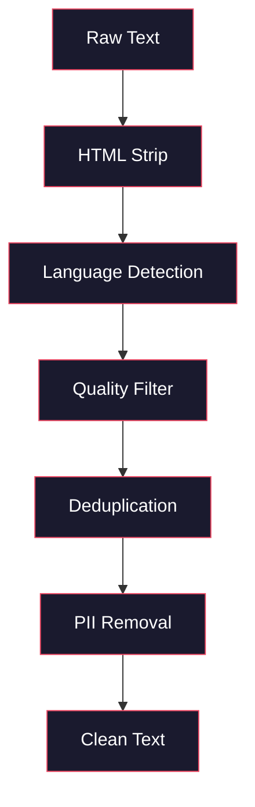
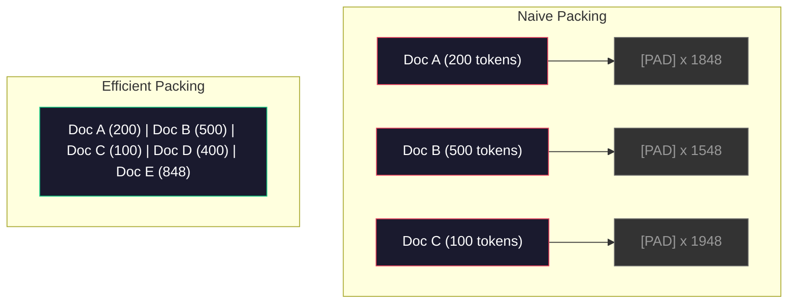

# Data Pipelines cho Pre-Training

> Mô hình là một tấm gương phản ánh bất cứ dữ liệu nào bạn đưa vào nó.

> **【中文解读】**Mô hình là một tấm gương, trung thực phản ánh dữ liệu bạn cung cấp cho nó.

> **【拓展：数据质量→GPT-4/Claude】**GPT-4 và Claude có chất lượng cao xuất phát từ các đường ống dữ liệu được thiết kế kỹ lưỡng.

**Type:** Build
**Languages:** Python
**Prerequisites:** Phase 10, Lessons 01-02 (Tokenizers, Building a Tokenizer)
**Time:** ~90 minutes

## Mục tiêu học tập

- Xây dựng một đường ống dữ liệu trực tuyến mà token hóa, phân đoạn, trộn và đợt số lượng văn bản mà không cần tải tất cả vào bộ nhớ
  构建流式数据管线, thực hiện分词、分块、打乱和批处理 trên văn bản TB 级, không cần phải tải tất cả vào bộ nhớ
- Thực hiện các bộ lọc chất lượng dữ liệu (sử dụng tính năng khử trùng, phát hiện ngôn ngữ, lọc nội dung) được sử dụng trong các đường ống đào tạo trước thực tế
  实现真实预训管线中使用的数据质量过器(去重、语言检测、内容过)
- Tạo các chuỗi đào tạo dài cố định với mặt nạ chú ý thích hợp và xử lý biên giới tài liệu
  Tạo một chuỗi đào tạo độ dài cố định có sự chú ý đúng đắn về ẩn chứa và xử lý biên giới tài liệu
- Tải thông qua đường ống hồ sơ để đảm bảo bộ tải dữ liệu theo kịp tốc độ đào tạo GPU
  Phân tích dung lượng đường ống, đảm bảo tốc độ tải dữ liệu theo tốc độ đào tạo GPU

> **【中文解读】**Bài học tập tập trung tập trung vào các yếu tố quyết định thực sự về chất lượng của LLLM. Bạn sẽ xây dựng một dòng data pipeline, thực hiện trên dữ liệu TB 级 để tải lên.

## Vấn đề  vấn đề giới thiệu

Anh có một token, giờ anh cần dữ liệu.

> Anh có một bộ phận từ ngữ. Bây giờ anh cần dữ liệu.

Không phải một tập dữ liệu, không phải một tệp CSV. Térabytes văn bản - được làm sạch, sao chép, lọc chất lượng, được mã hóa thành chuỗi dài cố định, và được phục vụ theo các lô ngẫu nhiên đủ nhanh để cluster 8 GPU của bạn không bao giờ chờ đợi cho lô tiếp theo.

> Không phải tập dữ liệu, không phải CSV 文件, số lượng TB của văn bản đã được dọn dẹp, tải lên, chất lượng qua, và phân từ cho chuỗi độ dài cố định, và cung cấp dịch vụ theo từng lô, tốc độ nhanh đến tập dữ liệu 8GPU của bạn sẽ không bao giờ chờ đợi các lô dữ liệu tiếp theo.

Hầu hết mọi người nghĩ rằng đào tạo LLM là về kiến trúc mô hình. Nó không phải là. Llama 3 sử dụng 15,6 nghìn tỷ token. GPT-3 sử dụng 300 tỷ. DeepSeek-V2 sử dụng 8,1 nghìn tỷ. Kiến trúc trên cả ba đều tương tự: khối biến thể xếp chồng với sự chú ý và các lớp cấp dữ liệu. Sự khác biệt về chất lượng đầu ra xuất phát xuất từ dữ liệu.

> Đại đa số người cho rằng đào tạo LLM là về cấu trúc mô hình. Không có. Llama 3 sử dụng 15.6 tỷ token. GPT-3 sử dụng 3.000 tỷ. DeepSeek-V2 sử dụng 8.1 tỷ.

Bài báo của Chinchilla từ DeepMind đã làm rõ điều này. Đối với một ngân sách tính toán nhất định, có một tỷ lệ tối ưu của các tham số mô hình với các token đào tạo. Chinchilla cho thấy hầu hết các mô hình vào năm 2022 đều bị thiếu đào tạo đáng kể -- họ có quá nhiều tham số cho lượng dữ liệu họ nhìn thấy. Một mô hình thông số 70B được đào tạo trên 1,4 nghìn tỷ token (Chinchilla-optimal) vượt trội hơn mô hình 280B được đào tạo trên 300 tỷ token (Gopher).

> Bài luận của Chinchilla của DeepMind đã minh họa rõ ràng điều này. Đối với ngân sách tính toán nhất định, tỷ lệ tốt nhất giữa các mô hình tham số và các token đào tạo tồn tại. Chinchilla cho thấy hầu hết các mô hình năm 2022 không thực hiện tốt.

Đường dẫn dữ liệu của bạn xác định liệu mô hình của bạn có học ngôn ngữ hay học tiếng ồn.

> Hành trình dữ liệu của bạn quyết định mô hình học của bạn là ngôn ngữ hay tiếng ồn.

> **【中文解读】**Chinchilla 论文(DeepMind 2022) chứng minh: trong ngân sách tính toán cố định, mô hình số lượng và mã thông báo đào tạo số nên tương tự tỷ lệ mở rộng.

> **【拓展：数据混合比的工程经验】**Llama 3 chia sẻ dữ liệu công khai là: khoảng 50% dữ liệu trên trang web, 25% mã hóa, 13% sách và bài luận, 8% số học, 4% nhiều ngôn ngữ.

>  **【前置】**学本节前请先掌握:(1) Bước 10·01 和 02(分词器) 理解代币与字节流;(2) Bước 10·01 提到的Chinchilla quy mô luật理解参数与代币数的优优比例;(3) Python 生成器 / `IterableDataset`- `datasets.stream`流式处理范式;(4) MinHash + LSH 近似去重算法(不熟请先看Llama 3 / RefinedWeb 论文的相关章节)

## Khái niệm cốt lõi

### Dữ liệu đến từ đâu

Mỗi mô hình ngôn ngữ lớn được đào tạo dựa trên một sự pha trộn của các nguồn.

> Mỗi mô hình ngôn ngữ lớn đều được đào tạo trên nguồn dữ liệu hỗn hợp. Hầu hết các phòng thí nghiệm đều có cấu trúc mật, nhưng chúng tôi biết đủ để hiểu các loại.

| Source | Size | Quality | Used By |
|--------|------|---------|---------|
| Common Crawl | ~250 TB raw | Low (needs heavy filtering) | GPT-3, Llama, most open models |
| Wikipedia | ~20 GB | High | Every major LLM |
| GitHub code | ~1 TB+ | Medium (lots of duplicates, dead code) | StarCoder, CodeLlama, DeepSeek-Coder |
| Books (BookCorpus, Pile) | ~100 GB | High | GPT-2, GPT-3, early models |
| Academic papers (arXiv, S2ORC) | ~100 GB | High for STEM | Llama, Galactica |
| StackOverflow, Reddit | ~100 GB | Medium | Llama, Falcon |
| Curated web (C4, RefinedWeb) | ~5 TB | Medium-High (pre-filtered) | T5, Falcon |

Llama 3 tiết lộ bộ sưu tập dữ liệu của mình: khoảng 50% dữ liệu web, 25% mã, 13% sách và bài báo học, 8% dữ liệu toán học và 4% dữ liệu web đa ngôn ngữ.

> Llama 3 công bố tỷ lệ dữ liệu của mình: khoảng 50% dữ liệu trang web, 25% mã hóa, 13% sách và bài luận học, 8% dữ liệu toán học và 4% dữ liệu trang web đa ngôn ngữ.

Tỷ lệ quan trọng cũng như kích thước tổng thể. Quá nhiều dữ liệu web và mô hình trở thành một con bọo Reddit. Quá ít mã và nó không thể lập trình. Quá ít toán học và nó không thể suy luận. Việc kết hợp đúng là một trong những phần khó khăn nhất trong việc đào tạo LLM, và không có công thức - nó đòi hỏi phải thử nghiệm và đánh giá.

> Ví dụ như tổng kích thước cũng quan trọng.                                                                                                                                                                                                                                                          

### Việc làm sạch dữ liệu

Dữ liệu web nguyên liệu là bẩn. Một bãi rác thông thường chứa:

> Một thông thường thông thường của Crawl 转储 chứa:

- Tags HTML và JavaScript
  Trung ngữ翻译:HTML 标签和 JavaScript
- Các tiêu đề, chân chân, menu điều hướng
  Trung ngữ翻译:样板页眉、页脚、导航菜单
- Các trang trùng lặp (tương tự và gần như trùng lặp)
  Trung ngữ翻译:重复页面(精确和近似重复)
- Spam được tạo bởi máy
  Trung ngữ翻译:机器生成的垃圾内容
- Thông tin nhận dạng cá nhân (PII)
  Trung ngữ翻译:个人身份信息(PII)
- Văn bản chất lượng thấp (luhlu từ khóa, spam SEO)
  Trung ngữ翻译:低质量文本(关键词列表、SEO 垃圾)
- Nội dung không văn bản được mã hóa như văn bản
  Trung văn翻译:编码为文本的非文本内容

Việc làm sạch không phải là tùy chọn. Đó là sự khác biệt giữa một mô hình tạo ra các đoạn kết hợp và một mô hình xuất ra các thẻ HTML trộn với danh sách sản phẩm.

> 清洗不是可选的. Đây là sự khác biệt giữa mô hình tạo liên tục đoạn đoạn và mô hình xuất hợp HTML 标签 và danh sách sản phẩm.

>  **【类比】**数据管线像"自来水厂的多级过系统":原水(Common Crawl)→ 沉池(HTML 剥离)→ 沙(语言检测)→ 活性炭(质量分类器过 SEO 垃圾)→ 反透(MinHash 近似去重)→ 紫外线(PII 脱敏)→ 出水口(打包成代币片) ⋅ bất kỳ lớp nào bị bỏ rơi, cuối cùng " nước" rót ra, về chất 杂质 mô hình học được là chất 杂质 chứ không phải ngôn ngữ。 Chinchilla 论文 chỉ ra, quyết định mô hình chất lượng không phải là mô hình lớn mà là "đơn độ sạch x lượng nước".



Mỗi bước loại bỏ một loại tiếng ồn:

> Mỗi bước loại bỏ một loại tiếng ồn:

**HTML stripping:**Xóa tất cả các dấu hiệu. Giữ chỉ nội dung văn bản hiển thị. Thư viện như `trafilatura`hoặc `readability`trích xuất nội dung bài viết trong khi loại bỏ các hướng dẫn, quảng cáo và bảng ghi.

> **HTML 剥离：**移除所有标记──只保留可见文本内容──`trafilatura`Hoặc`readability`等库提取文章内容, đồng thời bỏ đi导航、广告和样板──

**Language detection:**Sử dụng mô hình xác định ngôn ngữ của fastText (lid.176.bin) để phân loại từng tài liệu. Trình vào ngôn ngữ mục tiêu của bạn. Một tài liệu được phân loại là tiếng Anh với độ tin cậy dưới 0,8 có thể không phải là tiếng Anh sạch.

> **语言检测：**Sử dụng mô hình nhận dạng ngôn ngữ FastText (đọc 176.bin) đối với mỗi tài liệu phân loại.

**Quality filtering:**Đây là nơi nó trở nên thú vị. RefinedWeb (hội dữ liệu đằng sau Falcon) sử dụng một bộ lọc dựa trên sự phức tạp: đào tạo một mô hình ngôn ngữ nhỏ trên Wikipedia, sau đó đánh giá từng tài liệu. Sự phức tạp cao có nghĩa là tài liệu không giống như Wikipedia - có thể là spam, danh sách từ khóa hoặc nội dung được tạo bởi máy. Tài liệu có sự phức tạp trên ngưỡng được loại bỏ.

> **质量过滤：**Đây là một phần thú vị. RefinedWeb (được gọi là "RefinedWeb") sử dụng các bộ lọc dựa trên sự bối rối: trên Wikipedia tập luyện một mô hình ngôn ngữ nhỏ, sau đó đánh giá từng bài viết.

**Deduplication:**Bước làm sạch có tác động nhất. Common Crawl chứa một số lượng lớn các trang trùng lặp - từ chối pháp lý, thông báo cookie, điều khoản dịch vụ. Căn luyện về bản trùng lặp lãng phí tính toán và có thể khiến mô hình ghi nhớ và tái tạo các đoạn cụ thể theo nghĩa đen.

> **去重：**影响最大的清洗步骤──Common Crawl 包含大量重复页面法律声明、cookie 通知、服务条款──在重复数据上训练浪费算力,也可能导致模型逐字记忆和复述特定段落──

**PII removal:**Tên, địa chỉ email, số điện thoại, số an sinh xã hội, phát hiện dựa trên Regex cho PII có cấu trúc, mô hình NER cho tên trong bối cảnh.

> **PII 移除：**姓名、电子邮件地址、电话号码、社会安全号码── cấu trúc PII dùng正则检测,上下文中的姓名 dùng NER 模型──

> **【中文解读】**Số liệu làm sạch là phần quan trọng nhất trong dự án đào tạo. Đội dung dữ liệu trên trang web nguyên thủy đầy ồn:HTML 标签, trình đơn, máy tính tạo ra SEO 垃圾, thông tin cá nhân.

> **【拓展：去重的工程影响】**Llama 团队 báo cáo thông qua di chuyển lại khoảng 38% dữ liệu trang web. Hơn 1/3 trong số các trang thông thường được thu thập lại là lặp lại hoặc gần giống như lặp lại nội dung.

> ️ **【易错点】**Số liệu: 4 bình thường: 1)**整库加载进内存**`datasets.load_dataset("common_crawl", split="train")`默认会实例化 toàn bộ token 15T, phải OOM; phải sử dụng `streaming=True`Hoặc`IterableDataset`;(2) **去重时把"高密度优质内容"误删**文档 A 包含整篇 Wikipedia(5KB),文档 B 是只引用一句话的博客(500字),MinHash 误判为高相似度──修复:在围 之前对每篇文档归归一化长度,或对小文档用更保守的值;(3)**打包（pack）跨文档 attention 漏 mask**把3 篇短文拼拼进2048 token Nhưng không thêm tài liệu giới hạn mặt nạ, thứ 1 末尾的 token 会"看到" thứ 2 开头的 token,造成跨文档污染;修复:使用 FlashAttention 的 `varlen`接口 hoặc mặt nạ chú ý khối hình;(4) **配比（mix）在 epoch 间漂移**shuffle 时按"文档级"而不是"token 级"采样, kết quả小文档被过度采样、大文档欠采样──

### Thiết lập lần nhỏ với MinHash

Việc sao chép chính xác là dễ dàng: phân phối từng tài liệu, loại bỏ bản sao. Nhưng bản sao gần giống là vấn đề thực sự. Hai bản sao của cùng một bài báo tin tức với quảng cáo khác nhau xung quanh nó là bản sao gần giống nhau. Nội dung 95% giống nhau, nhưng chúng khác nhau về một byte.

> 精确去重很简单: đối với mỗi bài viết 哈希,移除重复──但近似重复才是真正的问题──两副本同一新闻文章,周围广告略有不同,就是近似重复──内容 95%相同,但逐字节不同──

MinHash + Hashing nhạy cảm với địa điểm (LSH) giải quyết vấn đề này hiệu quả.

> MinHash + 局部敏感哈希(LSH) 高效地 giải quyết vấn đề này.


Ý tưởng:

> 核心思想:

1. **Shingling:**Chuyển đổi mỗi tài liệu thành một tập hợp n-gram (ví dụ, 5 gram từ hoặc ký tự). "rồi nâu nhanh" với 3 từ vải nâu trở thành {"rồi nâu nhanh", "rồi nâu nhanh"}.
   Trung ngữ翻译:**Shingling：**将每篇文档转换为一组 n-gram 集合(如 5词或 5字符的 n-gram) ・・・"cái cáo nâu nhanh" 用 3词 shingle 变为 {"cái cáo nâu nhanh", "cái cáo nâu nhanh"}。

2. **MinHash:**Đối với bộ vỏ bọc của mỗi tài liệu, tính toán các giá trị hash k. Mỗi giá trị hash là hash tối thiểu trên tất cả vỏ bọc dưới một chức năng hash khác nhau. Điều này tạo ra một "thỏa thuận" kích thước cố định gần như tương tự Jaccard giữa hai tài liệu.
   Trung ngữ翻译:**MinHash：**Đối với mỗi tông liệu của tông liệu 集合计算 k 个哈希值──每个哈希值是所有 tông liệu trong hàm 哈希 khác nhau.

3. **LSH:**Tập hợp các tài liệu thành vỏ dựa trên các băng của chữ ký MinHash của họ. Các tài liệu trong cùng một vỏ là ứng viên gần như trùng lặp. Điều này tránh so sánh từng cặp - bạn chỉ so sánh ứng viên.
   Trung ngữ翻译:**LSH：**Theo MinHash  ký 条带将文档分组到桶中. 文档 trong cùng một桶 là ứng cử viên gần như lặp lại.

4. **Verify:**Đối với mỗi cặp ứng cử viên, tính toán sự tương đồng chính xác của Jaccard.
   Trung ngữ翻译:**验证：**Đối với mỗi ứng cử viên, tính toán chính xác Jaccard tương tự. Nếu tương tự vượt quá giá trị, thường là 0,8, di chuyển một bản sao.

Nhóm Llama báo cáo đã xóa khoảng 38% dữ liệu web của họ thông qua khử trùng lặp. Đó không phải là một con số nhỏ. Hơn một phần ba của Common Crawl là nội dung trùng lặp hoặc gần như trùng lặp.

> Llama 团队 báo cáo thông qua chuyển đổi lại khoảng 38% dữ liệu trang web. Đây không phải là một con số nhỏ.

### Sắp xếp theo trình tự

Mô hình của bạn mong đợi chuỗi đầu vào dài cố định. Tài liệu của bạn có chiều dài biến đổi. Một số là 50 token. Một số là 50.000 token.

> Bạn có thể tìm thấy một số biểu tượng trong các file của mình.

Phương pháp ngây thơ: đệm mỗi tài liệu với chiều dài chuỗi tối đa. Điều này lãng phí tính toán khổng lồ trên các token đệm không đóng góp gì cho việc học.

> Phương pháp đơn giản: sẽ tải mỗi tài liệu lên độ dài chuỗi tối đa.

Cách tiếp cận tốt hơn: gói nhiều tài liệu vào một chuỗi duy nhất, tách ra bởi các token cuối chuỗi. Một chuỗi 2048-token có thể chứa ba tài liệu ngắn liên kết với các token [EOS] giữa chúng.

> Cách tốt hơn: 将多篇文档打包到单个序列中, dùng序列结束代币 分隔── một 2048代币的序列可能包含三篇短文档,中间用 [EOS]代币 连接──

> 🤔 **【困惑】**Q: 既然包装 会跨文档污染,为什么不直接使用填充?多浪费点算力换正确性不是更稳定吗? A: Vì预训算力极高昂Llama 3 训练成本估计10亿美元.`cu_seqlens`(Để xem xét các mục tiêu của các phân đoạn) để xem xét các mục tiêu của các phân đoạn (để xem xét các mục tiêu của các phân đoạn)



Mặt nạ chú ý phải được đặt đúng. Các token từ Tài liệu A không nên tham gia vào các token từ Tài liệu B trong cùng một chuỗi đóng gói. Điều này đòi hỏi một mặt nạ chú ý đường chọc.

> 注意力掩码必须正确设置──文档 A 的符号 不应注意同一打包序列中文档 B 的符号──这需要块对角注意力掩码──

Các tài liệu dài bị cắt ngắn hoặc chia thành các mảnh ở ranh giới chuỗi. Điểm chia quan trọng: chia giữa câu buộc mô hình để thấy những suy nghĩ không đầy đủ. Một số đường ống dẫn sắp xếp các chia cắt đến ranh giới đoạn hoặc câu khi có thể.

> 长文档 在序列边界处被切断或分分成块── 分断点很重要: 在句子中分断迫使模型看到不完整的思想── 有些管线在可能时将分断点对齐到段落或句子边界──

> **【中文解读】**序列打包(Sequence Packing) là một cách đơn giản để sử dụng PAD 填充会浪费大量算力──高效方法将多个短文档用 [EOS] 分隔拼接进同一序列, nhưng cần khối đối góc chú ý掩码(block-diagonal attention mask)  文档 A token không nên chú ý đến cùng một序列 trong文档 B token──

> **【拓展：Chinchilla 定律与过度训练】**Chinchilla định luật cho rằng mô hình tham số và mã thông báo đào tạo số lượng dự báo tương đương tăng trưởng. Nhưng mô hình 70B của Llama 3 trên mã thông báo 15T lên đào tạo(远超优优约1.4T), đây là chiến lược "lợi lý tối ưu": chi phí đào tạo nhiều trang một lần, nhưng chi phí dịch vụ mô hình nhỏ hơn giảm vĩnh viễn.

### Luật quy mô của Chinchilla

Đối với ngân sách tính toán cố định C (được đo bằng FLOP), kích thước mô hình tối ưu N và kích thước tập dữ liệu D là:

> Đối với ngân sách tính toán cố định C(以 FLOPs 衡量), mô hình tối ưu nhất là:

```
N_opt ~ C^0.5
D_opt ~ C^0.5
```

Trong thực tế, điều này có nghĩa là bạn nên quy mô mô mô hình và kích thước tập dữ liệu tương đương. Một mô hình có nhiều tham số hơn 10 lần cần khoảng 10 lần nhiều token đào tạo để đạt được cùng một lỗ.

> Trong thực tế, điều này có nghĩa là bạn nên mở rộng mô hình lớn và tập dữ liệu lớn tương đương.

| Model | Parameters | Training Tokens | Chinchilla-Optimal? |
|-------|-----------|----------------|-------------------|
| GPT-3 | 175B | 300B | No (undertrained 3-4x) |
| Chinchilla | 70B | 1.4T | Yes (by design) |
| Llama 2 | 70B | 2T | Overtrained (intentionally) |
| Llama 3 | 70B | 15T | Heavily overtrained |

Llama 3 cố ý vi phạm luật Chinchilla. Meta phát hiện ra rằng quá trình đào tạo trên nhiều dữ liệu - vượt xa tỷ lệ tối ưu tính toán - tạo ra các mô hình tốt hơn cho suy luận. Chi phí đào tạo bổ sung được trả một lần, nhưng mô hình nhỏ hơn rẻ hơn để phục vụ mãi mãi. Điều này đôi khi được gọi là cách tiếp cận quy mô "sự suy luận tối ưu", và nó đã trở thành tiêu chuẩn ngành kể từ năm 2024.

> Llama 3 cố ý vi phạm luật Chinchilla. Meta phát hiện ra rằng sử dụng nhiều dữ liệu quá tập luyện vượt quá tính toán tỷ lệ tối ưu nhất  có thể tạo ra các mô hình tốt hơn về hiệu quả suy đoán.

## Hãy xây dựng nó.
```figure
l5-data-pipeline
```

## Hãy xây dựng nó

### Bước 1: Làm sạch văn bản

Xét HTML, bình thường hóa không gian trắng, loại bỏ nội dung không văn bản. Chúng tôi sẽ sử dụng một văn bản thuộc phạm vi công cộng (Project Gutenberg) như là bộ phận nhỏ của chúng tôi.

> 剥离 HTML、归一化空白、移除文本内容──我们将使用公共领域文本 (古堡计划)作为小型语料──

```python
import re

def clean_text(text):
    text = re.sub(r"<[^>]+>", "", text)
    text = re.sub(r"http\S+", "", text)
    text = re.sub(r"[^\x20-\x7E\n]", "", text)
    text = re.sub(r"\n{3,}", "\n\n", text)
    text = re.sub(r" {2,}", " ", text)
    return text.strip()

def quality_filter(text, min_words=50, max_ratio_caps=0.3, max_ratio_special=0.1):
    words = text.split()
    if len(words) < min_words:
        return False
    caps_ratio = sum(1 for w in words if w.isupper()) / len(words)
    if caps_ratio > max_ratio_caps:
        return False
    special_chars = sum(1 for c in text if not c.isalnum() and not c.isspace())
    if special_chars / max(len(text), 1) > max_ratio_special:
        return False
    return True
```

Bộ lọc chất lượng bắt được spam SEO (ALL CAPS), tiếng ồn do máy tạo (nhiều lượng đặc biệt đặc biệt cao) và các trang stub (quá ngắn).

> 质量过器捕获 SEO 垃圾(全大写) 机器生成的噪音(高特殊字符比例) 和存根页面(太短) ⋅ chỉ có ba kiểm tra này có thể di chuyển rất nhiều rác từ các trang web爬取中──

### Bước 2: Khác nhân MinHash

Thực hiện MinHash từ đầu. Không cần thư viện bên ngoài - chỉ cần`hashlib`- Tôi không biết.

> Từ零实现 MinHash──不需要外部库只需 `hashlib`

```python
import hashlib
from collections import defaultdict

def get_shingles(text, k=5):
    words = text.lower().split()
    if len(words) < k:
        return set()
    return {" ".join(words[i:i+k]) for i in range(len(words) - k + 1)}

def minhash_signature(shingles, num_hashes=128):
    signature = []
    for i in range(num_hashes):
        min_hash = float("inf")
        for shingle in shingles:
            h = int(hashlib.sha256(f"{i}:{shingle}".encode()).hexdigest(), 16)
            min_hash = min(min_hash, h)
        signature.append(min_hash)
    return signature

def lsh_buckets(signature, bands=16):
    rows_per_band = len(signature) // bands
    buckets = []
    for b in range(bands):
        start = b * rows_per_band
        band_data = tuple(signature[start:start + rows_per_band])
        bucket_hash = hashlib.md5(str(band_data).encode()).hexdigest()
        buckets.append((b, bucket_hash))
    return buckets

def deduplicate(documents, threshold=0.8, num_hashes=128, bands=16):
    signatures = []
    shingle_sets = []
    for doc in documents:
        shingles = get_shingles(doc)
        shingle_sets.append(shingles)
        signatures.append(minhash_signature(shingles, num_hashes))

    bucket_map = defaultdict(list)
    for doc_idx, sig in enumerate(signatures):
        for band_id, bucket_hash in lsh_buckets(sig, bands):
            bucket_map[(band_id, bucket_hash)].append(doc_idx)

    duplicate_pairs = set()
    for bucket_docs in bucket_map.values():
        if len(bucket_docs) < 2:
            continue
        for i in range(len(bucket_docs)):
            for j in range(i + 1, len(bucket_docs)):
                duplicate_pairs.add((bucket_docs[i], bucket_docs[j]))

    removed = set()
    for i, j in duplicate_pairs:
        if i in removed or j in removed:
            continue
        s1, s2 = shingle_sets[i], shingle_sets[j]
        if not s1 or not s2:
            continue
        jaccard = len(s1 & s2) / len(s1 | s2)
        if jaccard >= threshold:
            removed.add(j)

    return [doc for idx, doc in enumerate(documents) if idx not in removed], len(removed)
```

- `num_hashes=128`và `bands=16`Các tham số kiểm soát sự giao dịch nhớ chính xác. nhiều hash hơn cung cấp ước tính tương tự chính xác hơn. nhiều băng tần tăng nhớ (tự bắt nhiều bản trùng lặp hơn) với chi phí nhiều tích cực sai. Những giá trị này hoạt động tốt cho văn bản web điển hình.

> `num_hashes=128`和 `bands=16`参数 kiểm soát độ chính xác-đánh giá tỷ lệ quay lại. 更多哈希值给出更准确的相似度估计. 更多条带增加召回率.

### Bước 3: Đánh dấu và gói các chuỗi

Lấy văn bản sạch, được sao chép, mã hóa nó, và đóng gói vào các chuỗi dài cố định để đào tạo.

> 取清洗、去重后的文本,分词,打包为固定长度序列用于训练──

```python
def tokenize_corpus(documents, tokenizer):
    all_tokens = []
    for doc in documents:
        tokens = tokenizer.encode(doc)
        all_tokens.extend(tokens)
        all_tokens.append(tokenizer.eos_id)
    return all_tokens

def pack_sequences(token_ids, seq_length, pad_id=0):
    sequences = []
    attention_masks = []
    for i in range(0, len(token_ids), seq_length):
        seq = token_ids[i:i + seq_length]
        mask = [1] * len(seq)
        if len(seq) < seq_length:
            pad_count = seq_length - len(seq)
            seq = seq + [pad_id] * pad_count
            mask = mask + [0] * pad_count
        sequences.append(seq)
        attention_masks.append(mask)
    return sequences, attention_masks
```

### Bước 4: DataLoader cho đào tạo

Tạo ra các loạt chuỗi ngẫu nhiên.

> Tiếp tục tạo ra các tập hợp tự động hóa.

```python
import random

class PreTrainingDataLoader:
    def __init__(self, sequences, attention_masks, batch_size, shuffle=True):
        self.sequences = sequences
        self.attention_masks = attention_masks
        self.batch_size = batch_size
        self.shuffle = shuffle

    def __len__(self):
        return (len(self.sequences) + self.batch_size - 1) // self.batch_size

    def __iter__(self):
        indices = list(range(len(self.sequences)))
        if self.shuffle:
            random.shuffle(indices)
        for start in range(0, len(indices), self.batch_size):
            batch_idx = indices[start:start + self.batch_size]
            batch_seqs = [self.sequences[i] for i in batch_idx]
            batch_masks = [self.attention_masks[i] for i in batch_idx]
            yield batch_seqs, batch_masks
```

### Bước 5: Thống kê dữ liệu

Xét số quan trọng: tổng token, token độc đáo, tỷ lệ nén, phân phối chiều dài tài liệu.

> 计算关键指标: tổng token số 唯一 token số 压缩比 文档长度分布――

```python
from collections import Counter

def compute_statistics(documents, token_ids, sequences, tokenizer_vocab_size):
    total_chars = sum(len(d) for d in documents)
    total_tokens = len(token_ids)
    unique_tokens = len(set(token_ids))
    compression_ratio = total_chars / total_tokens

    doc_lengths = [len(d.split()) for d in documents]
    avg_doc_length = sum(doc_lengths) / max(len(doc_lengths), 1)
    max_doc_length = max(doc_lengths) if doc_lengths else 0
    min_doc_length = min(doc_lengths) if doc_lengths else 0

    token_counts = Counter(token_ids)
    top_tokens = token_counts.most_common(10)

    non_pad_tokens = sum(sum(1 for t in seq if t != 0) for seq in sequences)
    total_positions = sum(len(seq) for seq in sequences)
    utilization = non_pad_tokens / max(total_positions, 1)

    stats = {
        "total_documents": len(documents),
        "total_characters": total_chars,
        "total_tokens": total_tokens,
        "unique_tokens": unique_tokens,
        "vocab_utilization": unique_tokens / tokenizer_vocab_size,
        "compression_ratio": compression_ratio,
        "avg_doc_length_words": avg_doc_length,
        "max_doc_length_words": max_doc_length,
        "min_doc_length_words": min_doc_length,
        "num_sequences": len(sequences),
        "sequence_utilization": utilization,
        "top_10_tokens": top_tokens,
    }
    return stats
```

Tỷ lệ nén cho bạn biết token hiệu quả như thế nào trên corpus này. văn bản tiếng Anh thường nén đến khoảng 3-4 ký tự mỗi token. Nếu bạn thấy 1,5 ký tự mỗi token, token của bạn đang phân chia quá tích cực. Nếu bạn thấy 8+, nó đã học được sự hợp nhất rất cụ thể về miền.

> 压缩比告诉你分词器在此语料上的效率──英文文本通常缩小到每个代币约3~4字符──如果你看到每个代币1.5字符,说明分词器分分过激进──如果你看到8+,说明它学到了非常特定领域的合并──

Sử dụng chuỗi cho bạn biết bao nhiêu chuỗi đóng gói của bạn là dữ liệu thực so với đóng gói. dưới 90% có nghĩa là đóng gói của bạn là không hiệu quả - bạn đang lãng phí tính toán trên mã đóng gói.

> Tỷ lệ sử dụng chuỗi cho bạn biết bao nhiêu trong chuỗi gói là dữ liệu thực so với 填充── dưới 90% nghĩa là hiệu quả gói thấp bạn đang lấp đầy biểu tượng 上浪费算力──

## Hãy sử dụng nó để thực hiện

### So sánh với huggingface dataset

Lắp cùng một bộ trong thư viện tập dữ liệu của HuggingFace và so sánh tốc độ đường ống.

> Thông qua HuggingFace các tập dữ liệu 库加载相同语料并比较管线速度──

```python
from datasets import load_dataset
from transformers import AutoTokenizer

ds = load_dataset("wikitext", "wikitext-2-raw-v1", split="train")
tokenizer = AutoTokenizer.from_pretrained("meta-llama/Meta-Llama-3-8B")

import time

start = time.time()
tokenized = ds.map(
    lambda x: tokenizer(x["text"], truncation=True, max_length=2048),
    batched=True,
    num_proc=4,
)
hf_time = time.time() - start
total_tokens = sum(len(t) for t in tokenized["input_ids"])
print(f"HuggingFace: {total_tokens:,} tokens in {hf_time:.2f}s ({total_tokens/hf_time:,.0f} tokens/sec)")
```

Tuyến ống HuggingFace sử dụng các token Rust dưới nắp và xử lý song song trên 4 lõi. Tuyến ống Python tinh khiết của bạn sẽ chậm hơn 10-50 lần. Đó là lý do tại sao các nhóm sản xuất sử dụng các token được biên soạn. thuật toán giống nhau. Ngôn ngữ thực hiện là sự khác biệt.

> HuggingFace 管线底层 sử dụng Rust 分词器和 4 核并行处理。你的纯 Python 管线会慢10-50倍──这就是为什么生产团队使用编译分词器──算法相同──实现语言是区别──

## Chuyển nó đi.

Bài học này tạo ra một lời nhắc để xác nhận và debugging chất lượng dữ liệu trong LLM đào tạo ống dẫn.`outputs/prompt-data-quality-checker.md`- Tôi không biết.

> 本课产出用于验证和调试 LLM 训练管线数据质量提示──见`outputs/prompt-data-quality-checker.md`

## Tập luyện bài tập

1. **Easy:**Thêm phát hiện ngôn ngữ vào đường ống làm sạch bằng cách sử dụng một cách đơn giản (chân tích bộ ký tự).
2. **Medium:**Thực hiện tính sao chép chính xác bằng cách sử dụng sục hash SHA-256 cùng với sục sao chép gần MinHash. So sánh số lượng duplicate được bắt bởi mỗi phương pháp trên một bộ sục được thu thập trên web.
3. **Hard:**Xây dựng một bộ lọc chất lượng dựa trên sự bối rối. Cử lý một mô hình ngôn ngữ lớn nhỏ trên văn bản Wikipedia, đánh giá từng tài liệu theo sự bối rối, và loại bỏ phần dưới 20%. So sánh chất lượng đầu ra mô hình khi đào tạo trên dữ liệu lọc so với không lọc.

## Từ khóa  Từ khóa nhanh chóng

| Term | What people say | What it actually means | 中文释义 |
|------|----------------|----------------------|---------|
| Common Crawl | "The internet" | A non-profit that crawls the web monthly -- ~250TB raw, the starting point for most LLM training data | 通用爬虫，LLM 训练数据的起点 |
| MinHash | "Some hashing trick" | A technique to estimate Jaccard similarity between sets using fixed-size signatures -- enables near-duplicate detection at scale | 最小哈希，近似重复检测的核心技术 |
| LSH | "Locality-Sensitive Hashing" | A method to group similar items into the same bucket -- reduces pairwise comparisons from O(n^2) to near-linear | 局部敏感哈希，将 O(n^2) 降为近似线性 |
| Sequence packing | "Concatenating documents" | Fitting multiple documents into fixed-length sequences with proper attention masks -- eliminates padding waste | 序列打包，消除填充浪费 |
| Chinchilla scaling | "Train on more data" | For a fixed compute budget, optimal performance requires scaling model size and training tokens roughly equally | Chinchilla 缩放定律，参数和数据应等比增长 |
| Fertility | "Tokens per word" | Average number of tokens per word -- 1.3 for English in GPT-4, higher for non-Latin scripts | 生育率，每词 token 数 |
| Data mixing | "Choosing training data" | The ratio of code vs text vs math vs multilingual data -- no formula, requires experimentation | 数据混合比，需实验确定 |
| Perplexity filter | "Quality scoring" | Use a small language model to score documents -- high perplexity means the text is unlike clean reference data | 困惑度过滤，低质量文档评分高 |
| Deduplication | "Removing copies" | Eliminating exact and near-duplicate documents -- typically removes 30-40% of raw web data | 去重，通常移除 30-40% 网页数据 |
| Attention mask | "Which tokens to look at" | A binary mask that prevents attention across document boundaries in packed sequences | 注意力掩码，阻止跨文档注意力 |

## Xem thêm 延伸阅读

- [Hoffmann et al., 2022 -- Training Compute-Optimal Large Language Models (Chinchilla)](https://arxiv.org/abs/2203.15556)- bài báo đã thay đổi cách chúng ta nghĩ về quy mô dữ liệu
- [Penedo et al., 2023 -- The RefinedWeb Dataset for Falcon LLM](https://arxiv.org/abs/2306.01116)-- làm thế nào để lọc Common Crawl để chất lượng cao
- [Touvron et al., 2023 -- Llama 2: Open Foundation and Fine-Tuned Chat Models](https://arxiv.org/abs/2307.09288)-- chi tiết về đường ống dữ liệu cho Llama 2
- [Lee et al., 2022 -- Deduplicating Training Data Makes Language Models Better](https://arxiv.org/abs/2107.06499)- tại sao việc sao chép lại lại lại lại quan trọng hơn bạn nghĩ
- [Broder, 1997 -- On the Resemblance and Containment of Documents](https://ieeexplore.ieee.org/document/666900)- giấy MinHash gốc
- [Meta, 2024 -- Llama 3 Technical Report](https://arxiv.org/abs/2407.21783)-- 15,6T token, tỷ lệ trộn dữ liệu, lọc đường ống dẫn
