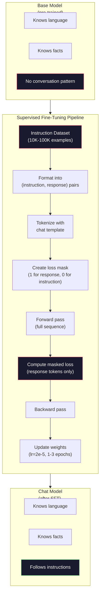

# Định hướng điều chỉnh (SFT) ✓ 指令微调监督微调

> Một mô hình cơ bản dự đoán token tiếp theo. Đó là nó. Nó không tuân theo hướng dẫn, trả lời câu hỏi, hoặc từ chối yêu cầu có hại. SFT là cầu nối giữa một dự đoán token và một trợ lý hữu ích. Mỗi mô hình mà bạn đã từng nói chuyện với - Claude, GPT, Llama Chat - đã trải qua bước này.

> **【中文解读】**基础模型只会预测下一个代币――它不会 tuân theo chỉ thị, trả lời câu hỏi hoặc từ chối yêu cầu có hại――SFT(监督微调) là nối "代币预测器" và " hữu ích trợ lý" của桥梁――Claude、ChatGPT、Llama Chat đã trải qua bước này――

> **【拓展：SFT→ChatGPT】**GPT-3.5 预训 → SFT(uống dữ liệu đối thoại của người dùng)→ RLHF(uống dữ liệu đối với người dùng)。SFT là để làm cho mô hình cơ bản trở thành bước quan trọng của trợ lý đối thoại。

>  **【前置】**Học本节前请先掌握:Phase 10·04(Pre-Training Mini GPT) 理解预训如何得到基础模型;Phase 11·08(LoRA) 理解微调的具体技术(本节是全参微调,LoRA是其轻量版);PyTorch 训练循环基础(loss、优化、倒退)

**Type:** Build
**Languages:** Python (with numpy)
**Prerequisites:** Phase 10, Lesson 04 (Pre-Training a Mini GPT)
**Time:** ~90 minutes

>  **【类比】**SFT = 给"博学"上课──预训让会说所有人话(语言能力), nhưng sẽ không nói chuyện(你说"你好",它说"今天天气不错"纯统计接龙)──SFT dùng 10.000 đối với "问答" biểu diễn dạy nó"问你好应该回答你好"从统计变成会谈──

> ️ **【易错点】**SFT 数据准备的 3 个坑:(1) **指令格式不统一**nhiều样本用 `User:`- Không.`Assistant:`, có vài thứ `<|user|>`- Không.`<|assistant|>`,模型学不会统一格式;务必固定模板(如ChatML) ・・・(2) **拒绝样本不足**100.000 cuộc đối thoại chỉ có 50 条" từ chối yêu cầu có hại", mô hình sẽ không từ chối; ít nhất 5-10%  từ chối mô hình bao gồm các cuộc tấn công khác nhau.** catastrophic forgetting**SFT 数据太狭 (全是客服对话), mô hình quên khả năng sử dụng thông thường;混入 20-30% 通用数据 (Alpaca、FLAN)保住基础能力──

## Mục tiêu học tập

- Thực hiện điều chỉnh tinh tế được giám sát (SFT) chuyển đổi mô hình ngôn ngữ cơ bản thành trợ lý theo hướng dẫn
  实现监督微调(SFT),将基础语言模型转换为指令跟随助手
- Tạo định dạng dữ liệu đào tạo bằng cách sử dụng các mẫu trò chuyện với vai trò hệ thống, người dùng và trợ lý, và mất mặt nạ trên các token không trợ lý
  Sử dụng带 hệ thống/ người dùng/ trợ lý 角色的聊天模板格式化训练数据,并对非助手代币 进行损失掩码
- Giải thích lý do tại sao SFT là cần thiết: các mô hình cơ bản tiếp tục văn bản thay vì trả lời các câu hỏi
  解释 tại sao cần SFT: nền mô hình là tiếp tục văn bản chứ không phải trả lời vấn đề
- Đánh giá chất lượng SFT bằng cách so sánh các phản ứng mô hình cơ bản với mô hình được điều chỉnh tốt trên bộ hướng dẫn được giữ
  Bằng cách so sánh mô hình cơ bản với mô hình điều chỉnh nhỏ để đánh giá chất lượng SFT

> **【中文解读】**本课将基础模型转换为指令跟随助手. 关键概念:SFT 使用与预训相同的训练循环,但数据从原始文本变为结构化对话.

## Vấn đề  vấn đề giới thiệu

Bạn đã đào tạo một mô hình trong Bài học 04. Nó có thể dự đoán token tiếp theo được đưa ra theo trình tự. cung cấp cho nó "Viết cấu biến đổi" và nó có thể tiếp tục với "đã cách mạng hóa xử lý ngôn ngữ tự nhiên".

> Bạn đang trong lớp thứ tư đào tạo một mô hình. Nó có thể dự đoán một token. Nó có thể dự đoán một token.

Bây giờ hãy thử điều này: cho nó ăn "Thủ đô của Pháp là gì?" Một mô hình cơ bản không trả lời "Paris". Nó tiếp tục mô hình. Nó có thể tạo ra "Thủ đô của Đức là gì? Thủ đô của Tây Ban Nha là gì?" vì nó đã học được từ các tài liệu có danh sách các câu hỏi. Hoặc nó có thể tạo ra "đó là câu hỏi mà nhiều người hỏi" bởi vì đó là một sự tiếp tục có thể chấp nhận được của biểu tượng tiếp theo. Mô hình không có khái niệm về * trả lời*. Nó chỉ biết "được tiếp tục".

> 现在试试这个:输入 "Quả là thủ đô của Pháp?" 基础模型不会 trả lời "Paris". 它会继续模式──它可能生成 "Quả là thủ đô của Đức?

Đây là khoảng cách giữa GPT-3 (chương tự cơ bản, được phát hành vào tháng 6 năm 2020) và ChatGPT (được điều chỉnh theo hướng dẫn, được phát hành vào tháng 11 năm 2022).

> Đây là sự khác biệt giữa GPT-3 (được phát hành vào tháng 6 năm 2020) và ChatGPT (được phát hành vào tháng 11 năm 2022):

Stanford Alpaca chứng minh bạn không cần hàng triệu ví dụ. Vào tháng 3 năm 2023, họ đã điều chỉnh Llama 7B chỉ trên 52,000 cặp lệnh-đáp ứng được tạo ra bởi GPT-3.5. Tổng chi phí: $600. The result was a chatbot that could follow instructions, answer questions, and hold conversations. Not as good as ChatGPT, but shockingly close for $600 và vài giờ huấn luyện.

> Stanford Alpaca  chứng minh bạn không cần hàng triệu mẫu. Tháng 3 năm 2023, họ chỉ sử dụng 52,000 条 GPT-3.5 生成的指示-回复对微调 Llama 7B. Tổng chi phí: 600 美元. Kết quả là một người có thể tuân theo chỉ thị, trả lời câu hỏi và tiến hành cuộc trò chuyện.

Llama 2 Chat của Meta chỉ sử dụng khoảng 27.000 ví dụ chất lượng cao cho giai đoạn đầu của SFT. Nhận thức chính: chất lượng quan trọng hơn số lượng. 27.000 ví dụ được viết bởi các nhà ghi chú có tay nghề cao đánh bại 1 triệu ví dụ tiếng ồn được thu thập từ internet.

> Meta của Llama 2 Chat 阶段 SFT đầu tiên chỉ sử dụng khoảng 27.000 条 chất lượng cao mẫu.

> **【中文解读】**GPT-3(2020.6) và ChatGPT(2022.11) chỉ khác nhau từ 200.000 đến 100.000条精心构造的(指示,回复) 对应.Stanford Alpaca sử dụng 52.000条 GPT-3.5 生成的命令数据微调 Llama 7B,成本仅600$.

> **【拓展：Llama 2 的 SFT 数据质量标准】**Meta công khai cho biết dữ liệu SFT của Llama 2 Chat được biên soạn bởi nhóm đánh dấu chuyên nghiệp, mỗi dữ liệu đã được kiểm tra nhiều vòng. Đây là một phương pháp đầu tiên của việc tạo ra một sự tương quan rõ ràng với các phương pháp khác. OpenAI cũng được cho là đã sử dụng rất nhiều dữ liệu giao tiếp chất lượng cao của các thẻ nhân tạo để đào tạo các giai đoạn SFT của ChatGPT.

## Khái niệm cốt lõi

### SFT thực sự làm gì

Supervised Fine-Tuning tiếp tục vòng đào tạo tương tự từ trước khi đào tạo -- vượt qua tiến bộ, mất tính toán, vượt qua ngược, cập nhật trọng lượng -- nhưng trên một loại dữ liệu khác. Thay vì văn bản thô, bạn đào tạo trên các cuộc trò chuyện có cấu trúc:

> 监督微调延续预训练的相同训练循环前向传播、计算损失、反向传播、更新权重但在不同类型的数据上──你用结构化对话代替原始文本进行训练:

```json
{
  "system": "You are a helpful assistant.",
  "user": "What is the capital of France?",
  "assistant": "The capital of France is Paris."
}
```

Mô hình đã biết rằng Paris là thủ đô của Pháp. Nó đã học điều này trong quá trình đào tạo trước trên Wikipedia, sách giáo khoa và trang web. SFT không dạy cho mô hình những sự kiện mới. Nó dạy cho mô hình một hành vi mới: khi bạn thấy một câu hỏi, tạo ra một câu trả lời. Khi bạn thấy một hướng dẫn, tạo ra một hoàn thành. Khi bạn thấy một yêu cầu có hại, tạo ra một từ chối.

> 模型已经知道巴黎是法国的首都──它 đã học được điều này trong quá trình đào tạo trước từ Wikipedia, sách giáo khoa và trang web──SFT không dạy mô hình sự thật mới── nó dạy mô hình một hành vi mới: nhìn thấy vấn đề, đưa ra câu trả lời── nhìn thấy chỉ thị, đưa ra hoàn thành── nhìn thấy yêu cầu có hại, đưa ra từ chối──

Hãy nghĩ về nó theo cách này. Tiến hành trước cung cấp kiến thức cho mô hình. SFT cung cấp cho mô hình phong cách.

> Như vậy nghĩ: Pre training give model knowledge.

> **【中文解读】**Bản chất của SFT là chu kỳ đào tạo tiếp tục dự án, nhưng dữ liệu từ văn bản gốc biến thành đối thoại cấu trúc. Ký thuật là mất mát ẩn mã: chỉ trong trợ lý 回复部分计算损失. Điều này có nghĩa là mô hình học "làm thế nào để trả lời" thay vì "làm thế nào để tiếp tục văn bản".

### Các định dạng dữ liệu

Ba định dạng thống trị ngành công nghiệp. Mỗi định dạng mã hóa cùng một thông tin - ai nói gì - với các định nghĩa khác nhau.

> Công nghiệp có ba hình thức: Mỗi mã có cùng một thông tin, nhưng sử dụng các phân vùng khác nhau.

**Alpaca Format**(Stanford, tháng 3 năm 2023):

```json
{
  "instruction": "Summarize the following article in 3 sentences.",
  "input": "The European Central Bank raised interest rates...",
  "output": "The ECB increased rates by 25 basis points..."
}
```

`input`trường là tùy chọn -- nhiều hướng dẫn không cần thêm ngữ cảnh. Stanford đã phát hành 52.000 ví dụ trong định dạng này, được tạo bởi GPT-3.5 với giá 600 đô la. Điều này đã khởi động phong trào chỉnh hướng dẫn nguồn mở.

>  đơn giản và sử dụng rộng rãi.`input`字段是可选的许多指令不需要额外上下文──Stanford đã phát hành 52.000 mẫu trong mô hình này, được sản xuất bởi GPT-3.5, chi phí 600 美元──

**ShareGPT Format**(Thị hội, 2023):

```json
{
  "conversations": [
    {"from": "system", "value": "You are a helpful assistant."},
    {"from": "human", "value": "What causes tides?"},
    {"from": "gpt", "value": "Tides are caused by the gravitational pull of the Moon..."},
    {"from": "human", "value": "How often do they occur?"},
    {"from": "gpt", "value": "Most coastal areas experience two high tides and two low tides per day..."}
  ]
}
```

Vịcuna được đào tạo trên 70.000 cuộc trò chuyện ShareGPT được rút ra từ bản sao ChatGPT được chia sẻ với người dùng.

> 支持多轮对话──"from" 字段按惯例使用"人" 和 "gpt",无论实际模型是什么──Vicuna 在从用户分享的ChatGPT对话记录中抓取的70,000 个 ShareGPT对话训练──

**ChatML Format**(OpenAI, được sử dụng bởi nhiều mô hình nguồn mở):

```
<|im_start|>system
You are a helpful assistant.<|im_end|>
<|im_start|>user
What is the capital of France?<|im_end|>
<|im_start|>assistant
The capital of France is Paris.<|im_end|>
```

Sử dụng các token đặc biệt (`<|im_start|>`- `<|im_end|>`Các mã thông báo này được thêm vào từ vựng của tokeniser trong quá trình điều chỉnh tinh tế.

> 使用特殊 token`<|im_start|>``<|im_end|>`(của người dùng: Quyen, Yi và nhiều mô hình khác sử dụng ChatML).

Cả ba định dạng đều đạt được điều tương tự: chúng nói với mô hình "đây là hướng dẫn, đây là phản ứng, học mô hình này".

> 三种格式都做同样的事:告诉模型"Đây là lệnh, đây là回复,学习这个模式――"

### Tại sao nó hiệu quả

Mô hình đã biết ngôn ngữ từ trước khi được đào tạo. Nó đã thấy hàng tỷ ví dụ về câu hỏi sau đó là câu trả lời, hướng dẫn sau đó là hoàn thành, và các cuộc trò chuyện giữa mọi người.

> Mô hình đã học ngôn ngữ trong quá trình huấn luyện trước đây. Nó đã nhìn thấy hàng tỷ câu hỏi sau câu trả lời, chỉ dẫn sau hoàn thành, ví dụ về cuộc trò chuyện giữa con người.

SFT tập trung vào khả năng ẩn giấu này. Thay vì mô hình cần phải tìm ra từ ngữ cảnh liệu nó nên trả lời một câu hỏi hay tiếp tục một tài liệu, SFT rõ ràng đào tạo về mô hình trò chuyện. Sau vài ngàn ví dụ, mô hình học được: khi bạn thấy dấu hiệu vai trò trợ lý, tạo ra một phản ứng hữu ích.

> SFT tập trung vào khả năng tiềm năng này. Nó không còn cần mô hình từ trên sau để đưa ra kết luận rằng nó nên trả lời câu hỏi hay viết tiếp.

Đó là lý do tại sao 27.000 ví dụ là đủ. Bạn không dạy cho người mẫu tiếng Anh. Bạn không dạy cho nó những sự thật về thế giới. Bạn đang dạy cho nó một hành vi đơn giản: đáp ứng với hướng dẫn. Tri thức đã có.

> Đó là lý do tại sao 27.000 ví dụ đã đủ. Bạn không đang dạy mô hình tiếng Anh. Bạn không đang dạy nó về những sự thật về thế giới. Bạn đang dạy nó một hành vi đơn giản: đáp ứng chỉ thị.

### Sự mất mát ẩn mác

Đây là chi tiết kỹ thuật quan trọng nhất trong SFT, và hầu hết các hướng dẫn bỏ qua nó.

> Đây là những chi tiết kỹ thuật quan trọng nhất trong SFT, hầu hết các bài học đều đã được bỏ qua.

Trong quá trình đào tạo trước, bạn tính toán lỗ hổng trên mỗi token. Mô hình học được dự đoán từng token tiếp theo trong chuỗi. Trong SFT, bạn chỉ tính toán lỗ hổng trên các token * phản ứng *. Các token hướng dẫn có sẵn cho ngữ cảnh, nhưng mô hình không bị phạt vì " dự đoán" chúng không chính xác.

> Trong quá trình luyện tập, bạn chỉ cần tính toán mỗi token  tính toán mất mát 模型学习预测序列中的每个下一 token。SFT 时, bạn chỉ cần tính toán mất mát 计算回复* token 命令 token 提供上下文, nhưng mô hình sẽ không bị trừng phạt bởi "预测" chúng không chính xác。

Tại sao? bởi vì bạn không muốn mô hình học cách tạo ra hướng dẫn. bạn muốn nó học cách trả lời hướng dẫn. nếu bạn tính toán lỗ trên các mã chỉ dẫn, bạn đang huấn luyện mô hình dự đoán "Quốc đô của Pháp là gì?" như thể nó là người đặt câu hỏi. điều đó lãng phí tín hiệu gradient và có thể làm model nhầm lẫn về vai trò của nó.

> Tại sao? vì bạn không muốn模型学会* tạo ra* chỉ thị. Bạn muốn nó học tập* đáp ứng* chỉ thị. Nếu bạn đối mặt với chỉ thị mã hóa 计算损失, bạn đang trong quá trình đào tạo mô hình dự đoán "Quý là thủ đô của Pháp?",就好像它 đang trong câu hỏi.

Trong thực tế, bạn tạo một mặt nạ mất mát: 1 cho các mã phản ứng, 0 cho mã chỉ dẫn. Bội số mất mát mỗi mã bằng mặt nạ này trước khi trung bình.

> Trong thực tế, bạn tạo ra một lỗ hổng ẩn: mã thông báo trả lại cho 1, mã thông báo chỉ định cho 0...

```
Tokens:    [SYS] You are helpful [USER] What is the capital? [ASST] Paris is the capital [EOS]
Loss mask:   0    0    0     0      0     0   0  0     0       1     1    1   1     1      1
```

Chỉ có các token sau đó `[ASST]`mô hình nhìn thấy toàn bộ cuộc trò chuyện trong quá trình đi trước (nó cần hướng dẫn để tạo ra phản ứng đúng) nhưng chỉ cập nhật trọng lượng của nó dựa trên mức độ dự đoán tốt của nó phản ứng.

> Chỉ có`[ASST]`后的符号 贡献损失──模型在前向传播中看到完整对话(它需要命令才能产生正确回复),但只根据预测回复的好坏来更新权重──

### Các siêu tham số đào tạo

SFT sử dụng các siêu tham số khác nhau đáng kể so với trước khi tập luyện. Bạn không tập luyện từ đầu. Bạn đang điều chỉnh một mô hình đã hoạt động.

> SFT sử dụng siêu tham số với dự kiến đào tạo hoàn toàn khác nhau. Bạn không phải là từ đầu đào tạo. Bạn đang điều chỉnh một mô hình đã hiệu quả.

| Parameter | Pre-Training (Llama 2 7B) | SFT (Llama 2 Chat) |
|-----------|---------------------------|---------------------|
| Learning rate | 3e-4 (peak) | 2e-5 |
| Epochs | 1 (single pass over data) | 2 |
| Batch size | 4M tokens | 64 examples |
| Warmup steps | 2,000 | 0-100 |
| Weight decay | 0.1 | 0.0-0.1 |
| Data size | 2T tokens | 27,000 examples |

Tốc độ học tập thấp hơn 15 lần cho SFT. Điều này rất quan trọng. Tốc độ học tập cao trong quá trình điều chỉnh tinh tế phá hủy kiến thức được đào tạo trước. Mô hình "ngho" những gì nó đã học và vượt quá bộ dữ liệu điều chỉnh tinh tế nhỏ. Đây là lãng quên thảm họa.

> Tỷ lệ học tập của SFT thấp 15 lần. Điều này rất quan trọng. Tỷ lệ học tập cao sẽ phá hủy kiến thức trước khi tập luyện.

> **【中文解读】**损失掩码 là chi tiết kỹ thuật quan trọng nhất trong SFT. 预训时对所有代币 计算损失, SFT 时只对助手的回复代币 计算损失. 指示代币 được sử dụng để cung cấp trên, nhưng không tham gia vào mất mát计算 否则模型会学习"生成指令"而不是"回应指令".

> **【拓展：SFT 的数据规模与成本】**SFT số lượng dữ liệu còn nhỏ hơn dự kiến đào tạo: Llama 2 Chat sử dụng 27.000 条, Alpaca sử dụng 52.000 条, Vicka sử dụng 70.000 条对话.

Hai thời đại có nghĩa là mô hình nhìn thấy mỗi ví dụ đào tạo hai lần. Hơn 3 thời đại trên một tập dữ liệu nhỏ dẫn đến ghi nhớ - mô hình bắt đầu tái tạo các ví dụ đào tạo theo nghĩa đen thay vì tổng quát.

> 两个时代意味着模型看每训练样本两次―― trên tập dữ liệu nhỏ hơn 3 时代 sẽ dẫn đến ghi nhớ模型 bắt đầu từ từ từ tái hiện训练样本而不是泛化――

### Sự quên lãng thảm khốc

Việc điều chỉnh tinh tế có thể phá hủy khả năng chung. Trình luyện quá lâu trên dữ liệu theo hướng dẫn và mô hình mất khả năng viết mã, toán học hoặc tạo ra văn bản sáng tạo. Nó trở nên rất tốt trong định dạng cụ thể của dữ liệu đào tạo của nó và khủng khiếp trong mọi thứ khác.

> 微调可能破坏通用能力──在命令跟随数据上训练太久,模型会失去编码,做数学或制作创意文本的能力──它变得非常擅长训练数据的特定格式,但在其他方面变得很糟糕──

Ba biện pháp giảm thiểu:

> 三种缓解策略:

1. **Low learning rate.**1e-5 đến 5e-5. Các bản cập nhật nhỏ hơn có nghĩa là ít phá hủy các tính năng được đào tạo trước.

2. **Short training.**1-3 thời đại. dừng trước khi mô hình quá tải.

3. **Mix in pre-training data.**Llama 2 Chat trộn một tỷ lệ nhỏ (2-5%) dữ liệu trước đào tạo thô vào bộ dữ liệu SFT. Điều này "nghoán" mô hình về khả năng chung của nó trong khi học hành vi theo hướng dẫn mới.

### Số thực

Việc chỉnh sửa mô hình 7B trên 10.000 cặp hướng dẫn chất lượng cao mất khoảng 1 giờ trên một GPU NVIDIA A100 80GB. Đây là toán học:

> Trong đơn张 NVIDIA A100 80GB GPU 上 sử dụng 10.000 条 High Quality chỉ thị cho các mô hình 7B 模型大约需要 1 小时──计算如下:

- 10.000 ví dụ x 512 token trung bình = 5,12M token
- 2 thời kỳ = tổng số token 10,24M
- A100 thông qua cho việc điều chỉnh tinh tế mô hình 7B: ~ 3.000 token/giây
- 10,24M / 3,000 = ~ 3,400 giây = ~ 57 phút

Đối với mini GPT của chúng tôi (4 lớp, 128 dims), đào tạo gần như tức thời.

> Đối với GPT của chúng ta, tập luyện gần như là ngay lập tức.



## Hãy xây dựng nó.
```figure
loss-masking
```

## Hãy xây dựng nó

### Bước 1: Bộ dữ liệu hướng dẫn

Tạo một bộ dữ liệu hướng dẫn tổng hợp. Trong sản xuất, các công ty như Scale AI và Anthropic sử dụng các nhà ghi chú con người để viết những điều này. Chúng tôi sẽ tạo chúng theo cách lập trình để thể hiện định dạng.

> Tạo bộ dữ liệu chỉ dẫn tổng hợp. Trong quá trình sản xuất, Scale AI và Anthropic, các công ty thuê người đánh dấu nhân tạo để viết những điều này. Chúng tôi sẽ sử dụng chương trình để tạo chúng để trình bày các hình thức.

```python
import numpy as np

INSTRUCTION_DATA = [
    {
        "instruction": "What is the capital of France?",
        "response": "The capital of France is Paris."
    },
    {
        "instruction": "Explain gravity in one sentence.",
        "response": "Gravity is the force that attracts objects with mass toward each other."
    },
    {
        "instruction": "Write a haiku about the ocean.",
        "response": "Waves crash on the shore, salt and foam beneath the sun, endless blue expanse."
    },
    {
        "instruction": "What is 15 multiplied by 7?",
        "response": "15 multiplied by 7 is 105."
    },
    {
        "instruction": "Name three programming languages.",
        "response": "Three programming languages are Python, Rust, and TypeScript."
    },
    {
        "instruction": "Summarize photosynthesis.",
        "response": "Photosynthesis converts sunlight, water, and carbon dioxide into glucose and oxygen."
    },
    {
        "instruction": "What year did World War II end?",
        "response": "World War II ended in 1945."
    },
    {
        "instruction": "Define machine learning.",
        "response": "Machine learning is a field where algorithms learn patterns from data to make predictions."
    },
]
```

8 ví dụ nhỏ. Stanford Alpaca sử dụng 52.000 nhưng cơ học là giống nhau cho dù bạn có 8 hoặc 52.000: token, mặt nạ, mất tính toán chỉ trên các phản ứng.

> 8 ví dụ rất ít. Stanford Alpaca đã sử dụng 52,000 ⋅ nhưng dù bạn có 8 ⋅ hoặc 52,000 ⋅, cơ chế đều giống nhau:分词、掩码、 chỉ đối với ⋅ 回计算损失.

### Bước 2: Đánh dấu bằng mẫu trò chuyện

Chuyển đổi các cặp hướng dẫn-đáp ứng thành chuỗi biểu tượng với các dấu vai trò đặc biệt. Các dấu chỉ cho mô hình biết hướng dẫn kết thúc và bắt đầu từ đâu.

> Để chỉ định-đổi lại để chuyển đổi thành một ký hiệu đặc biệt, ký hiệu cho biết lệnh mô hình kết thúc ở đâu, trả lại từ đâu bắt đầu.

```python
SPECIAL_TOKENS = {
    "INST_START": 253,
    "INST_END": 254,
    "RESP_START": 255,
}


def tokenize_instruction_pair(instruction, response, vocab_size=256):
    inst_tokens = list(instruction.encode("utf-8"))
    resp_tokens = list(response.encode("utf-8"))

    inst_tokens = [min(t, vocab_size - 4) for t in inst_tokens]
    resp_tokens = [min(t, vocab_size - 4) for t in resp_tokens]

    tokens = (
        [SPECIAL_TOKENS["INST_START"]]
        + inst_tokens
        + [SPECIAL_TOKENS["INST_END"]]
        + [SPECIAL_TOKENS["RESP_START"]]
        + resp_tokens
    )

    return tokens


def create_loss_mask(tokens):
    mask = np.zeros(len(tokens), dtype=np.float32)
    in_response = False

    for i, token in enumerate(tokens):
        if token == SPECIAL_TOKENS["RESP_START"]:
            in_response = True
            continue
        if in_response:
            mask[i] = 1.0

    return mask
```

Mặt nạ mất là tất cả các số 0 cho các mã chỉ dẫn và tất cả những mã cho các mã phản ứng.`RESP_START`token tự nó có được một mặt nạ của 0 bởi vì nó là một giới hạn, không phải là một phần của nội dung phản ứng.

> 损失掩码对命令代币 全为 0,对回复代币 全为 1。`RESP_START`token bản thân ẩn码 là 0, vì nó là phân vùng, không phải là một phần của nội dung trả lời.

### Bước 3: Sự mất đi sự phân cực

Chỉ có các mã phản ứng góp phần vào độ nghiêng.

> 标准交叉, nhưng nhân nhân mất掩码, chỉ có trả lại token 贡献梯度.

```python
def masked_cross_entropy_loss(logits, targets, loss_mask):
    batch, seq_len, vocab_size = logits.shape
    logits_flat = logits.reshape(-1, vocab_size)
    targets_flat = targets.reshape(-1)
    mask_flat = loss_mask.reshape(-1)

    max_logits = logits_flat.max(axis=-1, keepdims=True)
    log_softmax = logits_flat - max_logits - np.log(
        np.exp(logits_flat - max_logits).sum(axis=-1, keepdims=True)
    )

    per_token_loss = -log_softmax[np.arange(len(targets_flat)), targets_flat]

    masked_loss = per_token_loss * mask_flat
    num_response_tokens = mask_flat.sum()
    if num_response_tokens == 0:
        return 0.0
    loss = masked_loss.sum() / num_response_tokens

    return loss
```

Tên gọi là `num_response_tokens`Không .`seq_len`Nếu bạn chia bằng tổng chiều dài chuỗi, các hướng dẫn dài hơn làm suy giảm tín hiệu gradient. chia bằng số lượng mã thông báo phản ứng đảm bảo trọng lượng bằng cho mỗi mã thông báo phản ứng bất kể chiều dài của hướng dẫn.

> 分母是`num_response_tokens`, không `seq_len`Nếu trừ với tổng chuỗi dài, thì chỉ thị dài hơn sẽ ít phát hành tín hiệu.

### Bước 4: Loop đào tạo SFT

Sử dụng lại MiniGPT từ Bài học 04.

> 复用第四课的MiniGPT──训练循环看起来几乎与预训一样,但有指令格式化和掩码损失──

```python
import sys
import os
sys.path.insert(0, os.path.join(os.path.dirname(__file__), "..", "..", "04-pre-training-mini-gpt", "code"))
from main import MiniGPT, LayerNorm, FeedForward, MultiHeadAttention, TransformerBlock, Embedding


def sft_train(model, dataset, num_epochs=2, lr=2e-5, seq_len=64):
    formatted_data = []
    for example in dataset:
        tokens = tokenize_instruction_pair(example["instruction"], example["response"])
        mask = create_loss_mask(tokens)
        formatted_data.append((tokens, mask))

    print(f"SFT Training: {len(formatted_data)} examples, {num_epochs} epochs, lr={lr}")
    print(f"Total tokens: {sum(len(t) for t, _ in formatted_data):,}")
    print()

    losses = []

    for epoch in range(num_epochs):
        epoch_loss = 0.0
        num_batches = 0

        indices = np.random.permutation(len(formatted_data))

        for idx in indices:
            tokens, mask = formatted_data[idx]

            if len(tokens) < 3:
                continue
            if len(tokens) > seq_len:
                tokens = tokens[:seq_len]
                mask = mask[:seq_len]

            input_ids = np.array(tokens[:-1]).reshape(1, -1)
            target_ids = np.array(tokens[1:]).reshape(1, -1)
            loss_mask = np.array(mask[1:]).reshape(1, -1)

            logits = model.forward(input_ids)
            loss = masked_cross_entropy_loss(logits, target_ids, loss_mask)

            batch_size, s_len, v_size = logits.shape
            probs = np.exp(logits - logits.max(axis=-1, keepdims=True))
            probs = probs / probs.sum(axis=-1, keepdims=True)
            dlogits = probs.copy()
            dlogits[np.arange(batch_size)[:, None], np.arange(s_len), target_ids] -= 1.0

            mask_expanded = loss_mask[:, :, np.newaxis]
            num_resp = loss_mask.sum()
            if num_resp > 0:
                dlogits = dlogits * mask_expanded / num_resp

            for block in model.blocks:
                block.ffn.W1 -= lr * np.random.randn(*block.ffn.W1.shape) * 0.01
                block.ffn.W2 -= lr * np.random.randn(*block.ffn.W2.shape) * 0.01
                block.ffn.b1 -= lr * np.random.randn(*block.ffn.b1.shape) * 0.01
                block.ffn.b2 -= lr * np.random.randn(*block.ffn.b2.shape) * 0.01

            epoch_loss += loss
            num_batches += 1
            losses.append(loss)

        avg_loss = epoch_loss / max(num_batches, 1)
        print(f"Epoch {epoch + 1}/{num_epochs} | Avg Loss: {avg_loss:.4f}")

    return model, losses
```

Tốc độ học là 2e-5, tương ứng với Llama 2 Chat. So sánh với 3e-4 được sử dụng trong trước đào tạo - nhỏ hơn 15 lần. Tốc độ bị che giấu: các mã chỉ dẫn tạo ra độ lệch không. Chỉ có mã phản ứng đẩy trọng lượng.

> Học suất là 2e-5, với Llama 2 Chat 一致──与预训练的 3e-4 相比小 15倍──梯度被掩码: chỉ thị token 产生零梯度──只有回复 token 推动权重更新──

### Bước 5: So sánh Base vs SFT Model

Toàn bộ điểm của SFT là sự thay đổi hành vi. Hãy đo nó bằng cách kiểm tra cách mô hình phản ứng với các đầu vào định dạng hướng dẫn so với tiếp tục văn bản thô.

> Tất cả ý nghĩa của SFT nằm trong sự thay đổi hành vi. Hãy để chúng ta qua kiểm tra mô hình phản ứng với định dạng nhập lệnh so với bản văn bản nguyên bản để đo lường nó.

```python
def generate_response(model, prompt_tokens, max_new_tokens=50, temperature=0.8):
    tokens = list(prompt_tokens)
    seq_len = model.embedding.pos_embed.shape[0]

    for _ in range(max_new_tokens):
        context = np.array(tokens[-seq_len:]).reshape(1, -1)
        logits = model.forward(context)
        next_logits = logits[0, -1, :]

        next_logits = next_logits / max(temperature, 1e-8)
        probs = np.exp(next_logits - next_logits.max())
        probs = probs / probs.sum()
        probs = np.clip(probs, 1e-10, 1.0)
        probs = probs / probs.sum()

        next_token = np.random.choice(len(probs), p=probs)
        tokens.append(int(next_token))

    return tokens


def evaluate_instruction_following(model, instructions):
    print("Evaluating instruction following:")
    print("-" * 50)

    for instruction in instructions:
        tokens = (
            [SPECIAL_TOKENS["INST_START"]]
            + [min(t, 252) for t in list(instruction.encode("utf-8"))]
            + [SPECIAL_TOKENS["INST_END"]]
            + [SPECIAL_TOKENS["RESP_START"]]
        )

        output = generate_response(model, tokens, max_new_tokens=30, temperature=0.6)
        response_start = len(tokens)
        response_tokens = output[response_start:]
        response_bytes = bytes([t for t in response_tokens if t < 128])
        response_text = response_bytes.decode("utf-8", errors="replace")

        print(f"  Q: {instruction}")
        print(f"  A: {response_text[:80]}")
        print()
```

Trong một mô hình nhỏ với 8 ví dụ, các câu trả lời sẽ không có ý nghĩa. Điều đó là mong đợi. Điều quan trọng là * cấu trúc *: mô hình học cách tạo ra đầu ra sau dấu hiệu phản ứng thay vì tiếp tục tạo ra thêm hướng dẫn.

> Trong 8 ví dụ của mô hình nhỏ, lặp lại sẽ không có ý nghĩa. Đây là dự kiến. Điều quan trọng là: mô hình học học sẽ tạo ra đầu ra sau khi đánh dấu lặp lại, thay vì tiếp tục tạo ra nhiều chỉ thị hơn.

### Bước 6: Hãy cân nhắc sự quên lãng thảm khốc

So sánh khả năng dự đoán token tiếp theo của mô hình trước và sau SFT. Nếu SFT làm hỏng khả năng chung, mất mát trên văn bản thô sẽ tăng lên.

> So sánh SFT trước sau mô hình  dự đoán khả năng  Nếu SFT  làm hỏng khả năng sử dụng chung, thiệt hại trên văn bản gốc sẽ tăng 

```python
def measure_forgetting(model, test_text, seq_len=64):
    tokens = np.array(list(test_text.encode("utf-8")[:512]))

    total_loss = 0.0
    num_windows = 0

    for start in range(0, len(tokens) - seq_len - 1, seq_len):
        input_ids = tokens[start:start + seq_len].reshape(1, -1)
        target_ids = tokens[start + 1:start + seq_len + 1].reshape(1, -1)

        logits = model.forward(input_ids)

        batch, s_len, vocab_size = logits.shape
        logits_flat = logits.reshape(-1, vocab_size)
        targets_flat = target_ids.reshape(-1)

        max_logits = logits_flat.max(axis=-1, keepdims=True)
        log_softmax = logits_flat - max_logits - np.log(
            np.exp(logits_flat - max_logits).sum(axis=-1, keepdims=True)
        )

        loss = -log_softmax[np.arange(len(targets_flat)), targets_flat].mean()
        total_loss += loss
        num_windows += 1

    return total_loss / max(num_windows, 1)
```

Trong sự điều chỉnh tinh tế thực sự, bạn sẽ theo dõi số liệu này trong suốt quá trình đào tạo. Nếu mất văn bản thô tăng hơn 10-15%, SFT của bạn quá hung hăng. Giảm tốc độ học tập hoặc giảm số lượng thời kỳ.

> Trong thực tế, bạn nên theo dõi chỉ số này trong suốt quá trình đào tạo. Nếu mất văn bản nguyên thủy tăng hơn 10-15%, thì SFT quá tăng lên.

## Hãy sử dụng nó để thực hiện

### Demo toàn bộ đường ống SFT

```python
if __name__ == "__main__":
    np.random.seed(42)

    test_text = """The transformer architecture processes sequences through self-attention.
Each layer applies multi-head attention followed by a feedforward network.
Residual connections and layer normalization stabilize deep networks.
The model learns to predict the next token given all previous tokens."""

    print("=" * 70)
    print("INSTRUCTION TUNING (SFT) DEMO")
    print("=" * 70)
    print()

    model = MiniGPT(
        vocab_size=256, embed_dim=128, num_heads=4,
        num_layers=4, max_seq_len=128, ff_dim=512
    )
    print(f"Model: {model.count_parameters():,} parameters")
    print(f"Config: 4 layers, 4 heads, 128 dims (mini GPT from Lesson 04)")
    print()

    print("PRE-SFT: Measuring base model loss on raw text")
    base_loss = measure_forgetting(model, test_text)
    print(f"  Base model loss: {base_loss:.4f}")
    print()

    print("=" * 70)
    print("SFT TRAINING")
    print("=" * 70)

    model, losses = sft_train(
        model, INSTRUCTION_DATA, num_epochs=3, lr=2e-5, seq_len=128
    )

    print()
    print("POST-SFT: Measuring fine-tuned model loss on raw text")
    sft_loss = measure_forgetting(model, test_text)
    print(f"  SFT model loss: {sft_loss:.4f}")
    print(f"  Change: {((sft_loss - base_loss) / base_loss * 100):+.1f}%")
    if abs(sft_loss - base_loss) / base_loss < 0.15:
        print("  Minimal forgetting (< 15% change)")
    else:
        print("  Significant forgetting detected")
    print()

    print("=" * 70)
    print("INSTRUCTION FOLLOWING EVALUATION")
    print("=" * 70)
    print()

    test_instructions = [
        "What is the capital of France?",
        "Name a programming language.",
        "Define gravity.",
    ]
    evaluate_instruction_following(model, test_instructions)

    print("=" * 70)
    print("DATA FORMAT EXAMPLES")
    print("=" * 70)
    print()

    for i, example in enumerate(INSTRUCTION_DATA[:3]):
        tokens = tokenize_instruction_pair(example["instruction"], example["response"])
        mask = create_loss_mask(tokens)
        resp_count = int(mask.sum())
        total_count = len(tokens)
        print(f"  Example {i + 1}: {total_count} tokens, {resp_count} response tokens ({resp_count/total_count:.0%} of sequence)")
        print(f"    Instruction: {example['instruction']}")
        print(f"    Response: {example['response']}")
        print()

    print("=" * 70)
    print("TRAINING LOSS CURVE")
    print("=" * 70)
    print()

    if losses:
        window = max(1, len(losses) // 5)
        for i in range(0, len(losses), window):
            chunk = losses[i:i + window]
            avg = sum(chunk) / len(chunk)
            print(f"  Steps {i:3d}-{i + len(chunk) - 1:3d}: avg loss = {avg:.4f}")
```

## Chuyển nó đi.

Bài học này sẽ mang lại kết quả `outputs/prompt-sft-data-curator.md`-- một prompt giúp bạn thiết kế và quản lý bộ dữ liệu hướng dẫn cho SFT. Với khả năng mục tiêu (tạo mã, toán học, cuộc trò chuyện), nó tạo ra một kế hoạch thu thập dữ liệu với các quy định định định dạng, tiêu chí chất lượng và yêu cầu đa dạng.

## Tập luyện bài tập

1. Thêm hỗ trợ hệ thống nhanh chóng.`tokenize_instruction_pair`để chấp nhận một thông điệp hệ thống và chuẩn bị trước khi hướng dẫn. tạo 5 ví dụ với các lời nhắc hệ thống khác nhau ("Bạn là một nhà thơ", "Bạn là một giảng viên toán") và xác minh mô hình thấy các lời nhắc hệ thống khác nhau trong quá trình đào tạo.

2. Thực hiện trộn dữ liệu. Tạo một chức năng lấy một tập dữ liệu SFT và một tập tin văn bản thô, sau đó tạo ra các lô đào tạo trong đó 5% ví dụ là văn bản thô (không che giấu) và 95% là cặp hướng dẫn (che giấu).

3. Xây dựng một điểm số chất lượng dữ liệu. Đối với mỗi cặp lệnh-đáp ứng, tính toán: (a) độ dài phản ứng trong các token, (b) tỷ lệ lệnh-đáp ứng, (c) đa dạng từ vựng (đáp ứng độc đáo / tổng token). Trình trừ các ví dụ với độ dài phản ứng < 10 token hoặc đa dạng < 0,3.

4. Thực hiện đào tạo cuộc trò chuyện nhiều lượt. Lũ rộng token hóa để xử lý các cuộc trò chuyện 3 lượt (nhân viên người dùng-nhân viên người dùng-nhân viên người dùng-nhân viên người dùng). Mặt nạ mất mát nên bao gồm cả ba lượt trợ lý. Kiểm tra mặt nạ là chính xác bằng cách in sự sắp xếp của token- mặt nạ cho một ví dụ.

5. So sánh tốc độ học tập. Tập cùng một mô hình ba lần với lr = 1e-4, lr = 2e-5, và lr = 1e-6. vẽ đường cong mất mát. Lần chạy 1e-4 nên có sự giảm nhanh ban đầu nhưng mất mát cuối cùng cao hơn (tăng độ). Lần chạy 1e-6 hầu như không di chuyển. Lần chạy 2e-5 nên là điểm ngọt ngào.

## Từ khóa  Từ khóa nhanh chóng

| Term | What people say | What it actually means | 中文释义 |
|------|----------------|----------------------|---------|
| SFT | "Fine-tuning on conversations" | Supervised Fine-Tuning: continuing training on (instruction, response) pairs with loss computed only on response tokens | 监督微调，在指令-回复对上继续训练，仅对回复 token 计算损失 |
| Instruction tuning | "Teaching the model to follow instructions" | Training on explicit instruction-response pairs so the base model learns the conversation pattern, not new knowledge | 指令微调，训练基础模型学会对话模式而非新知识 |
| Loss masking | "Ignoring the prompt" | Setting loss to zero for instruction tokens so gradients only flow from response token predictions | 损失掩码，指令 token 损失设为零，梯度仅来自回复预测 |
| ChatML | "Chat Markup Language" | A token format using `<\|im_start\|>` and `<\|im_end\|>` delimiters to mark speaker roles in conversation data | 聊天标记语言，用特殊 token 标记对话角色 |
| Alpaca format | "Stanford's format" | A JSON format with instruction/input/output fields, used for 52K GPT-3.5-generated examples that cost $600 | Alpaca 格式，Stanford 的 JSON 指令格式，52K 样本成本 $600 |
| Catastrophic forgetting | "The model gets dumber" | Fine-tuning destroys pre-trained capabilities because gradient updates overwrite general knowledge with task-specific patterns | 灾难性遗忘，微调破坏预训练能力 |
| Weight tying | "Shared embeddings" | Using the same matrix for input token embeddings and output prediction head, saving parameters and improving coherence | 权重共享，输入输出共用嵌入矩阵 |
| Chat template | "How you format the prompt" | The specific token sequence (role markers, delimiters) that structures a conversation for the model | 聊天模板，格式化对话的 token 序列 |

## Xem thêm 延伸阅读

- [Ouyang et al., 2022 -- "Training language models to follow instructions with human feedback" (InstructGPT)](https://arxiv.org/abs/2203.02155)-- bài báo giới thiệu điều chỉnh hướng dẫn + RLHF tại OpenAI
- [Taori et al., 2023 -- "Stanford Alpaca: An Instruction-following LLaMA Model"](https://github.com/tatsu-lab/stanford_alpaca)-- 52K ví dụ hướng dẫn với giá 600 đô la, chứng minh SFT hoạt động trên các bộ dữ liệu nhỏ
- [Touvron et al., 2023 -- "Llama 2: Open Foundation and Fine-Tuned Chat Models"](https://arxiv.org/abs/2307.09288)-- Hành trình SFT + RLHF của Meta với 27K ví dụ chất lượng cao
- [Chiang et al., 2023 -- "Vicuna: An Open-Source Chatbot Impressing GPT-4"](https://lmsys.org/blog/2023-03-30-vicuna/)-- đào tạo về 70K ShareGPT cuộc trò chuyện
- [Zhou et al., 2023 -- "LIMA: Less Is More for Alignment"](https://arxiv.org/abs/2305.11206)-- chứng minh rằng 1.000 ví dụ được lựa chọn cẩn thận có thể phù hợp với SFT trên các tập dữ liệu lớn hơn nhiều
