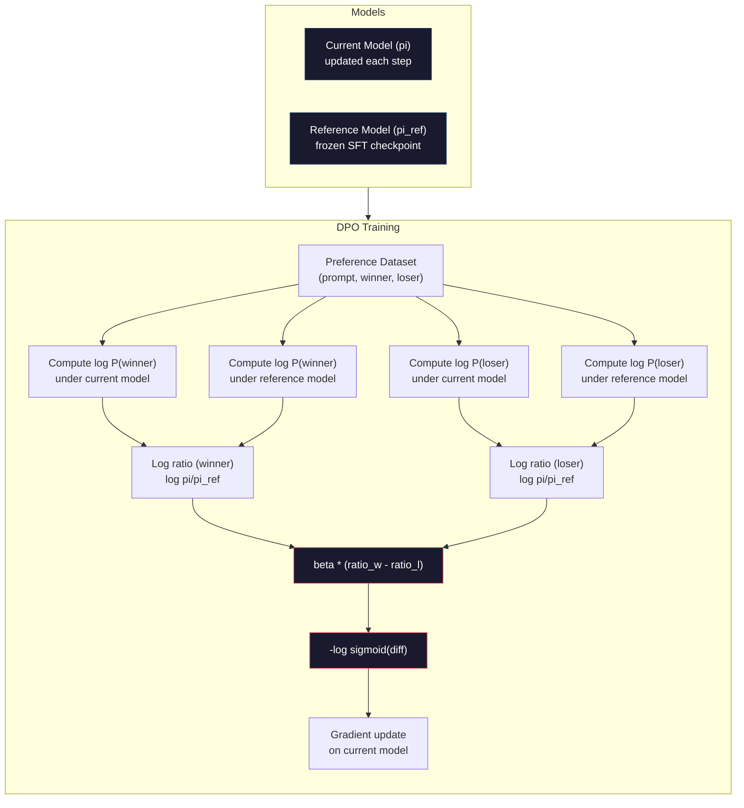

# DPO: Direct Preference Optimization  direct preference optimization

> RLHF hoạt động. Nó cũng đòi hỏi phải đào tạo ba mô hình (SFT, mô hình phần thưởng, chính sách), quản lý sự bất ổn của PPO, và điều chỉnh một hình phạt KL. DPO hỏi: nếu bạn có thể bỏ qua tất cả điều đó? DPO trực tiếp tối ưu hóa mô hình ngôn ngữ trên cặp ưu tiên. Không mô hình phần thưởng. Không PPO. Một vòng đào tạo. Kết quả tương tự.

> **【中文解读】**RLHF 需要训练三个模型(SFT、奖励模型、策略), cũng cần xử lý sự không ổn định của PPO──DPO 直接在偏好对上优化语言模型不需要奖励模型,不需要 PPO,一个训练循环,效果相当──

> **【拓展：DPO→简化对齐】**DPO là một chương trình thay thế RLHF được đề xuất bởi Stanford năm 2023, đã trở thành phương pháp đầu tiên cho nhiều mô hình nguồn mở như Zephyr、Tulu. Nó sẽ đơn giản hóa quá trình đào tạo phức tạp của RLHF thành một phân loại đơn giản.

>  **【前置】**学本节前请先掌握:Phase 10·07(RLHF) 理解RLHF 流程和它的问题(3个模型 + PPO 不稳定);PyTorch 监督学习基础──DPO là "RLHF không có RL" của toán học优雅, hiểu为什么有效需要看原文推导──

**Type:** Build
**Languages:** Python (with numpy)
**Prerequisites:** Phase 10, Lesson 07 (RLHF)
**Time:** ~90 minutes

>  **【类比】**DPO vs RLHF = 直接教育 vs 训练动物。RLHF:先训一个"老师"(RM) cho học sinh打分,再用 PPO 让学生讨老师欢心3个模型 + 复杂训练。DPO:直接给学生看"好答案"和"坏答案"对照,让它自己学1个模型 + 简单交叉──数学 DPO chứng minh"做分类在偏好数据上做分类"等于"RLHF's best-out",省去了显而易的 RM──

> ️ **【易错点】**DPO của 3 个坑:(1) **偏好数据质量决定一切**DPO không giống như RLHF có RM ồn ồn thanh thanh thanh thanh thanh thanh thanh thanh thanh thanh thanh thanh thanh thanh thanh thanh thanh thanh thanh thanh thanh thanh thanh thanh thanh thanh thanh thanh thanh thanh thanh thanh thanh thanh thanh thanh thanh thanh thanh thanh thanh thanh thanh thanh thanh thanh thanh thanh thanh thanh thanh thanh thanh thanh thanh thanh thanh thanh thanh thanh thanh thanh thanh thanh thanh thanh thanh thanh thanh thanh thanh thanh thanh thanh thanh thanh thanh thanh thanh thanh thanh thanh thanh thanh thanh thanh thanh thanh thanh thanh thanh thanh thanh thanh thanh thanh thanh thanh thanh thanh thanh thanh thanh thanh thanh thanh thanh thanh thanh thanh thanh thanh thanh thanh thanh thanh thanh thanh thanh thanh thanh thanh thanh thanh thanh thanh thanh thanh thanh thanh thanh thanh thanh thanh thanh thanh thanh thanh thanh thanh thanh thanh thanh thanh thanh thanh thanh thanh thanh thanh thanh thanh thanh thanh thanh thanh thanh thanh thanh thanh thanh thanh thanh thanh thanh thanh thanh thanh thanh thanh thanh thanh thanh thanh thanh thanh thanh thanh thanh thanh thanh thanh thanh thanh thanh thanh thanh thanh thanh thanh thanh thanh thanh thanh thanh thanh thanh thanh thanh thanh thanh thanh thanh thanh thanh thanh thanh thanh thanh thanh thanh thanh thanh thanh thanh thanh thanh thanh thanh thanh thanh thanh thanh thanh thanh thanh thanh thanh thanh thanh thanh thanh thanh thanh thanh thanh thanh thanh thanh thanh thanh thanh thanh thanh thanh thanh thanh thanh thanh thanh thanh thanh thanh thanh thanh thanh thanh thanh thanh thanh thanh thanh thanh thanh thanh thanh thanh thanh thanh thanh thanh thanh thanh thanh thanh thanh thanh thanh thanh thanh thanh thanh thanh thanh thanh thanh thanh thanh thanh thanh thanh thanh thanh thanh thanh thanh thanh thanh thanh thanh thanh thanh thanh thanh thanh thanh thanh thanh thanh thanh thanh thanh thanh thanh thanh thanh thanh thanh thanh thanh thanh thanh thanh thanh thanh thanh thanh thanh thanh thanh thanh thanh thanh thanh thanh thanh thanh thanh thanh thanh thanh thanh thanh thanh thanh thanh thanh thanh thanh thanh thanh thanh thanh thanh thanh thanh thanh thanh thanh thanh thanh thanh thanh thanh thanh thanh thanh thanh thanh thanh thanh thanh thanh thanh thanh thanh thanh thanh thanh thanh thanh thanh thanh thanh thanh thanh thanh thanh thanh thanh thanh thanh thanh thanh thanh thanh thanh thanh thanh thanh thanh thanh thanh thanh thanh thanh thanh thanh thanh thanh thanh thanh thanh thanh thanh thanh thanh thanh thanh thanh thanh thanh thanh thanh thanh thanh thanh thanh thanh thanh thanh thanh thanh thanh thanh thanh thanh thanh thanh thanh thanh thanh thanh thanh thanh thanh thanh thanh thanh thanh thanh thanh thanh thanh thanh thanh thanh thanh thanh thanh thanh thanh thanh thanh thanh thanh thanh thanh thanh thanh thanh thanh thanh thanh thanh thanh thanh thanh thanh thanh thanh thanh thanh thanh thanh thanh thanh thanh thanh thanh thanh thanh thanh**β 系数设错**太大(> 0.5)模型不变,太小(< 0.05)模型偏离 SFT 太远; điển hình 0.1──(3) **没做 reference model**DPO mất 需要相对 SFT 模型的日志-prob差分,忘记加载 ref model 会训练崩;用 `AutoModelForCausalLM.from_pretrained(sft_path)`Làm tham khảo.

## Mục tiêu học tập

- Thực hiện đào tạo DPO trực tiếp tối ưu hóa mô hình ngôn ngữ trên các cặp ưu tiên mà không có mô hình phần thưởng riêng biệt
  Thực hiện đào tạo DPO, trực tiếp trong sự ưu tiên đối với mô hình ngôn ngữ tối ưu hóa, không cần mô hình thưởng độc lập
- Thuộc dẫn hàm mất DPO và giải thích cách nó ngầm đại diện cho mô hình phần thưởng thông qua xác suất hồ sơ của chính sách
  推导 DPO 损失函数, giải thích nó bằng cách chiến lược đối với tỷ lệ xác suất số ẩn hình mô hình báo giá
- So sánh DPO vs RLHF về độ ổn định đào tạo, chi phí tính toán và số lượng mô hình cần thiết
  Về tính ổn định đào tạo, chi phí tính toán và số lượng mô hình cần thiết so sánh DPO với RLHF
- Điều chỉnh tham số beta để kiểm soát mức độ chính sách được đào tạo khác biệt với mô hình tham chiếu
  调节 beta 参数, kiểm soát chiến lược tập luyện chuyển hướng từ mô hình tham khảo

> **【中文解读】**本课实现 DPO(直接偏好优化),RLHF的简化替代方案──DPO的核心洞察: hàm thưởng tối ưu nhất có thể được đưa ra bởi ngôn ngữ mô hình bản thân token 概率 toán học, do đó không cần mô hình thưởng riêng lẻ──DPO sẽ đơn giản hóa RLHF thành một bước học tập giám sát  một mô hình、 một hàm mất mát、 một vòng tròn luyện tập──

## Vấn đề  vấn đề giới thiệu

Bạn đã xây dựng một đường ống RLHF trong Bài học 07. Ba giai đoạn. Ba mô hình. Mô hình SFT, mô hình phần thưởng và mô hình chính sách tối ưu hóa với PPO. Mô hình phần thưởng đơn độc đòi hỏi hàng ngàn cặp sở thích của con người và một vòng tròn đào tạo riêng biệt. PPO đòi hỏi phải điều chỉnh cẩn thận hệ số KL, tốc độ học tập, tỷ lệ clip và số thời kỳ.

> Bạn đã xây dựng RLHF 管线在第七课中.三个阶段.三个模型. SFT 模型. 奖励模型. 奖励模型. 奖励模型. 优化策略模型. 仅需要数千个个人类偏好对和单独训练循环.

Trong thực tế, đào tạo PPO là không ổn định. Những thay đổi siêu tham số nhỏ làm cho đào tạo khác nhau. Mô hình phần thưởng là một đại diện không hoàn hảo cho sở thích của con người, và chính sách tìm cách khai thác những điểm yếu của nó. Hình phạt KL giúp nhưng đòi hỏi sự điều chỉnh của riêng nó - quá thấp và bạn nhận được phần thưởng hack, quá cao và mô hình hầu như không học được.

> Trong thực tế, việc đào tạo của PPO được gọi là không ổn định. Những thay đổi siêu tử nhỏ có thể dẫn đến việc đào tạo lan rộng. Mô hình thưởng là một đại diện không hoàn hảo của sự thiên vị của con người, chiến lược sẽ tìm cách sử dụng điểm yếu của nó.

Sự phức tạp này là lý do tại sao hầu hết các mô hình nguồn mở đã phải vật lộn với RLHF trong nhiều năm sau khi InstructGPT được công bố.

> Sự phức tạp này là nguyên nhân khiến hầu hết các mô hình nguồn mở sau khi InstructGPT được phát hành trong nhiều năm qua khó sử dụng RLHF.

Vào tháng 5 năm 2023, Rafael Rafailov, Archit Sharma và các đồng nghiệp tại Stanford đã xuất bản "Direct Preference Optimization: Your Language Model Is Secretly a Reward Model". Chức năng phần thưởng tối ưu được xác định toán học bởi xác suất token của mô hình ngôn ngữ. Bạn có thể bỏ qua mô hình phần thưởng hoàn toàn và tối ưu hóa mô hình ngôn ngữ trực tiếp trên các cặp ưu tiên.

> Vào tháng 5 năm 2023, Rafael Rafailov, Archit Sharma và đồng nghiệp của Stanford đã xuất bản "Direct Preference Optimization: Your Language Model Is Secretly a Reward Model" (Tích ưu tiên trực tiếp: Mô hình ngôn ngữ của bạn là một mô hình phần thưởng bí mật)  quan trọng: bạn không cần mô hình phần thưởng độc lập  quan trọng nhất của hàm phần thưởng có thể được xác định bởi mô hình ngôn ngữ  xác suất toán học xác định  bạn có thể hoàn toàn nhảy qua mô hình phần thưởng, trực tiếp trong sự ưu tiên đối với mô hình ngôn ngữ tối ưu hóa 

DPO giảm RLHF thành một bước học tập được giám sát duy nhất. Một mô hình. Một chức năng mất mát. Một vòng lặp đào tạo. Không có học tập tăng cường. Zephyr-7B, một trong những mô hình đầu tiên sử dụng DPO ở quy mô, phù hợp hoặc đánh bại các mô hình được đào tạo với RLHF đầy đủ trên một số tiêu chuẩn. Meta sử dụng DPO như một phần của đường ống khớp Llama 3. Anthropic đã trích dẫn các phương pháp theo phong cách DPO trong nghiên cứu khớp của họ.

> DPO sẽ đơn giản hóa RLHF thành một bước học tập đơn giản. Một mô hình. Một hàm mất mát. Một vòng tròn đào tạo. Không cần phải có hóa chất mạnh. Zephyr-7B là một trong những mô hình DPO được sử dụng hàng loạt đầu tiên, được phù hợp hoặc vượt qua trong nhiều cơ sở.

> **【中文解读】**DPO đã giải quyết ba điểm đau khổ của RLHF: 1) không cần mô hình thưởng đào tạo độc lập; 2) không cần xử lý sự bất ổn và siêu điều kiện của PPO; 3) từ ba mô hình ống dẫn đường đơn giản hóa thành một vòng tròn đào tạo đơn lẻ. Zephyr-7B là một trong những mô hình sử dụng DPO hàng đầu, được sử dụng trên nhiều基准 để phù hợp hoặc vượt qua sử dụng mô hình đào tạo RLHF hoàn chỉnh.

> **【拓展：DPO 在开源社区的普及】**DPO đã trở thành phương pháp lựa chọn đầu tiên đối với mô hình nguồn mở. HuggingFace TRL 库原生支持 DPO,Zephyr,Tulu,OpenHermes 等知名开源模型都使用 DPO 替代 PPO──与RLHF相比,DPO 训练成本约为后者的 1/3(少一个奖励模型),且训练更稳定──Llama 3 训练对齐结合 DPO 和其他方法──

## Khái niệm cốt lõi

### Sự hiểu biết quan trọng

RLHF tối ưu hóa mục tiêu này:

> RLHF 优化这个目标:

R là mô hình phần thưởng, pi là chính sách, pi_ref là mô hình tham chiếu và beta là hệ số KL.

> Trong đó R là mô hình thưởng, pi là chiến lược, pi_ref là mô hình tham khảo, beta là KL.

Báo cáo của DPO cho thấy mục tiêu này có một giải pháp tối ưu trong dạng đóng.

> Bài luận của DPO cho thấy mục tiêu này có hình thức đóng kín tốt nhất. Đối với bất kỳ hàm thưởng nào R, chiến lược tốt nhất là:

nơi Z(x) là một liên tục bình thường hóa.

> Trong đó, Z(x) là归一化常数──重新排列:

Đây là bước đột phá. Phần thưởng được thể hiện hoàn toàn theo các xác suất của mô hình chính sách và xác suất của mô hình tham chiếu. Bạn không cần phải đào tạo mô hình phần thưởng riêng biệt. Phần thưởng là * ngầm * trong tỷ lệ xác suất.

> Đó là đột phá. Giải thưởng hoàn toàn dựa trên tỷ lệ tỷ lệ của mô hình chiến lược và tỷ lệ tỷ lệ của mô hình tham khảo. Bạn không cần phải đào tạo mô hình thưởng độc lập.

Thay thế cho mô hình ưu tiên Bradley-Terry:

> Đổi lại mô hình Bradley-Terry:

Các thuật ngữ Z(x) bị hủy bỏ bởi vì cả hai câu trả lời đều dựa trên cùng một prompt x. Những gì còn lại là một hàm của chỉ log-choáng lẽ của mô hình chính sách và log-choáng lẽ của mô hình tham chiếu trên các câu trả lời được ưa thích và bị từ chối.

> Z(x) 项消去了, vì hai lặp lại đều có cùng một prompt x vì điều kiện.

### Sự mất mát của DPO

```
L_DPO = -log(sigmoid(beta * (log pi(y_w|x)/pi_ref(y_w|x) - log pi(y_l|x)/pi_ref(y_l|x))))
```

Hãy mở gói từng mảnh:

> Hãy giải quyết từng phần:

- **y_w**= phản ứng ưu tiên (trận thắng)
- **y_l**= phản ứng bị từ chối (kết bại)
- **x**= nhanh chóng
- **pi**= mô hình hiện tại (được đào tạo)
- **pi_ref**= mô hình tham chiếu (trung kiểm tra SFT đóng băng)
- **beta**= tham số nhiệt độ kiểm soát sự lệch từ tham chiếu (thường là 0,1 đến 0,5)

> **【中文解读】**Cốt lõi của hàm DPO là "đối với tỷ lệ tỷ lệ tỷ lệ tỷ lệ tỷ lệ tỷ lệ tỷ lệ tỷ lệ tỷ lệ tỷ lệ tỷ lệ tỷ lệ tỷ lệ tỷ lệ tỷ lệ tỷ lệ tỷ lệ tỷ lệ tỷ lệ tỷ lệ tỷ lệ tỷ lệ tỷ lệ tỷ lệ tỷ lệ tỷ lệ tỷ lệ tỷ lệ tỷ lệ tỷ lệ tỷ lệ tỷ lệ tỷ lệ tỷ lệ tỷ lệ tỷ lệ tỷ lệ tỷ lệ tỷ lệ tỷ lệ tỷ lệ tỷ lệ tỷ lệ tỷ lệ tỷ lệ tỷ lệ tỷ lệ tỷ lệ tỷ lệ tỷ lệ tỷ lệ tỷ lệ tỷ lệ tỷ lệ tỷ lệ tỷ lệ tỷ lệ tỷ lệ tỷ lệ tỷ lệ tỷ lệ tỷ lệ tỷ lệ tỷ lệ tỷ lệ tỷ lệ tỷ lệ tỷ lệ tỷ lệ tỷ lệ tỷ lệ tỷ lệ tỷ lệ tỷ lệ tỷ lệ tỷ lệ tỷ lệ tỷ lệ tỷ lệ tỷ lệ tỷ lệ tỷ lệ tỷ lệ tỷ lệ tỷ lệ tỷ lệ tỷ lệ tỷ lệ tỷ lệ tỷ lệ tỷ lệ tỷ lệ tỷ lệ tỷ lệ tỷ lệ tỷ lệ tỷ lệ tỷ lệ tỷ lệ tỷ lệ tỷ lệ tỷ lệ tỷ lệ tỷ lệ tỷ lệ tỷ lệ tỷ lệ tỷ lệ tỷ lệ tỷ lệ tỷ lệ tỷ lệ tỷ lệ tỷ lệ tỷ lệ tỷ lệ tỷ lệ tỷ lệ tỷ lệ tỷ lệ tỷ lệ tỷ lệ tỷ lệ tỷ lệ tỷ lệ tỷ lệ tỷ lệ tỷ lệ tỷ lệ tỷ lệ tỷ lệ tỷ lệ tỷ lệ tỷ lệ tỷ lệ tỷ lệ tỷ lệ tỷ lệ tỷ lệ tỷ lệ tỷ số tỷ số tỷ số tỷ số tỷ số tỷ số tỷ số tỷ tỷ tỷ tỷ tỷ tỷ tỷ tỷ tỷ tỷ tỷ tỷ tỷ tỷ tỷ tỷ tỷ tỷ tỷ tỷ tỷ tỷ tỷ tỷ tỷ tỷ tỷ tỷ tỷ tỷ tỷ tỷ tỷ tỷ tỷ tỷ tỷ tỷ tỷ tỷ tỷ tỷ tỷ tỷ tỷ tỷ tỷ tỷ tỷ tỷ tỷ tỷ tỷ tỷ tỷ tỷ tỷ tỷ tỷ tỷ tỷ tỷ tỷ tỷ tỷ tỷ tỷ tỷ tỷ tỷ tỷ tỷ tỷ tỷ tỷ tỷ tỷ tỷ tỷ tỷ tỷ tỷ tỷ tỷ tỷ tỷ tỷ tỷ tỷ tỷ tỷ tỷ tỷ tỷ tỷ tỷ tỷ tỷ tỷ tỷ tỷ tỷ tỷ tỷ tỷ tỷ tỷ tỷ tỷ tỷ tỷ tỷ tỷ tỷ tỷ tỷ tỷ tỷ tỷ tỷ tỷ tỷ tỷ tỷ tỷ tỷ tỷ tỷ tỷ tỷ tỷ tỷ tỷ tỷ tỷ tỷ tỷ tỷ tỷ tỷ tỷ tỷ tỷ tỷ tỷ tỷ tỷ tỷ tỷ tỷ tỷ tỷ tỷ tỷ tỷ tỷ tỷ tỷ tỷ tỷ tỷ tỷ tỷ tỷ tỷ tỷ tỷ tỷ tỷ tỷ tỷ tỷ tỷ tỷ tỷ tỷ tỷ tỷ tỷ tỷ tỷ tỷ tỷ tỷ tỷ tỷ tỷ tỷ tỷ tỷ tỷ tỷ tỷ tỷ tỷ tỷ tỷ tỷ tỷ tỷ tỷ tỷ tỷ tỷ

> **【拓展：DPO 的数学直觉】**Sự đột phá của DPO nằm trong việc biểu hiện hàm thưởng " ẩn" trong RLHF cho mô hình chiến lược và tỷ lệ tỷ lệ mô hình tham khảo: R(x,y) = beta * log(pi(y) / pi_ref(yx)) + const.

Tỷ lệ`log pi(y|x) / pi_ref(y|x)`là tỷ lệ xác suất log. Khi tỷ lệ này tích cực, mô hình hiện tại gán xác suất cao hơn cho phản ứng y so với tham chiếu. Khi âm, mô hình hiện tại gán xác suất thấp hơn.

> tỷ lệ`log pi(y|x) / pi_ref(y|x)`là tỷ lệ tỷ lệ tỷ lệ tỷ lệ tỷ lệ tỷ lệ tỷ lệ tỷ lệ tỷ lệ tỷ lệ tỷ lệ tỷ lệ tỷ lệ tỷ lệ tỷ lệ tỷ lệ tỷ lệ tỷ lệ tỷ lệ tỷ lệ tỷ lệ tỷ lệ tỷ lệ tỷ lệ tỷ lệ tỷ lệ tỷ lệ tỷ lệ tỷ lệ tỷ lệ tỷ lệ tỷ lệ tỷ lệ tỷ lệ tỷ lệ tỷ lệ tỷ lệ tỷ lệ tỷ lệ tỷ lệ tỷ lệ tỷ lệ tỷ lệ tỷ lệ tỷ lệ tỷ lệ tỷ lệ tỷ lệ tỷ lệ tỷ lệ tỷ lệ tỷ lệ tỷ lệ tỷ lệ tỷ lệ tỷ lệ tỷ lệ tỷ lệ tỷ lệ tỷ lệ tỷ lệ tỷ lệ tỷ lệ tỷ lệ tỷ lệ tỷ lệ tỷ lệ tỷ lệ tỷ lệ tỷ lệ tỷ lệ tỷ lệ tỷ lệ tỷ lệ tỷ lệ tỷ lệ tỷ lệ tỷ lệ tỷ lệ tỷ lệ tỷ lệ tỷ lệ tỷ lệ tỷ lệ tỷ lệ tỷ lệ tỷ lệ tỷ lệ tỷ lệ tỷ lệ tỷ lệ tỷ lệ tỷ lệ tỷ lệ tỷ lệ tỷ lệ tỷ lệ tỷ lệ tỷ lệ tỷ lệ tỷ lệ tỷ lệ tỷ lệ tỷ lệ tỷ lệ tỷ lệ tỷ lệ tỷ lệ tỷ lệ tỷ lệ tỷ lệ tỷ lệ tỷ lệ tỷ lệ tỷ lệ tỷ lệ tỷ lệ tỷ lệ tỷ lệ tỷ lệ tỷ lệ tỷ lệ tỷ lệ tỷ lệ tỷ lệ tỷ lệ tỷ lệ tỷ lệ tỷ lệ tỷ lệ tỷ lệ tỷ số tỷ số tỷ số tỷ số tỷ số tỷ số tỷ số tỷ số tỷ số tỷ số tỷ số tỷ số tỷ số tỷ số tỷ số tỷ số tỷ số tỷ số tỷ số tỷ số tỷ số tỷ số tỷ số tỷ số tỷ số tỷ số tỷ số tỷ số tỷ số tỷ số tỷ số tỷ số tỷ số tỷ số tỷ số tỷ số tỷ số tỷ số tỷ số tỷ số tỷ số tỷ số tỷ số tỷ số tỷ số tỷ số tỷ số tỷ số tỷ số tỷ số tỷ số tỷ số tỷ số tỷ số tỷ số tỷ số tỷ số tỷ số tỷ số tỷ số tỷ số tỷ số tỷ số tỷ số tỷ số tỷ số tỷ số tỷ số tỷ số tỷ số tỷ số tỷ số tỷ số tỷ số tỷ số tỷ số tỷ số tỷ số tỷ số tỷ số tỷ số tỷ số tỷ số tỷ số tỷ số tỷ số tỷ số tỷ số tỷ số tỷ số tỷ số tỷ số tỷ số tỷ số tỷ số tỷ số tỷ số tỷ số tỷ số tỷ số tỷ số tỷ số tỷ số tỷ số tỷ số tỷ số tỷ số tỷ số tỷ số tỷ số tỷ số tỷ số tỷ số tỷ số tỷ số tỷ số tỷ số tỷ số tỷ số tỷ số tỷ số tỷ số tỷ số tỷ

Sự mất mát DPO thúc đẩy mô hình tăng tỷ lệ xác suất log cho các phản ứng ưa thích và giảm nó cho các phản ứng bị từ chối. Biểu tượng beta kiểm soát mô hình có thể lệch cách dữ dội từ tham chiếu - beta nhỏ có nghĩa là các lệch lớn được phép, beta lớn giữ cho mô hình gần tham chiếu.

> DPO  mất thúc đẩy mô hình tăng tỷ lệ tỷ lệ tỷ lệ tỷ lệ tỷ lệ tỷ lệ tỷ lệ tỷ lệ tỷ lệ tỷ lệ tỷ lệ tỷ lệ tỷ lệ tỷ lệ tỷ lệ tỷ lệ tỷ lệ tỷ lệ tỷ lệ tỷ lệ tỷ lệ tỷ lệ tỷ lệ tỷ lệ tỷ lệ tỷ lệ tỷ lệ tỷ lệ tỷ lệ tỷ lệ tỷ lệ tỷ lệ tỷ lệ tỷ lệ tỷ lệ tỷ lệ tỷ lệ tỷ lệ tỷ lệ tỷ lệ tỷ lệ tỷ lệ tỷ lệ tỷ lệ tỷ lệ tỷ lệ tỷ lệ tỷ lệ tỷ lệ tỷ lệ tỷ lệ tỷ lệ tỷ lệ tỷ lệ tỷ lệ tỷ lệ tỷ lệ tỷ lệ tỷ lệ tỷ lệ tỷ lệ tỷ lệ tỷ lệ tỷ lệ tỷ lệ tỷ lệ tỷ lệ tỷ lệ tỷ lệ tỷ lệ tỷ lệ tỷ lệ tỷ lệ tỷ lệ tỷ lệ tỷ lệ tỷ lệ tỷ lệ tỷ lệ tỷ lệ tỷ lệ tỷ lệ tỷ lệ tỷ lệ tỷ lệ tỷ lệ tỷ lệ tỷ lệ tỷ lệ tỷ lệ tỷ lệ tỷ lệ tỷ lệ tỷ lệ tỷ lệ tỷ lệ tỷ lệ tỷ lệ tỷ lệ tỷ lệ tỷ lệ tỷ lệ tỷ lệ tỷ lệ tỷ lệ tỷ lệ tỷ lệ tỷ lệ tỷ lệ tỷ lệ tỷ lệ tỷ lệ tỷ lệ tỷ lệ tỷ lệ tỷ lệ tỷ lệ tỷ lệ tỷ lệ tỷ lệ tỷ lệ tỷ lệ tỷ lệ tỷ lệ tỷ lệ tỷ lệ tỷ lệ tỷ lệ tỷ lệ tỷ lệ tỷ lệ tỷ lệ tỷ lệ tỷ lệ tỷ lệ tỷ lệ tỷ lệ tỷ lệ tỷ lệ tỷ lệ tỷ lệ tỷ lệ tỷ lệ tỷ tỷ tỷ tỷ lệ tỷ lệ tỷ tỷ tỷ tỷ tỷ tỷ tỷ tỷ tỷ tỷ tỷ tỷ tỷ tỷ tỷ tỷ tỷ tỷ tỷ tỷ tỷ tỷ tỷ tỷ tỷ tỷ tỷ tỷ tỷ tỷ tỷ tỷ tỷ tỷ tỷ tỷ tỷ tỷ tỷ tỷ tỷ tỷ tỷ tỷ tỷ tỷ tỷ tỷ tỷ tỷ tỷ tỷ tỷ tỷ tỷ tỷ tỷ tỷ tỷ tỷ tỷ tỷ tỷ tỷ tỷ tỷ tỷ tỷ tỷ tỷ tỷ tỷ tỷ tỷ tỷ tỷ tỷ tỷ tỷ tỷ tỷ tỷ tỷ tỷ tỷ tỷ tỷ tỷ tỷ tỷ tỷ tỷ tỷ tỷ tỷ tỷ tỷ tỷ tỷ tỷ tỷ tỷ tỷ tỷ tỷ tỷ tỷ tỷ tỷ tỷ tỷ tỷ tỷ tỷ tỷ tỷ tỷ tỷ tỷ tỷ tỷ tỷ tỷ tỷ tỷ tỷ tỷ tỷ tỷ tỷ tỷ tỷ tỷ tỷ tỷ tỷ tỷ tỷ tỷ tỷ tỷ tỷ tỷ tỷ tỷ tỷ tỷ tỷ tỷ tỷ tỷ tỷ tỷ tỷ tỷ tỷ tỷ tỷ tỷ tỷ tỷ tỷ tỷ tỷ tỷ tỷ tỷ tỷ tỷ tỷ tỷ tỷ tỷ tỷ tỷ tỷ tỷ tỷ tỷ tỷ tỷ tỷ tỷ tỷ tỷ tỷ tỷ tỷ tỷ tỷ tỷ tỷ tỷ tỷ tỷ tỷ tỷ tỷ tỷ tỷ tỷ tỷ tỷ tỷ tỷ tỷ tỷ tỷ



### Tại sao DPO đơn giản hơn

| Aspect | RLHF (PPO) | DPO |
|--------|-----------|-----|
| Models to train | 3 (SFT + reward + policy) | 1 (policy only) |
| Training loops | 3 (SFT, RM training, PPO) | 2 (SFT, DPO) |
| Hyperparameters | lr, KL coeff, clip ratio, RM lr, epochs x3 | lr, beta, epochs |
| Reward model | Required (separate training) | Implicit in model probabilities |
| RL algorithm | PPO (complex, unstable) | Supervised learning (stable) |
| GPU memory | 3-4 models in memory during PPO | 2 models (current + reference) |
| Training stability | Sensitive to hyperparameters | Robust, similar to SFT |

DPO cần hai mô hình trong bộ nhớ trong quá trình đào tạo - mô hình hiện tại và tham chiếu đóng băng. RLHF cần ba hoặc bốn: chính sách, tham chiếu, mô hình phần thưởng, và tùy chọn là một hàm giá trị cơ sở. Đối với mô hình 70B, mỗi bản sao mất 140GB trong FP16.

> DPO  đào tạo cần hai mô hình trong bộ nhớ  mô hình hiện tại và mô hình tham khảo kết thúc  RLHF  cần ba hoặc bốn mô hình: chiến lược  tham khảo  thưởng, cũng như các hàm giá trị có thể chọn . Đối với mô hình 70B, mỗi bản trong FP16 chiếm 140GB.

### Khi DPO đánh bại RLHF

**Small datasets.**Với 5.000-20.000 cặp ưu tiên, DPO thường phù hợp hoặc vượt quá RLHF. Mô hình phần thưởng trong RLHF cần đủ dữ liệu để tổng quát - với dữ liệu hạn chế, nó vượt quá và tạo ra tín hiệu phần thưởng không đáng tin cậy. DPO bỏ qua vấn đề này bằng cách không cần mô hình phần thưởng.

> **小型数据集。**Có 5.000-20.000 người thích đối với thời gian, DPO thường phù hợp hoặc vượt quá RLHF.

**Limited compute.**DPO đòi hỏi khoảng một phần ba tính toán của RLHF đầy đủ (một vòng đào tạo thay vì ba). Đối với các nhóm không có cluster GPU lớn, đây là lựa chọn thực tế.

> **有限算力。**DPO 大约 chỉ cần một bộ RLHF hoàn chỉnh 三分之一的计算量(một vòng tập luyện chứ không phải ba) ⋅ Đối với một nhóm không có GPU 集群 lớn, đây là lựa chọn thực tế。

**Rapid iteration.**Bạn muốn thử 10 bộ dữ liệu sở thích khác nhau để xem mô hình nào tạo ra mô hình tốt nhất? DPO cho phép bạn chạy mỗi thí nghiệm trong vài giờ. RLHF yêu cầu đào tạo lại mô hình phần thưởng cho mỗi bộ dữ liệu.

> **快速迭代。**想尝试10不同的偏好数据集看哪个产出最好的模型?DPO 让你在几小时内运行每个实验――RLHF 需要为每个数据集重新训练奖励模型――

### Khi RLHF đánh bại DPO

**Large-scale training.**Trên quy mô của GPT-4 hoặc Claude, mô hình phần thưởng riêng biệt của RLHF có thể thu thập các tín hiệu ưu tiên sắc thái hơn. mô hình phần thưởng hoạt động như một hàm mất học được thích nghi với các tiêu chí chất lượng phức tạp.

> **大规模训练。**Trên quy mô GPT-4 hoặc Claude, mô hình thưởng độc lập của RLHF có thể nắm bắt các tín hiệu ưu tiên chi tiết hơn.

**Complex reward signals.**Khi "tốt hơn" liên quan đến nhiều chiều (hữu ích, vô hại, trung thực), một mô hình phần thưởng có thể học được sự thỏa hiệp đa mục tiêu này. DPO đối xử với mỗi cặp ưu tiên như một tín hiệu nhị phân - một tốt hơn, một tồi tệ hơn - mà không mô hình lý do tại sao.

> **复杂奖励信号。**Khi "tốt hơn" liên quan đến nhiều chiều ((công dụng, vô hại, trung thực) mô hình thưởng có thể học được cân bằng đa mục tiêu này.

**Iterative alignment.**Các đường ống RLHF có thể tạo ra các phản ứng mới với chính sách hiện tại, người ta có thể đánh giá chúng và đào tạo lại mô hình phần thưởng trong vòng lặp trực tuyến. DPO hoạt động trên một tập dữ liệu cố định của các cặp ưu tiên. AI hiến pháp (nghĩa cách của Anthropic) sử dụng tính năng lặp lại này của RLHF rộng rãi.

> **迭代对齐。**RLHF 管线 có thể sử dụng các chiến lược hiện tại để tạo ra những phản hồi mới, để tạo ra đánh giá cho con người, và tái tập luyện mô hình thưởng trong vòng tròn trực tuyến.

### Ngoài DPO: KTO, ORPO, SimPO

DPO đã truyền cảm hứng cho một gia đình các phương pháp sắp xếp đơn giản.

> DPO đã khởi động một loạt các phương pháp đơn giản hóa đối với các công ty.

**KTO (Kahneman-Tversky Optimization, 2024):**Anh thậm chí không cần đôi. KTO làm việc với phản hồi không cặp - chỉ cần dán nhãn mỗi phản ứng là "tốt" hoặc "xấu" mà không so sánh nó với một lựa chọn thay thế. Điều này làm đơn giản hóa đáng kể việc thu thập dữ liệu. Thay vì cho các nhà ghi chú 2 câu trả lời và hỏi "cái nào tốt hơn?", bạn cho thấy một câu trả lời và hỏi "Điều này tốt không?"

> **KTO（Kahneman-Tversky 优化，2024）：**Bạn thậm chí không cần phải đối phó. KTO sử dụng không đối phó. Chỉ cần đánh dấu mỗi phản ứng là "tốt" hoặc " xấu", không cần so sánh với các thay thế.

**ORPO (Odds Ratio Preference Optimization, 2024):**Kết hợp SFT và sắp xếp trong một bước đào tạo duy nhất. Thay vì làm SFT trước tiên sau đó là DPO, ORPO sửa đổi lỗ SFT để bao gồm một tín hiệu ưu tiên.

> **ORPO（赔率比偏好优化，2024）：**Trong các bước tập đơn, kết hợp SFT và đối với nhau. ORPO  sửa đổi SFT  lỗ để chứa tín hiệu ưu tiên, thay vì làm SFT và làm DPO.

**SimPO (Simple Preference Optimization, 2024):**Tránh hoàn toàn mô hình tham chiếu. Thay vì tính toán tỷ lệ xác suất log-chỉ lệ chống lại tham chiếu đóng băng, SimPO sử dụng tỷ lệ xác suất log trung bình của phản ứng (được bình thường hóa bằng chiều dài) như là phần thưởng ngầm. Điều này tiết kiệm bộ nhớ (không cần mô hình tham chiếu) và đơn giản hóa đào tạo.

> **SimPO（简单偏好优化，2024）：**完全消除参考模型──SimPO sử dụng回复的平均对数概率 (平均对数概率) 按长度归化) như một phần thưởng ẩn, chứ không phải là dành cho 结的参考计算对数概率比──这节省内存(无需参考模型)并简化训练──长度归化防止模型偏向更短的回复──

| Method | Year | Models in Memory | Needs Pairs? | Needs Reference? | Training Loops |
|--------|------|-----------------|-------------|-----------------|----------------|
| RLHF | 2022 | 3-4 | Yes (for RM) | Yes | 3 |
| DPO | 2023 | 2 | Yes | Yes | 2 |
| KTO | 2024 | 2 | No (unpaired) | Yes | 2 |
| ORPO | 2024 | 1 | Yes | No | 1 |
| SimPO | 2024 | 1 | Yes | No | 1 |

Xu hướng rõ ràng: mỗi phương pháp loại bỏ thêm một phần phức tạp. RLHF cần một mô hình phần thưởng và PPO. DPO loại bỏ cả hai. KTO loại bỏ dữ liệu cặp. ORPO loại bỏ giai đoạn SFT riêng biệt. SimPO loại bỏ mô hình tham chiếu. Thuế sắp xếp - chi phí tính toán và phức tạp khi chuyển từ mô hình cơ bản sang mô hình sắp xếp - tiếp tục giảm.

> 趋势 rất rõ ràng: mỗi phương pháp loại bỏ một sự phức tạp. RLHF 需要奖励模型和PPO.DPO 消除两者. KTO 消除配对数据.ORPO 消除单独的SFT阶段.

### Việc triển khai DPO thực sự

**Zephyr-7B (HuggingFace, October 2023):**Mistral 7B cơ sở, SFT trên UltraChat (200K ví dụ), sau đó DPO trên UltraFeedback (60K cặp ưu tiên). Điểm 6.47 trên MT-Bench - mô hình 7B cao nhất vào thời điểm đó. Để so sánh, Llama 2 Chat 70B đạt 6.86, nghĩa là Zephyr có trong 6% của mô hình 10x kích thước của nó chỉ sử dụng sự sắp xếp DPO.

> **Zephyr-7B（HuggingFace，2023 年 10 月）：**Mistral 7B  cơ sở mô hình, làm SFT trên UltraChat(200K 样本) sau đó làm DPO trên UltraFeedback(60K  ưu tiên đối với) MT-Bench đạt điểm 6.47 cao nhất 7B  mô hình thời đó.

**Llama 3 (Meta, April 2024):**DPO được sử dụng sau giai đoạn RLHF ban đầu. Sự kết hợp cho thấy DPO và RLHF có thể là bổ sung - RLHF cho sự sắp xếp rộng, DPO cho tinh chỉnh nhắm mục tiêu.

> **Llama 3（Meta，2024 年 4 月）：**Trong giai đoạn đầu của RLHF sau đó sử dụng DPO.

**Neural Magic / nm-chat (2024):**DPO được áp dụng cho nhiều mô hình nguồn mở, liên tục cho thấy cải thiện 5-15% về các tiêu chuẩn sắp xếp so với các đường cơ sở chỉ dành cho SFT.

> **Neural Magic / nm-chat（2024）：**DPO được áp dụng cho nhiều mô hình nguồn mở, trong đó có sự tăng trưởng 5-15% so với đường cơ sở SFT tinh khiết.

## Hãy xây dựng nó.
```figure
dpo-loss
```

## Hãy xây dựng nó

### Bước 1: Bộ dữ liệu sở thích

cùng định dạng như RLHF -- (quan, ưa thích, từ chối) gấp ba. DPO tiêu thụ dữ liệu này trực tiếp mà không có mô hình phần thưởng trung gian.

> 格式与 RLHF 相同(quan, 首选, 被拒绝) 三元组──DPO 直接消费这些数据,无需中间的奖励模型──

```python
import numpy as np
import sys
import os
sys.path.insert(0, os.path.join(os.path.dirname(__file__), "..", "..", "04-pre-training-mini-gpt", "code"))
from main import MiniGPT, LayerNorm, Embedding, TransformerBlock

PREFERENCE_DATA = [
    {
        "prompt": "What is the capital of France?",
        "preferred": "The capital of France is Paris.",
        "rejected": "France is a country in Europe. It has many cities. The capital is Paris. Paris is known for the Eiffel Tower.",
    },
    {
        "prompt": "Explain gravity in one sentence.",
        "preferred": "Gravity is the force that attracts objects with mass toward each other.",
        "rejected": "Gravity is something that makes things fall down when you drop them.",
    },
    {
        "prompt": "What is 15 times 7?",
        "preferred": "15 times 7 is 105.",
        "rejected": "Let me think about this. 15 times 7. Well, 10 times 7 is 70, and 5 times 7 is 35, so the answer might be around 105.",
    },
    {
        "prompt": "Name three programming languages.",
        "preferred": "Python, Rust, and TypeScript.",
        "rejected": "There are many programming languages. Some popular ones include various languages like Python and others.",
    },
    {
        "prompt": "What year did World War II end?",
        "preferred": "World War II ended in 1945.",
        "rejected": "World War II was a major global conflict. It involved many countries. The war ended in the mid-1940s, specifically in 1945.",
    },
    {
        "prompt": "Define machine learning.",
        "preferred": "Machine learning is a field where algorithms learn patterns from data to make predictions without being explicitly programmed.",
        "rejected": "Machine learning is a type of AI. AI stands for artificial intelligence. Machine learning uses data to learn.",
    },
]
```

### Bước 2: Khoảng khả năng ghi nhật ký chuỗi

Thiếu phí DPO đòi hỏi tính toán tổng xác suất log của một phản ứng được đưa ra một prompt. Điều này có nghĩa là chạy mô hình trên chuỗi đầy đủ (prompt + response) và tổng hợp các xác suất log của mỗi token phản ứng.

> DPO mất mát cần tính toán cho một thời gian ngắn 下回复的总对数概率── nghĩa là chạy trên mô hình chuỗi hoàn chỉnh,并 đối với mỗi lần lặp token của số lượng概率求和──

```python
def tokenize_sequence(text, vocab_size=256):
    return [min(t, vocab_size - 1) for t in list(text.encode("utf-8"))]


def compute_sequence_log_prob(model, prompt_tokens, response_tokens, max_seq_len=128):
    full_sequence = prompt_tokens + response_tokens
    if len(full_sequence) > max_seq_len:
        full_sequence = full_sequence[:max_seq_len]

    if len(full_sequence) < 2:
        return 0.0

    input_ids = np.array(full_sequence[:-1]).reshape(1, -1)
    target_ids = np.array(full_sequence[1:])

    logits = model.forward(input_ids)
    logits = logits[0]

    max_logits = logits.max(axis=-1, keepdims=True)
    log_probs = logits - max_logits - np.log(
        np.exp(logits - max_logits).sum(axis=-1, keepdims=True)
    )

    prompt_len = len(prompt_tokens)
    response_start = max(0, prompt_len - 1)
    response_end = len(target_ids)

    if response_start >= response_end:
        return 0.0

    response_log_probs = log_probs[response_start:response_end, :]
    response_targets = target_ids[response_start:response_end]

    total_log_prob = 0.0
    for i, target in enumerate(response_targets):
        total_log_prob += response_log_probs[i, target]

    return total_log_prob
```

Chức năng này là con ngựa làm việc của DPO. Đối với mỗi cặp ưu tiên, nó chạy bốn lần: mô hình phản ứng ưu tiên, mô hình phản ứng từ chối, tham chiếu phản ứng ưu tiên, tham chiếu phản ứng từ chối. Đó là 4 vượt qua trước mỗi ví dụ đào tạo so với thế hệ RLHF + điểm số phần thưởng + ước tính giá trị + cập nhật PPO. đơn giản hơn, nhanh hơn, ổn định hơn.

> Phụng này là sức mạnh chính của DPO. Đối với mỗi sự lựa chọn đối với, nó hoạt động bốn lần: mô hình trong đầu tiên  trả lời    mô hình trong được từ chối   mô hình trong đầu tiên                                                                                                                                                                                                                                                                                                                                                                                                                                                                           

### Bước 3: Sự mất mát của DPO

Một chức năng, một lỗ, không có mô hình phần thưởng.

> 论文核心的代码实现――一个函数――一个损失――无需奖励模型――

```python
def sigmoid(x):
    return np.where(
        x >= 0,
        1.0 / (1.0 + np.exp(-x)),
        np.exp(x) / (1.0 + np.exp(x))
    )


def dpo_loss(policy_logprob_preferred, policy_logprob_rejected,
             ref_logprob_preferred, ref_logprob_rejected, beta=0.1):
    preferred_ratio = policy_logprob_preferred - ref_logprob_preferred
    rejected_ratio = policy_logprob_rejected - ref_logprob_rejected

    logit = beta * (preferred_ratio - rejected_ratio)

    loss = -np.log(sigmoid(logit) + 1e-8)

    preferred_reward = beta * preferred_ratio
    rejected_reward = beta * rejected_ratio

    return loss, {
        "preferred_ratio": float(preferred_ratio),
        "rejected_ratio": float(rejected_ratio),
        "logit": float(logit),
        "implicit_preferred_reward": float(preferred_reward),
        "implicit_rejected_reward": float(rejected_reward),
        "reward_margin": float(preferred_reward - rejected_reward),
    }
```

- `preferred_ratio`và `rejected_ratio`là tỷ lệ xác suất log từ dẫn xuất DPO. Khi mô hình hiện tại gán xác suất cao hơn cho phản ứng ưa thích (các đối với tham chiếu) và xác suất thấp hơn cho phản ứng bị từ chối, logit là tích cực và mất mát thấp. tín hiệu đào tạo đẩy mô hình theo hướng này chính xác.

> `preferred_ratio`和 `rejected_ratio`là tỷ lệ xác suất đối số trong DPO 推. Khi mô hình hiện tại cho phép phân phối đầu tiên trả lại phân phối cao hơn tỷ lệ xác suất (trong khi mô hình tham khảo) và được từ chối phân phối thấp hơn tỷ lệ xác suất, logic vì đúng và mất mát thấp.

- `implicit_preferred_reward`và `implicit_rejected_reward`là phần thưởng mà mất DPO vô nghĩa chỉ định. Bạn có thể lấy chúng để xác minh rằng đào tạo đang hoạt động - khoảng cách giữa phần thưởng được ưu tiên và bị từ chối nên tăng lên so với đào tạo.

> `implicit_preferred_reward`和 `implicit_rejected_reward`Đó là những phần thưởng được phân phối theo cách ẩn dật của DPO. Bạn có thể lấy chúng để kiểm tra liệu việc đào tạo có hiệu quả hay không.

### Bước 4: Loop đào tạo DPO

Một vòng tập huấn theo dõi tiêu chuẩn, không có PPO, không có mô hình thưởng, chỉ cần chuyển tiếp và cập nhật gradient.

> 标准的监督学习训练循环──无需PPO──无需奖励模型──只有前向传播和梯度更新──

```python
def copy_model_weights(source, target):
    target.embedding.token_embed = source.embedding.token_embed.copy()
    target.embedding.pos_embed = source.embedding.pos_embed.copy()
    target.ln_f.gamma = source.ln_f.gamma.copy()
    target.ln_f.beta = source.ln_f.beta.copy()
    for s_block, t_block in zip(source.blocks, target.blocks):
        t_block.attn.W_q = s_block.attn.W_q.copy()
        t_block.attn.W_k = s_block.attn.W_k.copy()
        t_block.attn.W_v = s_block.attn.W_v.copy()
        t_block.attn.W_out = s_block.attn.W_out.copy()
        t_block.ffn.W1 = s_block.ffn.W1.copy()
        t_block.ffn.W2 = s_block.ffn.W2.copy()
        t_block.ffn.b1 = s_block.ffn.b1.copy()
        t_block.ffn.b2 = s_block.ffn.b2.copy()
        t_block.ln1.gamma = s_block.ln1.gamma.copy()
        t_block.ln1.beta = s_block.ln1.beta.copy()
        t_block.ln2.gamma = s_block.ln2.gamma.copy()
        t_block.ln2.beta = s_block.ln2.beta.copy()


def dpo_train(policy_model, reference_model, preference_data,
              num_epochs=5, lr=5e-6, beta=0.1, max_seq_len=128):
    print(f"DPO Training: {len(preference_data)} pairs, {num_epochs} epochs, "
          f"lr={lr}, beta={beta}")
    print()

    losses = []
    margins = []

    for epoch in range(num_epochs):
        epoch_loss = 0.0
        epoch_margin = 0.0
        num_examples = 0

        indices = np.random.permutation(len(preference_data))

        for idx in indices:
            pair = preference_data[idx]

            prompt_tokens = tokenize_sequence(pair["prompt"])
            preferred_tokens = tokenize_sequence(pair["preferred"])
            rejected_tokens = tokenize_sequence(pair["rejected"])

            pi_logprob_w = compute_sequence_log_prob(
                policy_model, prompt_tokens, preferred_tokens, max_seq_len
            )
            pi_logprob_l = compute_sequence_log_prob(
                policy_model, prompt_tokens, rejected_tokens, max_seq_len
            )
            ref_logprob_w = compute_sequence_log_prob(
                reference_model, prompt_tokens, preferred_tokens, max_seq_len
            )
            ref_logprob_l = compute_sequence_log_prob(
                reference_model, prompt_tokens, rejected_tokens, max_seq_len
            )

            loss, metrics = dpo_loss(
                pi_logprob_w, pi_logprob_l,
                ref_logprob_w, ref_logprob_l, beta
            )

            update_direction = 1.0 if metrics["logit"] < 0 else -0.1
            for block in policy_model.blocks:
                block.ffn.W1 += lr * update_direction * np.random.randn(*block.ffn.W1.shape) * 0.01
                block.ffn.W2 += lr * update_direction * np.random.randn(*block.ffn.W2.shape) * 0.01

            epoch_loss += loss
            epoch_margin += metrics["reward_margin"]
            num_examples += 1
            losses.append(float(loss))
            margins.append(metrics["reward_margin"])

        avg_loss = epoch_loss / max(num_examples, 1)
        avg_margin = epoch_margin / max(num_examples, 1)

        print(f"  Epoch {epoch + 1}/{num_epochs} | Loss: {avg_loss:.4f} | "
              f"Avg Margin: {avg_margin:.4f}")

    return policy_model, losses, margins
```

Loop đào tạo là dễ dàng khi so sánh với RLHF. Đối với mỗi cặp ưu tiên: tính toán bốn xác suất log ( hai mô hình, hai phản ứng), kết nối chúng vào mất DPO, tính toán gradient, cập nhật chính sách. Không bước tạo ra. Không suy luận mô hình phần thưởng. Không ước tính lợi thế. Không cắt.

> So với RLHF, vòng tròn đào tạo đơn giản là dễ nghe thấy một lần mới. Đối với mỗi sự ưu tiên đối với: tính toán bốn đối số tỷ lệ xác suất.

### Bước 5: So sánh DPO vs RLHF

Đánh giá biên thưởng ngầm và thay đổi xác suất ghi chép để so sánh DPO với mô hình RLHF từ Bài 07.

> Phân tích khoảng cách và sự chuyển hướng tỷ lệ phần thưởng ẩn trong số, sẽ so sánh DPO với mô hình RLHF của lớp thứ bảy.

```python
def evaluate_preference_accuracy(model, reference_model, preference_data, beta=0.1, max_seq_len=128):
    correct = 0
    total = 0

    for pair in preference_data:
        prompt_tokens = tokenize_sequence(pair["prompt"])
        preferred_tokens = tokenize_sequence(pair["preferred"])
        rejected_tokens = tokenize_sequence(pair["rejected"])

        pi_w = compute_sequence_log_prob(model, prompt_tokens, preferred_tokens, max_seq_len)
        pi_l = compute_sequence_log_prob(model, prompt_tokens, rejected_tokens, max_seq_len)
        ref_w = compute_sequence_log_prob(reference_model, prompt_tokens, preferred_tokens, max_seq_len)
        ref_l = compute_sequence_log_prob(reference_model, prompt_tokens, rejected_tokens, max_seq_len)

        preferred_reward = beta * (pi_w - ref_w)
        rejected_reward = beta * (pi_l - ref_l)

        if preferred_reward > rejected_reward:
            correct += 1
        total += 1

    return correct / max(total, 1)


def analyze_implicit_rewards(model, reference_model, preference_data, beta=0.1, max_seq_len=128):
    print("Implicit Reward Analysis:")
    print("-" * 65)
    print(f"  {'Prompt':<30} {'Pref Reward':>12} {'Rej Reward':>12} {'Margin':>10}")
    print("  " + "-" * 60)

    for pair in preference_data:
        prompt_tokens = tokenize_sequence(pair["prompt"])
        preferred_tokens = tokenize_sequence(pair["preferred"])
        rejected_tokens = tokenize_sequence(pair["rejected"])

        pi_w = compute_sequence_log_prob(model, prompt_tokens, preferred_tokens, max_seq_len)
        pi_l = compute_sequence_log_prob(model, prompt_tokens, rejected_tokens, max_seq_len)
        ref_w = compute_sequence_log_prob(reference_model, prompt_tokens, preferred_tokens, max_seq_len)
        ref_l = compute_sequence_log_prob(reference_model, prompt_tokens, rejected_tokens, max_seq_len)

        pref_reward = beta * (pi_w - ref_w)
        rej_reward = beta * (pi_l - ref_l)
        margin = pref_reward - rej_reward

        truncated = pair["prompt"][:28] + ".." if len(pair["prompt"]) > 30 else pair["prompt"]
        print(f"  {truncated:<30} {pref_reward:>12.4f} {rej_reward:>12.4f} {margin:>10.4f}")

    print()
```

### Bước 6: Phân tích nhạy cảm beta

Các tham số beta là DPO tương đương với hệ số KL trong RLHF. Nó kiểm soát mức độ mô hình có thể lệch khỏi tham chiếu. thí nghiệm này cho thấy hiệu ứng của nó.

> Beta là một số liệu tương đương với RLHF KL trong DPO. Nó có thể điều khiển mô hình từ mô hình tham chiếu.

```python
def beta_sensitivity_analysis(sft_model, preference_data, betas, max_seq_len=128):
    print("Beta Sensitivity Analysis")
    print("-" * 60)
    print(f"  {'Beta':>8} {'Final Loss':>12} {'Final Margin':>14} {'Accuracy':>10}")
    print("  " + "-" * 55)

    results = []

    for beta in betas:
        policy = MiniGPT(
            vocab_size=256, embed_dim=128, num_heads=4,
            num_layers=4, max_seq_len=max_seq_len, ff_dim=512
        )
        reference = MiniGPT(
            vocab_size=256, embed_dim=128, num_heads=4,
            num_layers=4, max_seq_len=max_seq_len, ff_dim=512
        )
        copy_model_weights(sft_model, policy)
        copy_model_weights(sft_model, reference)

        policy, losses, margins_list = dpo_train(
            policy, reference, preference_data,
            num_epochs=3, lr=5e-6, beta=beta, max_seq_len=max_seq_len
        )

        accuracy = evaluate_preference_accuracy(
            policy, reference, preference_data, beta, max_seq_len
        )

        final_loss = losses[-1] if losses else 0
        final_margin = margins_list[-1] if margins_list else 0

        print(f"  {beta:>8.3f} {final_loss:>12.4f} {final_margin:>14.4f} {accuracy:>10.1%}")
        results.append({
            "beta": beta,
            "final_loss": final_loss,
            "final_margin": final_margin,
            "accuracy": accuracy,
        })

        print()

    return results
```

Beta nhỏ (0.01) cho phép mô hình thoát khỏi tham chiếu - học nhanh nhưng có nguy cơ biến mất các giải pháp. Beta lớn (1.0) giữ cho mô hình gần tham chiếu - ổn định nhưng học chậm. Điểm ngọt cho hầu hết các ứng dụng là 0,1 đến 0,3.

> 小 beta(0.01) Hãy để mô hình tự do chuyển hướng từ tham chiếu học được nhanh nhưng có khả năng giải quyết trở lại.

## Hãy sử dụng nó để thực hiện

### DPO toàn bộ đường ống Demo

```python
if __name__ == "__main__":
    np.random.seed(42)

    print("=" * 70)
    print("DPO: DIRECT PREFERENCE OPTIMIZATION")
    print("=" * 70)
    print()

    print("STEP 1: Initialize SFT Model (from Lesson 06)")
    print("-" * 50)
    sft_model = MiniGPT(
        vocab_size=256, embed_dim=128, num_heads=4,
        num_layers=4, max_seq_len=128, ff_dim=512
    )
    print(f"  Parameters: {sft_model.count_parameters():,}")
    print()

    print("STEP 2: DPO Training")
    print("-" * 50)

    policy_model = MiniGPT(
        vocab_size=256, embed_dim=128, num_heads=4,
        num_layers=4, max_seq_len=128, ff_dim=512
    )
    reference_model = MiniGPT(
        vocab_size=256, embed_dim=128, num_heads=4,
        num_layers=4, max_seq_len=128, ff_dim=512
    )
    copy_model_weights(sft_model, policy_model)
    copy_model_weights(sft_model, reference_model)

    policy_model, losses, margins = dpo_train(
        policy_model, reference_model, PREFERENCE_DATA,
        num_epochs=5, lr=5e-6, beta=0.1
    )
    print()

    print("=" * 70)
    print("STEP 3: Evaluate")
    print("=" * 70)
    print()

    pre_accuracy = evaluate_preference_accuracy(
        sft_model, reference_model, PREFERENCE_DATA, beta=0.1
    )
    post_accuracy = evaluate_preference_accuracy(
        policy_model, reference_model, PREFERENCE_DATA, beta=0.1
    )

    print(f"  Preference accuracy (pre-DPO):  {pre_accuracy:.1%}")
    print(f"  Preference accuracy (post-DPO): {post_accuracy:.1%}")
    print()

    analyze_implicit_rewards(policy_model, reference_model, PREFERENCE_DATA, beta=0.1)

    print("=" * 70)
    print("STEP 4: Training Dynamics")
    print("=" * 70)
    print()

    if losses:
        print("  Loss curve:")
        window = max(1, len(losses) // 5)
        for i in range(0, len(losses), window):
            chunk = losses[i:i + window]
            avg = sum(chunk) / len(chunk)
            print(f"    Steps {i:3d}-{i + len(chunk) - 1:3d}: loss = {avg:.4f}")
        print()

    if margins:
        print("  Reward margin curve:")
        window = max(1, len(margins) // 5)
        for i in range(0, len(margins), window):
            chunk = margins[i:i + window]
            avg = sum(chunk) / len(chunk)
            print(f"    Steps {i:3d}-{i + len(chunk) - 1:3d}: margin = {avg:.4f}")
        print()

    print("=" * 70)
    print("STEP 5: Beta Sensitivity")
    print("=" * 70)
    print()

    beta_results = beta_sensitivity_analysis(
        sft_model, PREFERENCE_DATA, betas=[0.01, 0.1, 0.3, 1.0]
    )

    print("=" * 70)
    print("DPO vs RLHF COMPARISON")
    print("=" * 70)
    print()
    print("  DPO advantages:")
    print("    - 1 training loop (vs 3 for RLHF)")
    print("    - 2 models in memory (vs 3-4 for RLHF)")
    print("    - Supervised learning (vs RL, more stable)")
    print("    - No reward model to train or maintain")
    print()
    print("  RLHF advantages:")
    print("    - Separate reward model captures complex preferences")
    print("    - Online learning: generate, rate, retrain")
    print("    - Better for multi-objective alignment")
    print("    - Proven at largest scales (GPT-4, Claude)")
    print()
    print("  Practical guidance:")
    print("    - Start with DPO. It's simpler and often sufficient.")
    print("    - Switch to RLHF if DPO plateaus on your eval metrics.")
    print("    - Many production systems use both: RLHF first, DPO to refine.")
```

## Chuyển nó đi.

Bài học này sẽ mang lại kết quả `outputs/prompt-alignment-method-selector.md`- một lời nhắc giúp bạn chọn đúng phương pháp sắp xếp (SFT, RLHF, DPO, KTO, ORPO, SimPO) cho trường hợp sử dụng của bạn.

> 本课产 出 `outputs/prompt-alignment-method-selector.md` Một giúp bạn để sử dụng cho việc chọn đúng phương pháp chuẩn bị (SFT,RLHF,DPO,KTO,ORPO,SimPO) .

## Tập luyện bài tập

1. Thực hiện KTO (Kahneman-Tversky Optimization). KTO không cần cặp - chỉ cần dán nhãn mỗi phản ứng là "tốt" hoặc "xấu".`-log(sigmoid(beta * log_ratio))`và cho một phản ứng xấu là `-log(1 - sigmoid(beta * log_ratio))`với một nhân số chống lỗ (thường là 1,5x) về tổn thất phản ứng xấu. Tập luyện trên cùng một dữ liệu (chăm sóc được "tốt" và bị từ chối như "xấu" độc lập) và so sánh độ chính xác so với DPO.
   Trung文翻译:实现 KTO(Kahneman-Tversky 优化) ・ KTO 不需要配对只需将每个回复标记为"好"或"坏"──好回复的损失是`-log(sigmoid(beta * log_ratio))`, xấu trở lại của mất mát là `-log(1 - sigmoid(beta * log_ratio))`,并对坏回复损失应用损失厌恶乘数 ((通常1.5倍) ⋅ 在相同数据上训练(将首选视为"好",被拒视为"坏"),并与DPO比较准确率──

2. Thực hiện DPO bình thường chiều dài. Thay vì xác suất log nguyên liệu, chia bằng số lượng mã thông báo phản ứng: `normalized_logprob = total_logprob / num_tokens`Điều này ngăn chặn mô hình từ việc ủng hộ các phản ứng ngắn hơn (có tổng log-prob cao hơn). So sánh biên thưởng ngầm với và không có bình thường hóa.
   Trung文翻译:实现长度归归一化 DPO──不使用原始对数概率,而是除以回复代号数:`normalized_logprob = total_logprob / num_tokens`❖ Điều này ngăn chặn mô hình chuyển hướng về ngắn hơn ⋅ short ⋅ short ⋅ có tỷ lệ tổng đối số cao hơn ⋅ so sánh với sự hợp nhất và không hợp nhất ⋅

3. Xây dựng một lỗ kết hợp kiểu ORPO. Thêm một lỗ dự đoán chuẩn next-token trên phản ứng ưa thích đối với lỗ DPO: `L = L_sft(preferred) + alpha * L_dpo`.Tại định giá alpha 0,1, 0,5 và 1.0. Lỗ tích kết hợp nên tạo ra mô hình cả hai đều tuân theo hướng dẫn (từ thuật ngữ SFT) và thích phản ứng tốt hơn (từ thuật ngữ DPO), loại bỏ sự cần thiết cho một giai đoạn SFT riêng biệt.
   Trung文翻译:构建 ORPO 风格的组合损失──在 DPO 损失上添加首选回复的标准 下一个标记 预测损失:`L = L_sft(preferred) + alpha * L_dpo` thử nghiệm alpha 值 0.1、0.5 和 1.0──组合损失应产生既能遵循指令(来自 SFT 项) 再偏好更好回复(来自 DPO 项) mô hình, loại bỏ nhu cầu của từng giai đoạn SFT 阶段──

4. Thực hiện DPO lặp đi lặp lại. chạy DPO trong 3 thời kỳ, sau đó tạo ra các phản ứng mới từ mô hình được đào tạo, kết hợp chúng với các phản ứng ưa thích ban đầu như là cặp ưu tiên mới, và chạy DPO một lần nữa. Hai vòng của quá trình "self-play" này. So sánh độ chính xác ưu tiên sau vòng 1 và vòng 2 để xem việc tinh chỉnh lặp đi lặp lại có giúp hay không.
   Trung ngữ翻译:实现代 DPO──运行 DPO 3 时代, sau đó từ mô hình sau tập tạo ra những hồi đáp mới, sẽ đưa chúng vào các đối tác với các đầu tiên đầu tiên đầu tiên như là những ưu tiên mới đối với, một lần nữa chạy DPO── hai vòng "self对" quá trình── so sánh tỷ lệ xác định ưu tiên sau vòng 1 và vòng 2, xem liệu tinh luyện của các thế hệ có hữu ích không──

5. So sánh DPO với các mô hình tham chiếu khác nhau. Thay vì sử dụng điểm kiểm soát SFT như là tham chiếu, hãy thử: (a) mô hình cơ sở (trước SFT), (b) điểm kiểm soát từ thời kỳ 1 của DPO, (c) một trung bình di động thoáng kể của mô hình chính sách.
   Trung文翻译:比较使用不同参考模型的DPO──不使用SFT 检查点作为参考,尝试:(a) 基础模型(SFT 前),(b) DPO 第 1 个时代的检查点,(c) 策略模型的指数移动平均──报告哪个参考产生最高偏好准确率和最稳定的训练曲线──

## Từ khóa  Từ khóa nhanh chóng

| Term | What people say | What it actually means | 中文释义 |
|------|----------------|----------------------|---------|
| DPO | "RLHF without RL" | Direct Preference Optimization: a supervised learning algorithm that optimizes the language model directly on preference pairs, bypassing the reward model and PPO | 直接偏好优化，无需奖励模型和 PPO 的对齐方法 |
| Implicit reward | "The reward is in the model" | The reward function is determined by the log-probability ratio between the policy and reference models -- no separate reward model needed | 隐式奖励，由策略与参考模型的概率比决定 |
| Beta (DPO) | "The temperature" | Controls how far the policy can deviate from the reference model -- small beta allows large deviations, large beta keeps the model close | Beta 参数，控制策略偏离参考模型的程度 |
| Log-probability ratio | "How much the model changed" | log pi(y\|x) - log pi_ref(y\|x) -- positive means the current model assigns higher probability than the reference | 对数概率比，衡量策略相对参考模型的概率变化 |
| Reference model | "The frozen checkpoint" | A copy of the SFT model whose weights never change -- serves as the anchor for computing probability ratios | 参考模型，冻结的 SFT 检查点 |
| KTO | "DPO without pairs" | Kahneman-Tversky Optimization: works with unpaired "good" or "bad" labels instead of requiring preference pairs | 无需偏好对的优化方法，只需"好/坏"标签 |
| ORPO | "One-step alignment" | Odds Ratio Preference Optimization: combines SFT and alignment into a single training loop by adding a preference term to the SFT loss | 一步对齐，将 SFT 和对齐合并为单一训练循环 |
| SimPO | "No reference needed" | Simple Preference Optimization: eliminates the reference model by using length-normalized average log-probability as the implicit reward | 无需参考模型，用长度归一化概率作隐式奖励 |
| Alignment tax | "The cost of making models safe" | The additional compute, data, and complexity required to go from a base model to an aligned model -- DPO reduces this significantly | 对齐税，从基础模型到对齐模型的额外成本 |

## Xem thêm 延伸阅读

- [Rafailov et al., 2023 -- "Direct Preference Optimization: Your Language Model is Secretly a Reward Model"](https://arxiv.org/abs/2305.18290)-- bài báo của DPO đơn giản hóa việc sắp xếp từ RLHF sang việc học theo giám sát
- [Tunstall et al., 2023 -- "Zephyr: Direct Distillation of LM Alignment"](https://arxiv.org/abs/2310.16944)-- Zephyr-7B, cho thấy DPO trên UltraFeedback phù hợp với RLHF trên các điểm tham khảo
- [Ethayarajh et al., 2024 -- "KTO: Model Alignment as Prospect Theoretic Optimization"](https://arxiv.org/abs/2402.01306)-- loại bỏ sự cần thiết cho các ưu tiên cặp
- [Hong et al., 2024 -- "ORPO: Monolithic Preference Optimization without Reference Model"](https://arxiv.org/abs/2403.07691)-- kết hợp SFT và sự sắp xếp trong một bước
- [Meng et al., 2024 -- "SimPO: Simple Preference Optimization with a Reference-Free Reward"](https://arxiv.org/abs/2405.14734)-- loại bỏ mô hình tham chiếu hoàn toàn
- [Llama 3 Technical Report](https://arxiv.org/abs/2407.21783)-- Hành trình đường ống kết hợp của Meta kết hợp RLHF và DPO
