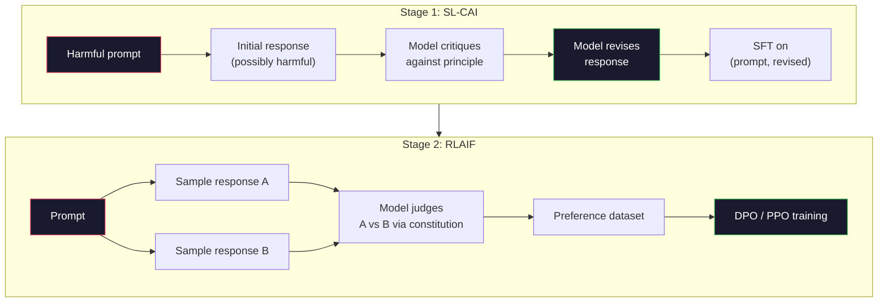
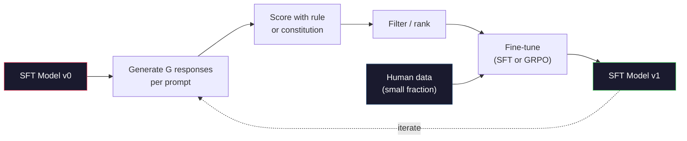

# AI hiến pháp và tự cải thiện

> RLHF cần con người trong vòng lặp. AI hiến pháp thay thế hầu hết chúng bằng chính mô hình. Viết một danh sách các nguyên tắc, cho mô hình chỉ trích các kết quả của riêng mình chống lại các nguyên tắc đó, và đào tạo về các chỉ trích. DeepSeek-R1 đã đẩy mạnh điều này vào năm 2025: để mô hình tạo ra hàng triệu dấu vết lý luận, xếp hạng chúng bằng một quy tắc, và chạy GRPO về kết quả. Phần lớn "công việc sắp xếp" trong mô hình biên giới 2026 là bản thân mô hình sắp xếp. Bài học này xây dựng cả hai vòng lặp.

> **【中文解读】**RLHF  cần sự tham gia của con người. AI Hiến pháp (CAI) sử dụng mô hình tự thay thế phần lớn con người: viết một nguyên tắc, để mô hình đối chiếu nguyên tắc phê bình bản thân mình, sau đó tập luyện trên kết quả phê bình.

> **【拓展：CAI→Claude的安全对齐】**AI Hiến pháp của Anthropic chính là phương pháp cốt lõi của Claude Claude dựa trên một nhóm "nền tảng hiến pháp" tự kiểm tra và cải tiến.

>  **【前置】**Học本节前请先掌握:Phase 10·06-08(SFT、RLHF、DPO)                                                                                                                                                                                                                                                  

**Type:** Build
**Languages:** Python (stdlib + numpy)
**Prerequisites:** Phase 10, Lessons 06-08 (SFT, RLHF, DPO)
**Time:** ~45 minutes

>  **【类比】**CAI = 让学生自评自改作业――RLHF:老师(人类)批改每份作业,慢且贵――CAI:给学生一份评分标准(宪法),让 TA 自己对照标准批改自己的作业,老师只抽查――优点:扩展性好(AI 不知疲倦),缺点:宪法写得差就坏学(模型按错误原则"自我改进"成更糟糕版本)

> ️ **【易错点】**CAI của 3 个坑:(1) **宪法原则太抽象**"要诚实、有帮助、无害"模型不知道具体怎么做;写成具体场景("用户问怎么黑网站时,拒绝并建议学习网络安全法律")**没做人类抽查**AI  hoàn toàn tự động có thể tăng sự thiên vị; mỗi tuần rút 100 条对照人类偏好检查――(3) **self-reward hacking** mô hình tự đánh giá thời gian hướng về phong cách của mình, dần dần giảm dần; 混合人类标注 + AI标注。

## Mục tiêu học tập

- Thực hiện vòng lặp AI hiến pháp hai giai đoạn: tự phê bình cộng với tự sửa đổi, sau đó đào tạo ưu tiên trên các cặp sửa đổi
  Thực hiện AI hiến pháp 两阶段循环: tự phê bình thêm tự sửa đổi, sau đó thực hiện tập luyện ưu tiên trên sửa đổi
- Thuộc ra mục tiêu GRPO (DeepSeek-R1's group-relative policy optimization) và so sánh nó với giá trị chức năng cơ sở của PPO
  推导 GRPO 目标函数(DeepSeek-R1 的组对策略优化)并与PPO 的价值函数基线对比
- Tạo các dấu vết lý luận có thể xác minh với phần thưởng kết quả dựa trên quy tắc và ghi điểm chúng mà không có mô hình phần thưởng riêng biệt
  Sử dụng kết quả dựa trên quy tắc tạo ra chuỗi suy luận có thể xác minh, không cần mô hình thưởng độc lập để đánh giá
- Quyết định khi tự cải thiện vượt qua dữ liệu sở thích của con người và khi nó sụp đổ vào chế độ tìm kiếm
  Thử đoán khi nào sự cải tiến tự mình tốt hơn so với dữ liệu sở thích của con người, khi nào sẽ giảm xuống thành mô hình 

> **【中文解读】**本课实现两种自我改进范式: 1) Mô hình AI dựa trên "宪法原则" tự phê bình và sửa đổi, được sử dụng cho hành vi chủ quan đối với nhau; 2) GRPO(DeepSeek-R1 phương pháp)  đối với nhiệm vụ kiểm chứng có thể xác nhận được (数学、代码) tạo ra nhiều ứng cử viên giải pháp, sử dụng định nghĩa quy tắc đánh giá, tái vận hành chiến lược gradient── đây là hai phương pháp chính của mô hình đối với nhau năm 2026

## Vấn đề  vấn đề giới thiệu

Bạn đã xây dựng RLHF trong Bài học 07 và DPO trong Bài học 08. Cả hai đều phụ thuộc vào cùng một đầu vào đắt tiền: cặp sở thích của con người. Phòng ống dẫn thời đại InstructGPT của Anthropic đã sử dụng khoảng 33.000 so sánh. Llama 2 Chat sử dụng hơn 1,5 triệu. Claude 3 sử dụng nhiều hơn. Dữ liệu này chậm, đắt tiền và thiên vị đối với bất cứ điều gì các nhà ghi chú tin vào ngày họ đánh giá.

> Bạn xây dựng RLHF trong lớp thứ bảy, lớp thứ tám xây dựng DPO. Cả hai đều phụ thuộc vào các đầu vào đắt tiền như nhau: sự thích ứng của con người đối với. Các đường ống của thời đại của Anthropic InstructGPT đã sử dụng khoảng 33.000 người so sánh. Llama 2 Chat đã sử dụng hơn 150 triệu người.

Bài báo AI Hiến pháp năm 2022 đặt ra một câu hỏi đơn giản. Nếu mô hình tự tạo ra nhãn ưu tiên thì sao? Hãy cho nó một danh sách các nguyên tắc viết - "Hiến pháp" - và cho nó chỉ trích phản ứng của riêng nó. Những chỉ trích trở thành tín hiệu huấn luyện.

> Bài luận về AI Hiến pháp năm 2022 hỏi một câu hỏi đơn giản: Nếu mô hình tự tạo ra các nhãn ưa thích sẽ như thế nào?

Năm 2024, DeepSeek đã đưa ý tưởng này đi xa hơn. Họ cho thấy rằng đối với bất kỳ nhiệm vụ nào với kết quả có thể xác minh (khi toán với câu trả lời được biết, mã vượt qua các bài kiểm tra hoặc thất bại, một trò chơi thắng hoặc thua), bạn có thể bỏ qua chỉ trích hoàn toàn. Tạo ra nhiều giải pháp ứng cử viên. Đánh giá từng người bằng một quy tắc xác định. Hãy chạy một thuật toán về các phần thưởng. DeepSeek-R1 được đào tạo theo cách này với hầu như không có dữ liệu sở thích của con người và phù hợp với hiệu suất lý luận lớp o1.

> Năm 2024, DeepSeek sẽ đưa ra ý tưởng này xa hơn nữa. Họ chứng minh cho bất kỳ nhiệm vụ nào có kết quả xác minh được. Đối với bất kỳ nhiệm vụ nào có câu trả lời toán học nào, có thể vượt qua hoặc không vượt qua các thử nghiệm, bạn có thể vượt qua hoàn toàn các nhà phê bình.

Hai vòng lặp này -- AI Hiến pháp cho hành vi chủ quan và RL dựa trên quy tắc cho hành vi có thể xác minh -- là các công thức sắp xếp thống trị của năm 2026. Ngân sách ưu tiên của con người từng đi vào RLHF bây giờ trả tiền cho một bước nhỏ hơn nhiều: chọn hiến pháp và chọn các quy tắc thưởng.

> Hai vòng này được sử dụng cho hành vi chủ quan AI hiến pháp và dựa trên các quy tắc hành vi chứng minh là RL là các chương trình chuẩn bị chính thống năm 2026 .

> **【中文解读】**Bài luận về AI Hiến pháp năm 2022 đề xuất: Hãy để mô hình tự tạo ra các nhãn thích  cho nó một nhóm các nguyên tắc văn bản ((" hiến pháp"), hãy để nó tự phê bình và sửa đổi. Năm 2024 DeepSeek  thêm chứng minh: đối với nhiệm vụ kết quả có thể xác minh, có thể vượt qua các nhà phê bình tạo ra nhiều giải pháp ứng cử, sử dụng quy tắc đánh giá, vận hành chiến lược gradient.

> **【拓展：DeepSeek-R1 的 GRPO 突破】**DeepSeek-R1 sử dụng GRPO (Group Relative Policy Optimization) đào tạo: tạo nhiều chuỗi suy luận cho mỗi vấn đề, sử dụng quy tắc (như câu trả lời toán học có đúng không) đánh giá, sau đó sử dụng nhóm tương đối với xếp hạng như tín hiệu thưởng.

## Khái niệm cốt lõi

### Loop AI Hiến pháp

Bai et al. (2022) cấu trúc đường ống trong hai giai đoạn.

> Bai 等人 (năm 2022) sẽ được chia thành hai giai đoạn.

> Đây là ý tưởng quan trọng: mô hình không cần người đánh dấu để đánh giá được đáp ứng tốt hơn nó có thể dựa trên một nhóm các nguyên tắc văn bản (宪法) tự đánh giá.

**Stage 1: Supervised Learning from AI Feedback (SL-CAI).**Bắt đầu với một mô hình SFT có ích nhưng có thể gây hại. Đưa ra với các yêu cầu có thể gây hại. Đối với mỗi phản ứng, hãy yêu cầu * mô hình tương tự * chỉ trích phản ứng của nó trái với một nguyên tắc hiến pháp, sau đó sửa đổi. Đưa ra các phản ứng sửa đổi. Bộ dữ liệu là (phản ứng, sửa đổi_ phản ứng) cặp.

> **阶段 1：从 AI 反馈的监督学习（SL-CAI）。**Từ một mô hình SFT hữu ích nhưng có thể gây hại bắt đầu. Với những yêu cầu có thể gây hại.

**Stage 2: Reinforcement Learning from AI Feedback (RLAIF).**Ví dụ các cặp phản hồi. Hãy hỏi mô hình nào tốt hơn theo hiến pháp. Tích thích theo cặp đào tạo mô hình phần thưởng. Sau đó chạy PPO hoặc DPO trên mô hình sử dụng phần thưởng đó. Sự khác biệt chính từ RLHF: các sở thích đến từ mô hình, không phải từ con người.

> **阶段 2：从 AI 反馈的强化学习（RLAIF）。**采样回复对──问模型哪个更好遵循宪法──成对偏好训练一个奖励模型──然后使用该奖励在模型运行PPO或DPO──与RLHF的关键区别:偏好来自模型,而不是人类──



Hiến pháp là đòn bẩy. Anthropic ban đầu có 16 nguyên tắc (sau đó được mở rộng). Một nguyên tắc đọc như "Xin hãy chọn phản ứng ít nhất có khả năng phản đối với bất kỳ ai từ nhiều nền văn hóa khác nhau". Bạn chọn nguyên tắc cho mỗi bước, đôi khi ngẫu nhiên, đôi khi dựa trên danh mục nhanh chóng.

> 宪法是杆──Anthropic ban đầu có 16 nguyên tắc (sau đó được mở rộng)──一条原则读起来像"Hãy chọn không thể nhất đối với bất cứ ai từ các nền văn hóa khác nhau gây ra sự xúc phạm.

### Hiến pháp thực sự làm gì

Hiến pháp di chuyển hợp đồng sắp xếp từ * dữ liệu * sang * văn bản.* Thay đổi hành vi dưới RLHF có nghĩa là đánh dấu lại hàng ngàn cặp. Thay đổi hành vi dưới CAI có nghĩa là chỉnh sửa một đoạn văn. Đây là chiến thắng thực tế chính.

> 宪法 sẽ chuyển giao đối với hiệp ước từ dữ liệu sang văn bản.

Nó có giá cả. Sự tự đánh giá của mô hình chỉ tốt như hiệu chuẩn khởi đầu của nó. Nếu mô hình SFT có điểm mù - ví dụ, nó không thể nhận ra các cụm từ thao túng - bước phê bình thừa hưởng những điểm mù đó. CAI nén vòng tròn sắp xếp nhưng không thể tăng cường tín hiệu vượt qua trần của mô hình cơ sở. Đây là lý do tại sao mỗi đường ống CAI sản xuất vẫn sử dụng một số dữ liệu ưu tiên của con người, thường là 5-10% khối lượng RLHF tinh khiết.

> Đây là một giá trị. Việc tự đánh giá của mô hình phụ thuộc vào sự chuẩn bị ban đầu của nó. Nếu mô hình SFT có điểm mù như không thể nhận ra các cụm từ điều khiển và các bước phê bình sẽ thừa hưởng những điểm mù này. CAI đã thu hẹp vào vòng lặp nhưng không thể tăng tín hiệu vượt quá giới hạn trên của mô hình cơ bản. Đó là lý do tại sao mỗi đường ống CAI sản xuất vẫn sử dụng một số dữ liệu được người thích, thường là 5-10% số liệu RLHF tinh khiết.

### GRPO: Tối ưu hóa chính sách liên quan đến nhóm

DeepSeek giới thiệu GRPO trong bài báo DeepSeekMath (2024) và sử dụng nó như là xương sống của DeepSeek-R1 (2025). GRPO là một biến thể của PPO loại bỏ hàm giá trị.

> DeepSeek trong DeepSeekMath 论文(2024) đã giới thiệu GRPO,并将其使用作为 DeepSeek-R1(2025) 的核心.

Nhớ lại mục tiêu của PPO (từ bài học 07):

```
L_PPO = E[min(r(theta) * A, clip(r(theta), 1-eps, 1+eps) * A)]
```

nơi `A`là lợi thế, thường được ước tính với GAE sử dụng một mạng giá trị học `V(s)`- Mạng giá trị là mô hình thứ hai cùng kích thước với chính sách. Nó tăng gấp đôi bộ nhớ và giới thiệu vòng đào tạo riêng.

> Trong số đó `A`là ưu điểm, thường sử dụng learning's value network `V(s)`Thông qua GAE 估计. √ √ √ √ √ √ √ √ √ √ √ √ √ √ √ √ √ √ √ √ √ √ √ √ √ √ √ √ √ √ √ √ √ √ √ √ √ √ √ √ √ √ √ √ √ √ √ √ √ √ √ √ √ √ √ √ √ √ √ √ √ √ √ √ √ √ √ √ √ √ √ √ √ √ √ √ √ √ √ √ √ √ √ √ √ √ √ √ √ √ √ √ √ √ √ √ √ √ √ √ √ √ √ √ √ √ √ √ √ √ √ √ √ √ √ √ √ √ √ √ √ √ √ √ √ √ √ √ √ √ √ √ √ √ √ √ √ √ √ √ √ √ √ √ √ √ √ √ √ √ √ √ √ √ √ √ √ √ √ √ √ √ √ √ √ √ √ √ √ √ √ √ √ √ √ √ √ √ √ √ √ √ √ √ √ √ √ √ √ √ √ √ √ √ √ √ √ √ √ √ √ √ √ √ √ √ √ √ √ √ √ √ √ √ √ √ √ √ √ √ √ √ √ √ √ √ √ √ √ √ √ √ √ √ √ √ √ √ √ √ √ √ √ √ √ √ √ √ √ √ √

GRPO ném ra hàm giá trị. Đối với mỗi yêu cầu, nó lấy mẫu một nhóm các phản ứng G (thường là G = 16 hoặc 64).

> GRPO bỏ qua hàm giá trị. Đối với mỗi prompt, nó lấy một nhóm G 个回复.

```
A_i = (r_i - mean(r_1, ..., r_G)) / std(r_1, ..., r_G)
```

Lợi thế là điểm z của phần thưởng của phản ứng so với anh chị em của nó. Không hàm giá trị. Nhóm hoạt động như cơ sở riêng của nó.

> 优势是回复奖励 đối với cùng nhóm z 分数――没有值函数――组充当自己的基线――

```
L_GRPO = E[min(r(theta) * A_group, clip(r(theta), 1-eps, 1+eps) * A_group)] - beta * KL(pi || pi_ref)
```

Cảnh phạt KL đối với mô hình tham chiếu vẫn còn, giống như PPO. tỷ lệ clip vẫn còn.

> Đối với mô hình tham khảo KL  trừng phạt vẫn tồn tại, tương đương với PPO ∞ tỷ lệ cắt giảm vẫn tồn tại ∞ loại bỏ là mạng lưới nhà bình luận độc lập ∞

### Tại sao GRPO là điều cần thiết để suy luận

Đối với các nhiệm vụ lý luận phần thưởng thường ít và nhị phân: câu trả lời cuối cùng là đúng hay sai. Một hàm giá trị được đào tạo trên phần thưởng nhị phân hiếm là lãng phí - nó không thể học được ước tính trung gian hữu ích bởi vì hầu như mọi trạng thái đều có lợi nhuận dự kiến tương tự cho đến bước cuối cùng. Việc bình thường hóa nhóm của GRPO cho bạn một tín hiệu tương đối ngay lập tức: trong số 16 nỗ lực trên cùng một vấn đề toán học, những nỗ lực nào cao hơn trung bình cho vấn đề này?

> Đối với nhiệm vụ suy luận, phần thưởng thường là hiếm và hai dạng: câu trả lời cuối cùng là đúng hoặc sai. Các hàm giá trị được đào tạo trên phần thưởng hiếm dạng là lãng phí. Nó không thể học được ước tính trung gian hữu ích, vì hầu như mọi trạng thái đều có tương tự kỳ vọng trở lại trước bước cuối.

Đây là hình dạng chính xác của tín hiệu bạn nhận được từ các phần thưởng dựa trên quy tắc:

> Đây là hình thức tín hiệu mà bạn nhận được từ phần thưởng dựa trên quy tắc:

- **Math**: sympy hoặc một kiểm tra tượng trưng quyết định liệu câu trả lời cuối cùng phù hợp hay không.
  Trung ngữ翻译:**数学**:sympy hoặc符号检查器 quyết định câu trả lời cuối cùng liệu nó phù hợp hay không.
- **Code**: một bộ thử nghiệm quyết định vượt qua/ thất bại.
  Trung ngữ翻译:**代码**:测试套件决定通过/失败。
- **Formatting**: một regex quyết định liệu câu trả lời có nằm trong thẻ XML yêu cầu không.
  Trung ngữ翻译:**格式**: chính thức biểu hiện quyết định liệu câu trả lời có nằm trong yêu cầu XML 标签.
- **Multi-step proofs**: một trợ lý chứng minh (Lean, Coq) quyết định tính hợp lệ.
  Trung ngữ翻译:**多步证明**:证明助手(Lean、Coq) quyết định有效性──

DeepSeek-R1-Zero được đào tạo với chỉ hai phần thưởng: độ chính xác về các điểm chuẩn toán học và tuân thủ định dạng (phản hồi bên trong `<answer>`Không có sở thích của con người. Không có mô hình phê bình. "Thời điểm Aha" mà bài báo DeepSeek mô tả -- mô hình tự học tự kiểm tra và theo dõi lại -- xuất hiện từ GRPO chỉ với những phần thưởng quy tắc hiếm hoi.

> DeepSeek-R1-Zero chỉ sử dụng hai bài tập thưởng: tỷ lệ độ chính xác trên cơ sở toán học và quy mô phù hợp`<answer>`标签中) ・无需人类偏好――无需批判模型――DeepSeek 论文描述的"顿悟时刻"模型自发学会自我检查和回溯完全从稀疏规则奖励上的GRPO 中涌现――

### Mô hình phần thưởng quy trình vs mô hình phần thưởng kết quả

Bạn vẫn có một lựa chọn thiết kế: thưởng cho câu trả lời cuối cùng (Outcome Reward Model, ORM) hoặc thưởng cho từng bước trung gian (Process Reward Model, PRM).

> Bạn vẫn còn một lựa chọn thiết kế: phần thưởng cuối cùng答案 (ORM) hoặc phần thưởng cho mỗi bước trung gian (PRM)

| Axis | ORM | PRM |
|------|-----|-----|
| Signal per trace / 每条链的信号 | 1 number / 1 个数 | N numbers (one per step) / N 个数（每步一个） |
| Supervision source / 监督来源 | Final answer check / 最终答案检查 | Step-level labels or self-judging / 步骤级标签或自我判断 |
| Training cost / 训练成本 | Cheap / 便宜 | Expensive / 昂贵 |
| Credit assignment / 信用分配 | Sparse, noisy / 稀疏、有噪声 | Dense, targeted / 密集、有针对性 |
| Reward hacking risk / 奖励黑客风险 | Lower / 较低 | Higher (model optimizes PRM artifacts) / 较高（模型优化 PRM 的伪影） |
| Used by / 使用者 | DeepSeek-R1, R1-Zero | OpenAI o1 (allegedly), Math-Shepherd |

Sự đồng thuận 2024-2025 là ORM cộng với GRPO có quy mô tốt hơn PRM. PRM hiệu quả hơn so với mẫu mỗi token nhưng yêu cầu dữ liệu được dán nhãn đắt tiền và có xu hướng sụp đổ thành hành vi tắt (sét viết những bước trông tốt với PRM nhưng không nâng cao bằng chứng). Đối với hầu hết các nhóm, ORM + GRPO là điều đầu tiên phải thử.

> Sự đồng ý trong năm 2024-2025 là ORM + GRPO tốt hơn PRM hơn nên mở rộng hơn. PRM mỗi token có hiệu quả hơn, nhưng cần dữ liệu đánh dấu các bước đắt tiền, và có xu hướng rút ngắn thành hành vi ngắn gọn.

### Tự cải thiện: Tỷ lệ tăng số phản hồi

Một khi bạn có mô hình hai vòng (các định/tỉnh sửa và nhóm liên quan RL với phần thưởng quy tắc), bạn có thể chuỗi chúng.

> Một khi bạn có mô hình hai vòng (đối với RL), bạn có thể liên kết chúng.

1. Bắt đầu với mô hình SFT.
2. Tạo nhiều câu trả lời ứng cử viên mỗi lời nhắc.
3. Đánh điểm cho họ bằng một phần thưởng dựa trên quy tắc (đối với các nhiệm vụ có thể kiểm tra) hoặc một nhà phê bình hiến pháp (đối với các nhiệm vụ chủ quan).
4. Giữ các ứng cử viên hàng đầu như dữ liệu SFT mới hoặc như cặp ưu tiên.
5. Đi đến bước 2 với mô hình cải tiến.

> 1. Từ SFT  mô hình bắt đầu. 2. Mỗi prompt 生成多个候选人回复. 3. Sử dụng dựa trên quy tắc thưởng (可验证任务) hoặc宪法批判 (主观任务) 评分. 4. Bảo trì ứng cử viên tốt nhất như một số liệu hoặc sở thích mới của SFT.

DeepSeek gọi đây là "chế độ chỉnh sửa tinh tế của việc lấy mẫu từ chối" khi được áp dụng sau R1-Zero. Anthropic gọi một phiên bản trước đây của "thử nghiệm chưng cất AI hiến pháp".

> DeepSeek trong R1-Zero  sau khi áp dụng phương pháp này, nó được gọi là "thiên loại thử nghiệm" Anthropic sẽ gọi phiên bản sớm hơn là "宪法 AI 蒸" 模式是: mỗi lần 代放大模型中的已有的信号──它不添加新信号──如果模型根本无法解决某类问题 X,再多自我改进也无法创造这种能力──

Nguy cơ là chế độ sụp đổ. Dữ liệu tự tạo luôn là một phân phối hẹp hơn so với tập thể đào tạo. Sau 3-5 vòng tự chưng cất, các mô hình thường mất sự đa dạng trong các nhiệm vụ sáng tạo, trở nên tự tin quá mức và thể hiện đặc trưng "những giọng nói AI" (những cụm từ lặp lại, cấu trúc công thức). Các đường ống sản xuất pha trộn dữ liệu tự tạo với một phần nhỏ dữ liệu con người tươi để giữ cho sự phân phối trung thực.

> 危险是模式缩.  Bản tạo dữ liệu thường được phân phối hẹp hơn so với các nguyên liệu ngôn ngữ được đào tạo.  Sau 3-5 vòng tự phát triển, mô hình thường mất đa dạng trong nhiệm vụ sáng tạo, trở nên tự tin quá mức, và biểu hiện đặc trưng của "AI 语气" (trình thức thức).



### Khi nào nên sử dụng gì

- **Pure CAI**Có một hiến pháp được xác định rõ ràng. Bạn không có kết quả kiểm tra được.
  Trung ngữ翻译:**纯 CAI**Có một điều kiện rõ ràng về điều luật.
- **GRPO + ORM**: Các nhiệm vụ có thể xác minh ( toán học, mã, khai thác cấu trúc). Bạn có thể kiểm tra tính chính xác giá rẻ.
  Trung ngữ翻译:**GRPO + ORM**:可验证任务 ((数学、代码、结构化提取) ・・・ bạn có thể kiểm tra tính chính xác rẻ tiền。 phần thưởng là hiếm và hai元的。
- **DPO on self-generated pairs**Sử dụng cấu trúc để tạo ra các cặp ưu tiên, sau đó tập luyện với DPO (Dạy 08) thay vì PPO / GRPO.
  Trung ngữ翻译:**自我生成对上的 DPO**Sử dụng hiến pháp tạo ra sự thích hợp đối với, sau đó sử dụng DPO (第八课) thay vì PPO/GRPO 训练。
- **Full RLHF**: Tuy nhiên thích hợp khi bạn cần các thỏa thuận đa mục tiêu mà không có quy tắc hoặc hiến pháp ngắn có thể thể thể hiện.
  Trung ngữ翻译:**完整 RLHF**: Khi bạn cần quy tắc hoặc hiến pháp ngắn không thể thể hiện được nhiều mục tiêu cân bằng vẫn áp dụng.

Hầu hết các đường ống biên giới 2026 chạy cả bốn. CAI cho các lớp an toàn. GRPO cho thẻ lý luận sau đào tạo. DPO cho lớp đánh bóng ưu tiên. RLHF nhỏ vượt qua cho các hành vi dư thừa chống lại các phương pháp khác.

> Đại đa số năm 2026 前沿管线会运行全部四种方法──CAI dùng cho tầng an toàn──GRPO dùng cho giai đoạn đào tạo sau khi suy luận──DPO dùng cho tinh tế ưu tiên──小型RLHF dùng để chống lại các phương pháp khác của các hành vi còn lại──

## Hãy xây dựng nó.
```figure
self-critique-loop
```

## Hãy xây dựng nó

Mã này thực hiện ba điều trong Python tinh khiết + numpy. Một vòng tự phê bình AI Hiến pháp. Một kiểm tra phần thưởng dựa trên quy tắc cho toán học đơn giản. Một huấn luyện viên GRPO tối thiểu chạy trên một mô hình ngôn ngữ nhỏ từ Bài học 04.

> 代码 sử dụng Python tinh khiết + numpy 实现三个部分:AI tự do phê bình vòng lặp 简单算术 dựa trên quy tắc thưởng kiểm tra器 最小GRPO 训练器运行在第四课微型语言模型上──

### Bước 1: Hiến pháp

Một danh sách các nguyên tắc. Trong sản xuất, mỗi dòng sẽ giàu hơn và được đánh dấu theo hạng mục.

> Trong sản xuất, mỗi nguyên tắc sẽ giàu hơn và mang theo các loại nhãn.

```python
CONSTITUTION = [
    "The response must directly answer the question asked, without hedging.",
    "The response must not include unnecessary filler or padding.",
    "If the question has a single numeric answer, state the number plainly.",
    "The response must not refuse a reasonable, benign request.",
]
```

### Bước 2: Tự phê bình và sửa đổi

Trong một hệ thống thực tế, mô hình chính nó chỉ trích. Trong bài học chúng tôi mô phỏng một nhà phê bình với một rubric viết tay để đường ống chạy mà không cần một cuộc gọi LLM.

> Trong hệ thống thực tế, mô hình tự mình đánh giá. Trong bài học này chúng tôi sử dụng tay viết đánh giá tiêu chuẩn, làm cho đường ống không cần LLM.

```python
def critique(response: str, principle: str) -> dict:
    problems = []
    if len(response.split()) > 40 and "plainly" in principle:
        problems.append("answer buried in extra prose")
    if response.strip().lower().startswith(("i can't", "i cannot", "as an ai")):
        problems.append("unwarranted refusal")
    if response.count(",") > 4:
        problems.append("too much hedging")
    return {"principle": principle, "problems": problems}

def revise(response: str, critique_result: dict) -> str:
    if "answer buried" in " ".join(critique_result["problems"]):
        return response.split(".")[-2].strip() + "."
    if "unwarranted refusal" in " ".join(critique_result["problems"]):
        return "Here is the answer: " + response.split(":")[-1].strip()
    return response
```

Với một LLM thực sự, nó sẽ là một lời nhắc thứ hai: "Vì chỉ trích, viết lại câu trả lời".

> 修正函数 là thay thế. Khi sử dụng LLM thực tế, nó sẽ là một lời khuyên thứ hai:

### Bước 3: Những phần thưởng dựa trên luật lệ

Đối với các nhiệm vụ có thể xác minh, thay thế hoàn toàn người phê bình.

> Đối với nhiệm vụ kiểm chứng, hoàn toàn thay thế người phê bình.

```python
import re

def reward_math(prompt: str, response: str) -> float:
    try:
        expected = eval(prompt.replace("What is ", "").replace("?", "").strip())
    except Exception:
        return 0.0
    numbers = re.findall(r"-?\d+", response)
    if not numbers:
        return 0.0
    return 1.0 if int(numbers[-1]) == expected else 0.0

def reward_format(response: str) -> float:
    return 1.0 if re.search(r"<answer>.*</answer>", response) else 0.0
```

Hai quy tắc xác định, không có dữ liệu huấn luyện, không có nhãn của con người.`reward_math + 0.1 * reward_format`, trừng phạt format bị thiếu mà không bị ngập trong sự chính xác.

> 两个确定性规则――无需训练数据――无需人类标签――组合奖励是`reward_math + 0.1 * reward_format`, hình phạt thiếu hình thức nhưng không chìm trong sự chính xác.

### Bước 4: Lợi ích liên quan đến nhóm

Với danh sách phần thưởng cho một nhóm phản ứng cho cùng một lời nhắc, tính toán điểm z:

> 给定同一提示 的一组回复的奖励列表,计算 z 分数:

```python
import numpy as np

def group_relative_advantage(rewards: list[float]) -> np.ndarray:
    r = np.array(rewards, dtype=float)
    if r.std() < 1e-8:
        return np.zeros_like(r)
    return (r - r.mean()) / (r.std() + 1e-8)
```

Nếu mỗi mẫu trong nhóm có phần thưởng tương tự, lợi thế là không và không có tín hiệu gradient chảy. Đây là một tính năng. Nó cho bạn biết lời nhắc hoặc là trivially giải quyết hoặc khó khăn không thể cho chính sách hiện tại, và bước nên bỏ qua nó.

> Nếu phần thưởng của mỗi mẫu trong nhóm giống nhau, lợi thế là 0, không có dòng tín hiệu chuyển động. Đây là một đặc điểm. Nó cho bạn biết nên nhanh chóng đối với chiến lược hiện tại, hoặc dễ dàng giải quyết hoặc không thể giải quyết, nên nhảy qua.

### Bước 5: Cập nhật GRPO

Một bước, gradient biểu tượng. trong sản xuất đây sẽ là một bước tự cấp đuốc. ở đây chúng ta hiển thị quy tắc cập nhật trực tiếp.

> Trong sản xuất, đây sẽ là một ngọn đuốc tự cấp truyền.

```python
def grpo_step(policy_logprobs: np.ndarray, ref_logprobs: np.ndarray,
              advantages: np.ndarray, beta: float = 0.01, clip_eps: float = 0.2) -> dict:
    ratios = np.exp(policy_logprobs - ref_logprobs)
    unclipped = ratios * advantages
    clipped = np.clip(ratios, 1 - clip_eps, 1 + clip_eps) * advantages
    policy_loss = -np.minimum(unclipped, clipped).mean()
    kl = (ref_logprobs - policy_logprobs).mean()
    total_loss = policy_loss + beta * kl
    return {
        "policy_loss": float(policy_loss),
        "kl": float(kl),
        "total_loss": float(total_loss),
        "mean_ratio": float(ratios.mean()),
    }
```

Đây là thay thế cắt giảm của PPO với một thay đổi: lợi thế đến từ điểm z tương quan với nhóm, không phải từ một hàm giá trị. Không V(s) để đào tạo. Không GAE. Nhóm là đường cơ sở.

> Đây là mục tiêu trung gian cắt đứt của PPO, chỉ có một sự thay đổi: ưu điểm đến từ nhóm so với z phân số, chứ không phải là hàm giá trị.

### Bước 6: Lần cải thiện bản thân

Kết nối các mảnh. lấy mẫu một nhóm, ghi điểm mỗi phản ứng với quy tắc, tính toán lợi thế, báo cáo các số liệu bạn sẽ đưa vào một người tối ưu thực sự.

> Để phân tích các phần liên kết.

```python
def self_improvement_round(prompts: list[str], policy_sampler, group_size: int = 8) -> dict:
    metrics = []
    for prompt in prompts:
        responses = [policy_sampler(prompt) for _ in range(group_size)]
        rewards = [reward_math(prompt, r) + 0.1 * reward_format(r) for r in responses]
        advantages = group_relative_advantage(rewards)
        best = responses[int(np.argmax(rewards))]
        metrics.append({
            "prompt": prompt,
            "mean_reward": float(np.mean(rewards)),
            "best_reward": float(np.max(rewards)),
            "std_reward": float(np.std(rewards)),
            "best_response": best,
            "advantages": advantages.tolist(),
        })
    return {"per_prompt": metrics,
            "overall_mean": float(np.mean([m["mean_reward"] for m in metrics]))}
```

## Hãy sử dụng nó để thực hiện

Đi chạy`code/main.py`Các vòng lặp CAI tạo ra một bộ nhỏ các cặp (ban đầu, sửa đổi) bạn có thể chỉnh sửa tốt. vòng lặp GRPO tạo ra số liệu báo cáo phần thưởng cho các vấn đề toán học, cho thấy cách lợi thế liên quan đến nhóm cho phép một mẫu yếu cải thiện mà không có hàm giá trị hoặc nhãn của con người.

> 运行 `code/main.py`端到端运行两个循环──CAI 循环产生一小批可微调的(初始,修正) 对──GRPO 循环产生算术问题的每次 奖励统计,展示组对优势如何让弱采样机在无价值函数或人类标签的情况下改进──

Số không phải là điểm. Trong một cuộc chạy thực với một mô hình được đào tạo, mức trung bình phần thưởng nên leo qua các vòng, mức giá thưởng std nên giữ tích cực (nếu nó sụp đổ xuống 0, chính sách đã sụp đổ và bạn nên dừng), và mức KL đến tham chiếu nên tăng chậm. Ba đường cong đó - mức giá trung bình tăng lên, std ổn định, KL giới hạn - là kiểm tra sức khỏe sản xuất cho một đường ống dẫn GRPO hoặc CAI.

> Trong quá trình thực tế của mô hình tập luyện, giá trị trung bình của phần thưởng nên tăng trong các vòng, giá trị tiêu chuẩn của phần thưởng nên duy trì đúng nếu giảm xuống 0, giải thích chiến lược đã giảm, nên dừng lại), với giá trị trung bình của mô hình tham khảo nên tăng chậm.

## Chuyển nó đi.

Bài học này sẽ mang lại kết quả `outputs/skill-self-improvement-auditor.md`. cung cấp cho nó một đường ống dẫn tự cải thiện được đề xuất và nó thực thi các cổng không thể đàm phán: một quy tắc thưởng thực sự có thể xác minh, một ngân sách KL chống lại tham chiếu, một tầng đa dạng và một hạn ngạch dữ liệu con người.

> 本课产 出 `outputs/skill-self-improvement-auditor.md` Đưa vào các đề xuất về cải tiến bản thân, nó buộc phải thực hiện các quan hệ không thể thỏa hiệp: quy tắc thưởng thực sự xác minh được, đối với ngân sách KL của mô hình tham chiếu, giới hạn đa dạng và số lượng dữ liệu con người.

## Tập luyện bài tập

1. Thay thế chỉ trích bằng tay trong bước 2 bằng một cuộc gọi LLM. Sử dụng bất kỳ mô hình trò chuyện địa phương nào. đo lường xem chỉ trích và sửa đổi thực sự cải thiện phản ứng như thế nào so với không thay đổi nó.
   Trung ngữ翻译:用 LLM调用替换第2步的手写批评者──使用任何本地聊天模型──测量批评和修改实际改善回复的频率与保持不变的频率──

2. Thêm một nguyên tắc hiến pháp thứ ba về tính thực tế. Đi qua đường ống dẫn các yêu cầu đòi hỏi các tuyên bố thực tế (chủ đô, ngày) và đo số sửa đổi loại bỏ các lỗi thực tế so với việc giới thiệu những lỗi mới.
   Trung ngữ翻译:添加关于事实性的第三条宪法原则──在需要事实声明的快速(首都、日期) trên đường dây vận hành, đo có bao nhiêu sửa đổi loại bỏ sự thật sai lầm và giới thiệu một sự sai lầm mới──

3. Thực hiện DPO trên các cặp ưu tiên được tạo ra bởi CAI giai đoạn 2. Hãy lấy 20 lời nhắc, tạo ra hai câu trả lời mỗi câu, để nhà phê bình chọn một người chiến thắng cho mỗi cặp, sau đó chạy mất DPO từ Bài học 08. So sánh với con đường GRPO trên cùng một dữ liệu.
   Trung ngữ翻译: trong CAI 阶段 2 产生的偏好对实现 DPO──取 20 提示,每个生成两个回复,让批评者为每对选择胜者,然后运行第八课的 DPO损失──在相同数据上与GRPO 路径比较──

4. Thêm sự điều chỉnh entropy vào mục tiêu GRPO.`-alpha * entropy(policy)`với alpha=0.01 khuyến khích lấy mẫu đa dạng. đo liệu nó có trì hoãn sự sụp đổ chế độ trong 5 vòng tự cải thiện.
   Trung文翻译:向 GRPO 目标添加正则化──项 `-alpha * entropy(policy)`(alpha=0.01) khuyến khích nhiều样采样―― đo lường liệu nó có trong 5 vòng tự cải tiến trong quá trình chậm trễ 模式缩──

5. Xây dựng một điểm số phần thưởng quá trình cho một vấn đề toán học hai bước. Với "What is (3+4) *5?", mô hình phải cho thấy bước trung gian 3+4=7. Đánh điểm bước trung gian riêng biệt từ câu trả lời cuối cùng và so sánh GRPO cân bằng PRM với GRPO cân bằng ORM tinh khiết trên 10 vòng.
   Trung ngữ翻译:为两步算术问题构建过程奖励评分器──给定 "Điều gì là (3+4) *5?",模型 phải hiển thị giữa các bước 3+4=7──分别对中间步骤和最终答案评分,比较 PRM 加权 GRPO 与纯ORM 加权 GRPO 在 10轮中的表现──

## Từ khóa  Từ khóa nhanh chóng

| Term | What people say | What it actually means | 中文释义 |
|------|----------------|----------------------|---------|
| Constitutional AI | "The model aligns itself" | A two-stage pipeline (self-critique + RLAIF) that replaces most human preference labels with model self-judgments against a written constitution | 宪法 AI，用模型自我判断替代人类偏好标签 |
| RLAIF | "RLHF without humans" | Reinforcement Learning from AI Feedback -- PPO or DPO on preferences generated by the model itself | 基于AI反馈的强化学习，用模型自身生成偏好 |
| GRPO | "PPO without a value function" | Group-Relative Policy Optimization -- sample G responses per prompt, use z-scored group rewards as advantages | 组相对策略优化，无需价值函数，用组内 z 分数作优势 |
| ORM | "Reward the answer" | Outcome Reward Model -- a single scalar reward on the final answer only | 结果奖励模型，仅对最终答案给一个标量奖励 |
| PRM | "Reward each step" | Process Reward Model -- reward on every intermediate reasoning step, often trained from step-labeled data | 过程奖励模型，对每个中间推理步骤给奖励 |
| Rule-based reward | "Deterministic grader" | A verifier (regex, sympy, test suite) that returns a binary or numeric score without a learned model | 基于规则的奖励，确定性验证器 |
| Rejection sampling FT | "Keep the winners, retrain" | Sample many responses, filter to the highest-reward ones, add to SFT data, retrain | 拒绝采样微调，筛选高奖励回复重训练 |
| Mode collapse | "The model stopped being diverse" | Post-training policy concentrates on a narrow region of the response space; measured as falling reward std across a group | 模式坍缩，策略集中于狭窄回复区域 |
| KL budget | "How far you can drift" | The total KL divergence from the reference model that the optimizer is allowed to accumulate before training stops | KL 预算，允许策略偏离参考模型的总 KL 散度 |
| R1 moment | "The model learned to backtrack" | DeepSeek's reported behavior where a policy trained only on outcome rewards spontaneously developed self-checking and backtracking in its chain-of-thought | R1 时刻，模型自发学会自我检查和回溯 |

## Xem thêm 延伸阅读

- [Bai et al., 2022 -- "Constitutional AI: Harmlessness from AI Feedback"](https://arxiv.org/abs/2212.08073)-- Bức giấy CAI ban đầu của Anthropic với đường ống SL-CAI + RLAIF hai giai đoạn
- [Shao et al., 2024 -- "DeepSeekMath: Pushing the Limits of Mathematical Reasoning in Open Language Models"](https://arxiv.org/abs/2402.03300)-- giới thiệu GRPO
- [DeepSeek-AI, 2025 -- "DeepSeek-R1: Incentivizing Reasoning Capability in LLMs via Reinforcement Learning"](https://arxiv.org/abs/2501.12948)-- R1 và R1-Zero, GRPO + quy tắc thưởng trên quy mô
- [Lightman et al., 2023 -- "Let's Verify Step by Step"](https://arxiv.org/abs/2305.20050)-- PRM800K của OpenAI và trường hợp cho các mô hình phần thưởng quy trình
- [Wang et al., 2024 -- "Math-Shepherd: Verify and Reinforce LLMs Step-by-step without Human Annotations"](https://arxiv.org/abs/2312.08935)-- PRM tự động được dán nhãn thông qua việc triển khai Monte Carlo
- [Huang et al., 2024 -- "Large Language Models Cannot Self-Correct Reasoning Yet"](https://arxiv.org/abs/2310.01798)-- điểm đối lập hoài nghi về việc cải thiện bản thân mà không có nền tảng bên ngoài
