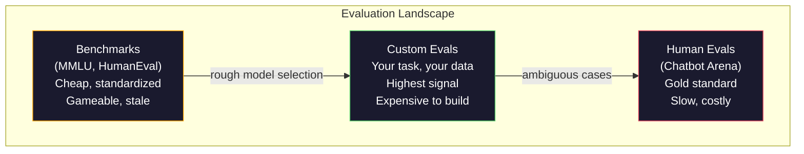
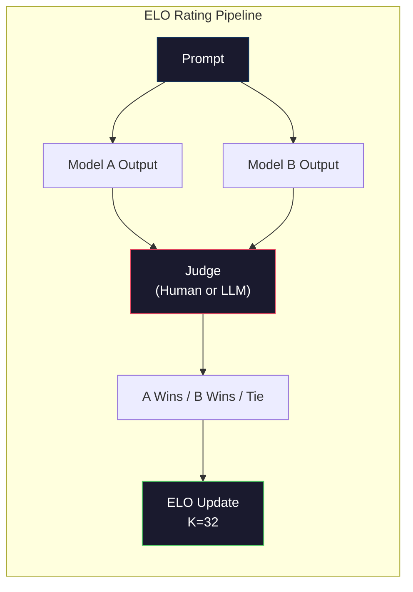

# Đánh giá: Đánh giá, Evals, LM Harness  đánh giá:基准、评测、LM Harness

> Luật Goodhart: khi một biện pháp trở thành mục tiêu, nó không còn là một biện pháp tốt nữa. Mỗi trò chơi phòng thí nghiệm biên giới đều có điểm chuẩn. Điểm MMLU tăng lên trong khi các mô hình vẫn không thể đếm đáng tin cậy số R trong "trâu tây". Đánh giá duy nhất quan trọng là đánh giá của bạn - về nhiệm vụ của bạn, với dữ liệu của bạn.

> **【中文解读】**Quy tắc cụ thể: Khi một chỉ số trở thành mục tiêu, nó đã không còn là một chỉ số tốt hơn.

> **【拓展：LLM评测→实际应用】**LLM 评测体系包括:MMLU (MMLU) 知识 (M) HumanEval (HumanEval) 代码 (MATH) 数学 (Mathematics) Arena (Arena) 人类偏好 (Human preference) )  Nhưng thực tế trong ứng dụng quan trọng nhất là đánh giá của bạn về nhiệm vụ và dữ liệu của bạn trên các bài kiểm tra

>  **【前置】**Học本节前请先掌握:Phase 10·01-05(LLM 基础);Phase 11·10(Học) 生产 LLM 应用的评估──本节聚焦模型本身的评估──

>  **【类比】**Điểm chuẩn chung: Đánh giá cao điểm của bạn (đối với số lượng cao điểm của bạn)

**Type:** Build
**Languages:** Python
**Prerequisites:** Phase 10, Lessons 01-05 (LLMs from Scratch)
**Time:** ~90 minutes

## Mục tiêu học tập

- Xây dựng một vòng đánh giá tùy chỉnh chạy nhiều lựa chọn và mở giới hạn tham chiếu với một mô hình ngôn ngữ
  构建自定义评测工具, đối với ngôn ngữ mô hình vận hành nhiều lựa chọn chủ đề và mở cơ sở thi
- Giải thích lý do tại sao các tiêu chuẩn chuẩn (MMLU, HumanEval) bão hòa và không phân biệt các mô hình biên giới
  解释为什么标准基准(MMLU、HumanEval) 会和且无法区分前沿模型
- Thực hiện các đánh giá cụ thể về nhiệm vụ với các số liệu thích hợp: kết hợp chính xác, F1, BLEU và điểm số LLM-as-judge
  实现带正确指标的任务特定评测:精确匹配、F1、BLEU 和 LLM-as-judge 评分
- Thiết kế một bộ đánh giá tùy chỉnh nhắm mục tiêu vào trường hợp sử dụng cụ thể của bạn thay vì chỉ dựa vào bảng xếp hạng công cộng
  Thiết kế cho các bộ đánh giá tự xác định của các trường hợp sử dụng cụ thể, chứ không chỉ dựa vào danh sách công cộng

> **【中文解读】**本课焦 LLM 评估的工程实践──核心观点:公共基准(MMLU、HumanEval) đã được 和, số lượng phân tích của mô hình tiền tuyến bị nén trong phạm vi 3 分, sự khác biệt là tiếng ồn thống kê chứ không phải là sự khác biệt khả năng thực tế── Điều quan trọng duy nhất là nhiệm vụ của bạn, dữ liệu của bạn, mô hình thất bại của bạn.

## Vấn đề  vấn đề giới thiệu

MMLU được xuất bản vào năm 2020 với 15.908 câu hỏi trên 57 đối tượng. Trong vòng ba năm, các mô hình biên giới đã bão hòa nó. GPT-4 đạt điểm 86,4%. Claude 3 Opus đạt điểm 86,8%. Llama 3 405B đạt điểm 88.6%. bảng xếp hạng bị nén thành một phạm vi 3 điểm nơi sự khác biệt là tiếng ồn thống kê, không phải khoảng trống khả năng thực tế.

> MMLU được phát hành vào năm 2020, bao gồm 15.908 câu hỏi trong 57 ngành học. Trong 3 năm, mô hình tiền tuyến đã đạt được nó. GPT-4 đạt 86,4%, Claude 3 Opus đạt 86,8%, Llama 3 405B đạt 88.6%.

Trong khi đó, những mô hình tương tự cũng thất bại trong những nhiệm vụ mà một đứa trẻ 10 tuổi xử lý mà không suy nghĩ. Claude 3.5 Sonnet, đạt điểm 88.7% trên MMLU, ban đầu không thể đếm chữ cái trong "dầu mọc" -- một nhiệm vụ đòi hỏi không có kiến thức thế giới và không có lý luận, chỉ là lặp lại ở cấp độ nhân vật. HumanEval thử nghiệm việc tạo mã với 164 vấn đề. Các mô hình đạt điểm 90% trên nó trong khi vẫn sản xuất mã bị hỏng trên các trường hợp cạnh bất kỳ nhà phát triển trẻ nào sẽ bắt được.

> Trong khi đó, các mô hình này đã thất bại trong nhiệm vụ mà trẻ em 10 tuổi không nghĩ rằng họ có thể hoàn thành. Claude 3.5 Sonnet MMLU đạt điểm 88.7%, nhưng ban đầu không thể đếm được "dầu mọc" trong một số r nhiệm vụ này không cần bất kỳ kiến thức hay lý luận nào, chỉ cần lớp chữ.

Khoảng cách giữa hiệu suất chuẩn và độ tin cậy trong thế giới thực là vấn đề trung tâm của đánh giá LLM. Các điểm chuẩn cho bạn biết mô hình hoạt động như thế nào trên điểm chuẩn. Chúng hầu như không nói gì về cách mô hình đó sẽ hoạt động trong nhiệm vụ cụ thể của bạn, với dữ liệu cụ thể của bạn, trong chế độ thất bại cụ thể của bạn. Nếu bạn đang xây dựng một bot hỗ trợ khách hàng, MMLU là không liên quan. Nếu bạn đang xây dựng một trợ lý mã, HumanEval chỉ bao gồm việc tạo cấp chức năng - nó không nói gì về việc gỡ lỗi, tái tạo hoặc giải thích mã trên các tệp.

> Sự phân chia giữa hiệu suất cơ sở và độ tin cậy thế giới thực là vấn đề cốt lõi của LLM  đánh giá. 基准 nói cho bạn mô hình trên cơ sở. 基准 nói cho bạn mô hình trên cơ sở. 基准 hầu như không nói gì về mô hình sẽ biểu hiện như thế nào trong các nhiệm vụ cụ thể của bạn 具体数据 具体失败模式. 信息. Nếu bạn xây dựng máy hỗ trợ khách hàng, MMLU 无关紧要.  Nếu bạn xây dựng trợ lý mã, HumanEval chỉ bao gồm các cấp hàm tạo ra  đối với điều chỉnh, tái cấu trúc hoặc giải thích mã xuyên tệp không biết gì.

Bạn cần đánh giá tùy chỉnh. Không phải vì các điểm chuẩn là vô dụng - chúng hữu ích cho việc lựa chọn mô hình thô sơ - nhưng bởi vì đánh giá cuối cùng phải phù hợp chính xác với điều kiện triển khai của bạn.

> Bạn cần tự định nghĩa đánh giá không phải vì cơ sở không sử dụng chúng cho các mô hình chọn lọc thô hữu ích mà là vì đánh giá cuối cùng phải phù hợp hoàn toàn với điều kiện triển khai của bạn.

> **【中文解读】**Sự khác biệt giữa điểm số cơ bản và độ tin cậy thế giới thực là vấn đề cốt lõi của LLM  đánh giá. GPT-4 MMLU 86,4% Claude 3 Opus 86,8%  Llama 3 405B 88.6% 3 分 khoảng cách là tiếng ồn thống kê. Nhưng các mô hình này vẫn thất bại trong nhiệm vụ đơn giản như "năm quả dâu có vài r" như vậy.

> **【拓展：Arena 评测与 Elo 评分】**Chatbot Arena(LMSYS) sử dụng mù 测 Elo 评分 Người dùng của con người với hai mô hình ẩn danh đối thoại并投票选择更好的回复── đây là phương pháp xếp hạng mô hình đáng tin cậy nhất hiện nay. GPT-4o、Claude 3.5 Sonnet、Gemini 1.5 Pro ở Arena phân biệt số Elo trên thực tế phản ánh trải nghiệm thực tế của sử dụng──

## Khái niệm cốt lõi

### Vị cảnh của Eval

Có ba loại đánh giá, mỗi loại có chi phí và chất lượng tín hiệu khác nhau.

> Có ba loại đánh giá, mỗi có chi phí và chất lượng tín hiệu khác nhau.

**Benchmarks**MMLU, HumanEval, SWE-bench, MATH, ARC, HellaSwag. Bạn chạy một mô hình so với điểm chuẩn và nhận được điểm số. Lợi thế: mọi người sử dụng cùng một bài kiểm tra, vì vậy bạn có thể so sánh các mô hình. Khối thối: mô hình và dữ liệu đào tạo ngày càng ô nhiễm các điểm chuẩn này. Phòng thí nghiệm đào tạo trên dữ liệu bao gồm các câu hỏi điểm chuẩn. Điểm tăng. Khả năng có thể không.

> **基准**MMLU, HumanaEval, SWE-bench, MATH,ARC,HellaSwag, bạn dùng mô hình vận hành cơ sở và nhận được số lượng.

**Custom evals**là các bộ thử nghiệm bạn xây dựng cho trường hợp sử dụng cụ thể của bạn. Bạn xác định các đầu vào, các sản phẩm dự kiến và chức năng ghi điểm. Một trình tóm tắt tài liệu pháp lý được đánh giá trên các tài liệu pháp lý. Một máy phát điện SQL được đánh giá trên sơ đồ cơ sở dữ liệu của bạn.

> **自定义评估**Các thiết bị thử nghiệm bạn xây dựng cho một ví dụ cụ thể. Bạn xác định các hàm đầu vào, kỳ vọng đầu ra và đánh giá.

**Human evals**sử dụng các nhà ghi chú trả tiền để đánh giá các kết quả mô hình dựa trên các tiêu chí như hữu ích, chính xác, thông thạo và an toàn.$0.10-$2.00 mỗi phán quyết) và tốc độ (giờ đến ngày).

> **人工评估**Sử dụng thanh toán tham khảo dựa trên tính hữu ích, chính xác, quy trình và an toàn như các tiêu chuẩn đánh giá mô hình xuất khẩu. Đây là tiêu chuẩn vàng của các nhiệm vụ mở tự động đánh giá thất bại. Chatbot Arena đã thu thập hơn 200 triệu lượt bỏ phiếu, bao gồm 100+ mô hình.$0.10-$2,00) và tốc độ (((vài giờ đến vài ngày)



### Tại sao các điểm chuẩn bị bị phá vỡ

Ba cơ chế khiến điểm số chuẩn ngừng phản ánh khả năng thực tế.

> 3 cơ chế khiến số lượng cơ sở không còn phản ánh khả năng thực tế nữa.

**Data contamination.**Các cơ quan đào tạo cạo internet. Các câu hỏi chuẩn trực tiếp trên internet. Các mô hình nhìn thấy câu trả lời trong quá trình đào tạo. Đây không phải là gian lận theo nghĩa truyền thống - phòng thí nghiệm không cố ý bao gồm dữ liệu chuẩn. Nhưng cạo web trên quy mô web làm cho việc loại trừ gần như không thể.

> **数据污染。**训练语料 từ Internet lấy. 基准问题存在在互联网. 模型在训练中看到了答案. 模型在训练中看到了答案. 模型在训练中看到了答案.

**Teaching to the test.**Các phòng thí nghiệm tối ưu hóa các hỗn hợp đào tạo để hiệu suất chuẩn. Nếu 5% hỗn hợp đào tạo là lựa chọn đa dạng theo kiểu MMLU, mô hình học được định dạng và phân phối câu trả lời. MMLU là lựa chọn đa dạng bốn chiều. Các mô hình học được rằng phân phối câu trả lời tương đương trên A / B / C / D, điều này giúp ngay cả khi mô hình không biết câu trả lời.

> **应试训练。**实验室为基准性能优化训练混合――如果5%的训练混合是MMLU风格的多选题,模型就学会了形式和答案分布――MMLU是四选一――模型学到答案分布大致均分布在A/B/C/D,这甚至有助于模型不知道答案时猜测――

**Saturation.**Khi mỗi mô hình biên giới đạt điểm 85-90% trên một điểm chuẩn, điểm chuẩn sẽ ngừng phân biệt đối xử. 10-15% câu hỏi còn lại có thể không rõ ràng, có nhãn sai hoặc đòi hỏi kiến thức miền mờ mờ.

> **饱和。**Khi mô hình trước đạt điểm 85-90% trên基准,基准 không còn phân biệt lực. Các vấn đề còn lại 10-15% có thể có sự khác biệt, đánh dấu sai hoặc cần kiến thức về lĩnh vực lạnh.

### Sự bối rối: Kiểm tra sức khỏe nhanh chóng

Sự bối rối đo lường mức độ ngạc nhiên của một mô hình bởi một chuỗi các token.

> Trong hình thức, nó là chỉ số trung bình tiêu cực đối với số giống như:

```
PPL = exp(-1/N * sum(log P(token_i | context)))
```

Một độ phức tạp của 10 có nghĩa là mô hình trung bình không chắc chắn như chọn đồng đều giữa 10 tùy chọn tại mỗi vị trí mã thông báo. thấp hơn là tốt hơn. GPT-2 có độ phức tạp của ~30 trên WikiText-103. GPT-3 có được ~20. Llama 3 8B có được ~7.

> 困惑度 10 nghĩa là mô hình trung bình trong mỗi token 位置的不确定性相当于在 10 个选项中均选择──越低越好──GPT-2 在 WikiText-103 上困惑度约30──GPT-3约20──Llama 3 8B约7──

Sự bối rối có thể hữu ích khi so sánh các mô hình trên cùng một bộ thử nghiệm, nhưng nó có điểm mù. Một mô hình có thể có sự bối rối thấp bằng cách dự đoán các mô hình phổ biến tốt trong khi là khủng khiếp ở các mô hình hiếm nhưng quan trọng. Nó cũng không nói gì về hướng dẫn theo dõi, lý luận hoặc tính chính xác thực tế. Sử dụng nó như một kiểm tra trí tuệ, chứ không phải là phán quyết cuối cùng.

> Sự bối rối có thể được nhận được bằng cách dự đoán tốt mô hình thông thường, nhưng có thể rất kém trong mô hình hiếm nhưng quan trọng. Nó cũng không thể chỉ ra chỉ dẫn theo dõi, suy đoán hoặc sự chính xác thực tế.

### LLM-as-Judge

Sử dụng một mô hình mạnh để đánh giá hiệu suất của mô hình yếu hơn. Ý tưởng là đơn giản: yêu cầu GPT-4o hoặc Claude Sonnet đánh giá một phản ứng trên thang điểm 1-5 cho tính chính xác, hữu ích và an toàn. Điều này chi phí khoảng 0,01 đô la mỗi phán xét với GPT-4o-mini và tương quan đáng ngạc nhiên với phán đoán của con người - khoảng 80% đồng ý trên hầu hết các nhiệm vụ.

> Sử dụng mô hình mạnh đánh giá sản lượng mô hình yếu. Ý tưởng rất đơn giản: để GPT-4o hoặc Claude Sonnet trong sự chính xác, hữu ích và an toàn với 1-5 分评分. Sử dụng GPT-4o-mini mỗi lần đánh giá khoảng $0.01, liên quan đến đánh giá con người xuất hiện rất tốt.

Một lời nhắc mơ hồ ("Tỷ lệ phản ứng này") tạo ra điểm số ồn ào. Một lời nhắc có cấu trúc với một rubric ("Score 5 nếu câu trả lời thực tế chính xác và trích dẫn một nguồn, 4 nếu chính xác nhưng không có nguồn gốc, 3 nếu một phần chính xác...") tạo ra điểm số phù hợp, có thể tái tạo.

> 评分快速比模型更重要──模糊的快速("给这个回复打分")产生杂的分数──带有评分标准的结构化快速("Nếu câu trả lời thực sự đúng và trích dẫn nguồn gốc打 5 分,正确但无源打 4 分,部分正确打 3 分...")产生一致、可复现的分数──

Các chế độ thất bại: các mô hình thẩm phán hiển thị sự thiên vị về vị trí (tích ưu tiên phản ứng đầu tiên trong so sánh đôi), sự thiên vị về động từ (tích ưu tiên phản ứng dài hơn) và sự tự ưu tiên (GPT-4 tỷ lệ đầu ra GPT-4 cao hơn các đầu ra Claude tương đương).

> 失败模式: 评审模型表现出位置偏见(在成对比中偏好第一回复) 冗长偏见(偏好更长的回复) 和自我偏见(GPT-4 đối với GPT-4 输出评分高于等价的Claude 输出) ◊缓解措施:随机化顺序、按长度归结、使用与被评审模型不同的评审──

### Đánh giá ELO từ so sánh đôi

Cách tiếp cận của Chatbot Arena. Cho thấy hai phản ứng với cùng một yêu cầu từ các mô hình khác nhau. Một người (hoặc thẩm phán LLM) chọn tốt hơn. Từ hàng ngàn so sánh này, tính toán xếp hạng ELO cho mỗi mô hình - cùng một hệ thống được sử dụng trong cờ vua.

> Phương pháp của Chatbot Arena.  Bước 2: Tải nghiệm từ 2 mô hình khác nhau đối với cùng một prompt.  Nhận chọn tốt hơn.  Bước 3: Tải nghiệm từ 1000 lần so sánh.

Lợi thế của ELO: xếp hạng tương đối đáng tin cậy hơn điểm số tuyệt đối, xử lý liên kết đẹp đẽ, và hội tụ với ít so sánh hơn so với ghi điểm mỗi đầu ra độc lập.

> ELO  ưu điểm: so với xếp hạng đáng tin cậy hơn so với rating tuyệt đối, xử lý tốt hơn, nhận được ít lần so sánh hơn đánh giá độc lập.



### Các khung Eval

**lm-evaluation-harness**(EleutherAI): khung đánh giá mã nguồn mở tiêu chuẩn. hỗ trợ 200+ điểm chuẩn. chạy bất kỳ mô hình Hugging Face nào chống lại MMLU, HellaSwag, ARC, vv với một lệnh. Được sử dụng bởi bảng xếp hạng LLM mở.

> **lm-evaluation-harness**(EleutherAI): chuẩn mở nguồn đánh giá khung hình. 支持 200+基准.

**RAGAS**: khung đánh giá đặc biệt cho các đường ống RAG. đo độ trung thành (có câu trả lời phù hợp với bối cảnh được lấy?), liên quan (có bối cảnh được lấy có liên quan đến câu hỏi không?), và độ chính xác câu trả lời.

> **RAGAS**: đặc biệt dành cho khung đánh giá của RAG 管线.

**promptfoo**: định nghĩa các trường hợp thử nghiệm trong YAML, chạy với nhiều mô hình, nhận được một báo cáo vượt qua / thất bại. hữu ích cho các yêu cầu thử nghiệm hồi quy - đảm bảo một thay đổi nhanh không phá vỡ các trường hợp thử nghiệm hiện có.

> **promptfoo**:配置驱动的快速 工程评测── trong YAML định nghĩa các trường hợp thử nghiệm, cho nhiều mô hình chạy, nhận thông qua/ thất bại báo cáo── được sử dụng để nhanh chóng quay lại thử nghiệm đảm bảo nhanh chóng 更改不会 phá hủy các trường hợp thử nghiệm hiện có──

### Xây dựng các hình dạng Eval tùy chỉnh

Chỉ có một đánh giá quan trọng cho sản xuất.

> 生产中唯一重要的评测──流程:

1. **Define the task.**"Đâu hỏi" là quá mơ hồ. "Vì email khiếu nại của khách hàng, lấy tên sản phẩm, loại vấn đề và cảm xúc" là một nhiệm vụ bạn có thể đánh giá.
   Trung ngữ翻译:1. **定义任务。**模型到底应该做什么?要精确――" trả lời câu hỏi"太模糊――"给定客户投诉邮件,提取产品名称、问题类别和情感" là nhiệm vụ có thể đánh giá――

2. **Create test cases.**Minimum 50 cho một mẫu thử nghiệm, 200+ cho sản xuất. Mỗi trường hợp thử nghiệm là một cặp (input, expected_output). Bao gồm các trường hợp cạnh: inputs trống, inputs đối lập, inputs mơ hồ, inputs trong các ngôn ngữ khác.
   Trung ngữ翻译:2. **创建测试用例。**Các bài đánh giá nguyên bản ít nhất 50 bài, sản xuất 200+. Mỗi bài kiểm tra sử dụng trường hợp là (输入, 期望输出) đối với.

3. **Define scoring.**Sự phù hợp chính xác cho các kết quả cấu trúc. BLEU/ROUGE cho sự tương đồng văn bản. LLM-as-judge cho chất lượng mở. F1 cho các nhiệm vụ khai thác. Kết hợp nhiều métrics với trọng lượng.
   Trung ngữ翻译:3.**定义评分。**结构化输出用精确匹配──文本相似度用 BLEU/ROUGE──开放式质量用 LLM-as-judge──抽取任务用 F1──组合多个指标并加权──

4. **Automate.**Mỗi đánh giá chạy với một lệnh, không có bước thủ công, lưu trữ kết quả trong định dạng cho phép so sánh theo thời gian.
   Trung ngữ翻译:4.**自动化。**Mỗi đánh giá một lệnh chạy. Không có bước chuyển động.

5. **Track over time.**Một điểm đánh giá là vô nghĩa trong cách ly. Bạn cần dòng xu hướng. Điểm đánh giá đã cải thiện sau khi thay đổi prompt cuối cùng? nó đã lùi lại sau khi chuyển đổi mô hình? phiên bản đánh giá của bạn cùng với các yêu cầu của bạn.
   Trung ngữ翻译:5.**追踪趋势。**评测分数孤立看无意义──你需要趋势线── 上次提示更改后分数提升了吗? 换模型后退了吗?

| Eval Type | Cost per judgment | Agreement with humans | Best for |
|-----------|------------------|----------------------|----------|
| Exact match / 精确匹配 | ~$0 | 100% (when applicable) / 100%（适用时） | Structured output, classification / 结构化输出、分类 |
| BLEU/ROUGE | ~$0 | ~60% | Translation, summarization / 翻译、摘要 |
| LLM-as-judge / LLM 评审 | ~$0.01 | ~80% | Open-ended generation / 开放式生成 |
| Human eval / 人工评估 | $0.10-$2.00 | N/A (is the ground truth) / N/A（即真实标准） | Ambiguous, high-stakes tasks / 有歧义、高风险任务 |

## Hãy xây dựng nó.
```figure
perplexity-loss
```

## Hãy xây dựng nó

### Bước 1: Một khung bình đẳng tối thiểu

Định nghĩa các trừu tượng cốt lõi. Một trường hợp eval có đầu vào, đầu ra dự kiến và một định nghĩa metadata tùy chọn. Một người ghi điểm lấy một dự đoán và tham chiếu và trả lại một điểm số giữa 0 và 1.

> 定义核心抽象──评测例有输入、期望输出和可选的元数据字典──评分器接受预测和参考并返回 0 到 1 之间的分数──

```python
import json
from collections import Counter

class EvalCase:
    def __init__(self, input_text, expected, metadata=None):
        self.input_text = input_text
        self.expected = expected
        self.metadata = metadata or {}

class EvalSuite:
    def __init__(self, name, cases, scorers):
        self.name = name
        self.cases = cases
        self.scorers = scorers

    def run(self, model_fn):
        results = []
        for case in self.cases:
            prediction = model_fn(case.input_text)
            scores = {}
            for scorer_name, scorer_fn in self.scorers.items():
                scores[scorer_name] = scorer_fn(prediction, case.expected)
            results.append({
                "input": case.input_text,
                "expected": case.expected,
                "prediction": prediction,
                "scores": scores,
            })
        return results
```

### Bước 2: Đánh điểm các chức năng

Xây dựng sự phù hợp chính xác, mã thông báo F1, và một điểm số giả lập LLM như thẩm phán.

> 构建精确匹配、代号 F1 和模拟的 LLM-as-judge 评分器──

```python
def exact_match(prediction, expected):
    return 1.0 if prediction.strip().lower() == expected.strip().lower() else 0.0

def token_f1(prediction, expected):
    pred_tokens = set(prediction.lower().split())
    exp_tokens = set(expected.lower().split())
    if not pred_tokens or not exp_tokens:
        return 0.0
    common = pred_tokens & exp_tokens
    precision = len(common) / len(pred_tokens)
    recall = len(common) / len(exp_tokens)
    if precision + recall == 0:
        return 0.0
    return 2 * (precision * recall) / (precision + recall)

def llm_judge_simulated(prediction, expected):
    pred_words = set(prediction.lower().split())
    exp_words = set(expected.lower().split())
    if not exp_words:
        return 0.0
    overlap = len(pred_words & exp_words) / len(exp_words)
    length_penalty = min(1.0, len(prediction) / max(len(expected), 1))
    return round(overlap * 0.7 + length_penalty * 0.3, 3)
```

### Bước 3: Hệ thống xếp hạng ELO

Thực hiện so sánh đôi với các bản cập nhật ELO. Đây chính xác là hệ thống Chatbot Arena sử dụng để xếp hạng các mô hình.

> 实现带 ELO 更新的成对比较── đây chính là hệ thống của Chatbot Arena dùng để xếp hạng mô hình──

```python
class ELOTracker:
    def __init__(self, k=32, initial_rating=1500):
        self.ratings = {}
        self.k = k
        self.initial_rating = initial_rating
        self.history = []

    def _ensure_player(self, name):
        if name not in self.ratings:
            self.ratings[name] = self.initial_rating

    def expected_score(self, rating_a, rating_b):
        return 1 / (1 + 10 ** ((rating_b - rating_a) / 400))

    def record_match(self, player_a, player_b, outcome):
        self._ensure_player(player_a)
        self._ensure_player(player_b)

        ea = self.expected_score(self.ratings[player_a], self.ratings[player_b])
        eb = 1 - ea

        if outcome == "a":
            sa, sb = 1.0, 0.0
        elif outcome == "b":
            sa, sb = 0.0, 1.0
        else:
            sa, sb = 0.5, 0.5

        self.ratings[player_a] += self.k * (sa - ea)
        self.ratings[player_b] += self.k * (sb - eb)

        self.history.append({
            "a": player_a, "b": player_b,
            "outcome": outcome,
            "rating_a": round(self.ratings[player_a], 1),
            "rating_b": round(self.ratings[player_b], 1),
        })

    def leaderboard(self):
        return sorted(self.ratings.items(), key=lambda x: -x[1])
```

### Bước 4: tính toán phức tạp

Xét phức tạp bằng cách sử dụng xác suất token. thực tế bạn sẽ nhận được những điều này từ các logit của mô hình.

> Sử dụng token 概率计算困惑度──实践中你从模型的逻辑中获取这些值──这里我们使用概率分布模拟──

```python
import numpy as np

def perplexity(log_probs):
    if not log_probs:
        return float("inf")
    avg_neg_log_prob = -np.mean(log_probs)
    return float(np.exp(avg_neg_log_prob))

def token_log_probs_simulated(text, model_quality=0.8):
    np.random.seed(hash(text) % 2**31)
    tokens = text.split()
    log_probs = []
    for i, token in enumerate(tokens):
        base_prob = model_quality
        if len(token) > 8:
            base_prob *= 0.6
        if i == 0:
            base_prob *= 0.7
        prob = np.clip(base_prob + np.random.normal(0, 0.1), 0.01, 0.99)
        log_probs.append(float(np.log(prob)))
    return log_probs
```

### Bước 5: Kết quả tổng hợp

Xét số liệu tổng kết trên một evalu run: trung bình, trung bình, tỷ lệ vượt qua ở ngưỡng và phân chia theo métric.

> 计算评测运行的汇总计: trung bình, trung bình, tỷ lệ thông qua và mỗi chỉ số

```python
def summarize_results(results, threshold=0.8):
    all_scores = {}
    for r in results:
        for metric, score in r["scores"].items():
            all_scores.setdefault(metric, []).append(score)

    summary = {}
    for metric, scores in all_scores.items():
        arr = np.array(scores)
        summary[metric] = {
            "mean": round(float(np.mean(arr)), 3),
            "median": round(float(np.median(arr)), 3),
            "std": round(float(np.std(arr)), 3),
            "min": round(float(np.min(arr)), 3),
            "max": round(float(np.max(arr)), 3),
            "pass_rate": round(float(np.mean(arr >= threshold)), 3),
            "n": len(scores),
        }
    return summary

def print_summary(summary, suite_name="Eval"):
    print(f"\n{'=' * 60}")
    print(f"  {suite_name} Summary")
    print(f"{'=' * 60}")
    for metric, stats in summary.items():
        print(f"\n  {metric}:")
        print(f"    Mean:      {stats['mean']:.3f}")
        print(f"    Median:    {stats['median']:.3f}")
        print(f"    Std:       {stats['std']:.3f}")
        print(f"    Range:     [{stats['min']:.3f}, {stats['max']:.3f}]")
        print(f"    Pass rate: {stats['pass_rate']:.1%} (threshold >= 0.8)")
        print(f"    N:         {stats['n']}")
```

### Bước 6: Điền toàn bộ đường ống

Định nghĩa một nhiệm vụ, tạo các trường hợp thử nghiệm, mô phỏng hai mô hình, chạy các đánh giá, tính toán ELO từ so sánh cặp, và in bảng xếp hạng.

> 将所有部分串联――定义任务、创建测试用例、模拟两个模型、运行评测、从成对比计算 ELO 并打印排行榜――

```python
def demo_model_good(prompt):
    responses = {
        "What is the capital of France?": "Paris",
        "What is 2 + 2?": "4",
        "Who wrote Hamlet?": "William Shakespeare",
        "What language is PyTorch written in?": "Python and C++",
        "What is the boiling point of water?": "100 degrees Celsius",
    }
    return responses.get(prompt, "I don't know")

def demo_model_bad(prompt):
    responses = {
        "What is the capital of France?": "Paris is the capital city of France",
        "What is 2 + 2?": "The answer is four",
        "Who wrote Hamlet?": "Shakespeare",
        "What language is PyTorch written in?": "Python",
        "What is the boiling point of water?": "212 Fahrenheit",
    }
    return responses.get(prompt, "Unknown")

cases = [
    EvalCase("What is the capital of France?", "Paris"),
    EvalCase("What is 2 + 2?", "4"),
    EvalCase("Who wrote Hamlet?", "William Shakespeare"),
    EvalCase("What language is PyTorch written in?", "Python and C++"),
    EvalCase("What is the boiling point of water?", "100 degrees Celsius"),
]

suite = EvalSuite(
    name="General Knowledge",
    cases=cases,
    scorers={
        "exact_match": exact_match,
        "token_f1": token_f1,
        "llm_judge": llm_judge_simulated,
    },
)

results_good = suite.run(demo_model_good)
results_bad = suite.run(demo_model_bad)

print_summary(summarize_results(results_good), "Model A (concise)")
print_summary(summarize_results(results_bad), "Model B (verbose)")
```

Mô hình "tốt" cho ra những câu trả lời chính xác. Mô hình "xấu" cho ra những câu nói phác thảo. Sự phù hợp chính xác trừng phạt mô hình nói phác thảo nghiêm trọng. Token F1 và LLM như thẩm phán là tha thứ hơn. Điều này minh họa lý do tại sao sự lựa chọn đo lường quan trọng: mô hình tương tự trông tuyệt vời hoặc khủng khiếp tùy thuộc vào cách bạn ghi điểm nó.

> Mô hình "tốt" cho thấy sự quan trọng của việc chọn chỉ số: mô hình có vẻ tốt hay xấu tùy thuộc vào cách bạn đánh giá.

### Bước 7: Giải đấu ELO

Thực hiện so sánh đôi giữa các mô hình trên nhiều vòng.

> Trong nhiều vòng trong các mô hình vận hành

```python
elo = ELOTracker(k=32)

for case in cases:
    pred_a = demo_model_good(case.input_text)
    pred_b = demo_model_bad(case.input_text)

    score_a = token_f1(pred_a, case.expected)
    score_b = token_f1(pred_b, case.expected)

    if score_a > score_b:
        outcome = "a"
    elif score_b > score_a:
        outcome = "b"
    else:
        outcome = "tie"

    elo.record_match("model_a_concise", "model_b_verbose", outcome)

print("\nELO Leaderboard:")
for name, rating in elo.leaderboard():
    print(f"  {name}: {rating:.0f}")
```

### Bước 8: Sự so sánh khó hiểu

So sánh sự phức tạp giữa các "mô hình" của các cấp độ chất lượng khác nhau.

> Sự bối rối của " mô hình " so với mức độ chất lượng khác nhau.

```python
test_text = "The quick brown fox jumps over the lazy dog in the garden"

for quality, label in [(0.9, "Strong model"), (0.7, "Medium model"), (0.4, "Weak model")]:
    log_probs = token_log_probs_simulated(test_text, model_quality=quality)
    ppl = perplexity(log_probs)
    print(f"  {label} (quality={quality}): perplexity = {ppl:.2f}")
```

## Hãy sử dụng nó để thực hiện

### Lâm đánh giá (EleutherAI)

Công cụ tiêu chuẩn để chạy các điểm chuẩn trên bất kỳ mô hình nào.

> Trong bất kỳ mô hình nào hoạt động trên cơ sở chuẩn công cụ.

```python
# pip install lm-eval
# Command line:
# lm_eval --model hf --model_args pretrained=meta-llama/Llama-3.1-8B --tasks mmlu --batch_size 8

# Python API:
# import lm_eval
# results = lm_eval.simple_evaluate(
#     model="hf",
#     model_args="pretrained=meta-llama/Llama-3.1-8B",
#     tasks=["mmlu", "hellaswag", "arc_easy"],
#     batch_size=8,
# )
# print(results["results"])
```

### promptfoo

Định nghĩa các thử nghiệm trong YAML và chạy chống lại nhiều nhà cung cấp.

> 配置驱动的快点 工程评测── trong YAML định nghĩa test并对多供应商运行──

```yaml
# promptfoo.yaml
providers:
  - openai:gpt-4o-mini
  - anthropic:claude-3-haiku

prompts:
  - "Answer in one word: {{question}}"

tests:
  - vars:
      question: "What is the capital of France?"
    assert:
      - type: contains
        value: "Paris"
  - vars:
      question: "What is 2 + 2?"
    assert:
      - type: equals
        value: "4"
```

### RAGAS cho việc đánh giá RAG

```python
# pip install ragas
# from ragas import evaluate
# from ragas.metrics import faithfulness, answer_relevancy, context_precision
#
# result = evaluate(
#     dataset,
#     metrics=[faithfulness, answer_relevancy, context_precision],
# )
# print(result)
```

RAGAS đo những gì các đánh giá chung bỏ lỡ: liệu câu trả lời của mô hình có được dựa trên bối cảnh được lấy lại không, không chỉ là câu trả lời "đúng" trong bản tóm tắt.

> RAGAS đo lường các bài đánh giá chung của những thứ bị bỏ qua: liệu câu trả lời của mô hình có dựa trên các quét trên nội dung sau, không chỉ là câu trả lời có "sự đúng" trong nghĩa trừu tượng hay không.

## Chuyển nó đi.

Bài học này sẽ mang lại kết quả `outputs/prompt-eval-designer.md`-- một lời nhắc có thể sử dụng lại thiết kế các bộ đánh giá tùy chỉnh cho bất kỳ nhiệm vụ nào. Cho nó một mô tả nhiệm vụ và nó tạo ra các trường hợp thử nghiệm, các chức năng ghi điểm và khuyến nghị ngưỡng vượt qua / thất bại.

> 本课产 出 `outputs/prompt-eval-designer.md` Một lời nhắc có thể lặp lại, tự xác định các bộ đánh giá cho bất kỳ nhiệm vụ nào.

Nó cũng sản xuất `outputs/skill-llm-evaluation.md`-- một khung quyết định để chọn đúng chiến lược đánh giá dựa trên loại nhiệm vụ, ngân sách và yêu cầu về độ trễ.

> Còn sản xuất`outputs/skill-llm-evaluation.md` Quản lý quyết định dựa trên loại nhiệm vụ, ngân sách và nhu cầu trì hoãn chọn đúng chiến lược đánh giá.

## Tập luyện bài tập

1. Thêm một điểm số "sự nhất quán" chạy cùng một đầu vào thông qua mô hình 5 lần và đo mức độ thường xuyên các đầu ra phù hợp.
   Trung ngữ翻译:添加"一致性"评分器, sẽ nhập giống nhau thông qua mô hình vận hành 5 次并测量输出匹配的频率──确定性输入上的不一致答案揭露脆弱的快点或高温度设置──

2. Dễ dàng mở rộng trình theo dõi ELO để hỗ trợ nhiều chức năng thẩm phán (cái đính xác, F1, LLM-as-judge) và cân nặng chúng. So sánh bảng xếp hạng thay đổi như thế nào khi bạn cân nặng phù hợp chính xác so với F1 nặng.
   Trung文翻译:扩展 ELO 跟踪器支持多种评审函数(精确匹配、F1、LLM-as-judge)并加权──比较重度加权精确匹配与重度加权 F1 时排行榜如何变化──

3. Xây dựng một bộ đánh giá cho một nhiệm vụ cụ thể: phân loại email thành 5 loại. Xây dựng 100 trường hợp thử nghiệm với các ví dụ khác nhau bao gồm các trường hợp cạnh (những email có thể thuộc về nhiều loại, email trống, email bằng ngôn ngữ khác). đo lường hiệu suất của các "chương tự" khác nhau (thương lệ dựa trên quy tắc, phù hợp từ khóa, mô phỏng LLM).
   Trung ngữ翻译:为特定任务构建评测套件:邮件分为 5类. Tạo 100 thí nghiệm sử dụng, bao gồm nhiều ví dụ và tình huống bên cạnh.

4. Thực hiện phát hiện ô nhiễm: với một bộ câu hỏi đánh giá và một tập hợp đào tạo, kiểm tra tỷ lệ phần trăm câu hỏi đánh giá (hoặc các đoạn phrases gần) xuất hiện trong dữ liệu đào tạo.
   Trung ngữ翻译:实现污染检测:给定一组评测问题和训练语料,检查多少百分比的评测问题 (或近似释义) xuất hiện trong dữ liệu đào tạo.

5. Xây dựng một công cụ "model diff". Với kết quả đánh giá từ hai phiên bản mô hình, nhấn mạnh các trường hợp thử nghiệm cụ thể nào đã cải thiện, nào đã lùi lại và nào vẫn giống nhau. Đây là tương đương đánh giá của một code diff - rất cần thiết để hiểu liệu một thay đổi có giúp hay làm tổn thương.
   Trung ngữ翻译:构建"模型 diff"工具──给定两个模型版本的评测结果,高亮哪些试用例改进了─哪些退步了─哪些保持不变──这是评测版的代码 diff理解改进是帮助还是伤害的关键──

## Từ khóa  Từ khóa nhanh chóng

| Term | What people say | What it actually means | 中文释义 |
|------|----------------|----------------------|---------|
| MMLU | "The benchmark" | Massive Multitask Language Understanding -- 15,908 multiple choice questions across 57 subjects, saturated above 88% by 2025 | 大规模多任务语言理解，57 科目 15908 题选择题 |
| HumanEval | "Code eval" | 164 Python function-completion problems from OpenAI, tests only isolated function generation | 代码评估，164 个 Python 函数补全题 |
| SWE-bench | "Real coding eval" | 2,294 GitHub issues from 12 Python repos, measures end-to-end bug fixing including test generation | 真实编码评估，2294 个 GitHub issue 端到端修复 |
| Perplexity | "How confused the model is" | exp(-avg(log P(token_i given context))) -- lower means the model assigns higher probability to the actual tokens | 困惑度，越低表示模型预测越准确 |
| ELO rating | "Chess ranking for models" | A relative skill rating computed from pairwise win/loss records, used by Chatbot Arena to rank 100+ models | Elo 等级分，来自成对比较的相对技能评分 |
| LLM-as-judge | "Using AI to grade AI" | A strong model scores a weaker model's outputs against a rubric, ~80% agreement with human judges at ~$0.01/judgment | LLM 评审，用强模型给弱模型打分，约 $0.01/次 |
| Data contamination | "The model saw the test" | Training data includes benchmark questions, inflating scores without improving real capability | 数据污染，训练数据包含基准题目 |
| Eval suite | "A bunch of tests" | A versioned collection of (input, expected_output, scorer) triples that measure a specific capability | 评测套件，版本化的测试集合 |
| Pass rate | "What percentage it gets right" | Fraction of eval cases scoring above a threshold -- more actionable than mean score because it measures reliability | 通过率，得分超过阈值的用例比例 |
| Chatbot Arena | "Model ranking website" | LMSYS platform with 2M+ human preference votes, producing the most trusted LLM leaderboard via ELO ratings | Chatbot Arena，200 万+人类偏好投票的模型排名平台 |

## Xem thêm 延伸阅读

- [Hendrycks et al., 2021 -- "Measuring Massive Multitask Language Understanding"](https://arxiv.org/abs/2009.03300)-- bài báo của MMLU, vẫn là điểm chuẩn LLM được trích dẫn nhiều nhất mặc dù nó bão hòa
- [Chen et al., 2021 -- "Evaluating Large Language Models Trained on Code"](https://arxiv.org/abs/2107.03374)-- bài báo HumanEval từ OpenAI, đã thiết lập phương pháp đánh giá tạo ra mã
- [Zheng et al., 2023 -- "Judging LLM-as-a-Judge"](https://arxiv.org/abs/2306.05685)-- phân tích hệ thống sử dụng LLM để đánh giá LLM, bao gồm các kết quả về vị trí và sự thiên vị về lời nói
- [LMSYS Chatbot Arena](https://chat.lmsys.org/)-- nền tảng so sánh mô hình được crowdsourced với 2M + phiếu bầu, xếp hạng LLM thực tế đáng tin cậy nhất
