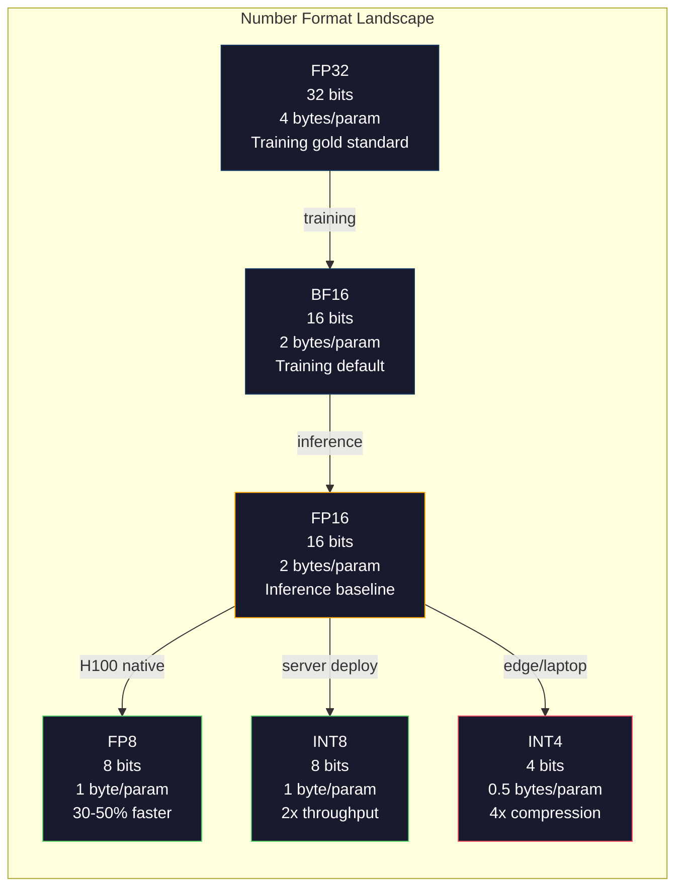
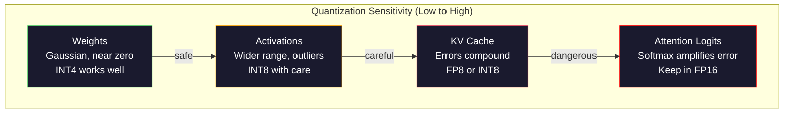
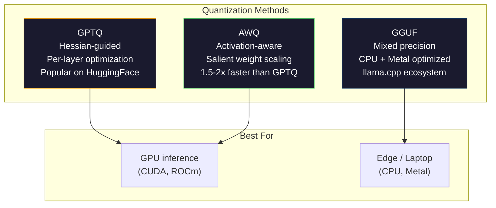

# Quantization: Making Models Fit: Quantization: Let the model run up

> Một mẫu 70B trong FP16 cần 140GB hai A100 chỉ cho trọng lượng số lượng đến FP8: một GPU 80GB INT4: một MacBook

> **【中文解读】**70 tỷ mô hình tham số trong FP16 dưới yêu cầu 140GB lưu trữ hiển thị( hai张 A100) ◊ định lượng đến FP8 chỉ cần một GPU 80GB, định lượng đến INT4 có thể hoạt động trên MacBook trên ◊ định lượng là sử dụng chính xác lưu trữ hiển thị và tốc độ của công nghệ cốt lõi ◊

> **【拓展：量化→llama.cpp/GGUF】**llama.cpp 和 GGUF 格式让大模型能运行在消费级硬件. GPTQ, AWQ, GGUF 等量化方法是将70B+ 模型部署到本地设备的关键.

>  **【前置】**Học本节前请先掌握:Phase 10·01-10(LLM 基础);浮点数表示(FP32/FP16/BF16/INT8/INT4);numpy 矩阵运算。

>  **【类比】**量化 = 压缩图片──原照片(FP16) mỗi像素 16 位,肉眼分辨不出和 8 位(FP8) khác biệt, nhưng文件大小一半──再压到4 位──INT4)肉眼开始看(精度损失),但文件小4 倍──模型量化同理:FP16→INT4 大小变 1/4,性能损失通常 <5%──GGUF 格式让你在 MacBook 上跑 Llama-70B──

**Type:** Build
**Languages:** Python (with numpy)
**Prerequisites:** Phase 10, Lessons 01-10 (LLMs from Scratch)
**Time:** ~120 minutes

## Mục tiêu học tập

- Thực hiện định lượng đối xứng và không đối xứng từ FP16 đến INT8 và INT4, bao gồm cả quy mô per-tensor và per-channel
  Thực hiện định lượng đối tượng/không đối tượng từ FP16 đến INT8 và INT4, bao gồm định lượng từng bước và định lượng từng bước
- Xét tiết kiệm bộ nhớ từ việc định lượng và xác định độ chính xác phù hợp với VRAM của GPU nhất định
  计算量化显存节省量, xác định độ chính xác của GPU 显存适合
- Giải thích sự khác biệt giữa đào tạo lượng tử sau đào tạo (PTQ) và đào tạo nhận thức về lượng tử (QAT)
  解释 đào tạo sau quy mô quy mô (PTQ) và quy mô cảm nhận (QAT)
- Sử dụng GPTQ hoặc AWQ để định lượng một mô hình thực tế và đo lường sự thỏa hiệp chính xác-tưởng nhớ trên một chỉ số chuẩn
   áp dụng GPTQ hoặc AWQ  định lượng mô hình thực tế, và trên cơ sở đo độ chính xác-đánh giá

> **【中文解读】**Bài học này thực hiện công nghệ định lượng hóa sử dụng độ chính xác thay đổi lưu trữ và tốc độ── phương pháp cốt lõi: đối称/không đối称 định lượng化、 từng张量/ từng通道缩放、PTQ(tren luyện sau định lượng hóa) vs QAT( định lượng cảm nhận đào tạo)── định lượng là các phương pháp tiêu chuẩn triển khai của mỗi mô hình lớn hơn 7B──

## Vấn đề  vấn đề giới thiệu

Llama 3 70B có 70 tỷ tham số. Mỗi tham số là một số điểm nổi 16 bit. đó là 140 tỷ byte. 140GB. Một A100 duy nhất có 80GB VRAM. Bạn thậm chí không thể tải trọng, chưa kể là đưa ra suy luận, trên một GPU duy nhất. Bạn cần hai A100 ở $ 2 / giờ mỗi chỉ để phục vụ một mô hình.

> Llama 3 70B có 700 tỷ tham số. Mỗi tham số là 16 位浮点数.

Nhưng 16 bit mỗi tham số là lãng phí. Hầu hết trọng lượng trong một cluster mạng thần kinh gần bằng không. Phạm vi động lực đầy đủ của FP16 (từ 0,000000059 đến 65,504) gần như hoàn toàn không được sử dụng. Nếu bạn đo phân phối trọng lượng thực tế trong Llama 3 70B, 95% trong số đó rơi giữa -0,1 và +0,1. Bạn đang đốt 16 bit để đại diện cho các giá trị có thể phù hợp trong 4.

> Nhưng mỗi số 16 điểm là lãng phí. Phần lớn trọng lượng trong mạng thần kinh tập trung ở gần zero. Phạm vi động thái hoàn chỉnh củaFP16 được sử dụng gần như không hoàn toàn. Nếu bạn đo lường phân bố thực tế trọng lượng trong Llama 3 70B, 95% nằm giữa -0.1 đến +0.1 . Bạn sử dụng 16 điểm để biểu thị có thể sử dụng giá trị biểu thị 4 điểm.

Quantization thay thế các số chính xác cao bằng số chính xác thấp hơn. FP16 đến FP8 cắt giảm bộ nhớ một nửa. FP16 đến INT4 cắt giảm nó thành một phần tư. Mô hình 140GB đó trở thành 35GB. Nó phù hợp với một GPU tiêu dùng duy nhất. Nhấn vào định lượng 2-bit (cực kỳ, tổn thất, nhưng có thể sử dụng cho một số nhiệm vụ) và mô hình tương tự chạy trên một máy tính xách tay 16GB.

> Phân tích bằng số độ chính xác thấp thay thế số độ chính xác cao. Phân tích bằng số độ chính xác thấp. Phân tích bằng số độ chính xác cao. Phân tích bằng số độ chính xác thấp. Phân tích bằng số độ chính xác thấp. Phân tích bằng số độ chính xác thấp. Phân tích bằng số độ chính xác thấp. Phân tích bằng số độ chính xác thấp. Phân tích bằng số độ chính xác thấp. Phân tích bằng số độ chính xác cao. Phân tích bằng số độ chính xác thấp. Phân tích bằng số độ chính xác thấp. Phân tích bằng số độ chính xác cao. Phân tích bằng số độ chính xác thấp. Phân tích bằng số độ chính xác thấp. Phân tích bằng số lượng chính xác thấp. Phân tích này có thể được sử dụng trên một số lượng chính xác của 16GB.

Chi phí là độ chính xác. Mỗi bit bạn loại bỏ sẽ phá hủy thông tin. Câu hỏi là bạn mất độ chính xác bao nhiêu và ở đâu. Một mô hình INT4 được định lượng tốt giữ lại 95-99% chất lượng của bản gốc trên hầu hết các tiêu chuẩn. Một định lượng ngây thơ cho INT4 có thể phá hủy mô hình hoàn toàn. Sự khác biệt là kỹ thuật.

> 代价是精度──每移除一个都破坏信息──问题在于你损失多少精度以及在哪里损失── 量化 tốt INT4 模型在大多数基准保留原质量的95-99%──简单的INT4 量化可能完全摧毁模型──差异在技术──

Các định lượng cộng đồng của Llama 3 đến INT4 với GPTQ cho thấy khoảng 1-2 điểm phức tạp bị mất trên WikiText. Mistral đã phát hành các điểm kiểm soát FP8 của Mixtral 8x22B với không mất chất lượng có thể đo lường trên MMLU.

> 社区 sử dụng GPTQ sẽ định lượng Llama 3 thành INT4, trên WikiText chỉ mất khoảng 1-2 个困惑度点。Mistral 发布 Mixtral 8x22B FP8 检查点,MMLU 上几乎零质量损失。GGUF 格式驱动 llama.cpp, chạy trên các chip MacBook M 系列 70B 模型── định lượng không bị hack。 nó là phương pháp triển khai tiêu chuẩn của mỗi mô hình vượt quá 7B。

> **【中文解读】**FP16 mỗi tham số 16 bit,70B  mô hình cần 140GB. Nhưng 95% trọng lượng tập trung giữa -0.1 đến +0.1  sử dụng 16 bit để cho thấy những giá trị này quá lãng phí.

> **【拓展：量化生态】**量化生态已经非常成熟:GPTQ(基于近似二阶信息的逐层量化) 、AWQ(激活感知权重量化,保护突出权重) 、GGUF(llama.cpp 的量化格式,支持 2-8 bit 混合精度) ⋅llama.cpp 让70B 模型运行在MacBook M 系列芯片上,催生本地大模型部署的生态(Ollama、LM Studio等) ⋅

## Khái niệm cốt lõi

### Các định dạng số: Mỗi bit làm gì

Mỗi số điểm nổi có ba phần: biểu tượng, biểu tượng và mantissa (còn được gọi là significand).

> Mỗi điểm trên số có ba phần:符号、指数和尾数( còn được gọi là số hiệu quả) ――符号占有一人──指数决定范围(数可以多大或多小)──尾数决定精度(有多少位小数)──

```
FP32:  [1 sign] [8 exponent] [23 mantissa]  = 32 bits
FP16:  [1 sign] [5 exponent] [10 mantissa]  = 16 bits
BF16:  [1 sign] [8 exponent] [7  mantissa]  = 16 bits
FP8:   [1 sign] [4 exponent] [3  mantissa]  = 8  bits (E4M3)
FP8:   [1 sign] [5 exponent] [2  mantissa]  = 8  bits (E5M2)
INT8:  [1 sign] [7 value]                   = 8  bits (uniform steps)
INT4:  [1 sign] [3 value]                   = 4  bits (16 levels total)
```

**FP32**là độ chính xác đầy đủ. 23 bit mantissa cho bạn khoảng 7 chữ số thập phân độ chính xác. phạm vi: khoảng 1,2 x 10^-38 đến 3,4 x 10^38.

> **FP32**                                                                                                                                                                                                                                                              

**FP16**10 bit mantissa tạo ra khoảng 3,3 chữ số thập phân. Tỷ số giảm xuống còn 5 bit, làm giảm phạm vi đáng kể (tỷ lệ tối đa là ~65,504). Điều này rất tốt cho trọng lượng (cluster gần không) nhưng nguy hiểm cho các hoạt động và độ nghiêng có thể tăng trong quá trình đào tạo.

> **FP16**Để giảm số lượng một nửa. 10 điểm cuối số cho khoảng 3.3 điểm trong quá trình chính xác. Chỉ số giảm xuống 5 điểm, phạm vi giảm đáng kể.

**BF16**(Brain Float 16) giữ cho số lượng 8 bit từ FP32 nhưng thu hẹp mantissa xuống còn 7 bit. Phạm vi tương tự như FP32, ít chính xác hơn FP16. Google thiết kế nó đặc biệt cho việc học sâu. Hình giác quan: phạm vi quan trọng hơn là độ chính xác cho mạng thần kinh. Một gradient 10^-20 chảy xuống không trong FP16 tồn tại trong BF16. Một trọng lượng 0,07342 tròn đến 0,0734 trong BF16 là đủ gần. Mỗi cuộc tập luyện hiện đại sử dụng BF16 hoặc hỗn hợp BF16/FP32.

> **BF16**(Brain Float 16) giữ chỉ số 8 điểm của FP32 nhưng sẽ giảm số lượng cuối đến 7 điểm. phạm vi tương tự, độ chính xác thấp hơn FP16[6]. Google 专门 dành cho thiết kế học sâu hơn.

**FP8**E4M3 (4 hàm, 3 mantissa) được sử dụng cho trọng lượng và kích hoạt trong quá trình suy luận. E5M2 (5 hàm, 2 mantissa) được sử dụng cho độ lệch trong quá trình đào tạo nơi phạm vi quan trọng hơn độ chính xác.

> **FP8**Có hai biến thể: E4M3;; 4 chỉ số, 3 chỉ số) được sử dụng để tính toán trọng lượng và kích hoạt. E5M2;; 5 chỉ số, 2 chỉ số) được sử dụng để đào tạo.

**INT8**là một định dạng số nguyên. Không biểu diễn viên, không mantissa. Chỉ 256 giá trị khoảng cách bằng nhau từ -128 đến 127. Bạn cần một yếu tố thang để lập bản đồ trọng lượng điểm nổi vào phạm vi này.

> **INT8**Chỉ có 256 个均间隔的值, từ -128 đến 127  Bạn cần phải thu nhỏ các yếu tố sẽ được chuyển tải lên các điểm này.

**INT4**Chỉ có 16 giá trị có thể. yếu tố quy mô làm việc nặng. chất lượng hoàn toàn phụ thuộc vào cách bạn chọn quy mô và trọng lượng bạn định lượng. phương pháp INT4 tiên tiến (GPTQ, AWQ) giữ lại 95% + chất lượng mô hình ban đầu.

> **INT4**Hơn nữa. Chỉ có 16 个可能值. Khối lượng hoàn toàn phụ thuộc vào cách bạn chọn cách giảm tỷ lệ và định lượng những trọng lượng nào.



### Làm thế nào việc định lượng hoạt động

Hoạt động lõi đơn giản. lấy một tensor của các giá trị điểm nổi, tìm một nhân số quy mô, nhân, tròn đến số nguyên gần nhất, và lưu trữ các số nguyên cộng với nhân số quy mô.

> 核心操作很简单―― lấy một浮点值张量, tìm ra nhân nhân, nhân nó, bốn舍五 vào vào số nguyên gần nhất, sau đó lưu trữ số nguyên cộng với nhân nhân nhân.

**Quantize:**
```
scale = max(abs(tensor)) / max_int_value
quantized = round(tensor / scale)
```

**Dequantize:**
```
reconstructed = quantized * scale
```

Đối với INT8 với phạm vi đối xứng (-127 đến 127):
```
scale = max(abs(tensor)) / 127
quantized = clamp(round(tensor / scale), -128, 127)
```

Thầm là lỗi tròn. Mỗi giá trị có thể bị bỏ đi tối đa `scale / 2`Tổng lỗi trên một lớp phụ thuộc vào số lượng trọng lượng bạn có và mức độ nhạy cảm của mô hình đối với sự nhiễu trong trọng lượng đó.

> 误差 là 4 五入误差. Mỗi giá trị có nhiều nhất 偏离.`scale / 2`❖ Sự khác biệt tổng thể trong một lớp phụ thuộc vào bạn có bao nhiêu trọng lượng và mô hình có độ nhạy cảm với sự nhiễu loạn của các trọng lượng này.

**Per-tensor vs per-channel quantization.**Per-tensor sử dụng một nhân số thang đo cho toàn bộ khối lượng. Khả năng đơn giản nhưng mất mát: nếu một cột có giá trị lớn và một cột khác có giá trị nhỏ, các giá trị nhỏ mất đi hầu hết độ chính xác của chúng. Mỗi kênh sử dụng một nhân số thang đo cho mỗi kênh đầu ra (trong mỗi hàng hoặc cột của các khối lượng). Chi phí chung nhiều hơn (bạn lưu trữ các yếu tố quy mô N thay vì 1) nhưng chất lượng tốt hơn đáng kể. Mỗi phương pháp định lượng sản xuất sử dụng độ hạt nhân theo kênh hoặc tinh vi hơn.

> **逐张量 vs 逐通道量化。** từng dòng lượng cho toàn bộ khối trọng lượng sử dụng một yếu tố thu nhỏ.  đơn giản nhưng có tổn thất: nếu một hàng có giá trị lớn cho một hàng khác có giá trị nhỏ, giá trị nhỏ sẽ mất phần lớn độ chính xác.

**Asymmetric quantization**thêm một điểm 0 củafset: `quantized = round(tensor / scale) + zero_point`. Điều này xử lý phân phối không trung tâm ở 0 . Sự kích hoạt ReLU, ví dụ, luôn không âm. Quantization đối xứng lãng phí một nửa phạm vi số nguyên trên các giá trị âm không bao giờ xuất hiện. Quantization không đối xứng bản đồ phạm vi thực tế [min, max] đến phạm vi số nguyên đầy đủ.

> **非对称量化**添加零点偏移:`quantized = round(tensor / scale) + zero_point`◊This processing is not in zero-centered distribution― chẳng hạn như ReLU  Activate value总是非负的── đối với định lượng hóa sẽ lãng phí một nửa phạm vi số nguyên nhân trên các giá trị âm không xuất hiện từ trước.

### Tầm quan trọng

Không phải mọi thứ trong mô hình đều dung nạp lượng bằng nhau.

> Trong mô hình không phải tất cả các phần có sự dung nạp với định lượng giống nhau.

**Weights (most robust).**Các trọng lượng mô hình thay đổi chậm trong quá trình đào tạo và theo phân bố Gaussian trung tâm gần bằng không. Chúng định lượng tốt. trọng lượng INT8 với các thang đo trên mỗi kênh tạo ra kết quả gần như không mất. INT4 đòi hỏi các phương pháp phức tạp hơn nhưng hoạt động.

> **权重（最鲁棒）。**Ưu điểm trọng lượng trong tập luyện thay đổi chậm, theo phân bố cao trung tâm đến không. Chúng có hiệu quả tốt.

**Activations (moderate sensitivity).**Các hoạt động là các giá trị trung gian chảy qua mạng trong quá trình suy luận. Chúng có phạm vi động lực rộng hơn trọng lượng và chứa các điểm ngoại lệ. Một đầu chú ý duy nhất có thể tạo ra các giá trị kích hoạt lớn hơn trung bình 100 lần. Những điểm ngoại lệ này rất quan trọng đối với chất lượng mô hình. Việc định lượng chúng một cách ngây thơ sẽ phá hủy thông tin. Giải pháp: giữ các kênh ngoại lệ trong độ chính xác cao hơn (LLM.int8() sử dụng các thang tích hoạt động mỗi token hoặc mỗi kênh.

> **激活（中等敏感度）。**激活 là giá trị trung gian của mạng lưới thời gian lưu thông. Chúng có phạm vi động thái rộng hơn trọng lượng và không chứa giá trị phân nhóm. Một đầu tập trung có thể tạo ra giá trị phân nhóm lớn hơn 100 lần giá trị trung bình.

**KV cache (high sensitivity).**Bộ nhớ cache giá trị khóa lưu trữ trạng thái chú ý cho tất cả các token trước đây. Ở độ dài ngữ cảnh dài, bộ nhớ cache KV chiếm ưu thế. Đối với mô hình 70B ở ngữ cảnh 32K, bộ nhớ cache KV một mình là 40GB trong FP16.

> **KV 缓存（高敏感度）。**键值缓存存储所有前代币的注意状态――在长上下文长度下,KV 缓存主导内存――70B 模型在 32K 上下文下,只有KV 缓存就有40GB FP16――将KV 缓存量化到FP8或INT8节省大量内存,但任何差异会在所有后代注意计算中累积――质量影响随序列长度增加――

**Attention logits (most sensitive).**Softmax trong sự chú ý rất nhạy cảm với những thay đổi nhỏ trong đầu vào của nó. Một lỗi định lượng 0.01 trong logit trước Softmax có thể thay đổi sự phân phối sự chú ý một cách có ý nghĩa. Hầu hết các quy hoạch định lượng giữ tính toán sự chú ý ở độ chính xác cao hơn (FP16 hoặc BF16) ngay cả khi mọi thứ khác được định lượng.

> **注意力 logits（最敏感）。**Softmax trong chú ý có độ nhạy cao với những thay đổi nhỏ trong đầu vào của nó. Phản ứng sai sót định lượng 0.01 trong logic pre-softmax có thể thay đổi đáng kể phân bố chú ý. Hầu hết các quy trình định lượng ngay cả khi tất cả các phần khác đều được định lượng, cũng giữ cho sự chú ý tính toán ở độ chính xác cao hơn (FP16 hoặc BF16):



### PTQ vs QAT

**Post-Training Quantization (PTQ)**Phân tích của các máy tính có thể được sử dụng để làm việc với các máy tính thông minh, như là các máy tính thông minh, các máy tính thông minh, các máy tính thông minh, các máy tính thông minh, các máy tính thông minh, các máy tính thông minh, các máy tính thông minh, các máy tính thông minh, các máy tính thông minh, các máy tính thông minh, các máy tính thông minh, các máy tính thông minh, các máy tính thông minh, các máy tính thông minh, các máy tính thông minh, các máy tính thông minh, các máy tính thông minh, các máy tính thông minh, các máy tính thông minh, các máy tính thông minh, các máy tính thông minh, các máy tính thông minh, các máy tính thông minh, các máy tính thông minh, các máy tính thông minh, các máy tính thông minh, các máy tính thông minh, các máy tính thông minh, các máy tính thông minh, các máy tính thông minh, các máy tính thông minh, các máy tính thông minh, các máy tính thông tin, các máy tính thông tin, các máy tính thông tin, các máy tính thông tin, các máy tính thông tin, các máy tính thông tin, các máy tính thông tin, các máy tính thông tin, các máy tính, các máy tính, các máy tính, các máy tính, các máy tính, các máy tính, các máy tính, và các máy tính khác.

> **训练后量化（PTQ）**量化已训练的模型──无需重训──取 FP16 权重,计算缩放因子,四舍五入,部署──快速(几分钟到几小时)且便宜──INT8 和 FP8 效果好── đối với INT4,朴素PTQ 经常失败,因为四舍五入误差累积──高级PTQ 方法(GPTQ、AWQ) sử dụng dữ liệu chuẩn bị tối thiểu hóa số lượng误差──

**Quantization-Aware Training (QAT)**Đưa các hoạt động định lượng giả vào bài đi trước trong quá trình đào tạo. Mô hình học cách đặt trọng lượng của nó ở nơi có lỗi tròn nhỏ. Các gradient chảy qua định lượng giả sử bằng cách sử dụng ước tính thẳng qua (STE): giả vờ hoạt động tròn có gradient 1. QAT sản xuất mô hình INT4 và INT2 tốt hơn so với PTQ nhưng đòi hỏi phải đào tạo đầy đủ. Google đã sử dụng QAT để cung cấp hiệu quả của Gemini. Meta đã sử dụng QAT cho một số mục tiêu triển khai Llama.

> **量化感知训练（QAT）**Trong quá trình truyền tải trước của đào tạo, các mô hình học sẽ đặt trọng lượng vào vị trí của các sai lầm nhỏ.

| Aspect | PTQ | QAT |
|--------|-----|-----|
| Cost / 成本 | Minutes to hours / 几分钟到几小时 | Full training run / 完整训练运行 |
| Quality at INT8 / INT8 质量 | Excellent (< 0.1% loss) / 优秀（< 0.1% 损失） | Excellent / 优秀 |
| Quality at INT4 / INT4 质量 | Good with GPTQ/AWQ (1-3% loss) / 配合 GPTQ/AWQ 良好（1-3% 损失） | Better (< 1% loss) / 更好（< 1% 损失） |
| Quality at INT2 / INT2 质量 | Poor / 差 | Usable for some tasks / 某些任务可用 |
| Calibration data / 校准数据 | 128-1024 examples / 128-1024 样本 | Full training dataset / 完整训练数据集 |
| When to use / 使用时机 | Deployment, iteration / 部署、迭代 | Maximum quality at low bit-width / 低比特宽度的最大质量 |

### GPTQ, AWQ, GGUF

**GPTQ (GPT Quantization)**là phương pháp PTQ một lần. Nó định lượng trọng lượng một lớp một lần, sử dụng một bộ dữ liệu hiệu chuẩn nhỏ (128 ví dụ điển hình) để đo Hessian ( thông tin thứ hai về mức độ nhạy cảm của đầu ra đối với mỗi trọng lượng). Những trọng lượng mà Hessian nói là quan trọng được định lượng kỹ lưỡng hơn. GPTQ là phương pháp đầu tiên để thực hiện định lượng INT4 cho LLM. TheBloke on Hugging Face đã phổ biến GPTQ bằng cách phát hành các phiên bản lượng tử của hàng trăm mô hình.

> **GPTQ**là một phương pháp định lượng trọng lượng PTQ một lần. Nó sử dụng bộ dữ liệu định lượng nhỏ (thường là 128 mẫu) đo Hessian (trong việc phát hành các phiên bản định lượng của hàng mô hình)  Hessian chỉ ra trọng lượng quan trọng được định lượng kỹ hơn. GPTQ là phương pháp đầu tiên để INT4 được định lượng cho LLM.

**AWQ (Activation-Aware Weight Quantization)**quan sát rằng một phần nhỏ của trọng lượng (khoảng 1%) là quan trọng không tương xứng vì chúng nhân với các giá trị kích hoạt lớn. AWQ xác định các trọng lượng nổi bật này bằng cách sử dụng dữ liệu hiệu chuẩn và quy mô chúng trước khi định lượng (sau đó quy mô kích hoạt tương ứng xuống). Điều này giữ các trọng lượng quan trọng trong phạm vi mà định lượng INT4 chính xác. AWQ thường phù hợp hoặc nhẹ vượt qua chất lượng GPTQ trong khi nhanh hơn 1,5-2 lần để áp dụng.

> **AWQ**观察到少部分权重 (约1%) vì có kích hoạt lớn gấp đôi và đặc biệt quan trọng. AWQ sử dụng các dữ liệu xác định để xác định các trọng lượng quan trọng này và định lượng trước khi phóng đại chúng.

**GGUF (GPT-Generated Unified Format)**là định dạng tập tin được sử dụng bởi llama.cpp và hệ sinh thái của nó. Nó hỗ trợ định lượng hỗn hợp: các lớp khác nhau có chiều rộng bit khác nhau. Các lớp đầu tiên và cuối cùng (năm và đầu đầu ra) thường được giữ ở độ chính xác cao hơn. Các lớp trung tâm có được INT4 hoặc INT3. Các tệp GGUF tự chứa: trọng lượng, tokenizer, metadata tất cả trong một tệp. Các định dạng được thiết kế cho suy luận CPU và Apple Silicon, nơi tải toàn bộ mô hình vào bộ nhớ và chạy các nhân số ma trận trên CPU hoặc Metal GPU là con đường tiêu chuẩn. Q4_K_M là biến thể định lượng GGUF phổ biến nhất, cân bằng chất lượng và kích thước.

> **GGUF**Đây là một trong những định dạng của các tập tin được sử dụng trong môi trường của mình. Nó hỗ trợ hỗn hợp định lượng: khác nhau cấp độ đạt được khác nhau vị trí rộng.



### Đánh giá chất lượng

Làm sao bạn biết mô hình lượng tử của bạn vẫn tốt?

> Làm sao để đánh giá mô hình định lượng của bạn vẫn còn hữu ích?

**Perplexity.**Các quy định khác nhau: delta < 0,5 là tuyệt vời, 0.5-1.0 là tốt, 1.0-2.0 là chấp nhận được cho hầu hết các nhiệm vụ, > 2.0 có nghĩa là có gì đó đã sai.

> **困惑度。**Chỉ số thường xuyên sử dụng: 越低越好. 藏数据集: 维基文文-2 是标准) 计算原始和量化模型的困惑度: 差值告诉你量化破坏了多少信息. 经验法则:差值: 差值 < 0.5 优秀,0.5-1.0 良好,1.0-2.0 大多数任务可接受,> 2.0 说明有问题.

**Task-specific benchmarks.**Tiếp tục chạy mô hình lượng tử trên MMLU, HumanEval, GSM8K hoặc bộ đánh giá tùy chỉnh của bạn. So sánh với bản gốc. Quantization ảnh hưởng bất đồng khả năng khác nhau. Nhiệm vụ toán học và mã nhạy cảm hơn với mất độ chính xác hơn kiến thức chung.

> **任务特定基准。**Trong MMLU、HumanEval、GSM8K hoặc bộ đánh giá tự định của bạn, các mô hình định lượng được vận hành.

**Output comparison.**Tạo các phản ứng từ cả hai mô hình trên cùng một yêu cầu và so sánh. LLM như một thẩm phán (Dạy 10) hoạt động tốt ở đây. Xét tỷ lệ thắng: số lượng yêu cầu mô hình lượng tử phù hợp hoặc đánh bại nguyên bản trên bao nhiêu phần trăm?

> **输出比较。**Từ hai mô hình trong cùng một prompt 上生成回复并比较.

**Latency and throughput.**Quantization tồn tại để làm cho các mô hình nhanh hơn và rẻ hơn. đo token mỗi giây, thời gian để token đầu tiên, và sử dụng bộ nhớ. Một mô hình lượng tử chậm hơn so với bản gốc là tồi tệ hơn là vô dụng.

> **延迟和吞吐量。**Ưu điểm của sự tồn tại định lượng là để làm cho mô hình nhanh hơn và rẻ hơn. Ưu điểm đo mỗi giây, số, đầu tiên, thời gian và sử dụng bộ nhớ.

| Model | Format | Size | Perplexity (WikiText-2) | MMLU | Tokens/sec (A100) |
|-------|--------|------|------------------------|------|-------------------|
| Llama 3 70B | FP16 | 140GB | 3.12 | 79.5% | 38 |
| Llama 3 70B | FP8 | 70GB | 3.14 | 79.3% | 55 |
| Llama 3 70B | GPTQ INT4 | 35GB | 4.32 | 77.8% | 72 |
| Llama 3 70B | AWQ INT4 | 35GB | 4.18 | 78.1% | 75 |
| Llama 3 70B | GGUF Q4_K_M | 40GB | 4.25 | 77.9% | 28 (CPU) |

Mô hình: FP8 gần như miễn phí. INT4 tốn 1-2 điểm MMLU nhưng tăng gấp đôi dung lượng và bộ nhớ.

> 模式:FP8 几乎免费──INT4 代价 1-2  MMLU điểm nhưng dung lượng tăng gấp đôi、 bộ nhớ giảm xuống còn một phần tư── trọng lượng này đối với hầu hết các triển khai đều đáng giá──

### Số thực

FP16 đến FP8 trên H100: 30-50% tăng tốc độ suy luận, < 0,1% mất chất lượng. Đây là định lượng không có suy nghĩ.

> H100 lên FP16 đến FP8:30-50% 推理加速,< 0.1% 质量损失──这是不用想的量化──每个H100 部署都应使用──

FP16 đến INT8 (LLM.int8(): giảm bộ nhớ 2x, mất chất lượng < 0,5%. Cách tiếp cận chính xác hỗn hợp giữ các tính năng khác biệt trong FP16 trong khi định lượng mọi thứ khác đến INT8.

> FP16 đến INT8 ((LLM.int8()): 2 倍内存减少,< 0.5% 质量损失――混合精度方法保持离群特征在FP16而其他全部量化到INT8――

FP16 đến INT4 (GPTQ / AWQ): Giảm bộ nhớ 4x, mất chất lượng 1-3% tùy thuộc vào mô hình và phương pháp.

> FP16 đến INT4(GPTQ/AWQ) 4: 倍内存减少,1-3% 质量损失,取决于模型和方法──使70B 模型可在单张48GB GPU 上运行──

FP16 đến INT4 (GGUF Q4_K_M): Giảm bộ nhớ 3,5x, mất chất lượng 1-2%. tối ưu cho suy luận CPU. Một mô hình 70B ở Q4_K_M là khoảng 40GB và chạy với 10-15 token / giây trên một M3 Max với 64GB.

> FP16 đến INT4(GGUF Q4_K_M):3.5 倍内存 giảm,1-2% 质量损失──为 CPU 推理优化──Q4_K_M 的 70B 模型约40GB,在64GB M3 Max 上以 10-15 token/秒运行──

FP16 đến INT2: Giảm bộ nhớ 8x, mất chất lượng 5-15%. Chỉ khả thi cho các nhiệm vụ hẹp cụ thể mà bạn có thể dung nạp sự suy giảm. Biến giới nghiên cứu, không sẵn sàng sản xuất cho việc sử dụng chung.

> FP16 đến INT2:8 倍内存减少,5-15% 质量损失―― chỉ áp dụng cho các nhiệm vụ cụ thể khắt khe có thể chịu đựng sự tái tạo――研究前沿,非通用生产就绪――

## Hãy xây dựng nó.
```figure
quantization
```

## Hãy xây dựng nó

### Bước 1: Các biểu diễn định dạng số

Xây dựng đại diện cấp bit của mỗi định dạng để xem chính xác ký hiệu, biểu tượng và mantissa làm gì.

> Xây dựng các biểu tượng cấp bậc của mỗi kiểu, xem rõ các biểu tượng, chỉ số và số cuối có tác dụng gì.

```python
import numpy as np


def float_to_fp32_bits(value):
    bits = np.float32(value).view(np.uint32)
    sign = (bits >> 31) & 1
    exponent = (bits >> 23) & 0xFF
    mantissa = bits & 0x7FFFFF
    return {"sign": int(sign), "exponent": int(exponent), "mantissa": int(mantissa),
            "exponent_bits": format(int(exponent), '08b'),
            "mantissa_bits": format(int(mantissa), '023b'),
            "value": float(value),
            "actual_exponent": int(exponent) - 127}


def float_to_fp16_bits(value):
    fp16 = np.float16(value)
    bits = fp16.view(np.uint16)
    sign = (bits >> 15) & 1
    exponent = (bits >> 10) & 0x1F
    mantissa = bits & 0x3FF
    return {"sign": int(sign), "exponent": int(exponent), "mantissa": int(mantissa),
            "exponent_bits": format(int(exponent), '05b'),
            "mantissa_bits": format(int(mantissa), '010b'),
            "value": float(fp16),
            "actual_exponent": int(exponent) - 15}


def float_to_bf16_bits(value):
    fp32_bits = np.float32(value).view(np.uint32)
    bf16_bits = (fp32_bits >> 16).astype(np.uint16)
    sign = (bf16_bits >> 15) & 1
    exponent = (bf16_bits >> 7) & 0xFF
    mantissa = bf16_bits & 0x7F
    reconstructed = np.uint32(bf16_bits.astype(np.uint32) << 16).view(np.float32)
    return {"sign": int(sign), "exponent": int(exponent), "mantissa": int(mantissa),
            "exponent_bits": format(int(exponent), '08b'),
            "mantissa_bits": format(int(mantissa), '07b'),
            "value": float(reconstructed),
            "actual_exponent": int(exponent) - 127}


def simulate_fp8_e4m3(value):
    sign = 1 if value < 0 else 0
    abs_val = abs(value)
    max_val = 448.0
    abs_val = min(abs_val, max_val)
    if abs_val == 0:
        return {"sign": sign, "exponent": 0, "mantissa": 0, "value": 0.0,
                "exponent_bits": "0000", "mantissa_bits": "000"}
    exp = int(np.floor(np.log2(abs_val)))
    exp = max(-6, min(8, exp))
    mantissa_val = abs_val / (2.0 ** exp) - 1.0
    mantissa_quant = round(mantissa_val * 8) / 8
    mantissa_quant = max(0, min(0.875, mantissa_quant))
    reconstructed = (1.0 + mantissa_quant) * (2.0 ** exp)
    if sign:
        reconstructed = -reconstructed
    mantissa_int = int(round(mantissa_quant * 8))
    return {"sign": sign, "exponent": exp + 7, "mantissa": mantissa_int,
            "exponent_bits": format(exp + 7, '04b'),
            "mantissa_bits": format(mantissa_int, '03b'),
            "value": float(reconstructed),
            "actual_exponent": exp}


def display_format_comparison(value):
    fp32 = float_to_fp32_bits(value)
    fp16 = float_to_fp16_bits(value)
    bf16 = float_to_bf16_bits(value)
    fp8 = simulate_fp8_e4m3(value)

    print(f"\n  Value: {value}")
    print(f"  {'Format':<8} {'Stored Value':>14} {'Error':>12} {'Sign':>5} {'Exp Bits':>10} {'Man Bits':>25}")
    print(f"  {'-'*76}")
    print(f"  {'FP32':<8} {fp32['value']:>14.6f} {abs(fp32['value'] - value):>12.8f} {fp32['sign']:>5} {fp32['exponent_bits']:>10} {fp32['mantissa_bits']:>25}")
    print(f"  {'FP16':<8} {fp16['value']:>14.6f} {abs(fp16['value'] - value):>12.8f} {fp16['sign']:>5} {fp16['exponent_bits']:>10} {fp16['mantissa_bits']:>25}")
    print(f"  {'BF16':<8} {bf16['value']:>14.6f} {abs(bf16['value'] - value):>12.8f} {bf16['sign']:>5} {bf16['exponent_bits']:>10} {bf16['mantissa_bits']:>25}")
    print(f"  {'FP8e4m3':<8} {fp8['value']:>14.6f} {abs(fp8['value'] - value):>12.8f} {fp8['sign']:>5} {fp8['exponent_bits']:>10} {fp8['mantissa_bits']:>25}")
```

### Bước 2: Quantization đối xứng (Per-Tensor và Per-Channel)

Các hoạt động định lượng cơ bản. Per-tensor sử dụng một thang đo cho toàn bộ matrix. Per-channel sử dụng một thang đo cho mỗi hàng hoặc cột.

> 基本量化操作──逐张量对整个矩阵使用一个缩小因子──逐通对每行或每列使用一个缩小因子──

```python
def quantize_symmetric(tensor, num_bits=8):
    qmin = -(2 ** (num_bits - 1))
    qmax = 2 ** (num_bits - 1) - 1
    abs_max = np.max(np.abs(tensor))
    if abs_max == 0:
        return np.zeros_like(tensor, dtype=np.int32), 1.0
    scale = abs_max / qmax
    quantized = np.clip(np.round(tensor / scale), qmin, qmax).astype(np.int32)
    return quantized, float(scale)


def dequantize_symmetric(quantized, scale):
    return quantized.astype(np.float64) * scale


def quantize_per_channel(tensor, num_bits=8, axis=0):
    qmin = -(2 ** (num_bits - 1))
    qmax = 2 ** (num_bits - 1) - 1

    if axis == 0:
        abs_max = np.max(np.abs(tensor), axis=1, keepdims=True)
    else:
        abs_max = np.max(np.abs(tensor), axis=0, keepdims=True)

    abs_max = np.where(abs_max == 0, 1.0, abs_max)
    scales = abs_max / qmax
    quantized = np.clip(np.round(tensor / scales), qmin, qmax).astype(np.int32)
    return quantized, scales.squeeze()


def dequantize_per_channel(quantized, scales, axis=0):
    if axis == 0:
        return quantized.astype(np.float64) * scales.reshape(-1, 1)
    else:
        return quantized.astype(np.float64) * scales.reshape(1, -1)


def quantize_asymmetric(tensor, num_bits=8):
    qmin = 0
    qmax = 2 ** num_bits - 1
    t_min = np.min(tensor)
    t_max = np.max(tensor)
    if t_max == t_min:
        return np.zeros_like(tensor, dtype=np.int32), 1.0, 0
    scale = (t_max - t_min) / (qmax - qmin)
    zero_point = int(np.round(qmin - t_min / scale))
    zero_point = max(qmin, min(qmax, zero_point))
    quantized = np.clip(np.round(tensor / scale + zero_point), qmin, qmax).astype(np.int32)
    return quantized, float(scale), int(zero_point)


def dequantize_asymmetric(quantized, scale, zero_point):
    return (quantized.astype(np.float64) - zero_point) * scale
```

### Bước 3: Đánh giá chất lượng

Đánh giá số lượng thông tin tiêu diệt bao nhiêu. Phản độ bình phương, tỷ lệ tín hiệu-xâo và sự tương đồng cosine giữa các tensor ban đầu và tái cấu trúc.

>  định lượng hóa phá hủy nhiều thông tin.                                                                                                                                                                                                                                                         

```python
def quantization_error(original, reconstructed):
    diff = original - reconstructed
    mse = float(np.mean(diff ** 2))
    rmse = float(np.sqrt(mse))
    max_error = float(np.max(np.abs(diff)))
    signal_power = float(np.mean(original ** 2))
    snr_db = 10 * np.log10(signal_power / max(mse, 1e-20))

    orig_flat = original.flatten()
    recon_flat = reconstructed.flatten()
    norm_orig = np.linalg.norm(orig_flat)
    norm_recon = np.linalg.norm(recon_flat)
    if norm_orig == 0 or norm_recon == 0:
        cosine_sim = 0.0
    else:
        cosine_sim = float(np.dot(orig_flat, recon_flat) / (norm_orig * norm_recon))

    return {"mse": mse, "rmse": rmse, "max_error": max_error,
            "snr_db": float(snr_db), "cosine_similarity": cosine_sim}


def compare_quantization_methods(tensor, num_bits=8):
    q_pt, s_pt = quantize_symmetric(tensor, num_bits)
    recon_pt = dequantize_symmetric(q_pt, s_pt)
    err_pt = quantization_error(tensor, recon_pt)

    q_pc, s_pc = quantize_per_channel(tensor, num_bits, axis=0)
    recon_pc = dequantize_per_channel(q_pc, s_pc, axis=0)
    err_pc = quantization_error(tensor, recon_pc)

    q_asym, s_asym, zp = quantize_asymmetric(tensor, num_bits)
    recon_asym = dequantize_asymmetric(q_asym, s_asym, zp)
    err_asym = quantization_error(tensor, recon_asym)

    print(f"\n  Quantization Comparison ({num_bits}-bit, tensor shape {tensor.shape}):")
    print(f"  {'Method':<20} {'MSE':>12} {'SNR (dB)':>10} {'Cosine Sim':>12} {'Max Error':>12}")
    print(f"  {'-'*68}")
    print(f"  {'Per-tensor sym':<20} {err_pt['mse']:>12.8f} {err_pt['snr_db']:>10.2f} {err_pt['cosine_similarity']:>12.8f} {err_pt['max_error']:>12.8f}")
    print(f"  {'Per-channel sym':<20} {err_pc['mse']:>12.8f} {err_pc['snr_db']:>10.2f} {err_pc['cosine_similarity']:>12.8f} {err_pc['max_error']:>12.8f}")
    print(f"  {'Asymmetric':<20} {err_asym['mse']:>12.8f} {err_asym['snr_db']:>10.2f} {err_asym['cosine_similarity']:>12.8f} {err_asym['max_error']:>12.8f}")

    return {"per_tensor": err_pt, "per_channel": err_pc, "asymmetric": err_asym}
```

### Bước 4: Bỏ rộng một chút

Quantize cùng một tensor ở chiều rộng bit khác nhau (2, 3, 4, 8, 16) và đo chất lượng ở mỗi cấp độ.

> Trong các vị trí khác nhau rộng ((2、3、4、8、16):

```python
def bit_width_sweep(tensor):
    print(f"\n  Bit-Width Sweep (tensor shape {tensor.shape}):")
    print(f"  {'Bits':>6} {'Levels':>8} {'MSE':>14} {'SNR (dB)':>10} {'Cosine Sim':>12} {'Compression':>12}")
    print(f"  {'-'*64}")

    results = []
    for bits in [2, 3, 4, 8, 16]:
        q, s = quantize_per_channel(tensor, bits, axis=0)
        recon = dequantize_per_channel(q, s, axis=0)
        err = quantization_error(tensor, recon)
        levels = 2 ** bits
        compression = 32.0 / bits

        print(f"  {bits:>6} {levels:>8} {err['mse']:>14.8f} {err['snr_db']:>10.2f} {err['cosine_similarity']:>12.8f} {compression:>11.1f}x")
        results.append({"bits": bits, "levels": levels, "error": err, "compression": compression})

    return results
```

### Bước 5: Thử nghiệm nhạy cảm

Mô phỏng định lượng các bộ phận khác nhau của một biến thể và đo các thành phần nhạy cảm nhất. Điều này cho thấy hệ thống phân cấp nhạy cảm: trọng lượng < kích hoạt < KV cache < chú ý.

> Các phần khác nhau của biến thể định lượng được định đo là các thành phần nào nhạy cảm nhất.

```python
def simulate_transformer_layer(input_data, weights, kv_scale=1.0):
    hidden = input_data @ weights["qkv"]
    seq_len = hidden.shape[1]
    d_model = weights["qkv"].shape[1] // 3
    q, k, v = hidden[:, :, :d_model], hidden[:, :, d_model:2*d_model], hidden[:, :, 2*d_model:]

    attn_scores = (q @ k.transpose(0, 2, 1)) / np.sqrt(d_model) * kv_scale
    attn_max = np.max(attn_scores, axis=-1, keepdims=True)
    attn_exp = np.exp(attn_scores - attn_max)
    attn_weights = attn_exp / np.sum(attn_exp, axis=-1, keepdims=True)

    attn_output = attn_weights @ v
    output = attn_output @ weights["out"]
    return output, {"q": q, "k": k, "v": v, "attn_scores": attn_scores,
                    "attn_weights": attn_weights, "attn_output": attn_output}


def sensitivity_experiment(batch_size=2, seq_len=16, d_model=64, num_bits=8):
    np.random.seed(42)
    input_data = np.random.randn(batch_size, seq_len, d_model) * 0.1

    weights = {
        "qkv": np.random.randn(d_model, 3 * d_model) * (2.0 / d_model) ** 0.5,
        "out": np.random.randn(d_model, d_model) * (2.0 / d_model) ** 0.5,
    }

    baseline_output, baseline_internals = simulate_transformer_layer(input_data, weights)

    experiments = {}

    q_qkv, s_qkv = quantize_per_channel(weights["qkv"], num_bits, axis=0)
    q_out, s_out = quantize_per_channel(weights["out"], num_bits, axis=0)
    quantized_weights = {
        "qkv": dequantize_per_channel(q_qkv, s_qkv, axis=0),
        "out": dequantize_per_channel(q_out, s_out, axis=0),
    }
    weight_quant_output, _ = simulate_transformer_layer(input_data, quantized_weights)
    experiments["Weights only"] = quantization_error(baseline_output, weight_quant_output)

    _, fresh_internals = simulate_transformer_layer(input_data, weights)
    q_act, s_act = quantize_per_channel(
        fresh_internals["attn_output"].reshape(-1, d_model), num_bits, axis=0
    )
    quant_attn_out = dequantize_per_channel(q_act, s_act, axis=0).reshape(batch_size, seq_len, d_model)
    act_quant_output = quant_attn_out @ weights["out"]
    experiments["Activations only"] = quantization_error(baseline_output, act_quant_output)

    q_k, s_k = quantize_per_channel(fresh_internals["k"].reshape(-1, d_model), num_bits, axis=0)
    q_v, s_v = quantize_per_channel(fresh_internals["v"].reshape(-1, d_model), num_bits, axis=0)
    quant_k = dequantize_per_channel(q_k, s_k, axis=0).reshape(batch_size, seq_len, d_model)
    quant_v = dequantize_per_channel(q_v, s_v, axis=0).reshape(batch_size, seq_len, d_model)
    attn_scores_kv = (fresh_internals["q"] @ quant_k.transpose(0, 2, 1)) / np.sqrt(d_model)
    attn_max_kv = np.max(attn_scores_kv, axis=-1, keepdims=True)
    attn_exp_kv = np.exp(attn_scores_kv - attn_max_kv)
    attn_weights_kv = attn_exp_kv / np.sum(attn_exp_kv, axis=-1, keepdims=True)
    kv_quant_output = (attn_weights_kv @ quant_v) @ weights["out"]
    experiments["KV cache only"] = quantization_error(baseline_output, kv_quant_output)

    noise_scale = np.std(fresh_internals["attn_scores"]) * 0.05
    noisy_scores = fresh_internals["attn_scores"] + np.random.randn(*fresh_internals["attn_scores"].shape) * noise_scale
    noisy_max = np.max(noisy_scores, axis=-1, keepdims=True)
    noisy_exp = np.exp(noisy_scores - noisy_max)
    noisy_weights = noisy_exp / np.sum(noisy_exp, axis=-1, keepdims=True)
    attn_quant_output = (noisy_weights @ fresh_internals["v"]) @ weights["out"]
    experiments["Attention logits (5% noise)"] = quantization_error(baseline_output, attn_quant_output)

    print(f"\n  Sensitivity Experiment ({num_bits}-bit quantization):")
    print(f"  {'Component':<30} {'MSE':>14} {'SNR (dB)':>10} {'Cosine Sim':>12}")
    print(f"  {'-'*68}")
    for name, err in sorted(experiments.items(), key=lambda x: x[1]["mse"]):
        print(f"  {name:<30} {err['mse']:>14.8f} {err['snr_db']:>10.2f} {err['cosine_similarity']:>12.8f}")

    return experiments
```

### Bước 6: GPTQ mô phỏng

GPTQ định lượng từng cột một lần, sử dụng Hessian để quyết định cách phân phối lỗi tròn. Đây là một phiên bản đơn giản hóa nắm bắt ý tưởng cốt lõi: sử dụng dữ liệu hiệu chuẩn để đo trọng lượng trọng lượng, sau đó định lượng trọng lượng ít quan trọng hơn một cách tích cực hơn.

```python
def simulated_gptq(weight_matrix, calibration_inputs, num_bits=4):
    n_in, n_out = weight_matrix.shape
    qmin = -(2 ** (num_bits - 1))
    qmax = 2 ** (num_bits - 1) - 1

    H = np.zeros((n_in, n_in))
    for x in calibration_inputs:
        x = x.reshape(-1, 1) if x.ndim == 1 else x
        for row in range(x.shape[0]):
            xi = x[row].reshape(-1, 1)
            H += xi @ xi.T
    H /= len(calibration_inputs)
    H += np.eye(n_in) * 1e-4

    weight_importance = np.diag(H)

    quantized = np.zeros_like(weight_matrix, dtype=np.int32)
    scales = np.zeros(n_out)
    errors = np.zeros(n_out)

    W = weight_matrix.copy()

    for col in range(n_out):
        w_col = W[:, col]
        abs_max = np.max(np.abs(w_col))
        if abs_max == 0:
            scales[col] = 1.0
            continue
        scale = abs_max / qmax
        scales[col] = scale

        q_col = np.clip(np.round(w_col / scale), qmin, qmax).astype(np.int32)
        quantized[:, col] = q_col

        quant_error = w_col - q_col * scale
        errors[col] = np.sqrt(np.mean(quant_error ** 2))

        if col < n_out - 1:
            importance_weights = weight_importance / (np.max(weight_importance) + 1e-10)
            for next_col in range(col + 1, min(col + 4, n_out)):
                compensation = quant_error * importance_weights * 0.1
                W[:, next_col] += compensation

    return quantized, scales, {"column_errors": errors,
                               "mean_error": float(np.mean(errors)),
                               "max_error": float(np.max(errors))}


def dequantize_gptq(quantized, scales):
    result = np.zeros_like(quantized, dtype=np.float64)
    for col in range(quantized.shape[1]):
        result[:, col] = quantized[:, col] * scales[col]
    return result
```

### Bước 7: Đơn giản hóa AWQ

AWQ xác định trọng lượng nổi bật (những trọng lượng nhân với kích hoạt lớn) và bảo vệ chúng bằng cách quy mô trước khi định lượng.

```python
def simulated_awq(weight_matrix, calibration_inputs, num_bits=4, salient_fraction=0.01):
    n_in, n_out = weight_matrix.shape
    qmin = -(2 ** (num_bits - 1))
    qmax = 2 ** (num_bits - 1) - 1

    activation_magnitudes = np.zeros(n_in)
    for x in calibration_inputs:
        if x.ndim == 1:
            activation_magnitudes += np.abs(x)
        else:
            activation_magnitudes += np.mean(np.abs(x), axis=0)
    activation_magnitudes /= len(calibration_inputs)

    n_salient = max(1, int(n_in * salient_fraction))
    salient_indices = np.argsort(activation_magnitudes)[-n_salient:]

    scale_factors = np.ones(n_in)
    for idx in salient_indices:
        col_max = np.max(np.abs(weight_matrix[idx, :]))
        if col_max > 0:
            scale_factors[idx] = min(4.0, 1.0 / (col_max + 1e-8) * np.mean(np.abs(weight_matrix)))

    scaled_weights = weight_matrix * scale_factors.reshape(-1, 1)

    quantized, scales = quantize_per_channel(scaled_weights, num_bits, axis=0)
    dequantized = dequantize_per_channel(quantized, scales, axis=0)

    result = dequantized / scale_factors.reshape(-1, 1)

    err = quantization_error(weight_matrix, result)

    return result, {"salient_indices": salient_indices,
                    "scale_factors": scale_factors[salient_indices],
                    "error": err,
                    "n_salient": n_salient}
```

### Bước 8: Đường ống đầy đủ

Hãy so sánh tính lượng tử ngây thơ, trên mỗi kênh, GPTQ, và AWQ trên cùng một khối lượng.

```python
def full_quantization_comparison(d_in=256, d_out=512, num_bits=4, n_calibration=32):
    np.random.seed(42)

    weight = np.random.randn(d_in, d_out) * 0.02
    outlier_rows = np.random.choice(d_in, size=5, replace=False)
    weight[outlier_rows] *= 10

    calibration = [np.random.randn(8, d_in) * 0.1 for _ in range(n_calibration)]

    q_naive, s_naive = quantize_symmetric(weight, num_bits)
    recon_naive = dequantize_symmetric(q_naive, s_naive)
    err_naive = quantization_error(weight, recon_naive)

    q_pc, s_pc = quantize_per_channel(weight, num_bits, axis=0)
    recon_pc = dequantize_per_channel(q_pc, s_pc, axis=0)
    err_pc = quantization_error(weight, recon_pc)

    q_gptq, s_gptq, gptq_info = simulated_gptq(weight, calibration, num_bits)
    recon_gptq = dequantize_gptq(q_gptq, s_gptq)
    err_gptq = quantization_error(weight, recon_gptq)

    recon_awq, awq_info = simulated_awq(weight, calibration, num_bits)
    err_awq = awq_info["error"]

    print(f"\n  Full Quantization Comparison ({num_bits}-bit, {d_in}x{d_out} matrix)")
    print(f"  Matrix has {len(outlier_rows)} outlier rows (10x scale)")
    print()
    print(f"  {'Method':<20} {'MSE':>14} {'SNR (dB)':>10} {'Cosine Sim':>12}")
    print(f"  {'-'*58}")
    print(f"  {'Naive per-tensor':<20} {err_naive['mse']:>14.8f} {err_naive['snr_db']:>10.2f} {err_naive['cosine_similarity']:>12.8f}")
    print(f"  {'Per-channel':<20} {err_pc['mse']:>14.8f} {err_pc['snr_db']:>10.2f} {err_pc['cosine_similarity']:>12.8f}")
    print(f"  {'Simulated GPTQ':<20} {err_gptq['mse']:>14.8f} {err_gptq['snr_db']:>10.2f} {err_gptq['cosine_similarity']:>12.8f}")
    print(f"  {'Simulated AWQ':<20} {err_awq['mse']:>14.8f} {err_awq['snr_db']:>10.2f} {err_awq['cosine_similarity']:>12.8f}")

    test_input = np.random.randn(4, d_in) * 0.1
    baseline = test_input @ weight
    output_naive = test_input @ recon_naive
    output_pc = test_input @ recon_pc
    output_gptq = test_input @ recon_gptq
    output_awq = test_input @ recon_awq

    print(f"\n  End-to-End Output Error (matmul with test input):")
    print(f"  {'Method':<20} {'Output MSE':>14} {'Output Cosine':>14}")
    print(f"  {'-'*50}")
    for name, output in [("Naive", output_naive), ("Per-channel", output_pc),
                          ("GPTQ", output_gptq), ("AWQ", output_awq)]:
        out_err = quantization_error(baseline, output)
        print(f"  {name:<20} {out_err['mse']:>14.8f} {out_err['cosine_similarity']:>14.8f}")

    return {"naive": err_naive, "per_channel": err_pc, "gptq": err_gptq, "awq": err_awq}


def memory_calculator(num_params_billions, bits_per_param):
    bytes_per_param = bits_per_param / 8
    total_bytes = num_params_billions * 1e9 * bytes_per_param
    total_gb = total_bytes / (1024 ** 3)
    return total_gb


def print_memory_table():
    print("\n  Memory Requirements by Model and Precision:")
    print(f"  {'Model':<15} {'FP32':>8} {'FP16':>8} {'FP8':>8} {'INT8':>8} {'INT4':>8} {'INT2':>8}")
    print(f"  {'-'*64}")
    for name, params in [("7B", 7), ("13B", 13), ("34B", 34), ("70B", 70), ("405B", 405)]:
        fp32 = memory_calculator(params, 32)
        fp16 = memory_calculator(params, 16)
        fp8 = memory_calculator(params, 8)
        int8 = memory_calculator(params, 8)
        int4 = memory_calculator(params, 4)
        int2 = memory_calculator(params, 2)
        print(f"  {name:<15} {fp32:>7.1f}G {fp16:>7.1f}G {fp8:>7.1f}G {int8:>7.1f}G {int4:>7.1f}G {int2:>7.1f}G")


if __name__ == "__main__":
    np.random.seed(42)

    print("=" * 70)
    print("QUANTIZATION: MAKING MODELS FIT")
    print("=" * 70)

    print("\nSTEP 1: Number Format Comparison")
    print("-" * 50)
    for val in [0.1, 3.14159, -0.00073, 42.5, 0.0000012]:
        display_format_comparison(val)

    print("\n\nSTEP 2: Memory Requirements")
    print("-" * 50)
    print_memory_table()

    print("\n\nSTEP 3: Quantization Methods Comparison")
    print("-" * 50)
    weight_matrix = np.random.randn(128, 256) * 0.02
    weight_matrix[0] *= 15
    weight_matrix[42] *= 8
    compare_quantization_methods(weight_matrix, num_bits=8)
    compare_quantization_methods(weight_matrix, num_bits=4)

    print("\n\nSTEP 4: Bit-Width Sweep")
    print("-" * 50)
    sweep_tensor = np.random.randn(64, 128) * 0.05
    bit_width_sweep(sweep_tensor)

    print("\n\nSTEP 5: Sensitivity Experiment")
    print("-" * 50)
    print("\n  INT8:")
    sensitivity_experiment(num_bits=8)
    print("\n  INT4:")
    sensitivity_experiment(num_bits=4)

    print("\n\nSTEP 6: GPTQ vs AWQ vs Naive (INT4)")
    print("-" * 50)
    full_quantization_comparison(d_in=256, d_out=512, num_bits=4)

    print("\n\nSTEP 7: Distribution Analysis")
    print("-" * 50)
    np.random.seed(0)
    simulated_weights = np.random.randn(1000) * 0.02
    abs_vals = np.abs(simulated_weights)
    pct_in_range = np.mean(abs_vals < 0.1) * 100
    print(f"\n  Simulated weight distribution (1000 params, std=0.02):")
    print(f"  Weights in [-0.1, 0.1]: {pct_in_range:.1f}%")
    print(f"  Weights in [-0.05, 0.05]: {np.mean(abs_vals < 0.05) * 100:.1f}%")
    print(f"  Weights in [-0.01, 0.01]: {np.mean(abs_vals < 0.01) * 100:.1f}%")
    print(f"  Max absolute value: {np.max(abs_vals):.6f}")
    print(f"  Mean absolute value: {np.mean(abs_vals):.6f}")

    histogram = np.histogram(simulated_weights, bins=20)
    print(f"\n  Weight histogram:")
    max_count = max(histogram[0])
    for i in range(len(histogram[0])):
        bar_len = int(histogram[0][i] / max_count * 40)
        lo = histogram[1][i]
        hi = histogram[1][i + 1]
        print(f"  [{lo:>7.4f}, {hi:>7.4f}] {'#' * bar_len} ({histogram[0][i]})")

    print("\n\n" + "=" * 70)
    print("DONE")
    print("=" * 70)
```

## Hãy sử dụng nó để thực hiện

### Quantizing với AutoGPTQ

```python
# pip install auto-gptq transformers
# from auto_gptq import AutoGPTQForCausalLM, BaseQuantizeConfig
# from transformers import AutoTokenizer
#
# model_id = "meta-llama/Llama-3.1-8B"
# quantize_config = BaseQuantizeConfig(
#     bits=4,
#     group_size=128,
#     desc_act=False,
# )
#
# tokenizer = AutoTokenizer.from_pretrained(model_id)
# model = AutoGPTQForCausalLM.from_pretrained(model_id, quantize_config)
#
# calibration = [tokenizer(t, return_tensors="pt") for t in calibration_texts[:128]]
# model.quantize(calibration)
# model.save_quantized("llama-8b-gptq-int4")
```

### Quantizing với AutoAWQ

```python
# pip install autoawq
# from awq import AutoAWQForCausalLM
# from transformers import AutoTokenizer
#
# model_id = "meta-llama/Llama-3.1-8B"
# model = AutoAWQForCausalLM.from_pretrained(model_id)
# tokenizer = AutoTokenizer.from_pretrained(model_id)
#
# model.quantize(tokenizer, quant_config={"zero_point": True, "q_group_size": 128, "w_bit": 4})
# model.save_quantized("llama-8b-awq-int4")
```

### Chuyển đổi thành GGUF

```bash
# pip install llama-cpp-python
# python convert_hf_to_gguf.py meta-llama/Llama-3.1-8B --outtype q4_k_m --outfile llama-8b-q4km.gguf
# llama-server -m llama-8b-q4km.gguf -c 4096 -ngl 99
```

### Dịch vụ các mô hình định lượng

```python
# pip install vllm
# vllm serve model-awq --quantization awq --dtype half --max-model-len 8192
```

vLLM hỗ trợ bản địa các mô hình AWQ và GPTQ. Nó xử lý việc phân số hóa trong quá trình nhân tử và sử dụng chú ý trang cho bộ nhớ cache KV. Đối với FP8 trên H100, thêm `--dtype float8_e4m3fn`- Tôi không biết.

> vLLM 原生支持 AWQ 和 GPTQ 模型──它 trong矩阵乘法期间处理反量化,并使用分页注意力管理 KV 缓存──在 H100 上使用 FP8 时,添加 `--dtype float8_e4m3fn`

## Chuyển nó đi.

Bài học này sẽ mang lại kết quả `outputs/skill-quantization.md`, một khung quyết định để lựa chọn chiến lược định lượng đúng. Với kích thước mô hình, phần cứng mục tiêu và yêu cầu chất lượng của bạn, nó cho bạn biết định dạng, phương pháp và bước xác thực nào để sử dụng. Nó bao gồm tính toán ngân sách bộ nhớ, khuyến nghị độ chính xác cho mỗi thành phần và công thức triển khai cho vLLM, llama.cpp và TensorRT-LLM.

> 本课产 出 `outputs/skill-quantization.md`, một lựa chọn chính xác Quản lý Quản lý Quản lý Quản lý Quản lý Quản lý Quản lý Quản lý Quản lý Quản lý Quản lý Quản lý Quản lý Quản lý Quản lý Quản lý Quản lý Quản lý Quản lý Quản lý Quản lý Quản lý Quản lý Quản lý Quản lý Quản lý Quản lý Quản lý Quản lý Quản lý Quản lý Quản lý Quản lý Quản lý Quản lý Quản lý Quản lý Quản lý Quản lý Quản lý Quản lý Quản lý Quản lý Quản lý Quản lý Quản lý Quản lý Quản lý Quản lý Quản lý Quản lý Quản lý Quản lý Quản lý Quản lý Quản lý Quản lý Quản lý Quản lý Quản lý Quản lý Quản lý Quản lý Quản lý Quản lý Quản lý Quản lý Quản lý Quản lý Quản lý Quản lý Quản lý Quản lý Quản lý Quản lý Quản lý Quản lý Quản lý Quản lý Quản lý Quản lý Quản lý Quản lý Quản lý Quản lý Quản lý Quản lý Quản lý Quản lý Quản lý Quản lý Quản lý Quản lý Quản lý Quản lý Quản lý Quản lý Quản lý Quản lý Quản lý Quản lý Quản Xản Lý Quản Lý Quản Lý Quản Xản Xản

## Tập luyện bài tập

1. Thực hiện định lượng nhóm. Thay vì một thang đo trên mỗi kênh, sử dụng một thang đo trên mỗi nhóm 128 trọng lượng trong một kênh. Đây là những gì GPTQ và AWQ thực sự sử dụng. So sánh kích thước nhóm 32, 64, 128 và 256 trên cùng một khối lượng. Các nhóm nhỏ hơn cung cấp chất lượng tốt hơn nhưng chi phí lưu trữ trên các yếu tố thang đo nhiều hơn.
   Trung ngữ翻译:实现分组量化── không sử dụng mỗi đường một yếu tố缩缩, mà sử dụng mỗi 128 trọng lượng trong đường một nhóm yếu tố缩缩── đây là GPTQ và AWQ 实际使用── trên cùng trọng lượng矩阵 so sánh 32、64、128 và 256 của组大小── nhỏ hơn, chất lượng của bộ tốt hơn nhưng kho lưu trữ của yếu tố缩缩 lớn hơn──

2. Xây dựng một máy đo chính xác hỗn hợp. Quantize các lớp đầu tiên và cuối cùng của một mạng đa tầng tại INT8 trong khi định lượng các lớp trung gian tại INT4. So sánh chất lượng đầu ra đầu vào cùng với INT4 đồng nhất và INT8 đồng nhất. đo tiết kiệm bộ nhớ so với tất cả-INT8.
   Trung ngữ翻译:构建混合精度量化器──将多层网络的首尾层量化为INT8,中层量化为INT4──将端到端输出质量与统一INT4 和统一INT8 比较──测量相比全INT8的内存节省──

3. Thực hiện ước tính thông qua thẳng (STE) cho đào tạo nhận thức về lượng. Lấy các hoạt động định lượng/tự lượng giả trong quá trình chuyển tiếp của một mạng hai tầng đơn giản được đào tạo về nhiệm vụ hồi quy. So sánh tổn thất cuối cùng giữa một mô hình được đào tạo bình thường (sau đó PTQ đến INT4) so với một mô hình được đào tạo với QAT từ đầu.
   Trung ngữ翻译:实现量化感知训练的直通估计器(STE) ⋅ trong việc đào tạo trở lại nhiệm vụ đơn giản hai tầng mạng lưới truyền tải trong quá trình chuyển tiếp vào hoạt động giả mạo/反量化―― so sánh mô hình PTQ đến INT4 sau khi đào tạo bình thường với sự mất mát cuối cùng của mô hình từ đầu QAT 训练――

4. Xây dựng một bộ định lượng nhận thức về sự khác biệt lấy cảm hứng từ LLM.int8 . Khám phá các kênh mà cường độ kích hoạt vượt quá mức trung bình 6x. Giữ các kênh đó trong FP16 và định lượng mọi thứ khác cho INT8. đo chất lượng đầu đến cuối trên lớp biến đổi từ bước 5 với ngưỡng khác nhau khác biệt (3x, 6x, 10x).

5. Thực hiện bảng điều khiển chất lượng định lượng. Với một số liệu tử liệu trọng lượng, tính toán và hiển thị: histogram phân phối trọng lượng, phân phối lỗi định lượng, các yếu tố quy mô trên mỗi kênh, các kênh được định lượng tệ nhất (sự sai lầm tái tạo cao nhất), và sự tương đồng cosine giữa các đầu ra ban đầu và lượng tử trên 100 đầu vào ngẫu nhiên. Xác định các kênh cần được giữ ở độ chính xác cao hơn.

## Từ khóa  Từ khóa nhanh chóng

| Term | What people say | What it actually means | 中文释义 |
|------|----------------|----------------------|---------|
| FP16 | "Half precision" | 16-bit float with 5 exponent bits and 10 mantissa bits, max value 65,504, standard inference format | 半精度浮点，5 位指数 10 位尾数 |
| BF16 | "Brain float" | 16-bit float with 8 exponent bits (same range as FP32) and 7 mantissa bits, designed by Google for training | 脑浮点，8 位指数与 FP32 相同范围 |
| FP8 | "Eight-bit float" | Two variants: E4M3 (inference, more precision) and E5M2 (training, more range), native on H100 | 8 位浮点，E4M3 用于推理，E5M2 用于训练 |
| INT8 | "Eight-bit integer" | 256 uniformly spaced values from -128 to 127, needs a scale factor to map from floats | 8 位整数，-128 到 127 均匀分布 |
| INT4 | "Four-bit integer" | 16 levels total, requires sophisticated methods (GPTQ, AWQ) to maintain quality | 4 位整数，仅 16 个级别 |
| Per-channel quantization | "One scale per row" | Uses a separate scale factor for each output channel instead of one for the whole tensor, dramatically reduces error | 逐通道量化，每个输出通道独立缩放 |
| GPTQ | "The Hessian method" | Post-training quantization using second-order information to minimize output error, one layer at a time | 基于二阶信息的训练后量化 |
| AWQ | "Activation-aware" | Scales salient weights (those multiplied by large activations) before quantization to protect them | 激活感知量化，保护关键权重 |
| GGUF | "The llama.cpp format" | Self-contained model file with mixed-precision layers, optimized for CPU and Apple Silicon inference | llama.cpp 格式，CPU 和 Apple Silicon 优化 |
| PTQ | "Quantize after training" | Convert a trained model's weights to lower precision without retraining, fast but limited at extreme compression | 训练后量化，不重新训练直接转换精度 |
| QAT | "Quantize during training" | Insert fake quantization into the forward pass so the model learns to tolerate rounding, better at INT4/INT2 | 量化感知训练，前向传播中插入伪量化 |
| Calibration data | "The 128 examples" | A small dataset run through the model to compute activation statistics for setting scale factors | 校准数据，少量样本计算激活统计 |
| Scale factor | "The multiplier" | Converts between floating-point range and integer range: `float_val = int_val * scale` | 缩放因子，浮点与整数范围的转换乘数 |
| Perplexity delta | "How much worse" | Difference in perplexity between original and quantized model, < 0.5 is excellent, > 2.0 is a problem | 困惑度差值，衡量量化后的质量损失 |

## Xem thêm 延伸阅读

- [Frantar et al., 2022 -- "GPTQ: Accurate Post-Training Quantization for Generative Pre-trained Transformers"](https://arxiv.org/abs/2210.17323)-- bài báo làm cho việc định lượng INT4 thực tế cho LLM sử dụng vòng tròn trọng lượng hướng dẫn Hessian
- [Lin et al., 2023 -- "AWQ: Activation-aware Weight Quantization for LLM Compression and Acceleration"](https://arxiv.org/abs/2306.00978)-- bảo vệ trọng lượng nổi bật bằng cách quy mô trước khi định lượng, phù hợp hoặc đánh bại GPTQ
- [Dettmers et al., 2022 -- "LLM.int8(): 8-bit Matrix Multiplication for Transformers at Scale"](https://arxiv.org/abs/2208.07339)-- INT8 chính xác hỗn hợp giữ các tính năng khác biệt trong FP16, cho phép suy luận INT8 mà không mất chất lượng
- [Xiao et al., 2023 -- "SmoothQuant: Accurate and Efficient Post-Training Quantization for Large Language Models"](https://arxiv.org/abs/2211.10438)-- chuyển đổi khó khăn định lượng từ kích hoạt sang trọng lượng cho việc triển khai W8A8
- [Micikevicius et al., 2022 -- "FP8 Formats for Deep Learning"](https://arxiv.org/abs/2209.05433)-- bài báo của NVIDIA/ARM/Intel xác định định các định dạng E4M3 và E5M2 hiện là bản địa trên H100
