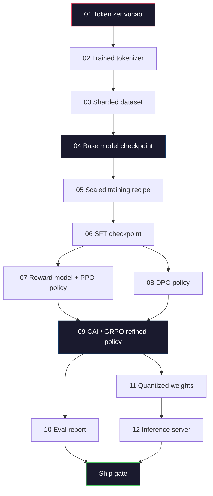
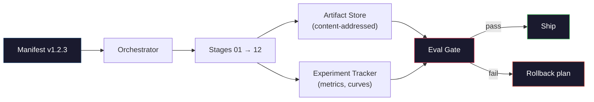

# Xây dựng một đường ống LLM hoàn chỉnh

> Mọi thứ từ bài học 01 đến 12 là một giai đoạn của một đường ống dẫn. Bài học này là một cái bàn phẳng biến những giai đoạn đó thành một cuộc chạy từ đầu đến cuối: token, pre-train, scale, SFT, align, evaluate, quantize, serve. Bạn sẽ không huấn luyện một mô hình 70B trên một máy tính xách tay. Bạn sẽ tạo ra lớp dàn xếp, biểu đồ, cổng đánh giá, và kế hoạch quay lại mà một nhóm biên giới 2026 sử dụng để quyết định những gì được vận chuyển. Đây là đá cuối.

> **【中文解读】**第 01-12 课程是一个管线的各阶段──本课将它们串联为端到端运行:分词→预训→扩展→SFT→对齐→评估→量化→部署──你不会在笔记本上训练70B 模型,但你会出 2026 年前沿团队用来决定发布什么编排层──

> **【拓展：端到端管线→生产实践】**Thực tế lớn mô hình sản xuất đường cũng bao gồm: dữ liệu phiên bản quản lý, thử nghiệm theo dõi (W&B) 模型注册 A/B 测试,回滚计划.

>  **【前置】**Đây là viên đá của giai đoạn 10 (đầu điểm), yêu cầu phải học trước khi kết thúc giai đoạn 10·01-12 全部。本节不教新知识,教你如何把前12节串成一条可运行的管线。

>  **【类比】**完整LLM 管线 = 造车流水线. 前面 12 课学了每个工位. 发动机,装底盘,喷漆), 本节是工厂设计师把这些工位按顺序串起来,加上"质检门" (质检门) "返工通道" (rollback) "生产计划表" (manifest) . Bạn sẽ không tự làm 70B 模型, nhưng bạn sẽ viết ra để cho nhóm sản xuất hàng loạt 70B 模型的"造车手册" (造车手册).

**Type:** Build
**Languages:** Python (stdlib)
**Prerequisites:** All Phase 10 lessons 01-12
**Time:** ~120 minutes

## Mục tiêu học tập

- Kết hợp 11 bài học trước đó (tokenizer, dữ liệu, đào tạo trước, quy mô, SFT, RLHF, DPO, CAI, đánh giá, định lượng, suy luận) thành một quy mô đường ống tái tạo duy nhất
  将分词、数据、预训、扩展、SFT、RLHF、DPO、CAI、评估、量化、推理) hợp thành quy tắc đường ống đơn lẻ có thể tái tạo
- Định nghĩa hợp đồng tạo vật giữa các giai đoạn: mỗi giai đoạn tiêu thụ gì, nó sản xuất gì và cách giai đoạn tiếp theo xác minh đầu vào
  定义阶段间产品契约: mỗi giai đoạn tiêu thụ gì, sản xuất gì, next阶段
- Xây dựng một trình dàn nhạc theo dõi các thí nghiệm, hash các hiện vật, và cửa đóng các quyết định trên ngưỡng đánh giá
  Xây dựng bộ sắp xếp, theo dõi các thí nghiệm, sản phẩm và đánh giá giá giá trị và quản lý các quyết định
- Thiết kế kế kế hoạch quay lại: những đồ tạo vật nào rẻ để tái sử dụng, đắt tiền, và chi phí của một điểm kiểm soát bị hỏng
  设计回滚计划: những sản phẩm nào có giá rẻ, có giá đắt, bị hỏng

## Vấn đề  vấn đề giới thiệu

Các bài học trước đây mỗi bài tập. Tokenizer được đào tạo. GPT được đào tạo trước. SFT tập hợp dữ liệu. Mô hình phần thưởng được đào tạo. DPO chạy. Evals đo. trọng lượng được định lượng xuất khẩu. máy chủ suy luận xoay lên. Mỗi một là một sổ ghi chép. Mỗi một có các quy ước riêng, các đường dẫn đầu ra riêng, hạt giống riêng.

> 之前的课程各自都能工作──分词器训练了──迷你 GPT 预训练了──SFT 数据集组装了──奖励模型训练了──DPO 运行了──评估测量了──量权重导出──推理服务器启动──每个都是笔记本──每个都有自己的约定,自己的输出路径──自己的种子──

Một cuộc tập luyện ở biên giới không phải là một cuốn sổ. Llama 3 405B mất 30 triệu giờ trong khoảng 54 ngày. DeepSeek-V3 đã sử dụng khoảng 2,8 triệu giờ H800. Trong thời gian đó, một điểm kiểm soát bị hỏng, một sự ô nhiễm dữ liệu, một sự lùi lại của đánh giá có thể khiến một đội phải mất một tuần đồng hồ tường và một tháng ngân sách GPU. Cách các nhóm sống sót là thông qua vệ sinh đường ống: mỗi giai đoạn có một đầu vào xác định, một đầu ra xác định, một biểu hiện, một hash và một cổng.

> Lâm 3 405B đã sử dụng khoảng 3.000.000 H100 小时, khoảng 54 天. DeepSeek-V3 đã sử dụng khoảng 2.800.000 H800 小时. Trong khi đó, một điểm kiểm tra bị hỏng, một lần ô nhiễm dữ liệu, một lần đánh giá lại có thể khiến đội mất một tuần thời gian gắn và một tháng ngân sách GPU.

Đây là đá cuối. Bạn sẽ không chạy đường ống từ đầu đến cuối trên máy tính xách tay. Bạn sẽ viết trình diễn viên điều phối các giai đoạn, biểu đồ mô tả chạy, xác minh rằng các quyết định của tàu, và kế hoạch lặp lại cho phép một bên thứ ba chạy lại công việc của bạn từ một tệp duy nhất. Mã là nhỏ; kỷ luật là lớn.

> Đây là một bài học đỉnh điểm. Bạn sẽ không phải là người viết trên máy tính để bàn. Bạn sẽ viết một bộ sắp xếp phối hợp các giai đoạn, mô tả các hoạt động của các đơn, kiểm soát và xác minh quyết định, cũng như để một bên thứ ba tái phát hành các công việc của bạn từ một tài liệu.

Các mô hình quy mô từ 100M đến 1T không thay đổi. cùng bốn thành phần - manifesto, orchestrator, eval gate, cửa hàng đồ tạo vật - chạy Llama 3 và cũng chạy sở thích của bạn GPT. Sự khác biệt là kích thước của các số trong cấu hình của từng giai đoạn, không phải hình dạng của đường ống.

## Khái niệm cốt lõi

> **【中文解读】**本课将前面所有组件整合为完整的 LLM 训练管线:分词器 → 数据管线 → 预训 → SFT → 对齐──这是从理解每个组件到构建完整系统的飞跃──理解完整管线是设计AI 工程系统的基础──

> **【拓展：完整管线的成本估算】** Tập luyện một mô hình Llama 3 70B  cấp độ chi phí đường ống hoàn chỉnh: dự án đào tạo khoảng 200-500 triệu USD (GPU  thời gian), SFT khoảng 1-50.000 USD (Data Tag), RLHF/DPO khoảng 5-10 triệu USD (Preference Data Tag)                                                                                                                                                                                                                              


### Hai giai đoạn

Mỗi bài học giai đoạn 10 là một giai đoạn. Đây là biểu đồ phụ thuộc đầy đủ.



Các giai đoạn 07 và 08 có thể chạy song song. Mọi thứ khác là một sự phụ thuộc khó khăn. Một thay đổi ở giai đoạn 02 (tokenizer) vô hiệu hóa mọi đồ tạo ra dòng chảy xuống. Một thay đổi ở giai đoạn 10 (eval) vô hiệu hóa chỉ quyết định tàu.

> 阶段 07 和 08 có thể并行运行──其他都是硬依赖──阶段 02(分词器) của thay đổi khiến tất cả các sản phẩm dưới đây thất bại──阶段 10(评估) của thay đổi chỉ khiến việc đưa ra quyết định thất bại──

### Sự Khải huyền

Một biểu đồ là một tập tin duy nhất mô tả một chạy hoàn toàn đủ để chơi lại nó. Không gì của đường ống sản xuất nên phụ thuộc vào trạng thái không trong biểu đồ. Các trường là nhàm chán và bắt buộc.

```
pipeline_version: 1.2.3
seed: 42
git_commit: a1b2c3d4
stages:
  01_tokenizer:
    recipe: bpe_32k
    input_hash: sha256:...
    output_hash: sha256:...
    wall_clock_sec: 3600
    cost_usd: 12
```

Hash đầu ra của giai đoạn N là hash đầu vào của giai đoạn N + 1. Bất kỳ sự khinh bệ nào và đường ống dừng lại. Đây là cách bạn bắt được sự tham nhũng dữ liệu sớm. Đây cũng là cách một đồng đội trên lục địa khác xác minh rằng việc lặp lại của họ đã tạo ra cùng một đồ tạo ra như của bạn.

Trong thực tế, các nhóm sử dụng một sơ đồ YAML nhỏ cộng với một kiểm tra biểu hiện khác với chạy thành công trước đó.

### Định dạng tạo vật

Mỗi giai đoạn đều là một đồ tạo tác được đánh chữ, không phải là một điểm thư mục, không phải là một cái đốm, mà là một loại tên với một sơ đồ được biết đến.

| Stage | Artifact Type | Key Fields |
|-------|--------------|-----------|
| 01-02 | Tokenizer | vocab.json, merges.txt, config.json, hash |
| 03 | Dataset | shards[], row count, token count, dedup stats |
| 04-05 | Checkpoint | weights.safetensors, config.json, optimizer state, step count |
| 06 | SFT Model | checkpoint + SFT recipe + data mix |
| 07 | Reward Model | RM checkpoint + preference data hash |
| 08-09 | Policy | checkpoint + reference hash + beta + KL budget consumed |
| 10 | Eval Report | benchmark scores + regression diffs + eval data hash |
| 11 | Quantized Model | quantized weights + calibration data + accuracy delta vs FP16 |
| 12 | Server Spec | endpoint + model hash + config + observability hooks |

Việc gõ ngăn chặn chế độ thất bại phổ biến nhất: sử dụng đầu ra giai đoạn 08 như là đầu vào giai đoạn 06, vận chuyển mô hình được đào tạo bằng DPO thông qua con đường SFT. Các đồ tạo được gõ và chữ ký giai đoạn được gõ làm cho những lỗi này trở thành lỗi thời gian biên soạn, chứ không phải lỗi 5 ngày.

### Cổng Eval

Chuyến vận chuyển không phải là "đào tạo hoàn thành". Chuyến vận chuyển là "đào tạo hoàn thành và cổng đánh giá đã vượt qua. " Cổng được xác định trước khi chạy bắt đầu.

```
gates:
  mmlu:      >= baseline + 0.5   # no regression
  humaneval: >= baseline + 1.0
  truthfulqa: >= baseline         # no drop
  safety_refusal_rate: <= 0.05
  kl_from_reference: <= 25.0
  cost_total_usd: <= 50000
```

Mỗi cổng là một ngưỡng số. Không có cổng "nên tốt". Không có dấu hiệu chủ quan. Nếu mỗi cổng đi qua, đồ tạo vật được đánh dấu có thể vận chuyển. Nếu bất kỳ cổng nào thất bại, chạy được giữ chờ lệnh rõ ràng của một nhà phê bình được đặt tên, tự ghi trong biểu đồ.

Hai cửa vang vang nhiều thảm họa. Một cửa *regression* (chương tự mới phải tốt nhất như trước đây về các tiêu chuẩn cốt lõi) bắt được lỗi đào tạo. Một cửa ngân sách *KL* (chương pháp điều chỉnh không thể bị xoay xa hơn X từ tham chiếu của nó) bắt được sự sắp xếp quá trình nấu ăn.

### Người dàn nhạc

Một đoạn mã nhỏ đọc bản báo, gửi các giai đoạn, theo dõi các hiện vật, và dừng bất kỳ vi phạm hợp đồng nào. Đây không phải là Airflow. Đây không phải là Kubeflow.

Công việc của nhạc sĩ là hẹp:

1. Hãy giải quyết DAG từ sổ sách.
2. Đối với mỗi giai đoạn, kiểm tra xem liệu đầu ra dự kiến đã tồn tại tại tại hash chính xác (trừ khi có).
3. Đi diễn đàn, chụp stdout/stderr, đo đồng hồ tường và chi phí.
4. Kiểm tra hash đầu ra so với hash đầu vào dự kiến của giai đoạn tiếp theo.
5. Khi thất bại, viết một biểu thị một phần với giai đoạn thất bại chính xác và thoát nonzero.

Đó là 200 dòng Python. Nó sẽ trông giống như tập tin.`code/main.py`Trong bài học này, dưới cái nắp, đường ống thực sự sử dụng`torchrun`hoặc `ray`để thực hiện từng giai đoạn trên các cụm, nhưng người dàn nhạc tự chạy trên một hộp duy nhất.

### Theo dõi thí nghiệm và lưu trữ đồ tạo vật

Hai hệ thống bên ngoài gắn dây ống.

**Experiment tracker (wandb, neptune, mlflow).**Logs mất đường cong, đánh giá métrics, hệ thống telemetry mỗi giai đoạn. Tracker là nơi bạn đi khi bạn cần để so sánh chạy A với chạy B ba tuần sau.

**Artifact store (S3, R2, GCS).**Cửa hàng đối tượng không thể thay đổi cho các điểm kiểm soát, tập hợp dữ liệu, token, báo cáo đánh giá. Các vật thể được chỉ định bằng hash, không phải tên tập tin.`latest.pt`là súng trường;`ckpt-7b-step-20000-sha256:abc123.safetensors`là một hợp đồng.

Người dàn nhạc viết cho cả hai, người theo dõi là cho con người xem các biểu đồ, cửa hàng đồ tạo vật là cho giai đoạn tiếp theo tìm kiếm đầu vào.

### Chi phí

Một chuyến chạy biên giới có một số đô la gắn liền.

**Pre-run estimate.**Từ biểu đồ, tính toán FLOP dự kiến (đối với trước đào tạo: 6 x params x token), giờ GPU dự kiến (FLOP / dung lượng cao nhất / sử dụng), và chi phí đô la tại mức thuê hiện tại. Nếu ước tính vượt quá cửa ngân sách, đường ống từ chối bắt đầu.

**In-run tracking.**Các nhà đầu tư và các nhà đầu tư sẽ được kiểm tra ngân sách còn lại sau mỗi giai đoạn, nếu một giai đoạn vượt quá, cửa của giai đoạn tiếp theo sẽ được đánh giá với ngân sách còn lại mới. Bạn không nhận ra bạn đã hết tiền khi VC gọi.

Chi phí báo cáo của Llama 3 là $61M. DeepSeek-V3 reported $5,6m cho cuộc chạy trước tập luyện chính. tỷ lệ này chủ yếu là hiệu quả phần cứng cộng với sự kết hợp các chuyên gia -- nhưng chi phí cụ thể là rõ ràng bởi vì cả hai đội theo dõi nó theo từng giai đoạn, không phải mỗi chạy.

### Tái sinh vs quyết định

Những điều này không giống nhau. *Reproducible* có nghĩa là cùng một biểu hiện cộng với cùng một mã cộng với cùng một cơ sở hạ tầng tạo ra một điểm kiểm soát với các số liệu tiếp theo tương đương. *Deterministic* có nghĩa là đầu ra bit-tương tự.

Việc đào tạo LLM hiện đại có thể tái tạo nhưng không xác định. Việc tập luyện phân tán giảm trật tự, không xác định hạt nhân GPU (cuBLAS, flash-attn) và tròn độ chính xác hỗn hợp kết hợp để tạo ra các float khác nhau ở mức 1e-5 giữa các chạy. Điều này tốt cho các số liệu cuối cùng, không di chuyển. Nó là chết người nếu bạn đang cố gắng để che lỗi với bit-level khác biệt. Cách chữa trị là ghi lại các metrics đầu vào, đầu ra và tiêu đề của từng giai đoạn -- nếu chúng phù hợp, chạy được "tái tạo" ngay cả khi trọng lượng không giống nhau.



### Kế hoạch quay trở lại

Trước khi chạy bắt đầu, hãy ghi lại những gì xảy ra khi thất bại trong mỗi giai đoạn.

- **Cheap to re-run**(hours): tokenizer, eval, quantization, inference server.
- **Medium**(ngày): SFT, DPO, CAI. Giữ mô hình cơ bản; chỉ chạy lại các giai đoạn sắp xếp.
- **Expensive**(tháng và hàng triệu đô la): đào tạo trước. Kế hoạch quay trở lại ở đây không phải là "lại chạy". Nó là " Sử dụng điểm kiểm soát tốt cuối cùng và chạy lại các giai đoạn thấp hơn với dữ liệu được sửa đổi".

Vì các sự phụ thuộc giai đoạn được gõ và hashed, người dàn nhạc có thể tính toán bộ quay lại tự động: vô hiệu hóa giai đoạn thất bại cộng với mọi hậu duệ. Một thất bại ở giai đoạn 06 (SFT) vô hiệu hóa 06, 07, 08, 09, 10, 11, 12.

### Các công thức sản xuất được quan sát vào năm 2026

Hầu hết các đội biên giới tụ tập cùng một bộ xương.

- Tokenizer: 128k BPE với byte fallback. được đào tạo trên một mảnh nhỏ, cân bằng đa ngôn ngữ.
- Pre-training: 10-20T token, chủ yếu là web cộng với mã cộng với tổng hợp. Muon hoặc AdamW tối ưu hóa. FSDP2 hoặc DeepSpeed ZeRO-3.
- SFT: 500k-2M cặp hướng dẫn, hỗn hợp con người và tổng hợp, với độ giảm nghiêm ngặt so với bộ đánh giá.
- Định hướng: DPO hoặc CAI + GRPO. RLHF chỉ khi tín hiệu ưu tiên quá đa chiều cho DPO.
- Eval: MMLU-Pro, MATH, HumanEval+, GPQA, SWE-Bench Verified, LiveBench, cộng với một bộ máy riêng tư không bao giờ được công chúng thấy.
- Quantization: GPTQ hoặc AWQ 4 bit để phục vụ, 8-bit cho các đánh giá an toàn khi độ chính xác là quan trọng.
- Dịch vụ: vLLM, TensorRT-LLM, hoặc trong nhà.

Số lượng thay đổi mỗi sáu tháng.

```figure
beam-search
```

## Hãy xây dựng nó

> **【拓展：训练管线的工程挑战】**完整LLM 训练管线的工程挑战包括:检查点管理(每 N 步保存模型状态,训练中断后可恢复) 日志和监控(WandB 追踪损失曲线、学习率、吞吐量) 超参数搜索、故障恢复──


## Hãy xây dựng nó.

Mã bài học là một trình soạn nhạc và một trình kiểm tra biểu hiện, không phải mười hai kịch bản đào tạo. Mỗi giai đoạn được mô phỏng bằng một máy giữ vị trí sản xuất một vật tạo ra với hình dạng và hash chính xác.

> Các mã trong bài này là bộ điều chỉnh và kiểm tra đơn, không phải là 12 tập lệnh. Mỗi giai đoạn sử dụng các mô hình biểu tượng, sản xuất đúng hình dạng và sản phẩm xuất của hash.

Đường ống trong `main.py`chạy mười hai giai đoạn giữ vị trí, tạo ra một biểu đồ, và thực hành một cửa đánh giá thất bại để chỉ ra một chạy được giữ như thế nào. Thay đổi mỗi vị trí giữ cho kịch bản đào tạo thực sự từ bài học tương ứng và bạn có bộ xương một đường ống biên giới thực sử dụng.

> `main.py`Các đường ống trung gian hoạt động trong 12 giai đoạn, sản xuất một bảng xếp hạng, và kiểm tra một đánh giá thất bại để hiển thị hoạt động được treo là như thế nào.

## Hãy sử dụng nó để thực hiện

Phòng làm việc theo quy tắc có ba lệnh.

> 标准工作流 có ba lệnh:

Đi chạy`plan`hầu hết các lỗi đường ống xuất hiện đúng thời gian kế hoạch - các ngưỡng cổng bị thiếu, hash lỗi thời, ngân sách vượt quá.`plan`- Không, chạy.`run`tiết kiệm tiền bằng cách bắt bọ trên mặt rẻ.

> Mỗi lần đi đầu`plan`                                                                                                                                                                                                                                                              `plan`免费──运行 `run`昂贵. 在便宜的一侧捕捉 bug 省钱.

Tạo ra của `gate`là hoặc `SHIP`hoặc `HOLD: <reason>`Một cuộc chạy được tổ chức không phải là thất bại; nó là một điểm quyết định. Một nhà phê bình được đặt tên hoặc bỏ qua (và bỏ qua được ghi lại), hoặc họ chấp thuận việc bỏ lại.

> `gate`của xuất khẩu là `SHIP`Hoặc`HOLD: <reason>`◊ được treo trên hoạt động không thất bại; nó là một điểm quyết định.

## Chuyển nó đi.

Bài học này sẽ mang lại kết quả `outputs/skill-llm-pipeline-reviewer.md`. Đưa cho nó một bản biểu lộ đường ống được đề xuất và nó kiểm tra tất cả các hợp đồng: đánh máy giai đoạn, chuỗi hash, cửa, kế hoạch quay lại, ước tính chi phí. Nó từ chối phê duyệt một bản biểu với một cửa đánh giá thiếu, ngân sách KL không giới hạn, hoặc một chạy kết hợp dữ liệu đánh giá và đào tạo.

> 本课产 出 `outputs/skill-llm-pipeline-reviewer.md` Đánh giá tất cả các hợp đồng: loại giai đoạn, chuỗi lực lượng, kiểm soát, kế hoạch quay lại, ước tính chi phí.

## Tập luyện bài tập

1. Tăng trình diễn viên để hỗ trợ thực hiện song song của giai đoạn 07 và 08. Sử dụng stdlib `concurrent.futures`module. xác nhận các ghi chép biểu hiện cuối cùng của cả hai giai đoạn 'tạo ra và rằng giai đoạn 09 đầu vào hash là một sự kết hợp xác định của cả hai.
   Trung ngữ翻译:扩展编排器支持阶段 07 和 08 的并行执行──使用标准库 `concurrent.futures`模块── xác nhận thanh toán cuối cùng ghi lại hai giai đoạn đầu ra, và giai đoạn 09 của đầu vào 哈希是两者的确定性组合──

2. Thêm một cổng kiểm tra ô nhiễm. Với hash tập dữ liệu eval và các đoạn tập dữ liệu đào tạo, tính toán sự chồng chéo (sẵn sàng chuỗi chính xác hoặc 13 gram). Cổng thất bại nếu chồng chéo vượt quá 0,1%. Đưa cho nó một tập tập dữ liệu có ô nhiễm và xác nhận cổng giữ chạy.
   Trung ngữ翻译:添加"污染检查"门控──给定评估数据集哈希和训练数据集分片,计算重叠(精确字符串匹配或13gram匹配)──重叠超过0.1% 则门控失败──进入被污染的训练集并确认门控挂起运行──

3. Thực hiện một ước tính chi phí từ các nguyên tắc đầu tiên. Đối với giai đoạn 04 (bước trước đào tạo), ước tính FLOP là 6 x param x token, giả định 40% MFU (mô hình FLOP sử dụng) trên H100 tại 989 TFLOPs BF16, ở $ 2.50 / GPU-giờ. Báo cáo ước tính cho một mô hình 7B được đào tạo trên 2T token. So sánh với số Llama 2 được công bố.
   Từ đầu tiên: từ nguyên tắc thực hiện ước tính chi phí. Đối với giai đoạn 04(pre training), ước tính FLOPs là 6 x 参数 x token, giả định H100 lên 40% MFU (Modeal calculus utilization rate),989 TFLOPS BF16, $2.50/GPU-小时── báo cáo 7B 模型在 2T token 上训练的估算──与已发表的 Llama 2 数据比较──

4. Xây dựng một sự cố hồi phục một phần. Mô phỏng một sự cố ở giai đoạn 09 (CAI), sau đó chạy lại giai đoạn 09 đến 12 trong khi để lại 01-08 được lưu trữ trong cache.
   Trung ngữ翻译:构建部分回滚──模拟阶段 09(CAI) thất bại, sau đó重跑阶段 09-12 同时保持 01-08 缓存──编排器应通过哈希检测缓存产品并跳过──测量相比完整重跑节省的挂钟时间──

5. Thêm khả năng quan sát. Giả ra OpenTelemetry trải dài cho mỗi giai đoạn, với thuộc tính cho các param, token được nhìn thấy, mất mát và chi phí. Chuyển các trải dài đến một bộ sưu tập địa phương. Điểm không phải là bảng điều khiển; Điểm là sức khỏe của mỗi giai đoạn có thể được theo dõi từ một ID dấu vết duy nhất.
   Trung ngữ翻译:添加可观测性──发发 OpenTelemetry span,带参数、已见代币、损失和成本属性──将 span 管道到本地收集器──重点不是仪表盘;重点是每个阶段的健康可从单个追踪ID 追踪──

## Từ khóa  Từ khóa nhanh chóng

| Term | What people say | What it actually means | 中文释义 |
|------|----------------|----------------------|---------|
| Manifest | "The recipe file" | YAML or JSON describing pipeline version, seed, per-stage config, and gate thresholds — sufficient to replay a run | 清单文件，描述管线版本、种子和每阶段配置 |
| Content-addressed | "By hash not name" | Artifacts stored by SHA-256 of their contents, so you can never confuse version A with version B | 内容寻址，按 SHA-256 哈希存储产物 |
| Eval gate | "The ship criteria" | Numeric thresholds on benchmark metrics and safety scores that must pass before an artifact is marked shippable | 评估门控，基准和安全分数必须达标才能发布 |
| KL budget | "How far alignment drifted" | A cap on cumulative KL(policy || reference) across alignment stages, enforced as a gate | KL 预算，对齐阶段累计 KL 散度的上限 |
| MFU | "How much of the GPU you used" | Model FLOPs Utilization — achieved FLOPs divided by theoretical peak. 40% is typical at 70B scale, 55% at 7B | 模型算力利用率，实际 FLOPs / 理论峰值 |
| Rollback plan | "What we do when it breaks" | Pre-written set of actions per stage on failure: re-run, fall back, retrain with revised inputs | 回滚计划，每个阶段失败时的预设行动方案 |
| Orchestrator | "The conductor" | The process that reads the manifest, dispatches stages, verifies hashes, halts on any contract violation | 编排器，读取清单、调度阶段、验证哈希 |
| Artifact store | "Versioned S3 for weights" | Immutable content-addressed object store — single source of truth for checkpoints, datasets, eval reports | 产物存储，不可变的内容寻址对象存储 |
| Reproducible | "Same metrics on replay" | Different bit-level weights but equivalent downstream metrics — the realistic target for distributed LLM training | 可复现，重跑时指标等价（权重可能不同） |
| Cost gate | "You cannot exceed X" | Pre-run cost estimate plus in-run tracker — the pipeline refuses to start if the estimate exceeds budget | 成本门控，预估超预算则拒绝启动 |

## Xem thêm 延伸阅读

- [Dubey et al., 2024 -- "The Llama 3 Herd of Models"](https://arxiv.org/abs/2407.21783)-- mô tả công khai chi tiết nhất về một đường ống biên giới bao gồm dữ liệu, đào tạo, sắp xếp, đánh giá
- [DeepSeek-AI, 2024 -- "DeepSeek-V3 Technical Report"](https://arxiv.org/abs/2412.19437)-- hệ thống đầu tiên về hiệu quả với khoảng 1/10 chi phí đào tạo lớp Llama 3
- [Kaplan et al., 2020 -- "Scaling Laws for Neural Language Models"](https://arxiv.org/abs/2001.08361)-- mối quan hệ quy mô đầu tiên về tính toán-dữ liệu-pháp
- [Hoffmann et al., 2022 -- "Training Compute-Optimal Large Language Models (Chinchilla)"](https://arxiv.org/abs/2203.15556)-- sự sửa đổi của Kaplan đã tái định đo ngân sách dữ liệu hiện đại
- [PyTorch FSDP2 documentation](https://pytorch.org/docs/stable/fsdp.html)-- tập huấn phân tán nguyên thủy thay thế FSDP1 trong PyTorch 2.4+
- [Weights & Biases LLM Reports](https://wandb.ai/site/llms)-- các biểu hiện thực và đầu ra theo dõi thí nghiệm cho các chương trình LLM nguồn mở, hữu ích như các mẫu có thể làm vở kịch
