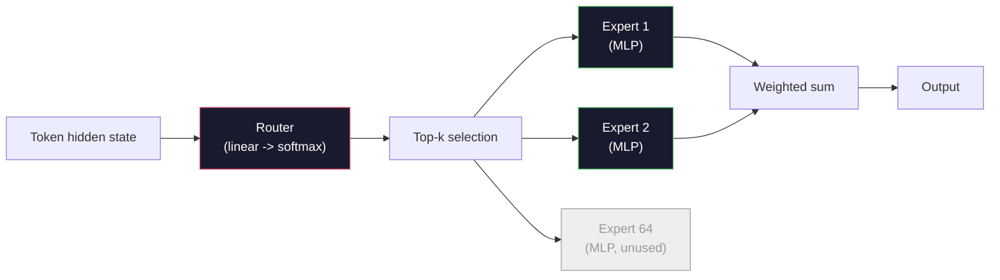

# Open Models: Architecture Walkthroughs   mở nguồn mô hình cấu trúc chi tiết

> Anh đã xây dựng một GPT-2 nhỏ từ đầu trong bài học 04. Các mô hình mở biên giới vào năm 2026 là cùng một gia đình với năm hoặc sáu thay đổi cụ thể. RMSNorm thay vì LayerNorm. SwiGLU thay vì GELU. RoPE thay vì các vị trí học tập. GQA hoặc MLA thay vì MHA đầy đủ. Một sự pha trộn của các chuyên gia trên quy mô. Các toán học mà bạn đã biết bao gồm 95% trong số chúng. Bài học này đọc Llama 3, DeepSeek-V3, Mixtral, Qwen và Gemma cạnh nhau và đặt tên đúng đường mà mỗi kiến trúc khác nhau.

> **【中文解读】**Bạn trong lớp thứ tư đã xây dựng GPT-2 Small. Năm 2026 trước bờ vực mở nguồn mô hình chỉ làm năm sáu sửa đổi: RMSNorm thay thế LayerNorm. SwiGLU thay thế GELU. RoPE thay thế learning location coding. GQA/MLA thay thế toàn bộ tập trung.

> **【拓展：DeepSeek架构】**Đề xuất: MLA (Multi-headed potential attention, compressed KV-cache) 无助损 MoE 负载均衡, MTP (Multi-token 预测) và DualPipe (DualPipe) 训练.

>  **【前置】**学本节前请先掌握:Phase 10·04(Pre-Training Mini GPT) 理解原始 GPT 架构;Phase 10·05(Scaling);Phase 10·12(Inference Optimization) 理解 KV cache 才能懂 MLA。本节是后续 15-22 节(架构创新详解) 的概览。

>  **【类比】**Xem 2026 开源模型 = 看不同品牌的电动车;;Llama 3 = 特斯拉;;务实,GQA + RoPE 标准配置);DeepSeek-V3 = 比亚迪;;堆料王,MLA + MoE + MTP + DualPipe 全套);Mixtral = 大众 ID(MoE 老牌);Qwen = 小(多尺寸覆盖);Gemma = 沃尔沃(精简安全);; tầng dưới là Transformer(电动车底盘),差异在 5-6 个关键模块;;

**Type:** Learn
**Languages:** Python (stdlib)
**Prerequisites:** Phase 10, Lessons 04, 05, 12 (Pre-training, Scaling, Inference)
**Time:** ~45 minutes

## Mục tiêu học tập

- Đọc config.json của Llama 3, Mistral, Mixtral, Gemma 2, Qwen 2.5, và DeepSeek-V3 và giải thích từng trường
  阅读 Llama 3、Mistral、Mixtral、Gemma 2、Qwen 2.5 和 DeepSeek-V3 của config.json 并解释每个字段
- Tên gọi thay đổi kiến trúc cụ thể mỗi mô hình đã thực hiện so với GPT-2 Small và biện minh cho nó từ các nguyên tắc đầu tiên
  Nói về mỗi mô hình đối với GPT-2 Small của cấu trúc cụ thể sửa đổi, và lập luận từ các nguyên tắc cơ bản
- Số lượng tham số tính toán, kích thước cache KV và bộ nhớ kích hoạt cho bất kỳ mô hình mở nào từ cấu hình của nó một mình
  Chỉ tính từ cấu hình số lượng tham số của bất kỳ mô hình nguồn mở  KV  bộ nhớ cache và bộ nhớ kích hoạt
- Chọn mô hình mở phù hợp cho mục tiêu triển khai do hạn chế độ trễ, bộ nhớ và khả năng
  Dựa trên sự chậm trễ, bộ nhớ và khả năng, chọn mô hình nguồn mở phù hợp cho mục tiêu triển khai

## Vấn đề  vấn đề giới thiệu

Trong bài học 04 bạn đã viết 350 dòng numpy và có một mô hình hình GPT-2. Llama 3 405B có báo cáo kỹ thuật 200 trang. Bản năng của anh là những con thú này khác nhau. Không phải vậy. 200 trang mô tả cùng một đối tượng với năm hoặc sáu sửa đổi có động cơ tốt, cộng với một ngàn chi tiết thực hiện về quy mô. Hàm xương -- nhúng, khối biến đổi, chú ý, MLP, chuẩn, đầu -- không thay đổi.

> Bạn đã viết trong lớp thứ tư 350 dòng numpy về mô hình hình dạng GPT-2  Llama 3 405B có một báo cáo kỹ thuật 200 trang  Nhận thức của bạn cho bạn biết chúng là những thứ hoàn toàn khác nhau  Thực tế không phải  200 trang mô tả cùng một đối tượng, chỉ có 5-6 sửa đổi có động lực đầy đủ, cộng với một ngàn chi tiết về việc thực hiện mở rộng  Kế hoạch                                                                                                                                                                                                              

Bài học này là một sự khác biệt. Đối với mỗi gia đình mô hình mở lớn, chúng tôi liệt kê chính xác những gì đã thay đổi từ GPT-2, tại sao, và nó tốn bao nhiêu. Khi bạn hoàn thành bạn có thể đọc một thẻ mô hình mới và tinh thần dịch nó trở lại đường cơ sở GPT-2.

> Bài học này là một sự khác biệt. Đối với mỗi gia đình mô hình nguồn mở chính, chúng tôi đã liệt kê so với GPT-2 đến cuối đã thay đổi gì, tại sao thay đổi, giá là gì. Sau khi hoàn thành, bạn có thể đọc một mô hình mới và dịch lại GPT-2 基线.

Sự lợi ích thực tế là khi Meta phát hành Llama 5 hoặc DeepSeek phát hành V4, bạn sẽ không cần một mô hình tâm lý mới. Bạn sẽ xem cấu hình, xem những nút được biết đến được di chuyển, và biết những tác động tiếp theo là gì. Các kiến trúc 2026 là một hộp công cụ hữu hạn. Mỗi mô hình mới chọn một bộ phụ khác.

> 实际收益是: khi Meta 发布 Llama 5 hoặc DeepSeek 发布 V4 时, bạn không cần mô hình tâm trí mới. Bạn nhìn vào cấu hình, xem những vòng quay đã được điều chỉnh, bạn biết tác động của năm 2026 là gì.

## Khái niệm cốt lõi

> **【中文解读】**本课对比开源 LLM 结构演进:GPT 系列 密集变压器)→ Llama 2/3(RMSNorm、SwiGLU、RoPE、GQA)→ Mistral(滑动窗口注意力)→ Mixtral(MoE 稀疏激活)。 hiểu những cấu trúc khác biệt này là cơ sở của lựa chọn thích hợp mô hình。

> **【拓展：架构演进的趋势】**Xu hướng xây dựng 2024-2025: RoPE  quay vị trí 编码 đã thay thế mã vị trí tuyệt đối, GQA(分组查询注意力) giảm KV-cache 大小,SwiGLU  thay thế ReLU  nâng cao hiệu suất,RMSNorm  thay thế LayerNorm  giảm tính toán开销──MoE(xc pha trộn chuyên gia) thông qua kích hoạt hiếm giảm chi phí suy đoán,DeepSeek-V3 của MoE mỗi lần kích hoạt khoảng 37B/671B 参数──


### Nguyên tắc không thay đổi

Tất cả các mô hình mở tự rút chia sẻ:

- Matrix nhúng mã thông báo (vocab_size x hidden_dim).
- Nên của N decoder khối: chuẩn, tự chú ý, dư thừa, chuẩn, MLP, dư thừa.
- Tương tự chuẩn cuối cùng và đầu tuyến tính chiếu đến kích thước vocab_size (thường được gắn trọng lượng với nhúng).
- Mặt nạ nguyên nhân, mất đi entropy chéo tiếp theo.

Đó là hình dạng, còn lại là nút.

### 6 nút di chuyển

Trong mỗi mô hình mở biên giới 2024-2026, cùng sáu lựa chọn thiết kế được chọn lại và lại:

1. **Normalization.**LayerNorm -> RMSNorm.
2. **Positional encoding.**Học được tuyệt đối -> RoPE (luồng các biến thể: YaRN, NTK).
3. **Activation.**GELU -> SwiGLU (hoặc GeGLU).
4. **Attention head sharing.**MHA -> GQA -> MQA -> MLA.
5. **Dense vs sparse MLP.**Thiết bị dày đặc -> hỗn hợp các chuyên gia.
6. **Pre-norm placement.**Pre-norm vẫn còn, post-norm đã biến mất.

Mọi thứ khác (kế hoạch học tập, hỗn hợp dữ liệu, kích thước lô, chiều dài ngữ cảnh) sống trong cấu hình đào tạo, không phải trong kiến trúc.

### nút 1: RMSNorm

LayerNorm trừ trung bình, chia bằng std, thang đo và thay đổi. RMSNorm chỉ giữ chỉ thang đo:

```
RMSNorm(x) = x / sqrt(mean(x^2) + eps) * gamma
```

Không trừ trung bình. Không thiên vị. Một matmul ít hơn mỗi token. Zhang và Sennrich (2019) lập luận rằng nó phù hợp với LayerNorm trong dịch máy trong khi nhanh hơn 10%.

Chi phí: không. Lợi ích: lợi nhuận thông qua nhỏ, mã đơn giản hơn.

### Vòng 2: RoPE

Các bài tập được học là một bảng tìm kiếm 1024 khe trong GPT-2.

Đài đặt vị trí xoay (RoPE, Su et al. 2021) tiêm vị trí bằng cách xoay từng vector Q và K cặp trước sản phẩm điểm chú ý. góc quay là một chức năng xác định vị trí, vì vậy không có gì được học và không có gì để chạy ra. Với các thủ thuật quy mô (NTK-aware interpolation, YaRN), một mô hình được đào tạo trên bối cảnh 8k có thể kéo dài đến 128k khi suy luận với sự mất độ chính xác khiêm tốn.

```
q_rotated = rotate(q, angle(pos))
k_rotated = rotate(k, angle(pos))
score = q_rotated . k_rotated
```

Mỗi Llama, Mistral, Qwen, DeepSeek và Gemma sử dụng RoPE. Gemma 2 sử dụng một loại lai (RoPE trên hầu hết các lớp, chú ý cửa sổ trượt địa phương trên những lớp khác).

### nút 3: SwiGLU

MLP của GPT-2 là `x -> gelu(xW1 + b1) -> (...)W2 + b2`SwiGLU (Shazeer 2020) thay thế kích hoạt bằng một sản phẩm bị khóa:

```
SwiGLU(x) = (xW1) * sigmoid(xW1) * xV
```

Hai dự đoán song song thay vì một, được gát bởi kích hoạt Swish. Khác cảm nghiệm mạnh hơn về độ phức tạp mỗi tham số. Llama 2 đã chấp nhận nó, mọi người đều theo.`ff_dim = 4 * hidden`, SwiGLU sử dụng `ff_dim = (2/3) * 4 * hidden = 8/3 * hidden`- Tôi không biết.

### nút 4: chia sẻ đầu chú ý

GPT-2 được sử dụng **Multi-Head Attention (MHA)**Mỗi đầu có dự án Q, K, V riêng của mình.

**Multi-Query Attention (MQA, Shazeer 2019)**chia sẻ một K và một V trên tất cả các đầu. cắt bộ nhớ cache KV bằng số_heads, đó là giảm 12x đến 32x trên một mô hình điển hình. Độ chính xác giảm nhẹ trên các điểm chuẩn cứng.

**Grouped-Query Attention (GQA, Ainslie et al. 2023)**là trung gian: các nhóm G của đầu Q chia sẻ một K và một V. Llama 3 8B sử dụng GQA với 32 đầu Q và 8 đầu KV (G = 8), do đó bộ nhớ cache KV thu hẹp 4x so với MHA đầy đủ.

**Multi-Head Latent Attention (MLA, DeepSeek 2024)**Tóm lại, bộ nhớ cache KV sẽ được sử dụng để thu thập thông tin về các tính năng của các máy tính.

| Scheme | KV Heads | KV Cache | Accuracy |
|--------|----------|----------|----------|
| MHA    | num_heads | full | best |
| GQA    | num_groups (G < num_heads) | num_heads / G reduction | near-MHA |
| MQA    | 1 | num_heads reduction | small hit |
| MLA    | latent, per-head decompression | smaller than MQA | near-MHA |

Đối với bất kỳ mô hình nào trên các tham số ~ 13B, GQA hoặc MLA là bắt buộc hiệu quả.

### Vòng 5: Sự kết hợp của các chuyên gia

Một MLP dày đặc kích hoạt tất cả các tham số của nó cho mỗi token. Một MLP MoE có các chuyên gia K cho mỗi khối và một bộ định tuyến chọn các chuyên gia top-k cho mỗi token (thường là top-2). Chỉ có trọng lượng của các chuyên gia đó thấy một thông qua về phía trước cho token đó.

```
router_logits = xW_r
indices, weights = top_k(router_logits, k=2)
output = sum_i weights[i] * expert[indices[i]](x)
```

Sự hấp dẫn: bạn có thể có 64 chuyên gia kích thước 7B mỗi người (vì vậy tổng số param là rất lớn) trong khi chỉ chạy 2 trong số họ mỗi token (vì vậy tính toán mỗi token phù hợp với mô hình 7B dày đặc). Mixtral 8x7B có tổng tham số 47B nhưng kích hoạt chỉ 13B mỗi token. DeepSeek-V3 có 671B tổng tham số nhưng kích hoạt chỉ 37B mỗi token.



Lợi thế: cùng tính toán, nhiều tham số hơn, dung lượng tốt hơn. Khối thọ: bộ nhớ chuyên gia vẫn phải sống ở đâu đó (vì vậy việc phục vụ cần nhiều VRAM hơn so với một tương đương dày đặc), cân bằng tải trọng của router là khó khăn, và điều chỉnh tinh tế của router trong lúc sắp xếp là lĩnh vực nghiên cứu của riêng nó.

### nút 6: Pre-normal ở lại

Các biến thể ban đầu áp dụng các chuẩn lớp sau mỗi lớp phụ. Mỗi mô hình mở kể từ GPT-2 đặt nó * trước * mỗi lớp phụ. Pre-norm là nghiêm ngặt dễ dàng hơn để đào tạo ở độ sâu. Không có gì để tranh cãi về.

### Mô hình theo mô hình khác nhau

Đây là bảng làm ra tất cả những bê tông này.

| Model | Year | Total Params | Active Params | Norm | Activation | Position | Attention | MoE | Context |
|-------|------|-------------|---------------|------|-----------|----------|-----------|-----|---------|
| GPT-2 Small | 2019 | 124M | 124M | LayerNorm | GELU | Learned | MHA (12 heads) | no | 1k |
| Llama 3 8B | 2024 | 8B | 8B | RMSNorm | SwiGLU | RoPE | GQA (32/8) | no | 128k |
| Llama 3 70B | 2024 | 70B | 70B | RMSNorm | SwiGLU | RoPE | GQA (64/8) | no | 128k |
| Llama 3 405B | 2024 | 405B | 405B | RMSNorm | SwiGLU | RoPE | GQA (128/16) | no | 128k |
| Mistral 7B | 2023 | 7.2B | 7.2B | RMSNorm | SwiGLU | RoPE | GQA | no | 32k |
| Mixtral 8x7B | 2023 | 47B | 13B | RMSNorm | SwiGLU | RoPE | GQA | yes (8 experts, top-2) | 32k |
| Gemma 2 9B | 2024 | 9B | 9B | RMSNorm (pre+post) | GeGLU | RoPE + sliding | GQA | no | 8k |
| Qwen 2.5 72B | 2024 | 72B | 72B | RMSNorm | SwiGLU | RoPE (YaRN) | GQA (64/8) | no | 128k |
| DeepSeek V2 236B | 2024 | 236B | 21B | RMSNorm | SwiGLU | RoPE | MLA | yes (160 experts, top-6) | 128k |
| DeepSeek V3 | 2024 | 671B | 37B | RMSNorm | SwiGLU | RoPE | MLA | yes (256 experts, top-8) | 128k |

Hình ảnh của các cột. RMSNorm là phổ quát. SwiGLU hoặc người anh em họ GeGLU của nó là phổ quát. RoPE là phổ quát. GQA là phổ quát trên 7B trừ khi được thay thế bởi MLA. MoE là phân biệt ở đầu đầu.

### Đọc config.json

Llama 3 8B cấu hình:

```
{
  "hidden_size": 4096,
  "intermediate_size": 14336,
  "num_hidden_layers": 32,
  "num_attention_heads": 32,
  "num_key_value_heads": 8,
  "max_position_embeddings": 131072,
  "rope_theta": 500000.0,
  "rms_norm_eps": 1e-5,
  "vocab_size": 128256
}
```

Mỗi lĩnh vực tương ứng với một cái gì đó bạn đã thực hiện.

- `hidden_size`: kích thước nhúng.
- `intermediate_size`: MLP kích thước ẩn (3.5x ẩn -- SwiGLU toán học).
- `num_hidden_layers`: độ sâu đống.
- `num_attention_heads`: Đầu Q.
- `num_key_value_heads`: đầu KV (GQA).
- `max_position_embeddings`: độ dài của ngữ cảnh đào tạo.
- `rope_theta`: Tần số cơ sở RoPE. Meta quy mô nó từ mặc định 10k đến 500k cho việc phân tích ngữ cảnh dài.
- `rms_norm_eps`: ổn định số.
- `vocab_size`: token.

Chỉ riêng từ những điều này bạn tính toán tổng tham số, cache KV, và bộ nhớ kích hoạt đỉnh. Xem `code/main.py`cho các công thức chính xác.

### Ngân sách bộ nhớ kích hoạt

Các hoạt động thống trị bộ nhớ đào tạo trên vài tỷ tham số.

```
activation_mem ~ batch_size * seq_len * hidden_size * num_layers * bytes_per_element
```

Đối với Llama 3 8B ở lô 1, seq 8192, BF16, 32 lớp, ẩn 4096: khoảng 8 GB chỉ cho kích hoạt với kiểm tra, 40 GB mà không có. Đó là lý do tại sao sự chú ý nhấp nháy và sự chú ý vòng - họ viết lại tính toán chú ý để kích hoạt phù hợp.

### Ngân sách KV Cache

Để suy luận tại ngữ cảnh tối đa:

```
kv_cache = 2 * num_layers * num_kv_heads * head_dim * max_seq_len * bytes_per_element
```

Llama 3 8B ở ngữ cảnh 128k, BF16, head_dim = hidden / num_heads = 128:
`2 * 32 * 8 * 128 * 131072 * 2 = 17.2 GB`mỗi chuỗi.

Các trọng lượng 8B là 16 GB trong BF16. Kho lưu trữ KV cho một chuỗi 128k duy nhất lớn hơn trọng lượng. Đây là áp suất bộ nhớ thúc đẩy nghiên cứu định lượng GQA, MLA và KV cache.

### Khi mỗi người mẫu thắng

- **Single 80GB GPU, no MoE**Llama 3 8B, Mistral 7B, Gemma 2 9B. Mời phục vụ, công cụ rộng.
- **Single node (8x80GB), big capacity**Llama 3 70B, Qwen 2.5 72B. Khả năng mở mật độ cao nhất.
- **Biggest open capability, accept MoE complexity**: DeepSeek V3, Mixtral 8x22B. Khả năng tốt nhất cho mỗi FLOP hoạt động.
- **Long-context needs**: Llama 3 (128k với quy mô RoPE), DeepSeek (MLA lợi thế).
- **Low-latency serving**: Gemma 2 9B (trường trượt cắt tính toán ngữ cảnh dài).


> **【拓展：开源模型的选型指南】**2024-2025 年开源模型选型:通用对话选 Llama-3-70B,推理任务选 DeepSeek-R1,代码生成选 DeepSeek-Coder-V2,长上下文选 Qwen-2.5-72B(128K 上下文),轻量级选 Llama-3-8B 或 Qwen-2.5-7B──


## Hãy xây dựng nó.
```figure
rmsnorm-vs-layernorm
```

## Hãy xây dựng nó

Mã bài học là một máy tính. Với bất kỳ config.json nào, nó in số parameter theo thành phần, cache KV ở bối cảnh tối đa, tỷ lệ MLP SwiGLU và phán quyết ngắn về kiến trúc (thiên / GQA / MLA / MoE).

```python
config = {
    "hidden_size": 4096, "intermediate_size": 14336,
    "num_hidden_layers": 32, "num_attention_heads": 32,
    "num_key_value_heads": 8, "vocab_size": 128256,
    "max_position_embeddings": 131072,
}
```

Script đi bộ các trường kiến trúc theo trường, tính toán số param cho nhúng, chú ý (với giảm GQA), MLP (với mở rộng SwiGLU), các chuẩn lớp và đầu. Sau đó nó tính toán bộ nhớ cache KV ở chiều dài ngữ cảnh được nêu và in một bản tóm tắt.

Nhìn xem`code/main.py`cho việc thực hiện.

## Hãy sử dụng nó để thực hiện

Hãy chạy máy tính trên Llama 3 8B, Mistral 7B, Mixtral 8x7B và DeepSeek V3 cấu hình được gói trong kịch bản. So sánh các sự cố tham số. Hãy chú ý rằng các mô hình MoE có tổng số tham số nhỏ hơn các mô hình dày đặc nhưng số tham số hoạt động thường nhỏ hơn. Hãy chú ý rằng bộ nhớ cache KV của DeepSeek V3 nhỏ hơn Llama 3 405B mặc dù có nhiều tham số tổng cộng hơn - đó là MLA đang hoạt động.

Sau đó, cắm vào một cấu hình cho bất kỳ mô hình nào bạn có ở địa phương, đọc bản tóm tắt, và quyết định liệu nó phù hợp với GPU của bạn hay không.

## Chuyển nó đi.

Bài học này sẽ mang lại kết quả `outputs/skill-open-model-picker.md`. Với mục tiêu triển khai (tiếng GPU, VRAM, chiều dài ngữ cảnh, ngân sách thời gian trễ) và hồ sơ nhiệm vụ (chats, code, lý luận, ngữ cảnh dài), nó khuyên nên một mô hình mở, một kế hoạch định lượng từ Bài học 11, và một khối suy luận từ Bài học 12, với lý luận rõ ràng về sáu nút kiến trúc.

> 本课产 出 `outputs/skill-open-model-picker.md` Đưa ra mục tiêu triển khai (GPU 类型,显存,上下文长度,延迟预算) và quy định nhiệm vụ (聊天,代码,推理,长上下文), nó đề xuất mô hình nguồn mở, quy mô quy mô của lớp 11 và các đề xuất của lớp 12, và đưa ra 6 cơ cấu chính xác.

## Tập luyện bài tập

1. Đọc cấu hình Qwen 2.5 72B từ HuggingFace. Xét tổng tham số từ đầu. So sánh với giá trị được báo cáo HF và xác định nơi bất kỳ delta nào xuất phát (đ rounding đầu, yếu tố chia sẻ KV, vv).
   Trung ngữ翻译:阅读 HuggingFace 上的 Qwen 2.5 72B 配置──从零计算总参数──与 HF 报告值比较,找出差异来源(头维度舍入、KV 共享因子等)──

2. DeepSeek V3 sử dụng 256 chuyên gia với đường dẫn 8 đầu. Xét tỷ lệ các chuyên gia hoạt động với tổng số chuyên gia và so sánh với Mixtral 8x7B top-2 của 8.
   Trung ngữ翻译:DeepSeek V3 dùng 256 专家 top-8 路由──计算激活专家与总专家的比例, so với Mixtral 8x7B's top-2 của 8 比较── chuyển đổi từ稀疏(25%) đến密稀疏(3%) đối với mỗi FLOP 容量 có nghĩa là gì?

3. Xét bộ nhớ cache KV cho Llama 3 405B tại ngữ cảnh 128k trong FP8 và BF16. Ở FP8 nó là một nửa số BF16. Bạn có thể phục vụ bao nhiêu chuỗi song song trên một nút 8xH100 (80GB mỗi = tổng cộng 640GB, trừ bộ nhớ trọng lượng)?
   Trung ngữ翻译:计算 Llama 3 405B 在 128K 上下文下 FP8 和 BF16 的 KV 缓存──FP8 là một nửa của BF16──单个8xH100节点(每张80GB = 总共640GB,减权重内存)能服务多少并行序列?

4. Gemma 2 thay thế các lớp chú ý đầy đủ và lớp chú ý cửa sổ trượt. Viết toán cho bộ nhớ cache KV khi một nửa các lớp sử dụng cửa sổ trượt 4096 mã thông báo thay vì toàn ngữ.
   Gemma 2 交替使用全注意力和滑动窗口注意力层──写出一半层使用4096-token 滑动窗口而不是全上下文时 KV 缓存的数学公式──在8K 总上下文省多少内存?

5. Tìm một mô hình mở biên giới gần đây được phát hành sau khi bài học này được viết. Hãy xác định cái nào trong sáu nút mà nó chọn và liệu nó có giới thiệu một nút thứ bảy không. Chương trình học sẽ cảm thấy lỗi thời ngay khi một kiến trúc mới được đưa ra - mục tiêu là cập nhật bảng của bạn mà không cần xây dựng lại mô hình tâm lý của bạn.
   Trung ngữ翻译:找一篇本课编写后发布的最新前沿开源模型──识别它选择了六旋中哪些以及是否引入第七旋──课程在新架构发布时就会过时目标是更新你的表格而不重建你的心智模型──

## Từ khóa  Từ khóa nhanh chóng

| Term | What people say | What it actually means | 中文释义 |
|------|----------------|----------------------|---------|
| RMSNorm | "LayerNorm without the mean" | Normalize by root mean square only, with a learned scale — cheaper and comparable to LayerNorm | 均方根归一化，仅按均方根归一化，更廉价 |
| RoPE | "Rotary positions" | Rotate each Q and K vector in 2D pairs by an angle that depends on position — extrapolates beyond training length with scaling tricks | 旋转位置编码，按位置旋转 Q/K 向量 |
| SwiGLU | "The new MLP activation" | Gated linear unit with Swish: `(xW1) * sigmoid(xW1) * xV` — standard in every 2024+ open model | SwiGLU 激活，门控线性单元，2024+ 模型标配 |
| GQA | "Middle ground attention" | Grouped-Query Attention: G groups of Q heads share one K and one V head — shrinks KV cache without MQA's accuracy hit | 分组查询注意力，Q 头分组共享 K/V |
| MLA | "DeepSeek's attention" | Multi-Head Latent Attention: compress K/V into a shared low-rank latent, decompress per head — smallest KV cache for large models | 多头潜在注意力，将 K/V 压缩为低秩潜在向量 |
| MoE | "Sparse experts" | Mixture of Experts: N MLPs per block, router picks top-k per token — huge total params, small active params | 混合专家，每块 N 个 MLP，路由器选 top-k |
| Top-k routing | "Pick k experts per token" | The router computes a score per expert and activates the k highest — typical k is 2 (Mixtral) to 8 (DeepSeek) | Top-k 路由，每个 token 激活 k 个专家 |
| YaRN | "Stretch RoPE" | Yet another RoPE extension — interpolates rotary angles to extend context from 8k to 128k+ at inference time | YaRN，通过插值旋转角度扩展上下文 |
| Sliding-window attention | "Don't attend to everything" | Each token attends only to the last W tokens — caps attention cost at O(W) per token, used in Gemma 2 and early Mistral | 滑动窗口注意力，每个 token 只关注最近 W 个 token |
| Active params | "What runs per token" | For MoE models, the parameter count that sees a forward pass per token (much smaller than total params) — governs per-token FLOPs | 激活参数，MoE 模型每 token 实际使用的参数量 |

## Xem thêm 延伸阅读

- [Dubey et al., 2024 -- "The Llama 3 Herd of Models"](https://arxiv.org/abs/2407.21783)-- tham khảo kiến trúc và đào tạo cho gia đình Llama 3 dày đặc
- [DeepSeek-AI, 2024 -- "DeepSeek-V3 Technical Report"](https://arxiv.org/abs/2412.19437)-- MLA cộng với cân bằng tải phụ trợ không mất mát cộng với 671B MoE
- [Jiang et al., 2024 -- "Mixtral of Experts"](https://arxiv.org/abs/2401.04088)-- giấy mô hình mở của Bộ Ngoại giao
- [Su et al., 2021 -- "RoFormer: Enhanced Transformer with Rotary Position Embedding"](https://arxiv.org/abs/2104.09864)- giấy RoPE
- [Shazeer, 2020 -- "GLU Variants Improve Transformer"](https://arxiv.org/abs/2002.05202)- SwiGLU, GeGLU, và bạn bè
- [Ainslie et al., 2023 -- "GQA: Training Generalized Multi-Query Transformer Models"](https://arxiv.org/abs/2305.13245)- báo cáo GQA
- [Gemma 2 Team, 2024 -- "Gemma 2: Improving Open Language Models at a Practical Size"](https://arxiv.org/abs/2408.00118)-- Hybrid full+sliding attention, pre+post-norm
- [Qwen Team, 2024 -- "Qwen 2.5 Technical Report"](https://arxiv.org/abs/2412.15115)-- YRN mở rộng ngữ cảnh và các công thức đào tạo trong ngữ cảnh dài
