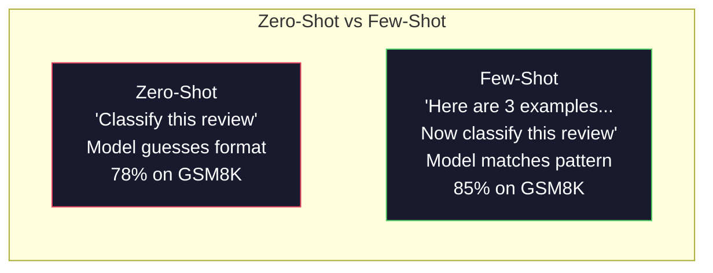
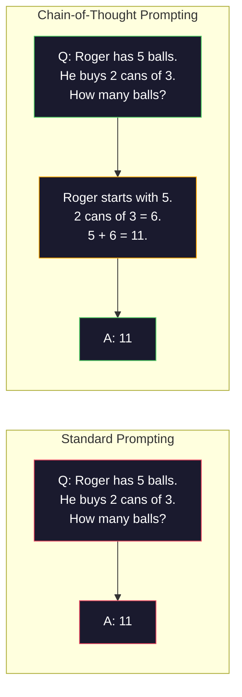
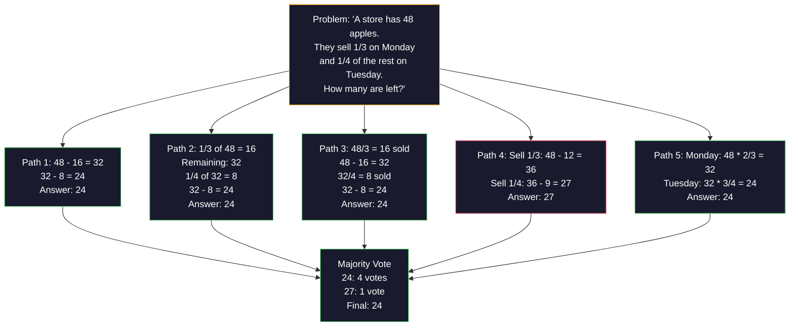
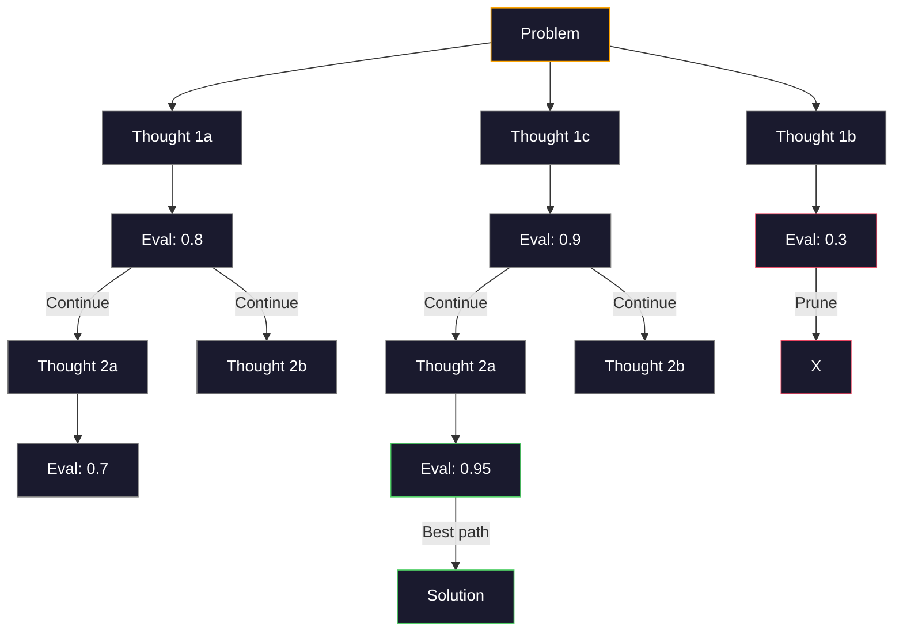

# Một vài cú, chuỗi suy nghĩ, cây suy nghĩ.

> Nói cho một mô hình những gì phải làm là thúc đẩy. Chứng tỏ nó nghĩ như thế nào là kỹ thuật. Khoảng cách giữa 78% và 91% độ chính xác trên cùng một mô hình, cùng một nhiệm vụ, cùng một dữ liệu không phải là một mô hình tốt hơn. Đó là một chiến lược lý luận tốt hơn.

> **【中文解读】**Nói cho mô hình "làm gì" là lời khuyên, thể hiện "làm thế nào để suy nghĩ" là công nghệ. Tăng tốc độ xác thực từ 78% đến 91% không phải dựa trên mô hình tốt hơn, mà dựa trên chiến lược suy luận tốt hơn.

> **【拓展：推理策略→AI Agent】**CoT/ToT/ReAct là cơ sở lý thuyết của đại lý AI hiện đại.

>  **【前置】**Học本节前请先掌握:Phase 11·01(Prompt Engineering)  hiểu hệ thống nhanh chóng、 vai trò、 hạn chế等基本模式──本节是其延伸,要求你已经能写出结构化的快速──本节将用于OpenAI/Anthropic SDK──

**Type:** Build | **类型:** 构建
**Languages:** Python | **语言:** Python
**Prerequisites:** Lesson 11.01 (Prompt Engineering) | **前置知识:** Phase 11 · 01 (提示工程)
**Time:** ~45 minutes | **时间:** ~45 分钟

## Mục tiêu học tập

- Thực hiện các yêu cầu chụp ít bằng cách chọn và định dạng các ví dụ minh họa để tối đa hóa độ chính xác nhiệm vụ
  Thông qua việc chọn và mô tả mô hình để đạt được ít mô hình gợi ý, tối đa hóa tỷ lệ xác thực nhiệm vụ
- Sử dụng lý luận chuỗi suy nghĩ (CoT) để cải thiện độ chính xác trên các vấn đề đa bước như các vấn đề từ toán học
  应用链式思维 (CQT) 推理 để nâng cao các vấn đề nhiều bước (ví dụ như các bài toán ứng dụng) 准确率
- Xây dựng một cây tư tưởng nhắc nhở khám phá nhiều con đường suy luận và chọn một tốt nhất
  构建思维树提示,探索多条推理路径并选择最佳路径
- Đo độ chính xác cải thiện từ 0 shot vs few shot vs CoT trên một tiêu chuẩn chuẩn
  Tăng tỷ lệ xác thực của các quy định trên chuẩn cơ sở đo lường 0 mẫu so với ít mẫu so với CoT

> **【中文解读】**Mục tiêu của bài học: nắm bắt một vài lượt trong một thời gian ngắn cung cấp ví dụ hướng dẫn xuất phát (output format) và chuỗi suy nghĩ (think chain) yêu cầu mô hình suy nghĩ từng bước để nâng cao khả năng suy nghĩ (thực lực suy nghĩ)


## Vấn đề  vấn đề giới thiệu

Bạn xây dựng một ứng dụng dạy toán. lời nhắc của bạn nói: "Hãy giải quyết vấn đề từ này". GPT-5 có được đúng 94% thời gian trên GSM8K, tiêu chuẩn toán học trung học. Bạn nghĩ rằng bạn đã đạt đỉnh. Bạn không  chuỗi suy nghĩ vẫn thêm 3-4 điểm.

> Bạn xây dựng một ứng dụng hướng dẫn toán học. Bạn gợi ý:" giải quyết vấn đề ứng dụng này. "Tỷ lệ chính xác trên GPT-5 trên GSM8K là 94%. Bạn nghĩ đã đạt đến đỉnh.

Thêm 5 từ -- "Hãy nghĩ từng bước" -- và độ chính xác tăng lên 91%. Thêm một vài ví dụ được làm việc và nó đạt 95%. cùng một mô hình. cùng nhiệt độ. cùng chi phí API. Sự khác biệt duy nhất là bạn đã cho mô hình giấy cọp.

> 加上五个词"Hãy nghĩ từng bước" tỷ lệ xác thực nhảy lên 91%──加上几个已解答的例子达到95%──

Đây không phải là một hack. Đó là cách lý luận hoạt động. Con người không giải quyết các vấn đề đa bước trong một bước nhảy trí tuệ. Cũng không phải là các biến đổi. Khi bạn buộc một mô hình để tạo ra các token trung gian, các token đó trở thành một phần của bối cảnh cho token tiếp theo. Mỗi bước lý luận nuôi dưỡng tiếp theo. mô hình theo nghĩa đen tính toán đường đến câu trả lời.

> Đây không phải là một cách để làm việc của lý thuyết. Đây là cách để làm việc của lý thuyết. Con người sẽ không hoàn thành nhiều bước một lần. Người biến đổi cũng sẽ không. Khi bạn bắt buộc mô hình tạo ra các token trung gian, các token này sẽ trở thành một phần của các token tiếp theo. Mỗi bước lý thuyết đều cung cấp thông tin cho bước tiếp theo.

>  **【类比】**Không sử dụng CoT 像让人"心算 17 × 24" Hầu hết mọi người sẽ tính错或卡住。 sử dụng CoT 像给一张草稿纸:"17 × 24 = 17 × 20 + 17 × 4 = 340 + 68 = 408" bước viết xuống sẽ không sai。LLM

> ️ **【易错点】**Một vài cú bắn/CoT của 3 个坑:(1) **示例数量错误**0-shot CoT 加 "Hãy nghĩ từng bước" 就足, 再加 3-5 个少拍示例能再 2-5 点; hơn 8 个示例性价比下降(quan 太长、成本 上) 2) **示例顺序敏感** Với 3 ví dụ theo A,B,C 排和 C,B,A 排, tỷ lệ xác định khác nhau 5-10%; cần phải đưa "ví dụ liên quan nhất" vào cuối cùng ((靠近问题) )**CoT 不适用于简单任务**"Today几号?"加 CoT 反而让模型出错;CoT chỉ đối với nhiều bước suy luận(mathematics、逻辑、规划)有效。

Nhưng "think step by step" là khởi đầu, không phải kết thúc. Nếu bạn lấy mẫu 5 con đường suy luận và lấy phiếu bầu đa số thì sao? Nếu bạn để cho mô hình khám phá một cây khả năng, đánh giá và cắt ránh thì sao? Nếu bạn kết hợp suy luận với việc sử dụng công cụ thì sao? Đây không phải là giả thuyết. Chúng là các kỹ thuật được công bố với những cải tiến được đo lường, và bạn sẽ xây dựng tất cả chúng trong bài học này.

> Nhưng "thử suy nghĩ từng bước" chỉ là khởi đầu, không phải là kết thúc. Nếu bạn chọn 5 điều suy nghĩ, sau đó bỏ phiếu đa số thì làm thế nào? Nếu bạn cho mô hình khám phá một cái cây khả năng, đánh giá và cắt chi nhánh sẽ như thế nào? Nếu bạn thay đổi suy nghĩ và công cụ, thì làm thế nào?

## Khái niệm cốt lõi

> **【中文解读】**少样本学习 (少样本学习) (Few-shot) 和思维链 (Chain-of-Thought, CoT) là hai công nghệ cốt lõi của Kỹ thuật nhanh chóng.

> **【拓展：CoT 的推理提升效果】**Bài luận của Google năm 2022 chứng minh, trong nhiệm vụ suy luận toán học, CoT sẽ nâng tỷ lệ xác thực của PaLM 540B từ 17% lên 56%.

> 🤔 **【困惑】**Q: 2026 年原生推理模型(Claude Extended Thinking、o3) 都自带 CoT 了,我还需要手写"think step by step" 吗? A: Không cần, nhưng có tiền đề:(1) sử dụng để hỗ trợ mô hình推理原生 Claude 4.5+、GPT-5、o3、DeepSeek-R1 等;(2) 任务确实需要推理简单分类任务原生思考反而拖慢──对老模型(GPT-4、Claude 3) hoặc开源模型Llama 3) vẫn cần phải viết CoT──判断: Nếu mô hình có`reasoning_effort`Hoặc`thinking`参数, dùng nó;否则用 prompt。


### Zero Shot vs Few Shot: Khi ví dụ đánh bại hướng dẫn

Việc đưa ra một cú cú cú cú cú cú cú cú cú cú cú cú cú cú cú cú cú cú cú cú cú cú cú cú cú cú cú cú cú cú cú cú cú cú cú cú cú cú cú cú cú cú cú cú cú cú cú cú cú cú cú cú cú cú cú cú cú cú cú cú cú cú cú cú cú cú cú cú cú cú cú cú cú cú cú cú cú cú cú cú cú cú cú cú cú cú cú cú cú cú cú cú cú cú cú cú cú cú cú cú cú cú cú cú cú cú cú cú cú cú cú cú cú cú cú cú cú cú cú cú cú cú cú cú cú cú cú cú cú cú cú cú cú cú cú cú cú cú cú cú cú cú cú cú cú cú cú cú cú cú cú cú cú cú cú cú cú cú cú cú cú cú cú cú cú cú cú cú cú cú cú cú cú cú cú cú cú cú cú cú cú cú cú cú cú cú cú cú cú cú cú cú cú cú cú cú cú cú cú cú cú cú cú cú cú cú cú cú cú cú cú cú cú cú cú cú cú cú cú cú cú cú cú cú cú cú cú cú cú cú cú cú cú cú cú cú cú cú cú cú cú cú cú cú cú cú cú cú cú cú cú cú cú cú cú cú cú cú cú cú cú cú cú cú cú cú cú cú cú cú cú cú cú cú cú cú cú cú cú cú cú cú cú cú cú cú cú cú cú cú cú cú cú cú cú cú cú cú cú cú cú cú cú cú cú cú cú cú cú cú cú cú cú cú cú cú cú cú cú cú cú cú cú cú cú cú cú cú cú cú cú cú cú cú cú cú cú cú cú cú cú cú cú cú cú cú cú cú cú cú cú cú cú cú cú cú cú cú cú cú cú cú cú cú cú cú cú cú cú cú cú cú cú cú cú cú cú cú cú cú cú cú cú cú cú cú cú cú cú cú cú cú cú cú cú cú cú cú cú cú cú cú cú cú cú cú cú cú cú cú cú cú cú cú cú cú cú cú cú cú cú cú cú cú cú cú cú cú cú cú cú cú cú cú cú cú cú cú cú cú cú cú cú cú cú cú cú cú cú cú cú cú cú cú cú cú cú cú cú cú cú cú cú cú cú cú cú cú cú cú cú cú cú cú cú cú cú cú cú cú cú cú cú cú cú cú cú cú cú cú cú cú cú cú cú cú cú cú cú cú cú cú cú cú cú cú

> 零样本提示只给模型一个任务,不加其他内容――少样本提示则先给模型一个任务,不加其他内容―― ít样本提示则先给模型一个任务,不加其他内容―― ít样本提示则先给模型一个任务,不加其他内容.

Wei et al. (2022) đo lường điều này qua 8 điểm chuẩn. Đối với các nhiệm vụ đơn giản như phân loại cảm xúc, 0-shot và few-shot được thực hiện trong khoảng 2% của nhau. Đối với các nhiệm vụ phức tạp như toán học đa bước và lý luận biểu tượng, few-shot cải thiện độ chính xác 10-25%.

> Wei 等人 (tiếng Việt) đã đo lường điều này trên 8 cơ sở. Đối với các nhiệm vụ đơn giản như cảm xúc phân loại, sự khác biệt về hiệu suất của các mẫu 0 và mẫu nhỏ là 2% và trong. Đối với các nhiệm vụ phức tạp như toán học nhiều bước và tính toán biểu tượng, tỷ lệ xác thực của các mẫu nhỏ sẽ tăng 10-25%.

Nhìn giác: ví dụ là hướng dẫn nén. Thay vì mô tả định dạng đầu ra, bạn cho thấy nó. Thay vì giải thích quá trình lý luận, bạn chứng minh nó. Mô hình mô hình phù hợp với các ví dụ một cách đáng tin cậy hơn nó giải thích hướng dẫn trừu tượng.

> 直觉: ví dụ là lệnh nén. Với mô tả của nó về định dạng xuất, không thể trực tiếp hiển thị nó. Với quá trình giải thích, không thể trực tiếp biểu diễn nó. Mô hình phù hợp với mô hình của ví dụ hơn là giải thích lệnh trừu tượng.



**When few-shot wins:**các nhiệm vụ nhạy cảm với định dạng, phân loại, khai thác có cấu trúc, thuật ngữ cụ thể về lĩnh vực, bất kỳ nhiệm vụ nào mà mô hình cần phù hợp với một mẫu cụ thể.

> **少样本胜出的场景**: hình thức nhiệm vụ nhạy cảm, phân loại, cấu trúc, thuật ngữ cụ thể trong lĩnh vực, bất kỳ mô hình nào cần phù hợp với mô hình cụ thể của nhiệm vụ.

**When zero-shot wins:**những câu hỏi thực tế đơn giản, những nhiệm vụ sáng tạo nơi các ví dụ hạn chế sự sáng tạo, những nhiệm vụ nơi việc tìm thấy những ví dụ tốt khó hơn là viết ra những hướng dẫn tốt.

> **零样本胜出的场景**: đơn giản thực tế vấn đề, ví dụ sẽ hạn chế nhiệm vụ sáng tạo của khả năng sáng tạo, tìm kiếm ví dụ tốt hơn so với việc viết một lệnh tốt khó khăn hơn nhiệm vụ.

### Ví dụ: Nhận chọn: Nhập tương tự ngẫu nhiên

Không phải tất cả các ví dụ đều bằng nhau. Chọn ví dụ tương tự như mục tiêu nhập sẽ vượt trội hơn sự lựa chọn ngẫu nhiên 5-15% trong các nhiệm vụ phân loại (Liu et al., 2022). Ba nguyên tắc:

> Không phải tất cả các ví dụ đều tốt. Các ví dụ tương tự như mục tiêu nhập trong phân loại nhiệm vụ cao hơn 5-15% so với tự chọn.

1. **Semantic similarity**: chọn các ví dụ gần nhất với đầu vào trong không gian nhúng
   **语义相似性**: chọn ví dụ gần nhất trong không gian nhập
2. **Label diversity**: bao gồm tất cả các loại đầu ra trong các ví dụ của bạn
   **标签多样性**: trong ví dụ bao gồm tất cả các loại xuất khẩu
3. **Difficulty matching**: phù hợp với mức độ phức tạp của vấn đề mục tiêu
   **难度匹配**: Đáp ứng mục tiêu vấn đề độ phức tạp

Số lượng ví dụ tối ưu cho hầu hết các nhiệm vụ là 3-5. dưới 3, mô hình không có đủ tín hiệu để lấy mẫu. trên 5, bạn nhấn các biểu tượng trở lại giảm và lãng phí cửa sổ ngữ cảnh. Để phân loại với nhiều nhãn, sử dụng một ví dụ cho mỗi nhãn.

> Số lượng ví dụ tốt nhất của hầu hết các nhiệm vụ là 3-5 ⋅ dưới 3 ⋅, mô hình không có đủ tín hiệu để lấy mô hình ⋅ trên 5 ⋅, lợi nhuận bên cạnh giảm và lãng phí trên các biểu tượng cửa sổ bên dưới ⋅ đối với nhiều loại biểu tượng, mỗi biểu tượng sử dụng một ví dụ ⋅

### Sợi dây tư tưởng: Đưa ra mô hình giấy cọ

Sự thúc đẩy chuỗi suy nghĩ (CoT) được giới thiệu bởi Wei et al. (2022) tại Google Brain. Ý tưởng đơn giản: thay vì hỏi mô hình chỉ cho câu trả lời, hãy yêu cầu nó chỉ ra các bước lý luận của nó trước.

> 链式思维(CoT)提示由Google Brain 的 Wei 等人(2022)引入──思想很简单: không chỉ yêu cầu mô hình đưa ra câu trả lời, mà yêu cầu nó trước tiên hiển thị các bước suy nghĩ──



Tại sao điều này hoạt động cơ khí? Mỗi token mà một biến thể tạo ra trở thành ngữ cảnh cho token tiếp theo. Không có CoT, mô hình phải nén tất cả các lý luận vào trạng thái ẩn của một lần đi trước duy nhất. Với CoT, mô hình ngoại hóa các tính toán trung gian như các token. Mỗi token lý luận mở rộng độ sâu tính toán hiệu quả.

> Tại sao điều này có hiệu quả trong cơ chế?Trong mỗi token được tạo ra bởi Transformer đều trở thành trên cùng của token tiếp theo. Không có CoT, mô hình phải nén tất cả các lý thuyết vào trạng thái ẩn của việc truyền tải một lần trước và trước.

**GSM8K benchmarks (grade-school math, 8.5K problems):**

| Model | Zero-Shot | Zero-Shot CoT | Few-Shot CoT |
|-------|-----------|---------------|--------------|
| GPT-4o | 78% | 91% | 95% |
| GPT-5 | 94% | 97% | 98% |
| o4-mini (reasoning) | 97% | — | — |
| Claude Opus 4.7 | 93% | 97% | 98% |
| Gemini 3 Pro | 92% | 96% | 98% |
| Llama 4 70B | 80% | 89% | 94% |
| DeepSeek-V3.1 | 89% | 94% | 96% |

**Note on reasoning models.**Các mô hình như OpenAI's o-series (o3, o4-mini) và DeepSeek-R1 chạy chuỗi suy nghĩ nội bộ trước khi phát hành câu trả lời của họ.

> **关于推理模型的说明。**像 OpenAI's o 系列 ((o3、o4-mini) và DeepSeek-R1 mô hình này sẽ được vận hành trong hệ thống tư tưởng trước khi trả lời đầu ra.

Hai hương vị của CoT:

> Có hai hình thức:

**Zero-shot CoT**Không cần ví dụ. Kojima et al. (2022) cho thấy câu đơn này cải thiện độ chính xác trong các nhiệm vụ toán học, hợp lý và lý luận biểu tượng.

> **零样本 CoT**:在提示末尾添加"Hãy nghĩ từng bước"──不需要示例──Kojima 等人(2022) cho thấy câu này có thể tăng tỷ lệ xác thực trong toán học、常识和符号推理任务──

**Few-shot CoT**Các mô hình này có thể được xem xét theo các định dạng chính xác mà bạn mong đợi.

> **少样本 CoT**: cung cấp các ví dụ về các bước suy luận hơn là không có mẫu, vì mô hình nhìn thấy hình thức suy luận chính xác mà bạn mong đợi.

**When CoT hurts**: simple factual recall ("What is the capital of France?"), phân loại một bước, các nhiệm vụ mà tốc độ quan trọng hơn chính xác. CoT thêm 50-200 token của lý luận tổng cộng cho mỗi truy vấn. Đối với công việc có hiệu suất cao, độ phức tạp thấp, đó là chi phí lãng phí.

> **CoT 何时有害**: đơn giản thực tế nhớ nhớ("Pháp đầu của Pháp là gì?") 、 đơn bước phân loại, tốc độ hơn tỷ lệ chính xác nhiệm vụ. CoT mỗi lần truy vấn tăng 50-200 token của lý luận.

### Sự thống nhất: Kiểm tra nhiều người, bỏ phiếu một lần

Wang et al. (2023) giới thiệu tính nhất quán. Nhìn: một con đường CoT duy nhất có thể chứa các sai lầm lý luận. Nhưng nếu bạn lấy mẫu các con đường lý luận độc lập N (nghiên sử dụng nhiệt độ > 0) và lấy phiếu đa số về câu trả lời cuối cùng, sai lầm sẽ bị hủy bỏ.

> Wang 等人(2023) đã đưa ra tự nhất quán.



Sự nhất quán tự động đã cải thiện độ chính xác GSM8K từ 56,5% (CoT đơn) lên 74,4% với N = 40 trên các thí nghiệm PaLM 540B ban đầu. Trong GPT-5, sự cải thiện là nhỏ (97% đến 98%) vì độ chính xác cơ sở đã bão hòa. Kỹ thuật này sáng nhất trên các mô hình với độ chính xác CoT cơ sở 60-85% - điểm ngọt ngào nơi các lỗi đường đơn thường xuyên nhưng không có hệ thống. Đối với các mô hình lý luận (series o, R1) sự tương thích của bản thân được tính theo mẫu nội bộ tích hợp.

> 自一致性在原始 PaLM 540B 实验中将 GSM8K 准确率从 56.5% (单条 CoT) 提高到 74.4% (N=40)  在 GPT-5 上改进很小 (97%到98%),因为基础准确率已经和──该技术在基础 CoT 准确率为60-85% 

Sự thỏa hiệp: N mẫu có nghĩa là Nx chi phí API và độ trễ. Trong thực tế, N=5 chiếm phần lớn lợi ích. N=3 là tối thiểu cho một phiếu bầu có ý nghĩa. N > 10 có lợi nhuận giảm đối với hầu hết các nhiệm vụ.

> 权衡:N 个样本意味着N 倍的API 成本和延迟――在实践中,N=5 捕获了大部分收益――N=3 là yêu cầu tối thiểu của bỏ phiếu có ý nghĩa――N > 10 đối với hầu hết các nhiệm vụ.

### Cây tư tưởng: Tìm hiểu về các chi nhánh

Yao et al. (2023) giới thiệu Tree-of-Thought (ToT). Khi CoT theo một con đường suy luận tuyến tính, ToT khám phá nhiều nhánh và đánh giá những gì hứa hẹn nhất trước khi tiếp tục.

> Yao 等人(2023) đã đưa ra tư tưởng cây T) ・CoT 沿一条线性推理路径前进, còn ToT 探索多分支并继续评估前景哪些有最前景──



ToT có ba thành phần:

> ToT có ba thành phần:

1. **Thought generation**: tạo ra nhiều ứng cử viên bước tiếp theo
   **思维生成**: tạo ra nhiều ứng cử viên bước tiếp theo
2. **State evaluation**: điểm điểm cho mỗi ứng viên (có thể sử dụng chính LLM như một đánh giá)
   **状态评估**: For every candidate打分( có thể sử dụng LLM tự mình như là một trình đánh giá)
3. **Search algorithm**: BFS hoặc DFS qua cây, cắt các nhánh có điểm thấp
   **搜索算法**Thông qua BFS hoặc DFS  xuyên suốt cây, cắt giảm phân chia

Trong Game of 24 (combinate 4 số bằng toán học để tạo ra 24), GPT-4 với prompt tiêu chuẩn giải quyết 7,3% các vấn đề. Với CoT, 4,0% (CoT thực sự đau ở đây vì không gian tìm kiếm rộng). Với ToT, 74%.

> Trong game of 24 任务 (GPT-4) sử dụng các thuật toán sẽ tạo ra 4 个数字组合成 24) trong game GPT-4 sử dụng các tiêu chuẩn提示 giải quyết 7,3% của vấn đề.

ToT đắt tiền. Mỗi nút trong cây đòi hỏi một cuộc gọi LLM. Một cây có yếu tố phân nhánh 3 và độ sâu 3 đòi hỏi đến 39 cuộc gọi LLM. Chỉ sử dụng nó cho các vấn đề nơi không gian tìm kiếm lớn nhưng có thể đánh giá - lập kế hoạch, giải quyết câu đố, giải quyết vấn đề sáng tạo với hạn chế.

> ToT 成本高昂──树中的每个节点都需要一次LLM调调──一个分支因子为3、深度为3树最需要39次LLM调调──仅在搜索空间大但可评估的问题上使用规划、解、带束的创意问题求解──

### Tự phản ứng: suy nghĩ + hành động

Yao et al. (2022) kết hợp các dấu vết lý luận với hành động. Mô hình thay thế giữa suy nghĩ (tạo lý luận) và hành động (hãy gọi các công cụ, tìm kiếm, tính toán).

> Yao 等人(2022) sẽ chuyển đổi giữa các phương tiện và các phương tiện.

```mermaid
graph LR
    Q["Question:\nWhat is the\npopulation of the\ncountry where\nthe Eiffel Tower\nis located?"]
    T1["Thought: I need to\nfind which country\nhas the Eiffel Tower"]
    A1["Action: search\n'Eiffel Tower location'"]
    O1["Observation:\nParis, France"]
    T2["Thought: Now I need\nFrance's population"]
    A2["Action: search\n'France population 2024'"]
    O2["Observation:\n68.4 million"]
    T3["Thought: I have\nthe answer"]
    F["Answer:\n68.4 million"]

    Q --> T1 --> A1 --> O1 --> T2 --> A2 --> O2 --> T3 --> F

    style Q fill:#1a1a2e,stroke:#ffa500,color:#fff
    style T1 fill:#1a1a2e,stroke:#51cf66,color:#fff
    style A1 fill:#1a1a2e,stroke:#e94560,color:#fff
    style O1 fill:#1a1a2e,stroke:#808080,color:#fff
    style T2 fill:#1a1a2e,stroke:#51cf66,color:#fff
    style A2 fill:#1a1a2e,stroke:#e94560,color:#fff
    style O2 fill:#1a1a2e,stroke:#808080,color:#fff
    style T3 fill:#1a1a2e,stroke:#51cf66,color:#fff
    style F fill:#1a1a2e,stroke:#51cf66,color:#fff
```



ReAct vượt trội hơn CoT trong các nhiệm vụ chuyên sâu về kiến thức bởi vì nó có thể căn cứ lý luận của nó trên dữ liệu thực. Trên HotpotQA (câu hỏi trả lời nhiều hop), ReAct với GPT-4 đạt được 35,1% phù hợp chính xác so với 29,4% cho chỉ có CoT. Năng lực thực tế là các lỗi lý luận được sửa chữa bằng các quan sát - mô hình có thể cập nhật kế hoạch của mình giữa thực hiện.

> ReAct trên các nhiệm vụ chuyên sâu kiến thức tốt hơn so với CoT nguyên chất, vì nó có thể đưa ra suy luận dựa trên dữ liệu thực. Trên HotpotQA, ReAct cùng với GPT-4 đạt tỷ lệ tương thích chính xác 35,1%, trong khi CoT nguyên chất là 29,4%.

ReAct là nền tảng của các đại lý AI hiện đại. Mỗi khung đại lý (LangChain, CrewAI, AutoGen) thực hiện một số biến thể của vòng lặp suy nghĩ-sự hành động-xem xét. Bạn sẽ xây dựng các đại lý đầy đủ trong giai đoạn 14. Bài học này bao gồm mô hình nhắc nhở.

> ReAct là nền tảng của đại lý AI hiện đại. Mỗi đại lý đã thực hiện một số biến thể của vòng lặp suy nghĩ-sự hành động-xem xét.

### Structured Prompting: XML Tags, Delimiters, Header

Khi các lệnh trở nên phức tạp, cấu trúc ngăn chặn mô hình khỏi nhầm lẫn các phần. Ba cách tiếp cận:

> Khi các gợi ý trở nên phức tạp, cấu trúc có thể ngăn chặn mô hình混不同部分──三种方法:

**XML tags**(được làm tốt nhất với Claude, vững chắc ở khắp mọi nơi):
```
<context>
You are reviewing a pull request.
The codebase uses TypeScript and React.
</context>

<task>
Review the following diff for bugs, security issues, and style violations.
</task>

<diff>
{diff_content}
</diff>

<output_format>
List each issue with: file, line, severity (critical/warning/info), description.
</output_format>
```

**Markdown headers**(tối đa):
```
## Role
Senior security engineer at a fintech company.

## Task
Analyze this API endpoint for vulnerabilities.

## Input
{api_code}

## Rules
- Focus on OWASP Top 10
- Rate each finding: critical, high, medium, low
- Include remediation steps
```

**Delimiters**(tối thiểu nhưng hiệu quả):
```
---INPUT---
{user_text}
---END INPUT---

---INSTRUCTIONS---
Summarize the above in 3 bullet points.
---END INSTRUCTIONS---
```

### Sợi dây nối nhanh: Sự phân hủy theo trình tự

Một số nhiệm vụ quá phức tạp cho một lời nhắc đơn.

> Một số nhiệm vụ quá phức tạp, không thể hoàn thành bằng một chỉ dẫn đơn lẻ.


Các chuỗi nhịp một lần vì ba lý do:

> 链式优于单提示 có ba lý do:

1. **Each step is simpler**: mô hình xử lý một nhiệm vụ tập trung thay vì làm việc với tất cả mọi thứ
   **每个步骤更简单**Mô hình xử lý một nhiệm vụ tập trung, thay vì cùng lúc đối phó với tất cả mọi thứ
2. **Intermediate outputs are inspectable**: bạn có thể xác nhận và sửa đổi giữa các bước
   **中间输出可检查**Bạn có thể kiểm tra và sửa đổi giữa các bước
3. **Different steps can use different models**: sử dụng mô hình rẻ tiền để khai thác, một mô hình đắt tiền để lý luận
   **不同步骤可以使用不同模型**: Sử dụng mô hình rẻ để đưa ra, sử dụng mô hình đắt tiền để đưa ra ý kiến

### So sánh hiệu suất

| Technique | Best For | GSM8K Accuracy (GPT-5) | API Calls | Token Overhead | Complexity |
|-----------|----------|------------------------|-----------|----------------|------------|
| Zero-Shot | Simple tasks | 94% | 1 | None | Trivial |
| Few-Shot | Format matching | 96% | 1 | 200-500 tokens | Low |
| Zero-Shot CoT | Quick reasoning boost | 97% | 1 | 50-200 tokens | Trivial |
| Few-Shot CoT | Maximum single-call accuracy | 98% | 1 | 300-600 tokens | Low |
| Self-Consistency (N=5) | High-stakes reasoning | 98.5% | 5 | 5x token cost | Medium |
| Reasoning model (o4-mini) | Drop-in CoT replacement | 97% | 1 | hidden (2-10x internal) | Trivial |
| Tree-of-Thought | Search/planning problems | N/A (74% on Game of 24) | 10-40+ | 10-40x token cost | High |
| ReAct | Knowledge-grounded reasoning | N/A (35.1% on HotpotQA) | 3-10+ | Variable | High |
| Prompt Chaining | Complex multi-step tasks | 96% (pipeline) | 2-5 | 2-5x token cost | Medium |

Kỹ thuật phù hợp phụ thuộc vào ba yếu tố: yêu cầu độ chính xác, ngân sách thời gian trễ và dung nạp chi phí. Đối với hầu hết các hệ thống sản xuất, CoT ít chụp với một sự tương thích tự 3 mẫu bao gồm 90% trường hợp sử dụng.

> Công nghệ chính xác phụ thuộc vào ba yếu tố: nhu cầu tỷ lệ chính xác, ngân sách chậm trễ và dung nạp chi phí. Đối với hầu hết các hệ thống sản xuất, có ít mẫu CoT kết hợp với 3 mẫu tự phù hợp có thể phủ 90% trường hợp sử dụng.

## Hãy xây dựng nó.
```figure
few-shot-curve
```

## Hãy xây dựng nó

Chúng ta sẽ xây dựng một giải pháp giải quyết vấn đề toán học kết hợp các lời nhắc ít, lý luận chuỗi suy nghĩ, và tự quyết định nhất quán thành một đường ống dẫn. Sau đó chúng ta sẽ thêm cây suy nghĩ cho các vấn đề khó khăn.

> Chúng ta sẽ xây dựng một máy tìm giải pháp vấn đề toán học, sẽ ít mẫu gợi ý, chuỗi tư tưởng, và tự đồng nhất kết hợp một dòng chảy.

Việc thực hiện đầy đủ là trong `code/advanced_prompting.py`Đây là những thành phần chính.

> 完整实现在 `code/advanced_prompting.py`Trung──以下是关键组件──

### Bước 1: Ví dụ về cửa hàng ít ảnh

Phần đầu tiên quản lý các ví dụ ít chụp và chọn những ví dụ phù hợp nhất cho một vấn đề nhất định.

> Thứ nhất, các bộ phận quản lý ít mẫu ví dụ, và cho các vấn đề nhất liên quan ví dụ.

```python
GSM8K_EXAMPLES = [
    {
        "question": "Janet's ducks lay 16 eggs per day. She eats three for breakfast every morning and bakes muffins for her friends every day with four. She sells every egg at the farmers' market for $2. How much does she make every day at the farmers' market?",
        "reasoning": "Janet's ducks lay 16 eggs per day. She eats 3 and bakes 4, using 3 + 4 = 7 eggs. So she has 16 - 7 = 9 eggs left. She sells each for $2, so she makes 9 * 2 = $18 per day.",
        "answer": "18"
    },
    ...
]
```

Mỗi ví dụ có ba phần: câu hỏi, chuỗi lý luận và câu trả lời cuối cùng.

> Mỗi ví dụ có ba phần: vấn đề, chuỗi suy luận và câu trả lời cuối cùng.

### Bước 2: Tạo ra chuỗi suy nghĩ

Người xây dựng prompt tập hợp một thông điệp hệ thống, vài ví dụ chụp với chuỗi lý luận, và câu hỏi mục tiêu thành một prompt duy nhất.

> 提示 xây dựng máy đưa thông tin hệ thống 带推理链的少样例例和目标问题组装成单个提示──

```python
def build_cot_prompt(question, examples, num_examples=3):
    system = (
        "You are a math problem solver. "
        "For each problem, show your step-by-step reasoning, "
        "then give the final numerical answer on the last line "
        "in the format: 'The answer is [number]'."
    )

    example_text = ""
    for ex in examples[:num_examples]:
        example_text += f"Q: {ex['question']}\n"
        example_text += f"A: {ex['reasoning']} The answer is {ex['answer']}.\n\n"

    user = f"{example_text}Q: {question}\nA:"
    return system, user
```

Các hạn chế định dạng ("Phản ứng là [số]") là rất quan trọng. Nếu không có nó, sự nhất quán không thể trích xuất và so sánh các câu trả lời trên các mẫu.

> 格式约束 (("Phản ứng là [số]")至关重要──没有它,自一致性无法在不同样本之间提取和比较答案──

### Bước 3: Đánh phiếu tự nhất quán

Chọn mẫu các con đường lý luận N và lấy câu trả lời đa số.

> 采样 N 条推理路径,取多数答案──

```python
def self_consistency_solve(question, examples, client, model, n_samples=5):
    system, user = build_cot_prompt(question, examples)

    answers = []
    reasonings = []
    for _ in range(n_samples):
        response = client.chat.completions.create(
            model=model,
            messages=[
                {"role": "system", "content": system},
                {"role": "user", "content": user}
            ],
            temperature=0.7
        )
        text = response.choices[0].message.content
        reasonings.append(text)
        answer = extract_answer(text)
        if answer is not None:
            answers.append(answer)

    vote_counts = Counter(answers)
    best_answer = vote_counts.most_common(1)[0][0] if vote_counts else None
    confidence = vote_counts[best_answer] / len(answers) if best_answer else 0

    return best_answer, confidence, reasonings, vote_counts
```

Nhiệt độ 0,7 là quan trọng. Ở nhiệt độ 0,0, tất cả các mẫu N sẽ giống nhau, đánh bại mục đích. Bạn cần đủ sự ngẫu nhiên cho các con đường suy luận khác nhau nhưng không phải đến mức mô hình tạo ra sự nhầm lẫn.

> Nhiệt độ 0.7  rất quan trọng. Ở nhiệt độ 0.0 下, tất cả các mẫu đều giống nhau, mất ý nghĩa. Bạn cần đủ sự tự nhiên để tạo ra nhiều đường suy luận, nhưng không thể quá nhiều để mô hình tạo ra bất hợp pháp.

### Bước 4: Giải quyết suy nghĩ

Đối với các vấn đề mà lý luận tuyến tính thất bại, ToT khám phá nhiều phương pháp tiếp cận và đánh giá hướng nào là hứa hẹn nhất.

> Đối với vấn đề thất bại trong lý luận trực tuyến, để khám phá nhiều phương pháp và đánh giá hướng nào có triển vọng tốt nhất.

```python
def tree_of_thought_solve(question, client, model, breadth=3, depth=3):
    thoughts = generate_initial_thoughts(question, client, model, breadth)
    scored = [(t, evaluate_thought(t, question, client, model)) for t in thoughts]
    scored.sort(key=lambda x: x[1], reverse=True)

    for current_depth in range(1, depth):
        next_thoughts = []
        for thought, score in scored[:2]:
            extensions = extend_thought(thought, question, client, model, breadth)
            for ext in extensions:
                ext_score = evaluate_thought(ext, question, client, model)
                next_thoughts.append((ext, ext_score))
        scored = sorted(next_thoughts, key=lambda x: x[1], reverse=True)

    best_thought = scored[0][0] if scored else ""
    return extract_answer(best_thought), best_thought
```

Người đánh giá chính nó là một cuộc gọi LLM. Bạn hỏi mô hình: "Trong thang điểm từ 0.0 đến 1.0, con đường suy luận này có thể hứa hẹn như thế nào để giải quyết vấn đề?" Đây là cái nhìn sâu sắc chính của ToT - mô hình đánh giá các giải pháp một phần của riêng nó.

> 评估器本身就是一个 LLM调用――你问模型:" Trong phạm vi 0.0 đến 1.0 , những bước đi suy luận này giải quyết vấn đề như thế nào?"

### Bước 5: Đường ống đầy đủ

Tuyến đường ống kết hợp tất cả các kỹ thuật với một chiến lược leo thang.

> 流水线结合所有技术与升级策略──

```python
def solve_with_escalation(question, examples, client, model):
    system, user = build_cot_prompt(question, examples)
    single_response = call_llm(client, model, system, user, temperature=0.0)
    single_answer = extract_answer(single_response)

    sc_answer, confidence, _, _ = self_consistency_solve(
        question, examples, client, model, n_samples=5
    )

    if confidence >= 0.8:
        return sc_answer, "self_consistency", confidence

    tot_answer, _ = tree_of_thought_solve(question, client, model)
    return tot_answer, "tree_of_thought", None
```

Lý thuyết leo thang: thử rẻ (single CoT) trước. Nếu sự tự tin nhất quán dưới 0,8 (hơn 4 trong 5 mẫu đồng ý), leo thang đến ToT. Điều này cân bằng chi phí và độ chính xác - hầu hết các vấn đề được giải quyết rẻ, các vấn đề khó khăn có tính toán nhiều hơn.

> 升级逻辑:先尝试廉价的(单次 CoT) ⋅ Nếu tự nhất quán độ tin thấp hơn 0.8(5 mẫu trong số ít hơn 4 匹 nhất), thì nâng cấp đến ToT── đây là sự cân bằng giữa chi phí và tỷ lệ chính xác Hầu hết các vấn đề được giải quyết bằng chi phí thấp, khó khăn để có được nhiều nguồn lực tính toán hơn──

## Hãy sử dụng nó để thực hiện

### Các lời nhắc ít ảnh được dẫn bởi mẫu

LangChain cung cấp hỗ trợ tích hợp cho các mẫu nhanh và phân tích đầu ra đơn giản hóa các mô hình chụp ít và CoT:

> LangChain để đơn giản hóa mô hình và mô hình CoT cung cấp mô hình và mô hình xuất phát phân tích hỗ trợ nội bộ:

```python
from langchain_core.prompts import FewShotPromptTemplate, PromptTemplate
from langchain_openai import ChatOpenAI

example_prompt = PromptTemplate(
    input_variables=["question", "reasoning", "answer"],
    template="Q: {question}\nA: {reasoning} The answer is {answer}."
)

few_shot_prompt = FewShotPromptTemplate(
    examples=examples,
    example_prompt=example_prompt,
    suffix="Q: {input}\nA: Let's think step by step.",
    input_variables=["input"]
)

llm = ChatOpenAI(model="gpt-4o", temperature=0.7)
chain = few_shot_prompt | llm
result = chain.invoke({"input": "If a train travels 120 km in 2 hours..."})
```

LangChain cũng có `ExampleSelector`Các lớp cho việc chọn lựa sự tương đồng ngữ nghĩa:

> LangChain còn có`ExampleSelector`类用于语义相似性选择:

```python
from langchain_core.example_selectors import SemanticSimilarityExampleSelector
from langchain_openai import OpenAIEmbeddings

selector = SemanticSimilarityExampleSelector.from_examples(
    examples,
    OpenAIEmbeddings(),
    k=3
)
```

### Các lời nhắc được biên soạn

DSPy xử lý các chiến lược nhắc nhở như là các mô-đun có thể tối ưu hóa. Thay vì làm thủ công các lời nhắc CoT, bạn xác định một chữ ký và để DSPy tối ưu hóa lời nhắc:

> DSPy sẽ đưa ra các chiến lược xem như một mô hình tối ưu hóa. Bạn định nghĩa một chữ ký, để DSPy  tối ưu hóa các gợi ý, thay vì viết tay  gợi ý:

```python
import dspy

dspy.configure(lm=dspy.LM("openai/gpt-4o", temperature=0.7))

class MathSolver(dspy.Module):
    def __init__(self):
        self.solve = dspy.ChainOfThought("question -> answer")

    def forward(self, question):
        return self.solve(question=question)

solver = MathSolver()
result = solver(question="Janet's ducks lay 16 eggs per day...")
```

DSPy `ChainOfThought`tự động thêm dấu vết lý luận. `dspy.majority`thực hiện tính nhất quán:

> DSPy của `ChainOfThought`tự động thêm vào các đường mòn`dspy.majority`实现自一致性:

```python
result = dspy.majority(
    [solver(question=q) for _ in range(5)],
    field="answer"
)
```

### So sánh: Từ Xếp nhặt vs Quát hình

| Feature | From-Scratch (this lesson) | LangChain | DSPy |
|---------|--------------------------|-----------|------|
| Control over prompt format | Full | Template-based | Automatic |
| Self-consistency | Manual voting | Manual | Built-in (`dspy.majority`) |
| Example selection | Custom logic | `ExampleSelector` | `dspy.BootstrapFewShot` |
| Tree-of-Thought | Custom tree search | Community chains | Not built-in |
| Prompt optimization | Manual iteration | Manual | Automatic compilation |
| Best for | Learning, custom pipelines | Standard workflows | Research, optimization |

## Chuyển nó đi.

Bài học này tạo ra hai đồ tạo vật.

> 本课产生两个产品.

**1. Reasoning Chain Prompt**(`outputs/prompt-reasoning-chain.md`): một mẫu đơn giản sẵn sàng cho sản xuất cho một số lần chụp CoT với sự nhất quán.

> **1. 推理链提示**(`outputs/prompt-reasoning-chain.md`): Một sản xuất đã sẵn sàng của một số mẫu CoT 配合自一致性提示模板──插入你的示例和问题领域即可使用──

**2. CoT Pattern Selection Skill**(`outputs/skill-cot-patterns.md`): một khung quyết định để lựa chọn kỹ thuật lý luận đúng dựa trên loại công việc, yêu cầu chính xác và hạn chế chi phí.

> **2. CoT 模式选择技能**(`outputs/skill-cot-patterns.md`): Tùy thuộc vào loại nhiệm vụ, nhu cầu và chi phí, chọn khung quyết định về công nghệ chính xác.

## Tập luyện bài tập

1. **Measure the gap**: lấy 10 vấn đề GSM8K. giải quyết mỗi vấn đề bằng cách sử dụng 0-shot, few-shot, zero-shot CoT, và few-shot CoT. ghi lại độ chính xác cho mỗi vấn đề.
   **测量差距**: lấy 10 đường GSM8K 题目── dùng零样本、少样本、零样本 CoT 和少样本 CoT 分别求解──记录每种方法的准确率──哪种技术给你的模型带来最大提升?

2. **Example selection experiment**Đối với cùng 10 vấn đề, so sánh sự lựa chọn ví dụ ngẫu nhiên so với các ví dụ tương tự được chọn tay. đo sự khác biệt chính xác. Tại thời điểm nào chất lượng ví dụ quan trọng hơn số lượng ví dụ?
   **示例选择实验**Đối với cùng 10 bài toán, so sánh với các mẫu tự chọn và các mẫu tự chọn tương tự.

3. **Self-consistency cost curve**: chạy tính nhất quán với N=1, 3, 5, 7, 10 trên 20 vấn đề GSM8K. Độ chính xác của bản vẽ so với chi phí (tổng token).
   **自一致性成本曲线**Trong 20 đường GSM8K 题目 sử dụng N=1、3、5、7、10 运行自一致性──绘制准确率 vs 成本(总代币)图──你的模型的拐点在哪里?

4. **Build a ReAct loop**: mở rộng đường ống với một công cụ máy tính. Khi mô hình tạo ra một biểu thức toán học, thực hiện nó bằng Python `eval()`(trong một hộp cát) và đưa kết quả trở lại. đo lường nếu lý luận dựa trên công cụ vượt qua tinh tế CoT.
   **构建 ReAct 循环**: dùng máy tính để mở rộng dòng chảy. Khi mô hình tạo ra biểu hiện toán học, sử dụng Python của `eval()`(在沙箱中) thực hiện并将结果反──────────────────────────────────────────────────────────────────────────────────────────────────────────────────────────────────────────────────────────────────────────────────────────────────────────────────────────────────────────────────────────────────────────────────────────────────────────────────────────────────────────────────────────────────────────────────────────────────────────────────────────────────────────────────────────────────────────────────────────────────────────────────────────────────────────────────────────────────────────────────────────────────────────────────────────────────────────────────────────────────────────────────────────────────────────────────────────────────────────────────────────────────────────────────────────────────────────────────────────────────────────────────────────────────────────────────────────────────────────────────────────────────────────────────────────────────────────────────────────────────────────────────────────────────

5. **ToT for creative tasks**: Chuẩn bị giải pháp Tree-of-Thought cho một nhiệm vụ viết sáng tạo: "Thiết một câu chuyện 6 từ là cả vui và buồn cười. " Sử dụng LLM như một đánh giá.
   **ToT 用于创意任务**:将将思维树求解器适应创意写作任务:" viết một câu chuyện có 6 từ vừa thú vị vừa buồn cười"", sử dụng LLM như một thiết bị đánh giá.

## Từ khóa  Từ khóa nhanh chóng

| Term | What people say | What it actually means | 中文释义 |
|------|----------------|----------------------|---------|
| Few-shot prompting | "Give it some examples" / "给些示例" | Including input-output demonstrations in the prompt to anchor the model's output format and behavior | 少样本提示：在提示中包含输入/输出演示，锚定模型的输出格式和行为 |
| Chain-of-Thought | "Make it think step by step" / "让它一步步想" | Eliciting intermediate reasoning tokens that extend the model's effective computation before producing a final answer | 链式思维：引出中间推理 token，在产生最终答案之前扩展模型的有效计算 |
| Self-Consistency | "Run it multiple times" / "多跑几次" | Sampling N diverse reasoning paths at temperature > 0 and selecting the most common final answer by majority vote | 自一致性：在 temperature > 0 下采样 N 条多样推理路径，通过多数投票选择最常见的最终答案 |
| Tree-of-Thought | "Let it explore options" / "让它探索选项" | Structured search over reasoning branches where each partial solution is evaluated and only promising paths are expanded | 思维树：对推理分支进行结构化搜索，评估每个部分解，只扩展有前景的路径 |
| ReAct | "Thinking + tool use" / "思考+工具使用" | Interleaving reasoning traces with external actions (search, compute, API calls) in a Thought-Action-Observation loop | ReAct：在 Thought-Action-Observation 循环中交替推理轨迹与外部行动 |
| Prompt chaining | "Break it into steps" / "分成几步" | Decomposing a complex task into sequential prompts where each output feeds the next input | 提示链：将复杂任务分解为顺序提示，每个输出作为下一个输入 |
| Zero-shot CoT | "Just add 'think step by step'" / "加一句'一步步想'" | Appending a reasoning trigger phrase to a prompt without any examples, relying on the model's latent reasoning capability | 零样本 CoT：在提示末尾添加推理触发短语，不使用任何示例，依赖模型的潜在推理能力 |

## Xem thêm 延伸阅读

- [Chain-of-Thought Prompting Elicits Reasoning in Large Language Models](https://arxiv.org/abs/2201.11903)-- Wei et al. 2022. Bài báo CoT ban đầu từ Google Brain. Đọc các phần 2-3 cho kết quả cốt lõi.
  Wei 等人 2022── Google Brain's original CoT 论文──阅读第 2-3 节获取核心结果──
- [Self-Consistency Improves Chain of Thought Reasoning in Language Models](https://arxiv.org/abs/2203.11171)- Wang et al. 2023. Bảng 1 có tất cả các con số bạn cần.
  Wang 等人 2023──自一致性论文──表 1 包含你需要的所有数据──
- [Tree of Thoughts: Deliberate Problem Solving with Large Language Models](https://arxiv.org/abs/2305.10601)- Yao et al. 2023. bài báo ToT. Kết quả trò chơi 24 trong phần 4 là điểm nổi bật.
  Yao 等人 2023──思维树论文──第 4 节的24 结果是亮点──
- [ReAct: Synergizing Reasoning and Acting in Language Models](https://arxiv.org/abs/2210.03629)Yao et al. 2022. Căn cứ của các nhân viên AI hiện đại. Phần 3 giải thích vòng lặp suy nghĩ-sự hành động-sự quan sát.
  Yao 等人 2022。现代 AI Agent 的基础──第 3 节解释 Thought-Action-Observation 循环──
- [Large Language Models are Zero-Shot Reasoners](https://arxiv.org/abs/2205.11916)- Kojima et al. 2022. "Hãy nghĩ từng bước" bài báo.
  Kojima 等人 2022──"Hãy nghĩ từng bước" 论文──如此简单却出奇地有效──
- [DSPy: Compiling Declarative Language Model Calls into Self-Improving Pipelines](https://arxiv.org/abs/2310.03714)- Khattab et al. 2023. giải quyết việc nhắc nhở như một vấn đề biên soạn. Hãy đọc nếu bạn muốn vượt qua kỹ thuật nhắc nhở thủ công.
  Khattab 等人 2023──将提示视为编译问题── Nếu bạn nghĩ vượt quá các ý tưởng, bạn nên đọc.
- [OpenAI — Reasoning models guide](https://platform.openai.com/docs/guides/reasoning)- hướng dẫn nhà cung cấp khi chuỗi suy nghĩ trở thành một chế độ "sự lý luận" nội bộ, giá mỗi token so với một trò lừa cấp nhanh.
  OpenAI  về mô hình suy luận hướng dẫn: tư tưởng chuỗi khi nào trở thành mô hình " suy luận " nội bộ 按代币计费而不是提示级技巧.
- [Lightman et al., "Let's Verify Step by Step" (2023)](https://arxiv.org/abs/2305.20050)-- các mô hình phần thưởng quy trình (PRM) đánh giá từng bước của chuỗi; tín hiệu giám sát lý luận thành công chỉ có kết quả phần thưởng.
  过程奖励模型 (PRM), đánh giá từng bước của chuỗi; vượt quá chỉ kết quả của phần thưởng
- [Snell et al., "Scaling LLM Test-Time Compute Optimally" (2024)](https://arxiv.org/abs/2408.03314)-- nghiên cứu có hệ thống về độ dài CoT, lấy mẫu tự nhất quán và MCTS; nơi "think step by step" đi khi độ chính xác quan trọng hơn là độ trễ.
  Đối với CT 长度, tự đồng nhất mô hình và nghiên cứu hệ thống của MCTS; hướng phát triển "thử suy nghĩ từng bước" khi tỷ lệ xác thực quan trọng hơn so với chậm trễ.
