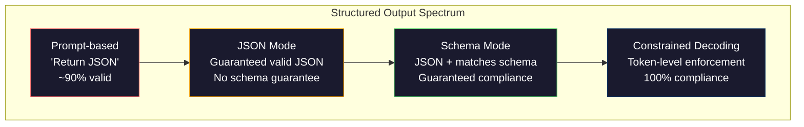
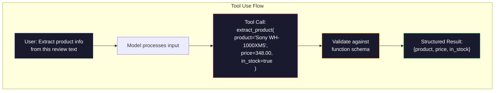

# Các kết quả cấu trúc: JSON, Sketch Validation, Restricted Decoding                                                                                                                                                                                                                                                                                                                                                                                                                                                                                                         

> LLM của bạn trả lại một chuỗi. ứng dụng của bạn cần JSON. Khoảng cách đó đã bị hỏng nhiều hệ thống sản xuất hơn bất kỳ ảo giác mô hình nào. Khả năng kết cấu là cầu nối giữa ngôn ngữ tự nhiên và dữ liệu gõ. Làm đúng và LLM của bạn trở thành một API đáng tin cậy. Làm sai và bạn phân tích văn bản tự do với regex vào 3 giờ sáng.

> **【中文解读】**LLM trở lại các chuỗi, nhưng ứng dụng cần JSON. Structured output là cầu nối giữa ngôn ngữ tự nhiên và dữ liệu kiểu hóa, là LLM từ "Chatting Machine" tiến hóa thành "API đáng tin cậy"

> **【拓展：结构化输出→AI应用开发】**结构化输出是Fungsi Calling、RAG管道、数据提取等 AI 应用的基础──OpenAI 的`response_format`、Anthropic sử dụng công cụ 、Instructor 库 là các công cụ cốt lõi trong lĩnh vực này ⋅

>  **【前置】**学本节前请先掌握:(1) Bước 10·01-05(LLM 基础) 理解代号 生成;(2) JSON Schema 基础(`type``properties``required`);(3) Python `pydantic`库或 `dataclasses`本节使用Pydantic做验证──如果不懂JSON Schema,先看 jsonschema.org的5分钟教程──

**Type:** Build | **类型:** 构建
**Languages:** Python | **语言:** Python
**Prerequisites:** Phase 10, Lessons 01-05 (LLMs from Scratch) | **前置知识:** Phase 10 · 01-05 (从零构建 LLM)
**Time:** ~90 minutes | **时间:** ~90 分钟
**Related:**Giai đoạn 5 · 20 (Structured Outputs & Constrained Decoding) bao gồm lý thuyết cấp độ decoder (FSM/CFG logit processors, Outlines, XGrammar).`response_format`, Sử dụng công cụ nhân bản, hướng dẫn viên)  đọc giai đoạn 5 · 20 trước nếu bạn muốn hiểu những gì đang xảy ra bên dưới API. **相关:**Giai đoạn 5 · 20 (struktur化输出与约束解码) 讲解码器级理论(FSM/CFG logit 处理器、Outlines、XGrammar)`response_format`、Anthropic tool use、Instructor) 想了解API 底下发生什么先读阶段 5 · 20。

## Mục tiêu học tập

- Thực hiện các đầu ra theo chế độ JSON và hạn chế theo schema bằng cách sử dụng các tham số OpenAI và API Anthropic
  Sử dụng OpenAI và Anthropic API 参数 thực hiện JSON 模式 và Schema 约束输出
- Xây dựng một lớp xác thực Pydantic từ chối các kết quả LLM sai lầm và thử lại với phản hồi lỗi
  构建 Pydantic 验证层, từ chối hình thức sai lầm của LLM 输出并通过错误反重试
- Giải thích cách giải mã hạn chế buộc JSON hợp lệ ở cấp token mà không cần xử lý sau
  解释约束解码 làm thế nào trong token 级强制生成有效 JSON, không cần xử lý sau
- Thiết kế các lệnh trích xuất mạnh mẽ để chuyển đổi văn bản không có cấu trúc thành cấu trúc dữ liệu được đánh dấu
  设计鲁棒的提取提示, đáng tin cậy sẽ chuyển văn bản không cấu trúc thành cấu trúc dữ liệu phân loại

> **【中文解读】**Mục tiêu của bài học: để LLM 输出 cấu trúc dữ liệu ((JSON、XML、表格)  Ký thuật bao gồm hàm điều chỉnh, chế độ JSON、约束解码── đây là bước quan trọng để nâng cấp LLM từ chat tool thành bộ phận công trình.


## Vấn đề  vấn đề giới thiệu

Bạn hỏi một LLM: "Hãy lấy tên sản phẩm, giá và khả năng có sẵn từ văn bản này".

> Bạn hỏi LLM:" Từ đoạn văn này中提取产品名称、价格和库存状态"", nó回复:

Đó là một câu trả lời hoàn toàn chính xác. Nó cũng hoàn toàn vô dụng cho ứng dụng của bạn.`{"product": "Sony WH-1000XM5", "price": 348.00, "in_stock": true}`Bạn cần một đối tượng JSON với các khóa cụ thể, loại cụ thể và hạn chế giá trị cụ thể. Bạn không cần một câu.

> Đó là một câu trả lời hoàn toàn đúng. Nhưng nó cũng hoàn toàn không được sử dụng cho ứng dụng của bạn.`{"product": "Sony WH-1000XM5", "price": 348.00, "in_stock": true}`You need a specific key, type and value binding JSON đối tượng.

Giải pháp ngây thơ: thêm "Câu trả lời bằng JSON" vào yêu cầu của bạn. Điều này hoạt động 90% thời gian. 10% khác mô hình bọc JSON trong hàng rào mã đánh dấu, hoặc thêm một đoạn tiền đề như "Đây là JSON:", hoặc tạo ra JSON không hợp pháp vì đã đóng một vòng đệm sớm. Bộ phân tích JSON của bạn bị hỏng. Đường ống của anh bị hỏng. Bạn thêm thử / trừ và một vòng lặp thử lại. Thỉnh thoảng, thử lại sẽ tạo ra dữ liệu khác nhau. Bây giờ bạn có một vấn đề nhất quán trên đỉnh của một vấn đề phân tích.

> Giải pháp đơn giản: trong lời khuyên của bạn thêm "được sử dụng JSON 回复"。 Điều này có hiệu quả trong trường hợp 90%。 trong 10% còn lại, mô hình sẽ đặt JSON 包 trong khối mã đánh dấu, hoặc thêm "Đây là JSON:" như một đầu ngữ, hoặc vì trước đó đóng kết số để tạo ra ngôn ngữ pháp JSON không hiệu quả。 máy phân tích JSON của bạn đã bị phá vỡ。 dòng chảy của bạn đã bị phá vỡ。 bạn đã thêm thử / trừ và lặp lại vòng lặp。 lần nữa thử đôi khi sẽ tạo ra dữ liệu khác nhau。 bây giờ bạn đang có vấn đề phù hợp trên các vấn đề phân tích。

Đây không phải là một vấn đề kỹ thuật nhanh chóng. Đó là một vấn đề giải mã. Mô hình tạo ra token từ trái sang phải. Ở mỗi vị trí, nó chọn token tiếp theo có khả năng nhất từ một từ vựng 100K + tùy chọn. Hầu hết các tùy chọn đó sẽ tạo ra JSON không hợp lệ ở bất kỳ vị trí nào. Nếu mô hình chỉ phát ra `{"price":`, biểu tượng tiếp theo phải là một chữ số, một trích dẫn (để chuỗi),`null`- `true`- `false`Nếu không có những hạn chế, mô hình có thể chọn một từ tiếng Anh hoàn toàn hợp lý mà là thảm họa sai sót về cách diễn văn.

> Đây không phải là vấn đề kỹ thuật gợi ý. Đây là vấn đề giải mã. Mô hình từ trái đến phải tạo token. Ở mỗi vị trí, nó chọn các token tiếp theo có thể từ bảng từ 100.000 + tùy chọn. Phần lớn các tùy chọn sẽ không hiệu quả JSON ở bất kỳ vị trí nào. Nếu mô hình vừa xuất ra.`{"price":`, next token  phải là số 引号 ((để dùng字符串) ),`null``true``false`Hoặc có một số lượng không hiệu quả, nhưng trong ngữ pháp là một sai lầm thảm khốc.

>  **【类比】**Không bị ràng buộc LLM 输出 JSON 像让人"边说边造句" nói đến một nửa có thể thay đổi tạm thời ý tưởng bằng những từ khác, kết quả语法错乱。约束解码(cài mã bị hạn chế) như người nói"语法监工" mỗi nói một từ监工都检查"这能接下来吗", không thể tiếp nhận được về việc bắt buộc thay đổi.

> ️ **【易错点】**结构化输出 3 个坑:(1) **Schema 字段过多** Hơn 20 个字段模型记不住,会漏字段或填错;修复:拆成嵌套对象,每个层不超过 5 个字段――(2) **要求 LLM 输出"创造性"字段但又强 Schema** Ví dụ như "Buy lên một chủ đề sáng tạo" hợp tác `title: str`,模型被 Schema 约束后变得保守;修复:用 `temperature=0.9`+ Chế độ 中加 `min_length: 10`留余地。(3) **没用 Pydantic 验证** trực tiếp `json.loads()`万一字符串里有数字 (("348") được chuyển thành str chứ không phải nổi; sử dụng Pydantic tự động bắt buộc loại chuyển đổi。

## Khái niệm cốt lõi

> **【中文解读】**结构化输出是让LLM 生成 JSON、XML等格式的可控输出──关键技术:函数调用(Function Calling)让模型输出预定义的 JSON schema,JSON mode 强制模型生成合法 JSON,约束解码(约束解码) 在代币级别保证输出格式──

> 🤔 **【困惑】**Q: OpenAI của `response_format={"type": "json_object"}`和 `response_format={"type": "json_schema", ...}`Có gì khác biệt? A: 前者是"JSON mode"保证输出合法JSON,但不保证字段。后者是"结构化输出"你给了JSON Schema,模型保证按 Schema 输出(用约束解码实现) ・・・前者便宜但不严格,后者每次贵几分钱但100% 按规则──生产环境一律使用`json_schema`模式──

> **【拓展：结构化输出的工程实践】**OpenAI's Structured Outputs(2024) đảm bảo mô hình đầu ra JSON Schema phù hợp nghiêm ngặt, độ tin cậy từ khoảng 90%  nâng lên 100%。Instructor 库(Python) sẽ tự động chuyển đổi mô hình Pydantic thành JSON Schema 并验证输出。 đây sẽ là một công nghệ quan trọng của LLM 集成 vào hệ thống sản xuất。


### Phân quang sản lượng có cấu trúc

Có bốn cấp độ kiểm soát đầu ra cấu trúc, mỗi cấp độ đáng tin cậy hơn so với mức trước.

>  cấu trúc kiểm soát đầu ra có bốn cấp, mỗi cấp độ đáng tin cậy hơn so với trước đây.



**Prompt-based**("Câu trả lời trong JSON hợp lệ"): không thực thi. Mô hình thường tuân thủ nhưng đôi khi không. Đán cậy: ~ 90%.

> **基于提示**("Use有效的 JSON 回复"): không có lệnh thi hành. Mô hình thường tuân thủ, nhưng đôi khi sẽ không.

**JSON mode**: API đảm bảo đầu ra là hợp lệ JSON.`response_format: { type: "json_object" }`cho phép điều này. đầu ra sẽ phân tích mà không có lỗi. Nhưng nó có thể không phù hợp với kế hoạch mong đợi của bạn - thêm phím, loại sai, mất trường.

> **JSON 模式**API đảm bảo xuất là hiệu quả JSON。OpenAI của `response_format: { type: "json_object" }` bật chức năng này.  输出 có thể không có lỗi phân tích.  nhưng nó có thể không phù hợp với kế hoạch bạn mong đợi  dư thừa các khóa, loại sai  缺失的字段.

**Schema mode**: API lấy một JSON Schema và đảm bảo đầu ra phù hợp với nó.`response_format: { type: "json_schema", json_schema: {...} }`(còn như `tool_choice="required"`), sử dụng công cụ của Anthropic với `input_schema`, và Gemini của `response_schema`+ `response_mime_type: "application/json"`. Khả năng xuất có chính xác các khóa, loại và hạn chế mà bạn đã chỉ định.

> **Schema 模式**:API  chấp nhận JSON Schema 并 đảm bảo xuất匹配.`response_format: { type: "json_schema" }`、Anthropic 带 `input_schema`                                                                                                                                                                                                                                                              `response_schema`◊输出 có các khóa chính xác bạn xác định, loại và vòng.

**Constrained decoding**: tại mỗi vị trí token trong quá trình tạo, decoder che giấu tất cả các token sẽ tạo ra đầu ra không hợp lệ. Nếu sơ đồ yêu cầu một số và mô hình sắp phát ra một chữ cái, token đó được đặt lên xác suất bằng không. mô hình chỉ có thể tạo ra token dẫn đến đầu ra hợp lệ. Đây là những gì chế độ đầu ra có cấu trúc của OpenAI và thư viện như Outlines và Guidance thực hiện dưới nắp.

> **约束解码**Trong quá trình tạo, mỗi token  vị trí, giải mã ngăn chặn tất cả sẽ tạo ra các token đầu ra không hiệu quả. Nếu schema yêu cầu số và mô hình sẽ sẽ sản xuất chữ cái, tỷ lệ của token sẽ được đặt là 0.

### JSON Schema: Ngôn ngữ hợp đồng

JSON Schema là cách bạn nói với mô hình (hoặc lớp xác thực) hình dạng đầu ra phải có.

> JSON Schema là cách mà bạn nói với mô hình (hoặc lớp xác nhận) đầu ra phải có hình dạng nào.

```json
{
  "type": "object",
  "properties": {
    "product": { "type": "string" },
    "price": { "type": "number", "minimum": 0 },
    "in_stock": { "type": "boolean" },
    "categories": {
      "type": "array",
      "items": { "type": "string" }
    }
  },
  "required": ["product", "price", "in_stock"]
}
```

Chế hoạch này nói: đầu ra phải là một đối tượng với một chuỗi `product`, một con số không âm `price`, một boolean `in_stock`, và một chuỗi tùy chọn`categories`Bất kỳ đầu ra nào không phù hợp đều bị từ chối.

> Đây là một biểu tượng, chứa các chữ cái.`product`、非负数字 `price`≈Bộ giá trị ≈`in_stock`和可选的字符串数组 `categories`Bất kỳ sản phẩm nào không phù hợp đều bị từ chối.

Các sơ đồ xử lý các trường hợp khó khăn: các đối tượng tổ, các mảng có các mục được đánh dấu, enums (đặt một chuỗi vào các giá trị cụ thể), kết hợp mô hình (regex trên chuỗi), và các bộ kết hợp (oneOf, anyOf, allOf cho các đầu ra đa hình).

> Schema  xử lý tình huống phức tạp:嵌套对象、带类型项的数组、枚举(将字符串约束为特定值) 模式匹配(字符串上的正则表达式) 和组合器(oneOf、anyOf、allOf 用于多态输出) ⋅

### Mô hình Pydantic

Trong Python, bạn không viết JSON Schema bằng tay. Bạn xác định mô hình Pydantic và nó tạo ra các sơ đồ cho bạn.

> Trong Python, bạn không cần viết JSON Schema. Bạn định nghĩa một mô hình Python, nó sẽ tạo ra cho bạn một schema.

```python
from pydantic import BaseModel

class Product(BaseModel):
    product: str
    price: float
    in_stock: bool
    categories: list[str] = []
```

Điều này tạo ra cùng một JSON Schema như trên. Thư viện Instructor (và SDK của OpenAI) chấp nhận mô hình Pydantic trực tiếp: vượt qua lớp mô hình, lấy lại một phiên bản xác minh. Nếu sản xuất LLM không phù hợp, Instructor tự động thử lại.

> Nó sẽ tạo ra cùng một JSON Schema trên. Ưu điểm của hướng dẫn viên (và SDK của OpenAI) trực tiếp chấp nhận Pydantic 模型:传入模型类,返回验证过的实例.

### Chọi chức năng / Sử dụng công cụ

Một giao diện thay thế cho cùng một vấn đề. Thay vì yêu cầu mô hình tạo ra JSON trực tiếp, bạn xác định "công cụ" (công cụ) với các tham số được gõ. mô hình đưa ra một cuộc gọi hàm với các lập luận có cấu trúc. OpenAI gọi điều này là "công cụ gọi". Anthropic gọi nó là "tận dụng công cụ". Kết quả là tương tự: dữ liệu có cấu trúc.

> 解决相同的问题的替代接口──不是要求模型直接产生 JSON,而是定义带类参数的"工具" (函数)──模型输出带有结构化参数的函数调用──OpenAI 称之为"函数调用"",Anthropic 称之为"工具使用"──结果相同:结构化数据──



Sử dụng công cụ được ưu tiên khi mô hình cần phải chọn hàm nào để gọi, chứ không chỉ điền vào các tham số. Nếu bạn có 10 sơ đồ khai thác khác nhau và mô hình phải chọn đúng một dựa trên đầu vào, sử dụng công cụ cung cấp cho bạn cả sự lựa chọn sơ đồ và đầu ra cấu trúc.

> Khi mô hình cần chọn tùy chọn hàm nào không chỉ để điền vào các tham số, hãy sử dụng công cụ chọn đầu tiên. Nếu bạn có 10 sơ đồ chọn khác nhau và mô hình phải dựa trên mục nhập chọn đúng, hãy sử dụng công cụ đồng thời cung cấp sơ đồ chọn và cấu trúc xuất.

### Các phương thức thất bại phổ biến

Ngay cả khi thực thi kế hoạch, các kết quả được cấu trúc có thể thất bại theo những cách tinh tế.

> Ngay cả khi có một kế hoạch 强制执行, cấu trúc xuất cũng có thể thất bại theo một cách tinh tế.

**Hallucinated values**: đầu ra phù hợp với sơ đồ nhưng chứa dữ liệu phát minh.`{"price": 299.99}`khi văn bản nói $348. Sơ đồ xác thực không thể bắt được điều này -- kiểu là đúng, giá trị là sai.

> **幻觉值**:输出匹配方案, nhưng chứa dữ liệu giả tạo.`{"price": 299.99}` Chế độ xác minh không thể nắm bắt được vấn đề này  loại đúng, giá trị sai

**Enum confusion**: bạn hạn chế một trường để `["in_stock", "out_of_stock", "preorder"]`. . . . . . . . . . . . . . . . . . . . . . . . . . . . . . . . . . . . . . . . . . . . . . . . . . . . . . . . . . . . . . . . . . . . . . . . . . . . . . . . . . . . . . . . . . . . . . . . . . . . . . . . . . . . . . . . . . . . . . . . . . . . . . . . . . . . . . . . . . . . . . . . . . . . . . . . . . . . . . . . . . . . . . . . . . . . . . . . . . . . . . . . . . . . . . . . . . . . . . . . . . . . . . . . . . . . . . . . . . . . . . . . . . . . . . . . . . . . . . . . . . . . . . . . . . . . . . . . . . . . . . . . . . . . . . . . . . . . . . . . . . . . . . . . . . . . . . . . . . . . . . . . . . . . . . . . . . . . . . . . . . . . . . . . . . . . . . . . . . . . . . . . . . . . . . . . . . . . . . . . . . . . . . . . . . . . . . . . . . . . . . . . . . . . . . . . . . . . . . . . . . . . . . . . . . . . . . . . . . . . . . . . . . . . . . . . . . . . . . . . . . . . . . . . . . . . . . . . . . . . . . . . . . . . . . . . . . . . . . . . . . . . . . . . . . . . . . . . . . . . . . . . . . . . . .`"available"`- đúng ngữ nghĩa, nhưng không trong bộ được phép. decoding hạn chế tốt ngăn chặn điều này.

> **枚举混淆**: 你将字段约束为 `["in_stock", "out_of_stock", "preorder"]` mô hình xuất khẩu`"available"`语义上正确, nhưng không được phép trong tập hợp.                                                                                                                                                                                                                                                       

**Nested object depth**Các quy trình sâu (4+ cấp) tạo ra nhiều lỗi hơn.

> **嵌套对象深度**: Deep layer嵌套的 schema(4+层) tạo ra nhiều lỗi hơn. Mỗi layer嵌套 đều là mô hình có thể bị mất cấu trúc theo dõi ở một nơi khác.

**Array length**: mô hình có thể sản xuất quá nhiều hoặc quá ít các mục trong một mảng.`minItems`và `maxItems`nhưng không phải tất cả các nhà cung cấp thực thi chúng ở mức giải mã.

> **数组长度**Mô hình có thể có quá nhiều hoặc quá ít các mục trong số.`minItems`和 `maxItems`Nhưng không phải tất cả các nhà cung cấp đều có mức độ giải mã bắt buộc.

**Optional field omission**: mô hình bỏ qua các trường hợp tùy chọn kỹ thuật nhưng quan trọng về ngữ nghĩa cho trường hợp sử dụng của bạn. Đặt chúng theo yêu cầu trong sơ đồ ngay cả khi dữ liệu đôi khi bị thiếu -- buộc mô hình để sản xuất`null`rõ ràng.

> **可选字段遗漏**Mô hình bỏ qua các lựa chọn kỹ thuật nhưng về mặt ngữ nghĩa là rất quan trọng đối với trường hợp sử dụng của bạn. Ngay cả khi dữ liệu có thời gian thiếu, cũng trong kế hoạch sẽ đặt chúng để thiết yếu  Mô hình bắt buộc hiển nhiên tạo ra.`null`

## Hãy xây dựng nó.
```figure
mx-schema-funnel
```

## Hãy xây dựng nó

### Bước 1: JSON Schema Validator

Xây dựng một trình xác thực từ đầu để kiểm tra xem một đối tượng Python có phù hợp với một Schema JSON hay không. Đây là điều chạy trên bên đầu ra để xác minh tuân thủ.

> Từ零构建验证器, kiểm tra Python đối tượng có phù hợp với JSON Schema không.

```python
import json

def validate_schema(data, schema):
    errors = []
    _validate(data, schema, "", errors)
    return errors

def _validate(data, schema, path, errors):
    schema_type = schema.get("type")

    if schema_type == "object":
        if not isinstance(data, dict):
            errors.append(f"{path}: expected object, got {type(data).__name__}")
            return
        for key in schema.get("required", []):
            if key not in data:
                errors.append(f"{path}.{key}: required field missing")
        properties = schema.get("properties", {})
        for key, value in data.items():
            if key in properties:
                _validate(value, properties[key], f"{path}.{key}", errors)

    elif schema_type == "array":
        if not isinstance(data, list):
            errors.append(f"{path}: expected array, got {type(data).__name__}")
            return
        min_items = schema.get("minItems", 0)
        max_items = schema.get("maxItems", float("inf"))
        if len(data) < min_items:
            errors.append(f"{path}: array has {len(data)} items, minimum is {min_items}")
        if len(data) > max_items:
            errors.append(f"{path}: array has {len(data)} items, maximum is {max_items}")
        items_schema = schema.get("items", {})
        for i, item in enumerate(data):
            _validate(item, items_schema, f"{path}[{i}]", errors)

    elif schema_type == "string":
        if not isinstance(data, str):
            errors.append(f"{path}: expected string, got {type(data).__name__}")
            return
        enum_values = schema.get("enum")
        if enum_values and data not in enum_values:
            errors.append(f"{path}: '{data}' not in allowed values {enum_values}")

    elif schema_type == "number":
        if not isinstance(data, (int, float)):
            errors.append(f"{path}: expected number, got {type(data).__name__}")
            return
        minimum = schema.get("minimum")
        maximum = schema.get("maximum")
        if minimum is not None and data < minimum:
            errors.append(f"{path}: {data} is less than minimum {minimum}")
        if maximum is not None and data > maximum:
            errors.append(f"{path}: {data} is greater than maximum {maximum}")

    elif schema_type == "boolean":
        if not isinstance(data, bool):
            errors.append(f"{path}: expected boolean, got {type(data).__name__}")

    elif schema_type == "integer":
        if not isinstance(data, int) or isinstance(data, bool):
            errors.append(f"{path}: expected integer, got {type(data).__name__}")
```

### Bước 2: Mô hình theo phong cách Pydantic đến Schema

Xây dựng một trình chuyển đổi lớp thành sơ đồ tối thiểu. Định nghĩa một lớp Python và tạo sơ đồ JSON tự động.

> 构建最小类到 schema 转换器──定义 Python 类, tự động tạo ra JSON Schema──

```python
class SchemaField:
    def __init__(self, field_type, required=True, default=None, enum=None, minimum=None, maximum=None):
        self.field_type = field_type
        self.required = required
        self.default = default
        self.enum = enum
        self.minimum = minimum
        self.maximum = maximum

def python_type_to_schema(field):
    type_map = {
        str: "string",
        int: "integer",
        float: "number",
        bool: "boolean",
    }

    schema = {}

    if field.field_type in type_map:
        schema["type"] = type_map[field.field_type]
    elif field.field_type == list:
        schema["type"] = "array"
        schema["items"] = {"type": "string"}
    elif isinstance(field.field_type, dict):
        schema = field.field_type

    if field.enum:
        schema["enum"] = field.enum
    if field.minimum is not None:
        schema["minimum"] = field.minimum
    if field.maximum is not None:
        schema["maximum"] = field.maximum

    return schema

def model_to_schema(name, fields):
    properties = {}
    required = []

    for field_name, field in fields.items():
        properties[field_name] = python_type_to_schema(field)
        if field.required:
            required.append(field_name)

    return {
        "type": "object",
        "properties": properties,
        "required": required,
    }
```

### Bước 3: Trình lọc mã thông báo bị hạn chế

Mô phỏng mã hóa hạn chế. Với một chuỗi JSON một phần và một sơ đồ, xác định các danh mục mã thông báo nào hợp lệ tại vị trí hiện tại.

> 模拟约束解码──给定部分 JSON 字符串和方案, xác định vị trí hiện tại của các token 类别有效──

```python
def next_valid_tokens(partial_json, schema):
    stripped = partial_json.strip()

    if not stripped:
        return ["{"]

    try:
        json.loads(stripped)
        return ["<EOS>"]
    except json.JSONDecodeError:
        pass

    last_char = stripped[-1] if stripped else ""

    if last_char == "{":
        return ['"', "}"]
    elif last_char == '"':
        if stripped.endswith('":'):
            return ['"', "0-9", "true", "false", "null", "[", "{"]
        return ["a-z", '"']
    elif last_char == ":":
        return [" ", '"', "0-9", "true", "false", "null", "[", "{"]
    elif last_char == ",":
        return [" ", '"', "{", "["]
    elif last_char in "0123456789":
        return ["0-9", ".", ",", "}", "]"]
    elif last_char == "}":
        return [",", "}", "]", "<EOS>"]
    elif last_char == "]":
        return [",", "}", "<EOS>"]
    elif last_char == "[":
        return ['"', "0-9", "true", "false", "null", "{", "[", "]"]
    else:
        return ["any"]

def demonstrate_constrained_decoding():
    partial_states = [
        '',
        '{',
        '{"product"',
        '{"product":',
        '{"product": "Sony"',
        '{"product": "Sony",',
        '{"product": "Sony", "price":',
        '{"product": "Sony", "price": 348',
        '{"product": "Sony", "price": 348}',
    ]

    print(f"{'Partial JSON':<45} {'Valid Next Tokens'}")
    print("-" * 80)
    for state in partial_states:
        valid = next_valid_tokens(state, {})
        display = state if state else "(empty)"
        print(f"{display:<45} {valid}")
```

### Bước 4: Đường ống khai thác

Kết hợp mọi thứ vào một đường ống khai thác: xác định một kế hoạch, mô phỏng một LLM sản xuất đầu ra có cấu trúc, xác nhận đầu ra và xử lý các thử nghiệm lại.

> Hãy tạo ra tất cả các kết hợp: định nghĩa kế hoạch, mô hình LLM, tạo ra các kết quả cấu trúc, xác nhận, xử lý, thử nghiệm.

```python
def simulate_llm_extraction(text, schema, attempt=0):
    if "headphones" in text.lower() or "sony" in text.lower():
        if attempt == 0:
            return '{"product": "Sony WH-1000XM5", "price": 348.00, "in_stock": true, "categories": ["audio", "headphones"]}'
        return '{"product": "Sony WH-1000XM5", "price": 348.00, "in_stock": true}'

    if "laptop" in text.lower():
        return '{"product": "MacBook Pro 16", "price": 2499.00, "in_stock": false, "categories": ["computers"]}'

    return '{"product": "Unknown", "price": 0, "in_stock": false}'

def extract_with_retry(text, schema, max_retries=3):
    for attempt in range(max_retries):
        raw = simulate_llm_extraction(text, schema, attempt)

        try:
            data = json.loads(raw)
        except json.JSONDecodeError as e:
            print(f"  Attempt {attempt + 1}: JSON parse error -- {e}")
            continue

        errors = validate_schema(data, schema)
        if not errors:
            return data

        print(f"  Attempt {attempt + 1}: Schema validation errors -- {errors}")

    return None

product_schema = {
    "type": "object",
    "properties": {
        "product": {"type": "string"},
        "price": {"type": "number", "minimum": 0},
        "in_stock": {"type": "boolean"},
        "categories": {"type": "array", "items": {"type": "string"}},
    },
    "required": ["product", "price", "in_stock"],
}
```

### Bước 5: Điền toàn bộ đường ống

> Bước 5:运行完整流水线──

```python
def run_demo():
    print("=" * 60)
    print("  Structured Output Pipeline Demo")
    print("=" * 60)

    print("\n--- Schema Definition ---")
    product_fields = {
        "product": SchemaField(str),
        "price": SchemaField(float, minimum=0),
        "in_stock": SchemaField(bool),
        "categories": SchemaField(list, required=False),
    }
    generated_schema = model_to_schema("Product", product_fields)
    print(json.dumps(generated_schema, indent=2))

    print("\n--- Schema Validation ---")
    test_cases = [
        ({"product": "Test", "price": 10.0, "in_stock": True}, "Valid object"),
        ({"product": "Test", "price": -5.0, "in_stock": True}, "Negative price"),
        ({"product": "Test", "in_stock": True}, "Missing price"),
        ({"product": "Test", "price": "ten", "in_stock": True}, "String as price"),
        ("not an object", "String instead of object"),
    ]

    for data, label in test_cases:
        errors = validate_schema(data, product_schema)
        status = "PASS" if not errors else f"FAIL: {errors}"
        print(f"  {label}: {status}")

    print("\n--- Constrained Decoding Simulation ---")
    demonstrate_constrained_decoding()

    print("\n--- Extraction Pipeline ---")
    texts = [
        "The Sony WH-1000XM5 headphones are priced at $348 and currently available.",
        "The new MacBook Pro 16-inch laptop costs $2499 but is sold out.",
        "This is a random sentence with no product info.",
    ]

    for text in texts:
        print(f"\n  Input: {text[:60]}...")
        result = extract_with_retry(text, product_schema)
        if result:
            print(f"  Output: {json.dumps(result)}")
        else:
            print(f"  Output: FAILED after retries")
```

## Hãy sử dụng nó để thực hiện

### Các sản phẩm được cấu trúc của OpenAI

> OpenAI  cấu trúc输出――

```python
# from openai import OpenAI
# from pydantic import BaseModel
#
# client = OpenAI()
#
# class Product(BaseModel):
#     product: str
#     price: float
#     in_stock: bool
#
# response = client.beta.chat.completions.parse(
#     model="gpt-5-mini",
#     messages=[
#         {"role": "system", "content": "Extract product information."},
#         {"role": "user", "content": "Sony WH-1000XM5, $348, in stock"},
#     ],
#     response_format=Product,
# )
#
# product = response.choices[0].message.parsed
# print(product.product, product.price, product.in_stock)
```

Phiên bản phát hành có cấu trúc của OpenAI sử dụng mã hóa hạn chế nội bộ. Mỗi token mô hình tạo được đảm bảo sẽ tạo ra đầu ra phù hợp với sơ đồ Pydantic. Không cần thử lại. Không cần xác thực.

> Mô hình đầu ra cấu trúc của OpenAI được sử dụng bên trong sử dụng mã hóa. Mỗi token được tạo ra bởi mô hình đều đảm bảo sẽ có kết quả đầu ra phù hợp của mô hình Pydantic. Không cần thử lại. Không cần xác nhận.

### Sử dụng công cụ nhân loại

> Nhân văn 工具使用。

```python
# import anthropic
#
# client = anthropic.Anthropic()
#
# response = client.messages.create(
#     model="claude-opus-4-7",
#     max_tokens=1024,
#     tools=[{
#         "name": "extract_product",
#         "description": "Extract product information from text",
#         "input_schema": {
#             "type": "object",
#             "properties": {
#                 "product": {"type": "string"},
#                 "price": {"type": "number"},
#                 "in_stock": {"type": "boolean"},
#             },
#             "required": ["product", "price", "in_stock"],
#         },
#     }],
#     messages=[{"role": "user", "content": "Extract: Sony WH-1000XM5, $348, in stock"}],
# )
```

Anthropic đạt được kết quả cấu trúc thông qua việc sử dụng công cụ. mô hình phát ra một cuộc gọi công cụ với các lập luận cấu trúc phù hợp với input_schema. Kết quả tương tự, bề mặt API khác nhau.

> Antropic  thông qua công cụ sử dụng 实现结构化输出――模型发出一个工具调用,其结构化参数匹配 input_schema――结果相同,API 接口不同――

### Thư viện hướng dẫn viên

> Chuyên gia 库――

```python
# pip install instructor
# import instructor
# from openai import OpenAI
# from pydantic import BaseModel
#
# client = instructor.from_openai(OpenAI())
#
# class Product(BaseModel):
#     product: str
#     price: float
#     in_stock: bool
#
# product = client.chat.completions.create(
#     model="gpt-5-mini",
#     response_model=Product,
#     messages=[{"role": "user", "content": "Sony WH-1000XM5, $348, in stock"}],
# )
```

Instructor gói bất kỳ khách hàng LLM nào và thêm các thử nghiệm tự động với xác thực. Nếu nỗ lực đầu tiên thất bại trong xác thực, nó sẽ gửi lỗi trở lại mô hình như ngữ cảnh và yêu cầu nó sửa chữa đầu ra. Điều này hoạt động với bất kỳ nhà cung cấp nào, không chỉ OpenAI.

> Instructor  gói bất kỳ LLM 客户端并添加带验证的自动重试―― Nếu lần đầu tiên thử nghiệm thất bại, nó sẽ sai như trên sau:

## Chuyển nó đi.

Bài học này sẽ mang lại kết quả `outputs/prompt-structured-extractor.md`-- một mẫu yêu cầu có thể sử dụng lại thu thập dữ liệu cấu trúc từ bất kỳ văn bản nào với định nghĩa schema. Cho nó một JSON Schema và văn bản không cấu trúc, và nó trả lại JSON xác nhận.

> 本课产生 `outputs/prompt-structured-extractor.md` Một mô hình gợi ý có thể sử dụng lại, được định nghĩa theo schema, lấy dữ liệu cấu trúc từ bất kỳ văn bản nào trong văn bản.

Nó cũng sản xuất `outputs/skill-structured-outputs.md`-- một khung quyết định để lựa chọn đúng chiến lược sản xuất có cấu trúc dựa trên nhà cung cấp của bạn, yêu cầu độ tin cậy, và phức tạp của kế hoạch.

> Nó cũng xuất hiện.`outputs/skill-structured-outputs.md`Một khung quyết định, dựa trên nhu cầu và kế hoạch đáng tin cậy của nhà cung cấp của bạn  độ phức tạp chọn đúng chiến lược xuất khẩu cấu trúc.

## Tập luyện bài tập

1. Chuyển rộng trình xác nhận schema để hỗ trợ `oneOf`(dữ liệu phải phù hợp chính xác với một trong nhiều sơ đồ).`Product`hoặc một `Service`vật có hình dạng khác nhau.
    mở rộng quy trình  chứng nhận để hỗ trợ `oneOf`(Data phải phù hợp với một trong vài schema) `Product`Hoặc`Service`Đối tượng:

2. Xây dựng một công cụ "chế hoạch khác biệt" so sánh hai kế hoạch và xác định các thay đổi phá vỡ (bỏ các trường yêu cầu, thay đổi loại) so với thay đổi không phá vỡ (chế độ tùy chọn thêm, hạn chế được thư giãn). Điều này là cần thiết để phiên bản các kế hoạch khai thác của bạn trong sản xuất.
   Xây dựng một công cụ "chế hoạch khác biệt", so sánh hai sơ đồ và xác định các thay đổi phá hoại (để loại bỏ các đoạn cần thiết, thay đổi) và các thay đổi không phá hoại (để thêm các đoạn chọn, tháo dỡ các ràng buộc)

3. Thực hiện một mô phỏng mã hóa hạn chế thực tế hơn. Với một Schema JSON và một từ vựng 100 mã thông báo (biểu tượng, chữ số, dấu chấm, từ khóa), đi qua quá trình tạo ra từng bước, che giấu các mã thông báo không hợp lệ tại mỗi vị trí. Đo lường tỷ lệ phần trăm từ vựng nào hợp lệ tại mỗi bước.
   实现一个更真实的约束解码模拟器――给定 JSON Schema 和 100 个代币的词表,逐步生成,在每个位置屏蔽无效代币――测量每一步的词表的有效百分比――

4. Xây dựng một bộ đánh giá khai thác. Tạo 50 mô tả sản phẩm với các đầu ra JSON được dán nhãn bằng tay. Đưa ra đường ống khai thác của bạn trên tất cả 50 và đo sự phù hợp chính xác, độ chính xác ở cấp độ trường và tuân thủ kiểu. Xác định các trường khó khăn nhất để khai thác chính xác.
   构建一个提取评估套件――创建 50 产品描述及标签 JSON 输出――在所有 50 运行提取流水线上,测量精确匹配、字段级准确率和类型合规性――

5. Thêm "điểm độ tin cậy" vào đường ống khai thác của bạn. Đối với mỗi trường khai thác, ước tính mô hình có độ tin cậy như thế nào (dựa trên xác suất token, hoặc bằng cách chạy khai thác 3 lần và đo sự nhất quán).
   Để tăng thêm "đánh giá độ tin" đối với mỗi đoạn, ước tính mô hình độ tin dựa trên mã thông báo 概率 hoặc vận hành 3 lần

## Từ khóa  Từ khóa nhanh chóng

| Term | What people say | What it actually means | 中文释义 |
|------|----------------|----------------------|---------|
| JSON mode | "Returns JSON" / "返回 JSON" | API flag that guarantees syntactically valid JSON output, but does not enforce any particular schema | JSON 模式：API 标志，保证语法有效的 JSON 输出，但不强制执行特定 schema |
| Structured output | "Typed JSON" / "类型化 JSON" | Output that matches a specific JSON Schema with correct keys, types, and constraints | 结构化输出：匹配特定 JSON Schema 的输出，具有正确的键、类型和约束 |
| Constrained decoding | "Guided generation" / "引导生成" | At each token position, mask out tokens that would produce invalid output -- guarantees 100% schema compliance | 约束解码：在每个 token 位置屏蔽会产生无效输出的 token，保证 100% schema 合规 |
| JSON Schema | "A JSON template" / "JSON 模板" | A declarative language for describing the structure, types, and constraints of JSON data (used by OpenAPI, JSON Forms, etc.) | JSON Schema：描述 JSON 数据结构、类型和约束的声明式语言 |
| Pydantic | "Python dataclasses+" / "Python 数据类+" | Python library that defines data models with type validation, used by FastAPI and Instructor to generate JSON Schemas | Pydantic：定义带类型验证数据模型的 Python 库，用于生成 JSON Schema |
| Function calling | "Tool use" / "工具使用" | LLM outputs a structured function invocation (name + typed arguments) instead of free text -- OpenAI and Anthropic both support this | 函数调用：LLM 输出结构化的函数调用（名称+类型化参数），而非自由文本 |
| Instructor | "Pydantic for LLMs" / "LLM 的 Pydantic" | Python library that wraps LLM clients to return validated Pydantic instances, with automatic retry on validation failure | Instructor：包装 LLM 客户端返回验证过的 Pydantic 实例的 Python 库 |
| Token masking | "Filtering the vocabulary" / "过滤词表" | Setting specific token probabilities to zero during generation so the model cannot produce them | Token 屏蔽：在生成过程中将特定 token 概率设为零 |
| Schema compliance | "Matches the shape" / "匹配形状" | The output has every required field, correct types, values within constraints, and no extra disallowed fields | Schema 合规：输出具有每个必需字段、正确类型、约束内的值 |
| Retry loop | "Try again until it works" / "重试直到成功" | Send validation errors back to the model and ask it to fix the output -- Instructor does this automatically, up to a configurable max | 重试循环：将验证错误发回模型并要求修复输出 |

## Xem thêm 延伸阅读

- [OpenAI Structured Outputs Guide](https://platform.openai.com/docs/guides/structured-outputs)-- Tài liệu chính thức cho việc giải mã hạn chế dựa trên JSON Schema trong OpenAI API
  OpenAI API dựa trên JSON Schema
- [Willard & Louf, 2023 -- "Efficient Guided Generation for Large Language Models"](https://arxiv.org/abs/2307.09702)-- bài viết Outlines, mô tả cách biên soạn các sơ đồ JSON thành máy trạng thái hữu hạn cho các hạn chế cấp token
  Quá trình thảo luận, mô tả cách sử dụng JSON Schema 编译为有限状态机以实现代币 级约束
- [Instructor documentation](https://python.useinstructor.com/)-- thư viện tiêu chuẩn để có được kết quả cấu trúc từ bất kỳ LLM với xác thực và thử nghiệm lại Pydantic
  Từ bất kỳ LLM  lấy带 Pydantic 验证和重试的结构化输出标准库
- [Anthropic Tool Use Guide](https://docs.anthropic.com/en/docs/tool-use)-- cách Claude thực hiện kết quả kết quả được cấu trúc qua công cụ sử dụng với JSON Schema input_schema
  Claude 如何通过带 JSON Schema input_schema 实现结构化输出
- [JSON Schema specification](https://json-schema.org/)-- thông số kỹ thuật đầy đủ cho ngôn ngữ schema được sử dụng bởi mỗi hệ thống đầu ra cấu trúc lớn
  Quy định đầy đủ của mỗi hệ thống sử dụng schema  ngôn ngữ
- [Outlines library](https://github.com/outlines-dev/outlines)-- nguồn mở hạn chế tạo sử dụng regex và JSON Schema biên soạn để máy trạng thái hữu hạn
  Sử dụng quy tắc chính xác và JSON Schema  biên dịch cho các nguồn mở của các trạng thái giới hạn
- [Dong et al., "XGrammar: Flexible and Efficient Structured Generation Engine for Large Language Models" (MLSys 2025)](https://arxiv.org/abs/2411.15100)-- công cụ ngữ pháp hiện đại nhất; bộ sưu tập tự động đẩy xuống che giấu token ở ~ 100 ns / token.
  Hiện nay tiên tiến nhất ngôn ngữ engine; 下推自动机编译, với tốc độ khoảng 100 ns/token
- [Beurer-Kellner et al., "Prompting Is Programming: A Query Language for Large Language Models" (LMQL)](https://arxiv.org/abs/2212.06094)-- LMQL khung giấy hạn chế giải mã như một ngôn ngữ truy vấn với các hạn chế loại và giá trị.
  LMQL thesis về ngôn ngữ truy vấn của các loại và giá trị
- [Microsoft Guidance (framework docs)](https://github.com/guidance-ai/guidance)-- tạo ra hạn chế dựa trên mẫu; bổ sung cho nhà cung cấp-những người không biết về đường sơ đồ và XGrammar.
  模板驱动的约束生成;Outlines 和 XGrammar 的供应商无关补充
