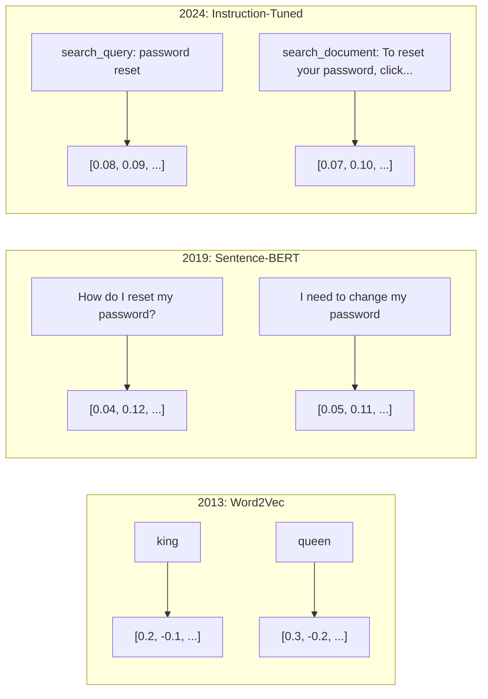
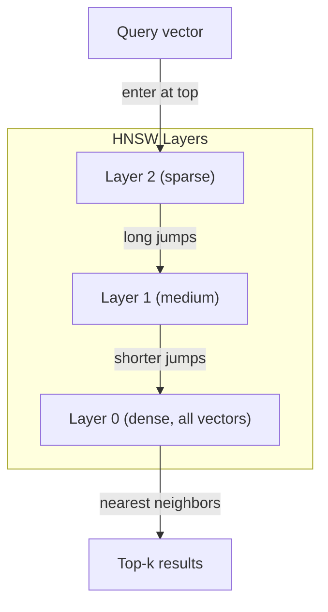

# 嵌入 & Vector Representations 嵌入 & 量表示

> Các bài viết là riêng biệt. toán học là liên tục. Mỗi khi bạn yêu cầu một LLM tìm ra tài liệu "sẵn" hoặc so sánh ý nghĩa hoặc tìm kiếm ngoài từ khóa, bạn đang dựa vào một cây cầu giữa hai thế giới này. Cây cầu đó là một sự nhúng nhúng. Nếu bạn không hiểu được nhúng nhúng, bạn không hiểu AI hiện đại. Bạn chỉ sử dụng nó.

> **【中文解读】**文本是离散的,数学是连续的. 嵌入 (嵌入) 嵌入 (嵌入) là một cái nối kết hai thế giới này.

> **【拓展：嵌入→RAG与搜索】**嵌入 là RAG (检索增强生成) cơ sở hạ tầng cốt lõi của hệ thống.

>  **【前置】**Học本节前请先掌握:(1) Python 基础(numpy 向量运算、字典、列表推导);(2) 高中向量数学点积、角、模长(不知道这些先看 阶段01·02 矢量矩阵);(3) 阶段05·03(Word Embeddings Word2Vec) 会讲词嵌入基础,本节是其延伸到句子/文档级──本节会用到`numpy``scikit-learn`、可选 `chromadb`Hoặc`qdrant`

**Type:** Build | **类型:** 构建
**Languages:** Python | **语言:** Python
**Prerequisites:** Phase 11, Lesson 01 (Prompt Engineering) | **前置知识:** Phase 11 · 01 (提示工程)
**Time:** ~75 minutes | **时间:** ~75 分钟
**Related:**Giai đoạn 5 · 22 (Embedding Models Deep Dive) bao gồm mật độ so với hiếm so với đa vector, cắt đứt Matryoshka, và lựa chọn mô hình theo trục. Bài học này tập trung vào đường ống sản xuất (vector DBs, HNSW, toán tương tự). Đọc Giai đoạn 5 · 22 trước khi chọn mô hình.**相关:**Giai đoạn 5 · 22 (嵌入模型深度解析) 涵盖密/稀疏/多向量、Matryoshka 截断和分轴模型选择。本课聚焦生产管线(向量库、HNSW、相似度数学)。选模型前先读 Giai đoạn 5 · 22。

## Mục tiêu học tập

- Tạo các bản ghi văn bản bằng cách sử dụng các nhà cung cấp API và mô hình nguồn mở, và tính toán sự tương đồng cosine giữa chúng
  Sử dụng API và mô hình nguồn mở tạo các bản sao được nhúng, và tính toán sự tương đồng giữa chúng
- Giải thích tại sao việc nhúng lại giải quyết vấn đề không phù hợp từ vựng mà tìm kiếm từ khóa không thể giải quyết
  解释 tại sao nhúng có thể giải quyết các từ khóa tìm kiếm không thể xử lý các từ khóa không phù hợp
- Xây dựng một chỉ mục tìm kiếm ngữ nghĩa thu thập tài liệu theo ý nghĩa thay vì phù hợp chính xác từ khóa
  构建一个语义搜索索引,按意义而非精确关键词匹配搜索文档
- Đánh giá chất lượng nhúng bằng cách sử dụng các tiêu chuẩn thu hồi (precision@k, recall) và chọn mô hình nhúng phù hợp cho nhiệm vụ của bạn
  Sử dụng kiểm tra cơ sở chuẩn (precision@k、recall) đánh giá chất lượng cài đặt,并为任务选择合适的嵌入模型

> **【中文解读】**Mục tiêu của bài học này: hiểu nguyên tắc và ứng dụng của văn bản được nhúng vào các khối lượng, làm cho văn bản tương tự như ngữ nghĩa trong không gian khối lượng gần hơn. Đây là cơ sở cho các nhiệm vụ tìm kiếm, RAG, tập hợp và các thứ khác.


## Vấn đề  vấn đề giới thiệu

Bạn có 10.000 vé hỗ trợ. Một khách hàng viết "trình thanh toán của tôi không được thực hiện". Bạn cần tìm các vé tương tự trong quá khứ. Tìm kiếm từ khóa tìm thấy các vé có chứa "trình thanh toán" và "không được thực hiện". Nó bỏ lỡ "transaction failed", "charge was declined", và "bước thanh toán lỗi". Những vé này mô tả chính xác cùng một vấn đề với các từ hoàn toàn khác nhau.

> Bạn có 10.000 đơn hàng công nghiệp. Khách hàng viết "trái phí của tôi không thành công". Bạn cần tìm thấy các đơn hàng công nghiệp tương tự như quá khứ. Từ khóa tìm kiếm tìm thấy bao gồm "trái phí" và "không được thực hiện", nhưng đã bỏ qua "transaction failed""",charge was declined" và "billing error"──

Đây là vấn đề sự không phù hợp của từ vựng. Ngôn ngữ con người có hàng chục cách để nói cùng một điều. Tìm kiếm từ khóa đối xử với mỗi từ như một biểu tượng độc lập mà không có ý nghĩa. Nó không thể biết rằng "được từ chối" và "không đi qua" đề cập đến cùng một khái niệm.

> Đây là vấn đề không phù hợp từ ngữ. Trong ngôn ngữ con người có nhiều cách để thể hiện điều tương tự. Tìm kiếm từ khóa sẽ xem mỗi từ là một biểu tượng độc lập không có ý nghĩa. Nó không thể biết "được từ chối" và "không đi qua" có nghĩa là cùng một khái niệm.

>  **【类比】**关键词搜索像用"按拼音查字典""水果"和"果"是两条目,彼此找不到. 嵌入像"按含义分类""水果""果实""果"都被放进"可食用植物产品"这个语义盒里,能跨语言、跨表达方式匹配──这就是为什么 ChatGPT 能理解你的提议即使你打错字或用罕见说法──

Bạn cần một mô tả văn bản mà ý nghĩa, chứ không phải chính tả, quyết định sự tương đồng. Bạn cần một cách để đặt "transaction đã bị từ chối" và "transaction đã bị trả" gần nhau trong một số không gian toán học, trong khi đẩy "transaction đã trả đúng giờ" xa hơn mặc dù chia sẻ từ "transaction đã trả"

> Bạn cần một cách biểu diễn văn bản, trong đó có ý nghĩa thay vì chữ quyết định sự tương đồng. Bạn cần một cách để đặt "transaction được từ chối" và "transaction không thành công" gần nhau trong một không gian toán học.

Sự đại diện đó là một sự nhúng nhúng.

> Đây là biểu hiện của việc đặt vào.

## Khái niệm cốt lõi

> **【中文解读】**嵌入 (嵌入) sẽ chuyển văn bản thành high维向量, làm cho văn bản tương tự trong không gian 量 trong khoảng cách gần hơn. 嵌入 là RAG, 语义搜索,聚类,分类等 nhiệm vụ.

> **【拓展：嵌入模型的演进】**嵌入模型 từ Word2Vec/GloVe (静态词嵌入) đến BERT (上下文嵌入) đến mô hình嵌入专用 (如BGE、E5、GTE) ⋅ OpenAI's text-embedding-3-large đạt khoảng 64 分.


### Một sự nhúng nhúng là gì?

Một embedding là một vector dày đặc của các số điểm nổi đại diện cho ý nghĩa của văn bản. Từ " dày đặc" quan trọng - mỗi chiều có thông tin, không giống như các đại diện hiếm (bag-of-words, TF-IDF) nơi hầu hết các chiều kích là không.

> 嵌入是表示文本含义的浮点数密向量──"密" rất quan trọng每个维度都承载信息,不像稀疏表示(词袋、TF-IDF) trong số hầu hết các维度为零──

"Căn chó ngồi trên thảm" trở thành một thứ gì đó như `[0.023, -0.041, 0.087, ..., 0.012]`-- một danh sách số từ 768 đến 3072 tùy thuộc vào mô hình. Những số này mã hóa ý nghĩa. Bạn không bao giờ kiểm tra chúng trực tiếp. Bạn so sánh chúng.

> "Cats sit on 子" trở thành giống như `[0.023, -0.041, 0.087, ..., 0.012]`Những thứ khác nhau theo mô hình, là danh sách số từ 768 đến 3072... những số này mã hóa ý nghĩa... bạn không bao giờ kiểm tra trực tiếp chúng, bạn so sánh chúng...

### Sự đột phá của Word2Vec

Năm 2013, Tomas Mikolov và các đồng nghiệp tại Google đã xuất bản Word2Vec. Nhìn sâu sắc cốt lõi: đào tạo một mạng lưới thần kinh để dự đoán một từ từ hàng xóm của nó (hoặc hàng xóm từ một từ), và trọng lượng lớp ẩn trở thành đại diện vector có ý nghĩa.

> Năm 2013, Thomas Mikolov và Google cùng công ty xuất bản Word2Vec──核心洞察:训练神经网络从邻居预测一个词((或反过来), ẩn层权重就会变成有意义的向量表示──

Kết quả nổi tiếng:

> 著名结果:

```
king - man + woman = queen
```

Các phương pháp toán học vector trên các chữ nhúng bắt được các mối quan hệ ngữ nghĩa. hướng từ "nam" đến "nam" gần giống như hướng từ " vua" đến " nữ hoàng. " Đây là thời điểm mà lĩnh vực nhận ra rằng hình học có thể mã hóa ý nghĩa.

> 词嵌的向量算术能捕捉语义关系──"nam giới" đến "nữ giới" hướng gần giống như " vua" đến " nữ hoàng" hướng── đây là lĩnh vực nhận thức về những gì có thể mã nghĩa nghĩa thời điểm──

>  **【类比】**Đối với một số người, mô hình này tự động phát hiện ra những hướng này trong quá trình tập luyện mà không ai nói cho nó "sên" là gì, chỉ đơn giản là từ các thống kê hiện tại.

Word2Vec tạo ra các vector 300 chiều. Mỗi từ có một vector bất kể bối cảnh. "Bank" trong "bạn sông" và "tài khoản ngân hàng" có sự nhúng nhúng tương tự.

> Word2Vec tạo ra 300 维向量── mỗi từ bất kể trên dưới đây làm thế nào đều có được một 量──"河岸" (cô sông) và" ngân hàng tài khoản" (cô ngân hàng) trong "cô ngân hàng" (cô ngân hàng)  sở hữu cùng một sự nhúng vào── hạn chế này đã thúc đẩy nghiên cứu trong thập kỷ tiếp theo──

### Từ từ đến câu

Word embeds đại diện cho các token đơn lẻ. Hệ thống sản xuất cần phải embed toàn bộ câu, đoạn văn hoặc tài liệu. Bốn cách tiếp cận xuất hiện:

> 词嵌入表示单个代币――生产系统需要嵌入整个句子、段落或文档―― xuất hiện bốn phương pháp:

**Averaging**: lấy trung bình của tất cả các vector từ trong câu. rẻ, mất mát, đáng ngạc nhiên tốt cho văn bản ngắn. mất hoàn toàn thứ tự từ - "con chó cắn người đàn ông" và "màn người cắn chó" nhận được các nhúng giống nhau.

> **平均法**:取句中所有词向量的平均值──廉价──有损,对短文效果出奇地好──完全丢失词序"狗咬人"和"人咬狗"得到相同的嵌入──

**CLS token**: mô hình biến thể (BERT, 2018) phát ra một token đặc biệt [CLS] nhúng đại diện cho toàn bộ đầu vào.

> **CLS token**:Transformer 模型(BERT, 2018)输出一个特殊的 [CLS] token 嵌入来表示整个输入──比平均法好,但[CLS] token 是为下一句预测任务训练的,不是为相似度任务──

**Contrastive learning**: đào tạo mô hình một cách rõ ràng để đẩy các cặp tương tự cùng nhau và các cặp khác nhau ra khỏi nhau. Sentence-BERT (Reimers & Gurevych, 2019) sử dụng cách tiếp cận này và trở thành nền tảng cho các mô hình nhúng hiện đại. Với "Làm thế nào tôi đặt lại mật khẩu của tôi?" và "Tôi cần thay đổi mật khẩu của tôi", mô hình học được rằng những thứ này nên có các vector gần như giống nhau.

> **对比学习**: mô hình đào tạo hiển nhiên sẽ tương tự như đối với 拉近、不相似对推远──Sentence-BERT(Reimers & Gurevych, 2019) đã sử dụng phương pháp này, trở thành cơ sở của mô hình nhúng hiện đại── cho phép "làm thế nào để đặt lại mật khẩu?" và "Tôi cần sửa đổi mật khẩu", mô hình học đến khi chúng nên có khối lượng gần như giống nhau──

**Instruction-tuned embeddings**: phương pháp tiếp cận mới nhất. Các mô hình như E5 và GTE chấp nhận một phụ đề nhiệm vụ ("search_query:", "search_document:") cho mô hình biết loại nhúng nào để sản xuất. Điều này cho phép một mô hình phục vụ nhiều nhiệm vụ.

> **指令微调嵌入**:最新方法──E5 和 GTE 等模型接受任务前("search_query:"、"search_document:"), nói với mô hình phải tạo ra những loại cài đặt──这让一个模型服务多种任务──



### Các mô hình nhúng hiện đại

Thị trường đã được phân chia thành một số lựa chọn cấp sản xuất (MTEB điểm số từ đầu năm 2026, MTEB v2):

> Thị trường đã bị nặng nhọc cho một số lựa chọn sản xuất nhỏ ((MTEB 分数为 2026年初数据,MTEB v2):

| Model | Provider | Dimensions | MTEB | Context | Cost / 1M tokens |
|-------|----------|-----------|------|---------|------------------|
| Gemini Embedding 2 | Google | 3072 (Matryoshka) | 67.7 (retrieval) | 8192 | $0.15 |
| embed-v4 | Cohere | 1024 (Matryoshka) | 65.2 | 128K | $0.12 |
| voyage-4 | Voyage AI | 1024/2048 (Matryoshka) | 66.8 | 32K | $0.12 |
| text-embedding-3-large | OpenAI | 3072 (Matryoshka) | 64.6 | 8192 | $0.13 |
| text-embedding-3-small | OpenAI | 1536 (Matryoshka) | 62.3 | 8192 | $0.02 |
| BGE-M3 | BAAI | 1024 (dense+sparse+ColBERT) | 63.0 multilingual | 8192 | Open-weight |
| Qwen3-Embedding | Alibaba | 4096 (Matryoshka) | 66.9 | 32K | Open-weight |
| Nomic-embed-v2 | Nomic | 768 (Matryoshka) | 63.1 | 8192 | Open-weight |

MTEB (Massive Text Embedding Benchmark) v2 bao gồm 100 công việc trên toàn bộ truy xuất, phân loại, nhóm, xếp hạng lại và tóm tắt. Tăng lên thì tốt hơn. Đến năm 2026, các mô hình trọng lượng mở (Qwen3-Embedding, BGE-M3) phù hợp hoặc đánh bại các mô hình được lưu trữ đóng trên hầu hết các trục. Gemini Embedding 2 dẫn đầu việc lấy lại thuần túy; Voyage / Cohere dẫn đầu các lĩnh vực cụ thể (tài chính, luật, mã). Luôn đánh giá bằng các câu hỏi của riêng bạn trước khi cam kết.

> MTEB(Massive Text Embedding Benchmark) v2  bao gồm kiểm tra, phân loại, phân loại, xếp hạng và tóm tắt như 100+ nhiệm vụ.

### Métrics tương đồng

Với hai vector nhúng, ba cách để đo mức độ tương tự của chúng:

>  Đặt hai khối lượng nhúng, có ba cách để đo tương tự của chúng:

**Cosine similarity**: cosine của góc giữa hai vector. dao động từ -1 (ngược lại) đến 1 (nghĩa giống nhau). Không xem xét độ lớn - một câu 10 từ và một tài liệu 500 từ có thể đạt được 1,0 nếu chúng chỉ ra cùng một hướng. Đây là mặc định cho 90% trường hợp sử dụng.

> **余弦相似度**: 2 量间角的余弦值──范围 -1(相反) đến 1(同向)──忽略幅度10 词句和500 词文档若指向同一方向可得分 1.0──这是90%场景的默认选择──

> 🤔 **【困惑】**Q: Tại sao hầu hết các trường hợp sử dụng sự tương tự của các dây hơn là khoảng cách của O? A: Bởi vì "thường độ" của khối lượng được nhúng vào (tối đa) thường không có ý nghĩa cùng một câu với 10 từ hoặc 100 từ nói, có ý nghĩa giống nhau nhưng khối lượng chiều dài có thể khác nhau rất nhiều。

```
cosine_sim(a, b) = dot(a, b) / (||a|| * ||b||)
```

**Dot product**: sản phẩm bên trong thô của hai vector. giống hệt với sự tương đồng cosine khi vector được bình thường hóa (nghĩa đơn vị).

> **点积**: 2 khối lượng có khối lượng nguyên thủy. Khi khối lượng được phân tích (đơn vị dài) thì bằng với sự tương tự của các khối lượng.

```
dot(a, b) = sum(a_i * b_i)
```

**Euclidean (L2) distance**: khoảng cách đường thẳng trong không gian vector. nhỏ hơn = tương tự hơn. nhạy cảm với sự khác biệt độ lớn. Sử dụng khi vị trí tuyệt đối trong không gian quan trọng, không chỉ là hướng.

> **欧氏（L2）距离**: đường thẳng trong không gian khối lượng ∞ ∞ ∞ ∞ ∞ ∞ ∞ ∞ ∞ ∞ ∞ ∞ ∞ ∞ ∞ ∞ ∞ ∞ ∞ ∞ ∞ ∞ ∞ ∞ ∞ ∞ ∞ ∞ ∞ ∞ ∞ ∞ ∞ ∞ ∞ ∞ ∞ ∞ ∞ ∞ ∞ ∞ ∞ ∞ ∞ ∞ ∞ ∞ ∞ ∞ ∞ ∞ ∞ ∞ ∞ ∞ ∞ ∞ ∞ ∞ ∞ ∞ ∞ ∞ ∞ ∞ ∞ ∞ ∞ ∞ ∞ ∞ ∞ ∞ ∞ ∞ ∞ ∞ ∞ ∞ ∞ ∞ ∞ ∞ ∞ ∞ ∞ ∞ ∞ ∞ ∞ ∞ ∞ ∞ ∞ ∞ ∞ ∞ ∞ ∞ ∞ ∞ ∞ ∞ ∞ ∞ ∞ ∞ ∞ ∞ ∞ ∞ ∞ ∞ ∞ ∞ ∞ ∞ ∞ ∞ ∞ ∞ ∞ ∞ ∞ ∞ ∞ ∞ ∞ ∞ ∞ ∞ ∞ ∞ ∞ ∞ ∞ ∞ ∞ ∞ ∞ ∞ ∞ ∞ ∞ ∞ ∞ ∞ ∞ ∞ ∞ ∞ ∞ ∞ ∞ ∞ ∞ ∞ ∞ ∞ ∞ ∞ ∞ ∞ ∞ ∞ ∞ ∞ ∞ ∞ ∞ ∞ ∞ ∞ ∞ ∞ ∞ ∞ ∞ ∞ ∞ ∞ ∞ ∞ ∞ ∞ ∞ ∞ ∞ ∞ ∞ ∞ ∞ ∞ ∞ ∞ ∞ ∞ ∞ ∞ ∞ ∞ ∞ ∞ ∞ ∞ ∞ ∞ ∞ ∞ ∞ ∞ ∞ ∞ ∞ ∞ ∞ ∞ ∞ ∞ ∞ ∞ ∞ ∞ ∞ ∞ ∞ ∞ ∞ ∞ ∞ ∞ ∞ ∞ ∞ ∞ ∞ ∞ ∞ ∞ ∞ ∞ ∞ ∞ ∞ ∞ ∞ ∞ ∞ ∞ ∞

```
L2(a, b) = sqrt(sum((a_i - b_i)^2))
```

Khi nào sử dụng:

> Cái gì thế?

| Metric | Use when | Avoid when |
|--------|----------|------------|
| Cosine similarity / 余弦相似度 | Comparing texts of different lengths; most retrieval tasks / 比较不同长度文本；大多数检索任务 | Magnitude carries information / 幅度携带信息 |
| Dot product / 点积 | Embeddings are already normalized; maximum speed / 嵌入已归一化；最大化速度 | Vectors have varying magnitudes / 向量幅度不同 |
| Euclidean distance / 欧氏距离 | Clustering; spatial nearest-neighbor problems / 聚类；空间近邻问题 | Comparing documents of wildly different lengths / 比较长度悬殊的文档 |

### Các cơ sở dữ liệu vector và HNSW

Một tìm kiếm tương tự bằng lực thô so sánh truy vấn với mỗi vector được lưu trữ. Ở 1 triệu vector với 1536 chiều, đó là 1,5 tỷ lần cộng các hoạt động mỗi truy vấn.

> 暴力相似度搜索将查询与每个存储的向量比较──100.000向量──1536维情况下, mỗi truy vấn cần 15 tỷ lần tăng vận hành──太慢──

Các cơ sở dữ liệu vector giải quyết điều này bằng thuật toán hàng xóm gần nhất (ANN).

> 向量数据库用近似近邻 (ANN) thuật toán giải quyết vấn đề này.

1. Xây dựng biểu đồ nhiều lớp của các vector
   图 đa tầng của khối lượng xây dựng
2. Các lớp trên cùng rất hiếm -- kết nối tầm xa giữa các cụm từ xa
   顶层稀疏远距离之间的长程连接
3. Các lớp dưới cùng dày đặc - kết nối hạt mỏng giữa các vector gần đó
   Liên kết nhỏ giữa các khối lượng gần lề
4. Tìm kiếm bắt đầu ở tầng trên cùng, tham lam xuống để tinh chỉnh
   Tìm kiếm từ tầng trên, tìm kiếm từ tầng dưới để tinh tế
5. Thu trả về kết quả top-k gần như trong O(log n) thời gian thay vì O(n)
   Trong O(log n) 而非 O(n) 时间内返回近似 top-k 结果

HNSW giao dịch một sự mất tích độ chính xác nhỏ (thường là 95-99% nhớ lại) để tăng tốc độ lớn.

> HNSW với ít lượng lỗ chính xác (thường là 95-99% tỷ lệ triệu hồi) thay đổi với tốc độ tăng lên rất lớn.

>  **【类比】**HNSW 像地图搜索:"全国地图" chỉ vẽ thành phố lớn(顶层稀疏),"省地图" vẽ thành县城(中层),"街道地图" vẽ thành từng tòa nhà(底层密) ・・・ tìm "北京大学"时,先在全国层跳到北京(一次大跳),再在省层跳到海区(中跳),最后在街道层找到具体位置(小跳) ・・・比一一楼挨个查查快几个数级.



> ️ **【易错点】**HNSW của 3 个坑:(1) **召回率随参数变化**`ef_construction`太低(< 100) sẽ dẫn đến sự khác biệt chất lượng cấu trúc, tỷ lệ quay lại giảm xuống còn 70% 以下; sản xuất đề nghị 200-500──(2) **删除代价高**HNSW là cấu trúc, xóa节点会破坏连接,多数实现是"软删除" (nói tắt), cần phải thường xuyên xây dựng lại (nói lại).**过滤性能差**đầu tiên làm tìm kiếm khối lượng tái tạo sẽ có kết quả không phù hợp; giải pháp: sử dụng tìm kiếm lọc của Qdrant hoặc Hybrid mật độ hiếm của Pinecone, trước tiên tìm kiếm lại.

Các lựa chọn sản xuất:

> 生产级选项:

| Database | Type | Best for | Max scale |
|----------|------|----------|-----------|
| Pinecone | Managed SaaS / 托管 SaaS | Zero-ops production / 零运维生产 | Billions / 十亿级 |
| Weaviate | Open source / 开源 | Self-hosted, hybrid search / 自托管、混合搜索 | 100M+ / 一亿+ |
| Qdrant | Open source / 开源 | High performance, filtering / 高性能、过滤 | 100M+ / 一亿+ |
| ChromaDB | Embedded / 嵌入式 | Prototyping, local dev / 原型、本地开发 | 1M / 百万 |
| pgvector | Postgres extension / Postgres 扩展 | Already using Postgres / 已在用 Postgres | 10M / 千万 |
| FAISS | Library / 库 | In-process, research / 进程内、研究 | 1B+ / 十亿+ |

### Các chiến lược làm cho các mảnh vỡ

Các tài liệu quá dài để nhúng thành một vector. Một PDF 50 trang bao gồm hàng chục chủ đề - nhúng của nó trở thành trung bình của mọi thứ, giống như không có gì cụ thể. Bạn chia các tài liệu thành các mảnh và nhúng mỗi một.

> 文档太长,无法作为单向量嵌入──50页 PDF 涵盖几十主题其嵌入成所有内容的平均,与任何具体内容都不相似──你需要将文档分成块,分别嵌入每块──

**Fixed-size chunking**: chia tất cả các token N với m-token chồng chéo. đơn giản và có thể dự đoán được. hoạt động tốt khi tài liệu không có cấu trúc rõ ràng. Một phần 512 token với 50 token chồng chéo: phần 1 là token 0-511, phần 2 là token 462-973.

> **固定大小分块**Mỗi N 个 token 拆分一次,带 M 个 token 重叠──简单可预测──文档无清结构时效果好──512 token 分块加50 token 重叠:块 1 là token 0-511,块 2 là token 462-973──

**Sentence-based chunking**: chia ra ở giới hạn câu, nhóm câu cho đến khi đạt đến giới hạn biểu tượng. Mỗi phần là ít nhất một câu hoàn chỉnh. Tốt hơn là kích thước cố định bởi vì bạn không bao giờ cắt một suy nghĩ thành nửa.

> **基于句子的分块**Trong câu giới hạn phân chia, phân组 câu cho đến khi đạt đến token ốc giới trên. Mỗi đoạn ít nhất là một câu hoàn chỉnh.

**Recursive chunking**Nếu vẫn quá lớn, hãy thử giới hạn đoạn văn. Sau đó giới hạn câu. Sau đó giới hạn ký tự. Đây là giới hạn LangChain `RecursiveCharacterTextSplitter`và nó hoạt động tốt cho các cơ thể dạng hỗn hợp.

> **递归分块**:先在最大边界 (先在最大边界) 章节标题) 拆分──若仍太大,尝试段落边界──然后句子边界──然后字符限制──这是长链的`RecursiveCharacterTextSplitter`, đối với kết quả kết quả kết hợp

**Semantic chunking**: nhúng mỗi câu, sau đó nhóm các câu liên tiếp có nhúng tương tự. Khi sự tương tự nhúng giảm xuống dưới ngưỡng, bắt đầu một phần mới.

> **语义分块**: đặt vào mỗi câu, sau đó sẽ đặt vào tương tự như các chuỗi câu phân组. Khi đặt vào tương tự thấp hơn giá trị, bắt đầu một khối mới.

| Strategy | Complexity | Quality | Best for |
|----------|-----------|---------|----------|
| Fixed-size / 固定大小 | Low / 低 | Decent / 尚可 | Unstructured text, logs / 非结构化文本、日志 |
| Sentence-based / 基于句子 | Low / 低 | Good / 好 | Articles, emails / 文章、邮件 |
| Recursive / 递归 | Medium / 中 | Good / 好 | Markdown, HTML, mixed docs / Markdown、HTML、混合文档 |
| Semantic / 语义 | High / 高 | Best / 最佳 | Critical retrieval quality / 关键检索质量 |

Điểm ngọt ngào cho hầu hết các hệ thống: 256-512 token với 50 token chồng chéo.

>                                                                                                                                                                                                                                                               

> ️ **【易错点】**3 cái hố chiến thực sự của phân khối:**块太大**(> 1024 token)嵌入被稀释,每个块都"既像A 又像B",检索精度暴跌;- quy tắc ngón tay:不超过模型最大输入的 1/4──(2) **块太小**(< 64 token) 上下文丢失, "它"指代的前文消失了,嵌入变成无意义的噪音──(3) **重叠设为 0**                                                                                                                                                                                                                                                              **删除**Cái file này. Có thể được cắt thành hai khối, tìm kiếm " xóa file " không tìm thấy phù hợp.

### Bi-Encoders vs Cross-Encoders

Một bộ mã hóa hai kết hợp truy vấn và tài liệu độc lập, sau đó so sánh các vector. nhanh - bạn nhúng truy vấn một lần và so sánh với nhúng tài liệu trước khi tính toán. Đây là những gì bạn sử dụng để lấy.

> 双编码器独立嵌入查询和文件,然后比较向量──快速你只嵌入查询一次,与预计算的文件嵌入比较──这是查询时使用的方案──

Một cross-encoder lấy truy vấn và một tài liệu như một đầu vào duy nhất và đưa ra một điểm liên quan. chậm - nó xử lý mỗi cặp truy vấn- tài liệu thông qua mô hình đầy đủ. Nhưng chính xác hơn nhiều bởi vì nó có thể tham gia qua truy vấn và tài liệu token cùng một lúc.

> 交叉编码器 sẽ truy vấn và tài liệu như một nhập nhập đơn, xuất phần trăm liên quan. 慢它 thông qua mô hình hoàn chỉnh xử lý mỗi truy vấn- tài liệu đối với.

Mô hình sản xuất: Bi-encoder lấy 100 ứng cử viên hàng đầu, cross-encoder xếp hạng họ lên top-10. Đây là đường ống lấy và xếp hạng lại.

> 生产模式:双编码器检索 top-100 候选人,交叉编码器重排为 top-10──这是先检索后重排管线──

> ️ **【易错点】**性能灾难: trực tiếp sử dụng Cross-Encoder để thực hiện kiểm tra. 100 triệu tài liệu có nghĩa là mỗi lần truy vấn phải thực hiện 100 triệu lần.**永远用 Bi-Encoder 召回 + Cross-Encoder 重排**❖ Cross-Encoder chỉ chạy 100 lần, mi giây để hoàn thành 100 lần, bộ sưu tập này là BGE, Cohere Rerank, etc.


Các mô hình xếp hạng lại: Cohere Rerank 3.5 ($ 2 cho mỗi 1000 truy vấn), BGE-reranker-v2 (tự do, nguồn mở), Jina Reranker v2 (tự do, nguồn mở).

> 重排模型:Cohere Rerank 3.5( mỗi 1000 查询 $ 2) Ь BGE-renanker-v2(免费、开源) 、Jina Reranker v2(免费、开源) ✿

### Matryoshka Embedded

Các bản nhúng truyền thống là tất cả hoặc không có gì. Một vector 1536 chiều sử dụng 1536 floats. Bạn không thể cắt giảm đến 256 chiều mà không cần đào tạo lại.

> 传统嵌入不此即彼的──1536 维向量使用 1536 个浮点数──不重训就无法截断到 256 维──

> 🤔 **【困惑】**Q: Matryoshka 嵌入的"截断"是什么意思?为什么要做? A: 类比俄罗斯套娃 (Matryoshka doll) 大套娃里套小套娃,前 256 维是"最重要的含义" (最重要的含义) 小套娃),加到 768 维是"中等细节",加到 1536 维是"完整精细含义" (最重要的套娃) 模型训练时被强制让前 N 维也能工作──**收益**: lưu trữ省 6 倍(1536→256),检索快 6 倍,精度只掉 1-3 个点。RAG 系统常用 256 维存向量 + 1536 维重排,兼顾速度和精度。

Matryoshka Representation Learning (Kusupati et al., 2022) sửa chữa điều này. Mô hình được đào tạo để các chiều N đầu tiên nắm bắt thông tin quan trọng nhất, giống như một con búp bê tổ của Nga.

> Matryoshka biểu hiện học tập ((Kusupati 等人 2022) đã sửa chữa điểm này.

OpenAI's text-embedding-3-small và text-embedding-3-large hỗ trợ Matryoshka truncation thông qua `dimensions`yêu cầu 256 chiều thay vì 1536 cắt giảm lưu trữ bằng 6 lần với mất độ chính xác khoảng 3-5% trên các tiêu chuẩn MTEB.

> OpenAI của văn bản-đã-năm-3-chúng 和 văn bản-đã-năm-3-lớn 通过`dimensions`参数支持 Matryoshka 截断―― yêu cầu 256 维 thay vì 1536 维 sẽ giảm lưu trữ 6 lần, trong MTEB 基准 trên mất khoảng 3-5% 精度――

### Quantization Binary

Một bản nhúng 1536 chiều được lưu trữ như float32 sử dụng 6.144 byte.

> 1536 维嵌入以 float32 存储用 6,144 字节──乘以 10000000 文档: chỉ cần 61 GB──

Sự định lượng nhị phân chuyển mỗi float thành một bit: giá trị tích cực trở thành 1, giá trị tiêu cực trở thành 0. Kho lưu trữ giảm từ 6.144 byte xuống còn 192 byte - giảm 32x. Sự tương tự được tính bằng cách sử dụng khoảng cách Hamming (đếm các bit khác nhau), mà CPU có thể làm trong một chỉ dẫn duy nhất.

> 二值量化 sẽ chuyển đổi mỗi số điểm浮点 thành một bit:正值变 1,负值变 0。 lưu trữ từ 6,144 字节 giảm xuống còn 192 字节32 倍压缩。 tương tự với khoảng cách rõ ràng ((计算不同比特数) tính toán, CPU 单条命令即可完成。

Tính độ chính xác là khoảng 5-10% khi thu hồi. mô hình phổ biến: định lượng nhị phân cho việc tìm kiếm lần qua đầu tiên trên hàng triệu vector, sau đó tái phân tích top-1000 với vector chính xác đầy đủ. Điều này giúp bạn có được 95% + độ chính xác đầy đủ với bộ nhớ ít hơn 32 lần.

> 检索召回率精度损失约5-10%──常见模式: sử dụng định lượng 2 để tìm kiếm một lần một triệu biến thể, sau đó sử dụng toàn độ chính xác biến thể đối với top-1000重排── điều này giúp bạn có được 95%+ độ chính xác trong 32 lần ít hơn trong bộ nhớ内──

## Hãy xây dựng nó.
```figure
cosine-similarity
```

## Hãy xây dựng nó

Chúng tôi xây dựng một công cụ tìm kiếm ngữ nghĩa từ đầu. Không cơ sở dữ liệu vector, không API bên ngoài nhúng. Python tinh khiết với numpy cho toán học.

> Chúng tôi bắt đầu xây dựng một công cụ tìm kiếm từ zero. Không cần một cơ sở dữ liệu khối lượng, không cần một API bên ngoài được nhúng.

### Bước 1: Chọn văn bản

```python
def chunk_text(text, chunk_size=200, overlap=50):
    words = text.split()
    chunks = []
    start = 0
    while start < len(words):
        end = start + chunk_size
        chunk = " ".join(words[start:end])
        chunks.append(chunk)
        start += chunk_size - overlap
    return chunks


def chunk_by_sentences(text, max_chunk_tokens=200):
    sentences = text.replace("\n", " ").split(".")
    sentences = [s.strip() + "." for s in sentences if s.strip()]
    chunks = []
    current_chunk = []
    current_length = 0
    for sentence in sentences:
        sentence_length = len(sentence.split())
        if current_length + sentence_length > max_chunk_tokens and current_chunk:
            chunks.append(" ".join(current_chunk))
            current_chunk = []
            current_length = 0
        current_chunk.append(sentence)
        current_length += sentence_length
    if current_chunk:
        chunks.append(" ".join(current_chunk))
    return chunks
```

### Bước 2: Xây dựng các nội dung từ đầu

Chúng tôi thực hiện một bản nhúng dày đặc đơn giản bằng cách sử dụng TF-IDF với bình thường hóa L2. Đây không phải là một bản nhúng thần kinh, nhưng nó theo cùng một hợp đồng: văn bản vào, vector kích thước cố định ra, các văn bản tương tự tạo ra các vector tương tự.

> Chúng tôi sử dụng L2 归化 TF-IDF 实现简单的密嵌入──这不是神经网络嵌入,但遵循相同的契约:文本进,固定大小向量出,相似文本产生相似向量──

```python
import math
import numpy as np
from collections import Counter

class SimpleEmbedder:
    def __init__(self):
        self.vocab = []
        self.idf = []
        self.word_to_idx = {}

    def fit(self, documents):
        vocab_set = set()
        for doc in documents:
            vocab_set.update(doc.lower().split())
        self.vocab = sorted(vocab_set)
        self.word_to_idx = {w: i for i, w in enumerate(self.vocab)}
        n = len(documents)
        self.idf = np.zeros(len(self.vocab))
        for i, word in enumerate(self.vocab):
            doc_count = sum(1 for doc in documents if word in doc.lower().split())
            self.idf[i] = math.log((n + 1) / (doc_count + 1)) + 1

    def embed(self, text):
        words = text.lower().split()
        count = Counter(words)
        total = len(words) if words else 1
        vec = np.zeros(len(self.vocab))
        for word, freq in count.items():
            if word in self.word_to_idx:
                tf = freq / total
                vec[self.word_to_idx[word]] = tf * self.idf[self.word_to_idx[word]]
        norm = np.linalg.norm(vec)
        if norm > 0:
            vec = vec / norm
        return vec
```

### Bước 3: Các chức năng tương tự

```python
def cosine_similarity(a, b):
    dot = np.dot(a, b)
    norm_a = np.linalg.norm(a)
    norm_b = np.linalg.norm(b)
    if norm_a == 0 or norm_b == 0:
        return 0.0
    return float(dot / (norm_a * norm_b))


def dot_product(a, b):
    return float(np.dot(a, b))


def euclidean_distance(a, b):
    return float(np.linalg.norm(a - b))
```

### Bước 4: Chỉ số vector với tìm kiếm Brute-Force

```python
class VectorIndex:
    def __init__(self):
        self.vectors = []
        self.texts = []
        self.metadata = []

    def add(self, vector, text, meta=None):
        self.vectors.append(vector)
        self.texts.append(text)
        self.metadata.append(meta or {})

    def search(self, query_vector, top_k=5, metric="cosine"):
        scores = []
        for i, vec in enumerate(self.vectors):
            if metric == "cosine":
                score = cosine_similarity(query_vector, vec)
            elif metric == "dot":
                score = dot_product(query_vector, vec)
            elif metric == "euclidean":
                score = -euclidean_distance(query_vector, vec)
            else:
                raise ValueError(f"Unknown metric: {metric}")
            scores.append((i, score))
        scores.sort(key=lambda x: x[1], reverse=True)
        results = []
        for idx, score in scores[:top_k]:
            results.append({
                "text": self.texts[idx],
                "score": score,
                "metadata": self.metadata[idx],
                "index": idx
            })
        return results

    def size(self):
        return len(self.vectors)
```

### Bước 5: Công cụ tìm kiếm ngữ nghĩa

```python
class SemanticSearchEngine:
    def __init__(self, chunk_size=200, overlap=50):
        self.embedder = SimpleEmbedder()
        self.index = VectorIndex()
        self.chunk_size = chunk_size
        self.overlap = overlap

    def index_documents(self, documents, source_names=None):
        all_chunks = []
        all_sources = []
        for i, doc in enumerate(documents):
            chunks = chunk_text(doc, self.chunk_size, self.overlap)
            all_chunks.extend(chunks)
            name = source_names[i] if source_names else f"doc_{i}"
            all_sources.extend([name] * len(chunks))
        self.embedder.fit(all_chunks)
        for chunk, source in zip(all_chunks, all_sources):
            vec = self.embedder.embed(chunk)
            self.index.add(vec, chunk, {"source": source})
        return len(all_chunks)

    def search(self, query, top_k=5, metric="cosine"):
        query_vec = self.embedder.embed(query)
        return self.index.search(query_vec, top_k, metric)

    def search_with_scores(self, query, top_k=5):
        results = self.search(query, top_k)
        return [
            {
                "text": r["text"][:200],
                "source": r["metadata"].get("source", "unknown"),
                "score": round(r["score"], 4)
            }
            for r in results
        ]
```

### Bước 6: So sánh các số liệu tương đồng

```python
def compare_metrics(engine, query, top_k=3):
    results = {}
    for metric in ["cosine", "dot", "euclidean"]:
        hits = engine.search(query, top_k=top_k, metric=metric)
        results[metric] = [
            {"score": round(h["score"], 4), "preview": h["text"][:80]}
            for h in hits
        ]
    return results
```

## Hãy sử dụng nó để thực hiện

Với một API nhúng sản xuất, kiến trúc vẫn giống nhau. Chỉ có người nhúng thay đổi:

> Sử dụng cấp độ sản xuất cài đặt API, cấu trúc hoàn toàn giống nhau. Chỉ có sự thay đổi của bộ cài đặt:

```python
from openai import OpenAI

client = OpenAI()

def openai_embed(texts, model="text-embedding-3-small", dimensions=None):
    kwargs = {"model": model, "input": texts}
    if dimensions:
        kwargs["dimensions"] = dimensions
    response = client.embeddings.create(**kwargs)
    return [item.embedding for item in response.data]
```

Truncation Matryoshka với OpenAI -- mô hình tương tự, kích thước ít hơn, lưu trữ thấp hơn:

> Sử dụng OpenAI của Matryoshka 截断 cùng mô hình, hơn không gian, lưu trữ thấp hơn:

```python
full = openai_embed(["semantic search query"], dimensions=1536)
compact = openai_embed(["semantic search query"], dimensions=256)
```

Dòng 256-d sử dụng dung lượng lưu trữ ít hơn 6 lần. Đối với 10 triệu tài liệu, đó là 10 GB so với 61 GB.

> 256 维向量 sử dụng 6 倍 ít lưu trữ hơn. Đối với 10000000 tài liệu, đó là 10 GB so với 61 GB.

Đối với việc xếp hạng lại với Cohere:

> Sử dụng Cohere 重排:

```python
import cohere

co = cohere.ClientV2()

results = co.rerank(
    model="rerank-v3.5",
    query="What is the refund policy?",
    documents=["Full refund within 30 days...", "No refunds after 90 days..."],
    top_n=3
)
```

Đối với các nhúng địa phương không phụ thuộc vào API:

> Đúng là nhúng, không có API phụ thuộc:

```python
from sentence_transformers import SentenceTransformer

model = SentenceTransformer("BAAI/bge-small-en-v1.5")
embeddings = model.encode(["semantic search query", "another document"])
```

Các lớp VectorIndex từ xây dựng của chúng tôi làm việc với bất kỳ điều này.

> Chúng tôi xây dựng VectorIndex 类可与上述任意方案配合──换嵌函数,保留搜索逻辑──

## Chuyển nó đi.

Bài học này mang lại:
- `outputs/prompt-embedding-advisor.md`-- một lời nhắc cho việc lựa chọn các mô hình và chiến lược nhúng cho các trường hợp sử dụng cụ thể
  选择嵌入模型和策略 (đối với các tình huống cụ thể)
- `outputs/skill-embedding-patterns.md`-- một kỹ năng dạy cho các đại lý cách sử dụng các nhúng hiệu quả trong sản xuất
  Teach Agent  làm thế nào để sử dụng kỹ năng tích hợp hiệu quả trong sản xuất

## Tập luyện bài tập

1. **Metric comparison**: chạy cùng 5 truy vấn với các tài liệu mẫu bằng cách sử dụng sự tương đồng cosine, sản phẩm điểm và khoảng cách Euclidean.
   **指标比较**: 5 câu hỏi về các mẫu tài liệu sử dụng các đường tương tự, điểm tích và khoảng cách của các nhà máy.

2. **Chunk size experiment**: chỉ mục các tài liệu mẫu với kích thước phần 50, 100, 200, và 500 từ. Đối với mỗi câu hỏi, chạy 5 truy vấn và ghi điểm tương đồng top-1. Bạch mối quan hệ giữa kích thước phần và chất lượng truy xuất. Tìm điểm mà các phần lớn bắt đầu đau.
   **分块大小实验**: sử dụng 50、100、200、500 từ trong khối lượng lớn của các biểu tượng mẫu tài liệu.

3. **Matryoshka simulation**: xây dựng một SimpleEmbedder tạo ra các vector 500-d. Truncate đến 50, 100, 200, và 500 chiều. đo mức độ thu hồi suy giảm tại mỗi truncation. Điều này mô phỏng hành vi Matryoshka mà không cần thủ thuật thực sự đào tạo.
   **Matryoshka 模拟**: xây dựng tạo ra 500 维向量的 SimpleEmbedder── cắt đến 50、100、200、500 维── đo mỗi lần cắt down检索召回率如何下降──

4. **Binary quantization**: lấy các kết hợp từ công cụ tìm kiếm, chuyển đổi chúng thành nhị phân (1 nếu dương, 0 nếu âm), và thực hiện tìm kiếm khoảng cách Hamming. So sánh 10 kết quả hàng đầu với sự tương tự cosine chính xác. Đo tỷ lệ tỷ lệ chồng chéo.
   **二值量化**:取搜索引擎嵌入,转为二进制(正为1,负为0),实现汉明距离搜索──对比前十 结果与全精度余弦相似度──测量重叠百分比──

5. **Sentence-based chunking**: thay thế chunking kích thước cố định bằng `chunk_by_sentences`- Làm cùng một câu hỏi và so sánh điểm thu hồi.
   **基于句子的分块**: sẽ cố định `chunk_by_sentences`◊运行相同查询,比较检索分数――尊重句子边界是否改善结果?

## Từ khóa  Từ khóa nhanh chóng

| Term | What people say | What it actually means | 中文释义 |
|------|----------------|----------------------|---------|
| Embedding | "Text to numbers" | A dense vector where geometric proximity encodes semantic similarity | 嵌入：稠密向量，几何邻近编码语义相似度 |
| Word2Vec | "The OG embedding" | 2013 model that learned word vectors by predicting context words; proved vector arithmetic encodes meaning | Word2Vec：2013 年模型，通过预测上下文词学习词向量；证明向量算术编码含义 |
| Cosine similarity | "How similar are two vectors" | Cosine of the angle between vectors; 1 = identical direction, 0 = orthogonal, -1 = opposite | 余弦相似度：向量夹角余弦；1=同向，0=正交，-1=反向 |
| HNSW | "Fast vector search" | Hierarchical Navigable Small World graph -- multi-layer structure enabling O(log n) approximate nearest neighbor search | HNSW：层次可导航小世界图——多层结构实现 O(log n) 近似最近邻搜索 |
| Bi-encoder | "Embed separately, compare fast" | Encodes query and document independently into vectors; enables pre-computation and fast retrieval | 双编码器：独立编码查询和文档为向量；允许预计算和快速检索 |
| Cross-encoder | "Slow but accurate reranker" | Processes query-document pair jointly through the full model; higher accuracy, no pre-computation | 交叉编码器：联合处理查询-文档对；更高精度，无法预计算 |
| Matryoshka embeddings | "Truncatable vectors" | Embeddings trained so the first N dimensions capture the most important information, enabling variable-size storage | Matryoshka 嵌入：训练使前 N 维捕获最重要信息，支持变维存储 |
| Binary quantization | "1-bit embeddings" | Converting float vectors to binary (sign bit only) for 32x storage reduction with Hamming distance search | 二值量化：将浮点向量转为二进制（仅符号位）实现 32 倍存储压缩配汉明距离搜索 |
| Chunking | "Split docs for embedding" | Breaking documents into 256-512 token segments so each can be independently embedded and retrieved | 分块：将文档拆分为 256-512 token 段以便独立嵌入和检索 |
| Vector database | "Search engine for embeddings" | Data store optimized for storing vectors and performing approximate nearest neighbor search at scale | 向量数据库：为存储向量和大规模近似最近邻搜索优化的数据存储 |
| Contrastive learning | "Train by comparison" | Training approach that pushes similar pair embeddings together and dissimilar pair embeddings apart | 对比学习：将相似对嵌入拉近、不相似对推远的训练方法 |
| MTEB | "The embedding benchmark" | Massive Text Embedding Benchmark -- 56 datasets across 8 tasks; standard for comparing embedding models | MTEB：大规模文本嵌入基准——8 任务 56 数据集；比较嵌入模型的标准 |

## Xem thêm 延伸阅读

- Mikolov et al., "Sự ước tính hiệu quả của biểu tượng từ trong không gian vector" (2013) -- bài báo Word2Vec bắt đầu cuộc cách mạng nhúng với tương tự vua-nữ hoàng
  Mikolov 等, "Sự ước tính hiệu quả của biểu tượng từ trong không gian vector" (Mikolov 等, "Efficient Estimation of Word Representations in Vector Space" (Mikolov 等), 2013), mở đầu được một cuộc cách mạng của Word2Vec, đề xuất các loại hình King-Queen
- Reimers & Gurevych, "Sentence-BERT: Embeddings Sentence using Siamese BERT-Networks" (2019) -- làm thế nào để đào tạo các bộ mã hóa hai cho sự tương đồng cấp độ câu, nền tảng của các mô hình nhúng hiện đại
  Reimers & Gurevych, "Sentence-BERT" (Mỹ, 2019)  làm thế nào để đào tạo trình độ tương tự trong các cụm từ, nền tảng của mô hình hiện đại
- Kusupati et al., "Matryoshka Representation Learning" (2022) - kỹ thuật đằng sau các bản nhúng chiều biến mà OpenAI áp dụng cho việc nhúng văn bản-3
  Kusupati 等, "Matryoshka Representation Learning" (tạm dịch: Học Matryoshka)
- Malkov & Yashunin, "Thông hiệu quả và mạnh mẽ Phương gần hàng xóm gần nhất sử dụng Hịararchical Navigable Small World Graphs" (2018) - bài báo HNSW, thuật toán đằng sau hầu hết các tìm kiếm vector sản xuất
  Malkov & Yashunin, "HNSW"(2018) HNSW 论文, hầu hết sản xuất khối lượng tìm kiếm hậu của thuật toán
- OpenAI Embeddings Guide (platform.openai.com/docs/guides/embeddings) - Khán giả thực tế cho các mô hình văn bản-embedded-3 bao gồm giảm kích thước Matryoshka
  OpenAI 嵌入指南text-embedding-3 模型的实用参考,包括Matryoshka 降维
- MTEB Leaderboard (huggingface.co/spaces/mteb/leaderboard) - chỉ số chuẩn trực tiếp so sánh tất cả các mô hình nhúng trên các nhiệm vụ và ngôn ngữ
  MTEB  xếp hạng 跨任务和语言比较所有嵌入模型的实时基准
- [Muennighoff et al., "MTEB: Massive Text Embedding Benchmark" (EACL 2023)](https://arxiv.org/abs/2210.07316)-- chỉ số chuẩn xác định 8 loại nhiệm vụ (thân loại, nhóm, phân loại cặp, xếp hạng lại, lấy lại, STS, tóm tắt, khai thác bittext) mà bảng xếp hạng báo cáo; đọc trước khi tin tưởng vào bất kỳ điểm MTEB duy nhất.
  Muennighoff 等, "MTEB"(EACL 2023)  định nghĩa 8 个任务类别(分类、聚类、对分类、重排、检索、STS、摘要、双语文本挖掘) 基准;信任任何单一MTEB 分数前必读。
- [Sentence Transformers documentation](https://www.sbert.net/)-- tham chiếu kinh điển cho bi-encoder vs cross-encoder, chiến lược tập hợp, và đường ống RAG nhập-căn-bảo-bảo-bảo-bảo này thực hiện bài học này.
  Thuật ngữ Transformers 文档双编码器 vs 交叉编码器、池化策略和本课实现的摄取-拆分-嵌入-存储RAG管线的权威参考──
