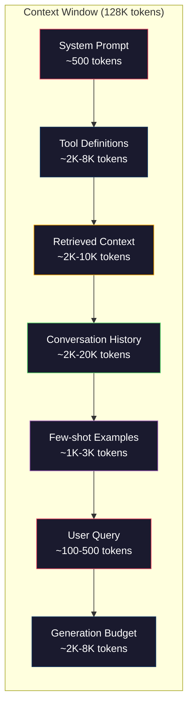
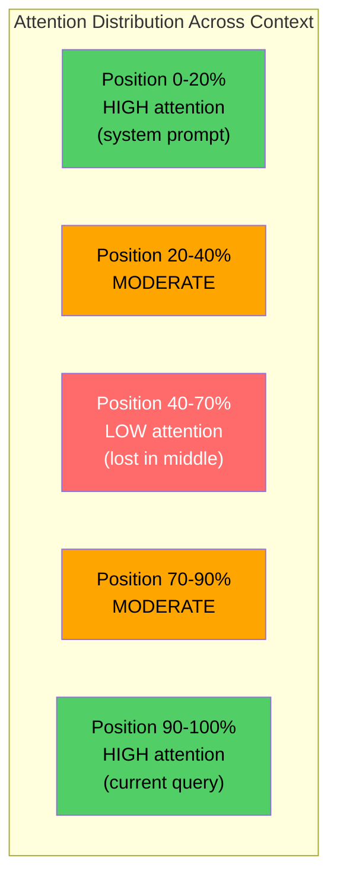
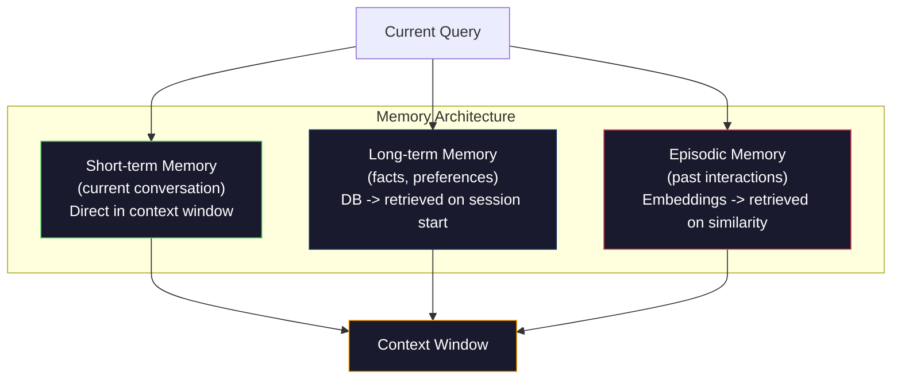

# Kỹ thuật ngữ cảnh: Windows, ngân sách, bộ nhớ và khôi phục.

> Kỹ thuật sao chép là một bộ phụ. Kỹ thuật ngữ cảnh là toàn bộ trò chơi. Một sao chép là một chuỗi bạn gõ. ngữ cảnh là mọi thứ đi vào cửa sổ của mô hình: hướng dẫn hệ thống, tài liệu được lấy lại, định nghĩa công cụ, lịch sử cuộc trò chuyện, vài ví dụ chụp, và tựa lệnh. Các kỹ sư AI tốt nhất vào năm 2026 là kỹ sư ngữ cảnh. Họ quyết định những gì đi vào, những gì không đi, và theo thứ tự nào.

> **【中文解读】**提示工程只是上下文工程的子集──上下文工程管理模型窗口中的一切内容系统指令、检查文档、工具定义、对话历史等──2026年最优秀的AI 工程师就是上下文工程师──

> **【拓展：上下文工程→Claude生态】**MCP của Claude bản chất là việc thực hiện các tiêu chuẩn của các công trình dưới đây thông qua mô hình quản lý giao thức thống nhất có thể nhìn thấy các công cụ, tài nguyên và mô hình gợi ý.

>  **【前置】**学本节前请先掌握:(1) Bước 11·01-02(Quốc kỹ thuật、CôT ít chụp);(2) Bước 11·04(Tài đặt) và Bước 11·06(RAG)  hiểu检索如何取文档;(3) token 概念本节重度讨论 token 预算──如果不知道"200K context window" 指什么,先看Bước 10──

**Type:** Build | **类型:** 构建
**Languages:** Python | **语言:** Python
**Prerequisites:** Phase 10 (LLMs from Scratch), Phase 11 Lesson 01-02 | **前置知识:** Phase 10（从零理解 LLM）、Phase 11 Lesson 01-02
**Time:** ~90 minutes | **时间:** ~90 分钟
**Related:**Giai đoạn 11 · 15 (Caching nhanh)  bố cục thân thiện với cache là một phần mở rộng của kỹ thuật ngữ. Giai đoạn 5 · 28 (Việc đánh giá ngữ cảnh dài) cho cách đo lường mất ở giữa với NIAH / RULER. ➡**相关:**Giai đoạn 11 · 15(提示缓存) 缓存友好布局是上下文工程的延伸──Giai đoạn 5 · 28(长上下文评估)介绍如何使用NIAH/RULER 测量"中间丢失"──

## Mục tiêu học tập

- Xét ngân sách token trên tất cả các thành phần cửa sổ ngữ cảnh (sản ứng hệ thống, công cụ, lịch sử, tài liệu thu hồi, phòng đầu thế hệ)
  跨所有上下文窗口组件(系统提示、工具、历史、检索文档、生成余量) tính toán token 预算
- Thực hiện các chiến lược quản lý cửa sổ ngữ cảnh: cắt ngắn, tóm tắt và trượt cửa sổ cho lịch sử cuộc trò chuyện
  实现上下文窗口管理策略:截断、摘要、滑动窗口管理对话历史
- Tự ưu tiên và sắp xếp các thành phần ngữ cảnh để tối đa hóa sự chú ý của mô hình về thông tin có liên quan nhất
  按优先排序上下文组件, tối đa hóa mô hình để chú ý đến thông tin liên quan nhất
- Xây dựng bộ sưu tập ngữ cảnh phân bổ mã thông báo động dựa trên loại truy vấn và không gian cửa sổ có sẵn
   cấu trúc dựa trên loại truy vấn và sẵn cửa sổ không gian động phân phối token của trên

> **【中文解读】**Mục tiêu của bài học: vượt qua Kỹ thuật nhanh chóng, hệ thống hóa quản lý vào mô hình trên tất cả các thông tin trên bên dưới.


## Vấn đề  vấn đề giới thiệu

Claude Opus 4.7 có một cửa sổ mã thông báo 200K (1M trong beta). GPT-5 có 400K. Gemini 3 Pro có 2M. Llama 4 tuyên bố 10M. Những con số này nghe có vẻ rất lớn cho đến khi bạn điền chúng.

> Claude Opus 4.7 có 200K token  cửa sổ(beta  phiên bản 1M) ――GPT-5 có 400K。Gemini 3 Pro có 2M。 Những con số này nghe có vẻ rất lớn, cho đến khi bạn điền vào chúng。

Đây là một phân tích thực sự cho một trợ lý lập trình. System prompt: 500 token. Định nghĩa công cụ cho 50 công cụ: 8.000 token. Tài liệu được lấy lại: 4.000 token. Lịch sử trò chuyện (10 lượt): 6.000 token. truy vấn người dùng hiện tại: 200 token. Ngân sách thế hệ (tổng sản xuất tối đa): 4.000 token. Tổng cộng: 22.700 token. Đó chỉ là 18% của một cửa sổ 128K.

> Đây là một phần mềm hỗ trợ lập trình thực sự phân tích. Hệ thống提示:500 token──50 个工具定义:8,000 token──检索文档:4,000 token──对话历史(10轮):6,000 token──当前查询:200 token──生成预算:4,000 token──总计:22,700 token──这只占 128K 窗口的18%──

>  **【类比】**上下文窗口像书桌面面200K token 听起来很大,但放上"教科书(系统提示) "+"参考书(恢复 doc) "+"草稿纸(历史) "+"计算器(工具) "就快满了。**Lost in the Middle**现象像寻找东西: khi đặt đầy thứ trên bàn, dễ bị bỏ qua nhất là giữa những thứ đang xếp đọng. Bạn chỉ chú ý đến phần mở của bàn.

> ️ **【易错点】**上下文管理的 3 个坑:(1) **历史无限增长**对话越长历史 越大,最终撞窗口;修复:用总结(每轮压缩成摘要) 或滑窗(只保留近期 K 轮 + 第一轮) 』2) **工具定义重复发送** mỗi lần调用都把 50 个工具方案 全发一遍;修复:用快速缓存(Phase 11·15),Claude / OpenAI 都支持,省 90% chi phí。(3) **检索文档全塞**召回50 个块 全塞 prompt 模型迷失;修复:top-5 高质量块 + mã hóa chéo 重排。

Nhưng sự chú ý không phải là quy mô tuyến tính với chiều dài của ngữ cảnh. Một mô hình với 128K token của ngữ cảnh trả chi phí chú ý vuông (O(n^2) trong các biến thể vanilla, mặc dù hầu hết các mô hình sản xuất sử dụng các biến thể chú ý hiệu quả). Quan trọng hơn, độ chính xác của việc lấy lại sẽ suy giảm. Thử nghiệm "Tháp trong một đống lầy" cho thấy các mô hình gặp khó khăn để tìm thấy thông tin được đặt giữa các bối cảnh dài. Nghiên cứu của Liu et al. (2023) cho thấy LLM thu thập thông tin ở đầu và cuối các bối cảnh dài với độ chính xác gần như hoàn hảo, nhưng độ chính xác giảm 10-20% đối với thông tin được đặt ở giữa (nơi 40-70% của bối cảnh). Hiệu ứng "lạc trong giữa" này khác nhau theo mô hình nhưng ảnh hưởng đến tất cả các kiến trúc hiện tại.

> Nhưng sự chú ý sẽ không theo chiều dài đường trên văn bản dưới đây mở rộng. Quan trọng hơn, tỷ lệ xác thực tìm kiếm sẽ giảm. Thử nghiệm "lưỡi cáp đại dương" cho thấy, mô hình khó tìm thấy để đặt ở vị trí trung gian của văn bản dưới đây trên văn bản dài.

Bài học thực tế: có 200K token có sẵn không có nghĩa là sử dụng 200K token là hiệu quả. Một bối cảnh token 10K được sắp xếp cẩn thận thường vượt qua bối cảnh token 100K bị ném. Kỹ thuật ngữ ngữ cảnh là kỷ luật tối đa hóa tỷ lệ tín hiệu-giọng trong cửa sổ ngữ cảnh.

>  Thực tế bài học: có 200K token 可用并不意味着使用 200K token 是有效的──精心策划的10K token 上下文通常优于倾倒的100K token 上下文── 上下文工程在上下文窗口内最大化信噪比的学科──

Mỗi token bạn đặt trong cửa sổ sẽ thay thế một token có thể mang lại thông tin có liên quan hơn. Mỗi định nghĩa công cụ không liên quan, mỗi vòng trò chuyện lỗi thời, mỗi đoạn văn được lấy lại không trả lời câu hỏi - mỗi một làm cho mô hình trở nên tồi tệ hơn một chút trong nhiệm vụ.

> Mỗi token bạn đặt vào cửa sổ đều chiếm một token có thể mang lại thông tin liên quan hơn. Mỗi công cụ không liên quan được định nghĩa. Mỗi vòng trò chuyện qua thời gian. Mỗi khối không trả lời được kiểm tra.

## Khái niệm cốt lõi

> **【中文解读】**上下文工程(Context Engineering) là khái niệm về kỹ thuật nhanh hơn  không chỉ viết nhanh, mà là hệ thống hóa quản lý tất cả thông tin vào cửa sổ dưới mô hình: kiểm tra kết quả, lịch sử cuộc hội thoại, công cụ ra ngoài, chỉ thị hệ thống, vv.

> **【拓展：上下文窗口的有效利用】**GPT-4o có 128K token trên cửa sổ văn bản, nhưng nghiên cứu cho thấy mô hình đối với thông tin vị trí trung gian" chú ý giảm" (trong phần trung gian) ◊ trên văn bản kế hoạch bao gồm: thông tin quan trọng được đặt vào đầu hoặc cuối, theo kết quả tìm kiếm theo thứ tự liên quan, sử dụng RAG                                                                                                                                                                                                                                                                                                                                                                                                                                                 


### Chiếc cửa sổ ngữ cảnh là một nguồn tài nguyên hiếm

Hãy nghĩ về cửa sổ ngữ cảnh như RAM, không phải đĩa. Nó nhanh chóng và trực tiếp truy cập, nhưng hạn chế. Bạn không thể chứa tất cả mọi thứ. Bạn phải chọn.

> Hãy nghĩ ra cửa sổ trên là RAM, không phải đĩa đĩa.



Mỗi thành phần cạnh tranh về không gian. Thêm nhiều định nghĩa công cụ có nghĩa là ít không gian cho lịch sử cuộc trò chuyện. Thêm nhiều bối cảnh được lấy lại có nghĩa là ít không gian cho vài ví dụ. Kỹ thuật ngữ ngữ cảnh là nghệ thuật phân bổ ngân sách này để tối đa hóa hiệu suất nhiệm vụ.

> Mỗi bộ phận tranh giành không gian. Ước tính hơn được định nghĩa là không gian lịch sử đối thoại ít hơn. Ước tính hơn được định nghĩa là không gian thí dụ ít hơn.

### - Đúng rồi.

Kết quả thực nghiệm quan trọng nhất trong kỹ thuật ngữ cảnh. Các mô hình chăm sóc tốt hơn cho thông tin ở đầu và cuối của ngữ cảnh. Thông tin ở giữa nhận được điểm chú ý thấp hơn và có nhiều khả năng bị bỏ qua.

> Các thực tế quan trọng nhất trong công trình trên là tìm thấy. mô hình tập trung vào các thông tin bắt đầu và kết thúc của các bản trên tốt hơn.

Liu et al. (2023) đã kiểm tra hệ thống này. Họ đặt một tài liệu liên quan giữa 20 tài liệu không liên quan ở các vị trí khác nhau và đo độ chính xác câu trả lời. Khi tài liệu liên quan là đầu tiên hoặc cuối cùng, độ chính xác là 85-90%. Khi nó ở giữa ( vị trí 10 của 20), độ chính xác giảm xuống 60-70%.

> Liu 等人(2023) đã thử nghiệm hệ thống hiện tượng này. Họ đặt các tài liệu liên quan vào 20 vị trí khác nhau trong các tài liệu không liên quan, đo lường tỷ lệ xác thực của câu trả lời.

Điều này có những ý nghĩa kỹ thuật trực tiếp:

> Có ý nghĩa kỹ thuật trực tiếp:

- Đặt thông tin quan trọng nhất trước (đơn giản hệ thống, hướng dẫn quan trọng)
  将最重要信息放最前面 (đưa ra các thông tin quan trọng nhất)
- Đặt truy vấn hiện tại và ngữ cảnh phù hợp nhất cuối cùng (các định tính gần đây giúp)
  Để xem xét các câu hỏi hiện tại và liên quan nhất trên các bài viết sau để cuối cùng
- Chống lại giữa bối cảnh như là vùng ưu tiên thấp nhất
  将上下文中视为最低优先级区域
- Nếu bạn phải đưa thông tin vào giữa, hãy lặp lại điểm chính ở cuối
  Nếu phải đặt thông tin giữa, hãy kết thúc lại



### Các thành phần ngữ cảnh

**System prompt**Claude Code sử dụng khoảng 6.000 token cho hệ thống nhắc nhở của mình bao gồm các định nghĩa công cụ và hướng dẫn hành vi. Giữ nó chặt chẽ. Mỗi từ trong hệ thống nhắc nhở được lặp lại trên mỗi cuộc gọi API.

> **系统提示**: thiết lập persona、约束和行为规则──放最前面且跨轮次保持不变──Claude Code 的系统提示约6,000 token,包含工具定义和行为指令──保持紧──系统提示中的每个词在每次 API调用中重复──

**Tool definitions**mỗi công cụ thêm 50-200 token (tên, mô tả, quy trình tham số). 50 tool ở 150 token mỗi công cụ là 7.500 token trước khi bất kỳ cuộc trò chuyện nào xảy ra.

> **工具定义**: mỗi công cụ 50-200 token (tên, mô tả, tham số) ⋅ 50 个工具 mỗi 150 token, tức 7.500 token đã được sử dụng trước khi cuộc trò chuyện bắt đầu ⋅ động thái lựa chọn công cụ ⋅ chỉ chứa các công cụ liên quan đến truy vấn hiện tại ⋅ có thể giảm 60-80% ⋅

**Retrieved context**: tài liệu từ cơ sở dữ liệu vector, kết quả tìm kiếm, nội dung tệp. Chất lượng tìm kiếm trực tiếp quyết định chất lượng phản ứng. Tìm kiếm xấu là tồi tệ hơn không tìm kiếm - nó lấp đầy cửa sổ với tiếng ồn và tích cực sai lầm mô hình.

> **检索上下文**Từ: từ các tài liệu từ kho dữ liệu khối lượng, tìm kiếm kết quả, nội dung tài liệu, kiểm tra chất lượng trực tiếp quyết định đáp ứng chất lượng, kiểm tra xấu hơn không kiểm tra tồi hơn, nó sử dụng tiếng ồn để lấp đầy cửa sổ và chủ động dẫn dắt mô hình.

**Conversation history**: mỗi tin nhắn người dùng trước đó và phản ứng trợ lý. tăng thẳng theo chiều dài cuộc trò chuyện. Một cuộc trò chuyện 50 lượt với 200 token mỗi lượt là 10.000 token lịch sử. Phần lớn nó không liên quan đến truy vấn hiện tại.

> **对话历史**Tất cả các thông tin và ứng dụng của người dùng trước đây.

**Few-shot examples**Các ví dụ được chọn tốt thường cải thiện chất lượng đầu ra hơn hàng ngàn token hướng dẫn. Nhưng chúng tốn không gian.

> **少样本示例**Các ví dụ về các hành vi nhập/ ra ngoài được chọn kỹ lưỡng thường có thể nâng cao chất lượng sản xuất hơn so với hàng ngàn token.

**Generation budget**Nếu bạn lấp đầy cửa sổ đến dung lượng, mô hình không có chỗ để trả lời.

> **生成预算**:为模型响应保留的代币――若将窗口填满,模型没有空间回答――至少保留 2,000-4,000代币 用于生成――

### Chiến lược nén ngữ cảnh

**History summarization**: thay vì giữ tất cả các lượt trước đó theo nghĩa đen, thường xuyên tóm tắt cuộc trò chuyện. "Chúng tôi đã thảo luận X, quyết định Y, và người dùng muốn Z" trong 100 token thay thế 10 lượt mà đã mất 2.000 token.

> **历史摘要**Và không từng chữ giữ lại tất cả các lần trước, thường xuyên kết thúc cuộc trò chuyện. Chúng tôi đã thảo luận về X, quyết định Y, người dùng muốn Z với 100 token thay thế 10 轮 2.000 token.

**Relevance filtering**: đánh giá mỗi tài liệu được lấy lại so với truy vấn hiện tại và thả tài liệu dưới ngưỡng. Nếu bạn đã lấy 10 mảnh nhưng chỉ có 3 phần liên quan, hãy loại bỏ phần còn lại 7. Tốt hơn là có 3 phần có liên quan cao hơn là 10 phần trung bình.

> **相关性过滤**Các bài kiểm tra sẽ được phân tích với các bài kiểm tra hiện tại, bỏ rơi dưới giá trị của . Nếu đã tìm kiếm 10 khối nhưng chỉ có 3 liên quan, bỏ rơi 7 khối liên quan cao hơn 10 khối thông thường.

**Tool pruning**: phân loại ý định truy vấn của người dùng và chỉ bao gồm các công cụ có liên quan đến ý định đó. Một câu hỏi mã không cần các công cụ lịch. Một câu hỏi lập lịch không cần các công cụ hệ thống tệp. Điều này có thể giảm định nghĩa công cụ từ 8.000 token xuống còn 1.000.

> **工具裁剪**: phân loại ý định truy vấn người dùng, chỉ chứa các công cụ liên quan đến ý định này.

**Recursive summarization**: trong các tài liệu rất dài, tóm tắt theo từng giai đoạn. Đầu tiên tóm tắt từng phần, sau đó tóm tắt các bản tóm tắt.

> **递归摘要**:对超长文档,分阶段总结――先总结每节,再总结摘要――50页文档变成500 token的摘要,捕获关键点――

### Hệ thống bộ nhớ

Kỹ thuật ngữ cảnh bao gồm ba chân trời thời gian.

> 上下文工程跨越三个时间尺度――

**Short-term memory**: cuộc trò chuyện hiện tại. được lưu trữ trực tiếp trong cửa sổ ngữ cảnh. phát triển với mỗi lượt. Quản lý bằng cách tóm tắt và cắt ngắn.

> **短期记忆**:当前对话──直接存储在上下文窗口──随着每轮增长──通过摘要和截断管理──

**Long-term memory**"Người dùng thích TypeScript. " " Dự án sử dụng PostgreSQL. " Cung trữ trong một cơ sở dữ liệu, được lấy lại khi bắt đầu phiên. Claude Code lưu trữ điều này trong các tệp CLAUDE.md. ChatGPT lưu trữ nó trong tính năng bộ nhớ của nó.

> **长期记忆**:跨对话持久的事实和偏好──"user prefer TypeScript──""项目使用PostgreSQL──"存储在数据库中,会话开始时检索──Claude Code 存在CLAUDE.md 文件──ChatGPT 存在其内存功能──

**Episodic memory**: tương tác trong quá khứ cụ thể có thể có liên quan. "Tuesday trước, chúng tôi đã gỡ lỗi một vấn đề tương tự trong module auth". Cung cấp như nhúng, lấy lại khi cuộc trò chuyện hiện tại phù hợp với một tập trước.

> **情景记忆**Có thể liên quan đến các vấn đề tương tự trong quá khứ.



### Phong trào kết nối động lực

Thông tin quan trọng: các truy vấn khác nhau cần bối cảnh khác nhau. Một hệ thống tĩnh prompt + công cụ tĩnh + lịch sử tĩnh là lãng phí. Các hệ thống tốt nhất động cơ tập hợp bối cảnh cho mỗi truy vấn.

> 关键洞察: khác nhau yêu cầu khác nhau trên 下文──静态系统提示 + 静态工具 + 静态历史是浪费──最好的系统按查询动态组装上下文──

1. Đánh phân mục ý định truy vấn
                                                                                                                                                                                                                                                                 
2. Chọn các công cụ liên quan (không phải tất cả các công cụ)
   选择相关工具(不是全部工具)
3. Thu thập các tài liệu liên quan (không phải một bộ cố định)
   检索相关文档(不是固定集合)
4. Bao gồm các lượt lịch sử liên quan (không phải tất cả lịch sử)
   包含相关历史轮次(不是全部历史)
5. Thêm một vài hình ảnh ví dụ phù hợp với loại nhiệm vụ
   + Ví dụ mẫu nhỏ phù hợp với loại nhiệm vụ
6. Đặt mọi thứ theo tầm quan trọng: quan trọng trước, quan trọng sau, tùy chọn ở giữa
   按重要性排序:关键在前,重要在后,可选在中间

Đây là điều phân biệt một ứng dụng AI tốt với một ứng dụng AI tuyệt vời. mô hình là giống nhau.

> Đây là sự khác biệt giữa ứng dụng AI và ứng dụng AI vượt trội.

## Hãy xây dựng nó.
```figure
lost-in-the-middle
```

## Hãy xây dựng nó

### Bước 1: Đếm mã thông báo

Bạn không thể lập ngân sách những gì bạn không thể đo lường. Xây dựng một con số token đơn giản (sự gần gũi bằng cách sử dụng phân chia không gian trắng, vì số lượng chính xác phụ thuộc vào tokeniser).

> Bạn không thể làm ngân sách cho những thứ không thể đo lường.

```python
import json
import numpy as np
from collections import OrderedDict

def count_tokens(text):
    if not text:
        return 0
    return int(len(text.split()) * 1.3)

def count_tokens_json(obj):
    return count_tokens(json.dumps(obj))
```

### Bước 2: Quản lý ngân sách ngữ cảnh

Một nhà quản lý ngân sách theo dõi số lượng token mỗi thành phần sử dụng và thực thi giới hạn.

> 核心抽象──预算管理器 theo dõi từng thành phần sử dụng bao nhiêu mã thông báo 并强限制制──

```python
class ContextBudget:
    def __init__(self, max_tokens=128000, generation_reserve=4000):
        self.max_tokens = max_tokens
        self.generation_reserve = generation_reserve
        self.available = max_tokens - generation_reserve
        self.allocations = OrderedDict()

    def allocate(self, component, content, max_tokens=None):
        tokens = count_tokens(content)
        if max_tokens and tokens > max_tokens:
            words = content.split()
            target_words = int(max_tokens / 1.3)
            content = " ".join(words[:target_words])
            tokens = count_tokens(content)

        used = sum(self.allocations.values())
        if used + tokens > self.available:
            allowed = self.available - used
            if allowed <= 0:
                return None, 0
            words = content.split()
            target_words = int(allowed / 1.3)
            content = " ".join(words[:target_words])
            tokens = count_tokens(content)

        self.allocations[component] = tokens
        return content, tokens

    def remaining(self):
        used = sum(self.allocations.values())
        return self.available - used

    def utilization(self):
        used = sum(self.allocations.values())
        return used / self.max_tokens

    def report(self):
        total_used = sum(self.allocations.values())
        lines = []
        lines.append(f"Context Budget Report ({self.max_tokens:,} token window)")
        lines.append("-" * 50)
        for component, tokens in self.allocations.items():
            pct = tokens / self.max_tokens * 100
            bar = "#" * int(pct / 2)
            lines.append(f"  {component:<25} {tokens:>6} tokens ({pct:>5.1f}%) {bar}")
        lines.append("-" * 50)
        lines.append(f"  {'Used':<25} {total_used:>6} tokens ({total_used/self.max_tokens*100:.1f}%)")
        lines.append(f"  {'Generation reserve':<25} {self.generation_reserve:>6} tokens")
        lines.append(f"  {'Remaining':<25} {self.remaining():>6} tokens")
        return "\n".join(lines)
```

### Bước 3: Việc sắp xếp lại trong thời gian trung gian

Thực hiện chiến lược sắp xếp lại: các mục quan trọng nhất đi trước và cuối cùng, ít quan trọng nhất đi giữa.

> 实现重排策略: quan trọng nhất nhất nhất nhất nhất nhất nhất nhất nhất nhất nhất nhất nhất nhất nhất nhất nhất nhất nhất nhất nhất nhất nhất nhất nhất nhất nhất nhất nhất

```python
def reorder_lost_in_middle(items, scores):
    paired = sorted(zip(scores, items), reverse=True)
    sorted_items = [item for _, item in paired]

    if len(sorted_items) <= 2:
        return sorted_items

    first_half = sorted_items[::2]
    second_half = sorted_items[1::2]
    second_half.reverse()

    return first_half + second_half

def score_relevance(query, documents):
    query_words = set(query.lower().split())
    scores = []
    for doc in documents:
        doc_words = set(doc.lower().split())
        if not query_words:
            scores.append(0.0)
            continue
        overlap = len(query_words & doc_words) / len(query_words)
        scores.append(round(overlap, 3))
    return scores
```

### Bước 4: Bộ nén lịch sử cuộc trò chuyện

Kết luận về cuộc trò chuyện cũ quay lại để đòi lại ngân sách token.

> Tổng kết cuộc hội thoại 

```python
class ConversationManager:
    def __init__(self, max_history_tokens=5000):
        self.turns = []
        self.summaries = []
        self.max_history_tokens = max_history_tokens

    def add_turn(self, role, content):
        self.turns.append({"role": role, "content": content})
        self._compress_if_needed()

    def _compress_if_needed(self):
        total = sum(count_tokens(t["content"]) for t in self.turns)
        if total <= self.max_history_tokens:
            return

        while total > self.max_history_tokens and len(self.turns) > 4:
            old_turns = self.turns[:2]
            summary = self._summarize_turns(old_turns)
            self.summaries.append(summary)
            self.turns = self.turns[2:]
            total = sum(count_tokens(t["content"]) for t in self.turns)

    def _summarize_turns(self, turns):
        parts = []
        for t in turns:
            content = t["content"]
            if len(content) > 100:
                content = content[:100] + "..."
            parts.append(f"{t['role']}: {content}")
        return "Previous: " + " | ".join(parts)

    def get_context(self):
        parts = []
        if self.summaries:
            parts.append("[Conversation Summary]")
            for s in self.summaries:
                parts.append(s)
        parts.append("[Recent Conversation]")
        for t in self.turns:
            parts.append(f"{t['role']}: {t['content']}")
        return "\n".join(parts)

    def token_count(self):
        return count_tokens(self.get_context())
```

### Bước 5: Chọn công cụ động

Chỉ bao gồm các công cụ liên quan đến truy vấn hiện tại. Đặt mục đích, sau đó lọc.

> Chỉ chứa các công cụ liên quan đến các truy vấn hiện tại.

```python
TOOL_REGISTRY = {
    "read_file": {
        "description": "Read contents of a file",
        "tokens": 120,
        "categories": ["code", "files"],
    },
    "write_file": {
        "description": "Write content to a file",
        "tokens": 150,
        "categories": ["code", "files"],
    },
    "search_code": {
        "description": "Search for patterns in codebase",
        "tokens": 130,
        "categories": ["code"],
    },
    "run_command": {
        "description": "Execute a shell command",
        "tokens": 140,
        "categories": ["code", "system"],
    },
    "create_calendar_event": {
        "description": "Create a new calendar event",
        "tokens": 180,
        "categories": ["calendar"],
    },
    "list_emails": {
        "description": "List recent emails",
        "tokens": 160,
        "categories": ["email"],
    },
    "send_email": {
        "description": "Send an email message",
        "tokens": 200,
        "categories": ["email"],
    },
    "web_search": {
        "description": "Search the web for information",
        "tokens": 140,
        "categories": ["research"],
    },
    "query_database": {
        "description": "Run a SQL query on the database",
        "tokens": 170,
        "categories": ["code", "data"],
    },
    "generate_chart": {
        "description": "Generate a chart from data",
        "tokens": 190,
        "categories": ["data", "visualization"],
    },
}

def classify_intent(query):
    query_lower = query.lower()

    intent_keywords = {
        "code": ["code", "function", "bug", "error", "file", "implement", "refactor", "debug", "test"],
        "calendar": ["meeting", "schedule", "calendar", "appointment", "event"],
        "email": ["email", "mail", "send", "inbox", "message"],
        "research": ["search", "find", "what is", "how does", "explain", "look up"],
        "data": ["data", "query", "database", "chart", "graph", "analytics", "sql"],
    }

    scores = {}
    for intent, keywords in intent_keywords.items():
        score = sum(1 for kw in keywords if kw in query_lower)
        if score > 0:
            scores[intent] = score

    if not scores:
        return ["code"]

    max_score = max(scores.values())
    return [intent for intent, score in scores.items() if score >= max_score * 0.5]

def select_tools(query, token_budget=2000):
    intents = classify_intent(query)
    relevant = {}
    total_tokens = 0

    for name, tool in TOOL_REGISTRY.items():
        if any(cat in intents for cat in tool["categories"]):
            if total_tokens + tool["tokens"] <= token_budget:
                relevant[name] = tool
                total_tokens += tool["tokens"]

    return relevant, total_tokens
```

### Bước 6: Đường ống tổng hợp hoàn chỉnh

Kết nối tất cả mọi thứ với nhau. Với một truy vấn, động lực tập hợp bối cảnh tối ưu.

> Đặt tất cả lên. Đặt câu hỏi, động thái, thiết lập tốt nhất.

```python
class ContextEngine:
    def __init__(self, max_tokens=128000, generation_reserve=4000):
        self.budget = ContextBudget(max_tokens, generation_reserve)
        self.conversation = ConversationManager(max_history_tokens=5000)
        self.system_prompt = (
            "You are a helpful AI assistant. You have access to tools for "
            "code editing, file management, web search, and data analysis. "
            "Use the appropriate tools for each task. Be concise and accurate."
        )
        self.knowledge_base = [
            "Python 3.12 introduced type parameter syntax for generic classes using bracket notation.",
            "The project uses PostgreSQL 16 with pgvector for embedding storage.",
            "Authentication is handled by Supabase Auth with JWT tokens.",
            "The frontend is built with Next.js 15 using the App Router.",
            "API rate limits are set to 100 requests per minute per user.",
            "The deployment pipeline uses GitHub Actions with Docker multi-stage builds.",
            "Test coverage must be above 80% for all new modules.",
            "The codebase follows the repository pattern for data access.",
        ]

    def assemble(self, query):
        self.budget = ContextBudget(self.budget.max_tokens, self.budget.generation_reserve)

        system_content, _ = self.budget.allocate("system_prompt", self.system_prompt, max_tokens=1000)

        tools, tool_tokens = select_tools(query, token_budget=2000)
        tool_text = json.dumps(list(tools.keys()))
        tool_content, _ = self.budget.allocate("tools", tool_text, max_tokens=2000)

        relevance = score_relevance(query, self.knowledge_base)
        threshold = 0.1
        relevant_docs = [
            doc for doc, score in zip(self.knowledge_base, relevance)
            if score >= threshold
        ]

        if relevant_docs:
            doc_scores = [s for s in relevance if s >= threshold]
            reordered = reorder_lost_in_middle(relevant_docs, doc_scores)
            doc_text = "\n".join(reordered)
            doc_content, _ = self.budget.allocate("retrieved_context", doc_text, max_tokens=3000)

        history_text = self.conversation.get_context()
        if history_text.strip():
            history_content, _ = self.budget.allocate("conversation_history", history_text, max_tokens=5000)

        query_content, _ = self.budget.allocate("user_query", query, max_tokens=500)

        return self.budget

    def chat(self, query):
        self.conversation.add_turn("user", query)
        budget = self.assemble(query)
        response = f"[Response to: {query[:50]}...]"
        self.conversation.add_turn("assistant", response)
        return budget


def run_demo():
    print("=" * 60)
    print("  Context Engineering Pipeline Demo")
    print("=" * 60)

    engine = ContextEngine(max_tokens=128000, generation_reserve=4000)

    print("\n--- Query 1: Code task ---")
    budget = engine.chat("Fix the bug in the authentication module where JWT tokens expire too early")
    print(budget.report())

    print("\n--- Query 2: Research task ---")
    budget = engine.chat("What is the best approach for implementing vector search in PostgreSQL?")
    print(budget.report())

    print("\n--- Query 3: After conversation history builds up ---")
    for i in range(8):
        engine.conversation.add_turn("user", f"Follow-up question number {i+1} about the implementation details of the system")
        engine.conversation.add_turn("assistant", f"Here is the response to follow-up {i+1} with technical details about the architecture")

    budget = engine.chat("Now implement the changes we discussed")
    print(budget.report())

    print("\n--- Tool Selection Examples ---")
    test_queries = [
        "Fix the bug in auth.py",
        "Schedule a meeting with the team for Tuesday",
        "Show me the database query performance stats",
        "Search for best practices on error handling",
    ]

    for q in test_queries:
        tools, tokens = select_tools(q)
        intents = classify_intent(q)
        print(f"\n  Query: {q}")
        print(f"  Intents: {intents}")
        print(f"  Tools: {list(tools.keys())} ({tokens} tokens)")

    print("\n--- Lost-in-the-Middle Reordering ---")
    docs = ["Doc A (most relevant)", "Doc B (somewhat relevant)", "Doc C (least relevant)",
            "Doc D (relevant)", "Doc E (moderately relevant)"]
    scores = [0.95, 0.60, 0.20, 0.80, 0.50]
    reordered = reorder_lost_in_middle(docs, scores)
    print(f"  Original order: {docs}")
    print(f"  Scores:         {scores}")
    print(f"  Reordered:      {reordered}")
    print(f"  (Most relevant at start and end, least relevant in middle)")
```

## Hãy sử dụng nó để thực hiện

### Khối cảnh được quản lý

Claude Code quản lý bối cảnh với một cách tiếp cận lớp. Cấp dẫn hệ thống bao gồm các quy tắc hành vi và định nghĩa công cụ (~ 6K token). Khi bạn mở một tệp, nội dung của nó được tiêm vào như bối cảnh. Khi bạn tìm kiếm, kết quả được thêm vào. Chuyển đổi cuộc trò chuyện cũ được tóm tắt. CLAUDE.md cung cấp bộ nhớ lâu dài tồn tại qua các phiên.

> Claude Code dùng các phương pháp phân cấp quản lý trên 下文──系统提示包含行为规则和工具定义(约6K token)──打开文件时其内容注入上下文──搜索时结果被添加──旧对话轮次被摘要──CLAUDE.md 提供跨会话持久化的长期记忆──

Quyết định kỹ thuật chính: Claude Code không thả toàn bộ cơ sở mã của bạn vào ngữ cảnh. Nó lấy lại các tệp liên quan khi yêu cầu. Đây là kỹ thuật ngữ cảnh trong thực tế.

> 关键工程决策:Claude Code không đưa toàn bộ bộ bộ thư viện mã hóa vào các văn bản dưới đây.

### Loading Context Dynamic của Cursor
### Loading Dynamic Context

Cursor chỉ mục toàn bộ cơ sở mã của bạn thành các bản nhúng. Khi bạn gõ truy vấn, nó lấy các tệp và khối mã có liên quan nhất bằng cách sử dụng sự tương đồng vector. Chỉ những phần đó đi vào cửa sổ ngữ cảnh.

> Cursor sẽ đặt toàn bộ chỉ mục kho báu mã vào trong. Khi nhập truy vấn, sử dụng khối lượng tương tự để tìm các tài liệu và khối mã liên quan nhất. Chỉ có những đoạn này vào cửa sổ trên dưới.

Đây là mô hình: nhúng tất cả mọi thứ, lấy lại theo yêu cầu, chỉ bao gồm những gì quan trọng.

> Đó là mô hình: đặt tất cả, theo yêu cầu kiểm tra, chỉ chứa quan trọng.

### Chú ý ChatGPT
### Giúp ký ức lâu dài

ChatGPT lưu trữ sở thích và dữ liệu của người dùng như là bộ nhớ dài hạn. Vào mỗi cuộc trò chuyện bắt đầu, các ký ức liên quan được lấy lại và đưa vào lời nhắc hệ thống. "Người dùng thích Python" tốn 5 token nhưng lưu lại hàng trăm token của các hướng dẫn lặp lại trong các cuộc trò chuyện.

> ChatGPT sẽ lưu trữ sở thích và thực tế của người dùng cho thời gian dài. Mỗi lần bắt đầu cuộc trò chuyện, các bộ nhớ liên quan được tìm kiếm và chứa trong các gợi ý hệ thống.

### RAG như Kỹ thuật ngữ ngữ cảnh

Phục hồi-Tăng thế hệ là kỹ thuật ngữ được chính thức hóa. Thay vì điền kiến thức vào trọng lượng của mô hình (trình huấn luyện) hoặc hệ thống nhắc (tương ngữ tĩnh), bạn lấy lại các tài liệu liên quan vào thời điểm truy vấn và tiêm chúng vào cửa sổ ngữ cảnh. Toàn bộ đường ống RAG -- chia nhỏ, nhúng, lấy lại, xếp hạng lại -- tồn tại để giải quyết một vấn đề: đưa thông tin đúng trong cửa sổ ngữ cảnh.

> 检索增强生成是上下文工程的形式化──不把知识塞进模型权重 (训练) 或系统提示 (提示) ),而在查询时检索相关文档并注入上下文窗口──整个RAG管线分块、嵌入、检索、重排存在就是为了解决一个问题:把正确信息放入上下文窗口──

## Chuyển nó đi.

Bài học này sẽ mang lại kết quả `outputs/prompt-context-optimizer.md`-- một lời nhắc tái sử dụng kiểm tra một chiến lược tập hợp ngữ cảnh và đề nghị tối ưu hóa. Đưa nó cho hệ thống của bạn lời nhắc, số công cụ, chiều dài lịch sử trung bình, và chiến lược lấy lại, và nó xác định lãng phí token và đề xuất cải tiến.

> 本课产 出 `outputs/prompt-context-optimizer.md` kiểm toán trên  quy hoạch thiết kế và đề xuất các gợi ý có thể sử dụng được để tối ưu hóa.

Nó cũng sản xuất `outputs/skill-context-engineering.md`-- một khung quyết định để thiết kế các đường ống tập hợp ngữ cảnh dựa trên loại nhiệm vụ, kích thước cửa sổ ngữ cảnh và ngân sách thời gian trễ.

> Đồng thời sản xuất`outputs/skill-context-engineering.md` dựa trên loại nhiệm vụ, khung quyết định của cửa sổ quy mô và chậm dự án thiết kế quy mô quy mô quy mô quy mô quy mô quy mô quy mô quy mô quy mô quy mô quy mô quy mô quy mô quy mô quy mô quy mô quy mô quy mô quy mô quy mô quy mô quy mô quy mô quy mô quy mô quy mô quy mô quy mô quy mô quy mô quy mô quy mô quy mô quy mô quy mô quy mô quy mô quy mô quy mô quy mô quy mô quy mô quy mô quy mô quy mô quy mô quy mô quy mô quy mô quy mô quy mô quy mô quy mô quy mô quy mô quy mô quy mô quy mô quy mô quy mô quy mô quy mô quy mô quy mô quy mô quy mô quy mô quy mô quy mô quy mô quy mô quy mô quy mô quy mô quy mô quy mô quy mô quy mô quy mô quy mô quy mô quy mô quy mô quy mô quy mô quy mô quy mô quy mô quy mô quy mô quy mô quy mô quy mô quy mô quy mô quy mô quy mô quy mô quy mô quy mô quy mô quy mô quy mô quy mô quy mô quy mô quy mô quy mô quy mô quy mô quy mô quy mô quy mô quy mô quy mô quy mô quy mô quy mô quy mô quy mô quy mô quy mô quy mô quy mô quy mô quy mô quy mô quy mô quy mô quy mô quy mô quy mô quy quy quy quy quy quy quy quy quy quy quy quy quy quy quy quy quy quy quy quy quy quy quy quy quy quy quy quy quy quy quy quy quy quy quy quy quy quy quy quy quy quy quy quy quy quy quy quy quy quy quy quy quy quy quy quy quy quy quy quy quy quy quy quy quy quy quy quy quy quy quy quy quy quy quy quy quy quy quy quy quy quy quy quy quy quy quy quy quy quy quy quy quy quy quy quy quy quy quy quy quy quy quy quy quy quy quy quy quy quy quy quy quy quy quy quy quy quy quy quy quy quy quy quy quy quy quy quy quy quy quy quy quy quy quy quy quy quy quy quy quy quy quy quy quy quy quy quy quy quy quy quy quy quy quy quy quy quy quy quy quy quy quy quy quy quy quy quy quy quy quy quy quy quy quy quy quy quy quy quy quy quy quy quy quy quy quy quy quy quy quy quy quy quy quy quy quy quy quy quy quy quy quy quy quy quy quy quy quy quy quy quy quy quy quy quy quy quy quy quy quy quy quy quy

## Tập luyện bài tập

1. Thêm một "chứng nhận chất thải token" vào lớp ContextBudget. Nó nên đánh dấu các thành phần sử dụng hơn 30% ngân sách và đề xuất các chiến lược nén đặc biệt cho từng loại thành phần (chổn lại lịch sử, công cụ cắt tỉa, xếp hạng lại tài liệu).
   给 ContextBudget 添加"token 浪费检测器"──应标记使用超过30% 预算组件,并建议针对每个组件类型的压缩策略 (摘要历史,剪裁工具,重排文档) ‖

2. Thực hiện tính toán trừ bản ngữ học cho bối cảnh được lấy lại. Nếu hai tài liệu được lấy lại giống nhau hơn 80% (bằng cách trùng lặp từ hoặc tương đồng cosine của nhúng của chúng), chỉ giữ cho một điểm cao hơn. Đo mức ngân sách token nào mà nó phục hồi.
   实现检索上下文的语义去重──若两个检索文档超过80%相似之处,只保留分数更高的──测量它收回了多少代币 预算──

3. Xây dựng một công cụ "việc tái phát ngữ cảnh". Với bản sao của một cuộc trò chuyện, hãy tái phát nó thông qua ContextEngine và xem hình ảnh cách phân bổ ngân sách thay đổi theo lượt.
   构建"上下文回放"工具──给定对话转录,通过 ContextEngine 回放并可视化预算分配如何轮次变化──绘制每个组件随时间的符号──识别上下文开始被压缩的轮次──

4. Thực hiện một lựa chọn công cụ dựa trên ưu tiên. Thay vì chọn nhị phân bao gồm/ loại trừ, chỉ định cho mỗi công cụ một điểm liên quan đến truy vấn hiện tại. Bao gồm các công cụ theo thứ tự liên quan giảm cho đến khi ngân sách công cụ được sử dụng hết. So sánh hiệu suất nhiệm vụ với 5, 10, 20 và 50 công cụ bao gồm.
   Thực hiện dựa trên các ưu tiên lựa chọn công cụ không phải là bao gồm / loại trừ, mà cho mỗi công cụ liên quan đến các truy vấn hiện tại đánh phân.

5. Xây dựng một máy nén bối cảnh đa chiến lược. Thực hiện ba chiến lược nén (các đoạn, tổng hợp, trích xuất các câu khóa) và đánh giá chúng trên một tập hợp 20 tài liệu. đo lường sự thỏa hiệp giữa tỷ lệ nén và lưu giữ thông tin (có phiên bản nén vẫn chứa câu trả lời cho câu hỏi?).
   构建多策略上下文压缩机. 实现三种压缩策略 (三种压缩策略) 截断,摘要,关键句提取), trong 20 tập tài liệu trên基准测试.

## Từ khóa  Từ khóa nhanh chóng

| Term | What people say | What it actually means | 中文释义 |
|------|----------------|----------------------|---------|
| Context window | "How much the model can read" | The maximum number of tokens (input + output) the model processes in a single forward pass -- 400K for GPT-5, 200K (1M beta) for Claude Opus 4.7, 2M for Gemini 3 Pro | 上下文窗口：模型单次前向传播处理的最大 token 数（输入+输出）|
| Context engineering | "Advanced prompt engineering" | The discipline of deciding what goes into the context window, in what order, and at what priority -- encompasses retrieval, compression, tool selection, and memory management | 上下文工程：决定什么进入上下文窗口、什么顺序、什么优先级的学科——包含检索、压缩、工具选择、记忆管理 |
| Lost-in-the-middle | "Models forget stuff in the middle" | Empirical finding that LLMs attend better to the beginning and end of context, with 10-20% accuracy drop for information placed in the middle | 中间丢失：LLM 对上下文开头和结尾注意力更好的实证发现；中间位置准确率下降 10-20% |
| Token budget | "How many tokens you have left" | An explicit allocation of context window capacity across components (system prompt, tools, history, retrieval, generation) with per-component limits | token 预算：跨组件的上下文窗口容量显式分配（系统提示、工具、历史、检索、生成）带每组件限制 |
| Dynamic context | "Loading stuff on the fly" | Assembling the context window differently for each query based on intent classification, relevant tool selection, and retrieval results | 动态上下文：基于意图分类、相关工具选择和检索结果，为每个查询不同地组装上下文窗口 |
| History summarization | "Compressing the conversation" | Replacing verbatim old conversation turns with a concise summary, reducing token cost while preserving key information | 历史摘要：用简洁摘要替代逐字旧对话轮次，减少 token 成本同时保留关键信息 |
| Tool pruning | "Only including relevant tools" | Classifying query intent and only including tool definitions that match, reducing tool token cost by 60-80% | 工具裁剪：分类查询意图只包含匹配的工具定义，减少工具 token 成本 60-80% |
| Long-term memory | "Remembering across sessions" | Facts and preferences stored in a database and retrieved at session start -- CLAUDE.md, ChatGPT Memory, and similar systems | 长期记忆：跨会话存储在数据库并在会话开始时检索的事实和偏好——CLAUDE.md、ChatGPT Memory 等 |
| Episodic memory | "Remembering specific past events" | Past interactions stored as embeddings and retrieved when the current query is similar to a past conversation | 情景记忆：作为嵌入存储的过去交互，当前查询相似时检索 |
| Generation budget | "Room for the answer" | Tokens reserved for the model's output -- if the context fills the window completely, the model has no room to respond | 生成预算：为模型输出保留的 token——若上下文填满窗口，模型没有空间响应 |

## Xem thêm 延伸阅读

- [Liu et al., 2023 -- "Lost in the Middle: How Language Models Use Long Contexts"](https://arxiv.org/abs/2307.03172)-- nghiên cứu cuối cùng về sự chú ý phụ thuộc vào vị trí, cho thấy rằng các mô hình đấu tranh với thông tin giữa các bối cảnh dài
  Liu 等, "Lost in the Middle" (Lát mất ở giữa)  vị trí liên quan đến nghiên cứu quyền lực của sự chú ý, cho thấy mô hình khó xử lý长上下文中间的信息
- [Anthropic's Contextual Retrieval blog post](https://www.anthropic.com/news/contextual-retrieval)-- cách Anthropic tiếp cận lấy lại các phần có ý thức về bối cảnh, giảm thất bại trong việc lấy lại 49%
  Anthropic 上下文检索博客Anthropic  làm thế nào để xử lý trên 下文感知分块检索, sẽ tìm kiếm thất bại giảm 49%
- [Simon Willison's "Context Engineering"](https://simonwillison.net/2025/Jun/27/context-engineering/)-- bài đăng trên blog đặt tên cho ngành và phân biệt nó với kỹ thuật nhanh chóng
  "Kỹ thuật ngữ ngữ cảnh" của Simon Willison được đặt tên cho ngành này và phân biệt nó với các bài viết về kỹ thuật gợi ý
- [LangChain documentation on RAG](https://python.langchain.com/docs/tutorials/rag/)-- thực tế thực hiện các phát triển tăng cường thu hồi như một mô hình kỹ thuật ngữ
  LangChain RAG 文档 sẽ tìm kiếm tăng cường tạo ra như là thực tế thực hiện của mô hình công trình trên
- [Greg Kamradt's Needle in a Haystack test](https://github.com/gkamradt/LLMTest_NeedleInAHaystack)-- chỉ số chuẩn cho thấy các thất bại tìm kiếm phụ thuộc vào vị trí trên tất cả các mô hình chính
  Greg Kamradt's Đại biển捞针测试 tiết lộ tất cả các mô hình chính vị trí liên quan kiểm tra thất bại
- [Pope et al., "Efficiently Scaling Transformer Inference" (2022)](https://arxiv.org/abs/2211.05102)-- tại sao chiều dài ngữ cảnh thúc đẩy bộ nhớ và độ trễ, và cách KV cache, MQA, và GQA thay đổi tính toán ngân sách.
  Pope 等, "Scaling Transformer Inference" (Tỷ lệ quy mô hiệu quả) (2022) 为何上下文长度驱动内存和延迟, cũng như KV cache, MQA, GQA 如何改变预算计算.
- [Agrawal et al., "SARATHI: Efficient LLM Inference by Piggybacking Decodes with Chunked Prefills" (2023)](https://arxiv.org/abs/2308.16369)-- hai giai đoạn suy luận làm cho các lời nhắc dài tốn kém trong TTFT nhưng rẻ trong TPOT; sự thật căn bản đằng sau các thỏa thuận đóng gói bối cảnh.
  Agrawal 等, "SARATHI" (tiếng Anh: Agrawal 等, "SARATHI" (tiếng Anh: SARATHI) 推理两阶段使长提示在 TTFT 上昂贵但 TPOT 上便宜;上下文打包权衡背后的真相──
- [Ainslie et al., "GQA: Training Generalized Multi-Query Transformer Models from Multi-Head Checkpoints" (EMNLP 2023)](https://arxiv.org/abs/2305.13245)- giấy tập hợp để tìm kiếm sự chú ý mà cắt bộ nhớ KV 8x trong máy giải mã sản xuất mà không mất chất lượng.
  Ainslie 等, "GQA" ((EMNLP 2023) 分组查询注意力论文, trong sản xuất giải mã máy trong KV trong lưu trữ giảm 8 lần và không có chất lượng mất.
