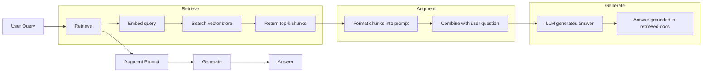
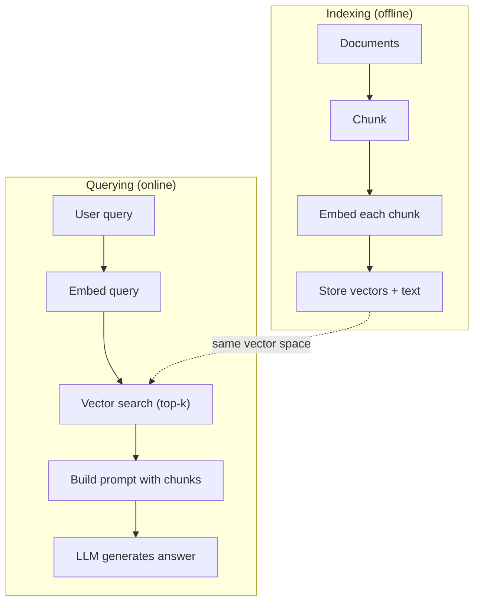

# RAG (Retrieval-Augmented Generation) 检索增强生成

> LLM của bạn biết mọi thứ cho đến thời gian đào tạo của mình. Nó không biết gì về tài liệu của công ty của bạn, cơ sở mã của bạn, hoặc ghi chú cuộc họp tuần trước. RAG giải quyết điều này bằng cách lấy tài liệu liên quan và lấp vào lời nhắc. Đó là mô hình được triển khai nhiều nhất trong AI sản xuất. Nếu bạn xây dựng một thứ từ khóa học này, xây dựng một đường ống dẫn RAG.

> **【中文解读】**LLM chỉ biết được thông tin trước ngày học. RAG  thông qua kiểm tra tài liệu liên quan và đưa ra các gợi ý để khắc phục sự thiếu sót kiến thức. Đây là mô hình AI rộng rãi nhất trong môi trường sản xuất.

> **【拓展：RAG→企业AI应用】**RAG là chương trình đầu tiên của AI trong doanh nghiệp: kiến thức, câu hỏi, kiểm tra hợp đồng, trợ lý tài liệu kỹ thuật, phân tích báo cáo tài chính, và các tình huống khác đều phụ thuộc vào đường ống RAG.

>  **【前置】**学本节前请先掌握:(1) Giai đoạn 11·04(Tập nhập) 理解向量空间、相似度、HNSW;(2) Giai đoạn 05·23(Chunking Strategies) 理解文档切分;(3) Giai đoạn 10(LLM từ đầu) 理解快速 如何影响生成──本节会用到 `chromadb`Hoặc`faiss``langchain`Hoặc`llamaindex`

**Type:** Build | **类型:** 构建
**Languages:** Python | **语言:** Python
**Prerequisites:** Phase 10 (LLMs from Scratch), Phase 11 Lessons 01-05 | **前置知识:** Phase 10（从零理解 LLM）、Phase 11 Lesson 01-05
**Time:** ~90 minutes | **时间:** ~90 分钟
**Related:**Giai đoạn 5 · 23 (Chunking Strategies for RAG) cho sáu thuật toán chunking và khi mỗi người thắng. Giai đoạn 5 · 22 (Embedding Models Deep Dive) cho việc chọn người nhúng. Giai đoạn 11 · 07 (Advanced RAG) cho tìm kiếm lai, xếp hạng lại và chuyển đổi truy vấn.**相关:**Giai đoạn 5 · 23(RAG 分块策略)介绍六种分块算法及各自适用场景――Giai đoạn 5 · 22(嵌入模型深度解析)介绍如何选嵌入器――Giai đoạn 11 · 07(高级RAG)介绍混合搜索、重排和查询转换――

## Mục tiêu học tập

- Xây dựng một đường ống RAG hoàn chỉnh: tải tài liệu, phân mảnh, nhúng, lưu trữ vector, lấy lại và tạo
  构建完整RAG管线:文档加载、分块、嵌入、向量存储、检索、生成
- Thực hiện tìm kiếm ngữ nghĩa bằng cách sử dụng cơ sở dữ liệu vector (ChromaDB, FAISS hoặc Pinecone) với lập chỉ mục đúng
  用向量数据库(ChromaDB、FAISS hoặc Pinecone)实现语义搜索并正确索引
- Giải thích lý do tại sao RAG được ưu tiên so với điều chỉnh tinh tế cho các ứng dụng dựa trên kiến thức (chi phí, độ tươi mới, tính thuộc tính)
  解释为什么知识接地应用更偏好RAG而非微调(成本、新鲜度、归因)
- Đánh giá chất lượng RAG bằng cách sử dụng các số liệu thu hồi (sự chính xác, thu hồi) và số liệu sản xuất (sự trung thành, liên quan)
  用检索指标(đúng lượng, nhớ lại)和生成指标(truyền, liên quan) đánh giá RAG 质量

> **【中文解读】**Mục tiêu của bài học này: thực hiện RAG hoàn chỉnh (trong các vấn đề về hiệu quả và khả năng của các chương trình)


## Vấn đề  vấn đề giới thiệu

Bạn xây dựng một chatbot cho công ty của mình. Một khách hàng hỏi "Công lý hoàn trả tiền cho các kế hoạch doanh nghiệp là gì?" LLM trả lời với một câu trả lời chung về các chính sách hoàn trả tiền SaaS điển hình. Chính sách thực tế, được chôn cất trong một wiki nội bộ 200 trang, nói rằng khách hàng doanh nghiệp có cửa sổ 60 ngày với hoàn trả tiền theo tỷ lệ. LLM chưa bao giờ xem tài liệu này. Nó không thể biết nó không được đào tạo về điều gì.

> Bạn xây dựng một chatbot cho công ty. Người dùng hỏi "quản lý hoàn trả của phiên bản doanh nghiệp là gì?" LLM đưa ra câu trả lời chung về chính sách hoàn trả SaaS điển hình. Chính sách thực tế nằm trong wiki nội bộ 200 trang, nói rằng khách hàng doanh nghiệp có 60 khoảng thời gian và trả tiền theo tỷ lệ. LLM chưa từng thấy tài liệu này. Nó không thể biết nó không được đào tạo gì.

Phân chỉnh tinh chỉnh là một giải pháp. Hãy lấy LLM, đào tạo nó trên tài liệu nội bộ của bạn, và triển khai mô hình được cập nhật. Điều này hoạt động nhưng có những vấn đề nghiêm trọng. Phân chỉnh tinh chỉnh tốn hàng ngàn đô la trong tính toán. Mô hình trở nên lỗi thời ngay khi một tài liệu thay đổi. Bạn không có cách nào để biết mô hình được lấy từ nguồn nào. Và nếu công ty mua lại một dòng sản phẩm khác tháng tới, bạn sẽ tinh chỉnh lại.

> 微调 là một giải pháp. Nhưng微调 cần chi phí tính toán hàng ngàn đô la. 文档一变模型已经过时了. Bạn không thể biết mô hình trích dẫn nguồn gốc nào. Nếu công ty mua dòng sản phẩm mới vào tháng tới, bạn cũng sẽ phải tái微调.

RAG là giải pháp khác. Để mẫu không bị ảnh hưởng. Khi một câu hỏi xuất hiện, hãy tìm kiếm các đoạn văn liên quan trong kho lưu trữ tài liệu của bạn, dán chúng vào thư nhắc trước câu hỏi, và để mô hình trả lời bằng cách sử dụng các đoạn văn đó như bối cảnh. Kho lưu trữ tài liệu có thể được cập nhật trong vài phút. Bạn có thể thấy chính xác những tài liệu nào đã được lấy lại. Bản thân mô hình không bao giờ thay đổi. Đó là lý do tại sao RAG là mô hình thống trị trong sản xuất: nó rẻ hơn, tươi hơn, kiểm toán hơn, và hoạt động với bất kỳ LLM nào.

> RAG là một giải pháp khác. Khi vấn đề đến, hãy tìm kiếm kho lưu trữ tài liệu của bạn để tìm thấy các đoạn liên quan, dán chúng vào mặt trước của câu hỏi trong lời khuyên, để mô hình sử dụng những đoạn này như trên dưới để trả lời.

>  **【类比】**RAG 像开卷考试:学生(LLM) không cần phải bỏ tất cả các bài học đằng sau để theo dõi (fine-tuning), mà là mang một cuốn sổ tay (笔记本) vào phòng.

## Khái niệm cốt lõi

> **【中文解读】**RAG(Tái phát-Tăng thế hệ, tìm kiếm tăng cường tạo ra) sẽ kết hợp các thư viện kiến thức bên ngoài với LLM: người dùng hỏi từ các tài liệu liên quan đến kiểm tra cơ sở dữ liệu khối lượng đến sẽ nhập kết quả kiểm tra nhanh chóng đến LLM dựa trên kết quả kiểm tra tạo ra câu trả lời.

> **【拓展：RAG 的生产实践】**典型RAG管线:文档切分(chunking) đến嵌入生成到向量存储(Pinecone/Weaviate/Chroma) đến相似度检索到重排序(rạng xếp) đến注入提示──LlamaIndex 和 LangChain là phổ biến nhất RAG 框架──Meta nghiên cứu cho thấy RAG trong các nhiệm vụ chuyên sâu kiến thức sẽ tăng tỷ lệ xác thực từ 30-50%──


### Mô hình RAG

Toàn bộ mô hình phù hợp với bốn bước:

> Cả mô hình là:



Query -> Retrieve -> Augment prompt -> Generate. Mỗi hệ thống RAG theo mô hình này. Sự khác biệt giữa các hệ thống RAG sản xuất nằm trong chi tiết của mỗi bước: cách bạn phân chia, cách bạn nhúng, cách bạn tìm kiếm và cách bạn xây dựng prompt.

> 查询 -> 检索 -> 增强提示 -> 生成──每个RAG 系统都遵循这个模式──生产RAG 系统的差异在每个步骤的细节:如何分块──如何嵌入──如何搜索──如何构建提示──

> 🤔 **【困惑】**Q: Tại sao không trực tiếp đưa toàn bộ tài liệu vào ngay lập tức? Bây giờ Claude có 200K trên cửa sổ văn bản dưới,装得下吧? A: 三个原因:(1) **精度下降** nghiên cứu cho thấy( như Lost in the Middle, Liu et al. 2023), LLM 在长上下文中召回中间内容的能力显著下降,超过32K 后准确率掉20%+;(2) **成本爆炸**200K token 输入约 $3/查询，而 RAG 检索 top-5 块只占 2K tokens（$0.03);(3) **响应慢**长 prompt 推理延迟数倍于短 prompt。RAG 用精准检索换全量加载。

### Tại sao RAG không thích nghi với việc điều chỉnh tốt

| Concern | Fine-tuning | RAG |
|---------|------------|-----|
| Cost / 成本 | $1,000-$100,000+ per training run / 每训练 1K-100K+ 美元 | $0.01-$0.10 per query (embedding + LLM) / 每查询 0.01-0.10 美元 |
| Freshness / 新鲜度 | Stale until retrained / 重训前都过时 | Updated in minutes by re-indexing docs / 重新索引文档即可在几分钟内更新 |
| Auditability / 可审计性 | Cannot trace answer to source / 无法追溯答案来源 | Can show exact retrieved passages / 可显示精确检索段落 |
| Hallucination / 幻觉 | Still hallucinates freely / 仍自由幻觉 | Grounded in retrieved documents / 基于检索文档接地 |
| Data privacy / 数据隐私 | Training data baked into weights / 训练数据固化在权重中 | Documents stay in your vector store / 文档留在你的向量存储中 |

Định chỉnh tinh chỉnh thay đổi cân nặng của mô hình vĩnh viễn. RAG thay đổi bối cảnh của mô hình tạm thời. Đối với hầu hết các ứng dụng, bối cảnh tạm thời là điều bạn muốn.

> 微调永久改变模型权重──RAG 临时改变模型上下文── đối với hầu hết các ứng dụng,临时上下文就是你要的──

Một trường hợp khi điều chỉnh tinh tế thắng: khi bạn cần mô hình để áp dụng một phong cách, giọng nói hoặc mô hình lý luận cụ thể mà không thể đạt được bằng cách chỉ đơn thuần thôi thúc.

> 微调胜出的唯一情况: Khi bạn cần mô hình sử dụng phong cách, ngữ cảnh hoặc mô hình suy luận cụ thể, thì nó chỉ là chỉ bằng lời khuyên không thể đạt được.

> ️ **【易错点】**RAG 落地 3 个常见坑: ((1) **切分粒度错误**块太大(> 1024 token)嵌入被稀释召回不到,块太小(< 64 token)丢失上下文;起点:256-512 token + 50 重叠──(2) **没做 query 改写** người dùng hỏi" nó được sử dụng như thế nào?" chỉ dẫn不明,向量库找不到;修复:先用 LLM 把问题改写成包含上下文的完整查询――(3) **只看召回率不看准确率**top-10 召回 90% nhưng chỉ có 3 条 liên quan, mô hình bị nhiễu loạn; thêm mã hóa chéo 重排到 top-3 高质量块──

### Đưa vào mô hình

Một mô hình nhúng chuyển đổi văn bản thành một vector dày đặc. Các văn bản tương tự tạo ra các vector gần nhau trong không gian chiều cao này. "Tôi đặt lại mật khẩu của tôi như thế nào?" và "Tôi cần thay đổi mật khẩu của tôi" tạo ra các vector gần giống nhau mặc dù chia sẻ một vài từ. "Căn nuôi ngồi trên thảm" tạo ra một vector rất khác nhau.

> 嵌入模型将文本转换为密向量──类似文本在这个高维空间中产生距离接近的向量──"how to reset password?"和"I need to modify password"尽管共享单词不多,但产生几乎相同的向量──"cat sitting on 子"产生截然不同的向量──

Các mô hình nhúng chung (2026 lineup  xem giai đoạn 5 · 22 để phân tích đầy đủ):

> 常见嵌入模型(2026 年阵容完整分析见阶段 5 · 22):

| Model | Dimensions | Provider | Notes |
|-------|-----------|----------|-------|
| text-embedding-3-small | 1536 (Matryoshka) | OpenAI | Best price/performance for most use cases / 大多数场景最佳性价比 |
| text-embedding-3-large | 3072 (Matryoshka) | OpenAI | Higher accuracy, truncatable to 256/512/1024 / 更高精度，可截断到 256/512/1024 |
| Gemini Embedding 2 | 3072 (Matryoshka) | Google | Top MTEB retrieval; 8K context / 顶级 MTEB 检索；8K 上下文 |
| voyage-4 | 1024/2048 (Matryoshka) | Voyage AI | Domain variants (code, finance, law) / 领域变体（代码、金融、法律）|
| Cohere embed-v4 | 1024 (Matryoshka) | Cohere | Strong multilingual, 128K context / 强多语言，128K 上下文 |
| BGE-M3 | 1024 (dense + sparse + ColBERT) | BAAI (open-weight) | Three views from one model / 一个模型三种视图 |
| Qwen3-Embedding | 4096 (Matryoshka) | Alibaba (open-weight) | Top open-weight retrieval score / 顶级开源权重检索分数 |
| all-MiniLM-L6-v2 | 384 | Open-weight (Sentence Transformers) | Prototyping baseline / 原型基线 |

Đối với bài học này, chúng tôi xây dựng bản nhúng đơn giản của riêng mình bằng cách sử dụng TF-IDF. Không phải vì TF-IDF là những gì hệ thống sản xuất sử dụng, nhưng bởi vì nó làm cho khái niệm cụ thể: văn bản đi vào, một vector ra ngoài, các văn bản tương tự tạo ra các vector tương tự.

> Trong bài học này chúng tôi sử dụng TF-IDF để xây dựng các bản đặt đơn giản của mình không phải vì TF-IDF là hệ thống sản xuất, mà vì nó làm cho khái niệm cụ thể hóa: văn bản vào, văn bản ra, văn bản tương tự tạo ra các mô hình tương tự.

### Sự tương đồng vector

Với hai vector, bạn đo lường sự tương đồng như thế nào?

> 给定两个向量,如何衡量相似度?

**Cosine similarity**: cosine của góc giữa hai vector. dao động từ -1 (đối diện) đến 1 (tương tự).

> **余弦相似度**: 2向量角的余弦──范围 -1(相反) đến 1(相同)──忽略幅度, chỉ关心方向──这是RAG's默认选择──

```
cosine_sim(a, b) = dot(a, b) / (||a|| * ||b||)
```

**Dot product**: sản phẩm nội bộ thô. Các vector lớn hơn có điểm cao hơn. hữu ích khi độ lớn mang thông tin (các tài liệu dài hơn có thể có liên quan hơn).

> **点积**:原始内积──较大向量更高分──幅度携带信息时有用(较长文档可能更相关)。

```
dot(a, b) = sum(a_i * b_i)
```

**L2 (Euclidean) distance**: đường thẳng trong không gian vector. khoảng cách nhỏ hơn = tương tự hơn. Nhận thức về sự khác biệt độ lớn.

> **L2（欧氏）距离**: đường thẳng trong không gian khối lượng.

```
L2(a, b) = sqrt(sum((a_i - b_i)^2))
```

Sự tương đồng cosine là tiêu chuẩn. nó xử lý các tài liệu có chiều dài khác nhau một cách đẹp đẽ bởi vì nó bình thường hóa theo quy mô. Khi ai đó nói "sự tìm kiếm vector", họ gần như luôn có nghĩa là sự tương đồng cosine.

> 余弦相似度 là tiêu chuẩn. Nó rất tốt khi xử lý các tài liệu dài khác nhau, vì nó được kết hợp theo chiều dài. Khi người ta nói "sự tìm kiếm khối lượng", hầu như luôn chỉ ra 余弦相似度.

### Các chiến lược làm cho các mảnh vỡ

Các tài liệu quá dài để nhúng thành một khối vector. Một PDF 50 trang có thể tạo ra một nhúng khủng khiếp vì nó chứa hàng chục chủ đề. Thay vào đó, bạn chia các tài liệu thành các mảnh và nhúng từng mảnh riêng biệt.

> 文档太长,无法作为单向量嵌入──50页 PDF có thể tạo ra một sự嵌入 tồi tệ, bởi vì nó chứa một vài mươi chủ đề──相反, bạn sẽ phân chia tài liệu thành từng khối, từng khối, từng khối──

**Fixed-size chunking**: chia tất cả các token N. đơn giản và có thể dự đoán được. Một phần 512 token với 50 token chồng chéo có nghĩa là phần 1 là token 0-511, phần 2 là token 462-973, v.v. Sự chồng chéo đảm bảo bạn không chia một câu ở một ranh giới không may mắn.

> **固定大小分块**Mỗi N token  phân chia một lần 简单可预测。 512 token 块加 50 token 重叠 nghĩa là khối 1 là token 0-511, khối 2 là token 462-973, tùy thuộc vào loại này 推──重叠 đảm bảo bạn sẽ không ở trong biên giới của bất hạnh运分句子。

**Semantic chunking**: chia ở các ranh giới tự nhiên. Các đoạn văn, phần, hoặc tiêu đề đánh dấu xuống. Mỗi phần là một đơn vị có ý nghĩa liên kết.

> **语义分块**Trong bản chất, các phân đoạn được phân chia trong các phân đoạn tự nhiên.

**Recursive chunking**: cố gắng chia ở ranh giới lớn nhất trước (tên phần). Nếu một phần vẫn quá lớn, chia ở ranh giới đoạn. Nếu một đoạn văn vẫn quá lớn, chia ở ranh giới câu. Đây là cách tiếp cận LangChain RecursiveCharacterTextSplitter và nó hoạt động tốt trong thực tế.

> **递归分块**Trước tiên ở biên giới lớn nhất (→ 文章标题) chia rẽ.若节仍太大,在段落边界拆分.若段落仍太大,在句子边界拆分.

Kích thước của mảnh phụ quan trọng hơn mọi người nghĩ:

> 块大小 quan trọng hơn những gì mọi người nghĩ:

- Quá nhỏ (64-128 token): mỗi phần thiếu ngữ cảnh. "Nó tăng 15% quý trước" không có nghĩa là gì mà không biết "nó" đề cập đến gì.
  太小(64-128 token): mỗi khối thiếu trên 下文──"上季度增长 15%"在不知道"它"指代什么时无意义──
- quá lớn (2048 + token): mỗi phần bao gồm nhiều chủ đề, làm suy giảm sự liên quan. Khi bạn tìm kiếm dữ liệu doanh thu, bạn nhận được một phần là 10% về doanh thu và 90% về nhân viên.
  太大(2048+ token): mỗi khối bao gồm nhiều chủ đề, sự liên quan hiếm, và trong khi tìm kiếm dữ liệu doanh thu, bạn có được 10% về doanh thu 90% về khối người.
- Sweet spot (256-512 token): đủ bối cảnh để tự chủ, tập trung đủ để có liên quan.
  Điểm tốt nhất: Đơn vị: Đủ tự chứa đựng trên, đủ tập trung để liên quan.

Hầu hết các hệ thống RAG sản xuất sử dụng 256-512 token với 50 token chồng chéo.

> 大多数生产 RAG 系统使用 256-512 token 块加 50 token 重叠──Anthropic 的 RAG 指南推这个范围──

### Các cơ sở dữ liệu vector

Một khi bạn có nội dung, bạn cần một nơi để lưu trữ và tìm kiếm chúng.

> Một khi có được nhúng, bạn cần một nơi lưu trữ và tìm kiếm chúng.

| Database | Type | Best for |
|----------|------|----------|
| FAISS | Library (in-process) / 库（进程内）| Prototyping, small to medium datasets / 原型、中小数据集 |
| Chroma | Lightweight DB / 轻量 DB | Local development, small deployments / 本地开发、小型部署 |
| Pinecone | Managed service / 托管服务 | Production without ops overhead / 无运维开销的生产 |
| Weaviate | Open source DB / 开源 DB | Self-hosted production / 自托管生产 |
| pgvector | Postgres extension / Postgres 扩展 | Already using Postgres / 已在用 Postgres |
| Qdrant | Open source DB / 开源 DB | High-performance self-hosted / 高性能自托管 |

Đối với bài học này, chúng tôi xây dựng một kho lưu trữ vector đơn giản trong bộ nhớ. Nó lưu trữ vector trong một danh sách và thực hiện tìm kiếm tương tự cosine bằng lực thô. Điều này tương đương với FAISS với chỉ số phẳng. Nó mở rộng lên khoảng 100.000 vector trước khi chậm. Hệ thống sản xuất sử dụng thuật toán hàng xóm gần nhất (ANN) như HNSW để tìm kiếm hàng triệu vector trong millisecond.

> Trong bài học này chúng tôi xây dựng một bộ lưu trữ khối lượng trong bộ nhớ đơn giản. Nó sẽ lưu trữ khối lượng trong danh sách và tìm kiếm sự tương tự của các dây viêm.

### Lối ống dẫn đầy đủ



Các trình indexing được thực hiện một lần cho mỗi tài liệu (hoặc khi các tài liệu cập nhật).

> 索引阶段每个文档运行一次 (或文档更新时) ◊ 查询阶段每个用户请求运行一次―― 在生产中,索引可能数小时处理百万文档――查询必须在1秒内响应――

### Số thực

Hầu hết các hệ thống RAG sản xuất sử dụng các tham số này:

> Hầu hết các hệ thống RAG được sản xuất bằng các yếu tố sau:

- **k = 5 to 10**lấy các khối trên mỗi truy vấn
  Mỗi lần hỏi hỏi, 5 - 10 khối.
- **Chunk size = 256 to 512 tokens**với 50 token chồng chéo
  块大小 256-512 token cộng 50 token 重叠
- **Context budget**: 2,500-5,000 token nội dung được lấy lại mỗi truy vấn
  上下文预算: mỗi truy vấn 2.500-5.000 token  kiểm tra nội dung
- **Total prompt**: ~ 8.000-16.000 token (sự nhắc hệ thống + các đoạn thu hồi + lịch sử cuộc trò chuyện + truy vấn người dùng)
  总提示: khoảng 8.000-16.000 token(系统提示 + 检索块 + 对话历史 + 用户查询)
- **Embedding dimension**: 384-3072 tùy thuộc vào mô hình
  嵌入维度:384-3072  tùy thuộc vào mô hình
- **Indexing throughput**: 100-1,000 tài liệu mỗi giây với API nhúng
  索引吞吐量: sử dụng API 嵌入 mỗi giây 100-1,000 文档
- **Query latency**: 50-200ms cho việc lấy lại, 500-3000ms cho việc tạo ra
  查询延迟:检索 50-200ms, tạo ra 500-3000ms

## Hãy xây dựng nó.
```figure
rag-chunking
```

## Hãy xây dựng nó

### Bước 1: Chunking tài liệu

```python
def chunk_text(text, chunk_size=200, overlap=50):
    words = text.split()
    chunks = []
    start = 0
    while start < len(words):
        end = start + chunk_size
        chunk = " ".join(words[start:end])
        chunks.append(chunk)
        start += chunk_size - overlap
    return chunks
```

### Bước 2: Nhập TF-IDF

Chúng tôi xây dựng một chức năng nhúng đơn giản. TF-IDF (Term Frequency-Inverse Document Frequency) không phải là một nhúng thần kinh, nhưng nó chuyển đổi văn bản thành các vector theo cách nắm bắt tầm quan trọng của từ. Các từ thường xuyên trong một tài liệu có được TF cao hơn. Các từ hiếm trên cơ thể có được IDF cao hơn. Sản phẩm cung cấp một vector nơi các từ quan trọng, đặc biệt có giá trị cao.

> Chúng ta xây dựng các hàm nhúng đơn giản. TF-IDF (trong tiếng Anh: TF-IDF) không phải là một hàm nhúng thần kinh, nhưng nó sẽ chuyển văn bản thành một khối lượng theo cách nắm bắt các từ quan trọng.

> 🤔 **【困惑】**Q: Học tập tại sao sử dụng TF-IDF thay vì thực tế nhúng vào trong thần kinh như OpenAI văn bản-trúng vào-3)?**零依赖**本节使用纯Python 标准库教学,不要求你注册 API或下模型;(2) **可读**TF-IDF của toán học đơn giản đến có thể viết trên bảng đen nhìn hiểu, thần kinh được nhúng vào hộp đen;(3) **教学聚焦**本节核心是 RAG 流程(chunk→embed→retrieve→prompt→generate),嵌入器换掉流程不变──**生产环境务必换神经嵌入**TF-IDF không hiểu ngữ义, "付款失败" và "扣款不成功" trong TF-IDF 下 hoàn toàn không phù hợp, nhưng các hệ thống được đặt trong đó có thể nhận ra chúng có ý nghĩa tương tự.

```python
import math
from collections import Counter

def build_vocabulary(documents):
    vocab = set()
    for doc in documents:
        vocab.update(doc.lower().split())
    return sorted(vocab)

def compute_tf(text, vocab):
    words = text.lower().split()
    count = Counter(words)
    total = len(words)
    return [count.get(word, 0) / total for word in vocab]

def compute_idf(documents, vocab):
    n = len(documents)
    idf = []
    for word in vocab:
        doc_count = sum(1 for doc in documents if word in doc.lower().split())
        idf.append(math.log((n + 1) / (doc_count + 1)) + 1)
    return idf

def tfidf_embed(text, vocab, idf):
    tf = compute_tf(text, vocab)
    return [t * i for t, i in zip(tf, idf)]
```

### Bước 3: Tìm kiếm sự tương đồng cosine

```python
def cosine_similarity(a, b):
    dot = sum(x * y for x, y in zip(a, b))
    norm_a = math.sqrt(sum(x * x for x in a))
    norm_b = math.sqrt(sum(x * x for x in b))
    if norm_a == 0 or norm_b == 0:
        return 0.0
    return dot / (norm_a * norm_b)

def search(query_embedding, stored_embeddings, top_k=5):
    scores = []
    for i, emb in enumerate(stored_embeddings):
        sim = cosine_similarity(query_embedding, emb)
        scores.append((i, sim))
    scores.sort(key=lambda x: x[1], reverse=True)
    return scores[:top_k]
```

### Bước 4: Xây dựng nhanh chóng

Đây là nơi "đồng cấp" trong RAG xảy ra. Hãy lấy các mảnh thu hồi, định dạng chúng thành một lời nhắc, và yêu cầu LLM trả lời dựa trên bối cảnh được cung cấp.

> Đây là nơi mà " tăng cường " trong RAG xảy ra.

> ️ **【易错点】**Thêm 3 个坑:(1) **没说"基于上下文回答"**模型会调用自己的参数知识回答(产生幻觉),把 "Phản ứng chỉ dựa trên bối cảnh sau" 加到 prompt 最前;(2) **没给"不知道就说不知道"的退路**模型宁可盲编也不承认无能为力,必须显式写 "Nếu bối cảnh không chứa câu trả lời, hãy nói 'Tôi không có đủ thông tin'";(3) **没要求引用来源**                                                                                                                                                                                                                                                              `[Source N]`标记,让用户能点开看原文.

```python
def build_rag_prompt(query, retrieved_chunks):
    context = "\n\n---\n\n".join(
        f"[Source {i+1}]\n{chunk}"
        for i, chunk in enumerate(retrieved_chunks)
    )
    return f"""Answer the question based ONLY on the following context.
If the context doesn't contain enough information, say "I don't have enough information to answer that."

Context:
{context}

Question: {query}

Answer:"""
```

### Bước 5: Đường ống dẫn RAG hoàn chỉnh

```python
class RAGPipeline:
    def __init__(self):
        self.chunks = []
        self.embeddings = []
        self.vocab = []
        self.idf = []

    def index(self, documents):
        all_chunks = []
        for doc in documents:
            all_chunks.extend(chunk_text(doc))
        self.chunks = all_chunks
        self.vocab = build_vocabulary(all_chunks)
        self.idf = compute_idf(all_chunks, self.vocab)
        self.embeddings = [
            tfidf_embed(chunk, self.vocab, self.idf)
            for chunk in all_chunks
        ]

    def query(self, question, top_k=5):
        query_emb = tfidf_embed(question, self.vocab, self.idf)
        results = search(query_emb, self.embeddings, top_k)
        retrieved = [(self.chunks[i], score) for i, score in results]
        prompt = build_rag_prompt(
            question, [chunk for chunk, _ in retrieved]
        )
        return prompt, retrieved
```

### Bước 6: Tạo (được mô phỏng)

Trong sản xuất, đây là nơi bạn gọi là LLM API. cho bài học này, chúng tôi mô phỏng thế hệ bằng cách trích xuất câu có liên quan nhất từ ngữ cảnh được lấy lại.

> 生产中这是你调用 LLM API的地方──本课我们通过从检索上下文中提取最相关句子来模拟生成──

```python
def simple_generate(prompt, retrieved_chunks):
    query_words = set(prompt.lower().split("question:")[-1].split())
    best_sentence = ""
    best_score = 0
    for chunk in retrieved_chunks:
        for sentence in chunk.split("."):
            sentence = sentence.strip()
            if not sentence:
                continue
            words = set(sentence.lower().split())
            overlap = len(query_words & words)
            if overlap > best_score:
                best_score = overlap
                best_sentence = sentence
    return best_sentence if best_sentence else "I don't have enough information."
```

## Hãy sử dụng nó để thực hiện

Với mô hình thực sự nhúng và LLM, mã hầu như không thay đổi:

> Với mô hình thực sự được đặt trong LLM, mã phần mềm gần như không thay đổi:

```python
from openai import OpenAI

client = OpenAI()

def embed(text):
    response = client.embeddings.create(
        model="text-embedding-3-small",
        input=text
    )
    return response.data[0].embedding

def generate(prompt):
    response = client.chat.completions.create(
        model="gpt-4o-mini",
        messages=[{"role": "user", "content": prompt}],
        temperature=0
    )
    return response.choices[0].message.content
```

Hoặc với Anthropic:

> Hoặc sử dụng Anthropic:

```python
import anthropic

client = anthropic.Anthropic()

def generate(prompt):
    response = client.messages.create(
        model="claude-sonnet-5",
        max_tokens=1024,
        messages=[{"role": "user", "content": prompt}]
    )
    return response.content[0].text
```

Các đường ống là giống nhau. Thay đổi chức năng nhúng. Thay đổi chức năng tạo. Lý thuyết lấy lại, chia nhỏ, xây dựng nhanh -- tất cả đều giống nhau bất kể bạn sử dụng mô hình nào.

> 管线相同. 换嵌函数. 换生成函数. 检索逻辑. 分块. 提示构造. 无论用哪些模型都完全相同.

Đối với lưu trữ vector ở quy mô, thay thế tìm kiếm lực thô bằng cơ sở dữ liệu vector thích hợp:

>  Đối với lưu trữ khối lượng lớn, sử dụng cơ sở dữ liệu khối lượng phù hợp để thay thế tìm kiếm bạo lực:

```python
import chromadb

client = chromadb.Client()
collection = client.create_collection("my_docs")

collection.add(
    documents=chunks,
    ids=[f"chunk_{i}" for i in range(len(chunks))]
)

results = collection.query(
    query_texts=["What is the refund policy?"],
    n_results=5
)
```

Chroma xử lý việc nhúng nội bộ (nó sử dụng tất cả MiniLM-L6-v2 theo mặc định) và lưu trữ các vector trong một cơ sở dữ liệu địa phương.

> Chroma 内部处理嵌入式 (默认使用全MiniLM-L6-v2)并将向量存在本地数据库──相同模式,不同管道──

## Chuyển nó đi.

Bài học này mang lại:
- `outputs/prompt-rag-architect.md`-- một lời nhắc để thiết kế các hệ thống RAG cho các trường hợp sử dụng cụ thể
  Để sử dụng cụ thể thiết kế RAG 系统的提示
- `outputs/skill-rag-pipeline.md`-- một kỹ năng dạy cho các đặc vụ cách xây dựng và gỡ lỗi đường ống RAG
  Học cách xây dựng và điều chỉnh kỹ năng của đại lý RAG

## Tập luyện bài tập

1. Thay thế các bản nhúng TF-IDF bằng cách tiếp cận đơn giản của túi từ (tín: 1 nếu từ có, 0 nếu không). So sánh chất lượng tìm kiếm trên các tài liệu mẫu. TF-IDF nên vượt qua bởi vì nó cân nặng từ hiếm hơn.
   用简单词袋方法(二值:词出现为 1,否则为 0) thay thế TF-IDF 嵌入──在样本文档上比较检索质量──TF-IDF 应胜出,因为它给稀有词更高权重──

2. Hãy thử các kích thước phần: thử 50, 100, 200, và 500 từ trên cùng một tập hợp tài liệu. Đối với mỗi kích thước, chạy cùng 5 truy vấn và đếm bao nhiêu trả lại một phần liên quan ở phần đầu-3. Tìm vị trí ngọt ngào nơi chất lượng tìm kiếm đạt đỉnh.
   实验块大小: trên cùng tập tài liệu thử 50、100、200、500 词── mỗi loại hành trình cũng có 5 câu hỏi, thống kê top-3 trả về số lượng các khối liên quan― tìm điểm tốt nhất của điểm đỉnh chất lượng kiểm tra―

3. Thêm metadata vào mỗi phần (tên tài liệu nguồn, vị trí phần). Thay đổi mẫu yêu cầu để bao gồm thuộc tính nguồn để LLM trích dẫn nguồn của nó.
   给每块添加元数据(源文档名、块位置) 修改提示模板包含源归因,让LLM 引用其来源──

4. Thực hiện một đánh giá đơn giản: với 10 cặp câu hỏi-phản ứng, chạy mỗi câu hỏi qua đường ống RAG, và đo lường tỷ lệ phần trăm của các mảnh thu được chứa câu trả lời.
   实现简单评估:给定 10 câu hỏi trả lời, sẽ mỗi câu hỏi thông qua RAG 管线运行, đo kiểm tra khối chứa phần trăm câu trả lời.

5. Xây dựng một đường ống RAG biết chuyện: giữ lịch sử của 3 sàn giao dịch cuối cùng và bao gồm chúng trong thư nhắc bên cạnh các mảnh thu hồi.
   构建对话感知 RAG 管线:维护近期 3次交换历史,与检索块一起包含在提示中.

## Từ khóa  Từ khóa nhanh chóng

| Term | What people say | What it actually means | 中文释义 |
|------|----------------|----------------------|---------|
| RAG | "AI that reads your docs" | Retrieve relevant documents, paste them into the prompt, and generate an answer grounded in those documents | RAG：检索相关文档、粘贴进提示、基于这些文档生成接地答案 |
| Embedding | "Convert text to numbers" | A dense vector representation of text where similar meanings produce similar vectors | 嵌入：文本的稠密向量表示，相似含义产生相似向量 |
| Vector database | "Search engine for AI" | A data store optimized for storing vectors and finding the nearest neighbors by similarity | 向量数据库：为存储向量和按相似度找近邻优化的数据存储 |
| Chunking | "Split docs into pieces" | Breaking documents into smaller segments (typically 256-512 tokens) so each can be embedded and retrieved independently | 分块：将文档拆为更小段（通常 256-512 token）以便独立嵌入和检索 |
| Cosine similarity | "How similar are two vectors" | The cosine of the angle between two vectors; 1 = identical direction, 0 = orthogonal, -1 = opposite | 余弦相似度：两向量夹角余弦；1=同向，0=正交，-1=反向 |
| Top-k retrieval | "Get the k best matches" | Return the k most similar chunks to the query from the vector store | Top-k 检索：从向量存储返回与查询最相似的 k 个块 |
| Context window | "How much text the LLM can see" | The maximum number of tokens the LLM can process in a single request; retrieved chunks must fit within this | 上下文窗口：LLM 单次请求能处理的最大 token 数；检索块必须放得下 |
| Augmented generation | "Answer using given context" | Generating a response using retrieved documents as context rather than relying solely on trained knowledge | 增强生成：用检索文档作为上下文生成响应，而非仅依赖训练知识 |
| TF-IDF | "Word importance scoring" | Term Frequency times Inverse Document Frequency; weights words by how distinctive they are within a corpus | TF-IDF：词频乘逆文档频率；按词在语料库中的独特性加权 |
| Indexing | "Preparing docs for search" | The offline process of chunking, embedding, and storing documents so they can be searched at query time | 索引：分块、嵌入、存储文档的离线过程，以便查询时搜索 |

## Xem thêm 延伸阅读

- Lewis et al., "Tổ thế tăng cường tìm kiếm cho các nhiệm vụ NLP chuyên sâu về kiến thức" (2020) - bài báo RAG ban đầu từ Nghiên cứu AI của Facebook đã chính thức hóa mô hình tìm kiếm sau đó tạo ra
  Lewis 等, "Tái phát-Tăng thế hệ cho các nhiệm vụ NLP chuyên sâu kiến thức" (WEB) Facebook AI Research's original RAG 论文, formalized a first-check and then-generation model
- Tài liệu RAG của Anthropic (docs.anthropic.com) - hướng dẫn thực tế cho kích thước mảnh, xây dựng nhanh chóng và đánh giá
  Anthropic RAG 文档块大小、提示构建和评估的实用指南
- Trung tâm học tập Pinecone, "RAG là gì?" - những lời giải thích trực quan rõ ràng về đường ống dẫn RAG với các cân nhắc sản xuất
  Pinecone Learning Center RAG 管线的清晰可视化解释,含生产考量
- Câu-BERT: Reimers & Gurevych (2019) -- bài báo đằng sau các mô hình nhúng MiniLM, cho thấy cách đào tạo các bộ mã hóa hai cho sự tương đồng ngữ nghĩa
  Câu-BERT: Reimers & Gurevych(2019)all-MiniLM 嵌入模型背后的论文,展示如何为语义相似度训练双编码器
- [Karpukhin et al., "Dense Passage Retrieval for Open-Domain Question Answering" (EMNLP 2020)](https://arxiv.org/abs/2004.04906)- giấy DPR chứng minh việc lấy lại mật độ hai mã hóa vượt qua BM25 trên QA khu vực mở và đặt khuôn mẫu cho các máy lấy lại RAG hiện đại.
  Karpukhin 等, "DPR"(EMNLP 2020)  chứng minh密双编码器检索在开放域 QA 上胜过BM25 的DPR论文,设定了现代RAG 检索器的模式──
- [LlamaIndex High-Level Concepts](https://docs.llamaindex.ai/en/stable/getting_started/concepts.html)-- các khái niệm chính cần biết khi xây dựng đường ống RAG: bộ tải dữ liệu, bộ phân chia nút, chỉ số, máy lấy lại, bộ tổng hợp phản ứng.
  LlamaIndex 高级概念构建RAG 管线需要知的主要概念:数据加载器、节点解析器、索引、检索器、响应合成器──
- [LangChain RAG tutorial](https://python.langchain.com/docs/tutorials/rag/)- trình tạo nhạc cụ hương vị ngược lại; chuỗi các runnable xem cùng một mô hình lấy lại sau đó tạo ra.
  LangChain RAG 教程不同风味的编排器;同一先检索后生成模式的可运行链视图──
