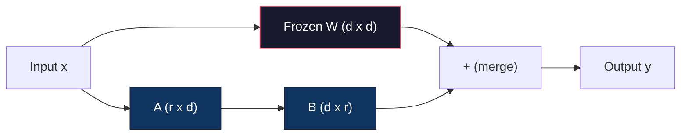
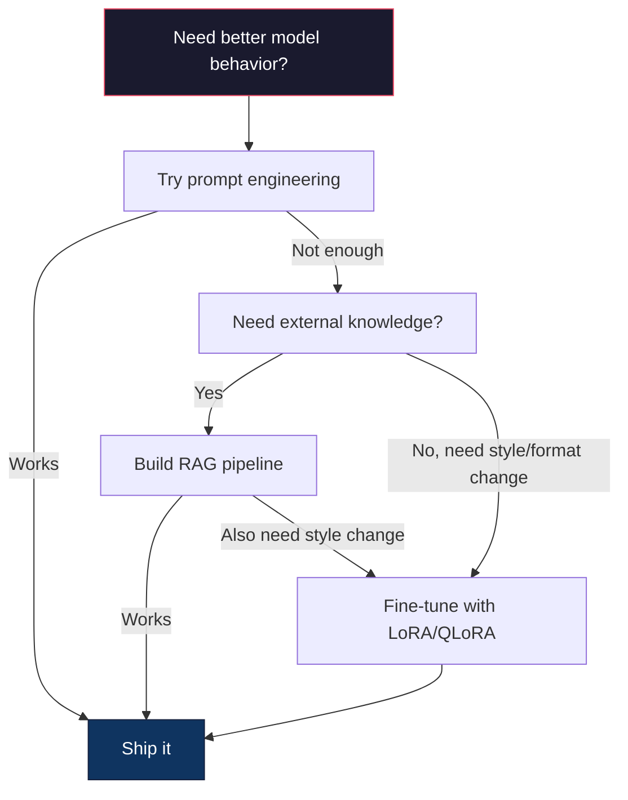

# Hoàn chỉnh tốt với LoRA & QLoRA  LoRA 微调:低秩适配与量化微调

> LoRA cho phép bạn chỉnh sửa mô hình hoàn chỉnh trong 6GB bằng cách đào tạo ít hơn 1% các tham số. Đây không phải là một sự thỏa hiệp - nó phù hợp với chất lượng chỉnh sửa hoàn chỉnh trong hầu hết các nhiệm vụ. Toàn bộ hệ sinh thái chỉnh sửa mã nguồn mở chạy trên một thủ thuật này.

> **【中文解读】**Mô hình 7B  mô hình cần 56GB  lưu trữ hiển nhiên. LoRA chỉ tập luyện ít hơn 1% các tham số.

> **【拓展：LoRA微调→定制大模型】**LoRA là một công nghệ cốt lõi của mô hình quy định lớn của doanh nghiệp: sử dụng một số ít mô hình cơ bản dữ liệu trong lĩnh vực, đạt được năng lực chuyên môn như phân tích tài chính, lý thuyết pháp lý, tạo mã, v.v.)

>  **【前置】**学本节前请先掌握:(1) Bước 10·06(SFT hướng dẫn điều chỉnh) 理解监督微调的基本流程;(2) 线性代数基础矩阵乘法、秩、SVD 分解(看 Bước 01·11 SVD);(3) PyTorch 基础`nn.Linear``backward()``optimizer.step()`;(4) Nhấp mặt `transformers`库的基本使用法──本节会使用 `peft`和 `trl`库:

**Type:** Build | **类型:** 构建
**Languages:** Python | **语言:** Python
**Prerequisites:** Phase 10, Lesson 06 (Instruction Tuning / SFT) | **前置知识:** Phase 10 · 06（指令微调/SFT）
**Time:** ~75 minutes | **时间:** ~75 分钟
**Related:**Giai đoạn 10 bao gồm các vòng SFT/DPO từ đầu. Bài học này kết nối chúng vào bộ công cụ PEFT 2026 (PEFT, TRL, Unsloth, Axolotl, LLaMA-Factory).**相关:**Giai đoạn 10 từ zero讲解 SFT/DPO 循环──本课将其接入2026 年的 PEFT 工具链(PEFT、TRL、Unsloth、Axolotl、LLaMA-Factory)

## Mục tiêu học tập

- Thực hiện LoRA bằng cách tiêm các bộ chuyển đổi cấp thấp (A và B) vào các lớp chú ý của mô hình được đào tạo trước
  通过向预训模型的注意力层注入低排适配矩阵(A 和 B) thực hiện LoRA
- Xét số tiết kiệm tham số của LoRA so với điều chỉnh hoàn chỉnh: xếp hạng r với d_model dimension train 2*r*d tham số thay vì d^2
  计算 LoRA vs 全量微调的参数节省:秩 r 配 d_model 维度训练 2*r*d 参数而不是 d^2
- Hoàn chỉnh một mô hình sử dụng QLoRA (4 bit quanteized base + LoRA adapters) để phù hợp với bộ nhớ GPU của người tiêu dùng
  dùng QLoRA(4-bit 量化基础模型 + LoRA 适配器) 微调模型以适应消费级 GPU 内存
- Thêm lại trọng lượng LoRA vào mô hình cơ bản để triển khai và so sánh tốc độ suy luận với và không có bộ điều chỉnh
  Để sử dụng mô hình cơ bản để triển khai, và so sánh tốc độ suy luận của bộ điều chỉnh có/không có

> **【中文解读】**本课目标: sử dụng LoRA/QLoRA để thực hiện các参数高效微调──LoRA chỉ tập luyện các phân tích nhỏ của các cơ quan ([...] hàng triệu cấp số), thay vì toàn bộ các参数 ([...] hàng tỷ), làm cho chi phí nhỏ giảm 90% +──


## Vấn đề  vấn đề giới thiệu

Bạn có một mô hình cơ bản. Llama 3 8B. Bạn muốn nó trả lời các vé hỗ trợ khách hàng bằng giọng nói của công ty của bạn. SFT là câu trả lời. Nhưng SFT có một vấn đề chi phí.

> Bạn có một mô hình cơ bản. Llama 3 8B. Bạn muốn nó sử dụng ngôn ngữ của công ty của bạn.

Llama 3 8B có 8 tỷ tham số. Trong fp16, mỗi tham số mất 2 byte. Đó là 16GB chỉ để tải trọng. Trong quá trình đào tạo, bạn cũng cần gradient (16GB), trạng thái tối ưu hóa cho Adam (32GB cho động lực + biến thể), và kích hoạt. Tổng cộng: khoảng 56GB VRAM cho một mô hình 8B.

> Lám 3 8B có 80 tỷ tham số. fp16 下 mỗi tham số chiếm 2 字节. Chỉ cần tải trọng cần 16GB. Trong thời gian tập luyện cũng cần độ cao và trạng thái tối ưu hóa.

Một chiếc A100 80GB chỉ vừa đủ.$3-4/hour on cloud providers. Training for 3 epochs on 50,000 examples takes 6-10 hours. That's $30-40 cho mỗi thí nghiệm. Hãy thử 10 thí nghiệm để có được các siêu tham số đúng và bạn đã chi 400 đô trước khi triển khai bất cứ điều gì.

> Một张 A100 80GB 勉强能装下──两张 A100 在云上每小时 $3-4。在 50,000 个样本上训练 3 个 epoch 需要 6-10 小时。每次实验 $30-40:

Có một vấn đề sâu sắc hơn nữa. Định chỉnh hoàn chỉnh thay đổi mọi trọng lượng trong mô hình. Nếu bạn điều chỉnh dữ liệu hỗ trợ khách hàng, bạn có thể làm suy giảm khả năng chung của mô hình. Nó được gọi là quên lãng thảm khốc. mô hình trở nên tốt hơn trong nhiệm vụ của bạn và tồi tệ hơn trong mọi thứ khác.

> Có một vấn đề sâu hơn nữa. Mỗi trọng lượng trong mô hình được chỉnh sửa bằng toàn bộ các tham số. Nếu bạn làm điều chỉnh dữ liệu khách hàng, có thể làm giảm khả năng sử dụng của mô hình.

Bạn cần một phương pháp đào tạo ít tham số hơn, sử dụng ít bộ nhớ hơn, và không phá hủy kiến thức hiện tại của mô hình.

> Bạn cần một cách tập luyện ít tham số hơn, sử dụng ít bộ nhớ hơn, và không phá hủy mô hình có kiến thức.

>  **【类比】**Lộ lượng nhỏ sửa lại "lấy lại toàn bộ sách giáo khoa một lần nữa" mỗi chữ cái (参数) đều thay đổi, lượng lớn cũng dễ dàng thay đổi nội dung gốc về sai lầm (catastrophe) 忘记 (错误) ⋅ LORA 像"在教科书的页边贴贴贴"原文 (W) 结不动,你只在边上贴小纸条 (A×B)矩阵) 写掉新注释──最终输出 = 原文 + 便利贴──换任务时,撕裂旧便利贴贴新的即可,原文保留──

## Khái niệm cốt lõi

> **【中文解读】**LoRA(Low-Rank Adaptation) là phương pháp cốt lõi của các tham số高效微调(PEFT:结原始权重,仅训低排分解矩阵(A*B), sẽ được đào tạo các tham số từ hàng tỷ xuống hàng triệu.

> **【拓展：LoRA 的工程实践】**LoRA's ranking (rango) thường được đặt là 8-64, được sử dụng cho Q/V 投影矩阵效果最好──QLoRA(4-bit cơ bản mô hình + LoRA) để bạn ở trên một张 RTX 4090 上微调 Llama-3-8B──HuggingFace PEFT库 để LoRA 微调几行代码即可实现──LoRA's cost for all parameters 微调约为 1/10,且效果接近──

> 🤔 **【困惑】**Q: QLoRA là gì? và LoRA 区别? A: QLoRA = LoRA số lượng hóa. Mô hình cơ bản sử dụng 4-bit 量化(NF4) lưu trữ, LoRA 适配器 sử dụng bf16 训练。 như vậy Llama-3-8B 16GB 权重压缩 xuống 4GB, cộng với LoRA 训练开销(约 100MB), tổng cộng 6GB 显存就能微调单张 RTX 4090 / 3090 即可──代价: tốc độ luyện tập so với đơn giản LoRA 慢约 30% ((因为 cần phải cạnh tranh chống量化边缘 tiến), nhưng chi phí có thể kiểm soát được。


### LoRA: Chuẩn bị cấp thấp

Edward Hu và các đồng nghiệp tại Microsoft đã xuất bản LoRA vào tháng 6 năm 2021. Nhìn sâu của bài báo: các cập nhật trọng lượng trong quá trình điều chỉnh tinh tế có thứ hạng nội tại thấp. Bạn không cần cập nhật tất cả 16,7 triệu tham số trong một matrix trọng lượng 4096x4096. Thông tin hữu ích trong bản cập nhật có thể được nắm bắt bằng một matrix thứ hạng 16 hoặc 32.

> Edward Hu và Microsoft đồng sự xuất bản vào tháng 6 năm 2021 LoRA──论文洞察:微调期间权重更新具有低内在排序──你不需要更新 4096x4096 权重矩阵中全部1670万参数──更新中的有用信息可被排列16或32的矩阵捕获──

> 🤔 **【困惑】**Q: Tại sao các cơ chế cơ bản có thể nắm bắt được những thông tin mới? A: Quan sát thực nghiệmAghajanyan 等(2020) phát hiện được trọng lượng của mô hình trước tập luyện mớiΔW trong nội dung nội bộ ( nội bộ) trên rất thấp, thường chỉ vài trăm đến vài nghìn维 để có thể học được một nhiệm vụ mới.

Đây là toán học. Một lớp tuyến tính tiêu chuẩn tính toán:

> 数学如下──标准线性层计算:

```
y = Wx
```

Trong đó W là một d_out x d_in. cho một dự đoán 4096x4096, đó là 16,777,216 tham số.

> Trong đó W là d_out x d_in 矩阵. Đối với 4096x4096 chú ý chiếu, đó là 16.777.216 个参数.

LoRA đóng băng W và thêm một phân hủy cấp thấp:

> LoRA 结 W 并添加低序分解:

> ️ **【易错点】**LoRA 微调的 3 个坑:(1) **秩 r 设太大**r=64 起步就太大,参数接近全量微调,省显存优势消失;起点 r=8 或 r=16,效果不够再加倍――(2) **target_modules 选错**Chỉ đối với`q_proj`加 LoRA 效果有限, quy tắc thực hành là`["q_proj", "v_proj", "k_proj", "o_proj"]`Thêm vào đó, tăng cường thêm MLP `gate_proj`- Không.`up_proj`- Không.`down_proj`〔(3) **学习率没调高**LoRA 参数 là khởi nghiệp mới, cần lr lớn hơn so với tập luyện trước; điển hình lr=1e-4 đến 3e-4(比全量微调的2e-5高 5-10倍)

```
y = Wx + BAx
```

Ở đó B là (d_out x r) và A là (r x d_in).

> Trong đó B là (d_out x r), A là (r x d_in)  xếp hạng r 比 d 小得多 thường là 8、16 hoặc 32。

Đối với r=16 trên lớp 4096x4096:
- Các tham số ban đầu: 4096 x 4096 = 16,777,216
- Các tham số LoRA: (4096 x 16) + (16 x 4096) = 65,536 + 65,536 = 131,072
- Giảm: 131.072 / 16.777.216 = 0,78%

> Đối với 4096x4096 层 r=16:
> - Các nguyên tố: 4996 x 4096 = 16,777,216
> - LoRA 参数:(4096 x 16) + (16 x 4096) = 65,536 + 65,536 = 131,072
> - 减少:131,072 / 16,777,216 = 0,78%

Bạn đang luyện tập 0,78% các thông số và nhận được 95-100% chất lượng.

> Bạn tập luyện 0,78% của các tham số, đạt được chất lượng 95-100% của các bài học.



A được khởi tạo bằng một Gaussian ngẫu nhiên. B được khởi tạo đến không. Điều này có nghĩa là đóng góp LoRA bắt đầu từ không - mô hình bắt đầu đào tạo từ hành vi ban đầu của nó và dần dần học cách thích nghi.

> A 用随机高斯初始化.B 初始化为零.B. 初始化为零.B.初始化为零.B.初始化为零.B.初始化为零.B.初始化为零.B.初始化为零.B.初始化为零.B.初始化为零.B.初始化为零.B.初始化为零.B.初始化为零.B.初始化为零.B.初始化为零.B.初始化为零.B.初始化为零.B.初始化为零.B.初始化为零.B.初始化为零.B.初始化为零.B.B.初始化为零.B.B.B.初始化为零.B.B.B.B.B.B.B.B.B.B.B.B.B.B.B.B.B.B.B.B.B.B.B.B.B.B.B.B.B.B.B.B.B.B.B.B.B.B.B.B.B.B.B.B.B.B.B.B.B.B.B.B.B.B.B.B.B.B.B.B.B.B.B.B.B.B.B.B.B.B.B.B.B.B.B.B.B.B.B.B.B.B.B.B.B.B.B.B.B.B.B.B.B.B.B.B.B.B.B.B.B.B.B.B.B.B.B.B.B.B.B.B.B.B.B.B.B.B.B.B.B.B.B.B.B.B.B.B.B.B.B.B.B.B.B.B.B.B.B.B.B.B.B.B.B.B.B.B.B.B.B.B.B.B.B.B.B.B.B.B

### Tỷ lệ quy mô: Alpha

LoRA giới thiệu một yếu tố quy mô alpha điều khiển mức độ cập nhật cấp thấp ảnh hưởng đến đầu ra:

> LoRA  giới thiệu các yếu tố tăng trưởng alpha, kiểm soát mức độ ảnh hưởng của việc sản xuất:

```
y = Wx + (alpha / r) * BAx
```

Khi alpha = r, quy mô là 1x. Khi alpha = 2r (tầm định chung), quy mô là 2x.

> Khi alpha = r, giảm xuống 1x。 khi alpha = 2r( thường thấy默认), giảm xuống 2x。

Những hướng dẫn thực tế:
- alpha = 2 * rank là một quy ước cộng đồng phổ biến (màn giấy ban đầu được sử dụng alpha = rank trong hầu hết các thí nghiệm)
  alpha = 2 * rank 是常见社区约定(原论文 Hầu hết các thí nghiệm dùng alpha = rank)
- alpha = xếp hạng cho phép 1x quy mô, bảo thủ nhưng ổn định
  alpha = xếp hạng 给 1x 缩放, bảo quản nhưng ổn định
- Alpha cao hơn có nghĩa là các cập nhật lớn hơn mỗi bước, có thể tăng tốc sự hội tụ hoặc gây bất ổn
  Alpha cao hơn có nghĩa là mỗi bước mới hơn, có thể tăng tốc nhận hoặc dẫn đến bất ổn

### Lần sử dụng LoRA

Một biến thể có nhiều lớp tuyến tính. Bạn không cần phải thêm LoRA vào tất cả chúng. Bức giấy ban đầu đã thử nghiệm các kết hợp khác nhau:

> Transformer có nhiều lớp tính tuyến tính. Bạn không cần phải cho tất cả thêm LoRA.

| Target Layers | Trainable Params (7B) | Quality |
|--------------|----------------------|---------|
| q_proj only / 仅 q_proj | 4.7M | Good / 好 |
| q_proj + v_proj | 9.4M | Better / 更好 |
| q_proj + k_proj + v_proj + o_proj | 18.9M | Best for attention / 注意力最佳 |
| All linear (attention + MLP) / 所有线性层 | 37.7M | Marginal gain, 2x params / 边际收益、2 倍参数 |

Điểm ngọt ngào cho hầu hết các nhiệm vụ: q_proj + v_proj. Điều này nhắm vào các dự đoán truy vấn và giá trị trong sự chú ý tự, điều khiển những gì mô hình tham gia và những thông tin mà nó trích xuất.

> Ưu điểm tốt nhất của hầu hết các nhiệm vụ: q_proj + v_proj. Đây là hướng tới việc tự chú ý và dự đoán giá trị, kiểm soát mô hình quan tâm đến gì, lấy thông tin gì.

### Chọn cấp độ

Đơn vị r kiểm soát tính biểu hiện của sự thích nghi:

> 秩 r 控制适应的表现能力:

| Rank | Trainable Params (per layer) | Best For |
|------|---------------------------|----------|
| 4 | 32,768 | Simple classification, sentiment / 简单分类、情感 |
| 8 | 65,536 | Single-domain Q&A, summarization / 单领域问答、摘要 |
| 16 | 131,072 | Multi-domain tasks, instruction following / 多领域任务、指令遵循 |
| 32 | 262,144 | Complex reasoning, code generation / 复杂推理、代码生成 |
| 64 | 524,288 | Diminishing returns for most tasks / 大多数任务回报递减 |
| 128 | 1,048,576 | Rarely justified / 很少合理 |

Hu et al. cho thấy rằng r=4 đã nắm bắt hầu hết các thích ứng cho các nhiệm vụ đơn giản. r=8 và r=16 là những lựa chọn phổ biến nhất trong thực tế.

> Hu 等人 cho thấy r=4 đã bắt được phần lớn các nhiệm vụ đơn giản.

### QLoRA: Quantization 4-bit + LoRA

Tim Dettmers và các đồng nghiệp tại Đại học Washington đã xuất bản QLoRA vào tháng 5 năm 2023. Ý tưởng: định lượng mô hình cơ sở đóng băng thành độ chính xác 4 bit, sau đó gắn bộ chuyển đổi LoRA trong fp16 ở trên.

> Tim Dettmers và đồng nghiệp Đại học Washington năm 2023 tháng 5 tháng 5 đã xuất bản QLoRA。 ý tưởng: sẽ kết thúc mô hình cơ bản được định lượng thành độ chính xác 4 bit, sau đó được thêm vào LoRA 适配器。

Điều này thay đổi đáng kể phương trình ghi nhớ:

> Điều này đã thay đổi rất lớn trong hệ thống lưu trữ:

| Method | Weight Memory (7B) | Training Memory (7B) | GPU Required |
|--------|-------------------|---------------------|-------------|
| Full fine-tune (fp16) | 14GB | ~56GB | 1x A100 80GB |
| LoRA (fp16 base) | 14GB | ~18GB | 1x A100 40GB |
| QLoRA (4-bit base) | 3.5GB | ~6GB | 1x RTX 3090 24GB |

QLoRA đóng góp ba phần kỹ thuật:

> QLoRA đã thực hiện ba đóng góp kỹ thuật:

**NF4 (Normal Float 4-bit)**Một loại dữ liệu mới được thiết kế đặc biệt cho trọng lượng mạng thần kinh. trọng lượng mạng thần kinh theo phân phối bình thường. NF4 đặt 16 mức lượng hóa của nó tại các lượng số của một phân phối bình thường tiêu chuẩn. Đây là lý thuyết thông tin tối ưu cho dữ liệu được phân phối bình thường. Nó mất ít thông tin hơn so với định lượng 4-bit đồng nhất (INT4) hoặc Float4 tiêu chuẩn.

> **NF4（Normal Float 4-bit）**: đặc biệt được thiết kế cho các loại dữ liệu mới của mạng lưới thần kinh. NF4 đặt 16 cấp lượng hóa của nó lên số phân chia của phân bố chuẩn chuẩn chuẩn.

**Double quantization**Các định lượng lượng hóa tự nó lấy bộ nhớ. Mỗi khối có 64 trọng lượng cần một nhân số quy mô fp32 (4 byte). Đối với mô hình 7B, đó là thêm 0.4GB.

> **双重量化**: định lượng thường tự chiếm trong bộ nhớ. Mỗi 64 khối trọng lượng cần fp32 缩放因子.

**Paged optimizers**Trong quá trình đào tạo, trạng thái tối ưu hóa (tốc độ và sự khác biệt của Adam) có thể vượt quá bộ nhớ GPU trên chuỗi dài. Các trình tối ưu hóa trang sử dụng bộ nhớ thống nhất của NVIDIA để tự động trang trạng thái tối ưu hóa đến RAM CPU khi bộ nhớ GPU bị kiệt sức, và trang lại khi cần thiết. Điều này ngăn chặn OOM bị sụp đổ với chi phí của một số thông qua.

> **分页优化器**Trong thời gian tập luyện, long sequence trên trạng thái tối ưu hóa máy tính có thể vượt quá GPU trong lưu trữ.

### Câu hỏi về chất lượng

Việc giảm các tham số hoặc định lượng cơ sở có ảnh hưởng đến chất lượng không?

>  giảm số liệu hoặc cơ sở định lượng có làm tổn hại chất lượng?

| Method | MMLU (5-shot) | MT-Bench | HumanEval |
|--------|--------------|----------|-----------|
| Full fine-tune (Llama 2 7B) / 全量微调 | 48.3 | 6.72 | 14.6 |
| LoRA r=16 | 47.9 | 6.68 | 14.0 |
| QLoRA r=16 (NF4) | 47.5 | 6.61 | 13.4 |
| QLoRA r=64 (NF4) | 48.1 | 6.70 | 14.2 |

LoRA ở r=16 nằm trong 1% của sự điều chỉnh hoàn chỉnh ở hầu hết các điểm chuẩn. QLoRA ở r=16 mất một phần trăm khác. QLoRA ở r=64 về cơ bản phù hợp với sự điều chỉnh hoàn chỉnh trong khi sử dụng 90% ít bộ nhớ hơn.

> LoRA của r=16 trên hầu hết các基准 với sự khác biệt nhỏ gọn toàn bộ 1% và trong.

### Chi phí thực tế

Llama 3 8B được điều chỉnh tinh tế trên 50.000 mẫu (3 thời đại):

> Trong 50.000 biểu mẫu trên微调 Llama 3 8B(3 个时代):

| Method | GPU | Time | Cost |
|--------|-----|------|------|
| Full fine-tune / 全量微调 | 2x A100 80GB | 8 hours | ~$32 |
| LoRA r=16 | 1x A100 40GB | 4 hours | ~$8 |
| QLoRA r=16 | 1x RTX 4090 24GB | 6 hours | ~$5 |
| QLoRA r=16 (Unsloth) | 1x RTX 4090 24GB | 2.5 hours | ~$2 |
| QLoRA r=16 | 1x T4 16GB | 12 hours | ~$4 |

QLoRA trên một GPU tiêu dùng duy nhất chi phí ít hơn một bữa trưa. Đây là lý do tại sao cộng đồng chỉnh sửa tinh tế trọng lượng mở đã bùng nổ vào năm 2023 và tại sao mọi khung đào tạo dưới đó đều cung cấp QLoRA theo mặc định vào năm 2026.

> 单张消费级 GPU 上的QLoRA 成本不到一顿午餐――这就是2023开源权微调社区爆发的原因,也是2026所有训练框架默认搭载QLoRA的原因――

### Bộ đống PEFT 2026

| Framework | What it is | Pick when |
|-----------|-----------|-----------|
| **Hugging Face PEFT** | The canonical LoRA/QLoRA/DoRA/IA3 library / 标准 LoRA/QLoRA/DoRA/IA3 库 | You want raw control and your training loop is already on `transformers.Trainer` / 想要原始控制且训练循环已在 `transformers.Trainer` 上 |
| **TRL** | HF's reinforcement-from-feedback trainers (SFT, DPO, GRPO, PPO, ORPO) / HF 反馈强化学习训练器 | You need DPO/GRPO after SFT; built on top of PEFT / SFT 后需要 DPO/GRPO；构建于 PEFT 之上 |
| **Unsloth** | Triton-kernel rewrite of the forward/backward pass / 前向/反向传播的 Triton 内核重写 | You want 2-5x speedup + half the VRAM with no accuracy loss; Llama/Mistral/Qwen family / 想要 2-5 倍加速 + 一半 VRAM 无精度损失；Llama/Mistral/Qwen 家族 |
| **Axolotl** | YAML-config wrapper over PEFT + TRL + DeepSpeed + Unsloth / PEFT + TRL + DeepSpeed + Unsloth 的 YAML 配置封装 | You want reproducible, version-controlled training runs / 想要可重现、版本控制的训练运行 |
| **LLaMA-Factory** | GUI/CLI/API over PEFT + TRL / PEFT + TRL 的 GUI/CLI/API | You want zero-code fine-tuning; 100+ model families supported / 想要零代码微调；支持 100+ 模型家族 |
| **torchtune** | Native PyTorch recipes, no `transformers` dep / 原生 PyTorch 配方，无 `transformers` 依赖 | You want minimal deps and your org already standardizes on PyTorch / 想要最小依赖且组织已标准化于 PyTorch |

Quy tắc ngón tay: sử dụng nghiên cứu hoặc thử nghiệm một lần → PEFT. Đường ống sản xuất lặp lại → Axolotl với hạt nhân Unsloth được bật.

> 经验法则: nghiên cứu hoặc một lần thực hiện → PEFT──可重复生产管线 → 启动 Unsloth 内核的 Axolotl──抛弃式原型 → LLaMA-Factory──

### Tích ứng hợp nhất

Sau khi đào tạo, bạn có hai thứ: mô hình cơ sở đóng băng và một bộ điều chỉnh LoRA nhỏ (thường là 10-100MB).

> 结的基础模型和小的LoRA 适配器 (通常10-100MB) 

1. **Keep them separate**: Lắp đặt mô hình cơ bản, tải bộ chuyển đổi lên trên. Swap bộ chuyển đổi cho các nhiệm vụ khác nhau. Đây là cách bạn phục vụ nhiều biến thể được điều chỉnh từ một mô hình cơ bản.

   **保持分离**: tải cơ bản mô hình, trên tải các biến thể khác nhau.

2. **Merge them permanently**: tính toán W' = W + (alpha/r) * BA và lưu kết quả như một mô hình đầy đủ mới. mô hình hợp nhất có kích thước tương tự như bản gốc. Không có chi phí đầu tư suy luận. Không có bộ điều chỉnh để quản lý.

   **永久合并**:计算 W' = W + (alpha/r) * BA 并将结果保存为新完整模型──合并后模型与原始相同大小──无推理开销──无适配器需管理──

Để phục vụ nhiều nhiệm vụ (adaptator hỗ trợ khách hàng, adapter mã, adapter dịch), giữ chúng riêng biệt. Để triển khai một mô hình chuyên môn duy nhất, sáp nhập.

> 服务多个任务(客服适配器、代码适配器、翻译适配器) giữ phân离――部署单一专用模型则合并――

Kỹ thuật hợp nhất tiên tiến để kết hợp nhiều bộ chuyển đổi:

> 组合多个适配器的高级合并技术:

- **TIES-Merging**(Yadav et al. 2023): Trim các tham số độ lớn nhỏ, giải quyết xung đột tín hiệu, sau đó sáp nhập. Giảm sự can thiệp giữa các bộ điều chỉnh.
  修剪小幅度参数, giải quyết符号冲突, rồi合并――减少适配器间干扰――
- **DARE**(Yu et al. 2023): Thường xuyên giảm các tham số bộ điều chỉnh trước khi sáp nhập và tái quy mô phần còn lại.
  合并前随机丢弃适配器参数并重新缩小其余参数──组合能力效果惊──
- **Task arithmetic**Chỉ cần thêm hoặc trừ trọng lượng bộ điều chỉnh.
  简单加或减适配器权重. 加"代码"适配器和"数学"适配器 thường tạo ra cả hai mô hình tốt.

### Khi không nên chỉnh sửa

Việc chỉnh sửa tốt là lựa chọn thứ ba, không phải là lựa chọn đầu tiên.

> 微调 là lựa chọn thứ ba, không phải là thứ nhất.

**First: prompt engineering.**Hãy viết một lời nhắc hệ thống tốt hơn, thêm vài ví dụ, sử dụng chuỗi suy nghĩ, không tốn tiền và mất vài phút, nếu lời nhắc dẫn giúp bạn đạt được 80% kết quả, bạn có thể không cần phải chỉnh sửa.

> **第一：提示工程。**写更好的系统提示――加少样本示例――用思维链――这零成本――几分钟――如果提示能完成80%,你可能不需要微调――

**Second: RAG.**Nếu mô hình cần biết về dữ liệu cụ thể của bạn (tác liệu, cơ sở kiến thức, danh mục sản phẩm), việc lấy lại là rẻ hơn và có thể duy trì hơn so với việc nướng nó thành trọng lượng.

> **第二：RAG。**Nếu mô hình cần biết dữ liệu cụ thể của bạn, thì kiểm tra hơn là ăn thịt.

**Third: fine-tuning.**Sử dụng điều này khi bạn cần mô hình để áp dụng một phong cách, định dạng hoặc mô hình lý luận cụ thể mà không thể đạt được thông qua nhắc nhở. Khi bạn cần đầu ra cấu trúc nhất quán. Khi bạn cần chưng cất một mô hình lớn hơn thành một mô hình nhỏ hơn. Khi độ trễ quan trọng và bạn không thể đủ khả năng để có thêm các token từ vài lần nhắc nhở.

> **第三：微调。**Khi bạn cần mô hình sử dụng một phong cách cụ thể, hình thức hoặc mô hình suy đoán (không thể thông qua các gợi ý) khi bạn cần một kết cấu kết hợp kết quả khi bạn cần một mô hình lớn biến thành mô hình nhỏ khi bạn cần một mô hình lớn biến thành mô hình nhỏ khi bạn phải chịu đựng một số lượng lớn các gợi ý.



## Hãy xây dựng nó.
```figure
lora-params
```

## Hãy xây dựng nó

Chúng tôi thực hiện LoRA từ đầu trong PyTorch tinh khiết. Không thư viện. Không ma thuật. Bạn sẽ xây dựng lớp LoRA, tiêm nó vào một mô hình, huấn luyện nó, và hợp lại trọng lượng.

> Chúng tôi sử dụng PyTorch tinh khiết từ zero để thực hiện LoRA──无库──无魔法── bạn sẽ xây dựng LoRA 层、注入模型、训练它、合并权重回去──

### Bước 1: Lớp LoRA

```python
import torch
import torch.nn as nn
import math

class LoRALayer(nn.Module):
    def __init__(self, in_features, out_features, rank=8, alpha=16):
        super().__init__()
        self.rank = rank
        self.alpha = alpha
        self.scaling = alpha / rank

        self.A = nn.Parameter(torch.randn(in_features, rank) * (1 / math.sqrt(rank)))
        self.B = nn.Parameter(torch.zeros(rank, out_features))

    def forward(self, x):
        return (x @ self.A @ self.B) * self.scaling
```

A được khởi tạo bằng các giá trị ngẫu nhiên quy mô. B được khởi tạo bằng không. Bản phẩm BA bắt đầu từ không, vì vậy mô hình bắt đầu với hành vi ban đầu của nó.

> A 用缩放随机值初始化──B 初始化为零──乘积 BA 从零开始,所以模型以其原始行为开始──

### Bước 2: Lớp tuyến tính được lắp với LoRA

```python
class LinearWithLoRA(nn.Module):
    def __init__(self, linear, rank=8, alpha=16):
        super().__init__()
        self.linear = linear
        self.lora = LoRALayer(
            linear.in_features, linear.out_features, rank, alpha
        )

        for param in self.linear.parameters():
            param.requires_grad = False

    def forward(self, x):
        return self.linear(x) + self.lora(x)
```

Lớp tuyến tính ban đầu được đóng băng. Chỉ có các tham số LoRA (A và B) có thể được đào tạo.

> Đường nguyên thủy được kết thúc. Chỉ có LoRA 参数(A 和 B) có thể được đào tạo.

### Bước 3: Tiêm LoRA vào mô hình

```python
def inject_lora(model, target_modules, rank=8, alpha=16):
    for param in model.parameters():
        param.requires_grad = False

    lora_layers = {}
    for name, module in model.named_modules():
        if isinstance(module, nn.Linear):
            if any(t in name for t in target_modules):
                parent_name = ".".join(name.split(".")[:-1])
                child_name = name.split(".")[-1]
                parent = dict(model.named_modules())[parent_name]
                lora_linear = LinearWithLoRA(module, rank, alpha)
                setattr(parent, child_name, lora_linear)
                lora_layers[name] = lora_linear
    return lora_layers
```

Đầu tiên, bạn đóng băng mọi tham số trong mô hình. Sau đó đi qua cây mô hình, tìm các lớp tuyến tính phù hợp với tên mục tiêu của bạn, và thay thế chúng bằng các phiên bản được gói LoRA. Các matrices LoRA A và B là các tham số duy nhất có thể được đào tạo trong toàn bộ mô hình.

> Đầu tiên, tất cả các tham số trong mô hình kết thúc. Sau đó đi qua cây mô hình, tìm ra các lớp tính của tên mục tiêu phù hợp, thay thế chúng bằng LoRA  gói phiên bản.

### Bước 4: Đếm các tham số

```python
def count_parameters(model):
    total = sum(p.numel() for p in model.parameters())
    trainable = sum(p.numel() for p in model.parameters() if p.requires_grad)
    frozen = total - trainable
    return {
        "total": total,
        "trainable": trainable,
        "frozen": frozen,
        "trainable_pct": 100 * trainable / total if total > 0 else 0
    }
```

### Bước 5: Thêm lại trọng lượng

```python
def merge_lora_weights(model):
    for name, module in model.named_modules():
        if isinstance(module, LinearWithLoRA):
            with torch.no_grad():
                merged = (
                    module.lora.A @ module.lora.B
                ) * module.lora.scaling
                module.linear.weight.data += merged.T
            parent_name = ".".join(name.split(".")[:-1])
            child_name = name.split(".")[-1]
            if parent_name:
                parent = dict(model.named_modules())[parent_name]
            else:
                parent = model
            setattr(parent, child_name, module.linear)
```

Sau khi sáp nhập, các lớp LoRA đã biến mất. mô hình có cùng kích thước với bản gốc với sự thích nghi được nướng vào các trọng lượng. Không có chi phí đầu tư.

> 合并后 LoRA 层消失──模型与原始大小相同,适应烤进权重──无推理开销──

### Bước 6: Tiêu chuẩn số lượng QLoRA mô phỏng

```python
def quantize_to_nf4(tensor, block_size=64):
    blocks = tensor.reshape(-1, block_size)
    scales = blocks.abs().max(dim=1, keepdim=True).values / 7.0
    scales = torch.clamp(scales, min=1e-8)
    quantized = torch.round(blocks / scales).clamp(-8, 7).to(torch.int8)
    return quantized, scales

def dequantize_from_nf4(quantized, scales, original_shape):
    dequantized = quantized.float() * scales
    return dequantized.reshape(original_shape)
```

Điều này mô phỏng định lượng 4 bit bằng cách lập bản đồ trọng lượng thành 16 cấp độ riêng biệt trong các khối 64.

> Thông qua đó sẽ được chuyển tải lên 64 khối 16 lớp phân tán mô phỏng 4 bit quy mô.

### Bước 7: Lòng huấn luyện

```python
def train_lora(model, data, epochs=5, lr=1e-3, batch_size=4):
    optimizer = torch.optim.AdamW(
        [p for p in model.parameters() if p.requires_grad], lr=lr
    )
    criterion = nn.MSELoss()

    losses = []
    for epoch in range(epochs):
        epoch_loss = 0.0
        n_batches = 0
        indices = torch.randperm(len(data["inputs"]))

        for i in range(0, len(indices), batch_size):
            batch_idx = indices[i:i + batch_size]
            x = data["inputs"][batch_idx]
            y = data["targets"][batch_idx]

            output = model(x)
            loss = criterion(output, y)

            optimizer.zero_grad()
            loss.backward()
            optimizer.step()

            epoch_loss += loss.item()
            n_batches += 1

        avg_loss = epoch_loss / n_batches
        losses.append(avg_loss)

    return losses
```

### Bước 8: Demo đầy đủ

```python
def demo():
    torch.manual_seed(42)
    d_model = 256
    n_classes = 10

    model = nn.Sequential(
        nn.Linear(d_model, 512),
        nn.ReLU(),
        nn.Linear(512, 512),
        nn.ReLU(),
        nn.Linear(512, n_classes),
    )

    n_samples = 500
    x = torch.randn(n_samples, d_model)
    y = torch.randint(0, n_classes, (n_samples,))
    y_onehot = torch.zeros(n_samples, n_classes).scatter_(1, y.unsqueeze(1), 1.0)

    data = {"inputs": x, "targets": y_onehot}

    params_before = count_parameters(model)

    lora_layers = inject_lora(
        model, target_modules=["0", "2"], rank=8, alpha=16
    )

    params_after = count_parameters(model)

    losses = train_lora(model, data, epochs=20, lr=1e-3)

    merge_lora_weights(model)
    params_merged = count_parameters(model)

    return {
        "params_before": params_before,
        "params_after": params_after,
        "params_merged": params_merged,
        "losses": losses,
    }
```

Demos tạo ra một mô hình nhỏ, tiêm LoRA vào hai lớp, đào tạo nó và hợp nhất các trọng lượng trở lại. Số lượng tham số giảm từ đầy đủ có thể đào tạo đến ~ 1% có thể đào tạo trong quá trình đào tạo LoRA, sau đó trở lại kiến trúc ban đầu sau khi hợp nhất.

> 演示 tạo mô hình nhỏ 注 vào LoRA đến hai tầng  đào tạo nó 合并权重回去──参数计 từ toàn可训练降至 LoRA 训练期间约1% 可训练,然后合并后返回原始架构──

## Hãy sử dụng nó để thực hiện

Với hệ sinh thái Hugging Face, LoRA trên mô hình thực có khoảng 20 dòng:

> Với khuôn mặt ôm sinh thái, thực tế mô hình trên LoRA chỉ cần khoảng 20 行:

```python
from transformers import AutoModelForCausalLM, AutoTokenizer
from peft import LoraConfig, get_peft_model, TaskType

model = AutoModelForCausalLM.from_pretrained("meta-llama/Llama-3.1-8B")
tokenizer = AutoTokenizer.from_pretrained("meta-llama/Llama-3.1-8B")

lora_config = LoraConfig(
    task_type=TaskType.CAUSAL_LM,
    r=16,
    lora_alpha=32,
    lora_dropout=0.05,
    target_modules=["q_proj", "v_proj"],
)

model = get_peft_model(model, lora_config)
model.print_trainable_parameters()
```

Đối với QLoRA, thêm số lượng bitandbytes:

> Đối với QLoRA, thêm bit vàbyte 量化:

```python
from transformers import BitsAndBytesConfig

bnb_config = BitsAndBytesConfig(
    load_in_4bit=True,
    bnb_4bit_quant_type="nf4",
    bnb_4bit_compute_dtype=torch.bfloat16,
    bnb_4bit_use_double_quant=True,
)

model = AutoModelForCausalLM.from_pretrained(
    "meta-llama/Llama-3.1-8B",
    quantization_config=bnb_config,
    device_map="auto",
)

model = get_peft_model(model, lora_config)
```

Đó là nó. cùng một vòng đào tạo, cùng một đường ống dữ liệu mô hình cơ sở hiện đang sống trong 4 bit, bộ điều chỉnh LoRA được đào tạo trong fp16, và toàn bộ bộ bộ bộ đều phù hợp trong 6GB.

Để huấn luyện với Hugging Face Trainer:

```python
from transformers import TrainingArguments, Trainer
from datasets import load_dataset

dataset = load_dataset("tatsu-lab/alpaca", split="train[:5000]")

training_args = TrainingArguments(
    output_dir="./lora-llama",
    num_train_epochs=3,
    per_device_train_batch_size=4,
    gradient_accumulation_steps=4,
    learning_rate=2e-4,
    fp16=True,
    logging_steps=10,
    save_strategy="epoch",
    optim="paged_adamw_8bit",
)

trainer = Trainer(
    model=model,
    args=training_args,
    train_dataset=dataset,
)

trainer.train()

model.save_pretrained("./lora-adapter")
```

Bộ chuyển đổi được lưu là 10-100MB. Mô hình cơ bản vẫn không bị ảnh hưởng. Bạn có thể chia sẻ bộ chuyển đổi trên Hugging Face Hub mà không cần phân phối lại mô hình đầy đủ.

## Chuyển nó đi.

Bài học này mang lại:
- `outputs/prompt-lora-advisor.md`-- một lời nhắc giúp bạn quyết định LoRA xếp hạng, mục tiêu mô-đun, và các siêu tham số cho nhiệm vụ cụ thể của bạn
- `outputs/skill-fine-tuning-guide.md`-- một kỹ năng dạy cho các nhân viên cây quyết định khi nào và làm thế nào để tinh chỉnh

## Tập luyện bài tập

1. **Rank ablation study.**Hãy chạy demo với các thứ hạng 2, 4, 8, 16, 32, và 64. Bước cuối cùng mất mát so với thứ hạng. Tìm điểm thu nhập giảm đi nơi việc tăng gấp đôi thứ hạng không còn làm giảm mất mát một nửa. Đối với một nhiệm vụ phân loại đơn giản trên các tính năng 256 chiều, điều này nên khoảng r = 8-16.

2. **Target module comparison.**Thay đổi inject_lora để nhắm mục tiêu chỉ lớp "0", chỉ lớp "2", chỉ lớp "4", và cả ba. Cử lý mỗi biến thể trong 20 thời đại. So sánh tốc độ hội tụ và mất cuối cùng. Điều này phản ánh quyết định thực sự nhắm mục tiêu q_proj vs v_proj vs tất cả các lớp tuyến tính.

3. **Quantization error analysis.**Hãy lấy các matrices trọng lượng của mô hình được đào tạo trước và sau khi quantize_to_nf4 / dequantize_from_nf4. Xét lỗi vuông trung bình, lỗi tuyệt đối tối đa và mối tương quan giữa trọng lượng ban đầu và các trọng lượng được tái cấu trúc.

4. **Multi-adapter serving.**Đào tạo hai bộ điều chỉnh LoRA trên các bộ phụ dữ liệu khác nhau (ngay cả chỉ số so với chỉ số lẻ). Đặt cả hai bộ điều chỉnh. Lắp đặt mô hình cơ sở một lần, sau đó thay đổi bộ điều chỉnh và xác minh rằng mỗi bộ sản xuất đầu ra khác nhau trên cùng một đầu vào. Đây là cách hệ thống sản xuất phục vụ nhiều mô hình được điều chỉnh tốt từ một cơ sở.

5. **Merge vs. unmerged inference.**So sánh đầu ra của mô hình LoRA trước và sau khi merge_lora_weights trên cùng 100 đầu vào. Kiểm tra các đầu ra giống nhau (trong dung lượng điểm nổi của 1e-5). Sau đó, tốc độ suy luận tham chiếu cho cả hai - kết hợp nên nhanh hơn một chút vì nó là một số lượng tử liệu nhân thay vì hai.

## Từ khóa  Từ khóa nhanh chóng

| Term | What people say | What it actually means | 中文释义 |
|------|----------------|----------------------|---------|
| LoRA | "Efficient fine-tuning" | Low-Rank Adaptation: freeze base weights, train two small matrices A and B whose product approximates the full weight update | |
| QLoRA | "Fine-tune on a laptop" | Quantized LoRA: load the base model in 4-bit NF4, train LoRA adapters in fp16 on top, enabling 7B fine-tuning in 6GB VRAM | |
| Rank (r) | "How much the model can learn" | The inner dimension of the A and B matrices; controls expressiveness vs. parameter count | |
| Alpha | "LoRA learning rate" | Scaling factor applied to the LoRA output; alpha/r scales the adaptation's contribution to the final output | |
| NF4 | "4-bit quantization" | Normal Float 4: a 4-bit data type with quantization levels at normal distribution quantiles, optimal for neural network weights | |
| Adapter | "The small trained part" | The LoRA A and B matrices saved as a separate file (10-100MB), loadable on top of any copy of the base model | |
| Target modules | "Which layers to LoRA" | The specific linear layers (q_proj, v_proj, etc.) where LoRA adapters are injected | |
| Merging | "Bake it in" | Computing W + (alpha/r) * BA and replacing the original weight, eliminating the adapter overhead at inference | |
| Paged optimizers | "Don't OOM during training" | Offloading optimizer states (Adam momentum, variance) to CPU when GPU memory is exhausted | |
| Catastrophic forgetting | "Fine-tuning broke everything else" | When updating all weights causes the model to lose previously learned capabilities | |

## Xem thêm 延伸阅读

- Hu et al., "LoRA: Đáp ứng hạng thấp của các mô hình ngôn ngữ lớn" (2021) -- bài báo ban đầu giới thiệu phương pháp phân hủy hạng thấp, được thử nghiệm trên GPT-3 175B với hạng thấp như 4
- Dettmers et al., "QLoRA: Định soạn hiệu quả của các mô hình ngôn ngữ lượng tử" (2023) -- giới thiệu NF4, định lượng đôi và tối ưu hóa trang, cho phép điều chỉnh tốt 65B trên một GPU 48GB duy nhất
- Tài liệu thư viện PEFT (huggingface.co/docs/peft) - thư viện tiêu chuẩn cho LoRA, QLoRA và các phương pháp hiệu quả các thông số khác trong hệ sinh thái Hugging Face
- Yadav et al., "TIES-Merging: Solving Interference When Merging Models" (2023) -- kỹ thuật kết hợp nhiều bộ chuyển đổi LoRA mà không làm suy giảm chất lượng
- [Rafailov et al., "Direct Preference Optimization: Your Language Model is Secretly a Reward Model" (NeurIPS 2023)](https://arxiv.org/abs/2305.18290)-- DPO dẫn xuất; giai đoạn điều chỉnh ưu tiên sau SFT, không cần mô hình phần thưởng.
- [TRL documentation](https://huggingface.co/docs/trl/)-- thông tin chính thức cho `SFTTrainer`- `DPOTrainer`- `KTOTrainer`, và bề mặt tích hợp với PEFT/bitsandbytes/Unsloth.
- [Unsloth documentation](https://docs.unsloth.ai/)-- các hạt nhân hợp nhất làm tăng gấp đôi thông qua điều chỉnh tinh tế và giảm bộ nhớ một nửa; lớp hiệu suất dưới TRL.
- [Axolotl documentation](https://axolotl-ai-cloud.github.io/axolotl/)-- YAML cấu hình nhiều GPU SFT / DPO / QLoRA huấn luyện viên; tùy chọn config-as-code cho các kịch bản viết tay.
