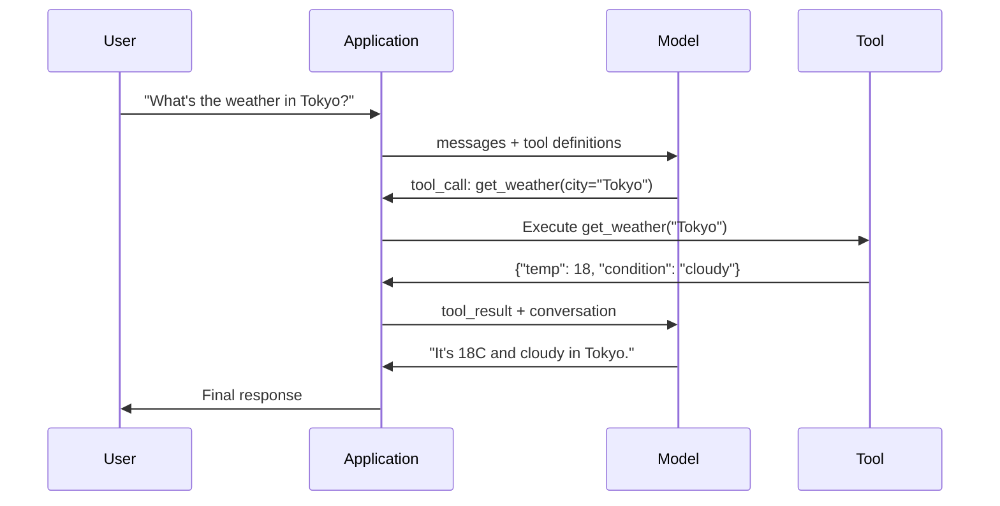

# Chức năng gọi và công cụ Sử dụng  hàm调用与工具使用

> LLM không thể làm gì cả. Chúng tạo ra tin nhắn. Đó là toàn bộ khả năng. Họ không thể kiểm tra thời tiết, truy vấn cơ sở dữ liệu, gửi email, chạy mã hoặc đọc tập tin. Mỗi "hội nhân tạo AI" mà bạn đã từng thấy là một LLM tạo ra JSON cho biết hàm nào để gọi -- và sau đó mã của bạn thực sự gọi nó. Mô hình là não. Công cụ là tay. Vị trí gọi là hệ thần kinh kết nối chúng.

> **【中文解读】**LLM chỉ có thể tạo văn bản. Các hàm调用让模型输出结构化 JSON 指定要调用函数,由代码实际执行.

> **【拓展：Function Calling→MCP与Agent】**Function Calling là cơ chế cốt lõi của AI Agent, MCP  giao thức dựa trên đó đã tiêu chuẩn hóa mô tả công cụ và quy trình sử dụng, là giao thức cơ bản của Claude 生态.

>  **【前置】**学本节前请先掌握:(1) Bước 11·01(Prompt Engineering) 理解 LLM 如何处理快速;(2) Bước 11·03(Structured Outputs) 理解 JSON Schema,本节重度依赖;(3) Python 字典、JSON 序列化、try/except 异常处理──如果不会写 JSON Schema,先看 jsonschema 库文档本节不会从头讲──

**Type:** Build | **类型:** 构建
**Languages:** Python | **语言:** Python
**Prerequisites:** Phase 11 Lesson 03 (Structured Outputs) | **前置知识:** Phase 11 · 03 (结构化输出)
**Time:** ~75 minutes | **时间:** ~75 分钟
**Related:**Giai đoạn 11 · 14 (Model Context Protocol)  khi một công cụ được chia sẻ giữa các máy chủ, tốt nghiệp từ việc gọi hàm inline đến một máy chủ MCP. Bài học này bao gồm trường hợp inline; MCP bao gồm trường hợp giao thức.**相关:**Giai đoạn 11 · 14 (模型上下文协议)  Khi các công cụ cần được chia sẻ trên cơ quan chủ yếu, từ hàm trong liên kết调用 nâng cấp thành MCP 服务器。 本课讲内联场景;MCP 讲协议场景。

## Mục tiêu học tập

- Thực hiện một vòng gọi hàm: xác định các sơ đồ công cụ, phân tích JSON gọi công cụ của mô hình, thực thi các hàm và trả lại kết quả
  实现 hàm调用循环:定义工具 schema、解析模型的工具调用 JSON、执行函数并返回结果
- Các quy trình thiết kế công cụ với mô tả rõ ràng và các tham số được đánh dấu mà mô hình có thể sử dụng một cách đáng tin cậy
   thiết kế có mô tả rõ ràng và kiểu hóa các yếu tố của các thiết bị kế hoạch, để mô hình có thể được điều chỉnh đáng tin cậy
- Xây dựng một vòng lặp đại lý nhiều vòng nối liên kết nhiều hàm gọi để trả lời các truy vấn phức tạp
  Xây dựng các đại lý nhiều vòng vòng, chuỗi gọi nhiều hàm để trả lời các câu hỏi phức tạp
- Chức năng xử lý gọi các trường hợp cạnh: gọi công cụ song song, lây lan lỗi và ngăn chặn vòng lặp công cụ vô hạn
  处理函数调用边缘情况:并行工具调用、错误传播和防止无限工具循环

> **【中文解读】**本课目标: nắm bắt hàm调用 (Funktion Calling) để LLM 调用外部工具──这是构建 AI Agent的基础模型通过调用搜索,数据库,API等工具获取信息和执行操作──


## Vấn đề  vấn đề giới thiệu

Bạn xây dựng một chatbot. Người dùng hỏi: "Thời tiết ở Tokyo là gì bây giờ?"

> Bạn xây dựng một máy trò chuyện. Người dùng hỏi:"Tình trạng thời tiết ở Bắc Kinh thế nào?"

Mô hình trả lời: "Tôi không có quyền truy cập vào dữ liệu thời tiết theo thời gian thực, nhưng dựa trên mùa, Tokyo có thể là khoảng 15 độ C... "

> 模型回复一个带着免责声明的幻觉答案──

Đó là một ảo giác mặc một bản báo cáo không chịu trách nhiệm. mô hình không biết thời tiết. nó sẽ không bao giờ. thời tiết thay đổi mỗi giờ. dữ liệu đào tạo của mô hình là vài tháng tuổi.

> Đó là một ảo giác vô trách nhiệm. Mô hình không biết thời tiết, cũng không bao giờ biết.

Câu trả lời chính xác đòi hỏi phải gọi API OpenWeatherMap, lấy nhiệt độ hiện tại và trả lại số thực. Mô hình không thể gọi API. Mã của bạn có thể. Phần thiếu sót: một giao thức có cấu trúc cho phép mô hình nói "Tôi cần gọi API thời tiết với các lập luận này" và cho phép mã của bạn thực hiện nó và đưa kết quả trở lại.

> Cần sử dụng OpenWeatherMap API. Mô hình không thể sử dụng API, mã của bạn có thể.

Đây là gọi hàm. mô hình sẽ đưa ra JSON cấu trúc mô tả hàm nào để gọi với các lập luận nào. Ứng dụng của bạn thực hiện hàm. Kết quả sẽ quay lại cuộc trò chuyện. mô hình sử dụng kết quả để tạo ra câu trả lời cuối cùng của nó.

> Đây là hàm điều chỉnh. mô hình đầu ra cấu trúc JSON mô tả hàm nào cần điều chỉnh.

Không có chức năng gọi, LLM là các ensiklopedia.

> Không có hàm调用, LLM là tập thể.

>  **【类比】**LLM 像一位"嘴强王者"能讲清楚任何概念,但不能动手──函调就是给这位嘴强王者配一个"小弟"系统:它说"小弟,去查东京天气"→小弟照做→回来报告"18度阴天"→它转述给用户──模型从不离开王座(生成代币),但通过发号施令(JSON) 和接收战报(工具_结果),它可以调整整个外部世界──

## Khái niệm cốt lõi

> **【中文解读】**函数调用 (FUNCTION CALL) để LLM sinh ra một yêu cầu调用 công cụ cấu trúc, chứ không phải là đơn thuần văn bản trả lời.

> **【拓展：函数调用与 Agent 系统】**Các chức năng của OpenAI được sử dụng vào năm 2023 được giới thiệu, hiện đã được hỗ trợ và sử dụng và sử dụng bắt buộc. LongChain, CrewAI, AutoGen, etc.


### Phương pháp gọi vòng lặp

Mỗi tương tác sử dụng công cụ theo cùng vòng lặp 5 bước.

> Mỗi lần sử dụng các công cụ giao tiếp đều theo cùng một vòng lặp 5 bước.



Bước 1: người dùng gửi tin nhắn. Bước 2: mô hình nhận được thông điệp cùng với các định nghĩa công cụ (Tình đồ JSON mô tả các chức năng có sẵn). Bước 3: thay vì trả lời bằng văn bản, mô hình sẽ đưa ra một cuộc gọi công cụ -- một đối tượng JSON có cấu trúc với tên và lập luận của hàm. Bước 4: mã của bạn thực hiện chức năng và ghi lại kết quả. Bước 5: kết quả trở lại mô hình, mà bây giờ có dữ liệu thực để tạo ra câu trả lời cuối cùng của nó.

> Bước 1: Người dùng gửi tin nhắn. Bước 2: Mô hình nhận tin nhắn và định nghĩa công cụ. Bước 3: Mô hình không quay lại văn bản, mà là công cụ xuất phát sử dụng một cấu trúc JSON chứa tên và các yếu tố của các hàm đối tượng. Bước 4: Mã hiệu của bạn thực hiện hàm và bắt kết quả. Bước 5: Kết quả trở lại mô hình, mô hình hiện có dữ liệu thực để tạo ra kết quả cuối cùng.

Mô hình không bao giờ thực hiện bất cứ điều gì, nó chỉ quyết định cái gì để gọi và bằng những lập luận nào.

> Mô hình không thực hiện bất cứ điều gì. Nó chỉ quyết định điều gì.

> 🤔 **【困惑】**Q: Tại sao mô hình không thực hiện mã trực tiếp?**隔离** mô hình trong hộp bên ngoài thực hiện sẽ có rủi ro an toàn                                                                                                                                                                                                                                                       **可观测** thực hiện trong quá trình của bạn, có thể gia tăng日志、限流、审计;**可移植**The same model can drive different languages (Python/JS/Go) The same model can drive different languages (Python/JS/Go) The same model can drive different languages (Python/JS/Go) The same model can drive different languages (Python/JS/Go) The same model can drive different languages) The same model can drive different languages (Python/JS/Go) The same model itself is not tied to the operation of the workflow)

### Các định nghĩa công cụ: Hợp đồng JSON Schema

Mỗi công cụ được định nghĩa bởi một JSON Schema cho mô hình biết chức năng làm gì, nó cần những lập luận nào và những loại lập luận đó phải là gì.

> Mỗi công cụ được định nghĩa bởi JSON Schema, cho mô hình biết hàm này làm gì, chấp nhận các tham số gì, các tham số phải là loại gì.

```json
{
  "type": "function",
  "function": {
    "name": "get_weather",
    "description": "Get current weather for a city. Returns temperature in Celsius and conditions.",
    "parameters": {
      "type": "object",
      "properties": {
        "city": {
          "type": "string",
          "description": "City name, e.g. 'Tokyo' or 'San Francisco'"
        },
        "units": {
          "type": "string",
          "enum": ["celsius", "fahrenheit"],
          "description": "Temperature units"
        }
      },
      "required": ["city"]
    }
  }
}
```

- `description`Các trường hợp quan trọng. mô hình đọc chúng để quyết định khi nào và làm thế nào để sử dụng công cụ. Một mô tả mơ hồ như "được thời tiết" tạo ra sự lựa chọn công cụ tồi tệ hơn "Được thời tiết hiện tại cho một thành phố.

> `description`字段至关重要──模型读这些描述来决定何时以及如何使用工具──模糊描述如"获取天气"产生的工具选择效果差于"获取城市当前天气,回归摄氏度温度和天气状况"──描述本身就是工具选择的提示──

> ️ **【易错点】**工具描述的 3 个坑:(1) **描述太短** "tận dụng dữ liệu" mô tả,模型分不清该用 `get_weather`Và là`get_stock_price`,会乱选;修复: mỗi mô tả ít nhất 30 chữ,写清"做什么 + 输入 + 输出"――(2) **描述互相重叠**两个工具都写"获取信息",模型选哪个全凭运气;修复:每个描述强调独特场景("获取实时天气" vs "获取历史天气")**隐藏前置条件**Bí dụ như `delete_file(path)`需要先 `confirm()`, nhưng mô tả không nói, mô hình sẽ trực tiếp xóa;修复:把约束写入描述或拆分成两个工具.

### So sánh nhà cung cấp

Mỗi nhà cung cấp chính hỗ trợ gọi chức năng, nhưng bề mặt API khác nhau.

> Mỗi nhà cung cấp chính đều hỗ trợ các chức năng调用, nhưng các giao diện API khác nhau.

| Provider | API Parameter | Tool Call Format | Parallel Calls | Forced Calling |
|----------|--------------|-----------------|---------------|----------------|
| OpenAI (GPT-5, o4) | `tools` | `tool_calls[].function` | Yes (multiple per turn) | `tool_choice="required"` |
| Anthropic (Claude 4.6/4.7) | `tools` | `content[].type="tool_use"` | Yes (multiple blocks) | `tool_choice={"type":"any"}` |
| Google (Gemini 3) | `function_declarations` | `functionCall` | Yes | `function_calling_config` |
| Open-weight (Llama 4, Qwen3, DeepSeek-V3) | Native `tools` on Llama 4; Hermes or ChatML on others | Mixed | Model-dependent | Prompt-based or `tool_choice` if supported |

Đến năm 2026, ba nhà cung cấp đóng cửa đã hội tụ vào các định dạng dựa trên JSON-Schema gần giống hệt nhau.`tools`trường phù hợp với hình dạng của OpenAI. Open-weight fine-tunes vẫn khác nhau  định dạng Hermes (NousResearch) là phổ biến nhất cho các phần mềm fine-tune của bên thứ ba. Đối với các công cụ chia sẻ trên các máy chủ, hãy ưu tiên MCP (Phase 11 · 14) hơn việc gọi hàm trực tuyến  máy chủ là giống nhau cho tất cả chúng.

> Đến năm 2026, ba nhà cung cấp nguồn đóng đã có xu hướng cùng với gần như cùng một định dạng dựa trên JSON Schema.`tools`字段匹配 OpenAI's structure──开源权重微调模型仍然各异Hermes 格式──NousResearch) là phổ biến nhất trong các mô hình微调 thứ ba──跨主机共享工具时优先使用 MCP──Phase 11 · 14)

### Chọn công cụ: tự động, yêu cầu, cụ thể

Bạn kiểm soát khi mô hình sử dụng công cụ.

> Bạn có thể kiểm soát mô hình khi sử dụng công cụ.

**Auto**(đặc định): mô hình quyết định gọi một công cụ hay trả lời trực tiếp. "Điều gì là 2 + 2?" -- trả lời trực tiếp. "Điều gì là thời tiết?" -- gọi công cụ.
**自动（默认）**Mô hình tự quyết định liệu nó là công cụ điều khiển hay trực tiếp trả lời.

**Required**: mô hình phải gọi ít nhất một công cụ. Sử dụng nó khi bạn biết ý định của người dùng đòi hỏi một công cụ. ngăn chặn mô hình đoán thay vì tìm kiếm dữ liệu thực.
**必需**Mô hình phải ít nhất sử dụng một công cụ. Khi bạn rõ ràng biết người dùng muốn sử dụng công cụ.

**Specific function**: buộc mô hình gọi một hàm cụ thể. `tool_choice={"type":"function", "function": {"name": "get_weather"}}`sử dụng điều này để định tuyến -- khi logic dòng lên đã xác định công cụ cần thiết.
**特定函数**: Mô hình bắt buộc调用 một hàm cụ thể`tool_choice={"type":"function", "function": {"name": "get_weather"}}`Bảo đảm công cụ thời tiết được sử dụng, bất kể câu hỏi là gì.

### Hướng gọi hàm song song

GPT-4o và Claude có thể gọi nhiều chức năng trong một lượt. Một người dùng hỏi: "Thời tiết ở Tokyo và New York là gì?" mô hình phát ra hai cuộc gọi công cụ cùng một lúc:

> GPT-4o và Claude có thể được điều chỉnh trong một vòng trong nhiều hàm. Người dùng hỏi:"东京和纽约天气怎么样?" mô hình đồng thời xuất ra hai công cụ điều chỉnh:

```json
[
  {"name": "get_weather", "arguments": {"city": "Tokyo"}},
  {"name": "get_weather", "arguments": {"city": "New York"}}
]
```

Mã của bạn thực hiện cả hai (hiện lý cùng lúc), trả lại cả hai kết quả, và mô hình tổng hợp một phản ứng duy nhất. Điều này cắt giảm đi lại từ 2 đến 1. Đối với các đại lý với 5-10 cuộc gọi công cụ mỗi truy vấn, cuộc gọi song song giảm độ trễ 60-80%.

> Bạn có thể thực hiện hai điều này (đơn vị lý tưởng được thực hiện), trả lại hai kết quả, mô hình được tổng hợp ra một lần lặp lại.

> ️ **【易错点】**Và đã có 2 crater được sử dụng:**顺序依赖未声明** Người dùng hỏi"先查A 公司股价,再查B 公司",模型可能并行调用两个 `get_price`Nhưng bạn không thể đảm bảo một trước trở lại;`get_price`工具的描述 写明"用于独立查询",需要顺序时使用 `compare_stocks(A, B)`单工具封装──(2) **共享状态竞争**并行调用 `increment_counter()`两次,结果只增加 1;修复:工具实现里加锁,或让模型串行调用副作用工具──

### Các kết quả được cấu trúc so với việc gọi chức năng

Bài học 03 bao gồm các kết quả cấu trúc. gọi hàm sử dụng cùng một máy tính JSON Schema, nhưng với mục đích khác.

> Bài học 03 nói về cấu trúc xuất khẩu.

**Structured outputs**: buộc mô hình để tạo ra dữ liệu trong một hình dạng cụ thể.`{name, price, in_stock}`- Tôi không biết.
**结构化输出**: Mô hình bắt buộc theo hình dạng cụ thể tạo dữ liệu.`{name, price, in_stock}`

**Function calling**: mô hình tuyên bố ý định thực hiện một hành động.`get_weather(city="Tokyo")`-- mô hình đang yêu cầu hành động, không tạo ra câu trả lời cuối cùng.
**函数调用**Mô hình tuyên bố thực hiện một động tác định ý.`get_weather(city="Tokyo")` mô hình trong yêu cầu động tác, không tạo ra câu trả lời cuối cùng.

Sử dụng các đầu ra được cấu trúc khi bạn muốn khai thác dữ liệu. Sử dụng gọi hàm khi bạn muốn mô hình tương tác với các hệ thống bên ngoài.
Làm dữ liệu thu thập khi sử dụng cấu trúc xuất khẩu.

### An ninh: Quy tắc không thể thương lượng

Đơn vị gọi hàm là khả năng nguy hiểm nhất mà bạn có thể cung cấp cho một LLM. Mô hình chọn điều gì để thực hiện. Nếu bộ công cụ của bạn bao gồm các truy vấn cơ sở dữ liệu, mô hình xây dựng các truy vấn. Nếu nó bao gồm các lệnh shell, mô hình viết chúng.

> 函调用是你赋予 LLM 最危险的能力──模型决定执行什么── Nếu tập hợp công cụ của bạn chứa các truy vấn cơ sở dữ liệu,模型 sẽ cấu tạo các truy vấn语句── nếu chứa shell 命令,模型 sẽ viết lệnh──

**Rule 1: Never pass model-generated SQL directly to a database.**Mô hình có thể và sẽ tạo ra bảng DROP, tiêm UNION hoặc truy vấn trả lại mỗi hàng. Luôn định nghĩa. Luôn xác nhận. Luôn sử dụng danh sách các hoạt động.
**规则 1：永远不要把模型生成的 SQL 直接传给数据库。**模型会(也会)生成 DROP TABLE、UNION 注入或返回所有者的查询──始终参数化──始终校验──始终使用操作白名单──

**Rule 2: Allowlist functions.**Mô hình chỉ có thể gọi các chức năng bạn xác định rõ ràng. Không bao giờ xây dựng công cụ chung "hãy thực hiện bất kỳ chức năng nào theo tên". Nếu bạn có 50 chức năng nội bộ, chỉ phơi bày 5 người dùng cần.
**规则 2：函数白名单。**Mô hình chỉ có thể调用 các hàm có nghĩa xác định của bạn. Đừng bao giờ làm công cụ "được sử dụng theo tên thực hiện bất kỳ hàm nào". Nếu có 50 hàm nội bộ, chỉ tiết lộ 5 hàm mà người dùng cần.

**Rule 3: Validate arguments.**Mô hình có thể vượt qua tên thành phố của `"; DROP TABLE users; --"`. Thiết lập tất cả các lập luận chống lại các loại, phạm vi và định dạng dự kiến trước khi thực hiện.
**规则 3：校验参数。**模型可能传入 `"; DROP TABLE users; --"`作为城市名──执行前对照期望的类型、范围和形式校验每个参数──

**Rule 4: Sanitize tool results.**Nếu một công cụ trả về dữ liệu nhạy cảm (phím API, PII, lỗi nội bộ), hãy lọc nó trước khi gửi nó trở lại mô hình.
**规则 4：净化工具结果。**Nếu các công cụ trả về dữ liệu nhạy cảm (API 密钥、PII、内部错误),发回模型前先过──模型会在回复中原样包含工具结果──

**Rule 5: Rate limit tool calls.**Một mô hình trong vòng lặp có thể gọi các công cụ hàng trăm lần. Đặt tối đa (10-20 cuộc gọi cho mỗi cuộc trò chuyện là hợp lý).
**规则 5：限流工具调用。**Mô hình trong vòng có thể sử dụng công cụ vài trăm lần.

> ️ **【易错点】**Chuyển đổi của các trường hợp thực tế: mô hình调`get_weather("Tokyo")`→东京返回 " mưa "→模型"觉得不对"→再调一次→还是 mưa→继续调... 5 分钟烧了200次调用──修复:(1) 全局 `max_tool_calls=20`计计器,超过即终止;(2) liên tục调用 cùng một phần tử cùng một công cụ,,3 次后强制跳出;(3) sử dụng Phase 15·13 của chi phí thống đốc  giám sát token 消耗, siêu值杀开──

### Việc xử lý lỗi

Các công cụ thất bại, API bị lỗi, cơ sở dữ liệu bị lỗi, các tập tin không tồn tại, mô hình cần biết khi nào một công cụ thất bại và tại sao.

> 工具会失败──API 会超时──数据库会机──文件不存在──模型需要知道工具何时失败以及为什么失败──

Trả lỗi như kết quả công cụ có cấu trúc, không phải ngoại lệ:

> Để lỗi như một công cụ cấu trúc kết quả trả về, đừng bỏ qua bất thường:

```json
{
  "error": true,
  "message": "City 'Toky' not found. Did you mean 'Tokyo'?",
  "code": "CITY_NOT_FOUND"
}
```

Mô hình đọc điều này, điều chỉnh lập luận của nó, và thử lại. Mô hình giỏi tự sửa chữa từ các tin nhắn lỗi cấu trúc. Họ không giỏi phục hồi từ các câu trả lời trống hoặc lỗi chung "một cái gì đó đã sai".

> 模型读这个,调整参数重试――模型擅长自修在结构错误信息中――但不擅长自修在空响应或泛化"出错了"错误中――

> 🤔 **【困惑】**Q: Tại sao không trực tiếp抛异常让上层试/except 处理? A: Bởi vì抛异常会让 Agent 循环崩, mô hình mãi nhìn không đến lỗi nó không biết công cụ thất bại, sẽ nghĩ rằng thành công tiếp tục suy luận, cuối cùng xuất "phản ứng ảo giác"― đưa lỗi định dạng thành JSON  quay lại mô hình, mô hình có thể thấy`"error": true`Và quyết định bước tiếp theo: thay đổi các tham số thử lại, thay đổi công cụ, hoặc thực sự nói với người dùng rằng "Tôi không làm được"―― đây là cơ sở để tự sửa chữa của mình.

### MCP: Mô hình giao thức ngữ cảnh

MCP là tiêu chuẩn mở của Anthropic cho khả năng tương tác công cụ. Thay vì mỗi ứng dụng xác định các công cụ của riêng mình, MCP cung cấp một giao thức phổ quát: các công cụ được phục vụ bởi các máy chủ MCP, được tiêu thụ bởi các khách hàng MCP (như Claude Code, Cursor hoặc ứng dụng của bạn).

> MCP là tiêu chuẩn mở của Anthropic, dùng để sử dụng các công cụ tương tác. MCP cung cấp các giao thức chung: các công cụ được cung cấp bởi các máy chủ MCP, được cung cấp bởi các khách hàng của MCP (như Claude Code, Courseor hoặc ứng dụng của bạn) tiêu thụ, chứ không phải là mỗi ứng dụng xác định các công cụ riêng của mình.

Một máy chủ MCP có thể phơi bày các công cụ cho bất kỳ khách hàng tương thích nào. Một máy chủ MCP Postgres cung cấp quyền truy cập vào cơ sở dữ liệu đại lý tương thích với MCP. Một máy chủ MCP GitHub cung cấp quyền truy cập vào kho lưu trữ đại lý nào. Các công cụ được xác định một lần, được sử dụng ở mọi nơi.

> Một MCP  máy chủ có thể hướng tới bất kỳ công cụ tiếp xúc khách hàng nào. MCP  máy chủ cho bất kỳ đại lý nào của MCP  hợp lý dữ liệu quyền truy cập. GitHub MCP  máy chủ cho bất kỳ đại lý nào  quyền truy cập kho chứa.

MCP là để gọi chức năng gọi HTTP là mạng lưới. Nó tiêu chuẩn hóa lớp vận chuyển để các công cụ trở nên di động.

> MCP 之于函数调用,就像 HTTP 之于网络──它 chuẩn hóa tầng truyền tải, làm cho các công cụ trở nên có thể di chuyển──

>  **【前置】**何時從內联函数调用升级到MCP?三个信号:(1) 工具超过10个,快装不下;(2) 同一工具要在多个代理框架中共享;(3) 工具有独立维护团队,需要版本管理;;学到了Phase 11·14(MCP) 和Phase 13·06-18 之后, bạn就能把工具作为独立服务器,Agent 通过协议消费;;

## Hãy xây dựng nó.
```figure
mx-tool-call-loop
```

## Hãy xây dựng nó

### Bước 1: Định nghĩa danh sách công cụ

Xây dựng một sổ đăng ký lưu trữ các định nghĩa công cụ và các thực hiện của chúng. Mỗi công cụ có định nghĩa JSON Schema (những gì mô hình nhìn thấy) và chức năng Python (những gì mã của bạn thực hiện).

> 构建注册表存储工具定义和实现──每个工具有一个 JSON Schema定义(模型看的) 和一个 Python 函数(你的代码执行的)──

```python
import json
import math
import time
import hashlib


TOOL_REGISTRY = {}


def register_tool(name, description, parameters, function):
    TOOL_REGISTRY[name] = {
        "definition": {
            "type": "function",
            "function": {
                "name": name,
                "description": description,
                "parameters": parameters,
            },
        },
        "function": function,
    }
```

### Bước 2: Thực hiện 5 công cụ

Xây dựng máy tính, tìm thời tiết, mô phỏng tìm kiếm trên web, đọc tệp và chạy mã.

> Construction calculator, weather query, network search, file reader và code operator.

```python
def calculator(expression, precision=2):
    allowed = set("0123456789+-*/.() ")
    if not all(c in allowed for c in expression):
        return {"error": True, "message": f"Invalid characters in expression: {expression}"}
    try:
        result = eval(expression, {"__builtins__": {}}, {"math": math})
        return {"result": round(float(result), precision), "expression": expression}
    except Exception as e:
        return {"error": True, "message": str(e)}


WEATHER_DB = {
    "tokyo": {"temp_c": 18, "condition": "cloudy", "humidity": 72, "wind_kph": 14},
    "new york": {"temp_c": 22, "condition": "sunny", "humidity": 45, "wind_kph": 8},
    "london": {"temp_c": 12, "condition": "rainy", "humidity": 88, "wind_kph": 22},
    "san francisco": {"temp_c": 16, "condition": "foggy", "humidity": 80, "wind_kph": 18},
    "sydney": {"temp_c": 25, "condition": "sunny", "humidity": 55, "wind_kph": 10},
}


def get_weather(city, units="celsius"):
    key = city.lower().strip()
    if key not in WEATHER_DB:
        suggestions = [c for c in WEATHER_DB if c.startswith(key[:3])]
        return {
            "error": True,
            "message": f"City '{city}' not found.",
            "suggestions": suggestions,
            "code": "CITY_NOT_FOUND",
        }
    data = WEATHER_DB[key].copy()
    if units == "fahrenheit":
        data["temp_f"] = round(data["temp_c"] * 9 / 5 + 32, 1)
        del data["temp_c"]
    data["city"] = city
    return data


SEARCH_DB = {
    "python function calling": [
        {"title": "OpenAI Function Calling Guide", "url": "https://platform.openai.com/docs/guides/function-calling", "snippet": "Learn how to connect LLMs to external tools."},
        {"title": "Anthropic Tool Use", "url": "https://docs.anthropic.com/en/docs/tool-use", "snippet": "Claude can interact with external tools and APIs."},
    ],
    "MCP protocol": [
        {"title": "Model Context Protocol", "url": "https://modelcontextprotocol.io", "snippet": "An open standard for connecting AI models to data sources."},
    ],
    "weather API": [
        {"title": "OpenWeatherMap API", "url": "https://openweathermap.org/api", "snippet": "Free weather API with current, forecast, and historical data."},
    ],
}


def web_search(query, max_results=3):
    key = query.lower().strip()
    for db_key, results in SEARCH_DB.items():
        if db_key in key or key in db_key:
            return {"query": query, "results": results[:max_results], "total": len(results)}
    return {"query": query, "results": [], "total": 0}


FILE_SYSTEM = {
    "data/config.json": '{"model": "gpt-4o", "temperature": 0.7, "max_tokens": 4096}',
    "data/users.csv": "name,email,role\nAlice,alice@example.com,admin\nBob,bob@example.com,user",
    "README.md": "# My Project\nA tool-use agent built from scratch.",
}


def read_file(path):
    if ".." in path or path.startswith("/"):
        return {"error": True, "message": "Path traversal not allowed.", "code": "FORBIDDEN"}
    if path not in FILE_SYSTEM:
        available = list(FILE_SYSTEM.keys())
        return {"error": True, "message": f"File '{path}' not found.", "available_files": available, "code": "NOT_FOUND"}
    content = FILE_SYSTEM[path]
    return {"path": path, "content": content, "size_bytes": len(content), "lines": content.count("\n") + 1}


def run_code(code, language="python"):
    if language != "python":
        return {"error": True, "message": f"Language '{language}' not supported. Only 'python' is available."}
    forbidden = ["import os", "import sys", "import subprocess", "exec(", "eval(", "__import__", "open("]
    for pattern in forbidden:
        if pattern in code:
            return {"error": True, "message": f"Forbidden operation: {pattern}", "code": "SECURITY_VIOLATION"}
    try:
        local_vars = {}
        exec(code, {"__builtins__": {"print": print, "range": range, "len": len, "str": str, "int": int, "float": float, "list": list, "dict": dict, "sum": sum, "min": min, "max": max, "abs": abs, "round": round, "sorted": sorted, "enumerate": enumerate, "zip": zip, "map": map, "filter": filter, "math": math}}, local_vars)
        result = local_vars.get("result", None)
        return {"success": True, "result": result, "variables": {k: str(v) for k, v in local_vars.items() if not k.startswith("_")}}
    except Exception as e:
        return {"error": True, "message": f"{type(e).__name__}: {e}"}
```

### Bước 3: Đăng tất cả các công cụ

> Đăng ký tất cả các công cụ.

```python
def register_all_tools():
    register_tool(
        "calculator", "Evaluate a mathematical expression. Supports +, -, *, /, parentheses, and decimals. Returns the numeric result.",
        {"type": "object", "properties": {"expression": {"type": "string", "description": "Math expression, e.g. '(10 + 5) * 3'"}, "precision": {"type": "integer", "description": "Decimal places in result", "default": 2}}, "required": ["expression"]},
        calculator,
    )
    register_tool(
        "get_weather", "Get current weather for a city. Returns temperature, condition, humidity, and wind speed.",
        {"type": "object", "properties": {"city": {"type": "string", "description": "City name, e.g. 'Tokyo' or 'San Francisco'"}, "units": {"type": "string", "enum": ["celsius", "fahrenheit"], "description": "Temperature units, defaults to celsius"}}, "required": ["city"]},
        get_weather,
    )
    register_tool(
        "web_search", "Search the web for information. Returns a list of results with title, URL, and snippet.",
        {"type": "object", "properties": {"query": {"type": "string", "description": "Search query"}, "max_results": {"type": "integer", "description": "Maximum results to return", "default": 3}}, "required": ["query"]},
        web_search,
    )
    register_tool(
        "read_file", "Read the contents of a file. Returns the file content, size, and line count.",
        {"type": "object", "properties": {"path": {"type": "string", "description": "Relative file path, e.g. 'data/config.json'"}}, "required": ["path"]},
        read_file,
    )
    register_tool(
        "run_code", "Execute Python code in a sandboxed environment. Set a 'result' variable to return output.",
        {"type": "object", "properties": {"code": {"type": "string", "description": "Python code to execute"}, "language": {"type": "string", "enum": ["python"], "description": "Programming language"}}, "required": ["code"]},
        run_code,
    )
```

### Bước 4: Xây dựng chức năng gọi vòng

Đây là động cơ cốt lõi. Nó mô phỏng mô hình quyết định công cụ nào để gọi, thực thi công cụ, và cung cấp kết quả lại.

> Đó là động cơ cốt lõi. Nó mô hình mô hình quyết định điều chỉnh các công cụ, thực hiện các công cụ, đưa kết quả ngược lại.

```python
def simulate_model_decision(user_message, tools, conversation_history):
    msg = user_message.lower()

    if any(word in msg for word in ["weather", "temperature", "forecast"]):
        cities = []
        for city in WEATHER_DB:
            if city in msg:
                cities.append(city)
        if not cities:
            for word in msg.split():
                if word.capitalize() in [c.title() for c in WEATHER_DB]:
                    cities.append(word)
        if not cities:
            cities = ["tokyo"]
        calls = []
        for city in cities:
            calls.append({"name": "get_weather", "arguments": {"city": city.title()}})
        return calls

    if any(word in msg for word in ["calculate", "compute", "math", "what is", "how much"]):
        for token in msg.split():
            if any(c in token for c in "+-*/"):
                return [{"name": "calculator", "arguments": {"expression": token}}]
        if "+" in msg or "-" in msg or "*" in msg or "/" in msg:
            expr = "".join(c for c in msg if c in "0123456789+-*/.() ")
            if expr.strip():
                return [{"name": "calculator", "arguments": {"expression": expr.strip()}}]
        return [{"name": "calculator", "arguments": {"expression": "0"}}]

    if any(word in msg for word in ["search", "find", "look up", "google"]):
        query = msg.replace("search for", "").replace("look up", "").replace("find", "").strip()
        return [{"name": "web_search", "arguments": {"query": query}}]

    if any(word in msg for word in ["read", "file", "open", "cat", "show"]):
        for path in FILE_SYSTEM:
            if path.split("/")[-1].split(".")[0] in msg:
                return [{"name": "read_file", "arguments": {"path": path}}]
        return [{"name": "read_file", "arguments": {"path": "README.md"}}]

    if any(word in msg for word in ["run", "execute", "code", "python"]):
        return [{"name": "run_code", "arguments": {"code": "result = 'Hello from the sandbox!'", "language": "python"}}]

    return []


def execute_tool_call(tool_call):
    name = tool_call["name"]
    args = tool_call["arguments"]

    if name not in TOOL_REGISTRY:
        return {"error": True, "message": f"Unknown tool: {name}", "code": "UNKNOWN_TOOL"}

    tool = TOOL_REGISTRY[name]
    func = tool["function"]
    start = time.time()

    try:
        result = func(**args)
    except TypeError as e:
        result = {"error": True, "message": f"Invalid arguments: {e}"}

    elapsed_ms = round((time.time() - start) * 1000, 2)
    return {"tool": name, "result": result, "execution_time_ms": elapsed_ms}


def run_function_calling_loop(user_message, max_iterations=5):
    conversation = [{"role": "user", "content": user_message}]
    tool_definitions = [t["definition"] for t in TOOL_REGISTRY.values()]
    all_tool_results = []

    for iteration in range(max_iterations):
        tool_calls = simulate_model_decision(user_message, tool_definitions, conversation)

        if not tool_calls:
            break

        results = []
        for call in tool_calls:
            result = execute_tool_call(call)
            results.append(result)

        conversation.append({"role": "assistant", "content": None, "tool_calls": tool_calls})

        for result in results:
            conversation.append({"role": "tool", "content": json.dumps(result["result"]), "tool_name": result["tool"]})

        all_tool_results.extend(results)
        break

    return {"conversation": conversation, "tool_results": all_tool_results, "iterations": iteration + 1 if tool_calls else 0}
```

### Bước 5: Định lý luận

Xây dựng một trình xác thực kiểm tra các lập luận gọi công cụ với Schema JSON trước khi thực hiện.

> 构建校验器,在执行前对照 JSON Schema 检查工具调用参数。

```python
def validate_tool_arguments(tool_name, arguments):
    if tool_name not in TOOL_REGISTRY:
        return [f"Unknown tool: {tool_name}"]

    schema = TOOL_REGISTRY[tool_name]["definition"]["function"]["parameters"]
    errors = []

    if not isinstance(arguments, dict):
        return [f"Arguments must be an object, got {type(arguments).__name__}"]

    for required_field in schema.get("required", []):
        if required_field not in arguments:
            errors.append(f"Missing required argument: {required_field}")

    properties = schema.get("properties", {})
    for arg_name, arg_value in arguments.items():
        if arg_name not in properties:
            errors.append(f"Unknown argument: {arg_name}")
            continue

        prop_schema = properties[arg_name]
        expected_type = prop_schema.get("type")

        type_checks = {"string": str, "integer": int, "number": (int, float), "boolean": bool, "array": list, "object": dict}
        if expected_type in type_checks:
            if not isinstance(arg_value, type_checks[expected_type]):
                errors.append(f"Argument '{arg_name}': expected {expected_type}, got {type(arg_value).__name__}")

        if "enum" in prop_schema and arg_value not in prop_schema["enum"]:
            errors.append(f"Argument '{arg_name}': '{arg_value}' not in {prop_schema['enum']}")

    return errors
```

### Bước 6: chạy Demo

> 运行演示――

```python
def run_demo():
    register_all_tools()

    print("=" * 60)
    print("  Function Calling & Tool Use Demo")
    print("=" * 60)

    print("\n--- Registered Tools ---")
    for name, tool in TOOL_REGISTRY.items():
        desc = tool["definition"]["function"]["description"][:60]
        params = list(tool["definition"]["function"]["parameters"].get("properties", {}).keys())
        print(f"  {name}: {desc}...")
        print(f"    params: {params}")

    print(f"\n--- Argument Validation ---")
    validation_tests = [
        ("get_weather", {"city": "Tokyo"}, "Valid call"),
        ("get_weather", {}, "Missing required arg"),
        ("get_weather", {"city": "Tokyo", "units": "kelvin"}, "Invalid enum value"),
        ("calculator", {"expression": 123}, "Wrong type (int for string)"),
        ("unknown_tool", {"x": 1}, "Unknown tool"),
    ]
    for tool_name, args, label in validation_tests:
        errors = validate_tool_arguments(tool_name, args)
        status = "VALID" if not errors else f"ERRORS: {errors}"
        print(f"  {label}: {status}")

    print(f"\n--- Tool Execution ---")
    direct_tests = [
        {"name": "calculator", "arguments": {"expression": "(10 + 5) * 3 / 2"}},
        {"name": "get_weather", "arguments": {"city": "Tokyo"}},
        {"name": "get_weather", "arguments": {"city": "Mars"}},
        {"name": "web_search", "arguments": {"query": "python function calling"}},
        {"name": "read_file", "arguments": {"path": "data/config.json"}},
        {"name": "read_file", "arguments": {"path": "../etc/passwd"}},
        {"name": "run_code", "arguments": {"code": "result = sum(range(1, 101))"}},
        {"name": "run_code", "arguments": {"code": "import os; os.system('rm -rf /')"}},
    ]
    for call in direct_tests:
        result = execute_tool_call(call)
        print(f"\n  {call['name']}({json.dumps(call['arguments'])})")
        print(f"    -> {json.dumps(result['result'], indent=None)[:100]}")
        print(f"    time: {result['execution_time_ms']}ms")

    print(f"\n--- Full Function Calling Loop ---")
    test_queries = [
        "What's the weather in Tokyo?",
        "Calculate (100 + 250) * 0.15",
        "Search for MCP protocol",
        "Read the config file",
        "Run some Python code",
        "Tell me a joke",
    ]
    for query in test_queries:
        print(f"\n  User: {query}")
        result = run_function_calling_loop(query)
        if result["tool_results"]:
            for tr in result["tool_results"]:
                print(f"    Tool: {tr['tool']} ({tr['execution_time_ms']}ms)")
                print(f"    Result: {json.dumps(tr['result'], indent=None)[:90]}")
        else:
            print(f"    [No tool called -- direct response]")
        print(f"    Iterations: {result['iterations']}")

    print(f"\n--- Parallel Tool Calls ---")
    multi_city_query = "What's the weather in tokyo and london?"
    print(f"  User: {multi_city_query}")
    result = run_function_calling_loop(multi_city_query)
    print(f"  Tool calls made: {len(result['tool_results'])}")
    for tr in result["tool_results"]:
        city = tr["result"].get("city", "unknown")
        temp = tr["result"].get("temp_c", "N/A")
        print(f"    {city}: {temp}C, {tr['result'].get('condition', 'N/A')}")

    print(f"\n--- Security Checks ---")
    security_tests = [
        ("read_file", {"path": "../../etc/passwd"}),
        ("run_code", {"code": "import subprocess; subprocess.run(['ls'])"}),
        ("calculator", {"expression": "__import__('os').system('ls')"}),
    ]
    for tool_name, args in security_tests:
        result = execute_tool_call({"name": tool_name, "arguments": args})
        blocked = result["result"].get("error", False)
        print(f"  {tool_name}({list(args.values())[0][:40]}): {'BLOCKED' if blocked else 'ALLOWED'}")
```

## Hãy sử dụng nó để thực hiện

### OpenAI Calling Function

> OpenAI 函数调用──

```python
# from openai import OpenAI
#
# client = OpenAI()
#
# tools = [{
#     "type": "function",
#     "function": {
#         "name": "get_weather",
#         "description": "Get current weather for a city",
#         "parameters": {
#             "type": "object",
#             "properties": {
#                 "city": {"type": "string"},
#                 "units": {"type": "string", "enum": ["celsius", "fahrenheit"]}
#             },
#             "required": ["city"]
#         }
#     }
# }]
#
# response = client.chat.completions.create(
#     model="gpt-4o",
#     messages=[{"role": "user", "content": "Weather in Tokyo?"}],
#     tools=tools,
#     tool_choice="auto",
# )
#
# tool_call = response.choices[0].message.tool_calls[0]
# args = json.loads(tool_call.function.arguments)
# result = get_weather(**args)
#
# final = client.chat.completions.create(
#     model="gpt-4o",
#     messages=[
#         {"role": "user", "content": "Weather in Tokyo?"},
#         response.choices[0].message,
#         {"role": "tool", "tool_call_id": tool_call.id, "content": json.dumps(result)},
#     ],
# )
# print(final.choices[0].message.content)
```

OpenAI trả lại các cuộc gọi công cụ như `response.choices[0].message.tool_calls`Mỗi cuộc gọi đều có một số`id`bạn phải bao gồm khi trả lại kết quả. mô hình sử dụng ID này để phù hợp kết quả với cuộc gọi. GPT-4o có thể trả lại nhiều tool cuộc gọi trong một phản ứng duy nhất - lặp lại và thực hiện tất cả chúng.

> OpenAI đưa công cụ调用 như `response.choices[0].message.tool_calls`返回──每个调用有 `id`, trả lại kết quả khi phải bao gồm. mô hình sử dụng ID này, kết quả phù hợp với điều chỉnh. GPT-4o có thể trả lại nhiều công cụ trong một phản ứng duy nhất điều chỉnh.

### Sử dụng công cụ nhân loại

> Nhân văn 工具使用。

```python
# import anthropic
#
# client = anthropic.Anthropic()
#
# response = client.messages.create(
#     model="claude-sonnet-5",
#     max_tokens=1024,
#     tools=[{
#         "name": "get_weather",
#         "description": "Get current weather for a city",
#         "input_schema": {
#             "type": "object",
#             "properties": {
#                 "city": {"type": "string"},
#                 "units": {"type": "string", "enum": ["celsius", "fahrenheit"]}
#             },
#             "required": ["city"]
#         }
#     }],
#     messages=[{"role": "user", "content": "Weather in Tokyo?"}],
# )
#
# tool_block = next(b for b in response.content if b.type == "tool_use")
# result = get_weather(**tool_block.input)
#
# final = client.messages.create(
#     model="claude-sonnet-5",
#     max_tokens=1024,
#     tools=[...],
#     messages=[
#         {"role": "user", "content": "Weather in Tokyo?"},
#         {"role": "assistant", "content": response.content},
#         {"role": "user", "content": [{"type": "tool_result", "tool_use_id": tool_block.id, "content": json.dumps(result)}]},
#     ],
# )
```

Anthropic trả lại các cuộc gọi công cụ như các khối nội dung với `type: "tool_use"`Kết quả công cụ đi vào một tin nhắn của người dùng với `type: "tool_result"`Lưu ý sự khác biệt chính: sử dụng nhân văn `input_schema`cho các định nghĩa tham số công cụ, trong khi OpenAI sử dụng `parameters`- Tôi không biết.

> Anthropic 把工具调用作为 `type: "tool_use"`                                                                                                                                                                                                                                                              `type: "tool_result"`█████████████████████████████████████████████████████████████████████████████████████████████████████████████████████████████████████████████████████████████████████████████████████████████████████████████████████████████████████████████████████████████████████████████████████████████████████████████████████████████████████████████████████████████████████████████████████████████████████████████████████████████████████████████████████████████████████████████████████████████████████████████████████████████`input_schema`定义工具参数,OpenAI dùng `parameters`

### Kết hợp MCP

> MCP 集成。

```python
# MCP servers expose tools over a standardized protocol.
# Any MCP-compatible client can discover and call these tools.
#
# Example: connecting to a Postgres MCP server
#
# from mcp import ClientSession, StdioServerParameters
# from mcp.client.stdio import stdio_client
#
# server_params = StdioServerParameters(
#     command="npx",
#     args=["-y", "@modelcontextprotocol/server-postgres", "postgresql://localhost/mydb"],
# )
#
# async with stdio_client(server_params) as (read, write):
#     async with ClientSession(read, write) as session:
#         await session.initialize()
#         tools = await session.list_tools()
#         result = await session.call_tool("query", {"sql": "SELECT count(*) FROM users"})
```

MCP tách ra việc thực hiện công cụ từ việc tiêu thụ công cụ. Server Postgres biết SQL. Server GitHub biết API. Trình của bạn chỉ phát hiện và gọi công cụ - nó không cần mã cụ thể cho mỗi sự tích hợp.

> MCP 解了工具实现和工具消费──Postgres 服务器懂 SQL──GitHub 服务器懂 API──Thiên viên của bạn chỉ cần tìm và điều chỉnh các công cụ不需要为每个集成写作提供商特定代码──

## Chuyển nó đi.

Bài học này sẽ mang lại kết quả `outputs/prompt-tool-designer.md`-- một mẫu yêu cầu được sử dụng nhiều lần để thiết kế định nghĩa công cụ. Cho nó một mô tả về những gì bạn muốn một công cụ làm, và nó tạo ra định nghĩa JSON Schema đầy đủ với mô tả, loại và hạn chế.

> 本课产 出 `outputs/prompt-tool-designer.md` thiết kế công cụ định nghĩa có thể sử dụng được gợi ý mô hình.

Nó cũng sản xuất `outputs/skill-function-calling-patterns.md`-- một khung quyết định để thực hiện các chức năng gọi trong sản xuất, bao gồm thiết kế công cụ, xử lý lỗi, an ninh và các mô hình cụ thể cho nhà cung cấp.

> Còn sản xuất`outputs/skill-function-calling-patterns.md` môi trường sản xuất thực hiện các chức năng调用 định hình khung, bao gồm thiết kế công cụ, xử lý sai lầm, an toàn và các nhà cung cấp mô hình cụ thể.

## Tập luyện bài tập

1. **Add a 6th tool: database query.**Thực hiện một công cụ SQL mô phỏng với một bảng trong bộ nhớ. Công cụ này chấp nhận tên bảng và các điều kiện lọc (không phải là SQL thô). Định hành rằng tên bảng nằm trong danh sách quyền và các nhà điều hành lọc bị hạn chế`=`- `>`- `<`- `>=`- `<=`. Trả lại các dòng phù hợp như JSON.
   **添加第 6 个工具：数据库查询。**Sử dụng biểu đồ内存实现模拟 SQL 工具──工具接受表名和过条件(不是原始 SQL)──校验表名在白名单中、过操作符限定为`=``>``<``>=``<=`                                                                                                                                                                                                                                                              

2. **Implement retry with error feedback.**Khi một cuộc gọi công cụ thất bại (ví dụ, thành phố không được tìm thấy), đưa thông điệp lỗi trở lại chức năng quyết định mô hình và để nó sửa chữa lập luận của nó. Theo dõi bao nhiêu lần lặp lại mỗi cuộc gọi. Đặt tối đa 3 lần lặp lại mỗi cuộc gọi công cụ.
   **实现带错误反馈的重试。**Khi công cụ调用失败 (如找不到城市) thì, đưa thông tin sai trái ngược với hàm quyết định mô hình để điều chỉnh các tham số.

3. **Build a multi-step agent.**Một số truy vấn yêu cầu gọi công cụ chuỗi: "Đọc tập tin cấu hình và cho tôi biết mô hình nào được cấu hình, sau đó tìm kiếm trên web về giá của mô hình đó". Thực hiện một vòng lặp chạy cho đến khi mô hình quyết định không cần thêm các công cụ, chuyển kết quả tích lũy vào mỗi bước quyết định. Giới hạn đến 10 lần lặp để ngăn chặn vòng lặp vô hạn.
   **构建多步 agent。**Một số truy vấn cần các công cụ định dạng chuỗi:" đọc tài liệu định vị cho tôi biết định hình mô hình nào, sau đó lên mạng tìm kiếm giá định của mô hình này. " thực hiện vòng lặp, chạy đến khi mô hình quyết định không cần các công cụ, đưa kết quả tích lũy vào mỗi bước quyết định.

4. **Measure tool selection accuracy.**Tạo 30 truy vấn thử nghiệm với tên công cụ dự kiến. Động hành chức năng quyết định của bạn trên tất cả 30 và đo tỷ lệ phần trăm thời gian họ chọn công cụ đúng. Xác định các truy vấn gây nhầm lẫn nhiều nhất giữa các công cụ.
   **测量工具选择准确率。**Tạo 30 bài kiểm tra truy vấn với tên công cụ dự đoán.

5. **Implement tool call caching.**Nếu cùng một công cụ được gọi với các lập luận giống nhau trong vòng 60 giây, trả lại kết quả được lưu trữ trong cache thay vì thực hiện lại. Sử dụng một từ điển được khóa bởi `(tool_name, frozenset(args.items()))`- Đánh giá tỷ lệ truy cập cache trong cuộc trò chuyện với 20 truy vấn.
   **实现工具调用缓存。**60 giây trong khi cùng một công cụ sử dụng cùng một số liệu, trả về kết quả lưu trữ thay vì tái thực hiện.`(tool_name, frozenset(args.items()))`为键的字典──测量 20 查询对话的缓存命中率──

## Từ khóa  Từ khóa nhanh chóng

| Term | What people say | What it actually means | 中文释义 |
|------|----------------|----------------------|---------|
| Function calling | "Tool use" | The model outputs structured JSON describing a function to invoke with specific arguments -- your code executes it, not the model | 函数调用：模型输出结构化 JSON 描述要调用的函数及参数——你的代码执行，而非模型 |
| Tool definition | "Function schema" | A JSON Schema object describing a tool's name, purpose, parameters, and types -- the model reads this to decide when and how to use the tool | 工具定义：JSON Schema 描述工具名、用途、参数和类型——模型读它决定何时如何使用 |
| Tool choice | "Calling mode" | Controls whether the model must call a tool (required), may call a tool (auto), or must call a specific tool (named) | 工具选择：控制模型必须调用（required）、可以调用（auto）或必须调用特定工具（named） |
| Parallel calling | "Multi-tool" | The model outputs multiple tool calls in a single turn, reducing round trips -- GPT-4o and Claude both support this | 并行调用：模型单轮内输出多个工具调用，减少往返——GPT-4o 和 Claude 都支持 |
| Tool result | "Function output" | The return value from executing a tool, sent back to the model as a message so it can use real data in its response | 工具结果：执行工具的返回值，作为消息送回模型，让其在回复中使用真实数据 |
| Argument validation | "Input checking" | Verifying that model-generated arguments match the expected types, ranges, and constraints before executing the tool | 参数校验：执行前验证模型生成的参数是否匹配期望的类型、范围和约束 |
| MCP | "Tool protocol" | Model Context Protocol -- Anthropic's open standard for exposing tools via servers that any compatible client can discover and call | MCP：模型上下文协议——Anthropic 开放标准，通过服务器暴露工具，任何兼容客户端可发现和调用 |
| Agent loop | "ReAct loop" | The iterative cycle of model-decides-tool, code-executes-tool, result-feeds-back until the model has enough information to respond | Agent 循环：模型决定-代码执行-结果反馈的迭代循环，直到模型有足够信息回复 |
| Tool poisoning | "Prompt injection via tools" | An attack where tool results contain instructions that manipulate the model's behavior -- sanitize all tool outputs | 工具投毒：工具结果含操纵模型行为的指令的攻击——净化所有工具输出 |
| Rate limiting | "Call budget" | Setting a maximum number of tool calls per conversation to prevent infinite loops and runaway API costs | 限流：设每次对话工具调用上限，防无限循环和失控 API 成本 |

## Xem thêm 延伸阅读

- [OpenAI Function Calling Guide](https://platform.openai.com/docs/guides/function-calling)-- giới thiệu cuối cùng về việc sử dụng công cụ với GPT-4o, bao gồm các cuộc gọi song song, cuộc gọi buộc và các lập luận có cấu trúc
  OpenAI  hàm调用指南GPT-4o 工具使用权威参考,含并行调用、强制调用和结构化参数
- [Anthropic Tool Use Guide](https://docs.anthropic.com/en/docs/tool-use)-- Claude sử dụng công cụ thực hiện với input_schema, nhiều công cụ phản hồi, và tool_choice cấu hình
  Anthropic 工具使用指南Claude 工具使用实现,含 input_schema、多工具响应和 tool_choice 配置
- [Model Context Protocol Specification](https://modelcontextprotocol.io)-- tiêu chuẩn mở cho khả năng tương tác giữa các ứng dụng AI, với kiến trúc máy chủ/client
  模型上下文协议规范AI 应用间工具互操作的开放标准,采用服务器/客户端架构
- [Schick et al., 2023 -- "Toolformer: Language Models Can Teach Themselves to Use Tools"](https://arxiv.org/abs/2302.04761)-- bài báo cơ bản về đào tạo LLM để quyết định khi nào và làm thế nào để gọi các công cụ bên ngoài
  Schick 等 2023 "Toolformer" Training LLM quyết định làm thế nào để sử dụng các công cụ bên ngoài
- [Patil et al., 2023 -- "Gorilla: Large Language Model Connected with Massive APIs"](https://arxiv.org/abs/2305.15334)-- điều chỉnh LLM cho các cuộc gọi API chính xác trên 1.645 API với giảm ảo giác
  Patil 等 2023 "Gorilla"微调 LLM trong 1645  API 上准调并减少幻觉
- [Berkeley Function Calling Leaderboard](https://gorilla.cs.berkeley.edu/leaderboard.html)-- điểm chuẩn thời gian thực so sánh hàm gọi chính xác trên GPT-4o, Claude, Gemini, và các mô hình mở
  伯克利 hàm调用排行榜比较 GPT-4o、Claude、Gemini 和开源模型函数调用准确率的实时基准
- [Yao et al., "ReAct: Synergizing Reasoning and Acting in Language Models" (ICLR 2023)](https://arxiv.org/abs/2210.03629)-- vòng lặp Thought-Action-Observation là vòng lặp bên ngoài của các nhân viên xung quanh mỗi cuộc gọi công cụ; nơi bài học kết thúc, giai đoạn 14 bắt đầu.
  Yao 等 "ReAct" ((ICLR 2023) 思考-行动-观察循环,是每个工具调用外层代理循环;本课结束处,Phase 14 接力。
- [Anthropic — Building effective agents (Dec 2024)](https://www.anthropic.com/research/building-effective-agents)-- năm mô hình hợp tác (sự chuỗi nhanh, định tuyến, song song, nhạc công-người làm việc, đánh giá-người tối ưu hóa) được xây dựng từ nguyên thủy sử dụng công cụ đơn.
  Anthropic构建有效代理(2024 年 12 月)  dựa trên một công cụ đơn sử dụng nguyên ngữ của 5种可组合模式提示链链、路由、并行化、编排者-工人、评估者-优化者)
