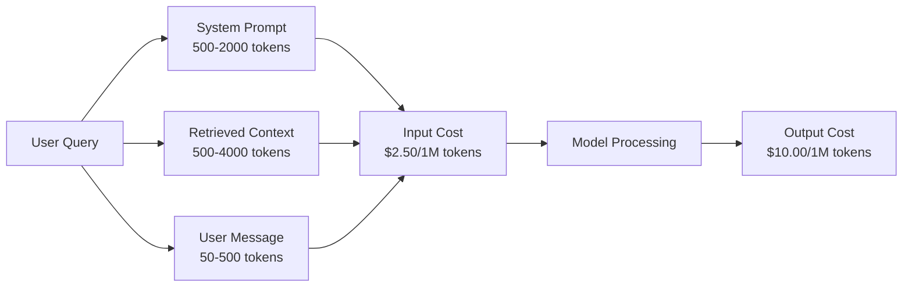
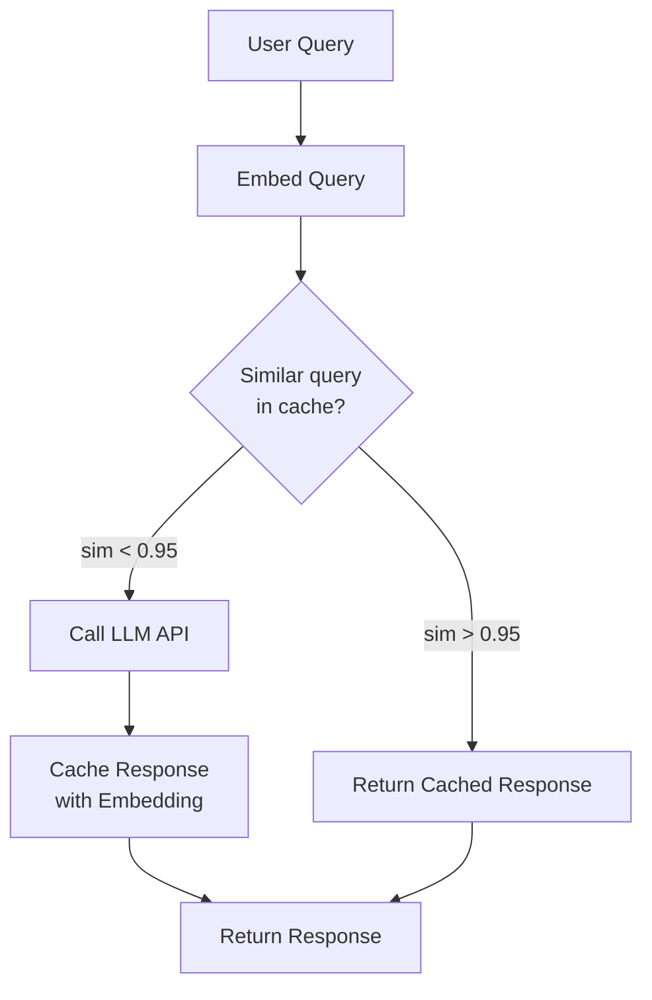
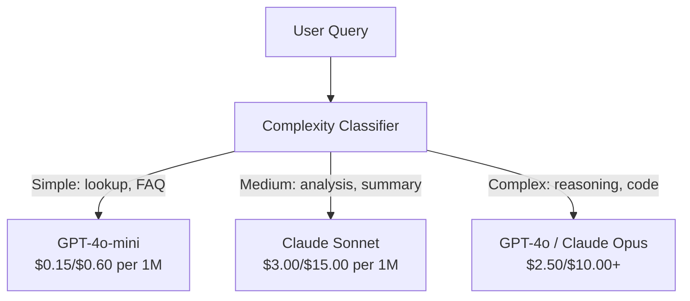

# Caching, giới hạn tỷ lệ & tối ưu hóa chi phí 缓存, giới hạn lưu lượng và tối ưu hóa chi phí

> Hầu hết các công ty khởi nghiệp AI không chết vì mô hình xấu. Họ chết vì nền kinh tế đơn vị xấu. Một cuộc gọi GPT-4o chỉ tốn một phần nhỏ một xu. 10 nghìn người dùng thực hiện 10 cuộc gọi mỗi ngày chỉ tốn 250 đô la chỉ bằng mã thông báo đầu vào - trước khi bạn tính phí một đô la. Những công ty sống sót là những người coi mỗi cuộc gọi API như một giao dịch tài chính, không phải là một cuộc gọi chức năng.

> **【中文解读】**Các công ty sáng lập AI hầu như chết vì mô hình kinh tế đơn vị tồi tệ, chứ không phải mô hình xấu. 10.000 người dùng dùng dùng 10 lần mỗi ngày, đầu vào mã thông báo chi phí 250 đô la/ngày.

> **【拓展：成本优化→AI商业化】**提示缓存(Prompt Caching) có thể giảm 50%-90% của chi phí suy luận,语义缓存(Semantic Cache) có thể tương tự như truy vấn, là chìa khóa để thực hiện lợi nhuận của AI 产品.

>  **【前置】**学本节前请先掌握:(1) Bước 11·09(Tạm dịch gọi);(2) Bước 11·04(Tạm dịch)语义缓存依赖嵌入;(3) Redis hoặc Memcached 基础。本节会用 `redis``fastapi-cache`Hoặc`gptcache`

**Type:** Build | **类型:** 构建
**Languages:** Python | **语言:** Python
**Prerequisites:** Phase 11 Lesson 09 (Function Calling) | **前置知识:** Phase 11 · 09 (函数调用)
**Time:** ~45 minutes | **时间:** ~45 分钟
**Related:**Bước 11 · 15 (Tạm dịch: Caching ngay lập tức)  bài học này bao gồm bộ nhớ cache lớp ứng dụng (thầm cache ngữ nghĩa, bộ nhớ cache hash chính xác, định tuyến mô hình). Bài học 15 bao gồm bộ nhớ cache cấp cấp cấp cấp cấp cấp (Anthropic cache_control, OpenAI tự động, Gemini CachedContent). Kết hợp cả hai để giảm chi phí 50-95%. ➡️**相关:**Giai đoạn 11 · 15 (提示缓存) 本课讲应用层缓存(语义缓存、精确哈希缓存、模型路由)  Bài học 15 讲提供商层提示缓存(Anthropic cache_control、OpenAI 自动、Gemini CachedContent) 结合两者可降低50-95% 成本。

## Mục tiêu học tập

- Thực hiện bộ nhớ cache ngữ nghĩa phục vụ các truy vấn lặp đi lặp lại hoặc tương tự từ bộ nhớ cache thay vì thực hiện một cuộc gọi API mới
  实现语义缓存, từ缓存服务重复或相似查询, chứ không phải là mỗi lần xây dựng API 调用
- Xét chi phí theo yêu cầu trên các nhà cung cấp và thực hiện giới hạn tỷ lệ và báo cáo ngân sách nhận thức về token
  跨供应商计算每请求成本,实现感知代币的流量限制和预算告警
- Xây dựng một lớp tối ưu hóa chi phí với nén nhanh, định tuyến mô hình (cắt tiền so với rẻ tiền) và lưu trữ trước thời gian phản ứng
  构建成本优化层,含提示压缩、模型路由(贵与便宜) và đáp ứng缓存
- Thiết kế chiến lược lưu trữ cache cấp bằng cách sử dụng sự phù hợp chính xác, sự tương đồng ngữ nghĩa và lưu trữ cache tiền tố cho các loại truy vấn khác nhau
  设计分层缓存策略, nhắm vào các loại truy vấn khác nhau bằng cách sử dụng sự phù hợp chính xác, sự tương đồng ngôn ngữ và dự trữ trước

> **【中文解读】**Mục tiêu của bài học: nắm bắt LLM  ứng dụng chiến lược tối ưu hóa chi phíPrompt Caching、语义缓存、模型路由、批处理──LLM API 成本是生产部署的主要支出──

>  **【类比】**Không mang theo lưu trữ của LLM  ứng dụng như nhà hàng mỗi khách hàng đã tái trồng thực phẩm 慢且贵──三层缓存像三级食材柜:(1) **精确哈希缓存**冰箱里现成菜(同问题直接返回,毫秒);(2) **语义缓存**                                                                                                                                                                                                                                                              **prompt caching** nhà cung cấp dự kiến thực phẩm tốt  hệ thống nhanh chóng  tái sử dụng,省 90% chi phí đầu vào) 组合起来可以把成本削减70-95%──

> ️ **【易错点】**缓存的 3 个坑:(1) **缓存中毒** người dùng hỏi"tài khoản dư lượng của tôi là bao nhiêu?"语义缓存命中"上次别人问的余额",返回错的数字;修复:带用户身份 hash 进缓存键,PII/个性化查询不缓存――(2) **相似度阈值过高**0.95 太严,命中率 < 5%; giảm xuống còn 0.85 + 加 LLM 二次验证("Những vấn đề này có bằng giá không?")―(3) **TTL 太长** báo chí loại truy vấn缓存 24h,模型答案过时;区分查询类型,事实查询 TTL=1h,聊天 TTL=24h──


## Vấn đề  vấn đề giới thiệu

Bạn xây dựng một chatbot RAG, nó hoạt động tuyệt vời người dùng thích nó.

Rồi hóa đơn đến.

> Bạn xây dựng một máy tính RAG 聊天机器. Nó hoạt động rất tốt. Người dùng rất thích nó.

Chi phí GPT-5 $5 per million input tokens and $15/million sản lượng.$15 input / $75 đầu ra.$1.25 input / $5 đầu ra. GPT-5-mini là $0.25/$2. Giá dưới đây là minh họa; luôn luôn kiểm tra trang giá hiện tại của nhà cung cấp.

> GPT-5 Mỗi triệu nhập mã thông báo$5，每百万输出 $Claude Opus 4.7 là$15/$75―Gemini 3 Pro là$1.25/$5 

Đây là toán học giết chết các startup:

> Đây là toán học để làm cho công ty khởi nghiệp bị thất bại:

- 10.000 người dùng hoạt động hàng ngày
  10.000 ngày sử dụng
- 10 truy vấn mỗi người dùng mỗi ngày
  Mỗi người dùng mỗi ngày 10 lần truy vấn
- 1,000 token nhập mỗi truy vấn (sự nhắc hệ thống + ngữ cảnh + thông điệp người dùng)
  Mỗi lần truy vấn 1.000 输入 token
- 500 token đầu ra mỗi phản ứng
  Mỗi lần đáp ứng 500   giao thông thông

**Monthly total:** **$22,500/month**

Đó chỉ là LLM. Thêm các nhúng, lưu trữ cơ sở dữ liệu vector, cơ sở hạ tầng. Bạn đang tìm kiếm $30,000 / tháng cho một chatbot.

> Đó chỉ là chi phí của LLM. Thêm vào việc nhúng, quản lý cơ sở dữ liệu, cơ sở hạ tầng.

Phần tàn bạo: 40-60% các truy vấn đó gần như là trùng lặp. Người dùng hỏi cùng một câu hỏi bằng các từ hơi khác nhau. Đơn xin hệ thống của bạn - giống nhau trên mọi yêu cầu - được tính phí mỗi lần. Tài liệu ngữ cảnh được RAG lấy lại lặp lại trên các người dùng hỏi về cùng một chủ đề.

> Phần tồi tệ: 40-60% truy vấn gần như lặp lại. Người dùng sử dụng từ ngữ khác nhau hỏi cùng một câu hỏi.

Bạn đang trả giá đầy đủ cho việc tính toán dư thừa.

> Bạn đang trả giá cho quá nhiều.

## Khái niệm cốt lõi

> **【中文解读】**Lợi ích của LLM API là một quan điểm quan trọng của việc triển khai sản xuất.

> **【拓展：LLM 成本的实际数据】**GPT-4o 定价 $5/$15 trên mỗi M token ((input/output),Claude 3.5 Sonnet $3/$15── một ngày sống 100 000 ứng dụng người dùng, mỗi lần giao dịch khoảng 2K đầu vào + 500 mã thông báo đầu ra, tháng chi phí khoảng $15,000-45,000── thông qua Caching nhanh có thể giảm khoảng 50%, sử dụng GPT-4o-mini 替代 đơn giản truy vấn có thể giảm 30%──


### Phân tích chi phí của cuộc gọi LLM

Mỗi cuộc gọi API có 5 thành phần chi phí.

> Mỗi lần API 调用 có 5 thành phần chi phí.



Các lệnh hệ thống là kẻ giết người im lặng. Một lệnh hệ thống 1500 token được gửi với mỗi yêu cầu chi phí.$3.75 per million requests just for that prefix. At 100K requests per day, that is $375 ngày -- 11.250 đô la/tháng -- cho văn bản không bao giờ thay đổi.

> 系统提示是沉默杀手──1,500 token 系统提示 每次请求都发送, 每百万请求只这个前就花$3.75。每天 10 万请求就是 $375/天$11,250/月为从未改变的文本.

### Caching của nhà cung cấp: Giảm giá tích hợp

Cả ba nhà cung cấp chính đều cung cấp bộ nhớ cache nhanh bên nhà cung cấp vào năm 2026, nhưng cơ chế khác nhau.

> 3 nhà cung cấp lớn sẽ cung cấp các dịch vụ trong năm 2026 nhưng cơ chế khác nhau.

| Provider | Mechanism | Discount | Minimum | Cache Duration |
|----------|-----------|----------|---------|----------------|
| Anthropic | Explicit cache_control markers | 90% on cache hits (pay 25% extra on write) | 1,024 tokens (Sonnet/Opus), 2,048 (Haiku) | 5 min default; 1h extended (2x write premium) |
| OpenAI | Automatic prefix matching | 50% on cache hits | 1,024 tokens | Best-effort up to 1 hour |
| Google Gemini | Explicit CachedContent API | ~75% reduction (plus storage) | 4,096 (Flash) / 32,768 (Pro) | User-configurable TTL |

**Anthropic's approach**Bạn đánh dấu các phần của lời nhắc của bạn với `cache_control: {"type": "ephemeral"}`. yêu cầu đầu tiên trả phí viết 25% yêu cầu tiếp theo với tiền đề tương tự nhận được giảm giá 90% một hệ thống 2.000 token yêu cầu chi phí đó$0.005 normally costs $0.000625 lần truy cập cache, hơn 100K yêu cầu, tiết kiệm 437.50 đô la/ngày.

> **Anthropic 方式**      `cache_control: {"type": "ephemeral"}`标记提示段──第一次请求付 25% 写入溢价──后续同前请求获得90%折扣──2,000 token 系统提示正常$0.005，缓存命中 $0.000625──100.000 yêu cầu省 $437.50/ ngày──

**OpenAI's approach**bất kỳ dấu tiền báo nào phù hợp với yêu cầu trước đó sẽ được giảm 50%. Không cần dấu hiệu. Sự thỏa hiệp: giảm giá ít hơn, ít kiểm soát hơn, nhưng không nỗ lực thực hiện.

> **OpenAI 方式**️️️️️️️️️️️️️️️️️️️️️️️️️️️️️️️️️️️️️️️️️️️️️️️️️️️️️️️️️️️️️️️️️️️️️️️️️️️️️️️️️️️️️️️️️️️️️️️️️️️️️️️️️️️️️️️️️️️️️️️️️️️️️️️️️️️️️️️️️️️️️️️️️️️️️️️️️️️️️️️️️️️️️️️️️️️️️️️️️️️️️️️️️️️️️️️️️️️️️️️️️️️️️️️️️️️️️️️️️️️

### Caching ngữ nghĩa: Lớp tùy chỉnh của bạn

Các nhà cung cấp cache chỉ hoạt động cho các tiền đề giống nhau. Caching ngữ nghĩa xử lý trường hợp khó khăn hơn: các truy vấn khác nhau với cùng một ý nghĩa.

> 提供商缓存只对相同的前生效──语义缓存处理更难的情况: khác nhau nhưng có cùng nghĩa──

"Cách trả lại là gì?" và "Tôi trả lại một mục như thế nào?" là chuỗi khác nhau nhưng ý định giống nhau. Một bộ nhớ cache ngữ nghĩa nhúng cả hai truy vấn, tính toán sự tương đồng cosine, và trả lại câu trả lời được lưu trữ trong bộ nhớ cache nếu sự tương đồng vượt quá ngưỡng (thường là 0.92-0.95).

> "退货政策是什么?"和"我怎么退货?"是不同字符串但意图相同──语义缓存把两个查询都嵌入,计算余弦相似度,若相似度超值(通常 0.92-0.95) trả về缓存响应──



Chi phí nhúng là vô cùng đáng kể. OpenAI's text-embedding-3-small chi phí 0,02 đô la mỗi triệu token. Kiểm tra bộ nhớ cache chi phí gần như không gì so với một cuộc gọi LLM đầy đủ.

> 嵌入成本可忽略──OpenAI text-embedding-3-small 每百万代币 $0.02──检查缓存相比完整LLM 调用几乎零成本──

### Caching chính xác: Hash và Match

Đối với các cuộc gọi xác định (giới nhiệt độ = 0, mô hình tương tự, yêu cầu tương tự), lưu trữ trước đúng là đơn giản hơn và nhanh hơn.

> Đối với xác định调用 (~ 0 ≠ ≠ ≠ ≠ ≠ ≠ ≠ ≠ ≠ ≠ ≠ ≠ ≠ ≠ ≠ ≠ ≠ ≠ ≠ ≠ ≠ ≠ ≠ ≠ ≠ ≠ ≠ ≠ ≠ ≠ ≠ ≠ ≠ ≠ ≠ ≠ ≠ ≠ ≠ ≠ ≠ ≠ ≠ ≠ ≠ ≠ ≠ ≠ ≠ ≠ ≠ ≠ ≠ ≠ ≠ ≠ ≠ ≠ ≠ ≠ ≠ ≠ ≠ ≠ ≠ ≠ ≠ ≠ ≠ ≠ ≠ ≠ ≠ ≠ ≠ ≠ ≠ ≠ ≠ ≠ ≠ ≠ ≠ ≠ ≠ ≠ ≠ ≠ ≠ ≠ ≠ ≠ ≠ ≠ ≠ ≠ ≠ ≠ ≠ ≠ ≠ ≠ ≠ ≠ ≠ ≠ ≠ ≠ ≠ ≠ ≠ ≠ ≠ ≠ ≠  ≠  ≠   ≠  ≠    ≠                                                                                                                                                                                                                                                             

Điều này hoạt động hoàn hảo cho:

> Đây là một trong những cảnh tượng hoàn hảo:

- System prompt + liên kết cố định + truy vấn người dùng giống nhau
  系统提示 + 固定上下文 + 相同用户查询
- Đổi hàm với các định nghĩa công cụ giống nhau
  相同工具定义的函数调用
- Phân tích tập hợp trong đó cùng một tài liệu được xử lý nhiều lần
  相同文档多次处理的批处理

### Giới hạn số tiền: Bảo vệ ngân sách của bạn

Việc giới hạn tỷ lệ không chỉ là về công bằng mà còn là về sự sống sót.

> 限流不只是公平问题,是生存问题.

**Token bucket algorithm:**mỗi người dùng nhận được một thùng N token được lấp đầy với tốc độ R mỗi giây. Một yêu cầu tiêu thụ token từ thùng. Nếu thùng trống, yêu cầu bị từ chối. Điều này cho phép nổ (tiêu dụng toàn bộ thùng cùng một lúc) trong khi thực thi một mức trung bình.
**令牌桶算法**Mỗi người dùng một cái n mã 桶, theo R/ giây tốc độ bổ sung.                                                                                                                                                                                                                                                      

**Per-user quotas:**Đặt giới hạn token hàng ngày/tuần mỗi người dùng.
**每用户配额**: theo cấp người dùng设日/月 biểu tượng 上限。

| Tier | Daily Token Limit | Max Requests/min | Model Access |
|------|------------------|------------------|-------------|
| Free | 50,000 | 10 | GPT-4o-mini only |
| Pro | 500,000 | 60 | GPT-4o, Claude Sonnet |
| Enterprise | 5,000,000 | 300 | All models |

### Mô hình định tuyến: Mô hình đúng cho công việc đúng

Không phải mọi truy vấn đều cần GPT-4o.

> Không phải mỗi truy vấn đều cần GPT-4o.

"Thủ cửa hàng đóng vào lúc nào?" không yêu cầu một $10/M-output model. GPT-4o-mini at $Xuất khẩu 0.60/M xử lý hoàn hảo. Claude Haiku với giá 1.25/M xử lý nó. Một trình phân loại đơn giản chuyển các truy vấn giá rẻ sang các mô hình giá rẻ và các truy vấn phức tạp sang các mô hình đắt tiền.

> "Thủ vài giờ để mở cửa?" Không cần.$10/M 输出模型。$0.60/M 输出 GPT-4o-mini 完全胜任。 $1.25/M 输出 Claude Haiku 也可以──简单分类器把便宜查询路由到便宜模型,复杂查询路由到贵模型──



Một bộ định tuyến được điều chỉnh tốt tiết kiệm 40-70% chỉ trên chi phí mô hình.

> 调好的路由器单在模型成本省 40% -70%

### Theo dõi chi phí: Biết tiền đi đâu

Bạn không thể tối ưu hóa những gì bạn không đo. ghi lại mọi cuộc gọi API với:

> Không thể tối ưu hóa không đo lượng thứ... mỗi lần API 调用记录:

- Tiêu khắc thời gian
  时间
- Tên mẫu
  模型名
- Các token nhập
  输入 token
- Các token đầu ra
  输出 token
- Tốc độ trễ (ms)
  延迟(毫秒)
- Chi phí tính toán ($)
  计算成本($)
- ID người dùng
  User ID
- Cache hit/miss
  缓存命中/未中
- Phân loại yêu cầu
  Các yêu cầu

Dữ liệu này cho thấy các tính năng nào đắt tiền, người dùng nào là người tiêu dùng nặng nề, và nơi lưu trữ bộ nhớ cache có tác động lớn nhất.

> Dữ liệu này cho thấy những chức năng nào có giá trị, những người dùng tiêu thụ nhiều hơn, sự tồn tại có tác động lớn nhất.

### Lượng hàng: Giảm giá hàng loạt

OpenAI's Batch API xử lý yêu cầu theo cách không đồng bộ với giảm 50%. Bạn gửi một lô lên đến 50.000 yêu cầu, và kết quả sẽ trở lại trong vòng 24 giờ.

> OpenAI Batch API 异步处理请求,50%折扣──提交最高50.000 yêu cầu批次,24小时内回复结果──

Sử dụng đợt đợt cho:

> 批处理 được sử dụng:

- Việc xử lý tài liệu mỗi đêm
  Đêm văn档 xử lý
- Định dạng hàng loạt
  批量分类
- Các cuộc đánh giá
  评估运行
- Các đường ống làm giàu dữ liệu
  Số liệu nguồn nước

Không dành cho: truy vấn thời gian thực đối với người dùng (vấn đề trễ).
Không được sử dụng:实时面向用户查询 (延迟重要)

### Các cảnh báo về ngân sách và các sự phá vỡ mạch

Nếu bạn không có một bộ phận cắt mạch, bạn sẽ không chi tiêu nữa, và nếu không có bộ phận cắt mạch, bạn có thể bị lỗi hoặc lạm dụng trong vài giờ.

> 断路器在达到上限时停止支出――没有它,bug或滥用几小时就烧光月预算――

Đặt ba ngưỡng:

> 设三个值:

1. **Warning**(70% ngân sách): gửi cảnh báo
   **警告**(预算 70%):发告警
2. **Throttle**(85% ngân sách): chỉ chuyển sang các mô hình rẻ hơn
   **降速**(Budget 85%): chỉ chuyển thành mô hình rẻ hơn
3. **Stop**(95% ngân sách): từ chối yêu cầu mới, chỉ trả lời được lưu trữ trong cache
   **停止**(Budget 95%): từ chối yêu cầu mới, chỉ trả lại dự trữ đáp ứng

### Đám tối ưu hóa

Sử dụng các kỹ thuật này theo thứ tự.

> 按顺序应用这些技术――每层叠加在前一层之上――

| Layer | Technique | Typical Savings | Implementation Effort |
|-------|-----------|----------------|----------------------|
| 1 | Provider prompt caching | 30-50% | Low (add cache markers) |
| 2 | Exact caching | 10-20% | Low (hash + dict) |
| 3 | Semantic caching | 15-30% | Medium (embeddings + similarity) |
| 4 | Model routing | 40-70% | Medium (classifier) |
| 5 | Rate limiting | Budget protection | Low (token bucket) |
| 6 | Prompt compression | 10-30% | Medium (rewrite prompts) |
| 7 | Batching | 50% on eligible | Low (batch API) |

Một ứng dụng RAG áp dụng các lớp 1-5 thường làm giảm chi phí từ $22,500/month to $Đó là sự khác biệt giữa việc đốt đường băng và xây dựng một doanh nghiệp.

>  ứng dụng 1-5 tầng RAG  ứng dụng thường đưa chi phí hàng tháng từ $22,500 降到 $4000-6000... Đó là sự khác biệt giữa việc làm việc và việc làm kinh doanh.

### Tiết kiệm thực sự: trước và sau

Đây là sự cố thực sự cho một chatbot RAG phục vụ 10.000 DAU.

> Đây là sự phân tích thực sự của máy tính RAG 10.000 DAU.

| Metric | Before Optimization | After Optimization | Savings |
|--------|--------------------|--------------------|---------|
| Monthly LLM cost | $22,500 | $5,200 | 77% |
| Avg cost per query | $0.0075 | $0.0017 | 77% |
| Cache hit rate | 0% | 52% | -- |
| Queries routed to mini | 0% | 65% | -- |
| P95 latency | 2,800ms | 900ms (cache hits: 50ms) | 68% |
| Monthly embedding cost | $0 | $180 | (new cost) |
| Total monthly cost | $22,500 | $5,380 | 76% |

Chi phí nhúng cho lưu trữ cache ngữ nghĩa (tương đương 180 USD/tháng) tự trả cho mình trong vòng một giờ đầu tiên của truy cập cache.

> 语义缓存的嵌入成本 ($180/月) trong vòng 1 giờ trong thời gian dự trữ

## Hãy xây dựng nó.
```figure
semantic-cache
```

## Hãy xây dựng nó

### Bước 1: Máy tính chi phí

Xây dựng một máy tính tính chi phí token biết giá hiện tại cho các mô hình lớn.

> 构建代币 成本计算器,知道主要模型当前定价──

```python
import hashlib
import time
import json
import math
from dataclasses import dataclass, field


MODEL_PRICING = {
    "gpt-4o": {"input": 2.50, "output": 10.00, "cached_input": 1.25},
    "gpt-4o-mini": {"input": 0.15, "output": 0.60, "cached_input": 0.075},
    "gpt-4.1": {"input": 2.00, "output": 8.00, "cached_input": 0.50},
    "gpt-4.1-mini": {"input": 0.40, "output": 1.60, "cached_input": 0.10},
    "gpt-4.1-nano": {"input": 0.10, "output": 0.40, "cached_input": 0.025},
    "o3": {"input": 2.00, "output": 8.00, "cached_input": 0.50},
    "o3-mini": {"input": 1.10, "output": 4.40, "cached_input": 0.55},
    "o4-mini": {"input": 1.10, "output": 4.40, "cached_input": 0.275},
    "claude-opus-4": {"input": 15.00, "output": 75.00, "cached_input": 1.50},
    "claude-sonnet-4": {"input": 3.00, "output": 15.00, "cached_input": 0.30},
    "claude-haiku-3.5": {"input": 0.80, "output": 4.00, "cached_input": 0.08},
    "gemini-2.5-pro": {"input": 1.25, "output": 10.00, "cached_input": 0.3125},
    "gemini-2.5-flash": {"input": 0.15, "output": 0.60, "cached_input": 0.0375},
}


def calculate_cost(model, input_tokens, output_tokens, cached_input_tokens=0):
    if model not in MODEL_PRICING:
        return {"error": f"Unknown model: {model}"}
    pricing = MODEL_PRICING[model]
    non_cached = input_tokens - cached_input_tokens
    input_cost = (non_cached / 1_000_000) * pricing["input"]
    cached_cost = (cached_input_tokens / 1_000_000) * pricing["cached_input"]
    output_cost = (output_tokens / 1_000_000) * pricing["output"]
    total = input_cost + cached_cost + output_cost
    return {
        "model": model,
        "input_tokens": input_tokens,
        "output_tokens": output_tokens,
        "cached_input_tokens": cached_input_tokens,
        "input_cost": round(input_cost, 6),
        "cached_input_cost": round(cached_cost, 6),
        "output_cost": round(output_cost, 6),
        "total_cost": round(total, 6),
    }
```

### Bước 2: Cache chính xác

Hash đầy đủ yêu cầu và trả lại trả lời được lưu trữ trong cache cho các yêu cầu giống nhau.

> 哈希完整提示, đối với cùng một yêu cầu trả lại缓存响应

```python
class ExactCache:
    def __init__(self, max_size=1000, ttl_seconds=3600):
        self.cache = {}
        self.max_size = max_size
        self.ttl = ttl_seconds
        self.hits = 0
        self.misses = 0

    def _hash(self, model, messages, temperature):
        key_data = json.dumps({"model": model, "messages": messages, "temperature": temperature}, sort_keys=True)
        return hashlib.sha256(key_data.encode()).hexdigest()

    def get(self, model, messages, temperature=0.0):
        if temperature > 0:
            self.misses += 1
            return None
        key = self._hash(model, messages, temperature)
        if key in self.cache:
            entry = self.cache[key]
            if time.time() - entry["timestamp"] < self.ttl:
                self.hits += 1
                entry["access_count"] += 1
                return entry["response"]
            del self.cache[key]
        self.misses += 1
        return None

    def put(self, model, messages, temperature, response):
        if temperature > 0:
            return
        if len(self.cache) >= self.max_size:
            oldest_key = min(self.cache, key=lambda k: self.cache[k]["timestamp"])
            del self.cache[oldest_key]
        key = self._hash(model, messages, temperature)
        self.cache[key] = {
            "response": response,
            "timestamp": time.time(),
            "access_count": 1,
        }

    def stats(self):
        total = self.hits + self.misses
        return {
            "hits": self.hits,
            "misses": self.misses,
            "hit_rate": round(self.hits / total, 4) if total > 0 else 0,
            "cache_size": len(self.cache),
        }
```

### Bước 3: Cache ngữ nghĩa

Nhúng các truy vấn và trả lời được lưu trữ trong cache khi sự tương đồng vượt quá ngưỡng.

> 嵌入查询,相似度超值时返回缓存响应──

```python
def simple_embed(text):
    words = text.lower().split()
    vocab = {}
    for w in words:
        vocab[w] = vocab.get(w, 0) + 1
    norm = math.sqrt(sum(v * v for v in vocab.values()))
    if norm == 0:
        return {}
    return {k: v / norm for k, v in vocab.items()}


def cosine_similarity(a, b):
    if not a or not b:
        return 0.0
    all_keys = set(a) | set(b)
    dot = sum(a.get(k, 0) * b.get(k, 0) for k in all_keys)
    return dot


class SemanticCache:
    def __init__(self, similarity_threshold=0.85, max_size=500, ttl_seconds=3600):
        self.entries = []
        self.threshold = similarity_threshold
        self.max_size = max_size
        self.ttl = ttl_seconds
        self.hits = 0
        self.misses = 0

    def get(self, query):
        query_embedding = simple_embed(query)
        now = time.time()
        best_match = None
        best_sim = 0.0
        for entry in self.entries:
            if now - entry["timestamp"] > self.ttl:
                continue
            sim = cosine_similarity(query_embedding, entry["embedding"])
            if sim > best_sim:
                best_sim = sim
                best_match = entry
        if best_match and best_sim >= self.threshold:
            self.hits += 1
            best_match["access_count"] += 1
            return {"response": best_match["response"], "similarity": round(best_sim, 4), "original_query": best_match["query"]}
        self.misses += 1
        return None

    def put(self, query, response):
        if len(self.entries) >= self.max_size:
            self.entries.sort(key=lambda e: e["timestamp"])
            self.entries.pop(0)
        self.entries.append({
            "query": query,
            "embedding": simple_embed(query),
            "response": response,
            "timestamp": time.time(),
            "access_count": 1,
        })

    def stats(self):
        total = self.hits + self.misses
        return {
            "hits": self.hits,
            "misses": self.misses,
            "hit_rate": round(self.hits / total, 4) if total > 0 else 0,
            "cache_size": len(self.entries),
        }
```

### Bước 4: Đài giới hạn tỷ lệ

Đài giới hạn tỷ lệ token bucket với hạn chế cho mỗi người dùng.

> Làm cho các thiết bị giới hạn, bao gồm mỗi số lượng người dùng.

```python
class TokenBucketRateLimiter:
    def __init__(self):
        self.buckets = {}
        self.tiers = {
            "free": {"capacity": 50_000, "refill_rate": 500, "max_requests_per_min": 10},
            "pro": {"capacity": 500_000, "refill_rate": 5_000, "max_requests_per_min": 60},
            "enterprise": {"capacity": 5_000_000, "refill_rate": 50_000, "max_requests_per_min": 300},
        }

    def _get_bucket(self, user_id, tier="free"):
        if user_id not in self.buckets:
            tier_config = self.tiers.get(tier, self.tiers["free"])
            self.buckets[user_id] = {
                "tokens": tier_config["capacity"],
                "capacity": tier_config["capacity"],
                "refill_rate": tier_config["refill_rate"],
                "last_refill": time.time(),
                "request_timestamps": [],
                "max_rpm": tier_config["max_requests_per_min"],
                "tier": tier,
                "total_tokens_used": 0,
            }
        return self.buckets[user_id]

    def _refill(self, bucket):
        now = time.time()
        elapsed = now - bucket["last_refill"]
        refill = int(elapsed * bucket["refill_rate"])
        if refill > 0:
            bucket["tokens"] = min(bucket["capacity"], bucket["tokens"] + refill)
            bucket["last_refill"] = now

    def check(self, user_id, tokens_needed, tier="free"):
        bucket = self._get_bucket(user_id, tier)
        self._refill(bucket)
        now = time.time()
        bucket["request_timestamps"] = [t for t in bucket["request_timestamps"] if now - t < 60]
        if len(bucket["request_timestamps"]) >= bucket["max_rpm"]:
            return {"allowed": False, "reason": "rate_limit", "retry_after_seconds": 60 - (now - bucket["request_timestamps"][0])}
        if bucket["tokens"] < tokens_needed:
            deficit = tokens_needed - bucket["tokens"]
            wait = deficit / bucket["refill_rate"]
            return {"allowed": False, "reason": "token_limit", "tokens_available": bucket["tokens"], "retry_after_seconds": round(wait, 1)}
        return {"allowed": True, "tokens_available": bucket["tokens"]}

    def consume(self, user_id, tokens_used, tier="free"):
        bucket = self._get_bucket(user_id, tier)
        bucket["tokens"] -= tokens_used
        bucket["request_timestamps"].append(time.time())
        bucket["total_tokens_used"] += tokens_used

    def get_usage(self, user_id):
        if user_id not in self.buckets:
            return {"error": "User not found"}
        b = self.buckets[user_id]
        return {
            "user_id": user_id,
            "tier": b["tier"],
            "tokens_remaining": b["tokens"],
            "capacity": b["capacity"],
            "total_tokens_used": b["total_tokens_used"],
            "utilization": round(b["total_tokens_used"] / b["capacity"], 4) if b["capacity"] else 0,
        }
```

### Bước 5: Đánh giá chi phí

Lập nhật mọi cuộc gọi và tính tổng số chạy.

> 记录 mỗi lần调用并计算累累计总额――

```python
class CostTracker:
    def __init__(self, monthly_budget=1000.0):
        self.logs = []
        self.monthly_budget = monthly_budget
        self.alerts = []

    def log_call(self, model, input_tokens, output_tokens, cached_input_tokens=0, latency_ms=0, user_id="anonymous", cache_status="miss"):
        cost = calculate_cost(model, input_tokens, output_tokens, cached_input_tokens)
        entry = {
            "timestamp": time.time(),
            "model": model,
            "input_tokens": input_tokens,
            "output_tokens": output_tokens,
            "cached_input_tokens": cached_input_tokens,
            "latency_ms": latency_ms,
            "cost": cost["total_cost"],
            "user_id": user_id,
            "cache_status": cache_status,
        }
        self.logs.append(entry)
        self._check_budget()
        return entry

    def _check_budget(self):
        total = self.total_cost()
        pct = total / self.monthly_budget if self.monthly_budget > 0 else 0
        if pct >= 0.95 and not any(a["level"] == "stop" for a in self.alerts):
            self.alerts.append({"level": "stop", "message": f"Budget 95% consumed: ${total:.2f}/${self.monthly_budget:.2f}", "timestamp": time.time()})
        elif pct >= 0.85 and not any(a["level"] == "throttle" for a in self.alerts):
            self.alerts.append({"level": "throttle", "message": f"Budget 85% consumed: ${total:.2f}/${self.monthly_budget:.2f}", "timestamp": time.time()})
        elif pct >= 0.70 and not any(a["level"] == "warning" for a in self.alerts):
            self.alerts.append({"level": "warning", "message": f"Budget 70% consumed: ${total:.2f}/${self.monthly_budget:.2f}", "timestamp": time.time()})

    def total_cost(self):
        return round(sum(e["cost"] for e in self.logs), 6)

    def cost_by_model(self):
        by_model = {}
        for e in self.logs:
            m = e["model"]
            if m not in by_model:
                by_model[m] = {"calls": 0, "cost": 0, "input_tokens": 0, "output_tokens": 0}
            by_model[m]["calls"] += 1
            by_model[m]["cost"] = round(by_model[m]["cost"] + e["cost"], 6)
            by_model[m]["input_tokens"] += e["input_tokens"]
            by_model[m]["output_tokens"] += e["output_tokens"]
        return by_model

    def cache_savings(self):
        cache_hits = [e for e in self.logs if e["cache_status"] == "hit"]
        if not cache_hits:
            return {"saved": 0, "cache_hits": 0}
        saved = 0
        for e in cache_hits:
            full_cost = calculate_cost(e["model"], e["input_tokens"], e["output_tokens"])
            saved += full_cost["total_cost"]
        return {"saved": round(saved, 4), "cache_hits": len(cache_hits)}

    def summary(self):
        if not self.logs:
            return {"total_calls": 0, "total_cost": 0}
        total_latency = sum(e["latency_ms"] for e in self.logs)
        cache_hits = sum(1 for e in self.logs if e["cache_status"] == "hit")
        return {
            "total_calls": len(self.logs),
            "total_cost": self.total_cost(),
            "avg_cost_per_call": round(self.total_cost() / len(self.logs), 6),
            "avg_latency_ms": round(total_latency / len(self.logs), 1),
            "cache_hit_rate": round(cache_hits / len(self.logs), 4),
            "cost_by_model": self.cost_by_model(),
            "cache_savings": self.cache_savings(),
            "budget_remaining": round(self.monthly_budget - self.total_cost(), 2),
            "budget_utilization": round(self.total_cost() / self.monthly_budget, 4) if self.monthly_budget > 0 else 0,
            "alerts": self.alerts,
        }
```

### Bước 6: Mô hình router

Đưa các truy vấn đến mô hình rẻ nhất có thể xử lý chúng.

> Đưa các truy vấn qua đường đến có thể xử lý chúng mô hình rẻ nhất.

```python
SIMPLE_KEYWORDS = ["what time", "hours", "address", "phone", "price", "return policy", "hello", "hi", "thanks", "yes", "no"]
COMPLEX_KEYWORDS = ["analyze", "compare", "explain why", "write code", "debug", "architect", "design", "trade-off", "evaluate"]


def classify_complexity(query):
    q = query.lower()
    if len(q.split()) <= 5 or any(kw in q for kw in SIMPLE_KEYWORDS):
        return "simple"
    if any(kw in q for kw in COMPLEX_KEYWORDS):
        return "complex"
    return "medium"


def route_model(query, tier="pro"):
    complexity = classify_complexity(query)
    routing_table = {
        "simple": {"free": "gpt-4.1-nano", "pro": "gpt-4o-mini", "enterprise": "gpt-4o-mini"},
        "medium": {"free": "gpt-4o-mini", "pro": "claude-sonnet-4", "enterprise": "claude-sonnet-4"},
        "complex": {"free": "gpt-4o-mini", "pro": "gpt-4o", "enterprise": "claude-opus-4"},
    }
    model = routing_table[complexity].get(tier, "gpt-4o-mini")
    return {"query": query, "complexity": complexity, "model": model, "tier": tier}
```

### Bước 7: chạy Demo

> 运行演示――

```python
def simulate_llm_call(model, query):
    input_tokens = len(query.split()) * 4 + 500
    output_tokens = 150 + (len(query.split()) * 2)
    latency = 200 + (output_tokens * 2)
    return {
        "model": model,
        "response": f"[Simulated {model} response to: {query[:50]}...]",
        "input_tokens": input_tokens,
        "output_tokens": output_tokens,
        "latency_ms": latency,
    }


def run_demo():
    print("=" * 60)
    print("  Caching, Rate Limiting & Cost Optimization Demo")
    print("=" * 60)

    print("\n--- Model Pricing ---")
    for model, pricing in list(MODEL_PRICING.items())[:6]:
        cost_1k = calculate_cost(model, 1000, 500)
        print(f"  {model}: ${cost_1k['total_cost']:.6f} per 1K in + 500 out")

    print("\n--- Cost Comparison: 100K Requests ---")
    for model in ["gpt-4o", "gpt-4o-mini", "claude-sonnet-4", "claude-haiku-3.5"]:
        cost = calculate_cost(model, 1000 * 100_000, 500 * 100_000)
        print(f"  {model}: ${cost['total_cost']:.2f}")

    print("\n--- Anthropic Cache Savings ---")
    no_cache = calculate_cost("claude-sonnet-4", 2000, 500, 0)
    with_cache = calculate_cost("claude-sonnet-4", 2000, 500, 1500)
    saving = no_cache["total_cost"] - with_cache["total_cost"]
    print(f"  Without cache: ${no_cache['total_cost']:.6f}")
    print(f"  With 1500 cached tokens: ${with_cache['total_cost']:.6f}")
    print(f"  Savings per call: ${saving:.6f} ({saving/no_cache['total_cost']*100:.1f}%)")

    exact_cache = ExactCache(max_size=100, ttl_seconds=300)
    semantic_cache = SemanticCache(similarity_threshold=0.75, max_size=100)
    rate_limiter = TokenBucketRateLimiter()
    tracker = CostTracker(monthly_budget=100.0)

    print("\n--- Exact Cache ---")
    messages_1 = [{"role": "user", "content": "What is the return policy?"}]
    result = exact_cache.get("gpt-4o-mini", messages_1, 0.0)
    print(f"  First lookup: {'HIT' if result else 'MISS'}")
    exact_cache.put("gpt-4o-mini", messages_1, 0.0, "You can return items within 30 days.")
    result = exact_cache.get("gpt-4o-mini", messages_1, 0.0)
    print(f"  Second lookup: {'HIT' if result else 'MISS'} -> {result}")
    result = exact_cache.get("gpt-4o-mini", messages_1, 0.7)
    print(f"  With temp=0.7: {'HIT' if result else 'MISS (non-deterministic, skip cache)'}")
    print(f"  Stats: {exact_cache.stats()}")

    print("\n--- Semantic Cache ---")
    test_queries = [
        ("What is the return policy?", "Items can be returned within 30 days with receipt."),
        ("How do I return an item?", None),
        ("What are your store hours?", "We are open 9am-9pm Monday through Saturday."),
        ("When does the store open?", None),
        ("Tell me about quantum computing", "Quantum computers use qubits..."),
        ("Explain quantum mechanics", None),
    ]
    for query, response in test_queries:
        cached = semantic_cache.get(query)
        if cached:
            print(f"  '{query[:40]}' -> CACHE HIT (sim={cached['similarity']}, original='{cached['original_query'][:40]}')")
        elif response:
            semantic_cache.put(query, response)
            print(f"  '{query[:40]}' -> MISS (stored)")
        else:
            print(f"  '{query[:40]}' -> MISS (no match)")
    print(f"  Stats: {semantic_cache.stats()}")

    print("\n--- Rate Limiting ---")
    for i in range(12):
        check = rate_limiter.check("user_1", 1000, "free")
        if check["allowed"]:
            rate_limiter.consume("user_1", 1000, "free")
        status = "OK" if check["allowed"] else f"BLOCKED ({check['reason']})"
        if i < 5 or not check["allowed"]:
            print(f"  Request {i+1}: {status}")
    print(f"  Usage: {rate_limiter.get_usage('user_1')}")

    print("\n--- Model Routing ---")
    routing_queries = [
        "What time do you close?",
        "Summarize this quarterly earnings report",
        "Analyze the trade-offs between microservices and monoliths",
        "Hello",
        "Write code for a binary search tree with deletion",
    ]
    for q in routing_queries:
        route = route_model(q, "pro")
        print(f"  '{q[:50]}' -> {route['model']} ({route['complexity']})")

    print("\n--- Full Pipeline: Before vs After Optimization ---")
    queries = [
        "What is the return policy?",
        "How do I return something?",
        "What are your hours?",
        "When do you open?",
        "Explain the difference between TCP and UDP",
        "Compare TCP vs UDP protocols",
        "Hello",
        "What is your phone number?",
        "Write a Python function to sort a list",
        "Analyze the pros and cons of serverless architecture",
    ]

    print("\n  [Before: no caching, single model (gpt-4o)]")
    tracker_before = CostTracker(monthly_budget=1000.0)
    for q in queries:
        result = simulate_llm_call("gpt-4o", q)
        tracker_before.log_call("gpt-4o", result["input_tokens"], result["output_tokens"], latency_ms=result["latency_ms"], cache_status="miss")
    before = tracker_before.summary()
    print(f"  Total cost: ${before['total_cost']:.6f}")
    print(f"  Avg cost/call: ${before['avg_cost_per_call']:.6f}")
    print(f"  Avg latency: {before['avg_latency_ms']}ms")

    print("\n  [After: caching + routing + rate limiting]")
    exact_c = ExactCache()
    semantic_c = SemanticCache(similarity_threshold=0.75)
    tracker_after = CostTracker(monthly_budget=1000.0)

    for q in queries:
        messages = [{"role": "user", "content": q}]
        cached = exact_c.get("gpt-4o", messages, 0.0)
        if cached:
            tracker_after.log_call("gpt-4o-mini", 0, 0, latency_ms=5, cache_status="hit")
            continue
        sem_cached = semantic_c.get(q)
        if sem_cached:
            tracker_after.log_call("gpt-4o-mini", 0, 0, latency_ms=15, cache_status="hit")
            continue
        route = route_model(q)
        result = simulate_llm_call(route["model"], q)
        tracker_after.log_call(route["model"], result["input_tokens"], result["output_tokens"], latency_ms=result["latency_ms"], cache_status="miss")
        exact_c.put(route["model"], messages, 0.0, result["response"])
        semantic_c.put(q, result["response"])

    after = tracker_after.summary()
    print(f"  Total cost: ${after['total_cost']:.6f}")
    print(f"  Avg cost/call: ${after['avg_cost_per_call']:.6f}")
    print(f"  Avg latency: {after['avg_latency_ms']}ms")
    print(f"  Cache hit rate: {after['cache_hit_rate']:.0%}")

    if before["total_cost"] > 0:
        savings_pct = (1 - after["total_cost"] / before["total_cost"]) * 100
        print(f"\n  SAVINGS: {savings_pct:.1f}% cost reduction")
        print(f"  Latency improvement: {(1 - after['avg_latency_ms'] / before['avg_latency_ms']) * 100:.1f}% faster")

    print("\n--- Budget Alerts Demo ---")
    alert_tracker = CostTracker(monthly_budget=0.01)
    for i in range(5):
        alert_tracker.log_call("gpt-4o", 5000, 2000, latency_ms=500)
    print(f"  Total spent: ${alert_tracker.total_cost():.6f} / ${alert_tracker.monthly_budget}")
    for alert in alert_tracker.alerts:
        print(f"  ALERT [{alert['level'].upper()}]: {alert['message']}")

    print("\n--- Cost Breakdown by Model ---")
    multi_tracker = CostTracker(monthly_budget=500.0)
    for _ in range(50):
        multi_tracker.log_call("gpt-4o-mini", 800, 200, latency_ms=150)
    for _ in range(30):
        multi_tracker.log_call("claude-sonnet-4", 1500, 500, latency_ms=400)
    for _ in range(10):
        multi_tracker.log_call("gpt-4o", 2000, 800, latency_ms=600)
    for _ in range(10):
        multi_tracker.log_call("claude-opus-4", 3000, 1000, latency_ms=1200)
    breakdown = multi_tracker.cost_by_model()
    for model, data in sorted(breakdown.items(), key=lambda x: x[1]["cost"], reverse=True):
        print(f"  {model}: {data['calls']} calls, ${data['cost']:.6f}, {data['input_tokens']:,} in / {data['output_tokens']:,} out")
    print(f"  Total: ${multi_tracker.total_cost():.6f}")

    print("\n" + "=" * 60)
    print("  Demo complete.")
    print("=" * 60)


if __name__ == "__main__":
    run_demo()
```

## Hãy sử dụng nó để thực hiện

### Caching nhanh chóng của loài người

> Nhân văn 提示缓存。

```python
# import anthropic
#
# client = anthropic.Anthropic()
#
# response = client.messages.create(
#     model="claude-sonnet-5",
#     max_tokens=1024,
#     system=[
#         {
#             "type": "text",
#             "text": "You are a helpful customer support agent for Acme Corp...",
#             "cache_control": {"type": "ephemeral"},
#         }
#     ],
#     messages=[{"role": "user", "content": "What is the return policy?"}],
# )
#
# print(f"Input tokens: {response.usage.input_tokens}")
# print(f"Cache creation tokens: {response.usage.cache_creation_input_tokens}")
# print(f"Cache read tokens: {response.usage.cache_read_input_tokens}")
```

Cuộc gọi đầu tiên được viết vào bộ nhớ cache (25% phí phí). Mỗi cuộc gọi tiếp theo với cùng một hệ thống nhắc tiền đề được đọc từ bộ nhớ cache (90% giảm giá). bộ nhớ cache kéo dài 5 phút và đặt lại bộ hẹn giờ trên mỗi lần nhấn.

> 首次调用写缓存(25% 溢价) 』后续同系统提示前的调用读缓存(90% 折扣) 』缓存 5 分钟, mỗi lần命中重置计时器──

### OpenAI tự động lưu trữ

> OpenAI tự động lưu trữ

```python
# from openai import OpenAI
#
# client = OpenAI()
#
# response = client.chat.completions.create(
#     model="gpt-4o",
#     messages=[
#         {"role": "system", "content": "You are a helpful customer support agent..."},
#         {"role": "user", "content": "What is the return policy?"},
#     ],
# )
#
# print(f"Prompt tokens: {response.usage.prompt_tokens}")
# print(f"Cached tokens: {response.usage.prompt_tokens_details.cached_tokens}")
# print(f"Completion tokens: {response.usage.completion_tokens}")
```

OpenAI tự động lưu trữ. Bất kỳ tiền tố nào của 1.024 + token phù hợp với yêu cầu gần đây đều được giảm 50%. Không cần thay đổi mã - chỉ cần kiểm tra`prompt_tokens_details.cached_tokens`trong câu trả lời để xác minh nó đang hoạt động.

> OpenAI tự động lưu trữ  Bất kỳ 1,024+ token 匹配 gần đây yêu cầu 提示前得50%折扣 无需改码 检查响应中 `prompt_tokens_details.cached_tokens`验证即可──

### OpenAI Batch API

> OpenAI Batch API

```python
# import json
# from openai import OpenAI
#
# client = OpenAI()
#
# requests = []
# for i, query in enumerate(queries):
#     requests.append({
#         "custom_id": f"request-{i}",
#         "method": "POST",
#         "url": "/v1/chat/completions",
#         "body": {
#             "model": "gpt-4o-mini",
#             "messages": [{"role": "user", "content": query}],
#         },
#     })
#
# with open("batch_input.jsonl", "w") as f:
#     for r in requests:
#         f.write(json.dumps(r) + "\n")
#
# batch_file = client.files.create(file=open("batch_input.jsonl", "rb"), purpose="batch")
# batch = client.batches.create(input_file_id=batch_file.id, endpoint="/v1/chat/completions", completion_window="24h")
# print(f"Batch ID: {batch.id}, Status: {batch.status}")
```

Batch API cung cấp giảm 50% trên tất cả các token. Kết quả đến trong vòng 24 giờ. Hoàn hảo cho khối lượng công việc không trong thời gian thực: đánh giá, ghi nhãn dữ liệu, tổng kết hàng loạt.

> API lô cho tất cả các token 统一 50% giảm giá. Kết quả 24 giờ trong vòng 24 giờ.

### Sản xuất Cache ngữ nghĩa với Redis

> 生产语义缓存配 Redis¬¬¬¬¬¬

```python
# import redis
# import numpy as np
# from openai import OpenAI
#
# r = redis.Redis()
# client = OpenAI()
#
# def get_embedding(text):
#     response = client.embeddings.create(model="text-embedding-3-small", input=text)
#     return response.data[0].embedding
#
# def semantic_cache_lookup(query, threshold=0.95):
#     query_emb = np.array(get_embedding(query))
#     keys = r.keys("cache:emb:*")
#     best_sim, best_key = 0, None
#     for key in keys:
#         stored_emb = np.frombuffer(r.get(key), dtype=np.float32)
#         sim = np.dot(query_emb, stored_emb) / (np.linalg.norm(query_emb) * np.linalg.norm(stored_emb))
#         if sim > best_sim:
#             best_sim, best_key = sim, key
#     if best_sim >= threshold and best_key:
#         response_key = best_key.decode().replace("cache:emb:", "cache:resp:")
#         return r.get(response_key).decode()
#     return None
```

Trong sản xuất, thay thế quét tuyến tính bằng chỉ số vector (Redis Vector Search, Pinecone, hoặc pgvector). Quét tuyến tính hoạt động cho <1,000 mục. Ngoài ra, sử dụng ANN (các hàng xóm gần nhất) cho tìm kiếm O(log n).

> 生产中用向量索引(Redis Vector Search、Pinecone 或 pgvector) thay đổi线性扫描──线性扫描适用 <1,000 条目──超过使用 ANN(近似近邻)实现 O(log n) 查找──

## Chuyển nó đi.

Bài học này sẽ mang lại kết quả `outputs/prompt-cost-optimizer.md`-- một thư nhắc lại có thể sử dụng được phân tích ứng dụng LLM của bạn và khuyến cáo tối ưu hóa chi phí cụ thể với dự kiến tiết kiệm.

> 本课产 出 `outputs/prompt-cost-optimizer.md` phân tích LLM 应用并推具体成本优化 (含预计节省)

Nó cũng sản xuất `outputs/skill-cost-patterns.md`-- một khung quyết định để chọn đúng chiến lược lưu trữ cache, cấu hình giới hạn tốc độ, và quy tắc định tuyến mô hình cho trường hợp sử dụng của bạn.

> Còn sản xuất`outputs/skill-cost-patterns.md` dựa trên các ví dụ sử dụng lựa chọn phù hợp các chiến lược lưu trữ, định cấu hình dòng chảy và khuôn khổ quyết định của quy tắc đường mô hình.

## Tập luyện bài tập

1. **Implement LRU eviction for the semantic cache.**Thay thế loại bỏ lâu đời nhất bằng loại bỏ ít nhất gần đây. Theo dõi thời gian truy cập cuối cùng cho mỗi mục nhập và loại bỏ mục nhập với thời gian truy cập lâu đời nhất khi bộ nhớ cache đầy. So sánh tỷ lệ hit giữa hai chiến lược trên 100 truy vấn.
   **为语义缓存实现 LRU 淘汰。**Sử dụng lâu nhất chưa sử dụng thay thế sớm nhất ưu tiên chọn lựa.

2. **Build a cost projection tool.**Với một nhật ký các cuộc gọi API (the CostTracker logs), dự báo chi phí hàng tháng dựa trên trung bình 7 ngày sau đó. tính đến các mô hình ngày/ngày cuối tuần. Tạo một cảnh báo nếu chi phí hàng tháng dự kiến vượt quá ngân sách hơn 20%.
   **构建成本预测工具。**给定 API 调用日志(CostTracker 日志), theo 7 天移动平均预测月成本──考虑工作日/周末模式──若预测月成本超预算 20% 触发告警──

3. **Implement tiered semantic caching.**Sử dụng hai ngưỡng tương đồng: 0,98 cho các hit có độ tin cậy cao (từ ngay) và 0,90 cho các hit có độ tin cậy trung bình (từ với một lệnh miễn trách nhiệm: "Dựa trên câu hỏi trước tương tự...").
   **实现分层语义缓存。**Sử dụng hai điểm tương đồng: 0.98 高置信命中 (Tại lại ngay lập tức) và 0.90 中置信命中 (Tại lại: "Based on similar past questions"...)  Theo dõi từng lần tìm kiếm, đo lường sự khác biệt về độ hài lòng của người dùng.

4. **Build a model routing classifier.**Thay thế trình phân loại dựa trên từ khóa bằng trình phân loại dựa trên nhúng. Nhúng 50 truy vấn được dán nhãn ( đơn giản / trung bình / phức tạp), sau đó phân loại truy vấn mới bằng cách tìm ví dụ được dán nhãn gần nhất. Đo độ chính xác phân loại so với một tập hợp thử nghiệm gồm 20 truy vấn.
   **构建模型路由分类器。**Sử dụng các phân loại dựa trên nhúng để thay thế dựa trên các từ khóa.

5. **Implement a circuit breaker with degradation levels.**Với ngân sách 70% ghi lại cảnh báo. Với 85%, tự động chuyển tất cả các tuyến đường sang mô hình rẻ nhất (gpt-4o-mini). Với 95%, chỉ phục vụ các câu trả lời được lưu trữ trong cache và từ chối truy vấn mới.
   **实现带降级层级的断路器。**70% 预算时记日志告警─85% 自动把所有路由切换到最便宜模型(gpt-4o-mini)─95% 只服务缓存响应并拒绝新查询──使用1000 请模拟 $1.00 预算测试,验证各值正确触发──

## Từ khóa  Từ khóa nhanh chóng

| Term | What people say | What it actually means | 中文释义 |
|------|----------------|----------------------|---------|
| Prompt caching | "Cache the system prompt" | Provider-level caching where repeated prompt prefixes get a discount (90% Anthropic, 50% OpenAI) -- no code changes for OpenAI, explicit markers for Anthropic | 提示缓存：提供商级缓存，重复提示前缀得折扣（Anthropic 90%，OpenAI 50%）——OpenAI 无需改代码，Anthropic 需显式标记 |
| Semantic caching | "Smart caching" | Embedding the query, computing similarity to past queries, and returning the cached response if similarity exceeds a threshold -- catches paraphrases that exact matching misses | 语义缓存：嵌入查询，与过往查询算相似度，超阈值返回缓存响应——抓住精确匹配漏掉的改写 |
| Exact caching | "Hash caching" | Hashing the full prompt (model + messages + temperature) and returning the cached response for identical inputs -- only works for temperature=0 deterministic calls | 精确缓存：哈希完整提示（模型 + 消息 + 温度），相同输入返回缓存响应——仅 temperature=0 确定性调用可用 |
| Token bucket | "Rate limiter" | An algorithm where each user has a bucket of N tokens that refills at rate R per second -- allows bursts up to N while enforcing an average rate of R | 令牌桶：每用户 N token 桶按 R/秒补充——允许最大 N 突发同时强制平均速率 R |
| Model routing | "Cheapskate routing" | Using a classifier to send simple queries to cheap models (GPT-4o-mini, Haiku) and complex queries to expensive models (GPT-4o, Opus) -- saves 40-70% on model costs | 模型路由：用分类器把简单查询送便宜模型、复杂查询送贵模型——节省 40-70% 模型成本 |
| Cost tracking | "Metering" | Logging every API call with model, tokens, latency, cost, and user ID so you know exactly where money goes and which features are expensive | 成本追踪：每次 API 调用记录模型、token、延迟、成本和用户 ID，精确知道钱花在哪里 |
| Circuit breaker | "Kill switch" | Automatically degrading service (cheaper models, cached-only) or stopping requests entirely when spending approaches the budget limit | 断路器：支出接近预算上限时自动降级（便宜模型、仅缓存）或完全停止请求 |
| Batch API | "Bulk discount" | OpenAI's asynchronous processing at 50% discount -- submit up to 50,000 requests, get results within 24 hours | Batch API：OpenAI 异步处理 50% 折扣——提交最多 5 万请求，24 小时内得结果 |
| Prompt compression | "Token diet" | Rewriting system prompts and context to use fewer tokens while preserving meaning -- shorter prompts cost less and often perform better | 提示压缩：重写系统提示和上下文用更少 token 保含义——更短提示更便宜且常更优 |
| Cache hit rate | "Cache efficiency" | The percentage of requests served from cache instead of calling the LLM -- 40-60% is typical for production chatbots, saves proportionally on cost | 缓存命中率：从缓存而非调用 LLM 服务的请求百分比——生产聊天机器人典型 40-60%，按比例省钱 |

## Xem thêm 延伸阅读

- [Anthropic Prompt Caching Guide](https://docs.anthropic.com/en/docs/build-with-claude/prompt-caching)-- các tài liệu chính thức cho các dấu hiệu kiểm soát cache_control rõ ràng của Anthropic, giá cả, và hành vi suốt đời của cache
  Nhân văn 提示缓存指南 nhân văn 显式 cache_control 标记、定价和缓存生命周期行为的官方文档
- [OpenAI Prompt Caching](https://platform.openai.com/docs/guides/prompt-caching)-- OpenAI tự động lưu trữ trước, làm thế nào để xác minh cache hits thông qua các trường sử dụng, và tối thiểu dài tiền tố
  OpenAI 提示缓存OpenAI tự động缓存、如何通过使用 字段验证缓存命中、最小前长度
- [OpenAI Batch API](https://platform.openai.com/docs/guides/batch)-- 50% giảm giá cho xử lý không đồng bộ, định dạng JSONL, cửa sổ hoàn thành 24 giờ, và giới hạn yêu cầu 50K
  OpenAI Batch API异步处理 50% giảm giá  JSONL 格式、24小时完成窗口和50,000请求限制
- [GPTCache](https://github.com/zilliztech/GPTCache)-- thư viện lưu trữ ẩn chứa ngữ nghĩa nguồn mở hỗ trợ nhiều nền tảng nhúng, cửa hàng vector và chính sách sơ tán
  GPTCacheopen source语义缓存库, hỗ trợ nhiều loại cài đặt sau đầu, lưu trữ khối lượng và chiến lược loại bỏ
- [Martian Model Router](https://docs.withmartian.com)-- định tuyến mô hình sản xuất tự động chọn mô hình rẻ nhất có thể xử lý mỗi truy vấn
  Martian 模型路由器生产级模型路由, tự động chọn và xử lý các mẫu giá rẻ nhất của mỗi truy vấn
- [Not Diamond](https://www.notdiamond.ai)-- ML dựa trên mô hình router học hỏi từ các mô hình giao thông của bạn để tối ưu hóa giá cả / chất lượng thương mại giữa các nhà cung cấp
  Không Diamond dựa trên các phương pháp mô hình ML, học từ phương thức lưu lượng để tối ưu hóa cân bằng giá trị/ chất lượng của các nhà cung cấp
- [Helicone](https://www.helicone.ai)-- LLM nền tảng quan sát có theo dõi chi phí, lưu trữ, giới hạn tỷ lệ và cảnh báo ngân sách như một lớp đại diện
  HeliconeLLM có thể xem xét nền tảng, bao gồm chi phí theo dõi, lưu trữ, giới hạn lưu lượng và ngân sách báo cáo cảnh sát, như cấp đại diện
- [Dean & Barroso, "The Tail at Scale" (CACM 2013)](https://research.google/pubs/the-tail-at-scale/)-- độ trễ, thông suất, TTFT/TPOT phần trăm, và yêu cầu bảo hiểm; mô hình chi phí đằng sau "đánh chọn mô hình rẻ nhất vẫn đáp ứng P95. "
  Dean & Barroso "The Tail at Scale" (CACM 2013) 延迟、吞吐、TTFT/TPOT 百分位和对冲请求;"选满足 P95 的最便宜模型"背后的成本模型──
- [Kwon et al., "Efficient Memory Management for Large Language Model Serving with PagedAttention" (SOSP 2023)](https://arxiv.org/abs/2309.06180)- giấy vLLM; tại sao trang KV-cache + batching liên tục đánh bại các máy chủ ngây thơ 24x về thông suất, tầng hạch dưới "caching và chi phí".
  Kwon 等 "vLLM PagedAttention"(SOSP 2023) vLLM 论文;为何分页 KV 缓存 + 连续批处理吞吐量超朴素服务器 24 倍,"缓存与成本" dưới cơ sở hạ tầng层。
- [Dao et al., "FlashAttention-2: Faster Attention with Better Parallelism and Work Partitioning" (ICLR 2024)](https://arxiv.org/abs/2307.08691)-- giảm chi phí ở cấp độ hạt nhân trực tiếp để yêu cầu lưu trữ trước khi lưu trữ; đọc cùng với giải mã phỏng đoán và GQA cho bức tranh về đường cong chi phí đầy đủ.
  Theo như "FlashAttention-2" (ICLR 2024)  nội nhân cấp chi phí giảm, với các gợi ý dự trữ chính xác; với投机解码和GQA một cách bắt đầu để hiểu toàn bộ chi phí đường cong.
