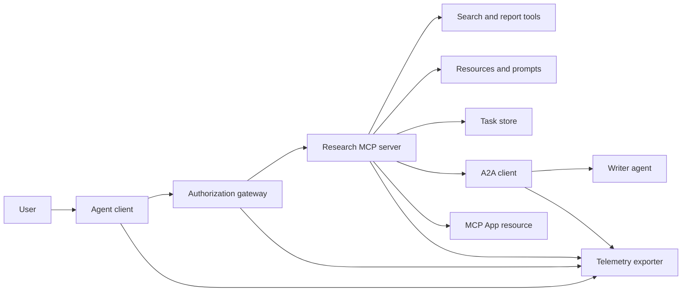
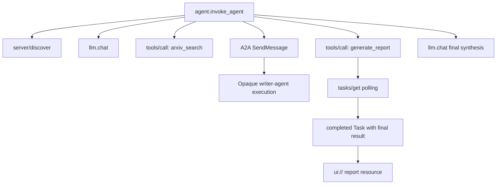
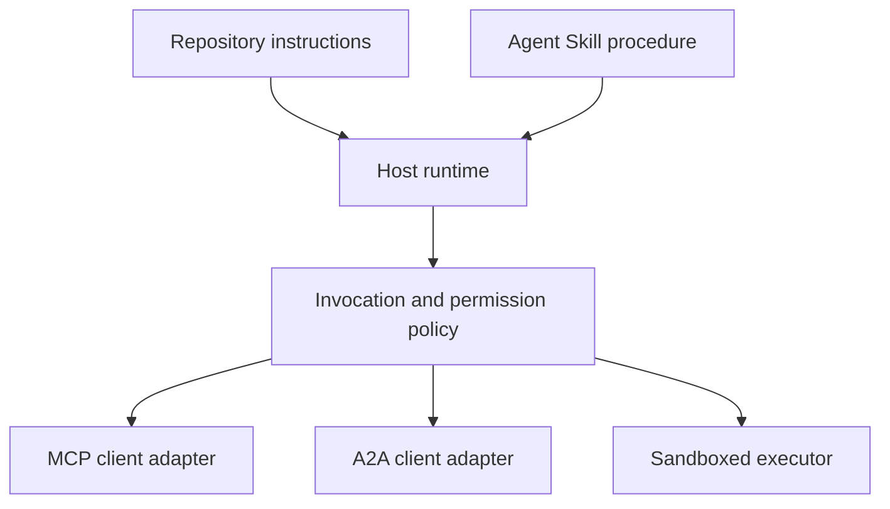

# Capstone: Hệ sinh thái công cụ vô quốc tịch  Graduate Project: Không quốc tịch công cụ sinh thái hệ thống

> Một hệ thống đại lý sản xuất là một tập hợp ranh giới, không phải là một đống các tính năng.

> **【中文解读】**Kiểu sản xuất Cơ quan  hệ thống là một nhóm biên giới, không phải là một đống chức năng.`server/discover`Sử dụng lại công cụ, nhiệm vụ dài, nhiệm vụ mở rộng, A2A ủy nhiệm viết văn,`ui://`报告资源、OTel 全链路 span──模拟与生产的边界被明显标记每个模拟层都应对一个必须替换的真实组件──

> **【拓展：为什么强调"无状态"】**MCP 2026-07-28 移除了协议会话与 `initialize`握手,也移除了 `Mcp-Session-Id`: phiên bản, năng lực, danh tính tất cả thay đổi theo mỗi yêu cầu`_meta`字段,服务器 phải được thực hiện `server/discover`◊ Điều này có nghĩa là các mạng không thể tái lập được quyết định ủy quyền dự trữ trên các cuộc họp (Hoaxing 18 课"每个请求独立验证"), nhiệm vụ dài hạn phải rơi vào các nhiệm vụ lâu dài 存储 chứ không phải kết nối trên.

>  **【前置】**本课是第13阶段收官,综合 01-22 全部课程:01-05(工具接口与 Schema) 、06-14(无状态 MCP 信封、发现、传输、资源、提示、扩展与应用) 、15-18(投毒防御、OAuth、网关、生产认证) 、19(A2A委托) 、20(OTel GenAI 追踪) 、21(模型路由) 、22(技能契约) 👍建议先完成第18 课和第22 课再学本课.

**Type:** Build | **类型:** 构建
**Languages:** Python (stdlib, in-process simulation) | **语言:** Python（标准库，进程内模拟）
**Prerequisites:** Phase 13 · 01 through 22, using MCP revision `2026-07-28` | **前置知识:** Phase 13 · 01 至 22（基于 MCP `2026-07-28` 修订版）
**Time:** ~120 minutes | **时间:** 约 120 分钟

## Mục tiêu học tập

- Sắp xếp các cuộc gọi công cụ, kết quả hình dạng nhiệm vụ, công việc ủy quyền, tài nguyên UI, chính sách ủy quyền và theo dõi hồ sơ vào một dòng chảy.
  Trung ngữ翻译:把工具调用"",任务形态的结果"",委托工作"",UI 资源"",授权策略和追踪"记录组合进一条流程──
- Mang phiên bản giao thức, danh tính khách hàng và khả năng trên mỗi yêu cầu MCP thay vì dựa vào một phiên kết nối.
  Trung ngữ翻译: 在每MCP 请求上携带协议版本、客户端身份和能力, thay vì phụ thuộc vào kết nối cuộc họp.
- Khám phá một máy chủ trước khi sử dụng và chạy công việc dài thông qua phần mở rộng Tasks chính thức.
  Trung ngữ翻译:使用前先发现服务器,并通过官方任务 扩展驱动长时工作。
- Để phân biệt mô phỏng hình thức giao thức với một thực hiện MCP, A2A, OAuth hoặc OpenTelemetry.
  Trung ngữ翻译:区分"形似协议的模拟" với thực tế MCP、A2A、OAuth 或 OpenTelemetry 实现──
- Bản đồ mỗi ranh giới mô phỏng đến thành phần sản xuất phải thay thế nó.
  Trung ngữ翻译:把每个模拟边界映射到必须替换它的生产组件──
- Cứ giữ lại`AGENTS.md`, một kỹ năng đặc vụ, bộ điều chỉnh thời gian chạy, công cụ, và chính sách an ninh trong vai trò đúng đắn của họ.
  Trung ngữ翻译:让 `AGENTS.md`、Tác năng của đại lý 、 vận hành  thiết bị thích ứng  công cụ và chiến lược an toàn
- Giải thích những tuyên bố nào có thể được xác minh từ sản lượng địa phương và những gì cần thử nghiệm tích hợp trực tiếp.
  Trung文翻译:说明 những phát biểu có thể được thực hiện từ địa phương, những gì cần thực sự tập hợp các bài kiểm tra.

## Vấn đề  vấn đề giới thiệu

> **【中文解读】** thiết kế một " nghiên cứu và báo cáo " hệ thống: người dùng yêu cầu Agent  giao ước luận, hệ thống tìm kiếm văn bản danh mục thư mục, ủy thác bản tóm tắt, tạo báo cáo, quay lại UI  tài nguyên và ghi lại toàn cổng.`code/main.py`Sử dụng các hàm và chữ cái thông thường để giữ được những biên giới này, không mở truyền tải, không liên hệ với arXiv, không làm OAuth, không nhiễm ứng dụng, không dẫn ra từ xa, không đưa giả tạo giả thành dịch vụ hợp pháp.

Thiết kế một hệ thống nghiên cứu và báo cáo. Người dùng yêu cầu các giấy tờ về giao thức đại lý. Hệ thống tìm kiếm một danh mục giấy, ủy quyền tổng kết, tạo ra một báo cáo, trả về một nguồn UI và ghi lại con đường qua hệ thống.

> 设计一个研究与报告系统――用户要代理 协议相关论文――系统搜索论文目录、委托摘要、生成报告、返回 UI 资源,并记录系统穿越路径――

Câu án đó che giấu một số hợp đồng độc lập:

> Câu này đằng sau chứa một số hiệp ước độc lập:

- một kế hoạch công cụ đối diện với mô hình;
  Trung文翻译:面向模型的工具方案;
- một gói yêu cầu không có quốc tịch và hợp đồng phát hiện máy chủ;
  Trung文翻译:无状态请求信封与服务器发现契约;
- Một quyết định thông qua thông tin về người chơi, phạm vi và danh tính công cụ;
  Trung文翻译: đối với diễn viên, phạm vi và công cụ danh tính của các quyết định mạng;
- hợp đồng hoạt động lâu dài;
  Trung ngữ翻译:长时操作契约;
- Một giao thức ủy quyền;
  Trung văn翻译:委托协议;
- cầu từ máy chủ đến ứng dụng;
  Trung文翻译:宿主到应用的桥接;
- Tải và xuất khẩu dấu vết;
  中文翻译:trace 传播与导出;
- Một quy trình hoạt động có thể được sử dụng lại.
  Trung ngữ翻译:可复用操作流程──

`code/main.py`giữ các ranh giới đó hiển thị với các chức năng Python và từ điển thông thường. Nó không mở một giao thông, liên hệ với arXiv, thực hiện OAuth, gọi một máy chủ A2A, render một ứng dụng MCP hoặc xuất khẩu điện từ. Điều này làm cho dòng chảy điều khiển dễ dàng kiểm tra mà không trình bày mô phỏng như một dịch vụ tuân thủ.

> `code/main.py`Sử dụng Python  hàm và chữ cái thông thường để giữ được những biên giới này. Nó không mở truyền tải, không liên hệ với arXiv, không thực hiện OAuth, không sử dụng A2A  máy chủ, không nhiễm ứng dụng MCP, không dẫn ra từ xa.

## Khái niệm cốt lõi

> **【中文解读】**Chương này cung cấp cấu trúc và mục tiêu mục tiêu (Mermaid)  Bảng nhanh chóng xem xét các thỏa thuận hiện tại  2026-07-28  Không trạng thái MCP đối với thay đổi biên giới tích hợp  Tình trạng an toàn  kỹ năng là quy trình chứ không phải là truyền tải  Các dữ liệu của các công cụ của khóa học là các bộ máy thích ứng địa phương  Bảng kiểm tra từng cấp của mô phỏng và sản xuất, cũng như giai đoạn 13 toàn bộ chương trình đóng góp图 

### Kiến trúc mục tiêu



Kiến trúc là một sự kết hợp khái niệm của các mô hình giao thức công cộng.

> Các cấu trúc là một tập hợp khái niệm của mô hình thỏa thuận công khai, không phải là một tuyên bố nội tâm riêng tư đối với bất kỳ sản phẩm nào.

### Đường mòn mục tiêu



Trong một thực hiện thực tế, mỗi hop truyền tải ngữ cảnh dấu vết. Tên và thuộc tính của span phải tuân theo các quy ước ngữ nghĩa OpenTelemetry được hỗ trợ bởi phiên bản thiết bị được chọn.

> Trong thực tế thực hiện, mỗi nhảy phải truyền tải dấu vết 上下文。Span 名称与属性必须遵循所选仪器 版本支持的 OpenTelemetry 语义约定。 chỉ có một dấu vết ID chung không thể chứng minh mối quan hệ của cha mẹ, dẫn xuất hoặc hậu端摄取正确。

### Mối giao thức hiện tại

Sử dụng tên phương pháp được xác định bởi giao thức hiện tại, chứ không phải tên được nhớ từ một bản thảo cũ hơn:

> Sử dụng tên của phương pháp được định nghĩa trong thỏa thuận hiện tại, thay vì tên của dự thảo cũ:

| Boundary | Current surface | What the capstone simulates |
|---|---|---|
| MCP discovery | Mandatory `server/discover` | A direct function returning versions, capabilities, and server identity |
| MCP request context | Version, capabilities, and client identity in every `params._meta` | Fresh request metadata passed to every simulated call |
| MCP tool call | `tools/call` | Direct Python function dispatch |
| MCP task polling | `io.modelcontextprotocol/tasks` with `tasks/get` | A working handle followed by a completed task carrying its final result |
| A2A delegation | `SendMessage` in gRPC and JSON-RPC; `POST /message:send` in HTTP+JSON | One nested span with no remote call or artificial delay |
| MCP App calling a server tool | `app.callServerTool({ name, arguments })` | An HTML string with no live bridge |
| OAuth authorization | Authorization server, protected-resource metadata, audience and scope validation | Static token lookup and scope membership |
| OpenTelemetry | SDK, propagator, exporter, and collector or backend | In-memory span dictionaries |

Tên giao thức chỉ là lớp đầu tiên. Các thử nghiệm sản xuất phải thực hiện chuỗi hóa, lỗi xác thực, hủy bỏ, thời gian ra, thử lại và tương thích phiên bản trên dây thực.

> 协议名只是第一层――生产测试必须在真实线缆上演练序列化、认证失败、取消、超时、重试和版本兼容――

### MCP vô quốc tịch thay đổi biên giới hội nhập

> **【中文解读】**2026-07-28 修订版移除协议会话与 `initialize`- Không.`notifications/initialized`握手,也移除 `Mcp-Session-Id` Mỗi yêu cầu mang theo không gian đặt tên `_meta`字段(协议版本、客户端能力、客户端身份) ―― máy chủ phải được thực hiện `server/discover`; thường kết quả sử dụng `resultType: "complete"`, nhiệm vụ cụ cầm `resultType: "task"` Nhiệm vụ 扩展只有 `tasks/get``tasks/update``tasks/cancel``tasks/result`和 `tasks/list`Không thuộc vào việc mở rộng hiện tại; khách hàng phải tuyên bố trong cùng một yêu cầu có thể nhận được lệnh nhiệm vụ.`io.modelcontextprotocol/tasks`能力,否则服务器返回 `-32021`Và`requiredCapabilities`

Phân tích `2026-07-28`xóa các phiên giao thức và các`initialize`- `notifications/initialized`Nhúng tay. Nó cũng loại bỏ`Mcp-Session-Id`Mỗi yêu cầu đều có những tên không gian này`_meta`trường:

> `2026-07-28`修订版移除了协议会话与 `initialize`- `notifications/initialized`握手,也移除了 `Mcp-Session-Id` Mỗi yêu cầu mang theo những tên không gian hóa `_meta`字段:

```json
{
  "io.modelcontextprotocol/protocolVersion": "2026-07-28",
  "io.modelcontextprotocol/clientCapabilities": {
    "extensions": {
      "io.modelcontextprotocol/tasks": {}
    }
  },
  "io.modelcontextprotocol/clientInfo": {
    "name": "capstone-client",
    "version": "1.0.0"
  }
}
```

Server phải thực hiện `server/discover`. Kết quả thông thường sử dụng `resultType: "complete"`; một tay xử lý nhiệm vụ sử dụng `resultType: "task"`. Mỗi kết quả nên xác định máy chủ trong `_meta.io.modelcontextprotocol/serverInfo`- Tôi không biết.

> 服务器 phải được thực hiện `server/discover`△普通结果使用 `resultType: "complete"`; nhiệm vụ句柄使用 `resultType: "task"` Mỗi kết quả đều nên ở `_meta.io.modelcontextprotocol/serverInfo`Trung标明服务器身份──

Việc mở rộng nhiệm vụ đã`tasks/get`- `tasks/update`, và`tasks/cancel`Một công cụ có thể quay lại trước tiên`resultType: "task"``tasks/get`tự nó trở lại `resultType: "complete"`, và hoàn thành `Task`chứa kết quả cuối cùng.`tasks/result`và `tasks/list`Các phương pháp không phải là một phần của việc mở rộng hiện tại.`io.modelcontextprotocol/tasks`trong cùng một yêu cầu mà có thể nhận được một xử lý nhiệm vụ. Nếu không, máy chủ sẽ trả lại `-32021`với `requiredCapabilities`hình dạng như đối tượng khả năng khách hàng bị thiếu, bao gồm `extensions.io.modelcontextprotocol/tasks`- Tôi không biết.

> Nhiệm vụ  mở rộng `tasks/get``tasks/update``tasks/cancel`                                                                                                                                                                                                                                                              `resultType: "task"`-`tasks/get`ự trả lại `resultType: "complete"`, hoàn thành `Task`里装着最终结果──旧的 `tasks/result`Với`tasks/list`Không thuộc về mở rộng hiện tại. Khách hàng phải tuyên bố trong cùng yêu cầu có thể nhận được lệnh nhiệm vụ.`io.modelcontextprotocol/tasks`能力;若不声明,服务器返回 `-32021`, và `requiredCapabilities`Trong cung cấp thiếu năng lực khách hàng hình thức đối tượng`extensions.io.modelcontextprotocol/tasks`(■)

### Chế độ an ninh

> **【中文解读】**目标部署采用纵深防御:PKCE (PKCE) 根据客户端类型) 资源与受众绑定,网关 RBAC 检查工具和范围 上游凭证置于模型可见上下文之外的锁定或审查过的工具描述清单 针对不可信的输入/敏感数据/后果性行为规则 两 条 以及由主管在技能中执行的沙箱 文件系统/进程/网络/凭证/资源限制) 演示只实现静态代币,范围检查和描述哈希适用于演练策略流,不适用于安全验证.

Việc triển khai dự định sử dụng phòng thủ sâu:

> 目标部署 sử dụng phòng thủ sâu:

- OAuth Authorization with PKCE khi loại khách hàng yêu cầu nó;
  Trung文翻译:按客户端类型需要启用带 PKCE 的 OAuth 授权;
- Kết nối tài nguyên và đối tượng đối với các token truy cập được phát hành;
  Trung文翻译: đối với签发的访问代币做资源与受众绑定;
- Gateway RBAC kiểm tra công cụ và phạm vi yêu cầu;
  Trung文翻译:网关 RBAC 检查被请求的工具与范围;
- Các thông tin tín dụng trước dòng được giữ bên ngoài bối cảnh hình ảnh hình mẫu;
  Trung văn翻译:上游凭证保存在模型可见上下文之外;
- Một biểu đồ mô tả công cụ được gắn hoặc xem xét;
  Trung文翻译:锁定或经审查的工具描述清单;
- Một quy tắc hai xem xét các thông tin nhập không đáng tin cậy, dữ liệu nhạy cảm và các hành động hậu quả;
  Trung文翻译: đối với không tin vào dữ liệu nhạy cảm và hành vi hậu quả thực hiện Quy tắc hai kiểm tra;
- một hộp cát thực hiện mà hệ thống tập tin, quy trình, mạng, giấy phép tín dụng và giới hạn nguồn lực được thực thi ngoài kỹ năng.
  Trung ngữ翻译:执行沙箱的文件系统、进程、网络、凭证与资源限制在技能之外的强制执行──

Demo chỉ thực hiện các token tĩnh, kiểm tra phạm vi và hash mô tả. Nó hữu ích cho dòng chảy chính sách, không phải xác thực bảo mật.

> 演示 chỉ thực hiện biểu tượng tĩnh 范围 检查和描述哈希── nó có ích cho các chiến lược tập luyện, không thể được sử dụng để kiểm tra an toàn──

### Kỹ năng là quy trình, không phải vận chuyển

Một kỹ năng đại lý có thể cho biết thời gian chạy làm thế nào để thực hiện dòng công việc nghiên cứu, các công cụ hợp đồng để mong đợi, bằng chứng nào để lưu, và khi nào để dừng lại. Nó không thể làm cho một máy chủ MCP tồn tại, thiết lập tính tương thích A2A, cấp phạm vi, hoặc tạo một hộp cát.

> Agent Skill có thể nói với bạn khi vận hành làm thế nào để thực hiện nghiên cứu công trình, mong đợi những công cụ hợp đồng, lưu trữ những chứng cứ, dừng lại. Nó không thể cho phép máy chủ MCP tồn tại không có gì, thiết lập A2A khả năng tương thích, cấp phạm vi hoặc tạo ra hộp thư mục.



Đăng thư mục kỹ năng đầy đủ khi thủ tục tham khảo các tệp đồng hành. Các đồ tạo phẳng trong đá cuối cũ này là một bản vẽ khóa học, không phải bằng chứng cho thấy một chủ sở hữu bảo tồn một gói di động. Bài học 24 đến 27 xây dựng và kiểm tra vòng đời gói đầy đủ.

> Khi quá trình trích dẫn tài liệu kèm theo, phải giao giao kỹ năng hoàn chỉnh.

### Các metadata của các sản phẩm khóa học là một bộ chuyển đổi địa phương

Các danh mục khóa học và cài đặt nhận ra các tệp phẳng có tên `skill-*.md`, nhưng đó là một quy ước kho chứ không phải hợp đồng gói kỹ năng đại lý di động. trình phân tích mặt hàng tối thiểu của họ chỉ đọc các phím cấp cao. Bài học này do đó giữ các trường danh tính di động và các trường danh mục khóa học ở cùng một mức độ:

>  danh mục khóa học và bộ cài đặt nhận dạng tên gọi `skill-*.md`平文件,但那是仓库约定而非可移植代理技能 包契约──它们的最小前材料 解析器只读顶层键──因此本课把可移植身份字段与课程目录字段放在同一层:

```yaml
---
name: ecosystem-blueprint
description: Produce a full Phase 13 ecosystem architecture for a product need.
version: "1.0.0"
phase: "13"
lesson: "23"
tags: [mcp, capstone, ecosystem, architecture, a2a, otel]
---
```

`name`và `description`là các trường danh tính di động. `version`- `phase`- `lesson`, và`tags`là các phần mở rộng danh mục cụ thể cho khóa học.`tags`như một danh sách trong dòng như vậy `--tag capstone`có thể phù hợp với nó.

> `name`Với`description`                                                                                                                                                                                                                                                              `version``phase``lesson``tags`là danh mục chuyên môn của khóa học mở rộng.`tags`Vì danh sách liên kết,`--tag capstone`才能匹配 nó.

Một kỹ năng thư mục di động có thể sử dụng tùy chọn `metadata`bản đồ cho dữ liệu mở rộng có giá trị chuỗi.`metadata`thay đổi với kế hoạch danh mục của kho lưu trữ này. Nếu file phẳng này tổ `version`hoặc `tags`dưới đây`metadata`, trình phân tích tối thiểu bỏ qua các phím được ghi dấu, danh mục ghi lại một phiên bản trống, và lọc thẻ không thể tìm thấy vật liệu.

> Có thể chuyển thể tài liệu kỹ năng có thể sử dụng có thể chọn`metadata`bản đồ 承载字符串值扩展数据――但这并不意味着 `metadata`Có thể giao dịch với các trang thư mục của kho này.`version`Hoặc`tags`嵌套进 `metadata`, tối thiểu phân tích sẽ nhảy qua những khóa thu nhỏ,目录记下空版本号,标签过也找不到该工件──生产主持应使用安全的YAML 解析器并验证自己文档化方案──

### Tái mô so sánh so với sản xuất

> **【中文解读】**层对照表就是交接边界: phát hiện, xác nhận, ủy quyền, tìm kiếm, nhiệm vụ, ủy nhiệm, ứng dụng,遥测,沙箱 mỗi tầng đều viết rõ`code/main.py`里模拟物、生产替代件和必需证券──本地绿灯只验证模拟,不能当作生产断言──

| Layer | `code/main.py` | Production replacement | Required evidence |
|---|---|---|---|
| Discovery | `server_discover()` plus static `TOOLS` | `server/discover` followed by cache-aware `tools/list` | Wire transcript, deterministic order, and schema validation |
| Authentication | Token-keyed dictionary | OAuth authorization and resource server validation | Issuer, audience, scope, expiry, and failure tests |
| Authorization | Scope membership | Gateway policy bound to actor, tool, target, and tenant | Allow and deny audit cases |
| Search | Static paper fixtures | Search API or MCP server | Source provenance, ranking, and error tests |
| Tasks | Local handle plus immediate `tasks/get` | Durable `io.modelcontextprotocol/tasks` store with `tasks/get`, `tasks/update`, `tasks/cancel`, and TTL | State-transition, input, cancellation, and recovery tests |
| Delegation | Sleep plus nested span | A2A client and remote Agent Card | Contract, timeout, retry, and opacity tests |
| App | HTML string and URI | MCP Apps resource and `App` bridge | CSP, permissions, tool-call, and browser tests |
| Telemetry | In-memory list | OTel SDK and exporter | Collector receipt and trace-parent assertions |
| Sandbox | None | Host-enforced isolated executor | Escape, egress, secret, and resource-limit tests |

Bảng này là giới hạn giao dịch. Một chạy địa phương xanh chỉ xác nhận mô phỏng.

> Đây là biểu tượng của giới giới.

### Bản đồ giai đoạn 13

| Lessons | Contribution |
|---|---|
| 01-05 | Tool interfaces, calls, schemas, structured results, and deterministic validation |
| 06-14 | Stateless MCP request envelopes, discovery, transports, resources, prompts, extensions, and Apps |
| 15-18 | Poisoning defenses, OAuth, gateways, registries, and production authentication |
| 19 | A2A message and task delegation |
| 20 | OpenTelemetry GenAI trace design |
| 21 | Model-provider routing |
| 22 | Portable skill contract and runtime boundary |

```figure
t3-capstone-chain
```

## Hãy xây dựng nó.

> **【中文解读】**运行进程内线束后检查五件事:`server/discover`公布 2026-07-28 与 Tasks 扩展;Alice 可读可生成报告而Bob's写范围被拒绝;一次编排运行内所有跨度 共享相同的痕迹 id 并记录父跨度;报告先以任务句柄出现`tasks/get`返回携带最终结果与 `ui://`引用的完成任务;被委托的写作 代理保持不透明──脚本运行两次产生两根痕迹;审计条目是进程本地──

Động dụng dây thắt trong quá trình:

> 运行进程内线束:

```bash
cd phases/13-tools-and-protocols/23-capstone-tool-ecosystem
python3 code/main.py
```

Hãy kiểm tra 5 điều:

> 检视五件事:

1. `server/discover`quảng cáo sửa đổi `2026-07-28`và mở rộng nhiệm vụ.
  Trung ngữ翻译:`server/discover`Công bố`2026-07-28`修订版与任务 扩展──
2. Alice có thể đọc và tạo ra một báo cáo, trong khi cuộc gọi của Bob được từ chối.
  Trung文翻译:Alice 能读也能生成报告, còn Bob 调用被拒绝.
3. Mỗi vòng dài địa phương trong một trình diễn nhạc sĩ chia sẻ một nhận dạng dấu vết và ghi nhận nhận dạng vòng dài bậc cha.
  Trung文翻译:一次编排运行中的每本地跨度 共享同一个痕迹 标识符并记录父跨度 标识符。
4. Báo cáo bắt đầu như một nhiệm vụ xử lý. `tasks/get`trả lại một nhiệm vụ hoàn thành mà kết quả cuối cùng chứa văn bản và một `ui://`tham chiếu.
  Trung ngữ翻译: báo cáo先以任务句柄出现──`tasks/get`Trở lại nhiệm vụ hoàn thành, kết quả cuối cùng bao gồm văn bản và`ui://`引用──
5. Người viết ủy quyền vẫn không minh bạch vì người dàn nhạc chỉ ghi lại khoảng thời gian biên giới.
  Trung ngữ翻译:被委托的写作 代理保持不透明,因为编排者只记录边界跨度──
6. Không có tuyên bố đầu ra kết nối mạng, trao đổi OAuth, xuất bộ sưu tập, trình render trình duyệt hoặc thực thi hộp rác xảy ra.
  Trung文翻译: bất kỳ输出都不得声称发生网络连接、OAuth 交换、收藏器 导出、浏览器 染或沙箱执行。

Các kịch bản chạy hai lần, vì vậy nó tạo ra hai dấu vết gốc.

> 脚本运行两次, do đó tạo ra hai dấu vết.

## Sử dụng nó thực sự

> **【中文解读】**逐层晋升:先换真实的`server/discover`Với`tools/list`, tái đổi quyền phục vụ, sau đó thực hiện nhiệm vụ  mở rộng  không thêm `tasks/result`Hoặc`tasks/list`), tiếp theo A2A 客户端、官方 SDK App、OTel 导出、第26 课的沙箱契约、第27 课的发布门──每次升级都需要一条跨新边界集成测试;线缆变真后不要删除底层策略测试──

Tăng cường một lớp một lần:

> Một lần nâng cấp:

1. Thay thế `server_discover()`và danh sách công cụ tĩnh với real `server/discover`và `tools/list`gửi phiên bản, danh tính và khả năng trong mỗi yêu cầu.
  Trung ngữ翻译:用真实的`server/discover`Với`tools/list`调用替换 `server_discover()`和静态工具列表──每个请求都发送版本──身份和能力──
2. Thay thế các token tĩnh bằng máy chủ ủy quyền và xác thực tài nguyên được bảo vệ.
  Trung文翻译:用授权服务器与受保护资源验证替换静态代币──
3. Thực hiện các`io.modelcontextprotocol/tasks`mở rộng và thử nghiệm `tasks/get`- `tasks/update`- `tasks/cancel`, thời gian nghỉ, TTL, và khởi động lại phục hồi.`tasks/result`hoặc `tasks/list`- Tôi không biết.
  Trung ngữ翻译:实现 `io.modelcontextprotocol/tasks`扩展并测试 `tasks/get``tasks/update``tasks/cancel`、超时、TTL 和重启恢复──不要添加 `tasks/result`Hoặc`tasks/list`
4. Thay thế các đại diện với một khách hàng A2A giải quyết một thẻ đại lý và gửi một tin nhắn.
  Trung文翻译:用能解析 Agent Card 并发送消息的A2A 客户端替换委托──
5. Xây dựng ứng dụng với SDK chính thức và gọi các công cụ máy chủ thông qua `app.callServerTool`- Tôi không biết.
  中文翻译:用官方 SDK 构建 App,经 `app.callServerTool`调用服务器工具──
6. Xuất khẩu kéo dài đến một người thu thập thử nghiệm và khẳng định tổ tiên tại người nhận.
  Trung文翻译:把 span 导出到测试收集器,并接收端断言父子关系──
7. Lên công cụ và script thực hiện bên trong sandbox hợp đồng từ bài học 26.
  Trung ngữ翻译: 在第26课的沙箱契约内运行工具与脚本执行.
8. Bao gồm thủ tục như một gói thư mục đầy đủ và vượt qua cửa phát hành Bài học 27.
  Trung文翻译:把流程打包为完整目录包并通过第27课的发布门──

Mỗi chương trình khuyến mãi cần một thử nghiệm tích hợp vượt qua ranh giới mới. Đừng xóa các thử nghiệm chính sách cấp thấp hơn khi dây trở thành thực.

> Mỗi lần nâng cấp đều cần một thử nghiệm tích hợp vượt qua biên giới mới. Sau khi kết nối kết nối, đừng bỏ qua các thử nghiệm chiến lược dưới cùng.

## Chuyển nó đi.

Bài học này sẽ mang lại kết quả `outputs/skill-ecosystem-blueprint.md`, một vật liệu khóa học đơn tập tin cũ. Nó yêu cầu một kiến trúc một trang bao gồm nguyên thủy, bảo mật, ủy quyền, viễn thông, đóng gói và rủi ro hoạt động khó khăn nhất.

> 本课产 出 `outputs/skill-ecosystem-blueprint.md` Một phần của một phần của một phần của một phần của một phần của một phần của một phần của một phần của một phần của một phần của một phần của một phần của một phần của một phần của một phần của một phần của một phần của một phần của một phần của một phần của một phần của một phần của một phần của một phần của một phần của một phần của một phần của một phần của một phần của một phần của một phần của một phần của một phần của một phần của một phần của một phần của một phần của một phần của một phần của một phần của một phần của một phần của một phần của một phần của một phần của một phần của một phần của một phần của một phần của một phần của một phần của một phần của một phần của một phần của một phần của một phần của một phần của một phần của một phần của một phần của một phần của một phần của một phần của một phần của một phần của một phần của một phần của một phần của một phần của một phần của một phần của một phần của một phần của một phần của một phần của một phần của một phần của một phần của một phần của một phần của một phần của một phần của một phần của một phần của một phần của một phần của một phần của một phần của một phần của một phần của một phần của một phần của một phần của một phần của một phần của một phần của một phần của một phần của một phần của một phần của một phần của một phần của một phần của một phần của một phần của một phần của một phần của một phần của một phần của một phần của một phần của một phần của một phần của một phần của một phần của một phần của một phần của một phần của một phần của một phần của một phần của một phần của một phần của một phần của một phần của một phần của một phần của một phần của một phần của một phần của một phần của một phần của một phần của một phần của một phần của một phần của một phần của một phần của một phần của phần của một phần của một phần của một phần của một phần của phần của một phần của phần của một phần của một phần của phần của một phần của một phần của phần của một phần của phần của phần của phần của phần của một phần của phần của phần của một phần của phần của phần của một phần của phần của phần của một phần của phần của phần của phần của một phần của phần của phần của phần của phần của phần của

Vì nó không phải là một gói thư mục, nó không thể mang theo tham chiếu, kịch bản, tài sản hoặc thiết bị đánh giá. Sử dụng định dạng gói từ Bài học 22 và 24 đến 27 khi xuất bản một kỹ năng có thể sử dụng lại bên ngoài khóa học này.

> Vì nó không phải là một gói thư mục, không thể mang theo tài liệu tham khảo, kịch bản, tài sản hoặc đánh giá .

## Tập luyện bài tập

1. Đi chạy`code/main.py`- Các sự kiện riêng biệt được chứng minh bởi sản lượng từ các tuyên bố sản xuất mà vẫn cần bằng chứng tích hợp.
   Trung ngữ翻译:运行 `code/main.py`                                                                                                                                                                                                                                                              

2. Thêm một backend tĩnh thứ hai và xác định quy tắc va chạm cho hai công cụ cùng tên. Sau đó thay thế cả hai danh sách bằng real `tools/list`gọi điện.
   Trung文翻译:添加第二静态后端并定义两个同名工具的冲突规则──然后把两个列表都变为真实的`tools/list`调用。

3. Thay thế đoạn văn bằng máy chủ thử nghiệm A2A ghi lại thẻ đại lý, yêu cầu thông điệp, đường thời gian và đồ tạo được trả về.
   Trung文翻译: dùng A2A 测试服务器 thay thế viết作──记录 Agent Card、消息请求、超时路径和返回的工件──

4. Thêm một cửa hàng nhiệm vụ tồn tại trong quá trình khởi động lại.`tasks/get`, tôn trọng `pollIntervalMs`, và đọc kết quả cuối cùng của nhiệm vụ hoàn thành mà không cần `tasks/result`- Tôi không biết.
   Trung ngữ翻译:添加一个能经过进程重启的任务存储――证明客户端可用`tasks/get`恢复、 tuân thủ `pollIntervalMs`、 và không sử dụng `tasks/result`Trong trường hợp đọc kết quả cuối cùng của nhiệm vụ hoàn thành.

5. Xây dựng một ứng dụng MCP tối thiểu và xác minh `app.callServerTool`trong trình duyệt có một CSP hạn chế và quyền rõ ràng.
   Trung ngữ翻译: xây dựng một ứng dụng MCP tối thiểu, và được chứng nhận trong trình duyệt với CSP nghiêm ngặt với quyền hiển nhiên`app.callServerTool`

6. Xuất khẩu các khoảng thời gian mô phỏng thông qua một SDK OTel sang một bộ sưu tập địa phương. Cấm nhận, nhận dạng dấu vết, tổ tiên và tình trạng lỗi.
   Trung文翻译:把模拟 span 经 OTel SDK 导出到本地收藏者──断言接收、trace 标识符、父子关系和错误状态──

7. Hãy viết`AGENTS.md`cho các quy tắc bảo trì toàn bộ kho và một gói kỹ năng riêng cho quy trình nghiên cứu tái sử dụng. Giải thích tại sao không có tài liệu nào cấp quyền công cụ.
   Trung文翻译:为仓库级维护规则编写 `AGENTS.md`,并 cho các quy trình nghiên cứu có thể sử dụng để biên soạn kỹ năng độc lập 包── giải thích tại sao cả hai tài liệu này đều được cấp quyền không có công cụ──

## Từ khóa  Từ khóa nhanh chóng

| Term | What people say | What it actually means |
|---|---|---|
| Capstone | "Everything wired together" | A staged integration whose simulated and live boundaries remain explicit |
| Protocol-shaped simulation | "It is basically MCP" | Local data and calls that resemble a protocol without implementing its wire contract |
| Tasks extension | "Long tool call" | An optional `io.modelcontextprotocol/tasks` lifecycle with durable identity, polling, client input, final result, and cancellation semantics |
| Opacity boundary | "The other agent handles it" | The caller sees the declared interface and artifacts, not private reasoning or internal state |
| Runtime adapter | "Skill integration" | Host code that maps portable procedure to discovery, invocation, tools, policy, and context |
| Integration evidence | "It passed" | A transcript, artifact, or receiver-side observation proving the real boundary was crossed |

## Xem thêm 延伸阅读

- [MCP specification 2026-07-28](https://modelcontextprotocol.io/specification/2026-07-28)cho các yêu cầu không có quốc tịch, khám phá, công cụ, ủy quyền và hành vi vận chuyển.
  Trung文翻译:MCP 2026-07-28 规范无状态请求、发现、工具、授权与传输行为
- [MCP 2026-07-28 key changes](https://modelcontextprotocol.io/specification/2026-07-28/changelog)cho việc xóa phiên, siêu dữ liệu theo yêu cầu, MRTR, mở rộng và giảm.
  Trung ngữ翻译:MCP 2026-07-28 关键变更会话移除、每请求元数据、MRTR、扩展与弃用项
- [MCP Tasks extension](https://tasks.extensions.modelcontextprotocol.io/specification/draft/tasks)cho `tasks/get`- `tasks/update`- `tasks/cancel`, và kết quả cuối cùng được thực hiện bởi các nhiệm vụ cuối cùng.
  Trung文翻译:MCP Tasks 扩展`tasks/get``tasks/update``tasks/cancel`Kết quả cuối cùng của nhiệm vụ cuối cùng
- [MCP Apps SDK](https://github.com/modelcontextprotocol/ext-apps/blob/main/docs/overview.md)cho `App`và `app.callServerTool`- Tôi không biết.
  中文翻译:MCP Apps SDK`App`Với`app.callServerTool`
- [A2A protocol](https://a2a-protocol.org/latest/)cho thẻ đại lý, giao thông tin, nhiệm vụ, đồ tạo vật và liên kết vận chuyển.
  Trung文翻译:A2A 协议Tẻ đại lý, thông điệp, giao dịch, nhiệm vụ, công việc và giao dịch
- [OpenTelemetry GenAI semantic conventions](https://opentelemetry.io/docs/specs/semconv/gen-ai/)cho các quy ước dấu vết và thuộc tính.
  Trung文翻译:OpenTelemetry GenAI 语义约定trace 与属性约定
- [Agent Skills specification](https://agentskills.io/specification)Đối với hợp đồng gói di động được sử dụng bởi lớp thủ tục.
  Trung文翻译:Công viên Kỹ năng 规范流程层使用的可移植包契约
