# Các giao thức giao tiếp

> Các đại lý không thể nói cùng một ngôn ngữ không phải là một đội ngũ, họ là những người lạ hét vào không gian.

> **【中文解读】**Bài viết này giới thiệu nhiều đại lý giao thông giao thức đại lý giao thông thông thông tin thông tin thông tin thông tin thông tin thông tin thông tin thông tin thông tin thông tin thông tin thông tin thông tin thông tin thông tin thông tin thông tin thông tin thông tin thông tin thông tin thông tin thông tin thông tin thông tin thông tin thông tin thông tin thông tin thông tin thông tin thông tin thông tin thông tin thông tin thông tin thông tin thông tin thông tin thông tin thông tin thông tin thông tin thông tin thông tin thông tin thông tin thông tin thông tin thông tin thông tin thông tin thông tin thông tin thông tin thông tin thông tin thông tin thông tin thông tin thông tin thông tin thông tin thông tin thông tin thông tin thông tin thông tin thông tin thông tin thông tin thông tin thông tin thông tin thông tin thông tin thông tin thông tin thông tin thông tin thông tin thông tin thông tin thông tin thông tin thông tin thông tin thông tin thông tin thông tin thông tin thông tin thông tin thông tin thông tin thông tin thông tin thông tin thông tin thông tin thông tin thông tin thông tin thông tin thông tin thông tin thông tin thông tin thông tin thông tin thông tin thông tin thông tin thông tin thông tin thông tin thông tin thông tin thông tin thông tin thông tin thông tin thông tin

> **【拓展：communication protocols→具体应用】**3 cấp độ của Hiệp định giao thông đa đại lý: 1) 传输层A2A (HTTP+JSON)、MCP (JSON-RPC)、gRPC; 2) 语义层Agent Card 描述能力,任务描述意图; 3) 协调层发言人选择、投票、协商──2026 năm thực tế cho thấy, sự lựa chọn của Hiệp định giao thông chủ yếu phụ thuộc vào sự chậm trễ yêu cầu và liệu cần phải hợp tác xuyên tổ chức không.


**Type:** Build | **类型:** 构建
**Languages:** TypeScript | **语言:** TypeScript
**Prerequisites:** Phase 14 (Agent Engineering), Lesson 16.01 (Why Multi-Agent) | **前置知识:** Phase 14 (Agent 工程), Lesson 16.01 (为什么需要多 Agent)
**Time:** ~120 minutes | **时间:** ~120 分钟

>  **【前置】**Học本节前请先掌握:Phase 14(Agent 工程基础) Phase 16·01-02(多 Agent 动机与FIPA 历史) Phase 13(MCP 协议) 本节动手实现多 Agent 通信选协议应按延迟和协作范围权衡──
>  **【类比】**多 Agent 通信 = "团队沟通工具"──HTTP+JSON(A2A) = 邮件(异步、跨组织);JSON-RPC(MCP) = Slack(工具调用);gRPC = 内部电话(低延迟、强类型)──选错协议 = 团队效率灾难──

## Mục tiêu học tập

- Thực hiện công cụ phát hiện và gọi MCP để các đại lý có thể sử dụng các công cụ được tiếp xúc bởi các máy chủ bên ngoài
  Trung ngữ翻译: thực hiện MCP 工具发现和调用, giúp Agent 能够使用外部服务器暴露的工具
- Xây dựng thẻ đại lý A2A và điểm cuối nhiệm vụ cho phép một đại lý phân phối công việc cho người khác qua HTTP
  Trung文翻译: xây dựng A2A Agent 卡片和任务端点, cho phép một Agent 通过HTTP向另一个 Agent 委派工作
- So sánh MCP (tương tự truy cập công cụ), A2A (trong đại lý), ACP (chuyển toán doanh nghiệp) và ANP (trust phân cấp) và giải thích giao thức nào giải quyết vấn đề nào
  Trung文翻译:比较 MCP(工具访问) 、A2A(Agent đối với Agent) 、ACP(企业审计) và ANP(去中心化信任),解释哪个协议解决哪个问题
- Cụm nhiều giao thức cùng nhau trong một hệ thống duy nhất, nơi các đại lý phát hiện công cụ thông qua MCP và ủy thác các nhiệm vụ thông qua A2A
  Trung文翻译: 在单一系统中连接多个协议,Công viên 通过MCP 发现工具并通过A2A 委派任务

## Vấn đề  vấn đề giới thiệu

Bạn chia hệ thống của mình thành nhiều đại lý, một nhà nghiên cứu, một lập trình viên, một nhà phê bình, họ rất giỏi trong công việc cá nhân của họ, nhưng bây giờ bạn cần họ thực sự nói chuyện với nhau.

> Bạn sẽ chia hệ thống thành nhiều đại lý: một nhà nghiên cứu, một lập trình viên, một nhà phê duyệt. Chúng hoạt động tốt trong nhiệm vụ riêng của mình. Nhưng bây giờ bạn cần chúng thực sự đối thoại với nhau.

Cố gắng đầu tiên của bạn là hiển nhiên: chuyển chuỗi xung quanh. Nhà nghiên cứu trả lại một khối văn bản, người lập trình phân tích nó bất cứ cách nào có thể. Nó hoạt động cho đến khi người lập trình hiểu sai một bản tóm tắt nghiên cứu, hoặc hai đại lý đang chờ nhau, hoặc bạn cần các đại lý được xây dựng bởi các nhóm khác nhau để hợp tác. đột nhiên "chỉ chuyển chuỗi" bị vỡ.

> Lần đầu tiên bạn thử rất rõ ràng: truyền string. Người nghiên cứu quay lại một khối văn bản, trình biên tập viên làm hết sức mình để phân tích nó. Đây là một đoạn trích nghiên cứu sai lầm trong trình biên tập viên. Hai đại lý chờ nhau để đóng kín.

Đây là vấn đề giao thức giao tiếp. Nếu không có hợp đồng chia sẻ về cách mà các đại lý trao đổi thông tin, hệ thống đa đại lý sẽ rất yếu, không thể kiểm tra, và không thể mở rộng vượt ra ngoài một số đại lý mà bạn đã viết.

> Đó là vấn đề của hiệp định giao tiếp. Không có đại lý, hệ thống đa đại lý là yếu kém, không thể kiểm tra được và không thể mở rộng ra ngoài một số ít đại lý mà bạn tự viết.

Hệ sinh thái AI đã phản ứng với bốn giao thức, mỗi giao thức giải quyết một phần khác nhau của vấn đề:

- **MCP**cho việc truy cập công cụ
  Trung ngữ翻译:**MCP**用于工具访问
- **A2A**cho hợp tác giữa các đại lý
  Trung ngữ翻译:**A2A**Sử dụng cho Agent 间协作
- **ACP**đối với khả năng kiểm toán của doanh nghiệp
  Trung ngữ翻译:**ACP**Sử dụng cho doanh nghiệp kiểm toán
- **ANP**cho danh tính và niềm tin phi tập trung
  Trung ngữ翻译:**ANP**Sử dụng để phân tâm danh tính và tin tưởng

Bài học này đi sâu hơn. Bạn sẽ đọc các định dạng dây thực sự từ mỗi thông số, xây dựng các thực hiện hoạt động, và kết nối tất cả bốn thành một hệ thống thống nhất.

> Bài học này sẽ được đọc sâu hơn, bạn sẽ đọc các mô hình thực tế của mỗi quy tắc, xây dựng và thực hiện các giao thức có thể hoạt động, và sẽ kết nối tất cả bốn giao thức vào một hệ thống thống nhất.

## Khái niệm cốt lõi

### Tầm nhìn của giao thức

Hãy nghĩ về bốn giao thức này như là các lớp, mỗi lớp giải quyết một câu hỏi khác nhau:

> Xem bốn hiệp định này như các cấp độ khác nhau, mỗi giải quyết các vấn đề khác nhau:

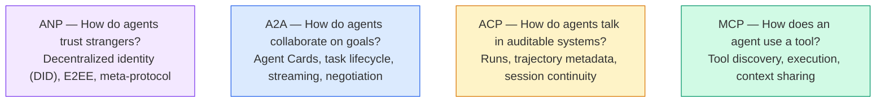

Họ không phải là đối thủ cạnh tranh, họ giải quyết các vấn đề khác nhau ở các cấp độ khác nhau.

> Chúng không phải là mối quan hệ cạnh tranh. Chúng giải quyết các vấn đề khác nhau ở các cấp độ khác nhau.

Một hệ thống sản xuất thực sự sử dụng nhiều giao thức cùng nhau: MCP cho các công cụ bên trong cơ quan của bạn, A2A cho sự hợp tác của đại lý, ghi lại quỹ đạo theo kiểu ACP cho sự tuân thủ, ANP cho danh tính qua các tổ chức.

> MCP sử dụng các công cụ trong tổ chức A2A sử dụng các đại lý hợp tác AACP sử dụng các hệ thống sản xuất hợp tác và các hệ thống sản xuất thực sự sử dụng nhiều giao thức: MCP sử dụng các công cụ trong tổ chức A2A sử dụng các đại lý hợp tác AACP sử dụng các hệ thống sản xuất hợp tác và các hệ thống sản xuất hợp tác giữa tổ chức

### MCP (Tái khấu)

MCP được bao gồm sâu trong giai đoạn 13. Nghịch lại nhanh chóng: MCP chuẩn hóa cách LLM kết nối với các công cụ bên ngoài và các nguồn dữ liệu.**client-server**giao thức mà người đại lý (thành khách) phát hiện và gọi các công cụ được máy chủ phơi bày.

> MCP trong giai đoạn 13 có một bài giảng sâu sắc.**客户端-服务器**协议,Agent(客户端) phát hiện并调用服务器暴露的工具──

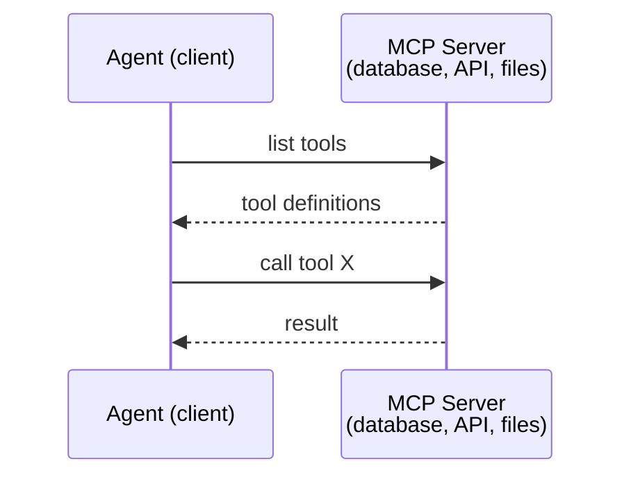

MCP là **agent-to-tool**liên lạc, không giúp các nhân viên nói chuyện với nhau.

> MCP là**Agent 到工具**n không thể giúp người đại diện giao tiếp với nhau.

Sự chia cắt dọc/vị nhất là sạch: MCP là dây dọc (nhà tác tiếp cận đến công cụ/dữ liệu); A2A là dây dọc (nhà tác tiếp cận qua các đại lý đồng cấp).

> 垂直/水平分离清晰:MCP là đường thẳng;A2A là đường水平;Agent 横向到等 Agent)

### A2A (Bản ứng viên2Bản ứng viên)

**Created by:**Google (nay dưới Linux Foundation như `lf.a2a.v1`(văn)
**Spec version:**1.0.0
**Problem:**Các đại lý tự trị làm việc với nhau, đàm phán và giao nhiệm vụ với nhau như thế nào?

> **创建者：**Google(现由 Linux Foundation 管理为 `lf.a2a.v1`(văn)
> **规范版本：**1.0.0
> **问题：**Độc lập Trưởng lý làm thế nào để hợp tác, đàm phán và giao nhiệm vụ cho nhau?

A2A là giao thức cho **peer-to-peer agent collaboration**. Khi MCP kết nối một đại lý với các công cụ, A2A kết nối một đại lý với các đại lý khác.**Agent Card**tại một URL nổi tiếng, và các đại lý khác phát hiện, đàm phán với và ủy thác nhiệm vụ cho nó.

> A2A là**点对点 Agent 协作**协议──MCP  liên kết với đại lý đến công cụ, A2A  liên kết với đại lý đến đại lý khác── mỗi đại lý trong URL được biết 发布 một **Agent 卡片**, các đại lý khác có thể tìm thấy, đàm phán và giao nhiệm vụ cho ủy ban của mình.

#### Làm thế nào A2A hoạt động

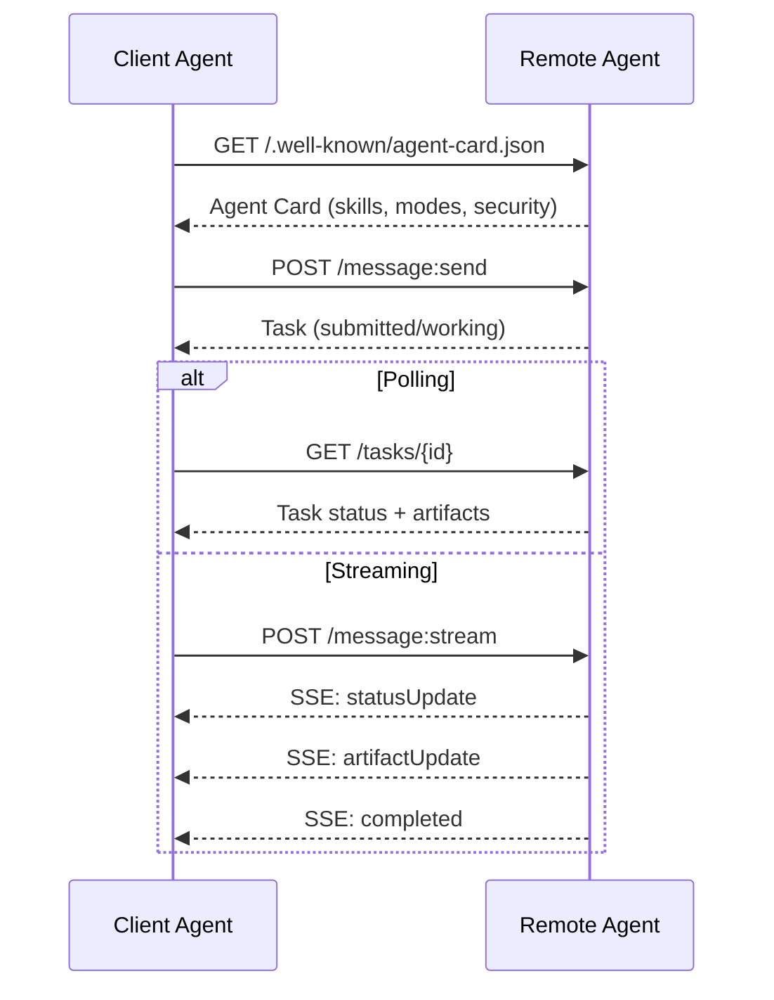

#### Thẻ đại lý thực sự

Đây là hình ảnh của thẻ đại lý A2A trong tự nhiên.`GET /.well-known/agent-card.json`- Có thể là:

```json
{
  "name": "Research Agent",
  "description": "Searches documentation and summarizes findings",
  "version": "1.0.0",
  "supportedInterfaces": [
    {
      "url": "https://research-agent.example.com/a2a/v1",
      "protocolBinding": "JSONRPC",
      "protocolVersion": "1.0"
    },
    {
      "url": "https://research-agent.example.com/a2a/rest",
      "protocolBinding": "HTTP+JSON",
      "protocolVersion": "1.0"
    }
  ],
  "provider": {
    "organization": "Your Company",
    "url": "https://example.com"
  },
  "capabilities": {
    "streaming": true,
    "pushNotifications": false
  },
  "defaultInputModes": ["text/plain", "application/json"],
  "defaultOutputModes": ["text/plain", "application/json"],
  "skills": [
    {
      "id": "web-research",
      "name": "Web Research",
      "description": "Searches the web and synthesizes findings",
      "tags": ["research", "search", "summarization"],
      "examples": ["Research the latest changes in React 19"]
    },
    {
      "id": "doc-analysis",
      "name": "Documentation Analysis",
      "description": "Reads and analyzes technical documentation",
      "tags": ["docs", "analysis"],
      "inputModes": ["text/plain", "application/pdf"],
      "outputModes": ["application/json"]
    }
  ],
  "securitySchemes": {
    "bearer": {
      "httpAuthSecurityScheme": {
        "scheme": "Bearer",
        "bearerFormat": "JWT"
      }
    }
  },
  "security": [{ "bearer": [] }]
}
```

Những điều quan trọng cần chú ý:
- **Skills**là những gì một đại lý có thể làm. Mỗi người có một ID, thẻ, và hỗ trợ nhập / ra MIME loại. Đây là cách mà một đại lý khách hàng quyết định liệu đại lý từ xa này có thể xử lý yêu cầu của mình.
  Trung ngữ翻译:**技能**Đó là những gì đại lý có thể làm. Mỗi người đều có ID, thẻ và hỗ trợ nhập/luồng MIME 类型.
- **supportedInterfaces**danh sách liên kết giao thức nhiều. Một đại lý duy nhất có thể nói JSON-RPC, REST và gRPC cùng một lúc.
  Trung ngữ翻译:**supportedInterfaces**列出多个协议绑定;; một đại lý duy nhất có thể sử dụng cùng một lúc JSON-RPC、REST 和 gRPC;;
- **Security**Khách hàng biết mình cần gì trước khi thực hiện một yêu cầu duy nhất.
  Trung ngữ翻译:**安全性**Trong thẻ, khách hàng đã biết cần xác nhận trước khi gửi một yêu cầu.

#### Chuyển đời nhiệm vụ

Nhiệm vụ là đơn vị cốt lõi của công việc trong A2A. Chúng di chuyển qua các trạng thái được xác định:

> 任务 là các đơn vị làm việc cốt lõi trong A2A. Chúng chuyển đổi giữa các trạng thái được xác định:

Máy trạng thái là điều làm cho A2A khác với một RPC đơn giản. Một nhiệm vụ có thể tạm dừng (được yêu cầu nhập), tiếp tục (thành khách cung cấp nhập), thất bại hoặc bị hủy bỏ.

> 状态机是 A2A và đơn giản là RPC khác nhau. nhiệm vụ có thể tạm dừng (trong khi cần thông tin nhập vào) 恢复 (trong khi khách hàng cung cấp thông tin nhập vào) 失败或取消.

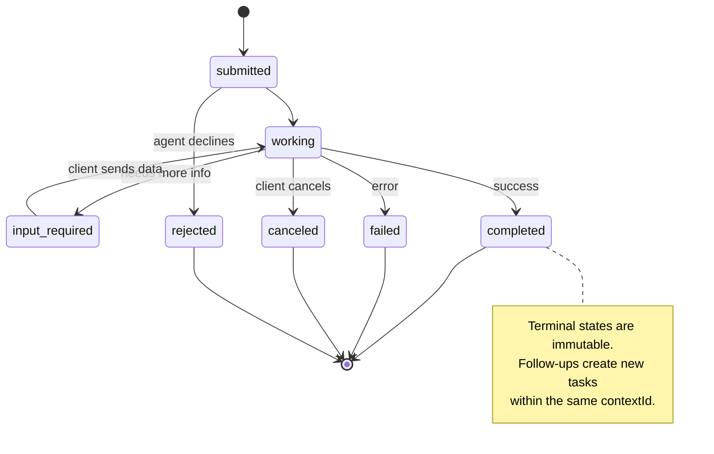

Tất cả 8 trạng thái (đặc biệt cũng xác định `UNSPECIFIED`như một lính canh, được bỏ qua ở đây):

> Có 8 trạng thái.`UNSPECIFIED`作为哨兵,此处省略):

| State | Terminal? | Meaning / 含义 |
|---|---|---|
| `TASK_STATE_SUBMITTED` | No | Acknowledged, not yet processing / 已确认，尚未处理 |
| `TASK_STATE_WORKING` | No | Actively being processed / 正在处理 |
| `TASK_STATE_INPUT_REQUIRED` | No | Agent needs more info from client / Agent 需要客户端更多信息 |
| `TASK_STATE_AUTH_REQUIRED` | No | Authentication needed / 需要认证 |
| `TASK_STATE_COMPLETED` | Yes | Finished successfully / 成功完成 |
| `TASK_STATE_FAILED` | Yes | Finished with error / 出错完成 |
| `TASK_STATE_CANCELED` | Yes | Canceled before completion / 完成前取消 |
| `TASK_STATE_REJECTED` | Yes | Agent declined the task / Agent 拒绝任务 |

Các trạng thái cuối (đã hoàn thành, thất bại, hủy bỏ, bị từ chối) là không thể thay đổi  một khi một nhiệm vụ đạt đến một, không được phép cập nhật thêm.`contextId`để duy trì tính liên tục của phiên họp.

> 终态 (làm xong, thất bại, hủy bỏ, từ chối) là không thể thay đổi một khi nhiệm vụ đạt đến终态, không cho phép cập nhật thêm.`contextId`Trung tạo nhiệm vụ mới để giữ cho cuộc trò chuyện liên tục.

Khi một nhiệm vụ đạt đến trạng thái cuối, nó không thay đổi. Không tin nhắn nào nữa.`contextId`- Tôi không biết.

> Một khi nhiệm vụ đạt đến kết thúc, nó là không thể thay đổi. Không thể phát hành lại.`contextId`Trong việc xây dựng nhiệm vụ mới.

#### Phương thức dây

A2A sử dụng JSON-RPC 2.0. Đây là cách trao đổi tin nhắn thực sự trông như thế nào:

**Client sends a task:**
```json
{
  "jsonrpc": "2.0",
  "id": 1,
  "method": "SendMessage",
  "params": {
    "message": {
      "messageId": "msg-001",
      "role": "ROLE_USER",
      "parts": [{ "text": "Research React 19 compiler features" }]
    },
    "configuration": {
      "acceptedOutputModes": ["text/plain", "application/json"],
      "historyLength": 10
    }
  }
}
```

**Agent responds with a task:**
```json
{
  "jsonrpc": "2.0",
  "id": 1,
  "result": {
    "task": {
      "id": "task-abc-123",
      "contextId": "ctx-xyz-789",
      "status": {
        "state": "TASK_STATE_COMPLETED",
        "timestamp": "2026-03-27T10:30:00Z"
      },
      "artifacts": [
        {
          "artifactId": "art-001",
          "name": "research-results",
          "parts": [{
            "data": {
              "findings": [
                "React 19 compiler auto-memoizes components",
                "No more manual useMemo/useCallback needed",
                "Compiler runs at build time, not runtime"
              ]
            },
            "mediaType": "application/json"
          }]
        }
      ]
    }
  }
}
```

**Streaming via SSE:**
```text
POST /message:stream HTTP/1.1
Content-Type: application/json
A2A-Version: 1.0

data: {"task":{"id":"task-123","status":{"state":"TASK_STATE_WORKING"}}}

data: {"statusUpdate":{"taskId":"task-123","status":{"state":"TASK_STATE_WORKING","message":{"role":"ROLE_AGENT","parts":[{"text":"Searching documentation..."}]}}}}

data: {"artifactUpdate":{"taskId":"task-123","artifact":{"artifactId":"art-1","parts":[{"text":"partial findings..."}]},"append":true,"lastChunk":false}}

data: {"statusUpdate":{"taskId":"task-123","status":{"state":"TASK_STATE_COMPLETED"}}}
```

### ACP (Phương thức giao tiếp của cơ quan)

**Created by:**IBM / BeeAI
**Spec version:**0.2.0 (OpenAPI 3.1.1)
**Status:**Tham gia vào A2A dưới Linux Foundation
**Problem:**Làm thế nào để các đại lý giao tiếp với khả năng kiểm tra đầy đủ, tính tiếp tục phiên và theo dõi quỹ đạo?

> **创建者：**IBM / BeeAI
> **规范版本：**0.2.0 (OpenAPI 3.1.1)
> **状态：**đang được hợp nhất với Linux Foundation trong A2A
> **问题：**Làm thế nào để đại lý giao tiếp trong tình trạng liên tục và theo dõi đường?

ACP là **enterprise protocol**Không giống như nhiều bản tóm tắt tuyên bố, ACP làm **not**sử dụng JSON-LD. Đó là một API REST / JSON đơn giản được định nghĩa thông qua OpenAPI. Điều làm cho nó đặc biệt là **TrajectoryMetadata**: mỗi phản ứng của đại lý có thể mang theo một nhật ký chi tiết về các bước lý luận và các cuộc gọi công cụ đã tạo ra nó.

> ACP là**企业协议** Không giống như nhiều tuyên bố của ACP **不**Sử dụng JSON-LD. Nó là một thông qua OpenAPI 定义 đơn giản REST / JSON API.**TrajectoryMetadata**Mỗi đại lý 响应 đều có thể mang theo để tạo ra nó

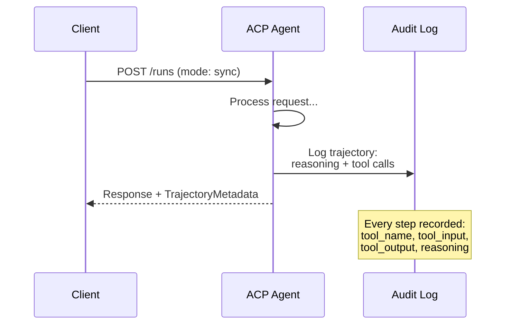

#### Trưởng lý Discovery ở ACP

ACP xác định bốn phương pháp phát hiện:

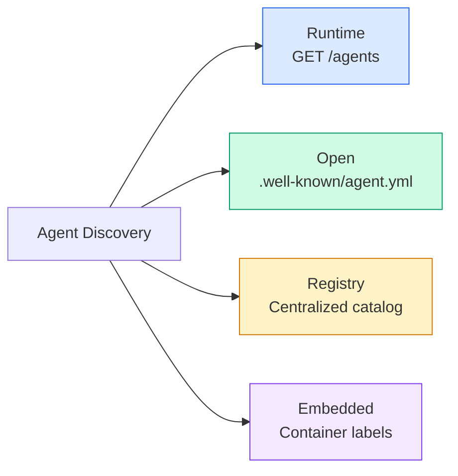

- **AgentManifest**đơn giản hơn thẻ đại lý của A2A:

> **AgentManifest**Hơn thẻ đại lý của A2A đơn giản hơn:

```json
{
  "name": "summarizer",
  "description": "Summarizes documents with source citations",
  "input_content_types": ["text/plain", "application/pdf"],
  "output_content_types": ["text/plain", "application/json"],
  "metadata": {
    "tags": ["summarization", "RAG"],
    "framework": "BeeAI",
    "capabilities": [
      {
        "name": "Document Summarization",
        "description": "Condenses long documents into key points"
      }
    ],
    "recommended_models": ["llama3.3:70b-instruct-fp16"],
    "license": "Apache-2.0",
    "programming_language": "Python"
  }
}
```

Không liên kết giao thức (single REST API), không có các chương trình bảo mật (được chuyển giao đến cấp độ máy chủ), không có danh sách kỹ năng (capacities are flat metadata).

> Không có thỏa thuận ràng buộc (không có một API REST) Không có chương trình bảo mật (không có chương trình bảo mật) Không có danh sách kỹ năng (không có danh sách kỹ năng) Không có danh sách kỹ năng (không có danh sách kỹ năng)

#### Tiếp tục chu kỳ đời

ACP sử dụng "Runs" thay vì "Tasks". A Run là một hành động thực hiện bằng đại lý với ba chế độ:

> Sử dụng ACP"Runs" thay vì"Tasks"──Run là có ba mô hình của Agent 执行:

| Mode | Behavior |
|---|---|
| `sync` | Blocking. Response contains the complete result. |
| `async` | Returns 202 immediately. Poll `GET /runs/{id}` for status. |
| `stream` | SSE stream. Events fire as the agent works. |

> n n n n n n n n n n n n n n n n n n n n n n n n n n n n n n n n n n n n n n n n n n n n n n n n n n n n n n n n n n n n n n n n n n n n n n n n n n n n n n n n n n n
> ♪ ♪ Tôi biết ♪
> ♬`sync`Ứng dụng có kết quả hoàn chỉnh.
> ♬`async` Đưa lại ngay.`GET /runs/{id}`Nhận được trạng thái.
> ♬`stream`♬ SSE 流──事件随随随随随随随随随随随随随随随随随随随随随随随随随随随随随随随随随随随随随随随随随随随随随随随随随随随随随随随随随随随随随随随随随随随随随随随随随随随随随随随随随随随随随随随随随随随随随随随随随随随随随随随随随随随随随随随随随随随随随随随随随随随随随随随随随随随随随随随随随随随随随随随随随随随随随随随随随随随随随随随随随随随随随随随随随随随随随随随随随随随随随随随随随随随随随随随随随随随随随随随随随随随随随随随随随随随随随随随随随随随随随随随随随随随随随随随随随随随随随随随随随随随随随随随随随随随随随随随随随随随随随随随随随随随随随随随随随随随随随随随随随随随随随随随随随随随随随随随随随随随随随随随随随随随随随随随随随随随随随随随随随随随随随随随随随随随随随随随随随随随随随随随随随随随随随随随随随随随随随随随随随随随随随随随随随随随随随随随随随随随随随随随随随随随随随随随随随随随随随随随随随随随随随随随随随随随随随随随随随随随随随随随随随随随随随随随随随随随随随随随随随随随随随随随随随随随随随随随随随随随随随随随随随随随随随随随随随随随随随随随随随随随随随随随随随随随随随随随随随随随随随随

Các lựa chọn chế độ lập bản đồ cho yêu cầu trải nghiệm người dùng: đồng bộ hóa cho các truy vấn nhanh, đồng bộ hóa cho các công việc nền, luồng cho các nhiệm vụ lâu dài nơi người dùng muốn các chỉ số tiến bộ.

> 模式选择映射到用户体验需求:sync 用于快速查询,async 用于后台作业,stream 用于用户想要进度指示的长时间运行任务──

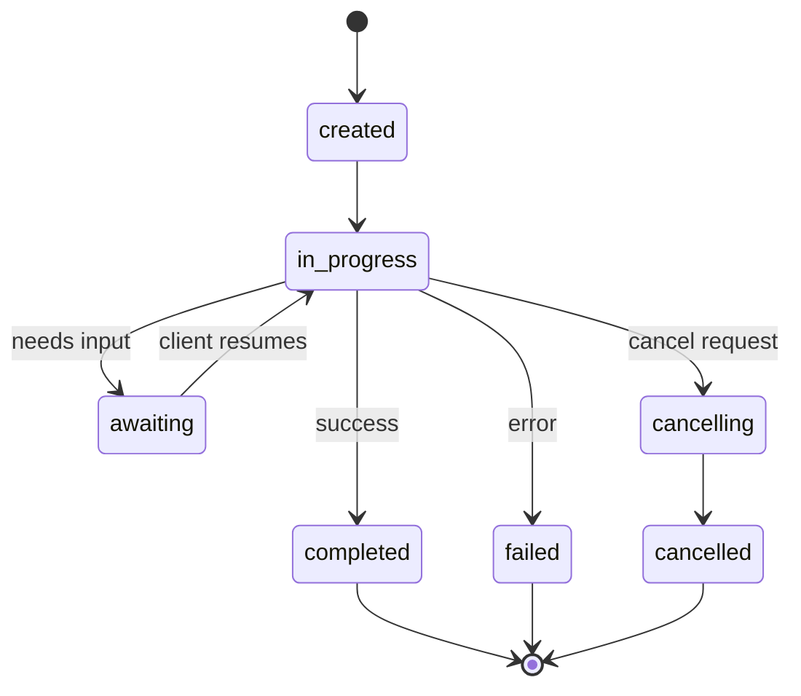

#### Chế độ Metadata (The Audit Trail)

Đây là điểm phân biệt chính của ACP. Mỗi phần thông điệp có thể bao gồm các metadata cho thấy chính xác những gì đại lý đã làm:

```json
{
  "role": "agent/researcher",
  "parts": [
    {
      "content_type": "text/plain",
      "content": "The weather in San Francisco is 72F and sunny.",
      "metadata": {
        "kind": "trajectory",
        "message": "I need to check the weather for this location",
        "tool_name": "weather_api",
        "tool_input": { "location": "San Francisco, CA" },
        "tool_output": { "temperature": 72, "condition": "sunny" }
      }
    }
  ]
}
```

Đối với các ngành công nghiệp được quy định, đây là vàng. Mỗi câu trả lời đều đi kèm với một chuỗi lý luận có thể chứng minh được: những công cụ nào được gọi, những đầu vào nào được sử dụng, những sản phẩm nào được nhận. Không có hộp đen.

> Đối với ngành công nghiệp được quản lý, đây là một kho báu vô giá. Mỗi câu trả lời đều mang theo chuỗi suy luận có thể chứng minh được: đã sử dụng những công cụ nào, đã sử dụng những gì nhập, đã nhận những gì ra ngoài. Không có hộp đen.

Các ngân hàng, chăm sóc sức khỏe và các dịch vụ của chính phủ đòi hỏi tính kiểm toán này. Métadata quỹ đạo của ACP là điều làm cho các đại lý LLM chấp nhận được trong môi trường đó.

> Các ngân hàng, y tế và chính phủ cần phải có tính kiểm toán này.

ACP cũng ủng hộ **CitationMetadata**cho việc gán nguồn:

> ACP còn hỗ trợ**CitationMetadata**Sử dụng để thuộc về:

```json
{
  "kind": "citation",
  "start_index": 0,
  "end_index": 47,
  "url": "https://weather.gov/sf",
  "title": "NWS San Francisco Forecast"
}
```

### ANP (Nền tảng mạng đại lý)

**Created by:**Cộng đồng nguồn mở (được thành lập bởi GaoWei Chang)
**Repo:** [github.com/agent-network-protocol/AgentNetworkProtocol](https://github.com/agent-network-protocol/AgentNetworkProtocol)
**Problem:**Làm sao các đại lý từ các tổ chức khác nhau tin tưởng lẫn nhau mà không có một cơ quan trung ương?

> **创建者：**开源社区(由 GaoWei Chang 创立)
> **代码库：** [github.com/agent-network-protocol/AgentNetworkProtocol](https://github.com/agent-network-protocol/AgentNetworkProtocol)
> **问题：**Làm sao các đại lý khác nhau có thể tin tưởng lẫn nhau mà không có quyền lực trung ương?

ANP là **decentralized identity protocol**Nó xây dựng niềm tin bằng cách sử dụng W3C Decentralized Identifiers (DID) và mã hóa đầu đến cuối. Không giống như A2A, nơi bạn phát hiện các đại lý thông qua các điểm cuối được biết đến, ANP cho phép các đại lý chứng minh danh tính của họ bằng cách mã hóa.

> ANP là**去中心化身份协议** Nó sử dụng W3C 去中心化标识符(DID) và kết thúc đến kết thúc mật mã xây dựng niềm tin.

ANP có ba lớp:

> ANP có ba cấp:

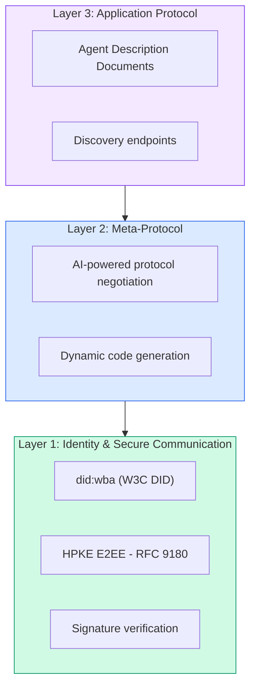

#### Tài liệu DID (trụ cấu thực tế)

ANP sử dụng một phương pháp DID tùy chỉnh được gọi là `did:wba`(Nhà đại lý dựa trên mạng).`did:wba:example.com:user:alice`quyết định `https://example.com/user/alice/did.json`- Có thể là:

```json
{
  "@context": [
    "https://www.w3.org/ns/did/v1",
    "https://w3id.org/security/suites/jws-2020/v1",
    "https://w3id.org/security/suites/secp256k1-2019/v1"
  ],
  "id": "did:wba:example.com:user:alice",
  "verificationMethod": [
    {
      "id": "did:wba:example.com:user:alice#key-1",
      "type": "EcdsaSecp256k1VerificationKey2019",
      "controller": "did:wba:example.com:user:alice",
      "publicKeyJwk": {
        "crv": "secp256k1",
        "x": "NtngWpJUr-rlNNbs0u-Aa8e16OwSJu6UiFf0Rdo1oJ4",
        "y": "qN1jKupJlFsPFc1UkWinqljv4YE0mq_Ickwnjgasvmo",
        "kty": "EC"
      }
    },
    {
      "id": "did:wba:example.com:user:alice#key-x25519-1",
      "type": "X25519KeyAgreementKey2019",
      "controller": "did:wba:example.com:user:alice",
      "publicKeyMultibase": "z9hFgmPVfmBZwRvFEyniQDBkz9LmV7gDEqytWyGZLmDXE"
    }
  ],
  "authentication": [
    "did:wba:example.com:user:alice#key-1"
  ],
  "keyAgreement": [
    "did:wba:example.com:user:alice#key-x25519-1"
  ],
  "humanAuthorization": [
    "did:wba:example.com:user:alice#key-1"
  ],
  "service": [
    {
      "id": "did:wba:example.com:user:alice#agent-description",
      "type": "AgentDescription",
      "serviceEndpoint": "https://example.com/agents/alice/ad.json"
    }
  ]
}
```

Những điều quan trọng cần chú ý:
- **Key separation**Các khóa ký (secp256k1) được tách biệt với các khóa mã hóa (X25519).
  Trung ngữ翻译:**密钥分离**Đó là một phần của việc làm của mình.
- **`humanAuthorization`**Các khóa này đòi hỏi sự chấp thuận của con người rõ ràng (biometric, mật khẩu, HSM) trước khi sử dụng.
  Trung ngữ翻译:**`humanAuthorization`**Đây là một trong những công cụ được sử dụng để kiểm soát các loại hình của các loại hình này.
- **`keyAgreement`**Các khóa được sử dụng cho mã hóa HPKE kết thúc đến kết thúc (RFC 9180).
  Trung ngữ翻译:**`keyAgreement`**密钥 dùng cho HPKE 端到端加密(RFC 9180)。
- - **service**Phần liên kết đến tài liệu mô tả đại lý.
  Trung ngữ翻译:**service**部分链接到 Agent 描述文档──

Mô hình phân chia chìa khóa là những gì các hệ thống tiền điện tử trong thế giới thực yêu cầu nhưng giao thức JSON thường bỏ qua. ANP thực thi nó bởi vì các đại lý xuyên tổ chức xử lý tiền, hợp đồng và PII  một khóa bị xâm phạm duy nhất không được mở khóa mọi khả năng.

> Chế độ chia tách là yêu cầu của hệ thống mật mã thực tế, nhưng giao thức JSON thường xuyên bị bỏ qua.

#### Làm thế nào sự tin tưởng hoạt động trong ANP

ANP làm **not**sử dụng một biểu đồ web của niềm tin hoặc xác nhận.

> ANP **不**Sử dụng信任网络或背书图.

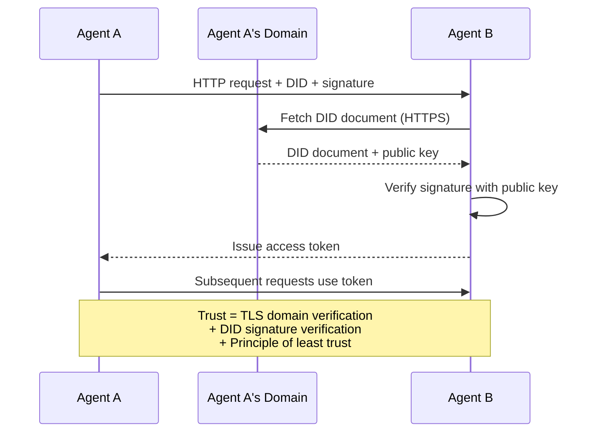

Sự tin tưởng đến từ ba nguồn:
1. **Domain-level TLS**xác minh host tài liệu DID
   Trung ngữ翻译:**域级 TLS**验证 DID 文档主机
2. **DID cryptographic signatures**xác minh danh tính của đại lý
   Trung ngữ翻译:**DID 加密签名**验证 Cơ quan
3. **Principle of least trust**chỉ cấp phép tối thiểu
   Trung ngữ翻译:**最小信任原则**Chỉ cấp quyền tối thiểu

Thiết kế ba nguồn tránh các điểm thất bại đơn lẻ. TLS đơn độc là không đủ (bất cứ ai có chứng chỉ có thể lưu trữ một DID). DID đơn độc là không đủ (một khóa bị đánh cắp giả danh tính).

> 三源设计避免了单点故障──只有 TLS 不够──任何有证书的人都可以托管 DID (只有证书的人都可以托管 DID)──只有 DID 不够──被盗密钥伪造身份──与最小信任授权结合,你获得纵深防御而无需中央权力──

Không có sự truyền bá tin tưởng dựa trên những tin đồn hay xếp hạng PageRank.

> Không dựa trên truyền thông tin hay PageRank 评分.

#### Các cuộc đàm phán về giao thức meta

Đây là tính năng mới nhất của ANP. Khi hai đại lý từ các hệ sinh thái khác nhau gặp nhau, họ không cần định dạng dữ liệu được thỏa thuận trước.

> Đây là chức năng mới nhất của ANP. Khi hai đại lý từ các hệ sinh thái khác nhau gặp nhau, chúng không cần định hình dữ liệu trước.

```json
{
  "action": "protocolNegotiation",
  "sequenceId": 0,
  "candidateProtocols": "I can communicate using:\n1. JSON-RPC with hotel booking schema\n2. REST with OpenAPI 3.1 spec\n3. Natural language over HTTP",
  "modificationSummary": "Initial proposal",
  "status": "negotiating"
}
```

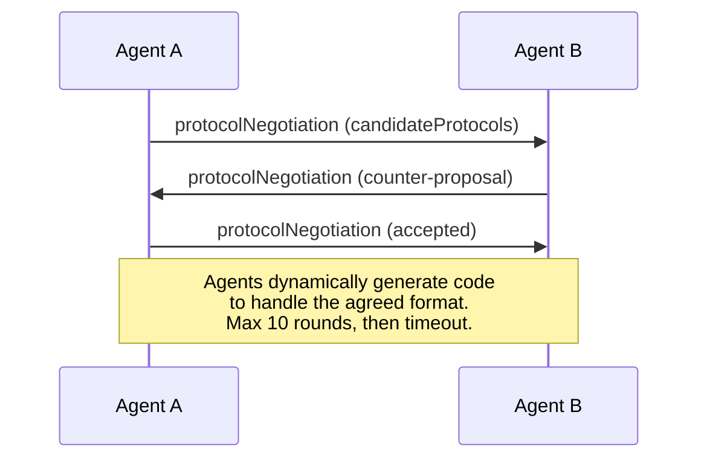

Các đại lý đi lại và trở lại (tối đa 10 lần bắn) cho đến khi họ đồng ý về một định dạng, sau đó tạo ra mã động để xử lý nó.`negotiating`- `rejected`- `accepted`- `timeout`- Tôi không biết.

> Trưởng phòng quay lại để thảo luận (tối đa 10 vòng) cho đến khi đạt được định dạng, sau đó động thái tạo mã để xử lý nó.`negotiating`(协商中)`rejected`(được từ chối)`accepted`(từ)`timeout`(超时) ✿

Điều này có nghĩa là hai đại lý chưa từng gặp nhau trước đây có thể tìm ra cách giao tiếp mà không ai định nghĩa trước một kế hoạch chia sẻ.

> Điều này có nghĩa là hai đại lý chưa từng gặp có thể tìm cách giao tiếp trong trường hợp không có người nào định nghĩa được mô hình chia sẻ.

Tầm nhìn: một mạng lưới đại lý mở nơi bất kỳ đại lý nào có thể nói chuyện với bất kỳ đại lý nào khác, ad-hoc, mà không cần công việc tích hợp trước đó.

> 愿景: Open Agent 网络中的任何 Agent可以与任何其他 Agent 临时对话,无需前期集成工作──这是否能扩展到玩具演示之外是2026年开放问题──后备总是" sử dụng A2A 并预先就模式达成一致──"

### So sánh (được sửa đổi)

| | MCP | A2A | ACP | ANP |
|---|---|---|---|---|
| **Created by** | Anthropic | Google / Linux Foundation | IBM / BeeAI | Community |
| **Spec format** | JSON-RPC | JSON-RPC / REST / gRPC | OpenAPI 3.1 (REST) | JSON-RPC |
| **Primary use** | Agent to Tool | Agent to Agent | Agent to Agent | Agent to Agent |
| **Discovery** | Tool listing | `/.well-known/agent-card.json` | `GET /agents`, `/.well-known/agent.yml` | `/.well-known/agent-descriptions`, DID service endpoints |
| **Identity** | Implicit (local) | Security schemes (OAuth, mTLS) | Server-level | W3C DID (`did:wba`) with E2EE |
| **Audit trail** | N/A | Basic (task history) | TrajectoryMetadata (tool calls, reasoning) | Not formally specified |
| **State machine** | N/A | 9 task states | 7 run states | N/A |
| **Streaming** | N/A | SSE | SSE | Transport-agnostic |
| **Unique feature** | Tool schemas | Agent Cards + Skills | Trajectory audit trail | Meta-protocol negotiation |
| **Best for** | Tools & data | Dynamic collaboration | Regulated industries | Cross-org trust |
| **Status** | Stable | Stable (v1.0) | Merging into A2A | Active development |

### Làm thế nào họ hợp tác

Các giao thức này không loại trừ lẫn nhau.

> Các hiệp định này không phải là những hiệp định lẫn nhau.

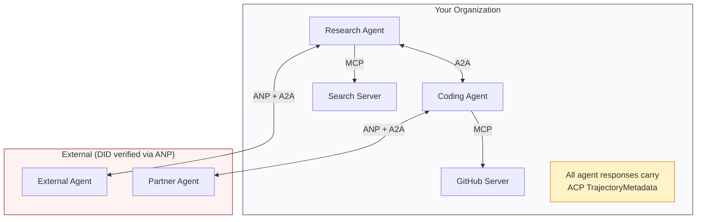

- **MCP**kết nối mỗi đại lý với công cụ của nó
  Trung ngữ翻译:**MCP**Mỗi đại lý sẽ được kết nối với công cụ của mình
- **A2A**xử lý sự hợp tác giữa các đại lý (bản bộ và bên ngoài)
  Trung ngữ翻译:**A2A**处理 Agent 之间的协作(内部和外部)
- **ACP**kết hợp các phản ứng trong metadata quỹ đạo để kiểm toán
  Trung ngữ翻译:**ACP**Sử dụng các quy trình dữ liệu đóng gói đáp ứng để đạt được tính kiểm toán
- **ANP**cung cấp xác minh danh tính cho các đại lý mà bạn không kiểm soát
  Trung ngữ翻译:**ANP**Vì anh không kiểm soát được đại lý  cung cấp chứng nhận

## Hãy xây dựng nó.
```figure
swarm-message-bus
```

## Hãy xây dựng nó

### Bước 1: Các loại thông điệp chính

Mỗi hệ thống đa đại lý bắt đầu với một định dạng tin nhắn. Chúng tôi xác định các loại mà bản đồ cho những gì các giao thức thực sự sử dụng:

> Mỗi hệ thống đại lý đều bắt đầu theo hình thức tin nhắn. Chúng tôi đã xác định loại hình sử dụng giao thức thực tế:

```typescript
import crypto from "node:crypto";

type MessageRole = "user" | "agent";

type MessagePart =
  | { kind: "text"; text: string }
  | { kind: "data"; data: unknown; mediaType: string }
  | { kind: "file"; name: string; url: string; mediaType: string };

type TrajectoryEntry = {
  reasoning: string;
  toolName?: string;
  toolInput?: unknown;
  toolOutput?: unknown;
  timestamp: number;
};

type AgentMessage = {
  id: string;
  role: MessageRole;
  parts: MessagePart[];
  trajectory?: TrajectoryEntry[];
  replyTo?: string;
  timestamp: number;
};

function createMessage(
  role: MessageRole,
  parts: MessagePart[],
  replyTo?: string
): AgentMessage {
  return {
    id: crypto.randomUUID(),
    role,
    parts,
    replyTo,
    timestamp: Date.now(),
  };
}

function textMessage(role: MessageRole, text: string): AgentMessage {
  return createMessage(role, [{ kind: "text", text }]);
}
```

Lưu ý: `MessagePart`là đa phương thức (tinh văn, dữ liệu có cấu trúc, tệp) giống như các thông số kỹ thuật A2A và ACP thực sự. `TrajectoryEntry`ghi lại chuỗi lý luận, phù hợp với TrajectoryMetadata của ACP.

> chú ý:`MessagePart`là nhiều mô hình của văn bản, cấu trúc dữ liệu, tài liệu), như thực tế A2A và ACP quy định.`TrajectoryEntry`捕获推理链,匹配 ACP's TrajectoryMetadata──

### Bước 2: Thẻ đại lý A2A và đăng ký

Xây dựng phát hiện đại lý phù hợp với thông số kỹ thuật A2A thực sự:

> 构建匹配真实A2A 规范的代理 发现:

```typescript
type Skill = {
  id: string;
  name: string;
  description: string;
  tags: string[];
  inputModes: string[];
  outputModes: string[];
};

type AgentCard = {
  name: string;
  description: string;
  version: string;
  url: string;
  capabilities: {
    streaming: boolean;
    pushNotifications: boolean;
  };
  defaultInputModes: string[];
  defaultOutputModes: string[];
  skills: Skill[];
};

class AgentRegistry {
  private cards: Map<string, AgentCard> = new Map();

  register(card: AgentCard) {
    this.cards.set(card.name, card);
  }

  discoverBySkillTag(tag: string): AgentCard[] {
    return [...this.cards.values()].filter((card) =>
      card.skills.some((skill) => skill.tags.includes(tag))
    );
  }

  discoverByInputMode(mimeType: string): AgentCard[] {
    return [...this.cards.values()].filter(
      (card) =>
        card.defaultInputModes.includes(mimeType) ||
        card.skills.some((skill) => skill.inputModes.includes(mimeType))
    );
  }

  resolve(name: string): AgentCard | undefined {
    return this.cards.get(name);
  }

  listAll(): AgentCard[] {
    return [...this.cards.values()];
  }
}
```

Đây là một bản đồ có tính năng từ tên đến khả năng đơn giản hơn. Bạn có thể khám phá các đại lý bằng thẻ kỹ năng, bằng các loại MIME nhập, hoặc bằng tên, giống như các đặc điểm A2A thực sự hỗ trợ.

> Đây là một cách đơn giản hơn từ tên đến khả năng lập trình là rất phong phú. Bạn có thể thông qua các thẻ kỹ năng, nhập MIME  loại hoặc tên tìm thấy đại lý, giống như thực A2A  quy định hỗ trợ.

### Bước 3: Chuyển đổi A2A

Xây dựng máy trạng thái nhiệm vụ đầy đủ:

> 构建完整的任务状态机:

```typescript
type TaskState =
  | "submitted"
  | "working"
  | "input-required"
  | "auth-required"
  | "completed"
  | "failed"
  | "canceled"
  | "rejected";

const TERMINAL_STATES: TaskState[] = [
  "completed",
  "failed",
  "canceled",
  "rejected",
];

type TaskStatus = {
  state: TaskState;
  message?: AgentMessage;
  timestamp: number;
};

type Artifact = {
  id: string;
  name: string;
  parts: MessagePart[];
};

type Task = {
  id: string;
  contextId: string;
  status: TaskStatus;
  artifacts: Artifact[];
  history: AgentMessage[];
};

type TaskEvent =
  | { kind: "statusUpdate"; taskId: string; status: TaskStatus }
  | {
      kind: "artifactUpdate";
      taskId: string;
      artifact: Artifact;
      append: boolean;
      lastChunk: boolean;
    };

type TaskHandler = (
  task: Task,
  message: AgentMessage
) => AsyncGenerator<TaskEvent>;

class TaskManager {
  private tasks: Map<string, Task> = new Map();
  private handlers: Map<string, TaskHandler> = new Map();
  private listeners: Map<string, ((event: TaskEvent) => void)[]> = new Map();

  registerHandler(agentName: string, handler: TaskHandler) {
    this.handlers.set(agentName, handler);
  }

  subscribe(taskId: string, listener: (event: TaskEvent) => void) {
    const existing = this.listeners.get(taskId) ?? [];
    existing.push(listener);
    this.listeners.set(taskId, existing);
  }

  async sendMessage(
    agentName: string,
    message: AgentMessage,
    contextId?: string
  ): Promise<Task> {
    const handler = this.handlers.get(agentName);
    if (!handler) {
      const task = this.createTask(contextId);
      task.status = {
        state: "rejected",
        timestamp: Date.now(),
        message: textMessage("agent", `No handler for ${agentName}`),
      };
      return task;
    }

    const task = this.createTask(contextId);
    task.history.push(message);
    task.status = { state: "submitted", timestamp: Date.now() };

    this.processTask(task, handler, message).catch((err) => {
      task.status = {
        state: "failed",
        timestamp: Date.now(),
        message: textMessage("agent", String(err)),
      };
    });
    return task;
  }

  getTask(taskId: string): Task | undefined {
    return this.tasks.get(taskId);
  }

  cancelTask(taskId: string): boolean {
    const task = this.tasks.get(taskId);
    if (!task || TERMINAL_STATES.includes(task.status.state)) return false;
    task.status = { state: "canceled", timestamp: Date.now() };
    this.emit(taskId, {
      kind: "statusUpdate",
      taskId,
      status: task.status,
    });
    return true;
  }

  private createTask(contextId?: string): Task {
    const task: Task = {
      id: crypto.randomUUID(),
      contextId: contextId ?? crypto.randomUUID(),
      status: { state: "submitted", timestamp: Date.now() },
      artifacts: [],
      history: [],
    };
    this.tasks.set(task.id, task);
    return task;
  }

  private async processTask(
    task: Task,
    handler: TaskHandler,
    message: AgentMessage
  ) {
    task.status = { state: "working", timestamp: Date.now() };
    this.emit(task.id, {
      kind: "statusUpdate",
      taskId: task.id,
      status: task.status,
    });

    try {
      for await (const event of handler(task, message)) {
        if (TERMINAL_STATES.includes(task.status.state)) break;

        if (event.kind === "statusUpdate") {
          task.status = event.status;
        }
        if (event.kind === "artifactUpdate") {
          const existing = task.artifacts.find(
            (a) => a.id === event.artifact.id
          );
          if (existing && event.append) {
            existing.parts.push(...event.artifact.parts);
          } else {
            task.artifacts.push(event.artifact);
          }
        }
        this.emit(task.id, event);
      }
    } catch (err) {
      task.status = {
        state: "failed",
        timestamp: Date.now(),
        message: textMessage("agent", String(err)),
      };
      this.emit(task.id, {
        kind: "statusUpdate",
        taskId: task.id,
        status: task.status,
      });
    }
  }

  private emit(taskId: string, event: TaskEvent) {
    for (const listener of this.listeners.get(taskId) ?? []) {
      listener(event);
    }
  }
}
```

Điều này thực hiện chu kỳ cuộc sống thực tế của A2A: gửi, làm việc, nhập-cần, trạng thái cuối.

> Điều này đã thực hiện thực tế A2A  nhiệm vụ chu kỳ đời: gửi, làm việc, nhập-cần, kết thúc tình trạng.

### Bước 4: Đường kiểm toán theo phong cách ACP

Kết nối thông tin liên lạc với việc theo dõi quỹ đạo:

> Us轨迹跟踪包装通信:

```typescript
type AuditEntry = {
  runId: string;
  agentName: string;
  input: AgentMessage[];
  output: AgentMessage[];
  trajectory: TrajectoryEntry[];
  status: "created" | "in-progress" | "completed" | "failed" | "awaiting";
  startedAt: number;
  completedAt?: number;
  sessionId?: string;
};

class AuditableRunner {
  private log: AuditEntry[] = [];
  private handlers: Map<
    string,
    (input: AgentMessage[]) => Promise<{
      output: AgentMessage[];
      trajectory: TrajectoryEntry[];
    }>
  > = new Map();

  registerAgent(
    name: string,
    handler: (input: AgentMessage[]) => Promise<{
      output: AgentMessage[];
      trajectory: TrajectoryEntry[];
    }>
  ) {
    this.handlers.set(name, handler);
  }

  async run(
    agentName: string,
    input: AgentMessage[],
    sessionId?: string
  ): Promise<AuditEntry> {
    const entry: AuditEntry = {
      runId: crypto.randomUUID(),
      agentName,
      input: structuredClone(input),
      output: [],
      trajectory: [],
      status: "created",
      startedAt: Date.now(),
      sessionId,
    };
    this.log.push(entry);

    const handler = this.handlers.get(agentName);
    if (!handler) {
      entry.status = "failed";
      return entry;
    }

    entry.status = "in-progress";
    try {
      const result = await handler(input);
      entry.output = structuredClone(result.output);
      entry.trajectory = structuredClone(result.trajectory);
      entry.status = "completed";
      entry.completedAt = Date.now();
    } catch (err) {
      entry.status = "failed";
      entry.trajectory.push({
        reasoning: `Error: ${String(err)}`,
        timestamp: Date.now(),
      });
      entry.completedAt = Date.now();
    }
    return entry;
  }

  getFullAuditLog(): AuditEntry[] {
    return structuredClone(this.log);
  }

  getAuditLogForAgent(agentName: string): AuditEntry[] {
    return structuredClone(
      this.log.filter((e) => e.agentName === agentName)
    );
  }

  getAuditLogForSession(sessionId: string): AuditEntry[] {
    return structuredClone(
      this.log.filter((e) => e.sessionId === sessionId)
    );
  }

  getTrajectoryForRun(runId: string): TrajectoryEntry[] {
    const entry = this.log.find((e) => e.runId === runId);
    return entry ? structuredClone(entry.trajectory) : [];
  }
}
```

Mỗi hành động của đại lý tạo ra một mục kiểm toán đầy đủ: những gì đã vào, những gì đã ra, và quỹ đạo đầy đủ của các cuộc gọi công cụ và các bước lý luận giữa hai. Bạn có thể truy vấn theo đại lý, theo phiên hoặc theo chạy riêng lẻ.

> Mỗi lần thực hiện của đại lý sẽ tạo ra một mục kiểm toán đầy đủ: nhập vào gì, xuất ra gì, và đường tròn đầy đủ giữa các bước điều chỉnh và đưa ra các biện pháp.

### Bước 5: Kiểm tra danh tính theo kiểu ANP

Xây dựng danh tính và xác minh dựa trên DID:

>  xây dựng dựa trên DID và chứng nhận:

```typescript
type VerificationMethod = {
  id: string;
  type: string;
  controller: string;
  publicKeyDer: string;
};

type DIDDocument = {
  id: string;
  verificationMethod: VerificationMethod[];
  authentication: string[];
  keyAgreement: string[];
  humanAuthorization: string[];
  service: { id: string; type: string; serviceEndpoint: string }[];
};

type AgentIdentity = {
  did: string;
  document: DIDDocument;
  privateKey: crypto.KeyObject;
  publicKey: crypto.KeyObject;
};

class IdentityRegistry {
  private documents: Map<string, DIDDocument> = new Map();

  publish(doc: DIDDocument) {
    this.documents.set(doc.id, doc);
  }

  resolve(did: string): DIDDocument | undefined {
    return this.documents.get(did);
  }

  verify(did: string, signature: string, payload: string): boolean {
    const doc = this.documents.get(did);
    if (!doc) return false;

    const authKeyIds = doc.authentication;
    const authKeys = doc.verificationMethod.filter((vm) =>
      authKeyIds.includes(vm.id)
    );

    for (const key of authKeys) {
      const publicKey = crypto.createPublicKey({
        key: Buffer.from(key.publicKeyDer, "base64"),
        format: "der",
        type: "spki",
      });
      const isValid = crypto.verify(
        null,
        Buffer.from(payload),
        publicKey,
        Buffer.from(signature, "hex")
      );
      if (isValid) return true;
    }
    return false;
  }

  requiresHumanAuth(did: string, operationKeyId: string): boolean {
    const doc = this.documents.get(did);
    if (!doc) return false;
    return doc.humanAuthorization.includes(operationKeyId);
  }
}

function createIdentity(domain: string, agentName: string): AgentIdentity {
  const did = `did:wba:${domain}:agent:${agentName}`;
  const { publicKey, privateKey } = crypto.generateKeyPairSync("ed25519");

  const publicKeyDer = publicKey
    .export({ format: "der", type: "spki" })
    .toString("base64");

  const keyId = `${did}#key-1`;
  const encKeyId = `${did}#key-x25519-1`;

  const document: DIDDocument = {
    id: did,
    verificationMethod: [
      {
        id: keyId,
        type: "Ed25519VerificationKey2020",
        controller: did,
        publicKeyDer,
      },
      {
        id: encKeyId,
        type: "X25519KeyAgreementKey2019",
        controller: did,
        publicKeyDer,
      },
    ],
    authentication: [keyId],
    keyAgreement: [encKeyId],
    humanAuthorization: [],
    service: [
      {
        id: `${did}#agent-description`,
        type: "AgentDescription",
        serviceEndpoint: `https://${domain}/agents/${agentName}/ad.json`,
      },
    ],
  };

  return { did, document, privateKey, publicKey };
}

function signPayload(identity: AgentIdentity, payload: string): string {
  return crypto
    .sign(null, Buffer.from(payload), identity.privateKey)
    .toString("hex");
}
```

Điều này phản ánh mô hình danh tính ANP thực sự: các đại lý có tài liệu DID với xác thực riêng biệt, thỏa thuận chính và khóa ủy quyền của con người.`IdentityRegistry`mô phỏng độ phân giải DID (trong sản xuất đây sẽ là HTTP lấy đến miền của đại lý).

> Điều này phản ánh mô hình thực sự của ANP: Trưởng sở hữu tài liệu DID có chứng nhận độc lập, giao thức khóa và mật khẩu được ủy quyền nhân tạo.`IdentityRegistry`模拟 DID 解析 ((( trong môi trường sản xuất, đây sẽ là để lấy HTTP của Quản lý 域) ]]

### Bước 6: Protocol Gateway

Kết nối tất cả bốn giao thức vào một hệ thống thống nhất:

> Kết nối tất cả bốn giao thức với một hệ thống thống nhất:

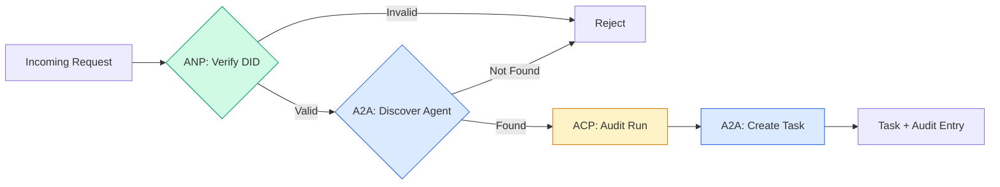

```typescript
class ProtocolGateway {
  private registry: AgentRegistry;
  private taskManager: TaskManager;
  private auditRunner: AuditableRunner;
  private identityRegistry: IdentityRegistry;

  constructor(
    registry: AgentRegistry,
    taskManager: TaskManager,
    auditRunner: AuditableRunner,
    identityRegistry: IdentityRegistry
  ) {
    this.registry = registry;
    this.taskManager = taskManager;
    this.auditRunner = auditRunner;
    this.identityRegistry = identityRegistry;
  }

  async delegateTask(
    fromDid: string,
    signature: string,
    targetAgent: string,
    message: AgentMessage,
    sessionId?: string
  ): Promise<{ task: Task; audit: AuditEntry } | { error: string }> {
    if (!this.identityRegistry.verify(fromDid, signature, message.id)) {
      return { error: "Identity verification failed" };
    }

    const card = this.registry.resolve(targetAgent);
    if (!card) {
      return { error: `Agent ${targetAgent} not found in registry` };
    }

    const audit = await this.auditRunner.run(
      targetAgent,
      [message],
      sessionId
    );
    const task = await this.taskManager.sendMessage(targetAgent, message);

    return { task, audit };
  }

  discoverAndDelegate(
    fromDid: string,
    signature: string,
    skillTag: string,
    message: AgentMessage
  ): Promise<{ task: Task; audit: AuditEntry } | { error: string }> {
    const candidates = this.registry.discoverBySkillTag(skillTag);
    if (candidates.length === 0) {
      return Promise.resolve({
        error: `No agents found with skill tag: ${skillTag}`,
      });
    }
    return this.delegateTask(
      fromDid,
      signature,
      candidates[0].name,
      message
    );
  }
}
```

Cổng thông tin làm bốn điều trong một cuộc gọi:
1. **ANP**: Kiểm tra danh tính của người gọi thông qua chữ ký DID
   Trung ngữ翻译:**ANP**: thông qua DID 签名验证调用者身份
2. **A2A**: Khám phá các tác nhân mục tiêu và kiểm tra khả năng
   Trung ngữ翻译:**A2A**: phát hiện mục tiêu đại lý và kiểm tra khả năng
3. **ACP**: Bị kết thúc trong một đường kiểm toán với quỹ đạo
   Trung ngữ翻译:**ACP**: sử dụng quỹ đạo kiểm tra theo dõi gói thực hiện
4. **A2A**: Tạo ra một nhiệm vụ với toàn bộ vòng đời theo dõi
   Trung ngữ翻译:**A2A**: Tạo nhiệm vụ theo dõi chu kỳ sống hoàn chỉnh

### Bước 7: Hãy kết nối tất cả

```typescript
async function protocolDemo() {
  const registry = new AgentRegistry();
  registry.register({
    name: "researcher",
    description: "Searches and summarizes findings",
    version: "1.0.0",
    url: "https://researcher.local/a2a/v1",
    capabilities: { streaming: true, pushNotifications: false },
    defaultInputModes: ["text/plain"],
    defaultOutputModes: ["text/plain", "application/json"],
    skills: [
      {
        id: "web-research",
        name: "Web Research",
        description: "Searches the web",
        tags: ["research", "search", "summarization"],
        inputModes: ["text/plain"],
        outputModes: ["application/json"],
      },
    ],
  });
  registry.register({
    name: "coder",
    description: "Writes code from specs",
    version: "1.0.0",
    url: "https://coder.local/a2a/v1",
    capabilities: { streaming: false, pushNotifications: false },
    defaultInputModes: ["text/plain", "application/json"],
    defaultOutputModes: ["text/plain"],
    skills: [
      {
        id: "code-gen",
        name: "Code Generation",
        description: "Generates code",
        tags: ["coding", "generation"],
        inputModes: ["text/plain", "application/json"],
        outputModes: ["text/plain"],
      },
    ],
  });

  const taskManager = new TaskManager();
  const auditRunner = new AuditableRunner();

  const researchTrajectory: TrajectoryEntry[] = [];

  taskManager.registerHandler(
    "researcher",
    async function* (task, message) {
      yield {
        kind: "statusUpdate" as const,
        taskId: task.id,
        status: { state: "working" as const, timestamp: Date.now() },
      };

      researchTrajectory.push({
        reasoning: "Searching for React 19 documentation",
        toolName: "web_search",
        toolInput: { query: "React 19 compiler features" },
        toolOutput: {
          results: ["react.dev/blog/react-19", "github.com/react/react"],
        },
        timestamp: Date.now(),
      });

      researchTrajectory.push({
        reasoning: "Extracting key findings from search results",
        toolName: "doc_analysis",
        toolInput: { url: "react.dev/blog/react-19" },
        toolOutput: {
          summary:
            "React 19 compiler auto-memoizes, no manual useMemo needed",
        },
        timestamp: Date.now(),
      });

      yield {
        kind: "artifactUpdate" as const,
        taskId: task.id,
        artifact: {
          id: crypto.randomUUID(),
          name: "research-results",
          parts: [
            {
              kind: "data" as const,
              data: {
                findings: [
                  "React 19 compiler auto-memoizes components",
                  "No more manual useMemo/useCallback needed",
                  "Compiler runs at build time, not runtime",
                ],
                sources: ["react.dev/blog/react-19"],
              },
              mediaType: "application/json",
            },
          ],
        },
        append: false,
        lastChunk: true,
      };

      yield {
        kind: "statusUpdate" as const,
        taskId: task.id,
        status: { state: "completed" as const, timestamp: Date.now() },
      };
    }
  );

  auditRunner.registerAgent("researcher", async () => ({
    output: [
      textMessage("agent", "React 19 compiler auto-memoizes components"),
    ],
    trajectory: researchTrajectory,
  }));

  const identityRegistry = new IdentityRegistry();

  const coderIdentity = createIdentity("coder.local", "coder");
  const researcherIdentity = createIdentity("researcher.local", "researcher");

  identityRegistry.publish(coderIdentity.document);
  identityRegistry.publish(researcherIdentity.document);

  const gateway = new ProtocolGateway(
    registry,
    taskManager,
    auditRunner,
    identityRegistry
  );

  console.log("=== Protocol Demo ===\n");

  console.log("1. Agent Discovery (A2A)");
  const researchAgents = registry.discoverBySkillTag("research");
  console.log(
    `   Found ${researchAgents.length} agent(s):`,
    researchAgents.map((a) => a.name)
  );

  console.log("\n2. Identity Verification (ANP)");
  const message = textMessage("user", "Research React 19 compiler features");
  const signature = signPayload(coderIdentity, message.id);
  const verified = identityRegistry.verify(
    coderIdentity.did,
    signature,
    message.id
  );
  console.log(`   Coder DID: ${coderIdentity.did}`);
  console.log(`   Signature verified: ${verified}`);

  console.log("\n3. Task Delegation (A2A + ACP + ANP)");
  const result = await gateway.delegateTask(
    coderIdentity.did,
    signature,
    "researcher",
    message,
    "session-001"
  );

  if ("error" in result) {
    console.log(`   Error: ${result.error}`);
    return;
  }

  console.log(`   Task ID: ${result.task.id}`);
  console.log(`   Task state: ${result.task.status.state}`);
  console.log(`   Artifacts: ${result.task.artifacts.length}`);

  console.log("\n4. Audit Trail (ACP)");
  console.log(`   Run ID: ${result.audit.runId}`);
  console.log(`   Status: ${result.audit.status}`);
  console.log(`   Trajectory steps: ${result.audit.trajectory.length}`);
  for (const step of result.audit.trajectory) {
    console.log(`     - ${step.reasoning}`);
    if (step.toolName) {
      console.log(`       Tool: ${step.toolName}`);
    }
  }

  console.log("\n5. Full Audit Log");
  const fullLog = auditRunner.getFullAuditLog();
  console.log(`   Total runs: ${fullLog.length}`);
  for (const entry of fullLog) {
    const duration = entry.completedAt
      ? `${entry.completedAt - entry.startedAt}ms`
      : "in-progress";
    console.log(`   ${entry.agentName}: ${entry.status} (${duration})`);
  }
}

protocolDemo().catch((err) => {
  console.error("Protocol demo failed:", err);
  process.exitCode = 1;
});
```

## Điều gì sai

Các giao thức giải quyết được con đường hạnh phúc.

> 协议 giải quyết đường lối bình thường.

**Schema drift.**Cảnh sát A xuất bản quảng cáo thẻ Cảnh sát`application/json`nhưng các bản JSON thay đổi giữa các phiên bản. Agent B phân tích các định dạng cũ và nhận được rác. sửa chữa: phiên bản kỹ năng của bạn và các bản phát hành.`version`về Agent Cards vì lý do này.

> **模式漂移。**Cảnh sát A  đưa ra một tuyên bố `application/json`输出 Agent 卡片──但 JSON 模式在版本之间发生变化──Agent B 解析旧格式并得到垃圾数据──修复:版本化你的技能和输出模式──A2A 规范为此支持 Agent 卡片上的`version`

**State machine violations.**Một người quản lý đại lý sẽ tạo ra một `completed`event, sau đó cố gắng để tạo ra nhiều đồ tạo khác. nhiệm vụ là không thể thay đổi. mã của bạn lặng lẽ bỏ lại các cập nhật hoặc ném. sửa chữa: kiểm tra trạng thái cuối trước khi tạo ra.`TaskManager`trên thực thi điều này với `break`sau khi kết thúc.

> **状态机违规。**Trình xử lý tạo ra một`completed`事件, rồi cố gắng tạo ra nhiều hơn các công trình. nhiệm vụ là không thể thay đổi.`TaskManager`通过终态后的 `break`Để bắt buộc thực hiện.

**Trust resolution failures.**Cảnh sát A cố gắng xác minh DID của Cảnh sát B, nhưng tên miền của Cảnh sát B đã bị mất. Tài liệu DID không thể được lấy. Bạn không mở (tự nhận các đại lý không được xác minh) hoặc không đóng (để từ chối mọi thứ)? ANP khuyến cáo không đóng theo nguyên tắc ít tin tưởng nhất.

> **信任解析失败。**Cảnh sát A 试验证 Cảnh sát B  DID, nhưng tên miền của Cảnh sát B 机已──DID 档档无法获取──你是开放失败 (không được kiểm chứng) 接受未经验证的Cảnh sát) 还是关闭失败 (không chấp nhận mọi thứ)?ANP 建议以最小信任原则关闭失败──

**Trajectory bloat.**Việc ghi lại quỹ đạo ACP là mạnh mẽ nhưng tốn kém. Một đại lý phức tạp thực hiện 200 cuộc gọi công cụ mỗi lần chạy tạo ra các mục kiểm toán lớn.

> **轨迹膨胀。**ACP 轨迹日志功能强大但代价高昂―― một đại lý phức tạp mỗi lần vận hành 200 lần công cụ调用 sẽ tạo ra một lượng lớn các mục kiểm toán.

**Discovery thundering herd.**50 nhân viên tất cả truy vấn `GET /agents`sửa chữa: cache Agent Card với TTL, khoảng thời gian phát hiện, hoặc sử dụng đăng ký dựa trên push thay vì thăm dò.

> **发现惊群。**50 nhân viên trong quá trình truy vấn`GET /agents` sửa đổi: sử dụng TTL 缓存 Agent 卡片,交错发现间隔, hoặc sử dụng dựa trên đăng ký chứ không phải truy vấn

## Hãy sử dụng nó để thực hiện

### Thực hiện thực tế

**A2A**là một trong những người trưởng thành nhất.[official spec](https://github.com/google/A2A)là nguồn mở dưới Linux Foundation. SDK cho Python và TypeScript. Nếu các đại lý của bạn cần phát hiện động và hợp tác, bắt đầu từ đây.

> **A2A**Đó là những người trưởng thành nhất của Google.[官方规范](https://github.com/google/A2A)Trong Linux Foundation, có Python và TypeScript SDK. Nếu đại lý của bạn cần tìm kiếm động thái và hợp tác, hãy bắt đầu từ đây.

**ACP**đang hợp nhất thành A2A. IBM [BeeAI project](https://github.com/i-am-bee/acp)ACP được tạo ra như một thay thế REST đầu tiên, nhưng khái niệm metadata quỹ đạo đang được hấp thụ vào hệ sinh thái A2A. Sử dụng các mô hình ACP (lập nhật quỹ đạo, vòng đời chạy) ngay cả khi bạn sử dụng A2A như là vận chuyển.

> **ACP**đang hợp tác với A2A. IBM.[BeeAI 项目](https://github.com/i-am-bee/acp)Ưu tiên thay thế REST là ACP, nhưng khái niệm quỹ đạo dữ liệu đang được hấp thụ vào hệ sinh thái A2A.

**ANP**là thử nghiệm nhất.[community repo](https://github.com/agent-network-protocol/AgentNetworkProtocol)có một Python SDK (AgentConnect). khái niệm đàm phán meta-protocol thực sự mới mẻ.

> **ANP**Đó là những thử nghiệm nhất.[社区仓库](https://github.com/agent-network-protocol/AgentNetworkProtocol)Có một Python SDK (AgentConnect) ⋅元协议协商概念确实新──值得跨组织代理部署关注──

**MCP**Nếu bạn muốn các đại lý sử dụng công cụ, MCP là tiêu chuẩn.

> **MCP**已在第13阶段中涵盖──如果你想让代理使用工具,MCP là tiêu chuẩn──

### Chọn đúng giao thức

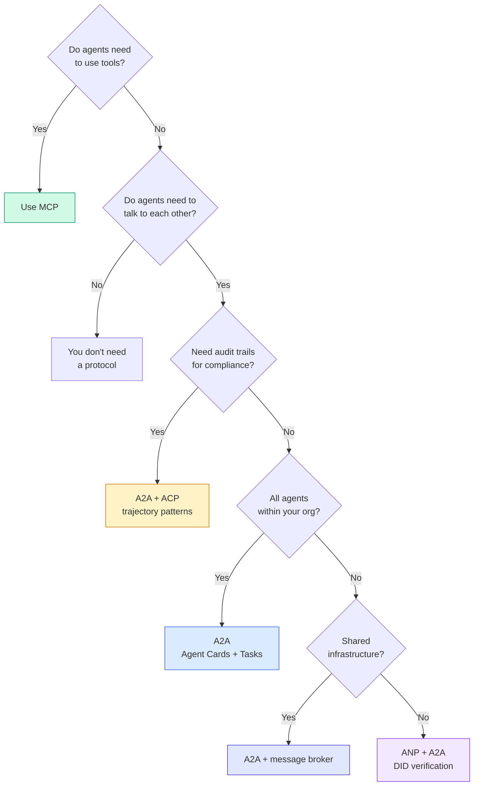

## Chuyển nó đi.

Bài học này mang lại:
- `code/main.ts`-- thực hiện hoàn toàn tất cả bốn mô hình giao thức
  Trung ngữ翻译:`code/main.ts` Hoàn toàn thực hiện tất cả bốn mô hình thỏa thuận
- `outputs/prompt-protocol-selector.md`-- một lời nhắc giúp bạn chọn các giao thức cho hệ thống của bạn
  Trung ngữ翻译:`outputs/prompt-protocol-selector.md`  giúp bạn cho hệ thống chọn giao thức

## Tập luyện bài tập

1. **Multi-hop task delegation.**Tăng `TaskManager`Một nhà nghiên cứu nhận được một nhiệm vụ, đại diện "bảo sát" và "chổ chốt" các nhiệm vụ cho hai đại lý chuyên môn, chờ đợi cả hai hoàn thành, sau đó sáp nhập kết quả thành các hiện vật của riêng mình.
   Trung ngữ翻译:**多跳任务委派。**扩展 `TaskManager`, để các tác vụ xử lý của đại lý có thể chuyển sang các nhiệm vụ của các đại lý khác, để các nhà nghiên cứu nhận nhiệm vụ, sẽ "hướng" và "hướng" các nhiệm vụ của đại lý, chờ đợi hai kết quả được hoàn thành, sau đó kết hợp kết quả.

2. **Streaming audit trail.**Thay đổi `AuditableRunner`thay vì chờ đợi kết quả đầy đủ, yield `AuditEntry`cập nhật trong thời gian thực khi các mục quỹ đạo được thêm vào. Sử dụng một máy phát điện async tạo ra các ảnh chụp nhanh kiểm toán.
   Trung ngữ翻译:**流式审计跟踪。**修改 `AuditableRunner`以支持流式模式── không phải chờ đợi kết quả hoàn chỉnh, mà là tạo ra trong thời gian thực sự`AuditEntry`更新──使用产生审计快照的异步生成器──

3. **DID rotation.**Thêm vòng quay khóa vào `IdentityRegistry`Một đại lý nên có thể xuất bản một tài liệu DID mới với các khóa cập nhật trong khi duy trì một `previousDid`Các nhà xác minh nên chấp nhận chữ ký từ cả khóa hiện tại và trước đó trong một thời gian miễn phí.
   Trung ngữ翻译:**DID 轮换。**`IdentityRegistry`添加密钥轮换. 代理 应能够发布带有更新密钥的新DID 文档,同时维护.`previousDid`引用──验证人在宽限期内应接受当前和先前密钥的签名──

4. **Protocol negotiation.**Thực hiện khái niệm giao thức meta của ANP. Hai đại lý trao đổi `protocolNegotiation`Thông điệp với các định dạng ứng cử viên (ví dụ: "Tôi có thể nói JSON-RPC" so với "Tôi thích REST"). Sau tối đa 3 vòng, họ đồng ý về một định dạng hoặc thời gian nghỉ.`TaskManager`hoặc `AuditableRunner`Họ dùng.
   Trung ngữ翻译:**协议协商。**Thực hiện khái niệm của ANP.`protocolNegotiation`消息(如"我可以说 JSON-RPC"对比"我更喜欢 REST") 

5. **Rate-limited discovery.**Thêm một `RateLimitedRegistry`gói mà cache tìm kiếm thẻ Agent với một TTL cấu hình và giới hạn các truy vấn khám phá mỗi đại lý mỗi giây. mô phỏng một đàn đàn thổi thồng của 100 đại lý phát hiện lẫn nhau khi khởi động và đo sự khác biệt.
   Trung ngữ翻译:**限速发现。**添加一个 `RateLimitedRegistry`包装器, sử dụng TTL 缓存 được cấu hình  Agent card tìm kiếm,并限制 mỗi giây mỗi Agent tìm kiếm truy vấn.

## Từ khóa  Từ khóa nhanh chóng

| Term | What people say | What it actually means |
|------|----------------|----------------------|
| MCP | "The protocol for AI tools" / "AI 工具协议" | A client-server protocol for agents to discover and use tools. Agent-to-tool, not agent-to-agent. / 用于 Agent 发现和使用工具的客户端-服务器协议。Agent 到工具，不是 Agent 到 Agent。 |
| A2A | "Google's agent protocol" / "Google 的 Agent 协议" | A peer-to-peer protocol for agent collaboration under the Linux Foundation. Discovery via Agent Cards, 9-state task lifecycle, streaming via SSE. Supports JSON-RPC, REST, and gRPC bindings. / Linux Foundation 下的 Agent 协作点对点协议。通过 Agent 卡片发现，9 状态任务生命周期，SSE 流。支持 JSON-RPC、REST 和 gRPC 绑定。 |
| ACP | "Enterprise agent messaging" / "企业 Agent 消息" | IBM/BeeAI's REST API for agent runs with TrajectoryMetadata: every response carries the full chain of reasoning and tool calls. Merging into A2A. / IBM/BeeAI 的 Agent 运行 REST API，带轨迹元数据：每个响应携带完整的推理链和工具调用。正在合并到 A2A。 |
| ANP | "Decentralized agent identity" / "去中心化 Agent 身份" | A community protocol using `did:wba` (DID) for cryptographic identity, HPKE for E2EE, and AI-powered meta-protocol negotiation for agents that have never seen each other. / 使用 `did:wba` (DID) 进行加密身份、HPKE 进行端到端加密、AI 驱动的元协议协商的社区协议。 |
| Agent Card / Agent 卡片 | "An agent's business card" / "Agent 的名片" | A JSON document at `/.well-known/agent-card.json` describing skills, supported MIME types, security schemes, and protocol bindings. / 描述技能、支持的 MIME 类型、安全方案和协议绑定的 JSON 文档。 |
| DID | "Decentralized ID" / "去中心化 ID" | W3C standard for cryptographically verifiable identities hosted on the agent's own domain. ANP uses `did:wba` method. / W3C 标准，用于托管在 Agent 自己域上的加密可验证身份。ANP 使用 `did:wba` 方法。 |
| TrajectoryMetadata / 轨迹元数据 | "The audit receipt" / "审计收据" | ACP's mechanism for attaching reasoning steps, tool calls, and their inputs/outputs to every agent response. / ACP 的机制，将推理步骤、工具调用及其输入/输出附加到每个 Agent 响应。 |
| Meta-protocol / 元协议 | "Agents negotiating how to talk" / "Agent 协商如何对话" | ANP's approach where agents use natural language to dynamically agree on data formats, then generate code to handle them. / ANP 的方法，Agent 使用自然语言动态就数据格式达成一致，然后生成代码处理。 |
| Task / 任务 | "A unit of work" / "工作单元" | A2A's stateful object tracking work from submission through completion. Immutable once terminal. / A2A 的有状态对象，跟踪从提交到完成的工作。一旦终态则不可变。 |

## Xem thêm 延伸阅读

- [Google A2A specification](https://github.com/google/A2A)-- thông số kỹ thuật chính thức và SDK (v1.0.0, Linux Foundation)
  Trung文翻译:Google A2A 规范  官方规范和 SDK(v1.0.0, Linux Foundation)
- [IBM/BeeAI ACP specification](https://github.com/i-am-bee/acp)-- OpenAPI 3.1 spec cho các hoạt động của đại lý và quỹ đạo metadata
  Trung文翻译:IBM/BeeAI ACP 规范  Agent 运行和轨迹元数据的 OpenAPI 3.1 规范
- [Agent Network Protocol](https://github.com/agent-network-protocol/AgentNetworkProtocol)-- DID dựa trên danh tính, E2EE, đàm phán giao thức meta
  Trung文翻译:Agent Network Protocol  基于 DID的身份、端到端加密、元协议协商
- [Model Context Protocol docs](https://modelcontextprotocol.io/)-- Khóa kỹ thuật MCP của Anthropic (được bao gồm trong giai đoạn 13)
  中文翻译:Model Context Protocol 文档  MCP của nhân văn 规范(在Phase 13 中涵盖)
- [W3C Decentralized Identifiers](https://www.w3.org/TR/did-core/)-- tiêu chuẩn danh tính cơ sở cho ANP
  Trung文翻译:W3C 去中心化标识符  支 ANP 的身份标准
- [RFC 9180 (HPKE)](https://www.rfc-editor.org/rfc/rfc9180)-- hệ thống mã hóa ANP sử dụng cho E2EE
  Trung ngữ翻译:RFC 9180 (HPKE)  ANP dùng cho các chương trình mật mã kết thúc
- [FIPA Agent Communication Language](http://www.fipa.org/specs/fipa00061/SC00061G.html)-- là tiền thân học thuật cho các giao thức đại lý hiện đại
  Trung文翻译:FIPA Agent 通信语言  现代 Agent 协议的学术前身
