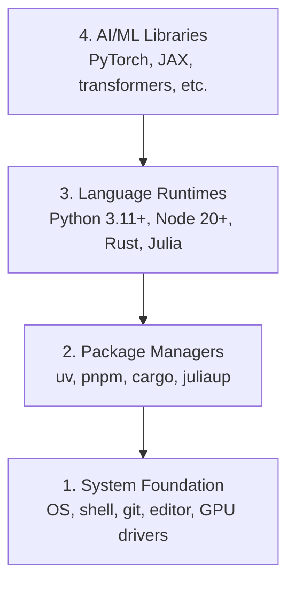

# 开发环境 开发环境建设

> 你的工具塑造了你的思维, 设置它们一次,设置它们正确.

> **【中文解读】**你的工具塑造你的思想一次性搭建好,一劳永逸. 本章是整个课程的起点:你将建立一个完整的AI工程开发环境 (Python、Node.js、Rust 工具链),并验证GPU加快是否可用.

**Type:** Build | **类型:** 构建
**Languages:** Python, Node.js, Rust | **语言:** Python, Node.js, Rust
**Prerequisites:** None | **前置知识:** 无
**Time:** ~45 minutes | **时间:** ~45 分钟

## 学习目标

- 设置Python 3.11+,Node.js 20+,以及Rust工具链从零开始
  中文翻译:从零搭建Python 3.11+、Node.js 20+ 和 Rust 工具链
- 配置可复制的构建的虚拟环境和包管理器
  中文翻译:配置虚拟环境和包管理器,确保构建可复现
- 通过CUDA/MPS验证GPU访问并执行测试子操作
  中文翻译:验证 GPU(CUDA/MPS) 是否可用,运行测试张量运算
- 了解四层堆:系统,包,运行时间,人工智能库
  中文翻译:理解四层技术:系统层、包管理器层、语言运行时层、AI库层

## 问题 问题描述

你即将学习人工智能工程,使用Python,TypeScript,Rust和Julia的500多个课程. 如果你的环境被破坏,

> 你将通过500多课程学习人工智能工程开发,涉及Python,TypeScript,Rust和Julia.

大多数人会跳过环境设置,然后花费数小时检查进口错误,版本冲突,以及缺失的CUDA驱动程序.

> 大多数人跳过环境构建. 然后他们花了好几个小时调试进口错误,版本冲突和缺失的 CUDA 驱动.

> **【中文解读】**
> 环境问题是你遇到"进口错误"",版本冲突"",找不到CUDA"等报错的根本原因.

## 概念的核心概念

人工智能工程环境有四层:

> 人工智能工程环境有四个层次:



我们安装下层,每个层取决于下层.

> 我们自从安装了. 每层都依赖于下层.

> **【中文解读】**
> 工程环境是四层金字塔:最底层是操作系统和驱动,往上是包管理器,再往上是语言运行时,最顶层才是PyTorch、变压器等.

> **【拓展：为什么需要 uv 而不是 pip？】**
> 在实际人工智能项目中,你可能同时维护多个项目依赖,例如一个使用PyTorch 2.1,另一个使用2.4),uv 能让环境隔离变得非常简单.
```figure
s0-env-stack
```

## 动手建造

> **【中文解读】**按"从底到顶"的顺序安装四层工具──每一步都可以直接复制粘贴到终端执行──如果您使用Windows,建议使用WSL2 (Windows Linux子系统) 获得Linux环境──

### 系统基础层.

检查系统,安装基本知识.

> 检查你的系统并安装基础工具.

```bash
# macOS
xcode-select --install
brew install git curl wget

# Ubuntu/Debian
sudo apt update && sudo apt install -y build-essential git curl wget

# Windows (use WSL2)
wsl --install -d Ubuntu-24.04
```

### 步骤2:使用Uv安装Python

我们使用`uv`它比Pip快10-100倍,并且自动处理虚拟环境.

> 我们使用`uv`它比快10-100倍,而且可以自动管理虚拟环境.

> **【拓展：Python 版本选择】**推 Python 3.12 (稳定且性能优化) ──3.11+ 都可以,但要避免3.13 (部分AI库可能还没有适应) ──uv 的 `python install`现在,我们已经开始使用了Python.

```bash
curl -LsSf https://astral.sh/uv/install.sh | sh

uv python install 3.12

uv venv
source .venv/bin/activate  # or .venv\Scripts\activate on Windows

uv pip install numpy matplotlib jupyter
```

检查:

> 验证安装:

```python
import sys
print(f"Python {sys.version}")

import numpy as np
print(f"NumPy {np.__version__}")
a = np.array([1, 2, 3])
print(f"Vector: {a}, dot product with itself: {np.dot(a, a)}")
```

### 步3:安装 Node.js 和 pnpm

> **【中文解读】**编写类型的编写类型.fnm 是 Node 版本管理器,pnpm 是比 npm 更快的包管理器.

对于TypeScript课程 (代理,MCP服务器,网络应用).

> 用于TypeScript课程 (Agent,MCP服务器,Web应用).

```bash
curl -fsSL https://fnm.vercel.app/install | bash
fnm install 22
fnm use 22

npm install -g pnpm

node -e "console.log('Node', process.version)"
```

**macOS / Apple Silicon (M1/M2/M3/M4):**如果安装器停止使用`Error: Cannot install under Rosetta 2 in ARM default prefix (/opt/homebrew)`您的终端正在Rosetta 2下运行`arch`印记`i386`安装Fnm强迫Arm64,将其插入你的子中,然后从上面的命令重启`fnm install 22`其他:

> **苹果芯片 Mac 用户注意**没有任何问题.`Error: Cannot install under Rosetta 2 in ARM default prefix (/opt/homebrew)`说明你的终端运行在Rosetta 2中`arch`输出`i386`),而 Homebrew 是原生的 arm64 版本.`fnm install 22`开始重跑上命令:

```bash
arch -arm64 brew install fnm
echo 'eval "$(fnm env --use-on-cd)"' >> ~/.zshrc
source ~/.zshrc
```

### ,,,,,,,,,,,,,,,,,,,,,,,,,,,,,,,,,,,,,,,,,,,,,,,,,,,,,,,,,,,,,,,,,,,,,,,,,,,,,,,,,,,,,,,,,,,,,,,,,,,,,,,,,,,,,,,,,,,,,,,,,,,,,,,,,,,,,,,,,,,,,,,,,,,,,,,,,,,,,,,,,,,,,,,,,,,,,,,,,,,,,,,,,,,,,,,,,,,,,,,,,,,,,,,,,,,,,,,,,,,,,,,,,,,,,,,,,,,,,,,,,,,,,,,,,,,,,,

对于性能关键的课程 (推理,系统).

> 基于性能敏感课程的推理优化,系统编程.

> **【中文解读】**化是化官方安装器,货物是化包管理器+构建工具 (相当于化版的管+制造) ⋅

```bash
curl --proto '=https' --tlsv1.2 -sSf https://sh.rustup.rs | sh

rustc --version
cargo --version
```

### 现在,我们要做什么?

对于朱莉亚耀的数学课程.

> 为了让朱莉亚学得很好,

```bash
curl -fsSL https://install.julialang.org | sh

julia -e 'println("Julia ", VERSION)'
```

### 设置GPU (如果有)

**NVIDIA (Linux / Windows):**

> **【中文解读】**显卡先用`nvidia-smi`确认驱动正常,再安装 CUDA 版 PyTorch;果芯片 Mac 没有 CUDA 属正常现象直接装默认版 PyTorch(内置 MPS/Metal 后端) 即可,不要传传 `--index-url .../cuXXX`(这些轮子只支持Linux/Windows,装备会失败)

```bash
nvidia-smi

# Install PyTorch with CUDA
uv pip install torch torchvision torchaudio --index-url https://download.pytorch.org/whl/cu124
```

**macOS / Apple Silicon (M1/M2/M3/M4):**没有一个Mac上 CUDA 预期,没有失败.**not**通过`--index-url .../cuXXX`安装简单的构建,其中包括果的MPS (金属) GPU后端:

> **macOS / 苹果芯片（M1/M2/M3/M4）**没有任何问题,这是预期行为,不是故障.`--index-url .../cuXXX`据悉,它已经安装了果果的MPS(金属) GPU 后端:

```bash
uv pip install torch torchvision torchaudio
```

验证 (在任何平台上都能工作):

> 验证(任意平台通用):

```python
import torch
print(f"CUDA available: {torch.cuda.is_available()}")           # False on macOS — expected
print(f"MPS available:  {torch.backends.mps.is_available()}")   # True on Apple Silicon
if torch.cuda.is_available():
    print(f"GPU: {torch.cuda.get_device_name(0)}")
```

没有GPU?没有问题.大多数课程都在CPU上进行.对于训练重的课程,请使用Google Colab或云GPU.

> 没有GPU?没关系. 大多数课程可以在CPU上运行.

> **【拓展：GPU vs CPU 性能对比】**训练 GPT-2 小(117M 参数):CPU 约7天,单块 RTX 3090 约3 小时,A100 约40 分钟――推理阶段差距略小但仍然显著――本课程大部分课程可使用CPU 运行,只有10期(从零训练LLM) 等少数课程建议使用GPU――

> **【拓展：GPU 在 AI 中的作用】**
>  GPU (图形处理器) 是因为它可以同时执行成千上万个简单计算,因为它可以同时执行数千万个简单计算.

### 步7:验证你想开始的路线

运行本课中的每个命令从库根,目录中运行
含有`README.md`其他`phases/`飞行前检查你需要的东西
默认情况下,它会跳过后来的工具,这样一个新学习者会看到
只是一个明确的答案,而不是一个警告墙.

> 本课的所有命令都包含在仓库根目录中`README.md`和 `phases/`预检脚本只检查你开始选择路线 (路线) 真正需要的东西,默认跳过后续课程才使用的工具让新手看到一个清晰的结论,而不是一个整屏警告

开始全新手序列:

> 启动完整的初学者序列:

```bash
python3 phases/00-setup-and-tooling/01-dev-environment/code/verify.py --route beginner
```

或只查看你想要的路线:

> 或许你只要查看你想学习的路线:

```bash
python3 phases/00-setup-and-tooling/01-dev-environment/code/verify.py --route ml-foundations
python3 phases/00-setup-and-tooling/01-dev-environment/code/verify.py --route llm-engineering
python3 phases/00-setup-and-tooling/01-dev-environment/code/verify.py --route agents
python3 phases/00-setup-and-tooling/01-dev-environment/code/verify.py --route mcp
python3 phases/00-setup-and-tooling/01-dev-environment/code/verify.py --route agent-skills
python3 phases/00-setup-and-tooling/01-dev-environment/code/verify.py --route certification
```

加入`--show-later`当你想要相同的飞行前检查可选的工具时
后期工具永远不会阻止学习.
选择的路线.

> 想让预检同时检查后课程将使用可选工具和依赖时,加上`--show-later` 缺失的后续工具永远不会阻你当前选择的路线.

每次未能执行的检查都包括检测到的路径或进口错误以及
代理技能和认证路线也显示
由于Python脚本不能证明AI主机有
您发现了技能或您选择的技能范围可写.

> 每个失败的必需检查项目都附加到检查的路径或进口错误,以及一个精确的修复命令.

开始飞行前,它打印出了第一课:

> 当初学者预检通过时,脚本会印出确切的第一课程:

```text
Ready to start Beginner course.
Next: python3 phases/01-math-foundations/01-linear-algebra-intuition/code/vectors.py
```

> **【中文解读】**预检脚本是"按路线最小环境"哲学落地:初学者只需要Python和Git,ml基础再加NumPy,agents/mcp 路线连接 Node 都可以先不装用再装`python3`换成`python`现在,我可以.

## 用它使用指南

> **【中文解读】**下表告诉你每种语言在哪些阶段使用. 字符号是绝对的主力. 阶段1-12), 字符号是用于代理和工具链. 阶段13-17), 度是用于高性能场景, 朱莉亚是用于数学计算. 新版思路是"用到重新装":不要为了装桶而卡住第一节正课.

您的环境准备好启动您检查的路线.
当一个课时要求他们,而不是完全阻止你的第一课时
您将在整个课程中使用的内容是:

> 你的环境已经开始了你检查的条路线. 后续工具等等,直到课程使用时再装,不要让整个技术阻碍你的第一节课程.

| Language | Used In | Package Manager |
|----------|---------|-----------------|
| Python | Phases 1-12 (ML, DL, NLP, Vision, Audio, LLMs) | uv |
| TypeScript | Phases 13-17 (Tools, Agents, Swarms, Infra) | pnpm |
| Rust | Phases 12, 15-17 (Performance-critical systems) | cargo |
| Julia | Phase 1 (Math foundations) | Pkg |

| 语言 | 用在哪些阶段 | 包管理器 |
|------|------------|---------|
| Python | 阶段 1-12（ML、DL、NLP、视觉、音频、LLM） | uv |
| TypeScript | 阶段 13-17（工具、Agent、集群、基础设施） | pnpm |
| Rust | 阶段 12, 15-17（高性能系统） | cargo |
| Julia | 阶段 1（数学基础） | Pkg |

## 运送它.

> **【拓展：环境检查 Prompt】** `outputs/prompt-env-check.md`在实际工作中,这种"环境自检提示"非常有用,你只需要给它报错,它就能定位问题.

这一课产生的验证脚本,任何人都可以运行来检查他们的设置.

> 任何人都可以使用它来检查自己的环境配置.

看到`outputs/prompt-env-check.md`为了帮助人工智能助理诊断环境问题.

> 参见`outputs/prompt-env-check.md`包含一个帮助人工智能助手诊断环境问题提示.

## 练习题

1. 运行验证脚本,修复任何故障
   运行验证脚本并修复所有失败的检查项
2. 创建一个Python虚拟环境,并安装PyTorch
   为本课程创建Python 虚拟环境并安装PyTorch
3. 在四种语言中写一个"世界好"并运行每一个
   用四种语言写一个"好世界"并运行
