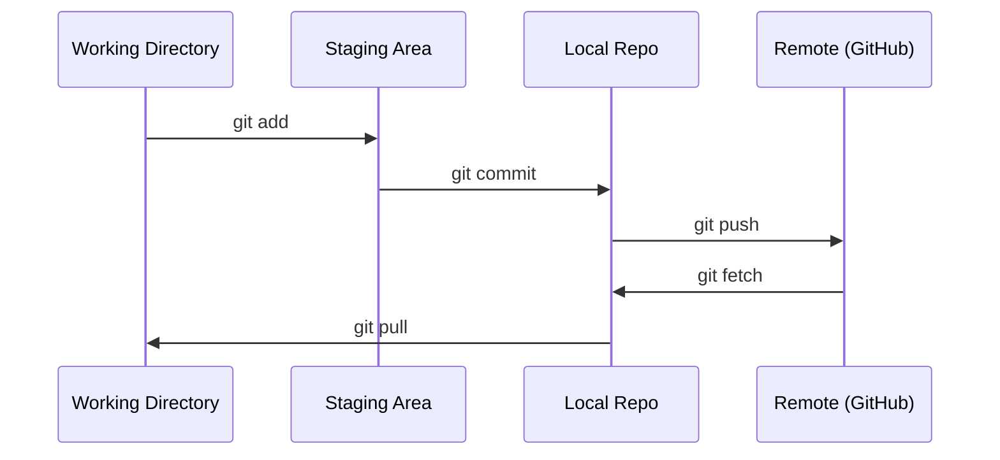

# 让我们一起合作

> 每个实验,每一个模型,每一个课程都会被追踪.
> 版本控制是不可选的. 你每次实验,每一个模型,每一个课程的成果都会被追踪.

**Type:** Learn | **类型:** 学习
**Languages:** -- | **语言:** 无
**Prerequisites:** Phase 0, Lesson 01 | **前置知识:** Phase 0, 第 01 课
**Time:** ~30 minutes | **时间:** ~30 分钟

## 学习目标

- 配置 git 身份,并使用每天的加,提交和推工作流程
  中文翻译:配置 Git 身份信息,掌握添加、承诺、推进的日常工作流
- 建立和合并分支,进行孤立的实验,而不会打破主体
  中文翻译:创建和合并分支,实现实验分离而不破坏主分支
- 写一个`.gitignore`排除模型检查点和大型二元文件
  中文翻译:编写 `.gitignore`文件,排除模型检查点和大文件
- 通过 导航提交历史`git log`了解项目发展
  中文翻译:用`git log`浏览提交历史,了解项目发展过程

> **【中文解读】**
> 在AI项目中,你会在实验中频繁修改模型参数和代码,让你随时回归任何一个状态.

> **【拓展：Git 在 AI 工程中的角色】**通过 Git 追踪实验意味着:训练结果变化了,你可以`git diff`找出什么改变; 模型部署出问题,可以.`git revert`回滚──大模型团队 (如拥抱脸) 的协作流程完全建立在 Git 上.

## 问题 问题描述

你即将在20个阶段写成数百个代码文件. 如果没有版本控制,你会失去工作,打破无法撤销的东西,

> 你将在20个阶段编写数百个代码文件.没有版本控制,你会失去工作成果.

这一课涵盖了你需要什么,而不是更多.

> 基因是工具,GitHub是代码托管的地方.

> **【中文解读】**
> 你会写几百个代码文件,没有版本控制 = 随时可能丢失工作成果、无法回归、无法合作――这就是解决的问题――

## 概念的核心概念



记住三个事情:
1. 经常保存 (`git commit`)
2. 按到远程 (`git push`)
3. 实验部门 (`git checkout -b experiment`)

> 记住三个事情:
> 1. 经常保存(`git commit`)
> 2. 推送到远程`git push`)
> 3. 用分支做实验`git checkout -b experiment`)

> **【中文解读】**
> 关键流程:工作目录 → 暂存区(git加)→ 本地仓库(git commit)→ 远程仓库(git push)。记住三件事:经常提交、推送到远程、用分支做实验。

> **【拓展：分支策略与 AI 实验】**AI 项目推"每实验一个分支"策略:`experiment/lr-0.001`,我知道.`experiment/add-dropout`等──这样每次实验的代码变更都被隔离,实验失败直接删分支,成功则合并──大型人工智能项目也会使用 Git标签标记模型版本(如`v1.0-baseline`),方便部署时精确指定代码版本──

## 建立它,实现它.
```figure
s0-commit-dag
```

## 建立它

### 步骤1:配置 git

> 第1步:配置 Git

```bash
git config --global user.name "Your Name"
git config --global user.email "you@example.com"
```

### 步骤2: 日常工作流

```bash
git status                              # 查看哪些文件有改动
git add file.py                         # 把改动加入暂存区
git commit -m "Add perceptron implementation"  # 提交到本地仓库
git push origin main                    # 推送到 GitHub 远程仓库
```

### 步骤3: 分分做实验.

```bash
git checkout -b experiment/new-optimizer  # 创建并切换到新分支

# ... make changes, commit ...  # 在新分支上修改和提交，不影响主分支

git checkout main                         # 切回主分支
git merge experiment/new-optimizer        # 把实验分支的改动合并到主分支
```

### 步骤4:使用本课程库

> **【拓展：Fork vs Clone】**如果你想保存自己的学习进步,而不会影响原始仓库,`fork`后面你有自己的完整副本,可以自由提交.

只有维护者才能访问写作. 首先在 GitHub 上 (叉按,右上)`origin`您的本文:

```bash
git clone https://github.com/YOUR-USERNAME/ai-engineering-from-scratch.git
cd ai-engineering-from-scratch

git checkout -b my-progress
# work through lessons, commit your code
git push origin my-progress
```

## 用它使用指南

> **【拓展：.gitignore 在 AI 项目中至关重要】**项目将产生大量不提交的大文件:模型权重`.pt`,我知道.`.safetensors`达10GB) 训练日志 数据集缓存`__pycache__`,我知道.`.venv`很好的.`.gitignore`能防止你意外把10GB的模型文件推到GitHub.`gitignore.io`生成 Python/ML 项目的模板──

为了完成这个课程,你需要这些命令:

> 在课程中,你只需要这些命令:

| Command | When |
|---------|------|
| `git clone` | Get the course repo |
| `git add` + `git commit` | Save your work |
| `git push` | Back it up to GitHub |
| `git checkout -b` | Try something without breaking main |
| `git log --oneline` | See what you've done |

| 命令 | 什么时候用 |
|------|-----------|
| `git clone` | 下载课程仓库 |
| `git add` + `git commit` | 保存你的工作 |
| `git push` | 备份到 GitHub |
| `git checkout -b` | 安全地尝试新想法 |
| `git log --oneline` | 查看你做了什么 |

这就是,你不需要反,桃选,或子模块.

> 课程不需要重建基础,选或子模块.

## 练习题

1. 克隆这个 repo,创建一个叫做`my-progress`写一个文件,提交它,推它
   克隆仓库,创建 `my-progress`分支,新建文件,提交并推送
1. 叉这个 repo,克隆你的叉子,创建一个叫做`my-progress`写一个文件,提交它,推它
2. 创建一个`.gitignore`没有模拟检查站文件 (`.pt`现在`.pth`现在`.safetensors`)
   创建`.gitignore`文件,排除模型检查点文件
3. 查看这个回复的提交历史`git log --oneline`阅读如何增加教训
   用`git log --oneline`查看提交历史,了解课程是如何逐步构建的

## 关键词 关键词

> **【中文解读】**提交) 项目快照,分支) 项目独立开发线,合并) 项目分支改动合集回来,远程) 项目分支改动合集回来,远程) 项目分支改动合集集集集

| Term | What people say | What it actually means |
|------|----------------|----------------------|
| Commit | "Saving" | A snapshot of your entire project at a point in time |
| Branch | "A copy" | A pointer to a commit that moves forward as you work |
| Merge | "Combining code" | Taking changes from one branch and applying them to another |
| Remote | "The cloud" | A copy of your repo hosted somewhere else (GitHub, GitLab) |

| 术语 | 俗称 | 实际含义 |
|------|------|---------|
| Commit | "保存" | 项目在某一时刻的完整快照 |
| Branch | "副本" | 指向某个提交的可移动指针，随工作向前推进 |
| Merge | "合并代码" | 将一个分支的改动应用到另一个分支 |
| Remote | "云端" | 托管在其他地方的仓库副本（如 GitHub、GitLab） |
