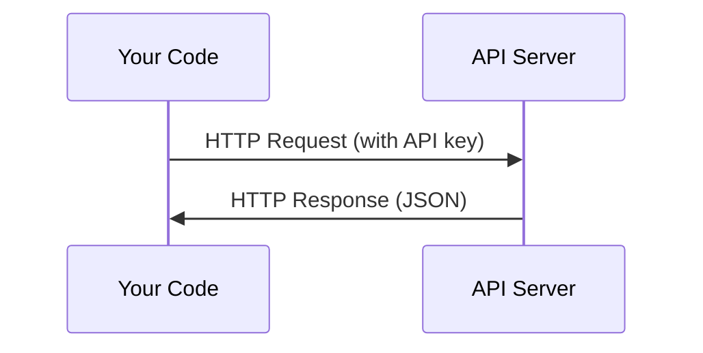

# 关键管理和关键管理

> 每个人工智能API都以相同的方式运作:发送请求,得到回应. 细节改变,模式不改变.
> 所有AI API的工作方式都一样:发送请求,获取响应.

**Type:** Build | **类型:** 构建
**Languages:** Python, TypeScript | **语言:** Python, TypeScript
**Prerequisites:** Phase 0, Lesson 01 | **前置知识:** Phase 0, 第 01 课
**Time:** ~30 minutes | **时间:** ~30 分钟

## 学习目标

- 通过环境变量安全存储API密钥,`.env`文件
  中文翻译:使用环境变量和 `.env`文件安全存储 API 密钥
- 使用人类 Python SDK 和原始 HTTP 进行LLM API 调用
  中文翻译:使用人类 Python SDK 和原始 HTTP 两种方式调用 LLM API
- 进行调试,比较基于SDK和原始HTTP请求/响应格式
  中文翻译:对比 SDK 和原始 HTTP 的请求/响应格式,以便调试
- 识别和处理包括身份验证和速度限制在内的常见API错误
  中文翻译:识别并处理常见API 错误,包括认证和限流问题

> **【中文解读】**
> 所有AI API的工作方式都是一样的:发送请求"",获取响应"",本章教你如何安全管理API密钥"",调用LLM API,以及理解SDK调用与原始HTTP请求的区别.这是后面构建AI代理的基础.

## 问题 问题描述

从第11阶段开始,你将打电话给LLM API (人类,OpenAI,谷歌).在第13-16阶段,你将建立使用这些API的代理.你需要知道API密钥如何工作,如何安全存储它们,以及如何进行你的第一个API电话.

> 从第11阶段开始,你将使用LLMAPI (Anthropic、OpenAI、Google) 进行调用. 在第13-16阶段,你将构建循环调用这些API的代理.

> **【中文解读】**
> 从第11阶段开始,你将调用LLMAPI;第13-16阶段会构建循环调用API的代理.

## 概念的核心概念



每个API通话都有:
1. 终端点 (URL)
2. 应用程序的 API 密钥 (身份验证)
3. 要求机构 (您需要什么)
4. 响应器 (你得到的回报)

> 每次调用 API 包含四个元素:
> 1. 端点(URL)
> 2. 关键字:
> 3. 请求体 ((你想要什么)
> 4. 响应体(返回什么)

> **【中文解读】**
> 每次调用包含四个元素:端点URL、API 密钥(身份认证)、请求体(你想要什么)、响应体(返回什么) ――理解这个模式后,所有AI API 都是一样的──

> **【拓展：API 在 AI Agent 中的角色】**
> 实现动作 重新调用API──掌握API──调用是构建代理的第一步──
```figure
s0-secret-inject
```

## 建立它

## 建立它,实现它.

> **【拓展：API 密钥安全的铁律】**绝对不把API密钥 硬编码在代码里. 一旦推到GitHub,爬虫会在几秒钟内发现并滥用你的密钥.`.env`文件 + `python-dotenv`操作系统环境变量

### 步骤1:安全存储API密钥

永远不要把API密钥放入代码中.

> 永远不要把API密钥写在代码里.

```bash
export ANTHROPIC_API_KEY="sk-ant-..."  # 设置环境变量（密钥永远不要写在代码里！）
export OPENAI_API_KEY="sk-..."
```

或使用一个`.env`文件 (添加到`.gitignore`):

> 或使用`.env`文件(记得添加到`.gitignore`):

```
ANTHROPIC_API_KEY=sk-ant-...  # .env 文件（确保加入 .gitignore）
OPENAI_API_KEY=sk-...
```

### 首先,我们需要一个程序,

```python
import os

import anthropic

client = anthropic.Anthropic()  # 自动从环境变量读取密钥

MODEL = os.environ.get("LLM_MODEL", "claude-sonnet-5")

response = client.messages.create(
    model="claude-sonnet-4-20250514",  # 指定模型
    max_tokens=256,  # 最大输出长度
    messages=[{"role": "user", "content": "What is a neural network in one sentence?"}]  # 用户消息
    model=MODEL,
    max_tokens=256,
    messages=[{"role": "user", "content": "What is a neural network in one sentence?"}]
)

print(response.content[0].text)  # 打印模型回复
```

### 步3: 调用TypeScript

> **【拓展：Token 计费机制】**根据标志计费:Claude Sonnet 约$3/百万输入 token、$一个英语单词约1.3个符号,一个中文字约2-3个符号.`max_tokens=256`模型最大输出 256 个代币 (约 200 个单词) 控制`max_tokens`是节省成本的关键手段.
`LLM_MODEL`其他提供商 (OpenAI,Google等) 遵循相同的键和模型 id 模式,但每个都有自己的 SDK,终端点和请求/响应方案.

### 步骤3:第一个API调用 (TypeScript)

```typescript
import Anthropic from "@anthropic-ai/sdk";

const client = new Anthropic();

const MODEL = process.env.LLM_MODEL ?? "claude-sonnet-5";

const response = await client.messages.create({
  model: MODEL,
  max_tokens: 256,
  messages: [{ role: "user", content: "What is a neural network in one sentence?" }],
});

console.log(response.content[0].text);
```

### 基本的HTTP请求,没有SDK)

```python
import os
import urllib.request
import json

url = "https://api.anthropic.com/v1/messages"  # API 端点
headers = {
    "Content-Type": "application/json",  # 请求格式为 JSON
    "x-api-key": os.environ["ANTHROPIC_API_KEY"],  # 从环境变量读取密钥
    "anthropic-version": "2023-06-01",  # API 版本号
}
body = json.dumps({
    "model": "claude-sonnet-4-20250514",  # 模型名称
    "max_tokens": 256,  # 最大输出 token 数
    "model": os.environ.get("LLM_MODEL", "claude-sonnet-5"),
    "max_tokens": 256,
    "messages": [{"role": "user", "content": "What is a neural network in one sentence?"}],
}).encode()

req = urllib.request.Request(url, data=body, headers=headers, method="POST")  # 构造 POST 请求
with urllib.request.urlopen(req) as resp:
    result = json.loads(resp.read())  # 解析 JSON 响应
    print(result["content"][0]["text"])  # 提取并打印回复文本
```

了解原始 HTTP 调用帮助在调试时.

> 这就是SDK的底层做的事情.

> **【中文解读】**
>  SDK 只是对HTTP请求的封装.理解原始HTTP调用可以帮助你调试API问题.处理错误.甚至在 SDK 不支持的语言中调用API.

## 用它使用指南

> **【中文解读】**现在不需要注册所有API──4-10阶段 用拥抱面孔(免费),11-16阶段需要人类或开放AI──等课程用到时再注册即可──

对于这个课程:

> 本课程中:

| API | When you need it | Free tier |
|-----|-----------------|-----------|
| Anthropic (Claude) | Phases 11-16 (agents, tools) | $5 credit on signup |
| OpenAI | Phase 11 (comparison) | $5 credit on signup |
| Hugging Face | Phases 4-10 (models, datasets) | Free |

| API | 何时需要 | 免费额度 |
|-----|---------|---------|
| Anthropic (Claude) | 阶段 11-16（Agent、工具） | 注册送 $5 额度 |
| OpenAI | 阶段 11（对比实验） | 注册送 $5 额度 |
| Hugging Face | 阶段 4-10（模型、数据集） | 免费 |

你不需要他们现在,当课时需要的时候,就把它们设置起来.

> 你不需要现在就注册所有API──等课程使用到时再设置即可──

## 运送它.

> **【拓展：429 限流处理】**调用LLM API 时最常见的错误是429 率限制――处理方式:指数退避重试(等 1s → 2s → 4s → 8s) ・人类 SDK 内置自动重试,但理解原理很重要在实际的代理系统中,你可能需要自己实现限制流逻辑来控制成本和避免被封锁――

这一课产生了:
- `outputs/prompt-api-troubleshooter.md`- 诊断常见的API错误

> 本课产出:
> - `outputs/prompt-api-troubleshooter.md`- 诊断常见API 错误的提示

## 练习题

1. 获取一个人类API密钥,并进行你的第一个API电话
   获取人类API密钥,完成你的第一次API调用
2. 试试原始 HTTP 版本,并将响应格式与 SDK 版本进行比较
   尝试原始 HTTP 方式调用,对 SDK 方式的响应格式
3. 故意使用错误的API键并读取错误信息
   故意使用错误的API密钥,阅读错误信息

## 关键词 关键词

| Term | What people say | What it actually means |
|------|----------------|----------------------|
| API key | "Password for the API" | A unique string that identifies your account and authorizes requests |
| Rate limit | "They're throttling me" | Maximum requests per minute/hour to prevent abuse and ensure fair usage |
| Token | "A word" (in API context) | A billing unit: input and output tokens are counted and charged separately |
| Streaming | "Real-time responses" | Getting the response word by word instead of waiting for the full response |

| 术语 | 俗称 | 实际含义 |
|------|------|---------|
| API key | "API 密码" | 标识你账户并授权请求的唯一字符串 |
| Rate limit | "被限流了" | 每分钟/小时的请求上限，防止滥用 |
| Token | "词"（API 语境） | 计费单位：输入和输出 token 分别计费 |
| Streaming | "实时响应" | 逐词返回响应，而非等待完整响应 |
