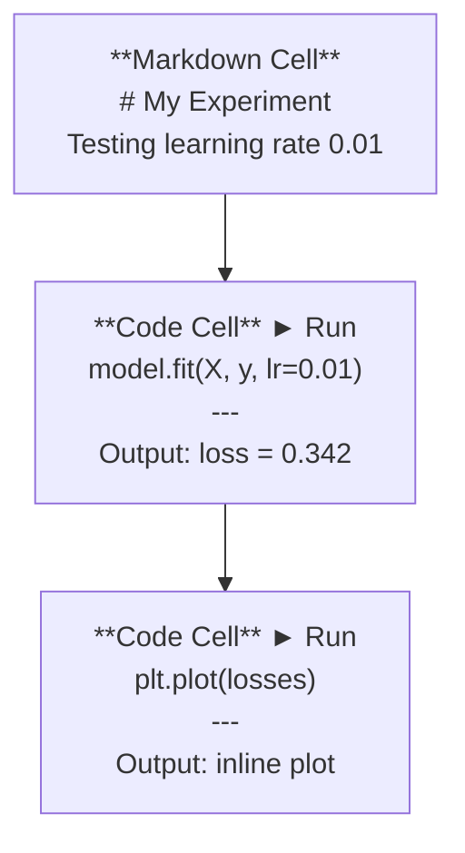
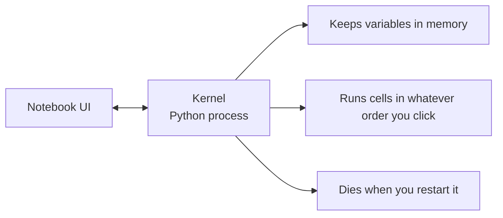

# 朱皮特笔记本

> 笔记本是人工智能工程的实验室.
> 笔记本是人工智能工程的实验工作台.

**Type:** Build | **类型:** 构建
**Languages:** Python | **语言:** Python
**Prerequisites:** Phase 0, Lesson 01 | **前置知识:** Phase 0, 第 01 课
**Time:** ~30 minutes | **时间:** ~30 分钟

## 学习目标

- 通过Jupyter扩展安装和启动JupyterLab,Jupyter笔记本或VS代码
  中文翻译:安装并启动JupyterLab、Jupyter笔记本或带Jupyter 扩展的 VS代码
- 使用魔术命令 (`%timeit`现在`%%time`现在`%matplotlib inline`) 进行基准和可视化直线
  中文翻译:使用魔术命令`%timeit`,我知道.`%%time`,我知道.`%matplotlib inline`) 进行基准测试和内嵌可视化
- 区分使用笔记本与脚本的时间,并应用"在笔记本中探索,在脚本中运输"工作流程
  中文翻译:区分何时用笔记本何时用脚本,实践行"笔记本中探索、脚本中部署"的工作流
- 识别和避免常见的笔记本电脑陷:失序执行,隐藏状态和内存泄漏
  中文翻译:识别并避免笔记本常见陷:乱序执行、隐藏状态和内存泄漏

> **【中文解读】**
>  Jupyter Notebook 是AI工程师的"实验室工作台".你可以在里面逐步运行代码"",即时查看结果"",混合文字说明和图表"",核心理念:在笔记本中探索和实验,验证后再迁移到`.py`脚本中部署――

## 问题 问题描述

每个人工智能论文,教程和Kaggle竞赛都使用Jupyter笔记本.它们让你运行代码,看到输出线,混合代码和解释,并快速反复.如果你试图学习人工智能,没有笔记本,你就没有抓纸做数学功课了.

> 几乎所有AI论文,教程和 Kaggle 比赛都使用Jupyter笔记本. 它让你分段运行代码,内嵌查看输出,混合代码和文字说明.

但笔记本有真正的陷.人们用它们做一切,包括他们很糟糕的事情.知道什么时候使用笔记本和什么时候使用脚本,

> 但笔记本也有真正的陷.人们用它做一切,包括它不擅长的事.

> **【中文解读】**
> 笔记本是人工智能领域的标准工具,几乎所有论文和文章都使用它.

## 概念的核心概念

一本笔记本是单元单元的列表.

> 笔记本由一系列单元格组成,每个单元格要么是代码,要么是文本.



核是一个在背景下运行的Python进程.当你运行一个细胞时,它会发送代码到核子中,核子执行它,然后返回结果.所有细胞都共享相同的核子,所以细胞之间存在变量.

> 核心是一个后台运行的Python进程.当你运行一个单元格时,代码被发送到Kernel执行,结果再返回.



无论你点击什么命令,这部分都是超级大国和步枪.

> 这部分既是超能力,也是大坑.
```figure
s0-cell-order
```

## 建立它

> **【中文解读】**
> 笔记本由多个单元格组成,每个单元格可以是代码或标记. 所有单元格共享一个内核. 字符串进程,变量在单元格之间持久存在.

## 动手建造

> **【拓展：Jupyter 在 AI 行业中的地位】**几乎所有 AI 论文附带的可复现代码都是 Jupyter笔记本 格式――比赛方案、面示例、PyTorch教程都使用它――Google Colab 本质上就是云端的 Jupyter,预装了PyTorch/TensorFlow,并免费提供GPU──本课程中有大量的`.ipynb`练习.

### 选择你的界面.

只有一个格式:

> 三种界面选择,同一个文件格式:

| Interface | Install | Best for |
|-----------|---------|----------|
| JupyterLab | `pip install jupyterlab` then `jupyter lab` | Full IDE experience, multiple tabs, file browser, terminal |
| Jupyter Notebook | `pip install notebook` then `jupyter notebook` | Simple, lightweight, one notebook at a time |
| VS Code | Install "Jupyter" extension | Already in your editor, git integration, debugging |

| 界面 | 安装方式 | 最适合 |
|------|---------|--------|
| JupyterLab | `pip install jupyterlab` 后运行 `jupyter lab` | 完整 IDE 体验、多标签、文件浏览器 |
| Jupyter Notebook | `pip install notebook` 后运行 `jupyter notebook` | 简洁轻量、一次一个笔记本 |
| VS Code | 安装 "Jupyter" 扩展 | 集成在编辑器中、Git 整合、可调试 |

三个都读写一样.`.ipynb`根据人工智能技术的标准,

> 读写相同的三种界面`.ipynb`文件格式──选你喜欢的即可──JupyterLab 在人工智能工作中最常见──

```bash
pip install jupyterlab
jupyter lab
```

### 关键键键盘快捷键

您可以在两个模式下操作.`Escape`对于命令模式 (左侧蓝色条),`Enter`对于编辑模式 (绿色).

> 你在两种模式下操作.`Escape`进入命令模式(左侧蓝色条),按 `Enter`进入编辑模式(绿色条) 』

**Command mode (most used):**

> **命令模式（最常用的）：**

| Key | Action |
|-----|--------|
| `Shift+Enter` | Run cell, move to next |
| `A` | Insert cell above |
| `B` | Insert cell below |
| `DD` | Delete cell |
| `M` | Convert to markdown |
| `Y` | Convert to code |
| `Z` | Undo cell operation |
| `Ctrl+Shift+H` | Show all shortcuts |

**Edit mode:**

> **编辑模式：**

| Key | Action |
|-----|--------|
| `Tab` | Autocomplete |
| `Shift+Tab` | Show function signature |
| `Ctrl+/` | Toggle comment |

`Shift+Enter`你每天要使用一千次的. 首先学会它.

> `Shift+Enter`你每天都会用千次快捷键.

### 单元类型.

**Code cells**运行Python并显示输出:

> **代码单元格**运行 Python 并显示输出:

```python
import numpy as np
data = np.random.randn(1000)
data.mean(), data.std()
```

输出:`(0.0032, 0.9987)`

**Markdown cells**支持头条,大体,斜体,拉特克斯数学 (`$E = mc^2$`),表格和图像.

> **Markdown 单元格**染色格式化文本──用它们记录你在做什么以及为什么──支持标题、粗体、斜体、拉德克斯 数学公式`$E = mc^2$`)、表格和图片──

### 魔术命令.

这些不是Python,而是从 Jupyter 开始的命令.`%`没有什么可怕的东西.`%%`们都在着.

> 这些不是Python.`%`魔术,或`%%`开头的木星专用命令.

**Time your code:**

> **计时你的代码：**

```python
%timeit np.random.randn(10000)  # 多次运行取平均，适合微基准测试
```

输出:`45.2 us +/- 1.3 us per loop`

```python
%%time  # 单次运行，测量总耗时，适合训练耗时测试
model.fit(X_train, y_train, epochs=10)
```

输出:`Wall time: 2.34 s`

`%timeit`运行代码多次,平均.`%%time`运行一次.`%timeit`对于微型标志,`%%time`为了训练.

> `%timeit`多次运行取平均值.`%%time`只有运行一次.`%timeit`训练耗时测试使用`%%time`,我知道.

**Enable inline plots:**

> **启用内嵌图表：**

```python
%matplotlib inline  # 让图表直接显示在笔记本中
```

每一个`plt.plot()`或`plt.show()`现在直接在笔记本中转载.

> 之后每个人都`plt.plot()`或`plt.show()`城市将直接在笔记本中染.

**Install packages without leaving the notebook:**

> **不离开笔记本就能安装包：**

```python
!pip install scikit-learn  # ! 前缀可以在笔记本中执行 shell 命令
```

其他`!`预写程序运行任何命令.

> `!`之前可以执行任何子命令.

**Check environment variables:**

> **检查环境变量：**

```python
%env CUDA_VISIBLE_DEVICES  # 查看环境变量
```

### 步骤5: 显示丰富输出线.

> **【拓展：Notebook 是最佳 AI 实验记录工具】**在人工智能研究中,这意味着其他人可以直接复制你的实验.这是论文审稿的基本要求.

笔记本本可以自动显示细胞中的最后一个表达式.

> 笔记本会自动显示单元格中最后一个表达式.

```python
import pandas as pd

df = pd.DataFrame({
    "model": ["Linear", "Random Forest", "Neural Net"],
    "accuracy": [0.72, 0.89, 0.94],
    "training_time": [0.1, 2.3, 45.6]
})
df
```

这样将呈现一个格式化的HTML表,而不是一个文本垃圾.

> 这将染色一个格式化的HTML表格,而不是文本输出.

```python
import matplotlib.pyplot as plt

plt.figure(figsize=(8, 4))
plt.plot([1, 2, 3, 4], [1, 4, 2, 3])
plt.title("Inline Plot")
plt.show()
```

图表就在细胞下面出现.这就是为什么笔记本主导人工智能工作.你看到数据,图表和代码在一起.

> 图表直接显示在单元格下面. 这就是笔记本在人工智能工作中占主导地位的原因.

图片:

> 对于图片:

```python
from IPython.display import Image, display
display(Image(filename="architecture.png"))
```

### 步骤6:谷歌协作

科拉布是云中的免费Jupyter笔记本电脑. 它提供了 GPU,预装库和谷歌驱动器集成.

> 云端的免费Jupyter笔记本. 它提供GPU,预装库和Google驱动器集成.

1. 走去[colab.research.google.com](https://colab.research.google.com)
2. 装载任何`.ipynb`从本课程的文件
3. 运行时间 > 改变运行时间类型 > T4 GPU (免费)

与本地Jupyter的可拉比分:

> 哥拉布与本地木星的区别:

- 文件不会在会议之间存在 (保存到驱动或下载)
  中文翻译:文件不会在会话间持久保存 (需要保存到驱动或下载)
- 预装:,熊猫,,火,,
  中文翻译:预装了木,熊猫,木,火,鱼,鱼,鱼
- `from google.colab import files`为了上传/下载文件
  翻译: 中文`from google.colab import files`用于上传/下载文件
- `from google.colab import drive; drive.mount('/content/drive')`为了持续存储
  翻译: 中文`from google.colab import drive; drive.mount('/content/drive')`用于持久存储
- 停课时间90分钟不活动后 (免费级别)
  中文翻译:空 90分钟后会话超时(免费版)

## 用它使用指南

### 笔记本与脚本:什么时候使用哪个?

| Use notebooks for | Use scripts for |
|-------------------|-----------------|
| Exploring a dataset | Training pipelines |
| Prototyping a model | Reusable utilities |
| Visualizing results | Anything with `if __name__` |
| Explaining your work | Code that runs on a schedule |
| Quick experiments | Production code |
| Course exercises | Packages and libraries |

| 用 Notebook | 用脚本 |
|-----------|-------|
| 探索数据集 | 训练管线 |
| 原型开发模型 | 可复用的工具函数 |
| 可视化结果 | 带 `if __name__` 的正式代码 |
| 解释你的工作 | 定时运行的代码 |
| 快速实验 | 生产环境代码 |
| 课程练习 | 包和库 |

规则:**explore in notebooks, ship in scripts**现在,我们要去.

> 黄金法则:**在笔记本中探索，在脚本中部署**,我知道.

> **【中文解读】**
> 黄金法则:**在 Notebook 中探索，在脚本中部署**首先在笔记本里实验想法,验证可行后再将代码迁移到`.py`文件.

人工智能领域的常见工作流程:
1. 在笔记本中查找数据
2. 在笔记本中原型
3. 一旦它工作,将代码移动到`.py`文件
4. 进口这些`.py`文件将返回笔记本,以便进行进一步的实验.

> 常见工作流:
> 1. 在笔记本中探索数据
> 2. 在笔记本中做模型原型
> 3. 验证有效后将代码迁移到`.py`文件
> 4. 让我`.py`文件导入笔记本进行进一步的实验

### 常见的陷

> **【拓展：Notebook 反模式】**三个最常见的笔记本 反模式:(1) 乱序执行你跳上跑细胞,别人从头跑就挂了;(2) 隐藏状态你删除了某个细胞,但它创建的变量还在内存中;(3) 内存泄漏加载4GB 数据集、训练模型、再加载另一个,内存不断增长──解法:定期`Kernel > Restart & Run All`训练后使用`del model; gc.collect()`释放内存――

**Out-of-order execution.**运行电脑的电脑,然后电脑的电脑,然后电脑的电脑.

> **乱序执行。**你先运行第五个单元格,再运行第二个,然后第七个.笔记本可以在机器上使用,但其他人从头到尾运行就错了.

**Hidden state.**您删除一个细胞,但它创建的变量仍然存储在内存中.笔记本看起来很清洁,但依赖于鬼细胞.

> **隐藏状态。**你删除了一个单元格,但它创建的变量还在内存中.笔记本看起来干净,但实际上依赖于一个"幽灵"单元格.

**Memory leaks.**运载4GB的数据集,训练一个模型,运载另一个数据集. 没有什么得到释放.`del variable_name`其他`gc.collect()`它们可以重新启动核.

> **内存泄漏。**装载4GB数据集,训练模型,再加载另一个数据集,内存不断增长没有释放.`del variable_name`和 `gc.collect()`核电源的重启.

## 运送它.

> **【拓展：从 Notebook 到生产代码】**真正的AI 工程流程:笔记本 实验 → 验证想法 → 将代码重构为`.py`模块 → 编写测试 → 部署――笔记本是"草稿纸",不是"最终产品"――养成习惯:实验完成后,把核心代码迁移到`.py`文件中,笔记本只保留调用和可视化.

这一课产生了:
- `outputs/prompt-notebook-helper.md`调试笔记本问题

> 本课产出:
> - `outputs/prompt-notebook-helper.md`用于调试笔记本问题

## 练习题

1. 打开JupyterLab,创建笔记本,然后使用`%timeit`为了比较清单理解与 numpy 创建一组100,000个随机数字
   打开JupyterLab,创建笔记本,使用`%timeit`与列表推广式和NumPy相比,产生10万随机数的速度
2. 创建一个包含分类和代码单元的笔记本,将 CSV 加载,显示数据框架,并绘制图表.然后运行Kernel>重启 & 运行所有,以验证它从上到下
   创建包含Markdown 和代码单元格的笔记本,加载CSV、显示数据框架、绘图,然后"重启并全部运行"验证顺序正确
3. 取代代码`code/notebook_tips.py`粘贴在Colab笔记本,然后用免费的GPU运行
   将`code/notebook_tips.py`代码粘贴到Colab笔记本中,使用免费的GPU运行

## 关键词 关键词

| Term | What people say | What it actually means |
|------|----------------|----------------------|
| Kernel | "The thing running my code" | A separate Python process that executes cells and keeps variables in memory |
| Cell | "A code block" | An independently runnable unit in a notebook, either code or markdown |
| Magic command | "Jupyter tricks" | Special commands prefixed with `%` or `%%` that control the notebook environment |
| `.ipynb` | "Notebook file" | A JSON file containing cells, outputs, and metadata. Stands for IPython Notebook |

| 术语 | 俗称 | 实际含义 |
|------|------|---------|
| Kernel | "运行代码的那个东西" | 独立的 Python 进程，执行单元格并维护变量状态 |
| Cell | "代码块" | 笔记本中可独立运行的单元，可以是代码或 Markdown |
| Magic command | "Jupyter 魔法" | 以 `%` 或 `%%` 开头的特殊命令，控制笔记本环境 |
| `.ipynb` | "笔记本文件" | 包含单元格、输出和元数据的 JSON 文件 |

## 继续阅读 继续阅读

- [JupyterLab Docs](https://jupyterlab.readthedocs.io/)对于全功能集
  中文翻译:JupyterLab 完整功能文档
- [Google Colab FAQ](https://research.google.com/colaboratory/faq.html)对 Colab 特定的限制和特征
  中文翻译:谷歌协作 常见问题与限制说明
- [28 Jupyter Notebook Tips](https://www.dataquest.io/blog/jupyter-notebook-tips-tricks-shortcuts/)电源用户快捷方式
  中文翻译:28 个木星笔记本 高级技巧
