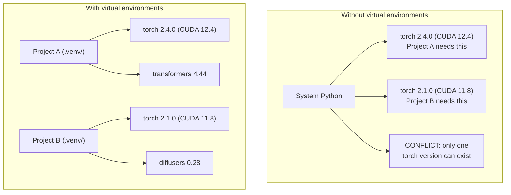

# 字符号环境管理

> 依赖性地狱是真实的.
> 根据地狱是真实存在的.

**Type:** Build | **类型:** 构建
**Languages:** Shell | **语言:** Shell
**Prerequisites:** Phase 0, Lesson 01 | **前置知识:** Phase 0, 第 01 课
**Time:** ~30 minutes | **时间:** ~30 分钟

## 学习目标

- 创建使用 `uv`现在`venv`其他`conda`
  中文翻译:使用 `uv`,我知道.`venv`或`conda`创建隔离的虚拟环境
- 写一个`pyproject.toml`具有可选的依赖组,并生成可复制性的锁文件
  中文翻译:编写带可选依赖组的`pyproject.toml`生成锁文件 确保可复现性
- 诊断和解决常见陷:全球安装,管/混合,CUDA版本不匹配
  中文翻译:诊断并修复常见问题:全局安装、pip/conda 混用、CUDA 版本不匹配
- 实施对项目有相互依赖的各阶段环境战略
  中文翻译:为依赖冲突的项目实施分为阶段的环境策略

> **【中文解读】**
>  Python 项目依赖冲突是人工智能开发中最常见的问题之一. 该项目需要 PyTorch 2.4.

## 问题 问题描述

你安装PyTorch 2.4用于一个细节调整项目.下周,另一个项目需要PyTorch 2.1因为它的CUDA构建是固定的.你升级全球,第一个项目会断裂.你降级,第二个会断裂.

> 你为一个微调项目安装了PyTorch 2.4――下周,另一个项目因为CUDA 构建版本锁定需要PyTorch 2.1――你全局升级,第一项目已经挂着――你降级,第二项目又挂着――

这就是依赖地狱. 在AI/ML工作中,它经常发生,因为:

> 这就是依赖地狱. 在人工智能/ML 工作中,

- 皮托奇,JAX和TensorFlow每个公司都运送自己的CUDA绑定
  中文翻译:PyTorch、JAX 和 TensorFlow 各自带 CUDA 绑定
- 模型库将特定框架版本定制
  中文翻译:模型库锁定特定框架版本
- 全球化`pip install`覆盖之前的任何东西
  中文翻译:全局 `pip install`会覆盖之前安装的任何版本
- CUDA 11.8 构建不适用于 CUDA 12.x 驱动程序 (反之亦然)
  中文翻译:CUDA 11.8 构建在CUDA 12.x 驱动上不工作(反之亦然)

解决方案是:每个项目都会有自己的孤立环境,

> 解决方案:每个项目都有自己的隔离环境,具有独立的依赖包.

> **【中文解读】**
> 基于AI项目中"依赖地狱"特别常见,因为PyTorch/JAX/TensorFlow 各自带 CUDA 绑定,版本之间互不兼容.

## 概念的核心概念

> **【中文解读】**下图显示了有/没有虚拟环境的区别:没有虚拟环境时,系统Python只能安装一个版本的PyTorch,项目之间相互冲突;有虚拟环境,每个项目都有独立的依赖,互不干扰.



## 建立它,实现它.

> **【拓展：uv vs pip vs conda — 该选哪个？】**(1) 其他**uv**简单的写作,比比比比比比比比比比比比比比比比比比比比比比比比比比比比比比比比比比比比比比比比比比比比比比比比比比比比比比比比比比比比比比比比比比比比比比比比比比比比比比比比比比比比比比比比比比比比比比比比比比比比比比比比比比比比比比比比比比比比比比比比比比比比比比比比比比比比比比比比比比比比比比比比比比比比比比比比比比比比比比比比比比比比比比比比比比比比比比比比比比比比比比比比比比比比比比比比比比比比比比比比比比比比比比比比比比比比比比比比比比比比比比比比比比比比比比比比比比比比比比比比比比比比比比比比比比比比比比比比比比比比比比比比比比比比比比比比比比比比比比比比比比比比比比比比比比比比比比比比比比比比比比比比比比比比比比比比比比比比比比比比比比比比比比比比比比比比比比比比比比比比比比比比比比比比比比比比比比比比比比比比比比比比比比比比比比比比比比比比比比比比比比比比比比比比比比比比比比比比比比比比比比比比比比比比比比比比比比比比比比比比比比比比比比比比比比比比比比比比比比比比比比比比比比比比比比比比比比比比比比比比比比比比比比比比比比比比比比比比比比比比比比比比比比比比比比比比比比比比比比比比比比比`uv venv && uv pip install`〔(2) **venv**字thon 内置,无需安装,但速度慢且功能少――(3) **conda**根据CUD库的情况,但环境体积巨大――2026年的AI项目推了作为默认选择――
```figure
s0-env-isolation
```

## 建立它

### 选择1: uv venv (建议)

`uv`它可以在一个工具中处理虚拟环境,Python版本和依赖分辨率.

> `uv`是最快的Python包管理器 (比Pip快10-100倍) ⋅它在一个工具中处理虚拟环境、Python版本和依赖解析──

```bash
curl -LsSf https://astral.sh/uv/install.sh | sh

uv python install 3.12

cd your-project
uv venv
source .venv/bin/activate
```

装备包:

> 装包:

```bash
uv pip install torch numpy
```

创建一个项目`pyproject.toml`在一个步骤:

> 一步创建带`pyproject.toml`的项目:

```bash
uv init my-ai-project
cd my-ai-project
uv add torch numpy matplotlib
```

### 选择2:venv(Python 内置)

> **【中文解读】**venv 是Python自带的虚拟环境工具,不需要额外安装.但与 uv相比,它不会自动管理Python版本,也不会生成锁文件.

如果无法安装`uv`鱼船与`venv`其他:

> 如果你无法安装`uv`石自带`venv`其他:

```bash
python3 -m venv .venv
source .venv/bin/activate  # Linux/macOS
.venv\Scripts\activate     # Windows

pip install torch numpy
```

比较慢`uv`虽然它可以在任何地方使用 python.

> 比比`uv`慢,但在任何安装Python的地方都能使用.

### 选择3:可纳 (当你需要它时)

康达管理非Python依赖性,如CUDA工具包,cuDNN和C库.

> 管理非 Python 依赖于 CUDA 工具包、cuDNN 和 C 库──在以下情况下使用:

- 你需要一个特定的CUDA工具包版本,而不需要系统范围内的安装
  中文翻译:需要特定的 CUDA 工具包版本,但不希望全局安装
- 你在一个共享集群上,你不能安装系统包
  中文翻译:在共享集群上,无法安装系统包
- 图书馆的安装说明书说"使用公寓"
  中文翻译:库的安装说明写着"使用公寓"

```bash
# Install miniconda (not the full Anaconda)
curl -LsSf https://repo.anaconda.com/miniconda/Miniconda3-latest-Linux-x86_64.sh -o miniconda.sh
bash miniconda.sh -b

conda create -n myproject python=3.12
conda activate myproject

conda install pytorch torchvision torchaudio pytorch-cuda=12.4 -c pytorch -c nvidia
```

混合 混合 混合 混合 混合 混合 混合 `pip install`由于这种情况,我们可以在一个"无限"中找到一个问题.

> 一条规则:如果使用户外管理环境,就用户外管理该环境的所有包.`pip install`导致难以调控的依赖冲突.

### 对于本课程:各阶段的战略

您可以为整个课程创造一个环境. 不做.不同的阶段需要不同的 (有时相互矛盾的) 依赖.

> 你可以为整个课程创造一个环境.

战略:

> 策略:

```
ai-engineering-from-scratch/
├── .venv/                    <-- shared lightweight env for phases 0-3
├── phases/
│   ├── 04-neural-networks/
│   │   └── .venv/            <-- PyTorch env
│   ├── 05-cnns/
│   │   └── .venv/            <-- same PyTorch env (symlink or shared)
│   ├── 08-transformers/
│   │   └── .venv/            <-- might need different transformer versions
│   └── 11-llm-apis/
│       └── .venv/            <-- API SDKs, no torch needed
```

剧本在`code/env_setup.sh`创造了本课程的基础环境.

> `code/env_setup.sh`中文书本会创建本课程的基础环境.

## 项目. 基础. 基础.

> **【拓展：pyproject.toml 是现代 Python 项目的标准配置】**它取代了传统.`setup.py`和 `requirements.txt`△一个文件定义项目元数据、依赖、开发工具配置──AI 项目推使用可选依赖组 来区分训练依赖`[train]`) 和推理依赖`[serve]`),避免在生产环境中安装不必要的GPU库.

每个Python项目都应该有一个`pyproject.toml`它取代了`setup.py`现在`setup.cfg`其他`requirements.txt`在一个文件中.

> 每个Python项目都应该有`pyproject.toml`,它用一个文件代替了.`setup.py`,我知道.`setup.cfg`和 `requirements.txt`,我知道.

```toml
[project]
name = "ai-engineering-from-scratch"
version = "0.1.0"
requires-python = ">=3.11"
dependencies = [
    "numpy>=1.26",
    "matplotlib>=3.8",
    "jupyter>=1.0",
    "scikit-learn>=1.4",
]

[project.optional-dependencies]
torch = ["torch>=2.3", "torchvision>=0.18"]
llm = ["anthropic>=0.39", "openai>=1.50"]
```

然后安装:

> 然后安装:

```bash
uv pip install -e ".[torch]"    # base + PyTorch
uv pip install -e ".[llm]"     # base + LLM SDKs
uv pip install -e ".[torch,llm]" # everything
```

## 锁文件

锁文件将所有依赖性 (包括过渡性) 转换到精确版本. 这保证可重复性:从锁文件中安装的人都得到了完全相同的包.

> 锁文件将每个依赖 (包括传递依赖) 锁定到精确版本.

```bash
# uv generates uv.lock automatically when using uv add
uv add numpy

# pip-tools approach
uv pip compile pyproject.toml -o requirements.lock
uv pip install -r requirements.lock
```

让你的锁文件转载到 git. 当有人克隆了 repo,他们从锁文件安装并获得相同的版本.

> 随着一个人建立仓库,他们从锁文件安装并获得完全相同的版本.

## 常见错误

> **【中文解读】** Python 环境管理中最常见的 5 个错误:`pip install`不在虚拟环境中);(2) 混用管和房间;(3) 忘记激活虚拟环境;(4) 把`.venv`目录提交到 git;5) CUDA 版本不匹配──以下逐个讲解和修复方法──

### 1. 全球安装

```bash
pip install torch  # BAD: installs to system Python

source .venv/bin/activate
pip install torch  # GOOD: installs to virtual environment
```

检查你的包裹去哪里:

> 检查你的包装在哪里:

```bash
which python       # should show .venv/bin/python, not /usr/bin/python
which pip           # should show .venv/bin/pip
```

### 2. 混合和

```bash
conda create -n myenv python=3.12
conda activate myenv
conda install pytorch -c pytorch
pip install some-other-package   # BAD: can break conda's dependency tracking
conda install some-other-package # GOOD: let conda manage everything
```

如果您必须在conda内使用 pip (有些包装只使用 pip),首先安装所有conda包装,然后使用 pip包.

> 如果必须在房间里使用管,先安装所有管,最后再安装管.

### 3. 忘记激活

```bash
python train.py           # uses system Python, missing packages
source .venv/bin/activate
python train.py           # uses project Python, packages found
```

您的 shell提示应显示环境名称:

> 你的 shell提示符应该显示环境名称:

```
(.venv) $ python train.py
```

### 4. 承诺.venv到 git

```bash
echo ".venv/" >> .gitignore
```

虚拟环境是200MB到2GB.它们是本地的,不是机器之间可移植的.`pyproject.toml`而不是锁文件.

> 虚拟环境有200MB-2GB──它们是本地的,不能在机器中移植──改为提交`pyproject.toml`和锁文件.

### 5. 五,CUDA版本不匹配

> **【拓展：CUDA 版本地狱】**鱼 每个版本绑定特定CUDA 版本(如PyTorch 2.4 → CUDA 12.4) ◎装错版本会出现"找不到GPU"或异常运行时错误――解决方案:先`nvidia-smi`确认驱动版本,再去 [pytorch.org](https://pytorch.org)查对应的安装命令.`uv pip install torch --index-url URL`指定CUDA版本──

```bash
nvidia-smi                # shows driver CUDA version (e.g., 12.4)
python -c "import torch; print(torch.version.cuda)"  # shows PyTorch CUDA version

# These must be compatible.
# PyTorch CUDA version must be <= driver CUDA version.
```

## 用它使用指南

> **【中文解读】**本课程的推策略:每个阶段 创建一个虚拟环境`.venv-phase04`),以避免不同阶段的依赖冲突. 在AI工程中,版本不兼容是踩坑的第一大原因,

运行设置脚本来创建课程环境:

> 运行安装脚本创建课程环境:

```bash
bash phases/00-setup-and-tooling/06-python-environments/code/env_setup.sh
```

这就会产生一个`.venv`在核电源根上,核电源已安装和验证.

> 这将在仓库根目录创建一个.`.venv`核查和安装

## 练习题

1. 跑步`env_setup.sh`检查所有检查通过
   运行环境安装脚本,确认所有检查通过
2. 创建第二个虚拟环境,安装不同的版本的 numpy,并确认两个环境是孤立的
   创建第二个虚拟环境,安装不同版本的NumPy,确认两个环境隔离
3. 写一个`pyproject.toml`对于需要 PyTorch 和 Anthropic SDK 的项目
   为了同时需要PyTorch和人类SDK的项目编写`pyproject.toml`
4. 故意在全球范围内安装一个包 (不需要激活一个venv),注意它去哪里,然后卸载它
   为了整局安装一个包,观察它安装在哪里,然后卸载

## 关键词 关键词

| Term | What people say | What it actually means |
|------|----------------|----------------------|
| Virtual environment | "A venv" | An isolated directory containing a Python interpreter and packages, separate from the system Python |
| Lockfile | "Pinned dependencies" | A file listing every package and its exact version, guaranteeing identical installs across machines |
| pyproject.toml | "The new setup.py" | The standard Python project configuration file, replacing setup.py/setup.cfg/requirements.txt |
| Transitive dependency | "A dependency of a dependency" | Package B depends on C; if you install A which depends on B, C is a transitive dependency of A |
| CUDA mismatch | "My GPU isn't working" | PyTorch was compiled for a different CUDA version than what your GPU driver supports |

| 术语 | 俗称 | 实际含义 |
|------|------|---------|
| Virtual environment | "venv" | 包含独立 Python 解释器和包的隔离目录 |
| Lockfile | "锁定依赖" | 记录每个包精确版本的文件，确保跨机器安装一致 |
| pyproject.toml | "新版 setup.py" | Python 项目标准配置文件，替代 setup.py 和 requirements.txt |
| Transitive dependency | "依赖的依赖" | A 依赖 B，B 依赖 C，C 就是 A 的传递依赖 |
| CUDA mismatch | "GPU 不工作" | PyTorch 编译时的 CUDA 版本与 GPU 驱动不匹配 |
