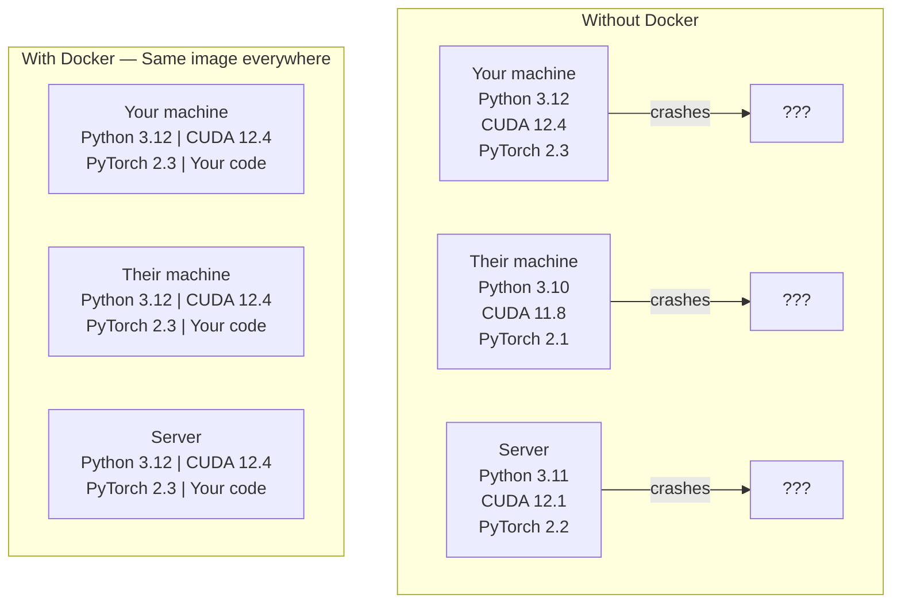

# 机器人应用程序

> 容器将"我的机器工作"变成了过去的事情.
> 容器让"我的机器上能跑"成为历史.

**Type:** Build | **类型:** 构建
**Languages:** Docker | **语言:** Docker
**Prerequisites:** Phase 0, Lessons 01 and 03 | **前置知识:** Phase 0, 第 01 课和第 03 课
**Time:** ~60 minutes | **时间:** ~60 分钟

## 学习目标

- 从Docker文件中构建一个GPU启用的Docker图像,使用CUDA,PyTorch和AI库
  中文翻译:从Docker文件 构建支持GPU的Docker镜像,包含CUDA、PyTorch 和AI库
- 作为数量来维持模型,数据集和代码的集装箱重建
  中文翻译:挂载宿主目录为卷,在容器重建后保持模型、数据集和代码持久化
- 配置NVIDIA集装箱工具包,以显示集装箱内的GPU
  中文翻译:配置NVIDIA集装箱工具包,在容器内暴露GPU
- 使用Docker Compose编程多服务人工智能应用程序 (输入服务器+向量数据库)
  中文翻译:使用Docker 编译 编排多服务 AI 应用 推理服务器 + 向量数据库)

> **【中文解读】**
> 达克将代码,运行时,库和系统工具包装成一个"容器",确保运行结果在任何机器上一致.AI项目依赖于复杂的CUDA,PyTorch,cuDNN等.

## 问题 问题描述

你在笔记本电脑上训练了一个模型使用PyTorch 2.3,CUDA 12.4和Python 3.12. 你的同事有PyTorch 2.1,CUDA 11.8和Python 3.10.

> 你在笔记本电脑上使用 PyTorch 2.3、CUDA 12.4 和 Python 3.12 训练了一个模型──你的同事使用 PyTorch 2.1、CUDA 11.8 和 Python 3.10──模型在他的机器上崩──但是你的Docker文件 两台机器都能运行──

智能人工智能项目是依赖性梦.典型的堆包括Python,PyTorch,CUDA驱动程序,cuDNN,系统级C库以及需要精确编译版本的闪电attn等专业包.Docker将所有这些包装成一个图像,在任何地方都运行相同.

> AI项目是依赖管理的梦――典型技术包括Python、PyTorch、CUDA 驱动、cuDNN、系统级C库,以及需要特定编译器版本的特殊包装如闪电-attn──Docker 把所有这些包装放在一个可以在任何地方都一致运行的镜像──

> **【中文解读】**
> AI项目是Docker最需要的项目类型之一.CUDA版本不兼容,PyTorch版本冲突,cuDNN缺失.

## 概念的核心概念

> **【拓展：Docker 在 AI 中的三大用途】**(1) 其他**环境一致性**由于库版本不同,不错的模型在自己的电脑上训练;**GPU 隔离**许多人共享一个GPU服务器,每个人都有一个容器互不干扰;**一键部署**其他:`docker run`一条命令启动完整的AI服务模型+API+前端),无需手动配置──Hugging Face的TGI、vLLM等推理框架都提供Docker镜像──

据悉,Docker 将你的代码,运行时间,库库和系统工具包装成一个孤立的单元,称为容器. 想象它是一个轻量级的虚拟机,但它分享主机操作系统内核,而不是运行自己的,所以它开始在几秒钟而不是几分钟.

> 达克将你的代码,运行时间,库和系统工具包装成一个称为"容器"的隔离单元. 可以把它想象成一个轻量级虚拟机,但它共享主机操作系统内核而不是运行自己的内核,所以启动只需要几秒而不是几分钟.



### 为什么人工智能项目需要多克比大多数人

> **【中文解读】**项目依赖链特别深:Python → PyTorch → CUDA → cuDNN → 系统级C库――任何一层版本不匹配都会导致训练崩或推理结果不一致――Docker 把所有层打包成一个镜像,确保"我的机器上可以跑"变成"在任何地方都可以跑"――

1. **GPU drivers are fragile.**库达 12.4 代码不运行在库达 11.8 上.Docker 通过NVIDIA 集装箱工具包共享主机GPU驱动器,同时将CUDA 工具包隔离在容器内.

> 1. **GPU 驱动很脆弱。**通过NVIDIA集装箱工具包在容器内隔离 CUDA 工具包,同时共享主机GPU驱动.

2. **Model weights are large.**对于 7B 参数模型, fp16 的容量为 14 GB.每次重建时,您不需要重新下载它. Docker 卷允许您从主机上安装模型目录.

> 2. **模型权重很大。**7B 参数模型在fp16 下有14GB──你不想每次重建容器都重新下载──Docker卷让你从主机上载模型目录──

3. **Multi-service architectures are common.**实际上,人工智能应用程序不仅仅是Python脚本. 它是一个推理服务器,一个RAG的向量数据库,也许是一个网络前端.Docker Compose用一个命令编程所有这些.

> 3. **多服务架构很常见。**真正的AI应用不仅仅是一个Python脚本. 它包含推理服务器,RAG向量数据库,可能还有Web前端.

### 关键词汇

| Term | What it means |
|------|---------------|
| Image | A read-only template. Your recipe. Built from a Dockerfile. |
| Container | A running instance of an image. Your kitchen. |
| Dockerfile | Instructions to build an image. Layer by layer. |
| Volume | Persistent storage that survives container restarts. |
| docker-compose | A tool for defining multi-container applications in YAML. |

| 术语 | 含义 |
|------|------|
| Image（镜像） | 只读模板，相当于菜谱。由 Dockerfile 构建。 |
| Container（容器） | 镜像的运行实例，相当于厨房。 |
| Dockerfile | 构建镜像的指令文件，逐层定义。 |
| Volume（卷） | 持久化存储，容器重启后数据不丢失。 |
| docker-compose | 用 YAML 定义多容器应用的编排工具。 |

### 常见的容器模式

> **【拓展：AI 部署的标准模式】**最常见的AI容器模式:(1) **训练容器**挂载数据集目录,训练完输出模型权重;(2) **推理容器**加载模型权重,提供REST API;(3) **Jupyter 容器**预装所有库的笔记本 环境――Hugging Face、NVIDIA NGC 提供大量预构建的AI基础镜像──

```
Dev Container
  Full toolkit. Editor support. Jupyter. Debugging tools.
  Used during development and experimentation.

Training Container
  Minimal. Just the training script and dependencies.
  Runs on GPU clusters. No editor, no Jupyter.

Inference Container
  Optimized for serving. Small image. Fast cold start.
  Runs behind a load balancer in production.
```

## 建立它,实现它.
```figure
s0-image-layers
```

## 建立它

### 步骤1:安装Docker

```bash
# macOS
brew install --cask docker
open /Applications/Docker.app

# Ubuntu
curl -fsSL https://get.docker.com | sh
sudo usermod -aG docker $USER
# Log out and back in for group change to take effect
```

检查:

> 验证安装:

```bash
docker --version
docker run hello-world
```

### 步骤 2:安装NVIDIA容器工具包 (Linux与NVIDIA GPU)

这使得Docker容器能够访问你的GPU. macOS和Windows (WSL2) 用户可以跳过此;Docker Desktop在这些平台上处理GPU的方式不同.

> 这让Docker容器能够访问你的GPU──macOS和Windows (WSL2) 用户可以跳过此步骤;Docker桌面在这些平台上以不同的方式处理GPU直通──

```bash
distribution=$(. /etc/os-release;echo $ID$VERSION_ID)
curl -fsSL https://nvidia.github.io/libnvidia-container/gpgkey | sudo gpg --dearmor -o /usr/share/keyrings/nvidia-container-toolkit-keyring.gpg
curl -s -L https://nvidia.github.io/libnvidia-container/$distribution/libnvidia-container.list | \
    sed 's#deb https://#deb [signed-by=/usr/share/keyrings/nvidia-container-toolkit-keyring.gpg] https://#g' | \
    sudo tee /etc/apt/sources.list.d/nvidia-container-toolkit.list

sudo apt-get update
sudo apt-get install -y nvidia-container-toolkit
sudo nvidia-ctk runtime configure --runtime=docker
sudo systemctl restart docker
```

测试容器内GPU访问:

> 测试容器内GPU 访问:

```bash
docker run --rm --gpus all nvidia/cuda:12.4.1-base-ubuntu22.04 nvidia-smi
```

如果你看到你的GPU信息,工具包正在工作.

> 如果能看到GPU信息,说明工具包工作正常.

### 步骤3:理解基础图像.

> **【中文解读】**基础镜像是Dockerfile的起点──AI 项目推使用NVIDIA官方的CUDA镜像(`nvidia/cuda:12.4.0-devel-ubuntu22.04`) 或PyTorch 官方镜像`pytorch/pytorch:2.4.0-cuda12.4`它们预装了CUDA 运行时和深度学习库.

选择正确的基图像可以节省几个小时的调试.

> 选择正确的基础镜像能节省几个小时的调试时间.

```
nvidia/cuda:12.4.1-devel-ubuntu22.04
  Full CUDA toolkit. Compilers included.
  Use for: building packages that need nvcc (flash-attn, bitsandbytes)
  Size: ~4 GB

nvidia/cuda:12.4.1-runtime-ubuntu22.04
  CUDA runtime only. No compilers.
  Use for: running pre-built code
  Size: ~1.5 GB

pytorch/pytorch:2.6.0-cuda12.4-cudnn9-runtime
  PyTorch pre-installed on top of CUDA.
  Use for: skipping the PyTorch install step
  Size: ~6 GB

python:3.12-slim
  No CUDA. CPU only.
  Use for: inference on CPU, lightweight tools
  Size: ~150 MB
```

### 步骤4:为人工智能开发编写Docker文件

这里是Docker文件.`code/Dockerfile`走过它:

> 这是`code/Dockerfile`我们逐步经过一次:

```dockerfile
FROM nvidia/cuda:12.4.1-devel-ubuntu22.04

ENV DEBIAN_FRONTEND=noninteractive
ENV PYTHONUNBUFFERED=1

RUN apt-get update && apt-get install -y --no-install-recommends \
    software-properties-common \
    git \
    curl \
    build-essential \
    && add-apt-repository -y ppa:deadsnakes/ppa \
    && apt-get update && apt-get install -y --no-install-recommends \
    python3.12 \
    python3.12-venv \
    python3.12-dev \
    && rm -rf /var/lib/apt/lists/*

RUN update-alternatives --install /usr/bin/python python /usr/bin/python3.12 1

RUN curl -sSL https://raw.githubusercontent.com/pypa/get-pip/3b73145063be545b649ad9ca83ea8da5fc915a4f/public/get-pip.py -o /tmp/get-pip.py \
    && echo "a341e1a43e38001c551a1508a73ff23636a11970b61d901d9a1cad2a18f57055  /tmp/get-pip.py" | sha256sum -c - \
    && python /tmp/get-pip.py \
    && rm /tmp/get-pip.py \
    && update-alternatives --install /usr/bin/pip pip /usr/local/bin/pip3.12 1

RUN python -m pip install --no-cache-dir --upgrade pip setuptools wheel

RUN python -m pip install --no-cache-dir \
    torch==2.6.0+cu124 \
    torchvision==0.21.0+cu124 \
    torchaudio==2.6.0+cu124 \
    --index-url https://download.pytorch.org/whl/cu124

RUN python -m pip install --no-cache-dir \
    numpy \
    pandas \
    scikit-learn \
    matplotlib \
    jupyter \
    transformers \
    datasets \
    accelerate \
    safetensors

WORKDIR /workspace

VOLUME ["/workspace", "/models"]

EXPOSE 8888

CMD ["python"]
```

建立它:

> 构建镜像:

```bash
docker build -t ai-dev -f phases/00-setup-and-tooling/07-docker-for-ai/code/Dockerfile .
```

后续构建使用缓存层.

> 首次构建需要一些时间(下载CUDA 基础镜像 + PyTorch) ⋅后续构建会使用缓存的层──

运行它:

> 运行容器:

```bash
docker run --rm -it --gpus all \
    -v $(pwd):/workspace \
    -v ~/models:/models \
    ai-dev python -c "import torch; print(f'PyTorch {torch.__version__}, CUDA: {torch.cuda.is_available()}')"
```

运行Jupyter在容器内:

> 在容器内运行 Jupyter:

```bash
docker run --rm -it --gpus all \
    -v $(pwd):/workspace \
    -v ~/models:/models \
    -p 8888:8888 \
    ai-dev jupyter notebook --ip=0.0.0.0 --port=8888 --no-browser --allow-root
```

### 步骤5:数据和模型的音量安装

没有它们,当容器停下来,你的14GB模型下载就会消失.

> 卷挂载对AI工作至关重要.没有它们,你下载的14GB模型在容器停止时就会消失.

```bash
# Mount your code
-v $(pwd):/workspace

# Mount a shared models directory
-v ~/models:/models

# Mount datasets
-v ~/datasets:/data
```

在你的训练脚本中,从安装路径上加载:

> 在训练脚本中,从挂载路径加载:

```python
from transformers import AutoModel

model = AutoModel.from_pretrained("/models/llama-7b")
```

模型存活在你的主机文件系统上. 尽可能多重建容器,

> 模型存储在主机文件系统中.

### 步骤 6: 多服务人工智能应用程序的Docker编译

实际的RAG应用需要一个推理服务器和一个向量数据库.Docker Compose都用一个命令运行.

> 真正的RAG 应用需要推理服务器和向量数据库.

看到`code/docker-compose.yml`其他:

```yaml
services:
  ai-dev:
    build:
      context: .
      dockerfile: Dockerfile
    deploy:
      resources:
        reservations:
          devices:
            - driver: nvidia
              count: all
              capabilities: [gpu]
    volumes:
      - ../../../:/workspace
      - ~/models:/models
      - ~/datasets:/data
    ports:
      - "8888:8888"
    stdin_open: true
    tty: true
    command: jupyter notebook --ip=0.0.0.0 --port=8888 --no-browser --allow-root

  qdrant:
    image: qdrant/qdrant:v1.12.5
    ports:
      - "6333:6333"
      - "6334:6334"
    volumes:
      - qdrant_data:/qdrant/storage

volumes:
  qdrant_data:
```

开始一切:

> 启动所有服务:

```bash
cd phases/00-setup-and-tooling/07-docker-for-ai/code
docker compose up -d
```

现在你的AI开发容器可以访问向量数据库`http://qdrant:6333`通过服务名称.Docker Compose自动创建共享网络.

> 现在人工智能开发容器可以通过服务名`http://qdrant:6333`访问量数据库――Docker 编译自动创建共享网络――

测试AI容器内部的连接:

> 从 AI 容器内部测试连接:

```python
from qdrant_client import QdrantClient

client = QdrantClient(host="qdrant", port=6333)
print(client.get_collections())
```

停止一切:

> 停止所有服务:

```bash
docker compose down
```

加入`-v`删除了qdrant的量:

> 加  `-v`同时删除 卷:

```bash
docker compose down -v
```

### 步骤7:用于人工智能工作的有用Docker命令

> 第7步:AI 工作中常用的Docker命令

```bash
# List running containers
docker ps

# List all images and their sizes
docker images

# Remove unused images (reclaim disk space)
docker system prune -a

# Check GPU usage inside a running container
docker exec -it <container_id> nvidia-smi

# Copy a file from container to host
docker cp <container_id>:/workspace/results.csv ./results.csv

# View container logs
docker logs -f <container_id>
```

## 用它使用指南

> **【拓展：Docker vs Conda 选择指南】**简单项目使用Conda/uv 即可;需要部署或多人协作时使用Docker。经验法则:如果你说"我的机器上能跑",说明你应该使用Docker──本课程的大部分课程不需要Docker,但第17阶段 (基础设施与生产部署) 将深入使用──

现在你有一个可复制的人工智能开发环境.

> 你现在有一个可复制的人工智能开发环境.

- 使用`docker compose up`开始开发环境和向量数据库
  中文翻译:使用 `docker compose up`同时启动环境和量数据库开发
- 装配你的代码,模型和数据成卷,所以在重建之间没有什么丢失
  中文翻译:将代码、模型和数据挂载为卷,重建后不会丢失
- 当一个课程需要一个新的Python包时,将其添加到Docker文件中,然后重建
  中文翻译:当课程需要新的Python包时,添加到Docker文件并重建
- 让你的小组档案与队友分享,他们得到了完全相同的环境.
  随队友共享Dockerfile,他们得到完全相同的环境

### 没有GPU?

删除`--gpus all`现在,我们需要一个新的系统,一个新的系统,一个新的系统,一个新的系统,一个新的系统,一个新的系统,一个新的系统,一个新的系统,一个新的系统,一个新的系统,一个新的系统,一个新的系统,一个新的系统,一个新的系统,一个新的系统,一个新的系统,一个新的系统,一个新的系统,一个新的系统,一个新的系统,一个新的系统,一个新的系统,一个新的系统,一个新的系统,一个新的系统,一个新的系统,一个新的系统,一个新的系统,一个新的系统,一个新的系统,一个新的系统,一个新的系统,一个新的系统,一个新的系统,一个新的系统,一个新的系统,一个新的系统,一个新的系统,一个新的系统,一个新的系统,一个新的系统,一个新的系统,一个新的系统,一个新的系统,一个新的系统,一个新的系统,一个新的系统,一个新的系统,一个新的系统,一个新的系统,一个新的系统,一个新的系统,一个新的系统,一个新的系统,一个新的系统,一个新的系统,一个新的系统,一个新的系统,一个新的系统,一个新的系统,一个新的系统,一个新的系统,一个新的系统,一个新的系统,一个新的系统,一个新的系统,一个新的系统,一个新的系统,一个系统,一个新的系统,一个新的系统,一个系统,一个新的系统,一个系统,一个,一个系统,一个系统,一个,一个系统,一个,一个新的系统,一个,一个,一个系统,一个,一个系统,一个,一个,一个,一个系统,一个,一个,一个系统,一个,一个,一个,一个,一个, 系统, 系统,一个, 系统, 系统,一个, 系统, 系统, 系统, 系统, 系统, 系统, 系统, 系统, 系统, 系统, 系统, 系统, 系统, 系统, 系统, 系统, 系统, 系统, 系统, 系统, 系统, 系统, 系统, 系统, 系统, 系统, 系统, 系统, 系统, 系统, 系统, 系统, 系统, 系统, 系统, 系统, 系统, 系统, 系统, 系统, 系统, 系统, 系统, 系统, 系统, 系统, 

> 移除`--gpus all`标志和NVIDIA部署配置块──容器仍然可用于基于CPU的课程──PyTorch会自动检测CUDA不存在并返回CPU──

## 练习题

1. 建立Docker文件,然后运行`python -c "import torch; print(torch.__version__)"`在容器内
   构建Docker镜像,在容器内运行 PyTorch验证
2. 启动Docker组合堆并验证Qdrant可以从AI容器访问`http://qdrant:6333/collections`
   启动docker组合 ,验证Qdrant向量数据库可访问
3. 加入`flask`运行一个简单的API服务器在端口5000.`-p 5000:5000`
   在Docker文件中添加瓶子,重建镜像,运行API 服务器
4. 通过 测量图像大小`docker images`试试把基图从`devel`为了`runtime`并且比较尺寸
   测量镜像大小,对比发展和运行时间 基础镜像的体积差异

## 关键词 关键词

| Term | What people say | What it actually means |
|------|----------------|----------------------|
| Container | "Lightweight VM" | An isolated process using the host kernel, with its own filesystem and network |
| Image layer | "Cached step" | Each Dockerfile instruction creates a layer. Unchanged layers are cached, so rebuilds are fast. |
| NVIDIA Container Toolkit | "GPU in Docker" | A runtime hook that exposes host GPUs to containers via `--gpus` flag |
| Volume mount | "Shared folder" | A directory on the host mapped into the container. Changes persist after the container stops. |
| Base image | "Starting point" | The `FROM` image your Dockerfile builds on top of. Determines what is pre-installed. |

| 术语 | 俗称 | 实际含义 |
|------|------|---------|
| Container | "轻量虚拟机" | 使用宿主内核的隔离进程，拥有独立文件系统和网络 |
| Image layer | "缓存层" | 每条 Dockerfile 指令创建一层，未修改的层会被缓存 |
| NVIDIA Container Toolkit | "Docker 中的 GPU" | 通过 `--gpus` 标志将宿主 GPU 暴露给容器的运行时钩子 |
| Volume mount | "共享文件夹" | 宿主目录映射到容器内，容器停止后数据保留 |
| Base image | "起点" | Dockerfile 的 FROM 镜像，决定了预装内容 |
