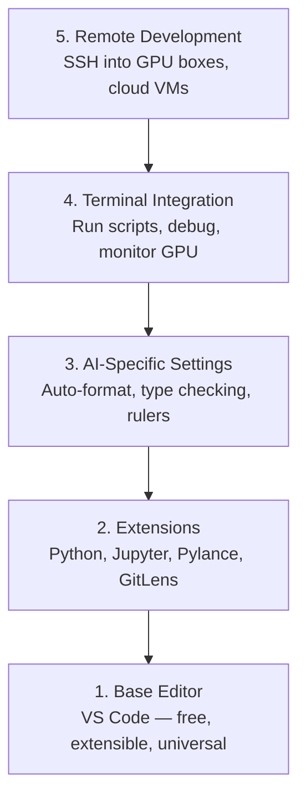

# 编辑器配置

> 你的编辑是你的副飞行员, 设置它一次, 让它远离你的道路,
> 编辑器是你的副驾驶. 配置一次,让它不再是问题,而是真正发挥作用.

**Type:** Build | **类型:** 构建
**Languages:** -- | **语言:** 无
**Prerequisites:** Phase 0, Lesson 01 | **前置知识:** Phase 0, 第 01 课
**Time:** ~20 minutes | **时间:** ~20 分钟

## 学习目标

- 安装VS代码,用于Python,Jupyter, linting和远程SSH的基本扩展
  中文翻译:安装 VS Code 及 Python、Jupyter、代码检查和远程SSH等必备扩展
- 配置格式-在保存,类型检查,笔记本表输出滚动 AI 工作流
  中文翻译:配置保存时格式化,类型检查和笔记本 输出滚动等 AI 工作流设置
- 设置远程SSH来编辑和调试远程GPU机器上的代码,好像它们是本地
  中文翻译:设置远程SSH,像编辑本地文件一样编辑和调试远程GPU机器上的代码
- 评估编辑替代方案 (Cursor, Windsurf, Neovim) 和它们对人工智能工作的折衷
  中文翻译:评估编辑器替代方案 (Cursor、Windsurf、Neovim)及其在人工智能工作中的优劣

> **【中文解读】**
> 编辑器是你写代码的主力工具――本章帮你配置 VS代码 用于AI开发:Python 支持、Jupyter 集成、远程SSH 连接GPU 服务器――配置一次,受益整个课程――

## 问题 问题描述

你将花费数千个小时在编辑器里写Python,运行笔记本,调试训练循环,并将SSH插入GPU盒子中.一个错误配置的编辑器将每次会议都变成摩擦:没有自动完成,没有字符提示,没有内线错误,手动格式化和一个拙的终端工作流程.

> 你将在编辑器中花费数千小时编写Python,运行笔记本,调试训练循环,SSH 连接GPU服务器,配置不当的编辑器将使每次编码都变成折磨:没有自动补充,没有类型提示,没有内联错提示,手动格式化,拙的终端工作流.

错过它每天都需要20分钟.

> 准确配置只需要20分钟. 跳过配置会让你每天浪费20分钟.

> **【中文解读】**
> 配置编辑器只需要20分钟,但不配置会让你每天浪费20分钟.

## 概念的核心概念

为了设置人工智能工程编辑器,需要五件事:

> 人工智能工程编辑器需要五层配置:



> **【中文解读】**
> 开发编辑器需要五层配置:基础编辑器 → 扩展插件 → AI 专用设置 → 终端集成 → 远程开发――其中远程SSH 开发是最重要的你需要在本地编辑器中直接操作远程GPU 服务器――
```figure
s0-lsp-roundtrip
```

## 建立它

## 建立它,实现它.

> **【拓展：VS Code 为什么是 AI 开发的首选编辑器】**基于AI的AI 编辑代码,也值得尝试. 基于AI 增强版本的AI 增强版本,也值得尝试.

### 步骤1:安装VS代码

VS Code是推的编辑器. 它是免费的,运行在每个操作系统上,具有一流的Jupyter笔记本电脑支持,扩展生态系统涵盖了你需要的人工智能工作的一切.

> 对于使用者来说,它是免费的,跨平台,有一个流行的Jupyter笔记本,支持,扩展生态覆盖人工智能工作所需的一切.

从[code.visualstudio.com](https://code.visualstudio.com/)现在,我们要去.

> 从[code.visualstudio.com](https://code.visualstudio.com/)下载

在终端检查:

> 在终端验证:

```bash
code --version
```

如果`code`在 macOS 上没有找到,打开 VS Code,按下`Cmd+Shift+P`输入"Shell Command"并选择"安装"代码"命令在PATH中".

> 如果macOS上找不到`code`命令,打开 VS 代码,按 `Cmd+Shift+P`,输入"Shell Command",选择"安装"代码"命令在PATH中"──

### 步骤2:安装必需扩展

> **【中文解读】**开发必备的 VS 代码 扩展:Python(调试+Lint) 、Jupyter(在编辑器中运行笔记本) 、Pylance(智能补充和类型检查) 、GitLens(查看代码历史) ⋅安装后在设置中启动"保存时格式化",从此不用手动整理代码──

打开 VS 代码中的集成终端 (`` Ctrl+```) 并安装对人工智能工作重要的扩展:

> 打开 VS Code 的集成终端(`Ctrl+`` `或 `` Cmd+```),安装 AI 工作所需的关键扩展:

```bash
code --install-extension ms-python.python
code --install-extension ms-python.vscode-pylance
code --install-extension ms-toolsai.jupyter
code --install-extension eamodio.gitlens
code --install-extension ms-vscode-remote.remote-ssh
code --install-extension ms-python.debugpy
code --install-extension ms-python.black-formatter
code --install-extension charliermarsh.ruff
```

每个人都做什么:

> 每个扩展作用:

| Extension | Why |
|-----------|-----|
| Python | Language support, virtual env detection, run/debug |
| Pylance | Fast type checking, autocomplete, import resolution |
| Jupyter | Run notebooks inside VS Code, variable explorer |
| GitLens | See who changed what, inline git blame |
| Remote SSH | Open a folder on a remote GPU box as if it were local |
| Debugpy | Step-through debugging for Python |
| Black Formatter | Auto-format on save, consistent style |
| Ruff | Fast linting, catches common mistakes |

文件`code/.vscode/extensions.json`在本课程中包含了完整的建议列表. 当您打开项目文件时,VS Code将提示您安装它们.

> 本课中`code/.vscode/extensions.json`包含完整的推列表. 当你打开项目文件时,VS代码会提示你安装.

### 步骤3: 设置设置

复制设置`code/.vscode/settings.json`在本课中,或手动应用它们.`Settings > Open Settings (JSON)`现在,我们要去.

> 从本课的`code/.vscode/settings.json`复制设置,或通过`Settings > Open Settings (JSON)`动作应用

人工智能工作的关键设置:

> 工作的关键设置:

```jsonc
{
    "python.analysis.typeCheckingMode": "basic",
    "editor.formatOnSave": true,
    "editor.rulers": [88, 120],
    "notebook.output.scrolling": true,
    "files.autoSave": "afterDelay"
}
```

为什么这些问题重要:

> 为什么这些设置很重要:

- **Type checking on basic**节省对子形状不匹配和错误的API参数的调试时间.
  翻译: 中文**基础类型检查**节省张量形状不匹配和错误API参数调试时间
- **Format on save**黑人可以处理.
  翻译: 中文**保存时格式化**黑色自动处理.
- **Rulers at 88 and 120**黑色包裹在88. 120标记显示了文件串和评论变得太长了.
  翻译: 中文**88 和 120 标尺**黑色在88处换行──120标尺显示文档字符串和注释是否过长──
- **Notebook output scrolling**训练循环打印了数千条线.
  翻译: 中文**Notebook 输出滚动**没有滚动,输出面板会爆.
- **Auto-save**您将忘记保存. 训练脚本将运行过时代码. 自动保存会防止这一点.
  翻译: 中文**自动保存**您会忘记保存. 训练脚本会运行过时的代码.

### 步骤4:终端集成

VS Code的集成终端是你运行训练脚本,监控GPU,管理环境的地方.

> VS Code 的集成终端是你运行训练脚本,监控GPU和管理环境的地方.

设置正确:

> 正确设置:

```jsonc
{
    "terminal.integrated.defaultProfile.osx": "zsh",
    "terminal.integrated.defaultProfile.linux": "bash",
    "terminal.integrated.fontSize": 13,
    "terminal.integrated.scrollback": 10000
}
```

有用的快捷方式:

> 常用快捷键:

| Action | macOS | Linux/Windows |
|--------|-------|---------------|
| Toggle terminal | `` Ctrl+` `` | `` Ctrl+` `` |
| New terminal | `` Ctrl+Shift+` `` | `` Ctrl+Shift+` `` |
| Split terminal | `Cmd+\` | `Ctrl+Shift+5` |

分开终端是有用的:一个用于运行脚本,一个用于监控GPU`nvidia-smi -l 1`或`watch -n 1 nvidia-smi`现在,我们要去.

> 分屏终端很有用:一个运行脚本,一个用`nvidia-smi -l 1`或`watch -n 1 nvidia-smi`监控GPU.

### 步骤5:远程开发 (SSH 连接到GPU盒子)

> **【拓展：Remote SSH 是 AI 开发的杀手级功能】**大多数人没有本地GPU,需要SSH到远程GPU服务器训练模型──VS Code的远程SSH 扩展让你像编辑本地文件一样编辑远程代码自动补充,调试,终端都可用──这意味着你可以在轻薄本上开发,在远端A100上训练──

远程SSH允许您打开远程文件系统,编辑文件,运行终端,并调试一切,好像是本地.

> 这是在人工智能工作中最重要的扩展. 你将在远程机器上运行训练.

设置:

> 设置步骤:

1. 安装远程SSH扩展 (在步骤2中完成).
2. 打印`Ctrl+Shift+P`(或`Cmd+Shift+P`), 输入"远程SSH:连接到主机".
3. 进入`user@your-gpu-box-ip`现在,我们要去.
4. VS Code自动安装服务器组件在远程机器上.

> 1. 安装远程SSH 扩展(已在步骤 2 完成) 』
> 2. 按 `Ctrl+Shift+P`(或 `Cmd+Shift+P`),输入"远程SSH:连接到主机"──
> 3. 输入`user@your-gpu-box-ip`,我知道.
> 4. VS 代码自动安装其服务器组件在远程机器上.

设置SSH密钥:

> 为了实现无密码访问,设置SSH密钥:

```bash
ssh-keygen -t ed25519 -C "your-email@example.com"
ssh-copy-id user@your-gpu-box-ip
```

添加主机到`~/.ssh/config`为了方便:

> 为了方便的起见,将主机添加到`~/.ssh/config`其他:

```
Host gpu-box
    HostName 203.0.113.50
    User ubuntu
    IdentityFile ~/.ssh/id_ed25519
    ForwardAgent yes
```

现在`Remote-SSH: Connect to Host > gpu-box`接连即时.

> 现在`Remote-SSH: Connect to Host > gpu-box`现在,我们可以连接.

## 替代方案

> **【拓展：AI 增强编辑器对比】**基于VS代码,内置AI编程助手,$20/月) 和windsurf(Codeium 出品,免费层可用) 是2024-2026年兴起的AI原生编辑器.它们的核心优势:使用自然语言描述需求,AI自动生成代码.

### 曲者

[cursor.com](https://cursor.com)通过使用Cursor,本课程中的所有内容仍然适用. 导入相同的`settings.json`其他`extensions.json`现在,我们要去.

> [cursor.com](https://cursor.com)是一个内置的AI代码生成的 VS代码 分支. 它使用相同的扩展态态和设置格式. 如果你使用Cursor,本课程的所有内容仍然适用.`settings.json`和 `extensions.json`现在,我可以.

### 风冲浪

[windsurf.com](https://windsurf.com)类似的故事:相同的扩展,相同的设置格式,相同的远程SSH支持.

> [windsurf.com](https://windsurf.com)是另一个 AI 优先的 VS 代码 分支. 同样:相同扩展,相同设置格式,相同的远程SSH 支持.

### 维姆/尼奥姆

如果您已经使用Vim或Neovim并且在其中产生效果,请留下来.

> 如果您已经使用Vim或Neovim,并且效率不错,继续使用.

- **pyright**或**pylsp**进行类型检查 (通过机械或手动安装)
  翻译: 中文**pyright**或**pylsp**用于类型检查 (通过 Mason 或手动安装)
- **nvim-lspconfig**语言服务器集成
  翻译: 中文**nvim-lspconfig**用于语言服务器集成
- **jupyter-vim**或**molten-nvim**用于类似笔记本执行
  翻译: 中文**jupyter-vim**或**molten-nvim**用于类似笔记本的执行
- **telescope.nvim**文件/符号搜索
  翻译: 中文**telescope.nvim**用于文件/符号搜索
- **none-ls.nvim**黑色和色,用于格式化/色
  翻译: 中文**none-ls.nvim**配合黑色和,用于格式化/

如果您还没有使用Vim,请不要现在开始.学习曲线将与学习人工智能工程竞争.使用VS代码.

> 如果你还没有使用Vim,现在不要开始――学习曲线会和学习AI工程竞争――使用VS代码――

## 用它使用指南

> **【中文解读】**推配置:VS Code + Python + Jupyter + 远程SSH──如果使用远程GPU 服务器,远程SSH 是必不可少的──调试训练循环时,Jupyter 扩展让你在编辑器内直接查看张量形状和损失曲线──

通过这种设置,你的日常工作流程看起来像:

> 现在,你每天的工作流程是这样的:

1. 在 VS Code 中打开项目文件 (或通过远程SSH连接到 GPU 框).
   中文翻译:在 VS Code 中打开项目文件(或通过远程SSH 连接到GPU 服务器) 』
2. 在编辑器中写Python,使用自动完成,输入提示和内行错误.
   中文翻译:在编辑器中编写Python,享受自动补充,类型提示和内联错误提示.
3. 运行Jupyter笔记本,与Jupyter扩展一致.
   中文翻译:使用Jupyter 扩展内嵌运行笔记本.
4. 使用集成终端进行训练脚本,`uv pip install`并且监控GPU.
   中文翻译:使用集成终端运行训练脚本,`uv pip install`和GPU监控.
5. 在提交之前,请使用 GitLens 进行修改.
   中文翻译:提交前用 GitLens 检查变更。

## 练习题

1. 安装 VS 代码和列出的扩展
   安装 VS 代码 和步骤 2 中列出的所有扩展
2. 复制`settings.json`从这个课程开始,你将VS代码配置
   将本课的`settings.json`复制到你的 VS 代码配置中
3. 打开一个Python文件,并验证Pylance显示保存时的类型提示和黑色格式
   打开一个Python文件,验证Pylance 显示类型提示、黑色 保存时自动格式化
4. 如果您有远程机器的访问权限,设置远程SSH,并打开一个文件
   如果有远程机器,设置远程SSH并打开远程文件

## 关键词 关键词

| Term | What people say | What it actually means |
|------|----------------|----------------------|
| LSP | "Autocomplete engine" | Language Server Protocol: a standard for editors to get type info, completions, and diagnostics from a language-specific server |
| Pylance | "The Python plugin" | Microsoft's Python language server using Pyright for type checking and IntelliSense |
| Remote SSH | "Working on the server" | VS Code extension that runs a lightweight server on a remote machine and streams the UI to your local editor |
| Format on save | "Auto-prettier" | The editor runs a formatter (Black, Ruff) every time you save, so code style is always consistent |

| 术语 | 俗称 | 实际含义 |
|------|------|---------|
| LSP | "自动补全引擎" | 语言服务器协议：编辑器获取类型信息、补全和诊断的标准 |
| Pylance | "Python 插件" | 微软的 Python 语言服务器，提供类型检查和智能提示 |
| Remote SSH | "在服务器上开发" | VS Code 在远程机器上运行轻量服务器，将 UI 传输到本地编辑器 |
| Format on save | "保存时自动格式化" | 每次保存时自动运行格式化工具，保持代码风格一致 |
